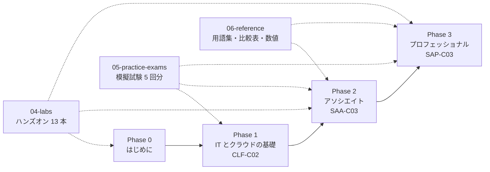
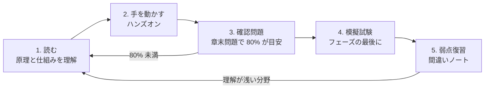

[ホーム](../README.md) > [Phase 0: はじめに](README.md) > 学習の進め方

# 学習の進め方

> **この章のゴール**
> - この教材の構成（Phase 0〜3・ハンズオン・模擬試験・リファレンス）と、それぞれの使い方を説明できる
> - 「読む → 手を動かす → 確認問題 → 模擬試験 → 弱点復習」の学習サイクルを回せる
> - 「理解すべきこと」と「覚えればよいこと」を切り分けて学習できる
> - 公式ドキュメントや日本語の公式学習コンテンツを、目的に応じて使い分けられる
> - 生成 AI を安全かつ効果的に学習に取り入れられる
>
> **対応試験**: 全試験共通（CLF-C02 / SAA-C03 / SAP-C03）
> **目安時間**: 読む 30分

## この章の全体像

この教材は、AWS を触ったことがない状態から、AWS 認定の中でも特に難しいとされる **AWS Certified Solutions Architect – Professional（SAP-C03）** の合格までを、一本の道でつなぐことを目指しています。

道のりは 6〜12 か月と長く、途中で「何をどこまでやればよいか」を見失いがちです。そこで最初に、**教材の構造** と **学習の回し方** を決めておきます。



実線が学習の本線（Phase 0 → 3）、点線が本線と並行して使うパーツです。本線の章を読み、同じ週のうちにハンズオンで手を動かし、フェーズの最後に模擬試験で仕上がりを確かめる、というリズムで進みます。

## 1. この教材の構成と使い方

### 1.1 パーツの一覧

| パーツ | 場所 | 内容 | 使い方 |
|---|---|---|---|
| Phase 0 はじめに | [00-start](README.md) | 学習法・認定の仕組み・学習計画・アカウント準備 | 最初に通読する。学習計画は月に 1 回見直す |
| Phase 1 基礎 | [01-foundations](../01-foundations/README.md) | IT の基礎（ネットワーク・サーバー・セキュリティ・データベース）とクラウドの基礎。CLF-C02 レベル | 用語と考え方に慣れる。IT 経験者は確認問題で理解度を確かめながら速習してよい |
| Phase 2 アソシエイト | [02-associate](../02-associate/README.md) | 主要サービスの仕組みと設計の定石。SAA-C03 レベル | 教材全体の土台。ハンズオンとセットで最も時間をかける |
| Phase 3 プロフェッショナル | [03-professional](../03-professional/README.md) | マルチアカウント、ハイブリッドネットワーク、移行、生成 AI、大規模環境のコスト最適化。SAP-C03 レベル | Phase 2 の知識を前提に、トレードオフを比較して選ぶ力を鍛える |
| ハンズオン | [04-labs](../04-labs/README.md) | 13 本の実習（AWS CloudShell + AWS CLI / AWS CloudFormation が基本） | 対応する章を読んだら、同じ週のうちに実施する。**後片付けまでが 1 セット** |
| 模擬試験 | [05-practice-exams](../05-practice-exams/README.md) | CLF 65 問、SAA 65 問 × 2 回、SAP 40 問 × 2 回 | 各フェーズの最後に、本番と同じペースで解く |
| リファレンス | [06-reference](../06-reference/README.md) | 用語集、サービス早見表、比較表、覚えたい数値、問題文キーワード、サービスの変更点、学習リソース | 辞書として引き、試験直前の総復習に使う |

### 1.2 各章の読み方

Phase 1〜3 の学習章は、すべて同じ構成になっています。

1. **この章のゴール** — 読み終えたときに「できるようになること」。最初に読んで、**自分への質問** に変えておきます（例: 「Multi-AZ とリードレプリカを使い分けられる」→「両者の目的の違いは何か？」）。
2. **この章の全体像** — 図でこの章が解決する課題をつかみます。
3. **本文** — 原理 → 仕組み → 使いどころ → 試験での問われ方、の順に書かれています。
4. **まとめ** — 要点の箇条書き。復習のときはここから読みます。
5. **確認問題** — 本番形式の問題。解答は折りたたまれています。
6. **次のステップ** — 関連ハンズオン、次の章、公式ドキュメント。

本文中には、次の囲み（ボックス）が出てきます。意味を覚えておくと、復習の効率が上がります。

| ボックス | 意味 | 使い方 |
|---|---|---|
| `[!TIP]` 試験のポイント | 試験で正解を選ぶための判断基準・キーワード | 間違いノートや自作の暗記カードに転記して反復する |
| `[!WARNING]` ひっかけ注意 | 取り違えやすい点、誤答の選択肢になりやすい点 | 「なぜ違うのか」を一言で説明できるようにする |
| `[!NOTE]` 補足 | 背景知識や発展的な話題 | 1 回目は流し読みでもよい |
| `[!IMPORTANT]` 重要 | 必ず押さえるべき事項 | 理解できるまで読み直す |
| `[!CAUTION]` 注意 | コスト・セキュリティ上の注意（主にハンズオン） | 例外なく守る |

実際には次のように表示されます。

> [!TIP]
> **試験のポイント**: 「運用上のオーバーヘッドが最も少ない」とあれば、まずマネージドサービスやサーバーレスの選択肢を検討します。自分でサーバーを構築・パッチ適用する選択肢は、要件を満たしていても不正解になりやすいです。

> [!WARNING]
> **ひっかけ注意**: 「可用性を高める」ための仕組みと「読み取り性能を高める」ための仕組みは別物です。たとえば Amazon RDS の Multi-AZ 配置は主に可用性のため、リードレプリカは主に読み取りのスケールのためにあります。

## 2. 推奨学習サイクル

### 2.1 5 つのステップ

この教材では、次のサイクルを章ごと・フェーズごとに回します。



| ステップ | やること | 時間配分の目安 |
|---|---|---|
| 1. 読む | 章を読み、図を自分でも描いてみる。ゴールの質問に答えられるか確かめる | 約 40% |
| 2. 手を動かす | 対応するハンズオンを実施し、後片付けまで終える | 約 25% |
| 3. 確認問題 | 章末問題を、解答を見ずに解く。正答率を記録する | 約 15% |
| 4. 模擬試験 | フェーズの最後に、本番と同じペースで通しで解く | 約 5% |
| 5. 弱点復習 | 間違えた問題の「間違えた理由」を分析し、該当箇所を読み直す | 約 15% |

### 2.2 各ステップのコツ

**1. 読む** — 1 回目は完璧を目指さず、7 割の理解で先へ進みます。分からない箇所には印を付けておき、後の章やハンズオンで理解できたら印を消します。読み終えたら、章の要点を **何も見ずに 3 分で説明** できるか試してください。説明に詰まったところが、理解が浅いところです。

**2. 手を動かす** — 「セキュリティグループはステートフル」と読むより、実際に通信を通して確かめたほうが記憶に残ります。ハンズオンは読んだ直後（遅くとも同じ週）に行い、**必ず後片付けまで終えます**。リソースの消し忘れは、学習でいちばん多いコスト事故の原因です。

**3. 確認問題** — 正解したかどうかより、**正解の理由と、ほかの選択肢が不正解になる理由を言えるか** が大切です（5 章で詳しく説明します）。正答率が 80% に届かなければ、本文に戻ります。

**4. 模擬試験** — フェーズの最後に、時間を計って通しで解きます。1 回目の点数が、そのフェーズの実力の最も正直な指標です。

**5. 弱点復習** — 間違えた問題を **間違いノート** に記録します。書くのは正解そのものではなく「なぜ間違えたか」です。間違いの原因は、たいてい次の 4 つのどれかに分類できます。

| 原因 | 例 | 対策 |
|---|---|---|
| 知識不足 | サービスの存在や機能を知らなかった | 該当章を読み直し、公式ドキュメントで補う |
| 読み違い | 「最もコスト効率の高い」を見落とした | 問題文の制約語に印を付けるクセをつける |
| 2 択で迷った | 似た選択肢の違いを説明できない | 比較表で違いを整理する |
| 時間切れ・集中切れ | 後半で雑になった | 時間配分を決め、見直しフラグを活用する |

> [!IMPORTANT]
> 間違いノートのテンプレートは [学習計画と進捗管理](03-study-plan.md) にあります。模擬試験の前日にノートを見返すだけでも、同じ間違いを大きく減らせます。

## 3. 「理解」と「暗記」の切り分け

AWS の学習では、覚えることが膨大に見えます。しかし、**原理を理解していれば覚えなくてよいこと** がたくさんあります。逆に、数値や名称は理解だけでは出てこないので、割り切って反復します。

| 種類 | 例 | 学び方 |
|---|---|---|
| 原理（理解する） | 責任共有モデル、セキュリティグループ（ステートフル）とネットワーク ACL（ステートレス）の違い、疎結合にすると障害が波及しにくくなる理由 | 図を描く、人に説明する、ハンズオンで確かめる |
| 判断基準（理解＋反復） | 「運用上のオーバーヘッドが最も少ない」→ マネージドサービス、「読み取りが集中する」→ キャッシュやリードレプリカ | 問題演習で「制約語 → 選択」を繰り返す |
| 数値・上限（覚える） | AWS Lambda 関数 1 回の実行時間の上限は 15 分、Amazon DynamoDB の項目サイズ上限は 400 KB、Amazon SQS のメッセージサイズ上限は 1 MiB | [覚えておきたい数値](../06-reference/numbers-to-remember.md) で間隔を空けて反復する |
| 名称（覚える） | サービス名・機能名（英語表記）、旧名称と新名称の対応 | [用語集](../06-reference/glossary.md) と [サービスの変更点](../06-reference/service-changes.md) で確認する |

たとえば「Lambda 関数の実行時間の上限は 15 分」という数値は、覚えるしかありません。しかし「だから数時間かかるバッチ処理を 1 回の Lambda 実行で行う選択肢は不正解になる」という判断は、原理と数値を組み合わせた **理解** です。数値は単独で覚えず、**その数値が判断を分ける場面** とセットで覚えましょう。

> [!WARNING]
> **ひっかけ注意**: 数値や仕様は変わります。たとえば SQS のメッセージサイズ上限は、2025年8月に 256 KiB から **1 MiB** に引き上げられました。試験問題や古い教材では 256 KB のまま出題・記載されている可能性があります。本教材では現在の仕様を教え、古い情報との違いがある箇所には注記を付けています。

## 4. 公式情報の読み方

この教材は、公式情報を読み解くための「地図」です。仕様の最終的な根拠は、常に AWS の公式情報にあります。目的に応じて次の情報源を使い分けます。

| 情報源 | 言語 | 向いている用途 | おすすめの時期 |
|---|---|---|---|
| [ユーザーガイド（AWS ドキュメント）](https://docs.aws.amazon.com/) | 英語（日本語訳あり） | 仕様の一次情報。「What is 〜?」やクォータ（上限値）のページ | Phase 2〜3 |
| よくある質問（FAQ） | 英語・日本語 | 「できる / できない」の境界の確認。試験で問われやすい | Phase 1〜3 |
| [ホワイトペーパー](https://aws.amazon.com/whitepapers/) と [AWS Well-Architected](https://aws.amazon.com/architecture/well-architected/) | 英語（一部日本語） | 設計の考え方、ベストプラクティス | Phase 2 後半〜3 |
| [AWS Black Belt Online Seminar](https://aws.amazon.com/jp/events/aws-event-resource/archive/) | 日本語 | サービスごとの体系的な解説（スライド・動画） | 全フェーズ |
| AWS Hands-on for Beginners | 日本語 | 動画を見ながら手を動かす入門コース | Phase 1〜2 |
| re:Invent などのセッション動画 | 英語（一部日本語字幕） | 最新の設計パターン、上級者向けの深い解説 | Phase 3 |
| [Amazon Builders' Library](https://aws.amazon.com/builders-library/) | 英語 | Amazon 自身の分散システム設計・運用の知見 | Phase 3 |
| [AWS Skill Builder](https://skillbuilder.aws) | 英語・日本語 | 公式の練習問題・試験対策コース・ゲーム形式の学習 | 各フェーズの終盤 |

### 4.1 ユーザーガイドの読み方

AWS のドキュメントは膨大なので、頭から読むのではなく、次の順に「つまみ読み」します。

1. **What is 〜?**（〜とは）: サービスが解決する課題と主要な概念
2. **How it works / Concepts**（仕組み・概念）: 構成要素と動作の流れ
3. **Quotas**（クォータ・上限値）: 試験で問われる数値の一次情報
4. **料金ページ**: 何に対して課金されるか（時間、リクエスト数、データ量など）
5. **FAQ**: 「〜はできますか？」形式で、機能の境界が短くまとまっている

> [!TIP]
> **試験のポイント**: 試験では「その機能で要件を満たせるか / 満たせないか」の境界がよく問われます。FAQ は、この境界を短い問答で確認できる、試験対策に非常に効率のよい資料です。

### 4.2 日本語の公式コンテンツ

- **AWS Black Belt Online Seminar**: AWS のソリューションアーキテクトが、サービスごとに日本語で解説するセミナーです。スライドと動画が公開されています。一覧は [AWS Black Belt Online Seminar とは](https://aws.amazon.com/jp/blogs/news/aws-blackbelt-overview/) からたどれます。資料の **作成日** を必ず確認し、古い資料は最新のドキュメントと照らし合わせてください。
- **AWS Hands-on for Beginners**: 動画を見ながら実際に AWS を操作する初心者向けコースです。個別のコースは公開が続いていますが、以前の一覧ページは移転しています。[JP Contents Hub](https://aws-samples.github.io/jp-contents-hub/)（日本語コンテンツの索引）から探してください。
- **AWS ブログ（日本語）**: 新機能の解説や、学習方法の記事があります。例: [2026 年版の初学者向け学習ガイド](https://aws.amazon.com/jp/blogs/news/2026-aws-beginner-learning/)。

### 4.3 上級者向けの情報源（Phase 3 から）

- **re:Invent のセッション**: 毎年開催される AWS 最大の技術カンファレンスです。セッションには 100（入門）〜 400（エキスパート）のレベルが付いています。SAP-C03 の準備では、アーキテクチャ系の 300〜400 レベルのセッションが役立ちます。
- **Amazon Builders' Library**: 「タイムアウト、再試行、ジッターを伴うバックオフ」「アベイラビリティーゾーンを使用した静的安定性」「シャッフルシャーディング」など、Amazon が実際に大規模システムを運用して得た設計の知見がまとめられています。SAP-C03 の回復力（レジリエンス）の問題を深く理解する助けになります。

### 4.4 最新情報の追い方

AWS は毎週のように新機能を発表し、ときにはサービスの提供終了も発表します。

- [AWS の最新情報（What's New）](https://aws.amazon.com/new/): すべての新機能の発表が集まる公式ページです。
- 本教材の [サービスの変更点](../06-reference/service-changes.md): 試験対策の観点から、2024〜2026年の廃止・名称変更・新機能を整理しています。

> [!NOTE]
> 試験は、発表された新機能がすぐに出題されるわけではありません。一方で、**新しく提供が終了したサービスを「推奨」する選択肢** は、現在の AWS では誤りになります。本教材では、現在の状態を教えたうえで、古い試験問題との違いを注記します。

## 5. 問題演習のコツ

### 5.1 問題文の構造を読む

AWS 認定の問題は、ほぼ次の構造になっています。

1. **シナリオ**: 「ある企業は、オンプレミスの〜を AWS に移行しようとしています」
2. **要件**: 「データは 99.99% の可用性で提供する必要があります」
3. **制約**: 「既存のアプリケーションコードは変更できません」
4. **問い**: 「**最も運用上のオーバーヘッドが少ない** 方法はどれですか」

解くときは、次の順序を習慣にします。

1. **最後の一文（問い）を先に読み**、何を最優先するのか（コスト？ 運用の手間？ 可用性？）をつかむ
2. 本文を読みながら、**要件と制約語** に印を付ける（頭の中でメモする）
3. 選択肢を、**要件や制約に違反するもの** から消していく
4. 残った 2 つを、問いの「最も〜」の観点で比較する

### 5.2 制約語に注目する

同じシナリオでも、問いの制約語が変わると正解が変わります。代表的な制約語を覚えておきましょう。詳しくは [問題文キーワード→解答 対応表](../06-reference/exam-keywords.md) にまとめています。

| 制約語 | 優先すること | 正解になりやすい方向 |
|---|---|---|
| 最もコスト効率の高い | コスト | 従量課金、スポットインスタンス、ストレージのライフサイクル管理、サーバーレス（要件を満たす範囲で） |
| 運用上のオーバーヘッドが最も少ない | 運用の手間 | マネージドサービス、サーバーレス、自動化 |
| 最小限の変更で / コードを変更せずに | 既存資産を活かす | 設定変更で済む機能、リホスト（そのままの移行） |
| 高可用性 / 耐障害性 | 障害時の継続 | 複数のアベイラビリティーゾーン（AZ）への分散、自動フェイルオーバー |
| レイテンシーが最も低い | 応答の速さ | キャッシュ、エッジロケーション（Amazon CloudFront など） |
| 最も安全な | セキュリティ | 最小権限、暗号化、プライベートな接続、一時的な認証情報 |
| リアルタイム / ほぼリアルタイム | 即時性 | ストリーミング処理、イベント駆動 |
| 疎結合 | 依存関係を減らす | キュー（Amazon SQS）、イベント（Amazon EventBridge、Amazon SNS） |

> [!WARNING]
> **ひっかけ注意**: 「最もコスト効率の高い」選択肢は、**要件を満たしたうえで** 最も安いものです。要件（例: 可用性 99.99%）を満たさない安い選択肢は、どれほど安くても不正解です。

### 5.3 「不正解の理由」を言語化する

確認問題や模擬試験では、正解した問題も含めて、**すべての選択肢について ✓ / ✗ とその理由** を言えるようにします。本教材の解説も「各選択肢の検討」として、この形で書いています。不正解の理由は、たいてい次のどれかです。

- 要件（または制約）に違反している
- 要件は満たすが、運用上のオーバーヘッドが大きい
- 要件は満たすが、コストが高い
- 技術的にできない（例: サービスの上限を超える）
- 提供終了・新規受付終了のサービスを使っている

この「不正解の理由のパターン」を身につけると、知らないサービスが出てきても、消去法で正解にたどり着けるようになります。

### 5.4 間隔反復で忘れにくくする

人は、復習しないと学んだ内容の多くを数日のうちに忘れてしまうことが知られています（エビングハウスの忘却曲線）。そこで、**忘れかけたころに復習する**「間隔反復」を取り入れます。

| タイミング | やること | 所要時間 |
|---|---|---|
| 当日 | 章の「まとめ」を読み直す | 5 分 |
| 翌日 | 前日の確認問題で間違えた問題を解き直す | 10 分 |
| 1 週間後 | 間違いノートを見返し、要点を声に出して説明する | 15 分 |
| 1 か月後 | 同じフェーズの章末問題をランダムに解き直す | 30 分 |

通勤時間やすき間時間は、[覚えておきたい数値](../06-reference/numbers-to-remember.md) や [比較表集](../06-reference/comparison-tables.md) の見直しに向いています。

### 5.5 模擬試験の点数の見方

- **本番のスコアは正答率ではありません**。本番は 100〜1000 点のスケールスコアで、試験の版ごとの難易度の差が調整されます。また、採点対象外の問題も含まれます（詳しくは [AWS 認定の全体像と試験の仕組み](02-certification-map.md)）。
- **目標は初回 80% 以上** です。本教材の模擬試験は本番の難易度に近づけていますが、本番には未知の問題も出るため、余裕を持たせます。
- **2 回目以降の点数は当てになりません**。答えを覚えているからです。2 回目は点数ではなく、「各選択肢の検討を自分の言葉で説明できるか」で評価します。
- **分野ごとに正答率を出します**。合計点が合格ラインでも、特定の分野が極端に低い場合は、本番で出題が偏ると不合格になり得ます。
- **時間配分も記録します**。本番の 1 問あたりの時間は、CLF-C02 が約 1.4 分（90 分 / 65 問）、SAA-C03 が約 2 分（130 分 / 65 問）、SAP-C03 が約 2.4 分（180 分 / 75 問）です。本教材の SAP 模擬試験（40 問）は、1 問 2.4 分のペースで約 1 時間 40 分を目安に解きます。

> [!TIP]
> **試験のポイント**: 本番の試験画面では、問題に「見直し」の印を付けて後から戻れます。1 問に時間をかけすぎず、迷った問題は仮の解答を選んで印を付け、先に進みましょう。未回答は不正解として扱われるため、**空欄のまま終えることは絶対に避けます**。

## 6. 学習時間の目安

必要な学習時間は、これまでの経験によって大きく変わります。次の表は、本教材をすべて（Phase 0・ハンズオン・模擬試験を含めて）進めた場合の目安です。

| バックグラウンド | CLF-C02 まで | SAA-C03 まで | SAP-C03 まで | 合計 | 対応するプラン |
|---|---|---|---|---|---|
| IT 未経験 | 100〜130 時間 | 150〜200 時間 | 200〜250 時間 | 450〜580 時間 | じっくり（約 12 か月） |
| 開発者・IT の基礎あり | 60〜90 時間 | 110〜150 時間 | 170〜220 時間 | 340〜460 時間 | 標準（約 9 か月） |
| インフラ経験者 | 10〜30 時間（スキップ可） | 80〜120 時間 | 150〜200 時間 | 240〜350 時間 | 短縮（約 6 か月） |

- 各列は、その試験のための **追加の** 学習時間です（例: SAA-C03 の列は、CLF-C02 に合格したあとの時間）。
- 「インフラ経験者」は、サーバーやネットワークの構築・運用の実務経験がある人を想定しています。AWS の実務経験があれば、さらに短くなります。
- 時間はあくまで目安です。大切なのは時間数ではなく、[学習計画と進捗管理](03-study-plan.md) で示す **各フェーズの完了基準** を満たすことです。

> [!NOTE]
> SAP-C03 は、SAA-C03 の知識を前提に、より広い範囲（マルチアカウント、移行、ハイブリッド、生成 AI など）と、より複雑なシナリオを扱います。SAA-C03 に合格した直後に SAP-C03 の問題を解くと、半分も正解できないことは珍しくありません。焦らず、Phase 3 の章を順に進めてください。

## 7. 英語ドキュメントとの付き合い方

### 7.1 サービス名・用語は英語で覚える

日本語の試験でも、サービス名や機能名は **英語表記のまま** 出題されます（例: Amazon S3、AWS Lambda、Amazon Route 53）。本教材もサービス名は公式の英語表記で書いています。日本語の用語も、英語と対応させて覚えておくと、英語のドキュメントや日本語試験の訳語の揺れに強くなります。

| 英語 | 日本語（ドキュメント・試験） | 注意点 |
|---|---|---|
| Resilience / Resilient | 回復力 / 弾力性 | SAA-C03 の分野名「弾力性に優れたアーキテクチャの設計」は Resilient Architectures の訳 |
| Elasticity | 伸縮性 | 需要に応じて増減できる性質。Resilience と混同しない |
| Availability | 可用性 | サービスを利用できる時間の割合 |
| Durability | 耐久性 | データが失われない確率。S3 の「99.999999999%（イレブンナイン）」は耐久性の値 |
| Fault tolerance | 耐障害性 | 障害が起きても停止せずに動き続ける性質 |
| Loosely coupled / Decoupling | 疎結合 / 分離 | 構成要素の依存関係を弱めること |
| Eventual consistency | 結果整合性 | すぐには反映されないが、最終的には一致する |
| Idempotent | べき等 | 何回実行しても結果が同じになる性質 |
| Least privilege | 最小権限 | 必要な権限だけを与える原則 |
| Operational overhead | 運用上のオーバーヘッド | 構築・運用にかかる手間 |

### 7.2 日本語ドキュメントを使うときの注意

- AWS ドキュメントの日本語版は、**英語版から翻訳** されています。一部は機械翻訳で、更新が英語版より遅れることがあります。内容が食い違う場合や分かりにくい場合は、ページの言語を英語に切り替えて確認してください（英語版が原文です）。
- ブラウザーの機械翻訳は、サービス名や機能名まで訳してしまうことがあり、検索や試験の用語と一致しなくなります。**用語は原文のまま** 読む習慣をつけましょう。
- 日本語で受験する場合でも、試験中に問題文を英語表示に切り替えて原文を確認できます（試験の仕様は変わることがあるので、受験前に [AWS 認定の FAQ](https://aws.amazon.com/certification/faqs/) で確認してください）。訳語に違和感があるときの助けになります。

## 8. 生成 AI（Claude など）の上手な使い方と注意

生成 AI は、使い方しだいで強力な「個人教師」になります。一方で、そのまま信じると誤った知識を覚えてしまう危険もあります。

### 8.1 効果的な使い方

| 使い方 | 例 |
|---|---|
| 概念を別の角度から説明してもらう | 「VPC のルートテーブルを、郵便の配達にたとえて説明して」 |
| 比較表を作ってもらう | 「SQS / SNS / EventBridge を、配信方式・1 対多・フィルタリングの観点で比較して」 |
| 自分の説明を添削してもらう | 自分で書いた「責任共有モデルの説明」を貼り、誤りや不足を指摘してもらう |
| 間違えた問題の理解を深める | 本教材の問題で自分が選んだ選択肢と考え方を伝え、どこで判断を誤ったかを分析してもらう |
| 英語ドキュメントの要約 | 公式ドキュメントの英文を貼り、要点を日本語で整理してもらう |
| 練習問題の作成 | 「Amazon S3 のストレージクラスについて、本番形式の 4 択問題を 3 問作って」 |

たとえば、間違えた問題の分析には次のように依頼します。

```text
あなたは AWS 認定のインストラクターです。
次の問題で、私は B を選びましたが、正解は D でした。
（ここに本教材の問題文と選択肢を貼る）
1. 私の判断がどこで誤っていたかを、問題文の制約語に注目して説明してください。
2. 各選択肢が正解・不正解になる理由を 1 行ずつ示してください。
3. 根拠となる AWS 公式ドキュメントのページ名を挙げてください。
不確かな点は「不確か」と明記してください。
```

### 8.2 必ず守る注意点

1. **情報の鮮度**: 生成 AI の知識は、学習データの時点で止まっています。サポートプランの再編、SQS の上限の変更、サービスの提供終了など、最近の変化を知らないことがあります。**数値・料金・サービスの提供状況は、必ず公式ドキュメントで確認** します。
2. **もっともらしい誤り**: 存在しない機能、API、オプション、上限値を、自信ありげに答えることがあります。根拠のページ名を挙げてもらい、自分で公式ドキュメントを開いて確かめましょう。提案された AWS CLI コマンドは、まず情報を読むだけのコマンド（`describe` や `list` など）で試します。
3. **機密情報を入力しない**: アクセスキー、パスワード、会社のアカウント情報や顧客データは、決して入力しません。
4. **試験のルールを守る**: AWS 認定の受験規約では、**試験問題の内容を他者と共有することが禁止** されています。本番で見た問題を再現して AI に質問したり、本番の問題を集めたと称する「問題集（いわゆるダンプ）」を使ったりすることは規約違反で、認定の取り消しなどの対象になり得ます。

> [!NOTE]
> AWS のマネジメントコンソールに組み込まれた Amazon Q に、AWS について質問することもできます。どの AI を使う場合でも、「最終確認は公式ドキュメント」という原則は同じです。

## 9. 挫折しないための工夫

数か月にわたる学習では、モチベーションが下がる時期が必ず来ます。挫折しにくい仕組みを、最初から用意しておきましょう。

- **学習ログをつける**: 毎回、学習時間と「わかったこと」を 1〜3 行で記録します。積み上がった記録は、やる気が下がったときの支えになります。テンプレートは [学習計画と進捗管理](03-study-plan.md) にあります。
- **小さなゴールを刻む**: 「SAP 合格」だけでは遠すぎます。「今週は VPC の章とハンズオン」「今月末に CLF-C02 の模擬試験で 80%」のように、1〜4 週間で達成できるゴールを置きます。
- **時間と場所を固定する**: 「平日の朝 6 時から 1 時間」「土曜の午前はハンズオン」のように決めると、意思の力に頼らず続けられます。
- **完璧主義を捨てる**: 1 回目の通読は 7 割の理解で十分です。分からないところで 30 分以上止まったら、印を付けて先に進みます。後の章やハンズオンで、自然に理解できることが多いです。
- **進捗を見える化する**: [学習計画と進捗管理](03-study-plan.md) のチェックリストに印を付けていくと、残りの量が一目で分かります。
- **仲間を作る**: 同じ目標を持つ仲間がいると、続けやすくなります。
  - [JAWS-UG（AWS User Group – Japan）](https://jaws-ug.jp/): 全国に支部があり、初心者向けの勉強会も開かれています。
  - AWS 公式のイベント: 毎年開催される AWS Summit Japan や、オンラインのセミナーがあります。
  - [AWS re:Post](https://repost.aws/): AWS 公式の Q&A コミュニティです。
  - SNS で学習記録を発信すると、同じ試験を目指す人とつながれます。
- **休む日を決める**: 週に 1 日は学習しない日を作ります。疲れたまま続けるより、結果的に速く進みます。

## まとめ

- この教材は **Phase 0〜3 の本線** と、それを支える **ハンズオン・模擬試験・リファレンス** で構成されている
- 学習は「**読む → 手を動かす → 確認問題 → 模擬試験 → 弱点復習**」のサイクルで回す
- 原理は図と説明で **理解** し、数値・名称はリファレンスで **間隔を空けて反復** する
- 仕様の根拠は常に **公式ドキュメント**。日本語の Black Belt や Hands-on for Beginners も活用する
- 問題演習では **制約語** に注目し、**不正解の理由** まで言語化する
- 模擬試験は **初回 80% 以上** が目標。2 回目以降の点数は当てにしない
- サービス名・用語は **英語表記** で覚え、日本語訳の揺れに備える
- 生成 AI は便利だが、**最新情報は必ず公式で確認** し、機密情報や試験内容は入力しない
- 学習ログ・小さなゴール・仲間で、**続けられる仕組み** を作る

## この章のチェックリスト

- [ ] 教材のパーツ（Phase 0〜3、ハンズオン、模擬試験、リファレンス）の役割を説明できる
- [ ] 5 つのステップの学習サイクルと、間違いノートの目的を説明できる
- [ ] 代表的な制約語（コスト効率、運用上のオーバーヘッド、最小限の変更 など）の意味を説明できる
- [ ] 自分のバックグラウンドに近い学習時間の目安を確認した
- [ ] 生成 AI を使うときの 4 つの注意点を説明できる

## 次のステップ

- 次の章: [AWS 認定の全体像と試験の仕組み](02-certification-map.md) — 目指す試験の仕組みを知ります。
- 学習リソースの一覧: [学習リソース集](../06-reference/resources.md)
- 公式: [AWS Skill Builder](https://skillbuilder.aws)（無料の公式練習問題や試験対策コースがあります）

---
[← 前へ: Phase 0 目次](README.md) | [目次](README.md) | [次の章: AWS 認定の全体像と試験の仕組み →](02-certification-map.md)
