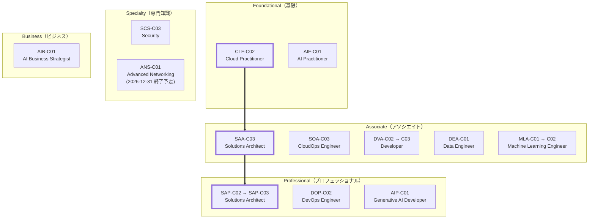
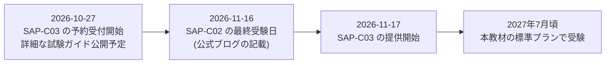
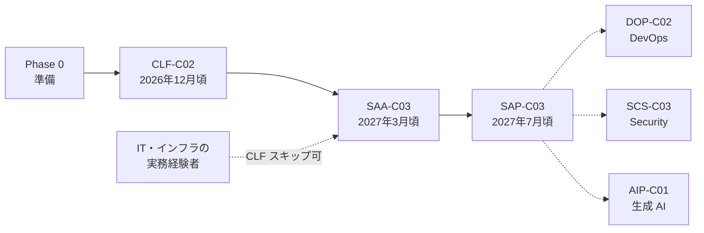
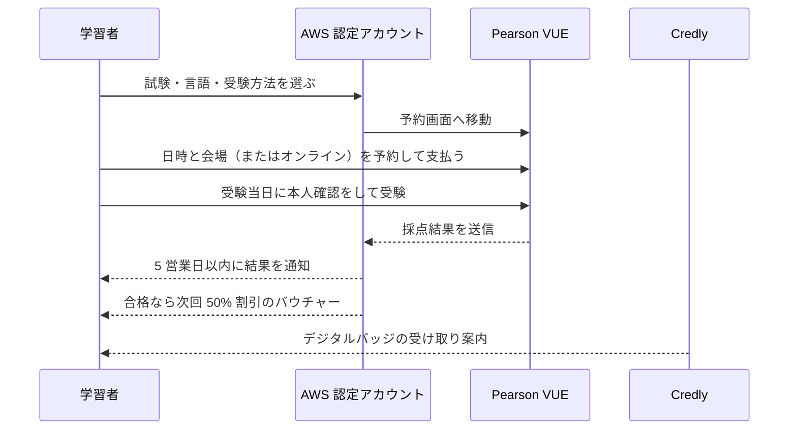

[ホーム](../README.md) > [Phase 0: はじめに](README.md) > AWS 認定の全体像と試験の仕組み

# AWS 認定の全体像と試験の仕組み

> **この章のゴール**
> - AWS 認定の体系（レベル・試験コード・問題数・時間・料金・合格点）を説明できる
> - SAP-C03 をはじめとする 2026 年の試験改訂の内容と日程を把握している
> - スケールスコアと補償型スコアリングの仕組みを理解し、「全問に回答する」理由を説明できる
> - 受験方法、再受験ポリシー、有効期間と再認定の仕組みを説明できる
> - SAP-C02 と SAP-C03 のどちらを受験するかを判断できる
>
> **対応試験**: 全試験共通（CLF-C02 / SAA-C03 / SAP-C03）
> **目安時間**: 読む 35分 / 確認問題 10分

> [!IMPORTANT]
> この章の試験情報は **2026年9月28日時点** のものです。料金・日程・ポリシーは変更されることがあります。申し込みの前に、必ず [AWS 認定の公式ページ](https://aws.amazon.com/jp/certification/) と [試験ガイドの一覧](https://docs.aws.amazon.com/aws-certification/latest/examguides/aws-certification-exam-guides.html) で最新の情報を確認してください。

## この章の全体像

AWS 認定は、**レベル**（Foundational → Associate → Professional）と **分野**（Specialty など）の組み合わせで構成されています。本教材が目指すのは、図の太枠でたどる **CLF-C02 → SAA-C03 → SAP-C03** のルートです。

## 1. AWS 認定の体系（2026年9月時点）

### 1.1 レベルの考え方

| レベル | 対象 | 試験ガイドが想定する経験の目安 |
|---|---|---|
| Foundational（基礎） | クラウドの概念と AWS の全体像。営業・企画など IT 以外の職種も対象 | CLF-C02: AWS に触れた期間が最長 6 か月程度 |
| Associate（アソシエイト） | 特定の役割（設計・運用・開発・データ・機械学習）で AWS を使いこなす力 | SAA-C03: AWS を使った設計の実務経験 1 年以上 |
| Professional（プロフェッショナル） | 複雑な要件・大規模な環境での高度な設計と運用 | SAP-C02: AWS を使った設計・実装の経験 2 年以上 |
| Specialty（専門知識） | セキュリティやネットワークなど、特定分野の深い知識 | 分野ごとに異なる |
| Business（ビジネス） | AI をビジネス戦略に活かす立場向け（2026年に新設） | ― |

> [!NOTE]
> AWS 認定には **受験資格（前提となる認定）はありません**。いきなり SAP を受けることもできます。ただし、上の表の「想定する経験」は難易度の目安として参考になります。本教材は、実務経験がなくても段階を踏んでこの差を埋められるように設計しています。

### 1.2 認定の一覧

料金は、米ドルは公式の英語ページ、日本円は公式の日本語ページの表記です。日本円は税抜で、**消費税が適用される場合があります**（10% の場合、15,000円 → 16,500円、20,000円 → 22,000円、40,000円 → 44,000円）。

| レベル | 認定名 | コード | 問題数（採点対象＋対象外） | 時間 | 料金（USD） | 料金（日本円） | 合格点 |
|---|---|---|---|---|---|---|---|
| Business | AI Business Strategist | AIB-C01 | ベータ版 85 問 | ベータ版 170 分 | ベータ版 50 / 標準版 100 | 15,000円（標準版） | 700 |
| Foundational | Cloud Practitioner | CLF-C02 | 65 問（50＋15） | 90 分 | 100 | 15,000円 | 700 |
| Foundational | AI Practitioner | AIF-C01 | 65 問（50＋15） | 90 分 | 100 | 15,000円 | 700 |
| Associate | **Solutions Architect – Associate** | **SAA-C03** | 65 問（50＋15） | 130 分 | 150 | 20,000円 | 720 |
| Associate | CloudOps Engineer – Associate（旧 SysOps Administrator – Associate） | SOA-C03 | 65 問（50＋15） | 130 分 | 150 | 20,000円 | 720 |
| Associate | Developer – Associate | DVA-C02（2026-12-01 から C03） | 65 問（50＋15） | 130 分 | 150 | 20,000円 | 720 |
| Associate | Data Engineer – Associate | DEA-C01 | 65 問（50＋15） | 130 分 | 150 | 20,000円 | 720 |
| Associate | Machine Learning Engineer – Associate | MLA-C01（2027-01-14 から C02） | 65 問（50＋15） | 130 分 | 150 | 20,000円 | 720 |
| Professional | **Solutions Architect – Professional** | **SAP-C02 → SAP-C03** | 75 問（C02 は 65＋10、C03 の内訳は未公表） | 180 分 | 300 | 40,000円 | C02 は 750（C03 は未公表） |
| Professional | DevOps Engineer – Professional | DOP-C02 | 75 問（65＋10） | 180 分 | 300 | 40,000円 | 750 |
| Professional | Generative AI Developer – Professional | AIP-C01 | 75 問（65＋10） | 180 分 | 300 | 40,000円 | 750 |
| Specialty | Advanced Networking – Specialty | ANS-C01（2026-12-31 終了予定） | 65 問（50＋15） | 170 分 | 300 | 40,000円 | 750 |
| Specialty | Security – Specialty | SCS-C03 | 65 問（50＋15） | 170 分 | 300 | 40,000円 | 750 |

認定名の正式名称は、すべて「AWS Certified 〜」で始まります（例: AWS Certified Solutions Architect – Professional）。

> [!TIP]
> **試験のポイント**: 本教材で受験する 3 試験の数字は、計画を立てるうえで必ず押さえておきましょう。CLF-C02 は **65 問 / 90 分 / 700 点**、SAA-C03 は **65 問 / 130 分 / 720 点**、SAP-C03 は **75 問 / 180 分**（合格点は SAP-C02 と同様であれば 750 点。公式の試験ガイドで要確認）です。

### 1.3 終了した認定・終了予定の認定

| 認定 | 状況 |
|---|---|
| Advanced Networking – Specialty（ANS-C01） | **2026-12-31 が最終受験日の予定**。後継の試験は発表されていない |
| Machine Learning – Specialty（MLS-C01） | 2026-03-31 に終了 |
| Data Analytics – Specialty | 2024-04-08 に終了 |
| Database – Specialty / SAP on AWS – Specialty | 2024-04-29 に終了 |
| SysOps Administrator – Associate（SOA-C02） | 2025-09-29 で終了。後継の SOA-C03（2025-09-30〜）から **CloudOps Engineer – Associate** に名称変更 |

> [!WARNING]
> **ひっかけ注意**: 古い書籍やブログには、終了した Specialty 認定や「SysOps Administrator」という名称が載っていることがあります。認定の体系は毎年のように変わるため、情報源の日付を必ず確認してください。

## 2. 「最高資格」とは何か

AWS 自身は認定に「最高」という順位を付けていません。それでも、SAP が「最難関」「最高峰」と呼ばれることが多いのには理由があります。

1. **範囲が最も広い**: コンピューティング、ネットワーク、ストレージ、データベース、セキュリティ、移行、コスト、マルチアカウントのガバナンスまで、ほぼすべての領域から出題されます。
2. **問題文が長く、選択肢がどれも「動く」**: 数段落のシナリオに複数の要件と制約が埋め込まれ、選択肢はどれも技術的には実現できそうに見えます。その中から「最も要件に合うもの」を選ぶ力が問われます。
3. **時間との戦い**: 180 分で 75 問。長文を読み続ける集中力が必要です。
4. **組織レベルの視点**: 1 つのシステムではなく、数百のアカウントを持つ企業全体の設計や、大規模な移行計画が問われます。

ほかの Professional や Specialty との関係は次のとおりです。

| 認定 | 性格 | 主な範囲 | 向いている人 |
|---|---|---|---|
| SAP（Solutions Architect – Professional） | 最も **広い** | 組織の複雑さへの対応、新規設計、移行、継続的な改善（C03 では生成 AI や回復力エンジニアリングも） | システム全体の設計を担うアーキテクト |
| DOP（DevOps Engineer – Professional） | 運用・自動化に **深い** | CI/CD、IaC、監視とログ、インシデント対応 | 開発と運用の自動化を担うエンジニア |
| AIP（Generative AI Developer – Professional） | 生成 AI に **深い** | 基盤モデルの統合、データ管理、AI の安全性とガバナンス | 生成 AI アプリケーションの開発者 |
| SCS（Security – Specialty） | セキュリティに **特化** | 検出、インシデント対応、インフラ保護、IAM、データ保護 | セキュリティ担当者 |
| ANS（Advanced Networking – Specialty） | ネットワークに **特化** | ハイブリッド接続、大規模ネットワーク設計 | ネットワーク担当者（2026-12-31 終了予定） |

> [!TIP]
> SAP で身につけた幅広い知識は、DOP・SCS・AIP の土台になります。SAP 合格後にこれらを目指すと、重なる範囲が多いぶん効率よく学べます。

## 3. 2026 年の試験改訂

### 3.1 SAP-C03（Solutions Architect – Professional の新バージョン）

本教材の最終目標である SAP は、2026年11月に新バージョンの **SAP-C03** に切り替わります。

| 項目 | 内容 |
|---|---|
| 予約受付の開始 | 2026-10-27（全言語）。詳細な試験ガイドも公開予定 |
| SAP-C02 の最終受験日 | **2026-11-16**（公式ブログの記載。認定ページでは 11-17 の表記もあるため、公式で確認） |
| SAP-C03 の提供開始 | **2026-11-17** |
| 問題数・時間 | 75 問 / 180 分（採点対象と対象外の内訳は未公表） |
| 料金 | 300 USD / 40,000円（日本語ページの税込表記は 44,000円） |
| 合格点 | 未公表（SAP-C02 と同様であれば 750 点。公式の試験ガイドで要確認） |

**分野（ドメイン）は 4 つから 5 つに再編** されます。日本語の正式な分野名は未公表のため、次の表の日本語は本教材の仮訳です。各分野の比重（%）も未公表です。

| # | 分野（英語） | 分野（仮訳） |
|---|---|---|
| 1 | Design and implement cloud-native architectures | クラウドネイティブアーキテクチャの設計と実装 |
| 2 | Security, compliance, and governance | セキュリティ、コンプライアンス、ガバナンス |
| 3 | Design cost-optimized architectures | コストを最適化したアーキテクチャの設計 |
| 4 | Resilience, migration, and business continuity | 回復力、移行、事業継続 |
| 5 | Operational excellence and automation | 運用上の優秀性と自動化 |

参考として、SAP-C02 の分野は次の 4 つでした。

| # | SAP-C02 の分野 | 比重 |
|---|---|---|
| 1 | 組織の複雑さに対応するソリューションの設計 | 26% |
| 2 | 新しいソリューションのための設計 | 29% |
| 3 | 既存のソリューションの継続的な改善 | 25% |
| 4 | ワークロードの移行とモダナイゼーションの加速 | 20% |

SAP-C03 では、SAP-C02 の中核となる設計スキルを引き継いだうえで、次の領域が追加・強化されると発表されています。

| 追加・強化される領域 | 主な内容 | 本教材の対応章 |
|---|---|---|
| 生成 AI・エージェント AI（11 の新スキル） | Amazon Bedrock を組み込む設計、Amazon Bedrock AgentCore による AI エージェントのアーキテクチャ、RAG（検索拡張生成）、Guardrails によるコンテンツフィルタリング、人による監督、コスト管理 | [生成 AI・エージェント AI のアーキテクチャ](../03-professional/09-generative-ai-architecture.md) |
| クラウドネイティブのパターン（7 スキル） | サーバーレスのデータパイプライン、AWS Step Functions による耐久性のあるワークフロー、Amazon VPC Lattice と Amazon ECS Service Connect によるサービスメッシュ、コンテナのセキュリティ | [クラウドネイティブ設計](../03-professional/08-cloud-native-architecture.md) |
| 回復力エンジニアリング | AWS Fault Injection Service（FIS）、AWS Resilience Hub、Amazon Application Recovery Controller（ARC） | [回復力と事業継続](../03-professional/06-resilience-business-continuity.md) |
| DevSecOps と可観測性（6 スキル） | パイプラインでの脆弱性スキャン、マルチアカウントのデプロイパイプライン、コンテナの監視、AI/ML のメトリクス監視、合成モニタリングとリアルユーザーモニタリング | [運用上の優秀性と自動化](../03-professional/12-operational-excellence.md) |
| データと分析（3 スキル） | AWS Lake Formation と Apache Iceberg によるレイクハウス、AWS Clean Rooms | [データと分析のアーキテクチャ](../03-professional/10-data-analytics-architecture.md) |
| 耐量子暗号（ポスト量子暗号） | ML-DSA（デジタル署名）と ML-KEM（鍵交換） | [セキュリティとコンプライアンスのアーキテクチャ](../03-professional/05-security-architecture.md) |

> [!WARNING]
> **ひっかけ注意**: 耐量子暗号について、AWS Key Management Service（AWS KMS）は **ML-DSA の鍵（署名・検証用）** を作成できますが、**ML-KEM の鍵は作成できません**。ML-KEM は、KMS・AWS Certificate Manager（ACM）・AWS Secrets Manager のエンドポイントへの TLS 接続で、X25519 と組み合わせた **ハイブリッド方式の鍵交換** として使われています。

> [!NOTE]
> SAP-C03 の内容は、2026年9月時点の AWS の発表に基づいています。2026-10-27 に公開予定の試験ガイドで、分野の比重と対象サービスの一覧を必ず確認してください。詳しい分析は [SAP-C03 完全ガイド](../03-professional/01-sap-c03-overview.md) で扱います。

### 3.2 そのほかの改訂

| 試験 | 変更の内容 | 日程 |
|---|---|---|
| DVA-C03（Developer – Associate） | AI のセキュリティに関するタスクと、AI を活用した開発が追加。Amazon Bedrock、AgentCore、Amazon Q、Kiro、Amazon Data Firehose、AWS PrivateLink などが範囲に入る。65 問 / 130 分 / 150 USD / 720 点 | 予約受付 2026-10-27、DVA-C02 の最終日 2026-11-30（公式ブログの記載。認定ページでは 12-01 の表記もある）、C03 の提供開始 2026-12-01 |
| MLA-C02（Machine Learning Engineer – Associate） | 改訂版。ベータ試験は英語で 85 問 / 170 分 / 75 USD | ベータ 2026-09-29〜、正式版 2027-01-14〜。MLA-C01 は英語版が 2026-09-28 まで、日本語版は 2027-01-14 まで |
| AIB-C01（AI Business Strategist） | Business レベルの新しい認定 | ベータ 2026-09-29〜（日本語で受験可能）。2027-02-15 までに取得するとアーリーアダプターのバッジ |
| SOA-C03（CloudOps Engineer – Associate） | SysOps Administrator – Associate から名称変更 | 2025-09-30〜 |
| SCS-C03（Security – Specialty） | 改訂版 | 2025-12-02〜 |
| AIP-C01（Generative AI Developer – Professional） | 新しい Professional 認定。Amazon Bedrock AgentCore を含む内容に更新 | 標準の試験は 2026年3月〜 |

最新の改訂予定は、公式の [Coming Soon ページ](https://aws.amazon.com/certification/coming-soon/) で確認できます。

## 4. 本教材の推奨ルート

### 4.1 CLF → SAA → SAP

本教材は、**CLF-C02 → SAA-C03 → SAP-C03** の順に受験するルートを推奨します。点線は、SAP 合格後の発展ルートです。

（日付は [学習計画と進捗管理](03-study-plan.md) の標準プランの例です。）

| 段階 | 目的 |
|---|---|
| CLF-C02 | クラウドの概念、AWS の全体像、請求・料金・サポートの知識を固める。試験の申し込みから受験までの流れに慣れる |
| SAA-C03 | 主要サービスの仕組みと設計の定石を身につける。SAP の前提となる知識のほとんどがここで身につく |
| SAP-C03 | 複雑な要件のもとで、複数の選択肢を比較して最適な設計を選ぶ力を身につける |

### 4.2 CLF をスキップしてよいか

CLF-C02 は受験必須ではありません。次の **すべて** に当てはまる人は、スキップして SAA-C03 から始めても構いません。

- サーバー・ネットワークの構築や運用の実務経験がある
- Phase 1 の各章の確認問題を、初見で 80% 以上正解できる
- 本教材の [CLF-C02 模擬試験](../05-practice-exams/clf-mock-exam.md) で、初見で 80% 以上取れる

一方で、CLF-C02 を受けるメリットもあります。

- **試験に慣れる**: 申し込み、本人確認、試験画面の操作を、難易度の低い試験で経験できます。
- **SAA の受験料が半額になる**: 合格すると、次の試験で使える 50% 割引のバウチャーがもらえます（8 章）。SAA-C03 の受験料 20,000円 が 10,000円になるため、CLF-C02 の受験料 15,000円 のうち実質 10,000円 は取り戻せる計算です（税抜の場合）。
- **請求・サポートの知識**: SAA や SAP ではあまり問われない料金体系やサポートプランを、体系的に学べます。

> [!NOTE]
> CLF-C02 の有効期間中に Associate 以上の試験に合格すると、CLF も自動的に再認定されます（8 章）。先に CLF を取っても、更新の手間は増えません。

### 4.3 SAP 合格後の発展ルート

| 次の認定 | おすすめの理由 | 補足 |
|---|---|---|
| DOP-C02（DevOps Engineer – Professional） | SAP の運用・自動化の分野を深く掘り下げる | 合格すると DVA と SOA（CloudOps Engineer）も再認定される |
| SCS-C03（Security – Specialty） | SAP で学ぶセキュリティ設計を、検出・対応まで深める | 170 分 / 65 問 |
| AIP-C01（Generative AI Developer – Professional） | SAP-C03 で加わった生成 AI の領域を、実装レベルまで深める | 合格すると DEA、MLA、AIF も再認定される |

> [!WARNING]
> **ひっかけ注意**: Advanced Networking – Specialty（ANS-C01）は **2026-12-31 で終了する予定** で、後継の試験は発表されていません（2026年9月時点）。これから新たに目指すのはおすすめしません。高度なネットワークの知識は、Phase 3 の [高度なネットワーク設計](../03-professional/04-advanced-networking.md) で身につけます。

## 5. 試験の仕組み

### 5.1 スケールスコアと合格点

AWS 認定の結果は、**100〜1000 点のスケールスコア** で表されます。合格点は CLF-C02 が 700 点、SAA-C03 が 720 点、SAP-C02 が 750 点です。

同じ試験でも、受験者ごとに出題される問題の組み合わせ（試験の版）は異なり、難易度にわずかな差が生まれます。スケールスコアは、この差を調整して、同じ実力なら同じスコアになるようにした点数です。そのため、**720 点は「正答率 72%」という意味ではありません**。模擬試験の正答率を、そのままスケールスコアに換算することもできません。

### 5.2 補償型スコアリング

AWS 認定は **補償型** の採点方式です。分野ごとの合格基準はなく、**試験全体のスコア** だけで合否が決まります。ある分野が苦手でも、ほかの分野で補えば合格できます。

> [!TIP]
> **試験のポイント**: 補償型だからといって、苦手な分野を捨てるのは危険です。SAA-C03 の「セキュアなアーキテクチャの設計」は 30% を占めるなど、比重の大きい分野を落とすと、ほかの分野で補うのは困難です。分野の比重は各試験の試験ガイドで確認できます。

### 5.3 採点対象外の問題

試験には、将来の試験のためにデータを集める **採点対象外の問題** が含まれます。CLF-C02 と SAA-C03 では 65 問中 15 問、SAP-C02 では 75 問中 10 問です。どれが採点対象外かは **区別できない** ので、すべての問題に全力で取り組みます。

### 5.4 誤答による減点はない

回答しなかった問題は、不正解として扱われます。一方、**誤答による減点はありません**。したがって、分からない問題でも必ずどれかを選んで回答します。

> [!IMPORTANT]
> 残り時間がわずかになったら、未回答の問題がないかを最優先で確認し、すべての問題に回答してください。空欄で終えることは、得点の機会を捨てることです。

### 5.5 問題の形式

| 形式 | 内容 | 採点 |
|---|---|---|
| 択一選択（Multiple choice） | 4 つの選択肢から正解を 1 つ選ぶ | 正解なら得点 |
| 複数選択（Multiple response） | 5 つ以上の選択肢から、指定された数（例: 「2 つ選択してください」）の正解を選ぶ | **すべて正しく選んだ場合のみ得点**（部分点なし） |

AI Practitioner（AIF-C01）など一部の試験では、並べ替え・組み合わせ・事例問題といった新しい形式も使われています。SAP-C03 の問題形式は、公開予定の試験ガイドで確認してください。

> [!WARNING]
> **ひっかけ注意**: 複数選択問題で、正解の 2 つのうち 1 つだけ当たっていても得点になりません。「1 つは確実だが、もう 1 つで迷う」場合は、残りの選択肢どうしを比較して、最も要件に合うものを選び切ります。

### 5.6 スコアレポート

スコアレポートには、合否とスケールスコアに加えて、**分野ごとの出来**（能力を満たしているか、改善が必要か）が示されます。不合格だった場合は、この分野別の結果が再受験に向けた最も重要な手がかりになります。

## 6. 受験方法

### 6.1 テストセンターとオンライン監督

試験は Pearson VUE が運営しています。受験方法は 2 種類から選べます。

| 項目 | テストセンター | オンライン監督（OnVUE） |
|---|---|---|
| 場所 | Pearson VUE のテストセンター | 自宅や職場の個室 |
| 準備 | 会場が機材を用意 | Web カメラ、マイク、安定したインターネット回線、机の上を片付けた個室。事前にシステムテストを行う |
| 休憩 | 試験時間中も時計は止まらない（扱いは会場の案内に従う） | **休憩は取れない** |
| 日本語の試験監督 | ― | 月〜土の 9:00〜16:00（日本時間）。英語の試験監督は 24 時間対応 |
| 向いている人 | 自宅の環境に不安がある人、トラブルを避けたい人 | 近くに会場がない人、日時の自由度を優先したい人 |

> [!CAUTION]
> オンライン監督では、試験中に画面から目を離す、独り言を言う、部屋に人が入ってくるといった行為が不正と判断され、試験が中止されることがあります。初めての受験や SAP のような長時間の試験では、テストセンターのほうが安心です。

### 6.2 日本語で受験するか、英語で受験するか

- CLF-C02、SAA-C03、SAP-C03 は、いずれも **日本語で受験できます**。
- 日本語などの翻訳版で受験する場合、試験中に問題文を **英語の原文に切り替えて表示** できます。訳語に違和感があるときに役立ちます。
- 英語を母語としない人が **英語で受験する** 場合は、**ESL +30**（試験時間の 30 分延長）という配慮を申請できます。申請は一度行えば、以降の予約にも適用されます。SAP なら 180 分が 210 分になります。
- **日本語で受験する場合、ESL +30 は適用されません**。

> [!TIP]
> 英語の長文を速く読める人は、「英語で受験して ESL +30 を使う」という選択肢もあります。ただし、ほとんどの学習者にとっては、日本語で受験し、必要なときだけ英語の原文を確認するほうが確実です。

### 6.3 受験当日の注意

- 有効な身分証明書が必要です。要件は受験前に公式の案内で確認してください。
- 私物（スマートフォン、時計、メモなど）は持ち込めません。オンライン監督では、机の上と周囲に何も置かないようにします。
- 詳しいルールは、公式の [受験前のポリシー](https://aws.amazon.com/certification/policies/before-testing/) と [受験中のポリシー](https://aws.amazon.com/certification/policies/during-testing/) を確認してください。

## 7. 申し込みから結果まで

1. **AWS 認定アカウント（AWS Certification Account）** を作成してサインインします。
2. 受験する試験、言語、受験方法（テストセンター / オンライン）を選びます。
3. Pearson VUE の画面で日時を予約し、クレジットカードまたはバウチャーで支払います。
4. 当日、本人確認のあとに受験します。
5. 結果は **5 営業日以内** に通知されます。多くの試験では、試験終了直後の画面に合否は表示されません。スコアレポートは認定アカウントで確認できます。
6. 合格すると、認定証、**デジタルバッジ**（Credly から発行され、SNS や履歴書で共有でき、第三者が有効性を確認できる）、次回の試験で使える **50% 割引バウチャー** を受け取れます。

申し込みの手順は、公式の [試験の予約ページ](https://aws.amazon.com/certification/certification-prep/testing/) を参照してください。

## 8. 再受験・有効期間・再認定・特典

### 8.1 再受験ポリシー

| 状況 | ルール |
|---|---|
| 不合格だった | **14 日間**（暦日）待てば再受験できる。回数の制限はないが、毎回受験料がかかる |
| 合格した | 同じ試験は **2 年間** 受験できない（新しいバージョンに改訂された場合を除く） |
| ベータ試験 | 受験できるのは 1 回だけ |

### 8.2 有効期間と再認定

認定の有効期間は **3 年間** です。有効期間内に、次のどちらかの方法で再認定します。

- 同じ認定の **最新バージョンの試験** に合格する
- AWS が指定する **上位の試験** に合格する

| 合格した試験 | 同時に再認定される認定 |
|---|---|
| Solutions Architect – Professional（SAP） | **Solutions Architect – Associate（SAA）** |
| DevOps Engineer – Professional（DOP） | Developer – Associate（DVA）、CloudOps Engineer – Associate（SOA） |
| Generative AI Developer – Professional（AIP） | Data Engineer – Associate（DEA）、Machine Learning Engineer – Associate（MLA）、AI Practitioner（AIF） |
| いずれかの Associate または Professional | Cloud Practitioner（CLF） |

- CLF は、有効期限の 6 か月前から、**AWS Cloud Quest: Recertify Cloud Practitioner** を修了することでも無料で再認定できます。
- 一部の認定には、有料の AWS Skill Builder サブスクリプションを使って有効期間を 1 年延長する「Maintain」という選択肢もあります。

本教材のルートでは、SAP に合格した時点で SAA と CLF も再認定されます。以後は **SAP を 3 年ごとに再認定すれば、3 つの認定をまとめて維持できます**。

### 8.3 合格者の特典

- **50% 割引バウチャー**: 合格後、5 営業日以内に認定アカウントに表示されます。次の試験（別の試験や再認定の試験）に使えます。バウチャーには有効期限があるので、認定アカウントで確認してください。
- **デジタルバッジ**: 7 章のとおりです。
- そのほかの特典は、公式ページで最新の内容を確認してください。

バウチャーを順に使うと、本教材のルートの受験料（税抜）は次のようになります。

| 試験 | 定価 | バウチャー使用後 |
|---|---|---|
| CLF-C02 | 15,000円 | 15,000円 |
| SAA-C03 | 20,000円 | 10,000円（CLF 合格のバウチャー） |
| SAP-C03 | 40,000円 | 20,000円（SAA 合格のバウチャー） |
| **合計** | 75,000円 | **45,000円** |

## 9. SAP-C02 と SAP-C03 のどちらを受けるか

2026年9月28日時点では、まだ SAP-C02 を受験できます。どちらを受けるかは、次の表で判断してください。

| あなたの状況 | おすすめ | 理由 |
|---|---|---|
| これから学習を始める（本教材のどのプランでも該当） | **SAP-C03** | SAP-C02 の終了（2026-11-16）までに準備が間に合わない |
| SAA 取得済みで、SAP-C02 の模擬試験で安定して 80% 以上。10 月中に受験できる | SAP-C02 | 出題範囲が確定しており、対策情報が豊富。不合格でも、14 日後の再受験が SAP-C02 の期間内に間に合う |
| SAP-C02 の準備はほぼ完了しているが、受験は 11 月になる | SAP-C02 を 1 回だけ受験し、不合格なら SAP-C03 へ切り替える | 11 月に不合格になると、14 日の待機期間のため SAP-C02 の再受験はほぼ間に合わない |
| SAP-C02 の準備が半分程度 | **SAP-C03** | 中核のスキルは引き継がれるので、学んだ内容はほぼそのまま生きる。追加領域を上乗せして準備する |
| 生成 AI、コンテナ、回復力エンジニアリングの実務経験がある | SAP-C03 も有力 | 追加された領域が得意分野になる |

どちらに合格しても、得られる認定は同じ **AWS Certified Solutions Architect – Professional**（有効期間 3 年）です。

> [!WARNING]
> **ひっかけ注意**: SAP-C03 の提供開始直後は、市販の問題集や受験体験記がほとんどありません。公式の試験ガイド、AWS Skill Builder の公式練習問題、本教材の Phase 3 を軸に準備してください。SAP-C02 向けの古い問題集には、提供が終了したサービスを正解とする問題が含まれていることもあります。

## 確認問題

### 問1
ある受験者の SAP-C02 のスコアレポートでは、合計スコアが 768 点で、4 つの分野のうち 1 つが「改善が必要」と評価されていました。この受験者の結果として正しいものはどれですか。

- A. 分野ごとの合格基準を満たしていないため、不合格である
- B. 合計スコアが合格点の 750 点以上なので、合格である
- C. 採点対象外の問題を除いてスコアを再計算し、合否が決まる
- D. 「改善が必要」と評価された分野だけを再受験する必要がある

解答と解説

**正解: B**

**解説**: AWS 認定は補償型の採点方式で、分野ごとの合格基準はありません。試験全体のスケールスコアが合格点（SAP-C02 は 750 点）以上であれば合格です。

**各選択肢の検討**
- A: ✗ 分野ごとの合格基準は存在しません。
- B: ✓ 合計スコアだけで合否が決まります。
- C: ✗ 採点対象外の問題は、最初からスコアの計算に含まれていません。受験後に再計算されることはありません。
- D: ✗ 分野単位の再受験という制度はありません。

### 問2
日本語を母語とする受験者が、SAA-C03 を日本語で受験する予定です。時間が足りなくなることを心配しています。正しい説明はどれですか。

- A. ESL +30 を申請すれば、日本語の試験でも時間が 30 分延長される
- B. 日本語の試験は、英語の試験より最初から 30 分長く設定されている
- C. オンライン監督で受験すれば、途中で休憩を取って時間を調整できる
- D. ESL +30 は英語で受験する場合の配慮であり、日本語で受験する場合は適用されない

解答と解説

**正解: D**

**解説**: ESL +30 は、英語を母語としない人が **英語で** 受験する場合に試験時間を 30 分延長する配慮です。日本語で受験する場合は適用されません。

**各選択肢の検討**
- A: ✗ 日本語の試験には ESL +30 は適用されません。
- B: ✗ 試験時間は言語によって変わりません（SAA-C03 は 130 分）。
- C: ✗ オンライン監督では休憩を取れません。
- D: ✓ 延長が必要なら、英語で受験して ESL +30 を使う方法になります。

### 問3
ある受験者は、2027年3月に SAA-C03 に、2027年7月に SAP-C03 に合格しました。SAA の認定について正しいものはどれですか。

- A. SAP に合格したことで SAA も再認定され、有効期限が延長される
- B. SAA は 2030年3月に失効するため、それまでに SAA の最新バージョンに再合格する必要がある
- C. SAP に合格すると SAA は SAP に統合され、SAA の認定はなくなる
- D. 認定の有効期間は 2 年なので、2029年3月までに再認定が必要である

解答と解説

**正解: A**

**解説**: 上位の試験に合格すると、AWS が指定する下位の認定も再認定されます。SAP に合格すると SAA も再認定され、有効期限が延長されます。

**各選択肢の検討**
- A: ✓ SAP の合格は SAA の再認定になります。
- B: ✗ SAP に合格しているので、SAA を別途受け直す必要はありません。
- C: ✗ SAA の認定は引き続き保持されます。
- D: ✗ 有効期間は 3 年です。2 年は「合格した試験を再受験できない期間」です。

### 問4
ある受験者は、2026年11月10日に SAP-C02 を受験し、不合格でした。SAP-C02 の最終受験日は 2026年11月16日です。次の計画として正しいものはどれですか。

- A. 翌日から再受験できるので、11月16日までに SAP-C02 を再受験する
- B. 7 日間待てば再受験できるので、11月16日までに SAP-C02 を再受験する
- C. 再受験には 14 日間の待機が必要なため、SAP-C02 の期間内には再受験できない。SAP-C03 で再挑戦する
- D. SAP-C02 に不合格になると、SAP-C03 は 1 年間受験できない

解答と解説

**正解: C**

**解説**: 不合格の場合、再受験までに 14 日間待つ必要があります。11月10日の 14 日後は 11月24日で、SAP-C02 の最終受験日を過ぎています。SAP-C03 に切り替えて再挑戦します。

**各選択肢の検討**
- A: ✗ 翌日に再受験することはできません。
- B: ✗ 待機期間は 7 日ではなく 14 日です。
- C: ✓ 待機期間を考えると、SAP-C02 の再受験は間に合いません。
- D: ✗ そのような制限はありません。

### 問5
SAA-C03 の受験中、残り時間が 3 分の時点で、4 問が未回答のまま残っています。最も適切な行動はどれですか。

- A. 4 問すべてに、最も可能性が高いと思う選択肢を選んで回答する
- B. 誤答は減点されるため、自信のない問題は空欄のままにする
- C. 採点対象外の問題である可能性が高いので、空欄のままにする
- D. 見直しの印だけを付けておけば、部分点が与えられる

解答と解説

**正解: A**

**解説**: 未回答は不正解として扱われ、誤答による減点はありません。時間がなくても、すべての問題に回答します。

**各選択肢の検討**
- A: ✓ 回答すれば正解する可能性が生まれ、失うものはありません。
- B: ✗ 誤答による減点はありません。
- C: ✗ 採点対象外の問題は区別できません。未回答の問題が採点対象である可能性は十分にあります。
- D: ✗ 見直しの印は自分用の目印で、採点には関係しません。

## まとめ

- AWS 認定は Foundational / Associate / Professional / Specialty に加え、2026年に **Business** レベルが新設された
- 本教材のルートは **CLF-C02（65 問 / 90 分 / 700 点）→ SAA-C03（65 問 / 130 分 / 720 点）→ SAP-C03（75 問 / 180 分）**
- **SAP-C03** は 2026-10-27 に予約受付開始、2026-11-17 に提供開始。SAP-C02 の最終受験日は 2026-11-16（11-17 表記もあるため公式で確認）
- SAP-C03 は **5 分野** に再編され、生成 AI・クラウドネイティブ・回復力エンジニアリング・DevSecOps・データ分析・耐量子暗号が追加・強化される
- 採点は **100〜1000 のスケールスコア** と **補償型**。誤答の減点はないので **必ず全問に回答** する
- 複数選択問題は **すべて正しく選んだ場合のみ得点**
- ESL +30 は **英語で受験する場合のみ**。日本語の試験でも英語の原文を表示できる
- 不合格後の再受験は **14 日後** から。有効期間は **3 年**。**SAP に合格すると SAA も再認定** される
- 合格すると **50% 割引バウチャー** がもらえ、次の試験の受験料を半額にできる
- ANS-C01 は **2026-12-31 で終了予定**（後継は未発表）

## 次のステップ

- 次の章: [学習計画と進捗管理](03-study-plan.md) — 試験日から逆算して学習計画を立てます。
- SAP-C03 の詳しい分析: [SAP-C03 完全ガイド](../03-professional/01-sap-c03-overview.md)
- 公式の試験ガイド:
  - [CLF-C02 試験ガイド](https://docs.aws.amazon.com/aws-certification/latest/cloud-practitioner-02/cloud-practitioner-02.html)
  - [SAA-C03 試験ガイド](https://docs.aws.amazon.com/aws-certification/latest/solutions-architect-associate-03/solutions-architect-associate-03.html)
  - [SAP-C02 試験ガイド](https://docs.aws.amazon.com/aws-certification/latest/solutions-architect-professional-02/solutions-architect-professional-02.html)（SAP-C03 の試験ガイドは 2026-10-27 に公開予定）
- 公式: [AWS 認定の FAQ](https://aws.amazon.com/certification/faqs/)

---
[← 前の章: 学習の進め方](01-how-to-study.md) | [目次](README.md) | [次の章: 学習計画と進捗管理 →](03-study-plan.md)
