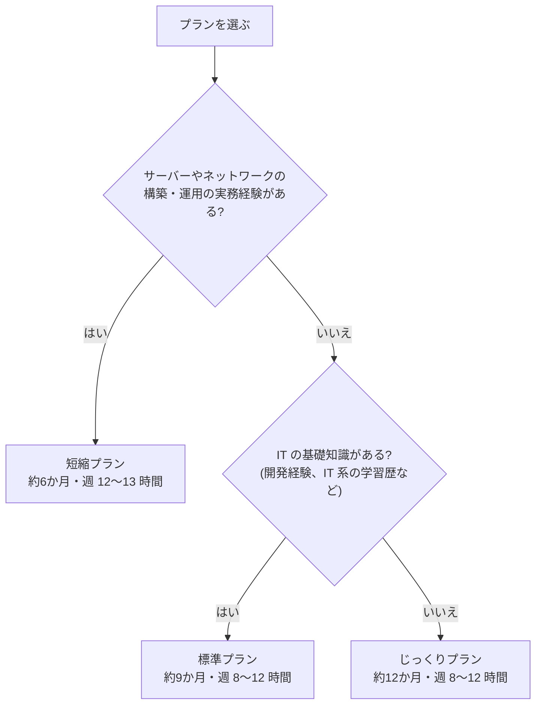
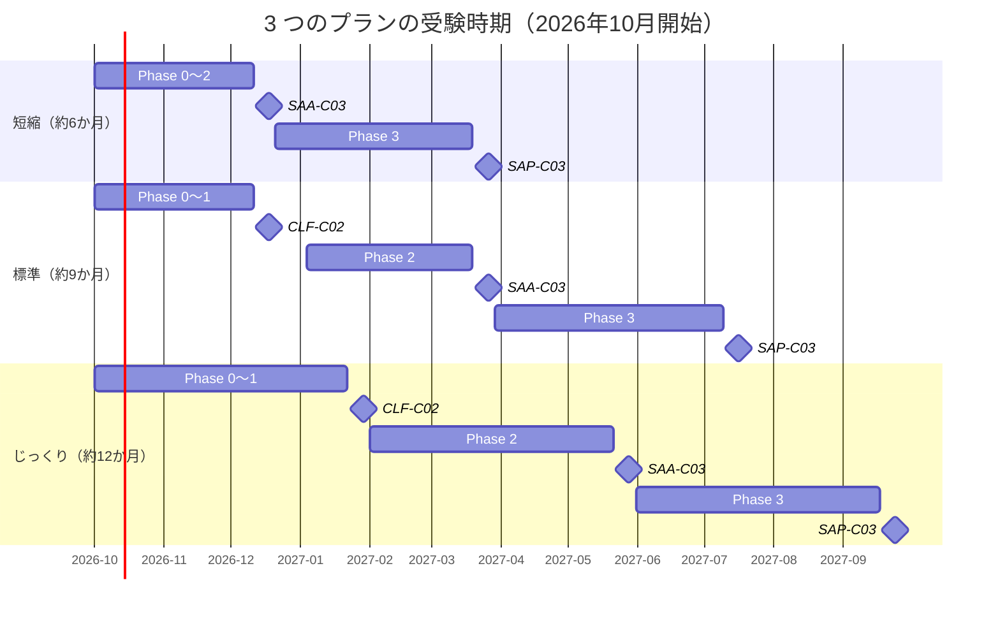

[ホーム](../README.md) > [Phase 0: はじめに](README.md) > 学習計画と進捗管理

# 学習計画と進捗管理

> **この章のゴール**
> - 自分の経験と生活に合ったプラン（短縮 / 標準 / じっくり）を選び、受験する月を決められる
> - 1 週間の学習の過ごし方を具体的に決められる
> - 各フェーズの完了基準を知り、進捗をチェックリストで管理できる
> - 学習ログと間違いノートを、テンプレートを使って記録できる
> - 適切なタイミングで試験を予約できる
>
> **対応試験**: 全試験共通（CLF-C02 / SAA-C03 / SAP-C03）
> **目安時間**: 読む 30分 / 計画づくり 30分

## この章の全体像

学習計画は「いつまでに、何を、どの基準まで終えるか」を決めるためのものです。この章では、2026年10月に学習を始める場合を例に、3 つのプランを具体的なカレンダーで示します。



> [!TIP]
> 週あたりの学習時間を確保できない場合は、**1 段階長いプラン** を選んでください。短すぎる計画で遅れが積み重なるより、余裕のある計画を守るほうが、結果的に早く合格できます。

3 つのプランの受験時期を並べると、次のようになります。



## 1. 3 つのプランの比較

| 項目 | 短縮プラン | 標準プラン | じっくりプラン |
|---|---|---|---|
| 期間 | 約 6 か月（2026年10月〜2027年3月） | 約 9 か月（2026年10月〜2027年7月） | 約 12 か月（2026年10月〜2027年9月） |
| 想定する人 | サーバー・ネットワークの実務経験者 | 開発者、IT の基礎知識がある人 | IT 未経験の人 |
| 週の学習時間 | 12〜13 時間 | 8〜12 時間（フェーズが進むほど増やす） | 8〜12 時間 |
| 総学習時間の目安 | 約 300 時間 | 約 400 時間 | 約 500 時間 |
| CLF-C02 | 任意（スキップ可） | 2026年12月中旬 | 2027年1月下旬 |
| SAA-C03 | 2026年12月中旬 | 2027年3月下旬 | 2027年5月下旬 |
| SAP-C03 | 2027年3月下旬 | 2027年7月中旬 | 2027年9月下旬 |

総学習時間は [学習の進め方](01-how-to-study.md) の目安と対応しています。どのプランでも、SAP-C03 は 2026-11-17 以降に提供される新バージョンを受験します（SAP-C02 との違いは [AWS 認定の全体像と試験の仕組み](02-certification-map.md) を参照）。

> [!IMPORTANT]
> どのプランでも、学習期間中に **AWS の無料プランは終了します**（アカウント作成から 6 か月、またはクレジットを使い切った時点）。無料プランのままだとアカウントが閉鎖されるため、**Phase 2 を始めるとき（遅くともアカウント作成から 5 か月以内）に有料プランへアップグレード** する計画にしておきます。詳しくは [安全な学習用 AWS アカウントの準備](04-aws-account-setup.md) で説明します。

## 2. 標準プラン（約9か月）

IT の基礎知識がある人向けの、本教材の基本となるプランです。

| 期間 | 学習内容 | ハンズオン・模擬試験 | マイルストーン |
|---|---|---|---|
| 2026年10月 第1週 | Phase 0（全 4 章） | Lab 01 | アカウントの安全設定を完了、学習計画を確定 |
| 2026年10月 第2週〜11月 | Phase 1 第1〜8章 | 「Explore AWS」の 5 つのアクティビティ | 11月中旬に CLF-C02 を予約 |
| 2026年12月 前半 | Phase 1 第9章、弱点復習 | CLF 模擬試験 | **CLF-C02 を受験（12月中旬）** |
| 2027年1月 | Phase 2 第1〜6章（IAM、VPC、EC2、ELB と Auto Scaling、S3、ブロック・ファイルストレージ） | Lab 02、Lab 03 | Phase 2 の開始時に有料プランへアップグレード |
| 2027年2月 | Phase 2 第7〜12章（データベース、Route 53 と CloudFront、アプリケーション統合、サーバーレス、コンテナ、セキュリティサービス） | Lab 04、Lab 05、Lab 06、Lab 09 | 2月中旬に SAA-C03 を予約 |
| 2027年3月 | Phase 2 第13〜19章（監視と運用管理、分析、高可用性と災害対策、移行、Well-Architected、コスト最適化、試験対策） | Lab 07、Lab 08、SAA 模擬試験 第1回・第2回 | **SAA-C03 を受験（3月下旬）** |
| 2027年4月 | Phase 3 第1〜4章（SAP-C03 完全ガイド、マルチアカウント、ID 管理、高度なネットワーク） | Lab 10、Lab 11 | Lab 10 で Organizations と IAM Identity Center に移行 |
| 2027年5月 | Phase 3 第5〜8章（セキュリティ、回復力と事業継続、移行とモダナイゼーション、クラウドネイティブ） | Lab 13 | |
| 2027年6月 | Phase 3 第9〜12章（生成 AI、データと分析、大規模環境のコスト最適化、運用上の優秀性） | Lab 12、SAP 模擬試験 第1回 | 6月中旬に SAP-C03 を予約 |
| 2027年7月 | Phase 3 第13章、総復習 | SAP 模擬試験 第2回 | **SAP-C03 を受験（7月中旬）** |

- 週の学習時間は、Phase 1 で 8 時間、Phase 2 で 10 時間、Phase 3 で 12〜13 時間と、段階的に増やします。
- 「Explore AWS」のアクティビティは、完了するとクレジットがもらえます（アカウント作成から 6 か月以内）。Amazon Bedrock を扱う Lab 12 は Phase 3 なので、Bedrock のアクティビティも Phase 1 のうちに済ませておきましょう。

## 3. 短縮プラン（約6か月）

サーバーやネットワークの実務経験がある人向けです。Phase 1 は確認問題で理解度を確かめながら速習し、CLF-C02 はスキップしても構いません。

| 期間 | 学習内容 | ハンズオン・模擬試験 | マイルストーン |
|---|---|---|---|
| 2026年10月 第1週 | Phase 0（全 4 章） | Lab 01 | アカウントの安全設定を完了 |
| 2026年10月 第2〜3週 | Phase 1 を速習（各章の確認問題を先に解き、80% 未満の章だけ読む） | CLF 模擬試験（実力の診断として） | CLF-C02 を受けるかを決める。有料プランへアップグレード |
| 2026年10月 第4週〜12月 前半 | Phase 2 全 19 章 | Lab 02〜09、SAA 模擬試験 第1回・第2回 | **SAA-C03 を受験（12月中旬）** |
| 2026年12月 後半〜2027年2月 | Phase 3 第1〜10章 | Lab 10〜13 | 年末年始は復習にあてる |
| 2027年3月 | Phase 3 第11〜13章、総復習 | SAP 模擬試験 第1回・第2回 | **SAP-C03 を受験（3月下旬）** |

> [!WARNING]
> **ひっかけ注意**: 実務経験者ほど「知っているつもり」で Phase 2 を飛ばしがちです。しかし試験は、実務で使わない機能や、実務の慣習とは異なる「AWS が推奨する答え」を問います。章を飛ばすかどうかは、必ず確認問題の結果（80% 以上）で判断してください。

## 4. じっくりプラン（約12か月）

IT 未経験の人向けです。Phase 1 の IT の基礎（ネットワーク、サーバー、セキュリティ、データベース）に十分な時間をかけます。

| 期間 | 学習内容 | ハンズオン・模擬試験 | マイルストーン |
|---|---|---|---|
| 2026年10月 | Phase 0（全 4 章）、Phase 1 第1〜2章 | Lab 01 | アカウントの安全設定を完了 |
| 2026年11月 | Phase 1 第3〜5章 | 「Explore AWS」のアクティビティ、AWS Hands-on for Beginners | |
| 2026年12月 | Phase 1 第6〜8章 | ― | 年末年始は Phase 1 の復習 |
| 2027年1月 | Phase 1 第9章、弱点復習 | CLF 模擬試験 | **CLF-C02 を受験（1月下旬）** |
| 2027年2月 | Phase 2 第1〜5章 | Lab 02、Lab 03 | Phase 2 の開始時に有料プランへアップグレード |
| 2027年3月 | Phase 2 第6〜10章 | Lab 04、Lab 05、Lab 06 | |
| 2027年4月 | Phase 2 第11〜15章 | Lab 07、Lab 08、Lab 09 | 4月下旬に SAA-C03 を予約 |
| 2027年5月 | Phase 2 第16〜19章 | SAA 模擬試験 第1回・第2回 | **SAA-C03 を受験（5月下旬）** |
| 2027年6月 | Phase 3 第1〜4章 | Lab 10、Lab 11 | |
| 2027年7月 | Phase 3 第5〜8章 | Lab 13 | |
| 2027年8月 | Phase 3 第9〜12章 | Lab 12、SAP 模擬試験 第1回 | 8月中旬に SAP-C03 を予約 |
| 2027年9月 | Phase 3 第13章、総復習 | SAP 模擬試験 第2回 | **SAP-C03 を受験（9月下旬）** |

> [!NOTE]
> 無料の [AWS Skill Builder](https://skillbuilder.aws) には、ゲーム形式で AWS を学べる **AWS Cloud Quest**（Cloud Practitioner 編は無料で、日本語でも利用可能）があります。Phase 1 で AWS の画面に慣れるのに役立ちます。

## 5. 1 週間の過ごし方

### 5.1 週あたりの学習時間のモデル

| モデル | 平日 | 週末 | 週の合計 | 主な用途 |
|---|---|---|---|---|
| ライト | 1 時間 × 5 日 | 土曜 3 時間 | 8 時間 | 標準・じっくりプランの Phase 1 |
| スタンダード | 1 時間 × 5 日 | 土曜 3 時間＋日曜 2 時間 | 10 時間 | 標準・じっくりプランの Phase 2 |
| ハード | 1.5 時間 × 5 日 | 土曜 3 時間＋日曜 2 時間 | 12.5 時間 | 標準・じっくりプランの Phase 3、短縮プラン |

### 5.2 1 週間の例（スタンダード: Phase 2 の場合）

| 曜日 | 時間 | 内容 |
|---|---|---|
| 月 | 1 時間 | 章を読む（前半）。「この章のゴール」を自分への質問に変えてから読む |
| 火 | 1 時間 | 章を読む（後半）。図を自分で描き、要点をまとめる |
| 水 | 1 時間 | 確認問題を解き、間違いノートに記録する |
| 木 | 1 時間 | 次の章を読む（前半） |
| 金 | 1 時間 | 間隔反復（前日・1 週間前・1 か月前の内容の復習）、[覚えておきたい数値](../06-reference/numbers-to-remember.md) の見直し |
| 土 | 3 時間 | ハンズオン（**後片付けまで**）。終わったら請求画面で課金状況を確認する |
| 日 | 2 時間 | 次の章の後半と確認問題。1 週間の振り返りを学習ログに書く |

- 平日は **読む・解く**、週末は **手を動かす・振り返る** に分けると、ハンズオンの時間を確保しやすくなります。
- 通勤などのすき間時間は、[比較表集](../06-reference/comparison-tables.md) や [問題文キーワード→解答 対応表](../06-reference/exam-keywords.md) の見直しに使います。
- 予定どおり進まなかった週は、次の週に無理に詰め込まず、**月単位で調整** します。

## 6. 各フェーズの完了基準

次のフェーズに進む（または試験を受ける）前に、完了基準を満たしているかを確認します。

| フェーズ | 完了基準 |
|---|---|
| Phase 0 | 4 章を読み終えている / 学習プランと各試験の受験予定月を決めている / Lab 01 を完了している（ルートユーザーの MFA、管理用ユーザー、AWS Budgets の通知メールの受信を確認） |
| Phase 1 | 全 9 章の確認問題で、それぞれ **80% 以上** 正解 / CLF 模擬試験で **初回 80% 以上** / 責任共有モデル、リージョンと AZ、料金モデルを自分の言葉で説明できる |
| Phase 2 | 全 19 章の確認問題で、それぞれ **80% 以上** 正解 / Lab 02〜09 を後片付けまで完了 / SAA 模擬試験 第1回・第2回とも **初回 80% 以上** / 間違いノートを 2 周見直している |
| Phase 3 | 全 13 章の確認問題で、それぞれ **80% 以上** 正解 / Lab 10〜13 を後片付けまで完了 / SAP 模擬試験 第1回・第2回とも **初回 80% 以上**（75〜80% なら弱点分野を復習してから受験）/ Phase 3 の判断表を使って、選択肢の優劣を説明できる |

> [!TIP]
> 模擬試験の目標点に届かなかった場合は、分野ごとの正答率を出し、**低い分野の章の確認問題を解き直す** ところから始めます。すべてを最初から読み直す必要はありません。受験の 2 週間ほど前には、AWS Skill Builder の **公式練習問題（Official Practice Question Set、無料・20 問）** でも実力を確認しておくと安心です。

## 7. 進捗チェックリスト

教材のすべての章・ハンズオン・模擬試験のチェックリストです。このリストを自分のノートにコピーするか、この教材を GitHub でフォークして `[ ]` を `[x]` に書き換えながら進めると、学習の記録が残ります。章の横には確認問題の正答率を、模擬試験の横には初回の点数を書き込みましょう。

### Phase 0: はじめに

- [ ] [学習の進め方](01-how-to-study.md)
- [ ] [AWS 認定の全体像と試験の仕組み](02-certification-map.md)
- [ ] [学習計画と進捗管理](03-study-plan.md)（この章）
- [ ] [安全な学習用 AWS アカウントの準備](04-aws-account-setup.md)
- [ ] [Lab 01: アカウントを守る初期設定](../04-labs/lab01-secure-account.md)

### Phase 1: IT とクラウドの基礎（CLF-C02）

- [ ] [1. ネットワークの基礎](../01-foundations/01-network-basics.md) — 確認問題 ___%
- [ ] [2. サーバー・OS・仮想化の基礎](../01-foundations/02-server-os-basics.md) — 確認問題 ___%
- [ ] [3. セキュリティとデータベースの基礎](../01-foundations/03-security-database-basics.md) — 確認問題 ___%
- [ ] [4. クラウドコンピューティングの概念](../01-foundations/04-cloud-concepts.md) — 確認問題 ___%
- [ ] [5. AWS グローバルインフラストラクチャ](../01-foundations/05-global-infrastructure.md) — 確認問題 ___%
- [ ] [6. 主要サービスツアー](../01-foundations/06-core-services-tour.md) — 確認問題 ___%
- [ ] [7. AWS のセキュリティとコンプライアンス](../01-foundations/07-security-and-compliance.md) — 確認問題 ___%
- [ ] [8. 料金・請求・サポート](../01-foundations/08-billing-pricing-support.md) — 確認問題 ___%
- [ ] [9. CLF-C02 試験対策](../01-foundations/09-clf-exam-prep.md) — 確認問題 ___%
- [ ] [CLF-C02 模擬試験](../05-practice-exams/clf-mock-exam.md)（[解答](../05-practice-exams/clf-mock-exam-answers.md)）— 初回 ___%
- [ ] CLF-C02 を予約した（受験日: ____年__月__日）
- [ ] CLF-C02 に合格した（スコア: ___ 点）

### Phase 2: アソシエイト（SAA-C03）

- [ ] AWS のアカウントを有料プランにアップグレードした（Phase 2 の開始時）
- [ ] [1. IAM 徹底解説](../02-associate/01-iam.md) — 確認問題 ___%
- [ ] [2. VPC とネットワーク設計](../02-associate/02-vpc.md) — 確認問題 ___%
- [ ] [3. Amazon EC2](../02-associate/03-ec2.md) — 確認問題 ___%
- [ ] [Lab 02: VPC をゼロから作り EC2 で Web サーバー](../04-labs/lab02-vpc-ec2.md)
- [ ] [4. Elastic Load Balancing と Auto Scaling](../02-associate/04-elb-auto-scaling.md) — 確認問題 ___%
- [ ] [Lab 03: ALB + Auto Scaling で冗長化とスケーリング](../04-labs/lab03-alb-auto-scaling.md)
- [ ] [5. Amazon S3](../02-associate/05-s3.md) — 確認問題 ___%
- [ ] [6. ブロック・ファイルストレージ（EBS / EFS / FSx / Storage Gateway）](../02-associate/06-ebs-efs-fsx.md) — 確認問題 ___%
- [ ] [7. データベース（RDS / Aurora / DynamoDB / ElastiCache ほか）](../02-associate/07-databases.md) — 確認問題 ___%
- [ ] [Lab 05: RDS Multi-AZ とフェイルオーバー](../04-labs/lab05-rds-multi-az.md)
- [ ] [8. Route 53・CloudFront・Global Accelerator](../02-associate/08-route53-cloudfront.md) — 確認問題 ___%
- [ ] [Lab 04: S3 + CloudFront（OAC）で静的サイト配信](../04-labs/lab04-s3-cloudfront.md)
- [ ] [9. アプリケーション統合（SQS / SNS / EventBridge / Kinesis）](../02-associate/09-application-integration.md) — 確認問題 ___%
- [ ] [10. サーバーレス（Lambda / API Gateway / Step Functions / Cognito）](../02-associate/10-serverless.md) — 確認問題 ___%
- [ ] [Lab 06: Lambda + API Gateway + DynamoDB のサーバーレス API](../04-labs/lab06-serverless-api.md)
- [ ] [Lab 09: EventBridge + Step Functions のイベント駆動処理](../04-labs/lab09-event-driven.md)
- [ ] [11. コンテナ（ECS / EKS / Fargate / ECR）](../02-associate/11-containers.md) — 確認問題 ___%
- [ ] [12. セキュリティサービス（KMS / WAF / GuardDuty ほか）](../02-associate/12-security-services.md) — 確認問題 ___%
- [ ] [13. 監視と運用管理（CloudWatch / CloudTrail / Config / Systems Manager / CloudFormation）](../02-associate/13-monitoring-management.md) — 確認問題 ___%
- [ ] [Lab 07: CloudFormation で IaC（変更セット・ドリフト検出）](../04-labs/lab07-cloudformation-iac.md)
- [ ] [Lab 08: CloudWatch で監視・アラーム・ログ分析](../04-labs/lab08-cloudwatch-monitoring.md)
- [ ] [14. データ分析サービス](../02-associate/14-analytics.md) — 確認問題 ___%
- [ ] [15. 高可用性と災害対策](../02-associate/15-high-availability-dr.md) — 確認問題 ___%
- [ ] [16. 移行とハイブリッド接続](../02-associate/16-migration-hybrid.md) — 確認問題 ___%
- [ ] [17. AWS Well-Architected Framework](../02-associate/17-well-architected.md) — 確認問題 ___%
- [ ] [18. コスト最適化](../02-associate/18-cost-optimization.md) — 確認問題 ___%
- [ ] [19. SAA-C03 試験対策](../02-associate/19-saa-exam-prep.md) — 確認問題 ___%
- [ ] [SAA-C03 模擬試験 第1回](../05-practice-exams/saa-mock-exam-1.md)（[解答](../05-practice-exams/saa-mock-exam-1-answers.md)）— 初回 ___%
- [ ] [SAA-C03 模擬試験 第2回](../05-practice-exams/saa-mock-exam-2.md)（[解答](../05-practice-exams/saa-mock-exam-2-answers.md)）— 初回 ___%
- [ ] SAA-C03 を予約した（受験日: ____年__月__日）
- [ ] SAA-C03 に合格した（スコア: ___ 点）

### Phase 3: プロフェッショナル（SAP-C03）

- [ ] [1. SAP-C03 完全ガイド](../03-professional/01-sap-c03-overview.md) — 確認問題 ___%
- [ ] [2. マルチアカウント戦略とガバナンス](../03-professional/02-multi-account-governance.md) — 確認問題 ___%
- [ ] [Lab 10: Organizations と SCP によるガバナンス](../04-labs/lab10-organizations-scp.md)（IAM Identity Center への移行もここで行う）
- [ ] [3. 大規模な ID とアクセス管理](../03-professional/03-identity-federation.md) — 確認問題 ___%
- [ ] [4. 高度なネットワーク設計](../03-professional/04-advanced-networking.md) — 確認問題 ___%
- [ ] [Lab 11: Transit Gateway によるハブ&スポーク](../04-labs/lab11-transit-gateway.md)
- [ ] [5. セキュリティとコンプライアンスのアーキテクチャ](../03-professional/05-security-architecture.md) — 確認問題 ___%
- [ ] [6. 回復力と事業継続](../03-professional/06-resilience-business-continuity.md) — 確認問題 ___%
- [ ] [Lab 13: AWS FIS で障害注入（カオスエンジニアリング）](../04-labs/lab13-fis-chaos.md)
- [ ] [7. 移行とモダナイゼーション](../03-professional/07-migration-modernization.md) — 確認問題 ___%
- [ ] [8. クラウドネイティブ設計](../03-professional/08-cloud-native-architecture.md) — 確認問題 ___%
- [ ] [9. 生成 AI・エージェント AI のアーキテクチャ](../03-professional/09-generative-ai-architecture.md) — 確認問題 ___%
- [ ] [Lab 12: Amazon Bedrock Knowledge Bases で RAG](../04-labs/lab12-bedrock-rag.md)
- [ ] [10. データと分析のアーキテクチャ](../03-professional/10-data-analytics-architecture.md) — 確認問題 ___%
- [ ] [11. 大規模環境のコスト最適化](../03-professional/11-cost-optimization-at-scale.md) — 確認問題 ___%
- [ ] [12. 運用上の優秀性と自動化](../03-professional/12-operational-excellence.md) — 確認問題 ___%
- [ ] [13. SAP-C03 試験対策](../03-professional/13-sap-exam-prep.md) — 確認問題 ___%
- [ ] [SAP-C03 模擬試験 第1回](../05-practice-exams/sap-mock-exam-1.md)（[解答](../05-practice-exams/sap-mock-exam-1-answers.md)）— 初回 ___%
- [ ] [SAP-C03 模擬試験 第2回](../05-practice-exams/sap-mock-exam-2.md)（[解答](../05-practice-exams/sap-mock-exam-2-answers.md)）— 初回 ___%
- [ ] SAP-C03 を予約した（受験日: ____年__月__日）
- [ ] SAP-C03 に合格した（スコア: ___ 点）

### リファレンス（試験前の総復習に）

- [ ] [用語集](../06-reference/glossary.md)
- [ ] [サービス早見表](../06-reference/service-cheatsheet.md)
- [ ] [比較表集](../06-reference/comparison-tables.md)
- [ ] [覚えておきたい数値](../06-reference/numbers-to-remember.md)
- [ ] [問題文キーワード→解答 対応表](../06-reference/exam-keywords.md)
- [ ] [サービスの変更点](../06-reference/service-changes.md)
- [ ] [学習リソース集](../06-reference/resources.md)

## 8. 学習ログと間違いノートのテンプレート

次のテンプレートをコピーして、ノートアプリや Markdown ファイルで使ってください。

### 8.1 毎日の学習ログ

```markdown
## 2026-10-05（月）

- 学習時間: 60 分（累計: 12 時間）
- やったこと: Phase 1「ネットワークの基礎」の 1〜2 節
- わかったこと（自分の言葉で 1〜3 行）:
  - IP アドレスはネットワーク部とホスト部に分かれ、CIDR の /24 はネットワーク部が 24 ビットという意味
- わからなかったこと・次に調べること:
  - サブネットマスクの計算がまだ速くできない
- 確認問題: __ 問中 __ 問正解（__%）
- AWS の利用: なし ／ Lab __ を実施（後片付け: 済・未）
- 次にやること: 3 節と確認問題
```

### 8.2 週の振り返り

```markdown
## 第 __ 週の振り返り（____年__月__日〜__月__日）

- 今週の学習時間: __ 時間（計画: __ 時間）／ 累計: __ 時間
- 進んだ章・ハンズオン:
- 確認問題の正答率: 
- 今週いちばん理解が深まったこと:
- 来週に持ち越すこと:
- AWS の今月の請求額（見込み）: __ USD ／ 残りクレジット: __ USD
- 計画の見直し: 不要 ／ 必要（内容: ）
```

### 8.3 間違いノート

```markdown
### 間違いノート #__

- 日付: ____-__-__ ／ 出典: （例: SAA 模擬試験 第1回 問23）
- 分野: （例: 弾力性に優れたアーキテクチャの設計）
- 問題の要点（1〜2 行）:
- 自分の解答: __ ／ 正解: __
- 間違えた原因: [ ] 知識不足 [ ] 読み違い（制約語の見落とし） [ ] 2 択で迷った [ ] 時間切れ
- 正解の根拠（制約語 → 選んだ理由）:
- ほかの選択肢が不正解の理由:
  - A:
  - B:
  - C:
  - D:
- 関連する章・公式ドキュメント:
- 復習: [ ] 翌日 [ ] 1 週間後 [ ] 1 か月後
```

### 8.4 月の振り返り

```markdown
## ____年__月の振り返り

- 学習時間: __ 時間（計画: __ 時間）
- 完了した章: __ 章 ／ ハンズオン: __ 本 ／ 模擬試験: __ 回
- 計画との差: 予定どおり ／ __ 週の遅れ
- 来月の目標（3 つまで）:
  1.
  2.
  3.
- 試験の予約状況:
```

> [!TIP]
> 間違いノートは、**模擬試験の前日と試験の 1 週間前** に必ず見返します。自分が過去にはまった「ひっかけ」を集めたノートは、どんな市販の問題集よりも効果的な直前対策になります。

## 9. 試験日を決めるタイミングと予約のコツ

### 9.1 いつ予約するか

- **各フェーズを始めるとき** に、受験する **月** を決めてカレンダーに書き込みます。
- **フェーズの 6〜7 割を終えたとき**（受験の 4〜6 週間前）に、実際の日時を予約します。予約すると締め切りが生まれ、学習に集中しやすくなります。
- 予約した日時は、期限までであれば変更やキャンセルができます。期限や回数などの条件は、公式の [AWS 認定の FAQ](https://aws.amazon.com/certification/faqs/) で確認してください。

### 9.2 予約のコツ

| コツ | 理由 |
|---|---|
| 頭がいちばん働く時間帯を選ぶ | SAP は 180 分の長丁場。多くの人は午前中が有利 |
| 仕事の繁忙期や大きな予定の直後を避ける | 直前の 1 週間は復習に集中したい |
| テストセンターの週末枠は早めに押さえる | 人気の日時は埋まりやすい |
| オンライン監督を日本語で受けるなら時間帯に注意 | 日本語の試験監督は月〜土の 9:00〜16:00（日本時間） |
| 年末年始や大型連休は会場の営業日を確認する | 会場によっては休業する |
| 前の試験の 50% 割引バウチャーを使う | 受験料が半額になる（[AWS 認定の全体像と試験の仕組み](02-certification-map.md) を参照） |

### 9.3 受験前の 1 週間

1. 間違いノートをすべて見返す
2. [覚えておきたい数値](../06-reference/numbers-to-remember.md) と [問題文キーワード→解答 対応表](../06-reference/exam-keywords.md) を見直す
3. 新しい問題集に手を出さず、これまでに解いた問題の **不正解の理由** を説明できるか確認する
4. 受験方法（会場の場所、またはオンライン監督のシステムテスト）と身分証明書を確認する
5. 前日はしっかり眠る

> [!NOTE]
> SAP-C03 の予約受付は **2026-10-27** に始まります。本教材のどのプランでも、SAP-C03 の受験は 2027年以降なので、予約を急ぐ必要はありません。予約前に、公開された試験ガイドで分野の比重を確認しておきましょう。

## まとめ

- プランは経験に応じて **短縮（約6か月）/ 標準（約9か月）/ じっくり（約12か月）** から選ぶ。迷ったら長いほうを選ぶ
- 標準プランの例は **CLF-C02（2026年12月）→ SAA-C03（2027年3月）→ SAP-C03（2027年7月）**
- 週の学習時間は **8 時間から始め、Phase 3 では 12 時間程度** に増やす。平日は読む・解く、週末はハンズオンと振り返り
- 各フェーズの完了基準は **確認問題 80% 以上、ハンズオン完了、模擬試験 初回 80% 以上**
- AWS の無料プランは学習期間中に終わるため、**Phase 2 の開始時に有料プランへアップグレード** する
- **チェックリスト** で進捗を見える化し、**学習ログと間違いノート** を習慣にする
- 試験は **フェーズの 6〜7 割を終えたときに予約** し、締め切りの力を使う

## 次のステップ

- 次の章: [安全な学習用 AWS アカウントの準備](04-aws-account-setup.md) — 学習用のアカウントを安全に準備します。
- 関連ハンズオン: [Lab 01: アカウントを守る初期設定](../04-labs/lab01-secure-account.md)
- 模擬試験の使い方: [模擬試験の使い方](../05-practice-exams/README.md)

---
[← 前の章: AWS 認定の全体像と試験の仕組み](02-certification-map.md) | [目次](README.md) | [次の章: 安全な学習用 AWS アカウントの準備 →](04-aws-account-setup.md)
