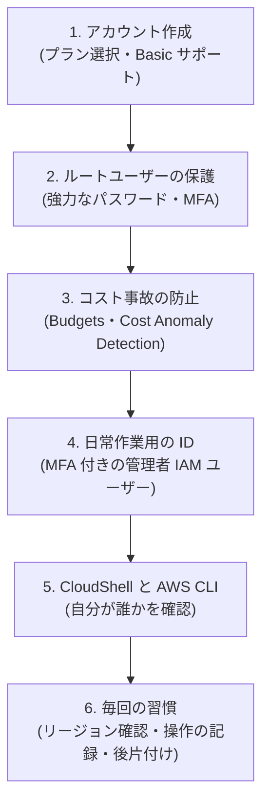
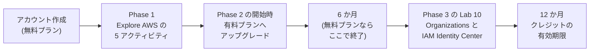
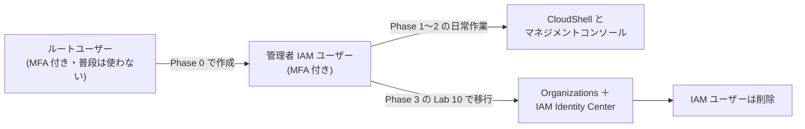
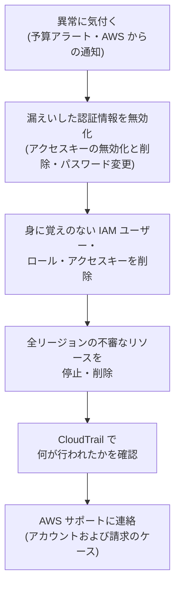

[ホーム](../README.md) > [Phase 0: はじめに](README.md) > 安全な学習用 AWS アカウントの準備

# 安全な学習用 AWS アカウントの準備

> **この章のゴール**
> - AWS アカウントを作成し、無料プランと有料プランの違いを説明できる
> - ルートユーザーを保護し、ルートユーザーでしかできない作業を説明できる
> - AWS Budgets と AWS Cost Anomaly Detection で、コスト事故を防ぐ仕組みを作れる
> - 日常作業用の ID を用意し、IAM ユーザーと IAM Identity Center のトレードオフを説明できる
> - AWS CloudShell で AWS CLI を使い、リージョンと自分の操作（AWS CloudTrail）を確認できる
> - 後片付けの習慣と、万一の不正利用時の対応手順を知っている
>
> **対応試験**: CLF-C02（セキュリティとコンプライアンス / 請求、料金、およびサポート）、SAA-C03（セキュアなアーキテクチャの設計）
> **目安時間**: 読む 45分 / 設定作業 45分

> [!IMPORTANT]
> この章の料金・無料利用枠・サポートプランの情報は **2026年9月時点** のものです。無料利用枠の条件は変更されることがあるため、アカウント作成の前に [AWS 無料利用枠](https://aws.amazon.com/free/) と [無料利用枠の FAQ](https://aws.amazon.com/free/free-tier-faqs/) を確認してください。

## この章の全体像

学習用のアカウントで最も避けたいのは、**乗っ取り** と **想定外の高額請求** です。この章では、次の順序で「安全に失敗できる環境」を作ります。具体的な操作手順は [Lab 01: アカウントを守る初期設定](../04-labs/lab01-secure-account.md) で行います。



## 1. アカウント作成の流れ

### 1.1 用意するもの

| もの | 用途 | ポイント |
|---|---|---|
| メールアドレス | ルートユーザーのサインイン ID | 学習専用のアドレスがおすすめ。パスワードの再設定はこのメール経由で行われるため、**メールアカウント自体も MFA で守る** |
| 電話番号 | 本人確認（SMS または音声通話） | 受信できる番号を用意する |
| クレジットカードなどの支払い方法 | 本人確認と、有料プランでの支払い | サインアップの途中で登録を求められる |
| アカウント名 | アカウントの識別 | 例: `study-aws-yourname` |

### 1.2 作成の手順（概要）

1. [AWS 無料利用枠のページ](https://aws.amazon.com/free/) からアカウントの作成を始めます。
2. メールアドレスとアカウント名を入力し、届いた確認コードで認証します。
3. ルートユーザーのパスワードを設定します（3 章）。
4. 連絡先情報を入力します。
5. **プラン（無料プラン / 有料プラン）を選びます**（2 章）。
6. 支払い情報を登録し、電話で本人確認をします。
7. **サポートプランは Basic（無料）** を選びます。
8. 完了したら、ルートユーザーでサインインします。

画面の順序や表記は変わることがあります。迷ったら、画面の案内に従ってください。

### 1.3 サポートプランは Basic を選ぶ

AWS のサポートプランは、2025年末の再編により、現在は **Basic（無料）/ Business Support+ / Enterprise Support / Unified Operations** の 4 つです。学習用には Basic で十分です。

| Basic サポートに含まれるもの | 含まれないもの |
|---|---|
| アカウントと請求に関する問い合わせ（24 時間 365 日）、ドキュメント、ホワイトペーパー、AWS re:Post、AWS Trusted Advisor の基本的なチェック、AWS Health Dashboard | 技術的な問題についてのサポートケース |

技術的な疑問は、AWS 公式の Q&A コミュニティ [AWS re:Post](https://repost.aws/) で質問できます。サポートプランの詳細は [料金・請求・サポート](../01-foundations/08-billing-pricing-support.md) で学びます。

> [!WARNING]
> **ひっかけ注意**: 従来の Developer / Business / Enterprise On-Ramp の各プランは、**2027-01-01 に提供を終了** します。ただし CLF-C02 では、これら旧プラン名で出題される可能性があります。現在のプランと旧プランの違いは Phase 1 で整理します。

## 2. 無料利用枠の仕組み（2025年7月15日以降に作成したアカウント）

AWS の無料利用枠は、2025年7月15日から **クレジット方式** に変わりました。それ以前に作成したアカウントは、従来の無料利用枠（EC2 の t2.micro / t3.micro が月 750 時間まで 12 か月無料、など）のままです。古い教材の「12 か月無料」は、この従来の方式の説明です。

### 2.1 クレジット

- アカウント作成時に **100 USD** のクレジットがもらえます。
- さらに、コンソールホームの **「Explore AWS」** に表示される 5 つのアクティビティ（Amazon EC2、Amazon RDS、AWS Lambda、Amazon Bedrock、AWS Budgets）を完了すると、1 つにつき **20 USD**、合計で最大 **100 USD** が追加されます。アクティビティはアカウント作成から **6 か月以内** に完了する必要があります。
- 合計で最大 **200 USD** です。残高と有効期限は、Billing and Cost Management コンソールの「クレジット」のページで確認できます。

### 2.2 無料プランと有料プラン

アカウントの作成時に、**無料プラン** か **有料プラン** のどちらかを選びます。

| 項目 | 無料プラン | 有料プラン |
|---|---|---|
| 料金 | 請求は発生しない | クレジットを超えた分は従量課金 |
| 使えるサービス | 90 以上のサービス（クレジットをすぐに使い切るサービスや、ハードウェアの購入が必要なサービスなど、一部は使えない） | すべてのサービス |
| 期間 | **6 か月、またはクレジットを使い切るまで**（早いほう）。延長はできない | 期限なし |
| クレジットの有効期限 | プランの終了まで | **アカウント作成から 12 か月** |
| 期間の終了時 | **アカウントが閉鎖される**。データは 90 日間保持され、その間に有料プランへアップグレードすれば再開できる。90 日を過ぎると完全に削除される | ― |

- 無料プランから有料プランへは、コンソールホームの「コストと使用状況」ウィジェットや Billing コンソールからアップグレードできます。**通常のアップグレードでは、残りのクレジットは引き継がれ**、有効期限まで以後の請求に充当されます。
- クレジットの残高や無料プランの終了が近づくと、メールで通知が届きます。
- どちらのプランでも、30 以上のサービスの **常時無料（Always Free）** の枠を使えます（例: AWS Lambda の月 100 万リクエストと 40 万 GB 秒、Amazon DynamoDB の 25 GB のストレージ）。

> [!CAUTION]
> 無料プランのアカウントで **AWS Organizations の組織を作成・参加する** か、**AWS Control Tower のランディングゾーンを設定する** と、アカウントは自動的に有料プランに切り替わり、**クレジットは即時に失効** します。以後、クレジットを獲得することもできなくなります。この仕様が、5 章で説明する「日常作業用の ID」の選び方に大きく影響します。

### 2.3 本教材でのおすすめの進め方

学習期間（6〜12 か月）の途中で、無料プランは必ず終了します。そこで、次の順序をおすすめします。



1. **無料プランで始める**: Phase 0〜1 では AWS をあまり使いません。請求が発生しない無料プランは、操作に慣れるまでの安全網になります。
2. **Phase 1 のうちに「Explore AWS」の 5 つのアクティビティを完了** し、クレジットを最大の 200 USD にします。
3. **Phase 2 を始めるとき（遅くともアカウント作成から 5 か月以内）に、有料プランへアップグレード** します。理由は 3 つあります。
   - 無料プランは 6 か月で終了し、アカウントが閉鎖される
   - ハンズオンが増える Phase 2 でクレジットを使い切ると、その時点で無料プランが終了し、アカウントが閉鎖される
   - 無料プランでは一部のサービスを使えない
4. アップグレードの前に、**4 章の予算アラートが届くことを必ず確認** しておきます。

## 3. ルートユーザーの保護

### 3.1 ルートユーザーとは

**ルートユーザー** は、アカウントの作成に使ったメールアドレスでサインインする ID です。アカウントのすべてのリソースと請求情報に、制限なくアクセスできます。単独のアカウントでは IAM ポリシーでルートユーザーの権限を制限できないため、乗っ取られると被害に上限がありません。そのため、**ルートユーザーはルートユーザーでしかできない作業にだけ使い**、普段は使いません。

### 3.2 ルートユーザーを守る 5 つの設定

| 設定 | 内容 |
|---|---|
| 1. 強力なパスワード | 長く（20 文字以上が目安）、ほかのサービスと使い回さないパスワードを、パスワードマネージャーで管理する |
| 2. MFA（多要素認証） | **パスキー、セキュリティキー（FIDO2）、認証アプリ（仮想 MFA）** などを登録する。1 つの ID に最大 8 個まで登録できるので、紛失に備えて **2 つ以上** 登録する |
| 3. アクセスキーを作らない | ルートユーザーの **アクセスキーは作成しない**。もし存在するなら削除する |
| 4. 代替の連絡先 | アカウント設定で、請求・オペレーション・セキュリティの代替連絡先を登録し、AWS からの重要な通知を確実に受け取る |
| 5. 請求情報へのアクセスの有効化 | 「IAM ユーザーおよびロールによる請求情報へのアクセス」を有効にする。これをしないと、管理者の IAM ユーザーでも請求の画面を使えない |

AWS はルートユーザーの MFA を段階的に必須化しており、サインイン時に登録を求められることがあります。求められなくても、アカウントを作成したらすぐに設定してください。

> [!TIP]
> **試験のポイント**: 「ルートユーザーを保護するベストプラクティス」を問う問題では、**MFA の有効化**、**ルートユーザーのアクセスキーを作成しない（削除する）**、**日常の作業にルートユーザーを使わない** が正解の定番です。「ルートユーザーの認証情報を複数人で共有する」は常に誤りです。

### 3.3 ルートユーザーでしかできない作業の例

| 作業 | 例 |
|---|---|
| アカウント設定の変更 | アカウント名、ルートユーザーのメールアドレスやパスワードの変更 |
| アカウントの閉鎖 | 学習用アカウントを解約する |
| 請求情報へのアクセスの有効化 | 3.2 の設定 5 |
| 管理者権限の復旧 | 唯一の管理者 IAM ユーザーの権限を誤って削除した場合など |
| ロックアウトの解除 | すべてのプリンシパルを拒否する Amazon S3 のバケットポリシーを誤って設定し、誰も操作できなくなった場合の削除 |
| 一部の特殊な設定 | S3 の MFA Delete の有効化、リザーブドインスタンスマーケットプレイスへの出品者登録 |

一覧は公式の [AWS アカウントのルートユーザー](https://docs.aws.amazon.com/IAM/latest/UserGuide/id_root-user.html) で確認できます。

> [!NOTE]
> AWS Organizations を使う大規模な環境では、管理アカウントからメンバーアカウントのルートユーザーの認証情報を削除し、必要な特権操作だけを一元的に行う仕組み（ルートアクセスの一元管理）があります。Phase 3 の [マルチアカウント戦略とガバナンス](../03-professional/02-multi-account-governance.md) で扱います。

## 4. コスト事故を防ぐ

### 4.1 AWS Budgets で予算アラートを設定する

AWS Budgets は、**自分で決めた金額** を超えそうなとき、または超えたときに通知する仕組みです。学習用に、次の 2 つの予算を作ります。

| 予算 | 設定の例 | 目的 |
|---|---|---|
| ゼロ支出予算 | テンプレート「ゼロ支出予算」を使う。支出が 0.01 USD を超えたらメールで通知 | 1 円でも支払いが発生しそうになったら、すぐに気付く |
| 月額コスト予算 | 月 20 USD。実績が 50%・80%・100% に達したとき、および予測が 100% を超えたときにメールで通知 | 消し忘れなどで利用額が増えていく傾向に気付く |

- Budgets は、コンソールホームの「Explore AWS」のアクティビティの 1 つです。**アクティビティから作成すれば 20 USD のクレジット** ももらえます。
- 予算の詳細オプションでは、コストの計算にクレジットを含めるかどうかを選べます。**クレジットを除外** した予算を作ると、クレジットで相殺される前の利用額で通知されるため、「クレジットを消費している」ことに早く気付けます。
- ここで作る 2 つの予算（アクションなし）は、追加料金なしで使える範囲です。

> [!WARNING]
> **ひっかけ注意**: AWS Budgets は **利用を止める上限ではありません**。請求データの反映には数時間程度の遅れがあり、通知が届いた時点でも課金は続いています。また、既定では予算を超えてもリソースは止まりません（予算アクションを設定すると、IAM ポリシーやサービスコントロールポリシーの適用、EC2 や RDS のインスタンスの停止などを自動で行えます）。通知を受けたら、すぐに原因のリソースを探して削除します。

### 4.2 AWS Cost Anomaly Detection で異常を検知する

AWS Cost Anomaly Detection は、**機械学習で過去の支出パターンを学習** し、通常と異なる支出（例: 普段使わないリージョンで急に EC2 の料金が発生した）を検出して通知するサービスです。追加料金はかかりません。

1. Billing and Cost Management コンソールで「コスト異常検出」を開きます。
2. 「AWS のサービス」を対象とするモニターがあるか確認し、なければ作成します。
3. アラートのサブスクリプションを作成し、自分のメールアドレスで通知（個別のアラート、または日次・週次のサマリー）を受け取るように設定します。

Budgets は「決めた金額」で、Cost Anomaly Detection は「いつもと違う動き」で通知します。新しいアカウントは学習の元になる履歴が少ないため、**両方を組み合わせて** 使います。

### 4.3 請求まわりの設定と確認

- **請求設定**: 請求書を PDF でメール受信する設定と、無料利用枠に関するアラートの受信設定を確認します。
- **請求書（Bills）のページ**: 今月の料金を **サービス別・リージョン別** に確認できます。消し忘れを見つける最も確実な方法です（10 章）。
- **AWS Cost Explorer**: 日々のコストの推移を、サービス別・リージョン別に分析できます。初めて有効にしたときは、データの準備に最大 24 時間ほどかかります。

> [!TIP]
> **試験のポイント**: CLF-C02 では、コスト管理ツールの使い分けがよく問われます。

| ツール | 役割 |
|---|---|
| AWS Budgets | 予算を設定し、超えそうなとき・超えたときに通知する（予算アクションも可能） |
| AWS Cost Explorer | 過去のコストと使用量を分析し、将来のコストを予測する |
| AWS Cost Anomaly Detection | 機械学習で異常な支出を検出して通知する |
| AWS Pricing Calculator | 利用を始める前に料金を見積もる |

## 5. 日常作業用の ID

### 5.1 2 つの選択肢

ルートユーザーを普段使わないなら、日常の作業には別の ID が必要です。選択肢は 2 つあります。

- **A. MFA 付きの管理者 IAM ユーザー**: アカウントの中に IAM ユーザーを作り、パスワードと MFA でサインインします。
- **B. AWS Organizations ＋ AWS IAM Identity Center**: IAM Identity Center（旧 AWS SSO）で一元管理されたユーザーとしてアクセスポータルにサインインし、**サインインのたびに発行される一時的な認証情報** で各アカウントを操作します。

実務では **B が AWS の推奨する標準の方法** です。ただし、IAM Identity Center で AWS アカウントへのアクセス（許可セット）を管理するには、**AWS Organizations と連携した組織インスタンス** が必要です。組織を使わない「アカウントインスタンス」もありますが、これはアプリケーションへのアクセス用で、AWS アカウントへのアクセスには使えません。そして 2 章のとおり、無料プランのアカウントで組織を作成すると、クレジットは即時に失効します。

| 観点 | A. MFA 付きの管理者 IAM ユーザー | B. Organizations ＋ IAM Identity Center |
|---|---|---|
| 前提 | なし | AWS Organizations の組織 |
| 無料利用枠のクレジット | 影響なし | 無料プランのアカウントで組織を作成すると、有料プランに切り替わり即時に失効 |
| 認証情報 | 長期的なパスワード＋MFA | 一時的な認証情報（自動で期限切れになる） |
| ローカル PC からの AWS CLI | `aws login` で一時的な認証情報を取得（アクセスキーは作らない） | `aws configure sso` |
| 複数アカウントの管理 | アカウントごとに IAM ユーザーが必要 | 1 か所で複数アカウントへのアクセスを管理できる |
| 実務での位置づけ | 小規模・例外的な用途 | **標準のベストプラクティス** |

### 5.2 本教材の推奨ルート



本教材では、**Phase 1〜2 は MFA 付きの管理者 IAM ユーザー（A）で作業し、Phase 3 の [Lab 10](../04-labs/lab10-organizations-scp.md) で Organizations と IAM Identity Center（B）に移行** するルートを推奨します。

正直に言えば、理想は最初から B を使うことです。本教材がこの順序にしているのには、2 つの理由があります。

1. **学習者の費用の事情**: 無料プランのクレジット（最大 200 USD）を、ハンズオンが多い Phase 2 で使えるように守るため。
2. **教育上の順序**: Phase 2 で IAM のユーザー・グループ・ポリシー・ロールの仕組みを理解してから IAM Identity Center に進むほうが、「許可セットが実際には各アカウントに IAM ロールを作っている」といった仕組みを理解しやすいため。

> [!IMPORTANT]
> 仕事で新しく AWS 環境を作るときは、**最初から Organizations と IAM Identity Center を使ってください**。本教材のルートは、学習用アカウントのための例外的な判断です。

**最初から B を選んでもかまいません**。実務と同じ形で学びたい人や、クレジットを重視しない人は、Phase 0 で組織を作成し、IAM Identity Center を有効にしてください（手順は Lab 10 を先取りします）。その場合、少なくとも無料プランのアカウントではクレジットが即時に失効します。有料プランのアカウントでも、組織の作成や参加がクレジットに影響しないとは言い切れません。最新の条件を [無料利用枠の FAQ](https://aws.amazon.com/free/free-tier-faqs/) で確認し、**失っても困らないと判断した場合** に選んでください。同じ理由で、A のルートで進む人も、Lab 10 の前にクレジットの残高を確認しておきましょう。

### 5.3 管理者 IAM ユーザーの作り方（概要）

詳しい手順は [Lab 01](../04-labs/lab01-secure-account.md) で行います。流れは次のとおりです。

1. ルートユーザーでサインインし、IAM のコンソールを開きます。
2. ユーザーグループ `Administrators` を作成し、AWS 管理ポリシー `AdministratorAccess` をアタッチします。
3. IAM ユーザー `admin` を作成し、マネジメントコンソールへのアクセスを有効にして、グループに追加します。**アクセスキーは作成しません**。
4. アカウントエイリアスを設定し、IAM ユーザー用のサインイン URL（`https://<エイリアス>.signin.aws.amazon.com/console`）をブックマークします。
5. `admin` でサインインし、自分で MFA を登録します。
6. ルートユーザーからサインアウトし、以後は使いません。

> [!WARNING]
> **ひっかけ注意**: `AdministratorAccess` を持つ IAM ユーザーは、IAM の操作を含むほぼすべての操作ができます（ルートユーザーでしかできない作業を除く）。この ID を守る最後の砦が MFA です。**MFA を登録するまでは、ほかの作業を始めない** でください。権限を絞る方法や、MFA を必須にするポリシーは [IAM 徹底解説](../02-associate/01-iam.md) で学びます。

### 5.4 ローカル PC から AWS CLI を使う場合

Phase 1〜2 のハンズオンは、ブラウザーだけで使える AWS CloudShell（6 章）で完結します。ローカル PC から AWS CLI を使いたい場合も、**長期的なアクセスキーは作りません**。

| 時期 | 方法 | 補足 |
|---|---|---|
| Phase 1〜2（IAM ユーザー） | `aws login` | AWS CLI v2（2.32.0 以降）のコマンド。ブラウザーでコンソールと同じ認証情報でサインインすると、一時的な認証情報が発行され、CLI が自動で更新する（最長 12 時間まで） |
| Lab 10 以降（IAM Identity Center） | `aws configure sso` → `aws sso login` | IAM Identity Center のアクセスポータル経由で、一時的な認証情報を取得する |

`aws login` は、`AdministratorAccess` を持つユーザーならそのまま使えます。権限を絞ったユーザーで使う場合は、AWS 管理ポリシー `SignInLocalDevelopmentAccess` が必要です。詳しくは公式の [コンソールの認証情報を使ったログイン](https://docs.aws.amazon.com/cli/latest/userguide/cli-configure-sign-in.html) と [IAM Identity Center を使った CLI の設定](https://docs.aws.amazon.com/cli/latest/userguide/cli-configure-sso.html) を参照してください。

## 6. AWS CloudShell と AWS CLI の基本

### 6.1 CloudShell とは

**AWS CloudShell** は、マネジメントコンソールから起動できる、ブラウザー上のシェル（コマンドを入力する画面）です。

- コンソールにサインインしている ID の権限で、そのまま AWS CLI を使えます（認証情報の設定は不要）。
- AWS CLI v2 のほか、Python、Node.js、Git などがあらかじめ入っています。
- リージョンごとに 1 GB の永続的な保存領域（ホームディレクトリ）があります。あるリージョンで 120 日間使わないと、そのリージョンのデータは削除されます。
- CloudShell 自体の利用に追加料金はかかりません（CloudShell から作成したリソースには、通常どおり料金がかかります）。

コンソール上部のナビゲーションバーにある CloudShell のアイコンから起動します。

### 6.2 最初に覚える 4 つのコマンド

```bash
# 自分は誰か（どのアカウントの、どの ID で操作しているか）を確認する
aws sts get-caller-identity

# 現在のリージョンを確認する（CloudShell では、コンソールで選んでいるリージョンが設定される）
echo $AWS_REGION

# AWS CLI の設定（認証情報の種類やリージョン）を確認する
aws configure list

# 利用できるリージョンの一覧を表形式で表示する
aws ec2 describe-regions --query "Regions[].RegionName" --output table
```

`aws sts get-caller-identity` の出力は、たとえば次のようになります。

```json
{
    "UserId": "AIDAEXAMPLEEXAMPLE123",
    "Account": "123456789012",
    "Arn": "arn:aws:iam::123456789012:user/admin"
}
```

`Arn` の末尾が `user/admin` なら、管理者 IAM ユーザーで操作しています。末尾が `:root` なら **ルートユーザーで操作している** ので、すぐにサインアウトして管理者ユーザーでサインインし直してください。ハンズオンの最初に、このコマンドで「誰として」「どのアカウントを」操作しているかを確認する習慣をつけましょう。

### 6.3 AWS CLI の基本的なオプション

| オプション | 意味 | 例 |
|---|---|---|
| `--region` | 操作するリージョンを指定する | `--region ap-northeast-1` |
| `--output` | 出力形式（`json` / `table` / `text`） | `--output table` |
| `--query` | 出力から必要な項目だけを取り出す（JMESPath という書式） | `--query "Reservations[].Instances[].InstanceId"` |
| `help` | コマンドの説明を表示する | `aws ec2 help` |

> [!CAUTION]
> CloudShell のコマンドは、コンソールの操作と同じく **本物の操作** です。管理者の権限で実行されるため、削除のコマンドは実行前に対象をよく確認してください。

## 7. リージョンの選び方と確認のクセ

### 7.1 本教材のリージョン

本教材のハンズオンは、原則として **アジアパシフィック（東京）リージョン `ap-northeast-1`** を使います。日本からのレイテンシーが小さく、ほとんどのサービスが利用できるためです。日本国内でのバックアップ先や災害対策には、大阪リージョン `ap-northeast-3` がよく使われます。

> [!TIP]
> **試験のポイント**: リージョンを選ぶときの 4 つの観点は、**コンプライアンス（データの保存場所に関する法令や規制）**、**利用者との距離（レイテンシー）**、**使いたいサービスが提供されているか**、**料金**（リージョンによって異なる）です。CLF-C02 の定番の問題です。

### 7.2 リージョンを確認するクセ

- リソースを作る前に、**コンソール右上のリージョン表示** を必ず確認します。サインイン直後のリージョンが東京とは限りません。
- 別のリージョンで作ったリソースは、東京リージョンの画面には表示されません。これが「消し忘れ」の最大の原因です。
- IAM、AWS Organizations、Amazon Route 53、Amazon CloudFront などは **グローバルなサービス** で、リージョンの表示が「グローバル」になります。

> [!NOTE]
> 一部の設定は **米国東部（バージニア北部）リージョン `us-east-1`** で行う決まりがあります。たとえば、CloudFront で使う AWS Certificate Manager（ACM）の証明書は us-east-1 で発行します。また、Amazon CloudWatch の請求のメトリクス（請求アラーム）も us-east-1 にあります。このような例外は、関係する章で都度説明します。

## 8. CloudTrail のイベント履歴で自分の操作を確認する

**AWS CloudTrail** は、アカウントで行われた API の呼び出し（誰が、いつ、どこから、何をしたか）を記録するサービスです。コンソールの操作も CLI の操作も、裏側ではすべて API 呼び出しなので記録されます。

**イベント履歴** を使うと、設定なしで、**過去 90 日間の管理イベント** をリージョンごとに無料で確認できます。

```bash
# 現在のリージョンの最近の操作を 5 件表示する
aws cloudtrail lookup-events --max-results 5 \
  --query "Events[].{Time:EventTime,Name:EventName,User:Username}" --output table

# IAM ユーザーを作成した操作を探す（IAM などグローバルなサービスの操作は us-east-1 に記録される）
aws cloudtrail lookup-events --region us-east-1 \
  --lookup-attributes AttributeKey=EventName,AttributeValue=CreateUser \
  --query "Events[].{Time:EventTime,User:Username}" --output table
```

Phase 0 の作業を終えたら、`admin` ユーザーを作成した `CreateUser` の記録を探してみてください。「誰が、いつ作ったか」を後から確認できることを体験できます。

- イベント履歴は、有効化の操作なしで使えます。90 日より長く保存したい場合は、**証跡（トレイル）** を作成して S3 バケットに保存します（Phase 2 の [監視と運用管理](../02-associate/13-monitoring-management.md) で扱います）。
- なお、AWS CloudTrail Lake は 2026-05-31 に新規のお客様への提供を終了しています。これから構築する場合は、証跡と Amazon Athena などを組み合わせます。

## 9. やってはいけないこと

| やってはいけないこと | なぜ危険か | 代わりにやること |
|---|---|---|
| アクセスキーを GitHub などに公開する | 公開リポジトリは常に自動で監視されており、公開から短時間で悪用されることがある（暗号資産のマイニング用に大量のインスタンスを起動されるなど） | 長期的なアクセスキーを作らない。CloudShell、`aws login`、IAM Identity Center を使う |
| ルートユーザーで作業する・ルートユーザーのアクセスキーを作る | 乗っ取られたときの被害に上限がない | MFA 付きの管理者ユーザーを使う |
| SSH（22 番）や RDP（3389 番）を `0.0.0.0/0` に開放する | 世界中から総当たり攻撃を受ける | AWS Systems Manager Session Manager や EC2 Instance Connect を使う。やむを得ない場合も自分の IP アドレスだけを許可する |
| NAT ゲートウェイを放置する | 時間単位の料金と、処理したデータ量に応じた料金がかかる。1 つだけでも月に数十 USD になる | ハンズオンの後片付けで必ず削除する |
| 大きなインスタンスや GPU インスタンスを起動したままにする | 時間単位の料金が高い | ハンズオンで指定された小さなインスタンスを使い、終わったら削除する |
| 最低料金のあるサービスを試しに作る | 例: Amazon OpenSearch Serverless のクラシックコレクションは、データがなくても最低限の処理能力（OCU）分の料金が時間単位でかかる（2026年に登場したコレクショングループの NextGen コレクションはアイドル時にゼロまでスケールできるが、作成時の種類をよく確認する） | ハンズオンの手順に従い、終わったらすぐに削除する |
| パブリック IPv4 アドレスを放置する | 1 個あたり 0.005 USD/時間（使用中か未使用かを問わない。2024年2月から） | 不要になった Elastic IP アドレスは解放する |
| 停止した RDS の DB インスタンスを放置する | 停止中もストレージの料金がかかり、7 日後には自動で起動する | 使い終わったら削除する（必要ならスナップショットを取る） |
| 長期の契約を伴う購入をする | リザーブドインスタンス、Savings Plans、Route 53 のドメイン登録、AWS Shield Advanced（1 年契約）などは、途中でやめても返金されない | 学習では購入しない。画面の「購入」ボタンに注意する |

> [!CAUTION]
> ハンズオンの「概算コスト」は、手順どおりに実施し、当日中に後片付けした場合の目安です。途中で中断するときは、**時間課金のリソース（NAT ゲートウェイ、ロードバランサー、DB インスタンス、EC2 インスタンスなど）から先に削除** してください。

## 10. 後片付けの習慣

### 10.1 基本のルール

- **ハンズオンは後片付けまでが 1 セット** です。当日中に必ず行います。
- AWS CloudFormation で作ったリソースは、スタックを削除すればまとめて削除されます。ただし、オブジェクトが残っている S3 バケットなど、削除に失敗するリソースがないかをスタックの状態で確認します。
- 手作業で作ったリソースには、**タグ** を付けておきます（例: `Project=study-aws`、`Lab=lab02`）。後で一覧から探しやすくなります。

### 10.2 消し忘れを探すツール

| ツール | 使い方 | 特徴 |
|---|---|---|
| 請求書（Bills）のページ | 今月の料金をサービス別・リージョン別に確認する | お金がかかっているものを確実に見つけられる（反映に時間差がある） |
| Tag Editor（AWS Resource Groups） | 複数のリージョンを指定し、リソースの種類やタグで検索する | タグを付けておけば、一覧で見つかる |
| AWS Resource Explorer | キーワードでリソースを横断検索する | 事前にインデックスの作成が必要。全リージョンを検索するにはアグリゲーターインデックスを作る |
| EC2 グローバルビュー | EC2 インスタンス、VPC、セキュリティグループなどを全リージョンで一覧表示する | EC2 まわりの消し忘れの確認に便利 |
| AWS Cost Explorer | サービス・リージョン・使用タイプ別に日々のコストを分析する | 「いつから増えたか」を調べられる |

### 10.3 週 1 回の確認

毎週、ハンズオンの後に次の 3 点を確認します（[学習計画と進捗管理](03-study-plan.md) の 1 週間の例では土曜日）。

1. 請求書のページで、今月の料金とリージョン別の内訳を見る
2. クレジットの残高と、Budgets の通知の状況を見る
3. EC2 グローバルビューで、ほかのリージョンに残っているリソースがないかを見る

## 11. 万一の高額請求・不正利用時の対応

予算アラートで身に覚えのない料金に気付いた、AWS から認証情報の漏えいを知らせるメールが届いた、見知らぬリージョンにインスタンスが大量にある ―― このような場合は、落ち着いて次の順に対応します。



1. **認証情報を無効化する**: 漏えいしたアクセスキーは、IAM のコンソールで **すぐに無効化してから削除** します。ルートユーザーと IAM ユーザーのパスワードを変更し、MFA が有効なままかを確認します。
2. **不審な IAM エンティティを削除する**: 自分が作っていない IAM ユーザー、ロール、ポリシー、アクセスキーがないかを確認し、削除します。
3. **不審なリソースを削除する**: 請求書のページや EC2 グローバルビューで、すべてのリージョンを確認します。
4. **何が行われたかを確認する**: CloudTrail のイベント履歴で、漏えいしたアクセスキーやユーザー名で絞り込み、行われた操作を確認します。
5. **AWS サポートに連絡する**: Basic サポートでも、[サポートセンター](https://console.aws.amazon.com/support/home) から **アカウントおよび請求** のケースを無料で作成できます。状況と実施した対応を伝えます。不正利用による料金の扱いは個別に判断されるもので、調整が保証されるわけではありません。

> [!IMPORTANT]
> GitHub に公開してしまったアクセスキーは、ファイルを削除したりリポジトリを非公開にしたりしても、**履歴やコピーに残っている可能性があります**。必ずキーそのものを無効化・削除してください。AWS が公開されたキーを検知すると、隔離用の管理ポリシー（名前が `AWSCompromisedKeyQuarantine` で始まるもの）を自動でアタッチして通知することがありますが、これは応急処置にすぎません。

## 確認問題

### 問1
ある学習者は、2 か月前に無料プランで AWS アカウントを作成し、クレジットが 150 USD 残っています。IAM Identity Center で AWS アカウントへのアクセスを管理するために、AWS Organizations の組織を作成しようとしています。正しい説明はどれですか。

- A. 組織を作成するとアカウントは有料プランに切り替わり、残りのクレジットは即時に失効する
- B. IAM Identity Center のアカウントインスタンスを使えば、組織を作成せずに AWS アカウントへのアクセスを許可セットで管理できる
- C. 組織を作成しても、クレジットはアカウント作成から 12 か月後まで有効である
- D. 組織の作成はクレジットに影響しないが、AWS Control Tower を設定した場合にだけクレジットが失効する

<details>
<summary>解答と解説</summary>

**正解: A**

**解説**: 無料プランのアカウントで組織を作成・参加するか、Control Tower のランディングゾーンを設定すると、有料プランに自動で切り替わり、クレジットは即時に失効します。このため本教材では、Phase 1〜2 は MFA 付きの管理者 IAM ユーザーで作業し、Phase 3 の Lab 10 で移行するルートを推奨しています。

**各選択肢の検討**
- A: ✓ 組織の作成・参加で、クレジットは即時に失効します。
- B: ✗ アカウントインスタンスはアプリケーションへのアクセス用で、AWS アカウントへのアクセス（許可セット）は管理できません。
- C: ✗ 12 か月の有効期限は、通常の方法で有料プランを使う場合の話です。組織の作成では即時に失効します。
- D: ✗ 組織の作成・参加も、Control Tower の設定も、どちらもクレジットの失効の対象です。

</details>

### 問2
新しく AWS アカウントを作成しました。ルートユーザーを保護するための対応として、最も適切なものはどれですか。

- A. ルートユーザーのアクセスキーを作成し、パスワードマネージャーに保管しておく
- B. ルートユーザーのパスワードを家族と共有し、紛失に備える
- C. ルートユーザーに MFA を設定し、日常の作業には MFA を設定した管理用の別の ID を使う
- D. 管理者の IAM ユーザーを作成したら、ルートユーザーを削除する

<details>
<summary>解答と解説</summary>

**正解: C**

**解説**: ルートユーザーは MFA で保護し、ルートユーザーでしかできない作業以外では使いません。日常の作業には、MFA を設定した管理用の ID を使います。

**各選択肢の検討**
- A: ✗ ルートユーザーのアクセスキーは作成しないのがベストプラクティスです。保管方法の問題ではありません。
- B: ✗ ルートユーザーの認証情報は共有しません。紛失への備えは、MFA デバイスを複数登録することで行います。
- C: ✓ ルートユーザーの保護の基本です。
- D: ✗ ルートユーザーは削除できません。アカウントの閉鎖などには、ルートユーザーが必要です。

</details>

### 問3
東京リージョンでハンズオンを行ったあと、IAM ユーザーを作成した記録を、東京リージョンの CloudTrail のイベント履歴で探しましたが見つかりませんでした。最も考えられる理由はどれですか。

- A. イベント履歴は、事前に有効化しないと記録されない
- B. イベント履歴は、24 時間が過ぎると削除される
- C. IAM の操作は CloudTrail に記録されない
- D. IAM のようなグローバルなサービスの操作は、米国東部（バージニア北部）リージョンに記録される

<details>
<summary>解答と解説</summary>

**正解: D**

**解説**: IAM などのグローバルなサービスの操作は、us-east-1 のイベント履歴で確認します。

**各選択肢の検討**
- A: ✗ イベント履歴は、有効化の操作なしで過去 90 日間の管理イベントを確認できます。
- B: ✗ 保存期間は 90 日です。
- C: ✗ IAM の操作も管理イベントとして記録されます。
- D: ✓ グローバルなサービスのイベントは us-east-1 に記録されます。

</details>

### 問4
学習者が、AWS Budgets で月額 20 USD の予算を作成し、メール通知を設定しました。正しい説明はどれですか。

- A. 予算を超えると、AWS がアカウントのすべてのリソースを自動で停止する
- B. 通知は請求データに基づくため時間差があり、予算は利用を止める上限ではない
- C. 予算を設定すると、クレジットの有効期限が延長される
- D. 予算の通知は、ルートユーザーのメールアドレスにしか送信できない

<details>
<summary>解答と解説</summary>

**正解: B**

**解説**: AWS Budgets は通知の仕組みで、既定ではリソースを止めません。請求データの反映には時間差があるため、通知を受けたらすぐに原因を探して対応します。

**各選択肢の検討**
- A: ✗ 既定ではリソースは停止されません。予算アクションを設定すれば一部の自動対応はできますが、すべてのリソースを止める機能ではありません。
- B: ✓ Budgets は上限ではなく、時間差のある通知です。
- C: ✗ 予算とクレジットの有効期限は関係ありません。
- D: ✗ 通知先のメールアドレスは自由に指定できます。

</details>

### 問5
学習者が、`AdministratorAccess` を持つ IAM ユーザーのアクセスキーを含むファイルを、誤って公開の GitHub リポジトリにプッシュしてしまいました。最初に行うべきことはどれですか。

- A. 該当するアクセスキーを、IAM のコンソールで直ちに無効化して削除する
- B. リポジトリからファイルを削除し、コミットし直す
- C. リポジトリを非公開に変更する
- D. AWS サポートにケースを作成し、返答を待つ

<details>
<summary>解答と解説</summary>

**正解: A**

**解説**: 公開されたアクセスキーは、短時間で悪用される可能性があります。最優先は、キーそのものを無効化して使えなくすることです。

**各選択肢の検討**
- A: ✓ 被害を止める最も直接的な対応です。
- B: ✗ ファイルを削除しても、コミット履歴やコピーにキーが残っている可能性があります。
- C: ✗ 非公開にする前に、すでにキーが取得されている可能性があります。
- D: ✗ サポートへの連絡は必要ですが、キーを無効化せずに返答を待つ間も被害が続きます。

</details>

## まとめ

- アカウント作成時のサポートプランは **Basic（無料）** を選ぶ。旧プラン（Developer など）は 2027-01-01 に終了する
- 2025年7月15日以降の無料利用枠は **クレジット方式**（作成時 100 USD＋アクティビティで最大 100 USD）
- **無料プランは 6 か月またはクレジットを使い切った時点で終了し、アカウントが閉鎖される**。Phase 2 の開始時に有料プランへアップグレードする（残りのクレジットは引き継がれる）
- 無料プランで **組織の作成・参加や Control Tower の設定をすると、クレジットは即時に失効** する
- ルートユーザーは **強力なパスワード＋MFA** で守り、**アクセスキーは作らず**、普段は使わない
- **AWS Budgets（ゼロ支出予算＋月額予算）と Cost Anomaly Detection** を組み合わせる。Budgets は上限ではなく通知
- Phase 1〜2 は **MFA 付きの管理者 IAM ユーザー**、Phase 3 の **Lab 10 で Organizations ＋ IAM Identity Center** に移行する。実務では最初から IAM Identity Center が標準
- 操作の前に **`aws sts get-caller-identity` とリージョン（ap-northeast-1）** を確認する
- **CloudTrail のイベント履歴** で過去 90 日間の操作を確認できる（グローバルなサービスは us-east-1）
- ハンズオンは **後片付けまでが 1 セット**。認証情報の漏えいに気付いたら、**まずキーを無効化** する

## 次のステップ

- 関連ハンズオン: [Lab 01: アカウントを守る初期設定](../04-labs/lab01-secure-account.md) — この章の設定を実際に行います。
- 次のフェーズ: [Phase 1: IT とクラウドの基礎](../01-foundations/README.md)
- 公式ドキュメント:
  - [無料利用枠のプランの選択](https://docs.aws.amazon.com/awsaccountbilling/latest/aboutv2/free-tier-plans.html)
  - [AWS サポートプラン](https://aws.amazon.com/premiumsupport/plans/)
  - [AWS アカウントのルートユーザー](https://docs.aws.amazon.com/IAM/latest/UserGuide/id_root-user.html)

---
[← 前の章: 学習計画と進捗管理](03-study-plan.md) | [目次](README.md) | [次のフェーズ: Phase 1 基礎 →](../01-foundations/README.md)
