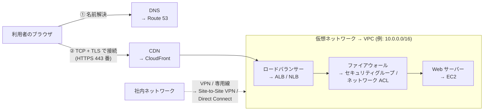
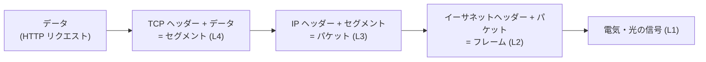

[ホーム](../README.md) > [Phase 1: 基礎](README.md) > ネットワークの基礎

# ネットワークの基礎

> **この章のゴール**
> - OSI 参照モデルと TCP/IP モデルの各層の役割を説明し、AWS のサービスがどの層で動くかを対応づけられる
> - CIDR 表記からアドレスの数と範囲を計算し、AWS のサブネットで使える IP アドレス数を求められる
> - ルートテーブルの最長一致と、NAT / NAPT の仕組みを説明できる
> - TCP と UDP の違い、ステートフルとステートレスなファイアウォールの違いを説明できる
> - DNS の名前解決、HTTP/HTTPS、TLS の流れを説明できる
> - ロードバランサー・CDN・VPN・専用線・IPv6 の基本と、対応する AWS サービスを説明できる
>
> **対応試験**: CLF-C02（第3分野 クラウドテクノロジーとサービス の土台）/ SAA-C03・SAP-C03 の前提知識
> **目安時間**: 読む 150分 / 確認問題 30分

## この章の全体像

AWS の設計問題の多くは、形を変えたネットワークの問題です。
「EC2 インスタンスがインターネットにつながらない」「プライベートサブネットから安全に外部へ通信したい」「オンプレミスと VPC の IP アドレスが重複している」――これらはすべて、この章で学ぶ IP アドレス・ルーティング・NAT・ファイアウォール・DNS の知識で解けます。
SAP-C03 では、数十の VPC とオンプレミスをつなぐ大規模ネットワークの設計が問われます。ここを曖昧にしたまま先へ進むと、Phase 2 以降で必ずつまずきます。

次の図は、利用者がブラウザで Web サイトを開くときの流れと、この章で学ぶ技術、対応する AWS サービスの関係です。

| 節 | この章で学ぶこと | AWS で登場する場所 |
|---|---|---|
| 1 | OSI 参照モデル / TCP/IP モデル | ELB の種類（ALB / NLB / GWLB）、AWS WAF |
| 2〜3 | IP アドレス、CIDR、サブネット計算 | VPC とサブネットの設計 |
| 4〜5 | ルーティング、NAT | ルートテーブル、インターネットゲートウェイ、NAT ゲートウェイ |
| 6〜7 | TCP/UDP、ポート番号、ファイアウォール | セキュリティグループ、ネットワーク ACL |
| 8 | DNS | Amazon Route 53 |
| 9〜10 | HTTP、TLS と証明書 | ALB、Amazon CloudFront、AWS Certificate Manager（ACM） |
| 11 | ロードバランサー、CDN | Elastic Load Balancing（ELB）、CloudFront |
| 12 | VPN、専用線 | AWS Site-to-Site VPN、AWS Direct Connect |
| 13 | IPv6 | デュアルスタック VPC、Egress-Only インターネットゲートウェイ |

## 1. ネットワークの階層モデル

### 1.1 なぜ階層に分けるのか

ネットワーク通信は、宅配便にたとえると理解しやすくなります。
荷物（データ）を箱に詰め、宛先ラベル（IP アドレス）を貼り、トラックや飛行機（ケーブルや電波）で運びます。送り主は輸送手段を気にする必要がなく、運送会社は荷物の中身を気にする必要がありません。

ネットワークも同じように、役割ごとに**層（レイヤー）**に分かれています。各層は自分の仕事だけに責任を持つため、ある層の技術を入れ替えても（有線 LAN → Wi-Fi など）、ほかの層はそのまま使えます。

### 1.2 OSI 参照モデルと TCP/IP モデル

| OSI 参照モデル | TCP/IP モデル | 役割 | 代表的なプロトコル・機器 | AWS での例 |
|---|---|---|---|---|
| L7 アプリケーション層 | アプリケーション層 | アプリケーション固有の通信ルール | HTTP、DNS、SMTP、SSH | ALB、AWS WAF、CloudFront、Route 53 |
| L6 プレゼンテーション層 | 〃 | データの表現形式、暗号化 | 文字コード、TLS（※） | ― |
| L5 セッション層 | 〃 | 通信の開始から終了までの管理 | ― | ― |
| L4 トランスポート層 | トランスポート層 | アプリケーション間の通信（ポート番号）、信頼性の確保 | TCP、UDP | NLB、AWS Global Accelerator |
| L3 ネットワーク層 | インターネット層 | 宛先 IP アドレスまでの経路選択 | IP、ICMP、ルーター | VPC、ルートテーブル、Transit Gateway、GWLB、Site-to-Site VPN（IPsec） |
| L2 データリンク層 | ネットワークインターフェイス層 | 隣接する機器への転送（MAC アドレス） | イーサネット、ARP、スイッチ、VLAN | Direct Connect の仮想インターフェイス（VLAN） |
| L1 物理層 | 〃 | 電気・光の信号、ケーブル | 光ファイバー、LAN ケーブル | Direct Connect の物理回線 |

※ TLS は L4 と L7 の間で動作するため、どの層に分類するかは文献によって異なります。

- **OSI 参照モデル**は 7 層の「考え方の枠組み」で、会話の共通言語として使われます（「L7 のロードバランサー」など）。
- **TCP/IP モデル**は、インターネットで実際に使われているプロトコル群に合わせた 4 層のモデルです。

### 1.3 カプセル化

送信側では、上の層から順に各層のヘッダー（宛先などの制御情報）が付け足されます。これを**カプセル化**と呼びます。受信側では逆に、下の層から順にヘッダーを外していきます。

ルーターは L3 のヘッダー（宛先 IP アドレス）を見て転送先を決め、ファイアウォールは L3/L4 のヘッダー（IP アドレスとポート番号）を見て通信を許可・拒否します。**その機器がどの層の情報を見て判断しているのか**を意識すると、AWS のサービスの違いがすっきり整理できます。

> [!TIP]
> **試験のポイント**: ロードバランサーの選択は「どの層の情報で判断するか」で決まります。
> - 「URL のパス（`/api/*`）やホスト名、HTTP ヘッダーで振り分けたい」→ L7 の **ALB**
> - 「静的 IP アドレスが必要」「TCP/UDP を超低レイテンシーで処理したい」→ L4 の **NLB**
> - 「サードパーティのファイアウォール製品を通信経路に透過的に挟みたい」→ L3 の **GWLB**

> [!WARNING]
> **ひっかけ注意**: セキュリティグループやネットワーク ACL が判断に使うのは、IP アドレス・プロトコル・ポート番号（L3/L4）までです。SQL インジェクションのように HTTP の中身（L7）を見なければ防げない攻撃は、**AWS WAF** で防ぎます。

## 2. IP アドレス

### 2.1 IPv4 アドレスの構造

IPv4 アドレスは **32 ビット**の数値で、8 ビットずつ 4 つ（オクテット）に区切り、それぞれを 10 進数（0〜255）で表します。表現できるアドレスは 2^32 = 約 43 億個しかなく、すでに新規の割り当て枠は枯渇しています。そのため、後述するプライベート IP アドレスと NAT、そして IPv6 が使われています。

2 進数と 10 進数の変換は、各ビットの重みを足し算するだけです。

| ビットの位置 | 1 | 2 | 3 | 4 | 5 | 6 | 7 | 8 |
|---|---|---|---|---|---|---|---|---|
| 重み | 128 | 64 | 32 | 16 | 8 | 4 | 2 | 1 |

例えば 130 = 128 + 2 なので `10000010` です。`192.168.1.130` を 2 進数で書くと `11000000.10101000.00000001.10000010` になります。
サブネットマスクの計算でよく使う値は、次の 8 つだけ覚えておけば十分です。

| 10 進数 | 128 | 192 | 224 | 240 | 248 | 252 | 254 | 255 |
|---|---|---|---|---|---|---|---|---|
| 2 進数 | 10000000 | 11000000 | 11100000 | 11110000 | 11111000 | 11111100 | 11111110 | 11111111 |

### 2.2 ネットワーク部とホスト部

IP アドレスは、住所の「〇〇町 1 丁目」にあたる**ネットワーク部**と、「番地」にあたる**ホスト部**に分かれます。
ネットワーク部が同じ機器どうしは直接通信でき、異なるネットワークへはルーターを経由して通信します。どこまでがネットワーク部なのかを示すのが、次節の CIDR 表記とサブネットマスクです。

### 2.3 プライベート IP アドレスとパブリック IP アドレス

**パブリック IP アドレス**は、インターネット上で一意になるよう管理・割り当てされるアドレスです。
一方、組織の内部で自由に使ってよい範囲として、RFC 1918 で次の 3 つの**プライベート IP アドレス**が定められています。プライベート IP アドレスはインターネット上ではルーティングされません。

| 範囲 | CIDR 表記 | アドレス数 | 典型的な用途 |
|---|---|---|---|
| 10.0.0.0 〜 10.255.255.255 | 10.0.0.0/8 | 16,777,216 | 大企業の社内網、VPC（10.0.0.0/16 など） |
| 172.16.0.0 〜 172.31.255.255 | 172.16.0.0/12 | 1,048,576 | 中規模の社内網、AWS のデフォルト VPC（172.31.0.0/16） |
| 192.168.0.0 〜 192.168.255.255 | 192.168.0.0/16 | 65,536 | 家庭や小規模オフィス |

AWS では次のように使われます。

- VPC には、原則として RFC 1918 の範囲から CIDR を割り当てます（[VPC CIDR ブロック](https://docs.aws.amazon.com/vpc/latest/userguide/vpc-cidr-blocks.html)）。
- EC2 インスタンスには、サブネットの範囲から**プライベート IPv4 アドレス**が必ず割り当てられます。
- インターネットと通信するには、**パブリック IPv4 アドレス**（自動割り当て。停止・起動で変わる）または **Elastic IP アドレス**（固定。明示的に解放するまでアカウントに保持される）を関連付けます。
- パブリック IPv4 アドレスは、使用中かどうかにかかわらず 1 個あたり 1 時間 0.005 USD の料金がかかります（2024年2月から。2026年9月時点）。

特別な意味を持つアドレスも押さえておきましょう。

| アドレス | 意味 | AWS との関係 |
|---|---|---|
| 127.0.0.0/8（127.0.0.1） | ループバック（自分自身） | 同じインスタンス内での通信 |
| 169.254.0.0/16 | リンクローカル | 169.254.169.254 はインスタンスメタデータサービス（IMDS） |
| 0.0.0.0/0 | すべての IPv4 アドレス | ルートテーブルのデフォルトルート、セキュリティグループの「どこからでも」 |
| 100.64.0.0/10 | 共有アドレス空間（RFC 6598。通信事業者の NAT 用） | VPC のセカンダリ CIDR として使える（EKS の IP アドレス不足対策など） |

> [!WARNING]
> **ひっかけ注意**: 172.17.0.0/16 は Docker の既定のネットワークや一部の AWS サービスが使うため、VPC の CIDR には使わないよう AWS のドキュメントで案内されています。

> [!TIP]
> **試験のポイント**: CIDR が重複している VPC どうしは **VPC ピアリングで接続できません**。オンプレミスとの接続でも重複は問題になります。「将来の接続を見越して重複しない CIDR を計画する」が定石で、Phase 3 では VPC IPAM による一元管理を学びます（[高度なネットワーク設計](../03-professional/04-advanced-networking.md)）。

## 3. CIDR とサブネット計算

### 3.1 CIDR 表記とサブネットマスク

**CIDR（Classless Inter-Domain Routing）表記**は、`10.0.0.0/16` のように「先頭から何ビットがネットワーク部か」を `/n` で表します。`/n` を**プレフィックス長**と呼びます。
同じ情報を 32 ビットのマスクで表したものが**サブネットマスク**で、ネットワーク部を 1、ホスト部を 0 にします。

- /16 → `11111111.11111111.00000000.00000000` = 255.255.0.0
- /20 → `11111111.11111111.11110000.00000000` = 255.255.240.0
- /26 → `11111111.11111111.11111111.11000000` = 255.255.255.192

> [!NOTE]
> かつては IP アドレスを「クラス A（/8）・B（/16）・C（/24）」の固定の大きさで割り当てていました。CIDR の「クラスレス」は、この制約をなくして任意の長さで区切れるようにしたことを意味します。

### 3.2 アドレス数の公式と AWS の予約アドレス

ホスト部のビット数は 32 − n なので、次の公式が成り立ちます。

- **アドレスの総数** = 2^(32 − n)
- **一般的なネットワークで使えるホスト数** = 2^(32 − n) − 2（先頭のネットワークアドレスと末尾のブロードキャストアドレスを除く）
- **AWS のサブネットで使える数** = 2^(32 − n) − 5

AWS では、各サブネットの**先頭 4 個と末尾 1 個**のアドレスが予約されます。10.0.0.0/24 の場合は次のとおりです（[サブネットの CIDR ブロック](https://docs.aws.amazon.com/vpc/latest/userguide/subnet-sizing.html)）。

| アドレス | 用途 |
|---|---|
| 10.0.0.0 | ネットワークアドレス |
| 10.0.0.1 | VPC ルーター用 |
| 10.0.0.2 | DNS サーバー用（Amazon が提供する DNS サーバーの IP は「VPC の CIDR の先頭 + 2」。各サブネットでも「先頭 + 2」を予約） |
| 10.0.0.3 | 将来の利用のために予約 |
| 10.0.0.255 | ネットワークブロードキャストアドレス（VPC はブロードキャストに対応しないため予約） |

| プレフィックス長 | サブネットマスク | アドレス総数 | AWS で使える数 | メモ |
|---|---|---|---|---|
| /16 | 255.255.0.0 | 65,536 | 65,531 | VPC・サブネットの最大サイズ |
| /17 | 255.255.128.0 | 32,768 | 32,763 | |
| /18 | 255.255.192.0 | 16,384 | 16,379 | |
| /19 | 255.255.224.0 | 8,192 | 8,187 | |
| /20 | 255.255.240.0 | 4,096 | 4,091 | デフォルト VPC のデフォルトサブネット |
| /21 | 255.255.248.0 | 2,048 | 2,043 | |
| /22 | 255.255.252.0 | 1,024 | 1,019 | |
| /23 | 255.255.254.0 | 512 | 507 | |
| /24 | 255.255.255.0 | 256 | 251 | よく使われるサブネットサイズ |
| /25 | 255.255.255.128 | 128 | 123 | |
| /26 | 255.255.255.192 | 64 | 59 | |
| /27 | 255.255.255.224 | 32 | 27 | |
| /28 | 255.255.255.240 | 16 | 11 | VPC・サブネットの最小サイズ |

プレフィックス長が 1 小さくなる（/24 → /23）と、アドレス数は 2 倍になります。

> [!IMPORTANT]
> - AWS の VPC とサブネットに指定できる IPv4 CIDR は **/16〜/28** です。
> - 作成済みの CIDR ブロックの大きさは**後から変更できません**。足りなくなったら VPC にセカンダリ CIDR を追加します。最初から余裕を持って設計しましょう。
