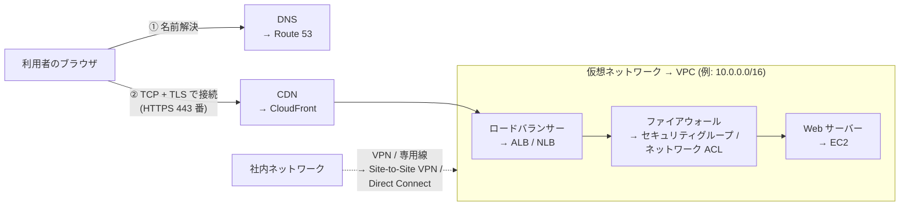
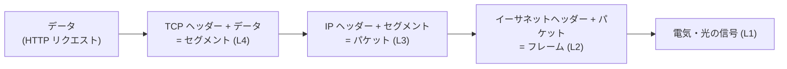
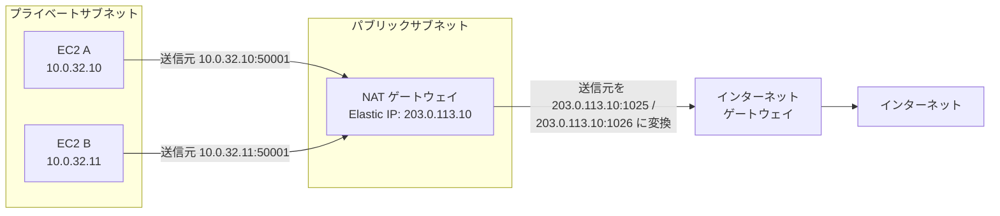
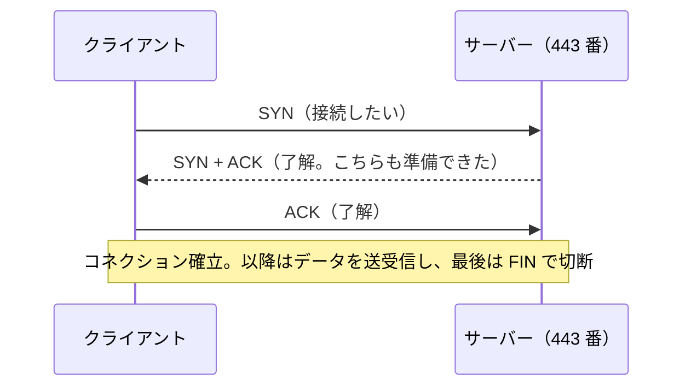
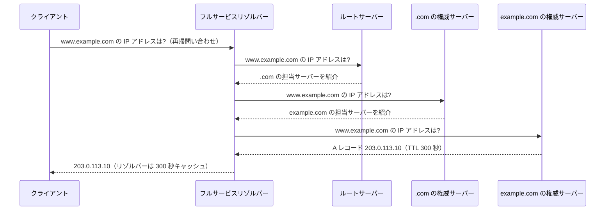
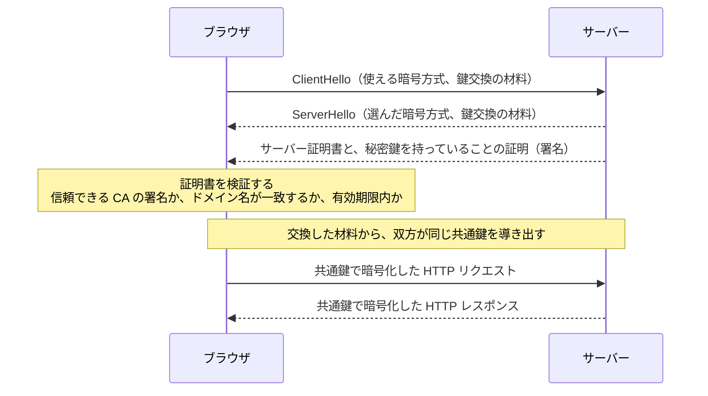

[ホーム](../README.md) > [Phase 1: 基礎](README.md) > ネットワークの基礎

# ネットワークの基礎

> **この章のゴール**
> - OSI 参照モデルと TCP/IP モデルの各層の役割を説明し、AWS のサービスがどの層で動くかを対応づけられる
> - CIDR 表記からアドレスの数と範囲を計算し、AWS のサブネットで使える IP アドレス数を求められる
> - ルートテーブルの最長一致と、NAT / NAPT の仕組みを説明できる
> - TCP と UDP の違い、ステートフルとステートレスなファイアウォールの違いを説明できる
> - DNS の名前解決、HTTP/HTTPS、TLS の流れを説明できる
> - ロードバランサー・CDN・VPN・専用線・IPv6 の基本と、対応する AWS サービスを説明できる
>
> **対応試験**: CLF-C02（第3分野 クラウドテクノロジーとサービス の土台）/ SAA-C03・SAP-C03 の前提知識
> **目安時間**: 読む 150分 / 確認問題 30分

## この章の全体像

AWS の設計問題の多くは、形を変えたネットワークの問題です。
「EC2 インスタンスがインターネットにつながらない」「プライベートサブネットから安全に外部へ通信したい」「オンプレミスと VPC の IP アドレスが重複している」――これらはすべて、この章で学ぶ IP アドレス・ルーティング・NAT・ファイアウォール・DNS の知識で解けます。
SAP-C03 では、数十の VPC とオンプレミスをつなぐ大規模ネットワークの設計が問われます。ここを曖昧にしたまま先へ進むと、Phase 2 以降で必ずつまずきます。

次の図は、利用者がブラウザで Web サイトを開くときの流れと、この章で学ぶ技術、対応する AWS サービスの関係です。



| 節 | この章で学ぶこと | AWS で登場する場所 |
|---|---|---|
| 1 | OSI 参照モデル / TCP/IP モデル | ELB の種類（ALB / NLB / GWLB）、AWS WAF |
| 2〜3 | IP アドレス、CIDR、サブネット計算 | VPC とサブネットの設計 |
| 4〜5 | ルーティング、NAT | ルートテーブル、インターネットゲートウェイ、NAT ゲートウェイ |
| 6〜7 | TCP/UDP、ポート番号、ファイアウォール | セキュリティグループ、ネットワーク ACL |
| 8 | DNS | Amazon Route 53 |
| 9〜10 | HTTP、TLS と証明書 | ALB、Amazon CloudFront、AWS Certificate Manager（ACM） |
| 11 | ロードバランサー、CDN | Elastic Load Balancing（ELB）、CloudFront |
| 12 | VPN、専用線 | AWS Site-to-Site VPN、AWS Direct Connect |
| 13 | IPv6 | デュアルスタック VPC、Egress-Only インターネットゲートウェイ |

## 1. ネットワークの階層モデル

### 1.1 なぜ階層に分けるのか

ネットワーク通信は、宅配便にたとえると理解しやすくなります。
荷物（データ）を箱に詰め、宛先ラベル（IP アドレス）を貼り、トラックや飛行機（ケーブルや電波）で運びます。送り主は輸送手段を気にする必要がなく、運送会社は荷物の中身を気にする必要がありません。

ネットワークも同じように、役割ごとに**層（レイヤー）**に分かれています。各層は自分の仕事だけに責任を持つため、ある層の技術を入れ替えても（有線 LAN → Wi-Fi など）、ほかの層はそのまま使えます。

### 1.2 OSI 参照モデルと TCP/IP モデル

| OSI 参照モデル | TCP/IP モデル | 役割 | 代表的なプロトコル・機器 | AWS での例 |
|---|---|---|---|---|
| L7 アプリケーション層 | アプリケーション層 | アプリケーション固有の通信ルール | HTTP、DNS、SMTP、SSH | ALB、AWS WAF、CloudFront、Route 53 |
| L6 プレゼンテーション層 | 〃 | データの表現形式、暗号化 | 文字コード、TLS（※） | ― |
| L5 セッション層 | 〃 | 通信の開始から終了までの管理 | ― | ― |
| L4 トランスポート層 | トランスポート層 | アプリケーション間の通信（ポート番号）、信頼性の確保 | TCP、UDP | NLB、AWS Global Accelerator |
| L3 ネットワーク層 | インターネット層 | 宛先 IP アドレスまでの経路選択 | IP、ICMP、ルーター | VPC、ルートテーブル、Transit Gateway、GWLB、Site-to-Site VPN（IPsec） |
| L2 データリンク層 | ネットワークインターフェイス層 | 隣接する機器への転送（MAC アドレス） | イーサネット、ARP、スイッチ、VLAN | Direct Connect の仮想インターフェイス（VLAN） |
| L1 物理層 | 〃 | 電気・光の信号、ケーブル | 光ファイバー、LAN ケーブル | Direct Connect の物理回線 |

※ TLS は L4 と L7 の間で動作するため、どの層に分類するかは文献によって異なります。

- **OSI 参照モデル**は 7 層の「考え方の枠組み」で、会話の共通言語として使われます（「L7 のロードバランサー」など）。
- **TCP/IP モデル**は、インターネットで実際に使われているプロトコル群に合わせた 4 層のモデルです。

### 1.3 カプセル化

送信側では、上の層から順に各層のヘッダー（宛先などの制御情報）が付け足されます。これを**カプセル化**と呼びます。受信側では逆に、下の層から順にヘッダーを外していきます。



ルーターは L3 のヘッダー（宛先 IP アドレス）を見て転送先を決め、ファイアウォールは L3/L4 のヘッダー（IP アドレスとポート番号）を見て通信を許可・拒否します。**その機器がどの層の情報を見て判断しているのか**を意識すると、AWS のサービスの違いがすっきり整理できます。

> [!TIP]
> **試験のポイント**: ロードバランサーの選択は「どの層の情報で判断するか」で決まります。
> - 「URL のパス（`/api/*`）やホスト名、HTTP ヘッダーで振り分けたい」→ L7 の **ALB**
> - 「静的 IP アドレスが必要」「TCP/UDP を超低レイテンシーで処理したい」→ L4 の **NLB**
> - 「サードパーティのファイアウォール製品を通信経路に透過的に挟みたい」→ L3 の **GWLB**

> [!WARNING]
> **ひっかけ注意**: セキュリティグループやネットワーク ACL が判断に使うのは、IP アドレス・プロトコル・ポート番号（L3/L4）までです。SQL インジェクションのように HTTP の中身（L7）を見なければ防げない攻撃は、**AWS WAF** で防ぎます。

## 2. IP アドレス

### 2.1 IPv4 アドレスの構造

IPv4 アドレスは **32 ビット**の数値で、8 ビットずつ 4 つ（オクテット）に区切り、それぞれを 10 進数（0〜255）で表します。表現できるアドレスは 2^32 = 約 43 億個しかなく、すでに新規の割り当て枠は枯渇しています。そのため、後述するプライベート IP アドレスと NAT、そして IPv6 が使われています。

2 進数と 10 進数の変換は、各ビットの重みを足し算するだけです。

| ビットの位置 | 1 | 2 | 3 | 4 | 5 | 6 | 7 | 8 |
|---|---|---|---|---|---|---|---|---|
| 重み | 128 | 64 | 32 | 16 | 8 | 4 | 2 | 1 |

例えば 130 = 128 + 2 なので `10000010` です。`192.168.1.130` を 2 進数で書くと `11000000.10101000.00000001.10000010` になります。
サブネットマスクの計算でよく使う値は、次の 8 つだけ覚えておけば十分です。

| 10 進数 | 128 | 192 | 224 | 240 | 248 | 252 | 254 | 255 |
|---|---|---|---|---|---|---|---|---|
| 2 進数 | 10000000 | 11000000 | 11100000 | 11110000 | 11111000 | 11111100 | 11111110 | 11111111 |

### 2.2 ネットワーク部とホスト部

IP アドレスは、住所の「〇〇町 1 丁目」にあたる**ネットワーク部**と、「番地」にあたる**ホスト部**に分かれます。
ネットワーク部が同じ機器どうしは直接通信でき、異なるネットワークへはルーターを経由して通信します。どこまでがネットワーク部なのかを示すのが、次節の CIDR 表記とサブネットマスクです。

### 2.3 プライベート IP アドレスとパブリック IP アドレス

**パブリック IP アドレス**は、インターネット上で一意になるよう管理・割り当てされるアドレスです。
一方、組織の内部で自由に使ってよい範囲として、RFC 1918 で次の 3 つの**プライベート IP アドレス**が定められています。プライベート IP アドレスはインターネット上ではルーティングされません。

| 範囲 | CIDR 表記 | アドレス数 | 典型的な用途 |
|---|---|---|---|
| 10.0.0.0 〜 10.255.255.255 | 10.0.0.0/8 | 16,777,216 | 大企業の社内網、VPC（10.0.0.0/16 など） |
| 172.16.0.0 〜 172.31.255.255 | 172.16.0.0/12 | 1,048,576 | 中規模の社内網、AWS のデフォルト VPC（172.31.0.0/16） |
| 192.168.0.0 〜 192.168.255.255 | 192.168.0.0/16 | 65,536 | 家庭や小規模オフィス |

AWS では次のように使われます。

- VPC には、原則として RFC 1918 の範囲から CIDR を割り当てます（[VPC CIDR ブロック](https://docs.aws.amazon.com/vpc/latest/userguide/vpc-cidr-blocks.html)）。
- EC2 インスタンスには、サブネットの範囲から**プライベート IPv4 アドレス**が必ず割り当てられます。
- インターネットと通信するには、**パブリック IPv4 アドレス**（自動割り当て。停止・起動で変わる）または **Elastic IP アドレス**（固定。明示的に解放するまでアカウントに保持される）を関連付けます。
- パブリック IPv4 アドレスは、使用中かどうかにかかわらず 1 個あたり 1 時間 0.005 USD の料金がかかります（2024年2月から。2026年9月時点）。

特別な意味を持つアドレスも押さえておきましょう。

| アドレス | 意味 | AWS との関係 |
|---|---|---|
| 127.0.0.0/8（127.0.0.1） | ループバック（自分自身） | 同じインスタンス内での通信 |
| 169.254.0.0/16 | リンクローカル | 169.254.169.254 はインスタンスメタデータサービス（IMDS） |
| 0.0.0.0/0 | すべての IPv4 アドレス | ルートテーブルのデフォルトルート、セキュリティグループの「どこからでも」 |
| 100.64.0.0/10 | 共有アドレス空間（RFC 6598。通信事業者の NAT 用） | VPC のセカンダリ CIDR として使える（EKS の IP アドレス不足対策など） |

> [!WARNING]
> **ひっかけ注意**: 172.17.0.0/16 は Docker の既定のネットワークや一部の AWS サービスが使うため、VPC の CIDR には使わないよう AWS のドキュメントで案内されています。

> [!TIP]
> **試験のポイント**: CIDR が重複している VPC どうしは **VPC ピアリングで接続できません**。オンプレミスとの接続でも重複は問題になります。「将来の接続を見越して重複しない CIDR を計画する」が定石で、Phase 3 では VPC IPAM による一元管理を学びます（[高度なネットワーク設計](../03-professional/04-advanced-networking.md)）。

## 3. CIDR とサブネット計算

### 3.1 CIDR 表記とサブネットマスク

**CIDR（Classless Inter-Domain Routing）表記**は、`10.0.0.0/16` のように「先頭から何ビットがネットワーク部か」を `/n` で表します。`/n` を**プレフィックス長**と呼びます。
同じ情報を 32 ビットのマスクで表したものが**サブネットマスク**で、ネットワーク部を 1、ホスト部を 0 にします。

- /16 → `11111111.11111111.00000000.00000000` = 255.255.0.0
- /20 → `11111111.11111111.11110000.00000000` = 255.255.240.0
- /26 → `11111111.11111111.11111111.11000000` = 255.255.255.192

> [!NOTE]
> かつては IP アドレスを「クラス A（/8）・B（/16）・C（/24）」の固定の大きさで割り当てていました。CIDR の「クラスレス」は、この制約をなくして任意の長さで区切れるようにしたことを意味します。

### 3.2 アドレス数の公式と AWS の予約アドレス

ホスト部のビット数は 32 − n なので、次の公式が成り立ちます。

- **アドレスの総数** = 2^(32 − n)
- **一般的なネットワークで使えるホスト数** = 2^(32 − n) − 2（先頭のネットワークアドレスと末尾のブロードキャストアドレスを除く）
- **AWS のサブネットで使える数** = 2^(32 − n) − 5

AWS では、各サブネットの**先頭 4 個と末尾 1 個**のアドレスが予約されます。10.0.0.0/24 の場合は次のとおりです（[サブネットの CIDR ブロック](https://docs.aws.amazon.com/vpc/latest/userguide/subnet-sizing.html)）。

| アドレス | 用途 |
|---|---|
| 10.0.0.0 | ネットワークアドレス |
| 10.0.0.1 | VPC ルーター用 |
| 10.0.0.2 | DNS サーバー用（Amazon が提供する DNS サーバーの IP は「VPC の CIDR の先頭 + 2」。各サブネットでも「先頭 + 2」を予約） |
| 10.0.0.3 | 将来の利用のために予約 |
| 10.0.0.255 | ネットワークブロードキャストアドレス（VPC はブロードキャストに対応しないため予約） |

| プレフィックス長 | サブネットマスク | アドレス総数 | AWS で使える数 | メモ |
|---|---|---|---|---|
| /16 | 255.255.0.0 | 65,536 | 65,531 | VPC・サブネットの最大サイズ |
| /17 | 255.255.128.0 | 32,768 | 32,763 | |
| /18 | 255.255.192.0 | 16,384 | 16,379 | |
| /19 | 255.255.224.0 | 8,192 | 8,187 | |
| /20 | 255.255.240.0 | 4,096 | 4,091 | デフォルト VPC のデフォルトサブネット |
| /21 | 255.255.248.0 | 2,048 | 2,043 | |
| /22 | 255.255.252.0 | 1,024 | 1,019 | |
| /23 | 255.255.254.0 | 512 | 507 | |
| /24 | 255.255.255.0 | 256 | 251 | よく使われるサブネットサイズ |
| /25 | 255.255.255.128 | 128 | 123 | |
| /26 | 255.255.255.192 | 64 | 59 | |
| /27 | 255.255.255.224 | 32 | 27 | |
| /28 | 255.255.255.240 | 16 | 11 | VPC・サブネットの最小サイズ |

プレフィックス長が 1 小さくなる（/24 → /23）と、アドレス数は 2 倍になります。

> [!IMPORTANT]
> - AWS の VPC とサブネットに指定できる IPv4 CIDR は **/16〜/28** です。
> - 作成済みの CIDR ブロックの大きさは**後から変更できません**。足りなくなったら VPC にセカンダリ CIDR を追加します。最初から余裕を持って設計しましょう。

### 3.3 サブネット計算の手順（4 ステップ）

「この IP アドレスはどのサブネットに属するか」「範囲はどこからどこまでか」は、次の 4 ステップで求められます。例として `10.0.1.200/23` を使います。

1. **区切りのオクテットを見つける**: /23 = 8 + 8 + 7 なので、ネットワーク部とホスト部の境目は第 3 オクテットにあります（第 3 オクテットの上位 7 ビットまでがネットワーク部）。
2. **ブロックサイズを求める**: 区切りのオクテットに残るホスト部は 8 − 7 = 1 ビットなので、2^1 = **2** です。サブネットマスクから「256 − 254 = 2」と求めても同じです。サブネットは第 3 オクテットが 0、2、4、6 …… と 2 刻みで並びます。
3. **ネットワークアドレス（先頭）を求める**: 第 3 オクテットの値 1 を、ブロックサイズ 2 の倍数に切り捨てると 0 です。よって先頭は **10.0.0.0** です。
4. **末尾を求める**: 次のブロックの先頭（10.0.2.0）の 1 つ前、**10.0.1.255** が末尾（ブロードキャストアドレス）です。

結論: `10.0.1.200/23` は `10.0.0.0/23`（10.0.0.0〜10.0.1.255 の 512 個）に属します。AWS のサブネットなら、使えるのは 10.0.0.4〜10.0.1.254 の 507 個です。

この方法が正しい理由は、2 進数で確かめると分かります。IP アドレスとサブネットマスクの **AND**（両方が 1 のビットだけを 1 にする演算）を取ると、ホスト部がすべて 0 になり、ネットワークアドレスが残ります。

```text
IP アドレス   192.168.10.77   = 11000000.10101000.00001010.01001101
マスク(/26)   255.255.255.192 = 11111111.11111111.11111111.11000000
AND の結果    192.168.10.64   = 11000000.10101000.00001010.01000000
```

/26 のブロックサイズは 64 なので、77 を 64 の倍数に切り捨てた 64 と一致します。範囲は 192.168.10.64〜192.168.10.127 です。

> [!TIP]
> **試験のポイント**: 試験で問われるのは「使えるアドレスの数」「ある IP アドレスが範囲に含まれるか」「CIDR どうしが重複するか」がほとんどです。2^(32 − n) と「AWS では 5 個予約」を確実に覚えましょう（/28 → 11 個、/24 → 251 個）。

### 3.4 VPC をサブネットに分割する

VPC の CIDR を小さなサブネットに分割するときは、「ホスト部から何ビット借りるか」で考えます。

- **作れるサブネットの数** = 2^(新しいプレフィックス長 − 元のプレフィックス長)
- 例: 10.0.0.0/16 を /20 に分割すると 2^(20 − 16) = **16 個**。1 個あたり 4,096 アドレス（AWS で使えるのは 4,091 個）
- /20 のブロックサイズは第 3 オクテットで 16 なので、10.0.0.0/20、10.0.16.0/20、10.0.32.0/20、……、10.0.240.0/20 と並びます。

| # | サブネットの CIDR | 範囲 | 用途の例 |
|---|---|---|---|
| 1 | 10.0.0.0/20 | 10.0.0.0 〜 10.0.15.255 | パブリックサブネット（AZ-a） |
| 2 | 10.0.16.0/20 | 10.0.16.0 〜 10.0.31.255 | パブリックサブネット（AZ-c） |
| 3 | 10.0.32.0/20 | 10.0.32.0 〜 10.0.47.255 | プライベートサブネット（AZ-a） |
| 4 | 10.0.48.0/20 | 10.0.48.0 〜 10.0.63.255 | プライベートサブネット（AZ-c） |
| … | … | … | … |
| 16 | 10.0.240.0/20 | 10.0.240.0 〜 10.0.255.255 | 将来の拡張用に空けておく |

> [!NOTE]
> AWS のサブネットは **1 つの AZ に属します**（VPC はリージョン内のすべての AZ にまたがります）。高可用性のために、同じ役割のサブネットを複数の AZ に作るのが基本です。また、同じ VPC の中でサブネットどうしの CIDR を重複させることはできません。

### 3.5 練習問題（サブネット計算）

紙とペンを用意して、3.3 節の手順で解いてみましょう。

1. AWS のサブネット 10.0.1.0/24 で、EC2 インスタンスなどに割り当てられる IP アドレスはいくつですか。
2. AWS で作成できる最小のサブネット（/28）で使える IP アドレスはいくつですか。
3. 10.0.0.0/16 の VPC を /20 のサブネットに分割すると、サブネットはいくつ作れますか。また、3 番目のサブネットの CIDR は何ですか。
4. 10.0.1.200 は 10.0.0.0/23 に含まれますか。
5. 10.0.2.10 は 10.0.0.0/23 に含まれますか。
6. 172.16.5.130/26 が属するネットワークの先頭アドレスと範囲を答えてください。また、AWS のサブネットで 172.16.5.130 を EC2 インスタンスに割り当てられますか。
7. 1 つのサブネットに少なくとも 500 個の IP アドレスが必要です。AWS で要件を満たす最も小さいサブネットのプレフィックス長はいくつですか。
8. 192.168.0.0/22 を、同じ大きさの 4 つのサブネットに分割してください。
9. 10.0.0.0/16 の VPC と 10.0.128.0/17 の VPC を、VPC ピアリングで接続できますか。
10. サブネットマスク 255.255.255.224 をプレフィックス長で表してください。また、アドレスの総数はいくつですか。

<details>
<summary>解答と解き方</summary>

1. **251 個**。2^(32 − 24) = 256。AWS の予約 5 個を引いて 256 − 5 = 251。
2. **11 個**。2^(32 − 28) = 16 − 5 = 11。一般的なネットワークの計算（16 − 2 = 14）と混同しないようにします。
3. **16 個**、3 番目は **10.0.32.0/20**。2^(20 − 16) = 16。ブロックサイズは第 3 オクテットで 16 なので、10.0.0.0 → 10.0.16.0 → 10.0.32.0 と進みます。
4. **含まれる**。/23 のブロックサイズは第 3 オクテットで 2 です。10.0.0.0/23 の範囲は 10.0.0.0〜10.0.1.255 なので、10.0.1.200 は範囲内です。
5. **含まれない**。第 3 オクテットの 2 は 2 の倍数なので、10.0.2.10 は次のブロック 10.0.2.0/23（10.0.2.0〜10.0.3.255）に属します。
6. 先頭は **172.16.5.128**、範囲は **172.16.5.128〜172.16.5.191**。/26 のブロックサイズは第 4 オクテットで 64 で、130 を 64 の倍数に切り捨てると 128 です。172.16.5.130 はサブネットの「先頭 + 2」（DNS 用の予約アドレス）なので、AWS では**割り当てられません**。使えるのは 172.16.5.132〜172.16.5.190 の 59 個です。
7. **/23**。2^(32 − n) − 5 ≥ 500 を満たす最小のサイズを探します。/24 は 251 個で足りず、/23 は 512 − 5 = 507 個で足ります。
8. 4 = 2^2 なので 2 ビット借りて **/24 が 4 つ**: 192.168.0.0/24、192.168.1.0/24、192.168.2.0/24、192.168.3.0/24。
9. **接続できない**。10.0.128.0/17（10.0.128.0〜10.0.255.255）は 10.0.0.0/16（10.0.0.0〜10.0.255.255）にすっぽり含まれ、CIDR が重複しているためです。
10. **/27**、総数は **32 個**。224 = `11100000` で第 4 オクテットに 1 が 3 個あるので 24 + 3 = 27。2^(32 − 27) = 32 です（AWS で使えるのは 27 個）。

</details>

## 4. ルーティング

### 4.1 デフォルトゲートウェイ

同じサブネット内の相手には直接届けられますが、ほかのネットワーク宛てのパケットはルーターに渡す必要があります。ホストが「自分のネットワーク以外宛て」のパケットを最初に渡すルーターを**デフォルトゲートウェイ**と呼びます。
AWS では、各サブネットの「先頭 + 1」のアドレスにある **VPC ルーター**がこの役割を担います（3.2 節の予約アドレス）。VPC ルーターは目に見える機器ではなく、VPC に組み込まれた機能です。

### 4.2 ルートテーブル

ルーターは**ルートテーブル**（経路表）を見て転送先を決めます。各行は「**送信先**（宛先の CIDR）」と「**ターゲット**（次に渡す先）」の組です。VPC では、各サブネットに 1 つのルートテーブルを関連付けます（[ルートテーブル](https://docs.aws.amazon.com/vpc/latest/userguide/VPC_Route_Tables.html)）。

| 送信先 | ターゲット | 意味 |
|---|---|---|
| 10.0.0.0/16 | local | VPC 内の通信（自動で作成され、削除できない） |
| 0.0.0.0/0 | igw-xxxx | それ以外の宛先はすべてインターネットゲートウェイへ |

**パブリックサブネット**と**プライベートサブネット**の違いは、このルートテーブルだけです。0.0.0.0/0 がインターネットゲートウェイ（IGW）に向いているサブネットをパブリックサブネットと呼びます。サブネットの設定に「パブリック」というスイッチがあるわけではありません。

> [!TIP]
> **試験のポイント**: 「パブリックサブネットの EC2 インスタンスがインターネットにつながらない」ときの確認項目は、① IGW が VPC にアタッチされているか、② ルートテーブルに 0.0.0.0/0 → IGW があるか、③ パブリック IP アドレス（または Elastic IP アドレス）が付いているか、④ セキュリティグループとネットワーク ACL で通信が許可されているか、の 4 つです。

### 4.3 最長一致（ロンゲストマッチ）

宛先が複数のルートに当てはまるときは、**プレフィックス長が最も長い（最も具体的な）ルート**が選ばれます。これを**最長一致**と呼びます。0.0.0.0/0 はプレフィックス長 0 で最も短いため、ほかのどのルートにも当てはまらないときだけ使われます。だから「デフォルトルート」と呼ばれるのです。

次の（説明用の）ルートテーブルで確かめてみましょう。

| 送信先 | ターゲット |
|---|---|
| 10.0.0.0/16 | local |
| 172.16.0.0/16 | pcx-1111（VPC ピアリング） |
| 172.16.5.0/24 | vgw-2222（Site-to-Site VPN） |
| 0.0.0.0/0 | nat-3333（NAT ゲートウェイ） |

| 宛先 IP アドレス | 当てはまるルート | 選ばれるルート |
|---|---|---|
| 172.16.5.10 | 172.16.0.0/16、172.16.5.0/24、0.0.0.0/0 | **172.16.5.0/24 → VPN**（最も長い /24） |
| 172.16.9.10 | 172.16.0.0/16、0.0.0.0/0 | **172.16.0.0/16 → VPC ピアリング** |
| 10.0.3.4 | 10.0.0.0/16、0.0.0.0/0 | **local** |
| 8.8.8.8 | 0.0.0.0/0 のみ | **NAT ゲートウェイ** |

> [!NOTE]
> Direct Connect や VPN、Transit Gateway を組み合わせた大規模なネットワークでは、最長一致に加えて「プレフィックス長が同じならどの経路を優先するか」も問われます。Phase 2 の [VPC とネットワーク設計](../02-associate/02-vpc.md)、Phase 3 の [高度なネットワーク設計](../03-professional/04-advanced-networking.md) で扱います。

## 5. NAT と NAPT

### 5.1 NAT（1 対 1 の変換）

**NAT（Network Address Translation）**は、パケットの IP アドレスを書き換える技術です。プライベート IP アドレスのままではインターネットと通信できないため、ネットワークの境界でパブリック IP アドレスに変換します。
AWS の**インターネットゲートウェイは、EC2 インスタンスのプライベート IP アドレスとパブリック IP アドレスを 1 対 1 で変換**しています。そのため、インスタンスの OS から見える IPv4 アドレスはプライベート IP アドレスだけです（`ip addr` コマンドで確認しても、パブリック IP アドレスは表示されません）。

### 5.2 NAPT（多対 1 の変換）

**NAPT（Network Address Port Translation。IP マスカレード、PAT とも呼びます）**は、IP アドレスに加えてポート番号も書き換えることで、**多数のプライベート IP アドレスが 1 つのパブリック IP アドレスを共有**できるようにする技術です。家庭用ルーターが、家じゅうのスマートフォンや PC を 1 つのパブリック IP アドレスでインターネットにつないでいるのがこの仕組みです。

AWS の **NAT ゲートウェイ**はこの NAPT を提供します。プライベートサブネットのインスタンスは NAT ゲートウェイ経由でインターネットへ**送信**できますが、インターネット側から新しい接続を始めることはできません。変換表に載っていない通信は、どのインスタンスに届ければよいか分からないからです。



NAT ゲートウェイは「10.0.32.10:50001 ⇔ 203.0.113.10:1025」「10.0.32.11:50001 ⇔ 203.0.113.10:1026」という変換表を持ち、戻りのパケットを正しいインスタンスに届けます。

> [!TIP]
> **試験のポイント**: 「プライベートサブネットのインスタンスから、パッチの取得などインターネットへの送信だけを許可し、インターネットからの接続は受け付けない」→ パブリックサブネットに **NAT ゲートウェイ**を置き、プライベートサブネットのルートテーブルに「0.0.0.0/0 → NAT ゲートウェイ」を追加します。IPv6 の場合は **Egress-Only インターネットゲートウェイ**を使います（13 節）。

> [!NOTE]
> NAT ゲートウェイは従来、AZ ごとに作成する方式で、高可用性のために「AZ ごとに 1 つずつ」置くのが定石です（試験もこの前提で出題されます）。2025年11月には、1 つで複数の AZ に自動的に広がる**リージョナル NAT ゲートウェイ**も登場しました（2026年9月時点）。詳しくは [VPC とネットワーク設計](../02-associate/02-vpc.md) で学びます。

## 6. TCP と UDP、ポート番号

### 6.1 ポート番号

IP アドレスが「建物の住所」なら、**ポート番号**は「部屋番号」です。1 台のサーバーで Web サーバーと SSH サーバーが同時に動いていても、ポート番号（443 と 22）でどのプログラム宛ての通信かを区別します。ポート番号は 0〜65535 で、0〜1023 は主要なサービス用に予約された**ウェルノウンポート**です。

クライアント側のポートは、通信のたびに OS が空いている大きな番号を一時的に選びます。これを**エフェメラルポート**（一時ポート）と呼びます。範囲は OS によって異なる（多くの Linux は 32768 番以降、最近の Windows は 49152〜65535）ため、AWS のドキュメントではネットワーク ACL で 1024〜65535 を許可する例が示されています（7 節）。

### 6.2 TCP: 信頼性を重視した通信

**TCP** は、データを確実に、順番どおりに届けるためのプロトコルです。

- 通信を始める前に **3 ウェイハンドシェイク**で**コネクション**（論理的な通信路）を確立します。
- 受け取ったデータには確認応答（ACK）を返し、届かなければ再送します。
- 受信側の処理能力やネットワークの混雑に合わせて、送る量を調整します（フロー制御・輻輳制御）。



### 6.3 UDP: 軽量で速い通信

**UDP** は、ハンドシェイクも再送もせずにデータを送ります。信頼性は低い代わりにオーバーヘッドと遅延が小さいため、多少の欠落より速さが大事な用途に向いています。

| 観点 | TCP | UDP |
|---|---|---|
| コネクション | あり（3 ウェイハンドシェイク） | なし |
| 信頼性 | 再送・順序の保証あり | なし（必要ならアプリケーション側で対応） |
| オーバーヘッド | 相対的に大きい | 小さい |
| 主な用途 | Web（HTTP/HTTPS）、SSH、DB 接続、メール | DNS の問い合わせ、音声・動画のリアルタイム通信、オンラインゲーム、HTTP/3（QUIC） |
| AWS での例 | ALB、NLB の TCP リスナー | NLB の UDP リスナー、Global Accelerator |

### 6.4 コネクションと「状態（ステート）」

TCP のコネクションは、**プロトコル・送信元 IP アドレス・送信元ポート・宛先 IP アドレス・宛先ポート**の 5 つの組（**5 タプル**）で識別されます。通信経路上の機器が、この組と通信の進み具合を記憶しておくことを「状態を持つ」＝**ステートフル**と呼びます。記憶せずに、パケットを 1 つずつ独立に判断するのが**ステートレス**です。この違いが、次節のファイアウォールで重要になります。

### 6.5 主なポート番号

| ポート | プロトコル | 用途 | AWS での例 |
|---|---|---|---|
| 22 | TCP | SSH（Linux へのリモートログイン） | EC2 への接続（Session Manager なら開放不要） |
| 25 | TCP | SMTP（メール送信） | EC2 からの送信は既定で制限あり。Amazon SES の利用が一般的 |
| 53 | UDP / TCP | DNS | Route 53、VPC 内の DNS（Route 53 Resolver） |
| 80 | TCP | HTTP | ALB のリスナー（HTTPS へのリダイレクト用など） |
| 123 | UDP | NTP（時刻同期） | Amazon Time Sync Service |
| 443 | TCP | HTTPS | ALB、CloudFront、AWS の API エンドポイント |
| 445 | TCP | SMB（Windows のファイル共有） | Amazon FSx for Windows File Server |
| 1433 | TCP | Microsoft SQL Server | RDS for SQL Server |
| 1521 | TCP | Oracle Database | RDS for Oracle |
| 2049 | TCP | NFS（ファイル共有） | Amazon EFS のマウントターゲット |
| 3306 | TCP | MySQL / MariaDB | RDS for MySQL、Aurora MySQL |
| 3389 | TCP | RDP（Windows へのリモートデスクトップ） | Windows の EC2 インスタンス |
| 5432 | TCP | PostgreSQL | RDS for PostgreSQL、Aurora PostgreSQL |
| 6379 | TCP | Redis / Valkey | Amazon ElastiCache |
| 11211 | TCP | Memcached | Amazon ElastiCache（Memcached） |

> [!TIP]
> **試験のポイント**: セキュリティグループの設問では、ポート番号から通信の種類を読み取ります。特に **22（SSH）・3389（RDP）・3306（MySQL/Aurora）・5432（PostgreSQL）・2049（EFS）・6379（ElastiCache）** は頻出です。

## 7. ファイアウォール

### 7.1 パケットフィルタリング

**ファイアウォール**は、通信を許可するか拒否するかを**ルール**に基づいて判断する仕組みです。最も基本的なパケットフィルタリング型は、5 タプル（IP アドレス・ポート番号・プロトコル）を見て判断します。

### 7.2 ステートフルとステートレス

クライアント（198.51.100.7）が Web サーバー（10.0.1.10）の 443 番ポートに接続する例で考えます。

- 行き: 198.51.100.7:**51000** → 10.0.1.10:**443**
- 戻り: 10.0.1.10:**443** → 198.51.100.7:**51000**（宛先はクライアントのエフェメラルポート）

**ステートフル**なファイアウォールは、行きの通信を許可したときにそのコネクションを記憶するため、**戻りの通信を自動的に許可**します。
**ステートレス**なファイアウォールは戻りのパケットも独立に判断するため、「宛先ポート 1024〜65535 への送信を許可」のように、**戻りの通信を明示的に許可**しなければなりません。

| 観点 | ステートフル | ステートレス |
|---|---|---|
| 判断の単位 | コネクション（通信の状態を記憶） | パケットごと |
| 戻りの通信 | 自動で許可される | ルールで明示的に許可する必要がある |
| 設定の手間 | 少ない | 多い（エフェメラルポートを考慮） |
| AWS での例 | **セキュリティグループ**（ENI 単位。許可ルールのみ） | **ネットワーク ACL**（サブネット単位。許可と拒否。番号の小さいルールから評価） |

> [!WARNING]
> **ひっかけ注意**: 「ネットワーク ACL のインバウンドで 443 番を許可したのに、Web サイトが表示されない」→ アウトバウンドで、エフェメラルポート（1024〜65535）宛ての戻りの通信を許可していないのが原因です。セキュリティグループはステートフルなので、この問題は起きません。

> [!TIP]
> **試験のポイント**: 「特定の IP アドレスからのアクセスを**拒否**したい」→ 拒否ルールを書ける**ネットワーク ACL**（セキュリティグループには許可ルールしかありません）。HTTP の中身まで検査するなら AWS WAF、VPC の境界で侵入防止（IPS）などの高度な検査をするなら AWS Network Firewall を使います。詳しくは [VPC とネットワーク設計](../02-associate/02-vpc.md) で学びます。

## 8. DNS

### 8.1 DNS の役割と階層構造

人間は `www.example.com` のような名前で覚えますが、通信には IP アドレスが必要です。名前から IP アドレスを調べる仕組みが **DNS（Domain Name System）**で、「インターネットの電話帳」にたとえられます。
DNS は **ルート（.）→ TLD（.com、.jp など）→ example.com → www.example.com** という木構造になっていて、上の階層が下の階層に管理を**委任**しています。1 台のサーバーですべての名前を管理するのではなく、分散して管理するのが特徴です。

### 8.2 名前解決の流れ

名前解決には 3 種類の役割が登場します。

| 役割 | 仕事 | AWS での例 |
|---|---|---|
| スタブリゾルバー | OS やブラウザに組み込まれた問い合わせ機能 | EC2 インスタンスの OS |
| フルサービスリゾルバー（キャッシュ DNS サーバー） | クライアントの代わりに答えを探し回り、結果をキャッシュする | VPC の Route 53 Resolver（VPC の CIDR の先頭 + 2） |
| 権威 DNS サーバー | 自分が管理するドメインの正式な答えを持つ | Route 53 のホストゾーン |

クライアントは「最終的な答えをください」という**再帰問い合わせ**をフルサービスリゾルバーに送り、リゾルバーはルートから順に**反復問い合わせ**をたどって答えを見つけます。



### 8.3 キャッシュと TTL

毎回ルートからたどると時間がかかるため、リゾルバーやクライアントは答えを**キャッシュ**します。キャッシュしてよい時間は、レコードごとに **TTL（Time To Live、秒）**で指定します。

- TTL が長い: 問い合わせが減って速くなるが、レコードを変更しても古い答えがしばらく使われる
- TTL が短い: 変更がすぐに反映されるが、問い合わせが増える

> [!WARNING]
> **ひっかけ注意**: DNS レコードを書き換えても、**TTL の間は古い IP アドレスが使われ続けます**。システム移行で DNS を切り替える予定なら、事前に TTL を短くしておくのが定石です。DNS のキャッシュに左右されない切り替え手段として、Phase 2 で AWS Global Accelerator（固定のエニーキャスト IP アドレス）を学びます。

### 8.4 主なレコードタイプ

| タイプ | 内容 | 例・補足 |
|---|---|---|
| A | 名前 → IPv4 アドレス | www.example.com → 203.0.113.10 |
| AAAA | 名前 → IPv6 アドレス | www.example.com → 2001:db8::10 |
| CNAME | 名前 → 別の名前（別名） | www.example.com → my-alb-123.ap-northeast-1.elb.amazonaws.com。**ゾーンの頂点（example.com）には作れない** |
| MX | メールの配送先サーバー | 優先度を付けて複数指定できる |
| TXT | 任意の文字列 | ドメイン所有の確認、SPF（メールの送信元の認証） |
| NS | そのゾーンを管理する権威 DNS サーバー | 親ゾーンに登録して管理を委任する |
| SOA | ゾーンの管理情報 | ゾーンに 1 つ。シリアル番号やネガティブキャッシュの TTL など |
| PTR | IP アドレス → 名前（逆引き） | メールサーバーの信頼性の確認など |

Route 53 独自の**エイリアスレコード**は、ELB、CloudFront、S3 の静的ウェブサイトエンドポイントなどの AWS リソースを指す特別なレコード（A / AAAA として作成）です。CNAME と違って**ゾーンの頂点にも作成でき**、AWS リソースを指すエイリアスレコードへのクエリは無料です（[エイリアスレコードと非エイリアスレコードの選択](https://docs.aws.amazon.com/Route53/latest/DeveloperGuide/resource-record-sets-choosing-alias-non-alias.html)）。

> [!TIP]
> **試験のポイント**: 「example.com（ドメインの頂点）を ALB や CloudFront に向けたい」→ Route 53 の**エイリアスレコード**が正解です。CNAME は頂点に作れません。Route 53 のルーティングポリシー（加重、レイテンシー、フェイルオーバーなど）は [Route 53・CloudFront・Global Accelerator](../02-associate/08-route53-cloudfront.md) で学びます。

## 9. HTTP と HTTPS

### 9.1 リクエストとレスポンス

**HTTP** は、クライアントが**リクエスト**を送り、サーバーが**レスポンス**を返す Web の基本プロトコルです。HTTP を TLS で暗号化したものが **HTTPS** で、既定のポートは HTTP が 80、HTTPS が 443 です。

```text
GET /products/123 HTTP/1.1        ← メソッド、パス、バージョン
Host: shop.example.com            ← ヘッダー（ALB のホストベースルーティングで使う）
Cookie: session_id=abc123         ← ヘッダー（セッションの識別）

HTTP/1.1 200 OK                   ← ステータスコード
Content-Type: text/html
Cache-Control: max-age=3600       ← ブラウザや CDN がキャッシュしてよい時間（秒）
```

主なメソッドは **GET**（取得）、**POST**（作成・送信）、**PUT**（置き換え）、**PATCH**（一部更新）、**DELETE**（削除）、**HEAD**（ヘッダーのみ取得）、**OPTIONS**（使えるメソッドの確認。CORS で使う）です。
なお、HTTP/2 は 1 つのコネクションで複数のリクエストを並行して処理でき、HTTP/3 は UDP 上の QUIC を使って接続を速くしています（CloudFront は HTTP/3 に対応）。

### 9.2 ステータスコード

| 分類 | 代表例 | AWS でよく見る場面 |
|---|---|---|
| 2xx 成功 | 200 OK、201 Created、204 No Content | 正常な応答 |
| 3xx リダイレクト | 301 Moved Permanently、302 Found、304 Not Modified | ALB で HTTP → HTTPS へリダイレクト（301） |
| 4xx クライアントエラー | 400 Bad Request、**401 Unauthorized（未認証）**、**403 Forbidden（権限がない）**、404 Not Found、429 Too Many Requests | S3 の AccessDenied は 403、API のスロットリング（流量制限）は 429 |
| 5xx サーバーエラー | 500 Internal Server Error、**502 Bad Gateway**、**503 Service Unavailable**、**504 Gateway Timeout** | ALB の場合、ターゲットが不正な応答を返した → 502、登録されたターゲットがない → 503、ターゲットの応答が時間内に返らない → 504 |

> [!TIP]
> **試験のポイント**: 401 は「あなたが誰か分からない（認証の失敗）」、403 は「誰かは分かったが権限がない（認可の失敗）」です。認証と認可の違いは [セキュリティとデータベースの基礎](03-security-database-basics.md) で詳しく学びます。

### 9.3 Cookie とセッション

HTTP は**ステートレス**なプロトコルで、1 つ 1 つのリクエストは独立しています。そのままではログイン状態を維持できないため、サーバーは**セッション ID** を発行して `Set-Cookie` ヘッダーでブラウザに保存させ、ブラウザは以降のリクエストでその **Cookie** を送ります。
サーバーが複数台あると、「どのサーバーがそのセッションの情報を持っているか」が問題になります。解決策（スティッキーセッション、セッション情報の外部化）は [サーバー・OS・仮想化の基礎](02-server-os-basics.md) で学びます。

## 10. TLS と証明書

### 10.1 TLS が提供する 3 つの機能

**TLS（Transport Layer Security）**は、通信を安全にするプロトコルです。前身は SSL で、今でも「SSL 証明書」「SSL/TLS」と呼ばれることがあります。

1. **暗号化**: 盗聴されても内容を読めない（機密性）
2. **改ざんの検知**: 途中で書き換えられたら分かる（完全性）
3. **サーバーの認証**: 接続先が本物であることを証明書で確認する（なりすまし防止）

### 10.2 TLS ハンドシェイクの概要

TCP のコネクションを確立したあと、TLS の**ハンドシェイク**で暗号方式を決め、鍵を共有します。次の図は TLS 1.3 を簡略化したものです。



ポイントは、**公開鍵暗号の技術で安全に鍵を共有し、実際のデータは高速な共通鍵暗号で暗号化する**ことです。この「ハイブリッド暗号」の考え方は [セキュリティとデータベースの基礎](03-security-database-basics.md) で詳しく学びます。

### 10.3 証明書と認証局（CA）

**サーバー証明書**は、「このドメイン名（www.example.com）の公開鍵はこれです」という内容に、信頼できる**認証局（CA）**が署名したものです。ブラウザや OS には信頼するルート CA があらかじめ登録されていて、その署名をたどって証明書を検証します。

- **AWS Certificate Manager（ACM）**: パブリック証明書を無料で発行でき、ELB・CloudFront・API Gateway などの統合サービスで使うと自動で更新されます（[ACM とは](https://docs.aws.amazon.com/acm/latest/userguide/acm-overview.html)）。
- **TLS 終端（オフロード）**: ALB や CloudFront で TLS を復号することです。サーバーの暗号処理の負荷を減らし、証明書の管理を 1 か所にまとめられます。
- **SNI（Server Name Indication）**: クライアントが接続したいホスト名を伝える仕組みで、1 つのロードバランサーで複数ドメインの証明書を使い分けられます。

> [!WARNING]
> **ひっかけ注意**: CloudFront で ACM の証明書を使う場合、証明書は**米国東部（バージニア北部）リージョン（us-east-1）**でリクエスト（またはインポート）する必要があります。ALB では、ALB と同じリージョンの証明書を使います。

## 11. ロードバランサー、リバースプロキシ、CDN

### 11.1 ロードバランサー（L4 / L7）

**ロードバランサー**は、複数のサーバーにリクエストを振り分ける装置です。**ヘルスチェック**で異常なサーバーを検知して振り分け先から外すため、負荷分散と可用性の向上を同時に実現できます。

| 観点 | L4 ロードバランサー | L7 ロードバランサー |
|---|---|---|
| 判断に使う情報 | IP アドレス、ポート番号（TCP / UDP） | HTTP のホスト名、パス、ヘッダー、Cookie など |
| 得意なこと | 大量の接続を低レイテンシーで処理、HTTP 以外のプロトコル | URL ごとの振り分け、リダイレクト、認証との連携 |
| TLS | そのまま通過させることも、終端することもできる | 終端して HTTP の中身を見る |
| AWS | Network Load Balancer（NLB）。AZ ごとに固定の IP アドレスを持てる | Application Load Balancer（ALB） |

### 11.2 リバースプロキシ

**プロキシ**は「代理人」です。社内の PC から外部サイトへのアクセスを代理する**フォワードプロキシ**に対し、サーバーの手前でクライアントからのリクエストを代理で受ける**リバースプロキシ**は、負荷分散・TLS 終端・キャッシュ・バックエンドの隠蔽などを担います（nginx などが代表例）。ALB、CloudFront、Amazon API Gateway も、広い意味ではリバースプロキシとして動作しています。

> [!NOTE]
> L7 のプロキシを経由すると、サーバーから見た送信元 IP アドレスはプロキシのものになります。元のクライアントの IP アドレスは、ALB などが付与する **X-Forwarded-For** ヘッダーで確認します。

### 11.3 CDN

**CDN（Content Delivery Network）**は、世界各地に配置したサーバー（エッジ）にコンテンツをキャッシュし、利用者の近くから配信する仕組みです。

- **オリジン**: 本来のコンテンツがあるサーバー（S3、ALB など）
- **キャッシュヒット**: エッジにコンテンツがあれば、すぐに返す（速く、オリジンの負荷も減る）
- **キャッシュミス**: エッジになければオリジンから取得し、TTL の間キャッシュする

AWS の CDN は **Amazon CloudFront** です。静的コンテンツの高速配信だけでなく、TLS 終端、AWS WAF との連携、DDoS 攻撃の吸収にも役立ちます。似たサービスの **AWS Global Accelerator** はキャッシュをせず、固定のエニーキャスト IP アドレスで受けた TCP / UDP の通信を AWS のグローバルネットワーク経由で届けるサービスです。

> [!TIP]
> **試験のポイント**: 「世界中の利用者に画像や動画などを低レイテンシーで配信したい」→ CloudFront。「HTTP 以外（TCP / UDP）のアプリケーションを高速化したい」「固定 IP アドレスが必要」「リージョン間ですばやくフェイルオーバーしたい」→ Global Accelerator。

## 12. VPN と専用線

オンプレミス（自社のデータセンターやオフィス）と AWS をつなぐ方法は、大きく 2 つあります。

| 観点 | インターネット VPN | 専用線 |
|---|---|---|
| 経路 | インターネット上に暗号化したトンネルを作る | 通信事業者の専用回線（インターネットを通らない） |
| 品質 | ベストエフォート（帯域や遅延が変動する） | 帯域と遅延が安定している |
| 暗号化 | IPsec で暗号化される | **既定では暗号化されない**（必要なら VPN を重ねる、MACsec を使う） |
| 開通までの期間 | 短い（設定すればすぐに使える） | 長い（数週間〜数か月かかることがある） |
| コスト | 比較的安い | 比較的高い |
| AWS | AWS Site-to-Site VPN（拠点間）、AWS Client VPN（個人の端末から） | AWS Direct Connect |

- **IPsec**: L3 で IP パケットを暗号化するプロトコルで、拠点間 VPN の標準です。AWS の Site-to-Site VPN は、1 つの接続に 2 本のトンネルを持つ冗長構成です。
- **BGP**: ネットワーク間で経路情報を自動的に交換するルーティングプロトコルです。Direct Connect や、動的ルーティングを使う VPN で使われます。

> [!TIP]
> **試験のポイント**: 「すぐに・低コストで・暗号化して接続したい」→ Site-to-Site VPN。「一貫したネットワーク性能」「大量のデータを安定して転送」→ Direct Connect。「Direct Connect の通信も暗号化したい」→ Direct Connect の上で Site-to-Site VPN（または MACsec）。「Direct Connect のバックアップ回線を低コストで」→ Site-to-Site VPN。詳しくは [移行とハイブリッド接続](../02-associate/16-migration-hybrid.md) で学びます。

## 13. IPv6 の基本

- IPv6 アドレスは **128 ビット**で、16 ビットずつ 8 つに区切って 16 進数で書きます（例: `2001:0db8:0000:0000:0000:0000:0000:0001`）。
- 各ブロック先頭の 0 は省略でき、0 だけのブロックが連続する部分は 1 回だけ `::` にまとめられます（例: `2001:db8::1`）。
- アドレスが 2^128 個と事実上無限にあるため、NAT を使わずに、すべての機器にグローバルに一意なアドレスを割り当てるのが基本です。

AWS では次のように使います。

- Amazon が提供する IPv6 アドレスを使う場合、VPC には /56、サブネットには /64 の IPv6 CIDR を割り当てます。
- IPv4 と IPv6 を併用する**デュアルスタック**が一般的です（IPv6 だけのサブネットも作れます）。
- AWS の IPv6 アドレスはグローバルユニキャスト（インターネットで一意なアドレス）です。インターネットへの送信だけを許可するには **Egress-Only インターネットゲートウェイ**を使います（[Egress-Only インターネットゲートウェイ](https://docs.aws.amazon.com/vpc/latest/userguide/egress-only-internet-gateway.html)）。
- パブリック IPv4 アドレスの有料化（2.3 節）もあり、IPv6 の活用はコスト最適化の選択肢にもなっています。

> [!WARNING]
> **ひっかけ注意**: 「IPv6 で、インスタンスからインターネットへの送信だけを許可し、外部からの接続は拒否したい」→ NAT ゲートウェイではなく **Egress-Only インターネットゲートウェイ**が正解です。

## まとめ

- AWS のネットワークサービスは、「どの層の情報で判断するか」（L3 / L4 / L7）で整理できる
- CIDR のアドレス総数は 2^(32 − n)、AWS のサブネットで使えるのは 2^(32 − n) − 5。VPC とサブネットの CIDR は /16〜/28
- 範囲の判定は「ブロックサイズの倍数に切り捨てる」。CIDR の重複は VPC ピアリングやハイブリッド接続の妨げになる
- ルートは最長一致で選ばれる。パブリックサブネットとは「0.0.0.0/0 → IGW」のルートを持つサブネットのこと
- NAT ゲートウェイ（NAPT）は、プライベートサブネットから外部への送信専用の出口。IPv6 では Egress-Only インターネットゲートウェイ
- TCP はコネクション型で信頼性重視、UDP は軽量で高速
- ステートフル（セキュリティグループ）は戻りの通信を自動で許可し、ステートレス（ネットワーク ACL）は戻りのエフェメラルポートを明示的に許可する
- DNS はキャッシュと TTL で動く。ゾーンの頂点には CNAME ではなく Route 53 のエイリアスレコードを使う
- TLS は暗号化・改ざん検知・サーバー認証を提供する。CloudFront で使う ACM 証明書は us-east-1 に作る
- L7 = ALB、L4 = NLB、CDN = CloudFront、VPN = Site-to-Site VPN、専用線 = Direct Connect

## 確認問題

### 問1
ある企業は、10.0.0.0/16 の VPC に 10.0.8.0/22 のサブネットを作成しました。このサブネットで EC2 インスタンスなどに割り当てられる IP アドレスはいくつですか。

- A. 1,019
- B. 1,021
- C. 1,022
- D. 1,024

<details>
<summary>解答と解説</summary>

**正解: A**

**解説**: /22 のアドレス総数は 2^(32 − 22) = 1,024 です。AWS は各サブネットの先頭 4 個（ネットワークアドレス、VPC ルーター、DNS、将来の予約）と末尾 1 個を予約するため、1,024 − 5 = 1,019 個が使えます。

**各選択肢の検討**
- A: ✓ 1,024 − 5 = 1,019 です。
- B: ✗ 予約アドレスを 3 個とした誤りです。
- C: ✗ ネットワークアドレスとブロードキャストアドレスだけを引く、一般的なネットワークの計算です。
- D: ✗ アドレスの総数で、予約分を引いていません。

</details>

### 問2
ある企業は、2 つの AZ にプライベートサブネットを 1 つずつ作成し、それぞれに最大 60 台の EC2 インスタンスを配置する予定です。VPC の IP アドレスを節約するため、要件を満たす中で最も小さいサブネットを作成したいと考えています。各サブネットのプレフィックス長として適切なものはどれですか。

- A. /27
- B. /26
- C. /25
- D. /24

<details>
<summary>解答と解説</summary>

**正解: C**

**解説**: AWS で使えるアドレス数は 2^(32 − n) − 5 です。/26 は 64 − 5 = 59 個で 60 台に 1 つ足りません。/25 は 128 − 5 = 123 個で、要件を満たす最小のサイズです。

**各選択肢の検討**
- A: ✗ /27 は 32 − 5 = 27 個で足りません。
- B: ✗ /26 は 59 個です。「/26 = 64 個だから足りる」と考えると、AWS の予約分を見落とします。
- C: ✓ 123 個で要件を満たす最小のサイズです。
- D: ✗ 251 個で要件は満たしますが、最も小さいサイズではありません。

</details>

### 問3
次の IP アドレスのうち、RFC 1918 で定められたプライベート IP アドレスはどれですか。2 つ選択してください。

- A. 172.32.10.5
- B. 10.255.0.1
- C. 100.64.1.1
- D. 192.168.200.3
- E. 169.254.169.254

<details>
<summary>解答と解説</summary>

**正解: B, D**

**解説**: RFC 1918 のプライベート IP アドレスは 10.0.0.0/8、172.16.0.0/12（172.16.0.0〜172.31.255.255）、192.168.0.0/16 の 3 つです。

**各選択肢の検討**
- A: ✗ 172.16.0.0/12 の範囲は 172.31.255.255 までです。172.32 は範囲外です。
- B: ✓ 10.0.0.0/8 の範囲内です。
- C: ✗ 100.64.0.0/10 は RFC 6598 の共有アドレス空間で、RFC 1918 ではありません（VPC のセカンダリ CIDR としては使えます）。
- D: ✓ 192.168.0.0/16 の範囲内です。
- E: ✗ 169.254.0.0/16 はリンクローカルアドレスです（169.254.169.254 は EC2 のインスタンスメタデータサービス）。

</details>

### 問4
あるサブネットのルートテーブルは次のとおりです。このサブネットの EC2 インスタンスが 192.168.10.25 宛てにパケットを送信したとき、パケットはどこへ送られますか。

| 送信先 | ターゲット |
|---|---|
| 10.0.0.0/16 | local |
| 192.168.0.0/16 | tgw-aaaa（Transit Gateway） |
| 192.168.10.0/24 | vgw-bbbb（仮想プライベートゲートウェイ） |
| 0.0.0.0/0 | nat-cccc（NAT ゲートウェイ） |

- A. local（VPC 内）
- B. Transit Gateway
- C. NAT ゲートウェイ
- D. 仮想プライベートゲートウェイ

<details>
<summary>解答と解説</summary>

**正解: D**

**解説**: 192.168.10.25 は 192.168.0.0/16、192.168.10.0/24、0.0.0.0/0 の 3 つのルートに当てはまります。ルートは最長一致で選ばれるため、最も長い /24 のルート（仮想プライベートゲートウェイ）が使われます。

**各選択肢の検討**
- A: ✗ 10.0.0.0/16 の範囲外です。
- B: ✗ /16 のルートにも当てはまりますが、より長い /24 のルートが優先されます。
- C: ✗ 0.0.0.0/0 は、ほかのどのルートにも当てはまらない場合にだけ使われます。
- D: ✓ 最も長いプレフィックス（/24）に一致するルートです。

</details>

### 問5
ある企業は、パブリックサブネットの EC2 インスタンスで HTTPS の Web サイトを公開しました。セキュリティグループはインバウンドで TCP 443 を 0.0.0.0/0 から許可しています。ネットワーク ACL は、インバウンドで TCP 443 を 0.0.0.0/0 から許可し、アウトバウンドで TCP 443 を 0.0.0.0/0 へ許可し、それ以外はすべて拒否しています。利用者は Web サイトに接続できません。最も適切な対処はどれですか。

- A. セキュリティグループのアウトバウンドルールに TCP 443 を追加する
- B. ネットワーク ACL のアウトバウンドルールに、TCP 1024〜65535 を 0.0.0.0/0 へ許可するルールを追加する
- C. ネットワーク ACL のインバウンドルールに、TCP 1024〜65535 を 0.0.0.0/0 から許可するルールを追加する
- D. サブネットのルートテーブルを、0.0.0.0/0 → NAT ゲートウェイに変更する

<details>
<summary>解答と解説</summary>

**正解: B**

**解説**: ネットワーク ACL はステートレスなので、戻りの通信も明示的に許可する必要があります。Web サーバーからの応答は、クライアントのエフェメラルポート宛てに送られます。アウトバウンドで 443 番しか許可していないため、応答がブロックされています。

**各選択肢の検討**
- A: ✗ セキュリティグループはステートフルで、許可したインバウンド通信への応答は自動的に許可されます。
- B: ✓ 戻りの通信（エフェメラルポート宛て）を許可すれば解決します。
- C: ✗ インバウンドのエフェメラルポートは、サーバー側から外部へ接続したときの応答を受け取るためのルールで、今回の問題とは関係ありません。
- D: ✗ NAT ゲートウェイは外部からの接続を受け付けないため、Web サイトを公開できなくなります。

</details>

### 問6
ある企業は、Amazon Route 53 で example.com のパブリックホストゾーンを管理しています。ドメインの頂点である `example.com` へのアクセスを、Application Load Balancer（ALB）に向けたいと考えています。ALB の IP アドレスは変わる可能性があります。どのレコードを作成すべきですか。

- A. ALB を指すエイリアスレコード（タイプ A）
- B. ALB の DNS 名を値とする CNAME レコード
- C. ALB の現在の IP アドレスを値とする A レコード
- D. ALB の DNS 名を値とする NS レコード

<details>
<summary>解答と解説</summary>

**正解: A**

**解説**: Route 53 のエイリアスレコードは、ゾーンの頂点にも作成でき、ALB の IP アドレスが変わっても自動的に追従します。AWS リソースを指すエイリアスレコードへのクエリは無料です。

**各選択肢の検討**
- A: ✓ ゾーンの頂点で ALB を指す標準的な方法です。
- B: ✗ DNS の仕様上、ゾーンの頂点に CNAME レコードは作成できません。
- C: ✗ ALB の IP アドレスは変わるため、固定の A レコードではいずれつながらなくなります。
- D: ✗ NS レコードはゾーンの管理を委任するためのもので、ALB を指す用途には使えません。

</details>

### 問7
ある企業は、オンプレミスのデータセンターと AWS の VPC を接続する必要があります。接続は 1 週間以内に開始したく、通信は暗号化されている必要があります。トラフィックの量は少なく、コストはできるだけ抑えたいと考えています。最も適切な方法はどれですか。

- A. AWS Direct Connect の専用接続を申し込む
- B. VPC ピアリングで、オンプレミスのネットワークと VPC を接続する
- C. AWS Site-to-Site VPN を設定する
- D. Amazon CloudFront を経由してオンプレミスと VPC 間の通信を行う

<details>
<summary>解答と解説</summary>

**正解: C**

**解説**: Site-to-Site VPN はインターネット経由で IPsec により暗号化されたトンネルを作るため、短期間かつ低コストで導入できます。

**各選択肢の検討**
- A: ✗ 専用線は開通までに数週間〜数か月かかることがあり、コストも高く、既定では暗号化もされません。
- B: ✗ VPC ピアリングは VPC どうしを接続する機能で、オンプレミスとは接続できません。
- C: ✓ 期間・暗号化・コストの要件をすべて満たします。
- D: ✗ CloudFront はコンテンツ配信のためのサービスで、拠点間のプライベートな接続手段ではありません。

</details>

## 次のステップ

- ハンズオン: [Lab 02: VPC をゼロから作り EC2 で Web サーバー](../04-labs/lab02-vpc-ec2.md) で、CIDR・ルートテーブル・セキュリティグループを実際に設定してみましょう。
- 次の章: [サーバー・OS・仮想化の基礎](02-server-os-basics.md)
- この章の内容を深める章: [VPC とネットワーク設計](../02-associate/02-vpc.md)、[Route 53・CloudFront・Global Accelerator](../02-associate/08-route53-cloudfront.md)、[移行とハイブリッド接続](../02-associate/16-migration-hybrid.md)
- 公式ドキュメント: [Amazon VPC とは](https://docs.aws.amazon.com/vpc/latest/userguide/what-is-amazon-vpc.html)

---
[← 前へ: Phase 1 の目次](README.md) | [目次](README.md) | [次の章: サーバー・OS・仮想化の基礎 →](02-server-os-basics.md)
