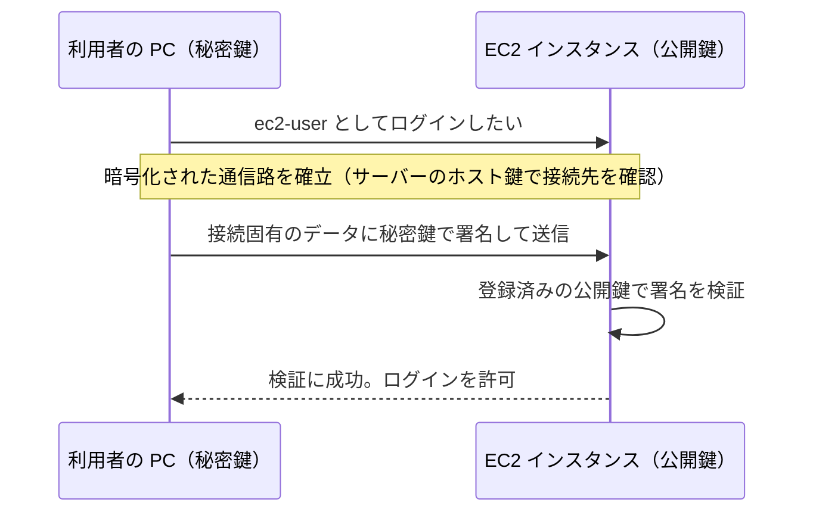
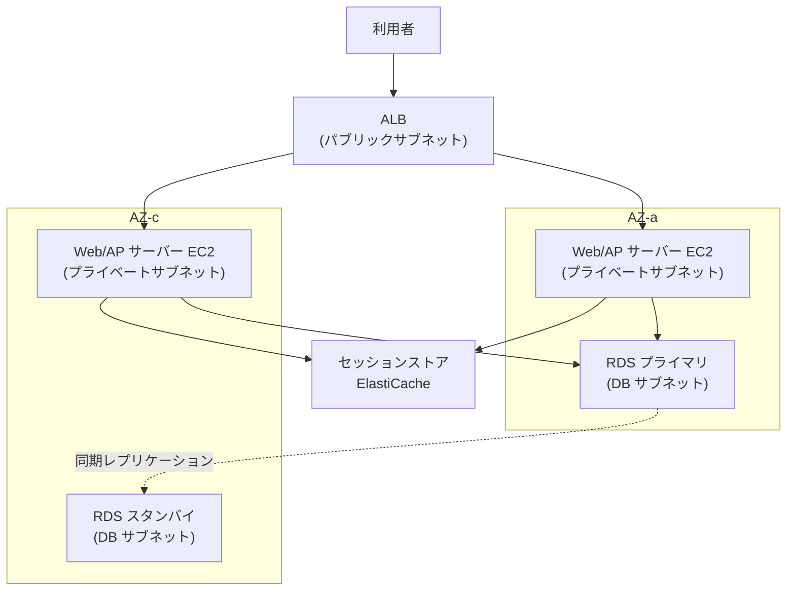
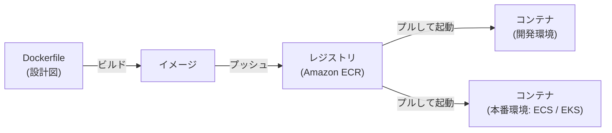

[ホーム](../README.md) > [Phase 1: 基礎](README.md) > サーバー・OS・仮想化の基礎

# サーバー・OS・仮想化の基礎

> **この章のゴール**
> - クライアント/サーバーモデルと、サーバーを構成するハードウェア、性能指標（IOPS・スループット・レイテンシー）を説明できる
> - Linux の基本（ディレクトリ構成、主要コマンド、パーミッション、dnf、systemd、ログ）を理解し、EC2 インスタンスで使える
> - SSH の公開鍵認証の仕組みと、AWS で Session Manager が推奨される理由を説明できる
> - Web システムの 3 層構成と、ステートレスな設計・セッション管理の考え方を説明できる
> - 仮想マシン・コンテナ・サーバーレスの違いを説明できる
> - スケールアップとスケールアウトを使い分け、稼働率（直列・並列）の計算と RPO / RTO の説明ができる
>
> **対応試験**: CLF-C02（第1分野 クラウドのコンセプト / 第3分野 クラウドテクノロジーとサービス の土台）/ SAA-C03・SAP-C03 の前提知識
> **目安時間**: 読む 120分 / 確認問題 30分

## この章の全体像

[ネットワークの基礎](01-network-basics.md) では、サーバーどうしをつなぐ仕組みを学びました。この章では、つながった先で動く**サーバー**そのものを学びます。
コンピューティングの歴史は、「利用者が管理しなければならないもの」を減らしてきた歴史です。物理サーバーを仮想化し（→ EC2）、アプリケーションをコンテナにまとめ（→ ECS / EKS / Fargate）、ついにはサーバーを意識しないサーバーレス（→ Lambda）へと進んできました。この流れを理解すると、AWS のコンピューティングサービスの選び方が自然に分かるようになります。


右へ進むほど OS やサーバーの管理を AWS に任せられる一方、実行環境の自由度は下がります。どれが優れているかではなく、要件に応じて選ぶものです。

| 節 | この章で学ぶこと | AWS で登場する場所 |
|---|---|---|
| 1〜2 | クライアント/サーバー、ハードウェアと性能指標 | EC2 のインスタンスタイプ、EBS のボリュームタイプ |
| 3〜4 | Linux の基本、SSH | EC2 の操作、キーペア、Session Manager |
| 5 | 3 層構成、ステートレスな設計 | ALB + EC2 + RDS、ElastiCache |
| 6〜8 | 仮想化、コンテナ、サーバーレス | Nitro System、ECS / EKS / Fargate、Lambda |
| 9〜10 | スケーリング、可用性、RPO / RTO | Auto Scaling、マルチ AZ 構成、バックアップと災害対策 |

## 1. クライアント/サーバーモデル

サービスを**要求する側**を**クライアント**、要求に**応える側**を**サーバー**と呼びます。レストランにたとえると、注文する客がクライアント、注文を受けて料理を出す厨房がサーバーです。

- ブラウザ（クライアント）が Web サーバーに HTML を要求する
- アプリケーションサーバー（クライアント）がデータベースサーバーに SQL を送る
- AWS CLI（クライアント）が AWS の API エンドポイント（サーバー）に HTTPS でリクエストを送る

2 つ目の例のように、「サーバー」は機械の種類ではなく**役割**です。同じマシンが、ある通信ではサーバーになり、別の通信ではクライアントになります。サーバーは、決まったポート番号でクライアントからの接続を待ち受けています（[ネットワークの基礎](01-network-basics.md) の 6 節）。

## 2. ハードウェアの基本と性能指標

### 2.1 サーバーを構成する部品

| 部品 | 役割 | たとえ | AWS での対応 |
|---|---|---|---|
| CPU | 計算・命令の実行。コア数が多いほど並列処理に強い | 料理人（人数 = コア数） | インスタンスタイプの vCPU 数 |
| メモリ（RAM） | 作業中のデータを一時的に置く。高速だが電源を切ると消える | 調理台（広いほど同時に多くの作業ができる） | インスタンスタイプのメモリ量 |
| ストレージ | データを永続的に保存する（HDD / SSD） | 冷蔵庫・倉庫 | Amazon EBS、インスタンスストア |
| NIC（ネットワークインターフェイスカード） | ネットワークとの接続口 | 店の出入口 | ENI（Elastic Network Interface）、ネットワーク帯域 |

EC2 では、これらの組み合わせを**インスタンスタイプ**として選びます。たとえば `m7g.large` は「m = 汎用、7 = 第 7 世代、g = AWS Graviton プロセッサー（Arm ベース）、large = サイズ」を表します。用途に応じて、汎用（m）、コンピューティング最適化（c）、メモリ最適化（r）、バースト可能（t）などのファミリーがあります（[Amazon EC2](../02-associate/03-ec2.md)）。

### 2.2 ストレージの 3 つの形式

| 形式 | 仕組み | たとえ | AWS |
|---|---|---|---|
| ブロックストレージ | ディスクを固定サイズのブロックに分けて読み書きする。OS からは 1 台のディスクに見える | 自分専用の本棚 | Amazon EBS、インスタンスストア |
| ファイルストレージ | フォルダとファイルの階層で管理し、ネットワーク越しに複数のサーバーで共有する | みんなで使う共有書庫 | Amazon EFS（NFS）、Amazon FSx |
| オブジェクトストレージ | データとメタデータを「オブジェクト」として、HTTP の API で出し入れする | 容量無制限の貸し倉庫 | Amazon S3 |

> [!WARNING]
> **ひっかけ注意**: EC2 の**インスタンスストア**は、ホストに物理的に付いた高速な一時ストレージです。インスタンスを停止・終了するとデータが消えます（再起動では消えません）。残したいデータは EBS や S3 に置きます（[ブロック・ファイルストレージ](../02-associate/06-ebs-efs-fsx.md)）。

### 2.3 性能指標: IOPS・スループット・レイテンシー

ストレージやネットワークの性能は、主に 3 つの指標で表します。宅配便にたとえると次のとおりです。

| 指標 | 意味 | 単位 | たとえ | 重視するワークロード |
|---|---|---|---|---|
| IOPS | 1 秒あたりの読み書きの**回数** | 回/秒 | 1 秒に何回配達できるか | 小さなランダム I/O が多い DB（トランザクション処理） |
| スループット | 1 秒あたりに転送できる**データ量** | MB/s、Gbps | 1 秒に何 kg 運べるか | 大きなファイルの順次読み書き（ログ処理、動画、ビッグデータ） |
| レイテンシー | 1 回の処理にかかる**待ち時間** | ms、μs | 1 回の配達にかかる時間 | 応答速度が重要な処理全般 |

3 つの指標には **スループット = IOPS × 1 回あたりの I/O サイズ** という関係があります。たとえば 16 KiB の I/O を 3,000 IOPS で処理すると、スループットは 16 KiB × 3,000 = 48,000 KiB/s（約 47 MiB/s）です。同じ IOPS でも、I/O のサイズが大きければスループットは大きくなります。
AWS では、たとえば EBS の汎用 SSD（gp3）ボリュームが、ベースラインで 3,000 IOPS・125 MiB/s を提供し、必要に応じて IOPS とスループットを別々に追加できます（2026年9月時点）。

> [!TIP]
> **試験のポイント**: 「小さなランダム I/O が多いトランザクション処理の DB」→ IOPS を重視（SSD 系の EBS）。「大きなファイルの順次アクセス（ログ分析など）を低コストで」→ スループットを重視（スループット最適化 HDD など）。問題文が「どの指標」を求めているかを読み取りましょう。

### 2.4 ビットとバイト、転送時間の見積もり

ネットワークの帯域は**ビット/秒（bps）**、ファイルのサイズは**バイト（B）**で表すのが一般的です。1 バイト = 8 ビットなので、**1 Gbps ≒ 125 MB/s** です。

- 1 TB を 1 Gbps で転送: 10^12 バイト × 8 ÷ 10^9 bps = 8,000 秒 ≒ **約 2.2 時間**（帯域を 100% 使えた場合）
- 100 TB を 1 Gbps で転送: 約 800,000 秒 ≒ **約 9.3 日**

実際には帯域をすべて使えるわけではないため、さらに時間がかかります。ネットワーク経由では期限内に終わらない場合は、物理的にデータを運ぶ方法も検討します（[移行とハイブリッド接続](../02-associate/16-migration-hybrid.md)）。

> [!NOTE]
> 1 KB = 1,000 バイト（10 進数の接頭辞）に対し、1 KiB = 1,024 バイト（2 進数の接頭辞）です。AWS のドキュメントでは、EBS の容量などに GiB（2^30 バイト）が使われます。

## 3. OS と Linux の基本

### 3.1 OS の役割

**OS（オペレーティングシステム）**は、ハードウェアとアプリケーションの間に立ち、次の仕事をします。

- CPU の時間を各プロセス（実行中のプログラム）に割り当てる
- メモリを各プロセスに割り当て、互いに干渉しないよう保護する
- ストレージ上のデータをファイルとディレクトリで管理する（ファイルシステム）
- ネットワーク通信（TCP/IP）や周辺機器を制御する
- ユーザーと権限を管理する

OS の中核部分を**カーネル**、利用者がコマンドを入力する窓口を**シェル**（bash など）と呼びます。
EC2 では、OS などを含むテンプレートである **AMI（Amazon Machine Image）**からインスタンスを起動します。AWS が提供する Linux の現在の標準は **Amazon Linux 2023** で、パッケージ管理に `dnf` を使います（古い教材で見かける Amazon Linux 2 では `yum` を使っていました）。

### 3.2 ディレクトリ構成

Linux では、すべてのファイルが `/`（ルート）を頂点とする 1 つの木構造に配置されます。

| ディレクトリ | 内容 |
|---|---|
| `/` | すべての起点（ルートディレクトリ） |
| `/etc` | 設定ファイル（例: `/etc/nginx/nginx.conf`） |
| `/var/log` | ログファイル |
| `/home` | 一般ユーザーのホームディレクトリ（Amazon Linux の既定のユーザーは `ec2-user`） |
| `/root` | 管理者（root）のホームディレクトリ |
| `/usr/bin` | 多くのコマンドの実行ファイル |
| `/tmp` | 一時ファイル |
| `/opt` | 追加でインストールしたソフトウェア |

### 3.3 主要なコマンド

| コマンド | 用途 | AWS での使いどころ |
|---|---|---|
| `pwd` / `cd` / `ls -l` | 現在地の表示、移動、ファイルの一覧（詳細） | ファイルの確認 |
| `cat` / `less` / `tail -f` | ファイルの表示、ページ送り、追記の監視 | ログのリアルタイム確認 |
| `cp` / `mv` / `rm` / `mkdir` | コピー、移動、削除、ディレクトリの作成 | 設定ファイルのバックアップ |
| `grep` | 文字列の検索 | ログからエラーを抽出 |
| `sudo` | 管理者権限でコマンドを実行 | パッケージのインストール |
| `chmod` / `chown` | パーミッション、所有者の変更 | 秘密鍵の権限の設定 |
| `ps aux` / `top` | プロセスの一覧、リソースの使用状況 | CPU を使っているプロセスの特定 |
| `df -h` / `free -h` | ディスク、メモリの使用量 | 容量不足の調査 |
| `ip addr` / `ss -tlnp` | IP アドレス、待ち受け中のポートの確認 | サービスが起動しているかの確認 |
| `curl` | HTTP リクエストの送信 | Web サーバーの動作確認、インスタンスメタデータの取得 |
| `ping` / `dig` | 疎通の確認（ICMP）、DNS の問い合わせ | ネットワークのトラブルシューティング |
| `dnf` | パッケージの管理 | ソフトウェアのインストール・更新 |
| `systemctl` / `journalctl` | サービスの管理、ログの表示 | Web サーバーの起動・自動起動の設定 |

> [!WARNING]
> **ひっかけ注意**: `ping` は ICMP というプロトコルを使います。セキュリティグループで ICMP を許可していなければ、サーバーが正常でも `ping` には応答しません。「ping が通らない = サーバーが停止している」とは限りません。

### 3.4 パーミッション

Linux のファイルには、**所有者（user）・グループ（group）・その他（other）**の 3 者それぞれに、**読み取り（r = 4）・書き込み（w = 2）・実行（x = 1）**の権限が設定されます。数字の合計で表すのが一般的です。

```text
$ ls -l
-rw-r--r--  1 ec2-user ec2-user  1024 Sep 28 10:00 index.html
-r--------  1 ec2-user ec2-user  1679 Sep 28 10:00 my-key.pem
```

| 表記 | 数値 | 意味 | 使いどころ |
|---|---|---|---|
| `rw-r--r--` | 644 | 所有者は読み書き、ほかは読み取りのみ | 一般的なファイル |
| `rwxr-xr-x` | 755 | 所有者はすべて、ほかは読み取りと実行 | スクリプト、ディレクトリ |
| `rw-------` | 600 | 所有者だけが読み書き | 設定ファイル、秘密鍵 |
| `r--------` | 400 | 所有者だけが読み取り | SSH の秘密鍵（`.pem`） |

管理者ユーザーの **root** はすべての権限を持つため、普段は一般ユーザーで作業し、必要なときだけ `sudo` で管理者権限を使います。これは [セキュリティとデータベースの基礎](03-security-database-basics.md) で学ぶ**最小権限の原則**の一例です。

### 3.5 パッケージ管理、サービス管理、ログ

- **パッケージ管理（dnf）**: ソフトウェアを、依存するライブラリごとインストール・更新します。例: `sudo dnf install -y nginx`、`sudo dnf update -y`
- **サービス管理（systemd）**: 常駐するプログラム（サービス）を管理します。`sudo systemctl start nginx`（起動）、`sudo systemctl enable nginx`（OS の起動時に自動起動）、`systemctl status nginx`（状態の確認）
- **ログ**: `/var/log/` 以下のファイルや、`journalctl -u nginx`（サービスごとのログ）で確認します。

EC2 では、インスタンスの初回起動時に実行するスクリプトを**ユーザーデータ**として渡せます。上の `dnf install` や `systemctl enable` をユーザーデータに書いておけば、起動と同時に Web サーバーが動く状態にできます（[Lab 02](../04-labs/lab02-vpc-ec2.md) で実践します）。

> [!TIP]
> **試験のポイント**: EC2 インスタンスを終了すると、インスタンス内のログも失われます。ログは **CloudWatch エージェント**で Amazon CloudWatch Logs に送って保存します。また、**メモリ使用率やディスクの空き容量は EC2 の標準メトリクスに含まれない**ため、CloudWatch エージェントで収集します（CPU 使用率は標準で取得できます）。

## 4. SSH と公開鍵認証

### 4.1 SSH

**SSH（Secure Shell）**は、ネットワーク越しに安全にサーバーへログインするためのプロトコルです（TCP の 22 番ポート）。通信はすべて暗号化されます。

### 4.2 公開鍵認証の仕組み

SSH のログイン方法には、パスワード認証と**公開鍵認証**があります。パスワードは推測や総当たり攻撃に弱いため、サーバーでは公開鍵認証が標準です。

- **キーペア**: 対になる**秘密鍵**（利用者が厳重に保管する）と**公開鍵**（サーバーに登録する）の組
- サーバーは、ログインを許可する公開鍵を `~/.ssh/authorized_keys` に登録しています。
- ログイン時、クライアントはその接続に固有のデータに**秘密鍵で署名**して送り、サーバーは登録済みの**公開鍵で署名を検証**します。
- **秘密鍵そのものはネットワークに一度も流れません**。これが、パスワードより安全な理由です。



AWS の **EC2 キーペア**では、AWS が公開鍵を保管してインスタンスの起動時に登録し、秘密鍵（`.pem` ファイル）は作成時に 1 回だけダウンロードできます。**AWS は秘密鍵を保管しないため、紛失しても再ダウンロードできません**（[EC2 キーペア](https://docs.aws.amazon.com/AWSEC2/latest/UserGuide/ec2-key-pairs.html)）。

> [!WARNING]
> **ひっかけ注意**: 秘密鍵のパーミッションが緩い（他人が読める）と、SSH クライアントはその鍵の使用を拒否します。`chmod 400 my-key.pem` で、所有者だけが読める状態にします。

### 4.3 AWS では Session Manager が推奨される（予告）

SSH には、22 番ポートの開放、秘密鍵の配布と管理、踏み台サーバー（bastion）の運用といった負担とリスクがあります。**AWS Systems Manager Session Manager** を使うと、次のことを実現できます（[Session Manager](https://docs.aws.amazon.com/systems-manager/latest/userguide/session-manager.html)）。

- **インバウンドのポートを開けずに**インスタンスへ接続できる（SSH の鍵も不要）
- 誰が接続できるかを **IAM ポリシー**で制御できる
- 操作のログを CloudWatch Logs や S3 に記録できる

利用するには、インスタンスに SSM エージェント（Amazon Linux 2023 の AMI には導入済み）と Systems Manager 用の権限（IAM ロール）が必要で、インスタンスから Systems Manager のエンドポイントへ通信できる必要があります。

> [!TIP]
> **試験のポイント**: 「踏み台サーバーを使わず、22 番ポートを開けずに、操作ログを残してインスタンスにアクセスしたい」→ **Session Manager**。SSH（22 番）を 0.0.0.0/0 に開放する選択肢は、ほぼ確実に不正解です。

## 5. Web システムの 3 層構成

### 5.1 3 層構成とは

Web システムは、役割ごとに 3 つの層に分けるのが定番です。

| 層 | 役割 | 代表的なソフトウェア | AWS での実装例 |
|---|---|---|---|
| Web 層（プレゼンテーション層） | リクエストの受付、静的コンテンツの配信、TLS 終端 | nginx、Apache HTTP Server | CloudFront + S3、ALB |
| AP 層（アプリケーション層） | 業務ロジックの実行 | Java（Tomcat など）、Python、Node.js | EC2 + Auto Scaling、ECS / Fargate、Lambda |
| DB 層（データ層） | データの永続的な保存 | MySQL、PostgreSQL、Oracle Database | Amazon RDS、Amazon Aurora、Amazon DynamoDB |

層を分ける理由は、① DB をインターネットから隔離できる（セキュリティ）、② 層ごとに独立してスケールできる、③ 変更の影響範囲を限定できる、の 3 つです。



これは AWS で最も基本的な高可用性の構成です。ALB が 2 つの AZ のサーバーにリクエストを振り分け、DB は別の AZ にスタンバイを置いています（RDS のマルチ AZ 配置）。どちらかの AZ が止まっても、サービスを続けられます。

### 5.2 ステートレスとステートフル

**ステートフル**なサーバーは、ログイン状態やショッピングカートの中身などの**セッション情報を自分のメモリに保持**します。**ステートレス**なサーバーはそうした情報を自分の中に持たず、**どのサーバーがリクエストを受けても同じ結果**を返せます。

ステートフルなサーバーを複数台並べると、次の問題が起こります。

- ロードバランサーが別のサーバーに振り分けると、ログイン状態が失われる
- サーバーが故障したり、Auto Scaling で削除されたりすると、そのサーバーが持っていたセッションがすべて消える

解決策は 3 つあります。

| 方式 | 仕組み | 長所 | 短所 | AWS での例 |
|---|---|---|---|---|
| スティッキーセッション | ロードバランサーが同じ利用者を同じサーバーに送り続ける（Cookie を利用） | アプリケーションの改修が不要 | サーバーが止まるとセッションを失う。負荷が偏りやすい | ALB のスティッキーセッション |
| セッションの外部化 | セッション情報を共有のデータストアに保存する | サーバーをステートレスにでき、自由に増減できる | データストアの可用性を考慮する必要がある | Amazon ElastiCache、Amazon DynamoDB |
| クライアント側のトークン | 署名付きのトークン（JWT など）を利用者側で保持する | サーバー側に保存しなくてよい | トークンの失効の管理が難しい | Amazon Cognito が発行する JWT |

> [!TIP]
> **試験のポイント**: 「Auto Scaling でインスタンスが削除されると、利用者がログアウトされてしまう」→ セッション情報を **ElastiCache や DynamoDB に外部化**し、サーバーをステートレスにします。スティッキーセッションだけでは、インスタンスの削除や障害でセッションが失われる問題は解決しません。

## 6. 仮想化

### 6.1 なぜ仮想化するのか

物理サーバー 1 台に OS を 1 つだけ載せる使い方には、「ピークに合わせて購入するため普段の CPU 使用率が低い」「調達に数週間〜数か月かかる」といった問題がありました。**仮想化**は、1 台の物理サーバーの上で複数の**仮想マシン（VM）**を動かし、それぞれに独立した OS を載せる技術です。1 軒の家（物理サーバー）を、それぞれ鍵とキッチンを持つ複数の部屋（VM）に分けて貸し出すイメージです。

### 6.2 ハイパーバイザー

VM を実現するソフトウェアが**ハイパーバイザー**です。CPU・メモリ・ディスク・NIC を仮想化して各 VM に割り当て、VM どうしを互いに分離します。

| 種類 | 動き方 | 例 | 主な用途 |
|---|---|---|---|
| タイプ 1（ベアメタル型） | ハードウェアの上で直接動く | VMware ESXi、Microsoft Hyper-V、Xen、KVM | データセンター、クラウド |
| タイプ 2（ホスト型） | 既存の OS の上でアプリケーションとして動く | Oracle VirtualBox、VMware Workstation | 個人の PC での検証 |

### 6.3 AWS Nitro System（予告）

現在の EC2 インスタンスの多くは、AWS が独自に開発した **AWS Nitro System** の上で動いています（古い世代のインスタンスは Xen ベースでした）。Nitro System は、従来ハイパーバイザーがソフトウェアで処理していたネットワーク・ストレージ（EBS）・管理・セキュリティの機能を**専用のハードウェア（Nitro カード）にオフロード**し、残りを KVM をベースにした軽量な **Nitro Hypervisor** で処理します。

- ホストのリソースのほぼすべてをインスタンスに提供できる（ベアメタルに近い性能）
- 物理サーバーをそのまま使う**ベアメタルインスタンス**も提供できる
- AWS の運用担当者でさえ、インスタンスのメモリなどの顧客データにアクセスする仕組みを持たないように設計されている

詳しくは [Amazon EC2](../02-associate/03-ec2.md) と、ホワイトペーパー [The Security Design of the AWS Nitro System](https://docs.aws.amazon.com/whitepapers/latest/security-design-of-aws-nitro-system/security-design-of-aws-nitro-system.html) を参照してください。

> [!NOTE]
> 1 台の物理サーバーを複数の顧客で共有する形態を**マルチテナント**と呼びます。ソフトウェアライセンスやコンプライアンスの都合で物理サーバーを専有したい場合は、EC2 の Dedicated Hosts や Dedicated Instances を使います。

## 7. コンテナ

### 7.1 コンテナの基本用語

**コンテナ**は、アプリケーションと、その動作に必要なライブラリや設定をひとまとめにして、隔離された環境で動かす技術です。VM が「部屋ごと貸す」のに対し、コンテナは「必要な荷物だけを詰めた、規格の決まった輸送用コンテナ」です。中身が何であっても同じ方法で運べ、どこでも同じように動きます。

| 用語 | 意味 | AWS での例 |
|---|---|---|
| イメージ | コンテナの元になる読み取り専用のテンプレート。Dockerfile という設計図から作る | ― |
| コンテナ | イメージから起動した、実行中の環境（プロセス） | ECS のタスク、EKS のポッド |
| レジストリ | イメージを保存・配布する場所 | Amazon ECR（Elastic Container Registry） |



同じイメージから起動するため、「開発環境では動いたのに本番環境では動かない」という問題を減らせます。

### 7.2 仮想マシンとコンテナの違い

コンテナは、ホスト OS の**カーネルを共有**し、Linux の機能（名前空間や cgroups）でプロセスどうしを隔離します。VM のようにゲスト OS を丸ごと持たないため、軽量で起動が速いのが特徴です。

| 観点 | 仮想マシン（VM） | コンテナ |
|---|---|---|
| 仮想化するもの | ハードウェア（ハイパーバイザーを使用） | OS（カーネルを共有し、プロセスを隔離） |
| ゲスト OS | VM ごとに必要 | 不要 |
| サイズ | 数 GB 以上が一般的 | 数十〜数百 MB が一般的 |
| 起動時間 | 数十秒〜数分 | 数秒程度 |
| 隔離の強さ | 強い（カーネルも別） | VM より弱い（カーネルを共有） |
| 可搬性 | イメージの形式や環境に依存しやすい | 「どこでも同じように動く」 |
| AWS | Amazon EC2 | Amazon ECS、Amazon EKS、AWS Fargate |

### 7.3 オーケストレーション

コンテナが数十〜数千に増えると、「どのサーバーで動かすか」「落ちたら再起動する」「負荷に応じて数を増減する」「新しいバージョンに少しずつ入れ替える」といった管理を人手で行うのは不可能です。これを自動化するのが**コンテナオーケストレーション**で、事実上の標準がオープンソースの **Kubernetes** です。

| AWS サービス | 役割 |
|---|---|
| Amazon ECS | AWS 独自のコンテナオーケストレーション。AWS のほかのサービスとシンプルに統合できる |
| Amazon EKS | マネージドな Kubernetes。Kubernetes のエコシステムを使いたい場合や、オンプレミスと運用を共通化したい場合に |
| AWS Fargate | コンテナを動かすサーバー（EC2）の管理が不要な実行環境。ECS と EKS の両方で使える |
| Amazon ECR | コンテナイメージのレジストリ |

詳しくは [コンテナ（ECS / EKS / Fargate / ECR）](../02-associate/11-containers.md) で学びます。

## 8. サーバーレスという考え方

**サーバーレス**は「サーバーが存在しない」という意味ではなく、「**利用者がサーバーを管理しなくてよい**」という意味です。次の特徴を持つサービスをサーバーレスと呼びます。

- サーバーの準備（プロビジョニング）や OS のパッチ適用が不要
- 負荷に応じて自動でスケールする（使われなければ、ほぼゼロまで縮む）
- 使った分だけ課金される（リクエスト数や実行時間など）
- 高可用性が最初から組み込まれている

代表例は、イベントに応じてコードを実行する **AWS Lambda**（1 回の実行は最大 15 分）です。ほかにも Amazon S3、Amazon DynamoDB、Amazon SQS、Amazon API Gateway、AWS Fargate などがサーバーレスのサービスです（[サーバーレス](../02-associate/10-serverless.md)）。

| 管理する項目 | オンプレミス | Amazon EC2 | AWS Fargate | AWS Lambda |
|---|---|---|---|---|
| 物理サーバー・データセンター | 利用者 | AWS | AWS | AWS |
| OS（パッチ適用など） | 利用者 | **利用者** | AWS | AWS |
| ミドルウェア・ランタイム | 利用者 | 利用者 | 利用者（コンテナイメージに含める） | AWS（マネージドランタイムの場合） |
| アプリケーションのコード | 利用者 | 利用者 | 利用者 | 利用者 |
| スケーリング | 利用者 | 利用者（Auto Scaling を設定） | 利用者（サービスの Auto Scaling を設定） | 自動 |
| 課金の単位 | 機器の購入・保守 | インスタンスの起動時間 | タスクの vCPU・メモリ × 実行時間 | リクエスト数 + 実行時間（割り当てたメモリに比例） |

この表は、後の章で学ぶ**責任共有モデル**の考え方そのものです（[AWS のセキュリティとコンプライアンス](07-security-and-compliance.md)）。右に行くほど AWS が管理する範囲が広がり、利用者はアプリケーションに集中できます。

> [!WARNING]
> **ひっかけ注意**: サーバーレスが常に最適とは限りません。Lambda には実行時間の上限（15 分）や、しばらく呼ばれていない関数の初回の起動が遅くなる**コールドスタート**があります。また、高い負荷が常に続く処理では、EC2 のほうが安くなる場合があります。

## 9. スケールアップとスケールアウト

処理能力を増やす方法は 2 つあります。

- **スケールアップ（垂直スケーリング）**: サーバーを、より高性能なもの（CPU やメモリの多いもの）に替える。逆は**スケールダウン**
- **スケールアウト（水平スケーリング）**: サーバーの台数を増やす。逆は**スケールイン**

| 観点 | スケールアップ | スケールアウト |
|---|---|---|
| たとえ | 料理人を 1 人の腕利きに替える | 料理人の人数を増やす |
| アプリケーションの改修 | 基本的に不要 | ロードバランサーとステートレスな設計が必要 |
| 上限 | 最大のインスタンスサイズで頭打ち | 台数を増やせば、ほぼ上限なく拡張できる |
| 変更時の停止 | EC2 では、インスタンスタイプの変更に停止と起動が必要 | 停止せずに台数を増減できる |
| 可用性 | 1 台のままなら単一障害点が残る | 複数台に分散するため、可用性も上がる |
| AWS での例 | EC2 のインスタンスタイプの変更、RDS の DB インスタンスクラスの変更 | EC2 Auto Scaling、Aurora のレプリカの追加 |

クラウドでは、需要に合わせて自動でスケールアウト・スケールインできる**伸縮性（エラスティシティ）**が大きな利点です（[クラウドコンピューティングの概念](04-cloud-concepts.md)）。一方、リレーショナルデータベースの書き込み処理はスケールアウトが難しいため、スケールアップと、読み取りの分散（リードレプリカ）を組み合わせるのが一般的です（[セキュリティとデータベースの基礎](03-security-database-basics.md)）。

> [!TIP]
> **試験のポイント**: 「予測できないトラフィックの増減に自動で対応し、1 台の障害にも耐えたい」→ 複数の AZ にまたがる **ALB + EC2 Auto Scaling**（スケールアウト）。「アプリケーションを改修せずに、ひとまず性能を上げたい」→ スケールアップ。詳しくは [Elastic Load Balancing と Auto Scaling](../02-associate/04-elb-auto-scaling.md) で学びます。

## 10. 可用性の基礎

### 10.1 単一障害点と冗長化

**可用性**とは、システムが必要なときに使える状態にある度合いです。そこが壊れるとシステム全体が止まってしまう部分を**単一障害点（SPOF: Single Point of Failure）**と呼びます。可用性を高める基本は、SPOF をなくすための**冗長化**（同じ役割のものを複数用意すること）です。

- **アクティブ/アクティブ**: 複数台が同時に処理する（例: ALB の配下にある複数の EC2 インスタンス）
- **アクティブ/スタンバイ**: 普段は 1 台が処理し、障害時に待機系へ切り替える（例: RDS のマルチ AZ 配置）

AWS では、同じ AZ に 2 台を置いても、その AZ 全体の障害（電源やネットワークの障害）で同時に止まる可能性があります。**複数の AZ に分散する**ことが、AWS での冗長化の基本です。

### 10.2 稼働率とダウンタイム

**稼働率** = 稼働していた時間 ÷ 全体の時間 です。稼働率は「9 がいくつ並ぶか」で表すことが多く、許される停止時間は次のとおりです（1 年 = 365 日 = 8,760 時間、1 か月 = 30 日として計算）。

| 稼働率 | 年間の停止時間 | 月間の停止時間 |
|---|---|---|
| 99%（ツーナイン） | 約 3.65 日（87.6 時間） | 約 7.2 時間 |
| 99.9%（スリーナイン） | 約 8.76 時間 | 約 43.2 分 |
| 99.95% | 約 4.38 時間 | 約 21.6 分 |
| 99.99%（フォーナイン） | 約 52.6 分 | 約 4.3 分 |
| 99.999%（ファイブナイン） | 約 5.3 分 | 約 26 秒 |

計算の例: 99.9% なら停止してよい割合は 0.1% なので、8,760 時間 × 0.001 = 8.76 時間です。月間なら 30 日 × 24 時間 × 60 分 × 0.001 = 43.2 分です。

### 10.3 直列と並列の稼働率

- **直列**（すべてが動いていないと全体が止まる）: 全体の稼働率 = A1 × A2 × ……
- **並列**（どれか 1 つが動いていれば全体が動く）: 全体の稼働率 = 1 − (1 − A1) × (1 − A2) × ……

**例 1（直列）**: 稼働率 99.9% の Web サーバー → AP サーバー → DB サーバーが 1 台ずつ直列に並ぶ場合

- 0.999 × 0.999 × 0.999 ≒ 0.997（**約 99.7%**）。年間の停止時間は約 26 時間です。
- **直列につなぐ部品が増えるほど、全体の稼働率は最も弱い部品よりも下がります**。

**例 2（並列）**: 稼働率 99% のサーバーを 2 台並列にした場合

- 1 − (1 − 0.99) × (1 − 0.99) = 1 − 0.01 × 0.01 = 0.9999（**99.99%**）
- 99% のサーバーでも、2 台を並列にすると両方が同時に止まる確率は 0.01%（1 万分の 1）になります。

**例 3（組み合わせ）**: ロードバランサー（99.99%）→ 2 台の Web サーバー（各 99.5%、並列）→ DB（99.95%）の場合（数値は説明用の仮の値です）

- Web サーバーの部分（並列）: 1 − 0.005 × 0.005 = 0.999975
- 全体（直列）: 0.9999 × 0.999975 × 0.9995 ≒ 0.99938（**約 99.94%**。年間の停止時間は約 5.5 時間）
- 全体の足を引っ張っているのは DB です。次に改善すべきは DB の冗長化だと分かります。

> [!IMPORTANT]
> 並列の計算は、各部品が**独立して**故障することが前提です。2 台が同じ AZ・同じ電源にあると同時に止まる可能性があり、計算どおりの稼働率になりません。AWS で複数の AZ に分散する理由はここにあります。

### 10.4 RPO と RTO

障害や災害に備える計画では、次の 2 つの目標値を決めます。

- **RPO（Recovery Point Objective、目標復旧時点）**: **どの時点のデータまで**戻せればよいか。言い換えると、**失ってもよいデータの量（時間）**
- **RTO（Recovery Time Objective、目標復旧時間）**: 障害の発生から**どれだけの時間で**サービスを再開するか


- RPO を小さくするには、バックアップの**頻度を上げる**か、**レプリケーション**で常にデータを複製します（同期レプリケーションなら RPO はほぼ 0）。
- RTO を小さくするには、**復旧手順を自動化**したり、**待機系を用意**したりします（バックアップから復元するより、起動済みの待機系に切り替えるほうが速い）。
- RPO と RTO を小さくするほど、コストは高くなります。業務への影響とコストのバランスで決めます。

**例**: 毎日 0 時にバックアップを取得している場合、23 時に障害が起きると、最大で約 23 時間分のデータを失います。RPO を 1 時間にしたいなら、1 時間ごとのバックアップや、継続的なバックアップ（RDS のポイントインタイムリカバリなど）が必要です。

> [!TIP]
> **試験のポイント**: RPO は「**データ**をどこまで失ってよいか」、RTO は「**時間**をどれだけかけてよいか」です。AWS の災害対策の戦略（バックアップと復元 → パイロットライト → ウォームスタンバイ → マルチサイト アクティブ/アクティブ）は、右に行くほど RPO / RTO が小さく、コストが高くなります（[高可用性と災害対策](../02-associate/15-high-availability-dr.md)）。

## まとめ

- サーバーは機械の種類ではなく「役割」。クライアント/サーバーモデルは Web・DB・AWS API の基本
- ストレージはブロック（EBS）・ファイル（EFS / FSx）・オブジェクト（S3）。性能は IOPS・スループット・レイテンシーで表し、スループット = IOPS × I/O サイズ
- Linux のディレクトリ構成、主要コマンド、パーミッション（秘密鍵は 400）、dnf、systemd、ログの場所を押さえる。ログやメモリ使用率は CloudWatch エージェントで収集する
- SSH の公開鍵認証では秘密鍵を送らない。AWS では、ポートを開けずに IAM で制御できる Session Manager が推奨
- 3 層構成（Web / AP / DB）を複数の AZ に配置し、セッションを外部化してサーバーをステートレスにする
- 物理サーバー → 仮想マシン → コンテナ → サーバーレスと進むほど、管理の手間は減り、自由度は下がる。EC2 は Nitro System の上で動く
- コンテナはカーネルを共有するため軽量で起動が速い。多数のコンテナはオーケストレーション（ECS / EKS）で管理する
- スケールアップは簡単だが上限と SPOF が残る。スケールアウトは可用性も高める
- 直列の稼働率は掛け算で下がり、並列の稼働率は「1 − 故障率の積」で上がる。99.9% ≒ 年間 8.76 時間の停止
- RPO はデータ損失の許容量、RTO は停止時間の許容量

## 確認問題

### 問1
ある Web システムは、稼働率がそれぞれ 99.9% の Web サーバー、アプリケーションサーバー、データベースサーバーの 3 台で構成されています。3 台はすべて 1 台ずつで、どれか 1 台が止まるとシステム全体が停止します。システム全体の稼働率に最も近いものはどれですか。

- A. 99.97%
- B. 99.9%
- C. 99.7%
- D. 97.0%

<details>
<summary>解答と解説</summary>

**正解: C**

**解説**: 3 台が直列につながっているため、全体の稼働率は掛け算で求めます。0.999 × 0.999 × 0.999 ≒ 0.997 で、約 99.7% です。年間では約 26 時間停止する計算になります。

**各選択肢の検討**
- A: ✗ 直列では稼働率が上がることはありません。
- B: ✗ 「最も弱い部品と同じ稼働率になる」という誤解です。実際は部品を直列につなぐほど下がります。
- C: ✓ 0.999^3 ≒ 0.997 です。
- D: ✗ 各部品を 99% として計算した値（0.99^3 ≒ 0.970）です。

</details>

### 問2
ある企業は、稼働率 99% の Web サーバーを 2 台、別々の AZ に配置し、ロードバランサーで振り分けています。どちらか 1 台が動いていればサービスは継続できます。ロードバランサーの停止は考えないものとすると、Web サーバー部分の稼働率はどれですか。

- A. 98.01%
- B. 99%
- C. 99.5%
- D. 99.99%

<details>
<summary>解答と解説</summary>

**正解: D**

**解説**: 並列の稼働率は 1 − (1 − 0.99) × (1 − 0.99) = 1 − 0.0001 = 0.9999 で、99.99% です。2 台が別々の AZ にあるため、故障が独立しているという前提も成り立ちます。

**各選択肢の検討**
- A: ✗ 直列の計算（0.99 × 0.99）です。
- B: ✗ 冗長化の効果を考慮していません。
- C: ✗ 根拠のない値です。並列の稼働率は、2 台が同時に止まる確率から求めます。
- D: ✓ 両方が同時に停止する確率は 0.01% です。

</details>

### 問3
ある企業は、1 つの AZ にある 1 台の EC2 インスタンスで Web アプリケーションを動かし、同じ AZ にシングル AZ の Amazon RDS DB インスタンスを置いています。単一障害点をなくして可用性を高めるために有効な変更はどれですか。2 つ選択してください。

- A. EC2 インスタンスを、より大きなインスタンスタイプに変更する
- B. 複数の AZ に EC2 インスタンスを配置し、Application Load Balancer で振り分ける
- C. RDS DB インスタンスをマルチ AZ 配置に変更する
- D. RDS の自動バックアップの保持期間を延ばす
- E. EBS ボリュームのサイズを大きくする

<details>
<summary>解答と解説</summary>

**正解: B, C**

**解説**: 単一障害点をなくすには、同じ役割のものを複数の AZ に冗長化します。Web 層は複数の AZ の EC2 インスタンスと ALB で、DB 層は RDS のマルチ AZ 配置（別の AZ のスタンバイへの自動フェイルオーバー）で冗長化できます。

**各選択肢の検討**
- A: ✗ スケールアップで性能は上がりますが、1 台のままなので単一障害点は残ります。
- B: ✓ 1 台や 1 つの AZ が止まっても、ほかの AZ のインスタンスで処理を続けられます。
- C: ✓ プライマリや AZ に障害が起きると、スタンバイに自動でフェイルオーバーします。
- D: ✗ バックアップは RPO を満たすための対策で、停止中のサービスをすぐに再開する仕組みではありません。
- E: ✗ 容量が増えるだけで、単一障害点は解消しません。

</details>

### 問4
ある企業は、毎日 0 時にデータベースのフルバックアップを取得しています。新しい要件として、障害が起きても失うデータを最大 1 時間分に抑えることが求められました。この要件を満たす対策として最も適切なものはどれですか。

- A. バックアップの保存先を別のリージョンに変更する
- B. バックアップからの復旧手順を自動化するスクリプトを用意する
- C. 待機系のサーバーを別の AZ に起動しておく
- D. 1 時間以内の間隔でバックアップを取得するか、データを継続的に複製する

<details>
<summary>解答と解説</summary>

**正解: D**

**解説**: 「失うデータを最大 1 時間分に抑える」は RPO（目標復旧時点）の要件です。RPO はバックアップの頻度やレプリケーションで決まるため、1 時間以内の間隔でバックアップを取得するか、継続的なバックアップやレプリケーションを行う必要があります。

**各選択肢の検討**
- A: ✗ リージョン全体の災害への耐性は上がりますが、バックアップの頻度は変わらないため RPO は 24 時間のままです。
- B: ✗ 復旧にかかる時間（RTO）を短くする対策です。
- C: ✗ データを複製しなければ、待機系があっても失うデータの量は減りません。主に RTO の対策です。
- D: ✓ データを失う範囲を 1 時間以内に抑えられます。

</details>

### 問5
ある企業は、ALB の配下で EC2 Auto Scaling グループを使って Web アプリケーションを運用しています。アプリケーションはログイン状態をインスタンスのメモリに保存しています。スケールインやインスタンスの障害が起きるたびに、利用者がログアウトされてしまいます。この問題を解決する最も適切な方法はどれですか。

- A. セッション情報を Amazon ElastiCache に保存し、アプリケーションサーバーをステートレスにする
- B. ALB のスティッキーセッションを有効にする
- C. Auto Scaling グループのスケールインを無効にする
- D. インスタンスタイプを大きくして、インスタンスの台数を減らす

<details>
<summary>解答と解説</summary>

**正解: A**

**解説**: セッション情報を共有のデータストアに外部化すれば、どのインスタンスがリクエストを受けても同じセッション情報を参照できます。インスタンスが削除されてもセッションは失われません。

**各選択肢の検討**
- A: ✓ サーバーをステートレスにする定石です。
- B: ✗ 同じ利用者を同じインスタンスに送り続けるだけなので、そのインスタンスが削除・故障するとセッションは失われます。
- C: ✗ 需要が減ってもインスタンスが減らなくなり、コストが無駄になります。障害時の問題も解決しません。
- D: ✗ 台数が減るほど 1 台の障害の影響が大きくなり、問題は解決しません。

</details>

### 問6
ある企業の管理者は、プライベートサブネットにある EC2 インスタンスでコマンドを実行する必要があります。セキュリティ部門から、インバウンドのポートを一切開けないこと、SSH の鍵を管理しないこと、操作のログを記録することが求められています。最も適切な方法はどれですか。

- A. パブリックサブネットに踏み台サーバーを置き、社内の IP アドレスからの 22 番ポートを許可する
- B. セキュリティグループで 22 番ポートを 0.0.0.0/0 に開放し、強力なパスワードを設定する
- C. AWS Systems Manager Session Manager を使い、IAM ポリシーでアクセスを制御して、ログを CloudWatch Logs に送る
- D. 管理者全員で 1 つの秘密鍵を共有し、定期的に交換する

<details>
<summary>解答と解説</summary>

**正解: C**

**解説**: Session Manager は、インバウンドのポートを開けずに、SSH の鍵を使わずにインスタンスへ接続でき、アクセスを IAM で制御し、操作ログを CloudWatch Logs や S3 に記録できます。

**各選択肢の検討**
- A: ✗ 22 番ポートの開放と、SSH の鍵の管理が必要です。
- B: ✗ 22 番ポートをインターネット全体に公開するのは重大なセキュリティリスクです。
- C: ✓ すべての要件を満たします。
- D: ✗ 鍵を共有すると誰が操作したか追跡できず、鍵の管理も必要です。

</details>

### 問7
ある開発チームは、アプリケーションとその依存ライブラリをひとまとめにして、開発環境と本番環境で同じように動かしたいと考えています。数秒で起動でき、サーバーや OS のパッチ適用は管理したくありません。最も適切な方法はどれですか。

- A. アプリケーションごとに AMI を作成し、EC2 インスタンスで起動する
- B. コンテナイメージを Amazon ECR に保存し、AWS Fargate を使って Amazon ECS で実行する
- C. オンプレミスに物理サーバーを増設し、アプリケーションをインストールする
- D. 1 台の大きな EC2 インスタンスに、すべてのアプリケーションをインストールする

<details>
<summary>解答と解説</summary>

**正解: B**

**解説**: コンテナは依存関係ごとアプリケーションをパッケージ化でき、どこでも同じように動き、数秒で起動できます。Fargate を使えば、コンテナを動かすサーバーや OS の管理も不要です。

**各選択肢の検討**
- A: ✗ AMI でも環境をそろえられますが、VM の起動には時間がかかり、OS のパッチ適用も利用者の責任です。
- B: ✓ すべての要件を満たします。
- C: ✗ 調達に時間がかかり、サーバーや OS の管理も必要です。
- D: ✗ 単一障害点になり、OS の管理も必要です。環境の一貫性も保証されません。

</details>

## 次のステップ

- ハンズオン: [Lab 02: VPC をゼロから作り EC2 で Web サーバー](../04-labs/lab02-vpc-ec2.md)（ユーザーデータ、Linux の操作）、[Lab 03: ALB + Auto Scaling で冗長化とスケーリング](../04-labs/lab03-alb-auto-scaling.md)
- 次の章: [セキュリティとデータベースの基礎](03-security-database-basics.md)
- この章の内容を深める章: [Amazon EC2](../02-associate/03-ec2.md)、[Elastic Load Balancing と Auto Scaling](../02-associate/04-elb-auto-scaling.md)、[コンテナ](../02-associate/11-containers.md)、[高可用性と災害対策](../02-associate/15-high-availability-dr.md)
- 公式ドキュメント: [AWS Well-Architected Framework 信頼性の柱](https://docs.aws.amazon.com/wellarchitected/latest/reliability-pillar/welcome.html)

---
[← 前の章: ネットワークの基礎](01-network-basics.md) | [目次](README.md) | [次の章: セキュリティとデータベースの基礎 →](03-security-database-basics.md)
