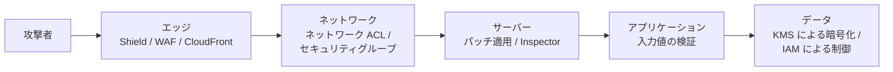
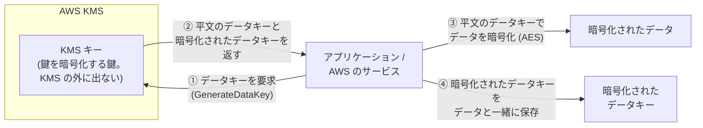
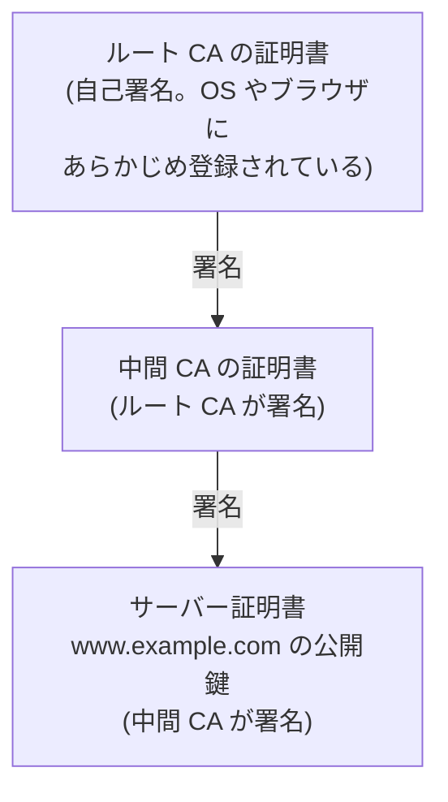
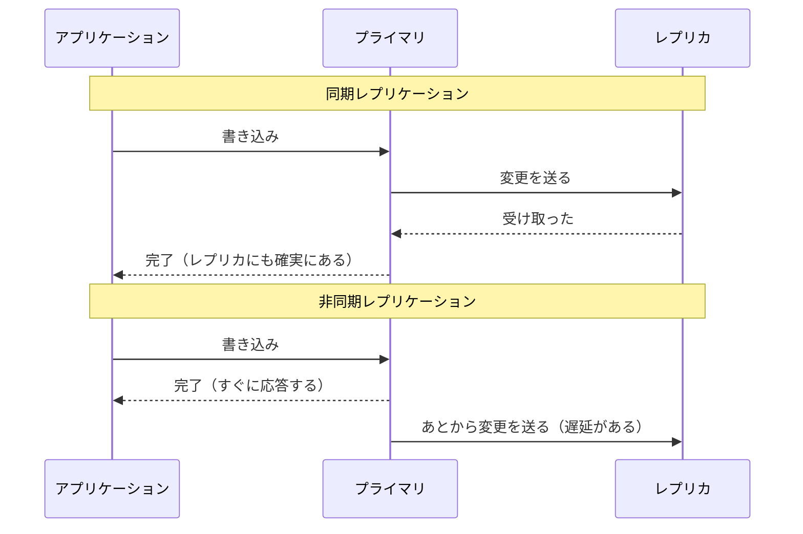
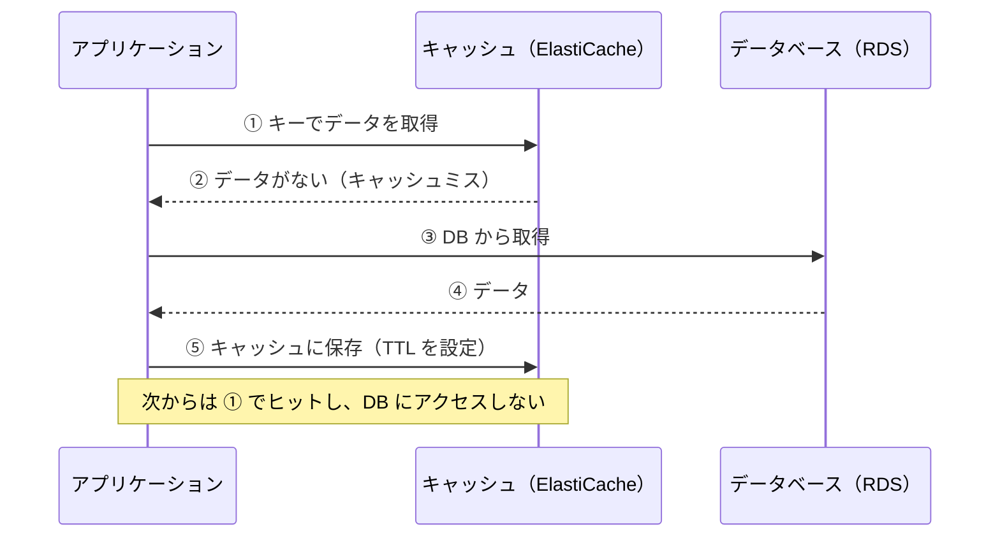

[ホーム](../README.md) > [Phase 1: 基礎](README.md) > セキュリティとデータベースの基礎

# セキュリティとデータベースの基礎

> **この章のゴール**
> - 情報セキュリティの CIA と、認証・認可・MFA・SSO・フェデレーションの違いを説明できる
> - 最小権限・職務分掌・多層防御の考え方を、AWS の設計に当てはめられる
> - 共通鍵暗号・公開鍵暗号・エンベロープ暗号化・ハッシュ・電子署名・PKI の役割を説明できる
> - 代表的な攻撃と、その対策に使う AWS サービスの概要を説明できる
> - RDB（SQL、正規化、ACID、インデックス）と NoSQL の種類を理解し、用途に応じて選べる
> - OLTP と OLAP、同期/非同期レプリケーション、バックアップ、キャッシュの考え方を説明できる
>
> **対応試験**: CLF-C02（第2分野 セキュリティとコンプライアンス / 第3分野 クラウドテクノロジーとサービス の土台）/ SAA-C03・SAP-C03 の前提知識
> **目安時間**: 読む 120分 / 確認問題 30分

## この章の全体像

前半は**セキュリティ**（データを守る）、後半は**データベース**（データを蓄え、取り出す）の基礎です。どちらも「データ」を中心に考える点で共通しています。
SAA-C03 で最も配点が大きいのは「セキュアなアーキテクチャの設計」（30%）で、データベースの選択やレプリケーションの設計はどの試験でも頻出です。この章の用語を正確に理解しておくと、Phase 2 の IAM・KMS・RDS・DynamoDB の章がぐっと読みやすくなります。

| 節 | この章で学ぶこと | AWS で登場する場所 |
|---|---|---|
| 1〜3 | CIA、認証と認可、セキュリティの設計原則 | IAM、IAM Identity Center、Amazon Cognito、AWS Organizations |
| 4〜5 | 暗号化、ハッシュ、電子署名、PKI | AWS KMS、AWS CloudHSM、ACM、AWS Private CA |
| 6〜7 | 攻撃と対策、ログと監査 | AWS WAF、AWS Shield、Amazon GuardDuty、AWS CloudTrail、AWS Config |
| 8〜10 | RDB、NoSQL、OLTP と OLAP | Amazon RDS、Amazon Aurora、Amazon DynamoDB、Amazon Neptune、Amazon Redshift |
| 11〜13 | レプリケーション、バックアップ、キャッシュ | マルチ AZ 配置、リードレプリカ、AWS Backup、Amazon ElastiCache、DAX |

## 1. 情報セキュリティの CIA

情報セキュリティとは、次の 3 つの要素（頭文字をとって **CIA**）を守ることです。

| 要素 | 意味 | 脅威の例 | 対策の例（AWS） |
|---|---|---|---|
| 機密性（Confidentiality） | 許可された人だけがアクセスできる | 情報漏えい、盗聴 | IAM によるアクセス制御、KMS による暗号化 |
| 完全性（Integrity） | データが正確で、改ざんされていない | 改ざん、誤操作 | ハッシュと電子署名、S3 のバージョニングと Object Lock、CloudTrail のログファイルの整合性検証 |
| 可用性（Availability） | 必要なときにアクセスできる | DDoS 攻撃、障害、ランサムウェア | マルチ AZ 構成、AWS Shield、バックアップ |

セキュリティ対策は、「CIA のどれを守るための対策か」を意識すると整理できます。たとえば暗号化は機密性を守りますが、可用性は高めません。鍵を失えばデータが読めなくなるため、鍵の管理を誤るとむしろ可用性を損ないます。

## 2. 認証と認可

### 2.1 認証と認可の違い

- **認証（Authentication）**: 「**あなたは誰か**」を確かめること
- **認可（Authorization）**: 「**あなたは何をしてよいか**」を決めること

ホテルにたとえると、フロントで身分証を確認するのが認証、渡されたカードキーで自分の部屋にしか入れないのが認可です。認証が先で、認可が後です。
AWS では、IAM ユーザーや IAM ロールとしてサインインするのが認証、IAM ポリシーで「どの操作を許可するか」を決めるのが認可です（[IAM 徹底解説](../02-associate/01-iam.md)）。HTTP のステータスコードでは、認証の失敗が 401、認可の失敗が 403 に対応します（[ネットワークの基礎](01-network-basics.md) の 9 節）。

### 2.2 多要素認証（MFA）

認証に使う要素は 3 種類あります。

| 要素 | 例 |
|---|---|
| 知識（知っているもの） | パスワード、PIN |
| 所有（持っているもの） | スマートフォンの認証アプリ、ハードウェアトークン、セキュリティキー |
| 生体（本人そのもの） | 指紋、顔 |

**MFA（多要素認証）**は、**異なる種類の要素を 2 つ以上**組み合わせる認証です。パスワードが漏れても、攻撃者は 2 つ目の要素を持っていないためサインインできません。AWS では、ルートユーザーと IAM ユーザーに MFA を設定できます。FIDO2 に対応したセキュリティキーやパスキーは、偽のサイトに認証情報を入力させるフィッシングにも強い方式です。

> [!WARNING]
> **ひっかけ注意**: 「パスワード + 秘密の質問」は、どちらも「知識」の要素なので MFA ではありません。

### 2.3 SSO とフェデレーション

- **SSO（シングルサインオン）**: 1 回のサインインで、複数のシステムを利用できる仕組みです。
- **フェデレーション（ID 連携）**: 利用者の認証を**信頼できる外部の ID プロバイダー（IdP）**に任せ、サービス側はその認証結果を信頼してアクセスを許可する仕組みです。サービスごとにユーザーとパスワードを作らずに済みます。

フェデレーションの流れは次のとおりです。

1. 利用者がサービス（AWS など）にアクセスすると、IdP での認証を求められる
2. 利用者は IdP で認証する（ID・パスワード・MFA など）
3. IdP は、**署名付きの認証結果**（SAML アサーションや ID トークン）を発行する
4. サービスは IdP の署名を検証し、アクセスを許可する（AWS では**一時的な認証情報**を発行する）

| 観点 | SAML 2.0 | OpenID Connect（OIDC） |
|---|---|---|
| 認証結果の形式 | XML のアサーション | JSON の ID トークン（JWT） |
| 主な用途 | 企業の SSO（社員が業務システムにアクセス） | Web / モバイルアプリのログイン、ソーシャルログイン、CI/CD との連携 |
| AWS での例 | IAM Identity Center と社内 IdP の連携、IAM の SAML フェデレーション | Amazon Cognito、IAM の OIDC フェデレーション（GitHub Actions からのアクセスなど） |

OIDC は、権限を委譲する仕組み（アクセストークンの発行）である **OAuth 2.0** に、認証の仕組み（ID トークン）を加えたものです。
AWS では、社員による AWS アカウントへのアクセスには **AWS IAM Identity Center**（旧 AWS SSO）、自社アプリケーションの利用者の認証には **Amazon Cognito** を使うのが基本です。詳しくは [IAM 徹底解説](../02-associate/01-iam.md) と、Phase 3 の [大規模な ID とアクセス管理](../03-professional/03-identity-federation.md) で学びます。

> [!TIP]
> **試験のポイント**: 「既存の社内ディレクトリ（Active Directory など）の ID で、複数の AWS アカウントにサインインしたい」→ IAM Identity Center と外部 IdP の連携。「モバイルアプリの利用者を Google などのアカウントでサインインさせたい」→ Amazon Cognito。どちらの場合も、長期的なアクセスキーではなく**一時的な認証情報**を使う点が重要です。

## 3. セキュリティの設計原則

### 3.1 最小権限の原則

業務に必要な**最小限の権限だけ**を与える原則です。権限は「すべて拒否」から始め、必要なものだけを許可します。認証情報が漏れても、被害を与えた権限の範囲内に抑えられます。AWS では IAM ポリシーで細かく権限を設定し、IAM Access Analyzer で使われていない権限を見つけて削ります。

### 3.2 職務分掌

重要な作業を 1 人で完結できないように、役割を分ける原則です。たとえば「コードを書く人」と「本番環境への反映を承認する人」を分けます。不正と単純なミスの両方を防げます。AWS では、本番用と開発用で AWS アカウントを分ける、KMS のキーの管理者と利用者を分ける、といった形で実践します。

### 3.3 多層防御

1 つの対策が破られても次の層で防げるように、**複数の層に対策を重ねる**原則です。城が堀・城壁・門・見張りを重ねて守るのと同じです。



さらに、すべての層で ID の保護（IAM、MFA）と、ログによる検知（CloudTrail、GuardDuty）を組み合わせます。

> [!TIP]
> **試験のポイント**: 「セキュリティグループで制限したので十分」「暗号化したので安全」のように、1 つの対策だけに頼る選択肢は疑いましょう。AWS の設計では、各層で適切な対策を重ねるのが正解になりやすいです。

## 4. 暗号化

### 4.1 基本の用語

暗号化する前のデータを**平文**、暗号化したあとのデータを**暗号文**、暗号化と復号に使う秘密の値を**鍵**と呼びます。現代の暗号では、アルゴリズム（AES など）は公開されており、**安全性は鍵を秘密に保つことに依存**しています。つまり、暗号化の設計とは**鍵の管理**の設計です。

### 4.2 共通鍵暗号と公開鍵暗号

| 観点 | 共通鍵暗号（対称暗号） | 公開鍵暗号（非対称暗号） |
|---|---|---|
| 鍵 | 暗号化と復号に**同じ鍵**を使う | **公開鍵**と**秘密鍵**のペアを使う |
| 使い方 | 同じ鍵を持つ者どうしで暗号化・復号する | 公開鍵で暗号化 → 秘密鍵で復号（機密性）、秘密鍵で署名 → 公開鍵で検証（真正性） |
| 速度 | 速い | 遅い |
| 課題 | 鍵を相手に安全に渡す方法（鍵配送問題） | 公開鍵が本物かどうかの確認（→ 5 節の PKI） |
| 主なアルゴリズム | AES（AES-256 など） | RSA、楕円曲線暗号（ECDSA、ECDH など） |
| 向いている用途 | 大量のデータの暗号化 | 鍵の共有、電子署名 |
| AWS での例 | KMS の対称キー（AES-256）、S3・EBS の暗号化 | KMS の非対称キー（RSA、楕円曲線）、SSH、TLS |

楕円曲線暗号は、RSA より短い鍵で同じ強度が得られるため処理が軽く、TLS などで広く使われています。

### 4.3 ハイブリッド暗号

共通鍵暗号は速いものの鍵の受け渡しが難しく、公開鍵暗号は鍵の受け渡しが簡単なものの遅い、という特徴があります。両者の長所を組み合わせたのが**ハイブリッド暗号**で、**公開鍵暗号の技術で共通鍵を安全に共有し、データ本体は共通鍵で暗号化**します。HTTPS で使われる TLS はこの方式です（[ネットワークの基礎](01-network-basics.md) の 10 節）。

### 4.4 エンベロープ暗号化

**エンベロープ暗号化**は、「データを暗号化した鍵を、さらに別の鍵で暗号化する」方式で、AWS KMS の中心となる考え方です。

- **データキー**: データそのものを暗号化する共通鍵
- **KMS キー**（鍵を暗号化する鍵）: データキーを暗号化する鍵。**KMS の外に平文で出ることはありません**



1. アプリケーション（または S3・EBS などの AWS のサービス）が、KMS にデータキーを要求します。
2. KMS は、平文のデータキーと、KMS キーで暗号化したデータキーの 2 つを返します。
3. 平文のデータキーでデータを暗号化し、平文のデータキーはすぐにメモリから消去します。
4. 暗号化されたデータキーを、暗号文と一緒に保存します（鍵を封筒に入れて、手紙に添えるイメージです）。

復号するときは、暗号化されたデータキーを KMS に送って復号してもらい（Decrypt）、戻ってきた平文のデータキーでデータを復号します。

エンベロープ暗号化には次の利点があります。

- 大きなデータを KMS に送る必要がない（KMS が直接暗号化できるデータは最大 4 KB）。通信量と遅延を抑えられる
- KMS キーは HSM（ハードウェアセキュリティモジュール）で保護され、KMS の外に出ない
- KMS キーの利用は IAM ポリシーとキーポリシーで制御され、すべて CloudTrail に記録される

### 4.5 保存時の暗号化と転送時の暗号化

| 種類 | 守る対象 | 主な技術 | AWS での例 |
|---|---|---|---|
| 保存時の暗号化（at rest） | ディスクやストレージに保存されたデータ | AES など | S3 のサーバー側の暗号化（SSE-S3 / SSE-KMS）、EBS・RDS の暗号化 |
| 転送時の暗号化（in transit） | ネットワークを流れるデータ | TLS、IPsec、SSH | HTTPS（ALB・CloudFront）、Site-to-Site VPN |

> [!WARNING]
> **ひっかけ注意**: RDS の暗号化は、DB インスタンスの**作成時**に有効にします。暗号化されていない既存の DB インスタンスをそのまま暗号化することはできず、スナップショットを暗号化してコピーし、そこから復元します。なお S3 は、2023年1月から新しく保存するオブジェクトを既定で暗号化（SSE-S3）しています。

### 4.6 鍵管理

鍵の管理では、生成・保管・アクセス制御・ローテーション（定期的な更新）・無効化と削除・監査という**ライフサイクル全体**を扱います。

| AWS サービス | 特徴 |
|---|---|
| AWS KMS | マネージドな鍵管理サービス。AWS の多くのサービスと統合。自動ローテーションや、CloudTrail による監査に対応 |
| AWS CloudHSM | 専有の HSM を利用者自身が管理する。厳しい規制要件への対応などに使う |
| AWS Secrets Manager | DB のパスワードや API キーなどの**シークレット**を保管し、自動でローテーションする |

KMS キーは、削除を予約してから 7〜30 日の待機期間を経て削除されます。**削除した鍵で暗号化したデータは二度と復号できない**ため、慎重に扱います。詳しくは [セキュリティサービス](../02-associate/12-security-services.md) で学びます。

> [!NOTE]
> 将来の量子コンピューターに備えた**耐量子暗号（PQC）**への移行も始まっています。AWS KMS は署名用の ML-DSA のキーに対応し、KMS・ACM・Secrets Manager の API エンドポイントでは、ML-KEM を組み合わせたハイブリッドの耐量子 TLS 鍵交換を利用できます（KMS に ML-KEM のキーはありません。2026年9月時点）。SAP-C03 で新たに扱われるテーマです。

## 5. ハッシュ、電子署名、PKI

### 5.1 ハッシュ

**ハッシュ関数**は、任意の長さのデータから、固定長の値（**ハッシュ値**）を計算する関数です。

- 同じ入力からは、必ず同じハッシュ値が得られる
- 入力が 1 ビットでも違えば、まったく異なるハッシュ値になる
- ハッシュ値から元のデータを復元できない（一方向性）
- 同じハッシュ値になる別のデータを見つけることは、事実上不可能

代表的なアルゴリズムは **SHA-256** です（MD5 や SHA-1 は安全性に問題があるため、セキュリティの用途では使いません）。主な用途は、ファイルの改ざんの検知と、パスワードの保存です。パスワードは平文で保存せず、**ソルト**（ユーザーごとのランダムな値）を加え、あえて計算に時間がかかるよう設計されたハッシュ関数（bcrypt など）でハッシュ化して保存します。

### 5.2 ハッシュ・暗号化・電子署名の違い

| 観点 | ハッシュ | 暗号化 | 電子署名 |
|---|---|---|---|
| 目的 | 改ざんの検知、パスワードの保存 | 機密性（第三者に読ませない） | 送り主の証明（真正性）、改ざんの検知、否認の防止 |
| 元に戻せるか | 戻せない（一方向） | 鍵があれば復号できる | ―（署名は検証するもの） |
| 鍵 | 使わない | 共通鍵、または公開鍵と秘密鍵 | 秘密鍵で署名し、公開鍵で検証 |
| 代表例 | SHA-256 | AES、RSA | RSA 署名、ECDSA、ML-DSA |
| AWS での例 | S3 のチェックサム、CloudTrail のログファイルの整合性検証 | KMS、S3 のサーバー側の暗号化 | KMS の署名用キー（Sign / Verify）、AWS Signer（コード署名） |

**電子署名**の流れ: 送信者は、データのハッシュ値に**秘密鍵で署名**し、データと一緒に送ります。受信者は、送信者の**公開鍵で署名を検証**し、自分で計算したハッシュ値と照合します。秘密鍵を持つのは送信者だけなので、「本人が送ったこと」と「途中で改ざんされていないこと」の両方を確認できます。

> [!NOTE]
> 共通鍵とハッシュを組み合わせた **HMAC** という仕組みもあります。AWS の API リクエストの署名（Signature Version 4）は、シークレットアクセスキーを使った HMAC-SHA256 です。

> [!WARNING]
> **ひっかけ注意**: ダウンロードしたファイルのハッシュ値を、同じ Web サイトに掲載されたハッシュ値と比べるだけでは、サイトごと改ざんされていれば見抜けません。「**誰が**作ったものか」まで保証するには、電子署名が必要です。

### 5.3 PKI、証明書、認証局

公開鍵暗号には、「その公開鍵は本当に相手のものか」という問題があります。攻撃者が自分の公開鍵を「example.com の公開鍵」と偽って渡せば、なりすましができてしまいます。
これを解決するのが **PKI（公開鍵基盤）**です。信頼できる第三者である**認証局（CA）**が、「この公開鍵は example.com のものである」という内容に署名した**証明書**を発行します。



ブラウザは、サーバーから受け取ったサーバー証明書と中間 CA の証明書の署名を順にたどり、最後に**自分が信頼しているルート CA** にたどり着けば、その証明書を信頼します。これを**信頼の連鎖**と呼びます。あわせて、ドメイン名が一致するか、有効期限内か、失効していないかも確認します。

- **AWS Certificate Manager（ACM）**: ドメインの所有を確認して発行するパブリック証明書（DV 証明書）を、統合サービス向けに無料で発行し、自動で更新します。
- **AWS Private CA**: 社内システムやマイクロサービス間の通信（相互 TLS など）で使う、プライベート証明書を発行します。

## 6. 代表的な攻撃と対策

| 攻撃 | 概要 | 対策の考え方 | 主な AWS サービス（予告） |
|---|---|---|---|
| DDoS 攻撃 | 大量の通信を送りつけてサービスを停止させる（L3/L4 の大量の通信、L7 の大量のリクエスト） | 攻撃を吸収できる規模のエッジで受ける、流量を制限する | AWS Shield（Standard は自動・追加料金なし、Advanced は有料）、CloudFront、AWS WAF のレートベースのルール |
| SQL インジェクション | 入力欄に SQL 文を紛れ込ませ、DB を不正に操作する | プレースホルダー（プリペアドステートメント）の使用、入力値の検証、DB ユーザーの権限の最小化 | AWS WAF（マネージドルール） |
| クロスサイトスクリプティング（XSS） | Web ページに悪意のあるスクリプトを埋め込み、閲覧者のブラウザで実行させる | 出力時のエスケープ、Cookie の HttpOnly 属性 | AWS WAF |
| フィッシング | 偽のメールやサイトで、認証情報をだまし取る | MFA（特にフィッシングに強いセキュリティキー）、教育 | IAM Identity Center + MFA |
| 認証情報の漏えい | アクセスキーをコードに埋め込んで公開してしまう、など | 長期的なアクセスキーを使わず IAM ロールを使う、シークレットを安全に保管する、異常を検知する | IAM ロール、Secrets Manager、Amazon GuardDuty |
| ランサムウェア | データを暗号化して使えなくし、身代金を要求する | 変更・削除できないバックアップ、最小権限、パッチ適用 | AWS Backup（Vault Lock）、S3 Object Lock、GuardDuty |
| 既知の脆弱性の悪用 | パッチが適用されていないソフトウェアの弱点を突く | 脆弱性の継続的なスキャンとパッチ適用 | Amazon Inspector、Systems Manager Patch Manager |

> [!TIP]
> **試験のポイント**: 「SQL インジェクションや XSS をブロックしたい」→ **AWS WAF**。「L3/L4 の一般的な DDoS 攻撃から、追加料金なしで自動的に保護したい」→ **Shield Standard**。「DDoS 対応の専門チームの支援や、攻撃によるスケーリング費用の保護が必要」→ **Shield Advanced**。「悪意のある操作や不審な通信を検知したい」→ **GuardDuty**。詳しくは [AWS のセキュリティとコンプライアンス](07-security-and-compliance.md) と [セキュリティサービス](../02-associate/12-security-services.md) で学びます。

## 7. ログと監査

ログは、セキュリティの「防犯カメラ」です。攻撃の検知、事故の原因調査、コンプライアンス（法令や基準への準拠）の証明、そして「誰が・いつ・何をしたか」の説明責任のために欠かせません。

| 答えたい問い | ログの種類 | AWS サービス |
|---|---|---|
| 誰が・いつ・どの API を呼び出したか | API の操作履歴 | AWS CloudTrail |
| どの IP アドレスとどの IP アドレスが通信したか（許可/拒否） | ネットワークのフローログ | VPC フローログ |
| アプリケーションや OS で何が起きたか | アプリケーション・OS のログ | Amazon CloudWatch Logs |
| リソースの設定がいつどう変わったか、ルールに準拠しているか | 設定の変更履歴 | AWS Config |

ログを運用するときの原則は次のとおりです。

- **一元的に集める**（ログ保管専用の AWS アカウントなど）
- **改ざんや削除から守る**（S3 Object Lock、CloudTrail のログファイルの整合性検証）
- **時刻をそろえる**（NTP で時刻を同期し、複数のログを突き合わせられるようにする）
- **保存期間を決め、異常を検知したら通知する**

> [!TIP]
> **試験のポイント**: 「API の操作履歴を監査したい（誰がインスタンスを削除したか）」→ **CloudTrail**。「リソースの設定の変更履歴や、ルールへの準拠状況を確認したい」→ **AWS Config**。この 2 つの違いは頻出です。CloudTrail では過去 90 日間の管理イベントをイベント履歴で確認でき、それより長く保存するには証跡（トレイル）を作成して S3 に保存します（[監視と運用管理](../02-associate/13-monitoring-management.md)）。

## 8. リレーショナルデータベース（RDB）

### 8.1 テーブルと SQL

**RDB** は、データを**テーブル**（表）で管理するデータベースです。テーブルは**行**（レコード。1 件のデータ）と**列**（カラム。項目）からなり、各行を一意に識別する列を**主キー**、ほかのテーブルの主キーを参照する列を**外部キー**と呼びます。テーブルの構造（**スキーマ**）は、データを入れる前に定義します。
データの操作には **SQL** を使います。

```sql
-- 注文テーブルと顧客テーブルを結合（JOIN）し、東京都の顧客の注文を取得する
SELECT o.order_id, o.order_date, c.name
FROM   orders o
JOIN   customers c ON o.customer_id = c.customer_id
WHERE  c.prefecture = '東京都';

UPDATE customers SET prefecture = '神奈川県' WHERE customer_id = 'C01';
```

### 8.2 正規化

**正規化**は、データの重複をなくすようにテーブルを分割する設計手法です。次の注文表は正規化されていません。

| 注文ID | 注文日 | 顧客ID | 顧客名 | 顧客の住所 | 商品 |
|---|---|---|---|---|---|
| 1001 | 9/1 | C01 | 山田 | 東京都… | ノート PC、マウス |
| 1002 | 9/3 | C01 | 山田 | 東京都… | モニター |

この表には、2 つの問題があります。

- 1 つのセルに複数の商品が入っていて、集計や検索がしにくい
- 顧客名と住所が注文のたびに重複する。山田さんが引っ越すとすべての行を更新しなければならず、1 行でも漏れると矛盾が生じる（**更新時異常**）

正規化すると、顧客テーブル（顧客ID、顧客名、住所）、注文テーブル（注文ID、注文日、顧客ID）、注文明細テーブル（注文ID、商品ID、数量）、商品テーブル（商品ID、商品名、単価）に分かれ、住所は顧客テーブルの 1 か所だけで管理されます。

| 段階 | ルール（簡略化） |
|---|---|
| 第 1 正規形 | 1 つのセルには 1 つの値だけを入れる（繰り返しをなくす） |
| 第 2 正規形 | 複数の列からなる主キーの「一部」だけで決まる列を、別のテーブルに分ける |
| 第 3 正規形 | 主キー以外の列によって決まる列（例: 顧客ID → 顧客名）を、別のテーブルに分ける |

正規化するとデータの整合性を保ちやすくなりますが、読み取りのたびに結合（JOIN）が必要になります。読み取りの性能を優先して、あえて重複を持たせることを**非正規化**と呼びます。NoSQL では、アクセスパターンに合わせて非正規化するのが一般的です。

### 8.3 トランザクションと ACID

**トランザクション**は、「すべて成功するか、すべて取り消すか」の単位でまとめた一連の処理です。銀行振込（A さんから B さんへ 1 万円）で考えます。

```sql
BEGIN;
UPDATE accounts SET balance = balance - 10000 WHERE account_id = 'A';
UPDATE accounts SET balance = balance + 10000 WHERE account_id = 'B';
COMMIT;   -- 途中でエラーが起きたら ROLLBACK で両方を取り消す
```

トランザクションが満たすべき 4 つの性質を、頭文字をとって **ACID** と呼びます。

| 性質 | 意味 | 銀行振込の例 |
|---|---|---|
| 原子性（Atomicity） | すべて実行されるか、まったく実行されないかのどちらか | A から引き落とした直後にエラーが起きたら、引き落としも取り消す。「A から消えたのに B に届かない」は起きない |
| 一貫性（Consistency） | 決められたルール（制約）が常に守られる | 残高がマイナスになる振込は拒否される。振込の前後で A と B の残高の合計は変わらない |
| 独立性（Isolation） | 同時に実行されるトランザクションが互いに干渉しない | 振込の途中（A から引いたが、B にはまだ足していない状態）を、ほかの処理が読むことはない |
| 永続性（Durability） | 完了（コミット）した結果は、障害が起きても失われない | 振込が完了した直後にサーバーが停電しても、結果は残っている（変更をログとしてディスクに書いてから完了とするため） |

> [!TIP]
> **試験のポイント**: 「複数の更新を確実にまとめて実行したい」「強い整合性が必要な金融取引」→ ACID トランザクションに対応した RDB（Amazon RDS、Aurora）が基本です。DynamoDB も複数の項目にまたがるトランザクションに対応していますが、複雑な結合や集計が必要なら RDB を選びます。

### 8.4 インデックス

**インデックス**は、本の巻末の索引のように、目的の行をすばやく見つけるための仕組みです（B ツリーという構造がよく使われます）。インデックスがなければ、1,000 万行のテーブルから 1 行を探すのにすべての行を調べる（**フルスキャン**）必要がありますが、インデックスがあれば数回の読み取りで見つかります。
一方で、インデックスはデータの書き込みのたびに更新されるため、**書き込みが遅くなり、ストレージも消費します**。検索条件（WHERE 句）や結合によく使う列に絞って作成します。

AWS のリレーショナルデータベースには、Amazon RDS（MySQL、PostgreSQL、MariaDB、Oracle、SQL Server、Db2）と、AWS が独自に開発した Amazon Aurora（MySQL / PostgreSQL 互換）があります（[データベース](../02-associate/07-databases.md)）。

## 9. NoSQL

### 9.1 NoSQL の種類

RDB は柔軟な検索と強い整合性に優れる一方、書き込みを多数のサーバーに分散（スケールアウト）するのが苦手で、スキーマの変更にも手間がかかります。**NoSQL**（Not only SQL）は、特定のアクセスパターンに特化する代わりに、**水平方向のスケーラビリティ、柔軟なスキーマ、大規模でも安定した低レイテンシー**を実現するデータベースの総称です。

| 種類 | データの形 | 得意なこと | 代表的な製品 | AWS |
|---|---|---|---|---|
| キーバリュー | キー → 値 | キーを指定した高速な読み書き、大規模なスケール | Redis、etcd | Amazon DynamoDB |
| ドキュメント | JSON などのドキュメント | 柔軟なスキーマ、入れ子になったデータ | MongoDB | Amazon DocumentDB（MongoDB 互換）、DynamoDB |
| ワイドカラム | 行ごとに異なる列を持てる大規模なテーブル | 大量の書き込み、大規模な分散 | Apache Cassandra、Apache HBase | Amazon Keyspaces（Apache Cassandra 互換） |
| グラフ | ノード（点）とエッジ（関係） | 関係をたどる検索（SNS の友達の友達、不正検知、レコメンド） | Neo4j | Amazon Neptune |
| インメモリ | メモリ上のキーバリューなど | マイクロ秒単位の応答（キャッシュ、セッション、ランキング） | Valkey、Redis、Memcached | Amazon ElastiCache、Amazon MemoryDB |
| 時系列 | タイムスタンプ付きの値 | センサーデータやメトリクスの蓄積と、時間軸での集計 | InfluxDB | Amazon Timestream（Timestream for InfluxDB など） |

> [!WARNING]
> **ひっかけ注意**: 古い教材では「台帳データベース = Amazon QLDB」と説明されていますが、QLDB は 2025年7月31日に提供を終了しました。新しい設計の選択肢として選ばないようにしましょう。

### 9.2 RDB と NoSQL の比較

| 観点 | RDB | NoSQL（DynamoDB の場合） |
|---|---|---|
| スキーマ | 事前に定義する（厳格） | 柔軟（項目ごとに属性が違ってもよい） |
| クエリ | SQL で柔軟に検索・結合・集計できる | キーを使ったアクセスが中心。結合は基本的にできない |
| スケール | 主にスケールアップ（読み取りはリードレプリカで分散） | スケールアウト（データを自動で分散） |
| 整合性 | 強い整合性と ACID トランザクションが基本 | 読み込みは結果整合性が既定で、強い整合性の読み込みも選べる |
| 向いている用途 | 業務システム、複雑な検索・集計、金融取引 | アクセス量の予測が難しい Web / モバイル / ゲーム、IoT、セッション管理 |

**結果整合性**とは、書き込みの直後は古いデータが読める可能性があるものの、時間がたてば（通常は 1 秒以内に）すべてのコピーが最新になる、という整合性のモデルです。

> [!TIP]
> **試験のポイント**: 「スキーマが頻繁に変わる」「大規模でも 1 桁ミリ秒の応答」「サーバーを管理したくない」→ **DynamoDB**。「複雑な結合や集計」「強い整合性のトランザクション」→ **RDS / Aurora**。「関係性をたどる（ソーシャルグラフ、不正検知）」→ **Neptune**。「MongoDB との互換性が必要」→ **DocumentDB**。

## 10. OLTP と OLAP

| 観点 | OLTP（オンライントランザクション処理） | OLAP（オンライン分析処理） |
|---|---|---|
| 目的 | 日々の業務処理（注文、決済、在庫の更新） | 分析・意思決定（売上の傾向、顧客の分析） |
| 典型的な処理 | 少数の行を読み書きする短い処理が大量に発生する | 大量の行を読み取って集計する重い処理が少数発生する |
| データ | 最新のデータ。正規化された設計 | 過去数年分の履歴データ。分析しやすいよう非正規化 |
| 保存形式 | 行指向（1 行のデータをまとめて保存） | 列指向（列ごとにまとめて保存） |
| AWS | RDS、Aurora、DynamoDB | Amazon Redshift（データウェアハウス）、Amazon Athena（S3 上のデータを SQL で分析） |

OLAP で**列指向**が有利なのは、集計では一部の列（たとえば売上金額）だけを大量に読むからです。列ごとに保存すれば必要な列だけを読めばよく、同じ種類の値が並ぶため圧縮もよく効きます。
業務の DB（OLTP）から分析用の**データウェアハウス（DWH）**へ、データを抽出・変換・ロードする処理を **ETL** と呼びます（AWS では AWS Glue など）。詳しくは [データ分析サービス](../02-associate/14-analytics.md) で学びます。

> [!TIP]
> **試験のポイント**: 「本番の業務 DB で重い分析クエリを実行したら、アプリケーションの性能が落ちた」→ 分析を **Redshift などの DWH** に分離する（または分析用のリードレプリカを使う）。「ペタバイト規模のデータに対する複雑な分析クエリ」→ Redshift。

## 11. レプリケーションとシャーディング

### 11.1 同期レプリケーションと非同期レプリケーション

**レプリケーション**は、データを別のサーバー（**レプリカ**）に複製し続ける仕組みです。目的は、**可用性の向上**（障害時に切り替える）と**読み取り性能の向上**（読み取りを分散する）です。複製のタイミングによって、2 つの方式があります。



| 観点 | 同期レプリケーション | 非同期レプリケーション |
|---|---|---|
| 書き込みの完了 | レプリカへの書き込みを待ってから完了 | プライマリへの書き込みだけで完了 |
| 書き込みの遅延 | 大きくなる（レプリカとの往復を待つ） | 小さい |
| 障害時のデータ損失 | なし（RPO ≒ 0） | レプリケーションの遅延の分だけ失う可能性がある |
| レプリカとの距離 | 近い必要がある（同じリージョン内の別の AZ など） | 遠くてもよい（別のリージョンも可） |
| レプリカから読んだデータ | ― | 少し古い可能性がある（結果整合性） |
| AWS での主な例 | RDS のマルチ AZ 配置（スタンバイへの複製） | RDS のリードレプリカ、リージョン間のレプリケーション |

> [!IMPORTANT]
> Phase 2 で必ず使う使い分けです（[データベース](../02-associate/07-databases.md)）。
> - **RDS のマルチ AZ 配置**（DB インスタンス）: 別の AZ のスタンバイに**同期**で複製し、障害時は自動でフェイルオーバーする。目的は**高可用性**。スタンバイは読み取りに使えない
> - **リードレプリカ**: **非同期**で複製し、読み取り専用の DB として使う。目的は**読み取り性能の向上**。別のリージョンにも作成でき、災害対策にも使える
>
> なお Aurora は、ストレージ層で 3 つの AZ にデータを 6 つ複製しており、レプリカが読み取りの分散とフェイルオーバー先の両方を担えます。

> [!WARNING]
> **ひっかけ注意**: 「読み取りの負荷が高いので、マルチ AZ 配置にする」は誤りです（DB インスタンスのマルチ AZ 配置のスタンバイは読み取りに使えません）。読み取りの分散には、リードレプリカやキャッシュを使います。

### 11.2 シャーディング

レプリケーションではすべてのデータを複製するため、**書き込み**の負荷は分散できません。**シャーディング**（水平パーティショニング）は、データをキー（例: ユーザー ID）に基づいて複数のデータベース（**シャード**）に**分割**し、書き込みも分散する方式です。スケールの上限を大きく広げられる一方、シャードをまたぐ結合やトランザクションが難しくなり、特定のシャードに負荷が集中する**ホットスポット**にも注意が必要です。
DynamoDB は、パーティションキーの値に基づいて、データを内部で自動的に分散しています。そのため、値の種類が多く、アクセスが特定の値に偏らないパーティションキーを選ぶことが重要です。

## 12. バックアップ

### 12.1 フル・差分・増分

| 種類 | バックアップする範囲 | バックアップの時間・容量 | 復元に必要なもの |
|---|---|---|---|
| フルバックアップ | 毎回すべてのデータ | 最も大きい | そのフルバックアップ 1 つ |
| 差分バックアップ | 最後の**フル**バックアップ以降の変更 | 日を追うごとに大きくなる | フル + 最新の差分 |
| 増分バックアップ | 最後の**バックアップ（種類を問わない）**以降の変更 | 最も小さい | フル + それ以降のすべての増分（順番に適用） |

例: 日曜日にフルバックアップ、月〜土曜日に毎日バックアップを取得する場合、木曜日の状態に戻すには、差分方式なら「日曜日のフル + 木曜日の差分」、増分方式なら「日曜日のフル + 月・火・水・木曜日の増分」が必要です。

> [!NOTE]
> EBS のスナップショットは増分方式で、変更されたブロックだけを保存するため低コストです。それでいて、どのスナップショットからでもボリューム全体を復元できるよう AWS が管理しています（古いスナップショットを削除しても、新しいスナップショットからの復元に影響しません）。

### 12.2 ポイントインタイムリカバリ（PITR）

**ポイントインタイムリカバリ**は、定期的なバックアップと、その後の変更の記録（トランザクションログ）を組み合わせて、**任意の時点**の状態に戻す仕組みです。「14:05 に誤ってテーブルを削除したので、14:04 の状態に戻したい」といった要件に対応できます。

- **Amazon RDS**: 自動バックアップの保持期間（最大 35 日）の範囲で、秒単位の任意の時点に復元できます。復元すると**新しい DB インスタンス**が作成されます。
- **Amazon DynamoDB**: PITR を有効にすると、最大 35 日前までの任意の時点に復元できます。

### 12.3 バックアップの原則

- **3-2-1 ルール**: データのコピーを **3 つ**持ち、**2 種類**の媒体に保存し、**1 つ**は別の場所（別のリージョンなど）に置く
- ランサムウェアに備え、**変更・削除できない**バックアップを持つ（AWS Backup の Vault Lock、S3 Object Lock）
- **復元のテスト**を定期的に行う（復元できないバックアップには意味がありません）

AWS Backup を使うと、複数のサービスのバックアップをポリシーで一元的に管理し、別のリージョンや別のアカウントにコピーできます（[高可用性と災害対策](../02-associate/15-high-availability-dr.md)）。

## 13. キャッシュ

### 13.1 キャッシュの考え方

**キャッシュ**は、よく使うデータを、より速い場所（より利用者に近い場所）に一時的に置いておく仕組みです。よく使う文房具を、倉庫ではなく机の上に置いておくのと同じです。応答が速くなり、元のデータの置き場所（DB やオリジン）の負荷も減ります。リクエストのうち、キャッシュで応答できた割合を**キャッシュヒット率**と呼びます。

最も基本的な使い方が、**キャッシュアサイド（遅延読み込み）**です。



もう 1 つの代表的な方式が、DB への書き込みと同時にキャッシュも更新する**ライトスルー**です。キャッシュが常に最新になる一方、書き込みのたびにキャッシュも更新する負荷がかかり、読まれないデータまでキャッシュに載ります。

キャッシュには、次の注意点があります。

- **データが古くなる**: DB を更新してもキャッシュが古いままになる可能性がある。**TTL**（有効期限）を設定し、データを更新したらキャッシュを削除する
- **容量に限りがある**: あふれたら、最近使われていないデータから追い出す（LRU など）
- **キャッシュが空の瞬間**: 再起動の直後や TTL が切れた瞬間には、DB にアクセスが集中する

### 13.2 AWS のキャッシュ

| 場所 | AWS サービス | 使いどころ |
|---|---|---|
| エッジ（利用者の近く） | Amazon CloudFront | 静的コンテンツや API の応答を、世界中に高速に配信 |
| API | Amazon API Gateway のキャッシュ | 同じ API レスポンスの再利用 |
| アプリケーションと DB の間 | Amazon ElastiCache（Valkey / Redis OSS / Memcached） | DB のクエリ結果、セッション、ランキング |
| DynamoDB の手前 | DynamoDB Accelerator（DAX） | DynamoDB の読み取りをマイクロ秒単位に高速化 |

> [!TIP]
> **試験のポイント**: 「同じクエリが繰り返され、RDS の読み取り負荷が高い」→ **ElastiCache**（またはリードレプリカ）。「DynamoDB の読み取りをマイクロ秒単位にしたい」→ **DAX**。「世界中の利用者に静的コンテンツを高速に配信したい」→ **CloudFront**。

## まとめ

- セキュリティは CIA（機密性・完全性・可用性）を守ること。対策が「どれを守るのか」を意識する
- 認証は「誰か」、認可は「何をしてよいか」。MFA は異なる種類の要素を組み合わせる。フェデレーションは外部の IdP を信頼する仕組み（SAML / OIDC）で、AWS では一時的な認証情報を使う
- 最小権限・職務分掌・多層防御は、AWS のあらゆる設計の基本原則
- 共通鍵暗号は速く、公開鍵暗号は鍵の共有と署名に使う。両方を組み合わせるのがハイブリッド暗号
- エンベロープ暗号化では、データキーでデータを暗号化し、そのデータキーを KMS キーで暗号化する。KMS キーは KMS の外に出ない
- ハッシュは改ざんの検知、暗号化は機密性、電子署名は送り主の証明。PKI は CA の署名の連鎖で公開鍵を信頼させる
- SQL インジェクション・XSS は WAF、DDoS は Shield、脅威の検知は GuardDuty、API の監査は CloudTrail、設定の履歴は Config
- RDB は正規化・ACID・インデックスが基本。NoSQL は用途に応じて種類（キーバリュー、ドキュメント、ワイドカラム、グラフ、インメモリ、時系列）を選ぶ
- OLTP は行指向の業務 DB、OLAP は列指向の DWH（Redshift）
- 同期レプリケーションは RPO ≒ 0 で近距離（マルチ AZ 配置）、非同期は低遅延で遠くにも置ける（リードレプリカ）
- 増分バックアップは小さいが、復元にはすべての増分が必要。PITR なら任意の時点に戻せる。キャッシュは速さと引き換えに、データの鮮度の管理が必要

## 確認問題

### 問1
ある企業には、SAML 2.0 に対応した社内の ID プロバイダー（IdP）で管理されている 500 人の社員がいます。社員が既存の ID とパスワードで、複数の AWS アカウントにサインインできるようにしたいと考えています。AWS 側で社員ごとのパスワードは管理したくありません。最も適切な方法はどれですか。

- A. 各 AWS アカウントに社員ごとの IAM ユーザーを作成し、パスワードを社内の ID と同じにしてもらう
- B. 各 AWS アカウントに管理者用の IAM ユーザーを 1 つ作成し、社員全員で共有する
- C. Amazon Cognito のユーザープールに社員を登録し、ソーシャルログインで AWS アカウントにサインインさせる
- D. AWS IAM Identity Center と社内 IdP を SAML 2.0 で連携し、AWS アカウントごとのアクセス権を割り当てる

<details>
<summary>解答と解説</summary>

**正解: D**

**解説**: IAM Identity Center は、外部の IdP とフェデレーションし、社員が既存の ID で複数の AWS アカウントにシングルサインオンできるようにするサービスです。認証は社内 IdP が行うため、AWS 側でパスワードを管理する必要はありません。

**各選択肢の検討**
- A: ✗ アカウントごと・社員ごとにパスワードを管理する必要があり、要件に反します。SSO にもなりません。
- B: ✗ 認証情報の共有は最小権限の原則に反し、誰が操作したか追跡できません。
- C: ✗ Cognito は自社アプリケーションの利用者を認証するためのサービスで、社員が AWS アカウントにサインインする用途には向きません。
- D: ✓ 要件をすべて満たす標準的な方法です。

</details>

### 問2
ある開発チームは、アプリケーションで扱う数 GB のファイルを、AWS KMS を使って暗号化したいと考えています。KMS キーは KMS の外に出さず、ネットワーク経由で KMS に送るデータの量は最小限にしたいと考えています。最も適切な方法はどれですか。

- A. KMS でデータキーを生成し、平文のデータキーでファイルを暗号化して、暗号化されたデータキーをファイルと一緒に保存する
- B. ファイルを 4 KB ずつに分割し、すべてを KMS の Encrypt API で暗号化する
- C. KMS キーをエクスポートし、アプリケーションのサーバー上でファイルを暗号化する
- D. ファイルの SHA-256 のハッシュ値を計算し、ハッシュ値だけを保存する

<details>
<summary>解答と解説</summary>

**正解: A**

**解説**: エンベロープ暗号化の説明です。大きなデータはローカルでデータキーを使って暗号化し、KMS にはデータキー（数十バイト）の生成・復号だけを依頼します。KMS キーは KMS の外に出ません。

**各選択肢の検討**
- A: ✓ データを KMS に送らずに済み、KMS キーも外に出ません。
- B: ✗ すべてのデータを KMS に送ることになり、API の呼び出し回数・遅延・コストが膨大になります。
- C: ✗ KMS キーをエクスポートすることはできず、要件にも反します。
- D: ✗ ハッシュ化は暗号化ではなく、元のデータを復元できません。機密性を守る手段にもなりません。

</details>

### 問3
ある企業は、自社のソフトウェアを Web サイトで顧客に配布しています。顧客が、ダウンロードしたファイルが改ざんされていないことと、確かにその企業が作成したものであることの両方を確認できるようにしたいと考えています。最も適切な方法はどれですか。

- A. ファイルの SHA-256 のハッシュ値を、同じダウンロードページに掲載する
- B. 企業の秘密鍵でファイルに電子署名し、顧客には企業の公開鍵で署名を検証してもらう
- C. ファイルを AES で暗号化し、復号用の共通鍵をダウンロードページに掲載する
- D. ファイルを圧縮し、ダウンロードにかかる時間を短くする

<details>
<summary>解答と解説</summary>

**正解: B**

**解説**: 電子署名は、秘密鍵を持つ本人だけが作成でき、誰でも公開鍵で検証できます。これにより、改ざんされていないこと（完全性）と、作成者が本人であること（真正性）の両方を確認できます。

**各選択肢の検討**
- A: ✗ 転送中の破損は検知できますが、サイトごと改ざんされるとファイルとハッシュ値の両方を差し替えられてしまい、作成者も証明できません。
- B: ✓ 完全性と真正性の両方を保証できます。
- C: ✗ 鍵を公開すれば誰でも復号・再暗号化でき、作成者の証明になりません。
- D: ✗ セキュリティの要件と関係ありません。

</details>

### 問4
ある企業の Web アプリケーションは、Application Load Balancer（ALB）の配下の EC2 インスタンスで動作し、Amazon RDS for MySQL にデータを保存しています。セキュリティ診断で、SQL インジェクションの脆弱性が見つかりました。SQL インジェクションへの対策として有効なものはどれですか。2 つ選択してください。

- A. ALB に AWS WAF の Web ACL を関連付け、SQL インジェクションを検出するマネージドルールを適用する
- B. RDS のセキュリティグループで、3306 番ポートへのアクセスを EC2 インスタンスのセキュリティグループからのみに制限する
- C. アプリケーションで、SQL の組み立てにプレースホルダー（プリペアドステートメント）を使う
- D. RDS の保存時の暗号化を有効にする
- E. RDS をマルチ AZ 配置に変更する

<details>
<summary>解答と解説</summary>

**正解: A, C**

**解説**: SQL インジェクションは、正規のアプリケーションを経由して不正な SQL を実行させる攻撃です。HTTP リクエストの中身（L7）を検査する AWS WAF で攻撃をブロックし、アプリケーション側では入力値を SQL 文として解釈させないプレースホルダーを使うのが根本的な対策です。

**各選択肢の検討**
- A: ✓ L7 で攻撃のパターンを検出してブロックできます。
- B: ✗ 望ましい設定ですが、攻撃は許可された EC2 インスタンス（アプリケーション）を経由して届くため、SQL インジェクションは防げません。
- C: ✓ 入力値が SQL の一部として実行されることを防ぐ根本的な対策です。
- D: ✗ 保存時の暗号化は、正規の経路で実行されたクエリに対してはデータを透過的に復号するため、SQL インジェクションは防げません。
- E: ✗ 可用性の対策で、攻撃とは関係ありません。

</details>

### 問5
ある銀行のシステムでは、A さんの口座から B さんの口座へ振り込む処理を 1 つのトランザクションで実行しています。A さんの口座から引き落とした直後にサーバーで障害が発生し、B さんの口座への入金は実行されませんでした。システムの復旧後、A さんの口座からの引き落としも取り消されていました。この動作を保証している ACID の性質はどれですか。

- A. 一貫性（Consistency）
- B. 独立性（Isolation）
- C. 原子性（Atomicity）
- D. 永続性（Durability）

<details>
<summary>解答と解説</summary>

**正解: C**

**解説**: 原子性は、トランザクション内の処理が「すべて実行されるか、まったく実行されないか」のどちらかになることを保証します。途中で失敗した場合は、実行済みの処理（引き落とし）も取り消されます。

**各選択肢の検討**
- A: ✗ 一貫性は、制約（残高がマイナスにならないなど）が常に守られることです。
- B: ✗ 独立性は、同時に実行されるトランザクションが互いに干渉しないことです。
- C: ✓ 「全部か、ゼロか」を保証する性質です。
- D: ✗ 永続性は、コミットした結果が障害後も失われないことです。今回のトランザクションはコミットされていません。

</details>

### 問6
ある小売企業は、Amazon RDS for PostgreSQL で注文処理システムを運用しています。分析チームが、過去 5 年分の売上データを集計する重いクエリを同じ DB で実行するため、注文処理の応答が遅くなっています。分析チームは、大量のデータに対する複雑な集計クエリを高速に実行したいと考えています。最も適切な方法はどれですか。

- A. RDS の DB インスタンスクラスを大きくし、同じ DB で分析を続ける
- B. 分析に使うデータを Amazon ElastiCache に保存する
- C. 分析に使うデータを Amazon Neptune に移行する
- D. データを Amazon Redshift にロードし、分析クエリは Redshift で実行する

<details>
<summary>解答と解説</summary>

**正解: D**

**解説**: 大量のデータに対する集計（OLAP）は、列指向のデータウェアハウスである Redshift が得意とする処理です。業務処理（OLTP）の DB から分析の負荷を切り離すことで、注文処理の性能も守れます。

**各選択肢の検討**
- A: ✗ 業務処理と分析が同じ DB で競合する状態は変わらず、行指向の DB は大規模な集計に向いていません。コストも増えます。
- B: ✗ ElastiCache は、よく使うデータへの高速なアクセスのためのキャッシュで、5 年分のデータの集計には向きません。
- C: ✗ Neptune はグラフデータベースで、関係をたどる検索のためのものです。
- D: ✓ OLTP と OLAP を分離する定石です。

</details>

### 問7
ある企業は、Amazon RDS for MySQL で重要な業務データを管理しています。1 つの AZ で障害が発生しても、コミット済みのデータを失わずに、データベースを自動で切り替えたいと考えています。最も適切な構成はどれですか。

- A. 同じ AZ にリードレプリカを作成する
- B. RDS をマルチ AZ 配置にし、別の AZ のスタンバイに同期レプリケーションする
- C. 1 日 1 回スナップショットを取得し、障害時に別の AZ で復元する
- D. 別のリージョンに、非同期のリードレプリカを作成する

<details>
<summary>解答と解説</summary>

**正解: B**

**解説**: マルチ AZ 配置では、別の AZ のスタンバイに同期でデータを複製するため、コミット済みのデータは失われません（RPO ≒ 0）。障害時は自動でスタンバイにフェイルオーバーします。

**各選択肢の検討**
- A: ✗ 同じ AZ では AZ の障害に耐えられません。また、リードレプリカは非同期で、昇格も自動ではありません。
- B: ✓ 要件をすべて満たします。
- C: ✗ 最大 1 日分のデータを失い、復元にも時間がかかります。自動の切り替えでもありません。
- D: ✗ 非同期のため、遅延の分のデータを失う可能性があります。主にリージョン全体の災害への対策です。

</details>

### 問8
ある企業は、毎週日曜日の深夜にフルバックアップを取得し、月曜日から土曜日までは毎日深夜に増分バックアップを取得しています。木曜日の日中に障害が発生したため、最新のバックアップである水曜日の深夜の時点にデータを戻します。復元に必要なバックアップの組み合わせはどれですか。

- A. 日曜日のフルバックアップ + 月曜日・火曜日・水曜日の増分バックアップ
- B. 日曜日のフルバックアップ + 水曜日の増分バックアップ
- C. 水曜日の増分バックアップのみ
- D. 日曜日のフルバックアップのみ

<details>
<summary>解答と解説</summary>

**正解: A**

**解説**: 増分バックアップは「前回のバックアップ以降の変更」だけを保存します。そのため、フルバックアップに、それ以降のすべての増分を順番に適用する必要があります。

**各選択肢の検討**
- A: ✓ フル + すべての増分で、水曜日の深夜の状態を再現できます。
- B: ✗ 差分バックアップの場合の組み合わせです。増分では月曜日と火曜日の変更が失われます。
- C: ✗ 水曜日の増分には、水曜日の変更しか含まれていません。
- D: ✗ 月曜日から水曜日までの変更が失われます。

</details>

## 次のステップ

- ハンズオン: [Lab 01: アカウントを守る初期設定](../04-labs/lab01-secure-account.md)（MFA、最小権限）、[Lab 05: RDS Multi-AZ とフェイルオーバー](../04-labs/lab05-rds-multi-az.md)
- 次の章: [クラウドコンピューティングの概念](04-cloud-concepts.md)
- この章の内容を深める章: [IAM 徹底解説](../02-associate/01-iam.md)、[セキュリティサービス](../02-associate/12-security-services.md)、[データベース](../02-associate/07-databases.md)
- 公式ドキュメント: [AWS KMS とは](https://docs.aws.amazon.com/kms/latest/developerguide/overview.html)、[Amazon RDS のマルチ AZ 配置](https://docs.aws.amazon.com/AmazonRDS/latest/UserGuide/Concepts.MultiAZ.html)

---
[← 前の章: サーバー・OS・仮想化の基礎](02-server-os-basics.md) | [目次](README.md) | [次の章: クラウドコンピューティングの概念 →](04-cloud-concepts.md)
