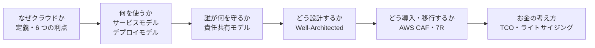
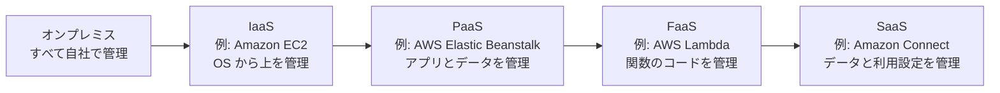
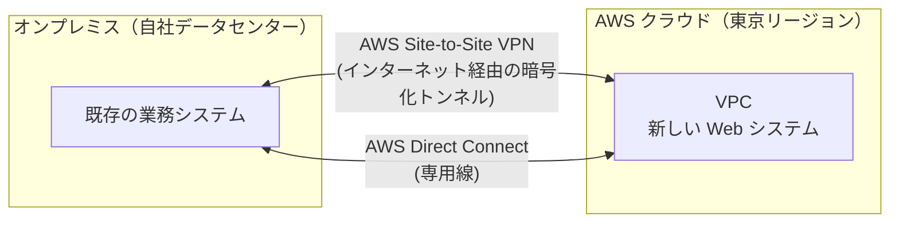
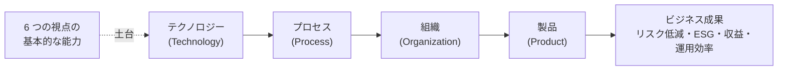
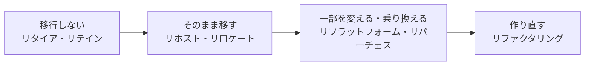

[ホーム](../README.md) > [Phase 1: 基礎](README.md) > クラウドコンピューティングの概念

# クラウドコンピューティングの概念

> **この章のゴール**
> - クラウドの定義（NIST の 5 つの特性）と、オンプレミスとの違い（CapEx から OpEx へ）を説明できる
> - AWS クラウドの 6 つの利点を、公式の表現で言える
> - IaaS / PaaS / FaaS / SaaS の違いと、利用者が管理する範囲の違いを説明できる
> - Well-Architected Framework の 6 つの柱と、AWS CAF の 6 つの視点を区別できる
> - 移行の 7R と、クラウドの経済性（TCO、ライトサイジング、弾力性）を説明できる
>
> **対応試験**: CLF-C02（第1分野: クラウドのコンセプト 24%）
> **目安時間**: 読む 90分 / 確認問題 30分

## この章の全体像

1〜3 章では IT の基礎を固めました。この章からは「クラウドとは何か」「なぜクラウドを使うのか」という、AWS を学ぶうえでの **考え方の土台** を扱います。CLF-C02 の第1分野（クラウドのコンセプト）は、ほぼこの章の内容で構成されています。

この章には「6 つ」の枠組みがいくつも出てきます。試験ではこれらの取り違えを狙った選択肢がよく出るので、最初に整理しておきます。

| 「6 つ」の正体 | 何についての枠組みか | 節 |
|---|---|---|
| 6 つの利点 | クラウドを使うと何が良くなるか | 2 |
| Well-Architected の 6 つの柱 | ワークロード（システム）をどう設計・評価するか | 6 |
| Well-Architected の 6 つの一般設計原則 | クラウドで設計するときの共通の考え方 | 6 |
| AWS CAF の 6 つの視点 | 組織としてクラウド導入をどう進めるか | 7 |

## 1. クラウドコンピューティングとは

### 1.1 一言でいうと

AWS はクラウドコンピューティングを「IT リソースをインターネット経由でオンデマンドに提供し、使った分だけ支払う（従量課金）形で利用できるようにすること」と説明しています。

身近なたとえは **電気** です。昔の工場は自前の発電機を持っていましたが、今は電力会社から使った分だけ電気を買います。発電所の建設や保守は電力会社の仕事なので、工場は本業に集中できます。クラウドも同じです。サーバーやデータセンターを自前で持つ代わりに、AWS が用意した巨大な設備を、必要なときに必要な分だけ借ります。

### 1.2 NIST の定義: 5 つの基本的な特性

クラウドの定義として最もよく引用されるのが、米国国立標準技術研究所（NIST）の文書 SP 800-145（2011年）です。クラウドであるための **5 つの基本的な特性** を定めています。

| 特性（英語） | 意味 | AWS での例 |
|---|---|---|
| オンデマンド・セルフサービス（On-demand self-service） | 事業者の担当者とやり取りせずに、利用者が必要なときに自分でリソースを用意できる | マネジメントコンソールや API から数分で Amazon Elastic Compute Cloud（Amazon EC2）のインスタンスを起動 |
| 幅広いネットワークアクセス（Broad network access） | ネットワーク経由で、PC やスマートフォンなど多様な端末から利用できる | インターネット、VPN、専用線（AWS Direct Connect）経由で利用 |
| リソースの共用（Resource pooling） | 物理リソースを多数の利用者で共有する（マルチテナント）。利用者は物理的な場所を細かく意識しない | 1 台の物理ホストを複数の顧客の EC2 インスタンスが共有（ハイパーバイザーで分離） |
| スピーディな拡張性（Rapid elasticity） | 需要に応じて素早く拡張・縮小できる。利用者からは無限にあるように見える | EC2 Auto Scaling で台数を自動で増減 |
| サービスが計測可能であること（Measured service） | 利用量が計測・可視化され、それに基づいて課金や最適化ができる | 利用時間に応じた課金（EC2 は多くの場合秒単位）、AWS Cost Explorer での可視化 |

> [!TIP]
> **試験のポイント**: CLF-C02 で NIST の用語そのものが問われることは多くありません。ただし「オンデマンド」「従量課金」「弾力性」「セルフサービス」という言葉は、正解の選択肢に繰り返し登場します。意味を確実に押さえておきましょう。

### 1.3 オンプレミスとの比較（CapEx から OpEx へ）

**オンプレミス**（on-premises）とは、自社のデータセンターやサーバールームに機器を置いて運用する形態です。

オンプレミスでは、サーバーを **先に買う** 必要があります。購入費用は **設備投資（CapEx: Capital Expenditure）** として資産に計上し、数年かけて減価償却します。一方クラウドでは、使った分をその都度支払う **運用費（OpEx: Operational Expenditure）** になります。

| 比較項目 | オンプレミス | AWS クラウド |
|---|---|---|
| 費用の性質 | 設備投資（CapEx）。先に大きな支出が必要 | 運用費（OpEx）。使った分だけ支払う |
| 調達にかかる時間 | 見積もり・発注・納品・設置で数週間〜数か月 | 数分 |
| キャパシティ計画 | 数年先のピークを予測して購入する（外れると過剰投資か不足） | 需要に合わせて増減できる |
| ハードウェアの故障対応 | 自社で保守契約を結び、部品を交換する | AWS が対応する（利用者は冗長構成を設計する） |
| 世界展開 | 現地にデータセンターやラックを確保する必要がある | 既存のリージョンを選ぶだけ |
| 使わなくなったとき | 機器が資産として残り、売却・廃棄が必要 | リソースを削除すれば課金が止まる |

> [!WARNING]
> **ひっかけ注意**: 「クラウドにすれば必ず安くなる」わけではありません。起動しっぱなしの過大なインスタンスや不要なデータ転送は、オンプレミスより高くつくこともあります（この章の 9 節と [08 章](08-billing-pricing-support.md) で扱います）。また AWS にも、1 年または 3 年の利用を約束して割引を受ける Savings Plans やリザーブドインスタンスがあります。「長期の約束＝オンプレミスだけ」ではない点にも注意してください。

## 2. AWS クラウドの 6 つの利点

AWS は、クラウドコンピューティングの利点を次の 6 つにまとめています（ホワイトペーパー「Amazon Web Services の概要」）。CLF-C02 で最も出題されやすいテーマの一つなので、**公式の表現のまま** 覚えてください。

| # | 公式の表現（日本語） | 英語 | 何が変わるか |
|---|---|---|---|
| 1 | 固定費が変動費に置き換わる | Trade fixed expense for variable expense | データセンターやサーバーへの多額の先行投資の代わりに、使った分だけ支払う |
| 2 | 大幅なスケールメリットが得られる | Benefit from massive economies of scale | 数十万の顧客の利用がクラウドに集約されるため、AWS はより大きなスケールメリットを実現でき、従量課金の料金が低く抑えられる |
| 3 | キャパシティの推測が不要になる | Stop guessing capacity | 需要を予測して機器を買う必要がない。必要に応じて数分でスケールアップ・ダウンできる |
| 4 | スピードと俊敏性が向上する | Increase speed and agility | 新しい IT リソースをクリックひとつで用意でき、開発者が使えるまでの時間が数週間から数分に短縮される |
| 5 | データセンターの運用と保守にコストを費やす必要がなくなる | Stop spending money running and maintaining data centers | ラッキング、電源、空調などのインフラ作業から解放され、ビジネスを差別化するプロジェクトと顧客に集中できる |
| 6 | 数分でグローバル展開できる | Go global in minutes | 数回のクリックで世界中の複数のリージョンにデプロイでき、低レイテンシーのサービスを低コストで提供できる |

### 2.1 問題文のキーワードと利点の対応

| 問題文の表現 | 対応する利点 |
|---|---|
| 「初期投資を抑えたい」「前払いの設備投資をなくしたい」 | 1. 固定費が変動費に置き換わる |
| 「AWS の規模によって従量課金の単価が下がる」 | 2. 大幅なスケールメリットが得られる |
| 「将来の需要が予測できない」「ピークに合わせて機器を買っている」 | 3. キャパシティの推測が不要になる |
| 「新しいアイデアを素早く低コストで試したい」「実験を増やしたい」 | 4. スピードと俊敏性が向上する |
| 「サーバーのラッキングや電源管理に人手を割きたくない」 | 5. データセンターの運用と保守にコストを費やす必要がなくなる |
| 「海外の顧客に低レイテンシーで提供したい」 | 6. 数分でグローバル展開できる |

> [!WARNING]
> **ひっかけ注意**: 「スケールメリット」は、利用者の会社の規模から生まれるものではありません。**AWS が多数の顧客の利用を集約すること** で生まれる規模の経済です。また「キャパシティの推測が不要」は「容量のことを一切考えなくてよい」という意味ではなく、「先に見込みで買わなくてよい」という意味です。

### 2.2 クラウドの価値を表す用語

CLF-C02 の出題範囲（タスク 1.1）では、6 つの利点に加えて次の用語の意味も問われます。似た言葉が多いので、違いを整理しましょう。

| 用語 | 意味 | AWS での例 |
|---|---|---|
| 俊敏性（アジリティ） | 新しいリソースを素早く用意し、試し、不要になればやめられること | 検証環境を数分で作り、終わったら削除する |
| スケーラビリティ | 負荷の増加に合わせて処理能力を増やせること。台数を増やす **スケールアウト**（水平）と、性能を上げる **スケールアップ**（垂直）がある | インスタンスを増やす / より大きなインスタンスタイプに変える |
| 弾力性（エラスティシティ） | 需要の増減に合わせて **自動的に** 拡張・縮小し、使った分だけ支払えること | EC2 Auto Scaling で夜間は台数を減らす |
| 高可用性 | 障害が起きても、サービスの停止時間を最小にすること | 複数のアベイラビリティーゾーン（AZ）にサーバーを配置する |
| 耐障害性（フォールトトレランス） | 一部の構成要素が壊れても、サービスが止まらずに動き続けること | 冗長化した構成要素が処理を自動で引き継ぐ |
| 信頼性 | 期待どおりの機能を一貫して提供し、障害から復旧できること | 自動復旧、バックアップ |

> [!TIP]
> **試験のポイント**: 「需要に応じて **自動で** 増減する」「**縮小** もできる」とあれば弾力性、「負荷の増加に対応できる」だけならスケーラビリティです。弾力性は「減らせる」ことがコスト削減に直結する点がポイントです。

## 3. サービスモデル（IaaS / PaaS / FaaS / SaaS）

### 3.1 抽象度の違い

クラウドサービスは、事業者が **どこまで** 用意してくれるかによって分類されます。抽象度が上がるほど利用者が管理する範囲は小さくなり、その代わりに設定できる自由度も小さくなります。

| モデル | 提供されるもの | 利用者が主に管理するもの | AWS の例 |
|---|---|---|---|
| IaaS（Infrastructure as a Service） | 仮想サーバー、ストレージ、ネットワークなどの基盤 | OS、ミドルウェア、アプリケーション、データ、ファイアウォールの設定 | Amazon EC2、Amazon Elastic Block Store（Amazon EBS）、Amazon Virtual Private Cloud（Amazon VPC） |
| PaaS（Platform as a Service） | アプリケーションを動かす実行環境（OS やミドルウェアの管理を含む） | アプリケーションとデータ、実行環境の設定 | AWS Elastic Beanstalk、Amazon Relational Database Service（Amazon RDS） |
| FaaS（Function as a Service） | イベントに応じて関数（コード）を実行する環境 | 関数のコード、設定（メモリ量、権限など） | AWS Lambda |
| SaaS（Software as a Service） | そのまま使える完成したアプリケーション | データと利用設定（誰に使わせるかなど） | Amazon Connect（コンタクトセンター）、AWS Marketplace で提供される SaaS 製品 |

### 3.2 責任範囲の違い

| レイヤー | オンプレミス | IaaS | PaaS | SaaS |
|---|---|---|---|---|
| データ・アクセス権限（誰に使わせるか） | **利用者** | **利用者** | **利用者** | **利用者** |
| アプリケーション | **利用者** | **利用者** | **利用者** | 事業者 |
| ミドルウェア・ランタイム | **利用者** | **利用者** | 事業者 | 事業者 |
| OS | **利用者** | **利用者** | 事業者 | 事業者 |
| 仮想化 | **利用者** | 事業者 | 事業者 | 事業者 |
| 物理サーバー・ストレージ・ネットワーク | **利用者** | 事業者 | 事業者 | 事業者 |
| データセンター（建物・電源・空調・物理的な警備） | **利用者** | 事業者 | 事業者 | 事業者 |

> [!IMPORTANT]
> どのモデルでも、**データとアクセス権限の管理は常に利用者の責任** です。SaaS であっても、どのデータを入れるか、誰にどの権限を与えるかは利用者が決めます。

> [!TIP]
> **試験のポイント**:
> - 「OS へのパッチ適用を利用者が行う」→ IaaS（Amazon EC2）
> - 「コードをアップロードするだけで、キャパシティのプロビジョニング、負荷分散、スケーリングが自動で行われる」→ AWS Elastic Beanstalk（PaaS）
> - 「サーバーを管理せず、イベントに応じてコードを実行し、実行時間分だけ支払う」→ AWS Lambda（FaaS / サーバーレス）

> [!NOTE]
> 「サーバーレス」はサービスモデルの正式な分類名ではなく、「利用者がサーバーを意識・管理しなくてよい」サービスの総称です。AWS Lambda のほか、AWS Fargate、Amazon Simple Storage Service（Amazon S3）、Amazon DynamoDB、Amazon Simple Queue Service（Amazon SQS）などもサーバーレスと呼ばれます。

## 4. デプロイモデル（クラウド / ハイブリッド / オンプレミス）

AWS は、クラウドのデプロイモデル（どこにどう配置するか）を 3 つに分けて説明しています。NIST はパブリック / プライベート / コミュニティ（業界団体など特定の共同体向け）/ ハイブリッドの 4 つに分類しますが、「誰と共有するか」「どこに置くか」で分類する点は同じです。

| デプロイモデル | 内容 | 典型的な場面 |
|---|---|---|
| クラウド（クラウドネイティブ / オールイン） | アプリケーションのすべてをクラウド上で動かす | 新規のシステム、データセンターを完全に廃止する場合 |
| ハイブリッド | オンプレミスの既存環境とクラウドを接続して併用する | 段階的な移行中、規制で一部のデータを社内に残す、既存システムとの連携 |
| オンプレミス（プライベートクラウド） | 仮想化やリソース管理のツールを使い、自社データセンター内にクラウドのような環境を作る | 自社設備で運用し続ける必要がある場合 |

> [!TIP]
> **試験のポイント**: 「既存のオンプレミス環境を残しながらクラウドと接続して使う」→ ハイブリッドです。接続手段は、**素早く・安価に始めたい** なら AWS Site-to-Site VPN、**安定した帯域と低レイテンシーの専用接続** が必要なら AWS Direct Connect です。AWS のハードウェアを自社の施設に置き、AWS と同じ API で使う AWS Outposts もハイブリッドの選択肢です（[05 章](05-global-infrastructure.md)）。

## 5. 責任共有モデルの入口

クラウドのセキュリティは、AWS と利用者が **分担** します。これを **責任共有モデル** と呼びます。

- **AWS の責任**: **「クラウドのセキュリティ」**（Security **of** the Cloud）。データセンターの物理的なセキュリティ、ハードウェア、ネットワーク基盤、仮想化レイヤー、マネージドサービスの基盤を守ります。
- **利用者の責任**: **「クラウドにおけるセキュリティ」**（Security **in** the Cloud）。データ、AWS Identity and Access Management（IAM）によるアクセス権限、EC2 のゲスト OS のパッチ、セキュリティグループなどのファイアウォール設定、暗号化の設定、アプリケーションを守ります。

どこまでが利用者の担当かは、使うサービスによって変わります。

| サービスの例 | 利用者が行うこと | AWS が行うこと |
|---|---|---|
| Amazon EC2（IaaS） | ゲスト OS のパッチ適用、ミドルウェアとアプリの管理、セキュリティグループの設定、データの暗号化 | 物理ホスト、ハイパーバイザー、データセンター |
| Amazon RDS（マネージドサービス） | DB のユーザーと権限、ネットワークアクセスの設定、暗号化の有効化、メンテナンスウィンドウの指定 | OS と DB エンジンへのパッチ適用（指定したメンテナンスウィンドウで実施）、バックアップの仕組み、ハードウェア |
| AWS Lambda（サーバーレス） | 関数のコード、IAM ロール（権限）、扱うデータ | 実行環境（OS やランタイムの基盤）、スケーリング |

> [!NOTE]
> マネージドなサービスほど AWS の担当範囲が広がり、利用者の負担は小さくなります。ただし、**データ・ID・アクセス権限は常に利用者の責任** です。詳しくは [07 章: AWS のセキュリティとコンプライアンス](07-security-and-compliance.md) で学びます。

## 6. AWS Well-Architected Framework（概要）

### 6.1 Well-Architected とは

AWS Well-Architected Framework は、AWS のソリューションアーキテクトが多くの顧客のシステムを見てきた経験から、**クラウドでシステムを設計・運用するためのベストプラクティス** を体系化したものです。柱ごとに用意された質問に答えていくことで、ワークロード（システム）のリスクや改善点を見つけられます。

- マネジメントコンソールから追加料金なしで使える **AWS Well-Architected Tool** で、セルフレビューができます。
- 業界や技術ごとの追加の観点を **レンズ** として提供しています（例: サーバーレスレンズ、SaaS レンズ、生成 AI レンズ、エージェント AI レンズ）。
- フレームワーク本体は定期的に改訂されています（最新の改訂は 2024年11月。2026年9月時点）。

### 6.2 6 つの柱

| 柱 | 目的（一言で） | 代表的な設計原則 | 問題文のキーワード |
|---|---|---|---|
| 運用上の優秀性（Operational Excellence） | ワークロードを効果的に運用し、継続的に改善する | 運用をコードとして実行する / 小規模かつ可逆的な変更を頻繁に行う / 障害を予測する / すべての運用上のイベントから学ぶ | IaC、自動化、変更管理、ランブック、振り返り |
| セキュリティ（Security） | データ・システム・資産を保護する | 強力なアイデンティティ基盤を実装する / トレーサビリティを確保する / すべてのレイヤーでセキュリティを適用する / 転送中と保管中のデータを保護する / 人をデータから遠ざける / セキュリティイベントに備える | 最小権限、MFA、暗号化、ログ、監査 |
| 信頼性（Reliability） | 期待どおりの機能を一貫して提供し、障害から素早く復旧する | 障害から自動的に復旧する / 復旧手順をテストする / 水平方向にスケールして全体の可用性を高める / キャパシティの推測をやめる / 変更を自動化で管理する | マルチ AZ、バックアップ、災害対策（DR）、自動復旧 |
| パフォーマンス効率（Performance Efficiency） | リソースを効率よく使って要件を満たし、需要や技術の変化に合わせて最適な状態を保つ | 高度なテクノロジーを民主化する / 数分でグローバル展開する / サーバーレスアーキテクチャを使う / より頻繁に実験する / メカニカルシンパシー（技術の特性に合った使い方）を考慮する | 適切なインスタンスタイプ、キャッシュ、CDN |
| コスト最適化（Cost Optimization） | 最も低いコストでビジネス価値を提供する | クラウド財務管理を実践する / 消費モデルを採用する / 全体的な効率を測定する / 差別化につながらない重労働への支出をやめる / 支出を分析し、帰属させる | ライトサイジング、Savings Plans、タグ付け、不要リソースの削除 |
| 持続可能性（Sustainability） | クラウドワークロードが環境に与える影響を最小化する | 影響を理解する / 持続可能性の目標を設定する / 使用率を最大化する / より効率的な新しいハードウェアやソフトウェアを採用する / マネージドサービスを使う / 下流への影響を減らす | 使用率の向上、エネルギー効率の高いインスタンス（AWS Graviton など）、不要データの削減 |

> [!WARNING]
> **ひっかけ注意**: 持続可能性の柱は 2021年12月に追加された 6 番目の柱です。古い教材では「5 本の柱」と書かれていることがあります。また、「障害からの自動復旧」「マルチ AZ」は **信頼性**、「適切なリソースタイプの選択」「キャッシュによる高速化」は **パフォーマンス効率** です。混同しやすいので注意してください。

### 6.3 一般設計原則

6 つの柱に共通する、クラウドならではの設計の考え方が **一般設計原則** です。オンプレミスの制約（機器を先に買う、テスト環境を簡単に作れない、など）から解放されることで可能になった考え方だと理解すると覚えやすくなります。

| 一般設計原則 | 意味 |
|---|---|
| キャパシティのニーズを推測しない（Stop guessing your capacity needs） | 必要に応じて自動でスケールすれば、見込み違いによる過剰や不足を避けられる |
| 本番規模でシステムをテストする（Test systems at production scale） | 本番と同じ規模のテスト環境を必要なときだけ作り、終わったら削除できる |
| 自動化によってアーキテクチャの実験を容易にする（Automate with architectural experimentation in mind） | 構築を自動化しておけば、低コストで何度でも作り直しや比較ができる |
| 進化するアーキテクチャを考慮する（Consider evolutionary architectures） | 最初の設計に縛られず、ビジネスや技術の変化に合わせて進化させる |
| データに基づいてアーキテクチャを決定する（Drive architectures using data） | 勘ではなく、収集したメトリクスやログに基づいて設計を判断する |
| ゲームデーを通じて改善する（Improve through game days） | 本番を模した障害訓練（ゲームデー）で、仕組みと手順の弱点を見つける |

> [!TIP]
> **試験のポイント**: 「Well-Architected の 6 つの柱のどれに当てはまるか」を問う問題は定番です。柱の名前と問題文のキーワードを結び付けて覚えましょう。各柱の詳細は Phase 2 の [AWS Well-Architected Framework](../02-associate/17-well-architected.md) で学びます。

## 7. AWS Cloud Adoption Framework（AWS CAF）

### 7.1 AWS CAF とは

Well-Architected が「個々のワークロードをどう設計するか」の枠組みなのに対し、**AWS クラウド導入フレームワーク（AWS Cloud Adoption Framework、AWS CAF）** は「**組織として** クラウドを導入し、ビジネスを変革するには何が必要か」を整理した枠組みです。AWS の経験に基づくベストプラクティスを、**6 つの視点（パースペクティブ）** と、それぞれに属する **基本的な能力（ケイパビリティ）** として示しています。

AWS CAF を活用することで期待できる **ビジネス成果** として、次の 4 つが挙げられています。

- ビジネスリスクの低減（Reduced business risk）
- ESG（環境・社会・ガバナンス）パフォーマンスの向上（Improved ESG performance）
- 収益の増加（Increased revenue）
- 運用効率の向上（Increased operational efficiency）

> [!TIP]
> **試験のポイント**: CLF-C02 の出題範囲（タスク 1.3）には「AWS CAF の利点」が明記されています。上の 4 つをそのまま覚えましょう。「セキュリティ責任を AWS に移せる」「コストが必ずゼロになる」といった選択肢は CAF の利点ではありません。

### 7.2 6 つの視点

6 つの視点は、**ビジネス面**（ビジネス、人材、ガバナンス）と **技術面**（プラットフォーム、セキュリティ、オペレーション）に分かれます。

| グループ | 視点 | 主な関係者 | 焦点 | 代表的な能力 |
|---|---|---|---|---|
| ビジネス面 | ビジネス（Business） | CEO、CFO、COO、CIO、CTO | クラウドへの投資が、デジタル変革とビジネス成果を加速させるようにする | 戦略管理、ポートフォリオ管理、イノベーション管理、製品管理、データの収益化、ビジネスインサイト |
| ビジネス面 | 人材（People） | CIO、COO、CTO、クラウド推進の責任者、人事部門の責任者 | 技術とビジネスの橋渡し。組織文化、リーダーシップ、スキルを変革する | 文化の進化、変革型リーダーシップ、クラウドの習熟（クラウドフルエンシー）、人材の変革、組織設計 |
| ビジネス面 | ガバナンス（Governance） | CIO、CTO、CFO、CDO（最高データ責任者）、CRO（最高リスク責任者） | 利益を最大化し、リスクを最小化するように取り組みを統制する | プログラム・プロジェクト管理、ベネフィット管理、リスク管理、クラウド財務管理、アプリケーションポートフォリオ管理、データガバナンス |
| 技術面 | プラットフォーム（Platform） | CTO、技術リーダー、アーキテクト、エンジニア | 拡張性のあるハイブリッドクラウド基盤を構築し、ワークロードをモダナイズする | プラットフォームアーキテクチャ、データアーキテクチャ、プラットフォームエンジニアリング、データエンジニアリング、CI/CD、モダンなアプリケーション開発 |
| 技術面 | セキュリティ（Security） | CISO、CCO（最高コンプライアンス責任者）、内部監査の責任者、セキュリティアーキテクト・エンジニア | データとクラウドワークロードの機密性・完全性・可用性を確保する | セキュリティガバナンス、ID とアクセス管理、脅威検出、脆弱性管理、インフラストラクチャ保護、データ保護、インシデント対応 |
| 技術面 | オペレーション（Operations） | インフラ・運用の責任者、SRE、IT サービス管理者 | クラウドサービスを、ビジネスが求める水準で提供・運用する | オブザーバビリティ、イベント管理、インシデントと問題の管理、変更とリリースの管理、パフォーマンスとキャパシティの管理、パッチ管理 |

問題文の「課題」から視点を選ぶ練習をしておきましょう。

| 問題文にある課題 | 視点 |
|---|---|
| クラウド投資の戦略、ビジネス目標との整合、新しいビジネスモデル | ビジネス |
| 社員のクラウドスキル不足、トレーニング計画、組織文化、変化への抵抗 | 人材 |
| クラウドのコスト管理、リスク管理、プログラム管理、投資効果の測定 | ガバナンス |
| アーキテクチャ設計、CI/CD、基盤の構築、アプリケーションのモダナイズ | プラットフォーム |
| アクセス権限、脅威検出、データ保護、セキュリティインシデントへの対応 | セキュリティ |
| 監視、システム障害への対応、パッチ適用、キャパシティ管理 | オペレーション |

> [!WARNING]
> **ひっかけ注意**: 「データ」に関する能力は複数の視点に分かれています。**データガバナンス** はガバナンス、**データアーキテクチャ・データエンジニアリング** はプラットフォーム、**データ保護** はセキュリティ、**データの収益化・ビジネスインサイト** はビジネスです。また、**クラウド財務管理（コスト管理）はガバナンス** の視点に含まれます。「インシデント」も、セキュリティインシデントならセキュリティ、システム障害ならオペレーションです。

### 7.3 変革の領域と導入のフェーズ

AWS CAF では、クラウドによる変革を 4 つの **変革の領域（transformation domains）** の連鎖として説明します。6 つの視点の能力は、この連鎖を支える土台です。

| 変革の領域 | 内容 |
|---|---|
| テクノロジー | クラウドを使って、インフラやアプリケーションを移行・モダナイズする |
| プロセス | データ・分析・機械学習などを活用して、業務のやり方をデジタル化・自動化・最適化する |
| 組織 | 事業と技術の運営モデルを見直す（例: 製品やバリューストリーム単位のチームに再編する） |
| 製品 | 新しい価値提案や収益モデルを生み出し、ビジネスモデルそのものを変革する |

導入は、次の 4 つのフェーズを繰り返しながら段階的に進めます。

| フェーズ | 内容 |
|---|---|
| 構想（Envision） | クラウドで実現したい変革の機会を特定し、優先順位を付ける |
| 調整（Align） | 6 つの視点にわたって能力のギャップや依存関係を洗い出し、関係者の合意を得て計画を立てる |
| 立ち上げ（Launch） | パイロット（試験的な取り組み）を本番で提供し、段階的に価値を示す |
| 拡大（Scale） | パイロットを本番規模に広げ、ビジネス価値を継続的に実現する |

## 8. 移行の 7R（概要）

既存のシステムをクラウドへ移すときは、アプリケーションごとに移行戦略を選びます。AWS はこれを **7R**（7 つの移行戦略）として整理しています。すべてを一律に作り直すのではなく、ビジネス上の価値と労力のバランスで戦略を選ぶことが大切です。下の図では、右に行くほどアプリケーションへの変更が大きくなります。

| 戦略 | 別名・イメージ | 内容 | 例 |
|---|---|---|---|
| リタイア（Retire） | 廃止 | 不要になったアプリケーションを停止・廃棄する | 利用者がほとんどいない古いシステム |
| リテイン（Retain） | 保持・再検討 | 今は移行せず、オンプレミスに残す | 最近ハードウェアを更新した、依存関係が複雑、規制上すぐには移せない |
| リホスト（Rehost） | リフト&シフト | 手を加えずに、そのまま AWS へ移す | オンプレミスの仮想マシンを Amazon EC2 へ（AWS Application Migration Service を使用） |
| リロケート（Relocate） | ハイパーバイザーレベルのリフト&シフト | 基盤ごと、クラウド上の同じ種類の基盤へ移す。アプリケーションや OS に手を加えず、新しいハードウェアの購入も不要 | オンプレミスの VMware 環境を VMware Cloud on AWS へ |
| リプラットフォーム（Replatform） | リフト・ティンカー&シフト | 基本構造は変えず、一部をマネージドサービスなどに置き換えて最適化する | 自社運用のデータベースを Amazon RDS へ |
| リパーチェス（Repurchase） | ドロップ&ショップ | 別の製品（多くは SaaS）に乗り換える | 自社運用の CRM を SaaS の CRM へ |
| リファクタリング / リアーキテクト（Refactor / Re-architect） | 作り直し | クラウドネイティブな機能を活用して設計し直す。労力は最大だが、俊敏性や拡張性の効果も最大 | モノリシックなアプリケーションを、マイクロサービスとサーバーレスで再構築 |

> [!NOTE]
> 移行を支援する主なサービスです（詳細は Phase 2 の [移行とハイブリッド接続](../02-associate/16-migration-hybrid.md)）。
> - **AWS Transform**: エージェント型 AI で、移行の評価と計画、VMware 環境からの移行、メインフレームや .NET アプリケーションのモダナイズを支援します（2025年5月 GA）。
> - **AWS Application Migration Service（AWS MGN）**: サーバーのリホスト
> - **AWS Database Migration Service（AWS DMS）**: データベースの移行
> - **AWS DataSync**: ファイルやオブジェクトデータのオンライン転送

> [!WARNING]
> **ひっかけ注意**: AWS Migration Hub と AWS Application Discovery Service は **2025年11月7日に新規顧客の受付を終了** し、後継として AWS Transform が案内されています。物理デバイスでデータを運ぶ AWS Snowball Edge も、同日に新規受付を終了しました。ただし試験や古い教材ではこれらのサービス名が選択肢に登場する可能性があるため、「何をするサービスか」は理解しておきましょう（[06 章](06-core-services-tour.md) の状態一覧も参照）。

> [!TIP]
> **試験のポイント**: 「変更を最小限にして、できるだけ早く移行したい」→ リホスト、「コア部分は変えずに DB をマネージドサービスへ」→ リプラットフォーム、「SaaS に乗り換える」→ リパーチェス、「クラウドネイティブに作り直して俊敏性を高めたい」→ リファクタリングです。SAP-C03 では、これらを組み合わせた大規模移行の計画が問われます（[移行とモダナイゼーション](../03-professional/07-migration-modernization.md)）。

## 9. クラウドの経済性

### 9.1 TCO（総所有コスト）

**TCO（Total Cost of Ownership、総所有コスト）** は、システムを所有・運用する期間全体でかかる費用の合計です。オンプレミスとクラウドを比べるときは、サーバーの購入価格だけでなく、見えにくいコストまで含めて比較します。

| 分類 | オンプレミスでかかる主なコスト | AWS でかかる主なコスト |
|---|---|---|
| 直接コスト | サーバー・ストレージ・ネットワーク機器、ソフトウェアライセンス、データセンター（建物・ラック・電源・空調・物理セキュリティ）、保守契約 | サービスの利用料（コンピューティング、ストレージ、データ転送など）、サポートプランの料金 |
| 間接コスト | 調達・構築・運用・保守の人件費、ピークに合わせた余剰キャパシティ、調達待ちによる機会損失 | 運用の人件費（マネージドサービスで削減できる）、移行期間中の並行稼働、トレーニング |

> [!WARNING]
> **ひっかけ注意**: 「オンプレミスのサーバー購入価格」と「EC2 の料金」だけを比べるのは不公平な比較です。電力・冷却・床面積・人件費・余剰キャパシティを含めた TCO で比べます。なお、古い教材に登場する「AWS TCO Calculator」や「AWS Simple Monthly Calculator」は提供を終了しており、現在の見積もりツールは [AWS Pricing Calculator](https://calculator.aws/) です。

### 9.2 弾力性がコストを下げる理由

オンプレミスでは、ピークに合わせて用意した容量の費用を平常時も払い続け、容量を超える需要が来れば処理しきれずに機会損失が起きます。弾力性のあるクラウドでは、需要に合わせて自動でスケールアウト・スケールインするため、**遊休リソースのコストと機会損失の両方を減らせます**。プロジェクトが終われば、リソースを削除するだけで課金が止まります。

### 9.3 ライトサイジング

**ライトサイジング（rightsizing）** とは、ワークロードの実際の性能要件に合わせて、インスタンスのタイプとサイズを適切に選び、継続的に見直すことです。オンプレミスでは「念のため大きめ」に買いがちですが、クラウドではサイズを後から簡単に変えられます。**実測値に基づいて小さく始め、調整していく** のが基本です。

- 推奨事項を得られるツール: AWS Compute Optimizer、AWS Cost Explorer（ライトサイジングの推奨事項）、AWS Trusted Advisor（使用率の低い EC2 インスタンスのチェックなど）
- 進め方の基本: **まずライトサイジングし、そのうえで Savings Plans やリザーブドインスタンスを購入する**。過大なサイズのまま長期の約束をすると、ムダまで固定化してしまうからです。

### 9.4 そのほかの経済性の要素

| 要素 | 考え方 | AWS での例 |
|---|---|---|
| マネージドサービス | 構築・パッチ適用・バックアップなどの運用作業を AWS に任せ、人件費を減らす | Amazon RDS、Amazon Elastic Container Service（Amazon ECS）/ Amazon Elastic Kubernetes Service（Amazon EKS）、Amazon DynamoDB、AWS Fargate |
| 自動化 | 手作業を減らし、ミスと作業時間を減らす | AWS CloudFormation によるインフラのコード化 |
| ライセンス戦略 | 手持ちのライセンスを持ち込む（BYOL: Bring Your Own License）か、料金にライセンス費用が含まれる形態（ライセンス込み）を選ぶ | Windows Server のライセンス込み EC2 インスタンス、Amazon RDS for Oracle の BYOL / ライセンス込み、BYOL 向けの EC2 Dedicated Hosts |
| 購入オプション | 使い方に合わせて料金モデルを選ぶ | オンデマンド、Savings Plans、リザーブドインスタンス、スポットインスタンス（[08 章](08-billing-pricing-support.md)） |
| 規模の経済 | AWS の規模拡大による効率化が、料金の値下げとして還元される | 6 つの利点の 2 番目 |

> [!TIP]
> **試験のポイント**: 「運用上のオーバーヘッドを減らしたい」→ マネージドサービス、「既存のライセンスを活用したい」→ BYOL（ソケット数やコア数に基づくライセンスなら Dedicated Hosts）、「インスタンスが過大」→ ライトサイジング（AWS Compute Optimizer）です。

## 10. CLF-C02 第1分野との対応

CLF-C02 の第1分野「クラウドのコンセプト」は、採点対象の設問の 24% を占めます。試験ガイドのタスクと、この教材の該当箇所の対応は次のとおりです。

| タスク | 内容（試験ガイドの要旨） | 該当箇所 |
|---|---|---|
| 1.1 AWS クラウドの利点を定義する | 6 つの利点、グローバルインフラの利点（展開の速さ、世界への到達範囲）、高可用性・弾力性・俊敏性 | 本章 1〜2 節、[05 章](05-global-infrastructure.md) |
| 1.2 AWS クラウドの設計原則を特定する | Well-Architected Framework の柱と、柱どうしの違い | 本章 6 節、[AWS Well-Architected Framework](../02-associate/17-well-architected.md) |
| 1.3 AWS クラウドへの移行の利点と戦略を理解する | AWS CAF の利点と構成要素、適切な移行戦略 | 本章 7〜8 節 |
| 1.4 クラウドの経済性の概念を理解する | 固定費と変動費、オンプレミスのコスト、ライセンス戦略、ライトサイジング、自動化とマネージドサービスの利点 | 本章 1.3 節・9 節、[08 章](08-billing-pricing-support.md) |

## まとめ

- クラウドとは、IT リソースをインターネット経由でオンデマンドに提供し、従量課金で使えるようにすること。NIST は 5 つの特性（オンデマンド・セルフサービス、幅広いネットワークアクセス、リソースの共用、スピーディな拡張性、サービスが計測可能であること）で定義している
- オンプレミスの設備投資（CapEx）が、クラウドでは使った分だけの運用費（OpEx）になる
- 6 つの利点: 固定費が変動費に置き換わる / 大幅なスケールメリットが得られる / キャパシティの推測が不要になる / スピードと俊敏性が向上する / データセンターの運用と保守にコストを費やす必要がなくなる / 数分でグローバル展開できる
- IaaS → PaaS → FaaS → SaaS の順に利用者の管理範囲は小さくなるが、データとアクセス権限は常に利用者の責任
- デプロイモデルはクラウド / ハイブリッド / オンプレミス（プライベートクラウド）。責任共有モデルでは、AWS が「クラウドのセキュリティ」、利用者が「クラウドにおけるセキュリティ」を担う
- Well-Architected の 6 つの柱: 運用上の優秀性、セキュリティ、信頼性、パフォーマンス効率、コスト最適化、持続可能性
- AWS CAF の 6 つの視点: ビジネス、人材、ガバナンス（ビジネス面）と、プラットフォーム、セキュリティ、オペレーション（技術面）
- 7R: リタイア、リテイン、リホスト、リロケート、リプラットフォーム、リパーチェス、リファクタリング
- TCO は見えにくいコストまで含めて比較する。ライトサイジングしてから長期割引を検討する

## 確認問題

### 問1

あるオンライン小売企業では、年末のセール期間だけ平常時の数倍のアクセスが集中します。現在はピーク時に合わせて購入したサーバーをオンプレミスで運用しており、1 年の大半はサーバーの多くが遊休状態です。AWS クラウドのどの利点が、この課題を最も直接的に解決しますか。

- A. 数分でグローバル展開できる
- B. 大幅なスケールメリットが得られる
- C. データセンターの運用と保守にコストを費やす必要がなくなる
- D. キャパシティの推測が不要になる

解答と解説

**正解: D**

**解説**: ピークを予測して事前に機器を購入しているために、遊休リソースが発生しているという課題です。AWS では需要に合わせて必要な分だけキャパシティを増減できるため、見込みで買う必要がなくなります。

**各選択肢の検討**
- A: ✗ 世界中の利用者へ低レイテンシーで提供する利点で、需要の変動とは関係しません。
- B: ✗ AWS が多数の顧客の利用を集約することで料金が下がる利点です。遊休リソースの問題を直接は解決しません。
- C: ✗ ラッキングや電源管理などの作業から解放される利点で、キャパシティの過不足とは別の話です。
- D: ✓ 需要予測に基づく過剰投資をなくし、必要なときに必要な分だけ使えます。

### 問2

「弾力性（エラスティシティ）」の説明として最も適切なものはどれですか。

- A. 需要の増減に合わせてリソースを自動的に追加・削除し、使った分だけ支払えること
- B. 複数のアベイラビリティーゾーンにリソースを配置し、1 か所が停止してもサービスを継続できること
- C. 数回のクリックで、世界中の複数のリージョンにアプリケーションをデプロイできること
- D. 1 年または 3 年の利用を約束することで、利用料金の割引を受けられること

解答と解説

**正解: A**

**解説**: 弾力性は、需要に合わせて自動的に拡張 **と縮小** ができることです。縮小できるため、使った分だけの支払いになり、コスト削減につながります。

**各選択肢の検討**
- A: ✓ 弾力性の定義そのものです。
- B: ✗ 高可用性（耐障害性）の説明です。
- C: ✗ 6 つの利点の「数分でグローバル展開できる」の説明です。
- D: ✗ Savings Plans やリザーブドインスタンスなど、購入オプションの説明です。

### 問3

あるスタートアップ企業は、Java で開発した Web アプリケーションを AWS で公開したいと考えています。チームにはインフラの専門家がおらず、キャパシティのプロビジョニング、負荷分散、自動スケーリング、アプリケーションの状態監視を自分たちで構築したくありません。コードをアップロードするだけで、これらを自動で構成できるサービスはどれですか。

- A. Amazon EC2
- B. Amazon Lightsail
- C. AWS Elastic Beanstalk
- D. AWS Outposts

解答と解説

**正解: C**

**解説**: AWS Elastic Beanstalk は PaaS 型のサービスです。コードをアップロードすると、キャパシティのプロビジョニング、負荷分散、自動スケーリング、状態監視を自動で構成します。

**各選択肢の検討**
- A: ✗ IaaS です。OS、ミドルウェア、ロードバランサー、スケーリングを自分で構成する必要があります。
- B: ✗ 月額料金のシンプルな仮想サーバーです。サーバー（OS）の管理は利用者が行い、負荷分散や自動スケーリングまでを一括で構成するサービスではありません。
- C: ✓ 要件をすべて満たします。
- D: ✗ AWS のインフラを自社の施設に設置するサービスで、要件とは関係ありません。

### 問4

ある製造業の企業は AWS への移行を計画しています。調査の結果、社員のクラウドに関するスキル不足と、変化を避ける組織文化が最大の障壁であることがわかりました。AWS Cloud Adoption Framework（AWS CAF）のどの視点で、この課題に取り組むべきですか。

- A. ガバナンス
- B. 人材
- C. オペレーション
- D. プラットフォーム

解答と解説

**正解: B**

**解説**: 人材（People）の視点は、文化の進化、クラウドの習熟（スキル）、変革型リーダーシップ、組織設計を扱います。

**各選択肢の検討**
- A: ✗ プログラム管理、リスク管理、クラウド財務管理など、取り組みの統制を扱います。
- B: ✓ スキルと組織文化の課題に対応する視点です。
- C: ✗ 監視、インシデント管理、パッチ管理など、日々の運用を扱います。
- D: ✗ アーキテクチャ、CI/CD、データエンジニアリングなど、技術基盤を扱います。

### 問5

AWS クラウドの 6 つの利点に含まれるものはどれですか。**2 つ選択してください。**

- A. 固定費が変動費に置き換わる
- B. AWS がすべてのセキュリティ対策を代行するため、利用者のセキュリティ責任がなくなる
- C. 長期の固定契約によって、毎月の料金が一定になる
- D. 利用者が物理サーバーの機種を自由に選定し、購入できる
- E. 数分でグローバル展開できる

解答と解説

**正解: A、E**

**解説**: 6 つの利点は「固定費が変動費に置き換わる」「大幅なスケールメリットが得られる」「キャパシティの推測が不要になる」「スピードと俊敏性が向上する」「データセンターの運用と保守にコストを費やす必要がなくなる」「数分でグローバル展開できる」です。

**各選択肢の検討**
- A: ✓ 6 つの利点の 1 番目です。
- B: ✗ 責任共有モデルにより、データやアクセス権限などは常に利用者の責任です。
- C: ✗ 基本は従量課金です。長期の約束による割引はありますが、6 つの利点ではありません。
- D: ✗ 物理サーバーを選定・購入しなくてよいことがクラウドの特徴です。
- E: ✓ 6 つの利点の 6 番目です。

### 問6

ある企業は、オンプレミスの仮想マシン上で自社運用している MySQL データベースを AWS に移行します。アプリケーションのコードやデータベースの設計は変えずに、バックアップやパッチ適用の運用負担を減らすため、Amazon RDS for MySQL へ移したいと考えています。この移行戦略はどれですか。

- A. リホスト
- B. リパーチェス
- C. リプラットフォーム
- D. リファクタリング

解答と解説

**正解: C**

**解説**: 基本構造は変えずに、一部（データベースの運用基盤）をマネージドサービスに置き換えて最適化する戦略は、リプラットフォーム（リフト・ティンカー&シフト）です。

**各選択肢の検討**
- A: ✗ リホストは、仮想マシンを EC2 にそのまま移すような戦略です。マネージドサービスへの置き換えは含みません。
- B: ✗ リパーチェスは、別の製品（多くは SaaS）に乗り換える戦略です。
- C: ✓ 要件に合致します。
- D: ✗ リファクタリングは、クラウドネイティブに設計し直す戦略です。「設計は変えない」という要件に反し、労力も大きくなります。

### 問7

あるチームが、AWS Well-Architected Framework に基づいてワークロードをレビューしています。「障害から自動的に復旧する」「復旧手順をテストする」「水平方向にスケールして全体の可用性を高める」という設計原則が含まれる柱はどれですか。

- A. パフォーマンス効率
- B. 信頼性
- C. 運用上の優秀性
- D. 持続可能性

解答と解説

**正解: B**

**解説**: 障害からの自動復旧、復旧手順のテスト、水平スケーリングによる可用性の向上は、信頼性の柱の設計原則です。

**各選択肢の検討**
- A: ✗ パフォーマンス効率は、リソースを効率よく使うこと（適切なリソースの選択、サーバーレスの活用、頻繁な実験など）を扱います。
- B: ✓ 設計原則がすべて信頼性の柱に当てはまります。
- C: ✗ 運用上の優秀性は、運用のコード化、小さく可逆的な変更、運用上のイベントから学ぶことなどを扱います。
- D: ✗ 持続可能性は、環境への影響の最小化を扱います。

## 次のステップ

- 次の章: [AWS グローバルインフラストラクチャ](05-global-infrastructure.md) で、「数分でグローバル展開できる」を支える仕組みを学びます
- 関連する章: [AWS のセキュリティとコンプライアンス](07-security-and-compliance.md)（責任共有モデルの詳細）、[料金・請求・サポート](08-billing-pricing-support.md)（料金モデル）、Phase 2 の [AWS Well-Architected Framework](../02-associate/17-well-architected.md) と [移行とハイブリッド接続](../02-associate/16-migration-hybrid.md)
- 公式ドキュメント
  - [クラウドコンピューティングの 6 つの利点（AWS ホワイトペーパー）](https://docs.aws.amazon.com/ja_jp/whitepapers/latest/aws-overview/six-advantages-of-cloud-computing.html)
  - [AWS Well-Architected Framework](https://docs.aws.amazon.com/wellarchitected/latest/framework/welcome.html) / [AWS Cloud Adoption Framework](https://aws.amazon.com/cloud-adoption-framework/)
  - [移行戦略（AWS Prescriptive Guidance）](https://docs.aws.amazon.com/prescriptive-guidance/latest/large-migration-guide/migration-strategies.html)
  - [NIST SP 800-145: The NIST Definition of Cloud Computing](https://csrc.nist.gov/pubs/sp/800/145/final)
  - [AWS Certified Cloud Practitioner（CLF-C02）試験ガイド](https://docs.aws.amazon.com/aws-certification/latest/cloud-practitioner-02/cloud-practitioner-02.html)

---
[← 前の章: セキュリティとデータベースの基礎](03-security-database-basics.md) | [目次](README.md) | [次の章: AWS グローバルインフラストラクチャ →](05-global-infrastructure.md)
