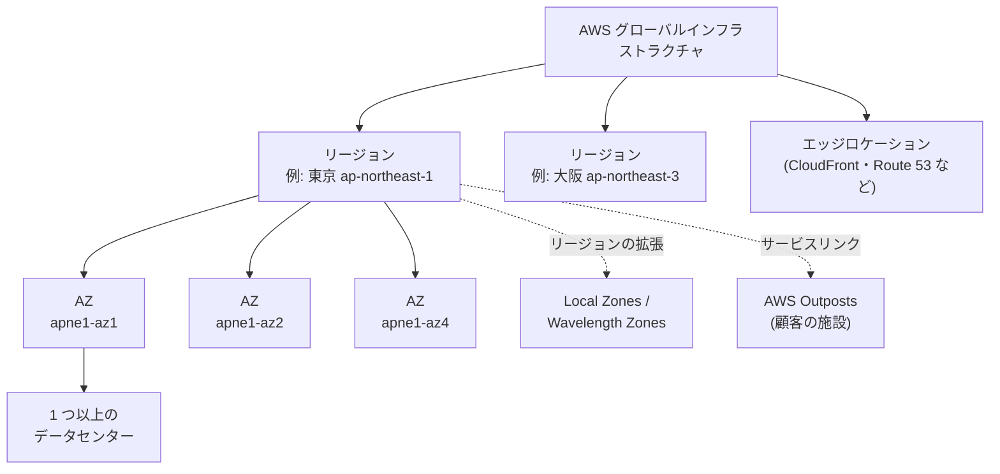
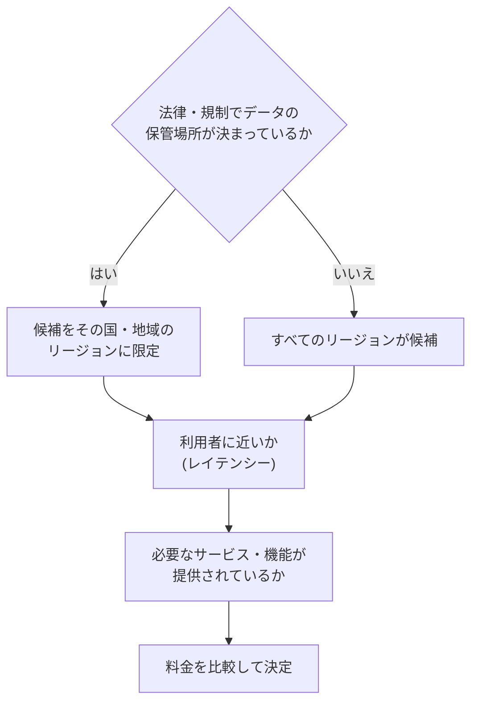
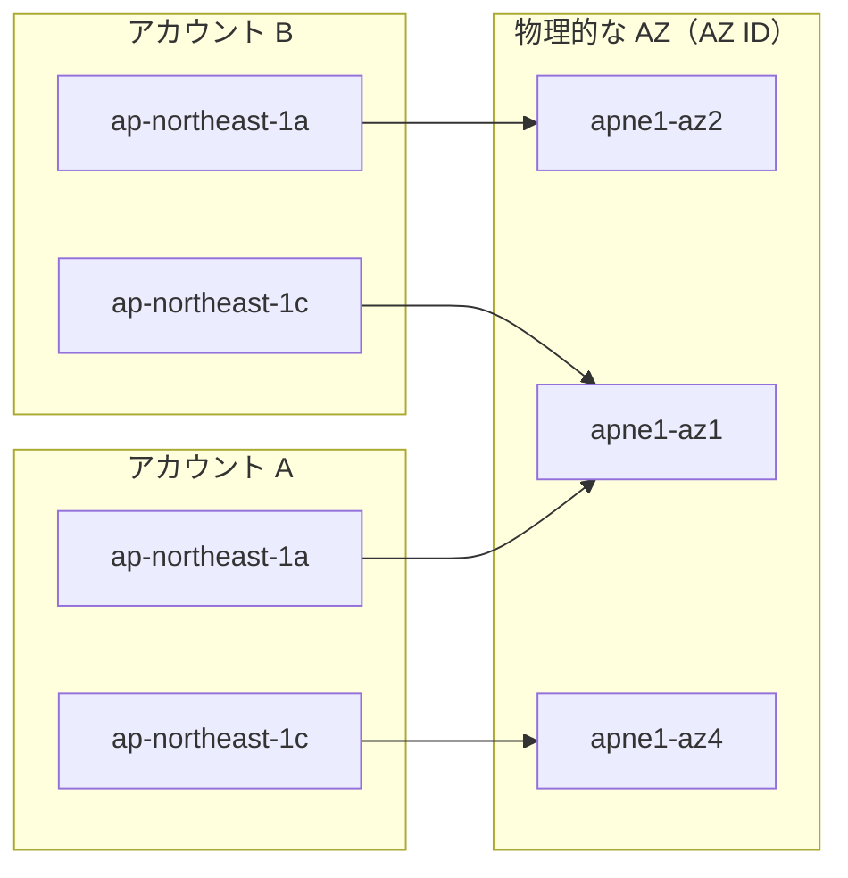
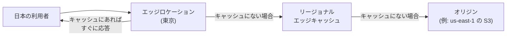
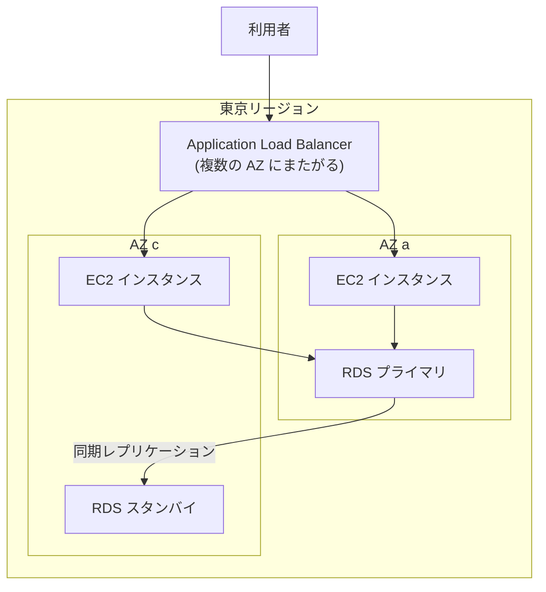
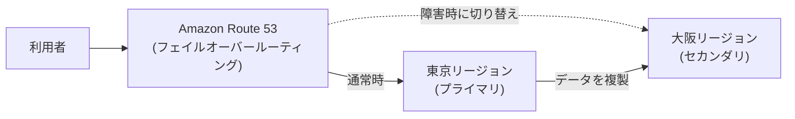

[ホーム](../README.md) > [Phase 1: 基礎](README.md) > AWS グローバルインフラストラクチャ

# AWS グローバルインフラストラクチャ

> **この章のゴール**
> - リージョン、アベイラビリティーゾーン（AZ）、エッジロケーションの関係と役割を説明できる
> - リージョン選択の 4 つの観点（コンプライアンス、レイテンシー、サービスの提供状況、料金）でリージョンを選べる
> - AZ 名と AZ ID の違いを説明できる
> - Local Zones、Wavelength Zones、AWS Outposts を使い分けられる
> - グローバルサービス、リージョナルサービス、AZ 単位のリソースを区別できる
> - マルチ AZ とマルチリージョンの違いと使いどころを説明できる
>
> **対応試験**: CLF-C02（第3分野: クラウドテクノロジーとサービス — タスク 3.2「AWS のグローバルインフラストラクチャを定義する」。第1分野のタスク 1.1 にも関連）
> **目安時間**: 読む 70分 / 確認問題 20分

## この章の全体像

前の章で学んだ 6 つの利点のうち、「数分でグローバル展開できる」を支えているのが、世界中に配置された AWS のインフラストラクチャです。AWS のインフラは、次のような **入れ子の構造** になっています。



| 構成要素 | 一言で | 主な役割 |
|---|---|---|
| リージョン | 世界の地理的なエリアごとに置かれた、互いに独立した AWS の拠点 | データの保管場所の選択、障害の分離 |
| アベイラビリティーゾーン（AZ） | リージョン内にある、互いに独立した 1 つ以上のデータセンターの集まり | 高可用性（1 か所の障害に耐える） |
| エッジロケーション | 利用者の近くに置かれた、コンテンツ配信や DNS のための拠点 | 低レイテンシー、DDoS 対策の最前線 |
| Local Zones / Wavelength Zones / Outposts | リージョンの外側（大都市・通信事業者網・顧客の施設）まで AWS を延ばす仕組み | 超低レイテンシー、データの所在要件への対応 |

> [!NOTE]
> リージョンや AZ の数は毎年のように増えています。最新の数は [AWS グローバルインフラストラクチャ](https://aws.amazon.com/about-aws/global-infrastructure/) のページで確認してください。試験で具体的な数を問われることはまずありません。

## 1. リージョン

### 1.1 リージョンとは

**リージョン**（Region）は、AWS がデータセンター群を配置している世界の地理的なエリアです。各リージョンは複数の AZ で構成されています。

リージョンの最も重要な性質は、**互いに独立している** ことです。

- **障害の分離**: あるリージョンで大規模な障害が起きても、ほかのリージョンに波及しないように設計されています。
- **データの所在**: AWS は、利用者の同意なく、利用者が選んだリージョンの外へデータを移動・複製しません。別のリージョンにデータを置くのは、利用者が自分でコピーや複製を設定したときだけです。これにより、「データを国内に保管する」といった要件を満たせます。
- **リソースは基本的にリージョンごと**: 東京リージョンで作った Amazon Elastic Compute Cloud（Amazon EC2）のインスタンスや Amazon Virtual Private Cloud（Amazon VPC）は、大阪リージョンを選んだコンソールには表示されません。マネジメントコンソールでは、画面右上でリージョンを切り替えて操作します。

リージョンには **リージョンコード** が付いています。API、AWS Command Line Interface（AWS CLI）、AWS CloudFormation などではこのコードを使います。

| リージョン名（表示名） | リージョンコード |
|---|---|
| アジアパシフィック（東京） | ap-northeast-1 |
| アジアパシフィック（大阪） | ap-northeast-3 |
| アジアパシフィック（ソウル） | ap-northeast-2 |
| 米国東部（バージニア北部） | us-east-1 |
| 欧州（フランクフルト） | eu-central-1 |

> [!WARNING]
> **ひっかけ注意**: `ap-northeast-2` は **ソウル** です。日本のリージョンは東京（`ap-northeast-1`）と大阪（`ap-northeast-3`）で、番号が連続していない点に注意してください。

リージョンについて、知っておくと役立つ補足です。

- **オプトインリージョン**: 2019年3月20日以降に開設されたリージョンは既定で無効になっており、使う前にアカウントで有効化（オプトイン）する必要があります。
- **パーティション**: 通常のリージョン群（`aws`）とは別に、中国のリージョン（`aws-cn`。現地の事業者が運営し、専用のアカウントが必要）や、米国政府機関向けの AWS GovCloud (US)（`aws-us-gov`）があります。AWS Identity and Access Management（IAM）などの設定は、パーティションをまたいで共有されません。

### 1.2 日本のリージョン

| リージョン | コード | 開設 | 特徴 |
|---|---|---|---|
| アジアパシフィック（東京） | ap-northeast-1 | 2011年3月 | 日本で最初のリージョン。国内で最も多くのサービスと機能が提供されている |
| アジアパシフィック（大阪） | ap-northeast-3 | 2018年2月にローカルリージョン（1 つの AZ）として開設し、2021年3月に 3 つの AZ を持つ標準のリージョンへ拡張 | 東京と組み合わせて、データを国内に保持したまま災害対策（DR）を構成できる |

> [!TIP]
> **試験のポイント**: 「データを日本国内に保持したまま、大規模災害に備えたい」→ 東京リージョンと大阪リージョンを組み合わせたマルチリージョン構成です。ただし、大阪では一部のサービスやインスタンスタイプが提供されていない場合があるので、事前に [リージョン別の AWS サービス](https://aws.amazon.com/about-aws/global-infrastructure/regional-product-services/) で確認します。

### 1.3 リージョン選択の 4 つの観点

| 観点 | 考えること | 例 |
|---|---|---|
| コンプライアンス（データガバナンスと法的要件） | 法律、規制、契約、社内規程で、データの保管場所が決められていないか | 顧客の個人データを国内に保管する必要がある → 東京・大阪 |
| レイテンシー（利用者との距離） | 利用者や自社の拠点に近いほど、応答は速くなる | 利用者の大半が日本 → 東京 |
| サービスの提供状況 | 使いたいサービス、機能、インスタンスタイプが、そのリージョンで提供されているか | 新しいサービスや機能は、一部のリージョンから提供が始まることが多い |
| 料金 | 同じサービスでも、リージョンによって料金が異なる | 米国東部（バージニア北部）は比較的安価な傾向がある |

4 つの観点は同じ重さではありません。**コンプライアンスは「必ず満たすべき条件」** で、ほかの 3 つは、条件を満たしたリージョンの中で比べるもの（トレードオフ）です。



> [!WARNING]
> **ひっかけ注意**: 問題文にデータの保管場所に関する規制がある場合、「最も料金が安いリージョン」「利用者数が最も多い国のリージョン」を選ぶ選択肢は誤りです。まずコンプライアンスの要件を満たすことが優先です。

## 2. アベイラビリティーゾーン（AZ）

### 2.1 AZ とは

**アベイラビリティーゾーン**（Availability Zone、AZ）は、リージョン内にある **1 つ以上の独立したデータセンターの集まり** です。

- 各 AZ は、**独立した電源、冷却、物理的なセキュリティ** を持ち、冗長化された電源とネットワーク接続を備えています。
- AZ 同士は、洪水や火災などの局所的な災害の影響を同時に受けないよう、**意味のある距離（何キロメートルも）離れて** います。一方で、互いに **100 km 以内** に配置されています。
- AZ 間は、**高帯域・低レイテンシーの冗長化された専用ネットワーク** で接続されています。AZ 間で **同期レプリケーション** ができるほど高速です。
- AZ 間の通信は暗号化されています。
- 1 つのリージョンは、通常 **3 つ以上の AZ** で構成されます。

このように、「互いに離れていて障害の影響を受けにくい」ことと、「低レイテンシーで接続されていて一体として使える」ことを両立しているのが AZ の特徴です。1 つのデータセンターや AZ が停止しても、別の AZ でサービスを継続できます。これが 6 節で学ぶ **マルチ AZ** 構成の土台です。

> [!WARNING]
> **ひっかけ注意**: 「AZ = 1 つのデータセンター」ではありません。AZ は **1 つ以上** のデータセンターで構成されます。また、EC2 インスタンス間など、AZ をまたぐデータ転送には料金がかかります（同じ AZ 内でプライベート IP アドレスを使う通信は無料）。

### 2.2 AZ 名と AZ ID

AZ には 2 種類の識別子があります。

| 識別子 | 例 | 性質 |
|---|---|---|
| AZ 名 | `ap-northeast-1a`、`ap-northeast-1c` | リージョンコード + アルファベット。**どの物理的な AZ を指すかは、アカウントごとに異なる場合がある** |
| AZ ID | `apne1-az1`、`apne1-az2` | 物理的な AZ を一意に表す ID。**どのアカウントから見ても同じ AZ を指す** |

なぜこのような仕組みなのでしょうか。もし AZ 名がすべてのアカウントで同じ場所を指していたら、多くの利用者が「a」を選ぶため、特定の AZ にリソースが偏ってしまいます。そこで AWS は、AZ 名と物理的な AZ の対応をアカウントごとに割り当てています。



図の対応関係は説明のための一例です。同じ `ap-northeast-1a` でも、アカウント A とアカウント B では別の物理的な AZ を指すことがあります。

AZ ID が必要になるのは、次のような場面です。

- 複数のアカウントで、リソースを **同じ物理的な AZ** にそろえたいとき（例: AWS Resource Access Manager（AWS RAM）でサブネットを共有する、アカウント間の通信のレイテンシーや AZ 間のデータ転送料金を抑える）
- 別のアカウントが提供するサービスと、同じ AZ を使う必要があるとき（例: AWS PrivateLink のエンドポイント）

自分のアカウントでの対応は、次のコマンドで確認できます（AWS CloudShell で実行できます）。

```bash
aws ec2 describe-availability-zones --region ap-northeast-1 \
  --query "AvailabilityZones[].{Name:ZoneName,Id:ZoneId,State:State}" --output table
```

> [!TIP]
> **試験のポイント**: 「複数の AWS アカウント間で、リソースを同じ物理的な AZ に配置したい」→ AZ 名ではなく **AZ ID** を使います。

## 3. エッジロケーション

### 3.1 エッジロケーションとは

**エッジロケーション** は、利用者の近くでコンテンツを配信したり、DNS の問い合わせに応答したりするための拠点です。リージョンよりもはるかに多くの都市に配置されており、「ポイントオブプレゼンス（PoP）」とも呼ばれます。

| サービス | エッジロケーションで行うこと | 効果 |
|---|---|---|
| Amazon CloudFront | コンテンツをキャッシュし、利用者の近くから配信する（CDN） | 低レイテンシー、オリジンの負荷軽減 |
| Amazon Route 53 | DNS の問い合わせに、利用者の近くの拠点から応答する | 高速で可用性の高い名前解決 |
| AWS WAF / AWS Shield | CloudFront と組み合わせて、攻撃をエッジで防ぐ | オリジンに届く前に、悪意のある通信や DDoS 攻撃を緩和する |
| Lambda@Edge / CloudFront Functions | リクエストやレスポンスを加工するコードを、エッジで実行する | ヘッダーの書き換えやリダイレクトを低レイテンシーで実行する |
| AWS Global Accelerator | 利用者を最寄りのエッジロケーションから AWS のグローバルネットワークに引き込む | インターネット上の経路を短くし、性能と可用性を高める |

CloudFront では、エッジロケーションとオリジンの間に **リージョナルエッジキャッシュ** という中間のキャッシュ層もあります。エッジロケーションにないコンテンツでも、オリジンまで取りに行かずに済む場合があります。



> [!TIP]
> **試験のポイント**: 「世界中の利用者に、静的・動的コンテンツを低レイテンシーで配信したい」→ Amazon CloudFront。「TCP / UDP のアプリケーションに、固定の IP アドレス（エニーキャスト）で世界中から高速にアクセスさせたい」→ AWS Global Accelerator です。

> [!WARNING]
> **ひっかけ注意**: エッジロケーションは AZ ではありません。エッジロケーションで EC2 インスタンスを起動することはできません（エッジで実行できるのは Lambda@Edge や CloudFront Functions などに限られます）。

## 4. Local Zones、Wavelength Zones、AWS Outposts

リージョンから離れた場所で、さらに低いレイテンシーが必要な場合や、データを特定の場所に置く必要がある場合のために、AWS はインフラを **リージョンの外側** まで延ばす仕組みを用意しています。

### 4.1 AWS Local Zones

- 大都市圏や産業の集積地など、**エンドユーザーの近く** に AWS が設置するインフラです。親リージョンの **拡張** という位置付けです。
- 近くの利用者やオンプレミスの拠点に、**1 桁ミリ秒** のレイテンシーでアプリケーションを提供できます。
- EC2、Amazon Elastic Block Store（Amazon EBS）、VPC のサブネットなど、一部のサービスを利用できます（提供されるサービスは Local Zone ごとに異なります）。
- 使う前にアカウントで有効化（オプトイン）します。VPC にその Local Zone のサブネットを作ると、親リージョンの VPC を延長して使えます。
- 例: 米国西部（オレゴン）リージョンを親とする、ロサンゼルスの Local Zone（`us-west-2-lax-1a`）
- ユースケース: 映像制作やリアルタイムのレンダリング、オンラインゲーム、低レイテンシーが必要な金融取引、段階的なハイブリッド移行
- 特定の顧客やコミュニティ専用の **Dedicated Local Zones** もあります（公共部門や規制業種のデータ所在要件向け）。

### 4.2 AWS Wavelength（Wavelength Zones）

- 通信事業者の **5G ネットワークのデータセンター内** に、AWS のコンピューティングとストレージを配置したものです。
- スマートフォンや車載機器などのモバイル端末からの通信が、**通信事業者のネットワークの外（インターネット）に出ずに** アプリケーションへ届くため、超低レイテンシーを実現できます。
- Wavelength Zone のサブネットと通信事業者のネットワークは、**キャリアゲートウェイ** でつなぎます。
- 世界の通信事業者（例: 米国の Verizon、日本の KDDI など）と提携して提供されています。提供地域は公式ページで確認してください。
- ユースケース: コネクテッドカー、AR / VR、リアルタイムのゲームやライブ動画配信、スマートファクトリー

### 4.3 AWS Outposts

- AWS が設計・管理するハードウェア（ラック型とサーバー型）を **顧客のデータセンターや拠点に設置** し、AWS と同じサービス、API、ツールで使えるようにするフルマネージドサービスです。
- Outposts は親リージョンに **サービスリンク** で接続され、リージョンから管理されます。そのため、リージョンへの安定した接続が前提になります。
- ユースケース: 工場や病院など、オンプレミスのシステムと超低レイテンシーで連携する処理、データを自社の施設内に置く必要がある場合（データレジデンシー）、段階的な移行
- 責任共有モデルでは、**設置場所の電源、ネットワーク接続、物理的なセキュリティは顧客の責任** になります。通常の AWS リージョンとの大きな違いです。

### 4.4 3 つの比較

| 項目 | Local Zones | Wavelength Zones | AWS Outposts |
|---|---|---|---|
| 設置場所 | 大都市圏など（AWS が設置・運用） | 通信事業者の 5G ネットワーク内 | 顧客のデータセンターや拠点 |
| 主な目的 | 特定の都市の利用者に 1 桁ミリ秒のレイテンシー | 5G のモバイル端末に超低レイテンシー | オンプレミスで AWS と同じ体験、データの所在要件 |
| 親リージョンとの関係 | 親リージョンの VPC をサブネットで延長 | 親リージョンの VPC をサブネットで延長（キャリアゲートウェイで通信事業者網と接続） | サービスリンクで親リージョンに接続 |
| 設置場所の電源・物理セキュリティ | AWS | AWS と通信事業者 | 顧客（ハードウェアの保守は AWS） |
| 問題文のキーワード | 「特定の大都市の利用者」「リアルタイムレンダリング」 | 「5G」「モバイル端末」「コネクテッドカー」 | 「オンプレミス」「自社のデータセンター」「データを施設内に保持」 |

> [!WARNING]
> **ひっかけ注意**: 古い教材では、通信環境の乏しい現場でのエッジ処理やデータ移送の答えとして AWS Snowball Edge が挙がることがあります。Snowball Edge は 2025年11月7日に新規顧客の受付を終了しており、現在はエッジでのコンピューティングに AWS Outposts、データ転送に AWS DataSync や AWS Data Transfer Terminal などが案内されています（[06 章](06-core-services-tour.md)）。試験ではサービス名が残っている可能性があるので、「何をするサービスか」も覚えておきましょう。

## 5. グローバルサービスとリージョナルサービス

### 5.1 スコープの 3 階層

AWS のサービスやリソースは、**どの範囲で有効か（スコープ）** によって 3 つに分けられます。

| スコープ | 意味 | 例 |
|---|---|---|
| グローバル | リージョンを選ばずに使う。設定は全リージョン共通 | IAM、AWS Organizations、Amazon Route 53、Amazon CloudFront、AWS Global Accelerator |
| リージョナル | リージョンごとに独立して存在する | Amazon VPC、Amazon Simple Storage Service（Amazon S3）のバケット、AWS Lambda、Amazon DynamoDB、Amazon Simple Queue Service（Amazon SQS）、Amazon CloudWatch |
| ゾーン（AZ 単位） | 特定の AZ に配置される | EC2 インスタンス、EBS ボリューム、サブネット、Amazon Relational Database Service（Amazon RDS）の DB インスタンス |

### 5.2 主なサービスのスコープ

| サービス | スコープ | ひっかけポイント |
|---|---|---|
| IAM | グローバル | ユーザー、グループ、ロール、ポリシーは全リージョン共通 |
| AWS Organizations | グローバル | 組織内のアカウントを一元管理する |
| Amazon Route 53 | グローバル | パブリック DNS やヘルスチェックは、リージョンを選ばずに設定する |
| Amazon CloudFront | グローバル | 世界中のエッジロケーションから配信する。CloudFront で使う ACM 証明書は、米国東部（バージニア北部）リージョンで発行する |
| AWS Global Accelerator | グローバル | エニーキャストの固定 IP アドレスで、世界中からの通信を受け付ける |
| AWS WAF | CloudFront 用はグローバル、ALB や API Gateway 用はリージョナル | 保護対象によってスコープが変わる |
| Amazon S3 | リージョナル | 汎用バケットの名前は全世界で一意である必要があるが、バケットとデータは作成したリージョンに保存される |
| Amazon EC2 | リージョナル（インスタンスは AZ 単位） | AMI はリージョンごと（別のリージョンではコピーして使う） |
| Amazon EBS | AZ 単位 | 同じ AZ の EC2 インスタンスにしかアタッチできない。スナップショットから別の AZ に復元できる |
| Amazon VPC | リージョナル（サブネットは AZ 単位） | 1 つの VPC は複数の AZ にまたがるが、サブネットは 1 つの AZ に属する |
| Amazon RDS | リージョナル（DB インスタンスは AZ 単位） | マルチ AZ 配置で、別の AZ にスタンバイを置ける |
| Amazon DynamoDB | リージョナル | データは自動的に複数の AZ に複製される。グローバルテーブルで複数のリージョンにも複製できる |
| AWS Lambda | リージョナル | 関数はリージョン内の複数の AZ で実行される |
| AWS CloudTrail | リージョナル | マルチリージョンの証跡で、全リージョンの操作を 1 か所に記録できる |
| AWS IAM Identity Center | 1 つのリージョンで有効化 | 管理対象のアカウントには全リージョンでアクセスできる。2026年2月から、別のリージョンへの複製（マルチリージョンレプリケーション）にも対応 |

> [!TIP]
> **試験のポイント**: 「リージョンを選ばずに使えるサービス（グローバルサービス）はどれか」という問題では、IAM、Route 53、CloudFront、Organizations などを選びます。S3 はバケット名が全世界で一意なので紛らわしいですが、**リージョナルサービス** です。

> [!WARNING]
> **ひっかけ注意**: EC2 インスタンスはリージョン全体に置かれるのではなく、リージョン内の **特定の AZ** に置かれます。EC2 インスタンス 1 台だけの構成は、その AZ の障害に耐えられません。

## 6. マルチ AZ とマルチリージョンの考え方の入口

### 6.1 マルチ AZ: リージョン内の高可用性

**マルチ AZ** は、同じリージョン内の複数の AZ にリソースを分散して配置する構成です。1 つの AZ が停止しても、残りの AZ でサービスを継続できます。



- **典型的な構成**: Elastic Load Balancing と EC2 Auto Scaling で、複数の AZ に EC2 インスタンスを配置します。データベースは Amazon RDS のマルチ AZ 配置にすると、別の AZ に同期レプリケーションされたスタンバイが置かれ、障害時には自動でフェイルオーバーします。
- **もともとマルチ AZ のサービス**: Amazon S3（S3 One Zone-IA などを除く）、Amazon DynamoDB、Amazon SQS、AWS Lambda などのリージョナルなマネージドサービスは、複数の AZ を使うように設計されています。利用者が AZ を意識する必要はありません。
- **コスト**: スタンバイや追加のインスタンス、AZ 間のデータ転送の費用がかかりますが、**本番環境ではマルチ AZ が基本** です。

### 6.2 マルチリージョン: 大規模災害への備えとグローバル展開

**マルチリージョン** は、複数のリージョンにシステムやデータを配置する構成です。マルチ AZ では防げない、**リージョン全体に及ぶ障害や大規模災害** に備えられます。



マルチリージョンを選ぶ主な理由は、次の 4 つです。

- **災害対策（DR）**: リージョン全体の障害や大規模災害に備える
- **世界中の利用者への低レイテンシー**: 各地域の利用者の近くでサービスを提供する
- **データ主権**: 国や地域ごとに、データをその国・地域のリージョンに保管する
- **非常に高い可用性の要件**: 1 つのリージョンだけでは満たせない可用性を目指す

一方で、コストと運用の複雑さは大きく増えます。また、リージョン間のデータ複製は一般に **非同期** のため、障害時に直前のデータの一部が失われる可能性（RPO がゼロにならない）も考慮が必要です。

主な仕組みとして、Route 53 のフェイルオーバールーティング、S3 のクロスリージョンレプリケーション、DynamoDB グローバルテーブル、Aurora Global Database、AWS Backup のクロスリージョンコピー、AWS Elastic Disaster Recovery があります。DR 戦略の 4 つの型（コストの低い順に、バックアップと復元、パイロットライト、ウォームスタンバイ、マルチサイト（アクティブ / アクティブ））とあわせて、Phase 2 の [高可用性と災害対策](../02-associate/15-high-availability-dr.md) で詳しく学びます。

| 比較 | マルチ AZ | マルチリージョン |
|---|---|---|
| 備える障害 | データセンターや AZ 単位の障害 | リージョン全体の障害、大規模災害 |
| データ複製 | 同期レプリケーションも可能（AZ 間は低レイテンシー） | 一般に非同期 |
| コストと複雑さ | 比較的小さい | 大きい |
| 位置付け | 本番環境の基本 | 事業継続の要件が厳しい場合、グローバル展開、データ主権 |

> [!TIP]
> **試験のポイント**: 「単一の AZ（データセンター）の障害に耐えたい」→ マルチ AZ、「リージョン全体の障害や大規模災害に備えたい」「世界中の利用者に低レイテンシーで提供したい」→ マルチリージョンです。「最もコスト効率の高い」構成を問う問題では、要件以上にマルチリージョンにしないことも大切です。

> [!WARNING]
> **ひっかけ注意**: バックアップを取っていても、同じリージョンにしか保存していなければ、リージョン全体の障害時には復旧できません。リージョン障害に備えるなら、バックアップを別のリージョンにもコピーします。

### 6.3 AWS グローバルネットワーク

AWS のリージョンやエッジロケーションは、AWS が運用する **専用のグローバルネットワーク（バックボーン）** で相互に接続されています。AWS の施設間を流れるデータは、施設を出る前に物理層で自動的に暗号化されます。CloudFront や Global Accelerator は、利用者を最寄りのエッジからこのネットワークに引き込むことで、混雑しやすいインターネット上の経路を短くしています。

## まとめ

- リージョンは世界の地理的なエリアごとに置かれた、互いに独立した拠点。データは利用者が自分で移さない限り、選んだリージョンの外に移されない
- 日本のリージョンは東京（ap-northeast-1）と大阪（ap-northeast-3）。ap-northeast-2 はソウル
- リージョン選択の 4 つの観点は、コンプライアンス、レイテンシー、サービスの提供状況、料金。コンプライアンスが最優先
- AZ は 1 つ以上の独立したデータセンターの集まり。独立した電源・冷却・物理セキュリティを持ち、互いに 100 km 以内に配置され、低レイテンシーのネットワークで接続されている
- AZ 名（ap-northeast-1a）と物理的な AZ の対応はアカウントごとに異なる場合がある。アカウント間で物理的な AZ をそろえるには AZ ID（apne1-az1）を使う
- エッジロケーションは CloudFront、Route 53、WAF / Shield、Global Accelerator などが使う、利用者に近い拠点。EC2 は起動できない
- Local Zones は大都市の近く、Wavelength Zones は 5G 通信事業者網の中、Outposts は顧客の施設へ AWS を延ばす
- IAM、Organizations、Route 53、CloudFront はグローバル。S3 はバケット名が全世界で一意だがリージョナル。EC2 インスタンスと EBS ボリュームは AZ 単位
- マルチ AZ は本番環境の基本（AZ 障害に備える）。マルチリージョンは大規模災害、グローバル展開、データ主権のために使う

## 確認問題

### 問1

日本の金融機関が、顧客向けの新しいシステムを AWS で構築します。業界の規制により、顧客データは日本国内に保管しなければなりません。システムの利用者は、ほぼ全員が日本国内にいます。リージョンを選ぶときに、最初に確認すべき観点はどれですか。

- A. 料金
- B. サービスの提供状況
- C. レイテンシー
- D. コンプライアンス（データの保管場所に関する規制）

<details>
<summary>解答と解説</summary>

**正解: D**

**解説**: 規制による要件は必ず満たさなければならない条件です。ほかの観点は、条件を満たすリージョンの中で比較します。

**各選択肢の検討**
- A: ✗ 料金が安くても、国外のリージョンを選べば規制に違反します。
- B: ✗ 重要な観点ですが、まず規制を満たすリージョンに候補を絞ってから確認します。
- C: ✗ 同様に、規制を満たすリージョンの中で比較する観点です。
- D: ✓ 最初に満たすべき条件です。

</details>

### 問2

AWS のアベイラビリティーゾーン（AZ）の説明として正しいものはどれですか。

- A. リージョン内にある 1 つ以上の独立したデータセンターの集まりで、独立した電源・冷却・物理的なセキュリティを持つ
- B. Amazon CloudFront がコンテンツをキャッシュし、利用者の近くから配信するための拠点
- C. 通信事業者の 5G ネットワーク内に、AWS のコンピューティングとストレージを配置したもの
- D. 顧客のデータセンターに設置され、AWS と同じ API で使える AWS のハードウェア

<details>
<summary>解答と解説</summary>

**正解: A**

**解説**: AZ は、リージョン内にある 1 つ以上の独立したデータセンターの集まりです。AZ 同士は離れた場所にありながら、低レイテンシーのネットワークで接続されています。

**各選択肢の検討**
- A: ✓ AZ の説明です。
- B: ✗ エッジロケーションの説明です。
- C: ✗ AWS Wavelength（Wavelength Zones）の説明です。
- D: ✗ AWS Outposts の説明です。

</details>

### 問3

ある企業は、2 つの AWS アカウントで運用しているアプリケーション間の通信について、レイテンシーと AZ 間のデータ転送料金を抑えたいと考えています。そのため、両方のアカウントのリソースを同じ物理的な AZ に配置する予定です。配置先の AZ を指定するときに使うべきものはどれですか。

- A. AZ 名（例: ap-northeast-1a）
- B. リージョンコード（例: ap-northeast-1）
- C. AZ ID（例: apne1-az1）
- D. エッジロケーションの名前

<details>
<summary>解答と解説</summary>

**正解: C**

**解説**: AZ ID は物理的な AZ を一意に表すため、どのアカウントから見ても同じ AZ を指します。

**各選択肢の検討**
- A: ✗ AZ 名と物理的な AZ の対応はアカウントごとに異なる場合があるため、同じ名前でも同じ場所とは限りません。
- B: ✗ リージョンの中のどの AZ かまでは指定できません。
- C: ✓ アカウント間で物理的な AZ をそろえられます。
- D: ✗ エッジロケーションは CloudFront などが使う拠点で、EC2 などのリソースを配置する場所ではありません。

</details>

### 問4

ある製造業の企業は、工場内の製造設備を制御するシステムと非常に低いレイテンシーで連携する処理を、AWS のサービスで実装したいと考えています。生成されるデータは工場の敷地内に保持する必要があり、開発チームはクラウドと同じ API とツールを使いたいと考えています。最も適したサービスはどれですか。

- A. AWS Local Zones
- B. AWS Outposts
- C. AWS Wavelength
- D. Amazon CloudFront

<details>
<summary>解答と解説</summary>

**正解: B**

**解説**: AWS Outposts は、AWS のハードウェアを顧客の施設に設置し、AWS と同じ API とツールで使えるサービスです。データを施設内に保持しながら、オンプレミスのシステムと低レイテンシーで連携できます。

**各選択肢の検討**
- A: ✗ Local Zones は大都市圏などに AWS が設置するインフラで、工場の敷地内にデータを保持する要件を満たせません。
- B: ✓ すべての要件を満たします。
- C: ✗ 5G ネットワーク内のインフラで、モバイル端末向けです。データは通信事業者の施設に置かれます。
- D: ✗ コンテンツ配信のサービスで、工場内での処理やデータの保持には使えません。

</details>

### 問5

リージョンを選択せずに利用する、AWS のグローバルサービスはどれですか。**2 つ選択してください。**

- A. Amazon EC2
- B. AWS Identity and Access Management（IAM）
- C. Amazon EBS
- D. Amazon Route 53
- E. Amazon S3

<details>
<summary>解答と解説</summary>

**正解: B、D**

**解説**: IAM と Route 53 はグローバルサービスです。CloudFront や Organizations もグローバルサービスに含まれます。

**各選択肢の検討**
- A: ✗ リージョナルサービスで、インスタンスは特定の AZ に配置されます。
- B: ✓ ユーザーやロール、ポリシーは全リージョン共通です。
- C: ✗ EBS ボリュームは AZ 単位のリソースです。
- D: ✓ DNS はリージョンを選ばずに設定します。
- E: ✗ バケット名は全世界で一意ですが、バケットはリージョンに作成されるリージョナルサービスです。

</details>

### 問6

ある企業は、東京リージョンで Web アプリケーションを運用しています。要件は「1 つのアベイラビリティーゾーンで障害が起きても、サービスを継続すること」です。この要件を満たす、最もコスト効率の高い構成はどれですか。

- A. 複数の AZ に EC2 インスタンスを配置し、Elastic Load Balancing で負荷を分散する
- B. 東京リージョンと大阪リージョンの両方に、同じ構成のシステム一式を常時稼働させる
- C. 1 つの AZ に、より大きなインスタンスタイプの EC2 インスタンスを 1 台配置する
- D. エッジロケーションで EC2 インスタンスを実行し、利用者の近くで処理する

<details>
<summary>解答と解説</summary>

**正解: A**

**解説**: AZ 単位の障害に備えるには、マルチ AZ 構成が最もコスト効率の高い方法です。

**各選択肢の検討**
- A: ✓ 1 つの AZ が停止しても、残りの AZ の EC2 インスタンスで処理を継続できます。
- B: ✗ リージョン障害にも耐えられますが、要件（AZ 障害への備え）に対して過剰で、コストが大きくなります。
- C: ✗ 1 つの AZ にしかないため、その AZ の障害に耐えられません。
- D: ✗ エッジロケーションで EC2 インスタンスは起動できません。

</details>

### 問7

ある動画配信サービスは、東京リージョンの Amazon S3 バケットに動画や画像を保存しています。利用者は世界中に広がっており、海外の利用者から「表示が遅い」という苦情が増えています。運用上のオーバーヘッドを最小限に抑えながら、世界中の利用者への配信を高速化する方法はどれですか。

- A. AWS Direct Connect で、世界中の利用者と東京リージョンを接続する
- B. S3 のクロスリージョンレプリケーションで、すべてのリージョンにバケットを複製し、利用者ごとに参照先を切り替える
- C. Amazon CloudFront を使い、エッジロケーションからコンテンツを配信する
- D. AWS Outposts を各国の拠点に設置する

<details>
<summary>解答と解説</summary>

**正解: C**

**解説**: CloudFront は、世界中のエッジロケーションでコンテンツをキャッシュして配信する CDN です。オリジン（S3 バケット）はそのままで、設定するだけで配信を高速化できます。

**各選択肢の検討**
- A: ✗ Direct Connect は、自社の拠点（オンプレミス）と AWS を専用線で結ぶサービスで、一般の利用者向けではありません。
- B: ✗ 配信は速くなる可能性がありますが、複製と参照先の切り替えの運用が複雑になり、ストレージ費用も増えます。
- C: ✓ 運用負担を抑えつつ、世界中の利用者に低レイテンシーで配信できます。
- D: ✗ Outposts は顧客の施設に設置するハードウェアで、一般の利用者への配信には使いません。費用も運用負担も大きくなります。

</details>

### 問8

あるゲーム会社は、5G 対応のスマートフォン向けに、リアルタイムの対戦ゲームを提供しようとしています。端末からゲームサーバーまでのレイテンシーを極限まで小さくするため、通信事業者のネットワークから外に出ずに処理される構成にしたいと考えています。どれを使うべきですか。

- A. AWS Local Zones
- B. AWS Outposts
- C. AWS Global Accelerator
- D. AWS Wavelength

<details>
<summary>解答と解説</summary>

**正解: D**

**解説**: AWS Wavelength は、通信事業者の 5G ネットワーク内に AWS のコンピューティングとストレージを配置します。モバイル端末からの通信が通信事業者のネットワークの外に出ないため、超低レイテンシーを実現できます。

**各選択肢の検討**
- A: ✗ 大都市の利用者に低レイテンシーを提供しますが、モバイル端末からの通信は通信事業者のネットワークの外を経由します。
- B: ✗ 顧客の施設に設置するもので、一般のモバイル利用者向けではありません。
- C: ✗ AWS のグローバルネットワークで経路を最適化しますが、通信事業者の 5G ネットワーク内で処理する仕組みではありません。
- D: ✓ 5G のモバイル端末向けの超低レイテンシーという要件に合致します。

</details>

## 次のステップ

- 次の章: [主要サービスツアー](06-core-services-tour.md) で、リージョンや AZ の上で動く主要なサービスを一通り学びます
- 先に進んだら: Phase 2 の [VPC とネットワーク設計](../02-associate/02-vpc.md)、[Route 53・CloudFront・Global Accelerator](../02-associate/08-route53-cloudfront.md)、[高可用性と災害対策](../02-associate/15-high-availability-dr.md)
- ハンズオン: [Lab 02: VPC をゼロから作り EC2 で Web サーバー](../04-labs/lab02-vpc-ec2.md) で、サブネットと AZ の関係を体験できます
- 公式ドキュメント
  - [AWS グローバルインフラストラクチャ](https://aws.amazon.com/about-aws/global-infrastructure/)
  - [リージョンとアベイラビリティーゾーン](https://aws.amazon.com/about-aws/global-infrastructure/regions_az/)
  - [AWS Regions（AWS ドキュメント）](https://docs.aws.amazon.com/global-infrastructure/latest/regions/aws-regions.html)
  - [リージョン別の AWS サービス](https://aws.amazon.com/about-aws/global-infrastructure/regional-product-services/)
  - [AZ ID（AWS RAM ユーザーガイド）](https://docs.aws.amazon.com/ram/latest/userguide/working-with-az-ids.html)
  - [AWS Local Zones](https://aws.amazon.com/about-aws/global-infrastructure/localzones/) / [AWS Wavelength](https://aws.amazon.com/wavelength/) / [AWS Outposts](https://aws.amazon.com/outposts/)

---
[← 前の章: クラウドコンピューティングの概念](04-cloud-concepts.md) | [目次](README.md) | [次の章: 主要サービスツアー →](06-core-services-tour.md)
