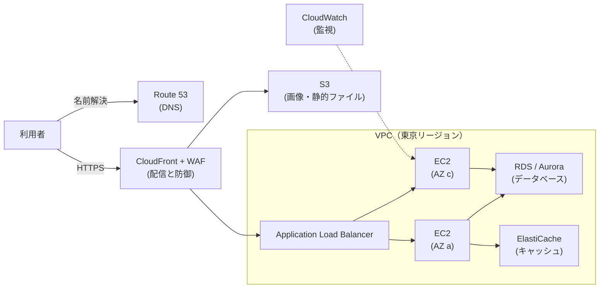

[ホーム](../README.md) > [Phase 1: 基礎](README.md) > 主要サービスツアー

# 主要サービスツアー

> **この章のゴール**
> - AWS の主要サービスをカテゴリに分類し、それぞれを「一言で」説明できる
> - 問題文のユースケースから、適切なサービスを選べる
> - 廃止・名称変更・新規受付終了になったサービスを知り、古い情報に惑わされない
>
> **対応試験**: CLF-C02（第3分野: クラウドテクノロジーとサービス — タスク 3.1、3.3〜3.8）
> **目安時間**: 読む 200分 / 確認問題 40分

## この章の全体像

AWS には非常に多くのサービスがありますが、CLF-C02 で問われるのは「そのサービスが何をするものか」と「どんな場面で使うか」です。細かい設定を覚える必要はありません。まず、典型的な Web システムで主要なサービスがどこに位置するかを見てみましょう。

この章の表では、各サービスを **一言で**（何をするか）、**ユースケース**（どんな場面で使うか）、**CLF のキーワード**（問題文や選択肢に出やすい言葉）の観点で紹介します。サービスの状態は次の表記で示します（2026年9月時点）。

- 【新規受付終了】既存の利用者は使い続けられるが、新しい利用者は使い始められない（メンテナンス段階）
- 【サポート終了予定】サービスの終了日が発表されている
- 【名称変更】新しい名前で提供されている

## 1. AWS を操作する方法

| 方法 | 一言で | 使いどころ |
|---|---|---|
| AWS マネジメントコンソール | Web ブラウザで操作する画面 | 初めての操作、状態の確認 |
| AWS CLI | コマンドラインから操作するツール | 繰り返しの作業、スクリプトによる自動化 |
| AWS SDK | プログラム（Python、Java、JavaScript など）から AWS の API を呼ぶためのライブラリ | アプリケーションからの操作 |
| AWS CloudShell | ブラウザから使えるシェル。AWS CLI が導入済みで、追加料金なし | 手元に環境を用意せずに CLI を使う |
| Infrastructure as Code（IaC） | テンプレートやコードでインフラを定義する | AWS CloudFormation や AWS CDK による、再現性のある構築 |

コンソール、CLI、SDK のどれを使っても、最終的には同じ AWS の API を呼び出しています。そのため、どの方法で操作しても AWS CloudTrail に記録されます。オンプレミスとの接続手段（インターネット、AWS Site-to-Site VPN、AWS Direct Connect）は 5 節で扱います。

## 2. コンピューティング

| サービス | 一言で | ユースケース | CLF のキーワード |
|---|---|---|---|
| Amazon EC2 | 仮想サーバー（IaaS） | OS やミドルウェアを自由に選ぶ Web・業務サーバー | インスタンスタイプ、AMI、OS の管理は利用者 |
| Amazon EC2 Auto Scaling | EC2 インスタンスの台数を自動で増減 | 需要の変動への対応、故障したインスタンスの自動置き換え | 弾力性、スケールアウト / スケールイン |
| Elastic Load Balancing（ELB） | 複数のターゲットに通信を分散 | 複数の AZ の EC2 インスタンスへの振り分け | ALB（HTTP/HTTPS）、NLB（TCP/UDP・高性能）、GWLB（仮想アプライアンス） |
| AWS Lambda | イベントに応じてコードを実行（FaaS） | ファイルのアップロード時の処理、API のバックエンド | サーバーレス、実行時間に応じた課金、最大実行時間 15 分 |
| Amazon ECS | AWS 独自のコンテナオーケストレーション | コンテナ化したアプリケーションの実行 | タスク、サービス |
| Amazon EKS | マネージドな Kubernetes | Kubernetes の標準的なツールで運用したい場合 | Kubernetes |
| AWS Fargate | コンテナ用のサーバーレスな実行環境 | サーバー（EC2）を管理せずにコンテナを実行 | ECS や EKS と組み合わせて使う |
| Amazon ECR | コンテナイメージのレジストリ | イメージの保存、脆弱性スキャン | Docker イメージ |
| Amazon ECS Express Mode | Fargate 上のサービス、ALB、自動スケーリング、HTTPS の URL を 1 ステップで作成 | コンテナ化した Web アプリを手早く公開 | 2025年11月提供開始。App Runner の推奨後継 |
| AWS Elastic Beanstalk | コードをアップロードするだけで実行環境を自動構築（PaaS） | Java、.NET、PHP、Node.js、Python、Ruby、Go、Docker のアプリのデプロイ | インフラ管理の負担を減らしつつ、基盤の設定も変更できる |
| Amazon Lightsail | 月額料金のシンプルな仮想サーバー | 小規模な Web サイト、WordPress、開発環境 | シンプル、料金を予測しやすい |
| AWS Batch | バッチ処理のジョブを実行する基盤 | 大量の計算ジョブ（シミュレーション、解析） | ジョブキュー、スポットインスタンスとの組み合わせ |
| AWS Outposts | AWS のインフラをオンプレミスに設置 | 超低レイテンシー、データの所在要件 | ハイブリッド（[05 章](05-global-infrastructure.md)） |
| AWS App Runner | 【新規受付終了】ソースコードやコンテナから Web アプリを自動デプロイ | 既存の利用者のみ | 2026年4月30日に新規受付終了。後継は ECS Express Mode |

> [!TIP]
> **試験のポイント**: 「OS を細かく制御したい」→ EC2、「サーバーを管理せずにイベントでコードを実行」→ Lambda、「サーバーを管理せずにコンテナを実行」→ Fargate、「コードをアップロードするだけ」→ Elastic Beanstalk、「月額料金のシンプルなサーバー」→ Lightsail です。EC2 の購入オプション（オンデマンド、Savings Plans、リザーブドインスタンス、スポットインスタンス）は [08 章](08-billing-pricing-support.md) で学びます。

> [!WARNING]
> **ひっかけ注意**: Lambda の 1 回の実行は最大 15 分です。何時間もかかる処理には、Amazon ECS（AWS Fargate）や AWS Batch を使います。

## 3. ストレージ

| サービス | 一言で | ユースケース | CLF のキーワード |
|---|---|---|---|
| Amazon S3 | 容量無制限のオブジェクトストレージ | 静的 Web サイト、バックアップ、データレイク | バケット、オブジェクト、99.999999999%（イレブンナイン）の耐久性、ストレージクラス、ライフサイクル |
| Amazon EBS | EC2 インスタンス用のブロックストレージ | OS のディスク、データベースのデータ | AZ 単位、スナップショット |
| インスタンスストア | EC2 のホストに物理的に接続された一時的なブロックストレージ | キャッシュ、一時データ | インスタンスを停止・終了するとデータが消える |
| Amazon EFS | 複数の Linux サーバーから同時に使える共有ファイルストレージ | Web コンテンツの共有、コンテナの永続ストレージ | NFS、容量が自動で伸縮、マルチ AZ |
| Amazon FSx | 高機能なファイルシステムのフルマネージド版 | Windows のファイル共有、HPC、NetApp ONTAP からの移行 | FSx for Windows File Server（SMB、Active Directory 連携）、FSx for Lustre（HPC）、FSx for NetApp ONTAP、FSx for OpenZFS |
| AWS Storage Gateway | オンプレミスとクラウドのストレージをつなぐハイブリッドストレージ | オンプレミスから S3 をファイル共有として使う、テープバックアップの置き換え | S3 File Gateway、Volume Gateway、Tape Gateway（FSx File Gateway は新規利用不可） |
| AWS Backup | 複数のサービスのバックアップを一元管理 | EC2、EBS、RDS、DynamoDB、EFS などのバックアップ方針を統一 | バックアッププラン、クロスリージョンコピー |
| AWS Elastic Disaster Recovery | サーバーを AWS に継続的に複製し、災害時に復旧 | オンプレミスや他のクラウドのサーバーの災害対策 | 低コストの DR、短い RPO / RTO |

S3 では、アクセス頻度に応じて **ストレージクラス** を選ぶことでコストを最適化できます。

| ストレージクラス | 向いているデータ |
|---|---|
| S3 Standard | 頻繁にアクセスするデータ |
| S3 Intelligent-Tiering | アクセスパターンが不明、または変化するデータ（自動で適切な階層へ移動） |
| S3 Standard-IA | アクセスは少ないが、必要なときはすぐに取り出したいデータ |
| S3 One Zone-IA | 再作成できるデータ（1 つの AZ だけに保存するため安価） |
| S3 Glacier Instant Retrieval | めったにアクセスしないが、ミリ秒で取り出したいアーカイブ |
| S3 Glacier Flexible Retrieval | 取り出しに数分〜数時間かかってもよいアーカイブ |
| S3 Glacier Deep Archive | 最も安価。取り出しに半日程度かかってもよい長期保存（コンプライアンス目的など） |
| S3 Express One Zone | 1 つの AZ で、1 桁ミリ秒の高い性能が必要なデータ |

> [!TIP]
> **試験のポイント**: ストレージの種類で選びます。**ブロック** → EBS、**ファイル** → EFS（Linux / NFS）や FSx（Windows / SMB など）、**オブジェクト** → S3 です。「複数の EC2 インスタンスから同時にマウントしたい（Linux）」→ EFS、「Windows のファイル共有」→ FSx for Windows File Server、「アクセス頻度が予測できない」→ S3 Intelligent-Tiering です。

> [!WARNING]
> **ひっかけ注意**: 元祖の S3 Glacier の「ボールト」を直接使う方式は新規受付を終了していますが、**S3 の Glacier ストレージクラスは引き続き利用できます**。「長期アーカイブには S3 Glacier Deep Archive」という考え方は変わりません。

## 4. データベース

| サービス | 一言で | ユースケース | CLF のキーワード |
|---|---|---|---|
| Amazon RDS | マネージドなリレーショナルデータベース | 業務システムや Web アプリの DB | MySQL、PostgreSQL、MariaDB、Oracle、SQL Server、Db2。マルチ AZ、リードレプリカ、自動バックアップ |
| Amazon Aurora | クラウド向けに設計された高性能なリレーショナル DB | 高いスループットと可用性が必要な DB | MySQL / PostgreSQL 互換、3 つの AZ に 6 つのコピー、Aurora Serverless |
| Amazon Aurora DSQL | サーバーレスの分散 SQL データベース | 複数のリージョンでのアクティブ / アクティブ構成 | PostgreSQL 互換、2025年5月 GA |
| Amazon DynamoDB | フルマネージドでサーバーレスな NoSQL データベース | 大規模な Web・モバイル・ゲーム、セッション管理 | キーバリュー、1 桁ミリ秒の応答、自動スケーリング、グローバルテーブル |
| Amazon ElastiCache | インメモリのキャッシュ | DB の読み取り負荷の軽減、セッションの保存 | Valkey / Redis OSS / Memcached、マイクロ秒単位の応答 |
| Amazon MemoryDB | 耐久性のあるインメモリデータベース | 超高速で、かつデータを失えない用途 | Valkey / Redis OSS 互換 |
| Amazon DocumentDB（MongoDB 互換） | ドキュメントデータベース | JSON ドキュメントを扱うアプリ、MongoDB からの移行 | MongoDB 互換 |
| Amazon Neptune | グラフデータベース | SNS のつながり、レコメンデーション、不正検知 | ノードとリレーションシップ |
| Amazon Keyspaces（for Apache Cassandra） | Cassandra 互換のサーバーレス DB | Cassandra からの移行 | CQL |
| Amazon Timestream | 時系列データベース | IoT のセンサー値、運用メトリクス | Timestream for InfluxDB（Timestream for LiveAnalytics は 2025年6月から新規受付終了） |

> [!TIP]
> **試験のポイント**: 「リレーショナル、複雑な結合、トランザクション」→ RDS / Aurora、「スキーマが柔軟、大規模、ミリ秒単位の応答、サーバーレス」→ DynamoDB、「読み取りの高速化、キャッシュ」→ ElastiCache、「大量データの分析（データウェアハウス）」→ Amazon Redshift（9 節）です。また、EC2 に自分で DB をインストールすると OS や DB のパッチ適用、バックアップは利用者の責任になりますが、RDS ならこれらを AWS に任せられます。

> [!WARNING]
> **ひっかけ注意**: 古い教材で台帳データベースとして登場する Amazon QLDB は、2025年7月31日にサービスを終了しました。

## 5. ネットワークとコンテンツ配信

| サービス | 一言で | ユースケース | CLF のキーワード |
|---|---|---|---|
| Amazon VPC | AWS 上の、論理的に分離されたプライベートネットワーク | サブネットの設計、インターネットからの分離 | サブネット、ルートテーブル、インターネットゲートウェイ、NAT ゲートウェイ、セキュリティグループ、ネットワーク ACL |
| Amazon Route 53 | DNS とドメイン登録 | ドメイン名の名前解決、ヘルスチェックによるフェイルオーバー | ルーティングポリシー（シンプル、加重、レイテンシー、フェイルオーバー、位置情報など） |
| Amazon CloudFront | CDN（コンテンツ配信ネットワーク） | 静的・動的コンテンツの高速配信 | エッジロケーション、キャッシュ |
| AWS Global Accelerator | AWS のグローバルネットワーク経由で、アプリへの通信を高速化 | 世界中からの TCP / UDP 通信、固定 IP アドレスが必要な場合 | エニーキャストの固定 IP アドレス、リージョン間の迅速なフェイルオーバー |
| AWS Direct Connect | オンプレミスと AWS をつなぐ専用線 | 大容量で安定したハイブリッド接続 | 一貫したネットワーク性能、インターネットを経由しない |
| AWS Site-to-Site VPN | インターネット経由の IPsec VPN | 素早く安価にオンプレミスと接続、Direct Connect のバックアップ | 暗号化トンネル |
| AWS Client VPN | 個人の端末から AWS に接続する VPN | リモートワーク | OpenVPN ベースのクライアント |
| AWS Transit Gateway | 多数の VPC とオンプレミスをつなぐハブ | ハブ&スポーク型のネットワーク | VPC ピアリングの網の目を解消 |
| VPC ピアリング | 2 つの VPC を 1 対 1 で接続 | 少数の VPC 間の通信 | 推移的なルーティングはできない |
| VPC エンドポイント | インターネットを経由せずに、AWS のサービスや他の VPC のサービスへ接続 | プライベートなサブネットから S3 や DynamoDB を使う | インターフェイスエンドポイント（AWS PrivateLink）、ゲートウェイエンドポイント（S3・DynamoDB） |

> [!TIP]
> **試験のポイント**: 「一貫した帯域幅、インターネットを経由しない専用接続」→ Direct Connect、「短期間・低コストで暗号化された接続」→ Site-to-Site VPN、「世界中の利用者に、コンテンツをキャッシュして配信」→ CloudFront です。

> [!WARNING]
> **ひっかけ注意**: Direct Connect の通信は、既定では暗号化されません。暗号化が必要なら、Direct Connect の上に VPN を組み合わせるなどの方法をとります。

## 6. セキュリティ・ID・コンプライアンス

詳しくは [07 章](07-security-and-compliance.md) で学ぶので、ここでは役割だけを押さえます。

| サービス | 一言で | CLF のキーワード |
|---|---|---|
| AWS IAM | AWS へのアクセスを制御（ユーザー、グループ、ロール、ポリシー） | 最小権限、MFA、追加料金なし |
| AWS IAM Identity Center（旧 AWS SSO） | 複数のアカウントや業務アプリへのシングルサインオン | 社員のアクセスを一元管理、許可セット |
| Amazon Cognito | 自社の Web・モバイルアプリの利用者向けの認証 | サインアップ / サインイン、ソーシャルログイン |
| AWS Directory Service | マネージドな Microsoft Active Directory | AWS Managed Microsoft AD、AD Connector |
| AWS KMS | 暗号鍵の作成と管理 | S3、EBS、RDS などの暗号化、キーポリシー |
| AWS CloudHSM | 専用のハードウェアセキュリティモジュール（HSM） | シングルテナント、鍵を完全に自己管理 |
| AWS Secrets Manager | DB のパスワードなど、シークレットの保管と自動ローテーション | 認証情報のハードコードをなくす |
| AWS Certificate Manager（ACM） | SSL/TLS 証明書の発行と管理 | ELB や CloudFront の HTTPS 化、自動更新 |
| AWS WAF | Web アプリケーションファイアウォール | SQL インジェクション、クロスサイトスクリプティング（XSS）、レート制限 |
| AWS Shield | DDoS 攻撃からの保護 | Standard は全利用者に自動・無料で適用。Advanced は有料で、高度な保護と専門チームの支援 |
| AWS Firewall Manager | 組織全体のファイアウォールルールを一元管理 | AWS Organizations と連携、WAF やセキュリティグループのルールを一括適用 |
| AWS Network Firewall | VPC 用のマネージドなネットワークファイアウォール | VPC の境界での通信の検査 |
| Amazon GuardDuty | ログを機械学習などで分析する脅威検出 | 不審な API 呼び出し、マルウェア、暗号資産のマイニング |
| Amazon Inspector | 脆弱性の自動スキャン | EC2、コンテナイメージ、Lambda の脆弱性（CVE） |
| Amazon Macie | S3 内の機密データ（個人情報など）を検出 | 機械学習、個人を特定できる情報（PII） |
| Amazon Detective | セキュリティの調査と根本原因の分析 | 検出結果の深掘り、関係の可視化 |
| AWS Security Hub | セキュリティの検出結果を集約し、優先順位を付ける | 2025年12月に統合版が GA。従来のセキュリティ標準のチェック機能は AWS Security Hub CSPM |
| AWS Artifact | AWS のコンプライアンスレポートと契約をダウンロード | SOC、ISO、PCI などの第三者監査レポート、セルフサービス |
| AWS Audit Manager | 【新規受付終了】監査用の証跡（エビデンス）を自動収集 | 2026年3月に新規受付の終了を発表 |

## 7. 管理とガバナンス

| サービス | 一言で | CLF のキーワード |
|---|---|---|
| Amazon CloudWatch | メトリクス、ログ、アラームによる監視 | CPU 使用率のアラーム、ダッシュボード、CloudWatch Logs |
| AWS CloudTrail | AWS の API 呼び出しを記録（誰が、いつ、何をしたか） | 監査、操作の追跡、イベント履歴（90 日）、証跡 |
| AWS Config | リソースの設定の変更履歴を記録し、ルールで評価 | 構成の履歴、Config ルール、コンプライアンスの評価 |
| AWS Systems Manager | サーバーの運用管理をまとめたサービス | Session Manager（SSH を開けずに接続）、Patch Manager、Run Command、Parameter Store、Automation（Change Manager と Incident Manager は新規受付終了） |
| AWS CloudFormation | テンプレート（JSON / YAML）でインフラをコードとして定義（IaC） | スタック、同じ環境を何度でも再現 |
| AWS Organizations | 複数のアカウントを一元管理 | 一括請求（コンソリデーティッドビリング）、OU、SCP |
| AWS Control Tower | ベストプラクティスに沿ったマルチアカウント環境を自動構築 | ランディングゾーン、コントロール（ガードレール） |
| AWS Service Catalog | 承認済みの構成（製品）をカタログ化し、利用者がセルフサービスで起動 | ガバナンス、標準化 |
| AWS Trusted Advisor | ベストプラクティスに沿っているかを自動でチェック | コスト最適化、パフォーマンス、セキュリティ、耐障害性、サービスクォータ、運用上の優秀性。使えるチェックはサポートプランで異なる |
| AWS Health Dashboard | AWS のサービスの障害や、予定されたメンテナンスを通知 | 自分のアカウントに影響するイベント |
| AWS Compute Optimizer | 使用状況を分析し、リソースのサイズを推奨 | ライトサイジング、EC2、EBS、Lambda |
| AWS Well-Architected Tool | Well-Architected のセルフレビュー | 6 つの柱、追加料金なし |
| AWS License Manager | ソフトウェアライセンスの使用状況を管理 | BYOL、ライセンス違反の防止 |

> [!TIP]
> **試験のポイント**: 監視系の 3 つは必ず区別できるようにしましょう。
> - 「CPU 使用率などの **性能** を監視してアラームを出す」→ **CloudWatch**
> - 「**誰が・いつ・どの API を** 呼び出したか」→ **CloudTrail**
> - 「リソースの **設定が** どう変わったか、ルールに **準拠** しているか」→ **Config**

コスト管理のツール（AWS Cost Explorer、AWS Budgets、AWS Pricing Calculator など）は [08 章](08-billing-pricing-support.md) で扱います。

## 8. アプリケーション統合

| サービス | 一言で | ユースケース | CLF のキーワード |
|---|---|---|---|
| Amazon SQS | フルマネージドなメッセージキュー | コンポーネント間の疎結合、処理の平準化 | 標準キュー / FIFO キュー、最大メッセージサイズ 1 MiB |
| Amazon SNS | Pub/Sub 型の通知サービス | メール・SMS・プッシュ通知、SQS や Lambda への一斉配信（ファンアウト） | トピック、サブスクリプション |
| Amazon EventBridge | イベントバスとスケジューラー | AWS のサービスや SaaS のイベントを条件に応じて振り分ける、定期実行 | ルール、イベントバス、EventBridge Scheduler |
| AWS Step Functions | ワークフローのオーケストレーション | 複数の Lambda 関数を、順番・分岐・再試行付きで実行 | ステートマシン、視覚的なワークフロー |
| Amazon MQ | マネージドなメッセージブローカー（Apache ActiveMQ / RabbitMQ） | 既存システムを業界標準のプロトコルのまま移行 | JMS、AMQP、MQTT などの標準プロトコル |
| Amazon API Gateway | API の作成・公開・管理 | Lambda と組み合わせたサーバーレス API | REST / HTTP / WebSocket API、スロットリング |
| AWS AppSync | マネージドな GraphQL API | Web・モバイルアプリのデータ取得、リアルタイムの更新 | GraphQL |
| Amazon AppFlow | SaaS と AWS の間のデータ連携 | Salesforce などのデータを S3 に転送 | ノーコード、SaaS 連携 |

> [!TIP]
> **試験のポイント**: 「コンポーネントを **疎結合** にしたい」「処理を **キュー** にためる」→ SQS、「1 つのメッセージを複数の宛先へ（**ファンアウト**）」→ SNS、「イベントの内容に応じて **ルーティング**」→ EventBridge、「複数の処理を **順番に・条件分岐付きで** 実行」→ Step Functions です。

> [!WARNING]
> **ひっかけ注意**: SQS の最大メッセージサイズは、2025年8月に 256 KiB から **1 MiB** に拡大されました。古い教材や試験問題では「256 KB」と書かれている場合があります。

## 9. 分析

| サービス | 一言で | ユースケース | CLF のキーワード |
|---|---|---|---|
| Amazon Athena | S3 上のデータに標準 SQL で直接クエリ | ログのアドホックな分析 | サーバーレス、スキャンしたデータ量に応じた課金 |
| Amazon Redshift | データウェアハウス | 大量データの集計、BI | 列指向、Redshift Serverless |
| Amazon EMR | ビッグデータ処理の基盤（Apache Spark、Hadoop など） | 大規模な ETL、機械学習の前処理 | マネージドな Hadoop / Spark |
| AWS Glue | サーバーレスなデータ統合（ETL）とデータカタログ | データの抽出・変換・ロード、メタデータの管理 | クローラー、AWS Glue Data Catalog |
| Amazon Kinesis Data Streams | ストリーミングデータをリアルタイムに収集 | クリックストリーム、IoT のデータ | リアルタイム、シャード |
| Amazon Data Firehose（旧 Kinesis Data Firehose） | ストリーミングデータを S3、Redshift、OpenSearch Service などへ配信 | ログを S3 に自動で保存 | フルマネージド、ほぼリアルタイム |
| Amazon Managed Service for Apache Flink（旧 Kinesis Data Analytics） | ストリーミングデータをリアルタイムに処理 | 異常検知、リアルタイムの集計 | Apache Flink |
| Amazon MSK | マネージドな Apache Kafka | Kafka を使う既存システムの移行 | Kafka |
| Amazon OpenSearch Service（旧 Amazon Elasticsearch Service） | 検索とログ分析 | 全文検索、ログの可視化 | OpenSearch、ダッシュボード |
| Amazon Quick Suite（旧 Amazon QuickSight を含む） | BI（ダッシュボード・可視化）と、業務向けの生成 AI 機能をまとめたサービス | 経営ダッシュボード、データに基づく調査 | 【名称変更】2025年10月に QuickSight が Quick Suite へ再編（BI 機能は Amazon Quick Sight） |
| AWS Lake Formation | データレイクの構築と、アクセス権限の一元管理 | S3 のデータレイクへのきめ細かなアクセス制御 | データレイク、ガバナンス |
| AWS Data Exchange | サードパーティのデータを検索・購読 | 市場データや気象データの取得 | データ製品 |
| AWS Clean Rooms | 生データを互いに見せずに、複数の組織で共同分析 | 広告主とメディアの共同分析 | プライバシー保護 |

> [!TIP]
> **試験のポイント**: 「S3 のデータにサーバーレスで SQL」→ Athena、「データウェアハウス」→ Redshift、「ETL」「データカタログ」→ Glue、「リアルタイムのストリーミングデータ」→ Kinesis、「BI ダッシュボード」→ Quick Sight（旧 QuickSight）、「Hadoop / Spark」→ EMR です。試験では旧名称の QuickSight で出題される可能性があります。

## 10. AI / 機械学習

AWS の AI サービスは、**生成 AI とアシスタント**（基盤モデルを使ったアプリやエージェント）、**学習済みの AI サービス**（機械学習の知識がなくても API を呼ぶだけで使える）、**ML プラットフォーム**（独自のモデルを構築する）の 3 つの層に分けると整理しやすくなります。

| サービス | 一言で | ユースケース | CLF のキーワード |
|---|---|---|---|
| Amazon Bedrock | さまざまな企業の基盤モデルを API で使える、フルマネージドな生成 AI サービス | チャットボット、要約、社内文書を使った回答（RAG） | 基盤モデル（Anthropic Claude、Amazon Nova、Meta Llama など）、Knowledge Bases、Guardrails、インフラ管理不要 |
| Amazon Bedrock AgentCore | AI エージェントを安全に本番運用するための基盤 | 社内システムを操作する AI エージェント | Runtime、Memory、Gateway、Identity など（2025年10月 GA）。従来の Bedrock Agents は「Agents Classic」として新規受付終了 |
| Amazon SageMaker AI（旧 Amazon SageMaker） | 機械学習モデルの構築・学習・デプロイの基盤 | 独自モデルの開発 | 【名称変更】ノートブック、学習、推論エンドポイント、SageMaker Canvas（ノーコード） |
| Amazon Q | AWS の生成 AI アシスタント | AWS の使い方の質問、開発や業務の支援 | コンソールやチャットアプリの Amazon Q は継続。Amazon Q Developer は 2026年5月に新規サインアップを停止し、IDE プラグインは 2027年4月30日にサポート終了予定（後継は Kiro）。Amazon Q Business は 2026年6月に新規受付の終了を発表 |
| Kiro | AI エージェントを組み込んだ開発環境（IDE） | 仕様からの開発、コード生成 | 2025年11月 GA |
| Amazon Rekognition | 画像・動画の分析 | 顔の検出と比較、物体の検出、不適切なコンテンツの検出 | コンピュータビジョン |
| Amazon Comprehend | 自然言語処理（NLP） | 感情分析、キーフレーズや固有表現の抽出、言語の判定 | テキスト分析、個人情報の検出 |
| Amazon Transcribe | 音声をテキストに変換（文字起こし） | コールセンターの録音の文字起こし、字幕 | 音声認識 |
| Amazon Polly | テキストを音声に変換（音声合成） | 読み上げ、音声案内 | 音声合成 |
| Amazon Translate | 機械翻訳 | Web サイトやチャットの多言語化 | ニューラル機械翻訳 |
| Amazon Textract | 文書から文字、表、フォームを抽出 | 請求書や申込書のデータ化 | OCR を超えた、文書の構造の理解 |
| Amazon Lex | 音声やテキストの会話インターフェイス（チャットボット） | 問い合わせ対応ボット、Amazon Connect との連携 | インテント、Alexa と同じ深層学習技術 |
| Amazon Personalize | 機械学習によるレコメンデーション | EC サイトの「おすすめ商品」 | パーソナライズ |
| Amazon Kendra | 【新規受付終了】機械学習を使ったエンタープライズ検索 | 社内文書の自然言語検索 | 2026年6月に新規受付の終了を発表。既存の利用者のみ |

> [!TIP]
> **試験のポイント**: 名前と機能の対応が狙われます。**Transcribe** は「書き起こす（transcribe）」で音声 → テキスト、**Polly** はおしゃべりなオウム（ポリー）でテキスト → 音声、**Textract** は「テキストを抽出（extract）」、**Rekognition** は「認識（recognition）」で画像・動画です。「インフラを管理せずに、基盤モデルで生成 AI アプリを作りたい」→ Bedrock、「独自の ML モデルを構築・学習したい」→ SageMaker AI です。

> [!WARNING]
> **ひっかけ注意**: 試験や古い教材では、「社内文書の検索」に Amazon Kendra、「業務向けの生成 AI アシスタント」に Amazon Q Business、「エージェント」に Agents for Amazon Bedrock が正解として登場する可能性があります。いずれも現在は新規受付を終了しているため、新しく構成する場合は Amazon Bedrock Knowledge Bases（RAG）や Amazon Bedrock AgentCore などを検討します。

## 11. 開発者ツール

| サービス | 一言で | CLF のキーワード |
|---|---|---|
| AWS CodeCommit | Git リポジトリのホスティング | 2024年7月に新規受付を停止したが、2025年11月に一般提供へ復帰（新規利用可） |
| AWS CodeBuild | ソースコードのビルドとテストを実行 | CI、従量課金 |
| AWS CodeDeploy | デプロイの自動化 | EC2、オンプレミス、Lambda、ECS へのデプロイ、ブルー / グリーンデプロイ |
| AWS CodePipeline | CI/CD パイプラインの構築 | ソース → ビルド → テスト → デプロイの自動化 |
| AWS CodeArtifact | ソフトウェアパッケージのリポジトリ | npm、Maven、PyPI などのパッケージの共有 |
| AWS CDK | プログラミング言語でインフラを定義 | TypeScript や Python などで IaC、CloudFormation のテンプレートを生成 |
| AWS X-Ray | 分散トレーシング | マイクロサービスのボトルネックやエラーの特定 |
| AWS Fault Injection Service（AWS FIS） | 意図的に障害を注入する（カオスエンジニアリング） | 回復力の検証 |
| AWS Cloud9 | 【新規受付終了】ブラウザベースの IDE | 2024年7月に新規受付終了。AWS CloudShell や IDE ツールキットへ |
| Amazon CodeCatalyst / Amazon CodeGuru Reviewer | 【新規受付終了】統合開発サービス / 自動コードレビュー | 2025年に新規受付の終了を発表 |

## 12. 移行と転送

| サービス | 一言で | CLF のキーワード |
|---|---|---|
| AWS Transform | エージェント型 AI で、移行とモダナイゼーションを加速 | VMware 環境の移行、メインフレーム（COBOL → Java）、.NET や Windows のモダナイズ、移行評価。2025年5月 GA |
| AWS Application Migration Service（AWS MGN） | サーバーをそのまま AWS へ移行 | リホスト（リフト&シフト）、継続的なレプリケーション、短いダウンタイム |
| AWS Database Migration Service（AWS DMS） | データベースを稼働させたまま移行 | 同種・異種のエンジン間の移行、継続的なレプリケーション |
| AWS Schema Conversion Tool（AWS SCT）/ DMS Schema Conversion | 異なる DB エンジン間でスキーマを変換 | Oracle → PostgreSQL などの異種移行 |
| AWS DataSync | ネットワーク経由（オンライン）での大容量データ転送 | NFS / SMB のファイルサーバーから S3、EFS、FSx へ。スケジュール実行、暗号化 |
| AWS Transfer Family | SFTP / FTPS / FTP / AS2 で、S3 や EFS にファイルを転送 | 取引先とのファイル交換、マネージドな SFTP |
| AWS Data Transfer Terminal | データを持ち込んで高速にアップロードできる物理的な拠点 | 大量データのオフライン転送 |
| AWS Snow Family | 【新規受付終了】物理デバイスによるデータ転送とエッジ処理 | Snowcone と旧型の Snowball Edge は 2024年11月に終了、Snowball Edge は 2025年11月7日に新規受付終了 |
| AWS Migration Hub / AWS Application Discovery Service | 【新規受付終了】移行の進捗管理 / オンプレミスのサーバー情報の収集 | 2025年11月7日に新規受付終了。後継は AWS Transform |

> [!WARNING]
> **ひっかけ注意**: 試験や古い教材では、「大量のデータを物理デバイスで運ぶ → AWS Snowball Edge」「移行の進捗を一元管理 → AWS Migration Hub」のような問題が出る可能性があります。概念として理解しつつ、新規の利用者には DataSync、Data Transfer Terminal、AWS Transform などが案内されている現状も知っておきましょう。

## 13. そのほかのカテゴリ

| カテゴリ | サービス | 一言で | CLF のキーワード・状態 |
|---|---|---|---|
| エンドユーザーコンピューティング | Amazon WorkSpaces | マネージドな仮想デスクトップ（DaaS） | テレワーク、Windows / Linux のデスクトップ（WorkSpaces Pools は 2027年6月30日にサポート終了予定） |
| エンドユーザーコンピューティング | Amazon WorkSpaces Applications（旧 Amazon AppStream 2.0） | デスクトップアプリケーションをブラウザにストリーミング配信 | 【名称変更】端末へのインストール不要 |
| エンドユーザーコンピューティング | Amazon WorkSpaces Secure Browser（旧 Amazon WorkSpaces Web） | 安全なブラウザ環境から、社内の Web アプリや SaaS にアクセス | 【名称変更】端末にデータを残さない |
| IoT | AWS IoT Core | 大量の IoT デバイスをクラウドに安全に接続 | MQTT、デバイスシャドウ、ルールエンジン |
| IoT | AWS IoT Greengrass | エッジのデバイス上でローカル処理を実行 | 通信が不安定な現場での処理、ML 推論（V1 は 2026年10月7日にサポート終了予定。V2 を使用） |
| IoT | AWS IoT SiteWise | 産業機器のデータを収集・整理・分析 | 工場設備の稼働監視（SiteWise Monitor は新規受付終了） |
| IoT | AWS IoT Device Management / AWS IoT Device Defender | 大量のデバイスの管理 / セキュリティ設定の監査 | ファームウェアの一括更新、設定不備の検出（Device Defender の Detect 機能は新規受付終了） |
| ビジネスアプリケーション | Amazon Connect | クラウド型のコンタクトセンター | 電話やチャットの窓口を短期間で構築、従量課金、Amazon Lex と連携 |
| ビジネスアプリケーション | Amazon SES | メールの送受信 | 会員登録の確認メール、大量のメール送信 |
| ビジネスアプリケーション | Amazon Pinpoint | 【サポート終了予定】マーケティング向けのメッセージ配信 | 2026年10月30日にサポート終了。移行先は [公式の移行ガイド](https://docs.aws.amazon.com/pinpoint/latest/userguide/migrate.html) を参照 |
| ビジネスアプリケーション | Amazon WorkMail | 【サポート終了予定】ビジネス用のメールとカレンダー | 2027年3月31日にサポート終了予定 |
| フロントエンド（Web・モバイル） | AWS Amplify | Web・モバイルアプリのフルスタック開発とホスティング | フロントエンドを素早く公開 |
| フロントエンド（Web・モバイル） | AWS Device Farm | 実機のスマートフォンやタブレットでアプリをテスト | Android / iOS、ブラウザのテスト |

## 14. 廃止・名称変更・新規受付終了の一覧（2026年9月時点）

これまでの表に出てきたものも含めて、状態が変わったサービスをまとめます。

| サービス | 状態 | 代替・後継 |
|---|---|---|
| AWS Cloud9 | 新規受付終了（2024年7月） | AWS CloudShell、IDE ツールキット |
| AWS CodeCommit | 2024年7月に新規受付を停止したが、**2025年11月に一般提供へ復帰** | （新規利用可） |
| AWS App Runner | 新規受付終了（2026年4月30日） | Amazon ECS Express Mode |
| Amazon QuickSight | 【名称変更】Amazon Quick Suite へ再編（2025年10月） | BI 機能は Amazon Quick Sight |
| AWS Snow Family | Snowcone と旧型の Snowball Edge は終了（2024年11月）。Snowball Edge は新規受付終了（2025年11月7日） | AWS DataSync、AWS Data Transfer Terminal、AWS Outposts |
| AWS Migration Hub / AWS Application Discovery Service | 新規受付終了（2025年11月7日） | AWS Transform |
| Amazon Q Developer（IDE） | 新規サインアップ停止（2026年5月15日）。IDE プラグインは 2027年4月30日にサポート終了予定 | Kiro |
| Amazon Q Business / Amazon Kendra | 新規受付終了（2026年6月に発表） | 公式の移行ガイド（[Q Business](https://docs.aws.amazon.com/amazonq/latest/qbusiness-ug/qbusiness-availability-change.html)、[Kendra](https://docs.aws.amazon.com/kendra/latest/dg/kendra-availability-change.html)）を参照 |
| Agents for Amazon Bedrock | 「Agents Classic」に改称し、新規受付終了（2026年7月30日） | Amazon Bedrock AgentCore |
| Amazon SageMaker（ML サービス） | 【名称変更】Amazon SageMaker AI（2024年12月） | 「Amazon SageMaker」は、次世代のデータ・分析・AI の統合プラットフォーム（SageMaker Unified Studio など）の名称に |
| AWS Security Hub | 【名称変更】従来の機能は AWS Security Hub CSPM に。統合版の AWS Security Hub が 2025年12月に GA | — |
| AWS Audit Manager | 新規受付終了（2026年3月に発表） | [公式ガイド](https://docs.aws.amazon.com/audit-manager/latest/userguide/audit-manager-availability-change.html) を参照 |
| AWS SSO / AWS Chatbot | 【名称変更】 | AWS IAM Identity Center（2022年）/ Amazon Q Developer in chat applications（2025年2月） |
| Amazon Kinesis Data Firehose / Amazon Kinesis Data Analytics | 【名称変更】 | Amazon Data Firehose / Amazon Managed Service for Apache Flink |
| Amazon AppStream 2.0 / Amazon WorkSpaces Web | 【名称変更】 | Amazon WorkSpaces Applications / Amazon WorkSpaces Secure Browser |
| Amazon QLDB、AWS OpsWorks、Amazon Elastic Transcoder、AWS IoT Analytics | サービス終了（QLDB: 2025年7月31日、OpsWorks: 2024年、Elastic Transcoder: 2025年11月13日、IoT Analytics: 2025年12月15日） | Elastic Transcoder の後継は AWS Elemental MediaConvert |
| Amazon CloudSearch | 新規受付終了（2024年7月） | Amazon OpenSearch Service |
| AWS Data Pipeline | 新規受付終了 | AWS Glue、AWS Step Functions、Amazon MWAA |
| Amazon Forecast | 新規受付終了（2024年7月） | Amazon SageMaker Canvas |
| Amazon Timestream for LiveAnalytics | 新規受付終了（2025年6月） | Amazon Timestream for InfluxDB |
| Amazon S3 Select / S3 Glacier Select | 新規受付終了（2024年7月） | Amazon Athena など |
| AWS App Mesh | 2026年9月30日にサポート終了 | Amazon ECS Service Connect、Amazon VPC Lattice |
| AWS Proton / AWS WAF Classic | 2026年10月7日にサポート終了予定 | WAF Classic は現行の AWS WAF へ |

> [!IMPORTANT]
> 試験問題や古い教材には、旧名称や新規受付を終了したサービスが登場する可能性があります。選択肢に出てきたら、「そのサービスが何をするものか」で判断してください。最新の状態は、AWS 公式の [メンテナンス中のサービス](https://docs.aws.amazon.com/general/latest/gr/maintenance_services.html)、[サンセット（サポート終了予定）のサービス](https://docs.aws.amazon.com/general/latest/gr/sunset_services.html)、[終了したサービス](https://docs.aws.amazon.com/general/latest/gr/full_shutdown_services.html) の一覧と、この教材の [サービスの変更点](../06-reference/service-changes.md) で確認できます。

## 15. 「こんなときはこのサービス」早見表

問題文のキーワードから、すぐにサービスを思い浮かべられるように練習しましょう。

| こんなとき（問題文のキーワード） | サービス |
|---|---|
| OS を自由に選べる仮想サーバーが欲しい | Amazon EC2 |
| サーバーを管理せず、イベントに応じてコードを実行したい | AWS Lambda |
| コードをアップロードするだけで、Web アプリの実行環境を作りたい | AWS Elastic Beanstalk |
| 月額料金のシンプルな仮想サーバーで、小さなサイトを始めたい | Amazon Lightsail |
| サーバーを管理せずにコンテナを実行したい | AWS Fargate（Amazon ECS / Amazon EKS と組み合わせる） |
| 需要に合わせて EC2 インスタンスの台数を自動で増減したい | Amazon EC2 Auto Scaling |
| 画像・動画・バックアップを、高い耐久性で安く保存したい | Amazon S3 |
| ほとんど取り出さないデータを、最も安く長期保存したい | S3 Glacier Deep Archive |
| 複数の Linux サーバーから同時にマウントできる共有ファイルが欲しい | Amazon EFS |
| Windows のファイル共有（SMB、Active Directory 連携）が欲しい | Amazon FSx for Windows File Server |
| オンプレミスのアプリから、S3 をファイル共有として使いたい | AWS Storage Gateway（S3 File Gateway） |
| リレーショナル DB を、運用の手間を減らして使いたい | Amazon RDS / Amazon Aurora |
| ミリ秒単位で応答する、サーバーレスな NoSQL DB が欲しい | Amazon DynamoDB |
| DB の読み取りをキャッシュで高速化したい | Amazon ElastiCache |
| 大量データを集計・分析するデータウェアハウスが欲しい | Amazon Redshift |
| S3 のデータに、サーバーレスで SQL を実行したい | Amazon Athena |
| ETL の処理やデータカタログが欲しい | AWS Glue |
| リアルタイムのストリーミングデータを収集したい | Amazon Kinesis Data Streams |
| BI ダッシュボードを作りたい | Amazon Quick Sight（Amazon Quick Suite。旧 QuickSight） |
| 世界中の利用者に、コンテンツを低レイテンシーで配信したい | Amazon CloudFront |
| ドメイン名を登録し、DNS を管理したい | Amazon Route 53 |
| オンプレミスと AWS を専用線でつなぎたい | AWS Direct Connect |
| オンプレミスと AWS を、インターネット経由の暗号化通信ですぐにつなぎたい | AWS Site-to-Site VPN |
| AWS リソースへのアクセス権限を管理したい | AWS IAM |
| 社員に、複数のアカウントや業務アプリへのシングルサインオンを提供したい | AWS IAM Identity Center |
| 自社アプリの利用者のサインアップ・サインインを実装したい | Amazon Cognito |
| 暗号鍵を管理したい | AWS KMS（専用の HSM が必要なら AWS CloudHSM） |
| DB のパスワードを安全に保管し、自動でローテーションしたい | AWS Secrets Manager |
| SQL インジェクションや XSS から Web アプリを守りたい | AWS WAF |
| DDoS 攻撃から守りたい | AWS Shield（Standard は自動・無料。高度な保護は Advanced） |
| 不審な API 呼び出しやマルウェアなどの脅威を自動で検出したい | Amazon GuardDuty |
| EC2 やコンテナイメージの脆弱性をスキャンしたい | Amazon Inspector |
| S3 に保存された個人情報を見つけたい | Amazon Macie |
| AWS のコンプライアンスレポート（SOC、ISO など）を入手したい | AWS Artifact |
| 誰が・いつ・どの API を呼び出したかを記録したい | AWS CloudTrail |
| CPU 使用率などを監視し、しきい値を超えたら通知したい | Amazon CloudWatch |
| リソースの設定変更の履歴と、ルールへの準拠を確認したい | AWS Config |
| インフラをテンプレートでコード化したい | AWS CloudFormation（プログラミング言語で書くなら AWS CDK） |
| 複数のアカウントを一元管理し、請求をまとめたい | AWS Organizations |
| コスト・セキュリティ・耐障害性などのベストプラクティスを自動でチェックしたい | AWS Trusted Advisor |
| コンポーネント間を、キューで疎結合にしたい | Amazon SQS |
| 1 つの通知を複数の宛先へ送りたい、メールや SMS で通知したい | Amazon SNS |
| 基盤モデルを API で使って、生成 AI アプリを作りたい | Amazon Bedrock |
| 独自の機械学習モデルを構築・学習・デプロイしたい | Amazon SageMaker AI |
| 画像や動画から、顔や物体を検出したい | Amazon Rekognition |
| 音声を文字に起こしたい | Amazon Transcribe |
| テキストを音声で読み上げたい | Amazon Polly |
| 請求書や申込書から、文字や表のデータを抽出したい | Amazon Textract |
| 文章の感情（肯定的・否定的）を分析したい | Amazon Comprehend |
| 音声やテキストで会話するチャットボットを作りたい | Amazon Lex |
| サーバーをそのまま AWS に移行（リホスト）したい | AWS Application Migration Service |
| データベースを、稼働させたまま AWS に移行したい | AWS DMS |
| オンプレミスのファイルを、ネットワーク経由で S3 に大量転送したい | AWS DataSync |
| 社員に仮想デスクトップを配布したい | Amazon WorkSpaces |
| コンタクトセンターを短期間で構築したい | Amazon Connect |
| アプリから大量のメールを送信したい | Amazon SES |

## まとめ

- AWS のサービスは、コンピューティング、ストレージ、データベース、ネットワーク、セキュリティ、管理、アプリケーション統合、分析、AI / ML などのカテゴリに分けて覚える
- コンピューティング: EC2（IaaS）、Lambda（FaaS）、ECS / EKS / Fargate（コンテナ）、Elastic Beanstalk（PaaS）、Lightsail（シンプルな仮想サーバー）
- ストレージ: ブロックは EBS、ファイルは EFS / FSx、オブジェクトは S3。S3 はストレージクラスでコストを最適化する
- データベース: リレーショナルは RDS / Aurora、NoSQL は DynamoDB、キャッシュは ElastiCache、データウェアハウスは Redshift
- 監視系の 3 つ: 性能は CloudWatch、API の操作記録は CloudTrail、設定の履歴と準拠は Config
- 疎結合: SQS（キュー）、SNS（Pub/Sub）、EventBridge（イベントのルーティング）、Step Functions（ワークフロー）
- AI: 生成 AI は Bedrock、独自モデルは SageMaker AI、用途別には Rekognition / Transcribe / Polly / Translate / Textract / Comprehend / Lex / Personalize
- 状態の変化に注意: Cloud9、App Runner、Snowball Edge、Migration Hub などは新規受付終了、CodeCommit は一般提供に復帰、QuickSight は Quick Suite へ再編

## 確認問題

### 問1

ある写真共有サービスでは、利用者が Amazon S3 に画像をアップロードするたびに、サムネイル画像を自動で作成したいと考えています。サーバーの管理は行いたくなく、処理が実行された時間の分だけ料金を支払いたいと考えています。どのサービスを使うべきですか。

- A. AWS Lambda
- B. Amazon EC2
- C. Amazon Lightsail
- D. Amazon EC2 Auto Scaling

解答と解説

**正解: A**

**解説**: Lambda は、S3 へのアップロードなどのイベントに応じてコードを実行するサーバーレスのサービスです。実行時間に応じて課金されます。

**各選択肢の検討**
- A: ✓ サーバー管理が不要で、実行時間分だけの支払いという要件を満たします。
- B: ✗ サーバー（OS）の管理が必要で、処理がないときも起動していれば料金がかかります。
- C: ✗ 月額料金の仮想サーバーで、サーバーの管理が必要です。
- D: ✗ EC2 インスタンスの台数を増減するサービスで、サーバーの管理は残ります。

### 問2

ある企業は、複数の Linux の EC2 インスタンスで動く Web アプリケーションから、同じファイル群を同時に読み書きしたいと考えています。ファイルの量は増え続けるため、容量の管理はしたくありません。最も適したサービスはどれですか。

- A. Amazon EBS
- B. Amazon S3 Glacier Flexible Retrieval
- C. Amazon EFS
- D. EC2 インスタンスストア

解答と解説

**正解: C**

**解説**: Amazon EFS は、複数の Linux サーバーから NFS で同時にマウントできる共有ファイルストレージです。容量は自動で伸縮します。

**各選択肢の検討**
- A: ✗ EBS は、基本的に同じ AZ の 1 つの EC2 インスタンスにアタッチして使うブロックストレージで、容量も自分で管理します。
- B: ✗ アーカイブ用のストレージクラスで、取り出しに時間がかかり、ファイルシステムとしてマウントすることもできません。
- C: ✓ 共有、同時アクセス、容量の自動管理という要件を満たします。
- D: ✗ 一時的なストレージで、インスタンスを停止・終了するとデータが失われ、共有もできません。

### 問3

あるセキュリティ担当者は、「本番環境の S3 バケットを削除したのは誰か、いつ操作したか」を調べる必要があります。どのサービスを使うべきですか。

- A. Amazon CloudWatch
- B. AWS Config
- C. AWS Trusted Advisor
- D. AWS CloudTrail

解答と解説

**正解: D**

**解説**: CloudTrail は、AWS の API 呼び出しを、呼び出した主体・日時・送信元などとともに記録します。「誰が・いつ・何をしたか」の調査に使います。

**各選択肢の検討**
- A: ✗ メトリクスやログによる監視とアラームのサービスです。API 操作の記録は CloudTrail が担います。
- B: ✗ リソースの設定の変更履歴と、ルールへの準拠を評価するサービスです。「誰が API を呼び出したか」は CloudTrail で確認します。
- C: ✗ ベストプラクティスに沿っているかをチェックするサービスです。
- D: ✓ API の操作履歴を調べるためのサービスです。

### 問4

あるコールセンターでは、顧客との通話の録音を分析して、顧客満足度の傾向を把握したいと考えています。録音をテキストに変換し、そのテキストから顧客の感情（肯定的・否定的）を判定する必要があります。使うべきサービスはどれですか。**2 つ選択してください。**

- A. Amazon Polly
- B. Amazon Transcribe
- C. Amazon Comprehend
- D. Amazon Translate
- E. Amazon Rekognition

解答と解説

**正解: B、C**

**解説**: Transcribe で音声をテキストに変換し、Comprehend でテキストの感情を分析します。

**各選択肢の検討**
- A: ✗ テキストを音声に変換するサービスで、変換の方向が逆です。
- B: ✓ 音声をテキストに変換します。
- C: ✓ テキストから感情などを分析します。
- D: ✗ 翻訳のサービスです。
- E: ✗ 画像や動画を分析するサービスです。

### 問5

ある企業は、社内向けに文章の要約や質問応答を行う生成 AI アプリケーションを開発したいと考えています。複数の企業が提供する基盤モデルの中から用途に合ったものを選び、API で利用したいと考えています。機械学習のインフラは管理したくありません。どのサービスを使うべきですか。

- A. Amazon SageMaker AI
- B. Amazon Bedrock
- C. Amazon Lex
- D. Amazon Personalize

解答と解説

**正解: B**

**解説**: Amazon Bedrock は、さまざまな企業の基盤モデルを API で利用できるフルマネージドな生成 AI サービスです。インフラを管理する必要はありません。

**各選択肢の検討**
- A: ✗ 独自の機械学習モデルを構築・学習・デプロイするための基盤です。モデルや実行環境の管理の負担が大きくなります。
- B: ✓ すべての要件を満たします。
- C: ✗ 会話インターフェイス（チャットボット）を作るサービスで、複数の基盤モデルから選んで使うサービスではありません。
- D: ✗ レコメンデーションのサービスです。

### 問6

ある企業は、オンプレミスの NFS ファイルサーバーにある大量のデータを Amazon S3 に移行し、移行後もしばらくは差分を定期的に同期したいと考えています。データセンターには十分な帯域のネットワーク回線があります。この企業は AWS を新しく使い始める新規顧客です。最も適したサービスはどれですか。

- A. AWS Snowball Edge
- B. AWS Application Migration Service
- C. Amazon Kinesis Data Streams
- D. AWS DataSync

解答と解説

**正解: D**

**解説**: AWS DataSync は、ネットワーク経由でのデータ転送を自動化するサービスです。スケジュールを設定して、差分を定期的に同期することもできます。

**各選択肢の検討**
- A: ✗ 物理デバイスでデータを運ぶサービスですが、2025年11月7日に新規顧客の受付を終了しています。十分な帯域があり、定期的な同期も必要という要件にも合いません。
- B: ✗ サーバー（OS やアプリケーション）をそのまま移行するサービスで、ファイルデータの転送用ではありません。
- C: ✗ ストリーミングデータをリアルタイムに収集するサービスで、ファイルの移行には使いません。
- D: ✓ オンラインでの大量転送と定期的な同期という要件を満たします。

## 次のステップ

- 次の章: [AWS のセキュリティとコンプライアンス](07-security-and-compliance.md) で、6 節のセキュリティサービスと責任共有モデルを詳しく学びます
- リファレンス: [サービス早見表](../06-reference/service-cheatsheet.md)、[問題文キーワード→解答 対応表](../06-reference/exam-keywords.md)、[サービスの変更点](../06-reference/service-changes.md)
- ハンズオン: [Lab 02: VPC をゼロから作り EC2 で Web サーバー](../04-labs/lab02-vpc-ec2.md) で、VPC・EC2・セキュリティグループを実際に触ってみましょう
- 公式ドキュメント: [AWS のクラウド製品](https://aws.amazon.com/products/)、[AWS Certified Cloud Practitioner（CLF-C02）試験ガイド](https://docs.aws.amazon.com/aws-certification/latest/cloud-practitioner-02/cloud-practitioner-02.html)

---
[← 前の章: AWS グローバルインフラストラクチャ](05-global-infrastructure.md) | [目次](README.md) | [次の章: AWS のセキュリティとコンプライアンス →](07-security-and-compliance.md)
