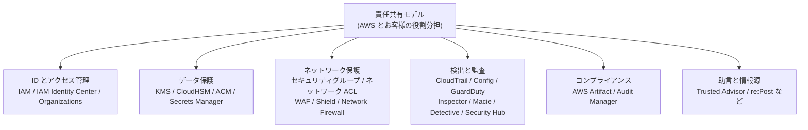
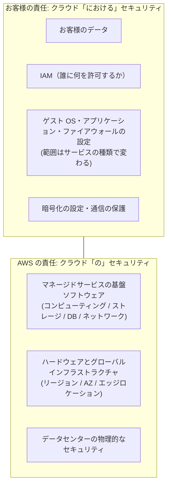
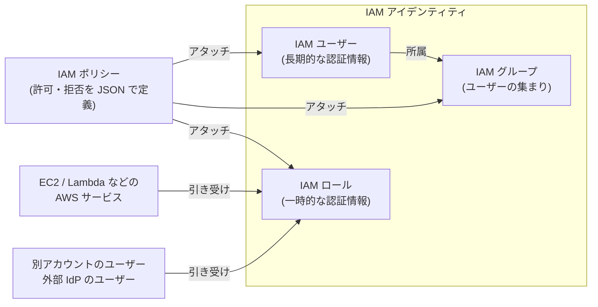
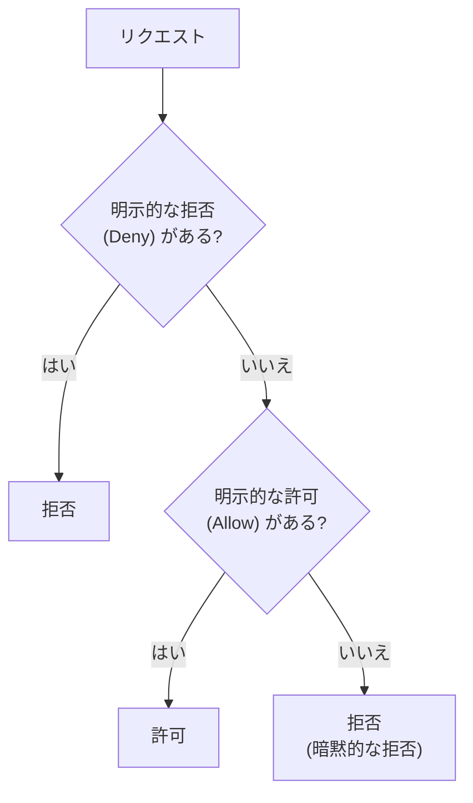
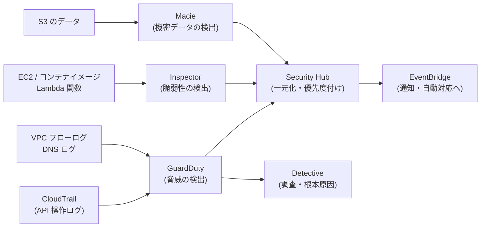
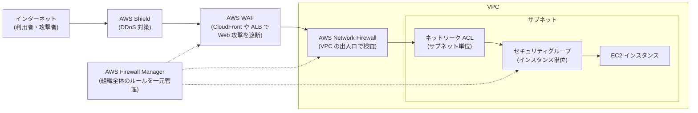

[ホーム](../README.md) > [Phase 1: 基礎](README.md) > AWS のセキュリティとコンプライアンス

# AWS のセキュリティとコンプライアンス

> **この章のゴール**
> - 責任共有モデルを説明でき、EC2・RDS・Lambda・S3 でお客様の責任範囲がどう変わるかを答えられる
> - IAM のユーザー・グループ・ロール・ポリシーの違いを説明し、簡単な IAM ポリシー（JSON）を読める
> - ルートユーザーでしか実行できない作業を挙げられる
> - コンプライアンスプログラムと AWS Artifact の関係を説明できる
> - GuardDuty・Inspector・Macie・Detective・Security Hub・Config・CloudTrail を問題文のキーワードから選び分けられる
> - セキュリティグループ・ネットワーク ACL・WAF・Shield・Firewall Manager・Network Firewall の守備範囲を説明できる
> - Trusted Advisor のチェックカテゴリと、侵入テストのポリシーを説明できる
>
> **対応試験**: CLF-C02（第2分野: セキュリティとコンプライアンス 30%）
> **目安時間**: 読む 140分 / 確認問題 40分

## この章の全体像

CLF-C02 では第3分野（34%）に次いで、第2分野「セキュリティとコンプライアンス」が 30% を占めます。
出題の中心は「**誰が守るのか**（責任共有モデル）」と「**どのサービスが何を守るのか**（役割分担）」の 2 つです。
AWS には名前の似たセキュリティサービスがたくさんあります。しかし「何を見て」「何を教えてくれるのか」を 1 つずつ押さえれば、選び分けは難しくありません。



この章では、[セキュリティとデータベースの基礎](03-security-database-basics.md) で学んだ認証・認可・暗号化の考え方を、AWS のサービスに当てはめていきます。
各サービスの詳しい設定や設計は、Phase 2 の [IAM 徹底解説](../02-associate/01-iam.md) と [セキュリティサービス](../02-associate/12-security-services.md) で扱います。

## 1. 責任共有モデルの詳細

### 1.1 「クラウドのセキュリティ」と「クラウドにおけるセキュリティ」

AWS を使うとき、セキュリティの責任は AWS とお客様（利用者）で分担します。これを **責任共有モデル**（Shared Responsibility Model）と呼びます。

| 担当 | 英語の表現 | 意味 | 具体例 |
|---|---|---|---|
| AWS | Security **of** the cloud<br/>（クラウド**の**セキュリティ） | クラウドそのもの（土台）を守る | データセンターの物理的なセキュリティ、ハードウェア、ネットワーク機器、仮想化レイヤー（ハイパーバイザー）、マネージドサービスの基盤ソフトウェア、使用済みストレージ機器の廃棄 |
| お客様 | Security **in** the cloud<br/>（クラウド**における**セキュリティ） | クラウドの上に置いたもの（中身）を守る | データ、IAM による権限管理、EC2 のゲスト OS とアプリケーション、セキュリティグループ、暗号化の設定 |

たとえるなら、AWS は「警備の厳重な貸し倉庫」の運営会社です。
建物の警備、入館管理、壁や扉の強度は運営会社が責任を持ちます。
一方で、借りた区画に何を入れるか、合鍵を誰に渡すか、中の書類を金庫にしまうかどうかは借り主の責任です。
AWS がどれほど堅牢な建物を用意しても、借り主が合鍵（アクセスキー）をインターネットに公開してしまえば、情報は漏えいします。



> [!TIP]
> **試験のポイント**: 「AWS の責任はどれか」と問われたら、**物理的なセキュリティ**（データセンター、ハードウェア、ストレージ機器の廃棄）、**仮想化レイヤー**、**マネージドサービスの基盤のパッチ適用**を選びます。
> 「お客様の責任はどれか」と問われたら、**データ**、**IAM（ユーザーと権限）**、**セキュリティグループの設定**、**EC2 のゲスト OS のパッチ適用**を選びます。

### 1.2 サービスの種類で変わるお客様の責任範囲

責任の境界線は、サービスの「抽象度」によって動きます。
自由度の高いサービス（IaaS）ほどお客様の責任が広く、AWS に任せる部分が多いサービス（マネージドサービス、サーバーレス）ほどお客様の責任は狭くなります。

| 項目 | Amazon EC2<br/>（IaaS） | Amazon RDS<br/>（マネージド DB） | AWS Lambda<br/>（サーバーレス） | Amazon S3<br/>（オブジェクトストレージ） |
|---|---|---|---|---|
| 物理・ハードウェア・仮想化 | AWS | AWS | AWS | AWS |
| OS のパッチ適用 | **お客様**（ゲスト OS） | AWS | AWS | AWS |
| ミドルウェア・実行環境 | **お客様**（自分で入れた DB や Web サーバー） | AWS（DB エンジンのパッチ。適用のタイミングはお客様がメンテナンスウィンドウで指定） | AWS（ランタイムの提供とパッチ）。サポートが終了するランタイムからの移行は**お客様** | —（該当なし） |
| アプリケーション・コード | **お客様** | **お客様**（スキーマ、クエリ、DB ユーザー） | **お客様**（関数コード、依存ライブラリ） | —（保存するデータはお客様） |
| ネットワークのアクセス制御 | **お客様**（セキュリティグループ、ネットワーク ACL） | **お客様**（セキュリティグループ、パブリックアクセスの可否） | **お客様**（VPC に接続する場合の設定、関数 URL の認証設定など） | **お客様**（バケットポリシー、ブロックパブリックアクセス） |
| データの暗号化 | **お客様**（EBS の暗号化などを有効化） | **お客様**（作成時に暗号化を有効化） | **お客様**（環境変数などの暗号化設定） | **お客様**（暗号化方式の選択。新しいオブジェクトはデフォルトで SSE-S3 により暗号化される） |
| 権限（IAM） | **お客様** | **お客様** | **お客様** | **お客様** |
| 可用性の確保 | **お客様**（複数の AZ に配置する設計） | **お客様**（マルチ AZ 配置を選ぶ）。フェイルオーバーの仕組み自体は AWS | AWS（複数の AZ で自動的に実行） | AWS（複数の AZ に自動で冗長化。S3 One Zone-IA など 1 つの AZ に保存するストレージクラスを除く） |
| バックアップ | **お客様**（スナップショット、AWS Backup） | 自動バックアップの仕組みは AWS、保持期間などの設定は**お客様** | コードやバージョンの管理は**お客様** | 耐久性は AWS、バージョニングやレプリケーションの設定は**お客様** |

同じ MySQL でも、使い方によって責任範囲は大きく変わります。

- **EC2 に自分で MySQL をインストール**: OS のパッチ、MySQL のアップグレード、バックアップ、冗長化まですべてお客様の仕事です
- **Amazon RDS for MySQL を使う**: OS と DB エンジンのパッチ、バックアップの仕組み、フェイルオーバーは AWS に任せられます。お客様は DB ユーザー、接続元の制限、暗号化の有効化、マルチ AZ にするかどうかなどを決めます

> [!WARNING]
> **ひっかけ注意**: マネージドサービスやサーバーレスでも、お客様の責任はゼロになりません。**データ**、**IAM による権限**、**暗号化を有効にするかどうか**、**アクセス制御の設定**は、どのサービスでも常にお客様の責任です。
> 逆に「EC2 インスタンスのゲスト OS のパッチは AWS が自動で適用する」という選択肢は誤りです。

### 1.3 継承される管理・共通管理・お客様固有の管理

AWS の責任共有モデルでは、IT の管理項目（コントロール）を次の 3 種類に分けて説明しています。

| 種類 | 意味 | 例 |
|---|---|---|
| 継承される管理<br/>（Inherited Controls） | AWS が実施し、お客様はそのまま**引き継ぐ**管理 | 物理的な管理と環境的な管理（入退館管理、電源、空調、防災） |
| 共通管理<br/>（Shared Controls） | AWS とお客様の**両方**が、それぞれの層で実施する管理 | **パッチ管理**、**構成管理**、**意識向上とトレーニング** |
| お客様固有の管理<br/>（Customer Specific Controls） | **お客様だけ**が責任を持つ管理 | サービスおよび通信の保護、ゾーンセキュリティ（特定のセキュリティ環境内でのデータのルーティングやゾーン分け） |

共通管理の 3 項目は、同じ言葉でも担当する「層」が違います。

| 共通管理 | AWS が行うこと | お客様が行うこと |
|---|---|---|
| パッチ管理 | インフラストラクチャの欠陥の修正とパッチ適用 | ゲスト OS とアプリケーションのパッチ適用 |
| 構成管理 | インフラストラクチャ機器の設定の維持 | ゲスト OS、データベース、アプリケーションの設定 |
| 意識向上とトレーニング | AWS の従業員の教育 | 自社の従業員の教育 |

> [!TIP]
> **試験のポイント**: 「AWS とお客様の両方が責任を持つ管理（共通管理）はどれか」→ **パッチ管理 / 構成管理 / 意識向上とトレーニング**。
> 「物理的・環境的な管理」は AWS から**継承**するものなので、共通管理ではありません。

## 2. IAM の基本

### 2.1 IAM とは

AWS Identity and Access Management（IAM）は、「**誰か**（認証）」と「**どのリソースに対して何をしてよいか**（認可）」を管理するサービスです。
IAM は特定のリージョンに属さない**グローバルサービス**で、追加料金はかかりません。



| 用語 | 説明 |
|---|---|
| プリンシパル | AWS にリクエストを送る主体（ルートユーザー、IAM ユーザー、IAM ロールを引き受けた人やサービス） |
| アイデンティティ | IAM ユーザー、IAM グループ、IAM ロールの総称 |
| IAM ポリシー | 何を許可（または拒否）するかを JSON で書いた文書 |
| 一時的な認証情報 | IAM ロールを引き受けたときに発行される、有効期限付きの認証情報 |

### 2.2 ルートユーザー

AWS アカウントを作成したときのメールアドレスとパスワードでサインインする ID が**ルートユーザー**です。
ルートユーザーはアカウント内のすべての操作ができ、IAM ポリシーでは権限を制限できません。
そのため、ルートユーザーの認証情報が漏れると、アカウント全体を乗っ取られてしまいます。

ルートユーザーのベストプラクティスは次のとおりです。

- **MFA（多要素認証）を必ず設定する**（AWS はルートユーザーの MFA を必須としており、アカウント作成時やサインイン時に登録を求められます）
- ルートユーザーの**アクセスキーは作成しない**（作成済みなら削除する）
- 日常の作業には使わず、管理者権限を持つ別の ID（IAM Identity Center のユーザーや IAM ユーザー）を使う
- ルートユーザーでしかできない作業（第 3 節）のときだけサインインする
- アカウントの連絡先（代替連絡先を含む）を最新にしておき、AWS からのセキュリティ通知を確実に受け取れるようにする

> [!NOTE]
> AWS Organizations を使う場合、メンバーアカウントのルートユーザーの認証情報そのものを削除し、必要な特権タスクだけを管理アカウントから実行する「ルートアクセスの一元管理」も利用できます。
> 詳しくは Phase 3 の [マルチアカウント戦略とガバナンス](../03-professional/02-multi-account-governance.md) で扱います。

### 2.3 IAM ユーザー・グループ・ロール

| | IAM ユーザー | IAM グループ | IAM ロール |
|---|---|---|---|
| 何を表すか | 1 人の人、または 1 つのアプリケーション | ユーザーの集まり（部署や職務） | 引き受けて使う「役割」 |
| 認証情報 | パスワード（コンソール用）、アクセスキー（CLI / SDK 用）。**長期的** | なし（グループとしてサインインはできない） | 引き受けたときに発行される**一時的**な認証情報（自動で期限切れ） |
| 典型的な用途 | 外部の ID 基盤を使えない小規模な環境、本教材の Phase 1〜2 の学習 | 「開発者」「運用担当」などの権限をまとめて付与 | EC2 から S3 へのアクセス、別アカウントへのアクセス、外部 IdP とのフェデレーション |
| 注意点 | 認証情報が漏えいすると長期間悪用される | グループの入れ子（グループの中にグループ）はできない | 「誰が引き受けられるか」を**信頼ポリシー**で定義する |

> [!WARNING]
> **ひっかけ注意**: EC2 インスタンス上のアプリケーションから S3 などを操作するとき、**アクセスキーをコードや設定ファイルに埋め込んではいけません**。
> EC2 インスタンスに **IAM ロール**（インスタンスプロファイル）をアタッチすれば、一時的な認証情報が自動で配布・更新されます。試験では「最も安全な方法」としてほぼ必ずこちらが正解です。

### 2.4 IAM ポリシー（JSON）を読んでみる

次のポリシーは「社内ネットワーク（203.0.113.0/24）からアクセスした場合だけ、`example-reports-bucket` の一覧表示とファイルのダウンロードを許可する」という意味です。

```json
{
  "Version": "2012-10-17",
  "Statement": [
    {
      "Sid": "AllowReadReportsFromOffice",
      "Effect": "Allow",
      "Action": [
        "s3:ListBucket",
        "s3:GetObject"
      ],
      "Resource": [
        "arn:aws:s3:::example-reports-bucket",
        "arn:aws:s3:::example-reports-bucket/*"
      ],
      "Condition": {
        "IpAddress": {
          "aws:SourceIp": "203.0.113.0/24"
        }
      }
    }
  ]
}
```

| 要素 | 意味 | この例では |
|---|---|---|
| `Version` | ポリシー言語のバージョン。通常は `"2012-10-17"` を指定する | 作成日ではなく、書式のバージョンを表す固定値 |
| `Statement` | 許可・拒否のルール（ステートメント）の集まり | ルールは 1 つ |
| `Sid` | ルールの識別名（省略可） | 読みやすくするための名前 |
| `Effect` | `Allow`（許可）または `Deny`（拒否） | 許可 |
| `Action` | 対象の操作（`サービス名:操作名`） | バケット内の一覧表示とオブジェクトの取得 |
| `Resource` | 対象のリソース（ARN で指定） | バケット自体と、バケット内のすべてのオブジェクト |
| `Condition` | ルールを適用する条件（省略可） | 送信元 IP アドレスが 203.0.113.0/24 の場合だけ |

`s3:ListBucket` はバケットに対する操作、`s3:GetObject` はオブジェクトに対する操作です。そのため `Resource` にはバケットの ARN と、オブジェクトを表す `/*` 付きの ARN の 2 つを書いています。

ポリシーには、付ける場所によっていくつかの種類があります。

| 種類 | 付ける場所 | 例 |
|---|---|---|
| アイデンティティベースのポリシー | IAM ユーザー / グループ / ロール | AWS 管理ポリシー（AWS が作成・更新する。例: `ReadOnlyAccess`）、カスタマー管理ポリシー（自分で作成）、インラインポリシー |
| リソースベースのポリシー | リソース側 | S3 バケットポリシー、SQS キューポリシー、KMS キーポリシー |
| サービスコントロールポリシー（SCP） | AWS Organizations の組織単位（OU）やアカウント | アカウントで使える権限の上限（2.7 節） |

複数のポリシーが関係するとき、IAM は次の順序で判断します。



> [!TIP]
> **試験のポイント**: IAM の判断は「**デフォルトは拒否**」「**明示的な拒否（Deny）は、どの許可（Allow）よりも優先**」の 2 つを覚えれば十分です。
> 何も許可されていない IAM ユーザーは、作成した直後は何もできません。

### 2.5 最小権限・MFA・アクセスキー

- **最小権限の原則**: 仕事に必要な権限だけを与えます。最初は AWS 管理ポリシーで始め、実際の利用状況を見ながら権限を絞り込むのが現実的です
- **MFA**: パスワードに加えて、パスキーやセキュリティキー（FIDO2）、認証アプリ（仮想 MFA）、ハードウェアトークンなどの 2 つ目の要素で本人確認します。ルートユーザーと、コンソールにサインインする IAM ユーザーには必ず設定します
- **アクセスキー**: CLI や SDK から AWS を操作するための長期的な認証情報（アクセスキー ID とシークレットアクセスキー）です。コードに書かない、公開リポジトリに置かない、定期的にローテーションする、不要になったら削除する、が鉄則です。可能であれば IAM ロールや IAM Identity Center の一時的な認証情報を使います

権限を点検するための機能もそろっています。

| 機能 | 用途 |
|---|---|
| IAM Access Analyzer | 外部（他のアカウントやインターネット）からアクセスできるリソースの検出、未使用の権限の検出、アクセス履歴に基づくポリシーの生成 |
| 認証情報レポート | アカウント内のすべての IAM ユーザーについて、パスワード・アクセスキー・MFA の状態を一覧で確認する |
| 最終アクセス情報 | ユーザーやロールが各サービスを最後に使った日時を確認し、使っていない権限を削る |
| パスワードポリシー | IAM ユーザーのパスワードの長さ・複雑さ・有効期限などを強制する |

> [!TIP]
> **試験のポイント**: 「人には MFA」「アプリ（EC2・Lambda）には IAM ロール」「アクセスキーはコードに書かない」「必要な権限だけ（最小権限）」「ルートユーザーは日常的に使わない」の 5 つが、IAM のベストプラクティスを問う問題の正解パターンです。
> 「全 IAM ユーザーの MFA やアクセスキーの状態を一覧で監査したい」→ **認証情報レポート**。

### 2.6 IAM Identity Center（旧 AWS SSO）

**AWS IAM Identity Center**（旧称 AWS Single Sign-On）は、社員などの「人」が**複数の AWS アカウントや業務アプリケーションにシングルサインオン**するためのサービスです。

- ID の保管場所（ID ソース）として、Identity Center 自身のディレクトリ、Active Directory、外部の ID プロバイダー（Microsoft Entra ID、Okta など）を選べます
- 「アクセス許可セット」で、どのアカウントでどの権限を使えるかを割り当てます
- サインインすると**一時的な認証情報**が発行されるため、長期的なアクセスキーを配る必要がありません

AWS は、人が AWS にアクセスする方法として、IAM ユーザーよりも IAM Identity Center（または外部 IdP とのフェデレーション）による一時的な認証情報を推奨しています。

> [!NOTE]
> 本教材の Phase 1〜2 では、**MFA を設定した IAM ユーザー（管理者）**で学習します。
> 2025年7月15日以降に作成したアカウントの無料プランでは、AWS Organizations を作成・参加すると無料利用枠のクレジットがすぐに失効します。そして、IAM Identity Center で AWS アカウントへのアクセスを管理するには Organizations が必要だからです。
> 実務では Organizations + IAM Identity Center が標準です。本教材では Phase 3 の [Lab 10](../04-labs/lab10-organizations-scp.md) で移行します。詳しくは [安全な学習用 AWS アカウントの準備](../00-start/04-aws-account-setup.md) を参照してください。

> [!WARNING]
> **ひっかけ注意**: 自社の Web アプリやモバイルアプリの**エンドユーザー（顧客）**のサインアップ・サインインには **Amazon Cognito** を使います。
> IAM Identity Center は**従業員**が AWS アカウントや業務アプリにアクセスするためのサービスです。

### 2.7 複数アカウントの統制（AWS Organizations の入口）

企業では、本番・開発・セキュリティ用など、用途ごとに AWS アカウントを分けるのが一般的です。
**AWS Organizations** は複数のアカウントをまとめて管理するサービスです。請求の一本化（[一括請求](08-billing-pricing-support.md)）と、**サービスコントロールポリシー（SCP）**による統制ができます。

- SCP は、組織内のアカウント（またはアカウントをまとめた組織単位 = OU）で**使える権限の上限（ガードレール）**を決めます
- SCP だけでは何も許可されません。実際に操作するには IAM ポリシーによる許可も必要です
- SCP はメンバーアカウントのルートユーザーにも効きます（管理アカウントには効きません）
- **AWS Control Tower** を使うと、ベストプラクティスに沿ったマルチアカウント環境（ランディングゾーン）と統制ルール（コントロール）をまとめてセットアップできます

> [!TIP]
> **試験のポイント**: 「組織内のすべてのアカウントで、特定のサービスやリージョンの利用を禁止したい」→ **AWS Organizations の SCP**。
> 「SCP でアクセス許可を付与する」という選択肢は誤りです。SCP は上限を決めるだけです。

## 3. ルートユーザーでしか実行できない作業

ルートユーザーは日常的に使いませんが、次の作業だけはルートユーザーでサインインしないと実行できません（2026年9月時点の [公式ドキュメント](https://docs.aws.amazon.com/IAM/latest/UserGuide/root-user-tasks.html) より）。

| 分類 | ルートユーザーでしかできない作業 |
|---|---|
| アカウント管理 | ルートユーザーのメールアドレス・パスワード・アクセスキーの変更（Organizations に属さないスタンドアロンアカウントの場合） |
| アカウント管理 | **AWS アカウントの解約**（スタンドアロンアカウントの場合） |
| アカウント管理 | **IAM ユーザーの権限の復元**（唯一の管理者が、自分の権限を誤って外してしまった場合など） |
| 請求 | IAM ユーザー・ロールから **Billing and Cost Management コンソールへのアクセスを有効化**する |
| 請求 | 一部の税に関する請求書の表示 |
| EC2 | **リザーブドインスタンスマーケットプレイス**への出品者としての登録 |
| S3 | S3 バケットの **MFA 削除（MFA Delete）** の設定 |
| S3 / SQS | すべてのプリンシパルを拒否してしまうバケットポリシー・キューポリシーの編集や削除 |
| AWS GovCloud (US) | GovCloud (US) へのサインアップ |

一方、次の作業は IAM の権限があればルートユーザーでなくても実行できます。

| ルートユーザーが**不要**な作業の例 |
|---|
| 連絡先情報・代替連絡先の変更、アカウント名の変更、支払い通貨の変更、リージョンの有効化・無効化 |
| IAM ユーザー・グループ・ロールの作成、サポートケースの作成、AWS Budgets の設定 |

> [!NOTE]
> AWS Organizations に属するメンバーアカウントでは、管理アカウント（または委任された管理者）の権限のある IAM ユーザーやロールが、メンバーアカウントの解約やルートユーザーのメールアドレスの変更などを一元的に行えます。

> [!WARNING]
> **ひっかけ注意**: 古い教材や問題集では「**サポートプランの変更**」がルートユーザー専用の作業として扱われていることがあります。しかし、現在の公式ドキュメントの一覧には含まれていません。
> 試験で「ルートユーザーでしかできない作業」を問われたら、まず **アカウントの解約**、**ルートユーザーのメールアドレス・パスワードの変更**、**IAM 権限の復元**、**請求情報への IAM アクセスの有効化**などの定番を探しましょう。

## 4. AWS のコンプライアンスプログラムと AWS Artifact

### 4.1 コンプライアンスプログラム

AWS のインフラストラクチャは、第三者の監査機関による認証や監査を受けています。これを **コンプライアンスプログラム** と呼びます。
お客様は、AWS が取得した認証を「**土台の部分の証明**」として利用できます。

| 区分 | 例 | 概要 |
|---|---|---|
| 国際認証 | ISO/IEC 27001 / 27017 / 27018 | 情報セキュリティ管理、クラウドのセキュリティ、クラウドにおける個人情報の保護 |
| 保証報告書 | SOC 1 / SOC 2 / SOC 3 | 第三者の監査人が内部統制を評価した報告書 |
| 業界基準 | PCI DSS | クレジットカード情報を扱うシステムのセキュリティ基準 |
| 米国の医療 | HIPAA | 対象サービスについて BAA（事業提携契約）を結んだうえで医療情報を扱う |
| 米国の政府 | FedRAMP | 米国政府機関がクラウドを利用するための認定 |
| 日本の政府 | **ISMAP** | 政府情報システムのためのセキュリティ評価制度。AWS は ISMAP のクラウドサービスリストに登録されています |
| 日本の金融 | **FISC 安全対策基準** | 金融機関などのシステム向けの安全対策基準。AWS は対応状況を整理した資料を公開しています |
| 日本の医療 | いわゆる「3 省 2 ガイドライン」 | 医療機関向けと、医療情報を扱うサービスの提供事業者向けの、医療情報の安全管理に関するガイドライン |
| プライバシー規制 | GDPR など | EU の個人データ保護の規則。認証ではなく法規制で、対応の責任は利用者側にもある |

どのサービスがどのプログラムの対象かは、公式ページ「[コンプライアンスプログラムの対象範囲内の AWS のサービス](https://aws.amazon.com/compliance/services-in-scope/)」で確認できます。

> [!WARNING]
> **ひっかけ注意**: 「AWS が PCI DSS に準拠している」ことは、「お客様のシステムが PCI DSS に準拠している」ことを意味しません。
> AWS から引き継げるのは物理的・環境的な管理などの**土台の部分だけ**です。その上に構築するシステムの設定・運用・証跡は、お客様が基準を満たす必要があります（これも責任共有モデルです）。

### 4.2 AWS Artifact

**AWS Artifact** は、AWS のコンプライアンスに関する文書を**無料・セルフサービス**で入手できるポータルです。マネジメントコンソールから利用できます。

| 機能 | 内容 | 使いどころ |
|---|---|---|
| Artifact Reports | AWS の SOC レポート、PCI DSS の準拠証明書（AOC）、ISO の認証書などをダウンロード | 監査人や規制当局に「AWS の統制」の証拠として提出する |
| Artifact Agreements | BAA（HIPAA 向けの事業提携契約）などの契約を確認・締結・管理（アカウント単位または組織単位） | 医療情報などを扱う前に必要な契約を結ぶ |

### 4.3 AWS Artifact と AWS Audit Manager の違い

名前が似ていますが、「誰のコンプライアンスを示すのか」が違います。

| サービス | 何のためのものか | キーワード |
|---|---|---|
| AWS Artifact | **AWS 自身**のコンプライアンスレポートや契約を入手する | 「AWS の SOC レポート」「PCI 準拠の証明」「ISO 認証書」「BAA」 |
| AWS Audit Manager | **お客様の AWS 利用状況**について、監査用の証拠を継続的・自動的に収集する | 「監査の準備」「証拠の自動収集」「フレームワークへの準拠状況の評価」 |
| AWS Config | **お客様のリソース設定**を記録し、ルールに準拠しているかを評価する | 「設定の変更履歴」「ルールへの準拠」 |

> [!TIP]
> **試験のポイント**: 「監査人に AWS のセキュリティ統制を示すレポート（SOC、PCI、ISO）を入手したい」→ **AWS Artifact**。
> Artifact はお客様の環境をチェックするツールではありません。「自社環境の設定がルールに沿っているか」なら AWS Config、「監査証拠を自動で集めたい」なら AWS Audit Manager です。

## 5. データ保護と暗号化の入口

データ保護の基本は、**保管時の暗号化**と**転送時の暗号化**（TLS）です（仕組みは [3 章](03-security-database-basics.md) を参照）。
多くの AWS サービスは暗号化の機能を持っています。たとえば S3 では 2023年1月以降、新しく保存されるオブジェクトがデフォルトで暗号化（SSE-S3）されます。
鍵と秘密情報を管理する主なサービスは次のとおりです。

| サービス | 役割 | 押さえるポイント |
|---|---|---|
| AWS Key Management Service（AWS KMS） | 暗号鍵の作成・管理 | 多くの AWS サービスと統合されている。鍵の利用は CloudTrail に記録される。AWS 管理のキーと、お客様が管理するカスタマー管理キーがある |
| AWS CloudHSM | 専用のハードウェアセキュリティモジュール（HSM） | シングルテナント（専有）。鍵はお客様だけが管理し、AWS は鍵にアクセスできない |
| AWS Certificate Manager（ACM） | SSL/TLS 証明書の発行・管理・自動更新 | ELB・CloudFront・API Gateway などの統合サービスで使うパブリック証明書は無料 |
| AWS Secrets Manager | DB のパスワードや API キーなどのシークレットの保管 | **自動ローテーション**ができる。コードにパスワードを書かずに済む |
| AWS Systems Manager Parameter Store | 設定値やシークレットの保管 | 標準パラメーターは無料。自動ローテーションの機能はない |

> [!TIP]
> **試験のポイント**: 「暗号鍵を一元管理し、多くのサービスと統合」→ **KMS**。「専有の HSM でお客様だけが鍵を管理」→ **CloudHSM**。「SSL/TLS 証明書を無料で発行・自動更新」→ **ACM**。「DB の認証情報を自動でローテーション」→ **Secrets Manager**。

> [!NOTE]
> 以前は ACM のパブリック証明書を EC2 などにエクスポートできませんでした。2025年6月からは、有料の「エクスポート可能なパブリック証明書」を発行できます。古い教材では「ACM の証明書は EC2 に直接インストールできない」と説明されています。

## 6. 検出・監査系サービスの役割分担

名前の似たサービスが多い分野ですが、「何を見て、何を教えてくれるのか」で区別できます。

| サービス | 一言でいうと | 見ているもの | 問題文のキーワード |
|---|---|---|---|
| AWS CloudTrail | **API 操作の記録**（監査ログ） | コンソール・CLI・SDK からの API 呼び出し | 「誰が・いつ・何をしたか」「API 呼び出しの履歴」 |
| AWS Config | **リソース設定の記録と評価** | リソースの設定と変更履歴 | 「設定変更の履歴」「過去のある時点の構成」「ルールへの準拠状況」 |
| Amazon CloudWatch | **監視**（メトリクス・ログ・アラーム） | 性能の指標、アプリケーションのログ | 「CPU 使用率」「しきい値を超えたら通知」 |
| Amazon GuardDuty | **脅威の検出** | CloudTrail のイベント、VPC フローログ、DNS ログなど | 「悪意のある活動」「不審な通信」「侵害の兆候」「暗号通貨のマイニング」 |
| Amazon Inspector | **脆弱性の検出** | EC2 インスタンス、ECR のコンテナイメージ、Lambda 関数 | 「ソフトウェアの脆弱性（CVE）」「意図しないネットワークへの露出」 |
| Amazon Macie | **機密データの検出** | S3 バケット内のデータ | 「個人情報（PII）」「クレジットカード番号」 |
| Amazon Detective | **調査・根本原因の分析** | CloudTrail、VPC フローログ、GuardDuty の検出結果など | 「根本原因」「調査」「検出結果を深掘り」 |
| AWS Security Hub | **セキュリティ状況の一元管理** | 各セキュリティサービスの検出結果、ベストプラクティスのチェック結果 | 「一元的に確認」「検出結果を集約」「ベストプラクティスへの準拠」 |



試験に出やすい性質を補足します。

- **CloudTrail**: 管理イベント（リソースの作成・変更・削除など）は、設定しなくても**過去 90 日分をイベント履歴**で確認できます。長期間保存するには**証跡（トレイル）**を作成して S3 に保存します。S3 のオブジェクト操作などの**データイベント**は、別途有効化が必要です（追加料金）
- **Config**: 設定の変更履歴を記録し、**Config ルール**で「S3 バケットが公開されていないか」「EBS ボリュームが暗号化されているか」などを継続的に評価します。違反を自動で修復する設定もできます
- **GuardDuty**: 有効化するだけで、CloudTrail・VPC フローログ・DNS ログを AWS 側で取得し、機械学習や脅威インテリジェンス（既知の悪意のある IP アドレスなど）で分析します。**お客様が VPC フローログなどを別途有効化する必要はなく、エージェントも不要**です（基本機能の場合）。S3・EKS・RDS・Lambda などの保護プランや、複数の段階からなる攻撃をまとめて検出する機能（Extended Threat Detection）もあります
- **Inspector**: EC2 インスタンス、コンテナイメージ、Lambda 関数を**自動で継続的にスキャン**します。2025年からは、ソースコードや IaC のスキャン（コードセキュリティ）にも対応しています
- **Detective**: アラートを出すのではなく、ログや検出結果を関連付けて可視化し、「何が起きたのか」「影響範囲はどこまでか」を**調査**するためのサービスです

> [!NOTE]
> **Security Hub の名称変更**: 従来の Security Hub（ベストプラクティスのチェックと検出結果の集約）は **AWS Security Hub CSPM** に改称されました（CSPM = クラウドセキュリティ態勢管理）。
> そして 2025年12月に、GuardDuty・Inspector・Macie・Security Hub CSPM の結果を相関分析してリスクに優先順位を付ける、新しい **AWS Security Hub** が GA になりました。
> 試験や古い教材では旧来の意味で出題されます。CLF-C02 では「複数のセキュリティサービスの結果を一元的に確認したい」とあれば Security Hub を選べば十分です。
> また、CloudTrail のログを SQL で分析する CloudTrail Lake は、2026年5月31日に新規のお客様の受け付けを終了しました（既存のお客様は継続利用可）。

> [!TIP]
> **試験のポイント**: 「**誰が** EC2 インスタンスを削除したか」→ **CloudTrail**。「セキュリティグループの設定が**どう変わったか**、ルールに**準拠しているか**」→ **Config**。「CPU 使用率が 80% を超えたら通知」→ **CloudWatch**。

> [!WARNING]
> **ひっかけ注意**: 「脆弱性」は Inspector、「脅威（攻撃や不審な活動）」は GuardDuty です。「S3 の個人情報」は Macie で、GuardDuty や Inspector ではありません。
> Inspector はソフトウェアの**脆弱性**を見るサービスで、**悪意のある通信**は検出しません。

## 7. ネットワーク保護

ネットワークの守りは 1 か所ではなく、外側から順に何層も重ねます（多層防御）。次の図は概念図で、実際の経路は構成によって異なります。



### 7.1 セキュリティグループとネットワーク ACL

| | セキュリティグループ | ネットワーク ACL |
|---|---|---|
| 適用する単位 | インスタンス（ENI）単位 | サブネット単位 |
| 状態の管理 | **ステートフル**（許可した通信の戻りは自動で許可） | **ステートレス**（戻りの通信も明示的な許可が必要） |
| ルール | **許可ルールのみ** | **許可ルールと拒否ルール** |
| 評価の方法 | すべてのルールを評価 | ルール番号の小さい順に評価し、最初に一致したルールを適用 |
| 典型的な用途 | 「Web サーバーには 443 番ポートだけを許可」 | 「特定の IP アドレスからの通信をサブネット単位で拒否」 |

### 7.2 WAF・Shield・Firewall Manager・Network Firewall

| サービス | 守るもの | ポイント |
|---|---|---|
| AWS WAF | Web アプリケーション（L7） | CloudFront、ALB、API Gateway、AppSync、Cognito ユーザープールなどに関連付ける。SQL インジェクション、クロスサイトスクリプティング（XSS）、特定の IP アドレスや国からのアクセス、リクエストの急増（レートベースのルール）をブロックする。AWS やセラーが提供するマネージドルールも使える |
| AWS Shield Standard | DDoS 攻撃（主に L3/L4） | **すべてのお客様に無料・自動で適用**される。申し込みは不要 |
| AWS Shield Advanced | 大規模・高度な DDoS 攻撃（L3/L4/L7） | 有料（月額 3,000 USD〜、1 年契約。2026年9月時点）。**Shield Response Team（SRT）**への 24 時間 365 日のアクセス、DDoS によるスケールアウトで増えた料金の補償（コスト保護）、攻撃の可視化 |
| AWS Firewall Manager | 組織全体のファイアウォールルール | AWS Organizations の複数アカウントに、WAF・Shield Advanced・セキュリティグループ・Network Firewall などのルールを**一元的に適用**する。新しいアカウントにも自動で適用できる |
| AWS Network Firewall | VPC に出入りする通信 | VPC に配置するマネージドなファイアウォール。ステートフルな検査、侵入防止（IPS）、ドメイン名によるフィルタリング |

> [!WARNING]
> **ひっかけ注意**:
> - セキュリティグループには**拒否ルールを書けません**。「特定の IP アドレスを拒否」ならネットワーク ACL（または WAF）です
> - WAF は NLB や EC2 インスタンスに直接関連付けられません
> - 旧版の AWS WAF Classic は 2026年10月7日にサポートが終了します。現在の AWS WAF を使います

> [!TIP]
> **試験のポイント**: 「SQL インジェクション・XSS を防ぐ」→ **WAF**。「追加料金なしの DDoS 対策」→ **Shield Standard**。「DDoS 対応の専門チームの支援とコスト保護」→ **Shield Advanced**。「複数アカウントに WAF ルールを一元的に適用」→ **Firewall Manager**。「VPC の出入口で通信を検査・IPS」→ **Network Firewall**。

## 8. AWS Trusted Advisor

**AWS Trusted Advisor** は、お客様のアカウントを AWS のベストプラクティスと照らし合わせてチェックし、改善の推奨事項を示すサービスです。
結果は「赤（対応を推奨）」「黄（調査を推奨）」「緑（問題なし）」で表示されます。

| カテゴリ | チェックの例 |
|---|---|
| コスト最適化 | 使用率の低い EC2 インスタンス、関連付けられていない Elastic IP アドレス、アイドル状態のロードバランサー |
| パフォーマンス | 使用率の高い EC2 インスタンス、CloudFront の設定 |
| セキュリティ | 特定のポートを無制限に開放しているセキュリティグループ、ルートユーザーの MFA、S3 バケットのアクセス許可、公開されている EBS・RDS のスナップショット、漏えいしたアクセスキー |
| 耐障害性 | EBS スナップショットの有無、RDS のマルチ AZ 配置、EC2 インスタンスの AZ 間の偏り |
| サービスクォータ（サービスの制限） | 上限値（クォータ）の 80% 以上を使っているリソース |
| 運用上の優秀性 | ログ記録などの運用のベストプラクティスに沿っていない設定 |

使えるチェックの範囲はサポートプランで変わります。ベーシック（無料）では**コアチェック**（サービスクォータのチェックと、セキュリティの主要なチェック）だけで、Business Support+ 以上で**すべてのチェック**を利用できます（詳しくは [8 章](08-billing-pricing-support.md)）。

> [!NOTE]
> 古い教材では、カテゴリが 5 つ（運用上の優秀性なし）で説明されていることがあります。また、旧サポートプランの名前で「ベーシックと開発者はコアチェックのみ、ビジネス以上はすべてのチェック」と説明されることもあります。

> [!TIP]
> **試験のポイント**: 「コスト・パフォーマンス・セキュリティ・耐障害性・サービスクォータを横断的にチェックして推奨事項を表示」→ **Trusted Advisor**。
> EC2 インスタンスなどのサイズを機械学習で詳しく分析したいなら **AWS Compute Optimizer**、セキュリティの検出結果を集約したいなら **Security Hub** です。

## 9. セキュリティ情報源と AWS Marketplace のセキュリティ製品

| 情報源 | 内容 |
|---|---|
| [AWS セキュリティセンター](https://aws.amazon.com/security/) | AWS のセキュリティの考え方、サービス、ベストプラクティスの総合ページ |
| [AWS セキュリティブログ](https://aws.amazon.com/blogs/security/) | 新機能や実践的な設定方法の解説 |
| [AWS セキュリティ速報](https://aws.amazon.com/security/security-bulletins/) | 脆弱性情報と AWS の対応状況 |
| [AWS ナレッジセンター](https://repost.aws/knowledge-center) | よくある質問に対する AWS の公式な解説記事 |
| [AWS re:Post](https://repost.aws/) | AWS のコミュニティ Q&A サイト（旧 AWS フォーラムの後継） |
| AWS Health Dashboard | お客様のアカウントに影響する AWS のイベントや障害の情報 |

AWS のリソースがスパムや攻撃などの**不正利用**に使われていると気付いたとき（自分のリソースが悪用されている場合を含む）は、**AWS Trust & Safety チーム**に報告します。

**AWS Marketplace** では、サードパーティーのセキュリティ製品（次世代ファイアウォール、侵入検知・防止、エンドポイント保護、脆弱性スキャナー、WAF のマネージドルールなど）を購入できます。多くは数クリックでデプロイでき、料金は AWS の請求にまとめられます。

## 10. 侵入テストのポリシー

侵入テスト（ペネトレーションテスト）とは、攻撃者の視点で自社システムの弱点を探すテストです。
AWS では、**許可されたサービスに対する侵入テストは事前承認なしで実施できます**（[公式ポリシー](https://aws.amazon.com/security/penetration-testing/)）。

| 区分 | 内容 |
|---|---|
| 事前承認なしでテストできる主なサービス | EC2 インスタンス・NAT ゲートウェイ・Elastic Load Balancing、RDS、Aurora、CloudFront、API Gateway、Lambda、Lightsail、Elastic Beanstalk、ECS、Fargate など |
| 禁止されている行為 | DoS / DDoS 攻撃やそのシミュレーション、ポートフラッディング・プロトコルフラッディング・リクエストフラッディング、Route 53 のホストゾーンに対する DNS ゾーンウォーキングなど |
| 別の手続きが必要なもの | DDoS のシミュレーションテスト（「DDoS シミュレーションテストポリシー」に従う）、その他のシミュレーションイベント（事前の申請が必要） |

> [!WARNING]
> **ひっかけ注意**: 以前は侵入テストにも事前の承認申請が必要でしたが、現在は許可されたサービスなら**承認は不要**です。「侵入テストの前に必ず AWS の承認を得る」のような選択肢は誤りです。ただし、テストしてよいのは**自分のリソースだけ**です。

## まとめ

- AWS は「クラウド**の**セキュリティ（物理・ハードウェア・仮想化・マネージドサービスの基盤）」、お客様は「クラウド**における**セキュリティ（データ・IAM・設定）」に責任を持つ
- 抽象度の高いサービスほどお客様の責任は狭くなるが、データ・権限・暗号化の有効化・アクセス制御は常にお客様の責任
- 共通管理は「パッチ管理・構成管理・意識向上とトレーニング」。物理的・環境的な管理は AWS から継承する
- IAM は「デフォルトは拒否」「明示的な Deny が最優先」。人には MFA、アプリには IAM ロール、権限は最小限に
- ルートユーザーは MFA で守って封印し、アカウントの解約や IAM 権限の復元など限られた作業にだけ使う
- AWS のコンプライアンスレポートは **AWS Artifact** で入手する。AWS の準拠 ≠ お客様のシステムの準拠
- 「誰が」は CloudTrail、「設定の変化・準拠」は Config、「脅威」は GuardDuty、「脆弱性」は Inspector、「S3 の機密データ」は Macie、「調査」は Detective、「一元管理」は Security Hub
- Web 攻撃は WAF、DDoS は Shield（Standard は無料・自動）、組織全体のルール管理は Firewall Manager、VPC の通信検査は Network Firewall
- Trusted Advisor は 6 つのカテゴリでベストプラクティスをチェックし、使えるチェックの範囲はサポートプランで変わる
- 許可されたサービスへの侵入テストは事前承認不要。ただし DoS 攻撃などは禁止

## 確認問題

### 問1
ある企業は、オンプレミスの MySQL データベースを Amazon RDS for MySQL に移行しました。責任共有モデルにおいて、この企業（お客様）の責任となるものはどれですか。

- A. データベースエンジンのセキュリティパッチを作成して提供すること
- B. データベースが稼働するデータセンターの物理的なセキュリティ
- C. データベースへの接続を許可するセキュリティグループのルールと、データベースユーザーの権限の管理
- D. データベースインスタンスのオペレーティングシステムへのパッチ適用

<details>
<summary>解答と解説</summary>

**正解: C**

**解説**: RDS はマネージドサービスです。OS と DB エンジンのパッチ適用や物理的なセキュリティは AWS の責任です。一方、どこからの接続を許可するか（セキュリティグループ）、誰にどの権限を与えるか（DB ユーザー）、データそのものはお客様の責任です。

**各選択肢の検討**
- A: ✗ DB エンジンのパッチの提供と適用は AWS の責任です（適用のタイミングはお客様がメンテナンスウィンドウで指定できます）。
- B: ✗ 物理的なセキュリティは、どのサービスでも AWS の責任です。
- C: ✓ アクセス制御と DB ユーザーの管理はお客様の責任です。
- D: ✗ RDS では OS へのパッチ適用も AWS の責任です（EC2 なら、お客様の責任になります）。

</details>

### 問2
EC2 インスタンス上で動くアプリケーションが、S3 バケットのファイルを読み取る必要があります。セキュリティのベストプラクティスに最も沿った方法はどれですか。

- A. S3 の読み取り権限だけを持つ IAM ロールを作成し、EC2 インスタンスにアタッチする
- B. IAM ユーザーのアクセスキーを作成し、アプリケーションの設定ファイルに保存する
- C. ルートユーザーのアクセスキーを作成し、環境変数に設定する
- D. S3 バケットを公開し、認証なしで読み取れるようにする

<details>
<summary>解答と解説</summary>

**正解: A**

**解説**: EC2 上のアプリケーションには IAM ロールを使います。一時的な認証情報が自動で配布・更新されるため、長期的なアクセスキーを保存する必要がありません。必要な権限（S3 の読み取り）だけを与えることで、最小権限の原則も満たせます。

**各選択肢の検討**
- A: ✓ IAM ロールと最小権限の組み合わせで、最も安全です。
- B: ✗ 長期的なアクセスキーをファイルに保存すると、漏えいのリスクがあります。
- C: ✗ ルートユーザーのアクセスキーは作成すべきではありません。最も危険な方法です。
- D: ✗ 誰でもデータを読めるようになり、情報漏えいにつながります。

</details>

### 問3
AWS Organizations に属していない AWS アカウントを利用している企業があります。次のうち、ルートユーザーの認証情報でサインインしないと実行できない作業はどれですか。

- A. アカウントの連絡先情報（住所と電話番号）の更新
- B. 管理者用の IAM ユーザーと IAM グループの作成
- C. AWS Budgets による予算アラートの作成
- D. AWS アカウントの解約

<details>
<summary>解答と解説</summary>

**正解: D**

**解説**: Organizations に属さないスタンドアロンアカウントの解約は、ルートユーザーでしか実行できません。ほかにも、ルートユーザーのメールアドレスやパスワードの変更、IAM ユーザーの権限の復元、請求情報への IAM アクセスの有効化などがルートユーザー専用の作業です。

**各選択肢の検討**
- A: ✗ 連絡先情報の変更は、IAM の権限があればルートユーザーでなくても実行できます。
- B: ✗ IAM ユーザーやグループの作成は、IAM の権限を持つユーザーやロールで実行できます（日常の作業にルートユーザーを使うべきではありません）。
- C: ✗ Budgets の設定も、権限があれば IAM ユーザーやロールで実行できます。
- D: ✓ スタンドアロンアカウントの解約はルートユーザー専用の作業です。

</details>

### 問4
ある金融機関の監査チームが、AWS のデータセンターとインフラストラクチャの統制について、第三者の監査人が作成した SOC 2 レポートの提出を求めています。この要件を最も簡単に満たす方法はどれですか。

- A. AWS Audit Manager で、自社の AWS アカウントの監査証拠を収集する
- B. AWS Artifact から AWS の SOC 2 レポートをダウンロードする
- C. AWS Trusted Advisor のセキュリティチェックの結果をエクスポートする
- D. AWS サポートにケースを作成し、データセンターの現地監査を依頼する

<details>
<summary>解答と解説</summary>

**正解: B**

**解説**: AWS 自身のコンプライアンスレポート（SOC、PCI、ISO など）は、AWS Artifact から無料・セルフサービスで入手できます。

**各選択肢の検討**
- A: ✗ Audit Manager は、お客様自身の AWS 利用状況について監査証拠を集めるサービスです。AWS の統制を示す SOC 2 レポートは得られません。
- B: ✓ AWS Artifact が、AWS のコンプライアンスレポートの入手先です。
- C: ✗ Trusted Advisor はお客様のアカウントの設定をチェックするサービスで、第三者の監査レポートではありません。
- D: ✗ AWS は第三者監査の報告書を Artifact で提供しています。現地監査を個別に依頼するのは、想定された方法ではありません。

</details>

### 問5
ある企業は、数百の S3 バケットに保存されている大量のファイルの中に、氏名やクレジットカード番号などの個人情報が含まれていないかを自動で見つけたいと考えています。どのサービスを使うべきですか。

- A. Amazon GuardDuty
- B. Amazon Inspector
- C. Amazon Macie
- D. Amazon Detective

<details>
<summary>解答と解説</summary>

**正解: C**

**解説**: Amazon Macie は、機械学習とパターンマッチングで S3 内の機密データ（個人情報など）を検出するサービスです。

**各選択肢の検討**
- A: ✗ GuardDuty は、不審な API 呼び出しや悪意のある通信などの**脅威**を検出するサービスです。
- B: ✗ Inspector は、EC2・コンテナイメージ・Lambda の**脆弱性**を検出するサービスです。
- C: ✓ S3 の機密データの検出は Macie です。
- D: ✗ Detective は、セキュリティの検出結果の**調査**（根本原因の分析）を助けるサービスです。

</details>

### 問6
ある企業は、ALB の背後で動く Web アプリケーションを公開しています。SQL インジェクション攻撃をブロックしたいと考えています。さらに、大規模な DDoS 攻撃を受けたときは、AWS の専門チームによる 24 時間 365 日の支援を受けたいと考えています。どのサービスを組み合わせるべきですか。（2 つ選択してください）

- A. Amazon Inspector
- B. AWS WAF
- C. Amazon Macie
- D. AWS Trusted Advisor
- E. AWS Shield Advanced

<details>
<summary>解答と解説</summary>

**正解: B, E**

**解説**: SQL インジェクションなどの Web 攻撃（L7）は、ALB に関連付けた AWS WAF でブロックします。DDoS 攻撃に対して専門チーム（Shield Response Team）の 24 時間 365 日の支援を受けられるのは、有料の Shield Advanced です。

**各選択肢の検討**
- A: ✗ Inspector は脆弱性を検出するサービスで、攻撃をブロックしません。
- B: ✓ WAF は SQL インジェクションや XSS などの Web 攻撃をブロックします。
- C: ✗ Macie は S3 の機密データを検出するサービスです。
- D: ✗ Trusted Advisor はベストプラクティスのチェックを行うサービスで、攻撃を防ぎません。
- E: ✓ Shield Advanced は、SRT による支援やコスト保護を提供します（Shield Standard には SRT の支援は含まれません）。

</details>

### 問7
本番環境の EC2 インスタンスが、何者かによって終了（削除）されていました。どの IAM ユーザーが、いつ、どの IP アドレスから操作したのかを調べるには、どのサービスを使うべきですか。

- A. Amazon CloudWatch
- B. AWS Config
- C. AWS Trusted Advisor
- D. AWS CloudTrail

<details>
<summary>解答と解説</summary>

**正解: D**

**解説**: CloudTrail は API 呼び出しの記録（誰が・いつ・どこから・何をしたか）を残すサービスです。管理イベントは、設定しなくても過去 90 日分をイベント履歴で確認できます。

**各選択肢の検討**
- A: ✗ CloudWatch はメトリクスやログによる監視のサービスです。「誰が API を呼び出したか」の記録は CloudTrail の役割です。
- B: ✗ Config はリソースの設定と変更履歴を記録しますが、操作した主体の特定は CloudTrail の役割です。
- C: ✗ Trusted Advisor はベストプラクティスのチェックを行うサービスで、操作履歴は記録しません。
- D: ✓ API 操作の監査ログは CloudTrail です。

</details>

## 次のステップ

- ハンズオン: [Lab 01: アカウントを守る初期設定](../04-labs/lab01-secure-account.md)（MFA、IAM、CloudTrail などを実際に設定します）
- 次の章: [料金・請求・サポート](08-billing-pricing-support.md)
- さらに深く: [IAM 徹底解説](../02-associate/01-iam.md) / [VPC とネットワーク設計](../02-associate/02-vpc.md) / [セキュリティサービス](../02-associate/12-security-services.md) / [監視と運用管理](../02-associate/13-monitoring-management.md)
- 公式ドキュメント: [責任共有モデル](https://aws.amazon.com/compliance/shared-responsibility-model/) / [IAM ユーザーガイド](https://docs.aws.amazon.com/IAM/latest/UserGuide/introduction.html) / [AWS Artifact](https://aws.amazon.com/artifact/) / [AWS Trusted Advisor](https://docs.aws.amazon.com/awssupport/latest/user/trusted-advisor.html)

---
[← 前の章](06-core-services-tour.md) | [目次](README.md) | [次の章 →](08-billing-pricing-support.md)
