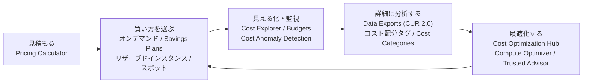
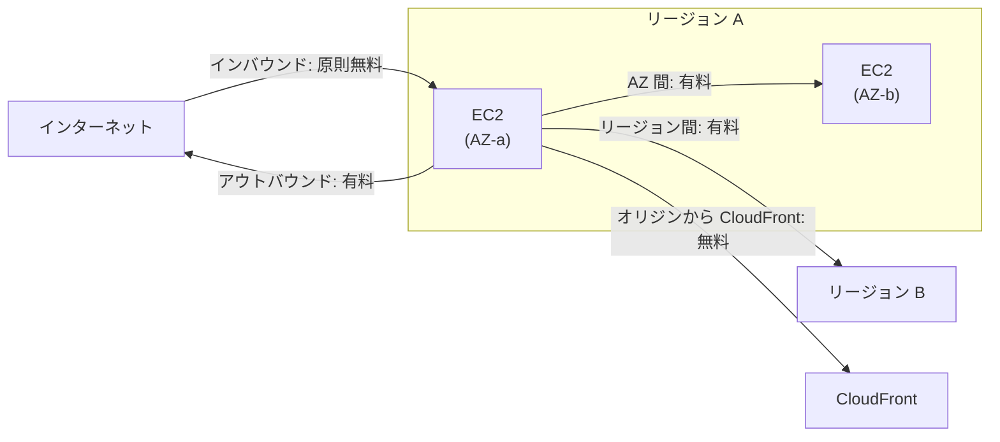
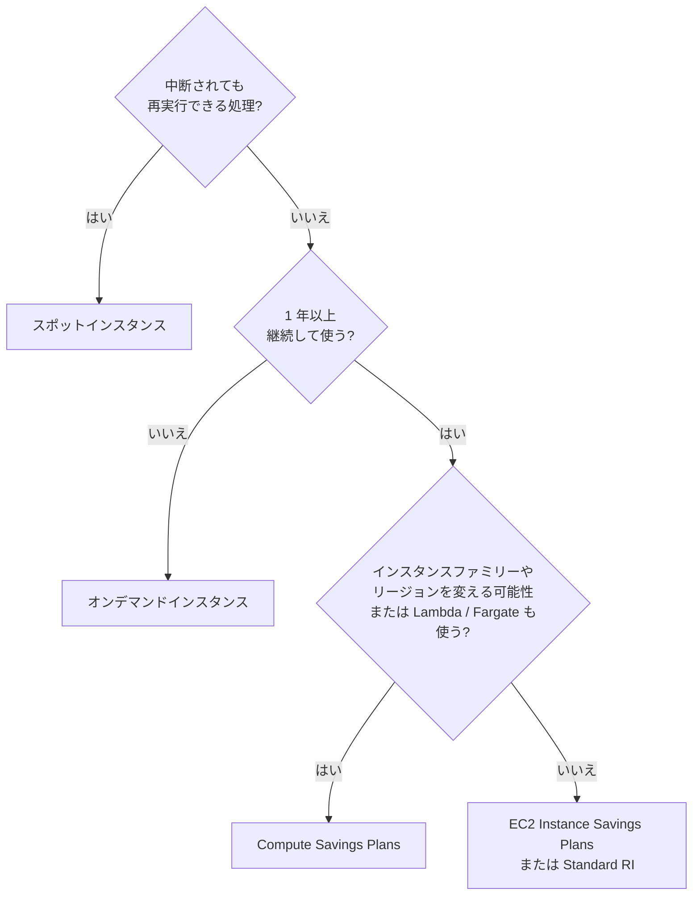
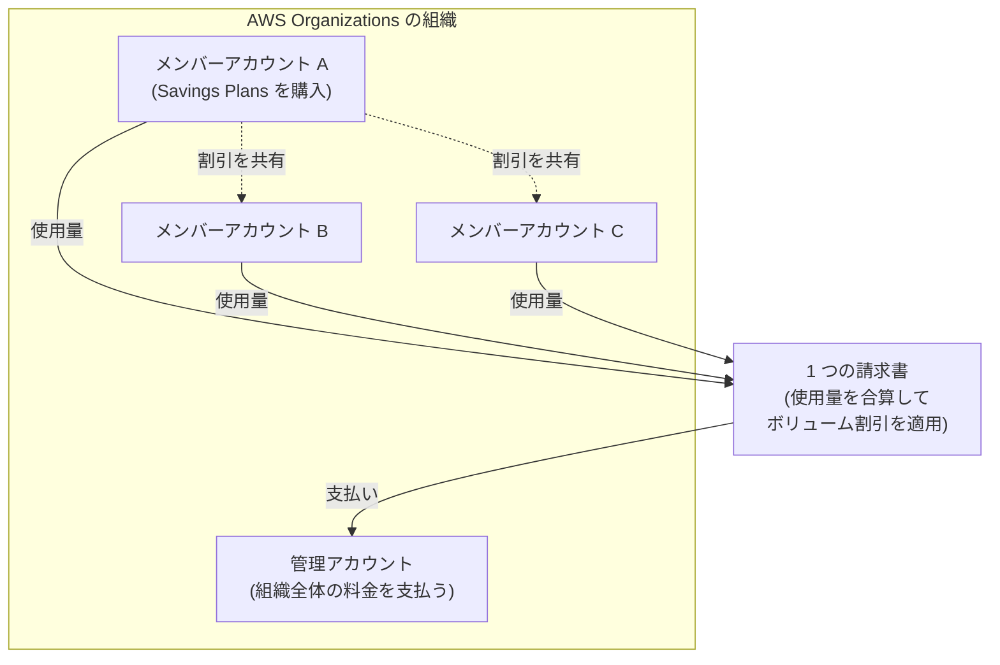

[ホーム](../README.md) > [Phase 1: 基礎](README.md) > 料金・請求・サポート

# 料金・請求・サポート

> **この章のゴール**
> - AWS の料金の基本（従量課金、コンピューティング・ストレージ・データ転送、インバウンドは原則無料）を説明できる
> - EC2 の購入オプション（オンデマンド、Savings Plans、リザーブドインスタンス、スポット、Dedicated Hosts など）を使い分けられる
> - 2025年7月から始まった新しい無料利用枠（クレジット制、無料プランと有料プラン）を説明できる
> - Pricing Calculator、Cost Explorer、Budgets、Data Exports などのコスト管理ツールを目的別に選べる
> - 一括請求のメリット（ボリューム割引、リザーブドインスタンス / Savings Plans の共有）を説明できる
> - 新しいサポートプランと旧プランの違い、TAM・Marketplace・re:Post などの支援リソースを説明できる
>
> **対応試験**: CLF-C02（第4分野: 請求、料金、およびサポート 12%）
> **目安時間**: 読む 120分 / 確認問題 30分

## この章の全体像

第4分野の配点は 12% と最も小さいですが、**覚えれば確実に得点できる**分野です。
また、ここで学ぶ購入オプションやコスト管理ツールは、SAA-C03 の「コストを最適化したアーキテクチャの設計」（20%）や SAP-C03 の土台になります。
コスト管理は「見積もる → 買い方を選ぶ → 見える化する → 分析する → 最適化する」のサイクルで考えると整理できます。

## 1. 料金の基本

### 1.1 AWS の料金の 3 つの考え方

| 考え方 | 意味 | 例 |
|---|---|---|
| 従量課金（Pay as you go） | 使った分だけ支払う。初期費用や長期契約は不要 | EC2 を 3 時間だけ使えば 3 時間分の料金 |
| 確約すると安くなる（Save when you commit） | 一定期間の利用を約束すると割引される | Savings Plans、リザーブドインスタンス |
| たくさん使うと単価が下がる（Pay less by using more） | 使用量が増えると段階的に単価が下がる | S3 のストレージ料金、データ転送料金 |

料金は**リージョンによって異なります**。同じサービス・同じ構成でも、東京リージョンとほかのリージョンでは単価が違うことがあります。

### 1.2 料金を決める 3 つの要素

AWS の料金の大部分は、**コンピューティング**、**ストレージ**、**データ転送（アウトバウンド）** の 3 つで決まります。

| 要素 | 課金の単位の例 |
|---|---|
| コンピューティング | EC2: インスタンスの稼働時間（Amazon Linux や Ubuntu などは秒単位、最低 60 秒） Lambda: リクエスト数と実行時間（割り当てたメモリ量 × 時間） |
| ストレージ | S3: 保存量（GB/月）とリクエスト数 EBS: **確保（プロビジョニング）した容量**（GB/月。使っていなくても課金される） |
| データ転送 | インターネットへのアウトバウンド（GB 単位）、AZ 間・リージョン間の転送 |

### 1.3 データ転送の料金

データ転送の料金は、**どこからどこへ流れるか**で決まります。

| 通信の向き | 料金 |
|---|---|
| インターネット → AWS（インバウンド） | **原則無料** |
| AWS → インターネット（アウトバウンド） | **有料**（GB 単位。量が増えると単価が下がる） |
| 同じ AZ 内（プライベート IP アドレスでの通信） | 無料 |
| 同じリージョン内の AZ 間 | 有料 |
| リージョン間 | 有料 |
| AWS のオリジン（S3、EC2 など）→ CloudFront | 無料（CloudFront から利用者への配信は CloudFront の料金） |

> [!TIP]
> **試験のポイント**: 「AWS のコストに影響する主な要素」→ **コンピューティング、ストレージ、アウトバウンドのデータ転送**。「通常は料金がかからないもの」→ **インターネットからのインバウンドのデータ転送**。

### 1.4 それ自体は無料のサービスと、見落としがちな料金

次のサービスは、**サービス自体の利用料はかかりません**。ただし、作成・管理した EC2 インスタンスなどのリソースには料金がかかります。

| 無料のサービス（サービス自体） | 注意点 |
|---|---|
| IAM、AWS Organizations（一括請求を含む） | — |
| Amazon VPC（VPC、サブネット、ルートテーブル、セキュリティグループ） | NAT ゲートウェイ、VPN 接続などは有料 |
| AWS CloudFormation（AWS のリソースを管理する場合） | 作成したリソースは有料 |
| AWS Elastic Beanstalk、EC2 Auto Scaling | 起動した EC2 インスタンスなどは有料 |
| AWS Shield Standard、AWS Artifact | — |

> [!WARNING]
> **ひっかけ注意**: 次のような「止めたつもりでも発生する料金」がよく問われます。
> - EC2 インスタンスを**停止**しても、アタッチされた **EBS ボリューム**の料金はかかり続けます
> - **パブリック IPv4 アドレス**は、使用中かどうかに関係なく 1 IP あたり 1 時間 0.005 USD かかります（2024年2月から。Elastic IP アドレスも対象）
> - **NAT ゲートウェイ**は、時間単位の料金に加えて、処理したデータ量にも料金がかかります

## 2. EC2 の購入オプション

### 2.1 購入オプションの一覧

EC2 には、同じインスタンスでも「どう買うか」で料金が大きく変わる購入オプションがあります。

| オプション | 仕組み | 割引の目安 | 向いている用途 | 注意点 |
|---|---|---|---|---|
| オンデマンドインスタンス | 使った分だけ支払う。契約なし | なし（基準の価格） | 短期間・予測できない・中断できない処理、検証 | 長期間使い続けると割高 |
| Savings Plans | 1 年または 3 年、**1 時間あたりの利用額（USD/時）** を確約 | Compute Savings Plans で最大 66%、EC2 Instance Savings Plans で最大 72% | 継続的に使うワークロード | 確約した金額は、使わなくても支払う |
| リザーブドインスタンス（RI） | 1 年または 3 年、インスタンスタイプやリージョンなどの**属性**を指定して予約 | Standard RI で最大 72% | 構成が変わらない定常的なワークロード | Savings Plans より柔軟性が低い |
| スポットインスタンス | AWS の空きキャパシティを割安に使う | 最大 90% | 中断されても再実行できる処理（バッチ、CI/CD、データ分析、ステートレスな Web） | AWS の都合で **2 分前の通知**のあと中断されることがある |
| Dedicated Hosts | **物理サーバー 1 台**を専有する | — | ソケット・コア単位のソフトウェアライセンスの持ち込み（BYOL）、規制上の要件 | 最も高価になりやすい |
| Dedicated Instances | 専有のハードウェア上でインスタンスを実行する | — | 他のお客様とハードウェアを共有したくない場合 | 物理サーバーの可視性や配置の制御はない |
| オンデマンドキャパシティ予約 | 特定の AZ に、起動できるキャパシティを確保する | なし（Savings Plans やリージョンの RI と組み合わせると割引） | 確実に起動したいイベント、災害対策 | 使っていなくても、予約した分の料金がかかる |

割引率は、オンデマンド料金と比べた最大値の目安です（2026年9月時点。[Savings Plans](https://aws.amazon.com/savingsplans/) など公式ページで確認してください）。

### 2.2 Savings Plans の種類

Savings Plans は、「1 時間あたり〇 USD 分は必ず使う」と確約する代わりに割引を受ける仕組みです。確約した金額を超えた利用分は、通常のオンデマンド料金になります。

| 種類 | 対象 | 柔軟性 | 割引の目安 |
|---|---|---|---|
| Compute Savings Plans | EC2、AWS Fargate、AWS Lambda | インスタンスファミリー・サイズ・AZ・リージョン・OS・テナンシーを問わない | 最大 66% |
| EC2 Instance Savings Plans | 特定リージョンの、特定インスタンスファミリーの EC2 | ファミリー内ならサイズ・OS・テナンシーを変更できる | 最大 72% |
| Database Savings Plans | Aurora、RDS、DynamoDB、ElastiCache、DocumentDB、Neptune、Keyspaces、Timestream、DMS など | データベースエンジン・インスタンスファミリー・サイズ・リージョンを問わない | 最大 35%（1 年・前払いなし） |
| SageMaker AI Savings Plans | Amazon SageMaker AI のインスタンス利用 | インスタンスファミリー・サイズ・リージョンなどを問わない | 公式ページで確認 |

> [!NOTE]
> Database Savings Plans は 2025年12月に発表された新しい種類です（2026年3月からは OpenSearch Service と Neptune Analytics も対象）。以前はデータベースの割引といえばリザーブドインスタンスでした。古い教材や試験問題には登場しない可能性があります。

### 2.3 リザーブドインスタンスの要点

- 期間は **1 年または 3 年**。支払い方法は **全額前払い / 一部前払い / 前払いなし** の 3 種類で、前払いが多いほど割引が大きくなります（Savings Plans も同じ 3 種類です）
- **Standard RI**: 割引が最も大きいが、変更できる属性が限られる。不要になったら **RI マーケットプレイス**で売却できる
- **Convertible RI**: 割引は Standard より小さいが、インスタンスファミリーなどが異なる別の Convertible RI に交換できる
- 特定の AZ を指定した RI（ゾーン RI）は、その AZ のキャパシティ予約も兼ねます
- EC2 以外にも、RDS、ElastiCache、Redshift、OpenSearch Service などに予約購入のオプションがあります

> [!TIP]
> **試験のポイント**:
> - 「中断されてもよい」「フォールトトレラントなバッチ処理」「最も安く」→ **スポットインスタンス**
> - 「1 年以上、24 時間 365 日稼働」「割引」→ **Savings Plans** または **リザーブドインスタンス**
> - 「EC2 に加えて **Lambda や Fargate** も割り引きたい」「インスタンスファミリーやリージョンを変える予定」→ **Compute Savings Plans**（RI は Lambda や Fargate には使えません）
> - 「短期間」「予測できない」「中断できない」→ **オンデマンドインスタンス**
> - 「ソケット・コア単位のライセンスを持ち込む」→ **Dedicated Hosts**

> [!WARNING]
> **ひっかけ注意**: スポットインスタンスは、中断されると困るデータベースや、決められた時間内に必ず終える必要がある処理には向きません。
> また、Savings Plans で確約するのは「**インスタンスの台数**」ではなく「**1 時間あたりの利用額**」です。

## 3. 無料利用枠

AWS の無料利用枠は、**2025年7月15日以降に作成したアカウント**から新しい仕組み（クレジット制）に変わりました（[公式ページ](https://aws.amazon.com/free/)、2026年9月時点）。

### 3.1 新しい無料利用枠（2025年7月15日以降のアカウント）

- サインアップ時に **100 USD 分のクレジット**がもらえます
- さらに、「Explore AWS」ウィジェットの 5 つのアクティビティ（EC2、RDS、Lambda、Amazon Bedrock、AWS Budgets。各 20 USD）を 6 か月以内に完了すると、**最大 100 USD 分が追加**されます（合計で最大 **200 USD**）
- サインアップ時に **無料プラン** か **有料プラン** を選びます

| | 無料プラン | 有料プラン |
|---|---|---|
| 料金 | 請求は発生しない | クレジットを超えた分は従量課金 |
| 使えるサービス | 90 以上のサービス（クレジットをすぐに使い切るものや、ハードウェアの購入が必要なものなどは使えない） | すべてのサービス |
| 期間 | **6 か月、またはクレジットを使い切るまで**（早い方）。延長はできない | クレジットの有効期限は**アカウント作成から 12 か月** |
| 期間終了後 | **アカウントは閉鎖**され、データは 90 日間保持される。90 日以内に有料プランへアップグレードすれば再開でき、しなければ完全に削除される | そのまま従量課金で使い続ける |

さらに、30 以上のサービスには、どちらのプランでも使える **常に無料（Always Free）** の枠があります。
たとえば Lambda は毎月 100 万リクエストと 40 万 GB 秒、DynamoDB は 25 GB のストレージが無料です。

> [!WARNING]
> **ひっかけ注意**: 無料プランのアカウントが **AWS Organizations の組織を作成・参加**したり、**AWS Control Tower のランディングゾーンを設定**したりすると、無料利用枠のクレジットは**すぐに失効**します。
> 本教材で Phase 1〜2 を IAM ユーザーで進めるのはこのためです（[7 章](07-security-and-compliance.md) と [アカウントの準備](../00-start/04-aws-account-setup.md) を参照）。

### 3.2 旧来の無料利用枠（2025年7月15日より前のアカウント）

2025年7月15日より前に作成したアカウントは、従来の無料利用枠のままです。次の 3 種類で構成されます。

| 種類 | 内容 | 例 |
|---|---|---|
| 12 か月間無料 | アカウント作成から 12 か月間、一定量まで無料 | EC2 の t2.micro / t3.micro を月 750 時間 |
| 短期間の無料トライアル | サービスごとに、利用開始から一定期間無料 | 一部のサービスの試用 |
| 常に無料 | 期限なく、一定量まで無料 | Lambda、DynamoDB など |

> [!NOTE]
> 試験や古い教材では、無料利用枠を「常に無料 / 12 か月間無料 / トライアル」の 3 種類として出題する可能性があります。新旧どちらの説明も理解しておきましょう。

> [!CAUTION]
> 有料プランや旧来の無料利用枠では、無料の範囲を超えると課金されます。学習用アカウントでは、最初に **AWS Budgets のアラート**を設定してください（[Lab 01](../04-labs/lab01-secure-account.md)）。

## 4. 見積もりとコスト管理のツール

### 4.1 AWS Pricing Calculator

**AWS Pricing Calculator**（[calculator.aws](https://calculator.aws/)）は、AWS で構築する**前**に、構成を入力して月額料金を見積もるツールです。

- AWS アカウントがなくても使えます
- サービスごとの見積もりをグループにまとめ、共有用のリンクでほかの人に渡せます
- オンプレミスからの移行を検討するときの、コスト比較の材料にもなります

> [!NOTE]
> 旧来の Simple Monthly Calculator は提供を終了し、AWS Pricing Calculator に置き換えられています。

### 4.2 Billing and Cost Management の主なツール

構築したあとのコストは、Billing and Cost Management コンソールの各ツールで管理します。

| ツール | 目的 | 押さえるポイント |
|---|---|---|
| 請求ダッシュボード / 請求書 | 今月の請求額とサービス別の内訳、過去の請求書を確認する | 当月末の予測額も表示される |
| AWS Cost Explorer | 過去のコストと使用量をグラフで分析し、今後のコストを予測する | サービス・アカウント・リージョン・タグ別に絞り込める。Savings Plans や RI の購入の推奨も表示する |
| AWS Budgets | 予算を設定し、実績または予測がしきい値を超えたら通知する | コスト・使用量・RI / Savings Plans の使用率とカバレッジの予算を作れる。**予算アクション**で IAM ポリシーや SCP の適用、EC2・RDS インスタンスの停止も自動化できる |
| AWS Data Exports（CUR 2.0） | 最も詳細なコストと使用量のデータを S3 に定期的に出力する | 時間単位・リソース単位の明細。Amazon Athena で SQL 分析し、Amazon QuickSight（2025年10月に Amazon Quick Suite へ再編）で可視化できる |
| AWS Cost Anomaly Detection | 機械学習で、いつもと違う支出（異常）を検出して通知する | 追加料金なしで使える |
| コスト配分タグ | リソースに付けたタグ（例: `Project=web`）単位でコストを集計する | 請求コンソールで**有効化**しないと、Cost Explorer などに表示されない |
| AWS Cost Categories | ルールを使って、コストを独自の分類（部署、製品など）にまとめる | Cost Explorer、Budgets、Data Exports で使える |
| Cost Optimization Hub | 複数のアカウントとリージョンにまたがるコスト最適化の推奨事項を一元化し、節約額を試算する | ライトサイジング、アイドル状態のリソースの削除、Graviton への移行、Savings Plans / RI の購入などを表示する |

このほか、EC2 インスタンス、Auto Scaling グループ、EBS ボリューム、Lambda 関数などの**最適なサイズを機械学習で推奨**する **AWS Compute Optimizer** もあります。Compute Optimizer の推奨は Cost Optimization Hub にも集約されます。

> [!TIP]
> **試験のポイント**:
> - 「構築前に料金を見積もりたい」→ **Pricing Calculator**
> - 「過去のコストの傾向を分析したい」「来月のコストを予測したい」→ **Cost Explorer**
> - 「予算を超えそうになったら通知したい」→ **Budgets**
> - 「最も詳細な請求データを分析したい」→ **Data Exports（Cost and Usage Report）**
> - 「突然のコストの急増を自動で検知したい」→ **Cost Anomaly Detection**
> - 「プロジェクトや部署ごとにコストを把握したい」→ **コスト配分タグ**（または Cost Categories）

> [!WARNING]
> **ひっかけ注意**:
> - Budgets は通知（と予算アクション）のためのサービスで、支出を完全に止める「上限」ではありません
> - Cost Explorer は**構築後**の実績の分析と予測、Pricing Calculator は**構築前**の見積もりです
> - タグを付けただけでは、コストレポートに表示されません。コスト配分タグとして**有効化**が必要です（Organizations では管理アカウントで有効化します）

> [!NOTE]
> 詳細な請求データの出力は、以前は「AWS Cost and Usage Report（CUR）」と呼ばれていました。現在は **AWS Data Exports** の中で「CUR 2.0」として提供されています。試験では旧名称の「Cost and Usage Report」で出題される可能性があります。

## 5. AWS Organizations の一括請求

AWS Organizations の**一括請求**（Consolidated Billing）を使うと、組織内のすべてのアカウントの料金を**管理アカウントがまとめて支払います**。一括請求は追加料金なしで利用できます。

| メリット | 内容 |
|---|---|
| 請求書の一本化 | 複数アカウントの料金を 1 つの請求書で支払える。アカウントごとの内訳も確認できる |
| ボリューム割引 | 組織内の**使用量を合算**して段階料金を適用するため、単価が下がりやすい |
| RI / Savings Plans の共有 | あるアカウントで購入した RI や Savings Plans の割引が、ほかのアカウントの使用分にも適用される（管理アカウントで共有をオフにすることもできる） |
| 追加料金なし | 一括請求の機能自体は無料 |

具体例で考えてみましょう。S3 Standard のストレージ料金は「最初の 50 TB」「次の 450 TB」「500 TB 超」という段階ごとに単価が下がります。

- アカウント A・B・C がそれぞれ 30 TB を保存しているとします。**別々に請求**されると、3 アカウントとも全量が「最初の 50 TB」の単価です
- **一括請求**なら合計 90 TB として計算されます。50 TB を超えた 40 TB 分には、より安い「次の 450 TB」の単価が適用されます

管理アカウントは請求と組織の管理に専念させ、ワークロードはメンバーアカウントで動かすのがベストプラクティスです（詳しくは [Phase 3](../03-professional/02-multi-account-governance.md)）。

> [!TIP]
> **試験のポイント**: 「複数アカウントの請求を 1 つにまとめたい」「組織全体でボリューム割引を受けたい」「購入した RI の割引をほかのアカウントでも使いたい」→ **AWS Organizations の一括請求**。

## 6. AWS サポートプラン

### 6.1 新しいサポートプラン（2026年9月時点）

AWS のサポートプランは re:Invent 2025 で再編され、**ベーシック / Business Support+ / Enterprise Support / Unified Operations** の 4 つになりました（[公式ページ](https://aws.amazon.com/premiumsupport/plans/)）。

| | ベーシック | Business Support+ | Enterprise Support | Unified Operations |
|---|---|---|---|---|
| 料金 | 無料 | 月額 29 USD〜（アカウントごとの最低料金） | 月額 5,000 USD〜（最低料金） | 公式ページで確認 |
| 技術的な問い合わせ | ✗（アカウントと請求に関するカスタマーサービスのみ） | 24 時間 365 日（電話・Web・チャット・メール） | 24 時間 365 日 | 24 時間 365 日 |
| AI を活用した支援 | — | 状況に応じた推奨を 24 時間 365 日 | ✓ | ✓ |
| Trusted Advisor | コアチェック | すべてのチェック | すべてのチェック + Trusted Advisor Priority | すべてのチェック + Trusted Advisor Priority |
| AWS Health API / AWS Support API | — | ✓ | ✓ | ✓ |
| 技術的な担当者 | — | — | **専任の TAM** | 専任のインシデント管理エンジニアとドメインスペシャリストエンジニア |
| 主な特徴 | ドキュメント、ホワイトペーパー、re:Post、AWS Health Dashboard | 本番ワークロード向けに推奨される最小のプラン。サードパーティーソフトウェアのサポート | アーキテクチャのガイダンス、プロアクティブなセキュリティレビュー、計画イベントのサポート、24 時間の請求サポート | ミッションクリティカル向け。AWS Incident Detection and Response と AWS Security Incident Response を含む。重要ワークロードのレビュー、専任の請求・アカウント担当 |

技術的な問い合わせ（ケース）には重要度があり、重要度ごとに**最初の応答までの目標時間**が決まっています。

| ケースの重要度 | Business Support+ | Enterprise Support | Unified Operations |
|---|---|---|---|
| 一般的なガイダンス | 24 時間未満 | 24 時間未満 | 24 時間未満 |
| システム障害 | 12 時間未満 | 12 時間未満 | 12 時間未満 |
| 本番システム障害 | 4 時間未満 | 4 時間未満 | 4 時間未満 |
| 本番システムダウン | 1 時間未満 | 1 時間未満 | 1 時間未満 |
| ビジネス / ミッションクリティカルなシステムのダウン | **30 分未満** | **15 分未満** | **5 分未満**（インシデント管理エンジニアが対応） |

> [!WARNING]
> **ひっかけ注意**: ベーシックでも、アカウントや請求に関する問い合わせ（カスタマーサービス）と、サービスクォータの引き上げのリクエストはできます。しかし、**技術的な問い合わせのケースは作成できません**。

### 6.2 旧サポートプラン（2027年1月1日に終了）

再編前のプランである **開発者（Developer）/ ビジネス（Business）/ エンタープライズ On-Ramp** は、**2027年1月1日に提供を終了**します（既存のお客様はそれまで継続できます。エンタープライズ On-Ramp のお客様は 2026年中に Enterprise Support へ自動的に移行されます）。
試験では旧プランの名称で出題される可能性が高いため、主な違いを押さえておきましょう（[公式ドキュメント](https://docs.aws.amazon.com/awssupport/latest/user/support-plans-eos.html)）。

| 旧プラン | 料金（参考） | 技術サポート | Trusted Advisor | 最短の応答時間 | 特徴 |
|---|---|---|---|---|---|
| ベーシック | 無料 | なし | コアチェック | — | 現在のベーシックとほぼ同じ |
| 開発者 | 月額 29 USD〜 | **営業時間内のメール**（主要連絡先 1 名） | コアチェック | システム障害: 12 営業時間未満 | 検証・開発向け |
| ビジネス | 月額 100 USD〜 | **24 時間 365 日**の電話・チャット・メール | **すべてのチェック** | 本番システムダウン: **1 時間未満** | 本番ワークロード向け。AWS Health API |
| エンタープライズ On-Ramp | 月額 5,500 USD〜 | 24 時間 365 日 | すべてのチェック | ビジネスクリティカルなシステムのダウン: **30 分未満** | **TAM のプール（チーム）**、コンシェルジュサポートチーム |
| エンタープライズ | 月額 15,000 USD〜 | 24 時間 365 日 | すべてのチェック | ビジネス / ミッションクリティカルなシステムのダウン: **15 分未満** | **専任の TAM**、コンシェルジュサポートチーム |

> [!TIP]
> **試験のポイント**（新旧のキーワード対応）:
> - 「最も安価に、本番環境の障害時に 24 時間 365 日の技術サポートを受けたい」→ 新: **Business Support+** / 旧: **ビジネス**
> - 「Trusted Advisor のすべてのチェック」「AWS Health API」→ 新: **Business Support+ 以上** / 旧: **ビジネス以上**
> - 「**専任の TAM**」「15 分以内の応答」→ **Enterprise Support**（旧: エンタープライズ）
> - 「営業時間内のメールサポートで十分」「最も安価な技術サポート」→ 旧: **開発者**
> - 「請求やアカウントの専門的な支援（コンシェルジュ）」→ 旧: エンタープライズ On-Ramp 以上

> [!WARNING]
> **ひっかけ注意**: 「ビジネスクリティカルなシステムのダウンに 30 分以内に応答」は、旧プランでは**エンタープライズ On-Ramp**、新プランでは **Business Support+** です。問題文がどちらのプラン体系を前提にしているかを、選択肢のプラン名から判断しましょう。

### 6.3 AWS Health Dashboard

**AWS Health Dashboard** は、AWS のサービスの稼働状況と、お客様のアカウントに影響するイベント（障害、予定されたメンテナンス、廃止の予定など）を表示します。すべてのお客様が無料で使えます。
プログラムからイベントを取得する **AWS Health API** は、Business Support+ 以上で利用できます。

> [!NOTE]
> 以前の「Service Health Dashboard」と「Personal Health Dashboard」は、現在は AWS Health Dashboard に統合されています。古い教材では旧名称が使われていることがあります。

## 7. サポート以外の支援リソース

| リソース | 内容 | 典型的な問題文 |
|---|---|---|
| テクニカルアカウントマネージャー（TAM） | お客様専任の技術窓口。プロアクティブなガイダンス、運用の改善、ベストプラクティスの提案を行う | 「専任の技術担当者から継続的に助言を受けたい」→ Enterprise Support |
| AWS Professional Services | AWS 自身の専門家チームによるコンサルティング | 「AWS の専門家チームに大規模な移行を支援してほしい」 |
| AWS パートナーネットワーク（APN） | AWS のパートナー企業のネットワーク。導入や移行を支援するサービスパートナーと、ソフトウェアを提供するテクノロジーパートナーがある | 「AWS の導入を支援してくれる外部の企業を探したい」 |
| AWS Marketplace | サードパーティーのソフトウェア、データ、機械学習モデル、プロフェッショナルサービスを検索・購入できるデジタルカタログ。料金は AWS の請求にまとめられる | 「サードパーティーのソフトウェアをすぐに購入してデプロイしたい」 |
| AWS re:Post | AWS のコミュニティ Q&A。AWS の専門家やユーザーが回答する | 「無料で技術的な質問をしたい」 |
| AWS ナレッジセンター | よくある質問に対する AWS の公式な解説記事（re:Post 内） | 「よくある問題の解決方法を調べたい」 |
| AWS ドキュメント・ホワイトペーパー・AWS 規範ガイダンス | 公式の説明書、設計や移行のベストプラクティス | 「AWS が推奨する設計方法を調べたい」 |
| AWS Managed Services（AMS） | AWS がお客様のインフラストラクチャの運用を代行する | 「インフラストラクチャの日々の運用を AWS に任せたい」 |
| AWS Trust & Safety チーム | AWS のリソースを使った不正利用（スパム、攻撃など）の報告先 | 「AWS 上のリソースから攻撃を受けている」 |

> [!NOTE]
> 認定を持つフリーランスの専門家を探せた **AWS IQ** は、2026年5月28日にサービスを終了しました。代わりに AWS Marketplace のプロフェッショナルサービスが案内されています。古い教材や試験問題では、AWS IQ が選択肢に登場する可能性があります。

## まとめ

- AWS の料金は「従量課金」「確約すると安くなる」「たくさん使うと単価が下がる」の 3 つの考え方で成り立つ
- 料金の主な要素はコンピューティング・ストレージ・アウトバウンドのデータ転送。インバウンドは原則無料、AZ 間・リージョン間の転送は有料
- 中断できるならスポット、継続利用なら Savings Plans / RI、短期間や予測不能ならオンデマンド、ライセンスの持ち込みなら Dedicated Hosts
- Compute Savings Plans は EC2・Fargate・Lambda に適用され、ファミリーやリージョンを変えても割引が続く
- 新しい無料利用枠は最大 200 USD のクレジット制。無料プランは 6 か月またはクレジットを使い切るまでで、Organizations に参加するとクレジットが失効する
- 見積もりは Pricing Calculator、分析は Cost Explorer、通知は Budgets、詳細データは Data Exports（CUR 2.0）、異常検知は Cost Anomaly Detection
- Organizations の一括請求は無料で、ボリューム割引と RI / Savings Plans の共有が受けられる
- サポートプランは新体系（ベーシック / Business Support+ / Enterprise Support / Unified Operations）。旧プラン（開発者 / ビジネス / エンタープライズ On-Ramp）は 2027年1月1日に終了するが、試験では旧名称も出る
- 専任の TAM は Enterprise Support 以上。コミュニティの Q&A は re:Post、サードパーティー製品は Marketplace

## 確認問題

### 問1
AWS の料金について、通常は**料金が発生しない**データ転送はどれですか。

- A. インターネットから Amazon S3 バケットへのファイルのアップロード（インバウンド）
- B. EC2 インスタンスからインターネット上の利用者への動画の配信（アウトバウンド）
- C. 同じリージョン内の、異なる AZ にある EC2 インスタンス間の通信
- D. 東京リージョンから米国東部（バージニア北部）リージョンへの S3 のレプリケーション

解答と解説

**正解: A**

**解説**: インターネットから AWS へのインバウンドのデータ転送は、原則として無料です。料金がかかるのは、主にアウトバウンドの転送と、AZ 間・リージョン間の転送です。

**各選択肢の検討**
- A: ✓ インバウンドのデータ転送は原則無料です。
- B: ✗ インターネットへのアウトバウンドのデータ転送は有料です。
- C: ✗ 同じリージョン内でも、AZ 間の通信は有料です（同じ AZ 内のプライベート IP アドレスでの通信は無料）。
- D: ✗ リージョン間のデータ転送は有料です。

### 問2
ある企業は、毎晩数時間かかる画像変換のバッチ処理を実行しています。この処理は途中で中断されても、自動的に再実行できるように設計されています。この処理を最もコスト効率よく実行できる EC2 の購入オプションはどれですか。

- A. オンデマンドインスタンス
- B. 3 年間の Standard リザーブドインスタンス
- C. Dedicated Hosts
- D. スポットインスタンス

解答と解説

**正解: D**

**解説**: 中断されても再実行できる処理には、オンデマンドと比べて最大 90% 安いスポットインスタンスが最適です。

**各選択肢の検討**
- A: ✗ 割引がないため、スポットより高くなります。
- B: ✗ RI は長期間の継続的な利用を前提とした割引です。毎晩数時間だけの処理では、使っていない時間の分も支払うことになります。
- C: ✗ 物理サーバーを専有するため高価です。ライセンスや規制の要件がない限り不要です。
- D: ✓ 中断に耐えられる処理なら、スポットインスタンスが最もコスト効率に優れます。

### 問3
ある企業は、EC2 インスタンスに加えて AWS Lambda と AWS Fargate を継続的に使っています。今後 1 年の間に、EC2 のインスタンスファミリーの変更や、別のリージョンへの移行を予定しています。柔軟性を保ちながらコンピューティングの料金を削減するには、どの購入オプションが最も適していますか。

- A. EC2 Instance Savings Plans
- B. Compute Savings Plans
- C. Standard リザーブドインスタンス
- D. オンデマンドキャパシティ予約

解答と解説

**正解: B**

**解説**: Compute Savings Plans は、インスタンスファミリー・サイズ・リージョンなどを問わず EC2 に適用され、Lambda と Fargate の利用にも適用されます。

**各選択肢の検討**
- A: ✗ EC2 Instance Savings Plans は、特定リージョンの特定インスタンスファミリーに限定されます。Lambda と Fargate にも適用されません。
- B: ✓ 柔軟性が最も高く、EC2・Lambda・Fargate のすべてに適用されます。
- C: ✗ Standard RI は属性の変更に制限があり、Lambda と Fargate には使えません。
- D: ✗ キャパシティ予約は起動できる容量を確保する仕組みで、それ自体に割引はありません。

### 問4
ある企業は、開発用の AWS アカウントの月間コストが 1,000 USD を超えると予測された時点で、担当者にメールで通知したいと考えています。どのサービスを使うべきですか。

- A. AWS Cost Explorer
- B. AWS Pricing Calculator
- C. AWS Budgets
- D. AWS Data Exports

解答と解説

**正解: C**

**解説**: AWS Budgets では、実績だけでなく**予測**のコストがしきい値を超えたときにも通知を送れます。

**各選択肢の検討**
- A: ✗ Cost Explorer はコストの分析と予測をグラフで確認するツールで、しきい値による通知の機能はありません。
- B: ✗ Pricing Calculator は、構築前に料金を見積もるツールです。
- C: ✓ 予算としきい値を設定し、実績または予測に基づいて通知できます。
- D: ✗ Data Exports は、詳細なコストと使用量のデータを S3 に出力する機能です。

### 問5
ある企業は、部署ごとに 5 つの AWS アカウントを使っており、AWS Organizations で一括請求を有効にすることを検討しています。一括請求によって得られるメリットはどれですか。（2 つ選択してください）

- A. すべてのアカウントの使用量が合算され、段階料金によるボリューム割引を受けやすくなる
- B. すべてのアカウントに Business Support+ が無料で適用される
- C. あるアカウントで購入したリザーブドインスタンスや Savings Plans の割引が、ほかのアカウントの使用分にも適用される
- D. 各アカウントの料金が自動的に一律 10% 割引される
- E. 管理アカウントが、メンバーアカウントのリソースを自動的にバックアップする

解答と解説

**正解: A, C**

**解説**: 一括請求のメリットは、請求の一本化、使用量の合算によるボリューム割引、RI / Savings Plans の割引の共有です。一括請求の機能自体は追加料金なしで使えます。

**各選択肢の検討**
- A: ✓ 組織全体の使用量を合算して段階料金が適用されます。
- B: ✗ サポートプランは別の契約で、一括請求によって無料になることはありません。
- C: ✓ RI や Savings Plans の割引は、組織内のアカウント間で共有されます（管理アカウントでオフにすることもできます）。
- D: ✗ 一律の割引はありません。
- E: ✗ バックアップは AWS Backup などで別途設定します。一括請求の機能ではありません。

### 問6
ある企業は、初めて本番ワークロードを AWS で稼働させます。本番システムがダウンしたときは 1 時間以内に AWS のエンジニアからの応答を受けたいと考えています。また、24 時間 365 日電話で問い合わせができ、Trusted Advisor のすべてのチェックを利用したいと考えています。これらの要件を満たす、最も低コストのサポートプランはどれですか。

- A. ベーシック
- B. Business Support+
- C. Enterprise Support
- D. Unified Operations

解答と解説

**正解: B**

**解説**: Business Support+ は、24 時間 365 日の技術サポート、本番システムダウン時の 1 時間未満の応答、Trusted Advisor のすべてのチェックを提供する、本番ワークロード向けの最小のプランです。旧プランの名称で出題された場合は「ビジネス」が正解になります。

**各選択肢の検討**
- A: ✗ ベーシックでは技術的な問い合わせのケースを作成できず、Trusted Advisor もコアチェックだけです。
- B: ✓ すべての要件を満たす最も低コストのプランです。
- C: ✗ 要件は満たしますが、TAM などが含まれる分、最低料金が高くなります。
- D: ✗ 要件は満たしますが、最上位のプランで最もコストが高くなります。

### 問7
ある大企業は、ミッションクリティカルなシステムを AWS で運用しています。**専任のテクニカルアカウントマネージャー（TAM）**から継続的にアーキテクチャのガイダンスを受けたいと考えています。また、ビジネスクリティカルなシステムがダウンしたときは 15 分以内の応答を求めています。次のうち、これらの要件を満たすサポートプランはどれですか。

- A. ベーシック
- B. Business Support+
- C. 開発者（旧プラン）
- D. Enterprise Support

解答と解説

**正解: D**

**解説**: 専任の TAM と、ビジネス / ミッションクリティカルなシステムのダウン時の 15 分未満の応答は、Enterprise Support の特徴です。旧プランの名称で出題された場合は「エンタープライズ」が正解です。

**各選択肢の検討**
- A: ✗ ベーシックには技術サポートも TAM もありません。
- B: ✗ Business Support+ には TAM が含まれず、ビジネスクリティカルなシステムのダウン時の応答は 30 分未満です。
- C: ✗ 開発者プランは営業時間内のメールサポートだけで、TAM はありません（2027年1月1日に終了する旧プランです）。
- D: ✓ 専任の TAM と 15 分未満の応答を提供します。

## 次のステップ

- ハンズオン: [Lab 01: アカウントを守る初期設定](../04-labs/lab01-secure-account.md)（AWS Budgets のアラートを設定します）
- 次の章: [CLF-C02 試験対策](09-clf-exam-prep.md)
- さらに深く: [コスト最適化（SAA-C03）](../02-associate/18-cost-optimization.md) / [大規模環境のコスト最適化（SAP-C03）](../03-professional/11-cost-optimization-at-scale.md)
- 公式ドキュメント: [AWS の料金](https://aws.amazon.com/pricing/) / [AWS 無料利用枠](https://aws.amazon.com/free/) / [AWS Cost Management](https://aws.amazon.com/aws-cost-management/) / [AWS サポートプラン](https://aws.amazon.com/premiumsupport/plans/)

---
[← 前の章](07-security-and-compliance.md) | [目次](README.md) | [次の章 →](09-clf-exam-prep.md)
