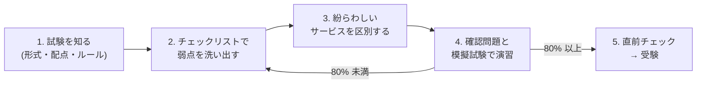
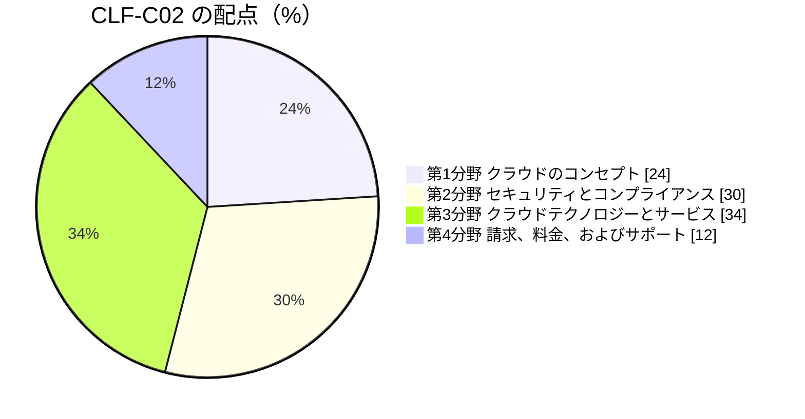

[ホーム](../README.md) > [Phase 1: 基礎](README.md) > CLF-C02 試験対策

# CLF-C02 試験対策

> **この章のゴール**
> - CLF-C02 の試験形式・配点・受験ルールを説明できる
> - 4 つの分野（ドメイン）の頻出ポイントを、チェックリストで自己点検できる
> - 紛らわしいサービスを、問題文のキーワードから区別できる
> - 本番で使える解き方のテクニックと時間配分を身につける
>
> **対応試験**: CLF-C02（全分野）
> **目安時間**: 読む 70分 / 確認問題 50分

## この章の全体像

Phase 1 の総仕上げです。新しい知識を増やすよりも、**これまでの章の知識を「試験で得点できる形」に整える**ことを目的にします。
次の流れで進め、模擬試験で 80% 以上を安定して取れるようになったら受験しましょう。

## 1. 試験概要

### 1.1 基本情報（2026年9月時点）

| 項目 | 内容 |
|---|---|
| 試験名 | AWS Certified Cloud Practitioner（CLF-C02） |
| レベル | 基礎（Foundational） |
| 問題数 | **65 問**（採点対象 50 問 + 採点対象外 15 問） |
| 試験時間 | **90 分** |
| 出題形式 | 択一選択（4 つの選択肢から正解を 1 つ）、複数選択（5 つ以上の選択肢から正解を 2 つ以上） |
| 合格点 | **700 点**（100〜1,000 点のスケールスコア） |
| 受験料 | **100 USD**（日本円では **15,000 円**。税が適用される場合があり、消費税 10% 込みで 16,500 円） |
| 受験方法 | テストセンター、またはオンライン（Pearson VUE の OnVUE） |
| 有効期間 | 3 年 |

最新の情報は [公式の試験ガイド](https://docs.aws.amazon.com/aws-certification/latest/cloud-practitioner-02/cloud-practitioner-02.html) で確認してください。認定全体の仕組みは [AWS 認定の全体像と試験の仕組み](../00-start/02-certification-map.md) で説明しています。

採点と受験のルールで、特に大切なものは次のとおりです。

- **補償型の採点**: 分野ごとの合格基準はなく、試験全体で 700 点以上なら合格です。苦手な分野があっても、ほかの分野で補えます
- **無回答は不正解**: 推測で答えても減点されません。**すべての問題に必ず回答**しましょう
- **採点対象外の 15 問**: 今後の試験のための問題で、どれが該当するかは区別できません。全問に全力で答えます
- **結果の通知**: 5 営業日以内に届きます（試験の終了時に合否が表示されないことが多い）
- **再受験**: 不合格の場合、14 日後から再受験できます（毎回受験料がかかります）
- **合格特典**: 次回の試験に使える 50% 割引のバウチャーがもらえます。SAA-C03 の受験に使うのがおすすめです
- **オンライン受験**: 休憩は取れません。日本語を話す試験監督官の対応は月曜〜土曜の 9:00〜16:00（日本時間）です
- **ESL +30 分**: 英語を母国語としない人が**英語で**受験する場合の延長措置です。日本語で受験する場合は対象外です

### 1.2 分野（ドメイン）と配点

| 分野 | 配点 | 主なタスク（公式試験ガイドの要約） | 本教材の章 |
|---|---|---|---|
| 第1分野: クラウドのコンセプト | 24% | AWS クラウドの利点、設計原則（Well-Architected）、移行の利点と戦略、クラウドの経済性 | [4 章](04-cloud-concepts.md) |
| 第2分野: セキュリティとコンプライアンス | 30% | 責任共有モデル、セキュリティ・ガバナンス・コンプライアンスの概念、アクセス管理、セキュリティのためのサービスとリソース | [7 章](07-security-and-compliance.md) |
| 第3分野: クラウドテクノロジーとサービス | 34% | デプロイと運用の方法、グローバルインフラストラクチャ、コンピューティング・データベース・ネットワーク・ストレージ、AI/ML と分析、その他のサービス | [5 章](05-global-infrastructure.md)、[6 章](06-core-services-tour.md) |
| 第4分野: 請求、料金、およびサポート | 12% | 料金モデルの比較、請求・予算・コスト管理のリソース、技術リソースとサポートのオプション | [8 章](08-billing-pricing-support.md) |

> [!TIP]
> **試験のポイント**: 第2分野と第3分野で全体の **64%** を占めます。学習時間が限られる場合は、この 2 分野を優先してください。
> 第4分野は 12% と小さいものの、暗記で確実に得点できるため、捨ててはいけません。

## 2. 分野別の頻出ポイント・チェックリスト

説明できない項目があれば、リンク先の章に戻って復習しましょう。

### 第1分野: クラウドのコンセプト（[4 章](04-cloud-concepts.md)）

- [ ] クラウドの 6 つの利点を言える（固定費を変動費に / 規模の経済の恩恵 / キャパシティの予測が不要 / スピードと俊敏性の向上 / データセンターの運用と保守への投資が不要 / 数分でグローバルに展開）
- [ ] 弾力性（伸縮性）・スケーラビリティ・高可用性・耐障害性・俊敏性の違いを説明できる
- [ ] IaaS・PaaS・SaaS と、クラウド・ハイブリッド・オンプレミスの各デプロイモデルを区別できる
- [ ] Well-Architected フレームワークの 6 つの柱（運用上の優秀性、セキュリティ、信頼性、パフォーマンス効率、コスト最適化、持続可能性）と、それぞれの代表的な設計原則を言える
- [ ] AWS クラウド導入フレームワーク（AWS CAF）の 6 つの観点（ビジネス、人材、ガバナンス、プラットフォーム、セキュリティ、オペレーション）を言える
- [ ] 移行戦略の 7 つの R（リホスト、リプラットフォーム、リファクタリング、リパーチェス、リタイア、リテイン、リロケート）を区別できる
- [ ] クラウドの経済性（設備投資から運用費へ、TCO、ライセンスの持ち込み（BYOL）とライセンス込み、ライトサイジング）を説明できる
- [ ] 大量データの移行手段（オンラインの AWS DataSync、オフラインの物理デバイスや AWS Data Transfer Terminal）を区別できる

> [!NOTE]
> AWS Snowball Edge は、2025年11月7日に新規のお客様の受け付けを終了しました（Snowcone は 2024年に提供終了）。新規のオフライン移行には AWS Data Transfer Terminal などが案内されています。
> ただし、試験では「大量データをオフラインで移行するなら Snowball」という形で出題される可能性があります。概念として理解しておきましょう。

### 第2分野: セキュリティとコンプライアンス（[7 章](07-security-and-compliance.md)）

- [ ] 責任共有モデルで、EC2・RDS・Lambda・S3 それぞれの AWS とお客様の責任を区別できる
- [ ] 共通管理（パッチ管理・構成管理・意識向上とトレーニング）を言える
- [ ] ルートユーザーの保護方法（MFA、アクセスキーを作らない）と、ルートユーザーでしかできない作業を挙げられる
- [ ] IAM のユーザー・グループ・ロール・ポリシー、最小権限、MFA、アクセスキーの扱いを説明できる
- [ ] IAM Identity Center、AWS Organizations（SCP）、Amazon Cognito の役割を区別できる
- [ ] AWS Artifact（AWS のコンプライアンスレポート）と AWS Audit Manager の違いを説明できる
- [ ] CloudTrail / Config / CloudWatch / GuardDuty / Inspector / Macie / Detective / Security Hub を区別できる
- [ ] KMS / CloudHSM / ACM / Secrets Manager を区別できる
- [ ] セキュリティグループとネットワーク ACL、WAF / Shield / Firewall Manager / Network Firewall を区別できる
- [ ] Trusted Advisor のチェックカテゴリと、侵入テストのポリシー（許可されたサービスは事前承認不要）を説明できる

### 第3分野: クラウドテクノロジーとサービス（[5 章](05-global-infrastructure.md)・[6 章](06-core-services-tour.md)）

- [ ] AWS の使い方（マネジメントコンソール、CLI、SDK、Infrastructure as Code）と、接続方法（インターネット、Site-to-Site VPN、Direct Connect）を区別できる
- [ ] リージョン・AZ・エッジロケーション・Local Zones・Wavelength・Outposts の違いと、リージョンを選ぶ基準（コンプライアンス、レイテンシー、サービスの提供状況、料金）を説明できる
- [ ] コンピューティング: EC2、Lambda、ECS / EKS / Fargate、Elastic Beanstalk、Lightsail、EC2 Auto Scaling、Elastic Load Balancing
- [ ] データベース: RDS、Aurora、DynamoDB、ElastiCache、Redshift、Neptune、DocumentDB、AWS DMS
- [ ] ネットワーク: VPC（サブネット、インターネットゲートウェイ、NAT ゲートウェイ）、Route 53、CloudFront、Global Accelerator、Direct Connect、Site-to-Site VPN
- [ ] ストレージ: S3 とストレージクラス、EBS、EFS、FSx、Storage Gateway、AWS Backup
- [ ] AI/ML と分析: Amazon Bedrock、SageMaker AI、Rekognition、Comprehend、Transcribe、Polly、Translate、Lex、Textract、Athena、Glue、Kinesis、EMR、OpenSearch Service、QuickSight（2025年10月に Amazon Quick Suite へ再編）
- [ ] その他: SQS / SNS / EventBridge / Step Functions、CloudWatch、Systems Manager、CloudFormation、Amazon Connect、Amazon WorkSpaces、AWS Amplify、AWS IoT Core

### 第4分野: 請求、料金、およびサポート（[8 章](08-billing-pricing-support.md)）

- [ ] 料金の 3 要素（コンピューティング、ストレージ、アウトバウンドのデータ転送）と、データ転送の料金（インバウンドは原則無料）を説明できる
- [ ] 購入オプション（オンデマンド / Savings Plans / RI / スポット / Dedicated Hosts / Dedicated Instances / キャパシティ予約）を使い分けられる
- [ ] 無料利用枠（新: クレジット制の無料プランと有料プラン、旧: 12 か月無料など）を説明できる
- [ ] Pricing Calculator / Cost Explorer / Budgets / Data Exports（CUR）/ Cost Anomaly Detection / コスト配分タグ / Cost Optimization Hub を使い分けられる
- [ ] Organizations の一括請求のメリット（ボリューム割引、RI / Savings Plans の共有）を説明できる
- [ ] サポートプラン（新旧）の違い（応答時間、TAM、Trusted Advisor、AWS Health API）を説明できる
- [ ] TAM、Professional Services、APN、Marketplace、re:Post、ナレッジセンター、Trust & Safety の役割を区別できる

## 3. 紛らわしいサービスの区別

CLF-C02 の多くの問題は「**どのサービスを使うべきか**」を問います。名前や役割が似たサービスは、次の表の「見分け方」で区別しましょう（さらに多くの比較は [比較表集](../06-reference/comparison-tables.md) と [問題文キーワード→解答 対応表](../06-reference/exam-keywords.md) を参照）。

### 3.1 セキュリティ

| 組み合わせ | 見分け方 | キーワード → 正解 |
|---|---|---|
| GuardDuty / Inspector / Macie | 脅威（不審な活動）/ 脆弱性（CVE）/ S3 の機密データ | 「悪意のある IP アドレスとの通信」→ GuardDuty、「ソフトウェアの脆弱性」→ Inspector、「個人情報」→ Macie |
| CloudTrail / CloudWatch / Config | 誰が何をしたか / 性能と状態の監視 / 設定の変化とルールへの準拠 | 「API 呼び出しの履歴」→ CloudTrail、「CPU 使用率でアラーム」→ CloudWatch、「設定の変更履歴」→ Config |
| Security Hub / Detective | 検出結果の一元化と優先度付け / 調査と根本原因の分析 | 「一元的に確認」→ Security Hub、「根本原因を調査」→ Detective |
| AWS Artifact / AWS Audit Manager | AWS 自身のレポート / お客様の監査証拠の収集 | 「AWS の SOC レポート」→ Artifact、「監査証拠を自動で収集」→ Audit Manager |
| Shield / WAF | DDoS 攻撃（主に L3/L4）/ Web 攻撃（L7） | 「DDoS」→ Shield、「SQL インジェクション・XSS」→ WAF |
| Firewall Manager / Network Firewall | 複数アカウントのルールの一元管理 / VPC に置くファイアウォール | 「組織全体にルールを強制」→ Firewall Manager、「VPC の通信を検査」→ Network Firewall |
| セキュリティグループ / ネットワーク ACL | インスタンス単位・ステートフル・許可のみ / サブネット単位・ステートレス・拒否も可 | 「特定の IP アドレスを拒否」→ ネットワーク ACL |
| KMS / CloudHSM | マネージドな鍵管理（多くのサービスと統合）/ 専有（シングルテナント）の HSM | 「お客様だけが管理する専有の HSM」→ CloudHSM |
| Secrets Manager / Parameter Store | 自動ローテーションあり / 設定値の保管（標準は無料） | 「DB のパスワードを自動でローテーション」→ Secrets Manager |
| IAM Identity Center / IAM ユーザー / Cognito | 従業員のシングルサインオン / 個別の長期的な認証情報 / アプリのエンドユーザー | 「モバイルアプリの顧客のサインイン」→ Cognito |
| IAM ポリシー / SCP | 権限を付与する / 権限の上限（ガードレール）を決める | 「組織全体で特定のリージョンを禁止」→ SCP |

### 3.2 料金・運用・サポート

| 組み合わせ | 見分け方 | キーワード → 正解 |
|---|---|---|
| Pricing Calculator / Cost Explorer / Budgets | 構築前の見積もり / 過去の分析と予測 / しきい値で通知 | 「予算の 80% で通知」→ Budgets |
| Cost Explorer / Data Exports（CUR） | グラフで分析 / 最も詳細な明細データを S3 へ出力 | 「最も詳細な請求データ」→ Data Exports（CUR） |
| Trusted Advisor / Compute Optimizer / Cost Optimization Hub | 6 カテゴリの横断的なチェック / 機械学習によるサイズの推奨 / コスト最適化の推奨の一元化 | 「サービスクォータやセキュリティも含めてチェック」→ Trusted Advisor |
| Savings Plans / RI / スポット | 利用額の確約（柔軟）/ 属性の予約 / 空きキャパシティ（中断あり） | 「中断してもよい」→ スポット |
| Dedicated Hosts / Dedicated Instances | 物理サーバーの専有と可視性 / 専有ハードウェアでの実行（可視性なし） | 「ソケット単位のライセンスを持ち込む」→ Dedicated Hosts |
| AWS Health Dashboard / CloudWatch | AWS 側のイベントや障害の影響 / 自分のリソースの監視 | 「AWS の障害が自分のアカウントに影響しているか」→ Health Dashboard |
| re:Post / ナレッジセンター / サポートケース | コミュニティ Q&A / AWS の公式な解説記事 / 有料プランで AWS のエンジニアに問い合わせ | 「無料でコミュニティに質問」→ re:Post |
| Professional Services / APN / Marketplace | AWS 自身の専門家 / パートナー企業 / ソフトウェアなどの購入カタログ | 「サードパーティーのソフトウェアを購入」→ Marketplace |

### 3.3 テクノロジー

| 組み合わせ | 見分け方 | キーワード → 正解 |
|---|---|---|
| CloudFront / Global Accelerator | コンテンツのキャッシュ配信 / AWS のネットワークで通信を高速化（固定の IP アドレス） | 「静的コンテンツを低レイテンシーで配信」→ CloudFront |
| Direct Connect / Site-to-Site VPN | 専用線（安定した帯域、開通に時間がかかる）/ インターネット上の暗号化トンネル（すぐ使える、安価） | 「インターネットを経由しない専用接続」→ Direct Connect |
| S3 / EBS / EFS | オブジェクトストレージ / 1 つの EC2 用のブロックストレージ / 複数の EC2 で共有するファイルストレージ | 「複数の Linux インスタンスでファイルを共有」→ EFS |
| RDS / Aurora / DynamoDB | マネージドなリレーショナル DB / AWS が開発した高性能なリレーショナル DB / サーバーレスな NoSQL（キーバリュー） | 「ミリ秒単位の応答のキーバリュー」→ DynamoDB |
| RDS / Redshift | トランザクション処理（OLTP）/ データウェアハウス（OLAP） | 「大量データの集計・分析」→ Redshift |
| Elastic Beanstalk / CloudFormation | コードをアップロードすると実行環境を自動で構築 / テンプレートでインフラをコード化 | 「インフラの知識がなくてもアプリをデプロイ」→ Elastic Beanstalk |
| ECS / EKS / Fargate | AWS 独自のコンテナ管理 / Kubernetes / サーバー管理が不要なコンテナの実行環境 | 「Kubernetes」→ EKS、「サーバーを管理せずにコンテナ」→ Fargate |
| SQS / SNS / EventBridge | キュー（受信側が取りに行く）/ プッシュ型の通知（ファンアウト）/ ルールによるイベントのルーティング | 「コンポーネントを疎結合にして処理を溜める」→ SQS |
| Local Zones / Wavelength / Outposts | 大都市の近くで低レイテンシー / 5G ネットワークの中 / オンプレミスに AWS のインフラを設置 | 「自社のデータセンターで AWS のサービスを使う」→ Outposts |
| Amazon Bedrock / SageMaker AI | 基盤モデルを API で使う生成 AI / 独自の機械学習モデルを構築・学習・デプロイ | 「サーバーを管理せずに基盤モデルで生成 AI アプリ」→ Bedrock |
| Rekognition / Textract / Comprehend | 画像・動画の分析 / 文書からテキストや表を抽出 / 文章の感情やキーフレーズの分析 | 「請求書の PDF から表を抽出」→ Textract |
| Athena / Redshift / QuickSight | S3 のデータをサーバーレスで SQL 分析 / データウェアハウス / BI ダッシュボード | 「S3 のログをそのまま SQL で分析」→ Athena |
| Lightsail / EC2 | シンプルで定額の仮想サーバー / 柔軟で細かく制御できる仮想サーバー | 「最も簡単に、定額料金で小規模な Web サイト」→ Lightsail |

## 4. 問題を解くテクニック

### 4.1 最初に「何を問われているか」を読む

問題文は長くても、答えを決めるのは**最後の 1 文の条件**です。先に最後の 1 文を読み、「何を優先する問題なのか」をつかんでから本文を読みましょう。

| 問題文の条件 | 選ぶべき方向 |
|---|---|
| 最もコスト効率の高い | 要件を満たす中で最も安いもの（スポット、適切なストレージクラス、従量課金のサーバーレスなど） |
| 運用上のオーバーヘッドが最も少ない | マネージドサービス、サーバーレス、自動化 |
| 高可用性 / 耐障害性 | 複数の AZ（マルチ AZ） |
| 災害対策 / 地理的に離れた場所 | 複数のリージョン |
| 世界中の利用者に低レイテンシーで | CloudFront（エッジロケーション） |
| 最小権限 / 最も安全 | 必要な権限だけの IAM ポリシー、IAM ロール、MFA |
| 監査 / 誰が | CloudTrail |

### 4.2 消去法を使う

1. **役割が違うサービス**の選択肢を消す（例: 脆弱性の検出を問われているのに GuardDuty）
2. **責任の主体が逆**の選択肢を消す（例:「AWS がお客様の EC2 のゲスト OS にパッチを適用する」）
3. **要件の一部しか満たさない**選択肢を消す（例: 24 時間の電話サポートが必要なのにベーシック）
4. 残った選択肢を、**条件（コスト・運用負荷など）**で比べる

複数選択の問題では、選択肢を 1 つずつ独立に「正しいか」で判定し、指定された数だけ選びます。

### 4.3 時間配分

- 90 分で 65 問なので、1 問あたり**約 80 秒**です。CLF-C02 は問題文が短めなので、時間は足りることが多いです
- 1 周目は **60 分以内**に全問を解き、迷った問題には「後で見直す」のフラグを付けて先に進みます
- 2 周目でフラグを付けた問題を見直します。最初の直感を変えるのは、明確な根拠を見つけたときだけにします
- 最後に、**すべての問題が回答済み**であることを確認します

### 4.4 新旧の名称に注意する

AWS のサービスは頻繁に名称変更や終了があり、試験問題の更新はそれより遅れることがあります。**名前が古くても、問われている概念で判断**しましょう（詳しくは [サービスの変更点](../06-reference/service-changes.md)）。

| 試験や古い教材の表現 | 現在の名称・状態（2026年9月時点） |
|---|---|
| 開発者 / ビジネス / エンタープライズ On-Ramp サポート | 2027年1月1日に終了。新体系は ベーシック / Business Support+ / Enterprise Support / Unified Operations |
| AWS Single Sign-On（AWS SSO） | AWS IAM Identity Center |
| AWS Security Hub | 従来の機能は AWS Security Hub CSPM。2025年12月に新しい AWS Security Hub が GA |
| Personal Health Dashboard / Service Health Dashboard | AWS Health Dashboard |
| AWS Cost and Usage Report（CUR） | AWS Data Exports（CUR 2.0） |
| Amazon SageMaker（機械学習サービス） | Amazon SageMaker AI |
| Amazon QuickSight | 2025年10月に Amazon Quick Suite へ再編 |
| Kinesis Data Firehose | Amazon Data Firehose |
| AWS Snowball / Snowcone | Snowcone は提供終了、Snowball Edge は新規受け付け終了 |
| AWS IQ | 2026年5月28日に終了 |
| 12 か月間の無料利用枠 | 2025年7月15日以降に作成したアカウントはクレジット制 |

> [!WARNING]
> **ひっかけ注意**: 選択肢に旧名称と新名称が混在することはまれです。たとえば選択肢が「開発者 / ビジネス / エンタープライズ On-Ramp / エンタープライズ」なら、旧プランの体系で答えます。

## 5. 直前チェックリスト

### 5.1 知識の仕上げ（受験の 1 週間前まで）

- [ ] 4〜8 章の確認問題をすべて解き直し、80% 以上正解できる
- [ ] [CLF-C02 模擬試験](../05-practice-exams/clf-mock-exam.md) を時間を計って解き、80% 以上を取れた
- [ ] AWS Skill Builder の公式練習問題集（Official Practice Question Set。無料、20 問）を解いた
- [ ] 第 3 節の表を、「キーワード → 正解」の列を隠した状態で答えられる
- [ ] 間違えた問題について「なぜ間違えたか（知識不足・読み違い・ひっかけ）」を記録し、同じミスを繰り返していない

公式の学習リソースも活用しましょう（2026年9月時点）。

| リソース | 内容 |
|---|---|
| [AWS Skill Builder](https://skillbuilder.aws) | 公式の練習問題集（無料、20 問）、試験準備コース（無料の標準版あり）、本番と同じ形式の公式模擬試験（Official Pretest、サブスクリプション） |
| AWS Cloud Quest: Cloud Practitioner | ゲーム形式で実際のサービスを操作しながら学べる（無料、日本語対応。Skill Builder から利用） |
| [公式の試験ガイド](https://docs.aws.amazon.com/aws-certification/latest/cloud-practitioner-02/cloud-practitioner-02.html) | 出題範囲、対象のサービスと対象外のサービスの一覧 |

### 5.2 受験の準備（前日まで）

- [ ] 受験方法（テストセンターかオンラインか）と日時、会場までの経路を確認した
- [ ] 本人確認書類（有効期限内で、登録した氏名と一致するもの）を、公式の受験ルールで確認した
- [ ] オンライン受験の場合、事前にシステムテスト（カメラ・マイク・回線）を行い、机の上と周りを片付けた（休憩はできません）
- [ ] 前日は新しいことを詰め込まず、各章の「まとめ」と第 3 節の表を見直して、十分に寝る

### 5.3 試験中

- [ ] 問題文の最後の 1 文（条件）を先に読む
- [ ] 迷ったらフラグを付けて先に進み、1 問に時間を使いすぎない
- [ ] 見直しの時間を 20〜30 分残す
- [ ] 終了前に、すべての問題が回答済みであることを確認する

## 6. 模擬試験

この章の確認問題（10 問）を解いたら、本番と同じ 65 問・90 分の模擬試験に挑戦しましょう。

- [CLF-C02 模擬試験（65 問 / 90 分）](../05-practice-exams/clf-mock-exam.md)
- [CLF-C02 模擬試験の解答と解説](../05-practice-exams/clf-mock-exam-answers.md)

分野ごとの正答率も記録してください。70% 未満の分野があれば、第 2 節のチェックリストと該当する章に戻って復習します。

## まとめ

- CLF-C02 は 65 問（採点対象 50 問）・90 分・700 点で合格。受験料は 100 USD（15,000 円、税が適用される場合あり）
- 補償型の採点なので分野ごとの足切りはない。無回答は不正解で、推測による減点はないため全問に回答する
- 配点は第3分野 34%、第2分野 30%、第1分野 24%、第4分野 12%。第2・第3分野で 64% を占める
- 「どのサービスを使うべきか」の問題は、紛らわしいサービスの「見分け方」とキーワードで解く
- 最後の 1 文の条件（コスト・運用負荷・可用性・セキュリティ）を先に読み、消去法で絞り込む
- 試験では旧名称（旧サポートプラン、Snowball など）が出ることがある。名前ではなく概念で判断する
- 模擬試験で 80% 以上を安定して取れたら受験する

## 確認問題

分野をまたいだ 10 問です。本番と同じく、1 問 80 秒を目安に解いてみましょう。

### 問1
ある企業は、年末の繁忙期に合わせて、1 年のうち最大の需要を見込んだ台数のサーバーを購入していました。そのため、繁忙期以外は多くのサーバーが使われずに余っていました。AWS に移行すると、需要に合わせて必要な分だけリソースを増減できるようになります。この効果を最もよく表すクラウドの利点はどれですか。

- A. キャパシティの予測が不要になる
- B. 規模の経済の恩恵を受けられる
- C. 数分でグローバルに展開できる
- D. データセンターの運用と保守への投資が不要になる

解答と解説

**正解: A**

**解説**: オンプレミスでは、将来の需要を予測してサーバーを購入するため、予測が外れると余ったり足りなくなったりします。クラウドでは需要に合わせて数分でリソースを増減できるため、キャパシティを予測する必要がなくなります（第1分野、[4 章](04-cloud-concepts.md)）。

**各選択肢の検討**
- A: ✓ 需要の予測に基づく過剰な購入が不要になる、という利点そのものです。
- B: ✗ 規模の経済は、AWS が大規模に調達・運用することで単価が下がり、それが料金に反映されるという利点です。
- C: ✗ 世界中のリージョンにすばやく展開できるという利点で、需要の増減の話ではありません。
- D: ✗ 物理的なデータセンターの運用から解放されるという利点で、この例の中心ではありません。

### 問2
ある企業は、Well-Architected フレームワークに沿ってシステムを見直しています。「障害から自動的に復旧する」「復旧手順を定期的にテストする」「水平方向にスケールして、1 つの障害の影響を小さくする」という設計原則を重視しています。これらの設計原則が属する柱はどれですか。

- A. 運用上の優秀性
- B. 信頼性
- C. パフォーマンス効率
- D. 持続可能性

解答と解説

**正解: B**

**解説**: 障害からの自動復旧、復旧手順のテスト、水平スケーリングによる可用性の向上は、**信頼性**の柱の設計原則です（第1分野）。

**各選択肢の検討**
- A: ✗ 運用上の優秀性は、可能な限り安全に自動化する、小さく頻繁に元に戻せる変更を行う、運用手順を頻繁に改善する、などの柱です。
- B: ✓ 障害からの復旧と可用性を扱うのは信頼性の柱です。
- C: ✗ パフォーマンス効率は、リソースを効率よく使う、サーバーレスを活用する、頻繁に実験する、などの柱です。
- D: ✗ 持続可能性は、エネルギー消費などの環境への影響を最小限にするための柱です。

### 問3
ある企業は、Amazon EC2 インスタンス上で自社開発の Web アプリケーションを稼働させています。責任共有モデルにおいて、この企業（お客様）の責任となるものはどれですか。（2 つ選択してください）

- A. EC2 インスタンスのゲスト OS へのセキュリティパッチの適用
- B. EC2 インスタンスを実行するハイパーバイザーへのパッチの適用
- C. EC2 インスタンスに関連付けるセキュリティグループのルールの設定
- D. データセンターへの入退館の管理
- E. 使用済みのストレージ機器の破棄

解答と解説

**正解: A, C**

**解説**: EC2（IaaS）では、ゲスト OS から上とネットワークのアクセス制御の設定はお客様の責任です。ハイパーバイザーなどの仮想化レイヤー、物理的なセキュリティ、ストレージ機器の破棄は AWS の責任です（第2分野、[7 章](07-security-and-compliance.md)）。

**各選択肢の検討**
- A: ✓ EC2 のゲスト OS のパッチ適用はお客様の責任です。
- B: ✗ ハイパーバイザー（仮想化レイヤー）は AWS の責任です。
- C: ✓ セキュリティグループのルールの設定はお客様の責任です。
- D: ✗ データセンターの物理的なセキュリティは AWS の責任です。
- E: ✗ 使用済みのストレージ機器の破棄は AWS の責任です。

### 問4
ある企業に、10 人の開発者が新しく入社しました。全員に同じ権限を付与し、将来の権限の変更も一度の操作で全員に反映したいと考えています。最も効率的で、セキュリティのベストプラクティスに沿った方法はどれですか。

- A. 開発者ごとに IAM ユーザーを作成し、それぞれに同じ内容のインラインポリシーを付与する
- B. 開発者全員で 1 つの IAM ユーザーを共有する
- C. ルートユーザーの認証情報を開発者全員に共有する
- D. 開発者用の IAM グループを作成してポリシーをアタッチし、各開発者の IAM ユーザーをグループに追加する

解答と解説

**正解: D**

**解説**: 同じ権限を持つユーザーは IAM グループにまとめ、ポリシーはグループにアタッチします。権限を変えるときは、グループのポリシーを 1 回変更するだけで全員に反映されます。なお実務では、IAM Identity Center のグループと許可セットで同じことを実現する方法も推奨されます（第2分野）。

**各選択肢の検討**
- A: ✗ 権限を変更するたびに 10 人分のポリシーを修正する必要があり、非効率で設定ミスも起きやすくなります。
- B: ✗ 誰が操作したのかを区別できず、監査ができません。認証情報の共有はベストプラクティスに反します。
- C: ✗ ルートユーザーを共有するのは最も危険な方法です。
- D: ✓ グループによる権限管理が、効率的で安全です。

### 問5
ある企業は、AWS Organizations で 30 の AWS アカウントを管理しています。すべてのメンバーアカウントで、東京リージョンと大阪リージョン以外でのリソースの作成を禁止したいと考えています。各アカウントの管理者の権限に関係なく、この制限を強制するにはどうすればよいですか。

- A. 許可したリージョン以外での操作を拒否するサービスコントロールポリシー（SCP）を作成し、組織のルートまたは OU にアタッチする
- B. IAM Identity Center の許可セットで、リージョンごとのアクセス権を設定する
- C. AWS Config ルールで、許可されていないリージョンのリソースを検出する
- D. AWS Trusted Advisor で、リージョンの利用状況をチェックする

解答と解説

**正解: A**

**解説**: SCP は、組織内のアカウントで使える権限の上限を決めるポリシーです。メンバーアカウントでは、管理者やルートユーザーであっても SCP の制限を超える操作はできません（第2分野）。

**各選択肢の検討**
- A: ✓ SCP で、組織全体に予防的な制限を強制できます。
- B: ✗ 許可セットは IAM Identity Center 経由でアクセスするユーザーの権限です。各アカウント内の IAM ユーザーやロールには効かないため、組織全体の上限にはなりません。
- C: ✗ Config は違反を検出（および修復）するサービスで、作成そのものを防ぐものではありません。
- D: ✗ Trusted Advisor はベストプラクティスのチェックを行うサービスで、制限を強制できません。

### 問6
ある企業は、世界中の利用者に向けて、Amazon S3 に保存した画像や動画を配信しています。海外の利用者から「表示が遅い」という声が上がっています。低レイテンシーでコンテンツを配信するには、どのサービスを使うべきですか。

- A. Amazon Route 53
- B. AWS Direct Connect
- C. Amazon CloudFront
- D. AWS Global Accelerator

解答と解説

**正解: C**

**解説**: CloudFront は、世界中のエッジロケーションにコンテンツをキャッシュし、利用者に近い場所から配信する CDN です（第3分野）。

**各選択肢の検討**
- A: ✗ Route 53 は DNS サービスです。名前解決は行いますが、コンテンツをキャッシュして配信する機能はありません。
- B: ✗ Direct Connect は、オンプレミスと AWS を結ぶ専用線です。一般の利用者への配信には使いません。
- C: ✓ S3 の画像や動画をエッジでキャッシュして、低レイテンシーで配信できます。
- D: ✗ Global Accelerator は AWS のネットワークで通信経路を最適化しますが、コンテンツをキャッシュしません。静的コンテンツの配信には CloudFront が適しています。

### 問7
ある企業は、オンプレミスのデータセンターと AWS の VPC の間で、大量のデータを毎日転送しています。インターネットを経由せず、安定した帯域と一貫したネットワーク性能を確保したいと考えています。どのサービスを使うべきですか。

- A. AWS Site-to-Site VPN
- B. Amazon CloudFront
- C. VPC ピアリング
- D. AWS Direct Connect

解答と解説

**正解: D**

**解説**: Direct Connect は、オンプレミスと AWS をインターネットを経由しない専用の接続で結ぶサービスです。帯域が安定し、ネットワーク性能が一貫しています（第3分野）。

**各選択肢の検討**
- A: ✗ Site-to-Site VPN はインターネット上に暗号化されたトンネルを作ります。すぐに使えて安価ですが、性能はインターネットの状況に左右されます。
- B: ✗ CloudFront は利用者へのコンテンツ配信（CDN）のサービスです。
- C: ✗ VPC ピアリングは VPC 同士を接続する機能で、オンプレミスとの接続には使えません。
- D: ✓ インターネットを経由しない専用の接続で、安定した帯域を確保できます。

### 問8
ある企業は、オンラインゲームのプレイヤーのスコアやセッション情報を保存するデータベースを探しています。アクセスが急増しても 1 桁ミリ秒の応答が必要で、サーバーの管理やパッチ適用は行いたくありません。どのサービスが最も適していますか。

- A. Amazon RDS for MySQL
- B. Amazon DynamoDB
- C. Amazon Redshift
- D. Amazon Neptune

解答と解説

**正解: B**

**解説**: DynamoDB は、サーバーレスで完全マネージドな NoSQL（キーバリュー型）データベースです。規模が大きくなっても 1 桁ミリ秒の応答を維持できます（第3分野）。

**各選択肢の検討**
- A: ✗ RDS はリレーショナルデータベースです。インスタンスの性能を選んでスケールを計画する必要があり、急増する大量のキーバリュー型のアクセスには DynamoDB の方が適しています。
- B: ✓ サーバー管理が不要で、大規模でも低レイテンシーを維持できます。
- C: ✗ Redshift は大量データの集計・分析のためのデータウェアハウスです。
- D: ✗ Neptune は、SNS の友人関係のような「つながり」を扱うグラフデータベースです。

### 問9
ある企業は、プロジェクトごとの AWS のコストを Cost Explorer で確認したいと考えています。すでにすべてのリソースに `Project` というタグを付けましたが、Cost Explorer でタグ別に絞り込めません。次に何をすべきですか。

- A. 何もしなくてよい。タグは 24 時間以内に自動的に Cost Explorer に表示される
- B. AWS Budgets で、プロジェクトごとの予算を作成する
- C. Billing and Cost Management コンソールで、`Project` タグをコスト配分タグとして有効化する
- D. AWS Pricing Calculator に、タグの一覧を入力する

解答と解説

**正解: C**

**解説**: ユーザーが付けたタグは、**コスト配分タグとして有効化**しないと、Cost Explorer などのコストのレポートに表示されません。Organizations を使っている場合は、管理アカウントで有効化します（第4分野、[8 章](08-billing-pricing-support.md)）。

**各選択肢の検討**
- A: ✗ タグを付けただけでは、コストのレポートには表示されません。
- B: ✗ Budgets でタグ別の予算を作る場合も、先にコスト配分タグの有効化が必要です。また、Budgets は通知のためのサービスで、分析の問題を解決しません。
- C: ✓ コスト配分タグとして有効化すると、タグ別にコストを集計できるようになります。
- D: ✗ Pricing Calculator は構築前の見積もりツールで、実際のコストの集計とは関係ありません。

### 問10
（試験で旧サポートプランの名称が使われた場合を想定した問題です）ある企業は、AWS 上で本番ワークロードを稼働させています。本番システムがダウンしたときは、24 時間 365 日、電話で技術サポートを受けたいと考えています。TAM は必要ありません。これらの要件を満たす、最もコストの低いサポートプランはどれですか。

- A. 開発者
- B. エンタープライズ On-Ramp
- C. エンタープライズ
- D. ビジネス

解答と解説

**正解: D**

**解説**: 旧プランの体系では、24 時間 365 日の電話・チャット・メールによる技術サポートと、本番システムダウン時の 1 時間未満の応答を提供する最も安価なプランは**ビジネス**です。新しいプラン体系では **Business Support+** が該当します（第4分野）。

**各選択肢の検討**
- A: ✗ 開発者プランの技術サポートは、営業時間内のメールだけです。
- B: ✗ 要件は満たしますが、TAM のプールなどが含まれるため、ビジネスより高価です。
- C: ✗ 専任の TAM を含む最上位のプランで、最もコストが高くなります。
- D: ✓ 要件を満たす最も低コストのプランです。

## 次のステップ

- 模擬試験で 80% 以上を取れたら、試験を予約して受験しましょう
- 合格したら（または CLF-C02 をスキップすると判断したら）、[Phase 2: アソシエイト](../02-associate/README.md) に進み、SAA-C03 を目指します。CLF-C02 の合格でもらえる 50% 割引バウチャーは、SAA-C03 の受験に使えます
- CLF-C02 の認定は 3 年間有効です。アソシエイトやプロフェッショナルの認定に合格すると、CLF-C02 も更新されます
- 関連リファレンス: [用語集](../06-reference/glossary.md) / [サービス早見表](../06-reference/service-cheatsheet.md) / [覚えておきたい数値](../06-reference/numbers-to-remember.md) / [学習リソース集](../06-reference/resources.md)

---
[← 前の章](08-billing-pricing-support.md) | [目次](README.md) | [Phase 2: アソシエイト →](../02-associate/README.md)
