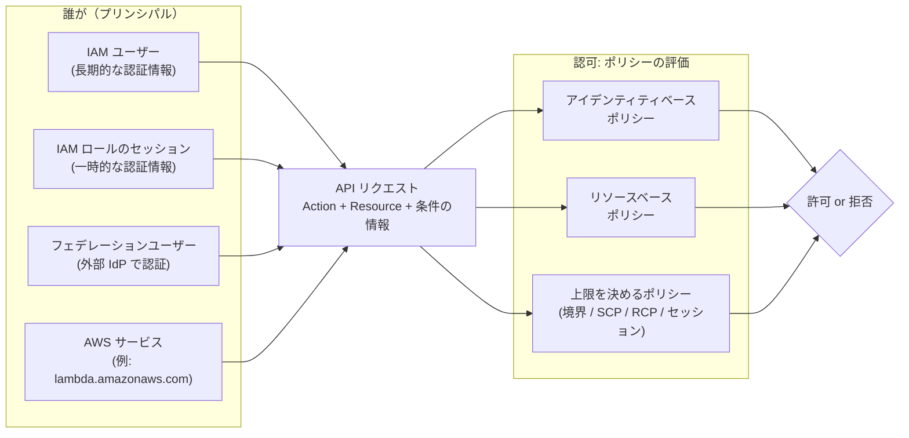
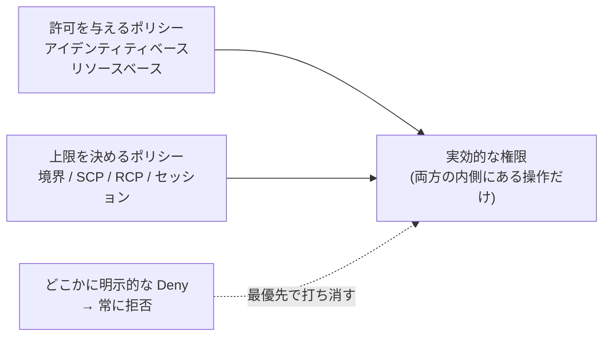
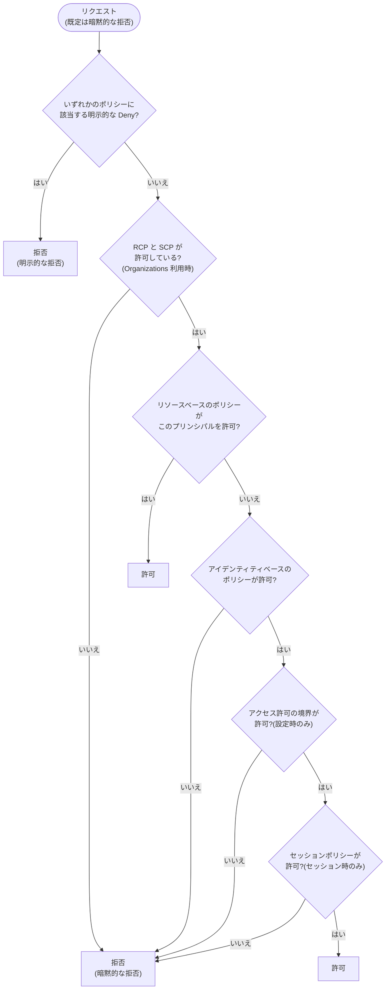
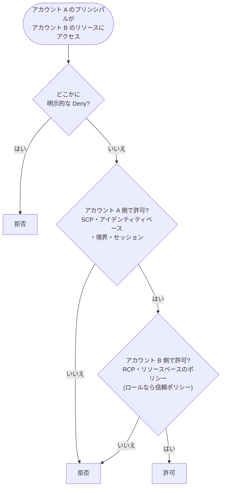
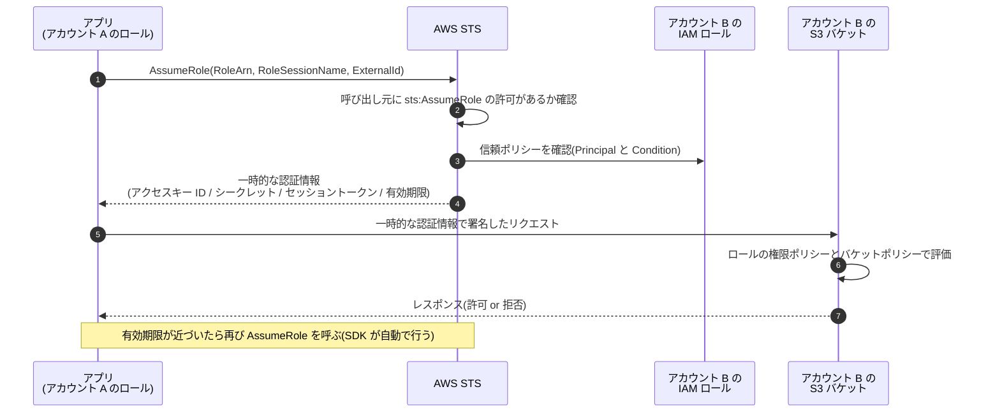
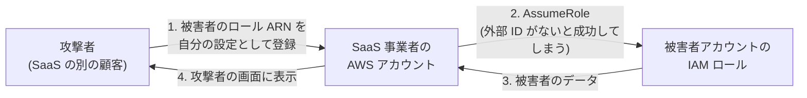
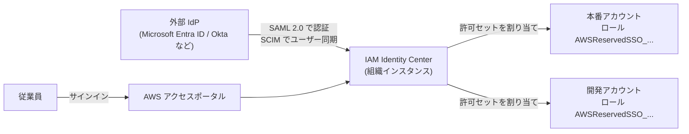

[ホーム](../README.md) > [Phase 2: アソシエイト](README.md) > IAM 徹底解説

# IAM 徹底解説

> **この章のゴール**
> - プリンシパル・ユーザー・グループ・ロール・ポリシーの関係を説明できる
> - 7 種類のポリシーを「許可を与えるもの」と「上限を決めるだけのもの」に分けて説明できる
> - JSON ポリシーを読み書きでき、主要な条件キー（aws:SourceVpce、aws:PrincipalOrgID など）を使い分けられる
> - ポリシー評価ロジックに沿って、あるリクエストが許可されるか拒否されるかを判定できる（同一アカウント / クロスアカウント）
> - IAM ロールと AWS STS の仕組みを理解し、クロスアカウントアクセスとフェデレーションを設計できる
> - IAM Access Analyzer などのツールで最小権限を維持する方法を説明できる
>
> **対応試験**: SAA-C03（第1分野: セキュアなアーキテクチャの設計）/ SAP-C03 の前提知識
> **目安時間**: 読む 150分 / 確認問題 30分（[Lab 01](../04-labs/lab01-secure-account.md) を含めて合計 約 5 時間）

## この章の全体像

AWS Identity and Access Management（IAM）は、「**誰が**（プリンシパル）」「**どのリソースに**」「**どの操作を**」「**どんな条件で**」実行できるかを制御するサービスです。
マネジメントコンソールでのクリックも、CLI や SDK からの呼び出しも、AWS の内部ではすべて API リクエストです。すべての API リクエストは、IAM による **認証**（あなたは誰か）と **認可**（その操作は許されているか）を通過して初めて実行されます。



IAM には次の特徴があります。

- **グローバルサービス**: IAM ユーザーやロールはリージョンに属しません（ARN にリージョンが入りません）。
- **追加料金なし**: IAM 自体は無料です（IAM Access Analyzer の一部機能などを除く）。
- **結果整合性**: IAM の変更は世界中に複製されるため、反映までにわずかな時間がかかることがあります。ポリシーを変更した直後に動作確認するスクリプトでは、少し待つ設計にします。

SAA-C03 の第1分野（30%）の中心であり、S3・KMS・VPC エンドポイント・Organizations など、ほかの章のセキュリティ設計はすべて IAM の理解が前提になります。
Phase 3 の [マルチアカウント戦略とガバナンス](../03-professional/02-multi-account-governance.md) と [大規模な ID とアクセス管理](../03-professional/03-identity-federation.md) も、この章の内容を土台にしています。

---

## 1. IAM の構成要素

### 1.1 認証と認可

| 段階 | 問い | 仕組みの例 |
|---|---|---|
| 認証（Authentication） | あなたは誰か | パスワード + MFA、アクセスキーによる署名（SigV4）、一時的な認証情報（セッショントークン付き） |
| 認可（Authorization） | その操作は許されているか | リクエストの内容をポリシーと照合する（ポリシー評価） |

認可の判定には「リクエストコンテキスト」が使われます。リクエストコンテキストには次の情報が含まれます。

- **プリンシパル**: 誰が呼び出したか（ARN、所属アカウント、所属組織、タグなど）
- **アクション**: 何をしようとしているか（例: `s3:GetObject`）
- **リソース**: 何に対してか（例: `arn:aws:s3:::example-bucket/report.csv`）
- **環境データ**: 送信元 IP、経由した VPC エンドポイント、時刻、TLS の有無、MFA の有無、呼び出し先リージョンなど
- **リソースのデータ**: 対象リソースのタグなど

ポリシーの `Condition` 要素は、このリクエストコンテキストの値（条件キー）を参照して判定します（3 節）。

### 1.2 プリンシパルの種類

プリンシパルとは「AWS のリソースに対してアクションを実行できる主体」です。

| プリンシパル | 認証情報 | 主な用途 | ポリシーでの指定例 |
|---|---|---|---|
| ルートユーザー | メールアドレス + パスワード（+ MFA） | アカウントの作成と、ルートユーザーにしかできない一部のタスク | ― （通常は指定しない） |
| IAM ユーザー | パスワード / アクセスキー（長期的） | フェデレーションを使えない例外的な用途 | `arn:aws:iam::123456789012:user/alice` |
| IAM ロールのセッション | 一時的な認証情報 | ワークロード、クロスアカウント、フェデレーション | `arn:aws:iam::123456789012:role/AppRole` |
| フェデレーションユーザー | 外部 IdP での認証 → 一時的な認証情報 | 従業員（IAM Identity Center）、アプリの利用者（Amazon Cognito） | IdP の ARN など |
| AWS サービス | ― | サービスがロールを引き受ける、リソースにアクセスする | `"Service": "lambda.amazonaws.com"` |
| 匿名（全員） | なし | 公開リソース | `"*"` |

> [!WARNING]
> **ひっかけ注意**: ポリシーの `Principal` に `arn:aws:iam::123456789012:root` と書くと、「ルートユーザーだけ」ではなく「**そのアカウント全体**（アカウントの管理者が IAM ポリシーで許可したプリンシパル）」を意味します。
> また、**IAM グループはプリンシパルではありません**。リソースベースのポリシーの `Principal` にグループを指定することはできません。

### 1.3 ルートユーザー

ルートユーザーは、アカウント作成時のメールアドレスでサインインする「すべての権限を持つ」ID です。IAM ポリシーでは制限できません（Organizations のメンバーアカウントであれば SCP で制限できます）。

**守り方**
- 強力なパスワードと MFA を設定する（AWS はルートユーザーの MFA を段階的に必須化しています）
- ルートユーザーのアクセスキーは作成しない
- 日常の作業には使わない。連絡先情報（代替連絡先）を最新にしておく
- Organizations を使う場合は、メンバーアカウントのルート認証情報を一元管理（削除）する機能も利用できます（詳細は Phase 3）

**ルートユーザーでしか実行できない主なタスク**（試験で問われます）

- アカウント設定の変更（ルートユーザーのメールアドレスやパスワード、アカウント名など）
- AWS アカウントの解約
- AWS サポートプランの変更
- S3 バケットの **MFA 削除（MFA Delete）** の有効化
- 誤って「すべてのプリンシパルを拒否」してしまった S3 バケットポリシーや SQS キューポリシーの修正・削除
- IAM ユーザーが請求情報にアクセスできるようにする設定の有効化

> [!TIP]
> **試験のポイント**: 「ルートユーザーの認証情報を使う必要があるタスクはどれか」という問題では、上のリストを選びます。
> 「EC2 インスタンスの起動」や「IAM ユーザーの作成」は管理者権限の IAM プリンシパルで実行できるため、ルートユーザーは不要です。

### 1.4 IAM ユーザーとグループ

**IAM ユーザー** は長期的な認証情報を持つ ID です。

| 認証情報 | 用途 | ポイント |
|---|---|---|
| パスワード | マネジメントコンソール | パスワードポリシー（長さ・複雑さ・有効期限）を設定できる |
| アクセスキー | CLI / SDK / API | **1 ユーザー最大 2 つ**（ローテーションのため: 新キー作成 → 切り替え → 旧キーを無効化 → 削除）。長期キーは `AKIA` で始まる |
| MFA デバイス | 追加の認証 | 仮想 MFA（認証アプリ）、FIDO2 パスキー / セキュリティキー、ハードウェア TOTP トークン。1 ユーザーに最大 8 台 |

現在の AWS の推奨は、「**人はフェデレーション（IAM Identity Center）で一時的な認証情報を使う**」「**ワークロードは IAM ロールを使う**」です。IAM ユーザーは、フェデレーションを使えない例外的な用途に限定します。

> [!NOTE]
> この教材の学習用アカウントでは、無料プランのクレジットを維持するため、Phase 1〜2 は [Lab 01](../04-labs/lab01-secure-account.md) のとおり **MFA を設定した管理者の IAM ユーザー** で作業し、Phase 3 の Lab 10 で Organizations + IAM Identity Center に移行します（無料プランのアカウントが組織を作成・参加するとクレジットが失効するため）。
> 実際の企業では、最初から Organizations + IAM Identity Center を使うのが標準のベストプラクティスです。

**IAM グループ** は IAM ユーザーの集合で、グループにアタッチしたポリシーは所属ユーザー全員に適用されます。

- グループの中にグループは入れられません（ネスト不可）
- 1 人のユーザーは最大 10 グループまで所属できます
- グループはプリンシパルではないため、グループとして認証したり、`Principal` に指定したりはできません

### 1.5 IAM ロール

IAM ロールは、**誰か（または何か）が「引き受ける（AssumeRole）」ことで一時的に使う ID** です。ロール自体は長期的な認証情報を持ちません。引き受けると、AWS Security Token Service（AWS STS）が **有効期限付きの一時的な認証情報** を発行します。

ロールには 2 種類のポリシーが付きます。

| ポリシー | 役割 | 種類 |
|---|---|---|
| **信頼ポリシー**（trust policy） | 誰がこのロールを引き受けられるか | リソースベースのポリシー（ロールがリソース） |
| **権限ポリシー**（permissions policy） | 引き受けた後に何ができるか | アイデンティティベースのポリシー |

代表的な使い方は、EC2 や Lambda などのワークロード、クロスアカウントアクセス、フェデレーション、緊急時の権限昇格（ブレークグラス）です。詳しくは 5 節で解説します。

### 1.6 ポリシーと ARN

ポリシーは JSON 形式の文書です。リソースは **ARN（Amazon Resource Name）** で指定します。

```text
arn:パーティション:サービス:リージョン:アカウントID:リソース
```

| リソース | ARN の例 | ポイント |
|---|---|---|
| IAM ロール | `arn:aws:iam::123456789012:role/AppRole` | IAM はグローバルなのでリージョンが空 |
| S3 バケット | `arn:aws:s3:::example-bucket` | リージョンもアカウント ID も空（バケット名はグローバルで一意） |
| S3 オブジェクト | `arn:aws:s3:::example-bucket/logs/app.log` | バケット ARN + `/` + キー |
| EC2 インスタンス | `arn:aws:ec2:ap-northeast-1:123456789012:instance/i-0123456789abcdef0` | リージョンとアカウントを含む |
| 引き受け中のロールのセッション | `arn:aws:sts::123456789012:assumed-role/AppRole/session-name` | CloudTrail に記録される呼び出し元 |

パーティションは通常 `aws` です（中国リージョンは `aws-cn`、GovCloud は `aws-us-gov`）。

### 1.7 覚えておきたいクォータ

| 項目 | 既定値（2026年9月時点） |
|---|---|
| IAM ユーザー数 / アカウント | 5,000 |
| 1 ユーザーが所属できるグループ数 | 10 |
| 1 つの ID（ユーザー・グループ・ロール）にアタッチできる管理ポリシー数 | 10（引き上げ可能） |
| カスタマー管理ポリシーのサイズ | 6,144 文字（空白を除く） |
| カスタマー管理ポリシーのバージョン数 | 5 |

最新の値は [IAM と AWS STS のクォータ](https://docs.aws.amazon.com/IAM/latest/UserGuide/reference_iam-quotas.html) で確認してください。

---

## 2. ポリシーの種類

### 2.1 7 種類のポリシーと「許可を与えるかどうか」

IAM を理解するうえで最も重要なのは、ポリシーには **許可を与えるもの** と **上限（ガードレール）を決めるだけのもの** がある、という区別です。

| # | ポリシーの種類 | アタッチ先 | 許可を与えるか | 主な用途 |
|---|---|---|---|---|
| 1 | アイデンティティベースのポリシー | IAM ユーザー・グループ・ロール | **与える** | 日常的な権限付与 |
| 2 | リソースベースのポリシー | S3 バケット、SQS キュー、KMS キー、Lambda 関数、ロールの信頼ポリシーなど | **与える**（`Principal` で指定した相手に） | クロスアカウント共有、サービスからの呼び出し許可 |
| 3 | アクセス許可の境界 | IAM ユーザー・ロール | 与えない（上限のみ） | 権限管理の委任、特権昇格の防止 |
| 4 | SCP（サービスコントロールポリシー） | Organizations のルート / OU / アカウント | 与えない（上限のみ） | 組織全体のガードレール（プリンシパル側） |
| 5 | RCP（リソースコントロールポリシー） | Organizations のルート / OU / アカウント | 与えない（上限のみ） | 組織全体のガードレール（リソース側） |
| 6 | セッションポリシー | AssumeRole などの呼び出し時にパラメーターで渡す | 与えない（上限のみ） | そのセッションだけ権限をさらに絞る |
| 7 | ACL（アクセスコントロールリスト） | S3 バケット / オブジェクトなど | **与える**（他アカウントに） | レガシー。S3 では原則として無効化 |

それぞれで「できること」と「できないこと」を整理します。

| ポリシー | できること | できないこと・注意点 |
|---|---|---|
| アイデンティティベース | アタッチした ID に対する許可・拒否 | `Principal` 要素は書けない。他アカウントのリソースにアクセスするには、相手側のリソースベースのポリシーでも許可が必要 |
| リソースベース | `Principal` で指定した相手（他アカウントや AWS サービスを含む）に対する許可・拒否 | 対応するサービスのリソースにしか付けられない。常にインライン（リソースに埋め込み） |
| アクセス許可の境界 | ユーザー・ロールが持てる権限の上限を設定 | それ自体では何も許可しない。グループには設定できない |
| SCP | メンバーアカウントの IAM ユーザー・ロール（**ルートユーザーを含む**）の上限を設定 | 何も許可しない。**管理アカウントには効かない**。**サービスにリンクされたロールには効かない**。組織外のプリンシパルがリソースベースのポリシー経由でアクセスする場合は制限できない |
| RCP | メンバーアカウントの **リソース** に対する上限を設定（組織外のプリンシパルからのアクセスも制限できる） | 何も許可しない。対応サービスが限られる（S3、STS、KMS、SQS、Secrets Manager など）。管理アカウントのリソースには効かない |
| セッションポリシー | そのセッションの権限を、ロール（またはユーザー）の権限の範囲内でさらに絞る | 何も許可しない（元の権限との共通部分だけが有効） |
| ACL | 他アカウントへの簡易な許可 | JSON 形式ではなく、条件を書けない。新しい S3 バケットでは既定で無効 |

> [!IMPORTANT]
> **アクセス許可の境界・SCP・RCP・セッションポリシーは「許可を与えない」**。これらは「ここまでなら許可してよい」という上限を決めるだけです。
> 実際に操作できるのは、**アイデンティティベース（または リソースベース）のポリシーで許可され、かつ すべての上限の内側にある** 操作だけです。



### 2.2 アイデンティティベースのポリシー（AWS 管理 / カスタマー管理 / インライン）

| 観点 | AWS 管理ポリシー | カスタマー管理ポリシー | インラインポリシー |
|---|---|---|---|
| 作成・更新 | AWS | 自分 | 自分 |
| 再利用 | 複数の ID にアタッチできる | 複数の ID にアタッチできる | 1 つの ID に埋め込む（1 対 1） |
| 変更管理 | AWS が更新する（新しいアクションが自動で追加されることもある） | 最大 5 バージョンを保持し、ロールバックできる | バージョン管理なし |
| ID を削除したとき | 残る | 残る | ID と一緒に削除される |
| 使いどころ | 利用開始時、職務機能ポリシー（`ReadOnlyAccess`、`ViewOnlyAccess` など） | **最小権限の本番運用** | 特定の ID だけに厳密に紐付けたい例外的な権限 |

> [!TIP]
> **試験のポイント**: 「複数のユーザー・ロールで同じ権限を再利用し、変更履歴を管理したい」→ **カスタマー管理ポリシー**。
> 「AWS 管理ポリシーで開始し、実際の利用状況から最小権限に絞り込む」→ **IAM Access Analyzer のポリシー生成**（9 節）。

### 2.3 リソースベースのポリシー

リソースに直接付けるポリシーで、**`Principal` 要素で「誰に」許可するかを指定** します。代表例は次のとおりです。

- S3 バケットポリシー、SQS キューポリシー、SNS トピックポリシー
- KMS キーポリシー、Secrets Manager のリソースポリシー、ECR リポジトリポリシー
- Lambda 関数のリソースベースのポリシー（例: S3 や API Gateway からの呼び出し許可）
- API Gateway のリソースポリシー、VPC エンドポイントポリシー
- **IAM ロールの信頼ポリシー**（ロールという「リソース」を誰が引き受けられるか）

> [!NOTE]
> KMS キーポリシーは特別です。キーポリシーが「このアカウント（の IAM ポリシー）に委任する」ステートメントを含んでいない場合、**IAM ポリシーでいくら許可しても KMS キーは使えません**。詳しくは [セキュリティサービス](12-security-services.md) の章で解説します。

### 2.4 アクセス許可の境界

アクセス許可の境界（permissions boundary）は、IAM ユーザーまたはロールに設定する管理ポリシーで、その ID が持てる権限の **上限** を決めます。

**実効的な権限 = アイデンティティベースのポリシー ∩ アクセス許可の境界**

典型的な用途は「**権限管理の委任**」です。たとえば、開発者に Lambda 用の IAM ロールを自分で作らせたいが、開発者が「管理者権限を持つロール」を作って特権を昇格させることは防ぎたい、という場面です。

**境界ポリシー（DevBoundary）**: 開発者が作るロールに許す上限

```json
{
  "Version": "2012-10-17",
  "Statement": [
    {
      "Sid": "AllowAppServicesOnly",
      "Effect": "Allow",
      "Action": [
        "s3:*",
        "dynamodb:*",
        "sqs:*",
        "logs:*",
        "cloudwatch:*",
        "xray:*"
      ],
      "Resource": "*"
    }
  ]
}
```

**開発者に付与するポリシー**: 「境界を付けたロールしか作れない・操作できない」ようにする

```json
{
  "Version": "2012-10-17",
  "Statement": [
    {
      "Sid": "ManageAppRolesOnlyWithBoundary",
      "Effect": "Allow",
      "Action": [
        "iam:CreateRole",
        "iam:PutRolePermissionsBoundary",
        "iam:AttachRolePolicy",
        "iam:DetachRolePolicy",
        "iam:PutRolePolicy",
        "iam:DeleteRolePolicy"
      ],
      "Resource": "arn:aws:iam::123456789012:role/app/*",
      "Condition": {
        "StringEquals": {
          "iam:PermissionsBoundary": "arn:aws:iam::123456789012:policy/DevBoundary"
        }
      }
    },
    {
      "Sid": "PassAppRolesToLambdaOnly",
      "Effect": "Allow",
      "Action": "iam:PassRole",
      "Resource": "arn:aws:iam::123456789012:role/app/*",
      "Condition": {
        "StringEquals": {
          "iam:PassedToService": "lambda.amazonaws.com"
        }
      }
    },
    {
      "Sid": "DenyBoundaryTampering",
      "Effect": "Deny",
      "Action": [
        "iam:DeleteRolePermissionsBoundary",
        "iam:CreatePolicyVersion",
        "iam:SetDefaultPolicyVersion",
        "iam:DeletePolicy"
      ],
      "Resource": [
        "arn:aws:iam::123456789012:role/*",
        "arn:aws:iam::123456789012:policy/DevBoundary"
      ]
    }
  ]
}
```

ポイントは 3 つです。

1. `iam:PermissionsBoundary` 条件キーで、「DevBoundary を境界に設定したロール」しか作成・変更できないようにする
2. `iam:PassRole` を `app/` パスのロールと Lambda に限定する（5.7 節）
3. 境界の削除や、境界ポリシー自体の書き換えを明示的に拒否する

こうすると、開発者がロールに `AdministratorAccess` をアタッチしても、実効的な権限は DevBoundary の範囲（S3・DynamoDB など）に収まります。

> [!TIP]
> **試験のポイント**: 「開発者に IAM ロールの作成を許可しつつ、自分より強い権限を付与できないようにしたい（特権昇格を防ぎたい）」→ **アクセス許可の境界** と `iam:PermissionsBoundary` 条件。
> 「組織内の全アカウントで上限を決めたい」なら境界ではなく **SCP** です。

### 2.5 SCP と RCP（AWS Organizations）

AWS Organizations の SCP と RCP は、**組織・OU・アカウント単位で適用するガードレール** です。どちらも許可を与えず、上限だけを決めます。

| 観点 | SCP（サービスコントロールポリシー） | RCP（リソースコントロールポリシー） |
|---|---|---|
| 制限の対象 | メンバーアカウントの **プリンシパル**（IAM ユーザー・ロール、ルートユーザー） | メンバーアカウントの **リソース** |
| 組織外のプリンシパルからのアクセス | 制限できない | **制限できる** |
| 代表的な使い方 | 許可リージョンの制限、CloudTrail や GuardDuty の停止を禁止、ルートユーザーの利用禁止 | 組織外からの S3 / KMS / SQS へのアクセスを禁止、TLS 通信の強制 |
| 効かない対象 | 管理アカウント、サービスにリンクされたロール | 管理アカウントのリソース |
| 登場 | 従来から | 2024年11月 |

SCP と RCP を組み合わせると、「自組織のプリンシパルが、自組織のリソースに、想定したネットワークからだけアクセスできる」という **データ境界（data perimeter）** を組織全体に強制できます。
設計の詳細は Phase 3 の [マルチアカウント戦略とガバナンス](../03-professional/02-multi-account-governance.md)、実習は [Lab 10](../04-labs/lab10-organizations-scp.md) で扱います。

### 2.6 セッションポリシー

セッションポリシーは、`AssumeRole`、`AssumeRoleWithSAML`、`AssumeRoleWithWebIdentity`、`GetFederationToken` を呼び出すときにパラメーターとして渡すポリシーです。
**そのセッションの権限 = ロールの権限ポリシー ∩ セッションポリシー** になります。

典型例は、マルチテナントの SaaS です。1 つの共通ロールを用意し、アプリがテナントごとに「そのテナントの S3 プレフィックスだけ」に絞ったセッションポリシーを付けて引き受けることで、ロールをテナント数だけ作らずに済みます。

### 2.7 ACL

ACL は JSON ではない、最も古いタイプのアクセス制御です。代表例は S3 のバケット ACL / オブジェクト ACL です。
2023年4月以降に作成する S3 バケットは、既定で **オブジェクト所有者が「バケット所有者の強制」** になり、ACL は無効です。現在はバケットポリシーと IAM ポリシーで制御するのが原則です（詳細は [Amazon S3](05-s3.md) の章）。

> [!NOTE]
> VPC の **ネットワーク ACL** は名前が似ていますが、IAM のポリシーではなくサブネット単位のパケットフィルタです（[VPC とネットワーク設計](02-vpc.md) の章）。

---

## 3. ポリシーの文法

### 3.1 基本構造

**例 1**: S3 バケットのレポートを読み取るための、最も基本的なアイデンティティベースのポリシーです。

```json
{
  "Version": "2012-10-17",
  "Statement": [
    {
      "Sid": "ListReportsBucket",
      "Effect": "Allow",
      "Action": "s3:ListBucket",
      "Resource": "arn:aws:s3:::example-reports"
    },
    {
      "Sid": "ReadReportObjects",
      "Effect": "Allow",
      "Action": "s3:GetObject",
      "Resource": "arn:aws:s3:::example-reports/*"
    }
  ]
}
```

| 要素 | 必須か | 説明 |
|---|---|---|
| `Version` | 事実上必須 | 常に `"2012-10-17"` を書く（古い `2008-10-17` ではポリシー変数などが使えない） |
| `Statement` | 必須 | 1 つ以上のステートメントの配列 |
| `Sid` | 任意 | ステートメントの識別名 |
| `Effect` | 必須 | `Allow` または `Deny` |
| `Principal` / `NotPrincipal` | リソースベースのポリシーでは必須 | 誰に対する許可・拒否か（アイデンティティベースのポリシーには書けない） |
| `Action` / `NotAction` | どちらか必須 | `サービス:API名`（例: `s3:GetObject`）。`*` のワイルドカードを使える |
| `Resource` / `NotResource` | アイデンティティベースでは必須 | 対象の ARN。ワイルドカードを使える |
| `Condition` | 任意 | 条件（演算子・条件キー・値） |

> [!WARNING]
> **ひっかけ注意**: `s3:ListBucket` の対象は **バケット**（`arn:aws:s3:::example-reports`）、`s3:GetObject` の対象は **オブジェクト**（`arn:aws:s3:::example-reports/*`）です。
> 両方をオブジェクトの ARN だけで書くと、一覧表示が AccessDenied になります。アクションごとに「どのリソースタイプが対象か」は、サービス認可リファレンスで確認できます。

### 3.2 NotAction / NotResource / NotPrincipal

「〜以外」を表す要素です。`Effect` との組み合わせで意味が大きく変わります。

| 組み合わせ | 意味 | 使いどころ・注意 |
|---|---|---|
| `Allow` + `NotAction` | 列挙した以外の **すべてを許可** | 危険。例: AWS 管理ポリシー `PowerUserAccess` は IAM や Organizations などを除いたほぼ全権限を与える |
| `Deny` + `NotAction` | 列挙した以外の **すべてを拒否** | リージョン制限でグローバルサービスを除外する（例 5） |
| `NotResource` | 指定した以外のリソース | 「このバケット以外への書き込みを拒否」など |
| `NotPrincipal` | 指定した以外のプリンシパル | 挙動が分かりにくいため、現在は `Condition` の `aws:PrincipalArn` などで代替するのが推奨 |

> [!WARNING]
> **ひっかけ注意**: `Deny` + `NotAction` は、列挙したアクションを **許可するわけではありません**。「拒否の対象から外す」だけです。実際に使うには、別途 `Allow` が必要です。

### 3.3 Condition の書き方と評価ルール

```json
"Condition": {
  "条件演算子": {
    "条件キー": ["値1", "値2"]
  }
}
```

- **1 つの条件キーに複数の値** → いずれかに一致すればよい（**OR**）
- **複数の条件キー、複数の条件演算子** → すべて満たす必要がある（**AND**）

| 演算子 | 例 | 用途 |
|---|---|---|
| 文字列 | `StringEquals`、`StringNotEquals`、`StringLike`（`*` と `?` が使える） | タグ、リージョン、組織 ID |
| 数値・日付 | `NumericLessThan`、`DateGreaterThan` | MFA からの経過秒数、期間限定の許可 |
| 真偽値 | `Bool` | `aws:SecureTransport`、`aws:MultiFactorAuthPresent` |
| IP アドレス | `IpAddress`、`NotIpAddress` | `aws:SourceIp` |
| ARN | `ArnEquals`、`ArnLike`、`ArnNotLike` | `aws:PrincipalArn`、`aws:SourceArn` |
| キーの有無 | `Null` | タグが付いているかどうか |
| 修飾子 | `...IfExists`（キーがなければ条件を無視）、`ForAnyValue:` / `ForAllValues:`（複数値のキー） | `aws:TagKeys` など |

> [!IMPORTANT]
> **条件キーがリクエストに存在しない場合**、肯定の演算子（`StringEquals` など）は「不一致（false）」になりますが、**否定の演算子（`StringNotEquals`、`NotIpAddress`、`ArnNotLike` など）は「true」** になります。
> そのため `Deny` + `StringNotEquals` の組み合わせは、キーを持たないリクエスト（例: VPC エンドポイントを経由しないコンソール操作）も拒否します。例 4 の「締め出し」の原因がこれです。

**ポリシー変数** を使うと、1 つのポリシーを多数のユーザーで共有できます。たとえば `"Resource": "arn:aws:s3:::example-home/${aws:username}/*"` と書けば、各ユーザーが自分の名前のプレフィックスだけを使えるようになります。`${aws:PrincipalTag/Project}` のようにタグも参照できます（8 節の ABAC）。

### 3.4 主な条件キー

| 条件キー | 意味 | 典型的な使い方 | 注意点 |
|---|---|---|---|
| `aws:SourceIp` | リクエスト元のパブリック IP | 社内 IP 以外からの操作を拒否 | VPC エンドポイント経由のリクエストでは判定に使えない（`aws:SourceVpce` / `aws:SourceVpc` / `aws:VpcSourceIp` を使う）。AWS サービスが代理で呼ぶ操作を壊さないよう `aws:ViaAWSService` と併用する |
| `aws:SourceVpce` | 経由した VPC エンドポイントの ID | S3 バケットを特定のエンドポイント経由のアクセスに限定 | エンドポイント経由のリクエストにだけ存在する |
| `aws:SourceVpc` | 経由した VPC の ID | 特定 VPC からのアクセスに限定 | 同上 |
| `aws:PrincipalOrgID` | 呼び出し元が属する組織の ID | リソースベースのポリシーで「自組織のプリンシパルだけ」に許可 | アカウント ID を列挙せずに済み、アカウント追加時も更新不要 |
| `aws:PrincipalArn` | 呼び出し元の ARN（ロールの場合はロールの ARN） | 特定の管理用ロールだけを例外にする | ― |
| `aws:SecureTransport` | TLS（HTTPS）で送信されたか | `"false"` のときに Deny して HTTPS を強制 | ― |
| `aws:MultiFactorAuthPresent` | MFA で認証したか | 重要な操作に MFA を要求 | 長期アクセスキーによるリクエストにはこのキーが存在しない。Deny で使うなら `BoolIfExists` |
| `aws:RequestedRegion` | 呼び出し先のリージョン | 利用リージョンの制限 | IAM などのグローバルサービスは `us-east-1` への呼び出しとして扱われる → `NotAction` で除外（例 5） |
| `aws:PrincipalTag/キー` | 呼び出し元に付いたタグ | ABAC | ― |
| `aws:ResourceTag/キー` | 対象リソースのタグ | ABAC | ― |
| `aws:RequestTag/キー`、`aws:TagKeys` | リクエストで付けようとしているタグ | 作成時のタグ付けを強制 | ― |
| `aws:SourceArn`、`aws:SourceAccount` | AWS サービスが代理で呼ぶときの発生元 | サービス間の「混乱した代理」の防止（6.3 節） | ― |
| `aws:ResourceOrgID` | 対象リソースが属する組織の ID | VPC エンドポイントポリシーで「自組織のリソースだけ」に限定 | ― |
| `aws:ViaAWSService`、`aws:CalledVia` | AWS サービス経由の呼び出しか | IP 制限の例外、特定サービス経由のみ許可 | ― |

### 3.5 ポリシーの例

**例 2: 条件付きのアイデンティティベースのポリシー**（MFA 認証から 1 時間以内、東京リージョン、`Environment=dev` タグのインスタンスだけ起動・停止できる）

```json
{
  "Version": "2012-10-17",
  "Statement": [
    {
      "Sid": "DescribeAll",
      "Effect": "Allow",
      "Action": "ec2:Describe*",
      "Resource": "*"
    },
    {
      "Sid": "OperateDevInstancesWithRecentMfa",
      "Effect": "Allow",
      "Action": ["ec2:StartInstances", "ec2:StopInstances", "ec2:RebootInstances"],
      "Resource": "arn:aws:ec2:ap-northeast-1:123456789012:instance/*",
      "Condition": {
        "StringEquals": { "aws:ResourceTag/Environment": "dev" },
        "Bool": { "aws:MultiFactorAuthPresent": "true" },
        "NumericLessThan": { "aws:MultiFactorAuthAge": "3600" }
      }
    }
  ]
}
```

3 つの条件演算子は AND で評価されます。`ec2:Describe*` はリソースレベルの権限に対応していないため `"Resource": "*"` にしています。

**例 3: 社内ネットワーク以外からの操作を拒否**（AWS の公式例と同じ考え方）

```json
{
  "Version": "2012-10-17",
  "Statement": [
    {
      "Sid": "DenyOutsideCorporateNetwork",
      "Effect": "Deny",
      "Action": "*",
      "Resource": "*",
      "Condition": {
        "NotIpAddress": { "aws:SourceIp": ["192.0.2.0/24", "203.0.113.0/24"] },
        "Bool": { "aws:ViaAWSService": "false" }
      }
    }
  ]
}
```

`aws:ViaAWSService` の条件がないと、CloudFormation などの AWS サービスがユーザーに代わって API を呼んだとき（送信元はサービスの IP）にも拒否されてしまいます。

**例 4: S3 バケットポリシーで、特定の VPC エンドポイント経由と HTTPS 以外を拒否**

```json
{
  "Version": "2012-10-17",
  "Statement": [
    {
      "Sid": "DenyInsecureTransport",
      "Effect": "Deny",
      "Principal": "*",
      "Action": "s3:*",
      "Resource": ["arn:aws:s3:::example-confidential", "arn:aws:s3:::example-confidential/*"],
      "Condition": {
        "Bool": { "aws:SecureTransport": "false" }
      }
    },
    {
      "Sid": "DenyUnlessFromAppVpce",
      "Effect": "Deny",
      "Principal": "*",
      "Action": "s3:*",
      "Resource": ["arn:aws:s3:::example-confidential", "arn:aws:s3:::example-confidential/*"],
      "Condition": {
        "StringNotEquals": { "aws:SourceVpce": "vpce-0a1b2c3d4e5f67890" },
        "ArnNotLike": { "aws:PrincipalArn": "arn:aws:iam::123456789012:role/BreakGlassAdmin" }
      }
    }
  ]
}
```

- 2 つ目のステートメントにより、指定したエンドポイント（`vpce-...`）を経由しないリクエストはすべて拒否されます。VPC の CIDR を `aws:SourceIp` で指定する方法は機能しません（エンドポイント経由のリクエストはパブリック IP で判定できないため）。
- `Deny` だけでは誰にも許可を与えません。アプリの IAM ロールには、別途アイデンティティベースのポリシーで `s3:GetObject` などを許可します。
- `ArnNotLike` の例外がないと、マネジメントコンソールから操作する管理者も締め出されます。すべてのプリンシパルを拒否するバケットポリシーを直せるのはルートユーザーだけなので、緊急用ロールの例外を用意しておきます。

**例 5: 東京・大阪以外のリージョンでの操作を拒否**（SCP として組織に適用する想定）

```json
{
  "Version": "2012-10-17",
  "Statement": [
    {
      "Sid": "DenyOutsideTokyoAndOsaka",
      "Effect": "Deny",
      "NotAction": [
        "iam:*", "organizations:*", "sts:*", "route53:*", "route53domains:*",
        "cloudfront:*", "globalaccelerator:*", "waf:*", "wafv2:*", "shield:*",
        "support:*", "trustedadvisor:*", "health:*", "budgets:*", "ce:*",
        "cur:*", "pricing:*", "kms:*", "acm:*"
      ],
      "Resource": "*",
      "Condition": {
        "StringNotEquals": { "aws:RequestedRegion": ["ap-northeast-1", "ap-northeast-3"] },
        "ArnNotLike": { "aws:PrincipalArn": "arn:aws:iam::*:role/OrgSecurityAdmin" }
      }
    }
  ]
}
```

- IAM、Route 53、CloudFront などのグローバルサービスへの呼び出しは `us-east-1` として扱われるため、`Action: "*"` にするとこれらまで使えなくなります。`NotAction` で拒否の対象から外すのが定石です。
- `acm:*` を除外しているのは、CloudFront で使う証明書を `us-east-1` の ACM で管理する必要があるためです。
- 除外リストは公式の例から一部を抜粋したものです。実際には [SCP の例](https://docs.aws.amazon.com/organizations/latest/userguide/orgs_manage_policies_scps_examples.html) の最新のリストを使ってください。AWS Control Tower を使う場合は、リージョン拒否のコントロールを有効にする方法もあります。

**例 6: 自組織のプリンシパルだけに読み取りを許可する S3 バケットポリシー**

```json
{
  "Version": "2012-10-17",
  "Statement": [
    {
      "Sid": "AllowReadFromMyOrganization",
      "Effect": "Allow",
      "Principal": "*",
      "Action": "s3:GetObject",
      "Resource": "arn:aws:s3:::example-shared-artifacts/*",
      "Condition": {
        "StringEquals": { "aws:PrincipalOrgID": "o-a1b2c3d4e5" }
      }
    }
  ]
}
```

アカウント ID を列挙しないため、組織にアカウントが増えてもバケットポリシーを変更する必要がありません。

> [!TIP]
> **試験のポイント**: 「組織内のすべてのアカウントに S3 バケットへのアクセスを許可し、アカウントが追加されてもポリシーを変更したくない」→ バケットポリシーで **`aws:PrincipalOrgID`**。
> 「VPC エンドポイント経由のアクセスだけに制限」→ バケットポリシーで **`aws:SourceVpce`**（VPC 単位なら `aws:SourceVpc`）。

---

## 4. ポリシー評価ロジック

### 4.1 3 つの原則

1. **既定はすべて拒否**（暗黙的な拒否）。ルートユーザーを除き、何も許可されていなければ拒否されます。
2. **明示的な許可（Allow）は暗黙的な拒否を上書きする**。
3. **明示的な拒否（Deny）はどんな許可よりも優先する**。どのポリシーのどこかに該当する Deny が 1 つでもあれば、最終結果は拒否です。

### 4.2 同一アカウント内の評価フロー



- 同一アカウント内では、**アイデンティティベースのポリシーとリソースベースのポリシーのどちらか一方** で許可されていればアクセスできます（和集合）。
- RCP・SCP・境界・セッションポリシーは「許可されているか」ではなく「**上限の内側か**」を確認しているだけです。

> [!NOTE]
> 図は簡略化しています。リソースベースのポリシーが **IAM ユーザーの ARN や引き受け中のセッションの ARN** を直接指定して許可した場合は、境界やセッションポリシーの暗黙的な拒否に制限されません。一方、**ロールの ARN** を指定して許可した場合は、境界やセッションポリシーの制限を受けます。
> また、KMS キーのように「リソース側のポリシーが必須」のサービスもあります。正確な仕様は [ポリシーの評価論理](https://docs.aws.amazon.com/IAM/latest/UserGuide/reference_policies_evaluation-logic.html) を参照してください。

### 4.3 クロスアカウントの評価

別のアカウントのリソースにアクセスする場合は、**両方のアカウントで許可されている必要があります**（積集合）。



- 呼び出し元（アカウント A）の管理者が「自分のプリンシパルに外部へのアクセスを許すか」を決め、リソースの所有者（アカウント B）が「外部からのアクセスを受け入れるか」を決める、という二重の同意です。
- アカウント A の SCP は A のプリンシパルに、アカウント B の RCP は B のリソースに効きます。

### 4.4 判定の練習

| # | 状況 | 結果 | 理由 |
|---|---|---|---|
| 1 | ユーザーのポリシーで `s3:*` を Allow。同一アカウントのバケットにバケットポリシーはない | 許可 | 同一アカウントはどちらか一方の Allow でよい |
| 2 | ユーザーには何のポリシーもない。同一アカウントのバケットポリシーがそのユーザーの ARN に `s3:GetObject` を Allow | 許可 | リソースベースのポリシーだけで許可できる |
| 3 | ユーザーのポリシーで `s3:*` を Allow。バケットポリシーでそのユーザーを Deny | 拒否 | 明示的な拒否が最優先 |
| 4 | ロールに `AdministratorAccess`。アクセス許可の境界は S3 だけを Allow。ロールで EC2 を起動 | 拒否 | 境界の外側 |
| 5 | SCP は `ec2:*` だけを Allow（`FullAWSAccess` を外した許可リスト方式）。ユーザーのポリシーで `s3:*` を Allow | 拒否 | SCP の上限の外側 |
| 6 | アカウント A のロールで `s3:GetObject` を `"Resource": "*"` で Allow。アカウント B のバケットにバケットポリシーはない | 拒否 | クロスアカウントは B 側の許可も必要 |
| 7 | 管理アカウントの IAM ユーザー。組織のルートに `s3:*` を Deny する SCP | 許可（IAM ポリシーで許可されていれば） | SCP は管理アカウントに効かない |

> [!TIP]
> **試験のポイント**: 「管理者権限を持つのに操作が拒否される」問題では、**SCP・アクセス許可の境界・明示的な Deny（バケットポリシーなど）** のどれが原因かを探します。
> 「クロスアカウントで拒否される」問題では、**相手側のリソースベースのポリシー（または信頼ポリシー）** で許可されているかを確認します。

---

## 5. IAM ロールと AWS STS

### 5.1 信頼ポリシーと権限ポリシー

EC2 インスタンス用ロールの信頼ポリシーは次のとおりです。「EC2 というサービスがこのロールを引き受けてよい」という意味です。

```json
{
  "Version": "2012-10-17",
  "Statement": [
    {
      "Effect": "Allow",
      "Principal": { "Service": "ec2.amazonaws.com" },
      "Action": "sts:AssumeRole"
    }
  ]
}
```

権限ポリシー（例: DynamoDB の特定テーブルの読み書き）は、通常のアイデンティティベースのポリシーとしてロールにアタッチします。

### 5.2 AWS STS の主な API

| API | 呼び出す人・もの | 用途 | 有効期間（2026年9月時点） |
|---|---|---|---|
| `AssumeRole` | IAM ユーザー、ロール（同一 / 他アカウント） | ロールの引き受け、クロスアカウントアクセス | 15 分〜ロールの最大セッション時間（1〜12 時間で設定、既定 1 時間）。**ロールの連鎖**（ロールからさらにロールを引き受ける）では最大 1 時間 |
| `AssumeRoleWithSAML` | SAML 2.0 IdP で認証したユーザー | 従業員のフェデレーション | 同上 |
| `AssumeRoleWithWebIdentity` | OIDC IdP のトークンを持つユーザー・ワークロード | GitHub Actions、Kubernetes（IRSA）など | 同上 |
| `GetSessionToken` | IAM ユーザー | MFA 認証済みの一時的な認証情報の取得（MFA で保護された API 呼び出し） | 最大 36 時間（既定 12 時間） |
| `GetFederationToken` | IAM ユーザー（独自の認証プロキシ） | 独自実装のフェデレーション（レガシー） | 最大 36 時間 |
| `GetCallerIdentity` | 誰でも | 「今の自分は誰か」を確認 | ― （権限は不要で、ポリシーで拒否することもできない） |

### 5.3 一時的な認証情報

STS が返す一時的な認証情報は、**アクセスキー ID（`ASIA` で始まる）・シークレットアクセスキー・セッショントークン・有効期限** の 4 点セットです。

- 期限が来ると自動的に無効になるため、漏えいしたときの被害が時間的に限定されます。
- 発行済みのセッションを個別に取り消す API はありません。漏えい時は IAM コンソールの「アクティブなセッションを取り消す」を使います。これは、ある時刻より前に発行されたセッションを `aws:TokenIssueTime` 条件で拒否するインラインポリシーをロールに追加する仕組みです。

### 5.4 AssumeRole の流れ



ロールを引き受けている間、呼び出し元は **元の権限を使えず、ロールの権限だけ** を持ちます（6.1 節で重要になります）。

### 5.5 インスタンスプロファイル（EC2 にロールを渡す）

- EC2 にロールを渡すには、ロールを入れる箱である **インスタンスプロファイル** を使います（1 つのプロファイルに入るロールは 1 つ。コンソールでロールを作るとロールと同名のプロファイルが自動で作成されます）。
- インスタンス上のアプリは、SDK の既定の認証情報チェーンによって **インスタンスメタデータサービス（IMDS）** から一時的な認証情報を取得します。認証情報は期限前に自動で更新されます。
- IMDS は、セッショントークンを使う **IMDSv2 の必須化** が推奨です（SSRF 攻撃による認証情報の窃取対策。詳細は [Amazon EC2](03-ec2.md) の章）。
- 同じ考え方で、Lambda は **実行ロール**、ECS は **タスクロール**、EKS は **EKS Pod Identity** または IRSA でワークロードにロールを渡します（[サーバーレス](10-serverless.md)、[コンテナ](11-containers.md) の章）。

> [!WARNING]
> **ひっかけ注意**: 「EC2 上のアプリに AWS の認証情報を持たせたい」問題で、アクセスキーをソースコード・環境変数・AMI・ユーザーデータ・`~/.aws/credentials` に置く選択肢は、すべて不正解です。正解は **IAM ロール（インスタンスプロファイル）** です。

### 5.6 サービスロールとサービスにリンクされたロール

| 観点 | サービスロール | サービスにリンクされたロール |
|---|---|---|
| 作成者 | ユーザー（コンソールが作成を手伝う場合もある） | AWS サービス（機能を有効にしたときに自動作成されることが多い） |
| 権限の編集 | 自由に編集できる | 編集できない（サービスが定義） |
| 信頼ポリシー | 任意のサービスを指定 | 特定のサービスに固定 |
| 例 | Lambda の実行ロール、CodeBuild のサービスロール | `AWSServiceRoleForAutoScaling`、`AWSServiceRoleForElasticLoadBalancing` |
| SCP の影響 | 受ける | 受けない |

### 5.7 iam:PassRole ― 特権昇格を防ぐ門番

ユーザーが「サービスにロールを渡す」操作（EC2 にインスタンスプロファイルを付けて起動する、Lambda 関数にロールを設定する、など）をするには、そのロールに対する **`iam:PassRole`** の許可が必要です。

もし `iam:PassRole` の制限がなければ、権限の弱いユーザーでも「管理者ロールを付けた EC2 インスタンス」を起動し、そのインスタンス経由で管理者として操作できてしまいます。`iam:PassRole` は `Resource` で渡せるロールを限定し、`iam:PassedToService` 条件で渡し先のサービスを限定します（2.4 節の例）。

---

## 6. クロスアカウントアクセス

### 6.1 2 つの方式

| 観点 | ロールの引き受け（AssumeRole） | リソースベースのポリシー |
|---|---|---|
| 仕組み | 相手アカウントのロールを引き受け、そのロールとして操作 | 自分の ID のまま、相手のリソースのポリシーで許可される |
| 元の権限 | 引き受け中は使えない（ロールの権限だけ） | **保ったまま** 使える |
| 対応サービス | すべてのサービス | リソースベースのポリシーに対応したサービス（S3、SQS、SNS、KMS、Lambda、Secrets Manager など） |
| 典型例 | 監査・運用アカウントから各アカウントを管理する | アカウント A のバケットからアカウント B のバケットへコピーする（両方に同時にアクセスする必要がある） |
| 必要な設定 | A: `sts:AssumeRole` の許可 / B: 信頼ポリシー + 権限ポリシー | A: 対象操作の許可 / B: リソースベースのポリシー |

呼び出し元（アカウント A）に付けるポリシーの例です。

```json
{
  "Version": "2012-10-17",
  "Statement": [
    {
      "Effect": "Allow",
      "Action": "sts:AssumeRole",
      "Resource": "arn:aws:iam::222222222222:role/AuditReadOnly"
    }
  ]
}
```

アカウント B のロール `AuditReadOnly` の信頼ポリシーでは、`"Principal": { "AWS": "arn:aws:iam::111111111111:role/SecurityAuditor" }` のようにロールの ARN まで絞るか、アカウント（`:root`）を指定して A 側の IAM ポリシーに誰が使えるかを任せます。

### 6.2 外部 ID と「混乱した代理」問題

コスト分析や監視の SaaS 事業者（サードパーティー）が、多数の顧客アカウントのロールを引き受ける場面を考えます。



事業者は正規の権限で AssumeRole しているため、被害者のロールは事業者を信頼しています。攻撃者は事業者を「混乱させて」、自分に代わって被害者のデータを取らせています。これが **混乱した代理（confused deputy）** 問題です。

対策が **外部 ID（External ID）** です。

1. 事業者が顧客ごとに **一意の外部 ID を生成** して顧客に伝える（顧客に自由に決めさせない）
2. 顧客はロールの信頼ポリシーで、その外部 ID を条件にする
3. 事業者は AssumeRole のたびに、**その顧客の設定に紐付いた外部 ID** を渡す

攻撃者が被害者のロール ARN を登録しても、事業者が渡すのは攻撃者に割り当てた外部 ID なので、条件が一致せず失敗します。

```json
{
  "Version": "2012-10-17",
  "Statement": [
    {
      "Effect": "Allow",
      "Principal": { "AWS": "arn:aws:iam::111122223333:root" },
      "Action": "sts:AssumeRole",
      "Condition": {
        "StringEquals": { "sts:ExternalId": "c7e9d6a2-customer-0042" }
      }
    }
  ]
}
```

> [!TIP]
> **試験のポイント**: 「サードパーティーに自社アカウントへのアクセスを許可する。長期的な認証情報は渡さない。混乱した代理を防ぎたい」→ **事業者のアカウントを信頼する IAM ロール + `sts:ExternalId` 条件**。
> IAM ユーザーを作ってアクセスキーを渡す選択肢は不正解です。

### 6.3 サービス間の混乱した代理（aws:SourceArn / aws:SourceAccount）

AWS サービスがあなたの代わりにリソースへアクセスする場合も、同じ問題が起こりえます。たとえば「SNS から SQS へのメッセージ送信を許可」とだけ書くと、**他人の SNS トピック** からも送信できてしまいます。リソースベースのポリシーでは、`aws:SourceArn`（または `aws:SourceAccount`）で発生元を限定します。

```json
{
  "Version": "2012-10-17",
  "Statement": [
    {
      "Sid": "AllowOnlyMyOrderTopic",
      "Effect": "Allow",
      "Principal": { "Service": "sns.amazonaws.com" },
      "Action": "sqs:SendMessage",
      "Resource": "arn:aws:sqs:ap-northeast-1:123456789012:order-queue",
      "Condition": {
        "ArnEquals": { "aws:SourceArn": "arn:aws:sns:ap-northeast-1:123456789012:order-topic" }
      }
    }
  ]
}
```

---

## 7. フェデレーションの概要

### 7.1 選択肢の全体像

フェデレーションとは、外部の ID プロバイダー（IdP）で認証した利用者に、AWS の一時的な認証情報を渡す仕組みです。AWS 側に IAM ユーザーを作らないため、長期的な認証情報が生まれず、退職者のアクセスも IdP 側で一括して止められます。

| 方式 | 対象 | 仕組み | 使いどころ |
|---|---|---|---|
| **IAM Identity Center**（推奨） | 従業員（ワークフォース） | 外部 IdP / Active Directory / 内蔵ディレクトリ + 許可セット → 各アカウントのロール | 複数アカウントへのシングルサインオン |
| IAM の SAML 2.0 フェデレーション | 従業員 | IdP の SAML アサーション → `AssumeRoleWithSAML` | 単一アカウント、既存の構成 |
| IAM の OIDC フェデレーション | ワークロード（CI/CD、Kubernetes など） | OIDC トークン → `AssumeRoleWithWebIdentity` | GitHub Actions からのデプロイ |
| Amazon Cognito | アプリの利用者（顧客） | ユーザープール（認証）+ ID プール（AWS の認証情報） | モバイル / Web アプリ（[サーバーレス](10-serverless.md) の章） |
| IAM Roles Anywhere | AWS の外で動くサーバー | X.509 証明書 → 一時的な認証情報 | オンプレミスのサーバーから AWS API を呼ぶ |

### 7.2 IAM Identity Center（推奨）

IAM Identity Center（旧称 AWS SSO）は、**Organizations 配下の複数アカウントとアプリケーションへのアクセスを一元管理する** 推奨サービスです。



- **ID ソース**: Identity Center ディレクトリ、Active Directory（AWS Managed Microsoft AD / AD Connector 経由の自社 AD）、外部 IdP（SAML 2.0 + SCIM による自動プロビジョニング）のいずれか 1 つ。
- **許可セット**: ポリシーの組み合わせ（AWS 管理ポリシー、カスタマー管理ポリシーの参照、インラインポリシー、アクセス許可の境界）。「ユーザー / グループ × アカウント × 許可セット」を割り当てると、各アカウントに IAM ロールが自動でプロビジョニングされます。
- 利用者は AWS アクセスポータルからアカウントとロールを選ぶだけです。CLI も `aws configure sso` で一時的な認証情報を使えます。
- **組織インスタンス** と **アカウントインスタンス** があり、AWS アカウントへのアクセス（許可セット）を管理できるのは組織インスタンスだけです。
- 2026年2月には、複数リージョンへのレプリケーションが一般提供されました（当初は外部 IdP とマルチリージョン KMS キーが前提）。

大規模環境での設計（ID ソースの選択、委任管理、ABAC、信頼できる ID の伝播など）は Phase 3 の [大規模な ID とアクセス管理](../03-professional/03-identity-federation.md) で扱います。

> [!TIP]
> **試験のポイント**: 「既存の社内ディレクトリ（Active Directory や外部 IdP）の ID で、複数の AWS アカウントにシングルサインオンしたい。運用上のオーバーヘッドを最小にしたい」→ **IAM Identity Center**。
> 「モバイルアプリの利用者にサインアップ・サインイン機能を提供したい」→ **Amazon Cognito**（Identity Center ではない）。

### 7.3 SAML 2.0 フェデレーション（IAM）

IAM に SAML ID プロバイダーを登録し、IdP が発行した SAML アサーションで `AssumeRoleWithSAML` を呼び出す方式です。ロールの信頼ポリシーでは `"Principal": { "Federated": "arn:aws:iam::123456789012:saml-provider/ExampleIdP" }` と `"Action": "sts:AssumeRoleWithSAML"` を指定します。アカウントごとに IdP とロールを設定する必要があるため、複数アカウントでは Identity Center のほうが管理が楽です。

### 7.4 OIDC フェデレーションと GitHub Actions

CI/CD から AWS にデプロイするとき、IAM ユーザーのアクセスキーを CI の設定に保存するのは典型的なアンチパターンです。GitHub Actions は OIDC トークンを発行できるため、次のように **長期的な認証情報なしで** ロールを引き受けられます。

1. IAM に OIDC ID プロバイダー `token.actions.githubusercontent.com` を登録する
2. 次の信頼ポリシーを持つロールを作成する
3. ワークフローに `id-token: write` 権限を与え、公式アクション `aws-actions/configure-aws-credentials` でロール ARN を指定する

```json
{
  "Version": "2012-10-17",
  "Statement": [
    {
      "Effect": "Allow",
      "Principal": {
        "Federated": "arn:aws:iam::123456789012:oidc-provider/token.actions.githubusercontent.com"
      },
      "Action": "sts:AssumeRoleWithWebIdentity",
      "Condition": {
        "StringEquals": {
          "token.actions.githubusercontent.com:aud": "sts.amazonaws.com",
          "token.actions.githubusercontent.com:sub": "repo:example-org/example-app:ref:refs/heads/main"
        }
      }
    }
  ]
}
```

> [!WARNING]
> **ひっかけ注意**: `sub`（どのリポジトリ・ブランチ・環境か）の条件を省略したり、`repo:*` のような広いワイルドカードにしたりすると、**他人のリポジトリのワークフローからもロールを引き受けられる** 危険があります。必ず自分のリポジトリ（できればブランチや環境）まで絞ります。

---

## 8. ABAC（属性ベースのアクセス制御）

### 8.1 RBAC との違い

| 観点 | RBAC（ロールベース） | ABAC（属性ベース） |
|---|---|---|
| 権限の決め方 | 職務ごとにポリシーを作り、リソースを ARN で列挙 | プリンシパルのタグとリソースのタグが一致すれば許可 |
| 新しいプロジェクトやリソースの追加 | ポリシーの更新が必要 | タグを付けるだけ（ポリシーは変更不要） |
| ポリシーの数 | 増えやすい | 少なく済む |
| 前提 | ― | タグ付けのルールと、タグの改ざん防止 |

### 8.2 ポリシーの例

「プリンシパルの `Project` タグと、インスタンスの `Project` タグが一致する場合だけ操作できる。`Project` タグの付け替えは禁止」というポリシーです。

```json
{
  "Version": "2012-10-17",
  "Statement": [
    {
      "Sid": "OperateSameProjectInstances",
      "Effect": "Allow",
      "Action": ["ec2:StartInstances", "ec2:StopInstances", "ec2:RebootInstances"],
      "Resource": "arn:aws:ec2:*:*:instance/*",
      "Condition": {
        "StringEquals": { "aws:ResourceTag/Project": "${aws:PrincipalTag/Project}" }
      }
    },
    {
      "Sid": "DenyProjectTagChanges",
      "Effect": "Deny",
      "Action": ["ec2:CreateTags", "ec2:DeleteTags"],
      "Resource": "*",
      "Condition": {
        "ForAnyValue:StringEquals": { "aws:TagKeys": ["Project"] }
      }
    }
  ]
}
```

- プリンシパルのタグは、IAM ユーザー・ロールに付けたタグのほか、IdP から渡される **セッションタグ**（IAM Identity Center の「アクセスコントロールの属性」など）でも設定できます。社員の部署やプロジェクトを IdP で管理すれば、AWS 側のポリシーを変えずに権限が追随します。
- 2 つ目のステートメントのように、権限判定に使うタグを利用者自身が書き換えられないようにすることが重要です（起動時のタグ付けを許可する場合は、条件で例外を設けます）。組織全体のタグの統一には、Organizations のタグポリシーも使えます。

> [!TIP]
> **試験のポイント**: 「プロジェクトやチームが頻繁に増えるが、そのたびに IAM ポリシーを更新したくない」「IdP の属性に基づいてアクセスを制御したい」→ **ABAC（`aws:PrincipalTag` と `aws:ResourceTag` の比較）**。

---

## 9. IAM Access Analyzer

IAM Access Analyzer は、自動推論（数学的な証明の技術）を使ってポリシーを分析し、「誰が何にアクセスできるか」を明らかにするサービスです。

| 機能 | 分かること・できること | 使いどころ |
|---|---|---|
| **外部アクセス** の検出結果 | 信頼ゾーン（アカウントまたは組織）の **外** からアクセスできるリソース。対象は S3 バケット、IAM ロール（信頼ポリシー）、KMS キー、Lambda 関数、SQS キュー、Secrets Manager のシークレット、SNS トピック、EBS / RDS スナップショット、ECR リポジトリ、EFS、DynamoDB テーブルなど | 意図しない公開・外部共有の発見 |
| **内部アクセス** の検出結果（2025年6月〜） | 組織（またはアカウント）の **中** のどのプリンシパルが、指定した重要なリソース（S3 バケット、DynamoDB テーブル、RDS スナップショットなど）にアクセスできるか。SCP や RCP なども考慮して分析する | 機密データに社内の誰が触れるかの把握 |
| **未使用のアクセス** の検出結果（2023年11月〜） | 未使用のロール、未使用のアクセスキー・パスワード、付与されているのに使われていない権限（サービス・アクション単位）。追跡期間を指定できる | 権限の棚卸し、最小権限化 |
| **ポリシーの検証** | 文法エラー、セキュリティ上の警告、ベストプラクティスの提案など 100 以上のチェック。カスタムポリシーチェック（`CheckNoNewAccess`、`CheckAccessNotGranted`、`CheckNoPublicAccess`）で「権限が増えていないか」「公開されていないか」も自動判定できる | ポリシー作成時、CI/CD パイプラインでの事前チェック |
| **ポリシーの生成** | CloudTrail に記録された実際のアクセス履歴から、最小権限のポリシーのひな形を生成 | 広すぎる権限の絞り込み |

- 外部アクセスの分析では、リージョンごとにアナライザーを作成します。意図した共有は **アーカイブルール** で除外できます。
- 検出結果は Amazon EventBridge や AWS Security Hub CSPM に連携して、通知や自動修復につなげられます。
- 外部アクセスの分析とポリシーの検証は追加料金なし、未使用のアクセス・内部アクセスの分析とカスタムポリシーチェックは有料です（2026年9月時点。[IAM Access Analyzer](https://docs.aws.amazon.com/IAM/latest/UserGuide/what-is-access-analyzer.html)）。

> [!TIP]
> **試験のポイント**: 「外部アカウントや一般公開で共有されているリソースを特定したい」→ **Access Analyzer の外部アクセス**。「使われていないロールや権限を見つけたい」→ **未使用のアクセス**。「実際の利用状況から最小権限のポリシーを作りたい」→ **ポリシーの生成**。

---

## 10. 認証情報レポートと最終アクセス情報

| 観点 | 認証情報レポート（credential report） | 最終アクセス情報（last accessed information） |
|---|---|---|
| 単位 | アカウント内の **全 IAM ユーザー**（ロールは含まない） | IAM ユーザー・グループ・ロール・ポリシー、Organizations の OU / アカウント |
| 内容 | パスワード・アクセスキー・MFA の状態、最終使用日時、最終ローテーション日時 | どのサービス（一部のサービスはアクション単位）に最後にいつアクセスしたか（過去最大 400 日） |
| 形式 | CSV（最短 4 時間ごとに生成） | コンソール / API |
| 使いどころ | 監査（MFA 未設定のユーザー、長期間ローテーションされていないアクセスキー） | 不要な権限の削除、SCP で拒否しても影響がないサービスの確認 |

---

## 11. ベストプラクティス一覧

AWS が公開している IAM のベストプラクティスを、設計の観点で整理します（[IAM のセキュリティのベストプラクティス](https://docs.aws.amazon.com/IAM/latest/UserGuide/best-practices.html)）。

1. **人間のユーザーはフェデレーション**（IAM Identity Center）で一時的な認証情報を使う
2. **ワークロードは IAM ロール** で一時的な認証情報を使う（アクセスキーを埋め込まない）
3. **MFA を必須** にする（特にルートユーザーと特権ユーザー）
4. 長期的な認証情報が避けられない場合は、**アクセスキーを定期的にローテーション** し、不要なキーを削除する
5. **ルートユーザーを保護** し、日常的に使わない（アクセスキーを作らない）
6. **最小権限** を適用する。AWS 管理ポリシーから始め、カスタマー管理ポリシーで絞り込む
7. **IAM Access Analyzer** で、アクセス履歴からポリシーを生成し、ポリシーを検証し、外部アクセスを確認する
8. 使われていないユーザー・ロール・権限・認証情報を **定期的に見直して削除** する
9. **条件（Condition）** でさらに制限する（MFA、送信元ネットワーク、TLS、タグなど）
10. 複数アカウントには **SCP / RCP でガードレール** を設ける
11. アカウント内の権限管理の委任には **アクセス許可の境界** を使う

> [!CAUTION]
> 次の設定は、試験でも実務でも「やってはいけない」選択肢の典型です。
> ルートユーザーのアクセスキーを作る / 認証情報を複数人で共有する / アクセスキーをコード・AMI・ユーザーデータに埋め込む / `"Action": "*"` と `"Resource": "*"` の Allow を安易に付ける / `Allow` + `NotAction` を使う / 信頼ポリシーの `Principal` を `"*"` にして条件を付けない。

---

## まとめ

- IAM は「誰が・何に・何を・どんな条件で」を制御するグローバルサービスで、すべての API リクエストは認証と認可を通過する
- 人はフェデレーション（IAM Identity Center）、ワークロードは IAM ロールで **一時的な認証情報** を使うのが原則
- ポリシーは 7 種類。**許可を与えるのはアイデンティティベース・リソースベース（と ACL）だけ** で、境界・SCP・RCP・セッションポリシーは上限を決めるだけ
- 評価の原則は「既定は拒否」「Allow は暗黙的な拒否を上書き」「**明示的な Deny が最優先**」
- 同一アカウントでは「アイデンティティベース **または** リソースベース」で許可、クロスアカウントでは「**両方**」の許可が必要
- 条件キーの定番: `aws:SourceVpce`（エンドポイント限定）、`aws:PrincipalOrgID`（組織限定）、`aws:SecureTransport`（HTTPS 強制）、`aws:RequestedRegion` + `NotAction`（リージョン制限）、`aws:MultiFactorAuthPresent`（MFA）
- サードパーティーへのアクセス許可は **ロール + 外部 ID**。サービス間は `aws:SourceArn` / `aws:SourceAccount` で混乱した代理を防ぐ
- 特権昇格は **`iam:PassRole` の制限** と **アクセス許可の境界** で防ぐ
- タグで権限を決める **ABAC** は、プロジェクトの増加に強い
- **IAM Access Analyzer**（外部アクセス・内部アクセス・未使用のアクセス・検証・生成）で最小権限を継続的に維持する

---

## 確認問題

### 問1
ある企業では、開発チームが AWS Lambda 関数用の IAM ロールを自分たちで作成できるようにしたいと考えています。セキュリティチームは、開発者が作成するロールに、事前に定めた範囲（S3、DynamoDB、CloudWatch Logs）を超える権限が付与されないことを保証する必要があります。運用上のオーバーヘッドが最も少ない方法はどれですか。

- A. 開発者には `iam:CreateRole` を許可せず、ロールの作成はすべてセキュリティチームへの依頼制にする。
- B. 開発者に `iam:CreateRole` と `iam:AttachRolePolicy` を許可し、AWS Config ルールで作成後のロールを検査して、違反があれば通知する。
- C. 許可する範囲を定義したアクセス許可の境界を作成し、開発者のポリシーで「`iam:PermissionsBoundary` 条件キーがその境界ポリシーの ARN と一致する場合のみ」ロールの作成とポリシーのアタッチを許可する。境界の削除や変更は明示的に拒否する。
- D. 開発者がロールを引き受けるときに、S3・DynamoDB・CloudWatch Logs だけを許可するセッションポリシーを渡すよう運用ルールを定める。

<details>
<summary>解答と解説</summary>

**正解: C**

**解説**: アクセス許可の境界は、ユーザーやロールが持てる権限の上限を決めます。「境界を付けたロールしか作れない」ように `iam:PermissionsBoundary` 条件で強制すれば、開発者が作るロールに `AdministratorAccess` をアタッチしても、実効的な権限は境界の範囲に収まります。依頼制にする必要もありません。

**各選択肢の検討**
- A: ✗ 安全ですが、依頼のたびにセキュリティチームの作業が発生し、運用上のオーバーヘッドが大きくなります。
- B: ✗ 発見的統制です。違反するロールが作成され、使われること自体は防げません。
- C: ✓ 予防的に上限を強制でき、開発者の自律性も保てます。
- D: ✗ セッションポリシーは開発者自身のセッションを絞るだけで、開発者が作成するロールの権限は制限しません。運用ルール頼みで強制力もありません。

</details>

### 問2
ある企業は、サードパーティーのコスト分析 SaaS に、自社の AWS アカウントへの読み取り専用のアクセスを許可することにしました。SaaS 事業者は、多数の顧客のアカウントに同じ仕組みでアクセスしています。長期的な認証情報を事業者に渡さず、「混乱した代理」問題も防ぐ必要があります。最も適切な方法はどれですか。

- A. 事業者の AWS アカウントを信頼し、事業者が自社向けに発行した一意の外部 ID を `sts:ExternalId` 条件で要求する信頼ポリシーを持つ IAM ロールを作成して、ロールの ARN を事業者に伝える。
- B. 読み取り専用のポリシーをアタッチした IAM ユーザーを作成し、アクセスキーを事業者に渡して 90 日ごとにローテーションする。
- C. 事業者の AWS アカウントを信頼する IAM ロールを作成し、信頼ポリシーの `aws:SourceIp` 条件で事業者の IP アドレス範囲を指定する。
- D. 事業者のアカウントの IAM ユーザーを、自社アカウントの読み取り専用の IAM グループに追加する。

<details>
<summary>解答と解説</summary>

**正解: A**

**解説**: サードパーティーへのアクセス許可は、事業者のアカウントを信頼する IAM ロールで行います。混乱した代理問題は「別の顧客が、事業者に自社のロール ARN を使わせる」攻撃なので、顧客ごとに一意の外部 ID を条件にすることで防ぎます。

**各選択肢の検討**
- A: ✓ 一時的な認証情報だけを使い、外部 ID で混乱した代理も防げます。
- B: ✗ 長期的な認証情報を渡すことになり、要件に反します。
- C: ✗ 混乱した代理の攻撃でも、AssumeRole は正規の事業者の環境から呼ばれるため、IP アドレスの条件では防げません。
- D: ✗ IAM グループに追加できるのは同じアカウントの IAM ユーザーだけです。

</details>

### 問3
アカウント A（111111111111）の IAM ロール `AppRole` には、`s3:GetObject` を `"Resource": "*"` で許可するアイデンティティベースのポリシーだけがアタッチされています。アカウント B（222222222222）の S3 バケット `data-b` には、バケットポリシーが設定されておらず、ACL も無効です。`AppRole` が `data-b` のオブジェクトを GetObject したときの結果と、その理由として正しいものはどれですか。

- A. 許可される。`AppRole` のポリシーが `"Resource": "*"` ですべてのバケットを対象にしているため。
- B. 拒否される。クロスアカウントのアクセスでは、リソースを所有するアカウント B 側のバケットポリシーでも許可されている必要があるため。
- C. 許可される。同じリージョンにある S3 バケットは、既定で他のアカウントからの読み取りを受け付けるため。
- D. 拒否される。アイデンティティベースのポリシーでは他のアカウントのリソースを指定できず、必ずアカウント B のロールを引き受ける必要があるため。

<details>
<summary>解答と解説</summary>

**正解: B**

**解説**: クロスアカウントのアクセスは「呼び出し元のアカウントでの許可」と「リソースを所有するアカウントでの許可」の両方が必要です。アカウント B のバケットポリシーで `AppRole` を許可すれば、ロールを引き受けなくてもアクセスできるようになります。

**各選択肢の検討**
- A: ✗ アカウント A 側の許可だけでは足りません。
- B: ✓ 評価ロジックの「クロスアカウントは両方の許可が必要」のとおりです。
- C: ✗ S3 バケットは既定で非公開であり、他のアカウントからのアクセスは許可されていません。
- D: ✗ アイデンティティベースのポリシーで他のアカウントのリソースを指定することはできます。B 側のリソースベースのポリシーと組み合わせれば、ロールを引き受けなくてもアクセスできます。

</details>

### 問4
ある企業は、GitHub Actions のワークフローから AWS CloudFormation スタックをデプロイしています。現在は IAM ユーザーのアクセスキーを GitHub のシークレットに保存しています。セキュリティ監査で、長期的な認証情報をなくすよう指摘されました。最も安全で、運用上のオーバーヘッドが少ない方法はどれですか。

- A. アクセスキーを AWS Secrets Manager に移して自動ローテーションを設定し、ワークフローは Secrets Manager からキーを取得する。
- B. IAM Identity Center にワークフロー用のユーザーを作成し、AWS アクセスポータルで取得した一時的な認証情報を、GitHub のシークレットに毎日登録する。
- C. デプロイ専用の EC2 インスタンスにセルフホストランナーを構築し、インスタンスプロファイルでロールを付与する。
- D. GitHub の OIDC プロバイダーを IAM に登録し、`aud` と `sub`（対象のリポジトリとブランチ）を条件にした信頼ポリシーを持つ IAM ロールを作成して、ワークフローから `AssumeRoleWithWebIdentity` で引き受ける。

<details>
<summary>解答と解説</summary>

**正解: D**

**解説**: GitHub Actions は OIDC トークンを発行できるため、IAM の OIDC フェデレーションでロールを引き受ければ、長期的な認証情報を一切保存せずにデプロイできます。`sub` 条件で自社のリポジトリとブランチに限定することが重要です。

**各選択肢の検討**
- A: ✗ Secrets Manager を読むための認証情報が別に必要になり、長期的な認証情報がなくなりません。
- B: ✗ 毎日の手作業が発生し、運用上のオーバーヘッドが大きくなります。
- C: ✗ 要件は満たせますが、EC2 インスタンスの運用（パッチ適用、可用性の確保など）が増えます。
- D: ✓ 一時的な認証情報だけで完結し、追加のインフラも不要です。

</details>

### 問5
ある企業は、機密データを保存する S3 バケットへのアクセスを、本番 VPC 内のアプリケーションからだけに限定する必要があります。アプリケーションはプライベートサブネットの EC2 インスタンスで動作し、S3 にはゲートウェイ型 VPC エンドポイント（`vpce-0abc1234`）経由でアクセスしています。最も適切な方法はどれですか。

- A. バケットポリシーで、`aws:SourceIp` が VPC の CIDR（10.0.0.0/16）以外のリクエストを拒否する。
- B. VPC エンドポイントのエンドポイントポリシーで、このバケットへのアクセスだけを許可する。
- C. バケットの ACL で、VPC エンドポイントに READ 権限を付与する。
- D. バケットポリシーに、`aws:SourceVpce` が `vpce-0abc1234` と一致しないリクエストを拒否する Deny ステートメントを追加する。

<details>
<summary>解答と解説</summary>

**正解: D**

**解説**: 「特定の VPC エンドポイント経由のアクセスだけに限定する」には、バケットポリシーの `aws:SourceVpce` 条件で、それ以外を Deny します。管理者の締め出しを防ぐため、緊急用ロールを `aws:PrincipalArn` で例外にしておくのが実務上の定石です。

**各選択肢の検討**
- A: ✗ VPC エンドポイント経由のリクエストは、`aws:SourceIp` で VPC のプライベート IP アドレスを判定できません。
- B: ✗ エンドポイントポリシーは「このエンドポイントから何にアクセスできるか」を制限するものです。エンドポイント以外の経路（インターネット経由など）からのバケットへのアクセスは防げません。
- C: ✗ ACL の許可対象は AWS アカウントなどであり、VPC エンドポイントを指定することはできません。
- D: ✓ リソース側で経路を強制できます。

</details>

### 問6
ある企業のセキュリティチームは、次の 2 つを継続的に把握したいと考えています。(1) 組織外のプリンシパルからアクセスできる状態になっている S3 バケット、KMS キー、IAM ロール。(2) 過去 90 日間使われていない IAM ロールや、付与されているのに使われていない権限。追加の開発を最小限にして要件を満たす組み合わせはどれですか。（2 つ選択してください）

- A. 組織を信頼ゾーンとする、IAM Access Analyzer の外部アクセスのアナライザーを作成する。
- B. IAM の認証情報レポートを毎日生成し、各ロールの最終使用日時を確認する。
- C. AWS Trusted Advisor のコアチェックを有効にする。
- D. IAM Access Analyzer の未使用のアクセスのアナライザーを作成し、追跡期間を 90 日に設定する。
- E. Amazon GuardDuty を有効にし、検出結果を確認する。

<details>
<summary>解答と解説</summary>

**正解: A, D**

**解説**: (1) は外部アクセスの分析、(2) は未使用のアクセスの分析で、どちらも IAM Access Analyzer の機能です。組織を信頼ゾーンにすると、組織外のプリンシパルからアクセスできるリソースが検出結果として報告されます。

**各選択肢の検討**
- A: ✓ 組織外からアクセスできる S3 バケット・KMS キー・IAM ロールなどを検出できます。
- B: ✗ 認証情報レポートの対象は IAM ユーザーであり、ロールは含まれません。権限単位の未使用も分かりません。
- C: ✗ コアチェックは基本的な項目に限られ、要件を網羅しません。
- D: ✓ 未使用のロール・アクセスキー・権限を、指定した追跡期間で検出できます。
- E: ✗ GuardDuty は脅威検出（不審な API 呼び出しや通信の検出）のサービスで、アクセス可能な範囲や未使用の権限は分析しません。

</details>

### 問7
ある企業は、AWS Organizations で 30 のアカウントを管理しています。データの保管場所に関する規制により、東京リージョンと大阪リージョン以外では、リソースを作成・操作できないようにする必要があります。ただし、IAM、Route 53、CloudFront などのグローバルサービスは引き続き使えなければなりません。将来追加されるアカウントにも自動的に適用したいと考えています。最も適切な方法はどれですか。

- A. 各アカウントのすべての IAM ユーザーとロールに、`aws:RequestedRegion` が東京・大阪の場合だけ Allow するポリシーをアタッチする。
- B. `Deny` と `NotAction`（グローバルサービスのアクションを除外）を組み合わせ、`aws:RequestedRegion` が `ap-northeast-1` と `ap-northeast-3` 以外の場合に拒否する SCP を作成し、組織のルートにアタッチする。
- C. `Deny` と `"Action": "*"` を組み合わせ、`aws:RequestedRegion` が `ap-northeast-1` と `ap-northeast-3` 以外の場合に拒否する SCP を作成し、組織のルートにアタッチする。
- D. AWS Config ルールで東京・大阪以外のリージョンのリソースを検出し、自動修復で削除する。

<details>
<summary>解答と解説</summary>

**正解: B**

**解説**: 組織全体に予防的なガードレールを適用し、将来のアカウントにも自動で効かせるには、組織のルート（または OU）にアタッチする SCP が最適です。グローバルサービスへの呼び出しは `us-east-1` として評価されるため、`NotAction` で拒否の対象から外します。

**各選択肢の検討**
- A: ✗ プリンシパルやアカウントが増えるたびに設定が必要で漏れが生じやすく、アカウントの管理者が外すこともできます。グローバルサービスの扱いも考慮されていません。
- B: ✓ 予防的・組織全体・自動適用のすべてを満たします。
- C: ✗ グローバルサービスまで拒否され、IAM や CloudFront が使えなくなります。
- D: ✗ 事後の検出と削除であり、作成や操作そのものを防げません。

</details>

### 問8
ある企業では、従業員 800 人が Microsoft Entra ID でサインインしています。AWS Organizations で管理する 40 の AWS アカウントに対して、部門ごとに異なる権限でシングルサインオンを提供したいと考えています。退職者のアクセスは、Entra ID でアカウントを無効にするだけで止まるようにする必要があります。最も運用上のオーバーヘッドが少ない方法はどれですか。

- A. IAM Identity Center の組織インスタンスを有効にし、Microsoft Entra ID を外部 IdP（SAML 2.0）として接続して、SCIM で自動プロビジョニングする。部門ごとのグループに、アカウントと許可セットを割り当てる。
- B. 40 のアカウントそれぞれに IAM の SAML ID プロバイダーと部門ごとの IAM ロールを作成し、Entra ID 側でもアカウントごとに設定する。
- C. 各アカウントに従業員分の IAM ユーザーを作成し、IAM グループで部門ごとの権限を付与する。退職時は人事部門からの連絡を受けて IAM ユーザーを削除する。
- D. Amazon Cognito ユーザープールを Entra ID とフェデレーションし、ID プールで各アカウントの AWS の認証情報を発行する。

<details>
<summary>解答と解説</summary>

**正解: A**

**解説**: 複数アカウントへの従業員のシングルサインオンは IAM Identity Center が推奨です。外部 IdP と SCIM で連携すれば、ユーザーとグループが自動で同期され、Entra ID でアカウントを無効にすれば AWS へのアクセスも止まります。権限は許可セットとして一元管理できます。

**各選択肢の検討**
- A: ✓ 一元管理・自動同期・一時的な認証情報のすべてを満たします。
- B: ✗ 機能はしますが、40 アカウント分の設定と保守が必要になり、オーバーヘッドが大きくなります。
- C: ✗ 長期的な認証情報が大量に生まれ、退職時の削除漏れのリスクもあります。
- D: ✗ Cognito はアプリの利用者（顧客）向けであり、従業員によるマネジメントコンソールへのシングルサインオンには適しません。

</details>

---

## 次のステップ

- ハンズオン: [Lab 01: アカウントを守る初期設定](../04-labs/lab01-secure-account.md)（MFA、管理者 IAM ユーザー、予算アラート）
- 次の章: [VPC とネットワーク設計](02-vpc.md)（VPC エンドポイントポリシーと `aws:SourceVpce` の組み合わせ）
- 関連する章: [Amazon S3](05-s3.md)（バケットポリシー）、[セキュリティサービス](12-security-services.md)（KMS キーポリシー）
- Phase 3: [マルチアカウント戦略とガバナンス](../03-professional/02-multi-account-governance.md)（SCP / RCP / データ境界）、[大規模な ID とアクセス管理](../03-professional/03-identity-federation.md)（IAM Identity Center の設計）
- 公式ドキュメント: [IAM ユーザーガイド](https://docs.aws.amazon.com/IAM/latest/UserGuide/introduction.html)、[ポリシーの評価論理](https://docs.aws.amazon.com/IAM/latest/UserGuide/reference_policies_evaluation-logic.html)、[IAM Identity Center](https://docs.aws.amazon.com/singlesignon/latest/userguide/what-is.html)

---
[← Phase 2 目次](README.md) | [目次](README.md) | [次の章: VPC とネットワーク設計 →](02-vpc.md)
