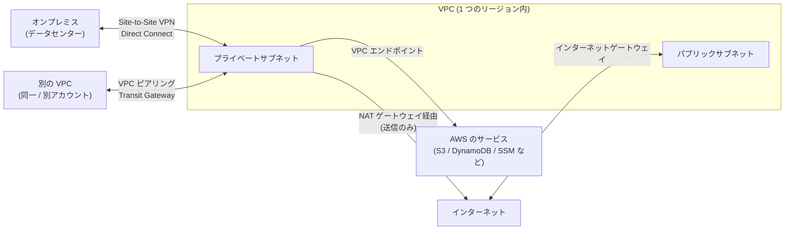
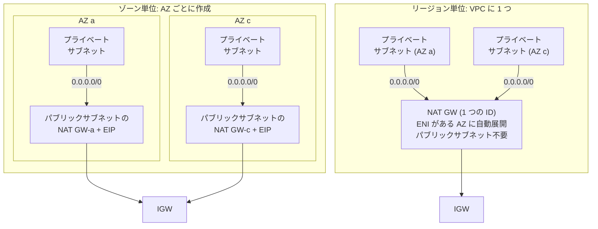
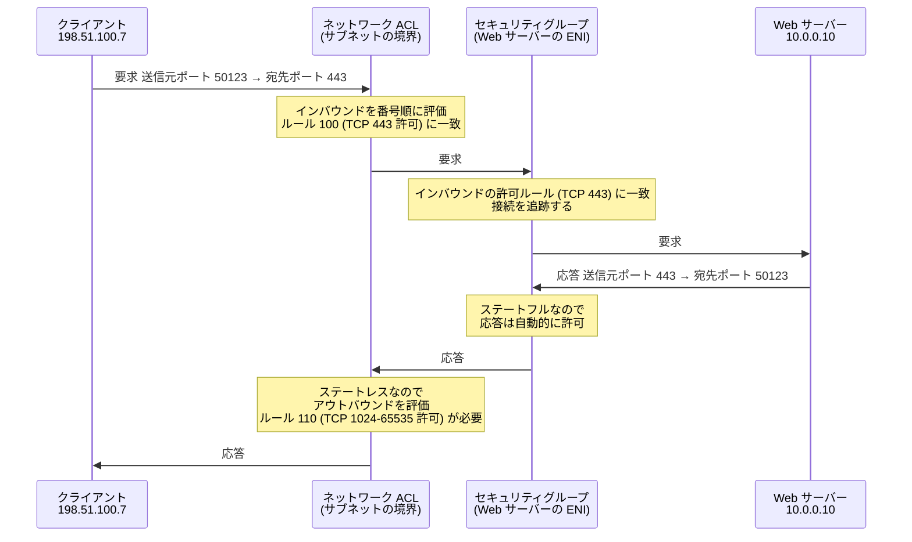
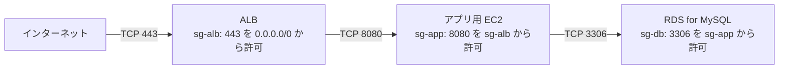
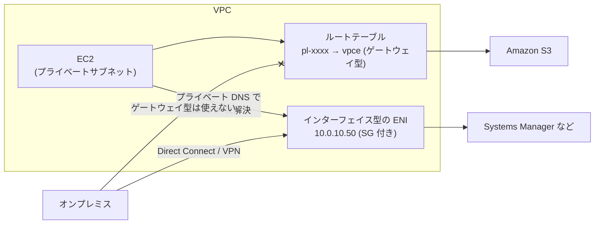
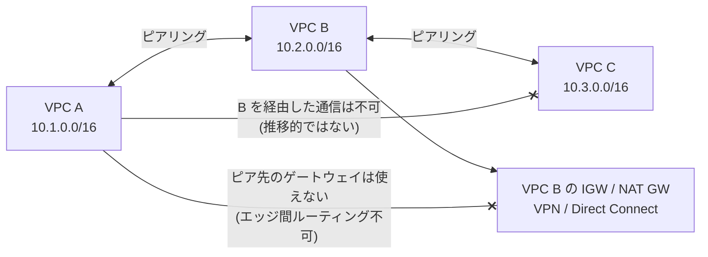
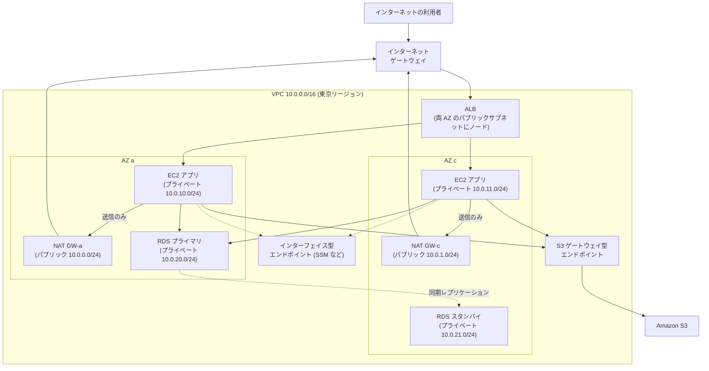

[ホーム](../README.md) > [Phase 2: アソシエイト](README.md) > VPC とネットワーク設計

# VPC とネットワーク設計

> **この章のゴール**
> - VPC・サブネット・ルートテーブル・ゲートウェイの関係を説明し、2 つのアベイラビリティーゾーン（AZ）にまたがる VPC をゼロから設計できる
> - パブリックサブネットとプライベートサブネットの違いを「ルートテーブル」で説明できる
> - NAT ゲートウェイ（ゾーン単位 / リージョン単位）と VPC エンドポイントを、可用性とコストの観点で使い分けられる
> - セキュリティグループとネットワーク ACL の違いを、通信の往復（エフェメラルポート）まで含めて説明できる
> - VPC ピアリング・Transit Gateway・VPN・Direct Connect の位置付けと制約を説明できる
> - フローログ・Reachability Analyzer・Network Access Analyzer を使い分けて、トラブルシューティングと検証ができる
>
> **対応試験**: SAA-C03（第1分野: セキュアなアーキテクチャの設計、第2分野: 弾力性に優れたアーキテクチャの設計 ほか）/ SAP-C03 の前提知識
> **目安時間**: 読む 180分 / 確認問題 40分（[Lab 02](../04-labs/lab02-vpc-ec2.md) を含めて合計 約 7 時間）

## この章の全体像

Amazon Virtual Private Cloud（Amazon VPC）は、AWS 上に作る **自分専用の論理的に分離されたネットワーク** です。EC2 インスタンス、RDS データベース、ロードバランサー、VPC 内で動く Lambda 関数など、多くのリソースは VPC の中に配置されます。
IP アドレスの範囲、サブネットの分け方、通信経路（ルーティング）、外部との出入り口（ゲートウェイ）、通信の許可（ファイアウォール）を、すべて自分で設計します。



| 外部との接続 | 使う仕組み | この章の節 |
|---|---|---|
| インターネットとの双方向通信 | インターネットゲートウェイ + パブリック IP | 5 |
| プライベートサブネットからインターネットへの送信だけ | NAT ゲートウェイ（IPv4）/ Egress-Only インターネットゲートウェイ（IPv6） | 6、14 |
| AWS のサービスへのプライベートな接続 | VPC エンドポイント（ゲートウェイ型 / インターフェイス型） | 8 |
| 別の VPC との接続 | VPC ピアリング / Transit Gateway | 9、10 |
| オンプレミスとの接続 | Site-to-Site VPN / Direct Connect / Client VPN | 11 |

IP アドレス、CIDR 表記、TCP/UDP のポート番号に不安がある場合は、先に [ネットワークの基礎](../01-foundations/01-network-basics.md) を復習してください。

---

## 1. VPC とは

### 1.1 VPC の基本

- VPC は **1 つのリージョン** に作成し、そのリージョンの **すべての AZ にまたがります**。
- VPC の中を **サブネット** に分割します。サブネットは **1 つの AZ に閉じます**。
- VPC 自体、サブネット、ルートテーブル、インターネットゲートウェイ、セキュリティグループ、ネットワーク ACL は無料です。NAT ゲートウェイ、インターフェイス型エンドポイント、パブリック IPv4 アドレス、VPN、Transit Gateway、データ転送などに料金がかかります。
- 1 リージョンあたりの VPC 数の既定のクォータは 5 です（引き上げ可能、2026年9月時点）。

| 構成要素 | 役割 | たとえると |
|---|---|---|
| VPC | 自分専用のネットワーク全体 | 敷地 |
| サブネット | VPC を AZ ごとに区切った範囲 | 敷地内の建物 |
| ルートテーブル | 宛先ごとの転送先（経路）のルール | 道路標識 |
| インターネットゲートウェイ | インターネットとの出入り口 | 正門 |
| NAT ゲートウェイ | プライベートサブネットから外への送信専用の出口 | 出口専用の通用門 |
| セキュリティグループ | ENI（インスタンスなど）単位のファイアウォール | 各部屋の鍵 |
| ネットワーク ACL | サブネット単位のファイアウォール | 建物の入口の警備員 |

### 1.2 デフォルト VPC

各リージョンには、最初から **デフォルト VPC** が用意されています。すぐに EC2 インスタンスを起動できるよう、次のように構成されています。

| 項目 | デフォルト VPC の設定 |
|---|---|
| CIDR | `172.31.0.0/16` |
| サブネット | 各 AZ に 1 つずつ（`/20`）。すべて **パブリックサブネット** |
| インターネットゲートウェイ | アタッチ済み（メインルートテーブルに `0.0.0.0/0 → IGW`） |
| パブリック IPv4 の自動割り当て | 有効 |
| DNS 属性 | `enableDnsSupport` と `enableDnsHostnames` の両方が有効 |
| セキュリティグループ / ネットワーク ACL | デフォルトのもの（ネットワーク ACL はすべて許可） |

> [!WARNING]
> **ひっかけ注意**: デフォルト VPC のサブネットはすべてパブリックです。データベースなど外部に公開しないリソースを置く本番環境では、**カスタム VPC** を作成してプライベートサブネットを設計します。
> デフォルト VPC を削除しても、新しいデフォルト VPC を作り直すことができます（削除したものを復元するわけではありません）。

---

## 2. CIDR 設計

### 2.1 サイズの早見表

| プレフィックス | IP アドレス数 | サブネットとして使える数（5 つの予約を除く） |
|---|---|---|
| /16 | 65,536 | 65,531 |
| /20 | 4,096 | 4,091 |
| /24 | 256 | 251 |
| /26 | 64 | 59 |
| /27 | 32 | 27 |
| /28 | 16 | 11 |

### 2.2 VPC の CIDR のルール

- IPv4 の CIDR ブロックは **/16（65,536 個）〜 /28（16 個）** の範囲で指定します。
- RFC 1918 のプライベートアドレス（`10.0.0.0/8`、`172.16.0.0/12`、`192.168.0.0/16`）から選ぶのが基本です。
- **作成後にプライマリ CIDR は変更できません**。足りなくなったら **セカンダリ CIDR** を追加します（既定で VPC あたり合計 5 つまで。引き上げ可能。プライマリとの組み合わせに制約あり）。
- IPv6 を使う場合は、Amazon が提供する `/56` の IPv6 CIDR などを追加で関連付けます（14 節）。

### 2.3 設計の指針

1. **重複させない**: オンプレミス、ほかの VPC（将来作るものも含む）、取引先のネットワークと重複させないようにします。VPC ピアリング・Transit Gateway・VPN は、**重複する CIDR 同士を通常のルーティングでつなげません**。後から直すのは非常に大変です。
2. **余裕を持たせる**: 本番の VPC は `/16` 程度、サブネットは `/24`〜`/20` 程度が目安です。Amazon EKS のように Pod ごとに VPC の IP アドレスを消費するサービスでは、さらに大きめに確保します。
3. **規則的に割り当てる**: 環境やリージョンごとに範囲を決めておくと、ルートやファイアウォールのルールを集約しやすくなります。組織全体の IP アドレス管理には Amazon VPC IP Address Manager（IPAM）を使えます（Phase 3）。

**IP アドレス計画の例**

| 環境 | リージョン | VPC の CIDR |
|---|---|---|
| 本番 | 東京 | `10.0.0.0/16` |
| ステージング | 東京 | `10.1.0.0/16` |
| 開発 | 東京 | `10.2.0.0/16` |
| 本番（DR） | 大阪 | `10.10.0.0/16` |
| オンプレミス（既存） | ― | `192.168.0.0/16` |

**本番 VPC（10.0.0.0/16）のサブネット計画の例**（17 節の典型構成で使います）

| 用途 | AZ a（ap-northeast-1a） | AZ c（ap-northeast-1c） | 関連付けるルートテーブル |
|---|---|---|---|
| パブリック | `10.0.0.0/24` | `10.0.1.0/24` | `public-rt` |
| プライベート（アプリ） | `10.0.10.0/24` | `10.0.11.0/24` | `private-app-rt-a` / `private-app-rt-c` |
| プライベート（DB） | `10.0.20.0/24` | `10.0.21.0/24` | `private-db-rt` |

---

## 3. サブネット

### 3.1 サブネットは AZ に閉じる

サブネットは必ず 1 つの AZ に属し、複数の AZ にまたがることはできません。そのため、高可用性が必要なシステムでは **同じ役割のサブネットを複数の AZ に作成** し、リソースを分散配置します。
「サブネットを複数の AZ にまたがって作成する」という選択肢は、技術的に不可能なので不正解です。

### 3.2 パブリックサブネットとプライベートサブネットの定義

パブリックかプライベートかは、サブネットの設定項目ではなく、**関連付けたルートテーブルで決まります**。

| 種類 | ルートテーブルの特徴 | 置くもの |
|---|---|---|
| パブリックサブネット | `0.0.0.0/0` の宛先が **インターネットゲートウェイ** | インターネット向けの ALB / NLB、ゾーン単位の NAT ゲートウェイ |
| プライベートサブネット（外部への送信あり） | `0.0.0.0/0` の宛先が **NAT ゲートウェイ** | アプリケーションサーバー、VPC 内の Lambda 関数 |
| プライベートサブネット（隔離） | デフォルトルートなし（`local` と VPC エンドポイントのみ） | データベース |
| VPN 専用サブネット | オンプレミス宛ての経路が仮想プライベートゲートウェイまたは Transit Gateway | オンプレミスとだけ通信するシステム |

> [!TIP]
> **試験のポイント**: 「このサブネットをパブリックにするには？」→ **ルートテーブルに `0.0.0.0/0 → インターネットゲートウェイ` を追加** し、そのルートテーブルをサブネットに関連付けます。
> さらにインスタンスには **パブリック IPv4 アドレスまたは Elastic IP アドレス** が必要です（5.1 節の 4 条件）。

### 3.3 予約される 5 つの IP アドレス

各サブネットでは、先頭の 4 つと末尾の 1 つ、合計 **5 つの IP アドレスが AWS に予約** されていて、リソースに割り当てられません。`10.0.0.0/24` の場合は次のとおりです。

| アドレス | 用途 |
|---|---|
| `10.0.0.0` | ネットワークアドレス |
| `10.0.0.1` | VPC ルーター |
| `10.0.0.2` | DNS サーバー用（Amazon 提供の DNS は VPC の CIDR のベース + 2 に置かれる。各サブネットの + 2 も予約） |
| `10.0.0.3` | 将来の利用のための予約 |
| `10.0.0.255` | ネットワークブロードキャストアドレス（VPC はブロードキャストをサポートしないが予約） |

したがって、`/24` のサブネットで使えるのは 256 − 5 = **251 個**、`/28` なら 16 − 5 = **11 個** です。

> [!TIP]
> **試験のポイント**: 「サブネットに 30 個の IP アドレスが必要」→ `/27` は 32 − 5 = 27 個で足りないため、**`/26`（59 個）** を選びます。予約の 5 個を忘れると誤答します。

### 3.4 パブリック IPv4 アドレスの自動割り当て

サブネットには「パブリック IPv4 アドレスを自動割り当て」という属性があります。デフォルト VPC のサブネットでは有効、自分で作成したサブネットでは既定で無効です。
パブリックサブネットに置いたインスタンスでも、この属性が無効で、起動時に指定もしなければパブリック IP アドレスは付きません（インターネットと通信できない原因の定番です）。

---

## 4. ルートテーブル

### 4.1 基本ルール

- 各サブネットは、**必ず 1 つのルートテーブル** に関連付けられます。明示的に関連付けていないサブネットは **メインルートテーブル** を使います。
- 1 つのルートテーブルを複数のサブネットに関連付けることはできます。
- すべてのルートテーブルには、VPC の CIDR 宛ての **`local` ルート** が自動で入っており、削除できません。そのため、**同じ VPC 内のサブネット同士は、ルートの追加なしで通信できます**（通信を許可するかどうかはセキュリティグループとネットワーク ACL で決まります）。
- 宛先が複数のルートに一致した場合は、**最も長いプレフィックス（最も具体的なルート）が優先** されます（ロンゲストプレフィックスマッチ）。

| ルートのターゲット | 例 | 意味 |
|---|---|---|
| `local` | `10.0.0.0/16 → local` | VPC 内 |
| インターネットゲートウェイ | `igw-...` | インターネット（パブリックサブネット） |
| NAT ゲートウェイ | `nat-...` | インターネットへの送信のみ（プライベートサブネット） |
| Egress-Only インターネットゲートウェイ | `eigw-...` | IPv6 の送信のみ |
| ゲートウェイ型 VPC エンドポイント | `vpce-...`（宛先はプレフィックスリスト `pl-...`） | S3 / DynamoDB |
| VPC ピアリング接続 | `pcx-...` | ピアリング先の VPC |
| Transit Gateway | `tgw-...` | 他の VPC / オンプレミス |
| 仮想プライベートゲートウェイ | `vgw-...` | VPN / Direct Connect でオンプレミスへ |

> [!TIP]
> **設計のコツ**: メインルートテーブルは **プライベート（インターネットへのルートなし）のまま** にしておき、パブリックサブネットだけを、IGW へのルートを持つカスタムルートテーブルに明示的に関連付けます。新しく作ったサブネットが、意図せずパブリックになるのを防げます。

### 4.2 ルートテーブルの例

17 節の典型構成で使うルートテーブルです。

**`public-rt`**（パブリックサブネット × 2 に関連付け）

| 送信先 | ターゲット | 説明 |
|---|---|---|
| `10.0.0.0/16` | `local` | VPC 内 |
| `0.0.0.0/0` | `igw-0example` | インターネット |

**`private-app-rt-a`**（AZ a のアプリ用サブネットに関連付け。`-c` も同じ構成で、NAT ゲートウェイだけ AZ c のものを指定）

| 送信先 | ターゲット | 説明 |
|---|---|---|
| `10.0.0.0/16` | `local` | VPC 内 |
| `0.0.0.0/0` | `nat-0aaaa`（AZ a の NAT ゲートウェイ） | インターネットへの送信のみ |
| `pl-xxxxxxxx`（S3 のプレフィックスリスト） | `vpce-0s3`（S3 のゲートウェイ型エンドポイント） | S3 へは NAT を通さない |

**`private-db-rt`**（DB 用サブネット × 2 に関連付け）

| 送信先 | ターゲット | 説明 |
|---|---|---|
| `10.0.0.0/16` | `local` | VPC 内のみ（インターネットへの経路なし） |

### 4.3 ロンゲストプレフィックスマッチの練習

次のルートテーブルで、宛先ごとにどこへ転送されるかを考えてみましょう。

| 送信先 | ターゲット |
|---|---|
| `10.0.0.0/16` | `local` |
| `10.20.0.0/16` | `pcx-0peer`（VPC ピアリング） |
| `192.168.0.0/16` | `vgw-0vpn`（オンプレミスへの VPN） |
| `192.168.10.0/24` | `tgw-0hub`（Transit Gateway） |
| `0.0.0.0/0` | `nat-0aaaa` |

| 宛先 | 転送先 | 理由 |
|---|---|---|
| `10.0.5.20` | `local` | `10.0.0.0/16` に一致 |
| `10.20.3.4` | `pcx-0peer` | `10.20.0.0/16` に一致 |
| `192.168.10.5` | `tgw-0hub` | `/16` と `/24` の両方に一致するが、より長い `/24` が優先 |
| `192.168.99.1` | `vgw-0vpn` | `192.168.0.0/16` に一致 |
| `8.8.8.8` | `nat-0aaaa` | どれにも一致しないためデフォルトルート |

### 4.4 高度なルーティング（入口）

- **ゲートウェイルートテーブル**: インターネットゲートウェイや仮想プライベートゲートウェイにルートテーブルを関連付け（エッジの関連付け）、入ってきた通信をファイアウォールのアプライアンスに通すことができます。
- VPC の CIDR 内でも、`local` より具体的なルートを追加して、サブネット間の通信を検査用のアプライアンス（AWS Network Firewall など）に経由させることができます。

これらの検査アーキテクチャは Phase 3 の [高度なネットワーク設計](../03-professional/04-advanced-networking.md) で扱います。

---

## 5. インターネットゲートウェイとパブリック IP アドレス

### 5.1 インターネットゲートウェイ（IGW）

インターネットゲートウェイは、VPC とインターネットをつなぐ出入り口です。

- AWS が管理する、水平スケールする冗長化されたコンポーネントで、**帯域の制約や単一障害点にはなりません**。
- 1 つの VPC にアタッチできる IGW は 1 つだけです。
- IPv4 では、インスタンスの **プライベート IP アドレスとパブリック IP アドレスを 1 対 1 で変換** します。インスタンスの OS からは自分のプライベート IP アドレスしか見えません（`ip addr` にパブリック IP は表示されません）。IPv6 では変換は行いません。

> [!IMPORTANT]
> **インスタンスがインターネットと通信できる 4 つの条件**（試験で最も問われるチェックリストです）
> 1. VPC に **インターネットゲートウェイがアタッチ** されている
> 2. サブネットのルートテーブルに **`0.0.0.0/0 → IGW`**（IPv6 なら `::/0 → IGW`）がある
> 3. インスタンスに **パブリック IPv4 アドレスまたは Elastic IP アドレス**（または IPv6 アドレス）がある
> 4. **セキュリティグループとネットワーク ACL** がその通信を許可している

### 5.2 パブリック IPv4 アドレスと Elastic IP アドレス

| 観点 | 自動割り当てのパブリック IPv4 アドレス | Elastic IP アドレス（EIP） |
|---|---|---|
| 割り当て方 | 起動時に自動（サブネットの属性や起動時の指定による） | アカウントに確保してから関連付ける |
| 停止 → 起動 | **変わる**（停止時に解放される） | 変わらない |
| 付け替え | できない | 別のインスタンスや ENI に付け替えられる（障害時の切り替えなど） |
| 上限 | ― | リージョンあたり 5 個（既定、引き上げ可能） |
| 料金 | 0.005 USD / 時間 | 0.005 USD / 時間（関連付けの有無を問わない） |

> [!TIP]
> **試験のポイント**: 「インスタンスを停止・起動してもパブリック IP アドレスを変えたくない」「障害時に別のインスタンスへ同じ IP アドレスを移したい」→ **Elastic IP アドレス**。
> ただし、IP アドレスを固定したい要件の多くは、ALB や NLB（NLB は EIP を関連付け可能）、Route 53 の DNS 名で解決する設計のほうが望ましい場合があります。

### 5.3 パブリック IPv4 アドレスの課金（2024年2月〜）

2024年2月1日から、**すべてのパブリック IPv4 アドレスに 1 時間あたり 0.005 USD** の料金がかかっています（使用中か未使用かを問わない。2026年9月時点）。対象は、EC2 インスタンスの自動割り当てパブリック IP、Elastic IP アドレス、NAT ゲートウェイや インターネット向けロードバランサーなどのパブリック IP です。

- 1 アドレスあたり約 3.65 USD / 月（730 時間）です。50 台のインスタンスにパブリック IP を付けると、それだけで月に約 180 USD になります。
- 料金の詳細は [Amazon VPC の料金](https://aws.amazon.com/vpc/pricing/) を確認してください。

**パブリック IPv4 アドレスを減らす方法**

- Web サーバーはプライベートサブネットに置き、ALB だけをパブリックにする
- 管理用のアクセスは、パブリック IP や踏み台サーバーの代わりに **AWS Systems Manager Session Manager** や **EC2 Instance Connect Endpoint** を使う
- 使っていない Elastic IP アドレスを解放する。Amazon VPC IPAM の Public IP insights で利用状況を把握する
- IPv6 を活用する（IPv6 アドレスにはこの料金がかからない）

> [!WARNING]
> **ひっかけ注意**: 古い教材には「実行中のインスタンスに関連付けた Elastic IP アドレスは無料、未使用のものだけ課金される」と書かれていることがあります。これは 2024年1月までの料金体系です。現在は **使用中の Elastic IP アドレスも課金** されます。

---

## 6. NAT ゲートウェイ

### 6.1 役割

NAT ゲートウェイは、**プライベートサブネットのリソースが、インターネット（や VPC 外の AWS サービスのパブリックエンドポイント）へ IPv4 で送信するための出口** です。

- 送信元の IP アドレスを NAT ゲートウェイのパブリック IP アドレスに変換（SNAT）します。応答は NAT ゲートウェイ経由で戻ります。
- **外部から接続を開始することはできません**。「外部からの接続は受け付けず、外部への接続だけを許可したい」という要件の答えです。
- 通信の種類（接続タイプ）には **パブリック**（インターネット向け。Elastic IP アドレスを使う）と **プライベート**（他の VPC やオンプレミスへの通信で送信元 IP アドレスを変換する）があります。プライベート NAT は Phase 3 で扱います。

### 6.2 ゾーン単位の NAT ゲートウェイ（従来型）

- 特定の AZ の **パブリックサブネット** に作成し、Elastic IP アドレスを関連付けます。
- **その AZ の中では冗長化** されていますが、AZ 全体の障害には耐えられません。
- そのため、高可用性が必要な場合は **AZ ごとに NAT ゲートウェイを作成** し、各 AZ のプライベートルートテーブルで **同じ AZ の NAT ゲートウェイ** を指定します。これにより、ある AZ の障害が他の AZ に波及せず、AZ をまたぐデータ転送料金も発生しません。
- 帯域は 5 Gbps から始まり、最大 100 Gbps まで自動でスケールします。1 つの NAT ゲートウェイに最大 8 個の IP アドレスを関連付けでき、IP アドレス 1 個あたり同一の宛先（宛先 IP・ポート・プロトコルの組み合わせ）へ最大 55,000 の同時接続を扱えます（2026年9月時点）。
- NAT ゲートウェイにはセキュリティグループを関連付けられません。制御はネットワーク ACL と、送信元インスタンスのセキュリティグループで行います。

### 6.3 リージョン単位の NAT ゲートウェイ（2025年11月〜）

2025年11月に、NAT ゲートウェイの **可用性モード「リージョン」** が追加されました。



| 観点 | ゾーン単位（従来型） | リージョン単位（2025年11月〜） |
|---|---|---|
| 作成場所 | AZ のパブリックサブネット | VPC に対して作成（**パブリックサブネット不要**。専用のルートテーブルが自動作成され、IGW へのルートが入る） |
| 高可用性 | AZ ごとに作成して自分で構成 | ENI がある AZ に **自動で展開・縮小** |
| ルートテーブル | AZ ごとに別の NAT ゲートウェイ ID を指定 | すべてのルートテーブルで **同じ ID** を指定できる |
| 新しい AZ への対応 | 自分で NAT ゲートウェイとルートを追加 | 自動（展開に最大 60 分。完了までは既存の AZ で AZ をまたいで処理） |
| IP アドレスの管理 | 自分で EIP を関連付け | 自動モード（AWS が IP と AZ 展開を管理、推奨）/ 手動モード |
| IP アドレス数 | NAT ゲートウェイあたり最大 8 個 | AZ あたり最大 32 個 |
| プライベート NAT | 対応 | **非対応**（プライベート NAT にはゾーン単位を使う） |

> [!NOTE]
> **試験での扱い**: SAA-C03 の問題や多くの教材は、リージョン単位の NAT ゲートウェイが登場する前に作られています。「NAT ゲートウェイを高可用性にする方法」を問われたら、まず **「AZ ごとに NAT ゲートウェイを作成し、各 AZ のルートテーブルで同じ AZ の NAT ゲートウェイを指定する」** を選べるようにしてください。
> 選択肢にリージョン単位の NAT ゲートウェイが登場した場合は、「単一の NAT ゲートウェイで複数 AZ の高可用性を自動で実現し、パブリックサブネットも不要」という特徴で判断します。
> 詳細は [リージョン単位の NAT ゲートウェイ](https://docs.aws.amazon.com/vpc/latest/userguide/nat-gateways-regional.html) を参照してください。

### 6.4 料金とコスト削減

NAT ゲートウェイの料金は、**時間料金 + 処理したデータ量（GB）あたりの料金** です。東京リージョンでは、どちらも 0.062 USD（1 時間あたり / 1 GB あたり）です（2026年9月時点）。これに加えて、インターネットへのデータ転送料金や、Elastic IP アドレスのパブリック IPv4 の料金がかかります。

- NAT ゲートウェイ 1 つの時間料金だけで約 45 USD / 月、2 AZ に置けば約 90 USD / 月です。
- 月に 10 TB を処理すると、データ処理料金だけで約 635 USD です（10,240 GB × 0.062 USD）。

**コスト削減の定石**

1. **S3 と DynamoDB へのアクセスは、ゲートウェイ型 VPC エンドポイント（無料）** に切り替えて NAT ゲートウェイを通さない（8 節）
2. 他の AWS サービスへの大量の通信は、インターフェイス型エンドポイントを検討する（データ処理料金が NAT ゲートウェイより安い）
3. 各 AZ のルートテーブルで同じ AZ の NAT ゲートウェイを使い、AZ 間のデータ転送料金を避ける
4. 開発環境など可用性の要件が低い環境では、NAT ゲートウェイを 1 つに集約する

> [!TIP]
> **試験のポイント**: 「プライベートサブネットの EC2 から S3 に大量のデータを転送しており、NAT ゲートウェイの料金が高い。最もコスト効率の高い改善策は？」→ **S3 のゲートウェイ型 VPC エンドポイント**。

### 6.5 NAT ゲートウェイと NAT インスタンスの比較

| 観点 | NAT ゲートウェイ | NAT インスタンス（EC2 で自作） |
|---|---|---|
| 管理 | AWS のマネージドサービス | 自分で構築・パッチ適用・監視 |
| 可用性 | AZ 内で冗長化済み（リージョン単位なら複数 AZ に自動展開） | 自分で冗長化（Auto Scaling、フェイルオーバーのスクリプトなど） |
| 帯域 | 最大 100 Gbps まで自動スケール | インスタンスタイプに依存 |
| セキュリティグループ | 関連付けられない | 関連付けられる |
| 送信元 / 送信先チェック | ― | **無効化が必要** |
| 踏み台サーバーとしての利用・ポート転送 | できない | できる |
| コスト | 時間料金 + データ処理料金 | EC2 の料金のみ（小さなインスタンスなら安い場合がある） |

NAT インスタンス用に AWS が提供していた AMI はサポートが終了しているため、現在 NAT インスタンスを使う場合は Amazon Linux 2023 などで自分で構成します。

> [!TIP]
> **試験のポイント**: 「運用上のオーバーヘッドが最も少ない」「高可用性」「帯域が自動でスケール」→ **NAT ゲートウェイ**。
> NAT インスタンスが正解になるのは、「コストを最小限にしたい小規模な環境」「セキュリティグループやポート転送が必要」など、特別な理由が書かれている場合だけです。

---

## 7. セキュリティグループとネットワーク ACL

### 7.1 2 層の防御

VPC には、2 種類のファイアウォールがあります。

- **セキュリティグループ**: ENI（インスタンス、RDS、ALB、VPC 内の Lambda 関数などのネットワークインターフェイス）単位で、通信を **許可** します。
- **ネットワーク ACL**: サブネット単位で、出入りするパケットを **許可または拒否** します。

通常のアクセス制御はセキュリティグループで行い、ネットワーク ACL はサブネット単位のガードレール（特定の IP アドレス範囲の拒否など）に使うのが一般的です。

### 7.2 比較表

| 観点 | セキュリティグループ | ネットワーク ACL |
|---|---|---|
| 適用範囲 | ENI（インスタンスなど） | サブネット |
| 状態の追跡 | **ステートフル**（許可した通信の戻りは自動的に許可） | **ステートレス**（戻りの通信も明示的に許可が必要） |
| ルールの種類 | **許可のみ** | **許可と拒否** |
| 評価方法 | すべてのルールを評価し、いずれかに一致すれば許可 | **ルール番号の小さい順** に評価し、最初に一致したルールを適用 |
| 新規作成時の既定 | インバウンド: なし（すべて拒否）/ アウトバウンド: すべて許可 | カスタム: インバウンド・アウトバウンドともすべて拒否 / デフォルトのネットワーク ACL: すべて許可 |
| 送信元・送信先の指定 | CIDR、**他のセキュリティグループ**、プレフィックスリスト | CIDR |
| 関連付け | 1 つの ENI に複数（既定で最大 5 個、引き上げ可能） | 1 つのサブネットに 1 つ（1 つのネットワーク ACL を複数のサブネットで共有できる） |
| ルール数の既定 | インバウンド 60 / アウトバウンド 60 | 方向ごとに 20（引き上げ可能） |

> [!TIP]
> **試験のポイント**: 「特定の IP アドレス範囲からのアクセスをブロックしたい」→ **ネットワーク ACL の拒否ルール**（セキュリティグループには拒否ルールがない）。
> 「アプリ層のインスタンスからだけ DB への接続を許可したい」→ **セキュリティグループで、アプリ層のセキュリティグループを送信元に指定**。

### 7.3 エフェメラルポート

クライアントがサーバーに接続するとき、宛先ポート（例: 443）は決まっていますが、**送信元ポートは OS が一時的に選ぶ番号（エフェメラルポート）** です。サーバーの応答は、このエフェメラルポート宛てに返ります。

| クライアントの種類 | 使うエフェメラルポートの範囲 |
|---|---|
| 多くの Linux カーネル（Amazon Linux を含む） | 32768〜61000 |
| Windows Server 2008 以降 | 49152〜65535 |
| Elastic Load Balancing、NAT ゲートウェイ、AWS Lambda | 1024〜65535 |

クライアントの種類は事前に限定できないことが多いため、ネットワーク ACL では **1024〜65535** を許可するのが一般的です。

### 7.4 通信の往復を追う

パブリックサブネットの Web サーバー（`10.0.0.10`）に、インターネット上のクライアント（`198.51.100.7`）が HTTPS で接続する例です。サブネットのネットワーク ACL は次のとおりとします。

**インバウンドルール**

| ルール # | プロトコル | ポート範囲 | 送信元 | 許可 / 拒否 | 目的 |
|---|---|---|---|---|---|
| 90 | すべて | すべて | `203.0.113.0/24` | 拒否 | 攻撃元の範囲をブロック（許可ルールより先に評価させる） |
| 100 | TCP | 443 | `0.0.0.0/0` | 許可 | クライアントからの HTTPS の要求 |
| 110 | TCP | 1024-65535 | `0.0.0.0/0` | 許可 | サーバーから外部へ接続したとき（OS の更新など）の応答 |
| * | すべて | すべて | `0.0.0.0/0` | 拒否 | 既定のルール（最後に評価され、削除できない） |

**アウトバウンドルール**

| ルール # | プロトコル | ポート範囲 | 送信先 | 許可 / 拒否 | 目的 |
|---|---|---|---|---|---|
| 100 | TCP | 443 | `0.0.0.0/0` | 許可 | サーバーから外部への HTTPS の要求 |
| 110 | TCP | 1024-65535 | `0.0.0.0/0` | 許可 | クライアントへの応答（宛先はエフェメラルポート） |
| * | すべて | すべて | `0.0.0.0/0` | 拒否 | 既定のルール |



1. 要求はまずネットワーク ACL のインバウンドルールで評価され、ルール 100 で許可されます。
2. 次にセキュリティグループのインバウンドルール（TCP 443 を許可）で許可され、接続が追跡されます。
3. 応答は、セキュリティグループでは **自動的に許可** されます（アウトバウンドルールの内容は関係ありません）。
4. ネットワーク ACL は応答を覚えていないため、**アウトバウンドのルール 110（宛先ポート 1024-65535）がないと、応答が破棄されます**。

> [!WARNING]
> **ひっかけ注意**: ネットワーク ACL は最初に一致したルールで決まるため、拒否ルールは **許可ルールより小さい番号** にします。上の例でルール 90 を 200 番にすると、`203.0.113.0/24` からの 443 番への通信はルール 100 で先に許可されてしまいます。
> また、カスタムのネットワーク ACL を新しく作ると **すべて拒否** の状態から始まります。サブネットに関連付けた瞬間に通信が止まる事故に注意してください。

### 7.5 セキュリティグループの参照

セキュリティグループのルールでは、送信元に **別のセキュリティグループ** を指定できます。「そのセキュリティグループが付いた ENI からの通信を許可する」という意味です。



- Auto Scaling でインスタンスが増減して IP アドレスが変わっても、ルールを変更する必要がありません。
- 同じリージョンの VPC ピアリング接続先の VPC にあるセキュリティグループも参照できます。
- デフォルトのセキュリティグループは「同じセキュリティグループからのインバウンドをすべて許可」するルールを持っています。

> [!TIP]
> **試験のポイント**: 「DB へのアクセスをアプリケーション層からだけに限定し、スケールアウトしてもルールの変更を不要にしたい」→ **DB のセキュリティグループのインバウンドで、アプリ層のセキュリティグループ ID を送信元に指定**。CIDR（サブネット全体）を指定するより厳密です。

---

## 8. VPC エンドポイント

### 8.1 なぜ必要か

S3 や DynamoDB、Systems Manager などの AWS サービスの API は、VPC の外にある **パブリックエンドポイント** で提供されています。インターネットへの経路がないプライベートサブネットからは、そのままでは到達できません。NAT ゲートウェイを経由すれば到達できますが、データ処理料金がかかり、通信がインターネット向けの経路を通ります。

**VPC エンドポイント** を使うと、IGW や NAT ゲートウェイなしで、AWS のネットワーク内だけを通って AWS のサービスにプライベートに接続できます。

### 8.2 ゲートウェイ型とインターフェイス型の比較

| 観点 | ゲートウェイ型エンドポイント | インターフェイス型エンドポイント（AWS PrivateLink） |
|---|---|---|
| 対応サービス | **S3 と DynamoDB のみ** | 多数の AWS サービス（S3・DynamoDB を含む）、自社や他社のエンドポイントサービス、AWS Marketplace の SaaS |
| 仕組み | ルートテーブルに、サービスの **プレフィックスリスト宛てのルート** を追加 | サブネットに **ENI（プライベート IP アドレス）** を作成 |
| 料金 | **無料** | 時間料金（AZ ごと）+ データ処理料金（東京: 0.014 USD / 時間・AZ、0.01 USD / GB〜。2026年9月時点） |
| DNS | サービスの通常の DNS 名のまま（パブリック IP に解決され、ルートテーブルで経路だけが変わる） | **プライベート DNS** を有効にすると、サービスの通常の DNS 名がエンドポイントのプライベート IP に解決される（VPC の DNS 属性を 2 つとも有効にする必要あり） |
| アクセス制御 | エンドポイントポリシー | エンドポイントポリシー + **セキュリティグループ** |
| オンプレミス・ピアリング先・Transit Gateway 経由での利用 | **できない**（その VPC 内から発信した通信だけ） | **できる**（Direct Connect / VPN / Transit Gateway / ピアリング経由） |
| リージョン | 同じリージョンのサービスだけ | ― |
| 冗長化 | AWS が管理 | AZ ごとに ENI を作るため、**複数の AZ に作成** して冗長化 |



> [!TIP]
> **試験のポイント**
> - 「VPC 内の EC2 から S3（DynamoDB）へ、インターネットを経由せず、**最も低コスト** でアクセス」→ **ゲートウェイ型エンドポイント**
> - 「**オンプレミス** から Direct Connect や VPN 経由で S3 にプライベートにアクセス」→ **S3 のインターフェイス型エンドポイント**（ゲートウェイ型はオンプレミスから使えない）
> - 「NAT ゲートウェイのないプライベートサブネットで Session Manager を使いたい」→ `ssm`、`ssmmessages`、`ec2messages` の **インターフェイス型エンドポイント**
> - 「自社のサービスを、CIDR が重複する多数の顧客 VPC にプライベートに公開したい」→ **AWS PrivateLink**（NLB の背後のエンドポイントサービス）

### 8.3 エンドポイントポリシー

エンドポイントポリシーは、「**このエンドポイントを通って何にアクセスできるか**」を制限するリソースベースのポリシーです。既定ではフルアクセスが許可されています。IAM ポリシーと同じく、エンドポイントポリシー自体が権限を与えるわけではなく、IAM ポリシーやバケットポリシーでの許可も別途必要です。

S3 のゲートウェイ型エンドポイントで、自社のバケット以外へのアクセス（持ち出し）を防ぐ例です。

```json
{
  "Version": "2012-10-17",
  "Statement": [
    {
      "Sid": "AllowOnlyCompanyAppBucket",
      "Effect": "Allow",
      "Principal": "*",
      "Action": ["s3:GetObject", "s3:PutObject", "s3:ListBucket"],
      "Resource": ["arn:aws:s3:::example-app-data", "arn:aws:s3:::example-app-data/*"]
    }
  ]
}
```

- **エンドポイントポリシー**: VPC から「どのバケットに」出ていけるかを制限する（VPC 側の出口の制御）
- **バケットポリシーの `aws:SourceVpce`**: バケットに「どの経路から」入ってこられるかを制限する（リソース側の入口の制御。[IAM 徹底解説](01-iam.md) の例 4）

両方を組み合わせると、「このバケットにはこの VPC からだけ、この VPC からはこのバケットにだけ」という双方向の制御になります。組織単位で制限したい場合は、エンドポイントポリシーで `aws:ResourceOrgID` を使えます。

### 8.4 インターフェイス型エンドポイントの補足

- よく使うエンドポイント: Systems Manager（`ssm`、`ssmmessages`、`ec2messages`）、ECR からのイメージ取得（`ecr.api`、`ecr.dkr` + レイヤー取得用の S3）、CloudWatch Logs（`logs`）、KMS、Secrets Manager、STS など。
- S3 はゲートウェイ型とインターフェイス型の **両方を併用** できます。インターフェイス型のプライベート DNS で「インバウンドエンドポイントに対してのみ有効にする」オプションを使うと、VPC 内からは無料のゲートウェイ型を、オンプレミスからは Route 53 Resolver のインバウンドエンドポイント経由でインターフェイス型を使う構成にできます。
- AWS PrivateLink のサービス提供側の設計（エンドポイントサービス、クロスアカウント、VPC Lattice との比較）は Phase 3 の [高度なネットワーク設計](../03-professional/04-advanced-networking.md) で扱います。

---

## 9. VPC ピアリング

### 9.1 仕組み

VPC ピアリングは、**2 つの VPC を 1 対 1 でプライベートに接続** する機能です。同じアカウント・別のアカウント、同じリージョン・別のリージョン（リージョン間ピアリング）のいずれでも接続できます。

1. 一方の VPC がピアリング接続をリクエストし、もう一方が承認する
2. **両方の VPC のルートテーブル** に、相手の CIDR 宛てのルート（ターゲット `pcx-...`）を追加する
3. セキュリティグループ（とネットワーク ACL）で相手からの通信を許可する

通信は AWS のネットワーク内を通り、ゲートウェイのような単一障害点や帯域のボトルネックはありません。ピアリング接続自体に時間料金はなく、データ転送料金がかかります（同じ AZ 内の転送は無料）。

### 9.2 制約（試験に頻出）



| 制約 | 内容 | 対処 |
|---|---|---|
| **推移的ではない** | A-B、B-C がピアリングしていても、A と C は通信できない | A-C 間にもピアリングを作る、または Transit Gateway |
| **CIDR の重複は不可** | 一部でも CIDR が重なる VPC 同士はピアリングできない | IP アドレス計画を見直す（重複する場合は PrivateLink などを検討） |
| **エッジ間ルーティング不可** | ピア先の IGW、NAT ゲートウェイ、VPN、Direct Connect、ゲートウェイ型エンドポイントを経由して外に出られない | 各 VPC に出口を用意する、または Transit Gateway で集約する |
| 1 組の VPC に 1 つ | 同じ 2 つの VPC の間にピアリングは 1 つだけ | ― |
| 上限 | 1 つの VPC あたりアクティブなピアリング接続は既定 50、最大 125（2026年9月時点） | 多数の VPC なら Transit Gateway |
| セキュリティグループの参照 | 同じリージョンのピアリングでのみ相手のセキュリティグループを参照できる | リージョン間では CIDR で指定 |

> [!WARNING]
> **ひっかけ注意**: 「VPC B を経由して VPC A から VPC C に通信する」「VPC B の NAT ゲートウェイを VPC A から共用する」という選択肢は、**VPC ピアリングでは不可能** です。
> VPC の数が n 個でフルメッシュにすると、ピアリングは n(n−1)/2 本必要です（10 個で 45 本）。数が多い場合は Transit Gateway を検討します。

---

## 10. Transit Gateway（入口）

AWS Transit Gateway は、**リージョン内のハブとなるルーター** です。多数の VPC やオンプレミスとの接続を、ハブ & スポーク型で集約します。

| 観点 | VPC ピアリング | Transit Gateway |
|---|---|---|
| トポロジー | 1 対 1（フルメッシュが必要） | ハブ & スポーク |
| 推移的なルーティング | できない | **できる**（Transit Gateway のルートテーブルで制御） |
| 接続できるもの | VPC 同士 | VPC、Site-to-Site VPN、Direct Connect ゲートウェイ、他リージョンの Transit Gateway（ピアリング）、SD-WAN（Connect） |
| セグメント分割 | ― | 複数のルートテーブルで「本番と開発は通信させない」などを実現 |
| 料金 | 時間料金なし（データ転送料金のみ） | アタッチメントごとの時間料金 + データ処理料金（東京: 0.07 USD / 時間、0.02 USD / GB。2026年9月時点） |
| 向いている規模 | 少数の VPC | 数十〜数千の VPC、オンプレミスとの共有接続 |

Transit Gateway は AWS Resource Access Manager（RAM）で他のアカウントと共有でき、マルチアカウント環境のネットワークの中心になります。設計の詳細は Phase 3 の [高度なネットワーク設計](../03-professional/04-advanced-networking.md) と [Lab 11](../04-labs/lab11-transit-gateway.md) で扱います。

---

## 11. オンプレミスとの接続（入口）

| 観点 | AWS Site-to-Site VPN | AWS Direct Connect | AWS Client VPN |
|---|---|---|---|
| 経路 | インターネット上の IPsec トンネル | AWS との **専用の物理接続** | インターネット上の TLS（OpenVPN ベース） |
| 接続元 | 拠点のルーター（カスタマーゲートウェイ） | データセンターや拠点のネットワーク | 個々の PC（リモートワーク） |
| 準備期間 | 数分〜数時間 | **数週間以上**（回線の手配が必要） | 数分〜数時間 |
| 帯域・品質 | 1 トンネルあたり最大 1.25 Gbps。インターネットの品質に左右される | 1 / 10 / 100 Gbps などの専用接続。安定した低レイテンシー | 利用者ごと |
| 暗号化 | IPsec で暗号化 | **既定では暗号化されない**（MACsec、または Direct Connect 上で VPN を張る） | TLS で暗号化 |
| AWS 側の終端 | 仮想プライベートゲートウェイ（VGW）または Transit Gateway | 仮想インターフェイス（VIF）→ VGW / Direct Connect ゲートウェイ / Transit Gateway | Client VPN エンドポイント |
| 冗長性 | 1 つの VPN 接続に 2 本のトンネル | 複数の接続・複数のロケーションで冗長化 | ― |

> [!TIP]
> **試験のポイント**: 「すぐに（数日以内に）暗号化された接続が必要」→ **Site-to-Site VPN**。「安定した帯域と一貫したレイテンシーが必要」→ **Direct Connect**。「Direct Connect の障害時のバックアップを低コストで」→ **Site-to-Site VPN をバックアップ** に。「Direct Connect の通信を暗号化したい」→ **Direct Connect 上の IPsec VPN または MACsec**。

VIF の種類や Direct Connect ゲートウェイ、冗長化のパターンは [移行とハイブリッド接続](16-migration-hybrid.md) と Phase 3 で詳しく扱います。

---

## 12. 監視とトラブルシューティング

### 12.1 VPC フローログ

VPC フローログは、ENI を出入りする IP 通信の **メタデータ**（誰から誰へ、どのポートで、何バイト、許可か拒否か）を記録する機能です。**パケットの中身（ペイロード）は記録しません**（中身が必要なら **Traffic Mirroring** を使います）。

- 作成単位: **VPC、サブネット、ENI**（Transit Gateway にも作成可能）
- 送信先: **CloudWatch Logs、S3、Amazon Data Firehose**
- 集約間隔は 1 分または 10 分で、リアルタイムの記録ではありません
- 分析: CloudWatch Logs Insights、S3 に保存したログを Amazon Athena でクエリ

既定の形式のレコードは次のとおりです（左から version、account-id、interface-id、srcaddr、dstaddr、srcport、dstport、protocol、packets、bytes、start、end、action、log-status）。

```text
2 123456789012 eni-0a1b2c3d4e5f67890 198.51.100.7 10.0.0.10 50123 443 6 12 1520 1790553600 1790553660 ACCEPT OK
2 123456789012 eni-0a1b2c3d4e5f67890 10.0.0.10 198.51.100.7 443 50123 6 10 5230 1790553600 1790553660 REJECT OK
```

protocol の `6` は TCP です（UDP は `17`、ICMP は `1`）。1 行目で要求が **ACCEPT**、2 行目で応答が **REJECT** されています。セキュリティグループはステートフルなので、許可した要求への応答を拒否することはありません。つまり原因は **ネットワーク ACL のアウトバウンドルール（エフェメラルポートの許可漏れ）** だと判断できます。

> [!TIP]
> **試験のポイント**: フローログで「インバウンドは ACCEPT なのに、応答（アウトバウンド）が REJECT」→ **ネットワーク ACL**（ステートレス）の問題。「インバウンドが REJECT」→ セキュリティグループかネットワーク ACL のインバウンドルールの問題です。

フローログに記録されない通信もあります。代表例は、Amazon 提供の DNS サーバー（Route 53 Resolver）への問い合わせ、インスタンスメタデータ（`169.254.169.254`）、Amazon Time Sync Service、DHCP、Windows のライセンス認証の通信などです。

### 12.2 Reachability Analyzer と Network Access Analyzer

どちらも、実際にパケットを送らずに **ネットワークの設定を静的に解析** するツールです。

| 観点 | Reachability Analyzer | Network Access Analyzer |
|---|---|---|
| 問い | 「**A から B に届くか**。届かないなら、どの設定が原因か」 | 「**要件に反するアクセス経路が存在しないか**」 |
| 入力 | 送信元と宛先（インスタンス、ENI、IGW、Transit Gateway、VPC エンドポイントなど）、プロトコル、ポート | ネットワークアクセススコープ（例:「IGW から DB 用サブネットへの経路」は存在してはならない） |
| 出力 | 到達できる経路、または通信を妨げているコンポーネント（ルートテーブル、セキュリティグループ、ネットワーク ACL など） | スコープに一致する経路（= 要件違反）の一覧 |
| 使いどころ | 接続トラブルの調査、変更後の疎通確認 | コンプライアンスの検証、ネットワーク分離の継続的な確認 |
| 料金（東京、2026年9月時点） | 分析 1 回あたり 0.10 USD | 分析した ENI 1 つあたり 0.002 USD |

> [!TIP]
> **試験のポイント**: 「インスタンス間の接続トラブルの原因となっている設定を特定したい」→ **Reachability Analyzer**。「インターネットから機密サブネットへの経路が存在しないことを継続的に検証したい」→ **Network Access Analyzer**。「実際に流れた通信の記録」→ **フローログ**。

---

## 13. DNS 属性と Route 53 Resolver

### 13.1 2 つの DNS 属性

| 属性 | 意味 | 既定値 |
|---|---|---|
| `enableDnsSupport` | VPC 内で Amazon 提供の DNS サーバー（Route 53 Resolver）を使えるか | 有効 |
| `enableDnsHostnames` | パブリック IP アドレスを持つインスタンスに、パブリック DNS ホスト名を割り当てるか | デフォルト VPC: 有効 / それ以外（API や CloudFormation で作成した VPC など）: **無効** |

次の機能を使うには、**両方の属性を有効** にする必要があります。

- Route 53 の **プライベートホストゾーン** の名前解決
- インターフェイス型 VPC エンドポイントの **プライベート DNS**

> [!TIP]
> **試験のポイント**: 「プライベートホストゾーンのレコードが VPC 内から名前解決できない」「インターフェイス型エンドポイントを作ったのに、サービスの DNS 名がパブリック IP に解決される」→ **`enableDnsSupport` と `enableDnsHostnames` を両方有効にする**。

### 13.2 Route 53 Resolver（VPC の CIDR + 2）

- Amazon 提供の DNS サーバー（Route 53 Resolver）は、**VPC のプライマリ CIDR のベースアドレス + 2**（`10.0.0.0/16` なら `10.0.0.2`）と、`169.254.169.253` で利用できます。
- VPC に関連付けたプライベートホストゾーン、VPC 内の DNS 名（例: `ip-10-0-10-25.ap-northeast-1.compute.internal`）、インターネット上のパブリックな名前を解決します。
- **ハイブリッド DNS**: オンプレミスから VPC 内の名前を解決するには **インバウンドエンドポイント**、VPC からオンプレミスの名前を解決するには **アウトバウンドエンドポイント + 転送ルール** を使います。
- DHCP オプションセットで、VPC が使う DNS サーバーやドメイン名を変更できます（既定は `AmazonProvidedDNS`）。
- 複数の VPC やアカウントで DNS の設定（プライベートホストゾーンの関連付け、Resolver ルール、DNS Firewall）を共有するには Route 53 Profiles を使えます。

Route 53 の詳細は [Route 53・CloudFront・Global Accelerator](08-route53-cloudfront.md)、大規模なハイブリッド DNS は Phase 3 で扱います。

---

## 14. IPv6 と Egress-Only インターネットゲートウェイ

- VPC には IPv4 に加えて IPv6 の CIDR（Amazon 提供の場合は `/56`）を関連付けられ、サブネットには `/64` を割り当てます（デュアルスタック）。IPv6 だけのサブネットも作成できます。
- AWS の IPv6 アドレスは **グローバルユニキャストアドレス** で、そのままインターネットで通用します。IPv4 のような NAT（アドレス変換）は行いません。
- IPv6 で「送信だけを許可し、外部からの接続は受け付けない」には **Egress-Only インターネットゲートウェイ**（ステートフル）を使い、ルートテーブルに `::/0 → eigw-...` を追加します。

| 観点 | インターネットゲートウェイ | Egress-Only インターネットゲートウェイ | NAT ゲートウェイ |
|---|---|---|---|
| 対象 | IPv4 と IPv6 | **IPv6 のみ** | IPv4（NAT64 で IPv6 から IPv4 への変換も可能） |
| 通信の方向 | 双方向 | 送信のみ（戻りの通信は許可） | 送信のみ（戻りの通信は許可） |
| アドレス変換 | IPv4 は 1 対 1 で変換、IPv6 は変換なし | なし | あり（送信元を変換） |
| 本体の料金 | なし | なし | 時間料金 + データ処理料金 |

- IPv6 だけのサブネットから IPv4 だけのサービスに接続するには、サブネットで **DNS64** を有効にし、`64:ff9b::/96` 宛ての通信を NAT ゲートウェイに向けます（**NAT64**）。
- セキュリティグループとネットワーク ACL のルールは IPv4 と IPv6 で別に指定します（`0.0.0.0/0` を許可しても `::/0` は許可されません）。

> [!WARNING]
> **ひっかけ注意**: 「プライベートサブネットのインスタンスから IPv4 のインターネットに送信だけしたい」の答えは NAT ゲートウェイです。Egress-Only インターネットゲートウェイは **IPv6 専用** なので、IPv4 の要件では不正解です。

---

## 15. VPC Block Public Access

**VPC Block Public Access（BPA）**（2024年11月〜）は、アカウントのリージョン単位で、**インターネットゲートウェイと Egress-Only インターネットゲートウェイを経由するインターネットとの通信を一括でブロック** する機能です。個々のルートテーブルやセキュリティグループの設定ミスがあっても、インターネットに公開されないことを保証できます。

| モード | 動作 |
|---|---|
| 双方向（Bidirectional） | そのリージョンの VPC で、IGW と Egress-Only IGW を経由する **送受信をすべてブロック** |
| 受信のみ（Ingress-only） | インターネットからの **受信をブロック**。NAT ゲートウェイと Egress-Only IGW 経由の送信（外部から開始できない通信）は許可 |

- 公開が必要な VPC やサブネットは **除外（exclusion）** に指定できます（双方向を許可 / 送信のみを許可）。
- AWS Organizations の **宣言型ポリシー（EC2）** を使うと、組織全体のアカウントに BPA を強制できます（Phase 3）。
- 公開状態の確認には Network Access Analyzer や Reachability Analyzer も使えます。

> [!WARNING]
> **ひっかけ注意**: **S3 のブロックパブリックアクセス**（バケットの公開を防ぐ）と **VPC Block Public Access**（VPC のインターネット通信を防ぐ）は別の機能です。問題文の対象がバケットか VPC かを確認してください。

---

## 16. VPC Encryption Controls（概要）

**VPC Encryption Controls**（2025年11月に一般提供、2026年3月から有料）は、リージョン内の VPC 内および VPC 間の通信が **転送中に暗号化されていることを監視・強制** する機能です。

- **監視モード**: 暗号化されていない通信を可視化し、影響を確認する
- **強制モード**: VPC 内で暗号化されていない通信が発生しないように強制する

規制の厳しい業界で「VPC 内の通信もすべて暗号化されていることを証明したい」という要件に使います。SAA-C03 で深く問われる可能性は低いですが、SAP-C03 のセキュリティ設計の文脈では押さえておきます（[高度なネットワーク設計](../03-professional/04-advanced-networking.md)）。

---

## 17. 典型構成: 2 AZ × パブリック / プライベート（アプリ / DB）

ここまでの要素を組み合わせた、SAA-C03 で最も基本となる 3 層構成です。



**通信の流れ**

1. **利用者 → アプリ**: インターネット → IGW → ALB（パブリックサブネット）→ EC2（プライベートサブネット）。EC2 にパブリック IP アドレスは不要です。
2. **アプリ → DB**: 同じ VPC 内なので `local` ルートで到達します。DB 用サブネットにはインターネットへの経路がありません。RDS はマルチ AZ 配置で、スタンバイを別の AZ に置きます（[データベース](07-databases.md) の章）。
3. **アプリ → インターネット（外部 API、OS の更新）**: 同じ AZ の NAT ゲートウェイ → IGW。リージョン単位の NAT ゲートウェイを使えば、パブリックサブネットの NAT ゲートウェイは不要です。
4. **アプリ → S3**: ゲートウェイ型エンドポイント経由。NAT ゲートウェイの料金がかかりません。
5. **運用者 → EC2**: Session Manager（インターフェイス型エンドポイント経由）で接続します。SSH のポートを開けず、踏み台サーバーも不要です。

**セキュリティグループの設計**

| セキュリティグループ | インバウンドの許可 | 関連付け先 |
|---|---|---|
| `sg-alb` | TCP 443 ← `0.0.0.0/0` | ALB |
| `sg-app` | TCP 8080 ← `sg-alb` | アプリ用 EC2 |
| `sg-db` | TCP 3306 ← `sg-app` | RDS |
| `sg-vpce` | TCP 443 ← `sg-app` | インターフェイス型エンドポイント |

**設計チェックリスト**

- [ ] 少なくとも 2 つの AZ を使っている（より高い可用性が必要なら 3 AZ）
- [ ] VPC の CIDR が、オンプレミスや他の VPC と重複していない
- [ ] パブリックサブネットには、ALB や NAT ゲートウェイなど「外と直接やり取りするもの」だけを置いている
- [ ] NAT ゲートウェイを AZ ごとに置いている（またはリージョン単位の NAT ゲートウェイを使っている）
- [ ] S3 / DynamoDB へのアクセスにゲートウェイ型エンドポイントを使っている
- [ ] セキュリティグループはセキュリティグループ ID の参照で最小限に許可している
- [ ] フローログを有効にしている。必要に応じて VPC Block Public Access や Network Access Analyzer で公開状態を統制している

この構成は [Lab 02](../04-labs/lab02-vpc-ec2.md) で実際に作り、[Lab 03](../04-labs/lab03-alb-auto-scaling.md) で ALB と Auto Scaling を加えます。

---

## まとめ

- VPC はリージョン単位、**サブネットは AZ 単位**。高可用性には複数 AZ にサブネットを作る
- CIDR は /16〜/28。**後から変えにくく、重複するとピアリングや VPN でつなげない** ので最初に計画する。各サブネットでは **5 つの IP アドレスが予約** される
- **パブリックサブネット = ルートテーブルに IGW へのルートがあるサブネット**。インターネット通信の 4 条件（IGW、ルート、パブリック IP、SG / NACL）を押さえる
- パブリック IPv4 アドレスは **使用中でも 1 時間 0.005 USD**（2024年2月〜）
- NAT ゲートウェイは **AZ ごとに配置** するのが定石。2025年11月からは **リージョン単位の NAT ゲートウェイ** も選べる
- **セキュリティグループ = ステートフル・許可のみ・ENI 単位**、**ネットワーク ACL = ステートレス・許可と拒否・番号順・サブネット単位**。NACL では **エフェメラルポート（1024〜65535）** の戻りを忘れない
- S3 / DynamoDB は **無料のゲートウェイ型エンドポイント**。オンプレミスから使うなら **インターフェイス型**
- VPC ピアリングは **推移的でない・CIDR 重複不可・エッジ間ルーティング不可**。多数の VPC は Transit Gateway
- 調査は **フローログ**（実際の通信）、**Reachability Analyzer**（2 点間の到達性）、**Network Access Analyzer**（要件違反の経路）を使い分ける
- プライベートホストゾーンやエンドポイントのプライベート DNS には、**`enableDnsSupport` と `enableDnsHostnames` の両方** が必要

---

## 確認問題

### 問1
ある企業は、2 つの AZ のプライベートサブネットで EC2 インスタンスを実行しています。インスタンスはインターネット上の外部 API に HTTPS で接続する必要がありますが、インターネットからインスタンスへの接続は受け付けてはなりません。いずれかの AZ で障害が発生しても、もう一方の AZ のインスタンスは外部 API に接続し続ける必要があります。運用上のオーバーヘッドが最も少ない構成はどれですか。

- A. 1 つの AZ のパブリックサブネットに NAT ゲートウェイを 1 つ作成し、両方の AZ のプライベートサブネットのルートテーブルから参照する。
- B. 各 AZ のパブリックサブネットに NAT ゲートウェイを 1 つずつ作成し、AZ ごとのプライベートサブネットのルートテーブルで、同じ AZ の NAT ゲートウェイを `0.0.0.0/0` の宛先に指定する。
- C. 各 AZ のパブリックサブネットに NAT インスタンスを作成し、ヘルスチェックのスクリプトで障害時にルートを切り替える。
- D. Egress-Only インターネットゲートウェイを作成し、プライベートサブネットのルートテーブルで `0.0.0.0/0` の宛先に指定する。

<details>
<summary>解答と解説</summary>

**正解: B**

**解説**: ゾーン単位の NAT ゲートウェイは、作成した AZ の中でだけ冗長化されています。AZ ごとに作成し、各 AZ のルートテーブルで同じ AZ の NAT ゲートウェイを指定すれば、ある AZ の障害が他の AZ に影響しません。AZ 間のデータ転送料金も避けられます。
なお、2025年11月に追加されたリージョン単位の NAT ゲートウェイも、1 つの NAT ゲートウェイで複数 AZ の高可用性を自動で実現するため、選択肢にあれば要件を満たします。

**各選択肢の検討**
- A: ✗ NAT ゲートウェイがある AZ に障害が起きると、両方の AZ のインスタンスが外部に接続できなくなります（単一障害点）。
- B: ✓ 高可用性の定石どおりの構成です。
- C: ✗ 実現はできますが、NAT インスタンスの構築・パッチ適用・フェイルオーバーの仕組みを自分で運用する必要があり、オーバーヘッドが大きくなります。
- D: ✗ Egress-Only インターネットゲートウェイは IPv6 専用で、IPv4 の `0.0.0.0/0` の宛先には指定できません。

</details>

### 問2
プライベートサブネットにある多数の EC2 インスタンスが、同じリージョンの S3 バケットと毎月数十 TB のデータを読み書きしています。現在は NAT ゲートウェイ経由でアクセスしており、NAT ゲートウェイのデータ処理料金が高額になっています。アプリケーションの変更を最小限にして、コストを最も削減できる方法はどれですか。

- A. S3 のインターフェイス型 VPC エンドポイントを作成し、プライベート DNS を有効にする。
- B. NAT ゲートウェイを、大きなインスタンスタイプの NAT インスタンスに置き換える。
- C. S3 のゲートウェイ型 VPC エンドポイントを作成し、プライベートサブネットのルートテーブルに関連付ける。
- D. S3 Transfer Acceleration を有効にし、アクセラレーションエンドポイントを使うようにアプリケーションを変更する。

<details>
<summary>解答と解説</summary>

**正解: C**

**解説**: ゲートウェイ型エンドポイントは無料です。ルートテーブルに S3 のプレフィックスリスト宛てのルートが追加され、S3 宛ての通信が NAT ゲートウェイを通らなくなります。S3 の DNS 名は変わらないため、アプリケーションの変更も不要です。

**各選択肢の検討**
- A: ✗ 要件は満たせますが、時間料金とデータ処理料金がかかるため、ゲートウェイ型よりコストが高くなります。
- B: ✗ データ処理料金はなくなりますが、EC2 の料金と運用の負担が増え、可用性や帯域の課題も生じます。
- C: ✓ 無料で、アプリケーションの変更も不要です。
- D: ✗ Transfer Acceleration は遠隔地からのインターネット経由の転送を高速化する有料の機能で、NAT ゲートウェイの料金は減りません。

</details>

### 問3
ある企業は、オンプレミスのデータセンターと AWS を Direct Connect（プライベート VIF）で接続しています。オンプレミスのサーバーから S3 に、インターネットを経由せず、VPC 内のプライベート IP アドレス宛てに接続したいと考えています。どの方法が要件を満たしますか。

- A. VPC に S3 のゲートウェイ型エンドポイントを作成し、オンプレミスのルーターで S3 宛ての通信を VPC に向ける。
- B. VPC に S3 のインターフェイス型エンドポイントを作成し、オンプレミスからはエンドポイント固有の DNS 名（またはオンプレミスの DNS からの条件付き転送）で接続する。
- C. オンプレミスのデフォルトルートを VPC に向け、VPC の NAT ゲートウェイ経由で S3 にアクセスする。
- D. プライベート VIF を使って、S3 のパブリックエンドポイントに直接接続する。

<details>
<summary>解答と解説</summary>

**正解: B**

**解説**: インターフェイス型エンドポイントは VPC 内に ENI（プライベート IP アドレス）を持つため、Direct Connect や VPN 経由でオンプレミスから到達できます。ゲートウェイ型エンドポイントは、その VPC 内から発信された通信にしか使えません。

**各選択肢の検討**
- A: ✗ ゲートウェイ型エンドポイントは、オンプレミスやピアリング先の VPC からの通信には使えません。
- B: ✓ Direct Connect 経由でプライベート IP アドレス宛てに S3 を利用できます。
- C: ✗ S3 のパブリックエンドポイントに接続する構成であり、「プライベート IP アドレス宛て」という要件を満たしません。
- D: ✗ プライベート VIF は VPC（仮想プライベートゲートウェイや Direct Connect ゲートウェイ）に接続するためのもので、S3 のパブリックエンドポイントには到達できません。

</details>

### 問4
パブリックサブネットにある EC2 インスタンス（Elastic IP アドレス付き、ロードバランサーなし）で Web アプリケーションを公開しています。特定の IP アドレス範囲（`203.0.113.0/24`）から不正なリクエストが大量に届いています。この範囲からの通信を、VPC の機能で最も迅速にブロックする方法はどれですか。

- A. サブネットのネットワーク ACL に、`203.0.113.0/24` からのインバウンドを拒否するルールを、既存の許可ルールより小さいルール番号で追加する。
- B. インスタンスのセキュリティグループに、`203.0.113.0/24` からのインバウンドを拒否するルールを追加する。
- C. AWS WAF のウェブ ACL を作成して IP セットで拒否し、ウェブ ACL を EC2 インスタンスに直接関連付ける。
- D. VPC フローログを有効にし、`203.0.113.0/24` からの通信を REJECT として記録する。

<details>
<summary>解答と解説</summary>

**正解: A**

**解説**: 特定の IP アドレス範囲を拒否できるのは、拒否ルールを持つネットワーク ACL です。ネットワーク ACL は番号の小さいルールから評価されるため、拒否ルールは許可ルールより小さい番号にします。

**各選択肢の検討**
- A: ✓ サブネット単位で即座にブロックできます。
- B: ✗ セキュリティグループには許可ルールしかなく、拒否ルールは作れません。
- C: ✗ AWS WAF は CloudFront、ALB、API Gateway などに関連付けるサービスで、EC2 インスタンスには直接関連付けられません。
- D: ✗ フローログは通信を記録するだけで、ブロックはしません。

</details>

### 問5
あるエンジニアが、プライベートサブネット A のインスタンス（`10.0.10.25`）で動く API（TCP 8080）に、同じ VPC のサブネット B のインスタンス（`10.0.1.40`）から接続できない問題を調査しています。サブネット A のネットワーク ACL は、インバウンドで `10.0.1.0/24` からの TCP 8080 を許可し、アウトバウンドでは `10.0.1.0/24` 宛ての TCP 8080 だけを許可しています。API のインスタンスのセキュリティグループは `10.0.1.0/24` からの TCP 8080 を許可しています。サブネット B のネットワーク ACL はすべての通信を許可しています。フローログには、API のインスタンスの ENI で、受信した要求が ACCEPT、送信した応答が REJECT と記録されています。問題を解決する方法はどれですか。

- A. API のインスタンスのセキュリティグループに、`10.0.1.0/24` 宛ての TCP 8080 を許可するアウトバウンドルールを追加する。
- B. サブネット A のネットワーク ACL のインバウンドルールに、`10.0.1.0/24` からの TCP 1024-65535 を許可するルールを追加する。
- C. サブネット A のルートテーブルに、`10.0.1.0/24` 宛てのルートを追加する。
- D. サブネット A のネットワーク ACL のアウトバウンドルールに、`10.0.1.0/24` 宛ての TCP 1024-65535 を許可するルールを追加する。

<details>
<summary>解答と解説</summary>

**正解: D**

**解説**: API の応答の宛先ポートは、クライアント（`10.0.1.40`）が選んだエフェメラルポートです。ネットワーク ACL はステートレスなので、応答が出ていくサブネット A のアウトバウンドで、エフェメラルポートを明示的に許可する必要があります。フローログで応答だけが REJECT になっているのは、この許可が漏れているためです。

**各選択肢の検討**
- A: ✗ セキュリティグループはステートフルで、許可した要求への応答は自動的に許可されます。アウトバウンドルールは応答には関係しません。
- B: ✗ 方向が逆です。応答はサブネット A から出ていく通信（アウトバウンド）です。
- C: ✗ 同じ VPC 内の通信は `local` ルートで既にルーティングされています。
- D: ✓ 応答の通信を許可できます。

</details>

### 問6
VPC A（`10.1.0.0/16`）と VPC B（`10.2.0.0/16`）、VPC B と VPC C（`10.3.0.0/16`）が、それぞれ VPC ピアリングで接続されています。新たに VPC A のアプリケーションから VPC C のデータベースに接続する必要が生じました。今後、VPC の数が増える予定はありません。最もコスト効率が高く、簡単に実装できる方法はどれですか。

- A. VPC A のルートテーブルに、`10.3.0.0/16` 宛てのルートを、A-B 間のピアリング接続をターゲットとして追加する。
- B. Transit Gateway を作成して 3 つの VPC をアタッチし、既存のピアリング接続を削除する。
- C. VPC A と VPC C の間に VPC ピアリング接続を作成し、両方の VPC のルートテーブルと、データベースのセキュリティグループを更新する。
- D. VPC B に NAT ゲートウェイを作成し、VPC A からの通信を VPC B 経由で VPC C に中継する。

<details>
<summary>解答と解説</summary>

**正解: C**

**解説**: VPC ピアリングは推移的ではないため、A から C へは A-C 間のピアリングが必要です。CIDR は重複していないのでピアリングでき、時間料金もかかりません。

**各選択肢の検討**
- A: ✗ VPC ピアリングは推移的ではなく、B を経由して C に届くことはありません。
- B: ✗ 実現はできますが、アタッチメントごとの時間料金とデータ処理料金がかかります。3 つの VPC だけなら、ピアリングより高コストで手間も大きくなります。
- C: ✓ 最小のコストと変更で要件を満たします。
- D: ✗ ピアリング先のゲートウェイを経由する通信（エッジ間ルーティング）はサポートされていません。

</details>

### 問7
ある開発者が、カスタム VPC のサブネットに EC2 インスタンスを起動しました。このインスタンスは、インターネットゲートウェイ経由で直接インターネットと通信する設計（NAT ゲートウェイは使わない）で、VPC にはインターネットゲートウェイがアタッチされています。しかし、インスタンスから外部のパブリック IP アドレス宛ての通信（IP アドレスを直接指定した HTTPS 接続）ができません。セキュリティグループのアウトバウンドルールはすべての通信を許可しており、ネットワーク ACL はデフォルトのもの（すべて許可）です。原因として考えられるものはどれですか。（2 つ選択してください）

- A. インスタンスに、パブリック IPv4 アドレスも Elastic IP アドレスも割り当てられていない。
- B. サブネットのルートテーブルに、`0.0.0.0/0` を NAT ゲートウェイに向けるルートがない。
- C. セキュリティグループのインバウンドルールで、応答用のエフェメラルポート（1024-65535）を許可していない。
- D. サブネットに関連付けられたルートテーブルに、`0.0.0.0/0` をインターネットゲートウェイに向けるルートがない。
- E. VPC の `enableDnsHostnames` 属性が無効になっている。

<details>
<summary>解答と解説</summary>

**正解: A, D**

**解説**: インターネット通信の 4 条件（IGW のアタッチ、IGW へのルート、パブリック IP、セキュリティグループとネットワーク ACL の許可）のうち、問題文で満たされていることが確認できないのは、IGW へのルートとパブリック IP アドレスです。

**各選択肢の検討**
- A: ✓ パブリック IP アドレスがないと、IGW がアドレスを変換できず、インターネットと通信できません。
- B: ✗ この設計では NAT ゲートウェイを使いません。NAT ゲートウェイはプライベートサブネットから送信するためのものです。
- C: ✗ セキュリティグループはステートフルなので、送信した通信への応答は自動的に許可されます。
- D: ✓ IGW へのルートがないと、インターネット宛ての通信が転送されません。
- E: ✗ DNS ホスト名の属性は、IP アドレスを直接指定した通信には関係しません。

</details>

### 問8
ある金融機関は、「本番アカウントのデータベース用サブネットには、インターネットゲートウェイからのネットワーク経路が存在してはならない」というコンプライアンス要件を定めました。この要件を満たしていることを定期的に検証し、違反している経路があれば特定したいと考えています。実際の通信を発生させずに、VPC 全体を対象に検証できる最も適切なサービスはどれですか。

- A. Reachability Analyzer
- B. VPC フローログ
- C. Traffic Mirroring
- D. Network Access Analyzer

<details>
<summary>解答と解説</summary>

**正解: D**

**解説**: Network Access Analyzer では、「IGW から DB 用サブネットへの経路」のようなネットワークアクセススコープを定義し、それに一致する経路（要件違反）を検出できます。設定の静的解析なので、実際の通信は発生しません。

**各選択肢の検討**
- A: ✗ 特定の送信元と宛先の組み合わせについて到達性を調べるツールです。すべてのリソースの組み合わせを個別に分析する必要があり、要件の継続的な検証には向きません。
- B: ✗ 実際に発生した通信の記録であり、「経路が存在するかどうか」は分かりません。
- C: ✗ パケットのコピーを取得して中身を分析する機能で、経路の検証には使いません。
- D: ✓ 要件違反の経路を VPC 全体から検出できます。

</details>

---

## 次のステップ

- ハンズオン: [Lab 02: VPC をゼロから作り EC2 で Web サーバー](../04-labs/lab02-vpc-ec2.md)
- 次の章: [Amazon EC2](03-ec2.md)
- 関連する章: [IAM 徹底解説](01-iam.md)（`aws:SourceVpce`、エンドポイントとバケットポリシーの組み合わせ）、[Route 53・CloudFront・Global Accelerator](08-route53-cloudfront.md)（DNS）、[移行とハイブリッド接続](16-migration-hybrid.md)（VPN / Direct Connect）
- Phase 3: [高度なネットワーク設計](../03-professional/04-advanced-networking.md)（Transit Gateway、PrivateLink、ハイブリッド DNS、検査アーキテクチャ）
- 公式ドキュメント: [Amazon VPC ユーザーガイド](https://docs.aws.amazon.com/vpc/latest/userguide/what-is-amazon-vpc.html)、[NAT ゲートウェイ](https://docs.aws.amazon.com/vpc/latest/userguide/vpc-nat-gateway.html)、[AWS PrivateLink](https://docs.aws.amazon.com/vpc/latest/privatelink/what-is-privatelink.html)、[VPC フローログ](https://docs.aws.amazon.com/vpc/latest/userguide/flow-logs.html)

---
[← 前の章: IAM 徹底解説](01-iam.md) | [目次](README.md) | [次の章: Amazon EC2 →](03-ec2.md)
