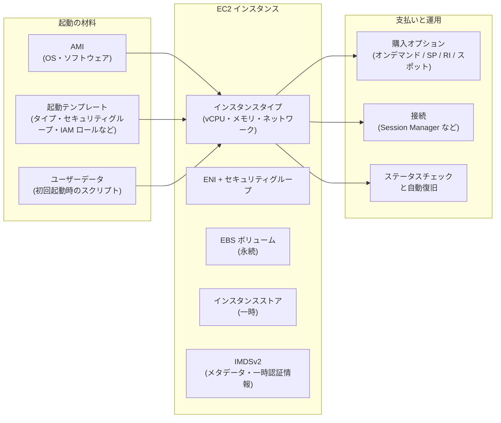
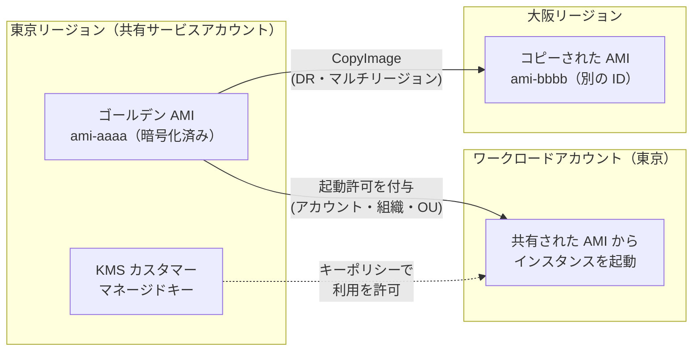
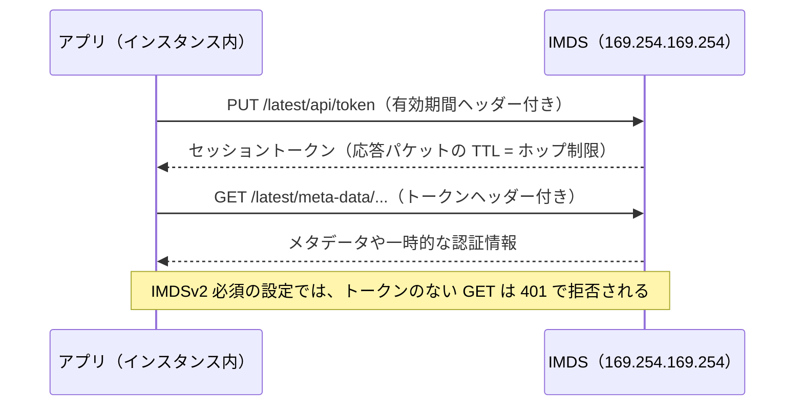
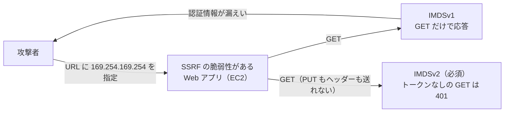
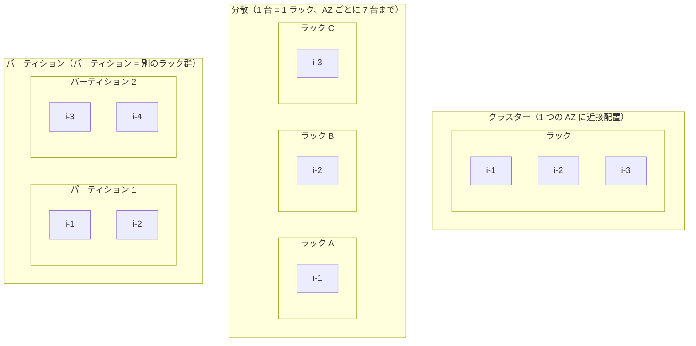
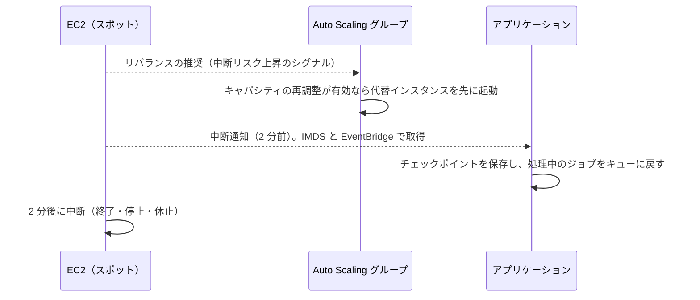
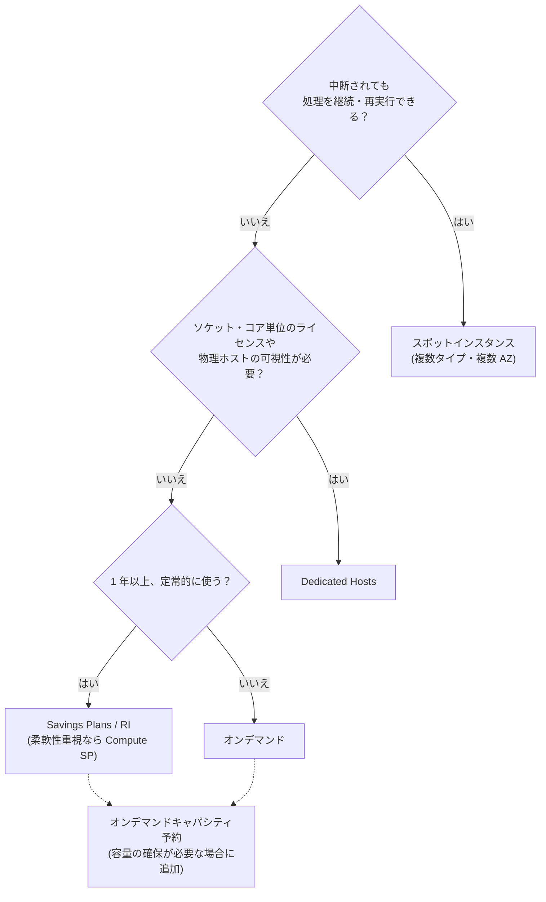
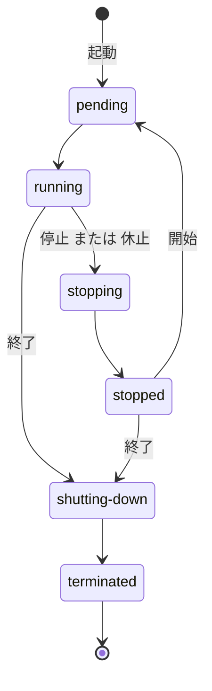
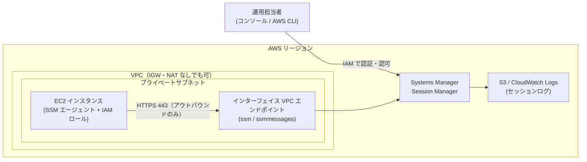

[ホーム](../README.md) > [Phase 2: アソシエイト](README.md) > Amazon EC2

# Amazon EC2

> **この章のゴール**
> - EC2 と AWS Nitro System の関係を説明し、インスタンスタイプ名（例: `m7g.2xlarge`）を読み解ける
> - ワークロードに合わせてインスタンスファミリー・サイズ・Graviton の採用を判断できる
> - AMI・起動テンプレート・ユーザーデータ・IMDSv2 を使って、安全かつ再現性のある起動ができる
> - プレイスメントグループ 3 種類と購入オプション（Savings Plans・リザーブドインスタンス・スポット・専有・キャパシティ予約）を要件から選べる
> - 停止・休止・終了の違い、安全な接続方法、ステータスチェックと自動復旧を説明できる
>
> **対応試験**: SAA-C03（第3分野: 高性能なアーキテクチャの設計 / 第4分野: コストを最適化したアーキテクチャの設計 ほか）
> **目安時間**: 読む 120分 / 確認問題 30分（ハンズオン Lab 02 は別途）

## この章の全体像

Amazon Elastic Compute Cloud（Amazon EC2）は、AWS 上で仮想サーバー（**インスタンス**）を必要なときに必要な数だけ起動できるサービスです。Lambda やコンテナが普及した現在でも、EC2 は多くの AWS サービス（ECS、EKS、EMR、Elastic Beanstalk など）の土台であり、SAA-C03 でも「どのインスタンスを・どこに・どう買って・どう守るか」が繰り返し問われます。

EC2 を設計するとは、次の 5 つを決めることです。

1. **何を動かすか** … AMI（OS とソフトウェアのイメージ）、ユーザーデータ
2. **どの性能で動かすか** … インスタンスタイプ（ファミリー・世代・サイズ）
3. **どこに置くか** … VPC・サブネット・アベイラビリティーゾーン（AZ）、プレイスメントグループ
4. **どう支払うか** … オンデマンド、Savings Plans、リザーブドインスタンス、スポット、専有、キャパシティ予約
5. **どう運用するか** … 接続（Session Manager など）、メタデータの保護（IMDSv2）、監視と自動復旧



VPC・サブネット・セキュリティグループの基礎は [VPC とネットワーク設計](02-vpc.md)、EBS とインスタンスストアの詳細は [ブロック・ファイルストレージ](06-ebs-efs-fsx.md)、複数台で冗長化・自動増減させる方法は次章 [Elastic Load Balancing と Auto Scaling](04-elb-auto-scaling.md) で扱います。

## 1. EC2 と AWS Nitro System

### 1.1 EC2 とは

EC2 は IaaS（Infrastructure as a Service）です。[責任共有モデル](../01-foundations/07-security-and-compliance.md)では、AWS が物理サーバー・ハイパーバイザー・データセンターを管理し、利用者は **OS 以上**（OS のパッチ、ミドルウェア、アプリケーション、データ、セキュリティグループの設定、IAM ロールの権限）を管理します。

課金の基本は次のとおりです。

- インスタンス料金は `running` 状態の間だけ発生します。Linux や Windows など多くの OS は **秒単位（最低 1 分）** で課金されます。
- `stopped`（停止）中はインスタンス料金はかかりませんが、**EBS ボリュームと Elastic IP アドレスなどの料金は発生し続けます**。
- 料金はリージョン・インスタンスタイプ・OS・購入オプションで決まります（[Amazon EC2 料金](https://aws.amazon.com/ec2/pricing/)）。

仮想化やハイパーバイザーの一般論は [サーバー・OS・仮想化の基礎](../01-foundations/02-server-os-basics.md) を復習してください。

### 1.2 AWS Nitro System

**AWS Nitro System** は、現行世代の EC2 インスタンスを支える基盤です。従来型の仮想化では、ホストの CPU 上で動くハイパーバイザーがネットワークやストレージの仮想化処理まで担っていたため、その分だけホストの資源が顧客に渡せませんでした。Nitro はこれらの処理を**専用ハードウェアにオフロード**します。

| 構成要素 | 役割 |
|---|---|
| Nitro カード | VPC ネットワーク、EBS、インスタンスストア、管理機能の処理を専用ハードウェアで実行 |
| Nitro セキュリティチップ | ハードウェアレベルで信頼の起点を提供し、ファームウェアを保護 |
| Nitro ハイパーバイザー | CPU とメモリの割り当てに専念する軽量なハイパーバイザー |

Nitro によって次のことが可能になりました。

- ホストの資源をほぼすべて顧客に提供できるため、ベアメタルに近い性能が出ます。サイズ名が `metal` の**ベアメタルインスタンス**も提供されています。
- AWS の運用担当者であっても、インスタンスのメモリや顧客データにアクセスする仕組みを持たないよう設計されています。
- 拡張ネットワーキング（ENA）、EFA、IMDS の IPv6 エンドポイント、アタッチ済み EBS のステータスチェック、Nitro Enclaves（機密データを隔離環境で処理する機能。Phase 3 で扱います）など、多くの機能が Nitro ベースのインスタンスを前提にしています。

参考: [AWS Nitro System](https://aws.amazon.com/ec2/nitro/) / [Nitro System 上に構築されたインスタンス](https://docs.aws.amazon.com/ec2/latest/instancetypes/ec2-nitro-instances.html)

> [!TIP]
> **試験のポイント**: Nitro そのものの内部構造はあまり問われません。問われるのは「Nitro を前提とした機能」です。「HPC のノード間通信を OS をバイパスして高速化」→ EFA、「ハイパーバイザーを介さず物理 CPU の機能を直接使いたい・独自のハイパーバイザーを動かしたい」→ ベアメタル（`.metal`）インスタンス、と結び付けて覚えましょう。

## 2. インスタンスタイプ

### 2.1 命名規則

インスタンスタイプ名は「**シリーズ（ファミリー） + 世代 + オプション（属性） . サイズ**」で構成されています。

`m7g.2xlarge` を分解すると次のとおりです。

| 部分 | 例 | 意味 |
|---|---|---|
| シリーズ | `m` | 汎用（General purpose） |
| 世代 | `7` | 第 7 世代。数字が大きいほど新しい |
| オプション | `g` | AWS Graviton プロセッサー（Arm） |
| サイズ | `2xlarge` | 8 vCPU / 32 GiB メモリ |

オプションの文字は複数並ぶことがあります。主な文字は次のとおりです（[公式の命名規則](https://docs.aws.amazon.com/ec2/latest/instancetypes/instance-type-names.html)）。

| 文字 | 意味 | 例 |
|---|---|---|
| `a` | AMD プロセッサー | `m7a`、`c7a` |
| `g` | AWS Graviton プロセッサー | `m7g`、`r8g` |
| `i` | Intel プロセッサー | `c7i`、`m7i` |
| `d` | インスタンスストアボリューム付き | `m5d`、`c6gd` |
| `n` | ネットワークと EBS に最適化（高帯域） | `c7gn`、`m6in` |
| `b` | ブロックストレージ（EBS）に最適化 | `r5b` |
| `e` | 追加のストレージ（ストレージ最適化）・追加のメモリ（メモリ最適化）・追加の GPU メモリ（高速コンピューティング） | `i7ie`、`x2iedn` |
| `z` | 高い CPU 周波数 | `m5zn`、`r7iz` |
| `flex` | Flex インスタンス（一般的なワークロード向けに通常版より低価格なバリエーション） | `m7i-flex` |
| `q` | Qualcomm の推論アクセラレーター | `dl2q` |

読み解きの練習をしてみましょう。

- `c7gn.xlarge` … コンピューティング最適化・第 7 世代・Graviton・ネットワーク強化・xlarge
- `r8g.4xlarge` … メモリ最適化・第 8 世代・Graviton（Graviton4）・4xlarge
- `x2iedn.metal` … メモリ集約型・第 2 世代・Intel・追加メモリ・インスタンスストア付き・ネットワーク強化・ベアメタル

同じファミリー内では、サイズが 1 段階上がるごとに vCPU・メモリがおおむね 2 倍になり、料金もおおむね 2 倍になります（例: `m7g.large` は 2 vCPU / 8 GiB、`m7g.xlarge` は 4 vCPU / 16 GiB）。

> [!TIP]
> **試験のポイント**: 名前の中の `d` は「インスタンスストア付き」の目印です。「一時データを超高速なローカル NVMe に置きたい」なら `d` 付きや I 系を選びます。ただしインスタンスストアは**停止・休止・終了でデータが消える**ため、永続データには使いません。

### 2.2 ファミリーとユースケース

| 分類 | 主なシリーズ | 特徴 | 代表的なユースケース |
|---|---|---|---|
| 汎用 | M、T、Mac | CPU・メモリ・ネットワークのバランスが良い（M は vCPU:メモリ ≒ 1:4） | Web / アプリケーションサーバー、中小規模の DB、開発・テスト環境 |
| コンピューティング最適化 | C | CPU あたりの価格性能が高い（vCPU:メモリ ≒ 1:2） | バッチ処理、動画エンコード、ゲームサーバー、科学計算、高負荷な Web サーバー |
| メモリ最適化 | R、X、U（ハイメモリ）、z | メモリ容量が大きい（R は vCPU:メモリ ≒ 1:8） | インメモリキャッシュ・DB、リアルタイム分析、SAP HANA などの大規模インメモリ DB |
| ストレージ最適化 | I、Im、Is、D | 高速なローカル NVMe SSD（I 系）や大容量 HDD（D 系）のインスタンスストア | NoSQL（Cassandra など）、高 IOPS の OLTP、データウェアハウス、HDFS などの分散ファイルシステム |
| 高速コンピューティング | P、G、Trn、Inf、F、VT | GPU、AWS 独自の機械学習チップ（Trainium / Inferentia）、FPGA | 機械学習の学習（P、Trn）・推論（Inf、G）、グラフィックス処理（G）、動画変換（VT）、FPGA 処理（F） |
| HPC 最適化 | Hpc | 大規模な密結合計算向け（EFA 対応） | 気象・流体・構造解析などの数値シミュレーション |

各ファミリーの詳細仕様は [Amazon EC2 インスタンスタイプ](https://docs.aws.amazon.com/ec2/latest/instancetypes/instance-types.html) で確認できます。

> [!TIP]
> **試験のポイント**: 問題文のキーワードとファミリーを対応付けます。
> - 「インメモリ」「大きなデータセットをメモリで処理」→ **R / X**
> - 「CPU 負荷の高いバッチ」「エンコード」→ **C**
> - 「高いランダム I/O」「低レイテンシーのローカルストレージ」→ **I**
> - 「機械学習の学習」→ **P / Trn**、「推論をコスト効率よく」→ **Inf / G**
> - 「負荷は普段低く、時々スパイク」→ **T**（次節）

### 2.3 AWS Graviton

**AWS Graviton** は AWS が独自に設計した Arm ベースのプロセッサーで、インスタンス名の `g` が目印です。世代ごとに Graviton2（例: M6g、T4g）→ Graviton3（例: M7g、C7g）→ Graviton4（例: M8g、R8g）と進化してきました。さらに Graviton5 を搭載した第 9 世代（M9g、C9g、R9g など）も登場しています（対応リージョンなどの最新状況は [AWS Graviton](https://aws.amazon.com/ec2/graviton/) で確認してください）。

- **メリット**: 同等の x86 インスタンスより価格性能が高いことが多く、消費電力も少なくて済みます（持続可能性の観点でも有利）。AWS は、Graviton ベースのインスタンスは同等の x86 ベースの EC2 インスタンスと比べて**コストが最大 20% 低く**、**エネルギー消費が最大 60% 少ない**と公表しています（2026年9月時点）。
- **注意点**: CPU アーキテクチャが arm64 になるため、**arm64 用の AMI とバイナリ**（コンテナならマルチアーキテクチャイメージ）が必要です。Java・Python・Node.js などは比較的移行しやすい一方、ネイティブライブラリや商用ソフトウェアは対応状況の確認が必要です。
- **マネージドサービスでも選べる**: RDS、ElastiCache、Lambda、Fargate などでも Graviton を選択でき、アプリケーションの変更なしで移行できることが多いです。

> [!TIP]
> **試験のポイント**: 「アプリケーションは Arm に対応できる」「価格性能を改善したい」「コストを削減したい」→ Graviton ベースのインスタンスへの移行が定番の正解です。コスト最適化の全体像は [コスト最適化](18-cost-optimization.md) で扱います。

### 2.4 サイズ選定とタイプ変更

- **ライトサイジング**: まず CloudWatch で CPU・ネットワークを確認します（メモリ使用率は CloudWatch エージェントを入れないと取得できません）。AWS Compute Optimizer は過去の使用状況から適切なタイプとサイズを推奨します（[監視と運用管理](13-monitoring-management.md)）。
- **タイプの変更**: EBS をルートに持つインスタンスは、**停止してから**インスタンスタイプを変更できます。ただし x86 と Arm（Graviton）の間は AMI のアーキテクチャが異なるため、タイプ変更だけでは移行できません。

> [!WARNING]
> **ひっかけ注意**: インスタンスタイプの変更（垂直スケーリング）には**停止が必要**で、無停止では行えません。「停止せずに処理能力を増やしたい」なら、Auto Scaling による水平スケーリングを検討します（[次章](04-elb-auto-scaling.md)）。

## 3. バーストパフォーマンスインスタンス（T 系）

### 3.1 CPU クレジットの仕組み

多くの Web サーバーや開発環境は、平均すると CPU をあまり使わず、ときどきスパイクするだけです。T 系インスタンスは、普段は**ベースライン**（常時使ってよい CPU 使用率）までの性能を提供し、必要なときだけ**CPU クレジット**を消費してバーストする、という仕組みで低価格を実現しています。

- **1 CPU クレジット** = 1 vCPU を 100% で 1 分間使う量（= 1 vCPU を 50% で 2 分、でも同じ）
- インスタンスはサイズごとに決まった速さでクレジットを**獲得**し、ベースラインを超えて使うと**消費**します。
- 貯められるクレジットの上限は、おおむね **24 時間分の獲得量**です。

`t3.micro` の例で計算してみます（[CPU クレジットとベースライン](https://docs.aws.amazon.com/AWSEC2/latest/UserGuide/burstable-credits-baseline-concepts.html)）。

| 項目 | 値 |
|---|---|
| vCPU | 2 |
| 1 時間あたりの獲得クレジット | 12 |
| 貯められる上限 | 288（= 12 × 24） |
| ベースライン（vCPU あたり） | 10%（= 12 ÷ 2 vCPU ÷ 60 分） |

2 つの vCPU を平均 30% で 1 時間使うと、消費は 2 × 0.30 × 60 = **36 クレジット**、獲得は 12 クレジットなので、残高は 1 時間に 24 ずつ減っていきます。残高が尽きたときの動きは、次のクレジット設定で変わります。

- T3・T3a・T4g などは、停止してもクレジット残高が **7 日間**保持されます。T2（旧世代）は停止すると失われます。

### 3.2 standard モードと unlimited モード

| 項目 | standard | unlimited |
|---|---|---|
| 残高が尽きたとき | ベースラインまで性能が抑えられる | **余剰クレジット**を使って高負荷を続けられる |
| 追加料金 | なし | 24 時間の移動平均（または起動からの期間の短い方）で CPU 使用率がベースラインを超えた分に、vCPU 時間あたりの固定料金 |
| 既定のモード | T2 | T3・T3a・T4g など |

unlimited モードでも、平均がベースライン以下に収まれば追加料金はかかりません。一方で**常に高負荷**なら、同程度の固定性能インスタンス（M 系など）より高くなります。AWS のドキュメントでは、`t3.large` と `m5.large` の損益分岐点は平均 CPU 使用率 42.5% という例（us-east-1、Linux）が示されています（[unlimited モードの考え方](https://docs.aws.amazon.com/AWSEC2/latest/UserGuide/burstable-performance-instances-unlimited-mode-concepts.html)）。

監視には CloudWatch の `CPUCreditBalance`（残高）、`CPUSurplusCreditBalance`（使った余剰クレジット）、`CPUSurplusCreditsCharged`（課金された余剰クレジット）を使います。

> [!TIP]
> **試験のポイント**: 「T 系のインスタンスで、ときどき性能が極端に落ちる」→ CPU クレジットの枯渇（standard モード）を疑います。スパイクが一時的なら **unlimited モード**、常に高負荷なら **M 系や C 系への変更**が正解です。

> [!WARNING]
> **ひっかけ注意**: unlimited は「追加料金なしで無制限にバーストできる」という意味ではありません。平均使用率がベースラインを超え続けると、余剰クレジット分が課金されます。

## 4. AMI と起動テンプレート

### 4.1 AMI とは

Amazon マシンイメージ（AMI）は、インスタンスを起動するための「ひな形」です。同じ AMI から起動すれば、何台でも同じ構成のインスタンスを作れます。AMI は次の 3 つの要素で構成されます。

- **ルートボリュームのテンプレート**: EBS ベースの AMI では EBS スナップショット（OS・ミドルウェア・アプリケーションを含む）
- **起動許可**: どの AWS アカウントがこの AMI からインスタンスを起動できるか
- **ブロックデバイスマッピング**: 起動時にアタッチするボリュームの構成（サイズ・タイプ・暗号化など）

| 入手先 | 例 | 注意点 |
|---|---|---|
| AWS 提供の AMI | Amazon Linux 2023、Windows Server、Ubuntu など | パッチ適用済みの新しい版が定期的に公開される |
| AWS Marketplace | ソフトウェア込みの AMI（ライセンス料を時間課金で支払うものも多い） | ソフトウェア料金が EC2 料金に上乗せされる |
| コミュニティ AMI | 第三者が公開した AMI | 信頼性・安全性は利用者の責任で確認する |
| 自作の AMI（カスタム AMI） | 設定済みのインスタンスから作成 | 作成時に取得されたスナップショットの保管料金がかかる |

インスタンスから AMI を作成すると、アタッチされている EBS ボリュームのスナップショットが取得され、それを参照する AMI が登録されます。既定では、ファイルシステムの整合性を保つために作成時にインスタンスが再起動されます（再起動しないオプションもありますが、その場合の整合性は利用者が担保します）。

AMI の最も重要な性質は **リージョン固有** であることです。AMI ID（`ami-` で始まる ID）はリージョンごとに異なり、東京リージョンで作った AMI を大阪リージョンでそのまま指定して起動することはできません。

> [!NOTE]
> 現在の AMI のほとんどは、ルートボリュームが EBS の「EBS-backed AMI」です。ルートがインスタンスストアの「instance store-backed AMI」は旧来の方式で、インスタンスを停止できないなどの制約があります。

参考: [Amazon マシンイメージ（AMI）](https://docs.aws.amazon.com/AWSEC2/latest/UserGuide/AMIs.html)

### 4.2 AMI のコピーと共有

AMI を別のリージョンで使うには **コピー** し、別のアカウントで使うには **共有**（起動許可の付与）します。

| 操作 | 内容 | 主な用途 |
|---|---|---|
| コピー | 同一または別のリージョンへ AMI を複製する。コピー先では新しい AMI ID になる。コピー時に暗号化したり KMS キーを変更したりできる | 別リージョンでの DR、マルチリージョン展開、暗号化されていない AMI の暗号化 |
| 共有 | 起動許可に特定のアカウント・組織・OU を追加する。AMI 自体は共有元に残る | 共有サービスアカウントで作ったゴールデン AMI を各アカウントへ配布 |
| 公開 | 起動許可をすべての AWS アカウントに開放する | 公開ソフトウェアの配布（企業の内部 AMI では通常行わない） |



暗号化された AMI を共有するときは、次の点に注意します。

- スナップショットが **AWS マネージドキー（`aws/ebs`）** で暗号化されている AMI は、他のアカウントと共有できません。**カスタマーマネージドキー** で暗号化し、キーポリシーで共有先アカウントにキーの利用を許可します。
- 共有先アカウントでは、共有された AMI を自アカウントのキーで再暗号化しながらコピーしておくと、共有元での登録解除やキーの無効化の影響を受けにくくなります。

AMI の誤った公開を防ぐ仕組みも用意されています。

- **AMI のブロックパブリックアクセス**: リージョン内の AMI を公開共有できないようにする設定です。
- **許可された AMI（Allowed AMIs）**: インスタンスの起動に使える AMI を、信頼できる提供元（自組織のアカウントや AWS など）のものに限定する設定です。

これらは AWS Organizations の **宣言型ポリシー（EC2）** で組織全体に強制することもできます（[マルチアカウント戦略とガバナンス](../03-professional/02-multi-account-governance.md)）。

> [!TIP]
> **試験のポイント**: 「別リージョンで同じ構成のサーバーを素早く起動したい（DR）」→ AMI（と EBS スナップショット）を別リージョンへ **コピー** します。AMI はリージョン固有なので、コピーせずに別リージョンで使うことはできません。

> [!WARNING]
> **ひっかけ注意**: 「AMI を共有したのに、共有先アカウントで起動に失敗する」→ KMS キーの利用権限が共有先に付与されていない、または AWS マネージドキーで暗号化されている可能性を疑います。AMI の起動許可だけでは足りません。

### 4.3 ゴールデン AMI と EC2 Image Builder

サーバーの構成を「いつ」作り込むかには、次の 2 つの考え方があります。

| 方式 | 内容 | 長所 | 短所 |
|---|---|---|---|
| ゴールデン AMI（ベイク） | OS パッチ・ミドルウェア・エージェント・アプリケーションを事前に AMI へ焼き込む | 起動が速い（スケールアウトが速い）、構成のばらつきがない | AMI を作成・テスト・配布する仕組みが必要 |
| ブートストラップ | 素の AMI から起動し、ユーザーデータや構成管理ツールで起動時にセットアップする | 柔軟で、AMI の管理が不要 | 起動に時間がかかる、外部リポジトリの障害の影響を受ける |
| ハイブリッド | 変化の少ない部分は AMI に焼き込み、環境ごとの設定値は起動時に取得する（Parameter Store など） | 両者の長所を両立 | 設計がやや複雑 |

**EC2 Image Builder** は、ゴールデン AMI（とコンテナイメージ）の作成・テスト・配布を自動化するマネージドサービスです。

- **イメージレシピ**: ベースイメージと「コンポーネント」（ソフトウェアのインストール、設定、セキュリティ強化の手順）の組み合わせを定義します。
- **パイプライン**: スケジュールに従ってビルドを実行します。ベースイメージやコンポーネントが更新されたときだけ実行する設定もできます。
- **テストと配布**: ビルド後にテストを実行し、合格したイメージだけを複数のリージョン・アカウントへ配布します。
- **料金**: Image Builder 自体に追加料金はなく、ビルドに使う EC2 インスタンスやスナップショットなどの料金だけがかかります。

参考: [EC2 Image Builder とは](https://docs.aws.amazon.com/imagebuilder/latest/userguide/what-is-image-builder.html)

> [!TIP]
> **試験のポイント**: 「パッチを適用した AMI を定期的に作成し、テストしてから複数のリージョンとアカウントに配布したい。運用上のオーバーヘッドを最小にしたい」→ **EC2 Image Builder**。「スケールアウト時の起動を速くしたい」→ ユーザーデータでの長いインストール処理をやめ、**ゴールデン AMI** に焼き込みます（さらに速くするなら次章のウォームプール）。

### 4.4 起動テンプレート

**起動テンプレート** は、インスタンスの起動パラメーターを保存しておく仕組みです。AMI ID、インスタンスタイプ、キーペア、セキュリティグループ、ネットワーク設定、IAM インスタンスプロファイル（IAM ロール）、ユーザーデータ、EBS ボリューム、メタデータのオプション（IMDSv2 の強制など）、購入オプション（スポット）、タグ、プレイスメントグループなどを指定できます。

- **バージョン管理**: 変更は新しいバージョンとして保存され、既存のバージョンは変わりません。「デフォルトバージョン」や「最新（`$Latest`）」を指定でき、問題があれば前のバージョンに戻せます。
- **利用先**: マネジメントコンソールや CLI からの起動、Auto Scaling グループ、EC2 フリートで使えます。複数のインスタンスタイプやスポットを組み合わせる **混合インスタンスポリシー** は起動テンプレートが前提です。
- **起動設定（launch configuration）** は Auto Scaling 用の旧方式です。作成後に変更できず（作り直しが必要）、新しい機能にも対応していないうえ、新しいアカウントでは作成もできません。

参考: [起動テンプレート](https://docs.aws.amazon.com/AWSEC2/latest/UserGuide/ec2-launch-templates.html)

> [!WARNING]
> **ひっかけ注意**: 古い問題文や教材では「起動設定」が登場します。現在は **起動テンプレート** を使うのが正解です。起動設定は変更できないため「起動設定を編集する」という選択肢は誤りです。

## 5. ユーザーデータとインスタンスメタデータ（IMDSv2）

### 5.1 ユーザーデータ

**ユーザーデータ** は、起動時にインスタンスへ渡すスクリプト（または cloud-init の設定）です。Linux では cloud-init が、Windows では EC2Launch v2 が処理します。

- 既定では **初回起動時に 1 回だけ**、**root 権限**で実行されます（再起動のたびに実行したい場合は cloud-init の設定が必要です）。
- サイズの上限は **16 KB**（base64 エンコード前）です。大きな処理は S3 に置いたスクリプトをダウンロードして実行します。
- ユーザーデータはインスタンス内から誰でも読み取れます（後述の IMDS 経由）。**パスワードや API キーを書いてはいけません**。IAM ロールを付けて AWS Secrets Manager や Systems Manager Parameter Store から取得します。
- 実行ログは Amazon Linux では `/var/log/cloud-init-output.log` で確認できます。
- 内容を変更するには、インスタンスを停止する必要があります。

```bash
#!/bin/bash
# Amazon Linux 2023: Web サーバーをインストールし、自分の AZ を表示するページを作る
dnf -y install httpd
TOKEN=$(curl -s -X PUT "http://169.254.169.254/latest/api/token" \
  -H "X-aws-ec2-metadata-token-ttl-seconds: 300")
AZ=$(curl -s -H "X-aws-ec2-metadata-token: $TOKEN" \
  http://169.254.169.254/latest/meta-data/placement/availability-zone)
echo "<h1>Hello from ${AZ}</h1>" > /var/www/html/index.html
systemctl enable --now httpd
```

このスクリプトは [Lab 02](../04-labs/lab02-vpc-ec2.md) や [Lab 03](../04-labs/lab03-alb-auto-scaling.md) の Web サーバーと同じ考え方です。IMDSv2 の手順（トークンの取得 → トークン付きでの取得）が含まれている点に注目してください。

### 5.2 インスタンスメタデータサービス（IMDS）

**インスタンスメタデータサービス（IMDS）** は、インスタンスが自分自身の情報を取得するための仕組みです。インスタンス内からリンクローカルアドレス `169.254.169.254`（Nitro ベースのインスタンスでは IPv6 の `fd00:ec2::254` も可）にアクセスします。

| パス（`/latest/` 以下） | 取得できる情報 |
|---|---|
| `meta-data/instance-id` | インスタンス ID |
| `meta-data/placement/availability-zone` | 起動している AZ |
| `meta-data/local-ipv4`、`meta-data/public-ipv4` | プライベート IP、パブリック IP |
| `meta-data/iam/security-credentials/<ロール名>` | **IAM ロールの一時的な認証情報**（アクセスキー、シークレットキー、セッショントークン） |
| `meta-data/spot/instance-action` | スポットインスタンスの中断通知（9.4 節） |
| `meta-data/placement/partition-number` | パーティションプレイスメントグループのパーティション番号（8 章） |
| `user-data` | ユーザーデータ |

AWS SDK や AWS CLI は、IMDS から IAM ロールの一時的な認証情報を自動的に取得・更新します。これが「EC2 にはアクセスキーを置かず IAM ロールを使う」ことができる仕組みです（[IAM 徹底解説](01-iam.md)）。裏返せば、**IMDS へのアクセスを攻撃者に悪用されると、IAM ロールの認証情報が盗まれる** ということでもあります。

### 5.3 IMDSv1 と IMDSv2

IMDS には 2 つの方式があります。

- **IMDSv1**: 単純な HTTP GET リクエストで情報を返します（リクエスト／レスポンス型）。
- **IMDSv2**: 先に HTTP PUT リクエストで **セッショントークン** を取得し、以降のリクエストにそのトークンをヘッダーで付ける方式です（セッション指向）。



- トークンの有効期間はリクエスト時に 1 秒〜6 時間（21,600 秒）の範囲で指定します。
- トークンは発行されたインスタンスでのみ有効で、別のインスタンスでは使えません。
- インスタンスのメタデータオプションで `HttpTokens=required` にすると **IMDSv2 のみ**（IMDSv1 は拒否）、`optional` にすると両方を受け付けます。

### 5.4 なぜ IMDSv2 で SSRF を緩和できるのか

**SSRF（サーバーサイドリクエストフォージェリ）** は、「ユーザーが指定した URL の内容をサーバー側で取得する」機能（URL のプレビュー、画像の取り込み、Webhook など）を悪用する攻撃です。攻撃者が URL として `http://169.254.169.254/latest/meta-data/iam/security-credentials/<ロール名>` を指定すると、IMDSv1 ではサーバーがその内容を取得して攻撃者に返してしまい、IAM ロールの一時的な認証情報が漏えいします。盗まれた認証情報は、有効期限が切れるまでインスタンスの外からでも使えてしまいます。



IMDSv2 が SSRF に強い理由は、次の多層的な仕組みにあります。

1. **PUT リクエストとカスタムヘッダーが必須**: 典型的な SSRF で攻撃者が操作できるのは「GET リクエストの URL」だけです。サーバーに PUT リクエストを送らせたり、任意のヘッダーを付けさせたりすることは通常できないため、トークンを取得できません。
2. **`X-Forwarded-For` ヘッダー付きの PUT は拒否**: 設定ミスのリバースプロキシやオープンプロキシを経由したリクエストには、通常このヘッダーが付きます。IMDSv2 はこれを含むトークン要求を拒否します。
3. **ホップ制限（`HttpPutResponseHopLimit`）**: トークンを返す応答パケットの IP TTL を制限します。1 にすると、トークンはインスタンスの外（ルーターのように振る舞う別ホストなど）には届きません。コンテナをブリッジネットワークで動かし、コンテナ内から IMDS を使う場合は 2 が必要です。
4. **トークンの有効期限とインスタンスへの紐付け**: トークンは最大 6 時間で失効し、発行元のインスタンスでしか使えません。

### 5.5 IMDSv2 を強制・監視する方法

| 範囲 | 方法 |
|---|---|
| インスタンス単位 | 起動時、または稼働中に `modify-instance-metadata-options` で `HttpTokens=required` にする |
| AMI 単位 | AMI の `ImdsSupport` を `v2.0` にすると、その AMI から起動したインスタンスは IMDSv2 のみになる |
| アカウント単位 | リージョンごとの IMDS の既定値（アカウントレベルの設定）で、新規インスタンスを IMDSv2 のみにする |
| 組織全体 | AWS Organizations の宣言型ポリシー（EC2）で IMDSv2 を強制する。または SCP で条件キー `ec2:MetadataHttpTokens` を使い、IMDSv2 必須でない `RunInstances` を拒否する |
| 監視 | CloudWatch メトリクス `MetadataNoToken`（トークンなし＝IMDSv1 での呼び出し回数）で、IMDSv1 を使い続けているアプリケーションを見つける |

IMDS をまったく使わないインスタンスでは、IMDS 自体を無効化（`HttpEndpoint=disabled`）することもできます。Amazon Linux 2023 の AMI などでは IMDSv2 のみが既定になっており、新しく作るものは IMDSv2 前提で設計するのが基本です。

参考: [インスタンスメタデータサービスの使用](https://docs.aws.amazon.com/AWSEC2/latest/UserGuide/configuring-instance-metadata-service.html)

> [!TIP]
> **試験のポイント**: 「SSRF」「メタデータ経由の認証情報の窃取を防ぐ」→ **IMDSv2 を必須（`HttpTokens=required`）にする** が定番です。組織全体で強制するなら宣言型ポリシーや SCP を使います。

> [!WARNING]
> **ひっかけ注意**: セキュリティグループやネットワーク ACL で `169.254.169.254` への通信をブロックすることは **できません**。IMDS（や Amazon DNS、Amazon Time Sync Service）への通信はこれらのフィルタリングの対象外です。アクセスを OS ユーザー単位で絞りたい場合は、OS のファイアウォール（iptables など）を使います。

## 6. ストレージ（EBS とインスタンスストア）

### 6.1 EBS とインスタンスストアの違い

EC2 のブロックストレージには、ネットワーク経由で接続する **Amazon EBS** と、ホストに物理的に接続された **インスタンスストア** の 2 種類があります。

| 項目 | EBS | インスタンスストア |
|---|---|---|
| 接続 | ネットワーク経由（Nitro カードが処理をオフロード） | ホストの物理ディスク（NVMe SSD や HDD） |
| 永続性 | インスタンスとは独立して永続 | **停止・休止・終了で消える**（再起動では残る） |
| 範囲 | 1 つの AZ 内 | そのホストのみ |
| バックアップ | スナップショット（S3 に保存、別リージョンへコピー可） | 仕組みなし（アプリケーション側で複製や S3 への退避） |
| 付け替え | デタッチして同じ AZ の別インスタンスへアタッチ可能 | 不可 |
| 容量・性能の変更 | Elastic Volumes で使用中に変更可能 | インスタンスタイプで固定（追加は起動時のみ） |
| 料金 | プロビジョニングした容量・IOPS などに課金 | インスタンス料金に含まれる |
| 主な用途 | ルートボリューム、データベース、永続データ | キャッシュ、バッファ、一時ファイル、他ノードに複製される分散 DB のデータ |

| イベント | EBS のデータ | インスタンスストアのデータ |
|---|---|---|
| 再起動 | 残る | 残る |
| 停止・休止 | 残る | **消える** |
| 終了 | ルートボリュームは既定で削除、後からアタッチしたボリュームは既定で残る | **消える** |

EBS ボリュームが終了時に削除されるかは、ボリュームごとの **`DeleteOnTermination` 属性** で決まります。既定ではルートボリュームが `true`（削除）、後からアタッチしたボリュームが `false`（残す）です。終了後もデータを残したいルートボリュームは、この属性を `false` にしておきます。

現行世代のほとんどのインスタンスは、EBS 用の専用帯域を持つ **EBS 最適化** が既定で有効になっています（追加料金なし）。ボリュームタイプ（gp3、io2 Block Express など）、スナップショット、暗号化、Multi-Attach の詳細は [ブロック・ファイルストレージ](06-ebs-efs-fsx.md) で学びます。

> [!TIP]
> **試験のポイント**: 「非常に高い I/O 性能が必要な一時データ」「データは他のノードに複製されているので失われてもよい」→ **インスタンスストア**。「停止後もデータを保持」「スナップショットでバックアップ」→ **EBS**。

> [!WARNING]
> **ひっかけ注意**: インスタンスストア付きのインスタンスを「停止 → 起動」すると、別のホストに移ることがありデータは消えます。後述の自動復旧でもインスタンスストアのデータは失われます。重要なデータをインスタンスストアだけに置く設計は誤りです。

## 7. ネットワーク（ENI・Elastic IP・ENA・EFA）

### 7.1 Elastic Network Interface（ENI）

**ENI** は VPC 内の仮想的なネットワークカードです。次の属性を持ち、**セキュリティグループは ENI に関連付けられます**。

- プライマリプライベート IPv4 アドレス、セカンダリプライベート IPv4 アドレス
- プライベート IPv4 アドレスごとに 1 つの Elastic IP アドレス
- 自動割り当てのパブリック IPv4 アドレス、IPv6 アドレス
- セキュリティグループ、MAC アドレス、送信元／送信先チェックのフラグ

重要な性質は次のとおりです。

- すべてのインスタンスにはプライマリ ENI（`eth0`）があり、これはデタッチできません。
- 追加の ENI は、稼働中（ホットアタッチ）、停止中（ウォームアタッチ）、起動時（コールドアタッチ）にアタッチできます。
- ENI はサブネット（つまり AZ）に属するため、**付け替えられるのは同じ AZ のインスタンスだけ** です。
- アタッチできる ENI の数と、ENI あたりの IP アドレス数はインスタンスタイプで決まります。

使いどころの例です。

- **管理用ネットワークの分離**: 業務用と管理用で別のサブネット・セキュリティグループの ENI を持たせる（デュアルホーム）。
- **簡易的なフェイルオーバー**: セカンダリ ENI を障害時に予備のインスタンスへ付け替えると、プライベート IP アドレスと MAC アドレスを引き継げます（MAC アドレスに紐付いたライセンスなど）。
- **ネットワークアプライアンス**: NAT インスタンスやファイアウォールのように他者宛ての通信を中継する場合は、送信元／送信先チェックを無効にします。

> [!WARNING]
> **ひっかけ注意**: ENI を複数アタッチしても、インスタンスのネットワーク帯域は増えません。帯域はインスタンスタイプで決まります。

### 7.2 パブリック IP アドレスと Elastic IP アドレス

| 項目 | 自動割り当てパブリック IPv4 | Elastic IP アドレス（EIP） |
|---|---|---|
| 取得方法 | サブネットの設定や起動時の指定で自動的に付与 | アカウントに確保（リージョン単位） |
| 停止 → 起動 | **変わる**（停止時に解放される） | 変わらない |
| 付け替え | できない | 別のインスタンスや ENI に付け替えられる |
| 料金 | 1 IP あたり 1 時間 0.005 USD | 1 IP あたり 1 時間 0.005 USD（**未使用でも課金**） |

2024 年 2 月から、パブリック IPv4 アドレスは使用中・未使用にかかわらず 1 時間あたり 0.005 USD が課金されます（2026年9月時点、[Amazon VPC 料金](https://aws.amazon.com/vpc/pricing/)）。EIP の数には既定でリージョンあたり 5 個のクォータがあります（引き上げ申請可能）。

- プライベート IPv4 アドレスは、停止・起動しても変わりません。
- EIP は「IP アドレスを固定したい」ときの手段ですが、多用は避けます。Web サービスなら ELB の DNS 名や Route 53 を使い、IP アドレスを意識しない設計が基本です。取引先のファイアウォールで固定 IP の許可が必要な場合は、NLB への EIP 割り当てや AWS Global Accelerator も選択肢です（[次章](04-elb-auto-scaling.md)、[Route 53・CloudFront・Global Accelerator](08-route53-cloudfront.md)）。

### 7.3 拡張ネットワーキング（ENA）と EFA

| 機能 | 概要 | 主な用途 |
|---|---|---|
| ENI | 論理的な仮想ネットワークカード | IP アドレスやセキュリティグループの管理、マルチホーム、付け替え |
| **ENA**（Elastic Network Adapter） | SR-IOV による **拡張ネットワーキング**。高い帯域幅・高い PPS（秒間パケット数）・低いレイテンシーを実現。追加料金なし | 現行世代のほぼすべてのインスタンス（主要な AMI では既定で有効） |
| **EFA**（Elastic Fabric Adapter） | ENA の機能に加え、**OS をバイパス** してアプリケーションが NIC と直接通信できるデバイス。MPI や NCCL による大量のノード間通信を高速化 | HPC（密結合の数値計算）、大規模な分散機械学習 |

EFA のポイントは次のとおりです。

- 対応するインスタンスタイプでのみ使えます。
- EFA の ENI には、同じセキュリティグループ内との間ですべての通信を許可するセキュリティグループを関連付けます。
- ノード間のレイテンシーを最小にするため、**クラスタープレイスメントグループ** と組み合わせるのが定石です。

> [!TIP]
> **試験のポイント**: 3 つの似た名前を区別します。「HPC」「MPI」「OS バイパス」「密結合」→ **EFA**。「拡張ネットワーキング」「高い PPS・低レイテンシー」→ **ENA**。「IP アドレスを別のインスタンスへ移す」「管理用ネットワークを分ける」→ **ENI**。

## 8. プレイスメントグループ

EC2 は既定で、関連する障害の影響を減らすためにインスタンスを異なるハードウェアへ分散して配置します。**プレイスメントグループ** は、この配置の方針を利用者が指定する仕組みで、目的に応じて 3 つの戦略があります（追加料金なし）。

| 項目 | クラスター | 分散（スプレッド） | パーティション |
|---|---|---|---|
| 配置の方針 | 1 つの AZ 内で、近接したハードウェアにまとめて配置 | 各インスタンスを **別々のラック**（独立した電源とネットワーク）に配置 | インスタンスを論理的な **パーティション** に分け、パーティションごとに別のラック群に配置 |
| AZ | 単一 AZ | 複数 AZ にまたがれる | 複数 AZ にまたがれる |
| 数の上限 | 戦略としての上限はない（キャパシティ次第） | **AZ ごとに、グループあたり実行中 7 インスタンスまで** | **AZ ごとに最大 7 パーティション**（パーティション内の台数はアカウントの上限の範囲内で自由） |
| 得られるもの | ノード間の低レイテンシー・高スループット | 同時障害の最小化（1 つのラック障害で影響は 1 台） | パーティション単位の障害分離と大規模化。インスタンスは自分のパーティション番号を IMDS で知ることができる |
| 注意点 | ラックや AZ の障害でまとめて影響を受け得る。キャパシティ不足で起動に失敗しやすい | 台数の少ない用途に限られる | 同じパーティション内のインスタンスはラックを共有し得る |
| 典型的な用途 | HPC、密結合の分散計算（EFA と併用） | 少数の重要なインスタンス（プライマリ DB とスタンバイ、ドメインコントローラーなど） | HDFS、HBase、Cassandra、Kafka など、トポロジーを意識する大規模分散システム |



運用上のポイントです。

- **クラスター**: 必要なインスタンスを **1 回の起動リクエストで、同じインスタンスタイプでまとめて起動** するとキャパシティ不足エラーになりにくくなります。エラーになった場合は、グループ内のインスタンスをすべて停止してから再度起動すると、十分なキャパシティのあるハードウェアへ移せることがあります。確実に確保したい場合は、キャパシティ予約（9.7 節）をクラスタープレイスメントグループ内に作成できます。
- **分散**: 3 つの AZ を使っても、1 つのグループに入れられるのは最大 21 台（7 台 × 3 AZ）です。それを超えるなら、グループを分けるかパーティション戦略を検討します。
- 既存のインスタンスをプレイスメントグループに入れる（または移す）には、インスタンスを **停止** してから変更します。

参考: [プレイスメントグループ](https://docs.aws.amazon.com/AWSEC2/latest/UserGuide/placement-groups.html)

> [!TIP]
> **試験のポイント**: 「ノード間の低レイテンシー」「ノード間のスループットを最大化」「HPC」→ **クラスター**。「少数の重要なインスタンスを同時障害から守る」→ **分散**。「Hadoop・Cassandra・Kafka」「ラックを意識した大規模分散」→ **パーティション**。

> [!WARNING]
> **ひっかけ注意**: クラスタープレイスメントグループは **性能のための配置** であり、可用性は下がり得ます（単一 AZ・近接配置）。「高可用性」を求める問題でクラスターを選ばないようにしましょう。また「1 つの AZ の分散プレイスメントグループに 10 台」のような構成は、7 台の上限を超えるため作れません。

## 9. 購入オプション

### 9.1 全体像

同じインスタンスでも、買い方によって料金は大きく変わります。「どれくらいの期間使うか」「中断に耐えられるか」「キャパシティの確保が必要か」「ライセンスや物理的な分離の要件があるか」で選びます。下表の割引率はいずれも **最大値** で、インスタンスタイプ・リージョン・期間・支払い方法によって変わります（2026年9月時点）。

| オプション | 仕組み | オンデマンド比の割引 | 中断 | 向いている用途 |
|---|---|---|---|---|
| オンデマンド | 秒単位（最低 1 分）の従量課金。コミットなし | なし（基準） | なし | 短期・不定期・予測できない負荷、検証 |
| Savings Plans | 1 年または 3 年、1 時間あたりの利用額（USD/時）をコミット | 最大 72% | なし | 定常的な利用 |
| リザーブドインスタンス（RI） | 1 年または 3 年、インスタンスの属性を指定して購入 | 最大 72% | なし | 定常的な利用 |
| スポットインスタンス | EC2 の余剰キャパシティを利用 | 最大 90% | **あり（2 分前に通知）** | 中断に耐えられる処理 |
| Dedicated Hosts | 物理サーバーを丸ごと専有 | ホストの予約で割引 | なし | BYOL、コンプライアンス |
| Dedicated Instances | 自アカウント専用のハードウェアで実行 | RI・Savings Plans を適用可 | なし | ハードウェア分離の規制要件 |
| オンデマンドキャパシティ予約 | 特定 AZ のキャパシティを期間の縛りなしで確保 | なし（Savings Plans などと併用） | なし | 確実に起動したい DR やイベント |
| ML 用キャパシティブロック | 将来の期間の GPU インスタンスなどを予約 | ―（予約期間分を支払う） | なし | 数日〜数週間の機械学習 |

料金の詳細: [Amazon EC2 料金](https://aws.amazon.com/ec2/pricing/) / [Savings Plans](https://aws.amazon.com/savingsplans/) / [リザーブドインスタンス](https://aws.amazon.com/ec2/pricing/reserved-instances/) / [スポットインスタンスの料金](https://aws.amazon.com/ec2/spot/pricing/)

### 9.2 Savings Plans

「1 時間あたり X USD 分を 1 年（または 3 年）使う」と **金額でコミット** すると、その金額までの利用に割引価格が適用される仕組みです。コミットを超えた分はオンデマンド料金になり、使い切れなかったコミットは無駄になります。支払い方法は全額前払い・一部前払い・前払いなしから選べ、前払いが多いほど割引が大きくなります。

| 種類 | 適用対象 | 柔軟性 | 最大割引 |
|---|---|---|---|
| **Compute Savings Plans** | EC2（ファミリー・サイズ・AZ・リージョン・OS・テナンシーを問わない）、AWS Fargate、AWS Lambda | 最も高い | 66% |
| **EC2 Instance Savings Plans** | 特定リージョンの特定インスタンスファミリー（例: 東京リージョンの M7g）。サイズ・OS・テナンシー・AZ は自由 | 中 | 72% |
| SageMaker AI Savings Plans | Amazon SageMaker AI | ― | 64% |
| Database Savings Plans | Aurora、RDS、DynamoDB、ElastiCache など（1 年・前払いなし） | ― | 35% |

- AWS Organizations の一括請求では、割引が組織内の他のアカウントの利用にも自動的に適用されます（共有は無効化も可能）。
- Savings Plans（とリージョナル RI）は **料金の割引** であり、**キャパシティは確保しません**。確保が必要ならキャパシティ予約（9.7 節）を組み合わせます。
- 購入額は Cost Explorer の推奨を参考に決めます（[コスト最適化](18-cost-optimization.md)）。

### 9.3 リザーブドインスタンス（RI）

RI は、インスタンスタイプ・リージョン（または AZ）・OS・テナンシーなどの属性を指定して 1 年または 3 年の期間で購入する **請求上の割引** です。条件に合う実行中のインスタンスに自動的に適用されます（「RI」という特別なインスタンスがあるわけではありません）。

| 項目 | スタンダード RI | コンバーティブル RI |
|---|---|---|
| 最大割引 | 72% | 66% |
| 変更 | AZ、スコープ、同じファミリー内のサイズ（Linux の場合）などを変更可能 | 同等以上の価値の RI と **交換** でき、ファミリー・OS・テナンシーも変更可能 |
| RI マーケットプレイスでの売却 | 可能 | 不可 |

| 項目 | リージョナル RI | ゾーナル RI |
|---|---|---|
| 割引の適用範囲 | リージョン内のどの AZ でも | 指定した AZ のみ |
| キャパシティの予約 | **なし** | **あり**（その AZ で確保） |
| インスタンスサイズの柔軟性 | あり（Linux/Unix・デフォルトテナンシー・同じファミリー内） | なし |

インスタンスサイズの柔軟性は、サイズごとの **正規化係数**（small = 1、medium = 2、large = 4、xlarge = 8、2xlarge = 16 …）で計算されます。たとえば `m7g.xlarge`（係数 8）のリージョナル RI が 1 つあれば、`m7g.large`（係数 4）2 台分に割引が適用されます。

新しく EC2 の利用をコミットするなら、管理が簡単で柔軟性の高い Savings Plans が第一候補です。RI は RDS・ElastiCache・OpenSearch Service・Redshift などでも使われる仕組みなので、考え方はしっかり押さえておきましょう。

> [!TIP]
> **試験のポイント**: 「3 年間の定常利用で、最大の割引」→ EC2 Instance Savings Plans またはスタンダード RI。「途中でファミリーやリージョンを変える」「Fargate や Lambda にも適用したい」→ **Compute Savings Plans**。「不要になった予約を売却したい」→ スタンダード RI（RI マーケットプレイス）。

> [!WARNING]
> **ひっかけ注意**: 「特定の AZ でキャパシティを確保したい」という要件は、Savings Plans やリージョナル RI では満たせません。**ゾーナル RI** か **オンデマンドキャパシティ予約** を選びます。

### 9.4 スポットインスタンス

**スポットインスタンス** は、AWS の余剰キャパシティを最大 90% 割引で使える購入オプションです。

- **価格**: スポット価格は需給の長期的な傾向に応じて緩やかに変動し、利用者はその時点のスポット価格を支払います。入札は不要で、上限価格の指定は任意です（既定の上限はオンデマンド価格）。
- **中断**: EC2 がキャパシティを必要とする場合などに、インスタンスは **中断** されます。中断の **2 分前** に通知が届きます（IMDS の `spot/instance-action` と Amazon EventBridge のイベント）。中断時の動作は、終了（既定）・停止・休止から選べます。
- **リバランスの推奨**: 中断リスクが高まったことを知らせるシグナルで、2 分前の通知より早く届くことがあります。Auto Scaling グループの **キャパシティの再調整（Capacity Rebalancing）** を有効にすると、このシグナルを受けて代替インスタンスを先に起動します。



| 向いているワークロード | 向いていないワークロード |
|---|---|
| ステートレスな Web サーバー群、バッチ処理、CI/CD、ビッグデータ分析（EMR など）、コンテナ（ECS / EKS）、画像・動画処理、機械学習の実験 | 単一インスタンスのデータベース、中断すると困るステートフルな処理、チェックポイントのない長時間ジョブ |

> [!NOTE]
> 古い教材にある「スポットブロック（期間を指定して中断されないスポット）」は、すでに提供が終了しています。

> [!TIP]
> **試験のポイント**: 「フォールトトレラント」「中断されても再実行できる」「最もコスト効率の高い」→ **スポット**。「中断してはならない」「24 時間稼働の単一 DB」にスポットを選ぶのは誤りです。

### 9.5 EC2 フリートと配分戦略

スポットは「インスタンスタイプ × AZ（× OS）」ごとの **スポットキャパシティプール** から割り当てられます。候補のプールを増やすほど、キャパシティを確保しやすく中断もされにくくなります。そのため、**複数のインスタンスタイプと複数の AZ を指定する（分散させる）** のがスポット活用の基本です。

複数のタイプ・AZ・購入オプションを組み合わせて起動するには、Auto Scaling グループの **混合インスタンスポリシー**（[次章](04-elb-auto-scaling.md)）か **EC2 フリート** を使います（Spot Fleet は旧来の API です）。vCPU 数やメモリ量の範囲を指定するだけで条件に合うタイプ（新しい世代を含む）を自動的に候補にする **属性ベースのインスタンスタイプの選択** も使えます。

| 配分戦略 | 動作 | 使いどころ |
|---|---|---|
| **price-capacity-optimized** | 空きキャパシティが多い（中断されにくい）プールの中から、最も低価格なものを選ぶ | **推奨**。ほとんどのワークロード |
| capacity-optimized | 空きキャパシティが最も多いプールを選ぶ | 中断のコストが非常に高いワークロード |
| capacity-optimized-prioritized | キャパシティを優先しつつ、指定したタイプの優先順位をできるだけ守る | 優先したいタイプがある場合 |
| lowest-price | 最も安いプールを選ぶ | **非推奨**（中断されやすい） |
| diversified | 指定したすべてのプールに分散する（EC2 フリートなど） | 長時間実行する大規模なフリート |

参考: [スポットインスタンス](https://docs.aws.amazon.com/AWSEC2/latest/UserGuide/using-spot-instances.html)

### 9.6 Dedicated Hosts と Dedicated Instances

どちらも「他の AWS アカウントとハードウェアを共有しない」ための選択肢ですが、できることが違います。

| 項目 | Dedicated Hosts | Dedicated Instances |
|---|---|---|
| 専有の単位 | **物理サーバー（ホスト）を丸ごと確保** | インスタンスが自アカウント専用のハードウェアで動く（ホストは選べない） |
| ソケット・コア・ホスト ID の可視性 | **あり** | なし |
| インスタンスの配置の制御 | あり（ホストアフィニティで、停止・開始後も同じホストに配置） | なし（停止・開始で別のハードウェアに移り得る） |
| BYOL（ソケット・コア・VM 単位のライセンス） | **対応**（Windows Server、SQL Server などの持ち込み） | 要件を満たせないことが多い |
| 課金の単位 | ホスト単位（載せたインスタンス数にかかわらず） | インスタンス単位（＋リージョン単位の専有料金） |

- ライセンスの使用状況は AWS License Manager で追跡・制御できます。
- VPC のテナンシーを `dedicated` にすると、その VPC で起動するインスタンスはすべて Dedicated Instances になります。VPC のテナンシーは `dedicated` から `default` へは変更できますが、逆はできません。

> [!TIP]
> **試験のポイント**: 「ソケット単位・コア単位のライセンス」「既存のサーバーライセンスを持ち込む（BYOL）」「物理サーバーの可視性」→ **Dedicated Hosts**。「規制でハードウェアを他の顧客と共有できない」だけなら **Dedicated Instances** でも満たせます。

### 9.7 オンデマンドキャパシティ予約と ML 用キャパシティブロック

**オンデマンドキャパシティ予約（ODCR）** は、特定の AZ で特定のインスタンスタイプのキャパシティを、期間の縛りなしで確保する仕組みです。

- いつでも作成・キャンセルでき、終了日時を指定することもできます。
- 予約した分は **使っていなくてもオンデマンド料金** がかかります。割引はないため、リージョナル RI や Savings Plans と組み合わせて割引を受けます。
- `open`（条件の合うインスタンスが自動的に使う）と `targeted`（予約を明示的に指定したインスタンスだけが使う）があります。
- 用途: DR 時にフェイルオーバー先で確実に起動したい、大規模イベントや繁忙期の増強、規制上の要件。

**ML 用キャパシティブロック（Capacity Blocks for ML）** は、GPU を搭載したインスタンス（P 系）や Trainium（Trn 系）などを、**将来の日時から決まった期間だけ** 予約する仕組みです。数日〜数週間の機械学習の学習や実験に向いています（以下は 2026年9月時点、[公式ドキュメント](https://docs.aws.amazon.com/AWSEC2/latest/UserGuide/ec2-capacity-blocks.html)）。

- インスタンスは EC2 UltraClusters 内に近接して配置され、低レイテンシーの大規模ネットワークを使えます。
- 開始日時は最大 8 週間先まで指定できます。1 つのキャパシティブロックは最大 64 インスタンスです。
- 予約後のキャンセルはできません。期間の終了が近づくとインスタンスは終了処理に入ります（期間の延長は可能）。

| 項目 | オンデマンドキャパシティ予約 | ゾーナル RI | ML 用キャパシティブロック |
|---|---|---|---|
| キャパシティの確保 | あり（特定 AZ） | あり（特定 AZ） | あり（将来の指定期間） |
| 期間のコミット | なし | 1 年 / 3 年 | 予約した期間（キャンセル不可） |
| 割引 | なし（SP・リージョナル RI と併用） | あり | ―（予約期間分の料金） |
| 対象 | 多くのインスタンスタイプ | RI 対象のインスタンスタイプ | GPU・Trainium の一部のタイプ |

### 9.8 購入オプションの選び方



> [!TIP]
> **試験のポイント**: 実際の設計では組み合わせます。「常時必要なベースの台数は Savings Plans（または RI）、日中のピークはオンデマンド、中断に耐えられる処理はスポット」が定番の最適解です。

## 10. インスタンスのライフサイクル

### 10.1 状態遷移



インスタンス料金がかかるのは主に `running` の間です（休止処理中の `stopping` も課金されます）。`terminated` のインスタンスはしばらくコンソールに表示されますが、元には戻せません。

### 10.2 再起動・停止・休止・終了の比較

| 項目 | 再起動 | 停止 | 休止（ハイバネーション） | 終了 |
|---|---|---|---|---|
| インスタンス料金 | 継続 | `stopped` の間はなし | `stopped` の間はなし | なし |
| EBS ボリューム | 保持 | 保持（料金は継続） | 保持（RAM の内容をルートボリュームに保存） | ルートは既定で削除 |
| インスタンスストア | 保持 | **消える** | **消える** | 消える |
| メモリ（RAM）の内容 | 消える（OS の再起動） | 消える | **保存され、開始時に復元** | 消える |
| 自動割り当てパブリック IPv4 | 保持 | 解放（開始時に新しい IP） | 解放 | 解放 |
| プライベート IP・Elastic IP | 保持 | 保持 | 保持 | EIP は関連付けが解除される（アカウントには残り課金も続く） |
| 物理ホスト | 同じ | 変わることがある | 変わることがある | ― |

「停止 → 開始」で別のホストに移ることを利用して、ホストの障害やメンテナンスイベントを回避できます（12 章）。

### 10.3 休止（ハイバネーション）

休止は、メモリの内容を暗号化された EBS ルートボリュームに書き出してから停止する機能です。開始すると、メモリの内容が復元され、プロセスは停止前の状態から再開します。**起動後の初期化（キャッシュの読み込みなど）に時間がかかるアプリケーション** を、コストを抑えつつ素早く再開したい場合に使います。

主な前提条件は次のとおりです（2026年9月時点、[休止の前提条件](https://docs.aws.amazon.com/AWSEC2/latest/UserGuide/hibernating-prerequisites.html)）。

- **起動時に休止を有効にする必要があります**。既存のインスタンスで後から有効にすることはできません。オンデマンドとスポットで使えます。
- 対応するインスタンスファミリーと AMI が必要です（ベアメタルは非対応）。
- インスタンスの RAM サイズに上限があります（Linux は 150 GiB 未満、Windows は 16 GiB 以下）。
- ルートボリュームは EBS（インスタンスストアは不可）で、RAM の内容を保存できる十分な容量があり、**暗号化されている** 必要があります。

> [!WARNING]
> **ひっかけ注意**: 「稼働中のインスタンスで休止を有効にする」「暗号化されていないルートボリュームのまま休止する」は、どちらもできません。休止が必要なら、条件を満たす新しいインスタンスを起動します。

### 10.4 終了保護と停止保護

- **終了保護**（`DisableApiTermination`）: コンソール・CLI・API からの終了を防ぎます。ただし、OS 内からシャットダウンしたときの動作（`InstanceInitiatedShutdownBehavior`）が「終了」の場合の終了、**Auto Scaling のスケールインによる終了**、スポットの中断は防げません。Auto Scaling グループでは代わりに **インスタンスのスケールイン保護** を使います（[次章](04-elb-auto-scaling.md)）。
- **停止保護**（`DisableApiStop`）: 誤った停止操作を防ぎます。
- **シャットダウン動作**: OS から `shutdown` したときに「停止」（既定）するか「終了」するかを選べます。

## 11. インスタンスへの接続方法

| 方法 | インバウンドのポート開放 | パブリック IP | 認証・認可 | ポイント |
|---|---|---|---|---|
| **Session Manager**（推奨） | **不要** | 不要 | IAM | SSM エージェント＋ IAM ロールで接続。セッションログを S3 や CloudWatch Logs に保存でき、API 呼び出しは CloudTrail に記録 |
| EC2 Instance Connect | SSH（22）を EC2 Instance Connect のサービスの IP 範囲から許可 | 必要 | IAM（一時的な SSH 公開鍵を 60 秒間有効にする） | 長期的な SSH 鍵の配布・管理が不要 |
| EC2 Instance Connect Endpoint | エンドポイントのセキュリティグループからの SSH / RDP を許可 | **不要** | IAM | インターネットゲートウェイや踏み台なしで、プライベートなインスタンスへ SSH / RDP |
| SSH / RDP ＋キーペア（＋踏み台） | 22 / 3389 | 踏み台に必要 | 秘密鍵の所持 | 鍵の保管・ローテーション・失効の管理が必要 |
| EC2 シリアルコンソール | 不要 | 不要 | IAM ＋ OS のユーザー | 起動しない・ネットワークがつながらないときのトラブルシューティング用 |



Session Manager を使うための条件は次の 3 つです。

1. インスタンスで **SSM エージェント** が動いている（Amazon Linux や主要な Windows の AMI にはプリインストール）。
2. `AmazonSSMManagedInstanceCore` ポリシーを含む **IAM ロール**（インスタンスプロファイル）がアタッチされている。
3. インスタンスから Systems Manager のエンドポイントへ **HTTPS（443）でアウトバウンド通信** できる。インターネットに出られないプライベートサブネットでは、インターフェイス VPC エンドポイント（`ssm`、`ssmmessages` など。SSM エージェントのバージョンによっては `ec2messages` も）を作成します。

キーペアについても押さえておきます。

- キーの種類は RSA と ED25519 です（ED25519 は Windows インスタンスでは使えません）。
- AWS が保存するのは **公開鍵だけ** です。秘密鍵は作成時に一度だけダウンロードでき、紛失しても AWS から再取得はできません（Session Manager で接続して新しい公開鍵を登録するなどで復旧します）。
- Windows の Administrator パスワードは、秘密鍵で復号して取得します。

> [!TIP]
> **試験のポイント**: 「踏み台サーバーを使わない」「インバウンドのポートを開けない」「SSH キーを管理しない」「操作ログを監査したい」→ **Session Manager**。「SSH クライアントでプライベートなインスタンスに接続したいが、パブリック IP も踏み台も使わない」→ **EC2 Instance Connect Endpoint**。

> [!WARNING]
> **ひっかけ注意**: `0.0.0.0/0` からの SSH（22 番）の許可は、どんな問題でもセキュリティ上の誤答です。

## 12. ステータスチェックと自動復旧

EC2 は 1 分ごとにインスタンスを自動チェックし、結果を CloudWatch メトリクス（`StatusCheckFailed_System`、`StatusCheckFailed_Instance`、`StatusCheckFailed_AttachedEBS`）として公開します。

| チェック | 何を確認するか | 典型的な原因 | 対処 |
|---|---|---|---|
| **システムステータスチェック** | インスタンスが動く AWS 側の基盤（ホストのハードウェア・電源・ネットワーク） | ホストのハードウェア障害、ネットワーク接続の喪失 | AWS による修復を待つ、**停止 → 開始**（別のホストへ移動）、**自動復旧** |
| **インスタンスステータスチェック** | インスタンスの OS がネットワーク的に応答できるか | OS の設定ミス、メモリ枯渇、ファイルシステムの破損、カーネルの問題 | **再起動**、OS の修正 |
| アタッチ済み EBS のステータスチェック | アタッチされた EBS ボリュームに到達し、I/O を完了できるか | ストレージ側の障害 | 復旧を待つ、停止 → 開始、ボリュームの置き換え |

**自動復旧** は、システムステータスチェックの失敗時に、インスタンスを別のホストで復旧する機能です。

- サポートされるインスタンスでは、**簡易自動復旧**（simplified automatic recovery）が既定で有効です。CloudWatch アラームの **復旧（recover）アクション** を `StatusCheckFailed_System` に設定する方法もあります。
- 復旧後のインスタンスは、**インスタンス ID、プライベート IP アドレス、Elastic IP アドレス、EBS ボリューム、メタデータ** を引き継ぎます。メモリとインスタンスストアの内容は失われます。
- インスタンスステータスチェックの失敗（OS の問題）には、CloudWatch アラームの **再起動（reboot）アクション** が有効です。
- ホストのメンテナンスや廃止（リタイア）が予定されると、AWS Health で **スケジュールされたイベント** が通知されます。期限前に停止 → 開始すれば、都合の良いタイミングで新しいホストへ移れます。

Auto Scaling グループのヘルスチェックによる置き換えとの違いに注意してください。Auto Scaling は異常なインスタンスを終了し、**新しいインスタンス（新しい ID・新しい IP）** を起動します。「1 台構成で IP を変えずに復旧したい」なら自動復旧、「ステートレスな複数台構成を自己修復させたい」なら Auto Scaling です。

参考: [インスタンスのステータスチェック](https://docs.aws.amazon.com/AWSEC2/latest/UserGuide/monitoring-system-instance-status-check.html)

> [!TIP]
> **試験のポイント**: 「基盤のハードウェア障害時に、同じインスタンス ID・IP アドレスのまま自動で復旧」→ **自動復旧（CloudWatch アラームの復旧アクション）**。「システムステータスチェックの失敗は再起動では直らない」ことも押さえましょう。

## 13. Elastic Beanstalk・Lightsail との比較

EC2 は自由度が最も高い反面、OS の管理やスケーリングの設計はすべて利用者の仕事です。より手軽な選択肢と比べておきます。

| 観点 | EC2 | AWS Elastic Beanstalk | Amazon Lightsail |
|---|---|---|---|
| モデル | IaaS | PaaS 的なサービス（EC2・Auto Scaling・ELB などを自動構築） | 簡易 VPS（インスタンス・DB・LB などをパッケージ化） |
| 利用者の作業 | すべて | アプリケーションのコードをアップロードするだけ（中身は EC2 なので細かい調整も可能） | シンプルな画面で完結 |
| 料金 | 従量課金 | Beanstalk 自体は無料。作成されたリソースの料金のみ | **月額固定のプラン**（データ転送量の枠を含む） |
| 拡張性・柔軟性 | 最大 | 高い | 限定的（VPC ピアリングで他の AWS サービスと連携） |
| 典型的な用途 | あらゆる用途 | Web アプリケーションを素早くデプロイ（Java、.NET、PHP、Node.js、Python、Ruby、Go、Docker） | 小規模な Web サイト、WordPress、検証環境、予算を固定したい小規模事業 |

Elastic Beanstalk には、一括・ローリング・追加バッチ付きローリング・イミュータブル・トラフィック分割といったデプロイポリシーがあり、環境の URL を入れ替える Blue/Green デプロイもできます。

コンピューティングの選択肢は EC2 以外にも広がっています。

- **AWS App Runner** は 2026-04-30 に新規顧客の受け付けを終了しました。コンテナ化した Web アプリケーションを手軽に公開するなら、後継として推奨されている **Amazon ECS Express Mode** を検討します（[コンテナ](11-containers.md)）。
- **Amazon ECS Managed Instances**（2025-09）や **AWS Lambda Managed Instances**（2025-11）のように、EC2 インスタンスの種類や購入オプション（Savings Plans など）の利点を生かしながら、インスタンスの管理は AWS に任せる形態も登場しています（[サーバーレス](10-serverless.md)）。

> [!TIP]
> **試験のポイント**: 「インフラの管理をせずに Web アプリケーションを素早くデプロイしたい」「開発者はコードに集中したい」→ **Elastic Beanstalk**。「シンプルで月額料金が予測しやすい」「小規模な Web サイト」→ **Lightsail**。

## まとめ

- EC2 は IaaS で、OS 以上の管理は利用者の責任。現行世代は **Nitro System** 上で動き、ENA・EFA・ベアメタルなどの機能を支えている
- インスタンスタイプ名は「シリーズ＋世代＋オプション＋サイズ」。R/X はメモリ、C は CPU、I はローカル I/O、P/Trn は機械学習の学習、`g` は Graviton
- T 系は CPU クレジットでバーストする。常に高負荷なら M/C 系へ、たまのスパイクなら unlimited モード
- **AMI はリージョン固有**。別リージョンへはコピー、別アカウントへは共有（暗号化 AMI はカスタマーマネージドキーの共有も必要）。AMI の作成と配布の自動化は EC2 Image Builder
- ユーザーデータは初回起動時に root で実行され、秘密情報を書いてはいけない。**IMDSv2 を必須** にして SSRF による認証情報の窃取を防ぐ
- インスタンスストアは停止・休止・終了で消える。永続データは EBS に置く
- ENI（付け替え・マルチホーム）、ENA（拡張ネットワーキング）、EFA（HPC 向けの OS バイパス）を区別する。パブリック IPv4 は EIP を含めて時間課金
- プレイスメントグループ: クラスター（低レイテンシー・単一 AZ）、分散（AZ ごとに 7 台まで）、パーティション（AZ ごとに 7 パーティション、大規模分散システム）
- 購入オプション: Savings Plans・RI（最大 72%）、スポット（最大 90%・2 分前通知・price-capacity-optimized）、Dedicated Hosts（BYOL）、キャパシティ予約（容量の確保）。割引とキャパシティ確保は別の話
- 休止は起動時の有効化と暗号化されたルート EBS が前提。接続は Session Manager が基本。ハードウェア障害には自動復旧

## 確認問題

### 問1
ある企業は、ユーザーが指定した URL の画像を取り込む機能を持つ Web アプリケーションを EC2 インスタンスで運用しています。セキュリティ監査で、この機能が SSRF に悪用されると、インスタンスにアタッチされた IAM ロールの一時的な認証情報がインスタンスメタデータから盗まれるおそれがあると指摘されました。アプリケーションの改修が完了するまでの間、最小限の運用負荷でこのリスクを軽減する方法はどれですか。

- A. インスタンスのメタデータオプションを変更して IMDSv2 を必須（`HttpTokens=required`）にし、PUT 応答のホップ制限を 1 にする。
- B. インスタンスのセキュリティグループのアウトバウンドルールで、`169.254.169.254` への通信を拒否する。
- C. IAM ロールをインスタンスから外し、IAM ユーザーのアクセスキーをユーザーデータに記載してアプリケーションから読み込む。
- D. サブネットのネットワーク ACL に、`169.254.169.254` 宛ての通信を拒否するルールを追加する。

<details>
<summary>解答と解説</summary>

**正解: A**

**解説**: IMDSv2 では、トークンの取得に PUT リクエストとカスタムヘッダーが必要です。典型的な SSRF で攻撃者が操作できるのは GET リクエストの URL だけなので、トークンを取得できず、認証情報の窃取を防げます。設定は稼働中のインスタンスでも変更できます（アプリケーションが IMDSv2 に対応した AWS SDK を使っていることは事前に確認します）。

**各選択肢の検討**
- A: ✓ 設定の変更だけで SSRF による認証情報の窃取を緩和できます。
- B: ✗ セキュリティグループには拒否ルールがありません。また、IMDS への通信はセキュリティグループのフィルタリング対象外です。
- C: ✗ 長期的な認証情報をユーザーデータに書くと、インスタンス内から誰でも IMDS 経由で読み取れるため、かえって危険です。
- D: ✗ ネットワーク ACL も IMDS への通信をフィルタリングしません。

</details>

### 問2
ある企業は、12 台の EC2 インスタンスで構成される重要なアプリケーションを運用しています。1 つのハードウェア障害で複数のインスタンスが同時に停止する事態を避けるため、すべてのインスタンスを互いに別々のラック（電源とネットワークが独立）に配置する必要があります。インスタンスは同じリージョンの 2 つの AZ に配置できます。この要件を満たす構成はどれですか。

- A. 1 つの AZ にクラスタープレイスメントグループを作成し、12 台すべてを起動する。
- B. 1 つの AZ にパーティションプレイスメントグループを作成し、12 個のパーティションに 1 台ずつ起動する。
- C. 2 つの AZ にまたがる分散プレイスメントグループを作成し、各 AZ に 6 台ずつ起動する。
- D. 1 つの AZ に分散プレイスメントグループを作成し、12 台すべてを起動する。

<details>
<summary>解答と解説</summary>

**正解: C**

**解説**: 分散プレイスメントグループは、各インスタンスを別々のラックに配置します。AZ ごとにグループあたり実行中 7 インスタンスまでという上限があるため、2 つの AZ に 6 台ずつ配置すれば、12 台すべてを別々のラックに置けます。

**各選択肢の検討**
- A: ✗ クラスターは近接配置で、同時障害のリスクはむしろ高まります。
- B: ✗ パーティションは AZ ごとに最大 7 個までです。
- C: ✓ 上限の範囲内で要件を満たします。
- D: ✗ 1 つの AZ で 7 台の上限を超えます。

</details>

### 問3
ある企業は、EC2 で Web アプリケーションを 24 時間 365 日稼働させており、今後 3 年間は同程度の利用が続く見込みです。ただし、1 年以内に x86 から Graviton ベースのインスタンスファミリーへ移行し、一部の処理を AWS Fargate と AWS Lambda へ移す計画があります。これらの変更後も割引を受け続けられる、最もコスト効率の高い購入方法はどれですか。

- A. 現在のインスタンスタイプで、3 年間のスタンダードリザーブドインスタンスを購入する。
- B. 現在のインスタンスファミリーで、3 年間の EC2 Instance Savings Plans を購入する。
- C. すべてのワークロードをスポットインスタンスで実行する。
- D. 3 年間の Compute Savings Plans を購入する。

<details>
<summary>解答と解説</summary>

**正解: D**

**解説**: Compute Savings Plans は、インスタンスファミリー・サイズ・リージョン・OS を問わず EC2 に適用され、Fargate と Lambda にも適用されます。移行後も割引が無駄になりません。

**各選択肢の検討**
- A: ✗ スタンダード RI はファミリーを変更できず、Fargate・Lambda にも適用されません。
- B: ✗ EC2 Instance Savings Plans は特定のファミリーに固定され、Fargate・Lambda には適用されません。
- C: ✗ 常時稼働の Web アプリケーションが中断されるリスクがあり、安定稼働を満たせません。
- D: ✓ 柔軟性と割引を両立できます。

</details>

### 問4
ある研究機関は、毎晩数千件の画像解析ジョブを実行しています。各ジョブは数分で完了し、中断されても再実行できます。Auto Scaling グループでスポットインスタンスを使ってコストを削減しつつ、中断の頻度もできるだけ減らしたいと考えています。最も適切な構成はどれですか。

- A. 最も安い 1 種類のインスタンスタイプを 1 つの AZ で指定し、配分戦略に `lowest-price` を使う。
- B. 要件を満たす複数のインスタンスタイプと複数の AZ を指定し、配分戦略に `price-capacity-optimized` を使う。
- C. 複数のインスタンスタイプを指定して配分戦略に `lowest-price` を使い、スポットの上限価格をオンデマンド価格の 2 倍に設定する。
- D. スポットインスタンスをやめ、3 年間のスタンダードリザーブドインスタンスを購入する。

<details>
<summary>解答と解説</summary>

**正解: B**

**解説**: 多くのスポットキャパシティプールを候補にし、`price-capacity-optimized` で空きキャパシティの多いプールの中から低価格なものを選ぶと、コストと中断の少なさのバランスが最も良くなります。

**各選択肢の検討**
- A: ✗ 候補のプールが 1 つしかなく、`lowest-price` は中断されやすい非推奨の戦略です。
- B: ✓ AWS が推奨するスポットの使い方です。
- C: ✗ 中断の主な原因は AWS によるキャパシティの回収であり、上限価格を上げても防げません。
- D: ✗ 夜間だけのバッチに 3 年間の RI は無駄が大きく、コスト効率が低くなります。

</details>

### 問5
ある企業は、Linux の EC2 インスタンス（メモリ 64 GiB）で分析アプリケーションを実行しています。このアプリケーションは起動後にメモリ上へ大量のデータを読み込むため、使用可能になるまで 30 分以上かかります。夜間はインスタンスを止めてコストを削減し、翌朝はメモリの状態を保ったまま素早く再開したいと考えています。現在のインスタンスは休止を有効にせずに起動されており、ルートボリュームは暗号化されていません。最も適切な方法はどれですか。

- A. 現在のインスタンスで休止を有効にし、毎晩インスタンスを休止する。
- B. 毎晩インスタンスを停止し、メモリの内容をインスタンスストアに退避させる。
- C. 暗号化された十分な容量の EBS ルートボリュームを持ち、休止を有効にした新しいインスタンスを起動してアプリケーションを移行し、毎晩休止する。
- D. 毎晩 AMI を作成してインスタンスを終了し、翌朝その AMI から新しいインスタンスを起動する。

<details>
<summary>解答と解説</summary>

**正解: C**

**解説**: 休止はメモリの内容を暗号化された EBS ルートボリュームに保存し、開始時に復元します。休止は起動時にしか有効にできず、ルートボリュームの暗号化と十分な容量が前提です。64 GiB は Linux の上限（150 GiB 未満）の範囲内です。

**各選択肢の検討**
- A: ✗ 既存のインスタンスでは後から休止を有効にできません。ルートボリュームも暗号化されていません。
- B: ✗ インスタンスストアのデータは停止で消えます。
- C: ✓ 前提条件をすべて満たします。
- D: ✗ AMI にはメモリの内容が含まれず、毎朝 30 分以上の初期化が必要です。

</details>

### 問6
ある企業は、プライベートサブネットにある EC2 インスタンス（Amazon Linux 2023）に、運用担当者がシェルでアクセスできるようにしたいと考えています。セキュリティ要件は、インスタンスのインバウンドのポートを一切開けないこと、踏み台サーバーを使わないこと、SSH キーを管理しないこと、操作ログを保存することです。この VPC にはインターネットゲートウェイも NAT ゲートウェイもありません。要件を満たすために必要な手順はどれですか。2 つ選択してください。

- A. `AmazonSSMManagedInstanceCore` ポリシーを含む IAM ロールを、インスタンスプロファイルとしてインスタンスにアタッチする。
- B. インスタンスのセキュリティグループで、運用担当者のオフィスの IP アドレスから 22 番ポートへのインバウンドを許可する。
- C. パブリックサブネットに踏み台サーバーを作成し、キーペアを運用担当者に配布する。
- D. Systems Manager 用のインターフェイス VPC エンドポイント（`ssm`、`ssmmessages`）を作成し、インスタンスから HTTPS で到達できるようにする。
- E. EC2 Instance Connect で一時的な SSH 公開鍵をプッシュし、インスタンスに割り当てた Elastic IP アドレスに接続する。

<details>
<summary>解答と解説</summary>

**正解: A, D**

**解説**: Session Manager を使えば、インスタンスからのアウトバウンド HTTPS だけで接続でき、IAM で認可し、セッションログを S3 や CloudWatch Logs に保存できます。インターネットへの経路がないため、Systems Manager の VPC エンドポイントが必要です（ログを保存する場合は、S3 のゲートウェイエンドポイントや CloudWatch Logs のインターフェイスエンドポイントも用意します）。

**各選択肢の検討**
- A: ✓ SSM エージェントが Systems Manager と通信するための権限です。
- B: ✗ インバウンドのポートを開けることになり、SSH キーの管理も必要です。
- C: ✗ 踏み台サーバーとキーの管理が必要になります。
- D: ✓ インターネットを経由せずに Systems Manager へ到達できます。
- E: ✗ この方法はインバウンドの SSH とパブリック IP が必要で、そもそもインターネットゲートウェイがありません。

</details>

### 問7
ある企業は、ライセンスの都合で 1 台構成にしている EC2 インスタンス（EBS ボリュームのみを使用）でアプリケーションを稼働させています。外部のシステムは、このインスタンスの Elastic IP アドレスとプライベート IP アドレスを登録しています。基盤のハードウェア障害が発生した場合でも、同じインスタンス ID と IP アドレスのまま自動的に復旧させたいと考えています。最も運用上のオーバーヘッドが少ない方法はどれですか。

- A. `StatusCheckFailed_Instance` メトリクスに CloudWatch アラームを作成し、インスタンスを再起動するアクションを設定する。
- B. 最小・最大・希望容量をすべて 1 にした Auto Scaling グループでインスタンスを実行する。
- C. 5 分ごとに実行する AWS Lambda 関数でインスタンスの状態を確認し、障害時は最新の AMI から新しいインスタンスを起動して Elastic IP アドレスを付け替える。
- D. `StatusCheckFailed_System` メトリクスに CloudWatch アラームを作成し、復旧（recover）アクションを設定する。

<details>
<summary>解答と解説</summary>

**正解: D**

**解説**: システムステータスチェックの失敗は、ホスト側（ハードウェア・電源・ネットワーク）の問題を示します。自動復旧は、インスタンス ID・プライベート IP・Elastic IP・EBS ボリュームを引き継いだまま、別のホストでインスタンスを復旧します（対応するインスタンスでは簡易自動復旧が既定で有効です）。

**各選択肢の検討**
- A: ✗ インスタンスステータスチェックは OS の問題を検知するもので、再起動では同じホストのままです。
- B: ✗ Auto Scaling は新しいインスタンスに置き換えるため、インスタンス ID とプライベート IP が変わります。
- C: ✗ 独自の仕組みは運用負荷が高く、インスタンス ID と IP も変わります。
- D: ✓ 要件をすべて満たし、運用負荷も最小です。

</details>

### 問8
ある企業は、オンプレミスで使用している商用データベースソフトウェアを EC2 へ移行します。既存のライセンスは物理サーバーの CPU ソケット数とコア数に基づいており、ライセンスを持ち込んで（BYOL）使い続けたいと考えています。また、ライセンス監査に備えて、インスタンスがどの物理サーバーで動作しているかを把握し、インスタンスを停止・開始しても同じ物理サーバーで動作させる必要があります。要件を満たす選択肢はどれですか。

- A. Dedicated Instances でインスタンスを起動する。
- B. Dedicated Hosts を確保し、ホストアフィニティを設定してインスタンスを起動する。
- C. オンデマンドキャパシティ予約を作成し、デフォルトテナンシーでインスタンスを起動する。
- D. 分散プレイスメントグループでインスタンスを起動する。

<details>
<summary>解答と解説</summary>

**正解: B**

**解説**: Dedicated Hosts は物理サーバーを丸ごと確保し、ソケット数・コア数・ホスト ID を確認できます。ホストアフィニティを設定すると、停止・開始後も同じホストで起動します。

**各選択肢の検討**
- A: ✗ ソケット・コア・ホストの可視性がなく、停止・開始で別のハードウェアに移り得ます。
- B: ✓ BYOL と監査の要件を満たします。
- C: ✗ 他の顧客と共有するハードウェアのまま、キャパシティを確保するだけです。
- D: ✗ 別々のラックに配置するだけで、専有もライセンスの可視性も得られません。

</details>

## 次のステップ

- ハンズオン: [Lab 02: VPC をゼロから作り EC2 で Web サーバー](../04-labs/lab02-vpc-ec2.md)
- 次の章: [Elastic Load Balancing と Auto Scaling](04-elb-auto-scaling.md) で、複数台での冗長化と自動スケーリングを学びます
- 関連する章: [ブロック・ファイルストレージ](06-ebs-efs-fsx.md)（EBS の詳細）、[監視と運用管理](13-monitoring-management.md)（CloudWatch・Systems Manager）、[コスト最適化](18-cost-optimization.md)（購入オプションの戦略）
- 公式ドキュメント: [Amazon EC2 ユーザーガイド](https://docs.aws.amazon.com/AWSEC2/latest/UserGuide/concepts.html)

---
[← 前の章](02-vpc.md) | [目次](README.md) | [次の章 →](04-elb-auto-scaling.md)
