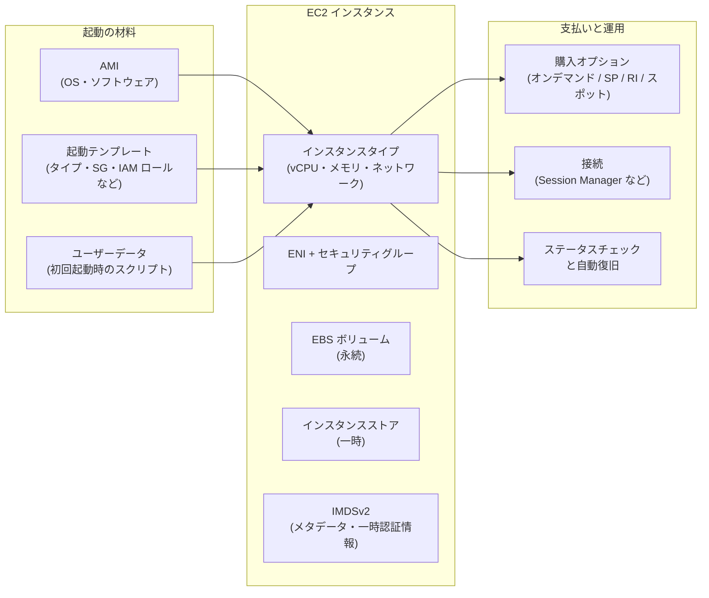

[ホーム](../README.md) > [Phase 2: アソシエイト](README.md) > Amazon EC2

# Amazon EC2

> **この章のゴール**
> - EC2 と AWS Nitro System の関係を説明し、インスタンスタイプ名（例: `m7g.2xlarge`）を読み解ける
> - ワークロードに合わせてインスタンスファミリー・サイズ・Graviton の採用を判断できる
> - AMI・起動テンプレート・ユーザーデータ・IMDSv2 を使って、安全かつ再現性のある起動ができる
> - プレイスメントグループ 3 種類と購入オプション（Savings Plans・リザーブドインスタンス・スポット・専有・キャパシティ予約）を要件から選べる
> - 停止・休止・終了の違い、安全な接続方法、ステータスチェックと自動復旧を説明できる
>
> **対応試験**: SAA-C03（第3分野: 高性能なアーキテクチャの設計 / 第4分野: コストを最適化したアーキテクチャの設計 ほか）
> **目安時間**: 読む 120分 / 確認問題 30分（ハンズオン Lab 02 は別途）

## この章の全体像

Amazon Elastic Compute Cloud（Amazon EC2）は、AWS 上で仮想サーバー（**インスタンス**）を必要なときに必要な数だけ起動できるサービスです。Lambda やコンテナが普及した現在でも、EC2 は多くの AWS サービス（ECS、EKS、EMR、Elastic Beanstalk など）の土台であり、SAA-C03 でも「どのインスタンスを・どこに・どう買って・どう守るか」が繰り返し問われます。

EC2 を設計するとは、次の 5 つを決めることです。

1. **何を動かすか** … AMI（OS とソフトウェアのイメージ）、ユーザーデータ
2. **どの性能で動かすか** … インスタンスタイプ（ファミリー・世代・サイズ）
3. **どこに置くか** … VPC・サブネット・AZ、プレイスメントグループ
4. **どう支払うか** … オンデマンド、Savings Plans、リザーブドインスタンス、スポット、専有、キャパシティ予約
5. **どう運用するか** … 接続（Session Manager など）、メタデータの保護（IMDSv2）、監視と自動復旧

VPC・サブネット・セキュリティグループの基礎は [VPC とネットワーク設計](02-vpc.md)、EBS とインスタンスストアの詳細は [ブロック・ファイルストレージ](06-ebs-efs-fsx.md)、複数台で冗長化・自動増減させる方法は次章 [Elastic Load Balancing と Auto Scaling](04-elb-auto-scaling.md) で扱います。

## 1. EC2 と AWS Nitro System

### 1.1 EC2 とは

EC2 は IaaS（Infrastructure as a Service）です。[責任共有モデル](../01-foundations/07-security-and-compliance.md)では、AWS が物理サーバー・ハイパーバイザー・データセンターを管理し、利用者は **OS 以上**（OS のパッチ、ミドルウェア、アプリケーション、データ、セキュリティグループの設定、IAM ロールの権限）を管理します。

課金の基本は次のとおりです。

- インスタンス料金は `running` 状態の間だけ発生します。Linux や Windows など多くの OS は **秒単位（最低 1 分）** で課金されます。
- `stopped`（停止）中はインスタンス料金はかかりませんが、**EBS ボリュームと Elastic IP アドレスなどの料金は発生し続けます**。
- 料金はリージョン・インスタンスタイプ・OS・購入オプションで決まります（[Amazon EC2 料金](https://aws.amazon.com/ec2/pricing/)）。

仮想化やハイパーバイザーの一般論は [サーバー・OS・仮想化の基礎](../01-foundations/02-server-os-basics.md) を復習してください。

### 1.2 AWS Nitro System

**AWS Nitro System** は、現行世代の EC2 インスタンスを支える基盤です。従来型の仮想化では、ホストの CPU 上で動くハイパーバイザーがネットワークやストレージの仮想化処理まで担っていたため、その分だけホストの資源が顧客に渡せませんでした。Nitro はこれらの処理を**専用ハードウェアにオフロード**します。

| 構成要素 | 役割 |
|---|---|
| Nitro カード | VPC ネットワーク、EBS、インスタンスストア、管理機能の処理を専用ハードウェアで実行 |
| Nitro セキュリティチップ | ハードウェアレベルで信頼の起点を提供し、ファームウェアを保護 |
| Nitro ハイパーバイザー | CPU とメモリの割り当てに専念する軽量なハイパーバイザー |

Nitro によって次のことが可能になりました。

- ホストの資源をほぼすべて顧客に提供できるため、ベアメタルに近い性能が出ます。サイズ名が `metal` の**ベアメタルインスタンス**も提供されています。
- AWS の運用担当者であっても、インスタンスのメモリや顧客データにアクセスする仕組みを持たないよう設計されています。
- 拡張ネットワーキング（ENA）、EFA、IMDS の IPv6 エンドポイント、アタッチ済み EBS のステータスチェック、Nitro Enclaves（機密データを隔離環境で処理する機能。Phase 3 で扱います）など、多くの機能が Nitro ベースのインスタンスを前提にしています。

参考: [AWS Nitro System](https://aws.amazon.com/ec2/nitro/) / [Nitro System 上に構築されたインスタンス](https://docs.aws.amazon.com/ec2/latest/instancetypes/ec2-nitro-instances.html)

> [!TIP]
> **試験のポイント**: Nitro そのものの内部構造はあまり問われません。問われるのは「Nitro を前提とした機能」です。「HPC のノード間通信を OS をバイパスして高速化」→ EFA、「ハイパーバイザーを介さず物理 CPU の機能を直接使いたい・独自のハイパーバイザーを動かしたい」→ ベアメタル（`.metal`）インスタンス、と結び付けて覚えましょう。

## 2. インスタンスタイプ

### 2.1 命名規則

インスタンスタイプ名は「**シリーズ（ファミリー） + 世代 + オプション（属性） . サイズ**」で構成されています。

`m7g.2xlarge` を分解すると次のとおりです。

| 部分 | 例 | 意味 |
|---|---|---|
| シリーズ | `m` | 汎用（General purpose） |
| 世代 | `7` | 第 7 世代。数字が大きいほど新しい |
| オプション | `g` | AWS Graviton プロセッサー（Arm） |
| サイズ | `2xlarge` | 8 vCPU / 32 GiB メモリ |

オプションの文字は複数並ぶことがあります。主な文字は次のとおりです（[公式の命名規則](https://docs.aws.amazon.com/ec2/latest/instancetypes/instance-type-names.html)）。

| 文字 | 意味 | 例 |
|---|---|---|
| `a` | AMD プロセッサー | `m7a`、`c7a` |
| `g` | AWS Graviton プロセッサー | `m7g`、`r8g` |
| `i` | Intel プロセッサー | `c7i`、`m7i` |
| `d` | インスタンスストアボリューム付き | `m5d`、`c6gd` |
| `n` | ネットワークと EBS に最適化（高帯域） | `c7gn`、`m6in` |
| `b` | ブロックストレージ（EBS）に最適化 | `r5b` |
| `e` | 追加のストレージ（ストレージ最適化）・追加のメモリ（メモリ最適化）・追加の GPU メモリ（高速コンピューティング） | `i7ie`、`x2iedn` |
| `z` | 高い CPU 周波数 | `m5zn`、`r7iz` |
| `flex` | Flex インスタンス（一般的なワークロード向けに通常版より低価格なバリエーション） | `m7i-flex` |
| `q` | Qualcomm の推論アクセラレーター | `dl2q` |

読み解きの練習をしてみましょう。

- `c7gn.xlarge` … コンピューティング最適化・第 7 世代・Graviton・ネットワーク強化・xlarge
- `r8g.4xlarge` … メモリ最適化・第 8 世代・Graviton（Graviton4）・4xlarge
- `x2iedn.metal` … メモリ集約型・第 2 世代・Intel・追加メモリ・インスタンスストア付き・ネットワーク強化・ベアメタル

同じファミリー内では、サイズが 1 段階上がるごとに vCPU・メモリがおおむね 2 倍になり、料金もおおむね 2 倍になります（例: `m7g.large` は 2 vCPU / 8 GiB、`m7g.xlarge` は 4 vCPU / 16 GiB）。

> [!TIP]
> **試験のポイント**: 名前の中の `d` は「インスタンスストア付き」の目印です。「一時データを超高速なローカル NVMe に置きたい」なら `d` 付きや I 系を選びます。ただしインスタンスストアは**停止・休止・終了でデータが消える**ため、永続データには使いません。

### 2.2 ファミリーとユースケース

| 分類 | 主なシリーズ | 特徴 | 代表的なユースケース |
|---|---|---|---|
| 汎用 | M、T、Mac | CPU・メモリ・ネットワークのバランスが良い（M は vCPU:メモリ ≒ 1:4） | Web / アプリケーションサーバー、中小規模の DB、開発・テスト環境 |
| コンピューティング最適化 | C | CPU あたりの価格性能が高い（vCPU:メモリ ≒ 1:2） | バッチ処理、動画エンコード、ゲームサーバー、科学計算、高負荷な Web サーバー |
| メモリ最適化 | R、X、U（ハイメモリ）、z | メモリ容量が大きい（R は vCPU:メモリ ≒ 1:8） | インメモリキャッシュ・DB、リアルタイム分析、SAP HANA などの大規模インメモリ DB |
| ストレージ最適化 | I、Im、Is、D | 高速なローカル NVMe SSD（I 系）や大容量 HDD（D 系）のインスタンスストア | NoSQL（Cassandra など）、高 IOPS の OLTP、データウェアハウス、HDFS などの分散ファイルシステム |
| 高速コンピューティング | P、G、Trn、Inf、F、VT | GPU、AWS 独自の機械学習チップ（Trainium / Inferentia）、FPGA | 機械学習の学習（P、Trn）・推論（Inf、G）、グラフィックス処理（G）、動画変換（VT）、FPGA 処理（F） |
| HPC 最適化 | Hpc | 大規模な密結合計算向け（EFA 対応） | 気象・流体・構造解析などの数値シミュレーション |

各ファミリーの詳細仕様は [Amazon EC2 インスタンスタイプ](https://docs.aws.amazon.com/ec2/latest/instancetypes/instance-types.html) で確認できます。

> [!TIP]
> **試験のポイント**: 問題文のキーワードとファミリーを対応付けます。
> - 「インメモリ」「大きなデータセットをメモリで処理」→ **R / X**
> - 「CPU 負荷の高いバッチ」「エンコード」→ **C**
> - 「高いランダム I/O」「低レイテンシーのローカルストレージ」→ **I**
> - 「機械学習の学習」→ **P / Trn**、「推論をコスト効率よく」→ **Inf / G**
> - 「負荷は普段低く、時々スパイク」→ **T**（次節）

### 2.3 AWS Graviton

**AWS Graviton** は AWS が独自に設計した Arm ベースのプロセッサーで、インスタンス名の `g` が目印です。世代ごとに Graviton2（例: M6g、T4g）→ Graviton3（例: M7g、C7g）→ Graviton4（例: M8g、R8g）と進化し、2026 年には Graviton5 を搭載した第 9 世代（M9g など）も一般提供が始まっています。

- **メリット**: 同等の x86 インスタンスより価格性能が高いことが多く、消費電力も少なくて済みます（持続可能性の観点でも有利）。例として AWS は、T4g は T3 と比べて最大 40% 高い価格性能と 20% 低いコストを実現すると公表しています。
- **注意点**: CPU アーキテクチャが arm64 になるため、**arm64 用の AMI とバイナリ**（コンテナならマルチアーキテクチャイメージ）が必要です。Java・Python・Node.js などは比較的移行しやすい一方、ネイティブライブラリや商用ソフトウェアは対応状況の確認が必要です。
- **マネージドサービスでも選べる**: RDS、ElastiCache、Lambda、Fargate などでも Graviton を選択でき、アプリケーションの変更なしで移行できることが多いです。

> [!TIP]
> **試験のポイント**: 「アプリケーションは Arm に対応できる」「価格性能を改善したい」「コストを削減したい」→ Graviton ベースのインスタンスへの移行が定番の正解です。コスト最適化の全体像は [コスト最適化](18-cost-optimization.md) で扱います。

### 2.4 サイズ選定とタイプ変更

- **ライトサイジング**: まず CloudWatch で CPU・ネットワークを確認します（メモリ使用率は CloudWatch エージェントを入れないと取得できません）。AWS Compute Optimizer は過去の使用状況から適切なタイプとサイズを推奨します（[監視と運用管理](13-monitoring-management.md)）。
- **タイプの変更**: EBS をルートに持つインスタンスは、**停止してから**インスタンスタイプを変更できます。ただし x86 と Arm（Graviton）の間は AMI のアーキテクチャが異なるため、タイプ変更だけでは移行できません。

> [!WARNING]
> **ひっかけ注意**: インスタンスタイプの変更（垂直スケーリング）には**停止が必要**で、無停止では行えません。「停止せずに処理能力を増やしたい」なら、Auto Scaling による水平スケーリングを検討します（[次章](04-elb-auto-scaling.md)）。

## 3. バーストパフォーマンスインスタンス（T 系）

### 3.1 CPU クレジットの仕組み

多くの Web サーバーや開発環境は、平均すると CPU をあまり使わず、ときどきスパイクするだけです。T 系インスタンスは、普段は**ベースライン**（常時使ってよい CPU 使用率）までの性能を提供し、必要なときだけ**CPU クレジット**を消費してバーストする、という仕組みで低価格を実現しています。

- **1 CPU クレジット** = 1 vCPU を 100% で 1 分間使う量（= 1 vCPU を 50% で 2 分、でも同じ）
- インスタンスはサイズごとに決まった速さでクレジットを**獲得**し、ベースラインを超えて使うと**消費**します。
- 貯められるクレジットの上限は、おおむね **24 時間分の獲得量**です。

`t3.micro` の例で計算してみます（[CPU クレジットとベースライン](https://docs.aws.amazon.com/AWSEC2/latest/UserGuide/burstable-credits-baseline-concepts.html)）。

| 項目 | 値 |
|---|---|
| vCPU | 2 |
| 1 時間あたりの獲得クレジット | 12 |
| 貯められる上限 | 288（= 12 × 24） |
| ベースライン（vCPU あたり） | 10%（= 12 ÷ 2 vCPU ÷ 60 分） |

2 つの vCPU を平均 30% で 1 時間使うと、消費は 2 × 0.30 × 60 = **36 クレジット**、獲得は 12 クレジットなので、残高は 1 時間に 24 ずつ減っていきます。残高が尽きたときの動きは、次のクレジット設定で変わります。

- T3・T3a・T4g・T8i は、停止してもクレジット残高が **7 日間**保持されます。T2（旧世代）は停止すると失われます。

### 3.2 standard モードと unlimited モード

| 項目 | standard | unlimited |
|---|---|---|
| 残高が尽きたとき | ベースラインまで性能が抑えられる | **余剰クレジット**を使って高負荷を続けられる |
| 追加料金 | なし | 24 時間の移動平均（または起動からの期間の短い方）で CPU 使用率がベースラインを超えた分に、vCPU 時間あたりの固定料金 |
| 既定のモード | T2 | T3・T3a・T4g・T8i |

unlimited モードでも、平均がベースライン以下に収まれば追加料金はかかりません。一方で**常に高負荷**なら、同程度の固定性能インスタンス（M 系など）より高くなります。AWS のドキュメントでは、`t3.large` と `m5.large` の損益分岐点は平均 CPU 使用率 42.5% という例（us-east-1、Linux）が示されています（[unlimited モードの考え方](https://docs.aws.amazon.com/AWSEC2/latest/UserGuide/burstable-performance-instances-unlimited-mode-concepts.html)）。

監視には CloudWatch の `CPUCreditBalance`（残高）、`CPUSurplusCreditBalance`（使った余剰クレジット）、`CPUSurplusCreditsCharged`（課金された余剰クレジット）を使います。

> [!TIP]
> **試験のポイント**: 「T 系のインスタンスで、ときどき性能が極端に落ちる」→ CPU クレジットの枯渇（standard モード）を疑います。スパイクが一時的なら **unlimited モード**、常に高負荷なら **M 系や C 系への変更**が正解です。

> [!WARNING]
> **ひっかけ注意**: unlimited は「追加料金なしで無制限にバーストできる」という意味ではありません。平均使用率がベースラインを超え続けると、余剰クレジット分が課金されます。

