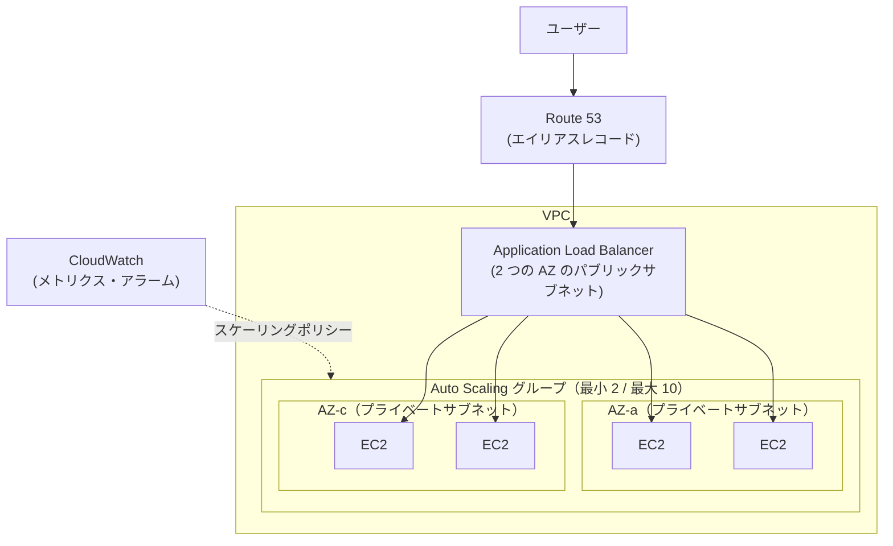
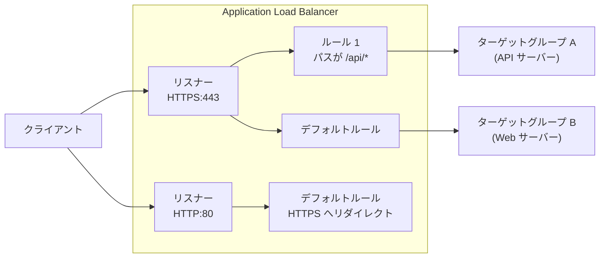
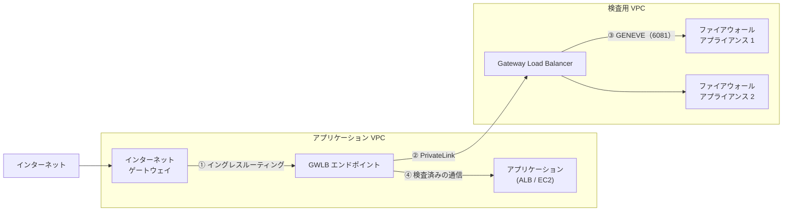
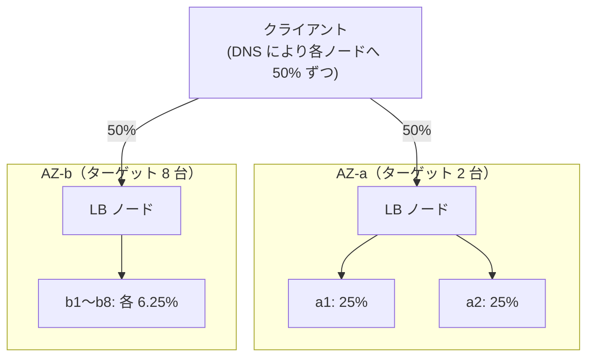
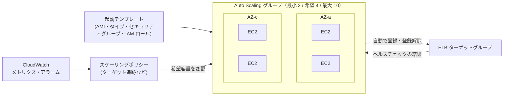
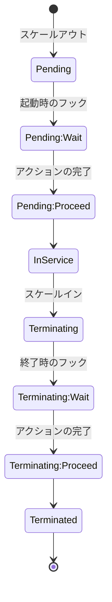
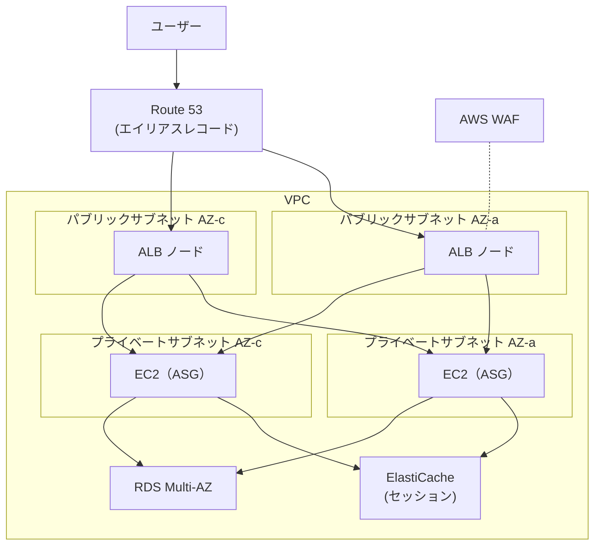

[ホーム](../README.md) > [Phase 2: アソシエイト](README.md) > Elastic Load Balancing と Auto Scaling

# Elastic Load Balancing と Auto Scaling

> **この章のゴール**
> - 水平スケールとステートレス化の原則を説明できる
> - Application Load Balancer（ALB）・Network Load Balancer（NLB）・Gateway Load Balancer（GWLB）・Classic Load Balancer（CLB）の違いを理解し、要件（L7 ルーティング、固定 IP、送信元 IP、PrivateLink、アプライアンス）から選べる
> - ヘルスチェック、クロスゾーン負荷分散、スティッキーセッション、登録解除の遅延、TLS 終端などの設定の意味と影響を説明できる
> - Auto Scaling グループとスケーリングポリシー（ターゲット追跡・ステップ・シンプル・スケジュール・予測）を使い分けられる
> - ライフサイクルフック、ウォームプール、インスタンスの更新、混合インスタンスポリシー、終了ポリシーを設計に生かせる
>
> **対応試験**: SAA-C03（第2分野: 弾力性に優れたアーキテクチャの設計 / 第3分野: 高性能なアーキテクチャの設計 ほか）
> **目安時間**: 読む 120分 / 確認問題 30分（ハンズオン Lab 03 は別途）

## この章の全体像

1 台のサーバーには限界があります。性能には上限があり、障害が起きればサービスは止まり、メンテナンスのたびに停止も必要です。クラウドでの定石は、**同じ役割のサーバーを複数のアベイラビリティーゾーン（AZ）に並べ（水平スケール）、前段でリクエストを振り分け（Elastic Load Balancing）、台数を需要に合わせて自動で増減・自己修復させる（Amazon EC2 Auto Scaling）** ことです。この組み合わせは SAA-C03 の「弾力性」と「高性能」の分野の中心テーマで、ほぼすべての Web システムの土台になります。

EC2 そのものの仕組み（AMI、起動テンプレート、購入オプション）は [前章](03-ec2.md) で学びました。この章の構成は、実際に [Lab 03: ALB + Auto Scaling](../04-labs/lab03-alb-auto-scaling.md) で手を動かして確認できます。

## 1. 水平スケールとステートレス化の原則

### 1.1 垂直スケールと水平スケール

| 項目 | 垂直スケール（スケールアップ） | 水平スケール（スケールアウト） |
|---|---|---|
| 方法 | インスタンスタイプを大きくする | インスタンスの台数を増やす |
| 上限 | 最大のインスタンスタイプまで | 実質的に上限なし |
| 停止 | 必要（タイプの変更には停止が必要） | 不要 |
| 可用性 | 1 台のままなら単一障害点が残る | 複数の AZ に分散して高可用性を実現できる |
| 向いているもの | 分割しにくいデータベース、1 台に限られるソフトウェア | Web / アプリケーションサーバー、ワーカー |

クラウドの弾力性を最大限に生かすのは水平スケールです。ただし水平スケールには、**どのインスタンスがリクエストを処理しても同じ結果になる**（＝ステートレスである）ことが前提になります。

### 1.2 ステートレス化

インスタンスの中に「状態（ステート）」を持たないように、状態を外部のサービスに置きます。

| 状態 | インスタンスの外の置き場所の例 |
|---|---|
| ログインセッション | Amazon ElastiCache（Valkey / Redis OSS）、Amazon DynamoDB |
| アップロードされたファイル | Amazon S3、Amazon EFS |
| 設定値・シークレット | Systems Manager Parameter Store、AWS Secrets Manager |
| ログ | Amazon CloudWatch Logs |
| 非同期の処理待ちジョブ | Amazon SQS |
| 業務データ | Amazon RDS / Aurora、DynamoDB |

ステートレスにできれば、インスタンスは「いつ終了されても、いつ追加されても困らない使い捨ての部品」になります。その結果、Auto Scaling による自動増減、スポットインスタンスの活用、AMI の差し替えによるデプロイがすべて簡単になります。スティッキーセッション（6.3 節）はステートを持つアプリケーションの応急処置にはなりますが、負荷の偏りや、インスタンス障害時のセッション喪失といった問題が残ります。

> [!TIP]
> **試験のポイント**: 「スケールインでインスタンスが終了すると、ユーザーがログアウトされてしまう」→ セッションを **ElastiCache や DynamoDB に外部化** するのが正解です。スティッキーセッションは根本的な解決になりません。

### 1.3 ELB と Auto Scaling の役割分担

| 役割 | Elastic Load Balancing（ELB） | Amazon EC2 Auto Scaling |
|---|---|---|
| 主な仕事 | リクエストを正常なターゲットに分散する | インスタンスの台数を維持・増減する |
| 障害時 | 異常なターゲットへの送信を止める | 異常なインスタンスを終了し、新しいインスタンスに置き換える |
| スケール | ロードバランサー自体が負荷に応じて自動でスケールする | 需要に合わせてインスタンスを追加・削除する |

両者を組み合わせると、「障害が起きても自動で元の台数に戻り（自己修復）、負荷に応じて台数が変わる（弾力性）」システムになります。

## 2. Elastic Load Balancing の基本

### 2.1 構成要素

- **ロードバランサー**: 指定したサブネット（AZ）ごとに **ロードバランサーノード** が配置されます。クライアントは DNS 名で接続し、DNS が各ノードの IP アドレスを返します。ALB のノードの IP アドレスは変わり得るため、IP アドレスではなく **DNS 名**（Route 53 ならエイリアスレコード）で参照します。
- **リスナー**: クライアントからの接続を待ち受けるプロトコルとポート（例: HTTPS:443）です。
- **ルール**（ALB）: 条件に応じて、リクエストをどう処理するか（どのターゲットグループに送るかなど）を決めます。
- **ターゲットグループ**: 転送先（ターゲット）の集まりです。ヘルスチェックや登録解除の遅延などの設定はターゲットグループ単位で行います。
- **ターゲット**: EC2 インスタンス、IP アドレス、Lambda 関数などです。

### 2.2 インターネット向けと内部向け

- **インターネット向け（internet-facing）**: パブリックサブネットに配置し、ノードはパブリック IP アドレスを持ちます。ターゲットはプライベートサブネットに置けます（ロードバランサーからはプライベート IP アドレスで転送されます）。
- **内部向け（internal）**: プライベート IP アドレスだけを持ちます。多層構成の「Web 層 → アプリケーション層」の間や、社内システムに使います。
- ALB は **少なくとも 2 つの AZ** のサブネットを指定する必要があります（各サブネットは /27 以上で、8 個以上の空き IP アドレスが必要です）。NLB は 1 つの AZ でも作成できます。

### 2.3 4 種類のロードバランサーの比較

| 項目 | ALB | NLB | GWLB | CLB（旧世代） |
|---|---|---|---|---|
| レイヤー | L7（HTTP / HTTPS / gRPC） | L4（TCP / UDP / TLS） | L3 ゲートウェイ＋ L4 負荷分散 | L4 / L7（基本機能のみ） |
| 振り分けの基準 | ホスト・パス・ヘッダー・メソッド・クエリ文字列・送信元 IP | プロトコルとポート（フロー単位） | すべての IP パケットをアプライアンスへ | リスナー単位（コンテンツベースの振り分けなし） |
| ターゲット | インスタンス / IP / Lambda | インスタンス / IP / ALB | インスタンス / IP | インスタンス |
| 静的 IP アドレス | なし | **AZ ごとに固定。Elastic IP も割り当て可能** | ―（エンドポイント経由で利用） | なし |
| セキュリティグループ | あり（必須） | あり（作成時に関連付け） | なし | あり |
| TLS 終端 | あり（SNI で複数の証明書） | あり（TLS リスナー、SNI） | なし | あり（1 リスナー 1 証明書） |
| PrivateLink のエンドポイントサービス | 不可（NLB の背後に置けば可） | **可** | 可（GWLB エンドポイント） | 不可 |
| クロスゾーン負荷分散の既定 | 常に有効 | 無効 | 無効 | 作成方法による |
| 課金 | 時間＋ LCU | 時間＋ NLCU | 時間＋ GLCU | 時間＋処理データ量 |
| AWS WAF との統合 | **あり** | なし | なし | なし |
| 代表的な用途 | Web / API、マイクロサービス、コンテナ | 超低レイテンシー、TCP / UDP、固定 IP、PrivateLink | ファイアウォールや IDS/IPS の集中配置 | 既存環境の維持（移行を推奨） |

参考: [Elastic Load Balancing とは](https://docs.aws.amazon.com/elasticloadbalancing/latest/userguide/what-is-load-balancing.html) / [Elastic Load Balancing の料金](https://aws.amazon.com/elasticloadbalancing/pricing/)

> [!TIP]
> **試験のポイント**: キーワードで選びます。
> - 「パスやホスト名で振り分け」「マイクロサービス」「Lambda をターゲットに」「ユーザー認証」「WAF」→ **ALB**
> - 「固定 IP」「Elastic IP」「TCP / UDP」「毎秒数百万リクエスト」「超低レイテンシー」「PrivateLink でサービスを公開」→ **NLB**
> - 「サードパーティのファイアウォールや IDS/IPS を透過的に挿入」「GENEVE」→ **GWLB**

## 3. Application Load Balancer（ALB）

### 3.1 特徴

ALB は HTTP / HTTPS のリクエストの中身（L7）を見て振り分けるロードバランサーです。

- ターゲットへは HTTP/1.1、HTTP/2、gRPC で転送でき、WebSocket にも対応します。
- 1 つの ALB で、複数のドメインやパスを複数のサービスに振り分けられます（マイクロサービスの入口を 1 つにまとめられる）。
- 同じインスタンスの異なるポートをターゲットとして登録できるため、Amazon ECS の **動的ポートマッピング** に対応します（[コンテナ](11-containers.md)）。
- AWS WAF、AWS Certificate Manager（ACM）、Amazon Cognito、AWS Global Accelerator などと統合できます。
- アクセスログを S3 に保存できます（既定では無効）。

### 3.2 リスナールール

ルールは「**条件**」と「**アクション**」の組み合わせで、優先度の小さい順に評価されます。どのルールにも一致しなければ、リスナーの **デフォルトルール** が適用されます。

| 条件 | 判定に使うもの | 例 |
|---|---|---|
| ホストヘッダー | `Host` ヘッダー（ドメイン名） | `api.example.com` と `www.example.com` を別のターゲットグループへ |
| パス | URL のパス | `/api/*` は API サーバー、`/images/*` は画像サーバーへ |
| HTTP ヘッダー | 任意のヘッダーの値 | `User-Agent` でモバイル向けのターゲットグループへ |
| HTTP リクエストメソッド | GET、POST など | 書き込み（POST）だけ別のターゲットグループへ |
| クエリ文字列 | キーと値 | `?version=beta` をベータ版へ |
| 送信元 IP | クライアントの IP アドレス（CIDR） | 社内の IP アドレスからだけ管理者用ページへ |

| アクション | 内容 | 例 |
|---|---|---|
| 転送（forward） | ターゲットグループへ転送。複数のターゲットグループに **重み付け** して転送も可能 | 新バージョンに 10% だけ流すカナリアリリース、Blue/Green デプロイ |
| リダイレクト | 別の URL へ HTTP 301 / 302 でリダイレクト | HTTP → HTTPS、旧ドメイン → 新ドメイン |
| 固定レスポンス | ALB が直接レスポンスを返す | メンテナンス画面、不要なパスへの 404 |
| 認証（authenticate-cognito / authenticate-oidc） | Amazon Cognito や OIDC 対応の IdP でユーザーを認証してから転送（HTTPS リスナーのみ） | アプリケーションを改修せずに社内向けアプリにログインを追加 |

参考: [Application Load Balancer とは](https://docs.aws.amazon.com/elasticloadbalancing/latest/application/introduction.html)

> [!TIP]
> **試験のポイント**: 「HTTP でのアクセスを HTTPS に強制」→ 80 番リスナーに **リダイレクトアクション**。「アプリケーションを変更せずにユーザー認証を追加」→ ALB の **認証アクション**（Cognito / OIDC）。「新バージョンに一部のトラフィックだけ流す」→ **重み付きターゲットグループ**。

### 3.3 ターゲットタイプ

| ターゲットタイプ | 登録するもの | 使いどころ |
|---|---|---|
| instance | インスタンス ID | Auto Scaling グループの EC2、ECS の動的ポートマッピング |
| ip | IP アドレス | Fargate などのコンテナ（awsvpc モード）、ピアリング先の VPC やオンプレミス（Direct Connect / VPN 経由）のサーバー |
| lambda | Lambda 関数 | サーバーレスな HTTP バックエンド |

### 3.4 セキュリティ機能とルーティングアルゴリズム

- **AWS WAF**: SQL インジェクションやクロスサイトスクリプティング、特定の国や IP アドレスからのアクセス、レートベースのルールなどで L7 の攻撃を防ぎます（[セキュリティサービス](12-security-services.md)）。
- **相互 TLS（mTLS）**: クライアント証明書による認証に対応しています。
- **セキュリティグループ**: ALB に付けたセキュリティグループを、ターゲット側のセキュリティグループのインバウンドルールで参照すると、「ALB からの通信だけを受け付ける」構成にできます（13 章）。
- **ルーティングアルゴリズム**: 既定はラウンドロビンです。処理時間がリクエストごとに大きく異なる場合は、処理中のリクエストが最も少ないターゲットに送る **最小未処理リクエスト（least outstanding requests）** を選べます。

> [!WARNING]
> **ひっかけ注意**: ALB には **Elastic IP アドレスを割り当てられず、固定 IP アドレスもありません**。固定 IP が必要なら、ALB の前に NLB を置く（ALB タイプのターゲットグループ）か、AWS Global Accelerator を使います。

## 4. Network Load Balancer（NLB）

### 4.1 特徴

NLB は TCP / UDP / TLS のレベル（L4）で振り分けるロードバランサーです。

- **高性能**: 毎秒数百万リクエストを超低レイテンシーで処理でき、急激なトラフィックの変動にも対応します。同じ TCP 接続（フロー）は同じターゲットに送られます。
- **静的 IP アドレス**: AZ ごとに 1 つの固定 IP アドレスを持ち、インターネット向けの NLB には AZ ごとに Elastic IP アドレスを割り当てられます。取引先のファイアウォールで宛先 IP を許可リストに登録する、といった要件に応えられます。
- **ターゲット**: インスタンス、IP アドレス、ALB を登録できます（Lambda は不可）。
- **TLS 終端**: TLS リスナーで ACM の証明書を使い、SNI で複数の証明書を扱えます。
- **PrivateLink**: NLB は **エンドポイントサービス**（AWS PrivateLink）の前段になり、他の VPC やアカウントにサービスをプライベートに公開できます（[VPC とネットワーク設計](02-vpc.md)）。
- **ヘルスチェック**: TCP、HTTP、HTTPS を使えます。
- **セキュリティグループ**: NLB にもセキュリティグループを関連付けられます。ただし **作成時に関連付ける必要があり**、セキュリティグループなしで作成した NLB に後から関連付けることはできません（2026年9月時点、[NLB のセキュリティグループ](https://docs.aws.amazon.com/elasticloadbalancing/latest/network/load-balancer-security-groups.html)）。
- WAF との統合や、パス・ホスト名による振り分けはできません。

### 4.2 送信元 IP アドレスの保持

L7 の ALB は `X-Forwarded-For` ヘッダーでクライアントの IP アドレスを伝えますが、L4 の NLB は HTTP ヘッダーを付けられません。そこで NLB には、クライアントの IP アドレスをそのままパケットの送信元として残す **クライアント IP アドレスの保持** という機能があります。

| ターゲットタイプ | プロトコル | クライアント IP アドレスの保持（既定） |
|---|---|---|
| instance | TCP / TLS | 有効 |
| ip | TCP / TLS | 無効（有効にできる） |
| instance / ip | UDP / TCP_UDP | 有効（無効にはできない） |

- 保持が有効な場合、ターゲットから見た送信元はクライアントの IP アドレスです。ターゲットのセキュリティグループでは、クライアントの IP 範囲を許可するか、**NLB のセキュリティグループを参照** して許可します。
- 保持が無効な場合、ターゲットから見た送信元は NLB のプライベート IP アドレスです。クライアントの IP アドレスが必要なら、ターゲットグループで **Proxy Protocol v2** を有効にします。接続の先頭にクライアントの情報を含むヘッダーが付加されるため、アプリケーション（NGINX など）が Proxy Protocol に対応している必要があります。

### 4.3 ALB と NLB の使い分け

| 要件 | 選択 |
|---|---|
| URL のパスやホスト名で振り分けたい | ALB |
| AWS WAF で保護したい | ALB（または CloudFront ＋ WAF） |
| 固定 IP アドレスが必要（許可リストへの登録など） | NLB（Elastic IP）、または Global Accelerator |
| 固定 IP アドレスと L7 の振り分けの両方が必要 | NLB の背後に ALB を置く（ALB タイプのターゲットグループ）、または Global Accelerator ＋ ALB |
| TCP / UDP の独自プロトコル（ゲーム、IoT、金融取引など） | NLB |
| PrivateLink で他の VPC・アカウントにサービスを公開したい | NLB（ALB ベースのサービスなら NLB の背後に ALB） |
| Lambda 関数を HTTP で呼び出したい | ALB（または API Gateway） |

> [!WARNING]
> **ひっかけ注意**: 「NLB でクライアントの IP アドレスを取得するため `X-Forwarded-For` を使う」は誤りです。NLB は L4 のため HTTP ヘッダーを追加しません。**クライアント IP アドレスの保持** か **Proxy Protocol v2** を使います。

## 5. Gateway Load Balancer（GWLB）と Classic Load Balancer（CLB）

### 5.1 Gateway Load Balancer

**GWLB** は、ファイアウォール、侵入検知・防御（IDS/IPS）、ディープパケットインスペクションなどの **サードパーティ製の仮想アプライアンス** を、通信経路に透過的に挿入してスケールさせるためのロードバランサーです。

- L3 で動作してすべての IP パケットを受け取り、**GENEVE プロトコル（UDP 6081 番）** でカプセル化してアプライアンスへ転送します。アプライアンスは検査したパケットを GWLB に戻し、GWLB が本来の宛先へ届けます。
- 利用する側の VPC には **Gateway Load Balancer エンドポイント**（PrivateLink の一種）を作成し、ルートテーブルで通信をエンドポイントへ向けます。インターネットからの通信は、インターネットゲートウェイに関連付けたルートテーブル（イングレスルーティング）で向けます。
- 同じフローは同じアプライアンスに送られるため、行きと帰りの通信が同じアプライアンスを通り、ステートフルな検査ができます。
- アプライアンスのヘルスチェックと、Auto Scaling による台数の増減に対応します。

アプライアンスの製品に特別なこだわりがなく、マネージドなファイアウォールで十分なら AWS Network Firewall も選択肢です（[セキュリティサービス](12-security-services.md)）。

参考: [Gateway Load Balancer とは](https://docs.aws.amazon.com/elasticloadbalancing/latest/gateway/introduction.html)

### 5.2 Classic Load Balancer

**CLB** は旧世代のロードバランサーです。HTTP / HTTPS / TCP / SSL に対応しますが、ホストやパスによる振り分け、IP アドレスや Lambda のターゲット、1 つのリスナーでの複数の証明書（SNI）には対応していません。新しく構築する場合は ALB か NLB を使い、既存の CLB は移行を検討します。

> [!WARNING]
> **ひっかけ注意**: 「1 つのロードバランサーで、複数のドメインのそれぞれの証明書を使いたい」→ ALB または NLB の **SNI** で実現できます。CLB では 1 つのリスナーに 1 つの証明書しか設定できません（複数ドメインを含む証明書を使うか、CLB を分ける必要があります）。

## 6. リスナーとターゲットグループの詳細設定

### 6.1 ヘルスチェック

ロードバランサーは、ターゲットグループに登録された各ターゲットに定期的に確認リクエストを送り、**healthy（正常）** なターゲットにだけトラフィックを送ります。

| 設定 | 意味 | ALB の既定値 |
|---|---|---|
| プロトコル・ポート・パス | どこに確認リクエストを送るか | HTTP、トラフィックポート、`/` |
| 間隔 | 確認の頻度 | 30 秒 |
| タイムアウト | 応答を待つ時間 | 5 秒 |
| 正常のしきい値 | 連続何回成功で healthy にするか | 5 回 |
| 非正常のしきい値 | 連続何回失敗で unhealthy にするか | 2 回 |
| 成功コード | healthy とみなす HTTP ステータス | 200 |

- ヘルスチェック用のパス（例: `/health`）は、**そのインスタンス自身が処理できるか** を軽く確認する作りにします。データベースなど共有の依存先まで確認する「深い」チェックにすると、依存先の障害ですべてのターゲットが一斉に unhealthy になりかねません。
- すべてのターゲットが unhealthy になると、ALB や NLB は **すべてのターゲットにトラフィックを送ります**（フェイルオープン）。全停止よりは一部でも処理できる可能性に賭ける動きです。
- ロードバランサーのヘルスチェックの結果を Auto Scaling の置き換えに使うには、ASG 側で **ELB のヘルスチェックを有効** にする必要があります（7.4 節）。

### 6.2 クロスゾーン負荷分散

各 AZ のロードバランサーノードが、**自分の AZ のターゲットだけ** に振り分けるか、**すべての AZ のターゲット** に振り分けるかを決める設定です。クライアントは DNS によって各ノードにほぼ均等に振り分けられるため、AZ ごとのターゲット数が違うと偏りが生じます。

上の図はクロスゾーン負荷分散が **無効** の場合です。AZ-a の 2 台には 25% ずつ、AZ-b の 8 台には 6.25% ずつと、4 倍の偏りが出ます。**有効** にすると、各ノードがすべてのターゲットに振り分けるため、10 台それぞれに 10% ずつ均等に届きます。

| 種類 | 既定 | 有効時の AZ 間のデータ転送料金 |
|---|---|---|
| ALB | ロードバランサーのレベルでは **常に有効**（ターゲットグループ単位で無効にすることは可能） | かからない |
| NLB | **無効**（有効にできる） | かかる |
| GWLB | **無効**（有効にできる） | かかる |
| CLB | 作成方法による（コンソールで作成すると有効） | かからない |

> [!TIP]
> **試験のポイント**: 「AZ ごとのターゲット数が異なり、特定の AZ のインスタンスだけ負荷が高い」→ **クロスゾーン負荷分散を有効にする**（NLB と GWLB は既定で無効）。あわせて、Auto Scaling グループで AZ ごとの台数をそろえることも有効です。

### 6.3 スティッキーセッション

同じクライアントからのリクエストを、同じターゲットに送り続ける機能です（既定では無効）。

- **ALB**: 期間ベース（ALB が生成する Cookie `AWSALB` を使う）と、アプリケーションベース（アプリケーションの Cookie を基準にする）の 2 種類があります。
- **NLB**: 送信元 IP アドレスに基づいて同じターゲットに送ります。

スティッキーセッションは、ターゲット間の負荷の偏りを生み、ターゲットが終了するとセッションも失われます。可能なら 1.2 節のとおりセッションを外部化し、スティッキーセッションに頼らない設計にします。

### 6.4 登録解除の遅延（Connection Draining）

ターゲットの登録を解除するとき（スケールインやデプロイ時）、ロードバランサーは新しいリクエストの送信を止めたうえで、**処理中のリクエストが完了するまで一定時間待ちます**。この待ち時間が **登録解除の遅延** です（CLB では Connection Draining と呼びます）。

- 既定値は **300 秒** で、0〜3,600 秒の範囲で設定できます。
- 短時間で終わるリクエストが中心なら短く（例: 30 秒）すると、スケールインやデプロイが速くなります。大きなファイルのアップロードや長時間の接続がある場合は長くします。
- Auto Scaling は、登録解除の遅延が終わるのを待ってからインスタンスを終了します。

### 6.5 スロースタート

新しく登録されたターゲットに、いきなり均等な量のリクエストを送るのではなく、指定した期間（30〜900 秒）をかけて **徐々に増やしていく** ALB の機能です（既定では無効）。起動直後はキャッシュが温まっていない、JIT コンパイルが済んでいないなどで性能が出ないアプリケーションに使います。

### 6.6 SSL/TLS の終端・SNI・ACM

HTTPS の暗号化と復号をロードバランサーで行うことを **TLS 終端**（オフロード）と呼びます。ターゲットの CPU 負荷を減らし、証明書の管理を 1 か所にまとめられます。

- **AWS Certificate Manager（ACM）**: パブリック証明書を無料で発行でき（ELB などの統合サービスで使う場合）、DNS 検証の証明書は **自動で更新** されます。ACM の証明書はリージョン単位のリソースで、ALB / NLB には **同じリージョン** の証明書を使います（CloudFront は us-east-1 の証明書を使います）。
- **SNI（Server Name Indication）**: 1 つのリスナーに複数の証明書を登録し、クライアントが要求したホスト名に応じて証明書を選び分けます。ALB と NLB が対応しています。
- **セキュリティポリシー**: 使用する TLS のバージョンや暗号スイートを、あらかじめ用意されたポリシーから選びます（TLS 1.3 対応のポリシーもあります）。

| パターン | クライアント → LB | LB → ターゲット | 証明書の置き場所 | 用途 |
|---|---|---|---|---|
| LB で終端 | HTTPS | HTTP | LB（ACM） | 一般的な Web サイト。ターゲットの負荷を軽減 |
| LB で終端して再暗号化 | HTTPS | HTTPS | LB（ACM）とターゲット | 経路全体の暗号化が求められる（コンプライアンス） |
| パススルー（NLB の TCP リスナー） | TLS | TLS のまま転送 | ターゲット | ターゲット自身で TLS を終端する必要がある |

ターゲットの OS 上で証明書を使う必要がある場合、統合サービス用の ACM 証明書はエクスポートできません。2025 年からは、秘密鍵をエクスポートできる有料の ACM パブリック証明書も選べるようになっています。

### 6.7 クライアント情報の受け渡し（X-Forwarded-For と Proxy Protocol v2）

ロードバランサーを経由すると、ターゲットから見た通信の送信元はロードバランサーになります。クライアントの情報は次の方法で受け取ります。

| ロードバランサー | クライアント情報の受け渡し |
|---|---|
| ALB | HTTP ヘッダー `X-Forwarded-For`（クライアントの IP アドレス）、`X-Forwarded-Proto`（HTTP か HTTPS か）、`X-Forwarded-Port`（ポート） |
| NLB | クライアント IP アドレスの保持（4.2 節）、または **Proxy Protocol v2** |
| CLB | HTTP / HTTPS リスナーでは `X-Forwarded-For`、TCP / SSL リスナーでは Proxy Protocol（v1） |

Web サーバーのアクセスログにクライアントの IP アドレスを記録したい場合、ALB の背後では `X-Forwarded-For` をログに出力するように Web サーバーを設定します。

### 6.8 料金とキャパシティ

- **ALB**: 時間料金＋ **LCU**（ロードバランサーキャパシティユニット）。LCU は「新規接続数」「アクティブ接続数」「処理バイト数」「ルールの評価数」の 4 つの観点のうち、最も大きいものの使用量で決まります。
- **NLB**: 時間料金＋ **NLCU**（新規の接続・フロー数、アクティブな接続・フロー数、処理バイト数）。
- **GWLB**: 時間料金＋ **GLCU**（GWLB エンドポイントの料金も別途かかります）。
- ロードバランサーは負荷に応じて自動でスケールしますが、大規模なイベントなどで急激な増加が予想される場合は、ALB と NLB で最小のキャパシティを事前に予約する機能（LCU 予約）も利用できます。

## 7. Auto Scaling グループ（ASG）

### 7.1 構成要素

Amazon EC2 Auto Scaling の中心は **Auto Scaling グループ（ASG）** です。ASG は「どんなインスタンスを（起動テンプレート）」「どこに（サブネット＝AZ）」「何台（最小・最大・希望）」動かすかを定義し、その状態を維持し続けます。Auto Scaling 自体に追加料金はなく、起動したインスタンスや CloudWatch などの料金だけがかかります。

- ASG にターゲットグループを関連付けると、起動したインスタンスは自動でターゲットグループに登録され、終了するインスタンスは登録解除されます。
- 同じ仕組みは、ECS のサービス、DynamoDB のキャパシティ、Aurora のレプリカなどでも **Application Auto Scaling** として提供されています。

参考: [Amazon EC2 Auto Scaling とは](https://docs.aws.amazon.com/autoscaling/ec2/userguide/what-is-amazon-ec2-auto-scaling.html)

### 7.2 容量の設定

| 設定 | 意味 | 例 |
|---|---|---|
| 最小容量 | これより減らさない台数（可用性の下限） | 2（2 つの AZ に 1 台ずつ） |
| 希望容量 | 現在維持すべき台数。スケーリングポリシーや手動操作で変わる | 4 |
| 最大容量 | これより増やさない台数（コストの上限） | 10 |

希望容量は常に最小容量と最大容量の範囲に収まります。ASG は実際の台数が希望容量と一致するように、インスタンスの起動や終了を続けます。

### 7.3 AZ への分散とリバランス

- ASG は、指定したサブネットの AZ にインスタンスを **均等に** 配置しようとします。
- ある AZ でキャパシティが不足するなどして偏りが生じると、**AZ のリバランス** で偏りを解消します。このとき先に新しいインスタンスを起動してから古いインスタンスを終了するため、一時的に最大容量を超えることがあります（最大容量の 10% または 1 台の、いずれか大きい方まで）。
- 高可用性の基本は、**少なくとも 2 つ（できれば 3 つ）の AZ** を指定し、最小容量を AZ の数以上にすることです。

AZ の障害に備えた台数の考え方も押さえておきましょう。**常に 6 台分の処理能力が必要で、1 つの AZ が停止しても処理能力を落としたくない** 場合、次のようになります。

| 構成 | 通常時の合計 | 1 つの AZ が停止したとき |
|---|---|---|
| 2 AZ × 6 台 | 12 台 | 6 台（要件を満たす） |
| 3 AZ × 3 台 | 9 台 | 6 台（要件を満たす） |
| 3 AZ × 2 台 | 6 台 | 4 台（要件を満たさない） |

AZ を増やすほど、1 つの AZ の障害に備えて余分に用意する台数が少なくて済みます。

### 7.4 ヘルスチェックの種類と猶予期間

ASG は各インスタンスの状態を監視し、**異常（unhealthy）と判定したインスタンスを終了して新しいインスタンスに置き換えます**。何をもって異常と判定するかは、ヘルスチェックの種類で決まります。

| 種類 | 何で異常を判定するか | 既定 |
|---|---|---|
| Amazon EC2 | EC2 のステータスチェック、スケジュールされたイベント、インスタンスの状態（running 以外） | **常に有効** |
| Elastic Load Balancing | ロードバランサーのターゲットグループのヘルスチェック | 無効（有効化が必要） |
| VPC Lattice | VPC Lattice のターゲットグループのヘルスチェック | 無効（有効化が必要） |
| Amazon EBS | アタッチされた EBS ボリュームの障害 | 無効（有効化が必要） |
| カスタム | 独自の監視の結果を API（`SetInstanceHealth`）で通知 | ― |

参考: [Auto Scaling グループのヘルスチェック](https://docs.aws.amazon.com/autoscaling/ec2/userguide/ec2-auto-scaling-health-checks.html)

**ヘルスチェックの猶予期間** は、起動したばかりのインスタンスのヘルスチェックの結果を無視する時間です。ユーザーデータでのインストールやアプリケーションの起動が終わる前に「異常」と判定されるのを防ぎます。既定値は、マネジメントコンソールで作成した場合は 300 秒、AWS CLI や SDK で作成した場合は 0 秒です。短すぎると、起動中のインスタンスが異常と判定されて **起動と終了を繰り返す** ことになるので、アプリケーションが処理可能になるまでの時間に合わせて設定します。

> [!WARNING]
> **ひっかけ注意**: ASG の既定のヘルスチェックは **EC2 のステータスチェックだけ** です。アプリケーションのプロセスがハングしても OS が正常なら、ALB はそのインスタンスへの送信を止めますが、ASG は置き換えません。アプリケーションの異常で置き換えたいなら、ASG で **ELB のヘルスチェックを有効** にします。

## 8. スケーリングポリシー

### 8.1 種類の比較

| ポリシー | 仕組み | 向いている場面 |
|---|---|---|
| **ターゲット追跡** | 指定したメトリクスを目標値（例: 平均 CPU 使用率 50%）に保つように台数を自動で計算して増減 | **最初に検討すべき選択肢**。多くのワークロード |
| ステップ | CloudWatch アラームのしきい値の超過幅に応じて、増減する台数を段階的に変える | 負荷の急増に大きく反応させたい、細かく制御したい |
| シンプル | アラームで 1 つの調整を行い、クールダウンが終わるまで次の調整をしない | 旧来の方式。新規ではターゲット追跡かステップを使う |
| スケジュール | 指定した日時に最小・最大・希望容量を変更 | 時間帯・曜日・イベントなど、事前にわかっている変動 |
| 予測 | 過去の負荷のパターンを分析して将来の需要を予測し、前もって台数を増やす | 日次・週次の周期的な負荷、初期化に時間がかかるアプリケーション |

### 8.2 ターゲット追跡スケーリング

エアコンの温度設定のように、「このメトリクスをこの値に保つ」と指定するだけのポリシーです。

- 定義済みのメトリクス: `ASGAverageCPUUtilization`（平均 CPU 使用率）、`ASGAverageNetworkIn` / `ASGAverageNetworkOut`（平均ネットワーク入出力）、`ALBRequestCountPerTarget`（ターゲットあたりの ALB リクエスト数）。カスタムメトリクスやメトリクス計算の結果も使えます。
- ポリシーを作成すると、CloudWatch アラームが自動で作成されます（このアラームを編集・削除してはいけません）。
- スケールアウトは速く、スケールインは慎重（ゆっくり）に行われます。スケールインを無効にすることもできます。
- 複数のターゲット追跡ポリシーを設定した場合、**いずれか 1 つでもスケールアウトを求めればスケールアウト** し、**すべてがスケールインできる状態のときだけスケールイン** します。
- 使うメトリクスは、**台数を増やすとその値が下がる**（台数に反比例する）ものである必要があります。平均 CPU 使用率やターゲットあたりのリクエスト数は条件を満たしますが、SQS キューのメッセージ総数はそのままでは満たしません（12 章）。

### 8.3 ステップスケーリングとシンプルスケーリング

ステップスケーリングは、アラームのしきい値をどれだけ超えたかに応じて調整量を変えます。

| 平均 CPU 使用率 | 調整 |
|---|---|
| 60% 以上 70% 未満 | 1 台追加 |
| 70% 以上 85% 未満 | 2 台追加 |
| 85% 以上 | 4 台追加 |
| 30% 未満（別のアラーム） | 1 台削除 |

シンプルスケーリングは、1 回の調整の後、**クールダウン期間**（既定 300 秒）が終わるまで次のアラームに反応しません。その間に負荷がさらに増えても待たされるため、新規にはターゲット追跡かステップスケーリングを使います。

### 8.4 スケジュールされたスケーリング

「平日の 8:30 に最小容量を 6 台にし、20:00 に 2 台へ戻す」のように、日時を指定して容量を変えます。1 回だけの実行と、cron 形式の繰り返しの両方を指定でき、タイムゾーンも設定できます。セールやキャンペーンなど **日時が事前にわかっているイベント** に最適です。

### 8.5 予測スケーリング

過去の負荷データから日次・週次のパターンを検出し、将来必要な台数を予測して、**負荷が来る前に** 台数を増やします（[予測スケーリング](https://docs.aws.amazon.com/autoscaling/ec2/userguide/ec2-auto-scaling-predictive-scaling.html)）。

- 向いている場面: 業務時間に高く夜間・週末に低いといった **周期的なトラフィック**、定期的なバッチ処理、**初期化に時間がかかる** アプリケーション。
- まず「予測のみ」のモードで予測の精度を確認し、問題なければ「予測してスケール」のモードに切り替えます。予測した時刻より前倒しでインスタンスを起動しておく設定もあります。
- 予想外の負荷にも対応できるよう、ターゲット追跡などの動的スケーリングと **併用** するのが基本です。

### 8.6 ウォームアップとクールダウン

起動したばかりのインスタンスは、初期化処理で CPU 使用率が高かったり、まだリクエストを処理していなかったりします。そのメトリクスをすぐに集計に含めると、スケーリングの判断が狂います。

- **デフォルトのインスタンスウォームアップ**: ASG 全体で設定する値で、新しいインスタンスのメトリクスを、この時間が経過するまで ASG の集計メトリクスに含めません。一方で、ウォームアップ中のインスタンスも台数には数えられるため、同じ負荷に対して二重にスケールアウトすることを防げます。ターゲット追跡・ステップスケーリング・インスタンスの更新で使われ、設定しておくことが推奨されています。
- **クールダウン**: シンプルスケーリングで使われる待ち時間です（既定 300 秒）。

> [!TIP]
> **試験のポイント**:
> - 「使用率を一定に保ちたい」「運用の手間を最小に」→ **ターゲット追跡**
> - 「毎週月曜の朝」「キャンペーンの開始時刻」のように **日時がわかっている** → **スケジュール**
> - 「毎日ほぼ同じパターンで増減し、起動に時間がかかるので増加に間に合わない」→ **予測スケーリング**（＋ターゲット追跡）
> - 「起動直後の高い CPU 使用率のせいで過剰にスケールアウトする」→ **デフォルトのインスタンスウォームアップ** を設定

## 9. ライフサイクルフック・ウォームプール・インスタンスの更新

### 9.1 ライフサイクルフック

ライフサイクルフックを使うと、インスタンスの起動時や終了時に **一時停止（待機状態）** させて、独自の処理を実行できます。

- **起動時のフック**（`autoscaling:EC2_INSTANCE_LAUNCHING`）: ソフトウェアのインストール、設定ファイルの取得、外部システムへの登録などを終えてから `InService` にします。`InService` になるまでターゲットグループには登録されないため、準備が終わっていないインスタンスにリクエストが送られることはありません。
- **終了時のフック**（`autoscaling:EC2_INSTANCE_TERMINATING`）: ログやデータの退避、外部システムからの登録解除などを終えてから終了させます。
- 処理が終わったら `CompleteLifecycleAction` で `CONTINUE` か `ABANDON` を返します。起動時のフックで `ABANDON` を返すと、そのインスタンスは終了されます。
- 待機時間（ハートビートのタイムアウト）の既定値は 3,600 秒で、30〜7,200 秒の範囲で設定できます。延長も可能ですが、待機状態に留められるのは最大 48 時間（またはハートビートのタイムアウトの 100 倍の短い方）です。タイムアウトすると、あらかじめ指定した既定の結果（既定は `ABANDON`）が適用されます。
- フックの通知は Amazon EventBridge、Amazon SNS、Amazon SQS で受け取れます。EventBridge から Lambda 関数や Systems Manager の Automation を起動して処理するのが一般的です。

参考: [ライフサイクルフック](https://docs.aws.amazon.com/autoscaling/ec2/userguide/lifecycle-hooks.html)

### 9.2 ウォームプール

アプリケーションの初期化に何分もかかると、スケールアウトしても負荷の増加に間に合いません。**ウォームプール** は、初期化済みのインスタンスを ASG の外側にプールしておき、スケールアウト時にすばやく `InService` にする機能です。

| プール内の状態 | 待機中の料金 | 復帰の速さ |
|---|---|---|
| Stopped（停止） | EBS ボリュームと Elastic IP の料金のみ | 速い（OS の起動は必要） |
| Hibernated（休止） | EBS ボリュームと Elastic IP の料金のみ | より速い（メモリの状態から再開） |
| Running（実行中） | インスタンス料金もかかる | 最も速い |

- プールに入るときに起動時のライフサイクルフックで初期化を済ませ、停止（または休止）しておくのが典型的な使い方です。
- スケールイン時にインスタンスを終了せずプールへ戻す設定（再利用ポリシー）もあります。
- 混合インスタンスポリシーを使う ASG や、スポットインスタンスを起動する ASG にはウォームプールを追加できません。

参考: [ウォームプール](https://docs.aws.amazon.com/autoscaling/ec2/userguide/ec2-auto-scaling-warm-pools.html)

### 9.3 インスタンスの更新（Instance Refresh）

新しい AMI や起動テンプレートの新しいバージョンを、ASG のインスタンスに **ローリング方式で** 反映する機能です。

- **最小正常率**（既定 90%）: 更新中も維持する正常な容量の割合です。100% に近いほど一度に置き換える台数が少なく、安全ですが時間がかかります。
- **最大正常率**（100〜200%）: 100% より大きくすると、古いインスタンスを終了する前に新しいインスタンスを起動できます（一時的に台数が増えます）。
- **チェックポイント**: 指定した割合まで置き換えたところで一時停止し、動作を確認できます。
- **一致するインスタンスのスキップ**: すでに新しい設定で動いているインスタンスは置き換えません。
- **自動ロールバック**: 更新が失敗したときや、指定した CloudWatch アラームが発火したときに、元の設定へ自動で戻せます。

参考: [インスタンスの更新](https://docs.aws.amazon.com/autoscaling/ec2/userguide/asg-instance-refresh.html)

より安全に切り替えたい場合は、新しい ASG（グリーン）を別に用意し、ALB の重み付きターゲットグループで徐々にトラフィックを移す Blue/Green デプロイも選べます（一時的にリソースが倍になります）。

### 9.4 その他の運用機能

- **インスタンスのスケールイン保護**: 特定のインスタンスをスケールインの対象から外します（長時間のジョブを処理中のワーカーなど）。ヘルスチェックの失敗による置き換えや手動での終了は防げません。
- **スタンバイ**: インスタンスを一時的にサービスから外します（ロードバランサーからのトラフィックもヘルスチェックも止まる）。トラブルシューティングや更新作業のあと、`InService` に戻せます。
- **プロセスの中断**: `Launch`、`Terminate`、`HealthCheck`、`ReplaceUnhealthy`、`AZRebalance`、`AlarmNotification`、`ScheduledActions` などの処理を一時的に止めます。たとえば障害の調査中に `ReplaceUnhealthy` を中断すると、異常なインスタンスが置き換えられずに残るので調査できます。

## 10. 混合インスタンスポリシーとスポット

**混合インスタンスポリシー** を使うと、1 つの ASG で **複数のインスタンスタイプ** と **オンデマンド・スポットの組み合わせ** を扱えます。スポットの中断に強く、コストも抑えられる構成です。

| 設定 | 値の例 | 意味 |
|---|---|---|
| インスタンスタイプ | m7i.large、m7a.large、m6i.large、m6a.large、m5.large など | 多くのスポットキャパシティプールを候補にする（属性ベースの指定も可） |
| オンデマンドの基本容量 | 2 | 最初の 2 台は必ずオンデマンド |
| 基本容量を超える分のオンデマンドの割合 | 20% | 基本容量を超える分の 20% はオンデマンド、80% はスポット |
| スポットの配分戦略 | price-capacity-optimized | 中断されにくく、かつ安いプールを選ぶ（推奨） |
| オンデマンドの配分戦略 | lowest-price または prioritized | オンデマンドのタイプの選び方 |
| キャパシティの再調整 | 有効 | 中断リスクの高いスポットを、リバランスの推奨を受けて先回りして置き換える |

この例で希望容量が 12 台なら、基本容量の 2 台に加え、残り 10 台の 20%（2 台）がオンデマンド、80%（8 台）がスポットになります。合計でオンデマンド 4 台・スポット 8 台です。ASG は中断されたスポットを自動的に置き換えます。スポットの配分戦略の詳細は [前章](03-ec2.md) を参照してください。

> [!TIP]
> **試験のポイント**: 「最低限の台数は常に確保しつつ、残りはできるだけ安く」「スポットの中断に強い構成」→ 混合インスタンスポリシーで **オンデマンドの基本容量＋スポット（複数タイプ・複数 AZ・price-capacity-optimized）**、そして **キャパシティの再調整** を有効にします。

## 11. 終了ポリシー

スケールインのとき、どのインスタンスを終了するかは **終了ポリシー** で決まります。**デフォルトの終了ポリシー** は次の順で判定します。

1. **インスタンス数が最も多い AZ** を選ぶ（AZ 間のバランスを保つ。スケールイン保護されたインスタンスは対象外）
2. 混合インスタンスポリシーの場合、オンデマンドとスポットの配分戦略に合うように終了するインスタンスを選ぶ
3. **最も古い起動テンプレート（または起動設定）** を使っているインスタンスを選ぶ
4. **次の課金時間に最も近い** インスタンスを選ぶ
5. それでも複数残れば、**ランダム** に選ぶ

| その他の終了ポリシー | 終了するインスタンス |
|---|---|
| OldestInstance | 最も古いインスタンス（新しいタイプへ徐々に入れ替えたいとき） |
| NewestInstance | 最も新しいインスタンス（新しい起動テンプレートを試験的に使ったとき） |
| OldestLaunchTemplate / OldestLaunchConfiguration | 古い起動テンプレート・起動設定を使うインスタンス |
| ClosestToNextInstanceHour | 次の課金時間に最も近いインスタンス |
| AllocationStrategy | 混合インスタンスの配分戦略に合うように選ぶ |
| カスタム | Lambda 関数で独自のロジックを実装 |

どの終了ポリシーでも、まず AZ 間の台数のバランスが優先されます。特定のインスタンスを終了させたくない場合は、終了ポリシーではなく **スケールイン保護** を使います。

参考: [終了ポリシー](https://docs.aws.amazon.com/autoscaling/ec2/userguide/ec2-auto-scaling-termination-policies.html)

## 12. SQS のバックログに基づくスケーリング

SQS キューのメッセージを EC2 のワーカーが処理する構成では、「キューにたまったメッセージ数」に応じて台数を変えたくなります。しかし、**キューのメッセージ総数（`ApproximateNumberOfMessagesVisible`）をそのままターゲット追跡に使うのは不適切** です。台数を増やしてもメッセージの流入が続けば総数はすぐには減らず、台数と反比例する関係にならないため、適切な台数を計算できません。

そこで、**インスタンスあたりのバックログ** をメトリクスにします。

- インスタンスあたりのバックログ ＝ キューのメッセージ数 ÷ ASG の InService のインスタンス数
- 許容できるインスタンスあたりのバックログ（目標値） ＝ 許容できるレイテンシー ÷ 1 メッセージの平均処理時間

**計算例**: 1 メッセージの平均処理時間が 2 秒、メッセージを受け取ってから処理が終わるまでの許容レイテンシーが 60 秒なら、目標値は 60 ÷ 2 ＝ **30 メッセージ／台** です。キューに 1,500 件のメッセージがあり、ワーカーが 10 台なら、インスタンスあたりのバックログは 150 で目標値の 5 倍です。ターゲット追跡ポリシーは 1,500 ÷ 30 ＝ **50 台** を目指してスケールアウトします（最大容量の範囲内で）。

- メトリクスは、CloudWatch の **メトリクス計算** をターゲット追跡ポリシーで直接使って求めるか、Lambda 関数などで計算してカスタムメトリクスとして発行します。
- CPU 使用率は、I/O 待ちの多いワーカーではバックログを正しく反映しないことがあります。
- 同じ処理を Lambda（SQS のイベントソースマッピング）で実装すれば、台数の管理そのものが不要になります（[アプリケーション統合](09-application-integration.md)、[サーバーレス](10-serverless.md)）。

参考: [Amazon SQS に基づくスケーリング](https://docs.aws.amazon.com/autoscaling/ec2/userguide/as-using-sqs-queue.html)

## 13. 典型構成: ALB ＋ Auto Scaling（2 つの AZ）

ここまでの要素を組み合わせた、Web アプリケーションの標準的な構成です。[Lab 03](../04-labs/lab03-alb-auto-scaling.md) でこの構成を実際に作ります。

セキュリティグループは、前の層のセキュリティグループを参照して「必要な相手からの通信だけ」を許可します。

| セキュリティグループ | インバウンドルール |
|---|---|
| ALB 用（sg-alb） | HTTPS（443）を `0.0.0.0/0` から。HTTP（80）はリダイレクト用に許可 |
| EC2 用（sg-app） | HTTP（80）を **sg-alb** から（ヘルスチェックも同じポート） |
| ElastiCache 用（sg-cache） | 6379 を **sg-app** から |
| RDS 用（sg-db） | 3306 を **sg-app** から |

設計のポイントは次のとおりです。

- ALB と ASG は **2 つ以上の AZ** に配置し、ASG の最小容量は AZ の数以上にする。
- EC2 はプライベートサブネットに置き、外部への通信は NAT ゲートウェイや VPC エンドポイントを使う。接続は Session Manager で行う。
- ASG のヘルスチェックに **ELB のヘルスチェック** を追加する。
- セッションは ElastiCache などに外部化し、インスタンスをステートレスにする。
- ALB で HTTPS を終端（ACM の証明書）し、AWS WAF で保護する。静的コンテンツは S3 と CloudFront に任せると、EC2 の負荷をさらに下げられます（[Lab 04](../04-labs/lab04-s3-cloudfront.md)）。

## まとめ

- 水平スケールの前提は **ステートレス化**。セッションは ElastiCache や DynamoDB に外部化し、スティッキーセッションに頼らない
- **ALB** は L7（パス・ホスト・ヘッダー・クエリ文字列・送信元 IP による振り分け、Lambda ターゲット、認証、リダイレクト、固定レスポンス、WAF）。固定 IP は持たない
- **NLB** は L4（超低レイテンシー、AZ ごとの固定 IP・EIP、PrivateLink、TLS 終端、送信元 IP の保持、作成時に関連付けるセキュリティグループ）
- **GWLB** は GENEVE でサードパーティのアプライアンスを透過的に挿入する。**CLB** は旧世代で、SNI などに非対応
- クロスゾーン負荷分散は ALB では常に有効、NLB と GWLB では既定で無効（有効にすると AZ 間のデータ転送料金）
- 登録解除の遅延は既定 300 秒、スロースタートは新しいターゲットへの送信量を徐々に増やす。クライアント情報は ALB なら `X-Forwarded-For`、NLB なら送信元 IP の保持か Proxy Protocol v2
- ASG の既定のヘルスチェックは EC2 のみ。アプリケーションの異常で置き換えるには **ELB のヘルスチェック** を有効にし、猶予期間を適切に設定する
- スケーリングは **ターゲット追跡** が基本。日時が決まった変動はスケジュール、周期的な変動と長い初期化には予測スケーリング。デフォルトのインスタンスウォームアップを設定する
- ライフサイクルフックで起動・終了時に処理を挟み、ウォームプールで起動を速め、インスタンスの更新で AMI をローリング更新する
- 混合インスタンスポリシーでオンデマンドの基本容量＋スポットを組み合わせる。SQS のワーカーは **インスタンスあたりのバックログ** でスケーリングする

## 確認問題

### 問1
ある企業は、1 つのドメイン `example.com` で 3 つのマイクロサービスを公開しています。`/api/*` へのリクエストは API サービス、`/images/*` へのリクエストは画像サービス、それ以外は Web フロントエンドに振り分ける必要があります。各サービスは、それぞれ別の Auto Scaling グループで動作しています。最も運用上のオーバーヘッドが少ない構成はどれですか。

- A. サービスごとに Network Load Balancer を作成し、Route 53 の加重ルーティングポリシーで振り分ける。
- B. サービスごとに Classic Load Balancer を作成し、クライアント側でパスに応じて接続先を切り替える。
- C. 1 つの Application Load Balancer を作成し、パスベースのリスナールールで 3 つのターゲットグループに転送する。
- D. 1 つの Network Load Balancer を作成し、ポート番号ごとにリスナーを分けて各サービスに転送する。

解答と解説

**正解: C**

**解説**: ALB のパスベースのルールを使えば、1 つのロードバランサー・1 つのドメインから複数のターゲットグループに振り分けられます。各 Auto Scaling グループを、それぞれのターゲットグループに関連付けます。

**各選択肢の検討**
- A: ✗ NLB は L4 のためパスを見られません。Route 53 の加重ルーティングは割合で振り分けるだけで、パスでは振り分けられません。
- B: ✗ 旧世代の CLB を複数管理することになり、クライアントの改修も必要です。
- C: ✓ 要件を最小の構成で満たします。
- D: ✗ NLB はパスで振り分けられず、クライアントがポートを使い分ける必要があります。

### 問2
ある企業は、ALB の背後で Web アプリケーションを運用しています。取引先は自社のファイアウォールで接続先を固定の IP アドレスで許可する必要があるため、IP アドレスを固定するよう求めてきました。ALB のパスベースのルーティングと AWS WAF による保護は引き続き使いたいと考えています。最も適切な方法はどれですか。

- A. Network Load Balancer を作成して各 AZ に Elastic IP アドレスを割り当て、既存の ALB をターゲットとする ALB タイプのターゲットグループを登録する。
- B. ALB に Elastic IP アドレスを直接割り当てる。
- C. ALB を Network Load Balancer に置き換え、NLB で AWS WAF を有効にする。
- D. ALB の DNS 名を定期的に名前解決し、得られた IP アドレスを取引先に通知するスクリプトを作成する。

解答と解説

**正解: A**

**解説**: NLB は AZ ごとに固定の IP アドレス（Elastic IP）を持てます。NLB の背後に ALB を置けば、固定 IP と ALB の L7 の機能・WAF を両立できます。なお、AWS Global Accelerator で ALB に固定のエニーキャスト IP アドレスを付ける方法も有効です。

**各選択肢の検討**
- A: ✓ 固定 IP、パスベースのルーティング、WAF のすべてを満たします。
- B: ✗ ALB には Elastic IP アドレスを割り当てられません。
- C: ✗ NLB は AWS WAF にもパスベースのルーティングにも対応していません。
- D: ✗ ALB の IP アドレスは予告なく変わるため、通知が間に合わず、運用負荷も高くなります。

### 問3
ある企業は、Network Load Balancer（TCP リスナー）の背後でアプリケーションを運用しています。ターゲットは、IP アドレスで登録したコンテナ（ターゲットタイプ ip）です。アプリケーションのアクセスログに、クライアントの IP アドレスではなく NLB のプライベート IP アドレスが記録されてしまいます。アプリケーションは Proxy Protocol を解釈できます。アプリケーションでクライアントの IP アドレスを取得する方法として、最も適切なものはどれですか。

- A. アプリケーションで `X-Forwarded-For` ヘッダーを読み取るように変更する。
- B. NLB のクロスゾーン負荷分散を有効にする。
- C. ロードバランサーを Classic Load Balancer（TCP リスナー）に置き換え、スティッキーセッションを有効にする。
- D. ターゲットグループの属性で Proxy Protocol v2 を有効にする。

解答と解説

**正解: D**

**解説**: ターゲットタイプが ip で TCP の場合、クライアント IP アドレスの保持は既定で無効なため、NLB の IP アドレスが送信元に見えます。Proxy Protocol v2 を有効にすると、接続の先頭にクライアントの情報を含むヘッダーが付加され、アプリケーションで取得できます（ターゲットグループでクライアント IP アドレスの保持を有効にする方法もあります。その場合は、ターゲットのセキュリティグループでクライアントからの通信を許可する必要があります）。

**各選択肢の検討**
- A: ✗ NLB は L4 で動作するため、HTTP ヘッダーを追加しません。
- B: ✗ クロスゾーン負荷分散は振り分け先の範囲の設定で、送信元 IP アドレスには関係しません。
- C: ✗ 旧世代への置き換えであり、スティッキーセッションもクライアント IP アドレスの取得とは無関係です。
- D: ✓ アプリケーションが Proxy Protocol を解釈できるため、そのまま使えます。

### 問4
ある企業は、ALB と Auto Scaling グループで Web アプリケーションを運用しています。あるインスタンスでアプリケーションのプロセスがハングし、ALB のヘルスチェックで unhealthy と判定されてリクエストは送られなくなりました。しかし Auto Scaling グループはこのインスタンスを置き換えず、処理能力が低下したままでした。EC2 のステータスチェックは正常です。このような異常なインスタンスを自動的に置き換えるには、どうすればよいですか。

- A. ALB のヘルスチェックの間隔を 5 秒に短縮する。
- B. Auto Scaling グループのヘルスチェックに、Elastic Load Balancing のヘルスチェックを追加する。
- C. Auto Scaling グループのヘルスチェックの猶予期間を 0 秒にする。
- D. ターゲットグループの登録解除の遅延を 0 秒にする。

解答と解説

**正解: B**

**解説**: Auto Scaling グループの既定のヘルスチェックは EC2 のステータスチェックだけです。ELB のヘルスチェックを有効にすると、ALB が unhealthy と判定したインスタンスを Auto Scaling グループが終了し、新しいインスタンスに置き換えます。

**各選択肢の検討**
- A: ✗ ALB での検知が速くなるだけで、Auto Scaling グループは置き換えません。
- B: ✓ アプリケーションの異常を置き換えの判断に使えるようになります。
- C: ✗ 猶予期間は起動直後の判定を遅らせる設定で、ELB の結果を使うかどうかとは無関係です。0 秒にすると、起動中のインスタンスが誤って置き換えられるおそれもあります。
- D: ✗ 登録解除のときの待ち時間であり、置き換えとは無関係です。

### 問5
ある企業の社内業務システムは、平日の 9 時に利用者が一斉にログインして負荷が急増します。インスタンスは起動からアプリケーションの初期化完了まで約 10 分かかるため、ターゲット追跡スケーリングだけでは毎朝の急増に間に合わず、応答が遅くなっています。負荷のパターンは数か月間ほぼ一定です。最も運用上のオーバーヘッドが少なく、この問題を解決できる方法はどれですか。

- A. シンプルスケーリングポリシーに変更し、クールダウン期間を 0 秒にする。
- B. Auto Scaling グループの最小容量を、ピーク時に必要な台数に固定する。
- C. 予測スケーリングポリシーを追加し、既存のターゲット追跡スケーリングポリシーと併用する。
- D. 平日の 9:00 に希望容量をピーク時の台数に増やす、スケジュールされたアクションを作成する。

解答と解説

**正解: C**

**解説**: 予測スケーリングは、過去の日次・週次のパターンから需要を予測し、負荷が来る前にインスタンスを起動します。予想外の変動には、併用するターゲット追跡スケーリングが対応します。

**各選択肢の検討**
- A: ✗ 負荷に反応してから起動する点は変わらず、10 分の初期化には間に合いません。
- B: ✗ 夜間や週末もピーク時の台数を維持するため、コストが高くなります。
- C: ✓ パターンを自動で学習して前もって増やすため、運用の手間も少なく済みます。
- D: ✗ 9:00 に起動を始めても処理できるのは 9:10 以降で、急増に間に合いません（時刻を前倒しして手動で管理する方法もありますが、パターンが変わるたびに見直しが必要です）。

### 問6
ある企業は、Amazon SQS の標準キューからメッセージを取得して処理するワーカーを、Auto Scaling グループの EC2 インスタンスで実行しています。1 件のメッセージの平均処理時間は 2 秒で、メッセージがキューに入ってから処理が完了するまでの許容レイテンシーは 60 秒です。キューのメッセージ数は時間帯によって大きく変動します。許容レイテンシーを守りながら台数を効率よく増減させる方法として、適切なものはどれですか。2 つ選択してください。

- A. キューの `ApproximateNumberOfMessagesVisible` を Auto Scaling グループの InService のインスタンス数で割った「インスタンスあたりのバックログ」を、メトリクス計算（またはカスタムメトリクス）で求める。
- B. キューの `ApproximateNumberOfMessagesVisible` をそのままメトリクスとして使い、目標値を 30 とするターゲット追跡スケーリングポリシーを作成する。
- C. インスタンスの平均 CPU 使用率 70% を目標値とするターゲット追跡スケーリングポリシーを作成する。
- D. キューの可視性タイムアウトを 12 時間に延長する。
- E. 「インスタンスあたりのバックログ」の目標値を 30（＝ 60 秒 ÷ 2 秒）とするターゲット追跡スケーリングポリシーを作成する。

解答と解説

**正解: A, E**

**解説**: ターゲット追跡スケーリングには、台数を増やすと値が下がるメトリクスが必要です。キューのメッセージ数を InService の台数で割った「インスタンスあたりのバックログ」はこの条件を満たします。目標値は「許容レイテンシー ÷ 1 メッセージの平均処理時間」＝ 60 ÷ 2 ＝ 30 です。

**各選択肢の検討**
- A: ✓ 台数に反比例するメトリクスを用意します。
- B: ✗ メッセージの総数は台数を増やしてもすぐには減らず、台数と反比例しないため、適切な台数を計算できません。
- C: ✗ CPU 使用率は処理待ちのメッセージ量を反映しないことがあり、許容レイテンシーを守れる保証がありません。
- D: ✗ 可視性タイムアウトは処理中のメッセージを他のワーカーから隠す時間で、スケーリングとは無関係です。長すぎると失敗したメッセージの再処理も遅れます。
- E: ✓ 1 台が抱えてよいメッセージ数を目標値にします。

### 問7
ある企業は、Auto Scaling グループの EC2 インスタンスでバッチ処理を実行しており、処理ログをインスタンスのローカルディスクに書き込んでいます。スケールインでインスタンスが終了される前に、ログを確実に Amazon S3 にアップロードしたいと考えています。アップロードには最大 5 分かかります。最も適切な方法はどれですか。

- A. インスタンスの終了保護（`DisableApiTermination`）を有効にする。
- B. ロードバランサーのターゲットグループの登録解除の遅延を 10 分に延長する。
- C. ユーザーデータに、ログを S3 にアップロードするスクリプトを追加する。
- D. `autoscaling:EC2_INSTANCE_TERMINATING` のライフサイクルフックを作成し、待機中にログをアップロードしてからライフサイクルアクションを完了する。

解答と解説

**正解: D**

**解説**: 終了時のライフサイクルフックを使うと、インスタンスは `Terminating:Wait` の状態で待機します（既定では最大 3,600 秒）。その間にログをアップロードし、`CompleteLifecycleAction` で終了を続行させます。

**各選択肢の検討**
- A: ✗ 終了保護は Auto Scaling のスケールインによる終了を防ぎません。
- B: ✗ 処理中のリクエストの完了を待つための設定で、ログのアップロードの完了は保証しません（ロードバランサーを使わないバッチ処理にはそもそも関係しません）。
- C: ✗ ユーザーデータは既定で初回起動時に実行されるもので、終了時には実行されません。
- D: ✓ 終了前の処理を確実に実行するための仕組みです。

### 問8
ある企業は、2 つの AZ で Network Load Balancer を運用しています。AZ-a には 2 台、AZ-b には 6 台のターゲットが登録されています。AZ-a のターゲットだけ CPU 使用率が高く、AZ-b のターゲットには余裕があります。クライアントは NLB の DNS 名で接続しています。ターゲット間の負荷を均等にする最も簡単な方法はどれですか。

- A. ターゲットグループでスティッキーセッションを有効にする。
- B. NLB のクロスゾーン負荷分散を有効にする。
- C. ターゲットグループの登録解除の遅延を延長する。
- D. NLB を削除し、各ターゲットの IP アドレスを Route 53 の複数値回答レコードに登録する。

解答と解説

**正解: B**

**解説**: NLB のクロスゾーン負荷分散は既定で無効なため、各 AZ のノードは自分の AZ のターゲットにだけ振り分けます。DNS で 50% ずつ届くと、AZ-a の 2 台には 25% ずつ、AZ-b の 6 台には約 8.3% ずつとなります。有効にすると 8 台に 12.5% ずつ均等に分散されます（AZ 間のデータ転送料金が発生する点には注意します）。

**各選択肢の検討**
- A: ✗ 振り分けの偏りを固定化し、むしろ悪化させることがあります。
- B: ✓ 設定の変更だけで均等化できます。
- C: ✗ 登録解除の遅延は振り分けの比率に関係しません。
- D: ✗ DNS のキャッシュのため障害時の切り替えが遅く、均等に分散される保証もありません。構成の変更も大きく、簡単な方法ではありません。

## 次のステップ

- ハンズオン: [Lab 03: ALB + Auto Scaling で冗長化とスケーリング](../04-labs/lab03-alb-auto-scaling.md)
- 次の章: [Amazon S3](05-s3.md)
- 関連する章: [Route 53・CloudFront・Global Accelerator](08-route53-cloudfront.md)（DNS と固定 IP）、[アプリケーション統合](09-application-integration.md)（SQS）、[コンテナ](11-containers.md)（ECS と ALB）、[高可用性と災害対策](15-high-availability-dr.md)
- 公式ドキュメント: [Elastic Load Balancing](https://docs.aws.amazon.com/elasticloadbalancing/latest/userguide/what-is-load-balancing.html) / [Amazon EC2 Auto Scaling](https://docs.aws.amazon.com/autoscaling/ec2/userguide/what-is-amazon-ec2-auto-scaling.html)

---
[← 前の章](03-ec2.md) | [目次](README.md) | [次の章 →](05-s3.md)
