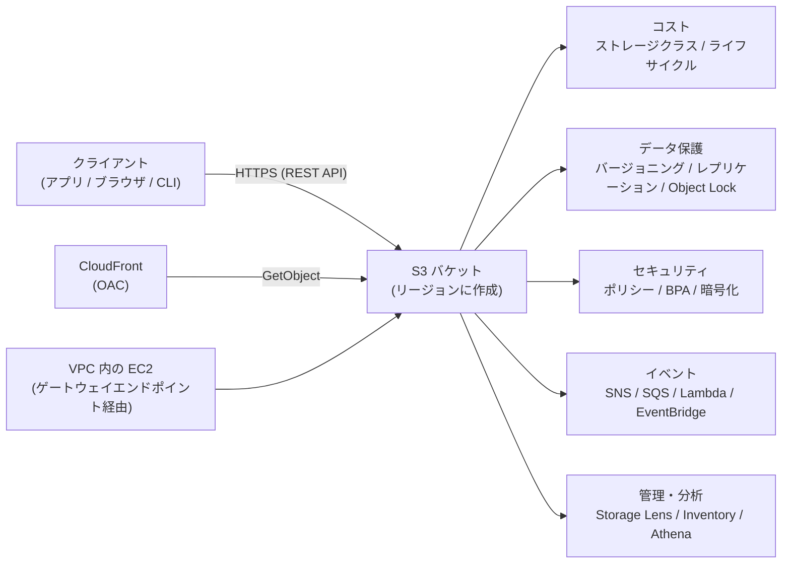
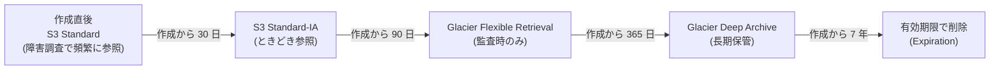
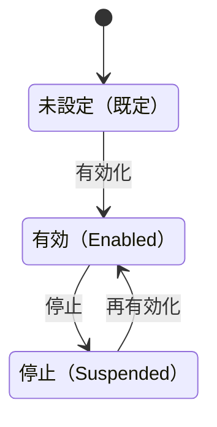
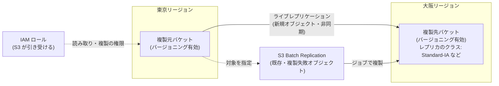
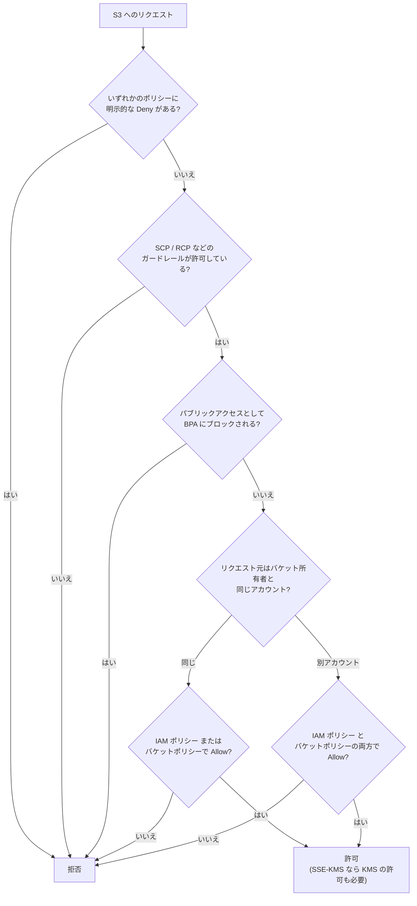
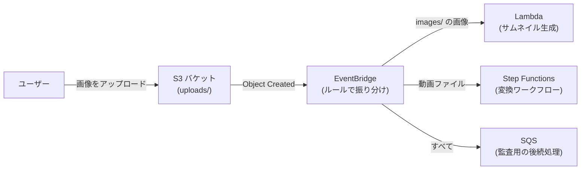
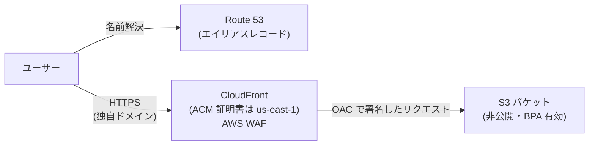

[ホーム](../README.md) > [Phase 2: アソシエイト](README.md) > Amazon S3

# Amazon S3

> **この章のゴール**
> - S3 のデータモデル（バケット・オブジェクト・キー）と、耐久性・整合性の仕組みを説明できる
> - ストレージクラスをアクセス頻度・取り出し時間・最小保存期間から選び、ライフサイクルルールを設計できる
> - バージョニング・レプリケーション・Object Lock を組み合わせてデータを保護できる
> - バケットポリシー・ブロックパブリックアクセス・アクセスポイント・署名付き URL・VPC エンドポイントでアクセス制御を設計できる
> - 暗号化方式（SSE-S3 / SSE-KMS / DSSE-KMS / SSE-C / クライアント側暗号化）を要件から選べる
> - 性能最適化の定石と、CloudFront + OAC による静的サイト配信を説明できる
>
> **対応試験**: SAA-C03（第1分野 セキュアなアーキテクチャの設計 / 第3分野 高性能なアーキテクチャの設計 / 第4分野 コストを最適化したアーキテクチャの設計）。SAP-C03 でもデータ保護・マルチリージョン設計の前提知識になります
> **目安時間**: 読む 180分 / 確認問題 40分 / ハンズオン（Lab 04）120分

## この章の全体像

Amazon Simple Storage Service（Amazon S3）は、ほぼすべての AWS アーキテクチャに登場するオブジェクトストレージです。静的コンテンツ配信、データレイク、バックアップとアーカイブ、ログの集約、機械学習の学習データ置き場など、用途は非常に幅広くなっています。

SAA-C03 で S3 が頻出なのは、1 つのサービスで **セキュリティ（アクセス制御・暗号化）**、**回復力（バージョニング・レプリケーション）**、**性能（プレフィックス・マルチパート）**、**コスト（ストレージクラス・ライフサイクル）** のすべてを問えるからです。この章では、それぞれを「なぜそうなっているか」から理解していきます。



| 問題文のキーワード | 見るべき節 |
|---|---|
| 「アクセス頻度が予測できない」「取り出しまで 12 時間以内でよい」 | 2. ストレージクラス |
| 「一定期間後に安いクラスへ移す」「古いバージョンを削除」 | 3. ライフサイクル / 4. バージョニング |
| 「別リージョンにコピー」「既存オブジェクトも複製」「15 分以内」 | 5. レプリケーション |
| 「特定の VPC からのみ」「他アカウントに一時的に共有」 | 6. アクセス制御 |
| 「キーの使用を監査」「HTTPS を強制」 | 7. 暗号化 |
| 「WORM」「規制で削除を禁止」 | 8. Object Lock |
| 「アップロード時に処理を起動」 | 9. イベント通知 |
| 「大きなファイルを世界中から高速にアップロード」 | 10. パフォーマンス |
| 「静的サイトを HTTPS で配信、バケットは非公開」 | 11. 静的ウェブサイト |

---

## 1. S3 の基本

### 1.1 オブジェクトストレージとは

S3 は **キー（名前）と値（データ）を対応づけて保存する** オブジェクトストレージです。ファイルシステムのようにディレクトリ階層をたどったり、ファイルの一部だけを書き換えたりする仕組みはありません。オブジェクトは **丸ごと書き込み、丸ごと置き換える** のが基本です（ブロック・ファイルストレージとの違いは [次章](06-ebs-efs-fsx.md) で比較します）。

| 用語 | 意味 | 例 |
|---|---|---|
| バケット | オブジェクトを入れるコンテナ。リージョンを選んで作成する | `example-bucket` |
| オブジェクト | データ本体 + メタデータ（+ バージョン ID） | 画像、ログ、動画、Parquet ファイル |
| キー | バケット内でオブジェクトを一意に識別する名前 | `logs/2026/09/28/app.log` |
| プレフィックス | キーの先頭部分。フォルダのように見えるが実体は文字列の一部 | `logs/2026/09/` |
| メタデータ | システムメタデータ（Content-Type など）とユーザー定義メタデータ | `x-amz-meta-owner: team-a` |

`s3://example-bucket/logs/2026/09/28/app.log` の場合、バケットは `example-bucket`、キーは `logs/2026/09/28/app.log` です。マネジメントコンソールでは `/` 区切りでフォルダのように表示されますが、汎用バケットの名前空間は **フラット** で、`/` は単なる文字です。

S3 は **リージョンのサービス** です。データは選んだリージョンから（明示的にコピーしない限り）出ません。一方、汎用バケットの **名前は全アカウントを通じて一意** である必要があります（パーティション単位）。

覚えておきたい基本の数値です。

| 項目 | 値 |
|---|---|
| 耐久性（設計値） | 99.999999999%（イレブンナイン） |
| オブジェクトサイズ | 0 バイト〜 **50 TB**（2025 年 12 月に 5 TB から拡大） |
| 1 回の PUT でアップロードできるサイズ | 最大 5 GB |
| マルチパートアップロード | 100 MB を超えたら推奨、5 GB を超えたら必須。パートは 5 MiB〜5 GiB、最大 10,000 パート |
| オブジェクトキーの長さ | 最大 1,024 バイト（UTF-8） |
| ユーザー定義メタデータ | 最大 2 KB |
| オブジェクトタグ | 1 オブジェクトあたり最大 10 個 |
| バケット名 | 3〜63 文字。小文字・数字・ハイフン・ピリオド |
| バケット数 | 既定で 1 アカウントあたり 10,000 個。申請で最大 100 万個（2026年9月時点） |

> [!WARNING]
> **ひっかけ注意**: S3 のオブジェクトの最大サイズは、2025 年 12 月に 5 TB から **50 TB** に引き上げられました（[発表](https://aws.amazon.com/about-aws/whats-new/2025/12/amazon-s3-maximum-object-size-50-tb/)）。SAA-C03 の問題や古い教材では「最大 5 TB」として出題される可能性があります。「1 回の PUT は最大 5 GB」「5 GB を超えるとマルチパートが必須」は変わっていません。バケット数の既定値も、古い教材では「100 個」と書かれています。

### 1.2 耐久性と可用性 ― 似ているが別物

**耐久性（durability）** は「データが失われない確率」、**可用性（availability）** は「必要なときにアクセスできる確率」です。

- イレブンナインの耐久性は、「1,000 万個のオブジェクトを保存すると、平均して 1 万年に 1 個失う程度」という水準です。
- S3 Standard などの多くのクラスは、リージョン内の **3 つ以上のアベイラビリティーゾーン（AZ）** にデータを冗長化して保存します。そのため、1 つの AZ 全体が失われてもデータは残ります。
- One Zone 系（S3 One Zone-IA、S3 Express One Zone）は 1 つの AZ にしか保存しません。AZ が失われると、そこにあるデータも失われます。
- 可用性はクラスごとに異なり、S3 Standard は設計上 99.99% です（詳細は 2 章の表）。

> [!IMPORTANT]
> 高い耐久性は **誤操作や悪意のある削除からは守ってくれません**。ユーザーが `DeleteObject` を実行すれば、オブジェクトは正しく「削除」されます。誤削除・ランサムウェア対策には、バージョニング（4 章）、レプリケーション（5 章）、Object Lock（8 章）、AWS Backup を組み合わせます。

### 1.3 整合性モデル ― 強い書き込み後の読み取り整合性

2020 年 12 月以降、S3 はすべてのリージョンで **強い書き込み後の読み取り整合性（strong read-after-write consistency）** を提供しています。

- 新規オブジェクトの PUT、既存オブジェクトの上書き PUT、DELETE の直後に GET・LIST をすると、必ず最新の結果が返ります。
- 追加料金も性能の低下もありません。

一方で、次の点は押さえておきます。

- **同時書き込みにロックはありません**。同じキーに複数のクライアントが同時に PUT すると、最後に処理されたものが残ります（last writer wins）。上書きの競合を防ぎたい場合は、**条件付き書き込み**（`If-None-Match` で「存在しなければ書く」、`If-Match` で「ETag が一致すれば書く」）を使えます。
- バケットの **設定変更**（バケットポリシー、バージョニング設定など）は、反映まで少し時間がかかることがあります。

> [!NOTE]
> 古い教材には「上書き PUT と DELETE は結果整合性」と書かれていることがあります。これは 2020 年 12 月以前の仕様です。現在はすべての操作で強い整合性です。

### 1.4 料金の構成要素

S3 の料金は、次の要素の合計です。コスト最適化の問題では「どの要素が支配的か」を考えます。

| 要素 | 内容 | ポイント |
|---|---|---|
| ストレージ | GB・月あたり。クラスごとに単価が違う | 低頻度・アーカイブ系ほど安い |
| リクエスト | PUT・GET・LIST・ライフサイクル移行などの回数 | 小さなオブジェクトが大量にあると支配的になる |
| 取り出し | IA 系・Glacier 系で取り出した GB あたり | 「安いクラスに入れたのに頻繁に読む」と逆に高くつく |
| データ転送 | インターネットへの送信（アウトバウンド）など | 受信（インバウンド）は無料。S3 から CloudFront への転送は無料 |
| 管理機能 | Inventory、Storage Lens の高度なメトリクス、Intelligent-Tiering の監視料金など | 使う機能だけ課金 |
| レプリケーション | 複製先のストレージ、リージョン間転送、S3 RTC | CRR ではリージョン間データ転送料金がかかる |

> [!TIP]
> **試験のポイント**: 「世界中のユーザーへの配信コストを下げたい」→ S3 の前段に **CloudFront** を置きます。S3 から CloudFront への転送は無料で、キャッシュによって S3 へのリクエストも減ります。

---

## 2. ストレージクラス

### 2.1 ストレージクラスの考え方

ストレージクラスは「**保存単価** と **取り出しのコスト・時間** のトレードオフ」です。アクセス頻度が低いデータほど、保存は安く、取り出しは高く・遅くなります。さらに、低頻度・アーカイブ系には **最小保存期間**（早く削除しても期間分は課金される）と **最小課金サイズ**（小さなオブジェクトでも一定サイズ分は課金される）があります。

ストレージクラスはオブジェクト単位で指定します。同じバケットに異なるクラスのオブジェクトを混在させられます。

### 2.2 比較表

| ストレージクラス | 想定するアクセス | AZ 数 | 設計上の可用性 | 最小保存期間 | 最小課金サイズ | 最初の 1 バイトまで |
|---|---|---|---|---|---|---|
| S3 Standard | 頻繁 | 3 以上 | 99.99% | なし | なし | ミリ秒 |
| S3 Intelligent-Tiering | 不明・変動する | 3 以上 | 99.9% | なし | なし（128 KB 未満は自動階層化の対象外） | ミリ秒（オプションのアーカイブ層は非同期） |
| S3 Standard-IA | 月 1 回程度。すぐに必要 | 3 以上 | 99.9% | 30 日 | 128 KB | ミリ秒 |
| S3 One Zone-IA | 月 1 回程度。再作成できるデータ | **1** | 99.5% | 30 日 | 128 KB | ミリ秒 |
| S3 Glacier Instant Retrieval | 四半期に 1 回程度。すぐに必要 | 3 以上 | 99.9% | 90 日 | 128 KB | ミリ秒 |
| S3 Glacier Flexible Retrieval | 年 1〜2 回。数分〜数時間待てる | 3 以上 | 99.99% | 90 日 | ― ※ | 迅速 1〜5 分 / 標準 3〜5 時間 / 大容量 5〜12 時間 |
| S3 Glacier Deep Archive | 年 1 回未満。長期保管 | 3 以上 | 99.99% | 180 日 | ― ※ | 標準 12 時間以内 / 大容量 48 時間以内 |
| S3 Express One Zone | 超低レイテンシが必要 | **1** | 99.95% | なし | なし | 1 桁ミリ秒 |

※ Glacier Flexible Retrieval と Glacier Deep Archive では、アーカイブしたオブジェクトごとに **40 KB 分のメタデータ**（8 KB は S3 Standard の単価、32 KB は各 Glacier クラスの単価）が追加で課金されます。小さなオブジェクトを大量にアーカイブすると割高になる理由です。

各クラスの使いどころを整理します。

- **S3 Standard**: 既定のクラス。Web コンテンツ、分析中のデータ、頻繁に読まれるデータ。取り出し料金はありません。
- **S3 Intelligent-Tiering**: アクセスパターンが **予測できない・変化する** データ。S3 がアクセス状況を監視し、自動で層を移動します（2.3）。**取り出し料金はありません** が、オブジェクト数に応じた監視・自動化料金がかかります。
- **S3 Standard-IA**（Infrequent Access）: アクセスは少ないが、必要なときはすぐ読みたいデータ（バックアップ、DR 用コピーなど）。取り出し料金がかかります。
- **S3 One Zone-IA**: Standard-IA より約 20% 安い代わりに 1 AZ のみ。**別の場所にコピーがある、または再作成できる** データ（オンプレミスのバックアップの 2 次コピー、再生成できるサムネイルなど）に使います。
- **S3 Glacier Instant Retrieval**: アーカイブだが、読むときはミリ秒で必要なデータ（医療画像、ニュース素材のアーカイブなど）。
- **S3 Glacier Flexible Retrieval**（旧称 S3 Glacier）: 数分〜数時間待てるアーカイブ。取り出しには **復元（restore）** の操作が必要です（2.4）。
- **S3 Glacier Deep Archive**: 最も安いクラス。規制対応で 7〜10 年保管するデータなど、ほとんど読まないデータ。テープの置き換えにも使われます。
- **S3 Express One Zone**: **ディレクトリバケット** 専用のクラス。1 つの AZ 内で一貫した 1 桁ミリ秒のレイテンシを提供します。機械学習の学習や対話型分析など、同じ AZ のコンピューティングから大量の小さなリクエストを出す用途向けです（13 章）。

> [!TIP]
> **試験のポイント**: ストレージクラスの問題は、次の 3 つの軸で絞り込みます。
> 1. **アクセス頻度**: 頻繁 → Standard / 予測不能 → Intelligent-Tiering / 月 1 回 → Standard-IA / 四半期 1 回 → Glacier Instant Retrieval / 年 1〜2 回 → Glacier Flexible Retrieval / ほぼ読まない → Deep Archive
> 2. **取り出し時間の要件**: 「ミリ秒で」→ Standard・IA・Glacier Instant Retrieval / 「数分以内」→ Glacier Flexible Retrieval の迅速取り出し / 「12 時間以内でよい」→ Deep Archive の標準取り出し / 「48 時間以内でよい」→ Deep Archive の大容量取り出し
> 3. **AZ 障害への耐性**: 「再作成できる」「コピーが別にある」とあれば One Zone-IA も候補

> [!WARNING]
> **ひっかけ注意**:
> - One Zone-IA は **AZ の障害でデータを失う可能性があります**。「重要で、ほかにコピーがないデータ」には選びません。
> - 最小保存期間より前に削除・移行すると、残りの期間分の料金が課金されます。「数日で消える一時ファイル」を Standard-IA に入れると、かえって高くつきます。
> - API やライフサイクル設定のストレージクラス名は、`GLACIER` = Glacier Flexible Retrieval、`GLACIER_IR` = Glacier Instant Retrieval、`DEEP_ARCHIVE` = Deep Archive です。
> - Reduced Redundancy Storage（RRS）は古いクラスで、現在は推奨されません。古い問題で見かけたら「選ばない」と考えてください。

公式の比較: [Amazon S3 ストレージクラス](https://aws.amazon.com/s3/storage-classes/)

### 2.3 S3 Intelligent-Tiering の仕組み

Intelligent-Tiering は、オブジェクトごとのアクセスを監視して、自動で層を移動します。

| 層 | 移動の条件 | 取り出し |
|---|---|---|
| 高頻度アクセス層（Frequent Access） | 作成時・アクセスされたとき | ミリ秒 |
| 低頻度アクセス層（Infrequent Access） | 連続 30 日アクセスなし（自動） | ミリ秒 |
| アーカイブインスタントアクセス層（Archive Instant Access） | 連続 90 日アクセスなし（自動） | ミリ秒 |
| アーカイブアクセス層（Archive Access） | 設定した日数（90 日以上）アクセスなし（**オプション**） | 非同期（復元が必要。数時間） |
| ディープアーカイブアクセス層（Deep Archive Access） | 設定した日数（180 日以上）アクセスなし（**オプション**） | 非同期（復元が必要。12 時間以内） |

- 低頻度層・アーカイブインスタント層のオブジェクトがアクセスされると、自動で高頻度層に戻ります。**取り出し料金はかかりません**。
- 最小保存期間はありません。
- 128 KB 未満のオブジェクトは監視されず、常に高頻度層の料金で保存されます（監視料金もかかりません）。
- アーカイブ層（オプション）を有効にすると、そこに移ったオブジェクトの読み出しには復元が必要です。アプリケーションが即時の読み出しを前提としているなら、オプション層は有効にしません。

> [!TIP]
> **試験のポイント**: 「アクセスパターンが不明・予測できない」「運用の手間をかけずにコストを最適化したい」「取り出し料金を避けたい」→ **S3 Intelligent-Tiering**。
> 逆に「アクセスパターンが明確（例: 30 日後はほぼ読まない）」なら、ライフサイクルルールで Standard-IA や Glacier 系に移す方が、監視料金がかからず安くなります。

### 2.4 Glacier 系からの取り出し（復元）

Glacier Flexible Retrieval と Deep Archive のオブジェクトは、そのままでは GET できません。**RestoreObject（復元リクエスト）** を送り、指定した日数だけ読める **一時コピー** を作ってから読み出します。

| クラス | 取り出しオプション | 目安の時間 |
|---|---|---|
| Glacier Flexible Retrieval | 迅速（Expedited） | 1〜5 分 |
| | 標準（Standard） | 3〜5 時間 |
| | 大容量（Bulk） | 5〜12 時間 |
| Glacier Deep Archive | 標準（Standard） | 12 時間以内 |
| | 大容量（Bulk） | 48 時間以内 |

- 速いオプションほど取り出し単価が高く、大容量（Bulk）が最も安価です。
- 迅速取り出しを確実に使いたい場合は、**プロビジョニングされたキャパシティ** を購入します（需要が集中したときでも迅速取り出しの処理能力を確保できます）。
- 復元の完了は、S3 イベント通知（`s3:ObjectRestore:Completed`）で検知できます。
- 一時コピーは指定日数が過ぎると消え、オブジェクトは元のクラスに残ります。恒久的に Standard などへ戻したい場合は、復元後に **コピー（CopyObject）** して別クラスのオブジェクトとして保存します。
- 大量のオブジェクトを復元するときは、S3 Batch Operations（12 章）の復元ジョブを使います。

> [!NOTE]
> **Glacier の「ボールト」との違い**: S3 のストレージクラスとして統合される前からある、独立した Amazon S3 Glacier（旧 Amazon Glacier）の **ボールト（vault）型サービス**（独自 API で操作する旧サービス）は、新規顧客への提供を終了しています。一方、この章で扱う S3 の **Glacier ストレージクラス** は影響を受けず、引き続き利用できます。また、アーカイブ内のデータを SQL で抽出する S3 Glacier Select も新規顧客への提供を終了しています（[メンテナンス中のサービス一覧](https://docs.aws.amazon.com/general/latest/gr/maintenance_services.html)）。古い問題の「Glacier Vault Lock」は、現在の設計では **S3 Object Lock**（8 章）に置き換えて考えます。

---

## 3. ライフサイクルルール

### 3.1 何ができるか

ライフサイクルルールは、オブジェクトの **年齢（作成からの日数）** などに応じて、ストレージクラスの移行や削除を自動で行う仕組みです。手作業やスクリプトなしでコストを最適化できます。

| アクション | 内容 | 典型的な使い方 |
|---|---|---|
| 移行（Transition） | 指定日数後に別クラスへ移す | 30 日後に Standard-IA、90 日後に Glacier Flexible Retrieval |
| 有効期限（Expiration） | 指定日数後に現行バージョンを削除する（バージョニング有効時は削除マーカーを置く） | ログを 1 年で削除 |
| 非現行バージョンの移行・削除 | 古いバージョンになってからの日数で移行・削除する。残す世代数も指定できる | 古いバージョンは 30 日で削除、直近 3 世代は保持 |
| 期限切れの削除マーカーの削除 | 非現行バージョンがなくなった削除マーカーを掃除する | バージョニング有効バケットの整理 |
| 未完了のマルチパートアップロードの中止 | 指定日数後に未完了のアップロードを中止し、パートを削除する | 途中で失敗したアップロードのゴミ（課金対象）を削除 |

ルールの対象は、**プレフィックス**・**オブジェクトタグ**・**オブジェクトサイズ** でフィルタリングできます。

### 3.2 例: ログデータのライフサイクル



```json
{
  "Rules": [
    {
      "ID": "app-logs-lifecycle",
      "Filter": { "Prefix": "logs/" },
      "Status": "Enabled",
      "Transitions": [
        { "Days": 30,  "StorageClass": "STANDARD_IA" },
        { "Days": 90,  "StorageClass": "GLACIER" },
        { "Days": 365, "StorageClass": "DEEP_ARCHIVE" }
      ],
      "Expiration": { "Days": 2555 },
      "NoncurrentVersionExpiration": { "NoncurrentDays": 30 },
      "AbortIncompleteMultipartUpload": { "DaysAfterInitiation": 7 }
    }
  ]
}
```

この例では、各クラスに最小保存期間以上とどまるように日数を設計しています（Standard-IA に 60 日、Glacier Flexible Retrieval に 275 日）。

### 3.3 移行の制約（ウォーターフォール）

ライフサイクルによる移行は、**「より安い・より低頻度向け」のクラスへの一方向** にしか進めません（滝＝ウォーターフォールにたとえられます）。2026年9月時点の公式ドキュメントでは、次の組み合わせがサポートされています。

| 移行元 | ライフサイクルで移行できる先 |
|---|---|
| S3 Standard | Standard-IA / Intelligent-Tiering / One Zone-IA / Glacier Instant Retrieval / Glacier Flexible Retrieval / Glacier Deep Archive |
| S3 Standard-IA | Intelligent-Tiering / One Zone-IA / Glacier Instant Retrieval / Glacier Flexible Retrieval / Glacier Deep Archive |
| S3 Intelligent-Tiering | One Zone-IA / Glacier Instant Retrieval / Glacier Flexible Retrieval / Glacier Deep Archive |
| S3 One Zone-IA | Glacier Flexible Retrieval / Glacier Deep Archive |
| S3 Glacier Instant Retrieval | Glacier Flexible Retrieval / Glacier Deep Archive |
| S3 Glacier Flexible Retrieval | Glacier Deep Archive |

押さえるべき制約です。

- **どのクラスからも S3 Standard には戻せません**。Glacier 系のデータを Standard に戻すには、復元してからコピーします。
- Intelligent-Tiering から Standard-IA、One Zone-IA から Standard-IA・Intelligent-Tiering・Glacier Instant Retrieval へは移行できません。
- ライフサイクルで Standard-IA・One Zone-IA へ移行できるのは、**作成から 30 日以上経過したオブジェクト** です（アップロード時に直接 Standard-IA を指定することは可能です）。
- 現在の既定では、**128 KB 未満のオブジェクトは移行の対象外** です。小さなオブジェクトは移行リクエスト料金や最小課金サイズのせいで、移行しても安くならないためです（オブジェクトサイズのフィルターで変更できます）。
- 移行は 1 オブジェクトごとにリクエスト料金がかかります。**小さなオブジェクトが大量にある場合**、移行料金が節約額を上回ることがあります。

詳細: [ライフサイクルによるオブジェクトの移行](https://docs.aws.amazon.com/AmazonS3/latest/userguide/lifecycle-transition-general-considerations.html)

> [!WARNING]
> **ひっかけ注意**:
> - 「作成から 7 日後に Standard-IA へ移行する」ライフサイクルルールは作れません（30 日以上が必要）。
> - 「Glacier Flexible Retrieval から Standard へライフサイクルで戻す」ことはできません。
> - バージョニング有効なバケットで **現行バージョンの有効期限** だけを設定しても、削除マーカーが置かれるだけで古いバージョンは残り、課金も続きます。古いバージョンの削除（NoncurrentVersionExpiration）も設定します。

> [!TIP]
> **試験のポイント**: 「移行のタイミングを判断する材料がほしい」→ **ストレージクラス分析**（Standard から Standard-IA への移行判断に使う。12 章）。「アクセスパターンが読めないので判断自体を任せたい」→ **Intelligent-Tiering**。

---

## 4. バージョニングと MFA Delete

### 4.1 バージョニングの状態

バージョニングを有効にすると、同じキーへの上書きや削除があっても、以前のバージョンが保持されます。誤削除・誤上書きからの復旧の基本手段です。



- 一度有効にしたバケットは、**未設定の状態には戻せません**。停止（Suspended）にできるだけです。
- 停止しても、それまでのバージョンは残ります。停止中に書き込まれたオブジェクトのバージョン ID は `null` になります。
- レプリケーションと Object Lock には、バージョニングの有効化が **必須** です。

### 4.2 バージョニング有効時の動作

| 操作 | 動作 |
|---|---|
| 同じキーに PUT | 新しいバージョンが作られ、**現行バージョン** になる。以前のものは **非現行バージョン** として残る |
| DELETE（バージョン ID を指定しない） | **削除マーカー** が現行バージョンとして置かれる。データは消えず、GET すると 404 が返る |
| 削除マーカーを削除する | 直前のバージョンが現行バージョンに戻る（誤削除からの復旧） |
| DELETE（バージョン ID を指定する） | そのバージョンを **完全に削除** する（元に戻せない） |
| GET（バージョン ID を指定しない / 指定する） | 現行バージョン / 指定したバージョンを返す |

- すべてのバージョンが課金対象です。頻繁に上書きされるオブジェクトでは、ストレージ使用量がどんどん増えます。**非現行バージョンの有効期限**（例: 非現行になって 30 日で削除、直近 5 世代は保持）をライフサイクルルールで設定するのが定石です。
- 誤って削除したオブジェクトを戻すには、「削除マーカーを削除する」か「目的のバージョンをコピーして現行にする」のいずれかです。

### 4.3 MFA Delete

MFA Delete を有効にすると、次の操作に **MFA（多要素認証）コードが必須** になります。

- オブジェクトのバージョンを完全に削除する
- バケットのバージョニング状態を変更する（停止する）

制約が多いので、試験ではここが問われます。

- 有効化できるのは **バケット所有者の AWS アカウントのルートユーザーだけ** です。
- 有効化は **AWS CLI・SDK・REST API で行います**（マネジメントコンソールからは設定できません）。
- 通常の削除（削除マーカーの作成）には MFA は不要です。

> [!TIP]
> **試験のポイント**: データ保護の強さで整理します。
> - 「誤削除・誤上書きから復旧したい」→ **バージョニング**
> - 「バージョンの完全削除に追加の認証を要求したい」→ **MFA Delete**
> - 「規制により、一定期間は誰も（ルートユーザーでも）削除・変更できないようにしたい」→ **S3 Object Lock のコンプライアンスモード**（8 章）
> - 「別リージョンにもコピーを持ちたい」→ **レプリケーション**（5 章）

---

## 5. レプリケーション

### 5.1 CRR と SRR

レプリケーションは、バケット間でオブジェクトを **自動・非同期** にコピーする機能です。コピー先が別リージョンなら **クロスリージョンレプリケーション（CRR）**、同じリージョンなら **同一リージョンレプリケーション（SRR）** です。どちらも別アカウントのバケットを複製先にできます。

| 項目 | CRR（Cross-Region Replication） | SRR（Same-Region Replication） |
|---|---|---|
| 複製先 | 別リージョン | 同じリージョン |
| 主な用途 | DR、地理的に離れた場所へのコピーを求める規制対応、ユーザーに近いリージョンからの低レイテンシアクセス | ログの集約、本番アカウントからテストアカウントへのコピー、データを国内にとどめたまま別アカウントにコピー |
| 料金 | 複製先のストレージ + リージョン間データ転送 | 複製先のストレージ（リージョン間転送なし） |



### 5.2 設定の要件

- 複製元と複製先の **両方でバージョニングが有効** であること。
- S3 が引き受ける **IAM ロール** に、複製元からの読み取りと複製先への書き込みの権限があること。
- 複製先が別アカウントの場合、複製先の **バケットポリシー** でそのロールからの複製を許可すること。レプリカの所有者を複製先アカウントにする設定もできます。
- **SSE-KMS で暗号化されたオブジェクト** を複製するには、ルールで明示的に対象に含め、複製先で使う KMS キーを指定し、ロールに複製元キーでの復号と複製先キーでの暗号化を許可します。
- 複製元で Object Lock を使っている場合は、複製先でも Object Lock を有効にします。

レプリケーションルールは、プレフィックスやタグで対象を絞れます。**レプリカのストレージクラスを変える**（例: DR 用のコピーは Standard-IA や Glacier Deep Archive に置く）、**複数の複製先** を指定する、**双方向に複製** する（レプリカへのメタデータ変更も同期）といった構成も可能です。

### 5.3 複製されるもの・されないもの

| 複製される | 複製されない（または既定では複製されない） |
|---|---|
| ルールを設定した **後** に作成されたオブジェクト | ルールを設定する **前** からある既存オブジェクト（→ **S3 Batch Replication** を使う） |
| 暗号化されていないオブジェクト、SSE-S3 のオブジェクト、SSE-KMS のオブジェクト（設定した場合） | **バージョン ID を指定した削除**（完全削除）。悪意ある削除が複製先に波及しないよう、常に複製されない |
| メタデータ、オブジェクトタグ、Object Lock の保持設定 | **削除マーカー**（既定では複製されない。ルールで有効化できる。ライフサイクルが作った削除マーカーは複製されない） |
| 削除マーカー（削除マーカーのレプリケーションを有効にした場合） | 別のレプリケーションルールによって作られたレプリカ（A→B→C の連鎖はしない） |
| | Glacier Flexible Retrieval・Deep Archive（および Intelligent-Tiering のアーカイブ層）にあるオブジェクト |
| | ライフサイクルの動作（複製先には独自のライフサイクルルールを設定する）、バケットポリシーなどのバケット単位の設定 |

### 5.4 S3 Batch Replication と S3 RTC

- **S3 Batch Replication**: 既存オブジェクト、以前に複製に失敗したオブジェクト、別のルールで作られたレプリカなどを、S3 Batch Operations のジョブとして複製します。「ルールを作ったが、既存の数百万個のオブジェクトも複製したい」という要件の答えです。
- **S3 Replication Time Control（S3 RTC）**: 新しいオブジェクトの **99.99% を 15 分以内** に複製することを目標とし、**SLA** で裏付けられたオプションです。レプリケーションメトリクス（遅延、未処理のバイト数など）と、しきい値を超えたときのイベント通知も使えます。追加料金がかかります。

通常のレプリケーションでも多くのオブジェクトは 15 分以内に複製されますが、保証はなく、数時間かかることもあります。

> [!TIP]
> **試験のポイント**:
> - 「既存のオブジェクトも複製したい」→ **S3 Batch Replication**（古い教材では「サポートへの依頼が必要」と書かれていますが、現在は Batch Replication で実行します）
> - 「複製時間の SLA が必要」「15 分以内に複製されたことを監視したい」→ **S3 RTC**
> - 「複製元で削除したら複製先でも消したい」→ **削除マーカーのレプリケーション** を有効化（ただしバージョン ID 指定の完全削除は複製されない）
> - 「DR 用コピーは安く保管したい」→ レプリカのストレージクラスを Standard-IA や Glacier 系に指定

> [!WARNING]
> **ひっかけ注意**: レプリケーションは **バックアップの代わりにはなりません**。複製元でのランサムウェアによる上書き（新しいバージョンの作成）は、複製先にもそのまま複製されます。論理的な破損への対策には、バージョニングで過去のバージョンを保持する、Object Lock を使う、AWS Backup で世代管理する、といった手段を組み合わせます（[高可用性と災害対策](15-high-availability-dr.md)）。

---

## 6. アクセス制御

### 6.1 アクセス制御の仕組みの一覧

S3 には多くのアクセス制御の仕組みがあります。役割を整理してから、評価の流れを見ていきます。

| 仕組み | 種類 | 何を制御するか | 使いどころ |
|---|---|---|---|
| IAM ポリシー | アイデンティティベース | その IAM ユーザー・ロールが何をできるか | 自アカウントのユーザーやアプリケーション |
| バケットポリシー | リソースベース | このバケットに誰が何をできるか | クロスアカウント、サービスへの許可、条件による制限（VPC エンドポイント、TLS、組織 ID） |
| アクセスポイントポリシー | リソースベース | アクセスポイント経由のアクセス | 多数のチーム・アプリで共有するデータセット |
| VPC エンドポイントポリシー | エンドポイント | そのエンドポイントを通過できるリクエスト | VPC から接続できるバケットを限定する（データ持ち出し対策） |
| ブロックパブリックアクセス（BPA） | ガードレール | パブリックアクセスを一括で禁止 | 誤公開の防止（新規バケットでは既定で有効） |
| SCP / RCP | 組織のガードレール | アカウント・リソースに許される権限の上限 | 組織全体の統制（[Phase 3](../03-professional/02-multi-account-governance.md)） |
| ACL | 旧来の仕組み | バケット・オブジェクト単位の付与 | 原則として無効化する（新規バケットの既定） |
| 署名付き URL | 一時的な委任 | URL を持つ人に、特定のオブジェクト操作を期限付きで許可 | 非公開ファイルの一時共有・直接アップロード |
| KMS キーポリシー | 暗号鍵 | SSE-KMS オブジェクトの暗号化・復号 | 鍵単位での追加の統制 |

### 6.2 評価の流れ（簡略版）

IAM のポリシー評価ロジック（[IAM 徹底解説](01-iam.md)）と同じく、**明示的な Deny が最優先** です。S3 に特有なのは、ブロックパブリックアクセスと、同一アカウントか別アカウントかによる違いです。



- **同じアカウント** では、IAM ポリシーとバケットポリシーの **どちらか一方** で許可されていればアクセスできます。
- **別アカウント** からのアクセスでは、**リクエスト元の IAM ポリシー** と **バケット側のバケットポリシー** の **両方** で許可が必要です。
- アクセスポイント経由ならアクセスポイントポリシー、VPC エンドポイント経由ならエンドポイントポリシーでも許可されている必要があります。
- SSE-KMS で暗号化されたオブジェクトは、S3 の権限に加えて **KMS キーの使用権限**（`kms:Decrypt` など）が必要です。「S3 の権限はあるのに AccessDenied になる」問題の典型的な原因です。

> [!NOTE]
> クロスアカウントアクセスには、もう 1 つのパターンがあります。バケット所有者のアカウントに IAM ロールを作り、相手アカウントのユーザーがそのロールを引き受ける（AssumeRole）方法です。この場合、アクセスは「同じアカウントのロール」によるものになり、バケットポリシーを細かく書かなくて済みます。

### 6.3 オブジェクト所有者と ACL の無効化

かつては、別アカウントがアップロードしたオブジェクトは **アップロードしたアカウントの所有** になり、バケット所有者が読めないという問題がよく起きました（古い問題では `bucket-owner-full-control` ACL を付けてアップロードさせるのが解答でした）。

現在は **S3 オブジェクト所有者（Object Ownership）** の設定で解決します。

| 設定 | 動作 |
|---|---|
| **バケット所有者の強制**（Bucket owner enforced） | ACL を無効化し、バケット内のすべてのオブジェクトをバケット所有者が所有する。**2023 年 4 月以降の新規バケットの既定** |
| バケット所有者を優先 | `bucket-owner-full-control` ACL 付きでアップロードされたオブジェクトはバケット所有者の所有になる。ACL は有効 |
| オブジェクトライター | アップロードしたアカウントが所有する。ACL は有効（旧来の動作） |

AWS は、特別な理由がない限り **ACL を無効化し、ポリシーだけでアクセスを管理する** ことを推奨しています。

### 6.4 ブロックパブリックアクセス（BPA）

BPA は、ポリシーや ACL の設定ミスによる **誤公開を防ぐガードレール** です。アカウント単位とバケット単位で設定でき、Organizations のポリシーで組織全体に適用することもできます。新規バケットでは既定ですべて有効です。

| 設定 | 効果 |
|---|---|
| BlockPublicAcls | パブリックアクセスを許可する ACL の設定（PUT）を拒否する |
| IgnorePublicAcls | 既存のパブリック ACL を無視する |
| BlockPublicPolicy | パブリックアクセスを許可するバケットポリシー・アクセスポイントポリシーの設定を拒否する |
| RestrictPublicBuckets | パブリックなポリシーを持つバケットへのアクセスを、AWS のサービスとバケット所有者のアカウント内の許可されたユーザーに制限する |

> [!TIP]
> **試験のポイント**: 「組織内のすべてのバケットが誤って公開されないようにしたい」→ **アカウントレベル（または組織レベル）の BPA**。個々のバケットポリシーを監査するより確実で、運用負荷も小さくなります。公開の検出には IAM Access Analyzer（外部と共有されているバケットを検出）や AWS Config ルールも使えます。

### 6.5 VPC エンドポイントからのアクセスに限定する

プライベートサブネットの EC2 から S3 にアクセスするには、**S3 のゲートウェイエンドポイント**（無料・ルートテーブルで経路を追加）か **インターフェイスエンドポイント**（有料・プライベート IP を持つ。オンプレミスから Direct Connect / VPN 経由でも使える）を使います（詳細は [VPC とネットワーク設計](02-vpc.md)）。

さらに「このバケットには、この VPC エンドポイント経由のアクセスしか許さない」とするには、バケットポリシーで `aws:SourceVpce`（または `aws:SourceVpc`）を条件にした Deny を書きます。

```json
{
  "Version": "2012-10-17",
  "Statement": [
    {
      "Sid": "DenyAccessExceptFromMyVpce",
      "Effect": "Deny",
      "Principal": "*",
      "Action": "s3:*",
      "Resource": [
        "arn:aws:s3:::example-bucket",
        "arn:aws:s3:::example-bucket/*"
      ],
      "Condition": {
        "StringNotEquals": {
          "aws:SourceVpce": "vpce-0123456789abcdef0"
        }
      }
    }
  ]
}
```

> [!WARNING]
> **ひっかけ注意**:
> - VPC エンドポイント経由のリクエストの送信元は **プライベート IP** です。バケットポリシーの `aws:SourceIp` にプライベート IP の範囲を書いても **一致しません**。VPC からのアクセス制限には `aws:SourceVpce` / `aws:SourceVpc` を使います。
> - 上の例は `s3:*` をすべて拒否するため、マネジメントコンソール（エンドポイント外）からの管理操作もできなくなります。実際には、管理用ロールを `aws:PrincipalArn` で除外するなどの工夫をします（誤ってロックアウトした場合、ルートユーザーでバケットポリシーを削除できます）。
> - 逆方向の制御（「この VPC からは自社のバケットにしかアクセスさせない」）は、**VPC エンドポイントポリシー** で行います。

### 6.6 アクセスポイントとマルチリージョンアクセスポイント

**S3 アクセスポイント** は、1 つのバケットに対して **用途別の入口** を複数作る機能です。各アクセスポイントは独自のホスト名とアクセスポイントポリシーを持ちます。

- 数十のチームやアプリケーションが 1 つのデータレイクを共有する場合、巨大な 1 つのバケットポリシーを管理する代わりに、チームごとのアクセスポイントに権限を分けられます。
- **ネットワークオリジンを VPC に限定** したアクセスポイントを作ると、特定の VPC からしか使えない入口になります。
- バケットポリシーでは「このアカウントのアクセスポイント経由のアクセスはアクセスポイントポリシーに任せる」という **委任** を設定するのが一般的です。

**S3 マルチリージョンアクセスポイント** は、複数リージョンのバケットに対する **1 つのグローバルなエンドポイント** です。

- リクエストは AWS のグローバルネットワーク（AWS Global Accelerator の仕組み）を通って、レイテンシが最も低いバケットへルーティングされます。
- **フェイルオーバー制御** で、リージョンをアクティブ / パッシブに切り替えられます。
- マルチリージョンアクセスポイント自体はデータを複製しません。バケット間の同期には **CRR（双方向）** を組み合わせます。

> [!TIP]
> **試験のポイント**: 「複数リージョンのバケットに、アプリケーションから 1 つのエンドポイントでアクセスしたい」「リージョン障害時に S3 へのアクセス先を切り替えたい」→ **マルチリージョンアクセスポイント + CRR**。

### 6.7 署名付き URL

署名付き URL（presigned URL）は、**URL を知っている人に、特定のオブジェクトへの特定の操作（GET や PUT）を、期限付きで許可する** 仕組みです。バケットを公開せずに、ダウンロードリンクの配布やブラウザからの直接アップロードを実現できます。

```bash
# 1 時間（3600 秒）有効なダウンロード用 URL を生成する
aws s3 presign s3://example-bucket/reports/2026-09.pdf --expires-in 3600
```

- URL には **署名した IAM プリンシパルの権限** が引き継がれます。署名者に権限がなければ、URL を使っても失敗します。
- 有効期限は、署名バージョン 4 で最大 **7 日間** です。IAM ロールなどの **一時的な認証情報** で署名した場合は、認証情報の有効期限が来た時点で URL も使えなくなります。
- AWS CLI の `aws s3 presign` はダウンロード（GET）用の URL だけを生成します。アップロード（PUT）用は SDK で生成します。

> [!TIP]
> **試験のポイント**: 「非公開バケットのファイルを、認証済みの顧客にだけ一時的にダウンロードさせたい」「ユーザーがブラウザからアプリケーションサーバーを経由せずに S3 へ直接アップロードしたい」→ **署名付き URL**。CloudFront 経由で配信する場合は、CloudFront の **署名付き URL / 署名付き Cookie** を使います（[Route 53・CloudFront](08-route53-cloudfront.md)）。

### 6.8 その他のアクセス管理機能

- **S3 Access Grants**: 社内ディレクトリ（IAM Identity Center 経由）のユーザー・グループや IAM プリンシパルを、S3 のプレフィックス単位の権限に対応付け、一時的な認証情報を発行します。利用者が非常に多いデータレイクで、バケットポリシーの肥大化を避けたい場合に使います。
- **IAM Access Analyzer for S3**: 外部のアカウントやパブリックに共有されているバケットを検出します。
- **Amazon Macie**: S3 内の個人情報などの機密データを検出します（[セキュリティサービス](12-security-services.md)）。

---

## 7. 暗号化

### 7.1 保管時の暗号化の方式

| 方式 | 鍵を管理するのは | 鍵の利用の監査 | 主な用途・特徴 |
|---|---|---|---|
| **SSE-S3** | AWS（S3 が管理） | 鍵単位の記録はない | **既定の暗号化**（2023 年 1 月 5 日以降、すべての新規オブジェクト）。追加料金なし。AES-256 |
| **SSE-KMS** | 利用者（KMS キーとキーポリシー） | CloudTrail に KMS の API 呼び出しが記録される | 鍵へのアクセス制御、利用の監査、ローテーション。KMS の料金とリクエストクォータに注意 → **S3 バケットキー** で削減 |
| **DSSE-KMS** | 利用者（KMS キー） | 同上 | オブジェクトに **2 層の暗号化** を適用する。多層暗号化を求めるコンプライアンス要件向け |
| **SSE-C** | 利用者（リクエストごとに鍵を渡す） | ― | 鍵を AWS に保存したくない場合。S3 は鍵を保存しない。**2026 年 4 月以降、新規バケットでは既定でブロック** |
| **クライアント側暗号化** | 利用者 | 利用者の仕組みによる | S3 に送る前に暗号化する。AWS 側で平文を一切扱わない要件 |

### 7.2 デフォルト暗号化

- 2023 年 1 月 5 日以降、S3 はすべての新規オブジェクトを **SSE-S3 で自動的に暗号化** しています。暗号化されていないオブジェクトを新たに作ることはできません。
- バケットのデフォルト暗号化を **SSE-KMS** や DSSE-KMS に変更できます。リクエストで暗号化方式を指定しなければ、デフォルト設定が使われます。
- デフォルト暗号化の変更は **新しく書き込むオブジェクトにだけ** 適用されます。既存のオブジェクトを別の方式で暗号化し直すには、**コピー**（大量なら S3 Batch Operations のコピー）を行います。

> [!NOTE]
> 古い教材には「暗号化を強制するため、`x-amz-server-side-encryption` ヘッダーのない PutObject を拒否するバケットポリシーを書く」という解答があります。現在はデフォルト暗号化によってすべてのオブジェクトが暗号化されるため、この目的だけならポリシーは不要です。ただし「**特定の KMS キー** での暗号化を強制したい」場合は、デフォルト暗号化の設定に加え、`s3:x-amz-server-side-encryption-aws-kms-key-id` 条件キーを使ったバケットポリシーで制御します。

### 7.3 SSE-KMS と S3 バケットキー

SSE-KMS では、オブジェクトを書き込むたびに S3 が KMS に **データキーの生成**（`GenerateDataKey`）を、読み取るたびに **復号**（`Decrypt`）を依頼します。これによって、次のメリットと注意点が生まれます。

- **メリット**: キーポリシーで「誰がこのデータを復号できるか」を S3 の権限とは独立して制御でき、キーの利用が CloudTrail に記録されます。
- **注意点 1（料金・性能）**: KMS へのリクエストには料金がかかり、リージョンごとの **リクエストレートのクォータ** もあります。大量のオブジェクトを高頻度で読み書きすると、KMS がボトルネックになったりコストが増えたりします。
- **注意点 2（クロスアカウント）**: **AWS マネージドキー（`aws/s3`）** のキーポリシーは変更できないため、別アカウントに復号を許可できません。クロスアカウントで共有するデータは **カスタマーマネージドキー** で暗号化し、キーポリシーで相手アカウントに許可します。

**S3 バケットキー** は注意点 1 への対策です。S3 が KMS から **バケット単位の鍵** を取得し、それを使って各オブジェクトのデータキーを生成するため、KMS へのリクエストが大幅に減ります（KMS のリクエストコストを最大 99% 削減）。

- バケットのデフォルト暗号化の設定で有効にできます。
- 有効化後に書き込まれたオブジェクトに適用されます。
- CloudTrail に記録される暗号化コンテキストが、オブジェクトの ARN ではなく **バケットの ARN** になります。暗号化コンテキストを条件にしたキーポリシーを使っている場合は見直しが必要です。

> [!TIP]
> **試験のポイント**:
> - 「暗号化キーの使用を監査したい」「キーのアクセスを独自に制御したい」→ **SSE-KMS（カスタマーマネージドキー）**
> - 「SSE-KMS で KMS のコストやスロットリングが問題」→ **S3 バケットキー**
> - 「別アカウントに SSE-KMS のオブジェクトを共有できない」→ `aws/s3` ではなく **カスタマーマネージドキー** を使い、キーポリシーで許可
> - 「運用負荷を最小にして保管時の暗号化を満たしたい」→ 既定の **SSE-S3** で満たせる

### 7.4 SSE-C と既定のブロック

SSE-C では、利用者が **リクエストのたびに暗号化キーを HTTPS で渡します**。S3 はそのキーで暗号化・復号しますが、キー自体は保存しません（照合用のソルト付き HMAC だけを保存します）。キーをなくすとデータは復号できなくなり、ほかのユーザーや AWS のサービスとデータを共有するのも難しくなります。

こうした理由から、**2026 年 4 月以降、新規の汎用バケットでは SSE-C が既定でブロック** されています（SSE-C で暗号化されたオブジェクトがないアカウントでは、既存バケットでもブロックされました）。SSE-C を使うリクエストは 403 AccessDenied になります。必要な場合は、バケットのデフォルト暗号化の設定（PutBucketEncryption）で明示的に許可します（[SSE-C の既定設定の FAQ](https://docs.aws.amazon.com/AmazonS3/latest/userguide/default-s3-c-encryption-setting-faq.html)）。

> [!WARNING]
> **ひっかけ注意**: 試験や古い教材では「鍵を自社で管理し、AWS に保存させたくない」→ SSE-C という選択肢が今も出題される可能性があります。考え方としては正しいですが、現在の新規バケットでは **明示的に許可しないと使えない** 点を覚えておきましょう。鍵を AWS の外で管理しつつ AWS のサービスと統合したい場合は、KMS の外部キーストア（XKS）やクライアント側暗号化も選択肢になります（[セキュリティサービス](12-security-services.md)）。

### 7.5 転送中の暗号化 ― HTTPS の強制

S3 のエンドポイントは HTTP と HTTPS の両方を受け付けます。HTTPS 以外のアクセスを拒否するには、`aws:SecureTransport` 条件キーを使ったバケットポリシーを設定します。

```json
{
  "Version": "2012-10-17",
  "Statement": [
    {
      "Sid": "DenyInsecureTransport",
      "Effect": "Deny",
      "Principal": "*",
      "Action": "s3:*",
      "Resource": [
        "arn:aws:s3:::example-bucket",
        "arn:aws:s3:::example-bucket/*"
      ],
      "Condition": {
        "Bool": { "aws:SecureTransport": "false" }
      }
    }
  ]
}
```

- TLS のバージョンを制限したい場合は、`s3:TlsVersion` 条件キー（例: `NumericLessThan` で `1.2` 未満を拒否）を使います。
- クライアント側暗号化を使えば、転送中も保管時も S3 には暗号文しか届きません。

> [!TIP]
> **試験のポイント**: 「S3 への通信をすべて暗号化（HTTPS）することを強制したい」→ **`aws:SecureTransport` が `false` のリクエストを Deny するバケットポリシー**。Allow ではなく **Deny** で書くのがポイントです（Allow で書くと、ほかのポリシーによる HTTP での許可を止められません）。

---

## 8. S3 Object Lock

### 8.1 WORM を実現する仕組み

S3 Object Lock は、オブジェクトのバージョンを **一定期間、削除・上書きできないようにする**（WORM: Write Once Read Many）機能です。金融・医療などの記録保存規制や、ランサムウェア対策に使います。

- Object Lock は **バージョニングが前提** です（有効化するとバージョニングも有効になり、停止できなくなります）。
- 以前はバケットの作成時にしか有効にできませんでしたが、現在は **既存のバケットでも有効化** できます。
- ロックは **オブジェクトのバージョン単位** でかかります。バージョン ID を指定しない DELETE は削除マーカーを置けますが、ロックされたバージョン自体は消えません。
- バケットに **デフォルトの保持期間**（日数・年数とモード）を設定すると、新しいオブジェクトに自動で適用されます。

| 項目 | ガバナンスモード | コンプライアンスモード | リーガルホールド |
|---|---|---|---|
| 保護の期間 | 保持期限まで | 保持期限まで（延長のみ可能、短縮不可） | 解除するまで無期限 |
| 期限前の削除・保持設定の変更 | `s3:BypassGovernanceRetention` 権限を持つユーザーが、バイパスを明示したリクエストで可能 | **誰もできない（ルートユーザーも不可）** | ホールドが付いている間は不可 |
| 設定・解除に必要な権限 | `s3:PutObjectRetention` | `s3:PutObjectRetention` | `s3:PutObjectLegalHold` |
| 典型的な用途 | 誤削除の防止、本番前のテスト、一部の管理者だけは解除できる運用 | 規制対応（記録の改ざん・削除の禁止） | 訴訟・調査のための保全（期限が決まっていない） |

コンプライアンスモードの保持期限前にオブジェクトを消す方法は、実質的に **AWS アカウント自体を削除する** ことしかありません。本番で使う前に、ガバナンスモードで保持期間の設計を十分に検証します。

> [!TIP]
> **試験のポイント**:
> - 「規制により 7 年間、誰も（ルートユーザーを含め）削除・変更できないこと」→ **Object Lock コンプライアンスモード**
> - 「通常は削除させないが、特定の管理者は必要に応じて解除できること」→ **ガバナンスモード**
> - 「期間を決めずに、調査が終わるまで保全したい」→ **リーガルホールド**
> - バックアップを WORM で保護したい場合は、AWS Backup の **Vault Lock** も候補です（[高可用性と災害対策](15-high-availability-dr.md)）。

---

## 9. イベント通知

### 9.1 S3 イベント通知と EventBridge

S3 は、オブジェクトの作成・削除・復元完了・レプリケーション失敗などの **イベント** を他のサービスに送れます。「画像がアップロードされたらサムネイルを作る」といったイベント駆動の処理の起点になります。

送り方は 2 種類あります。

| 項目 | S3 イベント通知 | Amazon EventBridge 経由 |
|---|---|---|
| 送信先 | SNS トピック、SQS **標準** キュー、Lambda 関数 | EventBridge のルールで指定する多数のターゲット（Lambda、Step Functions、SQS（FIFO を含む）、SNS、Kinesis、API 送信先など） |
| フィルタリング | キーのプレフィックス・サフィックスのみ | イベントの内容（キー、サイズ、リクエスト元など）で柔軟に絞り込み |
| 同じイベントを複数の処理へ | 同じイベントタイプでプレフィックス・サフィックスが重なる設定は作れない（SNS でファンアウトする） | ルールを複数作ればよい |
| アーカイブ・リプレイ | なし | あり |
| 設定方法 | 送信先ごとに通知設定を作る | バケットで EventBridge への送信を有効化し、ルールを作る |

- どちらも配信は **少なくとも 1 回（at-least-once）** です。通常は数秒で届きますが、それ以上かかることもあります。処理側は重複を考慮して冪等に作ります。
- S3 イベント通知の送信先（SNS・SQS・Lambda）は、バケットと **同じリージョン** にあり、S3 からの送信を許可するリソースベースのポリシーが必要です。
- 主なイベントタイプ: `s3:ObjectCreated:*`、`s3:ObjectRemoved:*`、`s3:ObjectRestore:Completed`、`s3:Replication:*`、`s3:LifecycleExpiration:*` など。



EventBridge のイベントパターンの例（`images/` 配下の作成イベントだけを対象にする）:

```json
{
  "source": ["aws.s3"],
  "detail-type": ["Object Created"],
  "detail": {
    "bucket": { "name": ["example-upload-bucket"] },
    "object": { "key": [{ "prefix": "images/" }] }
  }
}
```

> [!WARNING]
> **ひっかけ注意**: S3 イベント通知の送信先に **SQS FIFO キューは指定できません**。順序保証が必要な処理に S3 のイベントを渡したい場合は、EventBridge 経由で FIFO キューに送るなどの構成を考えます。また、Lambda がアップロード先と同じバケット・プレフィックスに結果を書き込むと、イベントが再帰的に発生し続けるので、出力先を分けます。

> [!TIP]
> **試験のポイント**: 「1 つのイベントを複数のコンシューマーで処理したい」→ SNS へのファンアウト、または **EventBridge**。「高度なフィルタリング」「多数の送信先」「イベントの再処理（リプレイ）」→ **EventBridge**。キューイングと疎結合の設計は [アプリケーション統合](09-application-integration.md)、Lambda は [サーバーレス](10-serverless.md) で詳しく扱います。

---

## 10. パフォーマンス最適化

### 10.1 プレフィックスあたりのリクエストレート

S3 は、**パーティション化されたプレフィックスごとに**、1 秒あたり少なくとも次のリクエストを処理できます。

- **PUT / COPY / POST / DELETE: 3,500 リクエスト**
- **GET / HEAD: 5,500 リクエスト**

バケット内のプレフィックスの数に上限はありません。処理を複数のプレフィックスに分散すれば、全体の性能は線形に伸びます。たとえば 10 個のプレフィックスに GET を分散すれば、1 秒あたり 55,000 リクエストまで拡張できます。

- 急激に負荷が増えると、S3 が内部で自動的にスケールする間、**503 Slow Down** エラーが返ることがあります。SDK の指数バックオフによる再試行で対処します。
- 以前は「キーの先頭をランダムにする（ハッシュを付ける）」ことが推奨されていましたが、現在は不要です。日付などの意味のあるプレフィックスで分散すれば十分です。

### 10.2 アップロードとダウンロードの高速化

| 手法 | 仕組み | 使いどころ |
|---|---|---|
| **マルチパートアップロード** | オブジェクトを複数のパートに分けて並列にアップロードし、最後に結合する。失敗したパートだけ再送できる | **100 MB を超えたら推奨、5 GB を超えたら必須**。パートは 5 MiB〜5 GiB、最大 10,000 パート |
| **S3 Transfer Acceleration** | クライアントは最寄りの **エッジロケーション** にアップロードし、そこから S3 までは AWS のバックボーンネットワークで転送する | 地理的に遠いクライアントから大きなデータを送る。専用エンドポイント `バケット名.s3-accelerate.amazonaws.com` を使う |
| **バイト範囲の取得**（byte-range fetch） | `Range` ヘッダーでオブジェクトの一部だけを GET する | 大きなオブジェクトを並列ダウンロードする、ファイルの先頭（ヘッダー）だけを読む |
| **CloudFront** | エッジでキャッシュする | 同じオブジェクトを多数のユーザーが読む（読み取りが多い） |
| **S3 Express One Zone** | 同じ AZ から 1 桁ミリ秒でアクセスする | 小さなリクエストを大量に出す ML・分析（13 章） |

- 未完了のマルチパートアップロードのパートは、**見えないまま課金され続けます**。ライフサイクルルールの「未完了のマルチパートアップロードの中止」を必ず設定します。
- Transfer Acceleration は、有効化したバケットで専用エンドポイントを使ったときに効果があります。通常の転送より速くならなかった転送には追加料金はかかりません。バケット名にピリオド（`.`）を含むバケットでは使えません。
- SSE-KMS を使うと、読み書きのたびに KMS を呼ぶため、KMS のクォータが性能の上限になることがあります（7.3 の S3 バケットキーで緩和）。
- Linux のアプリケーションから S3 をファイルのように読み書きしたい場合は、**Mountpoint for Amazon S3**（S3 バケットをマウントするファイルクライアント。大量の順次読み取りに強いが、完全な POSIX 互換ではない）という選択肢もあります。

### 10.3 S3 上のデータへのクエリ

S3 上の CSV・JSON・Parquet などに SQL でクエリするには、**Amazon Athena** を使います（[データ分析サービス](14-analytics.md)）。

> [!WARNING]
> **ひっかけ注意**: オブジェクトの一部を SQL で抽出する **S3 Select**（と S3 Glacier Select）は 2024 年 7 月から、取得時にデータを Lambda で加工する **S3 Object Lambda** は 2025 年 11 月から、**新規顧客への提供を終了** しています（既存の利用者は継続利用可）。試験や古い教材では「S3 Select で必要な列だけ取得してコストを下げる」という選択肢が出る可能性がありますが、新しい設計では Athena などを使います。取得時の加工は、アプリケーション側や API Gateway + Lambda で実装します。

> [!TIP]
> **試験のポイント**: 「世界中から大きなファイルをアップロードするのが遅い」→ **マルチパートアップロード + Transfer Acceleration**。「1 秒あたりのリクエスト数が上限に達する」→ **プレフィックスを分散**。「同じファイルへの読み取りが集中する」→ **CloudFront**。

---

## 11. 静的ウェブサイトホスティング

### 11.1 S3 のウェブサイトエンドポイント

S3 には、HTML・CSS・JavaScript・画像などの静的コンテンツをそのまま Web サイトとして公開する **静的ウェブサイトホスティング** 機能があります。

- インデックスドキュメント（`index.html`）とエラードキュメント（`error.html`）を指定できます。リダイレクトルールも設定できます。
- エンドポイントは `http://バケット名.s3-website-リージョン.amazonaws.com` の形式です（リージョンによって `s3-website.リージョン` の形式）。
- **HTTPS に対応していません**。
- 誰でも読めるように、**ブロックパブリックアクセスを無効化し、バケットポリシーで匿名の GetObject を許可** する必要があります。

つまり、ウェブサイトエンドポイントを直接公開する構成は「HTTP のみ」「バケットの公開が必要」という弱点があります。本番の Web サイトでは、次の構成が推奨です。

### 11.2 推奨構成: CloudFront + OAC



- CloudFront のオリジンには、S3 の **REST API エンドポイント**（ウェブサイトエンドポイントではない）を指定します。
- **オリジンアクセスコントロール（OAC）** を設定すると、CloudFront が署名付きリクエストで S3 にアクセスします。バケットポリシーでは、**特定のディストリビューションからのアクセスだけ** を許可します。
- バケットは非公開のまま（BPA も有効のまま）にでき、ユーザーは CloudFront を経由しないと読めません。
- HTTPS 用の証明書は ACM で発行します。CloudFront で使う証明書は **バージニア北部（us-east-1）リージョン** で発行する必要があります。

OAC 用のバケットポリシーの例です。

```json
{
  "Version": "2012-10-17",
  "Statement": [
    {
      "Sid": "AllowCloudFrontServicePrincipalReadOnly",
      "Effect": "Allow",
      "Principal": { "Service": "cloudfront.amazonaws.com" },
      "Action": "s3:GetObject",
      "Resource": "arn:aws:s3:::example-bucket/*",
      "Condition": {
        "StringEquals": {
          "AWS:SourceArn": "arn:aws:cloudfront::111122223333:distribution/EDFDVBD6EXAMPLE"
        }
      }
    }
  ]
}
```

- `Principal` は CloudFront の **サービスプリンシパル**、`AWS:SourceArn` 条件で **自分のディストリビューション** に限定します（条件がないと、他人のディストリビューションからも読めてしまいます）。
- バケットが SSE-KMS で暗号化されている場合は、KMS の **キーポリシー** でも CloudFront のサービスプリンシパルに `kms:Decrypt` を許可します。

> [!WARNING]
> **ひっかけ注意**:
> - 旧来の **OAI（オリジンアクセスアイデンティティ）** は、SSE-KMS で暗号化したオブジェクトや一部の新しいリージョンに対応していません。新しい構成では **OAC** を使います。試験や古い教材では OAI が正解として登場することがありますが、「CloudFront 経由でのみ S3 にアクセスさせる」という考え方は同じです。
> - OAC は S3 の **ウェブサイトエンドポイントには使えません**（ウェブサイトエンドポイントはカスタムオリジン扱いになるため）。
> - CloudFront の「デフォルトルートオブジェクト」はルート（`/`）にしか効きません。`/about/` へのアクセスを `/about/index.html` に変換したい場合は、CloudFront Functions で URL を書き換えます。

> [!TIP]
> **試験のポイント**: 「静的サイトを HTTPS・独自ドメインで配信し、S3 バケットは公開したくない」→ **CloudFront + OAC + ACM（us-east-1）+ Route 53 エイリアス**。CloudFront の詳細は [Route 53・CloudFront・Global Accelerator](08-route53-cloudfront.md)、構築は [Lab 04](../04-labs/lab04-s3-cloudfront.md) で実践します。

### 11.3 CORS

ブラウザは **同一オリジンポリシー** により、あるオリジン（例: `https://www.example.com`）のページから、別のオリジン（例: 別バケットのエンドポイント）へのスクリプトからのリクエストを既定で制限します。別オリジンの S3 バケットのフォントや API レスポンスを読み込ませたいときは、**読み込まれる側のバケット** に CORS（Cross-Origin Resource Sharing）ルールを設定します。

```json
[
  {
    "AllowedOrigins": ["https://www.example.com"],
    "AllowedMethods": ["GET", "HEAD"],
    "AllowedHeaders": ["*"],
    "ExposeHeaders": ["ETag"],
    "MaxAgeSeconds": 3000
  }
]
```

> [!TIP]
> **試験のポイント**: 「バケット A の Web ページから、バケット B の画像やフォントを読み込むとブラウザでエラーになる」→ **バケット B** に CORS を設定します（設定するのは「呼び出される側」です）。

---

## 12. 管理・分析のための機能

| 機能 | できること | 問題文のキーワード |
|---|---|---|
| **S3 Storage Lens** | 組織全体・アカウント横断で、ストレージ使用量とアクティビティを可視化するダッシュボード。コスト最適化やデータ保護の推奨事項も表示（無料のメトリクスと有料の高度なメトリクス） | 「組織全体の S3 の使用状況とコスト最適化の機会を把握したい」 |
| **S3 Inventory** | バケット内のオブジェクトとメタデータ（暗号化状態、レプリケーション状態、ストレージクラス、Object Lock の状態など）の一覧を、日次・週次で CSV / ORC / Parquet 形式で出力 | 「暗号化されていない・複製されていないオブジェクトを一覧化したい」「Athena で分析したい」 |
| **S3 Batch Operations** | 数十億個のオブジェクトにまとめて操作（コピー、タグの置換、Lambda の呼び出し、Glacier からの復元、Object Lock の設定、Batch Replication など）。対象は Inventory レポートや CSV で指定し、完了レポートも出力される | 「既存の大量オブジェクトを一括で暗号化し直す・タグ付けする」 |
| **ストレージクラス分析** | アクセスパターンを観察し、Standard から Standard-IA へ移すタイミングの判断材料を提供 | 「ライフサイクルルールの日数を決めたい」 |
| **リクエスタ支払い** | リクエストとデータ転送の料金を、リクエストした側（認証済みの AWS アカウント）が支払う。ストレージ料金はバケット所有者が支払う。匿名アクセスは不可 | 「大規模なデータセットを他社に提供し、ダウンロード費用は利用者に負担させたい」 |
| **S3 Metadata** | オブジェクトのメタデータ（作成・削除・タグなど）を、S3 Tables の Iceberg テーブルに自動で記録し、SQL で検索できる（GA 2025-01-27） | 「膨大なオブジェクトから条件に合うものを素早く探したい」 |
| **サーバーアクセスログ / CloudTrail データイベント** | リクエスト単位のアクセス記録（CloudTrail のデータイベントは追加料金） | 「誰がいつオブジェクトを読んだかを監査したい」（[監視と運用管理](13-monitoring-management.md)） |

---

## 13. 新しいバケットタイプ

2023 年以降、S3 には従来の **汎用バケット** 以外のバケットタイプが加わりました。SAA-C03 での出題は限定的ですが、SAP-C03 のデータ分析・生成 AI の設計では前提知識になります。

| バケットタイプ | 用途 | 特徴 |
|---|---|---|
| 汎用バケット（general purpose bucket） | 従来の S3。ほぼすべての用途 | S3 Express One Zone 以外のストレージクラスを使う。この章の大半の機能はこのバケットが対象 |
| ディレクトリバケット（directory bucket） | 超低レイテンシ・大量リクエスト | **S3 Express One Zone** を使う。1 つの AZ に作成し、階層的な名前空間を持つ。名前は `ベース名--AZ ID--x-s3`（例: `amzn-s3-demo-bucket--usw2-az1--x-s3`） |
| テーブルバケット（**S3 Tables**） | 表形式データの分析 | **Apache Iceberg** テーブルをマネージドで保存。コンパクションやスナップショット管理などのメンテナンスを自動化（GA 2024-12-03） |
| ベクトルバケット（**S3 Vectors**） | ベクトル埋め込みの保存と類似検索（RAG・セマンティック検索） | ベクトルインデックスあたり最大 20 億ベクトル。Amazon Bedrock Knowledge Bases と統合（GA 2025-12-02） |

- **S3 Express One Zone**: 計算リソース（EC2、コンテナ、SageMaker AI など）と **同じ AZ** にディレクトリバケットを置くことで、1 桁ミリ秒のレイテンシを安定して得られます。セッションベースの認証（CreateSession）でリクエストごとの認可のオーバーヘッドも小さくしています。データは 1 AZ にしかないため、**元データは汎用バケット（Standard など）に置き、処理中の中間データや頻繁に読むデータセットのコピーに使う** のが典型です。
- **S3 Tables**: データレイクのテーブル形式として広く使われる Iceberg を、S3 がネイティブに管理します。AWS Glue Data Catalog との統合を通じて Athena・Amazon Redshift・Amazon EMR などから SQL でクエリでき、Lake Formation による細かなアクセス制御も使えます（[データと分析のアーキテクチャ](../03-professional/10-data-analytics-architecture.md)）。
- **S3 Vectors**: 大量のベクトルを低コストで保存・検索するための専用ストレージです。検索が高頻度で非常に低いレイテンシが必要な場合は、Amazon OpenSearch Service などのベクトルデータベースと使い分けます（[生成 AI・エージェント AI のアーキテクチャ](../03-professional/09-generative-ai-architecture.md)）。

> [!TIP]
> **試験のポイント**: 「同じ AZ の計算リソースから、1 桁ミリ秒の一貫したレイテンシで大量の小さなオブジェクトを読み書きしたい」→ **S3 Express One Zone（ディレクトリバケット）**。「Iceberg テーブルの運用（コンパクションなど）を自動化したい」→ **S3 Tables**。「RAG 用のベクトルを低コストで大量に保存したい」→ **S3 Vectors**。

---

## まとめ

- S3 はリージョン単位のオブジェクトストレージで、耐久性はイレブンナイン、**強い書き込み後の読み取り整合性** を持つ。オブジェクトは最大 50 TB（試験・古い教材では 5 TB）、1 回の PUT は最大 5 GB
- ストレージクラスは **アクセス頻度・取り出し時間・AZ 耐性** で選ぶ。最小保存期間（IA 系 30 日、Glacier Instant / Flexible 90 日、Deep Archive 180 日）と最小課金サイズ（128 KB）に注意。予測できないなら **Intelligent-Tiering**
- ライフサイクルは「安いクラスへの一方向」。Standard-IA への移行は作成から 30 日以上。未完了のマルチパートアップロードの中止と、非現行バージョンの削除も設定する
- バージョニングは誤削除対策の基本（削除マーカー）。MFA Delete はルートユーザーが CLI / API で有効化
- レプリケーションは両側のバージョニングが必須。**既存オブジェクトは Batch Replication**、**15 分の SLA は RTC**、バージョン ID 指定の削除は複製されない
- アクセス制御は **明示的な Deny が最優先**、同一アカウントは IAM とバケットポリシーのどちらかで許可、クロスアカウントは両方が必要。ACL は無効化、BPA は有効化が既定
- VPC からの制限は `aws:SourceVpce`（`aws:SourceIp` はプライベート IP に効かない）、HTTPS の強制は `aws:SecureTransport` の Deny
- 暗号化は SSE-S3 が既定。監査・鍵の統制は **SSE-KMS**（コスト削減は **バケットキー**、クロスアカウントは **カスタマーマネージドキー**）。SSE-C は新規バケットで既定ブロック
- WORM は **Object Lock**（誰も消せない = コンプライアンス、権限者は解除可 = ガバナンス、無期限の保全 = リーガルホールド）
- 性能はプレフィックスあたり **3,500 書き込み / 5,500 読み取り（毎秒）**、大きなファイルは **マルチパート + Transfer Acceleration**
- 静的サイトは **CloudFront + OAC** で非公開バケットから HTTPS 配信。S3 Select と Object Lambda は新規提供終了

## 確認問題

### 問1
ある企業は、社内の分析基盤で使う数百 TB のデータを S3 Standard に保存しています。データセットごとのアクセス頻度はプロジェクトの状況によって大きく変わり、予測できません。数か月まったく読まれなかったデータが、突然毎日読まれるようになることもあります。読み取りには常にミリ秒単位で応答する必要があります。運用上のオーバーヘッドを最小限に抑えつつ、ストレージコストを最適化する方法はどれですか。

- A. オブジェクトを S3 Intelligent-Tiering に移行する。オプションのアーカイブアクセス層・ディープアーカイブアクセス層は有効にしない。
- B. 作成から 30 日後に S3 Standard-IA へ移行するライフサイクルルールを設定する。
- C. ストレージクラス分析の結果を毎月確認し、アクセスの少ないプレフィックスを手動で S3 One Zone-IA に移動する。
- D. 作成から 90 日後に S3 Glacier Flexible Retrieval へ移行するライフサイクルルールを設定する。

<details>
<summary>解答と解説</summary>

**正解: A**

**解説**: アクセスパターンが予測できず変化するデータには S3 Intelligent-Tiering が最適です。アクセス状況に応じて自動で層を移動し、取り出し料金もかかりません。自動で使われる層（高頻度・低頻度・アーカイブインスタント）はすべてミリ秒で読めます。復元が必要になるオプションのアーカイブ層を有効にしなければ、ミリ秒応答の要件も満たせます。

**各選択肢の検討**
- A: ✓ 自動最適化で運用負荷が最小、取り出し料金なし、ミリ秒応答を維持できます。
- B: ✗ 再び頻繁に読まれるようになったデータにも取り出し料金がかかり続けます。ライフサイクルでは Standard に戻せないため、アクセスが変動するデータではかえって高くつく可能性があります。
- C: ✗ 手作業の運用負荷が大きく、One Zone-IA は AZ 障害でデータを失うリスクがあります。ストレージクラス分析は Standard-IA への移行判断の材料を示すものです。
- D: ✗ Glacier Flexible Retrieval は復元に数分〜数時間かかり、ミリ秒応答の要件を満たしません。

</details>

### 問2
ある証券会社は、取引記録を S3 に保存しています。規制により、記録は書き込みから 7 年間、いかなるユーザー（AWS アカウントのルートユーザーを含む）も削除・上書きできないようにする必要があります。この要件を満たす方法はどれですか。

- A. バージョニングと MFA Delete を有効にし、ルートユーザーの MFA デバイスを金庫に保管する。
- B. S3 Object Lock をガバナンスモードで有効にして保持期間を 7 年に設定し、`s3:BypassGovernanceRetention` 権限はどの IAM プリンシパルにも付与しない。
- C. S3 Object Lock をコンプライアンスモードで有効にし、バケットのデフォルトの保持期間を 7 年に設定する。
- D. バケットポリシーで `s3:DeleteObject` と `s3:PutObject` を全員に対して拒否し、7 年後にポリシーを削除する。

<details>
<summary>解答と解説</summary>

**正解: C**

**解説**: 「ルートユーザーを含め誰も削除・上書きできない」という WORM の要件は、S3 Object Lock のコンプライアンスモードで満たします。保持期限までは保持期間の短縮も削除もできません。デフォルトの保持期間を設定すれば、新しい記録に自動で適用されます。

**各選択肢の検討**
- A: ✗ MFA Delete は完全削除に MFA を要求するだけです。MFA デバイスを使えばルートユーザーは削除できます。
- B: ✗ ガバナンスモードは、権限を持つユーザーが保護をバイパスできます。管理者やルートユーザーは後から自分にその権限を付与できるため、「誰も削除できない」保証になりません。
- C: ✓ ルートユーザーも含めて保持期限まで削除・上書きできません。
- D: ✗ `s3:PutObject` を拒否すると新しい記録を書き込めません。また、バケットポリシーは管理者やルートユーザーが変更・削除できるため、保証になりません。

</details>

### 問3
ある企業は、東京リージョンの S3 バケットに 5 億個のオブジェクトを保存しています。DR 対策として大阪リージョンのバケットへのクロスリージョンレプリケーション（CRR）のルールを設定し、両方のバケットでバージョニングを有効にしました。新しくアップロードしたオブジェクトは複製されていますが、ルールを設定する前からある既存のオブジェクトは複製されていません。最も運用上のオーバーヘッドが少ない方法で既存のオブジェクトを複製するにはどうすればよいですか。

- A. レプリケーションルールをいったん削除して再作成し、既存のオブジェクトを再評価させる。
- B. 既存のオブジェクトを一覧化するスクリプトを EC2 で実行し、1 つずつ大阪リージョンのバケットにコピーする。
- C. S3 Replication Time Control（S3 RTC）を有効にし、既存のオブジェクトも 15 分以内に複製されるようにする。
- D. S3 Batch Replication のジョブを作成し、既存のオブジェクトを複製する。

<details>
<summary>解答と解説</summary>

**正解: D**

**解説**: レプリケーションルールは、設定後に作成されたオブジェクトだけを対象にします。既存のオブジェクトや、複製に失敗したオブジェクトを複製するには、S3 Batch Replication を使います。マネージドなジョブとして実行され、完了レポートも得られます。

**各選択肢の検討**
- A: ✗ ルールを作り直しても、既存のオブジェクトは複製対象になりません。
- B: ✗ 5 億個のオブジェクトを自前のスクリプトで処理するのは、エラー処理や再実行を含めて運用負荷が大きくなります。
- C: ✗ S3 RTC は新しいオブジェクトの複製時間を SLA で裏付ける機能で、既存のオブジェクトは複製しません。
- D: ✓ 既存オブジェクトの複製のためのマネージドな機能です。

</details>

### 問4
アカウント A の S3 バケットには、デフォルト暗号化として AWS マネージドキー（`aws/s3`）による SSE-KMS で暗号化されたオブジェクトが保存されています。アカウント B の分析チームの IAM ロールにこれらのオブジェクトを読み取らせるため、バケットポリシーでアカウント B のロールに `s3:GetObject` を許可し、ロールの IAM ポリシーでも許可しました。しかし、GetObject は AccessDenied で失敗します。この問題を解決する方法はどれですか。

- A. アカウント B のロールの IAM ポリシーに、`aws/s3` キーに対する `kms:Decrypt` の許可を追加する。
- B. カスタマーマネージドキーを作成し、キーポリシーでアカウント B のロールに `kms:Decrypt` を許可する。バケットのデフォルト暗号化をそのキーに変更し、既存のオブジェクトをコピーして暗号化し直す。
- C. バケットのブロックパブリックアクセスを無効にする。
- D. S3 オブジェクト所有者の設定を「オブジェクトライター」に変更する。

<details>
<summary>解答と解説</summary>

**正解: B**

**解説**: SSE-KMS のオブジェクトを読むには、S3 の権限に加えて KMS キーでの復号権限が必要です。クロスアカウントでは、キーポリシーで相手アカウントを許可する必要がありますが、AWS マネージドキー（`aws/s3`）のキーポリシーは変更できません。そのため、カスタマーマネージドキーで暗号化し直す必要があります。大量のオブジェクトの再暗号化には S3 Batch Operations のコピーが使えます。

**各選択肢の検討**
- A: ✗ クロスアカウントで KMS キーを使うには、IAM ポリシーだけでなくキーポリシーの許可も必要です。`aws/s3` のキーポリシーは変更できません。
- B: ✓ キーポリシーで相手アカウントに復号を許可できるカスタマーマネージドキーに切り替えます。
- C: ✗ 特定のアカウントのロールへの許可はパブリックアクセスではないため、BPA は原因ではありません。無効にするとセキュリティが低下するだけです。
- D: ✗ オブジェクトの所有者は KMS の権限とは関係ありません。ACL を再び有効にすることになり、推奨されない設定です。

</details>

### 問5
ある企業は、S3 バケットに保存した静的 Web サイト（HTML・画像）を、独自ドメインで世界中のユーザーに HTTPS で配信したいと考えています。セキュリティチームは、S3 バケットをパブリックにしないこと、ユーザーが S3 に直接アクセスできないことを要件としています。これらの要件を満たす構成はどれですか。

- A. S3 の静的ウェブサイトホスティングを有効にし、ブロックパブリックアクセスを無効にしてバケットポリシーで匿名の読み取りを許可する。Route 53 でウェブサイトエンドポイントへのエイリアスレコードを作成する。
- B. S3 の静的ウェブサイトホスティングを有効にし、ウェブサイトエンドポイントを CloudFront のオリジンに設定して OAC を構成する。
- C. Application Load Balancer のターゲットグループに S3 バケットを登録し、ALB で ACM の証明書を使って HTTPS を終端する。
- D. CloudFront ディストリビューションのオリジンに S3 の REST API エンドポイントを指定して OAC を構成し、バケットポリシーでそのディストリビューションからの読み取りだけを許可する。us-east-1 で発行した ACM の証明書と Route 53 のエイリアスレコードで独自ドメインを設定する。

<details>
<summary>解答と解説</summary>

**正解: D**

**解説**: CloudFront + OAC なら、S3 バケットを非公開（BPA 有効）のまま、CloudFront 経由でのみ読めるようにできます。HTTPS 用の証明書は CloudFront の要件どおり us-east-1 の ACM で発行し、Route 53 のエイリアスレコードで独自ドメインを CloudFront に向けます。

**各選択肢の検討**
- A: ✗ バケットを公開する必要があり、要件に反します。また、ウェブサイトエンドポイントは HTTPS に対応していません。
- B: ✗ OAC はウェブサイトエンドポイント（カスタムオリジン扱い）には使えません。ウェブサイトエンドポイントを使うにはバケットの公開が必要です。
- C: ✗ S3 バケットは ALB のターゲットとして直接登録できません。また、世界中への配信に必要なエッジでのキャッシュもありません。
- D: ✓ 非公開バケット、HTTPS、独自ドメイン、直接アクセスの禁止をすべて満たします。

</details>

### 問6
ある映像制作会社は、世界各地の撮影現場から、1 ファイルあたり 20〜80 GB の映像ファイルを東京リージョンの S3 バケットにアップロードしています。遠隔地からのアップロードに時間がかかり、途中でネットワークが切れると最初からやり直しになることが問題になっています。アップロードの速度と信頼性を向上させるために有効な方法はどれですか。**2 つ選択してください。**

- A. PutObject の最大サイズの引き上げを AWS サポートに申請し、1 回の PUT でアップロードする。
- B. マルチパートアップロードを使い、パートを並列にアップロードする。
- C. S3 Select を使い、アップロードするデータ量を削減する。
- D. 保存先のストレージクラスを S3 One Zone-IA に変更する。
- E. バケットで S3 Transfer Acceleration を有効にし、アクセラレーション用のエンドポイントを使う。

<details>
<summary>解答と解説</summary>

**正解: B、E**

**解説**: 5 GB を超えるオブジェクトはマルチパートアップロードが必須です。パートを並列に送ることでスループットが上がり、失敗したパートだけを再送できるため信頼性も向上します。さらに Transfer Acceleration を使うと、最寄りのエッジロケーションから AWS のバックボーンネットワーク経由で転送されるため、遠隔地からの転送が高速化されます。

**各選択肢の検討**
- A: ✗ 1 回の PUT は最大 5 GB で、引き上げはできません。
- B: ✓ 並列化による高速化と、パート単位の再送による信頼性向上が得られます。
- C: ✗ S3 Select は保存済みオブジェクトから一部を抽出する機能で、アップロードには関係ありません。また、新規顧客への提供は終了しています。
- D: ✗ ストレージクラスはアップロード速度に影響しません。1 AZ にしか保存されないため、耐障害性も下がります。
- E: ✓ 地理的に遠いクライアントからの転送を高速化します。

</details>

### 問7
ある企業は、プライベートサブネットの EC2 インスタンスで動くバッチ処理から S3 バケットにデータを書き込んでいます。セキュリティ要件として、(1) 通信がインターネットを経由しないこと、(2) バケットはこの VPC からのアクセスだけを受け付けること、が求められています。コストを最小にしてこれらの要件を満たす方法はどれですか。

- A. NAT ゲートウェイを作成してプライベートサブネットのルートを設定し、バケットポリシーで NAT ゲートウェイの Elastic IP アドレスからのアクセスだけを `aws:SourceIp` で許可する。
- B. S3 のインターフェイスエンドポイントを作成し、バケットポリシーで VPC の CIDR（プライベート IP の範囲）からのアクセスだけを `aws:SourceIp` で許可する。
- C. S3 のゲートウェイエンドポイントを作成してプライベートサブネットのルートテーブルに関連付け、バケットポリシーで `aws:SourceVpce` がそのエンドポイントではないアクセスを拒否する。
- D. S3 Transfer Acceleration を有効にし、バケットポリシーで `aws:SecureTransport` が `false` のリクエストを拒否する。

<details>
<summary>解答と解説</summary>

**正解: C**

**解説**: S3 のゲートウェイエンドポイントは無料で、VPC から S3 への通信を AWS のネットワーク内に閉じられます。バケットポリシーで `aws:SourceVpce` を条件に Deny すれば、そのエンドポイント経由以外のアクセスを拒否できます。

**各選択肢の検討**
- A: ✗ NAT ゲートウェイ経由の通信はインターネットゲートウェイを通るため、要件 (1) に反します。NAT ゲートウェイの時間料金とデータ処理料金もかかります。
- B: ✗ VPC エンドポイント経由のリクエストにはプライベート IP が使われ、`aws:SourceIp` の条件では正しく制限できません。インターフェイスエンドポイントは有料で、コスト最小の要件にも合いません。
- C: ✓ 無料のゲートウェイエンドポイントと `aws:SourceVpce` 条件で、両方の要件を満たします。
- D: ✗ Transfer Acceleration はエッジロケーションを経由する高速化の機能で、インターネットを経由しない要件とも、送信元 VPC の制限とも関係ありません。`aws:SecureTransport` は HTTPS を強制するだけです。

</details>

### 問8
ある病院は、患者の医用画像を S3 に保存しています。画像は撮影後の数週間はよく参照されますが、その後は年に数回、再診時に参照される程度です。ただし参照されるときは、医師がその場ですぐに（ミリ秒単位で）表示できる必要があります。画像は 10 年間保存し、失われてはなりません。作成から 90 日を過ぎた画像のストレージコストを最も効率よく削減する方法はどれですか。

- A. 作成から 90 日後に S3 Glacier Instant Retrieval へ移行するライフサイクルルールを設定する。
- B. 作成から 90 日後に S3 Glacier Flexible Retrieval へ移行し、参照時は迅速取り出しを使う。
- C. 作成から 90 日後に S3 Glacier Deep Archive へ移行し、参照時は標準取り出しを使う。
- D. 作成から 90 日後に S3 One Zone-IA へ移行するライフサイクルルールを設定する。

<details>
<summary>解答と解説</summary>

**正解: A**

**解説**: S3 Glacier Instant Retrieval は、四半期に 1 回程度しかアクセスしないが、アクセス時にはミリ秒で読みたいアーカイブデータのためのクラスです。複数 AZ に保存され、保存単価は Standard-IA や One Zone-IA より安くなります。

**各選択肢の検討**
- A: ✓ ミリ秒での取り出し、複数 AZ による耐久性、低い保存単価を満たします。
- B: ✗ 迅速取り出しでも 1〜5 分かかり、事前に復元の操作も必要です。ミリ秒の要件を満たしません。
- C: ✗ 標準取り出しで 12 時間以内であり、要件を満たしません。
- D: ✗ 1 つの AZ にしか保存されないため、失われてはならないデータには不適切です。保存単価も Glacier Instant Retrieval より高くなります。

</details>

## 次のステップ

- 関連ハンズオン: [Lab 04: S3 + CloudFront（OAC）で静的サイト配信](../04-labs/lab04-s3-cloudfront.md)
- 次の章: [ブロック・ファイルストレージ（EBS / EFS / FSx / Storage Gateway）](06-ebs-efs-fsx.md)
- 関連する章: [VPC とネットワーク設計](02-vpc.md)（ゲートウェイエンドポイント）/ [Route 53・CloudFront・Global Accelerator](08-route53-cloudfront.md) / [セキュリティサービス](12-security-services.md)（KMS・Macie）/ [高可用性と災害対策](15-high-availability-dr.md) / [コスト最適化](18-cost-optimization.md)
- 数値の復習: [覚えておきたい数値](../06-reference/numbers-to-remember.md) / 廃止・名称変更: [サービスの変更点](../06-reference/service-changes.md)
- 公式ドキュメント:
  - [Amazon S3 ユーザーガイド](https://docs.aws.amazon.com/AmazonS3/latest/userguide/Welcome.html)
  - [パフォーマンスの最適化](https://docs.aws.amazon.com/AmazonS3/latest/userguide/optimizing-performance.html)
  - [レプリケーション](https://docs.aws.amazon.com/AmazonS3/latest/userguide/replication.html)
  - [セキュリティのベストプラクティス](https://docs.aws.amazon.com/AmazonS3/latest/userguide/security-best-practices.html)
  - [マルチパートアップロードの制限](https://docs.aws.amazon.com/AmazonS3/latest/userguide/qfacts.html)

---
[← 前の章](04-elb-auto-scaling.md) | [目次](README.md) | [次の章 →](06-ebs-efs-fsx.md)
