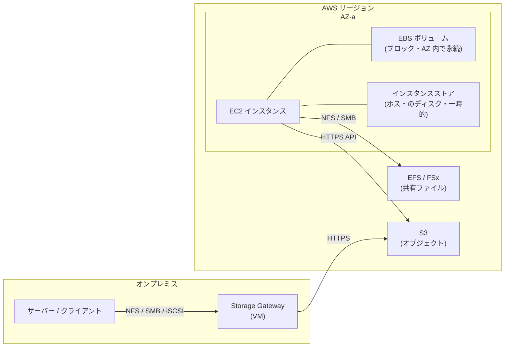
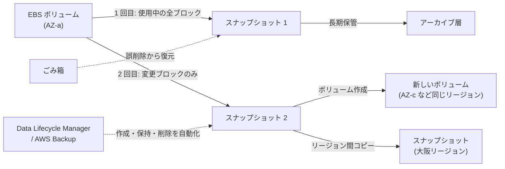
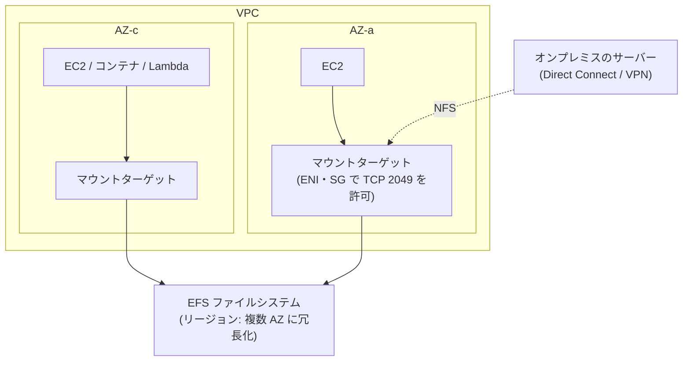
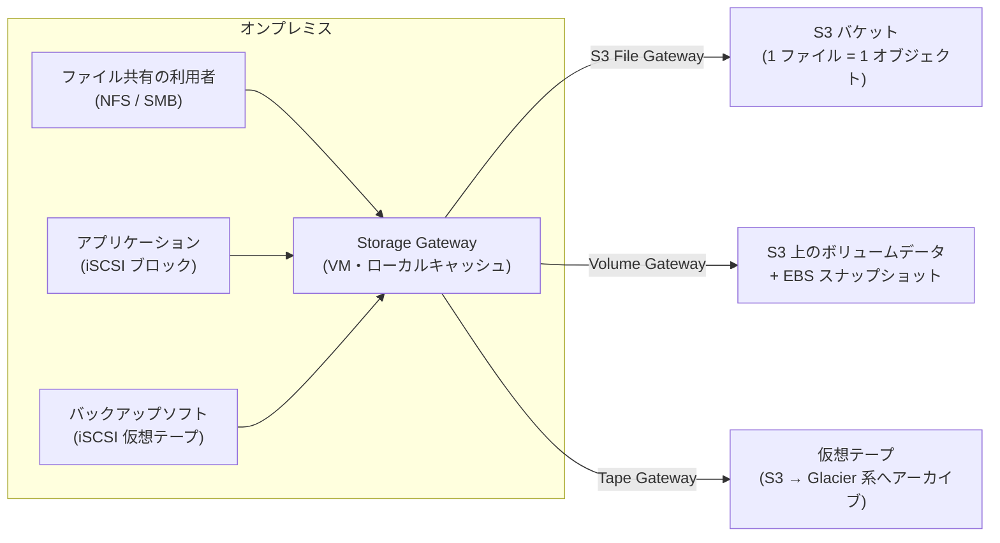
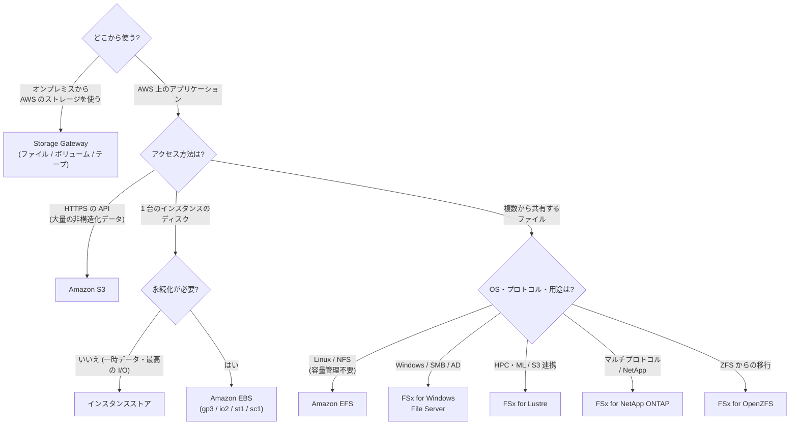

[ホーム](../README.md) > [Phase 2: アソシエイト](README.md) > ブロック・ファイルストレージ（EBS / EFS / FSx / Storage Gateway）

# ブロック・ファイルストレージ（EBS / EFS / FSx / Storage Gateway）

> **この章のゴール**
> - ブロック・ファイル・オブジェクトストレージの違いを説明し、要件から選べる
> - EBS のボリュームタイプを性能とコストで選び、スナップショット・暗号化・マルチアタッチを設計できる
> - インスタンスストアを使うべき場面と注意点を説明できる
> - EFS と FSx（4 種類）の違いを理解し、OS・プロトコル・性能要件から選べる
> - Storage Gateway の種類を、オンプレミスの要件から選べる
>
> **対応試験**: SAA-C03（第3分野 高性能なアーキテクチャの設計 / 第4分野 コストを最適化したアーキテクチャの設計 / 第2分野 弾力性に優れたアーキテクチャの設計）
> **目安時間**: 読む 150分 / 確認問題 40分 / 復習 50分

## この章の全体像

[前章](05-s3.md) の S3 は、HTTPS の API でアクセスするオブジェクトストレージでした。しかし、OS の起動ディスクやデータベースのデータファイル、複数のサーバーで共有するファイルなど、**API ではなく「ディスク」や「ファイル共有」として使いたい** 場面は数多くあります。この章では、そのためのブロックストレージ（EBS・インスタンスストア）、ファイルストレージ（EFS・FSx）、そしてオンプレミスから AWS のストレージを使うための Storage Gateway を学びます。

---

## 1. ブロック・ファイル・オブジェクトの比較

ストレージの選択は、まず「**アプリケーションがどのようにデータにアクセスするか**」で決まります。

| 観点 | ブロックストレージ | ファイルストレージ | オブジェクトストレージ |
|---|---|---|---|
| データの扱い | 固定長のブロックの集まり。OS がその上にファイルシステムを作る | ディレクトリとファイルの階層 | キーとオブジェクト（フラットな名前空間） |
| アクセス方法 | OS からディスクとして（ブロックデバイス、iSCSI） | NFS・SMB などのファイル共有プロトコル | HTTPS の API（REST） |
| 同時に使えるクライアント | 原則 1 台（例外: EBS マルチアタッチ） | 多数のクライアントで共有 | 多数（インターネット越しにも） |
| 部分的な更新 | ブロック単位で可能 | ファイルの一部を更新可能 | 不可（オブジェクト全体を置き換える） |
| レイテンシ | 最も低い | 低い | 比較的高い |
| 容量 | 事前に割り当てる | サービスによる（EFS は自動で伸縮） | 実質無制限 |
| AWS のサービス | EBS、インスタンスストア | EFS、FSx | S3 |
| 典型的な用途 | OS の起動ディスク、データベース、トランザクション処理 | 共有ホームディレクトリ、CMS のコンテンツ、コンテナの共有ボリューム、HPC | 静的コンテンツ、データレイク、バックアップ、アーカイブ |

> [!TIP]
> **試験のポイント**: 問題文のキーワードで絞り込みます。
> - 「起動ボリューム」「データベース」「1 台のインスタンス」「IOPS」→ **EBS**
> - 「一時データ」「最高のランダム I/O」「失われても再作成できる」→ **インスタンスストア**
> - 「複数のインスタンスから同時にアクセス」「Linux」「NFS」→ **EFS**
> - 「Windows」「SMB」「Active Directory」→ **FSx for Windows File Server**
> - 「HPC」「機械学習」「S3 のデータを高速処理」→ **FSx for Lustre**
> - 「オンプレミスから」「ローカルキャッシュ」「仮想テープ」→ **Storage Gateway**

---

## 2. Amazon EBS

### 2.1 EBS の基本

Amazon Elastic Block Store（Amazon EBS）は、EC2 インスタンスに **ネットワーク経由で接続するブロックストレージ** です。

- **永続的**: インスタンスを停止してもデータは残ります。インスタンスとは独立したリソースで、デタッチして別のインスタンスにアタッチし直せます。
- **AZ に閉じる**: ボリュームは特定のアベイラビリティーゾーン（AZ）に作られ、**同じ AZ のインスタンスにしかアタッチできません**。データは AZ 内で自動的に複製されます。
- **1 ボリューム = 原則 1 インスタンス**: 1 つのインスタンスには複数のボリュームをアタッチできますが、1 つのボリュームを複数のインスタンスで共有するのは、io1 / io2 のマルチアタッチ（2.6）という例外だけです。
- **終了時の削除**: 「終了時に削除（DeleteOnTermination）」の既定値は、ルートボリュームが有効、追加のボリュームが無効です。インスタンスを終了すると、既定ではルートボリュームは削除され、追加のボリュームは残ります。
- **性能はインスタンス側にも依存**: ボリュームの性能上限だけでなく、インスタンスタイプごとの EBS 帯域幅・IOPS の上限もあります（EBS 最適化インスタンス。[Amazon EC2](03-ec2.md) を参照）。

別の AZ にデータを移すには、**スナップショットを作成し、目的の AZ でそのスナップショットからボリュームを作成** します。

> [!WARNING]
> **ひっかけ注意**: 「AZ-a の EBS ボリュームを AZ-b のインスタンスにアタッチする」ことはできません。AZ をまたいでデータを共有したいなら、EFS などのファイルストレージを使います。

### 2.2 ボリュームタイプ

EBS のボリュームタイプは、**SSD 系（IOPS 重視・小さなランダム I/O）** と **HDD 系（スループット重視・大きな順次 I/O）** に分かれます。

| タイプ | 分類 | サイズ | 最大 IOPS | 最大スループット | 耐久性 | 主な用途 | 起動ボリューム |
|---|---|---|---|---|---|---|---|
| **gp3** | 汎用 SSD | 1 GiB〜64 TiB | 80,000 | 2,000 MiB/s | 99.8〜99.9% | ほとんどのワークロードの第一候補。起動ボリューム、開発・テスト、中規模 DB | 可 |
| gp2 | 汎用 SSD（従来型） | 1 GiB〜16 TiB | 16,000 | 250 MiB/s | 99.8〜99.9% | 既存環境（新規は gp3） | 可 |
| **io2 Block Express** | プロビジョンド IOPS SSD | 4 GiB〜64 TiB | 256,000 | 4,000 MiB/s | **99.999%** | ミッションクリティカルな大規模 DB（サブミリ秒のレイテンシ） | 可 |
| io1 | プロビジョンド IOPS SSD（従来型） | 4 GiB〜16 TiB | 64,000 | 1,000 MiB/s | 99.8〜99.9% | 既存の I/O 集約型 DB（新規は io2 が有利） | 可 |
| **st1** | スループット最適化 HDD | 125 GiB〜16 TiB | 500 | 500 MiB/s | 99.8〜99.9% | ビッグデータ、データウェアハウス、ログ処理（大きな順次 I/O） | **不可** |
| **sc1** | Cold HDD | 125 GiB〜16 TiB | 250 | 250 MiB/s | 99.8〜99.9% | アクセス頻度の低いデータ。**最も安価** | **不可** |

（2026年9月時点の公式ドキュメントの値。最大 IOPS は Nitro ベースのインスタンスでの値で、HDD 系は 1 MiB の I/O での値です。最新値は [EBS ボリュームタイプ](https://docs.aws.amazon.com/ebs/latest/userguide/ebs-volume-types.html) で確認してください）

各タイプの仕組みを理解しておくと、数値を丸暗記しなくても選べます。

- **gp3**: サイズにかかわらず **ベースラインとして 3,000 IOPS・125 MiB/s** が含まれ、IOPS とスループットを **容量とは独立して** 追加でプロビジョニングできます。「性能のために容量を大きくする」必要がなく、GB あたりの単価も gp2 より安いため、新規の汎用ボリュームは gp3 が基本です。
- **gp2**: 性能が **容量に比例** します（1 GiB あたり 3 IOPS、最小 100 IOPS）。小さなボリュームは I/O クレジットを使って一時的に 3,000 IOPS までバーストできます。IOPS を増やすには容量を増やすしかないため、gp2 から gp3 への変更（2.7 の Elastic Volumes で無停止で可能）は定番のコスト最適化です。
- **io2 Block Express**: 高い IOPS を **安定して** 提供し、耐久性も 99.999% と他のタイプより 2 桁高くなっています。マルチアタッチと NVMe 予約（クラスターソフトウェアの I/O フェンシングに使う）にも対応します。
- **st1 / sc1**: HDD なので、小さなランダム I/O は苦手です。容量に比例したベースラインとバーストのスループットを持ち、大きなファイルを順番に読み書きする処理に向きます。**起動ボリュームには使えません**。
- 旧世代の Magnetic（`standard`）は、現在は選びません。

> [!WARNING]
> **ひっかけ注意**: gp3 の上限は引き上げられ、2026年9月時点では **最大 64 TiB・80,000 IOPS・2,000 MiB/s** です。SAA-C03 の問題や古い教材では、gp3 の上限を「16 TiB・16,000 IOPS・1,000 MiB/s」とし、「**16,000 IOPS を超える性能が必要 → プロビジョンド IOPS SSD（io1 / io2）**」を正解とする出題が見られます。試験では問題文の前提に従い、実務では最新の上限を確認してください。なお、「一貫したサブミリ秒のレイテンシ」「99.999% の耐久性」「マルチアタッチ」が求められる場合は、現在も io2 Block Express が答えです。

> [!TIP]
> **試験のポイント**:
> - 「コスト効率の高い汎用ボリューム」「IOPS を容量と独立して設定したい」→ **gp3**
> - 「最高の IOPS」「サブミリ秒」「ミッションクリティカルな DB」「99.999%」→ **io2 Block Express**
> - 「大量のログを順次処理」「スループット重視」「低コスト」→ **st1**
> - 「アクセス頻度が低い」「最も安い」ブロックストレージ → **sc1**
> - 「HDD の起動ボリューム」は **作れない**

### 2.3 スナップショット

EBS スナップショットは、ボリュームの **ある時点のバックアップ** です。

- AWS が管理する S3 に保存されます（自分の S3 バケットには見えません）。
- **増分バックアップ** です。最初のスナップショットは使用中のブロックをすべて保存し、2 回目以降は **前回から変更されたブロックだけ** を保存します。
- どのスナップショットを削除しても、他のスナップショットの復元に必要なブロックは残されます。古いスナップショットから順に安全に削除できます。
- ボリュームを使用中でも作成できます。ただし、スナップショットに含まれるのはその時点でボリュームに書き込まれたデータだけです。アプリケーション整合性が必要な場合は、I/O を止める・ファイルシステムをフリーズするなどしてから取得します。インスタンスにアタッチされた **複数のボリュームを同じ時点で取得**（クラッシュ整合性のあるマルチボリュームスナップショット）することもできます。
- スナップショットは **リージョン単位** のリソースです。同じリージョンの **どの AZ にでも** ボリュームを作成できます。

スナップショットに関連する機能を整理します。

| 機能 | 内容 | 使いどころ |
|---|---|---|
| リージョン間コピー | スナップショットを別リージョンにコピーする。コピー時に暗号化したり、別の KMS キーで暗号化し直したりできる | DR、別リージョンへの移行 |
| アカウント間の共有 | 特定のアカウントと共有する。暗号化されている場合は **カスタマーマネージドキー** で暗号化し、キーも共有する | 本番から検証環境へのデータ提供 |
| **高速スナップショット復元（FSR）** | スナップショットから作成したボリュームが、**作成直後から** プロビジョニングした性能を発揮する。スナップショットごと・AZ ごとに有効化し、有効にしている時間に応じて課金 | 起動直後から性能が必要な DR・VDI・検証環境の大量作成 |
| **スナップショットのアーカイブ** | 低コストのアーカイブ層に移す（標準層より最大 75% 安い）。アーカイブ時に完全なスナップショットに変換される。最低 90 日保管し、復元に 24〜72 時間かかる | 規制対応などで長期間保管し、めったに復元しないスナップショット |
| **ごみ箱**（Recycle Bin） | 保持ルールを設定しておくと、削除された EBS スナップショットや AMI などが一定期間（1 日〜1 年）ごみ箱に残り、復元できる | 誤削除・悪意ある削除への備え |
| スナップショットのブロックパブリックアクセス | リージョン単位で、スナップショットの一般公開を禁止する | 誤公開の防止 |

**なぜ FSR が必要なのか**: スナップショットから作ったボリュームは、データが S3 から **遅延読み込み** されます。各ブロックに初めてアクセスしたときに S3 から取得するため、最初のアクセスはレイテンシが高くなります（初期化）。FSR を有効にしたスナップショットならこの遅延がありません。FSR を使わない場合は、すべてのブロックを事前に読み込んでおく（`dd` や `fio` で全体を読む）方法もあります。また、ボリューム作成時に初期化の速度を指定できる機能も追加されています。

> [!TIP]
> **試験のポイント**:
> - 「スナップショットから作成したボリュームが、作成直後から最大性能を発揮する必要がある」→ **高速スナップショット復元（FSR）**
> - 「めったに使わないスナップショットを長期間、安く保管したい」→ **スナップショットのアーカイブ**
> - 「誤って削除したスナップショットを復元できるようにしたい」→ **ごみ箱**
> - 「別リージョンに DR 用のバックアップを持ちたい」→ **リージョン間コピー**（DLM や AWS Backup で自動化）

### 2.4 Data Lifecycle Manager と AWS Backup

スナップショットを手作業で管理するのは現実的ではありません。自動化の手段は 2 つあります。

- **Amazon Data Lifecycle Manager（DLM）**: **タグ** で対象のボリュームやインスタンスを指定し、スケジュール（例: 12 時間ごと）、保持数・保持期間、リージョン間コピー、アカウント間共有などをポリシーで定義します。EBS スナップショットと EBS-backed AMI が対象で、DLM 自体は無料です（スナップショットの保存料金はかかります）。
- **AWS Backup**: EBS だけでなく、EFS・FSx・RDS・DynamoDB・S3 など **複数のサービスのバックアップを一元管理** します（7 章）。

> [!TIP]
> **試験のポイント**: 「EBS スナップショットの作成と削除を、追加コストなく自動化したい」→ **DLM**。「複数のサービスのバックアップを一元管理し、コンプライアンスのために監査・WORM 保護したい」→ **AWS Backup**。

### 2.5 暗号化

EBS の暗号化は KMS のキー（AES-256）を使い、次のすべてを暗号化します。

- ボリューム内の保管データ
- インスタンスとボリュームの間でやり取りされるデータ
- そのボリュームから作成したスナップショット、そのスナップショットから作成したボリューム

暗号化・復号はインスタンスをホストするサーバー側で行われるため、アプリケーションの変更は不要で、性能への影響もほとんどありません。

**デフォルトで暗号化**: リージョンごと（アカウントごと）に「EBS 暗号化をデフォルトで有効にする」設定があります。有効にすると、それ以降に作成する新しいボリュームとスナップショットのコピーは自動的に暗号化されます。使うキーは AWS マネージドキー（`aws/ebs`）かカスタマーマネージドキーを選べます。**既存のボリュームは暗号化されません**。

**既存の暗号化されていないボリュームを暗号化する手順**: ボリュームの暗号化を後から直接有効にすることはできません。次の手順で「暗号化された新しいボリューム」に置き換えます。

1. 暗号化されていないボリュームのスナップショットを作成します。
2. 暗号化を有効にして（KMS キーを指定して）スナップショットをコピーします。（暗号化されていないスナップショットから、暗号化を指定して直接ボリュームを作ることもできます）
3. 暗号化されたスナップショットから、インスタンスと **同じ AZ** に新しいボリュームを作成します。
4. インスタンスを停止（またはアプリケーションを停止してアンマウント）し、古いボリュームをデタッチして新しいボリュームをアタッチします。

ルートボリュームの場合は、同様にインスタンスを停止して付け替えるか、**AMI を作成 → 暗号化を指定して AMI をコピー → 暗号化された AMI から新しいインスタンスを起動** する方法をとります。

> [!WARNING]
> **ひっかけ注意**:
> - 「既存のボリュームの設定で暗号化を有効にする」「デフォルトで暗号化を有効にすれば既存のボリュームも暗号化される」は **どちらも誤り** です。
> - 暗号化されたボリュームを直接「暗号化なし」に戻すこともできません。
> - **AWS マネージドキー（`aws/ebs`）で暗号化したスナップショットは、他のアカウントと共有できません**。共有するにはカスタマーマネージドキーで暗号化し、キーポリシーで相手アカウントに使用を許可します（S3 の `aws/s3` と同じ考え方です）。

### 2.6 マルチアタッチ

マルチアタッチは、1 つの EBS ボリュームを **複数のインスタンスに同時にアタッチ** する機能です。

- 対応するのは **io1 / io2（Provisioned IOPS SSD）だけ** です。gp2・gp3・st1・sc1 は対応していません。
- アタッチできるのは **同じ AZ** の **Nitro ベースのインスタンス**（最大 16 台）です。
- 複数のインスタンスからの同時書き込みを調停する仕組みは、EBS 側にはありません。**クラスター対応のファイルシステム**（GFS2 など）やアプリケーション側の制御が必要です。XFS や ext4 のような通常のファイルシステムを複数のインスタンスから同時にマウントして書き込むと、データが壊れます。
- io2 は NVMe 予約に対応しており、クラスターソフトウェアによる I/O フェンシング（障害ノードの書き込みを止める仕組み）に使えます。

> [!WARNING]
> **ひっかけ注意**: 「複数のインスタンスでファイルを共有したい」という要件の多くは、マルチアタッチではなく **EFS や FSx** が正解です。マルチアタッチは、共有ブロックストレージを前提とするクラスターアプリケーション向けの特殊な機能で、AZ をまたげない点にも注意します。

### 2.7 Elastic Volumes

Elastic Volumes を使うと、ボリュームを **アタッチしたまま（多くの場合、無停止で）** 次の変更ができます。

- **サイズの拡張**（縮小はできません）
- **ボリュームタイプの変更**（例: gp2 → gp3、gp3 → io2）
- **IOPS・スループットの変更**

注意点です。

- サイズを拡張したら、OS 側で **パーティションとファイルシステムの拡張**（Linux の `growpart`・`xfs_growfs`・`resize2fs` など）が必要です。
- 変更後は「最適化中（optimizing）」の状態を経て完了します。この間も使えますが、性能が一時的に変動することがあります。
- 一度変更すると、同じボリュームを再び変更できるまで待ち時間があります。頻繁な上げ下げを前提にした設計はしません。
- **縮小したい場合** は、小さな新しいボリュームを作ってデータをコピーするしかありません。

> [!TIP]
> **試験のポイント**: 「ダウンタイムなしで EBS の容量や性能を増やしたい」「gp2 を gp3 に変更してコストを下げたい」→ **Elastic Volumes**（ボリュームの変更）。

---

## 3. インスタンスストア

インスタンスストアは、EC2 インスタンスが動いている **ホストサーバーに物理的に接続されたディスク**（多くは NVMe SSD）です。一部のインスタンスタイプ（ストレージ最適化の I 系、名前に `d` が付く `m6id` などのタイプ）に付属し、料金はインスタンスの料金に含まれます。

ネットワークを経由しないため、**非常に高いランダム I/O 性能と低いレイテンシ** が得られます。その代わり、データは **一時的（エフェメラル）** です。

| 操作・イベント | インスタンスストアのデータ | EBS のデータ |
|---|---|---|
| OS の再起動（リブート） | 残る | 残る |
| インスタンスの停止・休止 | **消える** | 残る |
| インスタンスの終了 | **消える** | 残る（DeleteOnTermination が無効なら） |
| ホストのディスク障害 | **消える** | 影響を受けない（AZ 内で複製） |
| スナップショット | 取れない | 取れる |
| 別のインスタンスへの付け替え | できない | できる（同じ AZ 内） |
| 容量 | インスタンスタイプで固定 | 1 GiB〜（タイプによる）で自由に設定・拡張 |

**向いている用途**:
- キャッシュ、バッファ、スクラッチ領域（一時的な作業ファイル）
- 複数のインスタンスにデータを複製するソフトウェアのデータ（Cassandra、Kafka、HDFS など）。1 台が失われても他のノードから復旧できる
- 失われても再作成できる、非常に高い I/O が必要なデータ

> [!WARNING]
> **ひっかけ注意**: 「インスタンスを停止・起動したらデータが消えた」→ インスタンスストアを使っていたことが原因です。永続化が必要なデータを置いてはいけません。また、「停止して別のインスタンスタイプに変更する」操作でもインスタンスストアのデータは失われます（インスタンスタイプの詳細は [Amazon EC2](03-ec2.md)）。

> [!TIP]
> **試験のポイント**: 「最高のランダム I/O 性能」「一時データ」「データはアプリケーションが複数ノードに複製している」「最もコスト効率が高い」→ **インスタンスストア**。「永続性」「スナップショット」「AZ 内での耐障害性」が必要なら **EBS**。

---

## 4. Amazon EFS

### 4.1 EFS の基本

Amazon Elastic File System（Amazon EFS）は、**Linux 向けのフルマネージドな NFS ファイルシステム** です。

- **NFS v4.0 / v4.1** でマウントし、POSIX 準拠のファイルシステムとして使えます。**Windows のインスタンスはサポートされません**。
- **容量は自動で伸縮** します。容量を事前に決める必要はなく、保存したデータ量に応じて課金されます。
- 数千のクライアントから同時にアクセスできます。EC2 だけでなく、ECS・EKS のコンテナ、Lambda 関数、Direct Connect や VPN 経由のオンプレミスのサーバーからもマウントできます。
- ファイルシステムのタイプは 2 つです。
  - **リージョン**（Regional）: データを **複数の AZ** に冗長化して保存します。本番環境の標準です。
  - **1 ゾーン**（One Zone）: データを **1 つの AZ** に保存します。安価ですが、AZ 障害の影響を受けます。開発環境や、再作成できるデータ向けです。

クライアントは、各 AZ に作成した **マウントターゲット**（サブネット内の ENI）経由で接続します。マウントターゲットのセキュリティグループでは、クライアントからの **NFS（TCP 2049）** を許可します。

### 4.2 パフォーマンスモードとスループットモード

| 設定 | 選択肢 | 説明 | 使いどころ |
|---|---|---|---|
| パフォーマンスモード | **汎用**（General Purpose） | レイテンシが最も低い。既定・推奨 | ほぼすべてのワークロード |
| | 最大 I/O（Max I/O） | 旧来の高並列向けのモード。1 操作あたりのレイテンシが高い。1 ゾーンのファイルシステムや Elastic スループットでは使えない | 既存の特殊なワークロード（新規では汎用が推奨） |
| スループットモード | **Elastic** | 負荷に応じてスループットが自動で伸縮し、使った分だけ課金。推奨 | 予測できない・スパイクのある負荷 |
| | プロビジョンド | 保存容量と無関係にスループットを指定 | 必要なスループットが予測でき、容量に比べて高い性能が必要 |
| | バースト | 保存容量に比例したベースラインとバーストクレジット | 保存容量に見合った程度の負荷 |

> [!TIP]
> **試験のポイント**: 「保存データは少ないが高いスループットが必要」→ バーストモードでは容量に比例した性能しか得られないため、**Elastic** または **プロビジョンド** スループット。「負荷が予測できない」→ **Elastic**。古い教材では「高い並列性には最大 I/O」とされていますが、現在は汎用モードが推奨です。

### 4.3 ストレージクラスとライフサイクル管理

S3 と同様に、EFS にもアクセス頻度に応じたストレージクラスがあります。

| ストレージクラス | 特徴 |
|---|---|
| EFS Standard | SSD ベースで低レイテンシ。頻繁にアクセスするファイル向け |
| EFS 低頻度アクセス（Infrequent Access、IA） | 保存単価が安い。読み書きのたびにデータアクセス料金がかかる |
| EFS Archive | 最も安い。年に数回程度しかアクセスしないファイル向け |

- **ライフサイクル管理**: 「最後のアクセスから N 日」を条件に、ファイルを IA や Archive に自動で移します。さらに「**最初のアクセスで Standard に戻す**」設定を組み合わせると、アクセスパターンに合わせて自動で最適化されます（EFS Intelligent-Tiering）。
- 小さなファイル（128 KiB 未満）はライフサイクル管理の対象外で、常に Standard に保存されます。
- 1 ゾーンのファイルシステムでは、1 ゾーン用のストレージクラスを使います。

### 4.4 アクセスポイント・セキュリティ・データ保護

- **EFS アクセスポイント**: アプリケーションごとの入口です。接続したクライアントに **特定の POSIX ユーザー・グループ ID を強制** し、**特定のディレクトリをルートとして見せる** ことができます。Lambda 関数やコンテナなど、多数のアプリケーションで 1 つのファイルシステムを安全に分けて使う場合に便利です。
- **ネットワーク**: マウントターゲットのセキュリティグループで接続元を制限します。
- **IAM による認可**: NFS クライアントの IAM 認可と、**ファイルシステムポリシー**（リソースベースのポリシー）で、マウント・書き込み・ルートアクセスを制御できます。ファイルシステムポリシーで `aws:SecureTransport` を条件にして、転送中の暗号化を強制することもできます。
- **保管時の暗号化**: KMS で暗号化します。**ファイルシステムの作成時にしか有効にできません**。既存の暗号化されていないファイルシステムを暗号化するには、暗号化した新しいファイルシステムを作り、AWS DataSync などでデータを移します。
- **転送中の暗号化**: EFS マウントヘルパー（amazon-efs-utils）で TLS を有効にしてマウントします。
- **バックアップ**: AWS Backup と統合されています（コンソールで作成すると自動バックアップが既定で有効）。
- **レプリケーション**: EFS レプリケーションで、別のリージョン（または同じリージョン）にファイルシステムの複製を維持できます。RPO・RTO が分単位になるように設計されており、DR に使います。

> [!WARNING]
> **ひっかけ注意**:
> - 「Windows サーバーから共有ファイルシステムを使いたい」に EFS は **不正解** です（→ FSx for Windows File Server）。
> - EFS の保管時の暗号化は **後から有効にできません**。
> - EFS は複数 AZ から使えますが、各 AZ にマウントターゲットが必要です。

---

## 5. Amazon FSx

### 5.1 FSx ファミリーの比較

Amazon FSx は、**実績のある商用・オープンソースのファイルシステムをフルマネージドで提供する** サービス群です。EFS が「AWS 独自のシンプルな NFS」であるのに対し、FSx は「オンプレミスで使われているファイルシステムの機能をそのまま使いたい」「HPC 向けの極めて高い性能がほしい」といった要件に応えます。

| 項目 | FSx for Windows File Server | FSx for Lustre | FSx for NetApp ONTAP | FSx for OpenZFS |
|---|---|---|---|---|
| プロトコル | **SMB** | **Lustre**（専用クライアント） | **NFS / SMB / iSCSI**（マルチプロトコル） | **NFS** |
| 主なクライアント | Windows（Linux・macOS からも SMB で可） | Linux | Linux / Windows / macOS | Linux / Windows / macOS（NFS） |
| 特徴的な機能 | **Active Directory 統合**、NTFS・Windows ACL、**DFS 名前空間**、シャドウコピー、データ重複排除、ユーザークォータ | 並列ファイルシステム。**S3 と連携**（S3 のデータを遅延読み込みし、結果を S3 に書き戻す） | **SnapMirror**（レプリケーション）、FlexClone、スナップショット、重複排除・圧縮、容量プールへの自動階層化 | スナップショット、クローン、圧縮。低レイテンシ |
| 可用性の構成 | シングル AZ / **マルチ AZ** | シングル AZ（スクラッチ / 永続） | シングル AZ / **マルチ AZ** | シングル AZ / **マルチ AZ** |
| 典型的な用途 | Windows ファイルサーバーの移行、ホームディレクトリ、SQL Server などの Windows アプリケーション | HPC、機械学習の学習、動画レンダリング、ゲノム解析、金融シミュレーション | オンプレミスの NetApp からの移行、Linux と Windows の混在環境、DR | オンプレミスの ZFS・Linux ファイルサーバーからの移行 |

### 5.2 FSx for Windows File Server

- **SMB プロトコル** でアクセスする、Windows Server ベースのフルマネージドなファイルサーバーです。
- **Microsoft Active Directory**（AWS Managed Microsoft AD またはオンプレミスの自己管理 AD）に参加し、既存のユーザー・グループで NTFS のアクセス権限を管理できます。
- **DFS 名前空間** で、複数のファイルシステムの共有を 1 つのフォルダ構造にまとめられます。
- **マルチ AZ** 構成では、別の AZ のスタンバイにデータが同期的に複製され、障害時は自動でフェイルオーバーします。
- ストレージは SSD と HDD から選べます。シャドウコピー（ユーザー自身による以前のバージョンの復元）、データ重複排除、ユーザーごとのクォータも使えます。
- 日次の自動バックアップ（S3 に保存）と AWS Backup に対応しています。

### 5.3 FSx for Lustre

Lustre は、スーパーコンピューターで使われてきた **並列分散ファイルシステム** です。多数のサーバーにデータを分散し、多数のクライアントから並列に読み書きすることで、極めて高いスループット（公式には数百 GB/秒規模）と低いレイテンシを実現します。

| デプロイタイプ | データの複製 | 用途 |
|---|---|---|
| **スクラッチ** | なし。ファイルサーバーに障害が起きるとデータが失われる | 短期間の処理、一時データ、コスト重視 |
| **永続** | 同じ AZ 内で複製。障害時はファイルサーバーが自動で置き換えられる | 長期間の処理、長く保持するデータ |

- **S3 との連携（データリポジトリの関連付け）**: S3 バケット（またはプレフィックス）をファイルシステムに関連付けると、S3 のオブジェクトがファイルとして見えます。データは **最初にアクセスしたときに S3 から読み込まれ**（遅延読み込み）、処理結果は S3 に **エクスポート** できます。「S3 のデータレイク」+「処理中だけ高速なファイルシステム」という使い方が典型です。
- クライアントは **Linux** の Lustre クライアントです。

> [!TIP]
> **試験のポイント**: 「HPC」「機械学習の学習」「S3 のデータを並列に高速処理」→ **FSx for Lustre**。さらに「処理は短期間」「コスト効率」→ **スクラッチ**、「長期間」「データの保護」→ **永続**。

### 5.4 FSx for NetApp ONTAP と FSx for OpenZFS

- **FSx for NetApp ONTAP**: NetApp の ONTAP をフルマネージドで提供します。同じデータに **NFS・SMB・iSCSI** で同時にアクセスできる **マルチプロトコル** が最大の特徴です。オンプレミスの NetApp との **SnapMirror** によるレプリケーション、瞬時に複製を作る FlexClone、重複排除・圧縮、アクセス頻度の低いデータを安価な **容量プール** に自動で移す階層化など、エンタープライズ向けの機能がそろっています。
- **FSx for OpenZFS**: OpenZFS をフルマネージドで提供し、**NFS** でアクセスします。スナップショット、瞬時のクローン、圧縮などの ZFS の機能を使えます。オンプレミスの ZFS や Linux ベースのファイルサーバーからの移行に向きます。

> [!NOTE]
> 一部の FSx（FSx for OpenZFS など）では、ファイルシステムに **S3 アクセスポイント** を接続し、ファイルのデータに S3 の API でアクセスできます（2025年〜）。ファイルデータを移動せずに、S3 に対応した分析サービスや生成 AI のサービスから使うための機能です。

### 5.5 EFS と FSx の使い分け

| 要件 | 選ぶサービス |
|---|---|
| Linux の共有ファイル、容量管理不要、使った分だけ課金、サーバーレス | **EFS** |
| Windows、SMB、Active Directory、NTFS の権限、DFS | **FSx for Windows File Server** |
| HPC・機械学習、S3 上のデータの高速処理 | **FSx for Lustre** |
| NFS と SMB（と iSCSI）の同時利用、NetApp からの移行、SnapMirror | **FSx for NetApp ONTAP** |
| ZFS からの移行、ZFS のスナップショット・クローン | **FSx for OpenZFS** |

> [!WARNING]
> **ひっかけ注意**: 「Linux と Windows の両方から同じファイルにアクセスしたい」という要件では、SMB だけの FSx for Windows File Server や NFS だけの EFS ではなく、**FSx for NetApp ONTAP**（マルチプロトコル）が有力です。ただし、Linux から SMB でマウントするだけでよい場合は FSx for Windows File Server も候補になるため、問題文の他の要件（NFS が必須か、AD との統合か）で判断します。

---

## 6. AWS Storage Gateway

### 6.1 Storage Gateway の役割

AWS Storage Gateway は、**オンプレミスのアプリケーションから、使い慣れたプロトコル（NFS・SMB・iSCSI）のまま AWS のストレージを使う** ためのハイブリッドストレージサービスです。オンプレミスに仮想マシン（VMware ESXi、Microsoft Hyper-V、Linux KVM）としてゲートウェイをデプロイし、よく使うデータを **ローカルキャッシュ** に置くことで、低レイテンシのアクセスを実現します（EC2 上にデプロイすることもできます）。

### 6.2 ゲートウェイの種類

| タイプ | プロトコル | データの保存先 | 特徴・用途 |
|---|---|---|---|
| **S3 File Gateway** | NFS / SMB | S3（1 ファイル = 1 オブジェクト） | ファイル共有のデータを S3 に保存。最近使ったデータをローカルにキャッシュ。S3 のライフサイクルや分析サービスをそのまま使える |
| FSx File Gateway | SMB | FSx for Windows File Server | **2024 年 10 月 28 日以降、新規顧客は利用できない** |
| **Volume Gateway（キャッシュ型）** | iSCSI | S3 がプライマリ + よく使うデータをローカルにキャッシュ | オンプレミスのストレージを増やさずに容量を拡張したい |
| **Volume Gateway（保管型）** | iSCSI | ローカルがプライマリ + S3 に非同期でバックアップ | データ全体に低レイテンシでアクセスしつつ、AWS にバックアップしたい。バックアップは EBS スナップショットとして復元できる |
| **Tape Gateway** | iSCSI（仮想テープライブラリ） | S3 → Glacier Flexible Retrieval / Deep Archive | 既存のバックアップソフトのまま、物理テープを置き換えたい |

- **S3 File Gateway** で保存したファイルは、S3 では通常のオブジェクトとして見えます。Athena での分析やライフサイクルによる移行がそのまま使えます。ただし、ゲートウェイを通さずに S3 に直接追加されたオブジェクトは、キャッシュを更新（RefreshCache）するまでゲートウェイからは見えません。また、Glacier 系に移ったファイルは、復元するまでゲートウェイから読めません。
- **Volume Gateway のキャッシュ型と保管型の違い** は、「プライマリのデータがどこにあるか」です。オンプレミスの容量不足を解消したいならキャッシュ型、全データへの低レイテンシアクセスが必要ならローカルにすべてを持つ保管型です。
- **FSx File Gateway** は新規顧客への提供が終了しています。新しい設計では、オンプレミスから Direct Connect や VPN 経由で FSx for Windows File Server に直接アクセスする構成などを検討します（[サービスの変更点](../06-reference/service-changes.md)）。

> [!TIP]
> **試験のポイント**:
> - 「オンプレミスのファイル共有（NFS / SMB）のデータを S3 に保存し、最近のデータは低レイテンシで使いたい」→ **S3 File Gateway**
> - 「オンプレミスの iSCSI ストレージの容量を AWS で拡張したい」→ **Volume Gateway（キャッシュ型）**
> - 「全データを低レイテンシで使いつつ、AWS にバックアップしたい」→ **Volume Gateway（保管型）**
> - 「物理テープを廃止したい。バックアップソフトは変更したくない」→ **Tape Gateway**

> [!WARNING]
> **ひっかけ注意**: 試験や古い教材では「オンプレミスから FSx for Windows File Server に低レイテンシでアクセス → FSx File Gateway」が正解として出題される可能性があります。概念として覚えつつ、現在は新規顧客が利用できないことも押さえておきましょう。また、データを一度だけ AWS へ **移行** する目的なら、Storage Gateway ではなく **AWS DataSync** が適しています（[移行とハイブリッド接続](16-migration-hybrid.md)）。

---

## 7. AWS Backup の入口

AWS Backup は、複数の AWS サービスのバックアップを **一元的に管理** するサービスです。詳細は [高可用性と災害対策](15-high-availability-dr.md) で扱うので、ここでは位置付けだけを押さえます。

- **バックアッププラン** で、スケジュール、保持期間、コールドストレージへの移行、別リージョン・別アカウントへのコピーを定義します。
- 対象は EC2・EBS・EFS・FSx・S3・RDS・Aurora・DynamoDB・Storage Gateway のボリュームなど、多くのサービスに及びます。
- **Vault Lock**（ガバナンスモード / コンプライアンスモード）でバックアップを WORM 保護できます。論理的にエアギャップされたボールト（2024 年 8 月 GA）で、ランサムウェアや侵害されたアカウントからバックアップを隔離することもできます。
- Organizations の **バックアップポリシー** で、組織全体にバックアップ方針を適用できます。

> [!TIP]
> **試験のポイント**: 「EBS・EFS・RDS・DynamoDB などのバックアップを一元管理し、別リージョンにもコピーしたい」「バックアップを誰にも削除させたくない」→ **AWS Backup**（+ Vault Lock）。EBS スナップショットだけなら **DLM** でも自動化できます。

---

## 8. 選定フローチャート

ここまでの内容を、ストレージ選定のフローチャートにまとめます。実際の問題では、ここにコスト・性能・可用性の制約が加わります。

EBS を選んだ後のボリュームタイプの選び方は、次のとおりです。

| 要件 | ボリュームタイプ |
|---|---|
| 汎用・起動ボリューム・コスト効率 | gp3 |
| 最高の IOPS、サブミリ秒の安定したレイテンシ、99.999% の耐久性、マルチアタッチ | io2 Block Express |
| 大きな順次 I/O のスループット（ログ処理、DWH）を低コストで | st1 |
| アクセス頻度の低いデータを最も安く | sc1 |

---

## まとめ

- ストレージは **アクセス方法**（ブロック / ファイル / オブジェクト）で大きく分かれる。ブロックは EBS・インスタンスストア、ファイルは EFS・FSx、オブジェクトは S3
- EBS は **AZ に閉じた** 永続ブロックストレージ。AZ をまたぐにはスナップショット経由。性能はボリュームとインスタンスの両方の上限に依存する
- ボリュームタイプは **gp3 が第一候補**（3,000 IOPS・125 MiB/s のベースライン、IOPS を容量と独立に設定）。最高性能・高耐久は **io2 Block Express**、スループット重視は **st1**、最安は **sc1**。HDD 系は起動ボリュームに使えない
- スナップショットは **増分** でリージョン単位。リージョン間コピー、**FSR**（作成直後から最大性能）、**アーカイブ**（最大 75% 安い・復元 24〜72 時間）、**ごみ箱**（誤削除対策）、**DLM**（自動化）
- 暗号化されていないボリュームは **スナップショット → 暗号化コピー → 新ボリューム → 付け替え** で暗号化する。デフォルト暗号化は既存のボリュームには効かない
- マルチアタッチは **io1 / io2・同じ AZ・Nitro・クラスター対応のファイルシステム** が条件。Elastic Volumes で無停止の拡張・タイプ変更ができる（縮小は不可）
- インスタンスストアは最高の I/O だが **停止・終了で消える**。キャッシュや複製されたデータ向け
- EFS は **Linux 向けの NFS**。自動で伸縮し、リージョン（マルチ AZ）/ 1 ゾーン、Elastic スループット、IA・Archive へのライフサイクル、アクセスポイント。暗号化は作成時のみ
- FSx は **Windows（SMB・AD・DFS）/ Lustre（HPC・S3 連携・スクラッチ or 永続）/ ONTAP（マルチプロトコル・SnapMirror）/ OpenZFS（ZFS 移行）**
- Storage Gateway は **S3 File Gateway / Volume Gateway（キャッシュ型・保管型）/ Tape Gateway**。FSx File Gateway は新規提供終了。バックアップの一元管理は **AWS Backup**

## 確認問題

### 問1
ある企業は、本番環境の EC2 インスタンスにアタッチされた、暗号化されていない EBS データボリューム（gp3）を使っています。セキュリティ監査の指摘を受け、このボリュームのデータを KMS のカスタマーマネージドキーで暗号化する必要があります。データは保持しなければならず、メンテナンスウィンドウ中の短時間の停止は許容されます。この要件を満たす手順はどれですか。

- A. EBS ボリュームの設定を変更し、既存のボリュームの暗号化を有効にする。
- B. リージョンの「EBS 暗号化をデフォルトで有効にする」設定をオンにし、既存のボリュームが自動的に暗号化されるのを待つ。
- C. ボリュームのスナップショットを作成し、暗号化を有効にしてスナップショットをコピーする。暗号化されたスナップショットからインスタンスと同じ AZ にボリュームを作成し、メンテナンスウィンドウ中に既存のボリュームと付け替える。
- D. ボリュームのスナップショットを作成して別のリージョンにコピーし、コピー先のリージョンでボリュームを作成してインスタンスにアタッチする。

解答と解説

**正解: C**

**解説**: 既存の EBS ボリュームを直接暗号化することはできません。スナップショットを作成し、暗号化を指定してコピー（またはボリューム作成時に暗号化を指定）することで、暗号化された新しいボリュームを作り、元のボリュームと付け替えます。EBS はインスタンスと同じ AZ でなければアタッチできない点にも注意します。

**各選択肢の検討**
- A: ✗ 既存のボリュームの暗号化を後から有効にする設定はありません。
- B: ✗ デフォルトの暗号化は、設定後に作成される新しいボリュームにだけ適用されます。
- C: ✓ 正しい手順です。停止時間は付け替えの間だけで済みます。
- D: ✗ 別リージョンのボリュームは元のインスタンスにアタッチできません。また、コピーしただけでは暗号化されるとは限りません。

### 問2
ある企業は、複数の AZ にまたがる Auto Scaling グループの Linux EC2 インスタンスで CMS を運用しています。アップロードされた画像などのファイルを、すべてのインスタンスから同時に読み書きできる共有ストレージが必要です。ファイルの総量は予測できず、容量の管理はしたくありません。1 つの AZ が停止してもファイルにアクセスできる必要があります。運用上のオーバーヘッドが最も少ないストレージはどれですか。

- A. リージョン（マルチ AZ）タイプの Amazon EFS ファイルシステムを作成し、各 AZ のマウントターゲット経由で全インスタンスからマウントする。
- B. io2 Block Express ボリュームでマルチアタッチを有効にし、すべてのインスタンスにアタッチする。
- C. シングル AZ の FSx for Windows File Server を作成し、SMB で共有する。
- D. 各インスタンスのインスタンスストアにファイルを保存し、cron で定期的に rsync して同期する。

解答と解説

**正解: A**

**解説**: EFS は Linux 向けの共有ファイルシステムで、容量は自動で伸縮し、リージョンタイプはデータを複数の AZ に冗長化します。各 AZ のマウントターゲット経由で、Auto Scaling で増減するインスタンスから同時にマウントできます。

**各選択肢の検討**
- A: ✓ 共有、容量管理不要、AZ 障害への耐性をすべて満たします。
- B: ✗ マルチアタッチは同じ AZ のインスタンスにしか使えず、クラスター対応のファイルシステムも必要です。容量も事前に割り当てる必要があります。
- C: ✗ シングル AZ 構成は AZ 障害の要件を満たしません。また、Windows 向けの SMB サービスで、容量の管理も必要です。
- D: ✗ インスタンスストアはインスタンスの停止・終了でデータが消え、Auto Scaling の環境では同期の仕組みも複雑で整合性を保てません。

### 問3
ある企業は、オンプレミスの Windows ファイルサーバーを AWS に移行しようとしています。ファイル共有には SMB でアクセスしており、既存の Active Directory のユーザー・グループによる NTFS のアクセス権限を維持する必要があります。複数の共有を 1 つの名前空間にまとめるため、DFS 名前空間も使っています。AZ 障害時には自動でフェイルオーバーする必要があります。最も適切なサービスはどれですか。

- A. Amazon EFS（リージョン）
- B. FSx for Lustre（永続デプロイ）
- C. EC2 上にデプロイした S3 File Gateway の SMB 共有
- D. FSx for Windows File Server（マルチ AZ）

解答と解説

**正解: D**

**解説**: FSx for Windows File Server は SMB、Active Directory 統合、NTFS のアクセス権限、DFS 名前空間に対応したフルマネージドな Windows ファイルサーバーです。マルチ AZ 構成では、別の AZ のスタンバイへ自動でフェイルオーバーします。

**各選択肢の検討**
- A: ✗ EFS は NFS のみで、Windows のインスタンスはサポートされません。
- B: ✗ FSx for Lustre は Linux 向けの HPC 用ファイルシステムで、SMB や AD には対応しておらず、シングル AZ です。
- C: ✗ Storage Gateway は主にオンプレミスから AWS のストレージを使うためのものです。EC2 上の単一のゲートウェイでは AZ 障害時の自動フェイルオーバーを実現できず、Windows ファイルサーバーのネイティブな機能も提供しません。
- D: ✓ すべての要件を満たします。

### 問4
ある研究機関は、S3 バケットに保存された数百 TB のゲノムデータを、数百台の EC2 インスタンスで並列に処理する解析ジョブを週に 1 回、数日間かけて実行します。処理中は非常に高いスループットと低いレイテンシが必要です。処理結果は S3 に書き戻し、ジョブの終了後はファイルシステムは不要です。最もコスト効率の高い方法はどれですか。

- A. FSx for Lustre の永続デプロイを常時稼働させ、S3 のデータを毎週手動でコピーする。
- B. ジョブのたびに FSx for Lustre のスクラッチデプロイを作成して S3 バケットと関連付け、処理結果を S3 にエクスポートしてからファイルシステムを削除する。
- C. Amazon EFS を最大 I/O パフォーマンスモードで作成し、S3 からデータをコピーして処理する。
- D. 各 EC2 インスタンスに st1 ボリュームをアタッチし、S3 からデータをダウンロードして処理する。

解答と解説

**正解: B**

**解説**: FSx for Lustre は HPC 向けの並列ファイルシステムで、S3 と関連付けるとデータを遅延読み込みし、結果を S3 にエクスポートできます。短期間の処理で、データの正本は S3 にあるため、複製を持たない安価なスクラッチデプロイを処理の間だけ作成するのが最もコスト効率的です。

**各選択肢の検討**
- A: ✗ 使わない期間も永続デプロイの料金がかかり、手動コピーの運用負荷もあります。
- B: ✓ 必要な期間だけ高性能なファイルシステムを使い、S3 と自動で連携できます。
- C: ✗ EFS は汎用の共有ファイルシステムで、このような大規模な並列 HPC 処理には FSx for Lustre ほど向いていません。データのコピーも必要です。最大 I/O モードは旧来のモードで、レイテンシも高くなります。
- D: ✗ 各インスタンスに数百 TB のデータを重複してダウンロードすることになり、非効率でコストも高くなります。st1 のスループットにも上限があります。

### 問5
ある企業のオンプレミスのアプリケーションは、NFS でファイルサーバーにログやレポートを書き込んでいます。ファイルサーバーの容量が逼迫しているため、データを AWS に保存し、ライフサイクルルールで安価なストレージクラスに移したり、Athena で分析したりしたいと考えています。最近書き込んだファイルには、オンプレミスから引き続き低レイテンシでアクセスする必要があります。アプリケーションの変更は最小限にしたいと考えています。最も適切な方法はどれですか。

- A. Volume Gateway（保管型）をデプロイし、iSCSI ボリュームをファイルサーバーにマウントする。
- B. S3 File Gateway をオンプレミスにデプロイし、その NFS 共有をアプリケーションからマウントする。
- C. FSx File Gateway をデプロイし、データを FSx for Windows File Server に保存する。
- D. Tape Gateway をデプロイし、ログを仮想テープに書き込む。

解答と解説

**正解: B**

**解説**: S3 File Gateway は NFS / SMB のファイル共有を提供し、ファイルを S3 のオブジェクトとして保存します。最近使ったデータはローカルキャッシュから低レイテンシで読めます。S3 に保存されたデータには、ライフサイクルルールや Athena をそのまま使えます。アプリケーションは NFS のマウント先を変えるだけで済みます。

**各選択肢の検討**
- A: ✗ Volume Gateway はブロックストレージで、データはボリュームとして保存されるため、S3 のオブジェクトとして Athena で分析できません。保管型はすべてのデータをローカルに持つため、容量の逼迫も解消しません。
- B: ✓ すべての要件を満たします。
- C: ✗ FSx File Gateway は 2024 年 10 月 28 日以降、新規顧客は利用できません。また、データは S3 ではなく FSx に保存されます。
- D: ✗ Tape Gateway はバックアップソフトからの仮想テープ用で、日常的なファイルアクセスには使えません。

### 問6
ある企業は、クラスター対応のアプリケーションを 3 台の EC2 インスタンス（Nitro ベース）で運用しています。このアプリケーションは共有ブロックストレージを前提としており、クラスター対応のファイルシステムを使って 3 台から同じボリュームに同時に書き込みます。この構成を EBS で実現するために必要なことはどれですか。**2 つ選択してください。**

- A. io2 Block Express ボリュームを作成し、マルチアタッチを有効にする。
- B. gp3 ボリュームを作成し、マルチアタッチを有効にする。
- C. 可用性を高めるため、3 台のインスタンスを異なる AZ に配置してボリュームをアタッチする。
- D. 3 台のインスタンスとボリュームを同じ AZ に配置する。
- E. クラスター対応のファイルシステムの代わりに XFS でボリュームをフォーマットし、各インスタンスで通常どおりマウントする。

解答と解説

**正解: A、D**

**解説**: EBS マルチアタッチは io1 / io2 のボリュームで使え、同じ AZ にある Nitro ベースのインスタンス（最大 16 台）に同時にアタッチできます。同時書き込みの整合性は EBS 側では保証されないため、クラスター対応のファイルシステムやアプリケーション側の制御が必要です。

**各選択肢の検討**
- A: ✓ マルチアタッチに対応したボリュームタイプです。
- B: ✗ gp3 はマルチアタッチに対応していません。
- C: ✗ EBS ボリュームは AZ に閉じており、別の AZ のインスタンスにはアタッチできません。
- D: ✓ マルチアタッチの前提条件です。
- E: ✗ XFS や ext4 のような通常のファイルシステムを複数のインスタンスから同時に書き込むと、データが破損します。

### 問7
ある企業は、EC2 上で分散キャッシュ層を運用しています。キャッシュのデータは失われてもバックエンドのデータベースから再構築でき、各ノードのデータは他のノードにも複製されています。キャッシュには非常に高いランダム I/O 性能と低いレイテンシが必要で、ストレージのコストは最小に抑えたいと考えています。最も適切なストレージはどれですか。

- A. 各インスタンスに io2 Block Express ボリュームをアタッチし、最大の IOPS をプロビジョニングする。
- B. Amazon EFS をマウントし、プロビジョンドスループットモードを使う。
- C. NVMe SSD のインスタンスストアを持つインスタンスタイプを使い、インスタンスストアにキャッシュを置く。
- D. 各インスタンスに sc1 ボリュームをアタッチする。

解答と解説

**正解: C**

**解説**: インスタンスストアはホストに物理的に接続されたディスクで、非常に高いランダム I/O 性能と低いレイテンシを、インスタンスの料金に含まれる形で提供します。データはインスタンスの停止・終了で失われますが、この要件では再構築でき、他のノードにも複製されているため問題ありません。

**各選択肢の検討**
- A: ✗ 性能は高いものの、プロビジョニングした IOPS の料金が高く、永続性が不要なデータにはコスト効率が悪くなります。
- B: ✗ ネットワーク経由の共有ファイルシステムで、ノードごとのキャッシュに必要な低いレイテンシとランダム I/O 性能は得られません。
- C: ✓ 性能とコストの両方の要件を満たします。
- D: ✗ sc1 はアクセス頻度の低いデータ向けの HDD で、ランダム I/O 性能が非常に低くなります。

### 問8
ある企業は、DR 訓練や検証環境の作成のために、EBS スナップショットから定期的に多数のボリュームを作成しています。作成直後のボリュームでアプリケーションを起動すると、最初のしばらくの間は I/O のレイテンシが高く、性能が安定しません。作成直後から、プロビジョニングした性能を発揮させたいと考えています。最も適切な方法はどれですか。

- A. スナップショットをスナップショットのアーカイブ層に移動する。
- B. Data Lifecycle Manager で、スナップショットの作成頻度を上げる。
- C. ボリュームタイプを gp3 から st1 に変更する。
- D. 使用するスナップショットで、ボリュームを作成する AZ に対して高速スナップショット復元（FSR）を有効にする。

解答と解説

**正解: D**

**解説**: スナップショットから作成したボリュームは、各ブロックに初めてアクセスしたときに S3 からデータを読み込むため、最初は性能が出ません。高速スナップショット復元（FSR）を有効にしたスナップショットから作成したボリュームは、作成直後からプロビジョニングした性能を発揮します。FSR はスナップショットごと・AZ ごとに有効にします。

**各選択肢の検討**
- A: ✗ アーカイブ層は長期保管のコストを下げるためのもので、復元には 24〜72 時間かかります。
- B: ✗ スナップショットの作成頻度は、ボリュームの初期化の遅延とは関係ありません。
- C: ✗ st1 は HDD でランダム I/O が苦手なうえ、初期化の遅延も解消しません。
- D: ✓ 初期化の遅延をなくすための機能です。

## 次のステップ

- 次の章: [データベース（RDS / Aurora / DynamoDB / ElastiCache ほか）](07-databases.md)
- 関連する章: [Amazon S3](05-s3.md) / [Amazon EC2](03-ec2.md)（インスタンスタイプと EBS 最適化）/ [高可用性と災害対策](15-high-availability-dr.md)（AWS Backup・DR 戦略）/ [移行とハイブリッド接続](16-migration-hybrid.md)（DataSync・ハイブリッド構成）/ [コスト最適化](18-cost-optimization.md)
- 比較の復習: [比較表集](../06-reference/comparison-tables.md) / [覚えておきたい数値](../06-reference/numbers-to-remember.md)
- 公式ドキュメント:
  - [Amazon EBS ボリュームタイプ](https://docs.aws.amazon.com/ebs/latest/userguide/ebs-volume-types.html)
  - [Amazon EFS とは](https://docs.aws.amazon.com/efs/latest/ug/whatisefs.html)
  - [Amazon FSx](https://aws.amazon.com/fsx/)
  - [AWS Storage Gateway](https://aws.amazon.com/storagegateway/)
  - [AWS Backup とは](https://docs.aws.amazon.com/aws-backup/latest/devguide/whatisbackup.html)

---
[← 前の章](05-s3.md) | [目次](README.md) | [次の章 →](07-databases.md)
