[ホーム](../README.md) > [Phase 2: アソシエイト](README.md) > データベース（RDS / Aurora / DynamoDB / ElastiCache ほか）

# データベース（RDS / Aurora / DynamoDB / ElastiCache ほか）

> **この章のゴール**
> - データモデル・アクセスパターン・スケール・整合性・運用負荷の 5 つの観点から、要件に合うデータベースを選定できる
> - RDS のマルチ AZ 配置・マルチ AZ DB クラスター・リードレプリカの違いを、レプリケーション方式と用途で説明できる
> - Aurora のストレージ構造（3 AZ に 6 コピー）、エンドポイント、Serverless v2、Global Database を使い分けられる
> - DynamoDB のキーを設計し、RCU / WCU を計算でき、GSI / LSI・DAX・Streams・グローバルテーブルを使い分けられる
> - ElastiCache のキャッシュ戦略を説明し、その他の目的別データベースの用途を答えられる
>
> **対応試験**: SAA-C03（第2分野: 弾力性に優れたアーキテクチャの設計 / 第3分野: 高性能なアーキテクチャの設計 ほか）
> **目安時間**: 読む 180分 / 確認問題 40分（ハンズオン・復習を含めて約 7 時間）

## この章の全体像

データベースは、アプリケーションの「状態」を預かる、最も失敗が許されないコンポーネントです。
Web サーバーは Auto Scaling で台数を増やせば済みますが、データベースは「データを失わない」「整合性を保つ」「障害時も止まらない」を同時に満たす必要があります。

AWS は、1 つのデータベースですべてを賄うのではなく、用途ごとに最適化した **目的別データベース（purpose-built databases）** を提供しています。
SAA-C03 では「この要件ならどのデータベースか」「そのデータベースのどの機能で可用性・性能・コストの要件を満たすか」が繰り返し問われます。

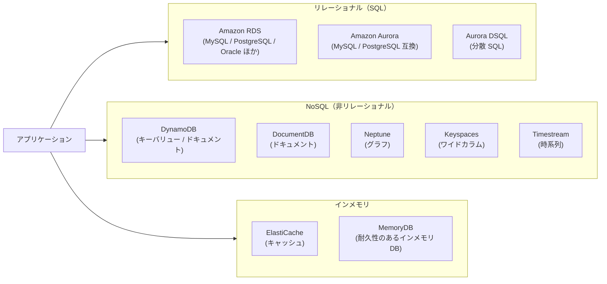

| 分類 | サービス | 一言でいうと |
|---|---|---|
| リレーショナル | Amazon RDS | おなじみの DB エンジンを、AWS がパッチ・バックアップ・フェイルオーバーまで面倒を見てくれるサービス |
| リレーショナル | Amazon Aurora | クラウド向けにストレージを作り直した、MySQL / PostgreSQL 互換の高性能 DB |
| リレーショナル | Amazon Aurora DSQL | サーバーレスの分散 SQL。複数リージョンで同時に読み書きできる |
| NoSQL | Amazon DynamoDB | サーバーレスのキーバリュー DB。どんな規模でも 1 桁ミリ秒 |
| インメモリ | Amazon ElastiCache | Valkey / Redis OSS / Memcached のマネージドキャッシュ |
| インメモリ | Amazon MemoryDB | データを失わない（耐久性のある）インメモリ DB |
| その他 | DocumentDB / Neptune / Keyspaces / Timestream | ドキュメント / グラフ / Cassandra 互換 / 時系列 |

分析用のデータウェアハウス（Amazon Redshift）は [データ分析サービス](14-analytics.md) で扱います。
データベースの基本（SQL、トランザクション、正規化など）に不安がある場合は、先に [セキュリティとデータベースの基礎](../01-foundations/03-security-database-basics.md) を復習してください。

## 1. データベース選定の考え方

### 1.1 5 つの観点

データベースを選ぶときは、「有名だから」「慣れているから」ではなく、次の 5 つの観点で要件を整理します。

| 観点 | 問うこと | 判断の例 |
|---|---|---|
| データモデル | データは表形式（リレーション）か。キーバリュー・ドキュメント・グラフ・時系列か | 受注と明細を JOIN する → リレーショナル / SNS の友達関係をたどる → グラフ |
| アクセスパターン | どのキーで、どのくらいの頻度で読み書きするか。自由な検索や集計が必要か | 「ユーザー ID で 1 件取得」がほぼすべて → キーバリュー |
| スケール | データ量・リクエスト数はどこまで伸びるか。読み取りと書き込みのどちらが多いか | 1 秒に数十万リクエスト → DynamoDB / 読み取りが多い → レプリカやキャッシュ |
| 整合性 | 強い整合性や ACID トランザクションが必須か。結果整合性で許容できるか | 口座残高の更新 → トランザクション必須 |
| 運用負荷 | パッチ適用・バックアップ・スケーリングを誰が担うか | 「運用上のオーバーヘッドを最小に」→ マネージド / サーバーレス |

これに加えて、**可用性と DR（RPO / RTO）** と **コスト** を確認します。
RPO（目標復旧時点）と RTO（目標復旧時間）の考え方は [高可用性と災害対策](15-high-availability-dr.md) で詳しく扱います。

### 1.2 リレーショナルと NoSQL

| 項目 | リレーショナル（RDS / Aurora） | NoSQL（DynamoDB など） |
|---|---|---|
| スキーマ | 事前に厳密に定義する | 柔軟（キー以外の属性は自由） |
| クエリ | SQL で自由に JOIN・集計できる | キーによるアクセスが中心。JOIN はない |
| スケールの方向 | 主に垂直（インスタンスを大きくする）。読み取りはレプリカで水平に増やす | 水平（パーティションを増やす）。事実上の上限がない |
| 整合性 | ACID トランザクションが基本 | 結果整合性が基本（強い整合性やトランザクションも選べる） |
| 向いている用途 | 業務システム、複雑な検索・集計、既存アプリの移行 | 大規模・低レイテンシーで、アクセスパターンが決まっている用途 |

> [!NOTE]
> NoSQL は「SQL が使えない劣ったデータベース」ではありません。
> 「アクセスパターンを事前に決める」代わりに、「どれだけ大きくなっても性能が落ちない」を手に入れる設計上のトレードオフです。

### 1.3 どこまで AWS に任せるか

| 作業 | EC2 に自分で DB をインストール | RDS / Aurora | DynamoDB |
|---|---|---|---|
| ハードウェア・OS の管理 | 利用者（OS のパッチも利用者） | AWS | AWS |
| DB エンジンのインストール・パッチ | 利用者 | AWS（メンテナンスウィンドウで適用） | 意識不要（サーバーレス） |
| バックアップ | 利用者がスクリプトを作る | 自動バックアップ（設定するだけ） | PITR・オンデマンドバックアップ（設定するだけ） |
| 高可用性 | 利用者が冗長構成を作る | マルチ AZ を選ぶだけ | 標準で 3 AZ に複製 |
| スケーリング | 利用者 | インスタンスサイズ変更・レプリカ追加 | 自動（オンデマンド）またはキャパシティ設定 |
| スキーマ・クエリ・インデックスの設計 | 利用者 | 利用者 | 利用者（キー設計） |

> [!TIP]
> **試験のポイント**: 「運用上のオーバーヘッドが最も少ない」とあれば、EC2 上の自前 DB より RDS / Aurora、さらに容量管理も不要にしたいならサーバーレス（DynamoDB、Aurora Serverless v2）を優先します。
> 逆に「OS にログインしてエージェントを入れたい」「RDS がサポートしない DB 機能が必要」とあれば、EC2 上の自前運用か RDS Custom が候補です。

## 2. Amazon RDS

### 2.1 RDS とは

Amazon Relational Database Service（Amazon RDS）は、リレーショナルデータベースのマネージドサービスです。
対応エンジンは **MySQL、PostgreSQL、MariaDB、Oracle、Microsoft SQL Server、IBM Db2** です。Aurora（MySQL / PostgreSQL 互換）も RDS ファミリーの一員として同じコンソール・API で管理します。

RDS を構成する主な要素は次のとおりです。

| 要素 | 内容 |
|---|---|
| DB インスタンス | DB エンジンが動くサーバー。インスタンスクラス（汎用の db.m 系、メモリ最適化の db.r 系、バースト可能な db.t 系など）でサイズを選ぶ |
| ストレージ | 汎用 SSD（gp3 / gp2）とプロビジョンド IOPS SSD（io2 Block Express / io1）。I/O が多い本番 DB はプロビジョンド IOPS を検討 |
| DB サブネットグループ | DB を配置できるサブネットの集合。2 つ以上の AZ のサブネットを含める |
| パラメーターグループ / オプショングループ | エンジンの設定値 / 追加機能（Oracle の TDE など） |
| セキュリティグループ | DB への通信を許可する送信元。通常は「アプリ層のセキュリティグループからのみ許可」にする |
| エンドポイント | 接続先の DNS 名（例: `mydb.xxxx.ap-northeast-1.rds.amazonaws.com`）。IP アドレスではなく DNS 名で接続する |

RDS では OS へのログイン（SSH）はできません。そのかわり、OS と DB エンジンのパッチ、バックアップ、障害時のフェイルオーバーを AWS が担います。
DB は **プライベートサブネット** に置き、「パブリックアクセス可能」は無効にするのが基本です（ネットワーク設計は [VPC とネットワーク設計](02-vpc.md) を参照）。

### 2.2 マルチ AZ 配置（Multi-AZ DB インスタンス配置）

**課題**: DB インスタンスが 1 台だけだと、その AZ で障害が起きたとき、またはハードウェアが故障したときにサービスが止まります。

**仕組み**: マルチ AZ 配置を有効にすると、RDS は別の AZ に **スタンバイ** インスタンスを作り、プライマリへの書き込みを **同期レプリケーション** で複製します。
同期なので、プライマリで確定（コミット）したデータはスタンバイにも書かれています。そのためフェイルオーバーしてもデータを失いません。

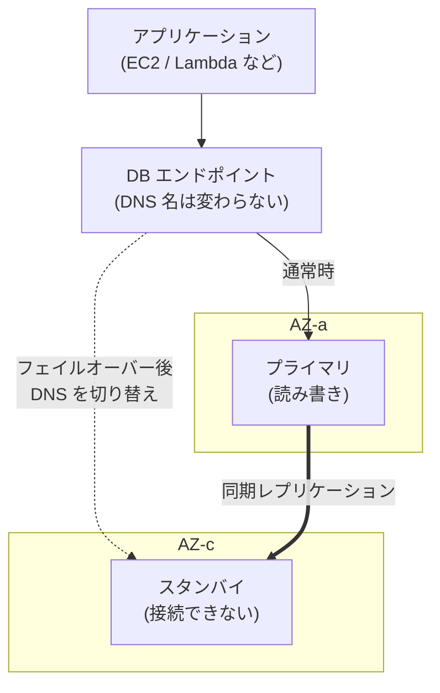

**フェイルオーバーの流れ**:

1. RDS がプライマリの異常を検知する（AZ の障害、ネットワーク断、ホストやストレージの障害など）
2. スタンバイを新しいプライマリに昇格させる
3. エンドポイントの DNS レコード（CNAME）を新しいプライマリに向け直す
4. アプリケーションは **同じエンドポイント名** に再接続するだけでよい

フェイルオーバーは通常 1〜2 分程度で完了します。アプリケーション側には、接続が切れたら再接続するリトライ処理と、DNS を長時間キャッシュしない設定（Java の DNS キャッシュ TTL など）が必要です。

マルチ AZ 配置には、障害対策以外にも次の利点があります。

- **メンテナンスの影響を減らせる**: OS のパッチなどは、先にスタンバイへ適用してからフェイルオーバーするため、停止時間を短くできる
- **バックアップの影響を減らせる**: MySQL・PostgreSQL などでは、自動バックアップをスタンバイから取得するため、プライマリの I/O が一時停止しない
- **シングル AZ からの変更が簡単**: 既存の DB インスタンスを「変更」するだけでマルチ AZ にでき、停止は不要（裏でスナップショットからスタンバイを作成する）

> [!WARNING]
> **ひっかけ注意**: マルチ AZ 配置（インスタンス）の **スタンバイは読み取りに使えません**。「スタンバイに読み取りクエリを振り分けて負荷を下げる」という選択肢は誤りです。
> 読み取りを分散したいなら、リードレプリカ、マルチ AZ DB クラスター、または Aurora を選びます。
> また、スタンバイはプライマリと同じリージョン内に作られます。リージョン障害への備えにはなりません。

### 2.3 マルチ AZ DB クラスター

マルチ AZ DB クラスターは、**1 台のライターと、読み取り可能な 2 台のリーダー** を 3 つの AZ に配置する構成です。
「高可用性」と「読み取りの分散」を 1 つの仕組みで実現します。

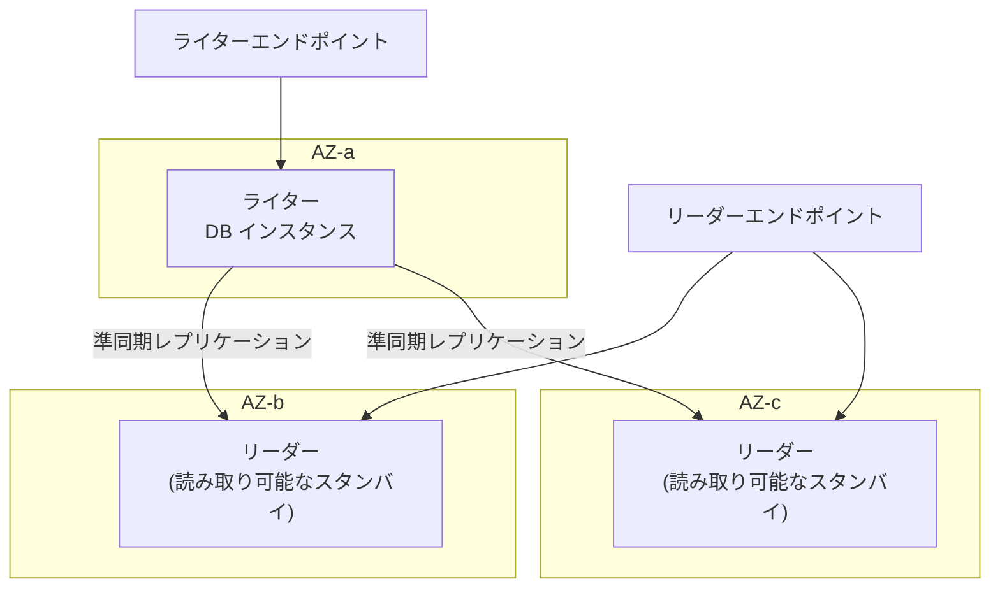

- **準同期レプリケーション**: ライターは、少なくとも 1 台のリーダーが変更を受け取ったことを確認してからコミットを完了する
- **読み取り可能なスタンバイ**: リーダーエンドポイント経由で、2 台のリーダーに読み取りを分散できる
- **高速なフェイルオーバー**: AWS は、フェイルオーバーは通常 35 秒未満で完了するとしている
- **対応エンジン**: RDS for MySQL と RDS for PostgreSQL のみ。使えるインスタンスクラスにも制限がある

### 2.4 リードレプリカ

**課題**: Web アプリケーションでは、読み取りが書き込みの何倍も発生するのが普通です。レポート作成のような重い読み取りクエリが、本番の書き込み性能を圧迫することもあります。

**仕組み**: リードレプリカは、ソース DB インスタンスの変更を **非同期レプリケーション** で受け取る、読み取り専用のコピーです。

- 非同期なので、レプリカのデータはソースより少し遅れることがある（**レプリカラグ**）。つまり結果整合性になる
- 各レプリカに固有のエンドポイントがある。どのクエリをどのレプリカに送るかは、アプリケーション側で振り分ける
- MySQL・MariaDB・PostgreSQL では、1 つのソースから最大 15 台のレプリカを作成できる（2026年9月時点。上限はエンジンによって異なる）
- **別リージョン（クロスリージョン）** にも作成できる。海外ユーザーの読み取りを速くしたり、DR に使ったりできる
- レプリカを **昇格（promote）** すると、独立した読み書き可能な DB インスタンスになる。レプリケーションは切れるため元には戻らない
- レプリカ自体をマルチ AZ 配置にすることもできる（DR 先の可用性を上げたい場合）
- 作成するには、ソースで自動バックアップが有効である必要がある
- 同一リージョン内のレプリケーションのデータ転送は無料。クロスリージョンではリージョン間のデータ転送料金がかかる

3 つの構成を比べると、次のようになります。

| 項目 | マルチ AZ 配置（インスタンス） | マルチ AZ DB クラスター | リードレプリカ |
|---|---|---|---|
| 主な目的 | 高可用性（AZ 障害への備え） | 高可用性 ＋ 読み取りの分散 | 読み取りのスケールアウト（DR にも使える） |
| 構成 | プライマリ ＋ スタンバイ 1 台 | ライター 1 台 ＋ リーダー 2 台（3 AZ） | ソース ＋ レプリカ（最大 15 台※） |
| レプリケーション | 同期 | 準同期 | 非同期 |
| スタンバイ / レプリカで読み取り | できない | できる（リーダーエンドポイント） | できる（レプリカごとのエンドポイント） |
| 配置先 | 同じリージョンの別 AZ | 同じリージョンの 3 AZ | 同じ AZ・別 AZ・別リージョン |
| フェイルオーバー | 自動（通常 1〜2 分程度） | 自動（通常 35 秒未満） | 自動ではない（手動で昇格） |
| 対応エンジン | すべて | MySQL / PostgreSQL | 主要エンジン（台数の上限や制約はエンジンごとに異なる） |

※ MySQL / MariaDB / PostgreSQL の場合（2026年9月時点）

> [!TIP]
> **試験のポイント**:
> - 「AZ 障害でも自動的にフェイルオーバー」「データを失わない」→ **マルチ AZ 配置**
> - 「読み取りが多く DB の CPU が高い」「レポート処理を本番から切り離したい」→ **リードレプリカ**（キャッシュが適切な場合は ElastiCache も候補）
> - 「高可用性とスタンバイでの読み取りを両立」「フェイルオーバーをより速く」→ **マルチ AZ DB クラスター** または **Aurora**
> - 「リージョン障害に備えて別リージョンにデータを持つ」→ **クロスリージョンリードレプリカ**（Aurora なら Global Database）

> [!WARNING]
> **ひっかけ注意**: リードレプリカは「高可用性の仕組み」ではありません。非同期のため昇格時に直前の更新を失う可能性があり、RDS がソースの障害時に自動で昇格させることもありません。
> 「自動フェイルオーバー」が要件なら、マルチ AZ 配置（または Aurora）を選びます。

### 2.5 バックアップと復元

RDS のバックアップには、**自動バックアップ** と **手動スナップショット** の 2 種類があります。

| 項目 | 自動バックアップ | 手動スナップショット |
|---|---|---|
| 取得のタイミング | 毎日のバックアップウィンドウでスナップショット ＋ トランザクションログを継続的に保存 | 利用者が任意のタイミングで取得 |
| 保持期間 | 0〜35 日（0 にすると無効） | 削除するまで保持 |
| ポイントインタイムリカバリ（PITR） | 保持期間内の任意の時点（秒単位）に復元できる。通常は直近 5 分前までが対象 | できない（取得した時点のみ） |
| DB を削除したとき | 原則として削除される（保持を選ぶこともできる） | 残る |
| 主な用途 | 日々の運用、誤操作からの復旧 | リリース前の退避、長期保管、別リージョン・別アカウントへのコピー |

**PITR の仕組み**: 日次のスナップショットに、保存しておいたトランザクションログを順に適用（ロールフォワード）して、指定した時刻の状態を作ります。

> [!IMPORTANT]
> RDS の復元（スナップショットからの復元・PITR）は、**必ず新しい DB インスタンスとして作成されます**。既存のインスタンスが上書きされるわけではありません。
> エンドポイントも新しくなるため、アプリケーションの接続先を切り替える必要があります。

35 日を超えてバックアップを保持したい場合や、複数アカウント・複数リージョンのバックアップを一元管理したい場合は **AWS Backup** を使います（詳しくは [高可用性と災害対策](15-high-availability-dr.md)）。
スナップショットは別リージョンへのコピーや、別の AWS アカウントとの共有もできます。

> [!TIP]
> **試験のポイント**: 開発環境の RDS を夜間や週末に止めてコストを下げたい場合、DB インスタンスは **停止** できます。ただし停止できるのは **最大 7 日間** で、7 日経つと自動的に起動します。
> 長期間使わない DB は、スナップショットを取得してから削除するほうが安くなります。停止中もストレージとバックアップの料金はかかります。

### 2.6 暗号化

**保管時の暗号化**: RDS は AWS KMS のキーでストレージを暗号化します。暗号化を有効にすると、次のものがすべて暗号化されます。

- DB インスタンスのストレージ
- 自動バックアップとスナップショット
- リードレプリカ
- ログ

ここで、試験に直結するルールが 3 つあります。

1. 暗号化は **DB インスタンスの作成時にしか有効にできない**。既存の暗号化されていないインスタンスを「変更」して暗号化することはできない
2. 暗号化されていないインスタンスから、暗号化されたリードレプリカは作れない
3. 一度暗号化したインスタンスの暗号化を、後から無効にすることはできない

既存の暗号化されていない DB を暗号化するには、**スナップショットを暗号化してコピー** します。

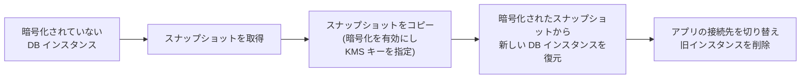

スナップショットを取得してから切り替えるまでの間に書き込まれたデータを失わないよう、メンテナンス時間を設けて書き込みを止めるか、AWS Database Migration Service（AWS DMS）で差分を同期してから切り替えます。

**KMS キーの選び方**:

- **AWS マネージドキー（aws/rds）**: 手軽に使えるが、キーポリシーを変更できない。このキーで暗号化したスナップショットは、他のアカウントと共有できない
- **カスタマーマネージドキー**: キーポリシーで利用者を制御できる。スナップショットを別アカウントと共有するときは、このキーを使い、相手のアカウントにキーの利用を許可する
- KMS キーはリージョンごとのリソースです。暗号化されたスナップショットを別リージョンにコピーするときや、クロスリージョンリードレプリカを作るときは、**コピー先リージョンの KMS キー** を指定します

**転送中の暗号化**: SSL/TLS で接続します。すべての接続に TLS を強制したい場合は、パラメーターグループで設定します（PostgreSQL / SQL Server は `rds.force_ssl`、MySQL / MariaDB は `require_secure_transport`）。
Oracle と SQL Server では、エンジン自体の透過的データ暗号化（TDE）もオプションで使えます。

> [!WARNING]
> **ひっかけ注意**: 「既存の暗号化されていない RDS を暗号化したい」という問題で、「DB インスタンスを変更して暗号化を有効にする」「暗号化されたリードレプリカを作成して昇格する」は、どちらも **実行できない操作** です。
> 正解は「スナップショットを取得 → 暗号化を有効にしてコピー → 復元」です。EC2 の「EBS のデフォルト暗号化」を有効にしても、既存の RDS は暗号化されません。

### 2.7 認証と接続の管理（IAM DB 認証・Secrets Manager・RDS Proxy）

#### パスワードを持ち歩かない: IAM データベース認証

IAM データベース認証を使うと、DB のパスワードの代わりに、IAM の認証情報から生成する **認証トークン** で接続できます。

- 対応エンジンは MySQL、MariaDB、PostgreSQL（Aurora MySQL / Aurora PostgreSQL を含む）
- トークンは AWS CLI（`aws rds generate-db-auth-token`）や SDK で生成する。有効期限は **15 分**
- 接続を許可するかどうかは、IAM ポリシーの `rds-db:connect` アクションで制御する
- 接続は SSL/TLS で暗号化される
- EC2 や Lambda では、IAM ロールの一時的な認証情報からトークンを作れる。アプリケーションに長期のパスワードを埋め込まずに済む

#### パスワードを自動で入れ替える: AWS Secrets Manager

パスワード認証を使う場合は、認証情報を AWS Secrets Manager に保存し、自動ローテーションを設定します。
RDS には、マスターユーザーのパスワードを Secrets Manager で管理させる機能もあります。アプリケーションは実行時に Secrets Manager から認証情報を取得します（詳しくは [セキュリティサービス](12-security-services.md)）。

#### 接続の急増から DB を守る: RDS Proxy

**課題**: Lambda 関数は、リクエストが増えると同時実行数が一気に増えます。実行環境ごとに DB 接続を作ると、DB の最大接続数を使い切って「too many connections」エラーが起きます。DB 接続の確立は、CPU とメモリを消費する重い処理でもあります。

**仕組み**: Amazon RDS Proxy は、アプリケーションと DB の間に置くフルマネージドのデータベースプロキシです。

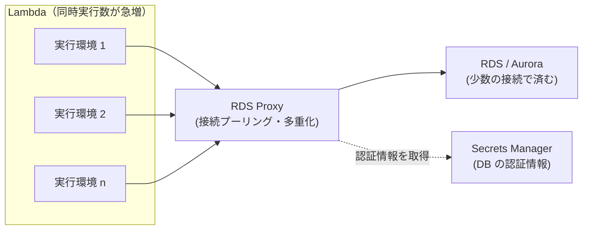

- **接続プーリングと多重化**: 多数のクライアント接続を、少数の DB 接続にまとめて使い回す
- **フェイルオーバーの高速化**: プロキシがクライアントとの接続を保ったまま、新しいプライマリへ接続し直す。DNS の切り替えを待たないため、AWS はフェイルオーバー時間を最大 66% 短縮できるとしている
- **認証の強化**: DB の認証情報は Secrets Manager に置き、クライアントからプロキシへの接続には IAM 認証を強制できる
- **VPC 内からのみ利用できる**: インターネットには公開されない
- 対応エンジンは RDS（MySQL / PostgreSQL / MariaDB / SQL Server）と Aurora（MySQL / PostgreSQL）です。バージョンごとの対応状況はドキュメントで確認してください

> [!TIP]
> **試験のポイント**: 「Lambda から RDS に接続しており、トラフィックの急増時に接続数の上限に達する」「フェイルオーバー時間を短くしたい（アプリケーションの変更は最小限）」→ **RDS Proxy**。
> インスタンスを大きくして最大接続数を増やす方法は、コストがかかるうえに根本的な解決になりません。

### 2.8 ストレージの自動スケーリング

ストレージの自動スケーリングを有効にすると、RDS は空き容量が少なくなったときに、停止せずにストレージを自動で拡張します。
次の条件をすべて満たすと拡張されます。

- 空き容量が、割り当て済みストレージの 10% 未満になった
- その状態が 5 分以上続いた
- 前回のストレージ変更から 6 時間以上経過している

拡張の上限として **最大ストレージしきい値** を設定し、費用が際限なく増えないようにします。
なお、RDS では割り当てたストレージを後から **縮小できません**。小さくしたい場合は、新しい DB インスタンスへデータを移します。

> [!TIP]
> **試験のポイント**: 「DB の容量の増え方が予測できない。容量不足による停止を避けたいが、運用の手間は最小にしたい」→ **ストレージの自動スケーリング**。Aurora なら、ストレージは最初から自動で拡張されます。

### 2.9 Blue/Green デプロイ

**課題**: メジャーバージョンアップグレードやスキーマ変更を本番 DB に直接適用すると、失敗したときの影響が大きく、停止時間も長くなりがちです。

**仕組み**: Amazon RDS Blue/Green Deployments は、本番環境（ブルー）を複製したステージング環境（グリーン）を作り、レプリケーションで同期し続けます。

1. グリーン環境を作成する。ブルーの変更は、論理レプリケーションでグリーンに反映され続ける
2. グリーン側で、メジャーバージョンアップグレード、パラメーター変更、インスタンスクラスの変更などを行う
3. グリーン側で十分にテストする（グリーンは既定で読み取り専用）
4. **スイッチオーバー** を実行する。レプリケーションの状態などのガードレールを確認してから切り替え、エンドポイント名もグリーン側に引き継がれる

AWS は、スイッチオーバーは通常 1 分未満で完了し、データ損失はなく、アプリケーションの接続先の変更も不要としています。
対応エンジンは RDS for MySQL / MariaDB / PostgreSQL と、Aurora MySQL / Aurora PostgreSQL です（2026年9月時点）。

> [!TIP]
> **試験のポイント**: 「DB のメジャーバージョンアップグレードを、事前に本番同等の環境でテストし、停止時間を最小にして実施したい」→ **Blue/Green デプロイ**。

### 2.10 RDS Custom

Amazon RDS Custom は、**Oracle と SQL Server** 向けに、マネージドの利便性を保ちながら **OS と DB への管理者アクセス** を許可する形態です。

- 通常の RDS ではできない、OS へのログイン（SSH / RDP、Session Manager）、サードパーティのエージェントの導入、特殊なパッチの適用、DB の特権ユーザーでのカスタマイズができる
- 自動バックアップや監視などの自動化は RDS が提供する。カスタマイズ作業の間は、自動化を一時停止できる
- そのかわり、責任共有モデルで利用者が担う範囲が広がる。設定が「サポート範囲（サポートペリメーター）」から外れると、RDS の自動化が正しく動かなくなる

| 項目 | EC2 に自分でインストール | RDS Custom | RDS |
|---|---|---|---|
| OS・DB への管理者アクセス | できる | できる | できない |
| 自動バックアップ・監視 | 自分で構築 | RDS が提供 | RDS が提供 |
| 対応エンジン | 何でも | Oracle / SQL Server | 6 エンジン ＋ Aurora |
| 運用負荷 | 大 | 中 | 小 |

> [!TIP]
> **試験のポイント**: 「既存の業務アプリケーションが、Oracle の OS レベルのカスタマイズを必要とする。それでも運用負荷はできるだけ下げたい」→ **RDS Custom**。

### 2.11 監視・メンテナンス・コストのポイント

| 目的 | 使う機能 |
|---|---|
| CPU・空きストレージ・接続数・レプリカラグなどを監視したい | CloudWatch メトリクス（CPUUtilization、FreeStorageSpace、DatabaseConnections、ReplicaLag など） |
| OS のプロセスごとの CPU・メモリ使用量を細かく見たい | 拡張モニタリング（インスタンス上のエージェントが OS のメトリクスを最短 1 秒間隔で収集） |
| どの SQL が負荷の原因かを分析したい | Performance Insights / CloudWatch Database Insights（DB 負荷・待機イベント・負荷の高い SQL を分析） |
| フェイルオーバーやバックアップなどのイベントを通知したい | RDS イベント通知（Amazon SNS と連携） |
| DB のログを保存・検索したい | ログを CloudWatch Logs にエクスポート |

- **メンテナンス**: マイナーバージョンの自動アップグレードやパッチは、指定したメンテナンスウィンドウで適用されます。メジャーバージョンアップグレードは、利用者が計画して実施します。
- **RDS 延長サポート**: メジャーバージョンの標準サポートが終わった後も古いバージョンを使い続けると、有料の延長サポートの料金が自動的にかかります。アップグレードは計画的に行いましょう。
- **コスト**: 常時稼働する本番 DB は、リザーブドインスタンスや Database Savings Plans で割引を受けられます（「7.3 コストの最適化」を参照）。

監視サービス全般は [監視と運用管理](13-monitoring-management.md) で扱います。

## 3. Amazon Aurora

### 3.1 アーキテクチャ: コンピューティングとストレージの分離

Amazon Aurora は、MySQL / PostgreSQL との互換性を保ちながら、ストレージ層をクラウド向けに作り直したリレーショナルデータベースです。
AWS は、標準的な MySQL の最大 5 倍、PostgreSQL の最大 3 倍のスループットとしています。

従来の RDS では、DB インスタンスごとに専用のストレージ（EBS）を持ち、スタンバイやレプリカとの間でデータを複製していました。
Aurora では、**DB インスタンス（コンピューティング）と、クラスターボリューム（ストレージ）が分離** されています。

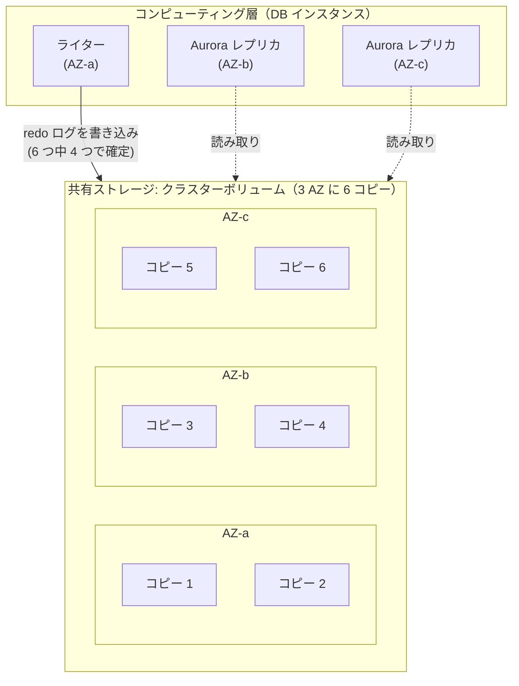

- **クラスターボリューム**: 1 つの論理ボリュームを、ライターとすべての Aurora レプリカが共有する
- **3 AZ に 6 コピー**: データは 10 GB 単位のセグメントに分割され、各セグメントが 3 つの AZ に 2 つずつ、合計 6 コピー保存される
- **クォーラム**: 書き込みは 6 コピー中 4 コピー、読み取りは 6 コピー中 3 コピーの応答で成立する。つまり、2 コピーを失っても書き込みを続けられ、3 コピーを失っても読み取りを続けられる（AZ 1 つ分の障害に加えて、さらに 1 コピーが壊れても読み取りは止まらない）
- **自己修復**: 壊れたセグメントは、ほかのコピーから自動的に修復される
- **自動拡張**: ストレージは使った分だけ自動で拡張される（最大 256 TiB。2026年9月時点で、エンジンのバージョンによって異なる）。事前に容量を割り当てる必要はない
- **ログだけを送る**: DB インスタンスはデータページ全体ではなく、変更ログ（redo ログ）だけをストレージに送る。ネットワーク I/O が少ないため速い
- **継続的なバックアップ**: バックアップは Amazon S3 へ継続的に取得される。保持期間は 1〜35 日で、Aurora では自動バックアップを無効にできない

レプリカもライターと同じボリュームを読むため、データをコピーする必要がありません。そのため、レプリカラグは通常 100 ミリ秒未満と小さく抑えられます。

> [!NOTE]
> 古い教材では、Aurora の最大ストレージを 64 TiB や 128 TiB と書いていることがあります。上限は段階的に引き上げられてきました。
> 試験で具体的な上限値が問われることはまれですが、「ストレージは自動で拡張され、事前の割り当てが不要」という性質は必ず押さえてください。

### 3.2 エンドポイントの種類

Aurora では、用途ごとに **エンドポイント（DNS 名）** を使い分けます。

| エンドポイント | 接続先 | 使いどころ |
|---|---|---|
| クラスターエンドポイント（ライターエンドポイント） | 現在のライター。フェイルオーバー後も自動で追従する | 書き込み、および書き込み直後の読み取り |
| リーダーエンドポイント | Aurora レプリカ群に接続単位で分散する（レプリカがなければライターに接続） | 読み取り専用の処理 |
| カスタムエンドポイント | 利用者が選んだインスタンスのグループ（クラスターあたり最大 5 個） | 分析用の大きなレプリカだけに集計クエリを流す、など |
| インスタンスエンドポイント | 特定の 1 台のインスタンス | 診断やチューニング。通常のアプリケーションでは使わない |

> [!TIP]
> **試験のポイント**: 「BI ツールの重い集計クエリを、Web アプリケーション用のレプリカと分けて、大きめの 2 台のレプリカだけで処理したい」→ **カスタムエンドポイント**。
> リーダーエンドポイントはすべてのレプリカに振り分けるため、この要件を満たせません。

> [!WARNING]
> **ひっかけ注意**: リーダーエンドポイントによる分散は、DNS を使った **接続単位** の分散です。クエリ単位で均等に振り分けるロードバランサーではありません。
> コネクションプールで同じ接続を長時間使い続けると、特定のレプリカに負荷が偏ることがあります。

### 3.3 フェイルオーバーと優先度ティア

ライターに障害が起きると、Aurora は次のように動きます。

- **Aurora レプリカがある場合**: レプリカの 1 台を新しいライターに昇格させ、クラスターエンドポイントの向き先を切り替える。AWS は、開始から完了まで通常 30 秒以内としている
- **レプリカがない場合**: 新しいライターインスタンスの作成を試みる。レプリカの昇格よりはるかに時間がかかる

どのレプリカを昇格させるかは、**フェイルオーバー優先度ティア（tier-0〜tier-15）** で決まります。

1. 数字が **小さい** ティアのレプリカが優先される（tier-0 が最優先）
2. 同じティアに複数ある場合は、**サイズが大きい** レプリカが優先される
3. サイズも同じ場合は、そのうちの任意の 1 台が選ばれる

> [!TIP]
> **試験のポイント**: 「障害時に、ライターと同じサイズのレプリカへ確実にフェイルオーバーさせたい」→ そのレプリカを **tier-0** にします。分析専用の小さなレプリカは、優先度を低く（数字を大きく）しておきます。
> 可用性を高めるには、ライターとは **別の AZ** に少なくとも 1 台のレプリカを置きます。Aurora レプリカは最大 15 台まで作成できます。

### 3.4 Aurora Serverless v2

Aurora Serverless v2 は、負荷に応じて DB インスタンスの処理能力を自動で増減させる構成です。

- 容量の単位は **ACU（Aurora Capacity Unit）**。1 ACU は約 2 GiB のメモリと、それに見合う CPU・ネットワーク性能に相当する
- 最小 ACU と最大 ACU を指定すると、その範囲で 0.5 ACU 刻みで細かく、素早くスケールする
- 指定できる範囲は **0〜256 ACU**（2026年9月時点）。最小を **0** にすると、指定した時間（5 分〜24 時間）接続がなければ **自動的に一時停止** し、その間はコンピューティングの料金がかからない（ストレージの料金はかかる）。再開には最大 15 秒ほどかかる
- 同じクラスターの中で、プロビジョニングされたインスタンスと Serverless v2 のインスタンスを混在できる（例: ライターはプロビジョニング、読み取り用のレプリカは Serverless v2）
- マルチ AZ、Aurora レプリカ、Global Database、RDS Proxy など、Aurora の主な機能をそのまま使える

**向いている用途**: 負荷の予測が難しい、または変動が大きいアプリケーション。開発・テスト環境。多数のテナントの DB を持つ SaaS。負荷を見積もれない新規サービス。

> [!TIP]
> **試験のポイント**: 「利用状況が予測できない」「夜間や週末はほとんど使われない」「容量管理の手間をなくしたい」リレーショナル DB → **Aurora Serverless v2**。

> [!NOTE]
> 旧世代の Aurora Serverless v1 はサポートが終了しています。古い問題で単に「Aurora Serverless」とあれば、「負荷に応じて容量が自動で増減する Aurora」と読み替えてください。
> なお、常に高負荷で安定しているワークロードでは、プロビジョニングされたインスタンス（＋リザーブドインスタンスなどの割引）のほうが安くなることがあります。

### 3.5 Aurora Global Database

Aurora Global Database は、1 つの Aurora データベースを複数のリージョンにまたがって構成する機能です。

- **プライマリリージョン 1 つ（読み書き）＋ セカンダリリージョン最大 10 個（読み取り専用）**。2025年5月に 5 から 10 に拡張された（古い教材では 5 と書かれている）
- レプリケーションは、DB エンジンではなく **ストレージ層** で行う。専用の仕組みのため、プライマリの性能への影響が小さい
- リージョン間のレプリケーション遅延は、通常 **1 秒未満**
- セカンダリリージョンでは、その地域のユーザーに低レイテンシーな読み取りを提供できる
- **書き込み転送（write forwarding）** を有効にすると、セカンダリリージョンのアプリケーションが送った書き込みをプライマリへ転送できる

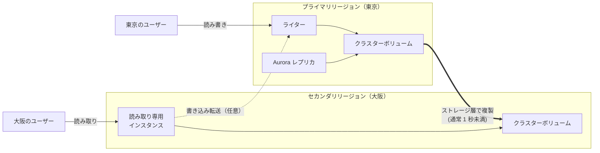

リージョンを切り替える操作は 2 種類あります。

| 操作 | 使う場面 | データ損失（RPO） |
|---|---|---|
| **スイッチオーバー**（計画的な切り替え。旧称: managed planned failover） | 定期的なリージョン切り替えの訓練、計画メンテナンス、運用拠点の移動 | なし（レプリケーションを同期させてから切り替える） |
| **フェイルオーバー**（計画外の切り替え） | プライマリリージョンの障害からの復旧 | レプリケーション遅延の分（通常は数秒以内）を失う可能性がある |

フェイルオーバー後、元のプライマリリージョンが復旧したら、セカンダリとしてグローバルデータベースに戻せます。

> [!TIP]
> **試験のポイント**: 「リージョン全体の障害に備えたい。RPO は秒単位、RTO は分単位」「世界中のユーザーに低レイテンシーの読み取りを提供したい」リレーショナル DB → **Aurora Global Database**。
> RDS のクロスリージョンリードレプリカでも DR はできますが、Global Database のほうがレプリケーション遅延が小さく、切り替えの仕組みも整っています。

> [!WARNING]
> **ひっかけ注意**: Aurora Global Database で書き込めるのは、プライマリリージョンの 1 つだけです（書き込み転送を使っても、実際の書き込みはプライマリで行われます）。
> 「複数のリージョンで同時に書き込みたい（アクティブ-アクティブ）」が要件なら、DynamoDB グローバルテーブルや Aurora DSQL を検討します。

### 3.6 バックトラック・クローン・I/O-Optimized

#### バックトラック（Aurora MySQL のみ）

バックトラックは、DB クラスターを **過去の時点へ「巻き戻す」** 機能です。

- 最大 **72 時間** 前まで巻き戻せる
- バックアップからの復元と違い、**新しいクラスターを作らず、既存のクラスターをその場で** 巻き戻す。通常は数分で終わる
- クラスターの作成時（またはクローン・復元の時）に有効にしておく必要がある
- 対象は Aurora MySQL のみ。バックアップの代わりにはならない

| 比較 | バックトラック | PITR（ポイントインタイムリカバリ） |
|---|---|---|
| 結果 | 既存のクラスターを巻き戻す | 新しいクラスターを作成する |
| 所要時間 | 短い（数分） | 長い（データ量による） |
| 戻せる範囲 | 最大 72 時間 | バックアップの保持期間内（最大 35 日） |
| 対応 | Aurora MySQL | Aurora 全般 |

> [!TIP]
> **試験のポイント**: 「誤って `DELETE` 文を実行した。新しい DB を作らずに、できるだけ速く数時間前の状態へ戻したい（Aurora MySQL）」→ **バックトラック**。

#### クローン

Aurora のクローンは、**コピーオンライト（copy-on-write）** 方式で、DB クラスターの複製を素早く作る機能です。
作成直後は元のクラスターとデータを共有し、どちらかでデータが変更されたときだけ、そのページを別に保存します。そのため、大きな DB でも短時間で作成でき、作成直後は追加のストレージ料金もほとんどかかりません。

本番データを使ったテスト、分析用の一時的なコピー、リリース前の検証に向いています。スナップショットから復元するより速く、手軽です。

#### Aurora Standard と Aurora I/O-Optimized

Aurora には、ストレージ I/O の課金方法が異なる 2 つのクラスター構成があります。

| 構成 | 料金の特徴 | 向いているワークロード |
|---|---|---|
| Aurora Standard | ストレージ容量 ＋ **I/O リクエストごとの料金** | I/O が少ない〜中程度 |
| Aurora I/O-Optimized | **I/O 料金なし**（インスタンスとストレージの単価は高め） | I/O が多い。AWS は、I/O 料金が Aurora 全体の支出の 25% を超える場合に検討するよう案内している |

Standard から I/O-Optimized への切り替えは 30 日に 1 回までで、I/O-Optimized から Standard へはいつでも戻せます。
I/O-Optimized は、I/O 量の変動で請求額がぶれる問題も解消します。

#### そのほかの機能（名前と用途を押さえる）

- **Aurora PostgreSQL Limitless Database**: 書き込みを複数のシャードに水平分散させる。シャーディングをマネージドで提供する機能
- **Babelfish for Aurora PostgreSQL**: SQL Server 向けのアプリケーション（T-SQL）を、少ない変更で Aurora PostgreSQL に接続できるようにする
- **ゼロ ETL 統合**: Aurora のデータを Amazon Redshift へほぼリアルタイムに連携し、ETL パイプラインを作らずに分析できる（[データ分析サービス](14-analytics.md)）

### 3.7 Amazon Aurora DSQL（紹介）

Amazon Aurora DSQL は、2025年5月に一般提供（GA）が始まった **サーバーレスの分散 SQL データベース**（PostgreSQL 互換）です。

- インスタンスやストレージの管理が不要で、負荷に応じて自動でスケールする
- **マルチリージョンのアクティブ-アクティブ構成**: 複数のリージョンで同時に読み書きでき、しかも **強い整合性** を保つ
- 可用性の設計目標は、シングルリージョン構成で 99.99%、マルチリージョン構成で 99.999%（2026年9月時点）
- 楽観的同時実行制御（OCC）を採用しているため、競合したトランザクションはコミット時に失敗することがある。アプリケーション側でリトライを実装する
- PostgreSQL のすべての機能が使えるわけではない。未対応の機能は公式ドキュメントで確認する

| 要件 | 候補 |
|---|---|
| 書き込みは 1 リージョン。他のリージョンは読み取りと DR 用 | Aurora Global Database |
| 複数リージョンで同時に書き込み。リレーショナル（SQL）で強い整合性 | Aurora DSQL |
| 複数リージョンで同時に書き込み。キーバリューで大規模 | DynamoDB グローバルテーブル |

> [!NOTE]
> Aurora DSQL は新しいサービスのため、SAA-C03 の問題に登場する可能性は高くありません。
> SAP-C03 のマルチリージョン設計では選択肢の 1 つになるので、名前と特徴を知っておきましょう（[回復力と事業継続](../03-professional/06-resilience-business-continuity.md)）。

## 4. Amazon DynamoDB

### 4.1 特徴

Amazon DynamoDB は、フルマネージドでサーバーレスの **キーバリュー / ドキュメント型 NoSQL データベース** です。

- サーバーの管理、パッチ適用、事前の容量確保が不要
- どんな規模でも、1 桁ミリ秒のレイテンシーで応答する
- データは自動的に 3 つの AZ に複製される
- テーブル → アイテム（項目）→ 属性 という構造で、キー以外の属性はアイテムごとに自由に持てる
- 保管時の暗号化は常に有効（既定は AWS 所有キー。AWS マネージドキーやカスタマーマネージドキーも選べる）
- VPC 内からは、ゲートウェイ型の VPC エンドポイントを使ってインターネットを経由せずにアクセスできる（[VPC とネットワーク設計](02-vpc.md)）

### 4.2 キー設計とパーティション

DynamoDB のテーブルには、必ず **プライマリキー** があります。プライマリキーは 2 種類です。

| 種類 | 構成 | 例 |
|---|---|---|
| シンプルプライマリキー | パーティションキーのみ | `user_id` |
| 複合プライマリキー | パーティションキー ＋ ソートキー | `customer_id` ＋ `order_date` |

DynamoDB は、パーティションキーの値を **ハッシュ関数** にかけて、データを保存する物理的な **パーティション** を決めます。

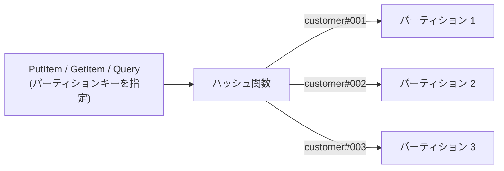

- **Query**: パーティションキーを指定し、ソートキーの条件（範囲・前方一致など）で絞り込む。必要なアイテムだけを読むので効率的
- **Scan**: テーブル全体を読む。大きなテーブルでは時間もキャパシティも大量に消費するため、日常的な処理には使わない

たとえば注文テーブルを「パーティションキー = `customer_id`、ソートキー = `order_date`」で設計すると、「顧客 X の直近 1 か月の注文」を 1 回の Query で取得できます。
DynamoDB では、**先にアクセスパターンを洗い出し、それに合わせてキーを設計する** のが鉄則です。

#### ホットパーティションを避ける

1 つのパーティションが処理できる量には上限があります（**1 パーティションあたり 3,000 RCU / 1,000 WCU、10 GB**）。
アクセスが一部のパーティションキーの値に集中すると、テーブル全体のキャパシティには余裕があっても、そのパーティションだけがスロットリング（`ProvisionedThroughputExceededException`）を起こします。これを **ホットパーティション** と呼びます。

| 悪いキーの例 | 良いキーの例 / 対策 |
|---|---|
| 値の種類が少ない属性（ステータス、性別など） | 値の種類が多い（カーディナリティの高い）属性（ユーザー ID、デバイス ID、注文 ID） |
| 「今日の日付」を書き込みのパーティションキーにする | **書き込みシャーディング**: キーの末尾に乱数や計算値（例: `2026-09-28#7`）を付けて分散させ、読むときは複数のキーをまとめて読む |
| 人気商品など、特定のアイテムに読み取りが集中する | DAX や ElastiCache でキャッシュする |

DynamoDB には、偏ったアクセスをある程度自動で吸収する **アダプティブキャパシティ** の仕組みもありますが、キー設計の代わりにはなりません。

> [!TIP]
> **試験のポイント**: 「DynamoDB でスロットリングが発生しているが、テーブル全体のキャパシティは余っている」→ **ホットパーティション** を疑い、カーディナリティの高いパーティションキーへの変更や書き込みシャーディングを選びます。

### 4.3 読み取りの整合性

| 種類 | 内容 | コスト |
|---|---|---|
| 結果整合性のある読み込み（既定） | 直前の書き込みが反映されていない場合がある（通常はすぐに反映される） | 最も安い |
| 強い整合性のある読み込み | 成功したすべての書き込みを反映した最新のデータを返す | 結果整合性の 2 倍 |
| トランザクション読み込み | 複数アイテムを ACID で一貫して読む | 強い整合性の 2 倍 |

強い整合性のある読み込みは、GSI では使えません。

### 4.4 キャパシティモード

| 項目 | オンデマンド | プロビジョンド |
|---|---|---|
| 課金 | 実際の読み込み・書き込みのリクエスト数に応じた従量課金 | 設定した RCU / WCU に対する時間課金 |
| 容量の計画 | 不要。直前のピークの 2 倍までのトラフィックには即座に対応する | 必要。Auto Scaling で目標使用率に合わせて自動調整できる |
| 向いている用途 | 新規サービス、予測できないトラフィック、急なスパイク、使われない時間が長い | 予測可能で安定したトラフィック（リザーブドキャパシティでさらに割安にできる） |
| スロットリング | 直前のピークの 2 倍を超える急増で起きることがある | 設定値を超えると起きる（未使用分を短時間ためておくバーストキャパシティで一時的には吸収） |

キャパシティモードは後から切り替えられます（切り替え回数には制限があります）。

> [!TIP]
> **試験のポイント**: 「トラフィックが予測できない」「容量管理の運用をなくしたい」→ **オンデマンド**。「トラフィックが安定していて予測できる」「コストを最小にしたい」→ **プロビジョンド ＋ Auto Scaling**（長期ならリザーブドキャパシティ）。

### 4.5 RCU / WCU の計算

プロビジョンドモードでは、必要な読み込み・書き込みの能力を **RCU（読み込みキャパシティユニット）** と **WCU（書き込みキャパシティユニット）** で指定します。

| 単位 | 定義 |
|---|---|
| 1 RCU | 最大 4 KB のアイテムを、1 秒に 1 回「強い整合性」で読める。結果整合性なら 1 秒に 2 回 |
| 1 WCU | 最大 1 KB のアイテムを、1 秒に 1 回書ける |
| トランザクション | 読み込み・書き込みとも、通常の 2 倍のユニットを消費する |

**計算の手順**:

1. アイテムサイズを、読み込みは **4 KB 単位**、書き込みは **1 KB 単位** に **切り上げる**
2. 「1 回あたりのユニット数 × 1 秒あたりの回数」を計算する
3. 結果整合性なら **÷ 2**、トランザクションなら **× 2** する

| # | 要件 | 計算 | 答え |
|---|---|---|---|
| 1 | 6 KB のアイテムを、強い整合性で毎秒 10 回読む | 6 KB → 8 KB（4 KB × 2）→ 2 × 10 | **20 RCU** |
| 2 | 例 1 を結果整合性で読む | 20 ÷ 2 | **10 RCU** |
| 3 | 13 KB のアイテムを、結果整合性で毎秒 50 回読む | 13 KB → 16 KB（4 単位）→ 4 × 50 ÷ 2 | **100 RCU** |
| 4 | 9 KB のアイテムを、トランザクションで毎秒 10 回読む | 9 KB → 12 KB（3 単位）→ 3 × 2 × 10 | **60 RCU** |
| 5 | 2.5 KB のアイテムを毎秒 100 回書く | 2.5 KB → 3 KB → 3 × 100 | **300 WCU** |
| 6 | 1.5 KB のアイテムを、トランザクションで毎秒 20 回書く | 1.5 KB → 2 KB → 2 × 2 × 20 | **80 WCU** |
| 7 | 0.5 KB のアイテムを毎秒 40 回書く | 0.5 KB → 1 KB → 1 × 40 | **40 WCU** |

> [!WARNING]
> **ひっかけ注意**: 例 7 のように 1 KB 未満のアイテムでも、1 回の書き込みで最低 1 WCU を消費します（0.5 × 40 = 20 WCU ではありません）。切り上げを忘れるのが典型的なミスです。
> 一方、**Query** では 1 件ずつではなく、読み取ったアイテムの **合計サイズ** を 4 KB 単位に切り上げます。たとえば 0.5 KB のアイテム 20 件を 1 回の Query で強い整合性で読むと、合計 10 KB → 12 KB で **3 RCU** です。

オンデマンドモードでも、読み込み・書き込みのリクエスト単位は同じサイズ（4 KB / 1 KB）で数えます。

### 4.6 セカンダリインデックス（GSI / LSI）

プライマリキー以外の属性で効率よく検索したいときは、**セカンダリインデックス** を作ります。

| 項目 | LSI（ローカルセカンダリインデックス） | GSI（グローバルセカンダリインデックス） |
|---|---|---|
| キー | パーティションキーはテーブルと同じで、ソートキーだけ別 | パーティションキーもソートキーも別の属性を指定できる |
| 作成できるタイミング | **テーブルの作成時のみ**（後から追加・削除できない） | **いつでも** 追加・削除できる |
| 上限（既定） | テーブルあたり 5 個 | テーブルあたり 20 個 |
| 読み取りの整合性 | 強い整合性も選べる | 結果整合性のみ |
| キャパシティ | テーブルのキャパシティを共有する | インデックス専用のキャパシティを持つ（プロビジョンドの場合） |
| サイズの制約 | 同じパーティションキー値ごとに合計 10 GB まで | なし |

インデックスには、どの属性をコピーするか（**射影**: KEYS_ONLY / INCLUDE / ALL）を指定します。多く射影するほどストレージと書き込みのコストが増えますが、テーブル本体を読みに行く必要がなくなります。

> [!TIP]
> **試験のポイント**: 「運用中のテーブルで、パーティションキー以外の属性（メールアドレスなど）で検索したい」→ **GSI**（LSI は後から追加できません）。
> 「同じパーティションキーの中で、別の並び順（ソートキー）で検索したい。強い整合性も必要」→ **LSI**（テーブル作成時に定義）。

> [!WARNING]
> **ひっかけ注意**: GSI の書き込みキャパシティが不足すると、GSI だけでなく **テーブル本体への書き込みもスロットリング** されます。GSI には、テーブルと同等以上の WCU を割り当てるのが基本です。

### 4.7 DAX（DynamoDB Accelerator）

DAX は、DynamoDB 専用のフルマネージドなインメモリキャッシュです。

- 読み取りのレイテンシーを **ミリ秒からマイクロ秒** へ短縮する（AWS は最大 10 倍の性能向上としている）
- DynamoDB と **API 互換** のため、SDK のクライアントを DAX クライアントに置き換えるだけで、アプリケーションのロジックはほぼ変えずに済む
- アイテムキャッシュ（GetItem など）とクエリキャッシュ（Query / Scan）を持つ
- 書き込みは DAX を通して DynamoDB に書かれ、キャッシュも更新される（ライトスルー）
- キャッシュされるのは **結果整合性の読み込みだけ**。強い整合性の読み込みは、そのまま DynamoDB に渡される
- VPC 内にクラスターとして作成する

| 観点 | DAX | ElastiCache |
|---|---|---|
| 対象 | DynamoDB 専用 | 任意のデータ（RDS のクエリ結果、セッション、計算結果など） |
| アプリケーションの変更 | 少ない（DynamoDB API 互換） | キャッシュの読み書きロジックを実装する必要がある |
| 典型的な用途 | 読み取りが集中する DynamoDB テーブルをマイクロ秒で返す | DB クエリ結果のキャッシュ、セッションストア、ランキング |

> [!TIP]
> **試験のポイント**: 「DynamoDB の読み取りを **マイクロ秒** に」「アプリケーションの変更を最小に」→ **DAX**。
> 書き込みが中心のワークロードや、強い整合性の読み込みが必要な処理は、DAX では速くなりません。

### 4.8 DynamoDB Streams と Lambda

DynamoDB Streams は、テーブルのアイテムの変更（追加・更新・削除）を、発生順に記録する **変更ログ** です。

- レコードは **24 時間** 保持される。同じアイテムへの変更は、発生した順序で記録される
- レコードに含める内容（ストリームビュータイプ）を選ぶ: KEYS_ONLY / NEW_IMAGE / OLD_IMAGE / NEW_AND_OLD_IMAGES
- Lambda の **イベントソースマッピング** でストリームを読み取り、変更をきっかけに処理を実行できる

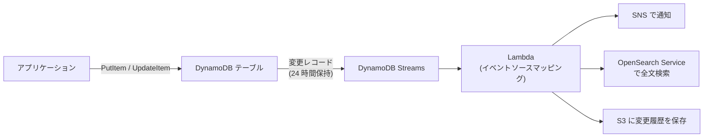

**使いどころ**: 注文が登録されたら確認メールを送る、集計テーブルを更新する、全文検索用に OpenSearch Service へ複製する、変更履歴を監査用に S3 へ保存する、など。
より長い保持期間や多数のコンシューマーが必要な場合は、**Kinesis Data Streams for DynamoDB** に変更を流すこともできます（Kinesis は [アプリケーション統合](09-application-integration.md) で扱います）。

### 4.9 TTL（有効期限）

TTL を有効にすると、指定した属性（UNIX エポック秒の日時）を過ぎたアイテムを、DynamoDB が自動で削除します。

- 削除はバックグラウンドで行われ、期限切れから通常 **数日以内** に削除される（即時ではない）。期限切れでまだ削除されていないアイテムが読み取り結果に含まれることがあるため、必要ならクエリで除外する
- TTL による削除は **WCU を消費しない**（無料）
- 削除は DynamoDB Streams にも記録されるため、Lambda で S3 にアーカイブできる

**使いどころ**: セッション情報、一時的なトークン、一定期間だけ保存すればよいログやイベント。

> [!TIP]
> **試験のポイント**: 「古いアイテムを自動で削除したい。書き込みキャパシティを消費せず、運用も最小に」→ **TTL**。Scan して削除するバッチ処理は、キャパシティを消費し、運用の手間もかかります。

### 4.10 グローバルテーブル

グローバルテーブルは、DynamoDB のテーブルを複数のリージョンに複製し、**どのリージョンでも読み書きできる**（マルチアクティブ）ようにする機能です。
世界中のユーザーに低レイテンシーで読み書きを提供し、リージョン障害にも備えられます。

| 項目 | MREC（マルチリージョン結果整合性。既定） | MRSC（マルチリージョン強い整合性） |
|---|---|---|
| レプリケーション | 非同期（通常は秒単位で反映） | 同期的（書き込みの確定前に他リージョンへ反映） |
| 競合の解決 | 最後に書き込まれたものが優先（last writer wins） | 同時に競合した書き込みはエラーとして返るため、アプリケーションが再試行する |
| 構成 | 任意の数のリージョン | **ちょうど 3 リージョン**（3 レプリカ、または 2 レプリカ ＋ 1 ウィットネス） |
| RPO | レプリケーション遅延の分 | **0** |
| 制約 | ― | TTL とトランザクションは未対応。書き込みのレイテンシーは大きくなる |

MRSC は 2025年6月に一般提供が始まった新しいモードです。試験で単に「グローバルテーブル」とあれば、既定の MREC を指していると考えてください。

> [!TIP]
> **試験のポイント**: 「複数リージョンのユーザーが、それぞれ最寄りのリージョンで低レイテンシーに読み書きしたい（NoSQL）」→ **DynamoDB グローバルテーブル**。

### 4.11 バックアップ・PITR・S3 エクスポート

| 機能 | 内容 |
|---|---|
| PITR（ポイントインタイムリカバリ） | 有効にすると、**最大 35 日** 前までの任意の時点（秒単位）に復元できる。復元先は **新しいテーブル** |
| オンデマンドバックアップ | 任意のタイミングでフルバックアップを取得し、削除するまで保持する。AWS Backup と統合して、別リージョン・別アカウントへのコピーや長期保管もできる |
| S3 へのエクスポート | PITR のデータから S3 にエクスポートする（全体または増分）。**RCU を消費せず、テーブルの性能に影響しない**。Athena などで分析できる |
| S3 からのインポート | S3 のデータ（CSV、DynamoDB JSON、Amazon Ion）から **新しいテーブル** を作成する |

> [!TIP]
> **試験のポイント**: 「DynamoDB のデータを分析したいが、本番のテーブルの性能に影響を与えたくない」→ **S3 へのエクスポート** ＋ Athena。Scan でデータを読み出す方法は RCU を消費します。

### 4.12 トランザクション・アイテムサイズ・そのほか

- **トランザクション**: `TransactWriteItems` / `TransactGetItems` で、複数のアイテムやテーブルにまたがる操作を ACID で実行できる（同一リージョン内）。1 つのトランザクションに最大 100 個のアクションを含められる。消費するキャパシティは通常の 2 倍。例: 「注文の登録」と「在庫の引き当て」を、すべて成功かすべて失敗にする
- **アイテムサイズの上限は 400 KB**（属性名と値の合計）。画像や大きな文書は **S3 に保存し、DynamoDB には S3 のキーやメタデータだけを保存** する
- **テーブルクラス**: Standard と Standard-IA（Infrequent Access）。アクセスが少なくストレージ料金が中心のテーブルは Standard-IA で安くなる
- **きめ細かなアクセス制御**: IAM ポリシーの条件キー `dynamodb:LeadingKeys` を使うと、「ユーザーは自分の ID をパーティションキーに持つアイテムだけ読み書きできる」といった制御ができる（Amazon Cognito と組み合わせる例が典型）

## 5. ElastiCache と MemoryDB

### 5.1 ElastiCache とエンジンの選択

Amazon ElastiCache は、フルマネージドの **インメモリキャッシュ** です。データをメモリ上に置くため、サブミリ秒で応答します。
DB の前段に置いて読み取りの負荷を肩代わりしたり、セッション情報やランキングを保存したりするのに使います。

エンジンは 3 種類から選びます（下の表はノードベースのクラスターの場合）。

| 項目 | Valkey | Redis OSS | Memcached |
|---|---|---|---|
| 位置づけ | Redis OSS から派生したオープンソース（Linux Foundation のプロジェクト）。Redis OSS 互換 | 従来から使われてきた Redis のオープンソース版 | シンプルな分散キャッシュ |
| データ構造 | 文字列・リスト・ハッシュ・セット・ソート済みセットなど豊富 | 同左 | 文字列（単純なキーバリュー）のみ |
| レプリケーションとマルチ AZ の自動フェイルオーバー | あり | あり | なし |
| 永続化（スナップショットによるバックアップ・復元） | あり | あり | なし |
| スケーリング | クラスターモードでシャーディング（書き込みも分散）＋ レプリカ | 同左 | ノードを追加し、クライアント側でキーを分散 |
| リージョン間のレプリケーション | Global Datastore | Global Datastore | なし |
| 料金 | Redis OSS より低価格に設定されている（2026年9月時点） | ― | ― |

Memcached はマルチスレッドで動作するため、1 つのノードで複数の CPU コアを活かしやすいという特徴があります。

> [!TIP]
> **試験のポイント**: 「マルチ AZ で自動フェイルオーバー」「永続化・バックアップ」「ソート済みセットでランキング」「Pub/Sub」→ **Valkey / Redis OSS**。
> 「シンプルなキャッシュで、永続化やレプリケーションは不要。マルチスレッドで性能を出したい」→ **Memcached**。

> [!NOTE]
> AWS のドキュメントでは、2024 年から「ElastiCache for Redis」を「ElastiCache (Redis OSS)」と表記しています。試験では「ElastiCache for Redis」という旧名称で出題されることがあります。
> 新規に構築するなら、Redis OSS 互換で低価格な Valkey を第一候補に検討するとよいでしょう。

### 5.2 キャッシュ戦略: 遅延読み込み・ライトスルー・TTL

キャッシュは「何を、いつ入れて、いつ捨てるか」の設計がすべてです。代表的な戦略は 2 つあり、これに TTL を組み合わせます。

**遅延読み込み（Lazy Loading / キャッシュアサイド）**: 読み取るときにキャッシュを確認し、なければ DB から読んでキャッシュに入れます。

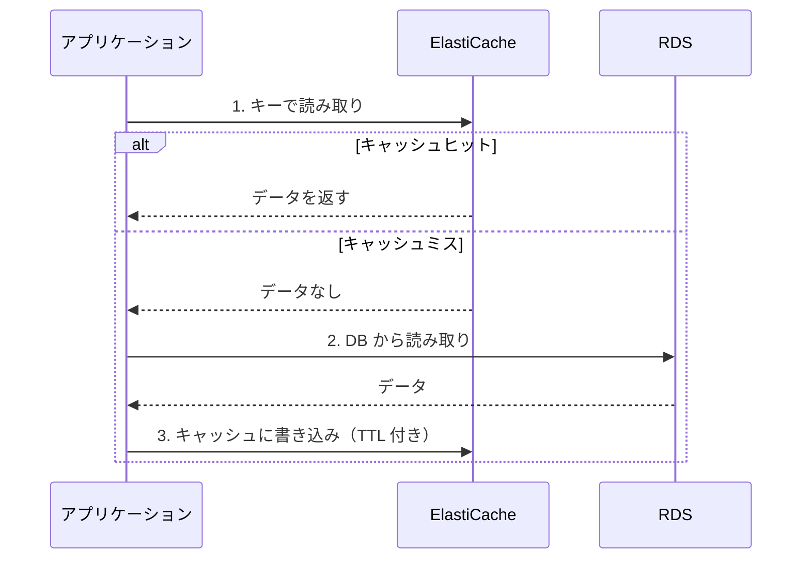

**ライトスルー（Write-through）**: DB に書き込むたびに、同じデータをキャッシュにも書き込みます。

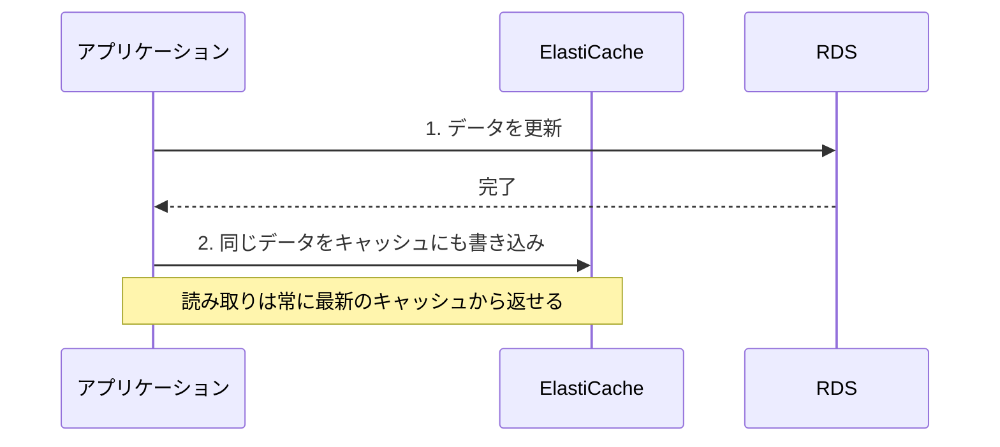

| 戦略 | 長所 | 短所 |
|---|---|---|
| 遅延読み込み | 実際に読まれるデータだけがキャッシュされる。キャッシュノードが故障しても、DB から読めば動き続ける | キャッシュミスのときは 3 回の通信が必要で遅い。DB を更新してもキャッシュは古いまま（stale）になりうる |
| ライトスルー | キャッシュのデータが常に最新 | 一度も読まれないデータまでキャッシュされ、メモリを浪費する。書き込みのたびに処理が増える。ノードを追加した直後はデータがない |
| TTL（有効期限） | 古いデータがいつまでも残るのを防ぎ、使われないデータは自然に消える | 短すぎるとキャッシュミスが増え、DB の負荷が下がらない |

実際のシステムでは、「遅延読み込み ＋ TTL」を基本にし、最新であるべきデータにはライトスルーを組み合わせるのが定石です。

> [!TIP]
> **試験のポイント**: 「データは数分古くてもよい」「実際に読まれるデータだけをキャッシュしてメモリを節約したい」→ **遅延読み込み ＋ TTL**。
> 「キャッシュから常に最新のデータを返したい」→ **ライトスルー**。

### 5.3 セッションストア

Web サーバーのメモリにセッション情報を持つと、Auto Scaling でインスタンスが終了したときにセッションが失われ、ユーザーがログアウトされてしまいます。
セッション情報を **ElastiCache（または DynamoDB）** に外出しすれば、Web 層は状態を持たない（ステートレスな）構成になり、どのインスタンスでもリクエストを処理できます。

ALB のスティッキーセッションでも同じユーザーを同じインスタンスに送れますが、負荷が偏りやすく、インスタンスが終了すればセッションは失われます（[Elastic Load Balancing と Auto Scaling](04-elb-auto-scaling.md)）。

### 5.4 ElastiCache Serverless

ElastiCache Serverless は、ノードタイプやノード数を決めずに使える構成です（Valkey / Redis OSS / Memcached に対応）。

- 負荷とデータ量に応じて自動でスケールする。容量計画が不要
- データは複数の AZ に複製され、高可用性の構成が既定になっている
- 料金は、保存したデータ量と、処理に使った ElastiCache Processing Units（ECPU）に応じてかかる

「トラフィックが予測できない」「キャッシュの運用をなくしたい」場合に向いています。

### 5.5 MemoryDB

Amazon MemoryDB は、Valkey / Redis OSS 互換の **耐久性のあるインメモリデータベース** です。
書き込みを **マルチ AZ のトランザクションログ** に永続化するため、キャッシュとしてではなく、**プライマリデータベース** として使えます。

| 観点 | ElastiCache | MemoryDB |
|---|---|---|
| 役割 | キャッシュ（元のデータは別の DB にある） | プライマリデータベースとして使える |
| 耐久性 | ノード障害時に、直近の書き込みを失う可能性がある | トランザクションログで永続化し、データを失わない設計 |
| レイテンシー | 読み書きともサブミリ秒 | 読み取りはマイクロ秒、書き込みは 1 桁ミリ秒（ログへの書き込みを待つため） |
| 典型的な用途 | DB の前段キャッシュ、セッション | マイクロサービスのデータストア、ランキングやカウンターを別の DB なしで実装 |

> [!TIP]
> **試験のポイント**: 「Redis 互換の超低レイテンシーが必要。しかもデータを失わない耐久性が必要で、キャッシュと DB を 1 つにまとめたい」→ **MemoryDB**。

## 6. そのほかの目的別データベース

| サービス | データモデル | 特徴 | 代表的な用途 |
|---|---|---|---|
| Amazon DocumentDB | ドキュメント（JSON） | MongoDB 互換。ストレージは Aurora と同様に 3 AZ に 6 コピー | コンテンツ管理、商品カタログ、ユーザープロファイル、MongoDB からの移行 |
| Amazon Neptune | グラフ | Gremlin / openCypher / SPARQL（RDF）に対応 | SNS の友達関係、レコメンデーション、不正検知、ナレッジグラフ |
| Amazon Keyspaces | ワイドカラム | Apache Cassandra 互換（CQL）。サーバーレス | Cassandra からの移行、大量の書き込み |
| Amazon Timestream | 時系列 | 新規は Timestream for InfluxDB（マネージドの InfluxDB） | IoT センサーのデータ、アプリケーションのメトリクス |
| Amazon OpenSearch Service | 検索エンジン | 全文検索・ログ分析 | サイト内検索、ログ分析（[データ分析サービス](14-analytics.md)） |

- グラフデータベースは「A さんの友達の友達で、B という商品を買った人」のような **関係をたどるクエリ** を得意とします。リレーショナル DB で同じことをすると、JOIN が何重にもなって遅くなります。
- データウェアハウス（Amazon Redshift）は [データ分析サービス](14-analytics.md) で扱います。

> [!NOTE]
> **Timestream for LiveAnalytics** は、2025年6月20日から新規顧客の受け付けを終了しています（メンテナンス段階。既存の利用者は継続利用可）。新規の時系列ワークロードには Timestream for InfluxDB が案内されています。
> 試験で「時系列データを効率よく保存・分析したい」とあれば、引き続き Timestream が正解の候補です。最新状況は [AWS のメンテナンス中のサービス一覧](https://docs.aws.amazon.com/general/latest/gr/maintenance_services.html) で確認できます。

> [!WARNING]
> **ひっかけ注意**: Amazon QLDB（改ざんできない台帳データベース）は **2025年7月31日にサービスを終了** しました。古い問題では「変更履歴を暗号的に検証できる台帳」→ QLDB が正解とされていましたが、新規の設計では選べません。AWS は Aurora PostgreSQL などへの移行を案内していました。
> サービスの廃止や名称変更の一覧は [サービスの変更点](../06-reference/service-changes.md) を参照してください。

## 7. データベースの選定とコスト

### 7.1 選定フローチャート

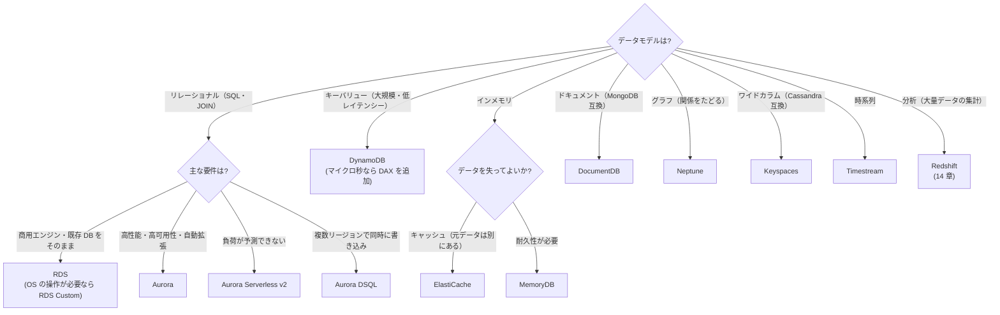

### 7.2 問題文のキーワードと選ぶべきもの

| 問題文のキーワード | 選ぶもの |
|---|---|
| AZ 障害時に自動でフェイルオーバー、データを失わない | RDS マルチ AZ 配置 / Aurora |
| 読み取りの負荷分散、レポート処理を本番から分離 | リードレプリカ / Aurora レプリカ |
| スタンバイでも読み取りたい、より速いフェイルオーバー | マルチ AZ DB クラスター / Aurora |
| リージョン障害に備える、RPO は秒単位、世界中で読み取り | Aurora Global Database |
| Lambda からの大量の接続、フェイルオーバーの高速化 | RDS Proxy |
| 既存の暗号化されていない DB を暗号化したい | スナップショットを暗号化してコピー → 復元 |
| メジャーバージョンアップを安全に、停止時間を最小に | Blue/Green デプロイ |
| 誤操作を新しい DB を作らずに巻き戻す（Aurora MySQL） | バックトラック |
| 本番データで素早くテスト環境を作る | Aurora のクローン |
| 予測できない負荷のリレーショナル DB | Aurora Serverless v2 |
| 大規模・1 桁ミリ秒・サーバーレスのキーバリュー | DynamoDB |
| DynamoDB の読み取りをマイクロ秒に | DAX |
| データの変更をきっかけに処理を実行 | DynamoDB Streams ＋ Lambda |
| 期限切れのデータを自動削除（キャパシティを消費しない） | DynamoDB TTL |
| 複数リージョンで読み書き（NoSQL） | DynamoDB グローバルテーブル |
| セッション管理、ランキング、DB の前段キャッシュ | ElastiCache（Valkey / Redis OSS） |
| MongoDB 互換 / グラフ / Cassandra 互換 / 時系列 | DocumentDB / Neptune / Keyspaces / Timestream |

### 7.3 コストの最適化

| 対象 | 主な手段 |
|---|---|
| RDS / Aurora | 常時稼働ならリザーブドインスタンス（1 年 / 3 年）または Database Savings Plans。適切なサイズへの変更（Graviton ベースのインスタンスも検討）。開発環境の停止（最大 7 日）。I/O の多い Aurora は I/O-Optimized。使われない時間が長いなら Serverless v2（0 ACU まで縮小） |
| DynamoDB | トラフィックに合わせたキャパシティモードの選択。安定したトラフィックはプロビジョンド ＋ Auto Scaling ＋ リザーブドキャパシティ。アクセスの少ないテーブルは Standard-IA。不要なデータは TTL で削除 |
| ElastiCache | リザーブドノードまたは Database Savings Plans。Valkey の採用。キャッシュで DB の負荷を下げれば、DB インスタンスを小さくできる |

**Database Savings Plans**（2025年12月に発表）は、1 年間の一定の利用額（1 時間あたりの金額）を約束する代わりに、最大 35% の割引を受けられる仕組みです（前払いなし）。
Aurora、RDS、DynamoDB、ElastiCache、DocumentDB、Neptune、Keyspaces、Timestream、AWS DMS などに、**エンジン・インスタンスファミリー・サイズ・リージョンを問わず** 適用されます（2026年3月からは OpenSearch Service と Neptune Analytics も対象。2026年9月時点）。
リザーブドインスタンスより柔軟なので、DB の種類やリージョンを変える可能性がある場合に向いています。

> [!NOTE]
> Database Savings Plans は新しい割引の仕組みのため、SAA-C03 の問題では「安定稼働する DB のコストを下げる → リザーブドインスタンス」が正解となることが多いはずです。両方を知ったうえで、問題文の選択肢から最適なものを選んでください。
> コスト最適化の全体像は [コスト最適化](18-cost-optimization.md) で扱います。

## まとめ

- DB は「データモデル・アクセスパターン・スケール・整合性・運用負荷」で選ぶ。AWS は用途別の目的別データベースを提供している
- RDS の **マルチ AZ 配置** は同期レプリケーションで、スタンバイは読めない。**マルチ AZ DB クラスター** は読み取り可能なスタンバイ 2 台、**リードレプリカ** は非同期で読み取り専用（最大 15 台、クロスリージョン可、手動で昇格）
- RDS の自動バックアップは最大 35 日で PITR ができる。復元は必ず **新しいインスタンス** になる
- RDS の暗号化は作成時のみ。既存の DB は **スナップショットを暗号化してコピー → 復元** で暗号化する
- Lambda からの大量接続とフェイルオーバーの短縮には **RDS Proxy**。安全なアップグレードには **Blue/Green デプロイ**
- Aurora は **3 AZ に 6 コピー**（書き込み 4/6、読み取り 3/6）の共有ストレージと、最大 15 台のレプリカ。エンドポイントを用途で使い分ける
- Aurora の **Serverless v2**（0〜256 ACU）、**Global Database**（最大 10 セカンダリリージョン、遅延は通常 1 秒未満）、**バックトラック**（MySQL、最大 72 時間）、**クローン**、**I/O-Optimized** を要件で使い分ける
- DynamoDB は **キー設計がすべて**。RCU は 4 KB、WCU は 1 KB 単位で切り上げて計算し、結果整合性は半分、トランザクションは 2 倍
- DynamoDB の **GSI はいつでも追加できる**が **LSI は作成時のみ**。マイクロ秒の読み取りは DAX、変更の連携は Streams、自動削除は TTL、マルチリージョンはグローバルテーブル
- ElastiCache は **遅延読み込み ＋ TTL** を基本に、必要に応じてライトスルー。耐久性が必要なら **MemoryDB**。QLDB はサービス終了済み

## 確認問題

### 問1
ある企業は、Amazon RDS for PostgreSQL（シングル AZ）で業務システムを運用しています。次の要件を満たすように構成を変更する必要があります。

- AZ 障害のときは自動でフェイルオーバーし、フェイルオーバーにかかる時間をできるだけ短くする
- 読み取り専用のクエリを、スタンバイの DB インスタンスにオフロードする
- DB エンジン（RDS for PostgreSQL）は変更しない

運用上のオーバーヘッドが最も少なく、これらの要件を満たす方法はどれですか。

- A. マルチ AZ 配置（DB インスタンス）に変更し、読み取り専用のクエリをスタンバイインスタンスに送る
- B. マルチ AZ DB クラスターに移行し、読み取り専用のクエリをリーダーエンドポイントに送る
- C. 別のリージョンにクロスリージョンリードレプリカを 2 台作成し、障害時は Lambda 関数でレプリカを昇格させる
- D. Aurora PostgreSQL に移行して Global Database を構成し、セカンダリリージョンで読み取りを処理する

解答と解説

**正解: B**

**解説**: マルチ AZ DB クラスターは、ライター 1 台と **読み取り可能なスタンバイ 2 台** を 3 つの AZ に配置します。自動フェイルオーバーは通常 35 秒未満で、リーダーエンドポイントで読み取りをオフロードでき、エンジンも RDS for PostgreSQL のままです。

**各選択肢の検討**
- A: ✗ マルチ AZ 配置（インスタンス）のスタンバイは読み取りに使えません。
- B: ✓ 高可用性・高速なフェイルオーバー・スタンバイでの読み取りをすべて満たします。
- C: ✗ 昇格は手動（自作の仕組み）で運用負荷が高く、非同期のためデータを失う可能性もあります。AZ 障害への備えとしても過剰です。
- D: ✗ エンジンの変更という制約に反します。リージョンをまたぐ構成は要件に対して過剰で、コストも運用負荷も増えます。

### 問2
ある企業の Amazon RDS for MySQL の DB インスタンスは、保管時の暗号化を有効にせずに作成されていました。セキュリティ監査で、DB のデータとバックアップを AWS KMS のキーで暗号化するよう指摘されました。どのように対応すべきですか。

- A. DB インスタンスを変更してストレージの暗号化を有効にし、変更をすぐに適用する
- B. 暗号化を有効にしたリードレプリカを作成し、同期が完了したらリードレプリカを昇格させる
- C. アカウントで EBS のデフォルト暗号化を有効にし、DB インスタンスを再起動する
- D. DB スナップショットを取得し、暗号化を有効にしてスナップショットをコピーし、そのコピーから新しい DB インスタンスを復元して接続先を切り替える

解答と解説

**正解: D**

**解説**: RDS の暗号化は作成時にしか有効にできません。既存の暗号化されていない DB は、スナップショットを **暗号化してコピー** し、そこから復元した新しい DB インスタンスに切り替えます。

**各選択肢の検討**
- A: ✗ 既存の DB インスタンスの変更で暗号化を有効にすることはできません。
- B: ✗ 暗号化されていないインスタンスから、暗号化されたリードレプリカは作成できません。
- C: ✗ EBS のデフォルト暗号化は EC2 の EBS ボリューム向けの設定で、既存の RDS には影響しません。
- D: ✓ 正しい手順です。切り替えまでの書き込みの扱い（書き込みの停止や DMS での差分同期）も計画します。

### 問3
ある企業は、Amazon API Gateway と AWS Lambda で構築した API から Amazon Aurora MySQL に接続しています。キャンペーンでリクエストが急増すると、Lambda の同時実行数が増えて、DB で「too many connections」エラーが発生します。また、Aurora のフェイルオーバー時に、アプリケーションが接続を回復するまでの時間も短くしたいと考えています。アプリケーションコードの変更を最小限に抑えて、これらの要件を満たす方法はどれですか。

- A. Amazon RDS Proxy を作成し、Lambda 関数の接続先をプロキシのエンドポイントに変更する
- B. Aurora の DB インスタンスクラスを大きくして、最大接続数を増やす
- C. Aurora レプリカを追加し、Lambda 関数の接続先をリーダーエンドポイントに変更する
- D. Lambda 関数の予約された同時実行数を 1 に設定し、DB への接続数を制限する

解答と解説

**正解: A**

**解説**: RDS Proxy は、多数のクライアント接続を少数の DB 接続にまとめる（プーリング・多重化）ことで接続の急増から DB を守ります。フェイルオーバー時もクライアントとの接続を保ったまま新しいライターにつなぎ直すため、回復が速くなります。アプリケーションの変更は接続先の変更だけで済みます。

**各選択肢の検討**
- A: ✓ 両方の要件を、最小限の変更で満たします。
- B: ✗ コストが増えるうえ、急増が続けばいずれ上限に達します。フェイルオーバー時間も短くなりません。
- C: ✗ 書き込みはライターでしか処理できず、接続数の急増という根本原因も解決しません。
- D: ✗ API の処理能力が極端に落ち、リクエストがスロットリングされます。性能の要件を満たせません。

### 問4
ある企業は、Amazon Aurora PostgreSQL クラスター（ライター 1 台、Aurora レプリカ 4 台）でオンラインサービスを運用しています。分析チームは、ほぼリアルタイムのデータに対して重い集計クエリを実行したいと考えています。集計クエリは、新しく追加する大きなインスタンスサイズのレプリカ 2 台だけで処理し、Web アプリケーションが使う既存の 4 台のレプリカに影響を与えないようにする必要があります。最も適切な方法はどれですか。

- A. 集計クエリをリーダーエンドポイントに送る
- B. 毎晩 Aurora のクローンを作成し、クローンに対して集計クエリを実行する
- C. 大きな 2 台のレプリカだけを含むカスタムエンドポイントを作成し、集計クエリをそのエンドポイントに送る
- D. 大きな 2 台のレプリカのフェイルオーバー優先度を tier-0 にし、集計クエリをクラスターエンドポイントに送る

解答と解説

**正解: C**

**解説**: カスタムエンドポイントを使うと、指定したインスタンスのグループにだけ接続を振り分けられます。集計クエリは大きな 2 台だけで処理されます。さらに Web アプリケーション側も既存の 4 台だけを含むカスタムエンドポイントに接続すれば、両者を完全に分離できます。

**各選択肢の検討**
- A: ✗ リーダーエンドポイントはすべてのレプリカに接続を振り分けるため、既存の 4 台にも集計クエリが流れます。
- B: ✗ 毎晩のクローンでは「ほぼリアルタイムのデータ」という要件を満たせず、作成・削除の運用も必要です。
- C: ✓ 要件どおりに処理を分離できます。
- D: ✗ 優先度ティアはフェイルオーバー時の昇格の順番を決めるだけです。クラスターエンドポイントはライターを指すため、集計クエリがライターの負荷になります。分析用のレプリカが優先的に昇格してしまう点も不適切です。

### 問5
ある企業は、Amazon DynamoDB のテーブルをプロビジョンドキャパシティモードで作成します。アプリケーションは、サイズが 7 KB のアイテムを **強い整合性のある読み込み** で毎秒 30 回読み取り、サイズが 2.5 KB のアイテムを毎秒 10 回書き込みます。必要な RCU と WCU の組み合わせはどれですか。

- A. 30 RCU / 30 WCU
- B. 53 RCU / 25 WCU
- C. 60 RCU / 25 WCU
- D. 60 RCU / 30 WCU

解答と解説

**正解: D**

**解説**: 読み込みは 7 KB → 4 KB 単位に切り上げて 8 KB = 2 RCU。強い整合性で毎秒 30 回なので 2 × 30 = **60 RCU**。書き込みは 2.5 KB → 1 KB 単位に切り上げて 3 KB = 3 WCU。毎秒 10 回なので 3 × 10 = **30 WCU** です。

**各選択肢の検討**
- A: ✗ 読み込みを結果整合性として半分にしています（60 ÷ 2 = 30）。問題は強い整合性です。
- B: ✗ 切り上げをしていません（7 ÷ 4 × 30 = 52.5、2.5 × 10 = 25）。
- C: ✗ 読み込みは正しく切り上げていますが、書き込みの切り上げを忘れています。
- D: ✓ 読み込み・書き込みとも正しく切り上げています。

### 問6
ある企業は、Amazon DynamoDB にユーザーのセッションデータと商品データを保存しています。次の 2 つの要件があります。

1. セッションデータを作成から 24 時間後に自動で削除する。削除のために書き込みキャパシティを消費したくない
2. 商品の価格が更新されたら、ほぼリアルタイムで別のシステムに通知する

運用上のオーバーヘッドが最も少ない方法の組み合わせはどれですか。（2 つ選択してください）

- A. DynamoDB Accelerator（DAX）を導入し、キャッシュの有効期限を 24 時間に設定する
- B. セッションデータに有効期限の属性を追加し、DynamoDB の TTL を有効にする
- C. Amazon EventBridge のスケジュールで 1 時間ごとに Lambda 関数を実行し、テーブルを Scan して期限切れのセッションを削除する
- D. 商品テーブルをグローバルテーブルにし、別のリージョンのレプリカで更新を検知する
- E. 商品テーブルで DynamoDB Streams を有効にし、Lambda 関数で変更を処理して通知する

解答と解説

**正解: B、E**

**解説**: TTL は期限切れのアイテムを WCU を消費せずに自動で削除します。DynamoDB Streams はアイテムの変更を順序どおりに記録し、Lambda のイベントソースマッピングで、ほぼリアルタイムに処理できます。

**各選択肢の検討**
- A: ✗ DAX のキャッシュの有効期限は、テーブルのデータの削除とは関係ありません。
- B: ✓ 要件 1 を、キャパシティを消費せず運用の手間もなく満たします。
- C: ✗ Scan と削除でキャパシティを消費し、スケジュールと関数の運用も必要です。
- D: ✗ グローバルテーブルはリージョン間の複製の仕組みで、変更通知の仕組みではありません。コストも増えます。
- E: ✓ 要件 2 を満たす定番の構成です。

### 問7
ある企業は、東京リージョンの Amazon Aurora MySQL でグローバルな EC サイトを運用しています。リージョン全体の障害に備えて、別のリージョンで事業を継続できるようにする必要があります。目標は RPO が数秒以内、RTO が数分以内です。また、欧州のユーザーからの読み取りのレイテンシーも改善したいと考えています。これらの要件を最もよく満たす方法はどれですか。

- A. Aurora Global Database を構成し、欧州のリージョンをセカンダリリージョンとして追加する
- B. Aurora クラスターの自動スナップショットを、毎日欧州のリージョンにコピーする
- C. 東京リージョン内に Aurora レプリカを追加し、それぞれ別の AZ に配置する
- D. データを Amazon DynamoDB に移行し、グローバルテーブルを構成する

解答と解説

**正解: A**

**解説**: Aurora Global Database は、ストレージ層でリージョン間を複製し、遅延は通常 1 秒未満です。セカンダリリージョンでは低レイテンシーの読み取りができ、障害時はセカンダリをプライマリに切り替えられます。RPO 数秒・RTO 数分の目標に合います。

**各選択肢の検討**
- A: ✓ DR とグローバルな読み取り性能の両方を満たします。
- B: ✗ RPO は最大で約 24 時間になり、スナップショットからの復元にも時間がかかります。読み取りのレイテンシーも改善しません。
- C: ✗ AZ 障害には強くなりますが、リージョン障害には対応できず、欧州からのレイテンシーも改善しません。
- D: ✗ リレーショナルから NoSQL への移行はアプリケーションの大幅な作り直しが必要で、要件に対して過剰です。

### 問8
ある企業のニュースサイトは、Amazon RDS for MySQL に記事データを保存しています。同じ記事が何度も読まれるため、DB の CPU 使用率が高くなっています。記事は、更新後に最大 5 分程度古い内容が表示されても問題ありません。また、キャッシュのメモリは、実際に読まれる記事だけに使いたいと考えています。最も適切なキャッシュ戦略はどれですか。

- A. Amazon ElastiCache を使い、記事の更新時に必ずキャッシュへ書き込むライトスルー方式にする。TTL は設定しない
- B. DynamoDB Accelerator（DAX）を RDS の前段に配置する
- C. Amazon ElastiCache を使い、読み取り時にキャッシュになければ DB から読んでキャッシュに入れる遅延読み込み方式にし、TTL を 300 秒に設定する
- D. RDS のマルチ AZ 配置を有効にし、読み取りをスタンバイインスタンスに分散する

解答と解説

**正解: C**

**解説**: 遅延読み込みは、実際に読まれたデータだけをキャッシュに入れます。TTL を 300 秒にすれば、古いデータが表示されるのは最大 5 分程度に収まり、要件に合います。

**各選択肢の検討**
- A: ✗ ライトスルーでは、一度も読まれない記事までキャッシュされ、メモリを無駄に使います。TTL がないと不要なデータも残り続けます。
- B: ✗ DAX は DynamoDB 専用のキャッシュで、RDS には使えません。
- C: ✓ 鮮度の要件とメモリ効率の要件を両方満たします。
- D: ✗ マルチ AZ 配置（インスタンス）のスタンバイは読み取りに使えません。

## 次のステップ

- **ハンズオン**: [Lab 05: RDS Multi-AZ とフェイルオーバー](../04-labs/lab05-rds-multi-az.md) で、マルチ AZ 配置の RDS を作成し、フェイルオーバーの動きを実際に確かめましょう。
- **次の章**: [Route 53・CloudFront・Global Accelerator](08-route53-cloudfront.md) で、DNS と CDN によるグローバルな配信と経路制御を学びます。
- **関連する章**: [高可用性と災害対策](15-high-availability-dr.md)（DR 戦略と RPO / RTO）、[データ分析サービス](14-analytics.md)（Redshift・ゼロ ETL）、[移行とハイブリッド接続](16-migration-hybrid.md)（AWS DMS による DB 移行）
- **公式ドキュメント**:
  - [Amazon RDS ユーザーガイド](https://docs.aws.amazon.com/AmazonRDS/latest/UserGuide/Welcome.html)
  - [Amazon Aurora ユーザーガイド](https://docs.aws.amazon.com/AmazonRDS/latest/AuroraUserGuide/CHAP_AuroraOverview.html)
  - [Aurora Global Database の使用](https://docs.aws.amazon.com/AmazonRDS/latest/AuroraUserGuide/aurora-global-database.html)
  - [Aurora Serverless v2 のパフォーマンスとスケーリング](https://docs.aws.amazon.com/AmazonRDS/latest/AuroraUserGuide/aurora-serverless-v2.setting-capacity.html)
  - [Amazon DynamoDB デベロッパーガイド](https://docs.aws.amazon.com/amazondynamodb/latest/developerguide/Introduction.html)
  - [Amazon ElastiCache](https://aws.amazon.com/elasticache/)
  - [Amazon Aurora DSQL](https://aws.amazon.com/rds/aurora/dsql/)
  - [AWS のデータベースサービス一覧](https://aws.amazon.com/products/databases/)

---
[← 前の章](06-ebs-efs-fsx.md) | [目次](README.md) | [次の章 →](08-route53-cloudfront.md)
