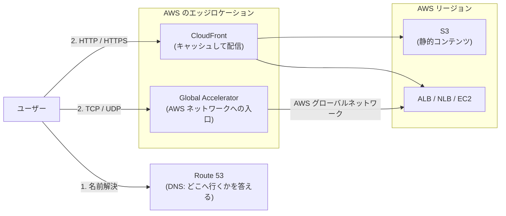
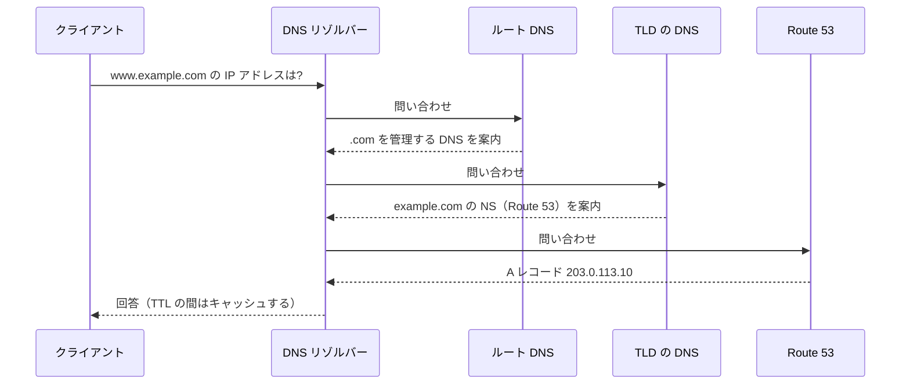
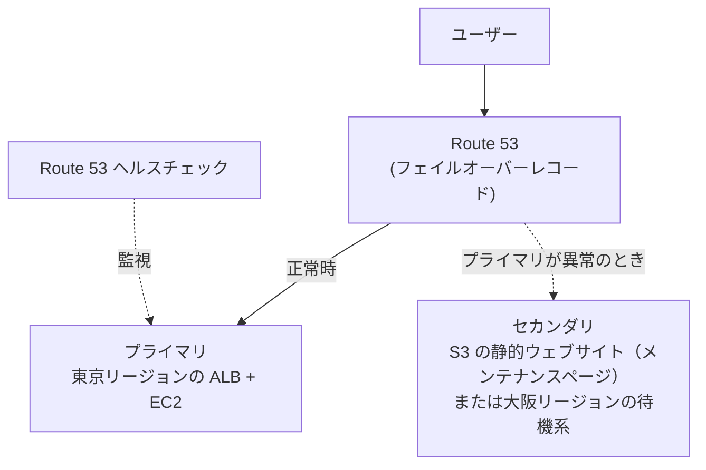
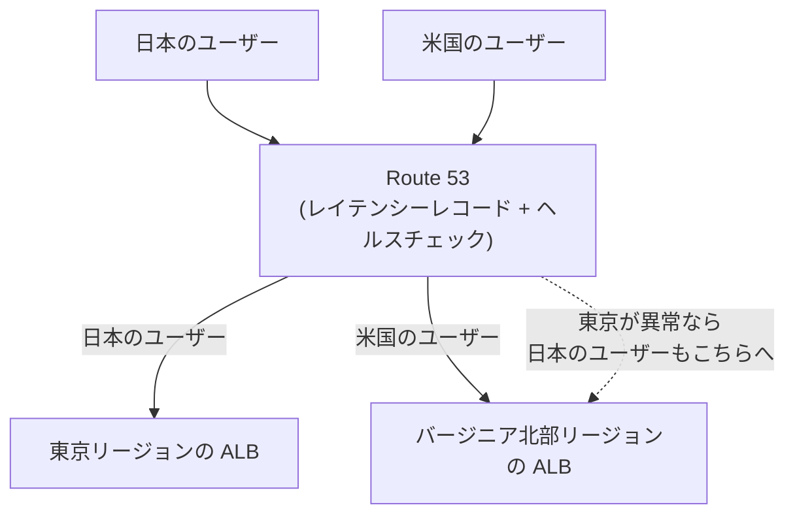
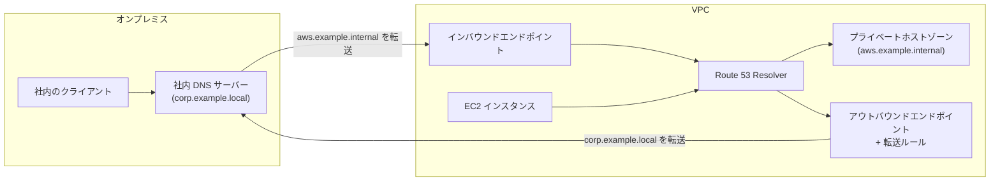
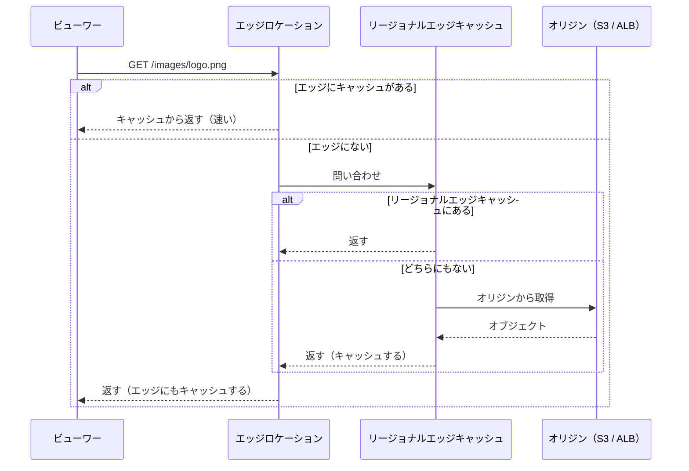
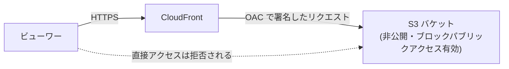
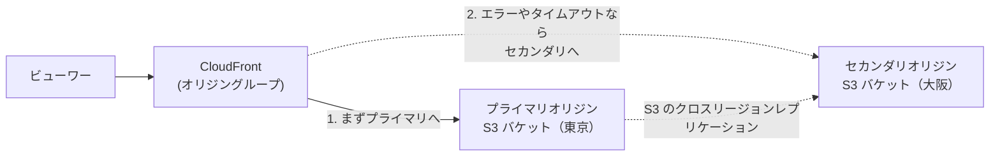
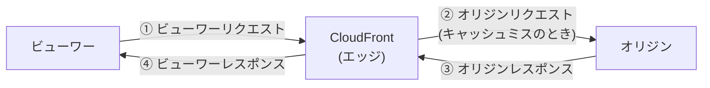
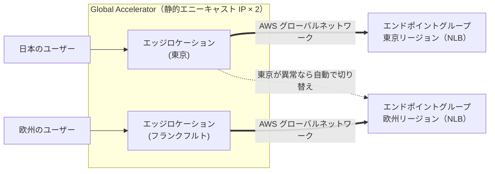

[ホーム](../README.md) > [Phase 2: アソシエイト](README.md) > Route 53・CloudFront・Global Accelerator

# Route 53・CloudFront・Global Accelerator

> **この章のゴール**
> - Route 53 のホストゾーン・レコード・エイリアスを説明し、Zone Apex（example.com）の名前解決を設計できる
> - 8 種類のルーティングポリシーを、要件（レイテンシー・地域・割合・フェイルオーバーなど）から選べる
> - ヘルスチェックを使ったアクティブ-パッシブ / アクティブ-アクティブのフェイルオーバーを設計できる
> - CloudFront のキャッシュの仕組み、OAC、キャッシュポリシー、署名付き URL / Cookie、エッジ関数を使い分けられる
> - CloudFront と Global Accelerator の違いを説明し、要件に応じて選べる
>
> **対応試験**: SAA-C03（第2分野: 弾力性に優れたアーキテクチャの設計 / 第3分野: 高性能なアーキテクチャの設計 ほか）
> **目安時間**: 読む 150分 / 確認問題 30分（ハンズオン・復習を含めて約 5 時間）

## この章の全体像

この章では、ユーザーに近い場所で働く 3 つの「エッジ」のサービスを学びます。
アプリケーションを複数の AZ やリージョンで冗長化しても、ユーザーを正しい場所へ、速く、安全に届けられなければ意味がありません。その「入口」を担うのがこの 3 つです。



| サービス | 役割 | 解決する課題 |
|---|---|---|
| Amazon Route 53 | DNS（名前解決）、ヘルスチェック、ドメイン登録 | ユーザーをどのエンドポイントに向けるか。障害時にどこへ切り替えるか |
| Amazon CloudFront | CDN（コンテンツ配信ネットワーク） | 遠くのユーザーへの配信の遅さ、オリジンの負荷、オリジンの保護 |
| AWS Global Accelerator | ネットワーク層（TCP / UDP）のアクセラレーター | インターネット経路の不安定さ、固定 IP アドレスの必要性、素早いリージョンの切り替え |

DNS の基本（名前解決の流れ、レコード、TTL）は [ネットワークの基礎](../01-foundations/01-network-basics.md)、エッジロケーションは [AWS グローバルインフラストラクチャ](../01-foundations/05-global-infrastructure.md) で学びました。必要に応じて復習してください。

## 1. Route 53 の基本

### 1.1 Route 53 とは

Amazon Route 53 は、可用性とスケーラビリティの高い DNS サービスです。名前の「53」は、DNS が使うポート番号に由来します。
主な機能は 3 つです。

1. **ドメイン登録**: `example.com` のようなドメイン名を登録・管理する
2. **DNS ルーティング（権威 DNS）**: ドメイン名への問い合わせに、IP アドレスなどを答える
3. **ヘルスチェック**: エンドポイントの状態を監視し、正常なエンドポイントだけを答える

Route 53 のサービスレベルアグリーメント（SLA）は、100% の可用性を掲げています。DNS が止まるとすべてのサービスに到達できなくなるため、それだけ重要な基盤です。

名前解決の流れをおさらいしましょう。Route 53 は、この流れの最後に答える **権威 DNS サーバー** の役割を担います。



### 1.2 ホストゾーン（パブリック / プライベート）

**ホストゾーン** は、1 つのドメインのレコードをまとめて管理する入れ物です。2 種類あります。

| 項目 | パブリックホストゾーン | プライベートホストゾーン |
|---|---|---|
| 名前解決できる範囲 | インターネット全体 | 関連付けた VPC の内部だけ |
| 用途 | 公開する Web サイトや API | 社内システム、マイクロサービス間の名前（例: `db.internal.example.com`） |
| 前提条件 | ドメインのネームサーバー（NS）を Route 53 に向ける | VPC の「DNS 解決（enableDnsSupport）」と「DNS ホスト名（enableDnsHostnames）」を有効にする |
| 複数の VPC | ― | 複数の VPC に関連付けられる。別アカウントの VPC との関連付けは、CLI / API で承認の手続きをする |

- ホストゾーンを作ると、NS レコードと SOA レコードが自動で作成され、4 つのネームサーバーが割り当てられます。
- 同じドメイン名で、パブリックとプライベートの両方のホストゾーンを作ることもできます（**スプリットビュー DNS**）。VPC 内からはプライベートの回答、インターネットからはパブリックの回答が返ります。

> [!TIP]
> **試験のポイント**: 「VPC 内だけで使う独自のドメイン名で、EC2 や RDS を名前解決したい」→ **プライベートホストゾーン**。
> 「プライベートホストゾーンを作ったのに名前解決できない」→ VPC の **DNS 解決と DNS ホスト名** が有効かを確認します。

### 1.3 主なレコードタイプ

| タイプ | 内容 | 例 |
|---|---|---|
| A | ホスト名 → IPv4 アドレス | `www.example.com` → `203.0.113.10` |
| AAAA | ホスト名 → IPv6 アドレス | `www.example.com` → `2001:db8::10` |
| CNAME | ホスト名 → 別のホスト名（別名） | `blog.example.com` → `blog.example.net` |
| MX | メールサーバー | `10 mail.example.com` |
| TXT | 任意の文字列（ドメイン所有の確認、SPF など） | `"v=spf1 ..."` |
| NS | そのゾーンを管理するネームサーバー | Route 53 が割り当てた 4 つのネームサーバー |
| SOA | ゾーンの管理情報 | ホストゾーンの作成時に自動で作成 |
| CAA | そのドメインの証明書を発行してよい認証局 | `0 issue "amazon.com"` |

### 1.4 エイリアスレコードと CNAME（Zone Apex）

**Zone Apex** とは、`www` などが付かないドメインそのもの（`example.com`）のことです。
DNS の仕様では、Zone Apex に CNAME レコードを作れません。Zone Apex には NS レコードと SOA レコードが必ず存在し、CNAME は同じ名前のほかのレコードと共存できないためです。

そこで Route 53 は、独自の拡張として **エイリアスレコード** を提供しています。エイリアスレコードは、AWS のリソースの IP アドレスを Route 53 が内部で解決し、A（または AAAA）レコードとして直接答えます。

| 項目 | エイリアスレコード | CNAME レコード |
|---|---|---|
| Zone Apex（example.com）で使えるか | **使える** | 使えない（DNS の仕様） |
| 向け先 | 特定の AWS リソースと、同じホストゾーン内の別のレコード | 任意のホスト名 |
| クエリの料金 | AWS リソースを指すエイリアスへのクエリは **無料** | 有料 |
| 応答の形 | A / AAAA などで IP アドレスを直接返す | 別名を返し、クライアント側でもう一度名前解決する |
| TTL | 設定しない（向け先に従う） | 利用者が設定する |
| ヘルスチェック | 「ターゲットのヘルスを評価」で向け先の状態を反映できる | ヘルスチェックを関連付ける |

エイリアスレコードで指せる主な AWS リソースは次のとおりです。

- Elastic Load Balancing（ALB / NLB / CLB）
- CloudFront のディストリビューション
- S3 の静的ウェブサイトエンドポイント（バケット名とレコード名を一致させる）
- API Gateway のカスタムドメイン名
- VPC インターフェイスエンドポイント
- Global Accelerator のアクセラレーター
- Elastic Beanstalk の環境
- 同じホストゾーン内の別のレコード

> [!TIP]
> **試験のポイント**: 「`example.com`（Zone Apex）を ALB や CloudFront に向けたい」→ **エイリアスレコード**（A レコードのエイリアス）。
> 「AWS リソースへの DNS クエリのコストを抑えたい」→ エイリアス（AWS リソースへのエイリアスクエリは無料）。

> [!WARNING]
> **ひっかけ注意**: EC2 インスタンスのパブリック DNS 名や、RDS の DB エンドポイントは、エイリアスの向け先にできません。これらを別名で参照したい場合は CNAME を使います（Zone Apex 以外の名前で）。

### 1.5 TTL

TTL（Time To Live）は、リゾルバーやクライアントが DNS の回答をキャッシュしてよい時間（秒）です。

| TTL | 長所 | 短所 |
|---|---|---|
| 長い（例: 1 日） | 問い合わせが減り、Route 53 の料金が下がる。ユーザーの名前解決も速い | IP アドレスの変更やフェイルオーバーが反映されるまで時間がかかる |
| 短い（例: 60 秒） | 変更がすぐに反映される | 問い合わせが増え、料金が上がる |

システムの移行でレコードを切り替えるときは、**切り替えの前に TTL を短くしておき**、古いキャッシュが消えてから切り替えるのが定石です。切り替えが終わったら TTL を元に戻します。

## 2. ルーティングポリシー

Route 53 は、同じ名前への問い合わせに対して、**ルーティングポリシー** に従って答えを変えられます。SAA-C03 で最もよく出るテーマの 1 つです。

| ポリシー | 動き | 典型的な用途 | ヘルスチェック |
|---|---|---|---|
| シンプル | 1 つのレコードに 1 つ以上の値。値が複数あれば、すべてをランダムな順で返す | 単一のリソース | 関連付けられない |
| 加重（Weighted） | 指定した重みの比率で答えを分ける。重み 0 でそのレコードへの振り分けを止める | A/B テスト、段階的な移行（カナリアリリース）、ブルー/グリーンデプロイ | 使える |
| レイテンシー | ユーザーから **レイテンシーが最も低いリージョン** のリソースを返す | 複数リージョン構成で応答速度を最適化 | 使える |
| フェイルオーバー | プライマリが正常ならプライマリ、異常ならセカンダリを返す | アクティブ-パッシブの DR | プライマリには必須 |
| 位置情報（Geolocation） | ユーザーの **位置**（大陸・国・米国の州など）で答えを決める | 言語や通貨のローカライズ、配信権や法規制による出し分け | 使える |
| 地理的近接性（Geoproximity） | リソースとユーザーの **地理的な距離** で決める。**バイアス** で各リソースの担当範囲を広げたり狭めたりできる | リージョン間の負荷配分の調整 | 使える |
| 複数値回答（Multivalue answer） | 正常なレコードを最大 8 つまで、ランダムに返す | クライアント側での簡易的な負荷分散 | 使える |
| IP ベース | ユーザーの送信元 IP アドレスの範囲（CIDR コレクション）で答えを決める | 特定の ISP や企業ネットワークのユーザーを、特定のエンドポイントへ誘導 | 使える |

補足:

- **レイテンシー**: AWS が計測した、ユーザーのネットワークと各リージョンの間のレイテンシーで判断します。地理的に最も近いリージョンが選ばれるとは限りません。
- **位置情報**: どの場所にも当てはまらないユーザー向けに **デフォルトのレコード** を作っておきます。作らないと、該当しない場所のユーザーには回答が返りません。
- **地理的近接性**: AWS のリソースはリージョンを、それ以外のリソースは緯度・経度を指定します。バイアスは 1〜99 で範囲を広げ、-1〜-99 で狭めます。Route 53 の Traffic Flow（トラフィックポリシーのビジュアルエディター）でも設定できます。
- **組み合わせ**: エイリアスレコードでほかのレコードを指すことで、ポリシーを入れ子にできます（例: レイテンシーでリージョンを選び、その中でフェイルオーバーする）。

> [!TIP]
> **試験のポイント**（キーワードとポリシーの対応）:
> - 「ユーザーに最も速い応答を返したい」→ **レイテンシー**（「地理的に最も近い」ではない点に注意）
> - 「国ごとにコンテンツを出し分けたい」「特定の国のユーザーを特定のリージョンに固定したい（法規制・配信権）」→ **位置情報**
> - 「トラフィックの 10% だけを新しいバージョンへ」→ **加重**
> - 「リージョンの担当範囲を広げたり狭めたりして、負荷の配分を調整したい」→ **地理的近接性（バイアス）**
> - 「特定の ISP のユーザーを特定のエンドポイントへ」→ **IP ベース**
> - 「障害時に待機系へ切り替えたい」→ **フェイルオーバー**

> [!WARNING]
> **ひっかけ注意**:
> - 位置情報ルーティングは「どこからのアクセスか」で答えを決めるルールで、性能の最適化ではありません。速さが目的ならレイテンシールーティングです。
> - 複数値回答ルーティングは、ELB の代わりにはなりません。DNS の段階で正常な IP アドレスを複数返すだけです。

## 3. ヘルスチェックと DNS フェイルオーバー

### 3.1 ヘルスチェックの種類

| 種類 | 監視の方法 | 使いどころ |
|---|---|---|
| エンドポイントの監視 | 世界各地の Route 53 ヘルスチェッカーが、IP アドレスまたはドメイン名に HTTP / HTTPS / TCP で定期的にアクセスする | インターネットに公開されている Web サーバーや ALB |
| 算出ヘルスチェック（calculated） | 複数の子ヘルスチェックの結果を組み合わせる（すべて正常、いずれか正常、N 個以上正常など） | 複数のコンポーネントがそろって正常なときだけ「正常」とみなす |
| CloudWatch アラームの監視 | CloudWatch アラームの状態を、ヘルスチェックの結果として使う | VPC 内のプライベートなリソース、独自のメトリクス（キューの滞留、エラー率など） |

エンドポイントの監視の主な設定と仕様です。

- **間隔**: 30 秒（標準）または 10 秒（高速。追加料金）
- **失敗のしきい値**: 何回連続で失敗したら異常とみなすか（既定は 3 回）
- **判定**: 世界各地のヘルスチェッカーのうち、18% を超えるチェッカーが正常と判定すれば「正常」
- **HTTP / HTTPS**: ステータスコード 2xx / 3xx で正常。オプションで、レスポンス本文（先頭 5,120 バイト）に指定した文字列が含まれるかも確認できる（文字列一致）
- 結果は CloudWatch のメトリクスになり、CloudWatch アラーム → Amazon SNS で通知できる

> [!WARNING]
> **ひっかけ注意**: Route 53 のヘルスチェッカーはインターネット上から監視します。そのため、プライベートサブネットのリソースを直接チェックすることはできません。
> プライベートなリソースは、**CloudWatch アラームの状態を監視するヘルスチェック** で監視します。また、公開エンドポイントを監視する場合は、セキュリティグループやファイアウォールで Route 53 のヘルスチェッカーの IP アドレス範囲からの通信を許可する必要があります。

### 3.2 アクティブ-パッシブ構成（フェイルオーバールーティング）

普段はプライマリだけが処理し、プライマリが異常になったらセカンダリに切り替える構成です。



- プライマリのレコードには、ヘルスチェックを必ず関連付けます（エイリアスなら「ターゲットのヘルスを評価」も使えます）。
- セカンダリには、別リージョンの待機系や、S3 の静的ウェブサイトでホストした「ただいまメンテナンス中です」のページを置くのが定番です。

### 3.3 アクティブ-アクティブ構成（レイテンシー / 加重 ＋ ヘルスチェック）

すべてのリソースが常に処理し、異常になったリソースだけを回答から外す構成です。



レイテンシー・加重・位置情報などのレコードにヘルスチェックを関連付けると、Route 53 は異常なレコードを回答から除外し、残りの正常なレコードだけを返します。

### 3.4 DNS フェイルオーバーの限界

DNS によるフェイルオーバーは安価で簡単ですが、切り替えには時間がかかります。

- **検知の時間**: 間隔 30 秒 × 失敗のしきい値 3 回なら、異常と判定するまでに約 90 秒
- **キャッシュの時間**: リゾルバーやクライアントは、TTL の間は古い回答を使い続ける（TTL を守らないクライアントもある）

たとえば TTL が 60 秒なら、ユーザーが切り替わるまでに合計で約 2〜3 分かかることがあります。
これより速く、確実に切り替えたい場合は、次の手段を検討します。

- **AWS Global Accelerator**: 固定のエニーキャスト IP アドレスのまま、ネットワーク側で正常なエンドポイントへ切り替える（DNS のキャッシュに左右されない。「6. AWS Global Accelerator」を参照）
- **Amazon Application Recovery Controller（ARC）**: リージョンの切り替えを計画的・確実に制御する（[高可用性と災害対策](15-high-availability-dr.md)、[回復力と事業継続](../03-professional/06-resilience-business-continuity.md)）

> [!TIP]
> **試験のポイント**: 「DR サイトへ自動で切り替えたい。コストを最小にしたい」→ **Route 53 のフェイルオーバールーティング ＋ ヘルスチェック**。
> 「DNS のキャッシュの影響を受けずに、より速く切り替えたい」「固定の IP アドレスが必要」→ **Global Accelerator**。

## 4. ドメイン登録・DNSSEC・Route 53 Resolver

### 4.1 ドメイン登録

Route 53 は、ドメインの **レジストラ**（登録の窓口）としても使えます。

- Route 53 でドメインを登録すると、パブリックホストゾーンが自動で作成され、ネームサーバーの設定も済みます。
- ほかのレジストラで登録したドメインを Route 53 で管理する方法は 2 つあります。
  1. ドメインを Route 53 に **移管** する
  2. 登録はそのままにして、Route 53 にパブリックホストゾーンを作り、**レジストラ側でネームサーバー（NS）を Route 53 が割り当てた 4 つに変更** する
- 自動更新や、対応する TLD での WHOIS のプライバシー保護も設定できます。

> [!TIP]
> **試験のポイント**: 「他社のレジストラで登録したドメインの DNS を Route 53 で管理したい」→ Route 53 にパブリックホストゾーンを作成し、レジストラで NS レコードを Route 53 のネームサーバーに変更します。ドメインの移管は必須ではありません。

### 4.2 DNSSEC

**課題**: DNS の応答は、そのままでは本物かどうかを確認できません。攻撃者が偽の応答をリゾルバーに覚え込ませる（**DNS スプーフィング / キャッシュポイズニング**）と、ユーザーは偽のサイトに誘導されてしまいます。

**仕組み**: DNSSEC は、DNS の応答に **電子署名** を付け、リゾルバーが「正しいゾーンから改ざんされずに届いた応答か」を検証できるようにします。
署名の検証は、親ゾーン（`.com` など）からの **信頼の連鎖** で行います。

Route 53 の DNSSEC 対応は 2 つです。

| 機能 | 内容 |
|---|---|
| DNSSEC 署名（パブリックホストゾーン） | Route 53 がゾーンのレコードに署名する。鍵署名鍵（KSK）は、**米国東部（バージニア北部）リージョン** の AWS KMS の **カスタマーマネージドキー**（非対称キー、ECC_NIST_P256）から作成する。ゾーン署名鍵（ZSK）は Route 53 が管理する。親ゾーンに DS レコードを登録して信頼の連鎖を完成させる |
| DNSSEC 検証（Route 53 Resolver） | VPC からの問い合わせについて、Route 53 Resolver が応答の署名を検証する |

> [!WARNING]
> **ひっかけ注意**: DNSSEC は応答の **真正性と完全性**（本物で、改ざんされていないこと）を保証する仕組みで、通信を **暗号化するものではありません**。
> 「DNS スプーフィングを防ぎたい」→ DNSSEC 署名、「通信内容を盗聴から守りたい」→ TLS、と区別しましょう。

### 4.3 Route 53 Resolver（ハイブリッド DNS の入口）

すべての VPC には、**Route 53 Resolver**（VPC の CIDR の「+2」のアドレス、または `169.254.169.253`）が用意されています。
EC2 インスタンスは、このリゾルバーを使って、インターネットの名前、プライベートホストゾーンの名前、VPC 内の名前を解決します。

オンプレミスと AWS の間で名前解決をしたいときは、**Resolver エンドポイント** を使います（接続は AWS Site-to-Site VPN や AWS Direct Connect 経由）。



| やりたいこと | 使うもの |
|---|---|
| オンプレミスから、AWS のプライベートホストゾーンの名前を解決したい | **インバウンドエンドポイント**（オンプレミスの DNS サーバーから、エンドポイントの IP アドレスへ転送する） |
| VPC から、オンプレミスの社内ドメインの名前を解決したい | **アウトバウンドエンドポイント ＋ 転送ルール**（指定したドメインの問い合わせを、社内の DNS サーバーへ転送する） |

関連する機能も、名前と用途を押さえておきましょう。

- **転送ルールの共有**: AWS RAM で、ほかのアカウントの VPC と共有できる
- **Route 53 Profiles**: プライベートホストゾーンの関連付け、Resolver のルール、DNS Firewall の設定をまとめて、複数の VPC・アカウントに適用する
- **Route 53 Resolver DNS Firewall**: VPC からの問い合わせを検査し、悪意のあるドメインへの名前解決をブロックする（DNS を使ったデータの持ち出し対策）
- **Resolver のクエリログ**: VPC 内からの DNS 問い合わせを記録する

マルチアカウント環境でのハイブリッド DNS の設計は、[高度なネットワーク設計](../03-professional/04-advanced-networking.md) で詳しく扱います。

## 5. Amazon CloudFront

### 5.1 CDN の原理とリクエストの流れ

Web の応答速度は、ユーザーとサーバーの間の **往復遅延（RTT）** に大きく左右されます。TCP の接続や TLS のハンドシェイクで何度も往復するため、東京のサーバーに欧州からアクセスすると、それだけで数百ミリ秒単位の遅れが生じます。

Amazon CloudFront は、世界中の **エッジロケーション** にコンテンツをキャッシュし、ユーザーの近くから配信する CDN です。

- **レイテンシーの短縮**: キャッシュにあれば、ユーザーの近くのエッジからすぐに返せる
- **オリジンの負荷軽減**: 同じコンテンツへの大量のリクエストを、エッジが肩代わりする
- **動的コンテンツも速くなる**: TLS の終端をエッジで行い、エッジからオリジンまでは AWS のネットワークと、確立済みの接続を再利用して通信する
- **セキュリティ**: エッジで DDoS 攻撃を吸収し（AWS Shield Standard）、AWS WAF でリクエストを検査できる

キャッシュは 2 階層になっています。エッジロケーションの後ろに、より大きなキャッシュを持つ **リージョナルエッジキャッシュ** があります。



- POST / PUT / DELETE などのリクエストや、キャッシュしない設定の動的なリクエストは、リージョナルエッジキャッシュを経由せず、エッジから直接オリジンへ送られます。
- **Origin Shield** を有効にすると、指定したリージョナルエッジキャッシュを、オリジンの前に置く「最後のキャッシュ層」として使います。オリジンへのリクエストがさらに集約され、キャッシュヒット率が上がり、オリジンの負荷が下がります。

### 5.2 ディストリビューション・オリジン・ビヘイビア

CloudFront の設定の単位は **ディストリビューション** です。作成すると `d1234abcd.cloudfront.net` のようなドメイン名が割り当てられます。`www.example.com` のような独自のドメイン名（代替ドメイン名）も設定できます（「5.8 HTTPS と ACM」を参照）。

**オリジン** は、コンテンツの取得元です。

| オリジン | 補足 |
|---|---|
| S3 バケット（REST API エンドポイント） | **OAC** で CloudFront からのアクセスだけに限定する（推奨） |
| S3 の静的ウェブサイトエンドポイント | カスタムオリジンとして扱う。オリジンとの通信は HTTP のみで、OAC は使えない |
| ALB / NLB / EC2（パブリック） | カスタムオリジン。CloudFront 以外からの直接アクセスを防ぐ工夫が必要（「5.3」を参照） |
| ALB / NLB / EC2（プライベートサブネット） | **VPC オリジン** を使う（「5.11」を参照） |
| API Gateway、Lambda 関数 URL など | Lambda 関数 URL には OAC を使える |
| オンプレミスなどの任意の HTTP サーバー | カスタムオリジン |

**ビヘイビア（キャッシュ動作）** は、URL のパスパターンごとに、どのオリジンへ送り、どうキャッシュするかを決める設定です。

| パスパターン | オリジン | 主な設定 |
|---|---|---|
| `/api/*` | ALB | キャッシュしない（管理ポリシー CachingDisabled）。すべての HTTP メソッドを許可し、必要なヘッダーや Cookie をオリジンへ転送 |
| `/images/*` | S3 | 長い TTL でキャッシュ（管理ポリシー CachingOptimized） |
| `*`（デフォルト） | S3 | HTML など。TTL は短め |

ビヘイビアごとに、ビューワープロトコルポリシー（HTTPS への強制など）、許可する HTTP メソッド、キャッシュポリシー、エッジ関数なども設定します。

### 5.3 OAC（オリジンアクセスコントロール）

**課題**: S3 バケットを公開していると、ユーザーは CloudFront を経由せずに S3 へ直接アクセスできてしまいます。そうなると、CloudFront の WAF、署名付き URL、地理的制限、ログなどがすべて素通りされます。

**仕組み**: OAC を設定すると、CloudFront は S3 へのリクエストに **署名（SigV4）** を付けて送ります。
S3 バケットは非公開のまま（ブロックパブリックアクセスも有効のまま）にし、バケットポリシーで **CloudFront のサービスプリンシパル** からのアクセスを、**特定のディストリビューションに限って** 許可します。



バケットポリシーの例です（`AWS:SourceArn` で、自分のディストリビューションからのリクエストだけを許可します）。

```json
{
  "Version": "2012-10-17",
  "Statement": [
    {
      "Sid": "AllowCloudFrontServicePrincipalReadOnly",
      "Effect": "Allow",
      "Principal": { "Service": "cloudfront.amazonaws.com" },
      "Action": "s3:GetObject",
      "Resource": "arn:aws:s3:::example-bucket/*",
      "Condition": {
        "StringEquals": {
          "AWS:SourceArn": "arn:aws:cloudfront::111122223333:distribution/EDFDVBD6EXAMPLE"
        }
      }
    }
  ]
}
```

OAC は、旧方式の **OAI（オリジンアクセスアイデンティティ）** の後継です。OAI と比べて、次の点が改善されています。

- **SSE-KMS で暗号化されたオブジェクト** を配信できる（KMS のキーポリシーで、CloudFront のサービスプリンシパルにキーの使用を許可する）
- すべてのリージョンの S3 バケットで使える
- PUT / DELETE などの書き込み系のリクエストにも対応する
- S3 以外に、Lambda 関数 URL などのオリジンにも使える

> [!WARNING]
> **ひっかけ注意**: 古い教材や問題では、S3 へのアクセスを CloudFront 経由に限定する方法として **OAI** が正解になっています。現在は **OAC が推奨** で、OAI はレガシーな方式です。選択肢に OAC があれば OAC を選びます。
> なお、S3 の **静的ウェブサイトエンドポイント** をオリジンにした場合は OAC を使えません。非公開のまま配信したいなら、REST API エンドポイント ＋ OAC にします。

ALB などのカスタムオリジンを CloudFront 経由のアクセスに限定するには、次の方法を組み合わせます。

- ALB のセキュリティグループで、CloudFront のオリジン向けのマネージドプレフィックスリスト（`com.amazonaws.global.cloudfront.origin-facing`）からの通信だけを許可する
- CloudFront がオリジンへのリクエストに秘密のカスタムヘッダーを付け、ALB のリスナールール（または AWS WAF）でそのヘッダーを確認する
- そもそもオリジンをインターネットに公開しないなら、**VPC オリジン** を使う

S3 と CloudFront（OAC）の構成は、[Lab 04](../04-labs/lab04-s3-cloudfront.md) で実際に構築します。S3 側の設定は [Amazon S3](05-s3.md) を参照してください。

### 5.4 キャッシュキーとポリシー

**キャッシュキー** は、CloudFront が「同じコンテンツかどうか」を判断するための値です。既定では、ドメイン名と URL のパスがキャッシュキーになります。
クエリ文字列・ヘッダー・Cookie をキャッシュキーに加えるほど、同じ URL でも別のキャッシュとして扱われるため、**キャッシュヒット率は下がります**。

設定は 3 種類のポリシーに分かれています。

| ポリシー | 決めること | 例 |
|---|---|---|
| キャッシュポリシー | キャッシュキーに含める値（クエリ文字列・ヘッダー・Cookie）と TTL（最小・既定・最大） | クエリ文字列の `lang` だけをキャッシュキーに含め、既定の TTL を 1 日にする |
| オリジンリクエストポリシー | キャッシュキーには含めずに、オリジンへ転送する値 | アクセス解析のために `User-Agent` ヘッダーをオリジンへ転送する |
| レスポンスヘッダーポリシー | ビューワーへの応答に追加するヘッダー | HSTS などのセキュリティヘッダーや、CORS のヘッダーを付ける |

よく使う設定は、AWS が **管理ポリシー**（CachingOptimized、CachingDisabled など）として用意しています。

**TTL の決まり方**: オリジンが `Cache-Control`（`max-age` / `s-maxage`）や `Expires` ヘッダーを返せば、キャッシュポリシーの最小 TTL〜最大 TTL の範囲でそれに従います。ヘッダーがなければ既定の TTL（初期値は 24 時間）が使われます。

**キャッシュヒット率を上げるコツ**:

- キャッシュキーに含める値を、コンテンツの内容を変えるものだけに絞る（すべてのヘッダー・Cookie・クエリ文字列を含めない）
- クエリ文字列の順序や大文字・小文字の揺れを、CloudFront Functions で正規化する
- オリジンで適切な `Cache-Control` を設定し、TTL を必要以上に短くしない
- 静的コンテンツと動的コンテンツでビヘイビアを分ける
- Origin Shield を有効にする

> [!TIP]
> **試験のポイント**: 「CloudFront のキャッシュヒット率が低く、オリジンの負荷が高い」→ キャッシュポリシーで **キャッシュキーを必要最小限に** し、TTL を見直し、**Origin Shield** を検討します。
> 「オリジンに必要な値は渡したいが、キャッシュヒット率は下げたくない」→ **オリジンリクエストポリシー** で転送します。

### 5.5 無効化とバージョン付きファイル名

TTL が切れる前にコンテンツを更新したい場合の方法は 2 つです。

| 方法 | 内容 | 長所 | 短所 |
|---|---|---|---|
| 無効化（Invalidation） | パス（`/index.html`、`/images/*` など）を指定して、エッジのキャッシュを削除する | 同じファイル名のまま更新できる | 全エッジへの反映に時間がかかる。毎月 1,000 パスまでは無料で、それを超えるとパスごとに料金がかかる（ワイルドカードは 1 パスとして数える） |
| バージョン付きファイル名 | 更新のたびにファイル名を変える（`app.v2.js`、`app.3f9a1c.js` など） | 新しい名前はすぐに新しいキャッシュになる。古いバージョンに戻すのも簡単。無効化の料金もかからない | HTML などから参照するファイル名を更新する仕組みが必要 |

頻繁に更新する JavaScript・CSS・画像は、**バージョン付きファイル名 ＋ 長い TTL** にし、それらを参照する HTML は短い TTL にするのが定石です。

> [!TIP]
> **試験のポイント**: 「頻繁に更新する静的ファイルを、すぐに、コストをかけずに反映したい」→ **バージョン付きファイル名**。
> 「誤って公開したファイルを今すぐ配信から外したい」→ **無効化**。

### 5.6 署名付き URL と署名付き Cookie

有料会員向けのコンテンツなど、許可したユーザーだけに配信したい場合（プライベートコンテンツ）に使います。

**仕組み**:

1. アプリケーションがユーザーを認証する
2. アプリケーションが **秘密鍵** で署名した URL または Cookie を発行する
3. CloudFront は、**信頼されたキーグループ** に登録した **公開鍵** で署名を検証し、有効ならコンテンツを返す

署名には **ポリシー** で条件を付けます。**既定ポリシー（canned）** は有効期限だけ、**カスタムポリシー** は開始日時・有効期限・送信元 IP アドレスの範囲・ワイルドカードでの複数ファイルの指定ができます。

| 方式 | 使いどころ |
|---|---|
| 署名付き URL | **個々のファイル** へのアクセスを許可する（例: 購入したソフトウェアのダウンロードリンク）。Cookie を使えないクライアント |
| 署名付き Cookie | **複数のファイル** へのアクセスをまとめて許可し、**URL を変えたくない**（例: 会員向けエリア全体、多数のセグメントに分かれた HLS 動画） |

S3 の署名付き URL との違いも問われます。

| 項目 | CloudFront の署名付き URL | S3 の署名付き URL |
|---|---|---|
| アクセス先 | CloudFront 経由（キャッシュや WAF が効く） | S3 に直接 |
| 署名に使うもの | CloudFront に登録した公開鍵に対応する秘密鍵 | 署名した IAM プリンシパルの認証情報（その権限で動作する） |
| 付けられる条件 | 有効期限、開始日時、IP アドレス範囲（カスタムポリシー） | 有効期限 |
| 典型的な用途 | 会員向けの動画やファイルの配信 | 一時的なアップロード・ダウンロード |

> [!NOTE]
> 署名の検証に使う公開鍵は、**信頼されたキーグループ** で管理するのが推奨です。古い方式の CloudFront キーペアは、ルートユーザーでしか管理できないため推奨されません。

### 5.7 地理的制限

CloudFront の地理的制限を使うと、ビューワーの国に応じて配信を許可（許可リスト）または拒否（拒否リスト）できます。拒否されたビューワーには HTTP 403 が返ります。

- 配信権の契約（特定の国でしか配信できない）や、法規制への対応に使う
- 地理的制限はディストリビューション全体に適用される。パスごとの制御や、ほかの条件との組み合わせが必要なら AWS WAF の地理的一致ルールを使う

> [!WARNING]
> **ひっかけ注意**: CloudFront の **地理的制限** は「国によってアクセスを **拒否** する」機能です。Route 53 の **位置情報ルーティング** は「国によって **別のエンドポイントへ振り分ける**」機能です。目的に応じて使い分けます。

### 5.8 HTTPS と ACM（us-east-1）

**ビューワーとの通信**: ビューワープロトコルポリシーで「HTTP と HTTPS」「HTTP を HTTPS にリダイレクト」「HTTPS のみ」を選びます。
**オリジンとの通信**: カスタムオリジンでは、オリジンプロトコルポリシーで「HTTP のみ」「HTTPS のみ」「ビューワーに合わせる」を選びます。

独自のドメイン名（代替ドメイン名）で HTTPS を使うには、その名前を含む SSL/TLS 証明書が必要です。

> [!IMPORTANT]
> CloudFront で使う AWS Certificate Manager（ACM）の証明書は、オリジンがどのリージョンにあっても、**米国東部（バージニア北部）リージョン（us-east-1）** で発行またはインポートする必要があります。
> 一方、ALB に設定する証明書は、**ALB と同じリージョン** の ACM で発行します。エンドツーエンドで HTTPS にする場合は、両方の証明書を用意します。

- 通常は **SNI**（Server Name Indication）で HTTPS を提供します。追加料金はかかりません。SNI に対応していない古いクライアント向けに、専用 IP アドレスを使う方式もありますが、高額です。
- セキュリティポリシーで、許可する TLS の最小バージョンを指定できます。
- AWS のサービスに組み込んで使う ACM のパブリック証明書は無料です（証明書の管理は [セキュリティサービス](12-security-services.md)）。

### 5.9 オリジンフェイルオーバー（オリジングループ）

**オリジングループ** は、プライマリとセカンダリの 2 つのオリジンをまとめたものです。
プライマリが指定したステータスコード（500、502、503、504、403、404 から選択）を返したり、接続に失敗・タイムアウトしたりすると、CloudFront は同じリクエストをセカンダリに送り直します。



- オリジンフェイルオーバーの対象は、GET / HEAD / OPTIONS のリクエストだけです（書き込み系は対象外）。
- 2 つのリージョンの S3 バケットを S3 のクロスリージョンレプリケーション（CRR）で同期しておく構成が定番です。

> [!TIP]
> **試験のポイント**: 「CloudFront のオリジン（S3）で障害が起きても、静的コンテンツの配信を続けたい」→ **オリジングループ ＋ S3 のクロスリージョンレプリケーション**。

### 5.10 CloudFront Functions と Lambda@Edge

CloudFront では、リクエストや応答をエッジで加工するコード（エッジ関数）を実行できます。実行できるタイミングは 4 つです。



| 項目 | CloudFront Functions | Lambda@Edge |
|---|---|---|
| 実行できるタイミング | ①ビューワーリクエスト、④ビューワーレスポンス | ①〜④のすべて |
| ランタイム | JavaScript（軽量な専用ランタイム） | Node.js、Python |
| 最大実行時間 | 1 ミリ秒未満 | ビューワー: 5 秒 / オリジン: 30 秒 |
| 最大メモリ | 2 MB | ビューワー: 128 MB / オリジン: 最大 10,240 MB |
| 関数の最大サイズ | 10 KB | ビューワー: 1 MB / オリジン: 50 MB |
| ネットワークや外部サービスへのアクセス | できない | できる |
| リクエストボディの参照 | できない | できる |
| 実行される場所 | エッジロケーション | リージョナルエッジキャッシュ |
| 規模と料金 | 毎秒数百万リクエストに対応し、料金は非常に安い | リクエスト数と実行時間に応じて課金。CloudFront Functions より高い |
| 典型的な用途 | ヘッダーの追加・書き換え、URL のリダイレクト・書き換え、キャッシュキーの正規化、簡単なトークン検証、A/B テストの振り分け | 外部サービスを使った認証・認可、リクエストボディの検査、オリジンの応答の加工、複雑な処理 |

- CloudFront Functions は、**CloudFront KeyValueStore** に保存したデータ（リダイレクト先の対応表など）を参照できます。
- Lambda@Edge の関数は、**米国東部（バージニア北部）リージョン** で作成し、CloudFront が世界中に複製します。

> [!TIP]
> **試験のポイント**: 「すべてのリクエストに対して、ヘッダーの操作や URL の書き換えを、最小のレイテンシーとコストで行いたい」→ **CloudFront Functions**。
> 「外部の API を呼び出したい」「リクエストボディを見たい」「オリジンからの応答を加工したい」「処理に数秒かかる」→ **Lambda@Edge**。

### 5.11 セキュリティ（WAF・Shield・フィールドレベル暗号化・VPC オリジン）

| 機能 | 内容 |
|---|---|
| AWS WAF | ディストリビューションに Web ACL を関連付け、SQL インジェクションやクロスサイトスクリプティング、特定の IP アドレスや国からのアクセスを **エッジでブロック** する。レートベースのルールで大量のリクエストも制限できる。CloudFront 用の Web ACL は、グローバル（CloudFront）スコープで作成する（us-east-1 で管理） |
| AWS Shield Standard | すべての CloudFront ディストリビューションで、追加料金なしで自動的に有効。一般的なネットワーク層・トランスポート層（L3 / L4）の DDoS 攻撃から保護する |
| AWS Shield Advanced | 有料。より高度な DDoS 対策、AWS の Shield Response Team（SRT）による支援、DDoS によるスケーリング費用の保護などを提供する |
| フィールドレベル暗号化 | フォームで POST された特定のフィールド（クレジットカード番号など）を、エッジで公開鍵を使って暗号化する。秘密鍵を持つ特定のアプリケーションだけが復号できるため、途中のシステムやログから機密データが漏れるのを防ぐ |
| VPC オリジン | プライベートサブネットにある ALB・NLB・EC2 インスタンスを、インターネットに公開せずに CloudFront のオリジンにできる。オリジンに到達できるのは CloudFront 経由のアクセスだけになる |

> [!TIP]
> **試験のポイント**:
> - 「オリジンの ALB をインターネットに公開せず、CloudFront 経由でだけ配信したい」→ **VPC オリジン**
> - 「クレジットカード番号をエッジで暗号化し、決済処理のバックエンドだけが復号できるようにしたい」→ **フィールドレベル暗号化**
> - 「Web アプリケーションへの SQL インジェクションを、オリジンに届く前にブロックしたい」→ **CloudFront ＋ AWS WAF**

WAF と Shield の詳細は [セキュリティサービス](12-security-services.md) で扱います。

### 5.12 料金とパフォーマンスのポイント

- **料金クラス**: 「すべてのエッジロケーション」「料金クラス 200」「料金クラス 100」から選びます。使うエッジロケーションを料金の安い地域に限定するとコストは下がりますが、対象外の地域のユーザーのレイテンシーは悪くなります。
- **オリジンからのデータ転送**: S3・EC2・ELB などの AWS のオリジンから CloudFront へのデータ転送は無料です。料金は主に、CloudFront からビューワーへのデータ転送とリクエスト数でかかります。
- **ログ**: 標準ログ（S3 などに配信）と、数秒で届くリアルタイムログ（Amazon Kinesis Data Streams に配信）があります。
- **プロトコル**: HTTP/2、HTTP/3、WebSocket に対応し、gzip や Brotli での圧縮もできます。

> [!TIP]
> **試験のポイント**: 「CloudFront のコストを下げたい。ユーザーは主に北米と欧州にいる」→ **料金クラス** で使うエッジロケーションを限定します。

## 6. AWS Global Accelerator

### 6.1 仕組み

**課題**: インターネットの経路は多くの ISP をまたぐため、混雑や経路の変化によってレイテンシーやパケットロスが不安定になります。DNS による切り替えはキャッシュの影響を受けます。企業の顧客から「ファイアウォールで許可したいので、固定の IP アドレスを教えてほしい」と求められることもあります。

**仕組み**: AWS Global Accelerator は、**2 つの静的なエニーキャスト IP アドレス**（IPv4）を提供します（デュアルスタック構成では IPv6 アドレスも 2 つ追加されます）。
エニーキャストでは、同じ IP アドレスを世界中のエッジロケーションから広告します。そのため、ユーザーのトラフィックは **最寄りのエッジロケーション** から AWS のネットワークに入り、**AWS のグローバルネットワーク** を通ってエンドポイントに届きます。



| 構成要素 | 内容 |
|---|---|
| アクセラレーター | 静的なエニーキャスト IP アドレスを持つ本体 |
| リスナー | 受け付けるプロトコル（TCP / UDP）とポート |
| エンドポイントグループ | リージョンごとに 1 つ。**トラフィックダイヤル**（0〜100%）で、そのリージョンに送る割合を調整できる |
| エンドポイント | ALB、NLB、EC2 インスタンス、Elastic IP アドレス。**重み** でエンドポイント間の配分を調整できる |

- **ヘルスチェックと高速なフェイルオーバー**: エンドポイントの状態を継続的に監視し、異常なエンドポイントやリージョンを避けて、正常なエンドポイントへ自動で送ります。ユーザーが使う IP アドレスは変わらないため、DNS のキャッシュに左右されずに切り替わります。
- **クライアントアフィニティ**: 同じクライアント（送信元 IP アドレス）を、同じエンドポイントに送り続けるよう設定できます。
- **クライアント IP アドレスの保持**: エンドポイントの種類（ALB や EC2 インスタンスなど）によっては、元のクライアントの IP アドレスを保持したまま届けられます。
- **カスタムルーティングアクセラレーター**: ユーザーを、特定の EC2 インスタンスの特定のポートに決定的に割り当てます（マルチプレイヤーゲームのセッションの割り当てなど）。
- **料金**: アクセラレーターごとの固定の時間料金と、データ転送の追加料金（DT-Premium）がかかります。

**使いどころ**:

- UDP を使うオンラインゲーム、VoIP、IoT（MQTT など）の通信
- 顧客のファイアウォールに登録してもらう **固定の IP アドレス** が必要な API
- DNS のキャッシュに左右されない、**高速なマルチリージョンのフェイルオーバー**
- トラフィックダイヤルを使った、リージョン間の段階的な移行やブルー/グリーンデプロイ
- キャッシュできない動的な TCP 通信の高速化

### 6.2 CloudFront と Global Accelerator の比較

どちらも AWS のエッジロケーションを使い、AWS Shield Standard で DDoS 攻撃から保護されます。しかし、目的はまったく違います。

| 項目 | CloudFront | Global Accelerator |
|---|---|---|
| 役割 | コンテンツをエッジで **キャッシュして配信** する（CDN） | ユーザーを最寄りのエッジから AWS のネットワークに乗せ、最適なエンドポイントへ **届ける** |
| プロトコル | HTTP / HTTPS（WebSocket を含む） | **TCP / UDP** |
| キャッシュ | する | しない（すべての通信をエンドポイントへ届ける） |
| IP アドレス | DNS 名で接続する（IP アドレスは固定されない） | **静的なエニーキャスト IP アドレス 2 つ** |
| 障害時の切り替え | オリジングループ（リクエスト単位で再試行） | ヘルスチェックに基づき、正常なエンドポイント・リージョンへ自動で切り替え |
| 典型的な用途 | 静的・動的な Web コンテンツ、動画配信、API の高速化 | ゲーム、IoT、VoIP、固定 IP が必要な API、高速なマルチリージョンのフェイルオーバー |

Route 53 のルーティングとの違いも整理しておきましょう。

| 項目 | Route 53（レイテンシー / フェイルオーバールーティング） | Global Accelerator |
|---|---|---|
| 切り替えの仕組み | DNS の回答を変える | ネットワークの経路を変える（IP アドレスは固定のまま） |
| 切り替えの速さ | TTL やクライアントのキャッシュに左右される | キャッシュに左右されない |
| 通信の経路 | インターネット | 最寄りのエッジから AWS のネットワーク |
| コスト | 安い | 固定料金 ＋ データ転送の追加料金 |

> [!TIP]
> **試験のポイント**:
> - 「UDP」「固定 IP アドレスを許可リストに登録」「DNS のキャッシュに左右されない高速なフェイルオーバー」→ **Global Accelerator**
> - 「静的コンテンツをキャッシュ」「HTTP のレイテンシーを改善」「署名付き URL でプライベート配信」→ **CloudFront**

> [!NOTE]
> CloudFront にも、特定の用途向けに固定の IP アドレスのリストを割り当てる「Anycast 静的 IP」という機能が追加されています。
> ただし試験では、「固定 IP ＋ TCP / UDP ＋ 高速なフェイルオーバー」とあれば Global Accelerator が定番の答えです。

## まとめ

- Route 53 は DNS・ヘルスチェック・ドメイン登録のサービス。パブリックホストゾーンはインターネット向け、プライベートホストゾーンは VPC 内向け（VPC の DNS 解決と DNS ホスト名を有効にする）
- **Zone Apex（example.com）には CNAME を作れない** ため、AWS リソースには **エイリアスレコード** を使う。AWS リソースへのエイリアスクエリは無料
- ルーティングポリシーは、速さ → **レイテンシー**、国 → **位置情報**、割合 → **加重**、距離とバイアス → **地理的近接性**、待機系 → **フェイルオーバー**、送信元 IP → **IP ベース**、複数の正常な IP → **複数値回答**
- ヘルスチェックはインターネット上から監視する。プライベートなリソースは **CloudWatch アラーム** で監視する。DNS フェイルオーバーは TTL とキャッシュの影響を受ける
- DNSSEC は応答の真正性を守る（暗号化ではない）。KSK には us-east-1 の KMS カスタマーマネージドキーを使う。オンプレミスとの名前解決は **Resolver のインバウンド / アウトバウンドエンドポイント**
- CloudFront は **エッジ → リージョナルエッジキャッシュ → オリジン** の 2 階層キャッシュ。キャッシュキーを最小限にし、Origin Shield でヒット率を上げる
- S3 オリジンは **OAC**（OAI はレガシー）で非公開のまま配信する。SSE-KMS にも対応する
- 更新の反映は **バージョン付きファイル名** が基本で、無効化は緊急用。プライベート配信は、個別のファイルなら **署名付き URL**、複数のファイルなら **署名付き Cookie**
- CloudFront の証明書は **us-east-1 の ACM**。オリジン障害には **オリジングループ**。軽い処理は **CloudFront Functions**、外部アクセスやボディの参照は **Lambda@Edge**
- **Global Accelerator** は、2 つの静的エニーキャスト IP・TCP / UDP・AWS のネットワーク経由・DNS に依存しない高速なフェイルオーバー。キャッシュが目的なら CloudFront

## 確認問題

### 問1
ある企業は、Web サイトを Amazon CloudFront で配信しています。ユーザーが `https://example.com`（Zone Apex）でアクセスできるようにする必要があります。DNS は Amazon Route 53 で管理しており、オリジンの ALB は東京リージョンにあります。どの組み合わせで設定すべきですか。

- A. 米国東部（バージニア北部）リージョンの ACM で証明書を発行して CloudFront に設定し、Route 53 で `example.com` のエイリアスレコード（A）を作成して CloudFront を指す
- B. 東京リージョンの ACM で証明書を発行して CloudFront に設定し、Route 53 で `example.com` のエイリアスレコード（A）を作成して CloudFront を指す
- C. 米国東部（バージニア北部）リージョンの ACM で証明書を発行して CloudFront に設定し、Route 53 で `example.com` の CNAME レコードを作成して CloudFront のドメイン名を指す
- D. 東京リージョンの ACM で証明書を発行して CloudFront に設定し、Route 53 で `example.com` の CNAME レコードを作成して CloudFront のドメイン名を指す

<details>
<summary>解答と解説</summary>

**正解: A**

**解説**: CloudFront で使う ACM の証明書は、オリジンの場所に関係なく **us-east-1** で発行します。また、Zone Apex には CNAME を作れないため、CloudFront を指す **エイリアスレコード** を使います。

**各選択肢の検討**
- A: ✓ 証明書のリージョンもレコードの種類も正しい組み合わせです。
- B: ✗ 東京リージョンの ACM の証明書は CloudFront に設定できません。
- C: ✗ Zone Apex には CNAME レコードを作成できません。
- D: ✗ 証明書のリージョンもレコードの種類も誤っています。

</details>

### 問2
ある動画配信サービスは、配信権の契約により、ドイツとフランスのユーザーには欧州リージョンの専用サイトを、それ以外の国のユーザーには東京リージョンのサイトを表示する必要があります。ユーザーの所在国に基づいて、確実に振り分けたいと考えています。Route 53 のどのルーティングポリシーを使うべきですか。

- A. レイテンシールーティング
- B. 加重ルーティング
- C. 位置情報ルーティング（ドイツとフランスのレコード ＋ デフォルトのレコード）
- D. 地理的近接性ルーティング（欧州リージョンのバイアスを大きくする）

<details>
<summary>解答と解説</summary>

**正解: C**

**解説**: 位置情報ルーティングは、ユーザーの所在国などの **位置** に基づいて答えを決めます。ドイツとフランスのレコードを欧州のサイトに向け、それ以外の国のユーザーは **デフォルトのレコード** で東京のサイトに向けます。

**各選択肢の検討**
- A: ✗ レイテンシーで選ぶため、国の境界に沿った振り分けは保証されません。
- B: ✗ 割合で振り分けるだけで、ユーザーの国は考慮しません。
- C: ✓ 国単位の確実な振り分けができます。
- D: ✗ 距離とバイアスで担当範囲が決まるため、国境に沿った振り分けにはならず、周辺国のユーザーも欧州に振り分けられる可能性があります。

</details>

### 問3
ある企業は、東京リージョンの ALB で Web アプリケーションを運用しています。アプリケーションに障害が発生したときは、Amazon S3 の静的ウェブサイトでホストしたメンテナンスページを自動的に表示したいと考えています。運用上のオーバーヘッドが最も少ない方法はどれですか。

- A. 加重ルーティングで ALB に重み 100、S3 に重み 0 を設定し、障害時に手動で重みを入れ替える
- B. CloudWatch アラームで障害を検知し、Lambda 関数で Route 53 のレコードを S3 に向けるよう書き換える
- C. 複数値回答ルーティングで、ALB と S3 の両方を返す
- D. フェイルオーバールーティングを使い、ALB をプライマリ（ヘルスチェックを関連付ける）、S3 の静的ウェブサイトをセカンダリに設定する

<details>
<summary>解答と解説</summary>

**正解: D**

**解説**: フェイルオーバールーティングは、プライマリのヘルスチェックが異常になると、自動でセカンダリの回答を返します。アクティブ-パッシブ構成の定番で、独自の仕組みを作る必要もありません。

**各選択肢の検討**
- A: ✗ 手動の切り替えは「自動的に」という要件を満たさず、運用負荷も高くなります。
- B: ✗ 動作はしますが、独自の仕組みを作って保守する必要があり、運用上のオーバーヘッドが大きくなります。
- C: ✗ 正常時にもメンテナンスページが返る可能性があります。そもそも複数値回答ではエイリアスレコード（S3 のウェブサイトエンドポイントなど）を使えません。
- D: ✓ 要件を最小の運用負荷で満たします。

</details>

### 問4
ある企業は、Amazon S3 バケットのオブジェクトを Amazon CloudFront で配信しています。オブジェクトは AWS KMS のキー（SSE-KMS）で暗号化されています。ユーザーが S3 に直接アクセスできないようにし、CloudFront 経由でのみ取得できるようにする必要があります。最も適切な方法はどれですか。

- A. オリジンアクセスアイデンティティ（OAI）を作成し、バケットポリシーで OAI からの読み取りを許可する
- B. オリジンアクセスコントロール（OAC）をオリジンに設定し、バケットポリシーで CloudFront のサービスプリンシパルからのアクセスを該当のディストリビューションに限って許可する。KMS のキーポリシーでも CloudFront によるキーの使用を許可する
- C. S3 の静的ウェブサイトホスティングを有効にしてバケットを公開し、CloudFront のオリジンにウェブサイトエンドポイントを指定する
- D. アプリケーションで S3 の署名付き URL を発行し、CloudFront のキャッシュを無効にする

<details>
<summary>解答と解説</summary>

**正解: B**

**解説**: OAC は、CloudFront から S3 へのリクエストに署名を付け、バケットを非公開のまま CloudFront 経由のアクセスだけを許可します。OAC は SSE-KMS で暗号化されたオブジェクトに対応しており、KMS のキーポリシーで CloudFront のサービスプリンシパルにキーの使用を許可します。

**各選択肢の検討**
- A: ✗ OAI はレガシーな方式で、SSE-KMS で暗号化されたオブジェクトの配信に対応していません。
- B: ✓ 現在推奨される方式で、すべての要件を満たします。
- C: ✗ バケットを公開すると、ユーザーが S3 に直接アクセスできてしまいます。
- D: ✗ S3 の署名付き URL は S3 への直接アクセスであり、「CloudFront 経由でのみ」という要件に反します。

</details>

### 問5
ある企業は、有料会員向けに動画を配信しています。動画は HLS 形式で、1 本の動画が数百個のセグメントファイルに分かれています。有料会員だけが視聴できるようにしたいが、既存のプレーヤーが使う URL は変更したくありません。最も適切な方法はどれですか。

- A. CloudFront の署名付き Cookie を使う
- B. CloudFront の署名付き URL を、セグメントファイルごとに発行する
- C. CloudFront の地理的制限で、会員が住む国だけを許可する
- D. S3 の署名付き URL を発行し、ユーザーに S3 から直接ダウンロードさせる

<details>
<summary>解答と解説</summary>

**正解: A**

**解説**: 署名付き Cookie は、1 回の発行で複数のファイルへのアクセスを許可でき、URL を変更する必要がありません。多数のセグメントに分かれた動画の配信に最適です。

**各選択肢の検討**
- A: ✓ 複数のファイルへのアクセスを、URL を変えずに制御できます。
- B: ✗ 数百個のファイルごとに署名付き URL を発行する必要があり、URL も変わります。
- C: ✗ 国単位の制限であり、会員かどうかは判別できません。
- D: ✗ CloudFront のキャッシュを使えず、S3 に直接アクセスさせることになります。URL も変わります。

</details>

### 問6
ある企業は、Amazon CloudFront で EC サイトの商品画像と商品ページを配信しています。キャッシュヒット率が低く、オリジンの負荷が高くなっています。調べたところ、キャッシュポリシーで、すべてのクエリ文字列・ヘッダー・Cookie をキャッシュキーに含めていました。また、世界中のエッジロケーションからのリクエストが、オリジンに直接届いていました。キャッシュヒット率を上げ、オリジンの負荷を下げるための対策はどれですか。（2 つ選択してください）

- A. 最小 TTL と最大 TTL を 0 に設定する
- B. すべてのビヘイビアでキャッシュを無効にし、オリジンの ALB をスケールアウトする
- C. キャッシュポリシーを見直し、コンテンツの内容を変える値（商品 ID のクエリ文字列など）だけをキャッシュキーに含める
- D. ファイルを更新するたびに、`/*` の無効化を実行する
- E. Origin Shield を有効にする

<details>
<summary>解答と解説</summary>

**正解: C、E**

**解説**: キャッシュキーに不要な値を含めると、同じコンテンツが別々にキャッシュされ、ヒット率が下がります。必要な値だけに絞ることでヒット率が上がります。Origin Shield は、オリジンの前に追加のキャッシュ層を置き、各地のエッジからのリクエストを集約してオリジンの負荷を下げます。

**各選択肢の検討**
- A: ✗ TTL を 0 にするとキャッシュが効かなくなり、オリジンの負荷はさらに上がります。
- B: ✗ CloudFront を使う意味がなくなり、オリジンのコストも増えます。
- C: ✓ キャッシュヒット率を上げる最も効果的な対策です。
- D: ✗ 頻繁な全体の無効化はキャッシュを空にし、ヒット率を下げます。無効化の料金もかかります。
- E: ✓ オリジンへのリクエストを集約し、オリジンの負荷を下げます。

</details>

### 問7
あるオンラインゲーム会社は、UDP で通信するゲームサーバー（NLB の背後の EC2 インスタンス）を、東京と米国の 2 つのリージョンで運用しています。世界中のプレイヤーのレイテンシーとジッターを減らし、リージョンで障害が起きたときは、DNS のキャッシュに左右されずに素早く別のリージョンへ切り替えたいと考えています。また、一部の法人顧客は、ファイアウォールで許可するための固定の IP アドレスを求めています。最も適切な方法はどれですか。

- A. Amazon CloudFront のディストリビューションを作成し、NLB をオリジンにする
- B. AWS Global Accelerator を作成し、各リージョンの NLB をエンドポイントグループに登録する
- C. Route 53 のレイテンシールーティングで各リージョンの NLB を指し、TTL を 0 秒にする
- D. 各リージョンの NLB に Elastic IP アドレスを割り当て、Route 53 のフェイルオーバールーティングを設定する

<details>
<summary>解答と解説</summary>

**正解: B**

**解説**: Global Accelerator は、2 つの静的エニーキャスト IP アドレスで TCP / UDP の通信を受け付け、最寄りのエッジから AWS のネットワークを通してエンドポイントへ届けます。ヘルスチェックに基づいて、IP アドレスを変えずに別のリージョンへ切り替えられます。

**各選択肢の検討**
- A: ✗ CloudFront は HTTP / HTTPS のためのサービスで、UDP には対応していません。
- B: ✓ UDP、固定 IP、高速なフェイルオーバー、レイテンシーの改善をすべて満たします。
- C: ✗ DNS による切り替えはキャッシュの影響を受けます（TTL を守らないリゾルバーもあります）。固定 IP の要件も満たせず、通信はインターネットを経由します。
- D: ✗ リージョンごとに IP アドレスが異なり、顧客は複数の IP アドレスを許可する必要があります。切り替えも DNS に依存します。

</details>

### 問8
ある企業は、Amazon CloudFront でコンテンツを配信しています。ビューワーからのリクエストごとに、リクエストボディに含まれる情報を検査し、社外の認可サービスの API を呼び出して、アクセスを許可するかどうかを判定する必要があります。どの方法を使うべきですか。

- A. CloudFront Functions をビューワーリクエストのイベントに関連付ける
- B. CloudFront の地理的制限を設定する
- C. CloudFront Functions をビューワーレスポンスのイベントに関連付け、KeyValueStore のデータで判定する
- D. Lambda@Edge の関数をビューワーリクエストのイベントに関連付ける

<details>
<summary>解答と解説</summary>

**正解: D**

**解説**: 外部のサービスへのネットワークアクセスと、リクエストボディの参照が必要なため、Lambda@Edge を使います。CloudFront Functions は、ネットワークアクセスもリクエストボディの参照もできません。

**各選択肢の検討**
- A: ✗ CloudFront Functions は外部 API を呼び出せず、リクエストボディも参照できません。
- B: ✗ 地理的制限は国単位のアクセス制御で、リクエストの内容に基づく判定はできません。
- C: ✗ レスポンスの段階では、アクセスを許可するかどうかの判定には遅すぎます。外部 API も呼び出せません。
- D: ✓ ビューワーリクエストの段階で、外部 API の呼び出しとボディの検査ができます。

</details>

## 次のステップ

- **ハンズオン**: [Lab 04: S3 + CloudFront（OAC）で静的サイト配信](../04-labs/lab04-s3-cloudfront.md) で、OAC を使った非公開バケットからの配信を構築しましょう。
- **次の章**: [アプリケーション統合](09-application-integration.md) で、SQS・SNS・EventBridge・Kinesis による疎結合な設計を学びます。
- **関連する章**: [Amazon S3](05-s3.md)（静的ウェブサイト・クロスリージョンレプリケーション）、[セキュリティサービス](12-security-services.md)（WAF・Shield・ACM）、[高可用性と災害対策](15-high-availability-dr.md)（マルチリージョンの DR）、[高度なネットワーク設計](../03-professional/04-advanced-networking.md)（ハイブリッド DNS）
- **公式ドキュメント**:
  - [Amazon Route 53 デベロッパーガイド](https://docs.aws.amazon.com/Route53/latest/DeveloperGuide/Welcome.html)
  - [ルーティングポリシーの選択](https://docs.aws.amazon.com/Route53/latest/DeveloperGuide/routing-policy.html)
  - [DNS フェイルオーバーの設定](https://docs.aws.amazon.com/Route53/latest/DeveloperGuide/dns-failover.html)
  - [Amazon CloudFront デベロッパーガイド](https://docs.aws.amazon.com/AmazonCloudFront/latest/DeveloperGuide/Introduction.html)
  - [Amazon S3 オリジンへのアクセスの制限（OAC）](https://docs.aws.amazon.com/AmazonCloudFront/latest/DeveloperGuide/private-content-restricting-access-to-s3.html)
  - [AWS Global Accelerator デベロッパーガイド](https://docs.aws.amazon.com/global-accelerator/latest/dg/what-is-global-accelerator.html)

---
[← 前の章](07-databases.md) | [目次](README.md) | [次の章 →](09-application-integration.md)
