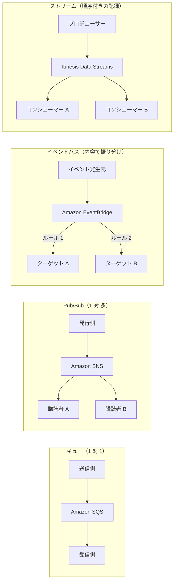
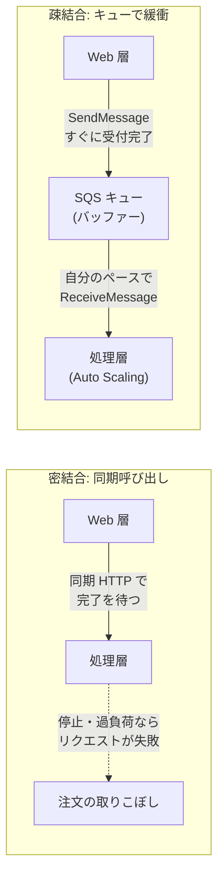
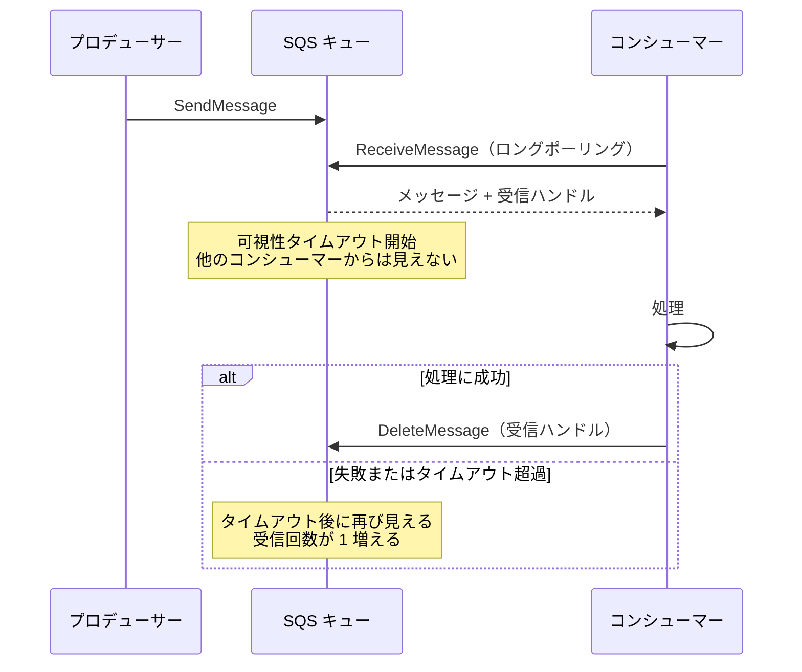
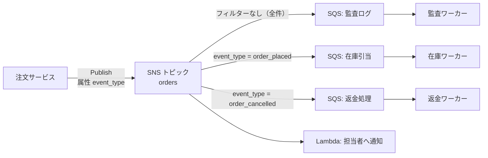
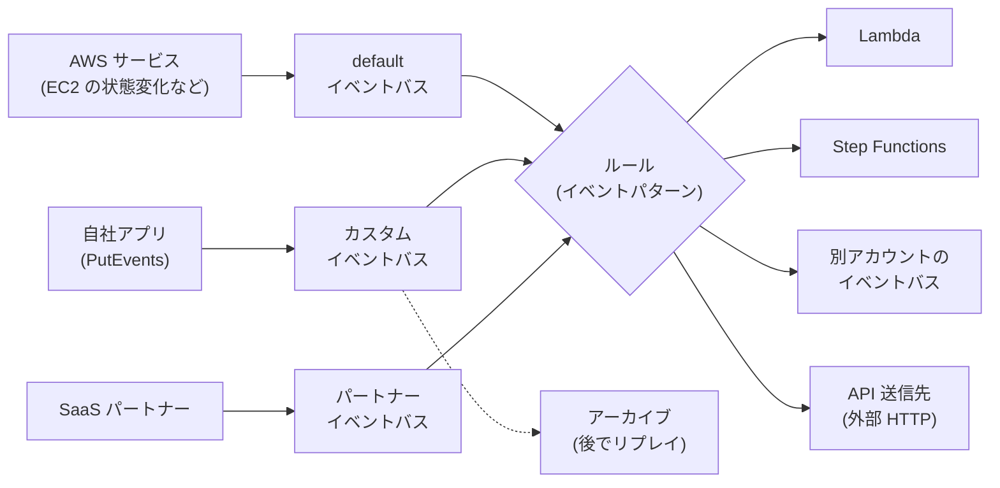
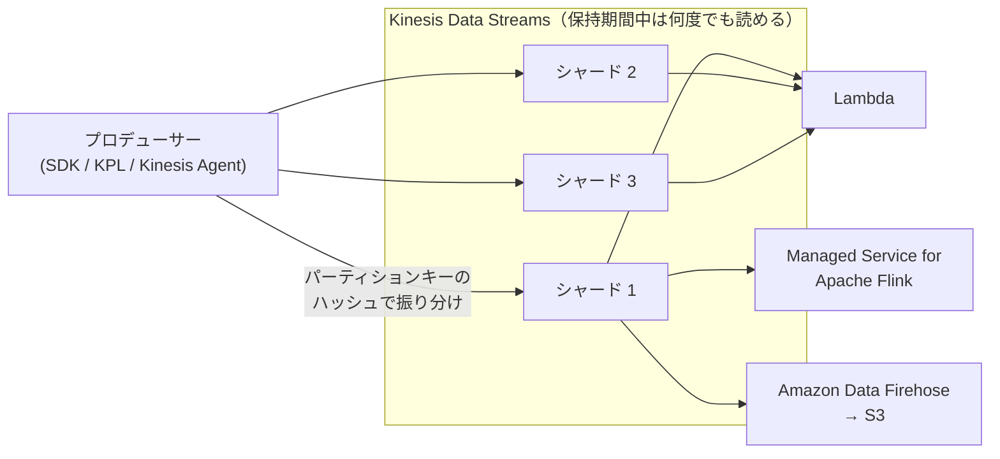
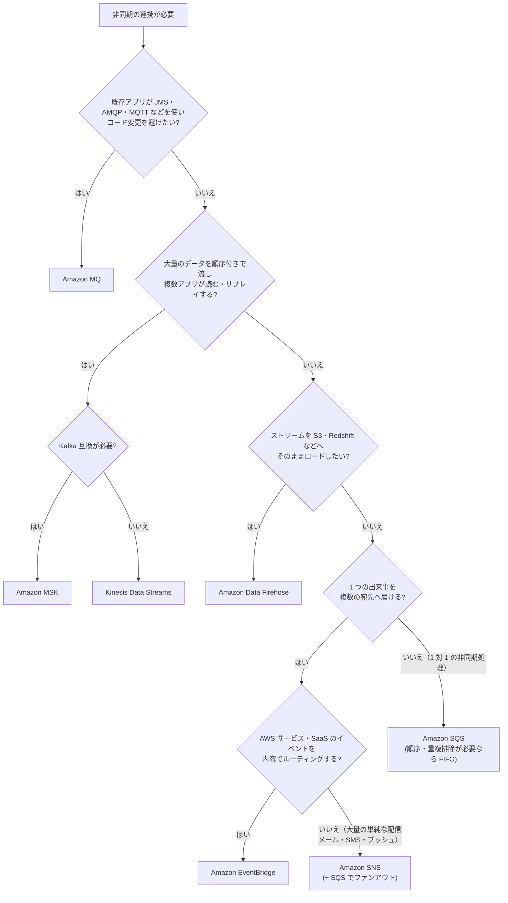

[ホーム](../README.md) > [Phase 2: アソシエイト](README.md) > アプリケーション統合

# アプリケーション統合（SQS / SNS / EventBridge / Kinesis）

> **この章のゴール**
> - 密結合な構成の弱点と、キューやイベントで「疎結合」にする意義を説明できる
> - SQS の標準キューと FIFO キューを、順序・重複・スループットの要件から選べる
> - 可視性タイムアウト、DLQ、ロングポーリング、遅延キューの意味と設定値を説明できる
> - SNS + SQS のファンアウトとメッセージフィルタリングを設計できる
> - EventBridge（ルール・Scheduler・Pipes・アーカイブとリプレイ）でイベント駆動の構成を組める
> - Kinesis Data Streams / Amazon Data Firehose / Amazon MSK / Amazon MQ を要件から使い分けられる
>
> **対応試験**: SAA-C03（D2: 弾力性に優れたアーキテクチャの設計、D3: 高性能なアーキテクチャの設計）／SAP-C03 の前提知識
> **目安時間**: 5 時間（読む 3.5 時間 / 確認問題 1 時間 / 復習 30 分）

## この章の全体像

Web アプリケーションが成長すると、「注文を受け付ける」「在庫を引き当てる」「メールを送る」「分析基盤にデータを流す」といった処理が増えていきます。これらを互いに同期的に呼び出し合うと、1 か所の遅延や障害がシステム全体に波及します。

この章では、コンポーネント同士を**直接つながずに、間にメッセージやイベントを置く**ためのサービスを学びます。AWS のアプリケーション統合サービスは、次の 4 つの型に分けると整理しやすくなります。



| 型 | 代表サービス | ひとことで言うと |
|---|---|---|
| キュー | Amazon SQS、Amazon MQ | 仕事を「ためて」、受信側が自分のペースで処理する |
| Pub/Sub | Amazon SNS | 1 つのメッセージを「コピーして」複数の購読者に一斉に届ける |
| イベントバス | Amazon EventBridge | イベントの「内容を見て」、ルールに合う宛先へ振り分ける |
| ストリーム | Amazon Kinesis Data Streams、Amazon MSK | 順序付きのデータを「記録し続け」、複数のアプリが何度でも読む |

> [!TIP]
> **試験のポイント**: 問題文に「疎結合（decouple）」「非同期」「スパイクを吸収」「メッセージを失わない」とあれば、まず SQS を候補にします。「複数のシステムに同じ通知を」なら SNS（+ SQS）、「AWS サービスや SaaS のイベントに反応」なら EventBridge、「リアルタイムのストリーミングデータ」なら Kinesis です。

## 1. 疎結合の意義

### 1.1 密結合の問題

注文サイトを例に考えます。Web 層が注文を受けると、処理層の API を同期的に呼び出し、決済と在庫引当が終わるのを待ってから画面に結果を返す構成です。この構成には次の問題があります。

- **障害が伝播する**: 処理層が停止・再起動中だと Web 層のリクエストも失敗し、注文を取りこぼします。
- **スパイクに弱い**: セール開始直後に注文が 10 倍になると処理層が追いつかず、タイムアウトが連鎖します。ピークに合わせて処理層を用意すると、平常時は無駄なコストになります。
- **変更しにくい**: 呼び出し先を増やす（例: ポイント付与処理を追加する）たびに、呼び出し元のコードを修正する必要があります。
- **独立してスケールできない**: どちらがボトルネックかに関係なく、両方を一緒に増強しがちです。

### 1.2 キューで緩衝する

間にキューを置くと、Web 層は「注文メッセージをキューに入れた時点」でユーザーに受付完了を返せます。処理層はキューから自分のペースでメッセージを取り出して処理します。



- 処理層が止まっても、メッセージはキューに残る（SQS なら最大 14 日）ため、復旧後に処理を再開できます。
- 急増した注文はキューにたまり（**バッファリング**）、処理層は Auto Scaling で徐々に追いつけば十分です。
- Web 層と処理層は、キューという「受け渡し口」だけを知っていればよく、互いの台数や IP アドレス、稼働状況を知る必要がありません。

これが**疎結合（loose coupling）**です。AWS Well-Architected Framework の信頼性の柱にも「疎結合の依存関係を実装する」というベストプラクティスがあり、障害の影響範囲を小さくする基本手段とされています（[第 17 章](17-well-architected.md)）。

### 1.3 同期・非同期、メッセージ・イベント

| 用語 | 意味 | 例 |
|---|---|---|
| 同期 | 呼び出し元が応答を待つ | API Gateway → Lambda → 結果を返す |
| 非同期 | 呼び出し元は依頼したらすぐ次へ進む | 注文をキューに入れて「受付完了」を返す |
| メッセージ（コマンド） | 「これを処理して」という特定の相手への依頼 | 「注文 123 の請求書を作成せよ」 |
| イベント | 「〜が起きた」という事実の通知。発行側は誰が受け取るかを知らない | 「注文 123 が作成された」 |

キュー（SQS）は「処理してほしい仕事」を確実に渡すのに向き、Pub/Sub（SNS）やイベントバス（EventBridge）は「起きた事実」を関心のある複数の相手に知らせるのに向きます。

> [!NOTE]
> 複数の処理を順番に呼び出す「司令塔」を置く方式を**オーケストレーション**（例: AWS Step Functions）、各サービスがイベントに反応して自律的に動く方式を**コレオグラフィ**（例: EventBridge）と呼びます。Step Functions は[第 10 章 サーバーレス](10-serverless.md)で扱います。

## 2. Amazon SQS（Simple Queue Service）

Amazon Simple Queue Service（Amazon SQS）は、フルマネージドのメッセージキューです。サーバーの管理は不要で、キューを作成すればすぐに使え、事実上無制限にスケールします。AWS で最も歴史のあるサービスの 1 つで、疎結合の定番です。

### 2.1 基本の流れ: 送信 → 受信 → 削除

SQS の最大の特徴は、**受信しただけではメッセージが消えない**ことです。

1. プロデューサー（送信側）が `SendMessage` でメッセージを送る
2. コンシューマー（受信側）が `ReceiveMessage` で取得する（1 回で最大 10 件）。このとき**受信ハンドル**が返される
3. 取得されたメッセージは、**可視性タイムアウト**の間、他のコンシューマーから見えなくなる
4. 処理が成功したら、コンシューマーが受信ハンドルを指定して `DeleteMessage` で削除する
5. 削除されないまま可視性タイムアウトが切れると、メッセージは再び見えるようになり、別のコンシューマー（または同じコンシューマー）が再度受信する



この仕組みにより、コンシューマーが処理の途中でクラッシュしてもメッセージは失われず、タイムアウト後に再処理されます。一方で、**同じメッセージが 2 回以上処理される可能性**があるため、コンシューマーは**冪等（べきとう）**に作るのが原則です（例: 注文 ID ごとに処理済みかを DynamoDB に記録し、2 回目は何もしない）。

> [!IMPORTANT]
> SQS は**プル型**です。SQS がコンシューマーにメッセージを「押し込む」ことはありません。EC2 やコンテナ上のワーカーがポーリングするか、Lambda の**イベントソースマッピング**（Lambda サービスが代わりにポーリングする仕組み。[第 10 章](10-serverless.md)で解説）を使います。

### 2.2 標準キューと FIFO キュー

| 観点 | 標準キュー | FIFO キュー |
|---|---|---|
| 配信 | **少なくとも 1 回**（まれに重複あり） | **1 回だけ処理**（重複排除あり） |
| 順序 | ベストエフォート（入れ替わることがある） | **メッセージグループ内で厳密に先入れ先出し** |
| スループット | ほぼ無制限 | 標準キューより低い（下記） |
| キュー名 | 任意 | 末尾が `.fifo` であることが必須 |
| メッセージ単位の遅延（メッセージタイマー） | 使える | 使えない（キュー単位の遅延のみ） |
| 向いている処理 | 順序が問題にならない大量処理（画像変換、メール送信） | 順序と重複排除が重要な処理（決済、在庫の増減、コマンドの逐次実行） |

FIFO キューのスループットは、バッチなしで 1 秒あたり 300 件（`SendMessage`・`ReceiveMessage`・`DeleteMessage` の API アクション単位）、バッチ（1 回 10 件まで）を使うと 1 秒あたり 3,000 件です。**高スループットモード**を有効にすると、処理がメッセージグループごとに分散され、さらに高いスループットになります（上限はリージョンによって異なります。2026年9月時点の値は[公式ドキュメント](https://docs.aws.amazon.com/AWSSimpleQueueService/latest/SQSDeveloperGuide/high-throughput-fifo.html)を参照してください）。

> [!WARNING]
> **ひっかけ注意**: 既存の標準キューを FIFO キューに「変更」することはできません。FIFO が必要になったら、新しい FIFO キューを作成してアプリケーションの送信先を切り替えます。また「順序が必要」とあっても、非常に高いスループットが要件ならメッセージグループの設計（後述）と高スループットモード、あるいは Kinesis Data Streams を検討します。

> [!TIP]
> **試験のポイント**: 「順序どおりに」「重複なく（exactly-once）」→ FIFO キュー。「スループットを最大に」「順序は問わない」→ 標準キュー。

### 2.3 可視性タイムアウト

**可視性タイムアウト**は、受信されたメッセージを他のコンシューマーから隠しておく時間です。

- 既定値は **30 秒**、設定範囲は **0 秒〜12 時間**
- キュー単位で設定し、`ChangeMessageVisibility` でメッセージごとに延長・短縮もできる

設定の考え方はシンプルで、**「1 件の処理にかかる最大時間」より長くする**ことです。

| 設定 | 起きること |
|---|---|
| 短すぎる（処理に 2 分かかるのに 30 秒） | 処理中にメッセージが再び見えるようになり、別のワーカーも同じメッセージを処理する（**重複処理**） |
| 長すぎる（処理は 2 分なのに 12 時間） | ワーカーがクラッシュしたとき、再処理が始まるまで長時間待たされる（**処理の遅延**） |

処理時間が大きくばらつく場合は、可視性タイムアウトを平均よりやや長めにしておき、長引いた処理ではワーカーが定期的に `ChangeMessageVisibility` を呼んで延長する（ハートビート）のが定石です。

> [!TIP]
> **試験のポイント**: 「同じメッセージが複数回処理されている」「処理時間が可視性タイムアウトより長い」→ 可視性タイムアウトを処理時間より長くする。Lambda で SQS を処理する場合、AWS は可視性タイムアウトを**関数のタイムアウトの 6 倍以上**にすることを推奨しています（[第 10 章](10-serverless.md)）。

### 2.4 メッセージ保持期間とメッセージサイズ

- **保持期間**: 既定 **4 日**、設定範囲 **60 秒〜14 日**。期間を過ぎたメッセージは、処理されていなくても自動的に削除されます。
- **最大メッセージサイズ**: **1 MiB**（2026年9月時点。標準キュー・FIFO キューとも）。2025 年 8 月に 256 KiB から引き上げられました。

> [!WARNING]
> **ひっかけ注意（古い教材との違い）**: 古い教材や過去の試験問題では「SQS の最大メッセージサイズは 256 KB」と説明されています。現在の上限は 1 MiB です。ただし、問題文が「256 KB を超えるメッセージ」を前提にしていても、正解の考え方（大きなデータは S3 に置き、参照を渡す）は変わりません。

上限を超えるデータ（例: 数十 MB の画像や PDF）を扱う場合は、**本体を S3 に保存し、メッセージには S3 のキー（参照）だけを入れる**のが定石です。これを自動化するのが **Amazon SQS 拡張クライアントライブラリ**（Java 版・Python 版）で、送信時にペイロードを S3 に置き、受信時に S3 から取り出す処理をライブラリが肩代わりします（最大 2 GB）。このような設計は Claim-Check パターンと呼ばれます。

料金は**リクエスト単位**で、ペイロード 64 KB ごとに 1 リクエストとして数えます（例: 256 KB のメッセージ 1 件は 4 リクエスト分）。1 回の API 呼び出しで最大 10 件をまとめる**バッチ操作**を使うと、リクエスト数と料金を減らせます。

### 2.5 ショートポーリングとロングポーリング

| 方式 | 動作 | 特徴 |
|---|---|---|
| ショートポーリング（待機時間 0 秒。既定） | 一部のサーバーだけを調べてすぐに応答する | メッセージがあっても空の応答が返ることがある。空振りの `ReceiveMessage` もリクエスト料金の対象 |
| ロングポーリング（待機時間 1〜20 秒） | メッセージが届くか待機時間が切れるまで応答を待ち、全サーバーを調べる | 空の応答と API 呼び出しの回数が減り、**コストと遅延を削減**できる |

ロングポーリングは、キュー属性 `ReceiveMessageWaitTimeSeconds` で既定値として設定するか、`ReceiveMessage` の呼び出しごとに `WaitTimeSeconds` を指定して有効にします。待機時間の最大は **20 秒**です。

> [!TIP]
> **試験のポイント**: 「空の応答（empty receives）が多い」「ポーリングのコストを下げたい」→ ロングポーリングを有効にする。

### 2.6 遅延キューとメッセージタイマー

**遅延キュー**は、キューに入ったメッセージを一定時間**受信できない状態にする**機能です（キュー属性 `DelaySeconds`、**0 秒〜15 分**）。標準キューでは、送信時にメッセージごとの遅延を指定する**メッセージタイマー**も使えます（こちらも最大 15 分）。

用途の例: 「注文から 5 分後に在庫を再確認する」「外部システムへの反映を待ってから処理する」。

> [!WARNING]
> **ひっかけ注意**: 遅延キューと可視性タイムアウトは、どちらも「見えなくする」機能ですが、タイミングが違います。
> - 遅延キュー: メッセージが**キューに入った直後**に隠す（まだ誰も受信していない）
> - 可視性タイムアウト: メッセージが**受信された後**に隠す（処理中の保護）
>
> また、15 分を超える待機（例: 3 日後にリマインドを送る）は遅延キューでは実現できません。EventBridge Scheduler の 1 回限りのスケジュールや、Step Functions の Wait 状態を使います。

### 2.7 デッドレターキュー（DLQ）と再処理

何度処理しても失敗するメッセージ（形式が不正なデータやバグを踏むデータ。**ポイズンメッセージ**と呼ばれます）を放っておくと、可視性タイムアウトのたびに再受信され、ワーカーの時間と料金を浪費し続けます。これを隔離するのが**デッドレターキュー（DLQ）**です。

- 元のキュー（ソースキュー）に**リドライブポリシー**を設定し、DLQ の ARN と **`maxReceiveCount`**（最大受信回数）を指定する
- メッセージの受信回数が `maxReceiveCount` を超えると、SQS がそのメッセージを DLQ に移動する
- DLQ 自体も普通の SQS キューで、ソースキューと**同じ種類**（標準なら標準、FIFO なら FIFO）かつ**同じアカウント・同じリージョン**に作成する
- DLQ 側の**リドライブ許可ポリシー**で、どのソースキューがその DLQ を使えるかを制限できる

原因を調べて修正したら、**DLQ リドライブ**（コンソール、または `StartMessageMoveTask` API）で DLQ のメッセージをソースキュー（または別のキュー）に戻して再処理します。

> [!IMPORTANT]
> 標準キューでは、メッセージの有効期限は**最初にキューに入った時刻**を基準に計算され、DLQ に移動しても基準はリセットされません。そのため DLQ の保持期間は**ソースキューより長く**設定するのがベストプラクティスです（例: ソースキュー 4 日 → DLQ 14 日）。

設計上の注意点:

- `maxReceiveCount` を 1 のように小さくしすぎると、一時的なエラー（下流 API のタイムアウトなど）でもすぐに DLQ に入ってしまいます。3〜5 回程度から始めて調整します。
- FIFO キューで DLQ を使うと、失敗したメッセージだけがグループの順序から外れます。厳密な順序が業務上必須なら、DLQ に移った時点で後続メッセージをどう扱うかを決めておく必要があります。
- DLQ の `ApproximateNumberOfMessagesVisible` に CloudWatch アラームを設定し、「DLQ に 1 件でも入ったら通知する」のが運用の定番です。

> [!TIP]
> **試験のポイント**: 「処理に失敗し続けるメッセージを分離して後で調査したい」→ DLQ（リドライブポリシーと `maxReceiveCount`）。「修正後に再処理したい」→ DLQ リドライブ。

### 2.8 FIFO キューの詳細: メッセージグループ ID と重複排除

**メッセージグループ ID**（`MessageGroupId`。FIFO キューでは必須）

- 同じグループ ID のメッセージは、送信順に 1 件ずつ処理されます。あるメッセージが処理中（可視性タイムアウト中）の間、同じグループの後続メッセージは受信されません。
- 異なるグループ同士は**並行して**処理できます。
- したがって、グループ ID には「順序を守りたい単位」を選びます（例: 口座 ID、注文 ID、デバイス ID）。全メッセージに同じグループ ID を付けると、キュー全体で 1 件ずつしか処理できず、スループットが出ません。

**重複排除**（重複排除間隔は **5 分**）

- 送信時に**重複排除 ID**（`MessageDeduplicationId`）を指定すると、同じ ID のメッセージが 5 分以内に再送されても、2 件目以降は送信成功として受け付けられるもののキューには入りません。
- キューで**コンテンツベースの重複排除**を有効にすると、メッセージ本文の SHA-256 ハッシュが重複排除 ID として自動的に使われます。
- ネットワークエラーで送信側がリトライしても重複しないため、「1 回だけ処理（exactly-once processing）」を実現できます。

**高スループットモード**

- 重複排除のスコープを「メッセージグループ」に、スループットの上限を「メッセージグループ ID ごと」に設定して有効にします。
- グループ ID の種類が多いほど並列度が上がります。

> [!TIP]
> **試験のポイント**: 「顧客ごとに順序を保ちつつ、全体としては並列に処理したい」→ FIFO キュー + 顧客 ID をメッセージグループ ID にする。

### 2.9 セキュリティ

- **保存時の暗号化**: SSE-SQS（SQS が管理するキー。新規キューでは既定で有効）または SSE-KMS（AWS KMS のキー。キーの利用を CloudTrail で監査したい、キーポリシーで制御したい場合）
- **転送時の暗号化**: HTTPS エンドポイントを使う。キューポリシーで `aws:SecureTransport` 条件を使うと、暗号化されていないリクエストを拒否できる
- **アクセス制御**: IAM ポリシーに加えて、キューに**アクセスポリシー（リソースベースのポリシー）**を設定できる。**別アカウント**からの送信や、**SNS トピック・S3 イベント通知・EventBridge** からの送信を許可するときに使う
- **プライベート接続**: VPC 内のワーカーは、**インターフェイス VPC エンドポイント**（AWS PrivateLink）経由でインターネットを通らずに SQS にアクセスできる（[第 2 章 VPC](02-vpc.md)）

> [!WARNING]
> **ひっかけ注意**: S3 イベント通知の送信先に **FIFO キューは指定できません**（標準キューのみ）。また、SSE-KMS で暗号化したキューに SNS や S3 から送信させる場合は、KMS のキーポリシーでそのサービスに `kms:GenerateDataKey` と `kms:Decrypt` を許可する必要があります。AWS マネージドキー（`aws/sqs`）はキーポリシーを変更できないため、この用途ではカスタマーマネージドキーを使います。

### 2.10 SQS のメッセージ数に応じた Auto Scaling

EC2 のワーカー群でキューを処理する場合は、**キューの滞留量に応じてワーカー数を増減**させます。CPU 使用率はキューの滞留を正しく表しません（外部 API の応答待ちが多いワーカーは、CPU 使用率が低いまま処理が遅れます）。

単純に `ApproximateNumberOfMessagesVisible`（キューに滞留しているメッセージ数）をしきい値にすると、現在のワーカー台数を考慮できません。AWS が推奨するのは、**インスタンスあたりのバックログ（backlog per instance）**をメトリクスとして算出し、ターゲット追跡スケーリングに使う方法です。

```text
インスタンスあたりのバックログ = ApproximateNumberOfMessagesVisible ÷ InService のインスタンス数
目標値 = 許容できる遅延 ÷ 1 メッセージの平均処理時間
例: 1 件を 0.1 秒で処理でき、10 秒以内に処理したい → 目標値 = 10 ÷ 0.1 = 100
```

この目標値（100）を保つように、Auto Scaling グループがインスタンス数を自動で調整します。滞留が 1,000 件ならインスタンスはおよそ 10 台に増え、滞留がなくなれば減ります。

> [!TIP]
> **試験のポイント**: 「SQS キューの長さに応じて EC2 ワーカーをスケール」→ SQS のメトリクス（`ApproximateNumberOfMessagesVisible`、推奨はインスタンスあたりのバックログ）に基づく Auto Scaling。コンテナなら ECS Service Auto Scaling、Lambda ならイベントソースマッピングが自動でスケールします。滞留の「古さ」を監視するなら `ApproximateAgeOfOldestMessage` が有用です。

Auto Scaling の仕組みは[第 4 章](04-elb-auto-scaling.md)を参照してください。

### 2.11 SQS の数値まとめ

| 項目 | 値（2026年9月時点） |
|---|---|
| 最大メッセージサイズ | 1 MiB（2025 年 8 月に 256 KiB から引き上げ）。超える場合は拡張クライアントライブラリ + S3 |
| メッセージ保持期間 | 既定 4 日、60 秒〜14 日 |
| 可視性タイムアウト | 既定 30 秒、0 秒〜12 時間 |
| ロングポーリングの待機時間 | 1〜20 秒（0 秒はショートポーリング） |
| 遅延キュー / メッセージタイマー | 0 秒〜15 分（メッセージタイマーは標準キューのみ） |
| 1 回の受信・バッチ操作の件数 | 最大 10 件 |
| FIFO の重複排除間隔 | 5 分 |
| FIFO のスループット | バッチなし 300 件/秒（API アクション単位）、バッチで 3,000 件/秒、高スループットモードでさらに高い |

最新のクォータは [Amazon SQS のクォータ](https://docs.aws.amazon.com/AWSSimpleQueueService/latest/SQSDeveloperGuide/sqs-quotas.html)で確認してください。

## 3. Amazon SNS（Simple Notification Service）

### 3.1 Pub/Sub の仕組み

Amazon Simple Notification Service（Amazon SNS）は、フルマネージドの **Pub/Sub（発行/購読）**サービスです。

- **トピック**: メッセージの宛先となる論理的なチャネル
- **パブリッシャー**: トピックに `Publish` する側。誰が購読しているかは知らない
- **サブスクリプション**: トピックと配信先（エンドポイント）の対応付け。1 つのトピックに多数のサブスクリプションを付けられる

パブリッシャーが 1 回発行すると、SNS がすべてのサブスクリプションへメッセージを**プッシュ**します。SQS と違って SNS はメッセージを保持しないため、受信側が「後から取りに来る」ことはできません。

### 3.2 サブスクリプションのプロトコル

| 種類 | 配信先 | 主な用途 |
|---|---|---|
| アプリケーション間（A2A） | Amazon SQS、AWS Lambda、HTTP/HTTPS エンドポイント、Amazon Data Firehose | システム間連携、ファンアウト、S3 へのアーカイブ |
| アプリケーションから人（A2P） | メール（Email / Email-JSON）、SMS、モバイルプッシュ（APNs、FCM など） | 運用者への通知、エンドユーザーへの通知 |

> [!TIP]
> **試験のポイント**: CloudWatch アラームの通知先など、**運用者へのメール・SMS 通知**は SNS が定番です。

### 3.3 ファンアウト（SNS + SQS）

**ファンアウト**は、1 つのイベントを SNS トピックに発行し、複数の SQS キューがそれを購読する構成です。各キューの先で、別々のシステムが独立して処理します。



SNS と SQS を組み合わせる理由は次のとおりです。

- **独立性**: 在庫処理が停止していても、監査ログや返金処理には影響しない
- **耐久性とバッファリング**: SNS は保持しないが、各 SQS キューが最大 14 日保持し、受信側のペースで処理できる
- **リトライの独立**: 失敗したキューだけが再処理し、DLQ もキューごとに持てる
- **拡張性**: 新しい処理を追加するときは、キューを作ってトピックを購読させるだけ（発行側の変更は不要）

設定時の注意:

- SQS キューの**アクセスポリシー**で、SNS（`sns.amazonaws.com`）からの `sqs:SendMessage` を、`aws:SourceArn` 条件でそのトピックに限定して許可する
- SQS 側で SNS のメタデータ（JSON のエンベロープ）が不要なら、**raw メッセージ配信**を有効にする
- トピックとキューが別アカウント・別リージョンにあっても購読できる

> [!TIP]
> **試験のポイント**: 「1 つのイベントを複数のシステムで**独立して**処理したい」「後から処理を追加しやすくしたい」→ SNS トピック + 複数の SQS キュー（ファンアウト）。S3 イベント通知は、同じイベントタイプでプレフィックス/サフィックスが重複する設定を複数の送信先に作れないため、1 つのイベントを複数の処理に配るときは S3 → SNS → 複数の SQS（または S3 → EventBridge）にします。

### 3.4 メッセージフィルタリング

既定では、すべてのサブスクライバーがトピックの全メッセージを受け取ります。サブスクリプションに**フィルターポリシー**（JSON）を設定すると、条件に合うメッセージだけを受け取れます。受信側で不要なメッセージを捨てる処理が不要になり、コストも下がります。

```json
{
  "event_type": ["order_placed"],
  "amount": [{ "numeric": [">=", 10000] }],
  "store": [{ "anything-but": ["test-store"] }]
}
```

- **フィルターポリシーのスコープ**: メッセージ属性（`MessageAttributes`。既定）を対象にするか、メッセージ本文（`MessageBody`。JSON のペイロード）を対象にするかを選べる
- 完全一致、プレフィックス一致、数値の範囲、`anything-but`（否定）、`exists`（属性の有無）などの演算子を使える
- 1 つの属性に複数の値を並べると OR、異なる属性同士は AND として評価される

> [!TIP]
> **試験のポイント**: 「サブスクライバーごとに必要なメッセージだけを受け取らせたい」「トピックを種類ごとに分けずに済ませたい」→ SNS のメッセージフィルタリング（フィルターポリシー）。

### 3.5 FIFO トピック

**SNS FIFO トピック**は、SQS FIFO キューと組み合わせて**順序付きのファンアウト**を実現します。

- メッセージグループ ID ごとに厳密な順序を保ち、重複排除 ID（またはコンテンツベースの重複排除）で重複を除く
- 配信先は SQS キュー（順序を保ったまま処理するには SQS FIFO キューを購読させる）
- トピック名の末尾は `.fifo`。スループットは標準トピックより低い

例: 商品の価格変更イベントを、価格表示・在庫・分析の各システムに**変更順どおり**に届けたい場合に使います。

### 3.6 配信の信頼性とメッセージサイズ

- SNS は配信に失敗すると、プロトコルごとの**配信ポリシー**に従って再試行します。SQS や Lambda のような AWS のエンドポイントには長期間にわたって再試行し、HTTP/HTTPS エンドポイントでは再試行の回数や間隔をカスタマイズできます。
- それでも配信できなかったメッセージは、サブスクリプションに設定した **DLQ（SQS キュー）**に退避できます。DLQ がないと、そのメッセージは失われます。
- **メッセージサイズ**: 従来の上限は 256 KiB でした。2026 年 9 月から、トピック属性 `MaximumMessageSize` を設定すると、標準トピック・FIFO トピックとも**最大 1 MiB** のペイロードを発行できます（対象は SQS・Lambda・Amazon Data Firehose のサブスクリプションなど、条件があります。[公式の発表](https://aws.amazon.com/about-aws/whats-new/2026/09/amazon-sns-1mib-support/)を参照）。さらに大きなデータは、SQS と同様に **SNS 拡張クライアントライブラリ**で S3 経由にします（[大きなメッセージの発行](https://docs.aws.amazon.com/sns/latest/dg/large-message-payloads.html)）。
- **暗号化**: AWS KMS による保存時の暗号化（SSE）に対応します。CloudWatch アラームや S3 などの AWS サービスから暗号化されたトピックに発行させるには、カスタマーマネージドキーのキーポリシーでそのサービスを許可します。

> [!NOTE]
> SNS の 1 MiB 対応は 2026 年 9 月の変更のため、試験や多くの教材では「SNS の最大メッセージサイズは 256 KB」と説明されています。「大きなデータは S3 に置いて参照を渡す」という考え方を押さえておけば、どちらの前提でも正解を選べます。

### 3.7 SQS と SNS の比較

| 観点 | SQS | SNS |
|---|---|---|
| モデル | キュー（プル型） | Pub/Sub（プッシュ型） |
| 受信者 | 1 件のメッセージは 1 つのコンシューマーが処理 | 全サブスクライバーにコピーを配信 |
| メッセージの保持 | 最大 14 日 | 保持しない（再試行し、失敗分はサブスクリプションの DLQ へ） |
| 受信側が停止中 | キューにたまり、復旧後に処理される | 再試行が尽きると失われる（DLQ がない場合） |
| 典型的な用途 | 非同期処理、負荷の平準化 | 通知、ファンアウト |

## 4. Amazon EventBridge

Amazon EventBridge は、**イベントバス**を中心としたサーバーレスのイベントルーターです。AWS サービス・自社アプリケーション・SaaS から届くイベントを、ルールに従って適切な宛先に振り分けます。以前の **Amazon CloudWatch Events** を拡張したサービスで、同じ API を引き継いでいます（古い教材の「CloudWatch Events」は EventBridge と読み替えてください）。



### 4.1 イベントとイベントバス

イベントは次のような JSON です。

```json
{
  "version": "0",
  "id": "6a7e8feb-b491-4cf7-a9f1-bf3703467718",
  "detail-type": "EC2 Instance State-change Notification",
  "source": "aws.ec2",
  "account": "111122223333",
  "time": "2026-09-28T01:23:45Z",
  "region": "ap-northeast-1",
  "resources": ["arn:aws:ec2:ap-northeast-1:111122223333:instance/i-0123456789abcdef0"],
  "detail": {
    "instance-id": "i-0123456789abcdef0",
    "state": "stopped"
  }
}
```

| バスの種類 | 受け取るイベント | 例 |
|---|---|---|
| default イベントバス | AWS サービスのイベント（各アカウントに最初から存在） | EC2 の状態変化、GuardDuty の検出結果、S3 のオブジェクト作成（EventBridge 通知を有効にした場合） |
| カスタムイベントバス | 自社アプリが `PutEvents` で送るイベント | 「注文が作成された」 |
| パートナーイベントバス | SaaS パートナーからのイベント | Zendesk や Auth0 などのイベント |

1 件のイベントの最大サイズは **1 MB** です（2026年9月時点。従来は 256 KB で、Lambda の非同期呼び出しや SQS とあわせて引き上げられました。[AWS ブログ](https://aws.amazon.com/blogs/compute/more-room-to-build-serverless-services-now-support-payloads-up-to-1-mb/)）。

### 4.2 ルールとターゲット

**ルール**は、バスに届いたイベントのうち**イベントパターン**に一致するものを選び、**ターゲット**に送ります。

```json
{
  "source": ["aws.ec2"],
  "detail-type": ["EC2 Instance State-change Notification"],
  "detail": {
    "state": ["stopped", "terminated"]
  }
}
```

このパターンは「EC2 インスタンスが停止または終了した」イベントだけに一致します。完全一致のほか、プレフィックス、数値の範囲、`anything-but`、`exists`、IP アドレスの範囲などで条件を書けます。

- 1 つのルールに**最大 5 つのターゲット**を設定できる
- 主なターゲット: Lambda、SQS、SNS、Step Functions、Kinesis Data Streams、Amazon Data Firehose、ECS タスク、AWS Batch、CodePipeline、Systems Manager（Run Command / Automation）、CloudWatch Logs、**別のイベントバス**、**API 送信先**
- **入力トランスフォーマー**で、イベントから必要な項目だけを取り出し、ターゲットに渡す形式を変えられる
- 配信は**少なくとも 1 回**で、順序は保証されない
- ターゲットへの配信に失敗すると、既定で最大 24 時間・185 回まで再試行する（再試行ポリシーは変更できる）。最終的に失敗したイベントは、ターゲットごとに設定した **DLQ（SQS キュー）**に送れる

> [!TIP]
> **試験のポイント**: 「EC2 インスタンスが終了したら通知」「GuardDuty の検出結果が出たら自動で修復」「S3 にオブジェクトが作成されたら Step Functions を起動」のように、**AWS サービスで何かが起きたことをきっかけに処理する**なら EventBridge のルールです。

### 4.3 EventBridge Scheduler

**EventBridge Scheduler** は、スケジュールに従ってターゲットを呼び出すフルマネージドのスケジューラーです。

- **1 回限り**（例: `at(2026-10-01T09:00:00)`）と**定期実行**（例: `rate(5 minutes)`、`cron(0 9 ? * MON-FRI *)`）の両方に対応
- **タイムゾーン**を指定でき、夏時間も考慮される
- **フレキシブルタイムウィンドウ**で、実行時刻を一定の幅の中に分散できる（大量の処理が同時刻に集中するのを避ける）
- Lambda・SQS・Step Functions などのほか、**ユニバーサルターゲット**で多くの AWS サービスの API を直接呼び出せる（例: 毎晩 EC2 の `StopInstances` を呼ぶ）
- 大量のスケジュールを扱え、再試行ポリシーと DLQ も設定できる

EventBridge には以前から「スケジュール式を使うルール」もありますが、UTC でしか指定できないなど機能が限られます。新しく作る定期処理には Scheduler が推奨されています。

> [!TIP]
> **試験のポイント**: 「cron ジョブを実行するためだけに EC2 インスタンスを常時起動している」→ EventBridge Scheduler（またはスケジュールルール）+ Lambda / ECS タスクに置き換え、コストと運用負荷を下げる。

### 4.4 EventBridge Pipes

**EventBridge Pipes** は、**1 つのソースから 1 つのターゲットへ**、ポイントツーポイントでイベントを流す機能です。ソースのポーリング、フィルタリング、エンリッチメント（情報の付加）、ターゲットへの送信を、コードを書かずに構成できます。

| 段階 | 役割 | 主な選択肢 |
|---|---|---|
| ソース | Pipes がポーリングしてイベントを取り出す | SQS、Kinesis Data Streams、DynamoDB Streams、Amazon MQ、Amazon MSK、セルフマネージド Apache Kafka |
| フィルター（任意） | 条件に合うイベントだけを通す | イベントパターン |
| エンリッチメント（任意） | 情報を付加・変換する | Lambda、Step Functions（Express ワークフロー）、API Gateway、API 送信先 |
| ターゲット | 最終的な送り先 | Step Functions、Lambda、SQS、SNS、イベントバス、Firehose、ECS タスクなど |

例: DynamoDB Streams の変更データのうち「ステータスが shipped になった注文」だけを取り出し、Lambda で顧客情報を付加してから Step Functions を起動する。従来は「ポーリングして転送するだけの Lambda 関数」を書いていた部分を置き換えられます。

> [!NOTE]
> ルール（イベントバス）は「多数のソース → 多数のターゲット」への振り分け、Pipes は「1 つのソース → 1 つのターゲット」の連結、と覚えると区別しやすくなります。

### 4.5 スキーマレジストリ

EventBridge は、イベントの構造（スキーマ）を**スキーマレジストリ**に保存します。AWS サービスのイベントのスキーマは最初から登録されており、カスタムイベントバスで**スキーマ検出**を有効にすると、流れてきたイベントから自動でスキーマを推測して登録します。スキーマからは Java・Python・TypeScript などの**コードバインディング**を生成でき、開発者はイベントの型を意識したコードを書けます。

### 4.6 アーカイブとリプレイ

イベントバスに**アーカイブ**を作成すると、バスに届いたイベント（全件、またはイベントパターンで絞り込んだもの）を保存できます。保持期間は日数で指定するか、無期限にできます。保存したイベントは**リプレイ**で同じイベントバスに再送できるため、次のような用途に使います。

- 障害で処理できなかった時間帯のイベントを、修正後に再処理する
- 新しいターゲットを追加したときに、過去のイベントで動作を確認する

### 4.7 クロスアカウント・クロスリージョン

- ルールのターゲットに**別アカウントのイベントバス**を指定できます。受信側のバスには、送信元アカウント（または組織全体。`aws:PrincipalOrgID` 条件）からの `events:PutEvents` を許可する**リソースベースのポリシー**を設定します。
- 同様に、**別リージョンのイベントバス**もターゲットにできます。
- 典型例は、組織内の全アカウントのセキュリティ関連イベント（GuardDuty の検出結果など）を、**セキュリティ用アカウントの中央イベントバス**に集約する構成です。

> [!NOTE]
> SAP レベルでは、2 つのリージョン間でイベントの受け付けをフェイルオーバーする**グローバルエンドポイント**も登場します（[Phase 3 クラウドネイティブ設計](../03-professional/08-cloud-native-architecture.md)）。

### 4.8 API 送信先

**API 送信先（API destinations）**を使うと、EventBridge から**外部の HTTP エンドポイント**（SaaS の Webhook や社内 API）を直接呼び出せます。

- **接続（connection）**に認証方式（API キー、Basic 認証、OAuth のクライアント認証情報）を定義する。認証情報は AWS Secrets Manager に保存される
- 呼び出しレート（1 秒あたりの呼び出し数の上限）を設定でき、相手の API を過負荷にしない
- 入力トランスフォーマーで、相手の API が期待する形式に変換できる

「イベントを外部の SaaS に通知するだけの Lambda 関数」を書かずに済むため、コードと運用の手間が減ります。

### 4.9 SNS と EventBridge の使い分け

| 観点 | SNS | EventBridge |
|---|---|---|
| 主な用途 | 大量・高速なファンアウト、人への通知（メール・SMS・モバイルプッシュ） | AWS サービス・SaaS・自社アプリのイベントのルーティング |
| フィルタリング | サブスクリプションごとのフィルターポリシー（属性または本文） | ルールのイベントパターン（本文の任意のフィールド、多彩な演算子） |
| 配信先 | SQS、Lambda、HTTP/HTTPS、メール、SMS、モバイルプッシュ、Firehose | 多数の AWS サービス、API 送信先、他アカウント・他リージョンのイベントバス |
| 配信先の数 | 1 トピックに大量のサブスクリプション | 1 ルールあたり最大 5 ターゲット（ルールを増やして対応） |
| 付加機能 | FIFO トピック | スキーマレジストリ、アーカイブとリプレイ、Scheduler、Pipes |

> [!TIP]
> **試験のポイント**: 「SaaS アプリケーションのイベントを取り込みたい」「AWS サービスの状態変化に反応したい」→ EventBridge。「大量のサブスクライバーに低レイテンシーで一斉配信」「SMS やメールで人に通知」→ SNS。

## 5. ストリーミング: Kinesis と Amazon MSK

### 5.1 キューとストリームの違い

| 観点 | キュー（SQS） | ストリーム（Kinesis Data Streams） |
|---|---|---|
| 読んだ後 | 削除する（1 件は 1 つのコンシューマーが処理） | 削除しない。**保持期間中は複数のアプリが何度でも**読める |
| 順序 | 標準: 保証なし / FIFO: グループ内で保証 | **シャード内で厳密に保証** |
| スケールの単位 | 意識不要（自動） | シャード（オンデマンドモードなら自動） |
| 典型的な用途 | 仕事の分配 | クリックストリーム、IoT、ログ、リアルタイム分析 |

### 5.2 Amazon Kinesis Data Streams



**シャード**は、ストリームのスループットの単位です（プロビジョンドモードの場合）。

| 項目 | 値（1 シャードあたり） |
|---|---|
| 書き込み | **1 MB/秒 または 1,000 レコード/秒** |
| 読み取り（共有） | **2 MB/秒**（全コンシューマーで共有。`GetRecords` の呼び出しは 1 秒あたり 5 回まで） |
| 読み取り（拡張ファンアウト） | **コンシューマーごとに 2 MB/秒**（HTTP/2 でプッシュ） |

**パーティションキーと順序性**

- プロデューサーは、レコードに**パーティションキー**を付けて書き込みます。キーのハッシュ値によって、どのシャードに入るかが決まります。
- 同じパーティションキーのレコードは同じシャードに入り、**シャード内ではシーケンス番号の順に**読み出されます。例えばデバイス ID をキーにすると、デバイスごとの順序が保たれます。
- 特定のキーにデータが集中すると、1 つのシャードだけが上限に達します（**ホットシャード**）。値の種類が多いキーを選びます。
- 上限を超えると `ProvisionedThroughputExceededException` が返されます。対策は、指数バックオフでの再試行、シャードの追加（分割）、パーティションキーの見直しです。

**保持期間**

- 既定は **24 時間**で、最大 **365 日**まで延長できます（24 時間を超える分は追加料金）。
- 保持期間内であれば、過去のデータを**リプレイ（再処理）**できます。

**キャパシティモード**

| モード | 特徴 | 向いているケース |
|---|---|---|
| プロビジョンド | シャード数を自分で指定し、分割・結合で調整する。シャード時間で課金 | トラフィックが予測でき、コストを細かく管理したい |
| オンデマンド | キャパシティ計画が不要。書き込み量に応じて自動でスケールし、主にデータ量に応じて課金 | トラフィックが予測できない、新規のワークロード |

**コンシューマー**: Lambda（イベントソースマッピング）、Kinesis Client Library（KCL）で作った EC2・コンテナ上のアプリケーション、Amazon Data Firehose、Managed Service for Apache Flink など。KCL は DynamoDB のテーブルを使って、シャードの割り当てと読み取り位置（チェックポイント）を管理します。

> [!TIP]
> **試験のポイント**: 「リアルタイム（1 秒未満）」「複数のアプリケーションが同じデータを読む」「データを再処理（リプレイ）したい」「順序を保つ」→ Kinesis Data Streams。コンシューマーが増えて読み取りが足りない → **拡張ファンアウト**。

### 5.3 Amazon Data Firehose

**Amazon Data Firehose**（旧 Amazon Kinesis Data Firehose。2024 年 2 月に名称変更）は、ストリーミングデータを**保存先・分析先に届けること**に特化したフルマネージドの配信サービスです。

- シャードの管理は不要で、自動でスケールする。データ量に応じた従量課金
- **バッファリング**（サイズと時間）してからまとめて配信するため、**ニアリアルタイム**（設定により数秒〜数分の遅延）
- 配信前に **Lambda によるデータ変換**、JSON から **Apache Parquet / ORC への形式変換**、S3 への**動的パーティショニング**ができる
- 主な配信先: **Amazon S3**、**Amazon Redshift**（S3 を経由して COPY）、**Amazon OpenSearch Service**、Apache Iceberg テーブル、Splunk、Snowflake、HTTP エンドポイント、各種 SaaS
- 主なソース: Direct PUT（SDK や Kinesis Agent）、Kinesis Data Streams、Amazon MSK、CloudWatch Logs、AWS WAF のログ、SNS など
- **データを保持しない**ため、リプレイや複数コンシューマーでの再読はできない（配信に失敗したレコードは S3 にバックアップできる）

> [!TIP]
> **試験のポイント**: 「ストリーミングデータを**最小の運用で** S3 / Redshift / OpenSearch に**ロード**したい」「Parquet に変換して保存したい」→ Data Firehose。「1 秒未満のリアルタイム処理」「独自の処理を複数のアプリで」→ Kinesis Data Streams。

### 5.4 Amazon Managed Service for Apache Flink

**Amazon Managed Service for Apache Flink**（旧 Amazon Kinesis Data Analytics。2023 年 8 月に名称変更）は、オープンソースの **Apache Flink** アプリケーションをサーバー管理なしで実行するサービスです。

- Kinesis Data Streams や MSK のデータに対して、**ウィンドウ集計**（例: 直近 1 分間の売上合計）、異常検知、ストリーム同士の結合など、**状態を持つリアルタイム処理**を行う
- Java・Scala・Python・SQL で処理を記述できる
- 結果を Kinesis Data Streams、Firehose、S3、データベースなどに出力する

> [!WARNING]
> **ひっかけ注意**: 旧来の「Kinesis Data Analytics for SQL アプリケーション」は **2026 年 1 月 27 日に提供を終了**しました。古い教材の「SQL でストリームを分析するなら Kinesis Data Analytics」は、現在は Managed Service for Apache Flink（Flink SQL も利用可）と読み替えます。

### 5.5 Amazon MSK（Managed Streaming for Apache Kafka）

**Amazon MSK** は、**Apache Kafka** のクラスターを AWS が運用するマネージドサービスです。

- Kafka の API と互換性があるため、**既存の Kafka アプリケーションやツールをそのまま移行**できる
- ブローカーのインスタンスタイプや数を選ぶ**プロビジョンド**と、容量管理が不要な **MSK Serverless** がある
- **MSK Connect** で Kafka Connect のコネクターをマネージドで実行できる
- VPC 内にデプロイされ、ブローカーを複数の AZ に分散して高可用性を確保する

| 観点 | Kinesis Data Streams | Amazon MSK |
|---|---|---|
| API | AWS 独自 | Apache Kafka 互換 |
| データの単位 | ストリーム / シャード | トピック / パーティション |
| 運用 | 少ない（オンデマンドならキャパシティ管理も不要） | 設定の自由度が高い分、考慮点が多い（Serverless もある） |
| 保持期間 | 最大 365 日 | 設定次第（階層型ストレージで長期保持も可能） |
| 選ぶ理由 | AWS ネイティブで手早く構築したい | Kafka の資産やエコシステムを活かしたい、オンプレミスの Kafka から移行したい |

> [!TIP]
> **試験のポイント**: 「オンプレミスの Apache Kafka を移行」「Kafka 互換」→ MSK。「AWS ネイティブで最小の運用」→ Kinesis Data Streams（オンデマンドモード）。

分析基盤としての使い方（Firehose → S3 → Athena など）は[第 14 章 データ分析サービス](14-analytics.md)で扱います。

## 6. Amazon MQ

**Amazon MQ** は、オープンソースのメッセージブローカーである **Apache ActiveMQ** と **RabbitMQ** のマネージドサービスです。

SQS / SNS があるのに Amazon MQ が必要な理由は、**既存アプリケーションとの互換性**です。オンプレミスの業務システムの多くは、**JMS、AMQP、MQTT、STOMP、OpenWire** といった業界標準の API やプロトコルでメッセージブローカーとやり取りしています。これらを SQS / SNS に書き換えるにはアプリケーションの改修が必要です。Amazon MQ なら接続先をブローカーのエンドポイントに変えるだけで、**コードをほとんど変えずに**クラウドへ移行できます。

| 観点 | Amazon SQS / SNS | Amazon MQ |
|---|---|---|
| API・プロトコル | AWS 独自の API | JMS、AMQP、MQTT、STOMP、OpenWire などの業界標準 |
| スケール | ほぼ無制限・自動 | ブローカーのインスタンスサイズと構成に依存 |
| 運用 | サーバーレス | ブローカー（インスタンス）単位で管理（パッチ適用などは AWS が実施） |
| 向いているケース | クラウドネイティブな新規開発 | 既存アプリケーションの移行（リフト & シフト） |

**高可用性**: ActiveMQ は 2 つの AZ にまたがる**アクティブ/スタンバイ**構成（共有ストレージに Amazon EFS を使用）、RabbitMQ は複数の AZ にまたがる **3 ノードのクラスター**構成を選べます。

> [!TIP]
> **試験のポイント**: 「既存のアプリケーションが JMS / AMQP / MQTT を使っている」「コード変更を最小限にしてメッセージングを移行したい」→ Amazon MQ。「新規開発で、スケーラビリティと運用負荷の少なさを重視」→ SQS / SNS。

## 7. サービスの比較と選定フロー

| サービス | モデル | 配信 | 順序 | 保持・再読 | 代表的な用途 |
|---|---|---|---|---|---|
| SQS 標準キュー | キュー（プル型） | 少なくとも 1 回 | ベストエフォート | 最大 14 日。処理後に削除 | 非同期処理、負荷の平準化 |
| SQS FIFO キュー | キュー（プル型） | 1 回だけ処理 | グループ内で厳密 | 最大 14 日。処理後に削除 | 順序と重複排除が重要な処理 |
| SNS | Pub/Sub（プッシュ型） | 少なくとも 1 回（標準トピック） | 標準: なし / FIFO: あり | 保持しない | ファンアウト、通知（メール・SMS） |
| EventBridge | イベントバス（プッシュ型） | 少なくとも 1 回 | 保証なし | アーカイブからリプレイ可能 | AWS サービス・SaaS のイベント連携、スケジュール |
| Kinesis Data Streams | ストリーム | 少なくとも 1 回 | シャード内で厳密 | 24 時間〜365 日。何度でも再読 | リアルタイム処理、複数コンシューマー |
| Amazon Data Firehose | 配信パイプライン | 少なくとも 1 回 | ― | 保持しない | S3・Redshift・OpenSearch へのロード |
| Amazon MSK | ストリーム（Kafka） | 設定による | パーティション内で厳密 | 設定次第 | Kafka 互換、既存 Kafka の移行 |
| Amazon MQ | メッセージブローカー | プロトコル・設定による | キュー単位 | ブローカー上に保持 | JMS / AMQP / MQTT アプリの移行 |



> [!TIP]
> **試験のポイント（キーワード早見表）**
> - 「疎結合」「バッファー」「非同期」「スパイクを吸収」→ SQS
> - 「順序」「重複排除」「exactly-once」→ SQS FIFO（ファンアウトも必要なら SNS FIFO + SQS FIFO）
> - 「複数のサブスクライバーに同時配信」「メール / SMS で通知」→ SNS
> - 「AWS サービスのイベントに反応」「SaaS との連携」「スケジュール実行」→ EventBridge（Scheduler）
> - 「リアルタイムのストリーム」「リプレイ」「複数のアプリで同じデータを読む」→ Kinesis Data Streams
> - 「ストリームを S3 / Redshift に最小の運用でロード」→ Data Firehose
> - 「Kafka」→ MSK、「JMS / AMQP / MQTT を使う既存アプリ」→ Amazon MQ

## まとめ

- 疎結合の目的は、**障害の伝播を防ぎ、スパイクを吸収し、各コンポーネントを独立して変更・スケールできるようにする**こと。
- SQS は「受信 → 処理 → 削除」のプル型キュー。受信しただけでは消えず、**可視性タイムアウト**（既定 30 秒、最大 12 時間）が切れると再び見える。コンシューマーは冪等に作る。
- **標準キュー**は少なくとも 1 回・順序はベストエフォート・ほぼ無制限のスループット。**FIFO キュー**はメッセージグループ内の厳密な順序と 5 分間の重複排除。
- SQS の保持期間は既定 4 日・最大 14 日、最大メッセージサイズは **1 MiB**（旧教材では 256 KB）。それより大きいデータは**拡張クライアントライブラリ + S3**。
- **ロングポーリング**（最大 20 秒）で空の応答とコストを減らす。**遅延キュー**は最大 15 分。失敗し続けるメッセージは **DLQ** に隔離し、修正後に **DLQ リドライブ**で戻す。
- EC2 ワーカーは**インスタンスあたりのバックログ**を使ったターゲット追跡でスケールする。
- SNS は保持しない Pub/Sub。**SNS + SQS のファンアウト**で独立性と耐久性を両立し、**フィルターポリシー**で必要なメッセージだけを届ける。順序付きのファンアウトは **FIFO トピック + FIFO キュー**。
- EventBridge は AWS サービス・SaaS・自社アプリのイベントを**ルール**で振り分ける。定期実行は **Scheduler**、1 対 1 の連結は **Pipes**、再処理は**アーカイブとリプレイ**、外部 HTTP は **API 送信先**。
- Kinesis Data Streams は**シャード**（書き込み 1 MB/秒・1,000 レコード/秒）単位のストリーム。シャード内で順序を保ち、保持期間（24 時間〜365 日）の間は何度でも読める。**Firehose** は S3 などへのニアリアルタイムな配信、**Flink** はストリーム処理、**MSK** は Kafka 互換。
- 既存の JMS / AMQP / MQTT アプリケーションの移行には **Amazon MQ**。

## 確認問題

### 問1
あるオンライン小売企業では、EC2 上の Web 層が注文を受け付けると、同じく EC2 上の処理層の API を同期的に呼び出して決済と在庫引当を行っています。セール開始直後に注文が平常時の 20 倍に急増すると、処理層が過負荷になってタイムアウトが発生し、一部の注文が失われました。注文を失わずにスパイクを吸収し、平常時のコストも抑える必要があります。注文を処理する順序は問いません。最も運用上のオーバーヘッドが少ない方法はどれですか。

- A. 処理層の EC2 インスタンスを、ピーク時の負荷に耐えられる大きなインスタンスタイプに変更する
- B. Web 層が注文を SNS トピックに発行し、処理層の HTTP エンドポイントをサブスクライブさせる
- C. Web 層と処理層の間に SQS 標準キューを置き、処理層の Auto Scaling グループを、インスタンスあたりのバックログに基づくターゲット追跡スケーリングで増減させる
- D. 注文を Kinesis Data Streams（プロビジョンドモード）に書き込み、処理層を KCL アプリケーションとして実装して、シャード数を手動で調整する

<details>
<summary>解答と解説</summary>

**正解: C**

**解説**: キューで Web 層と処理層を疎結合にすると、急増した注文はキューにたまり、処理層が過負荷や停止の状態でも失われません。処理層はバックログに応じてスケールするため、平常時は少ない台数で済みます。

**各選択肢の検討**
- A: ✗ ピークに合わせた容量は平常時に無駄になり、同期呼び出しのため処理層が停止したときに注文を失う問題も残ります。
- B: ✗ SNS はメッセージを保持しません。処理層が応答できない状態が続くと再試行が尽きて失われるおそれがあり、受信側のペースで処理する「緩衝」にもなりません。
- C: ✓ 疎結合とバックログベースのスケーリングで、要件をすべて満たします。
- D: ✗ 実現は可能ですが、シャード数の管理や KCL アプリケーションの運用が必要です。順序も不要なため、オーバーヘッドに見合いません。

</details>

### 問2
ある企業は、SQS 標準キューのメッセージを EC2 上のワーカーで処理しています。1 件の処理には通常 90〜120 秒かかります。最近、同じ注文の確認メールが顧客に 2 通届く事象が頻発しています。キューの設定はすべて既定値のままです。重複処理を減らすために最も適切な対応はどれですか。

- A. キューの可視性タイムアウトを、最大処理時間より長い値（例: 180 秒）に変更する
- B. キューを FIFO キューに変更し、コンテンツベースの重複排除を有効にする
- C. ロングポーリングを有効にし、`ReceiveMessageWaitTimeSeconds` を 20 秒に設定する
- D. キューの配信遅延（`DelaySeconds`）を 120 秒に設定する

<details>
<summary>解答と解説</summary>

**正解: A**

**解説**: 可視性タイムアウトの既定値は 30 秒です。処理に 90〜120 秒かかるため、処理中にメッセージが再び見えるようになり、別のワーカーが同じメッセージを受信しています。可視性タイムアウトを最大処理時間より長くすれば解消します。なお、標準キューは「少なくとも 1 回」の配信なので、ワーカー自体も冪等に作るべきです。

**各選択肢の検討**
- A: ✓ 処理中のメッセージが再び見えることを防ぎます。
- B: ✗ 既存の標準キューを FIFO キューに変更することはできません。また FIFO の重複排除は「送信の重複」を防ぐ機能で、可視性タイムアウト切れによる再受信は防げません。
- C: ✗ ロングポーリングは空の応答を減らす機能で、処理中のメッセージの再受信とは無関係です。
- D: ✗ 遅延キューは最初に受信可能になるまでの時間を遅らせるだけで、受信後の可視性には影響しません。

</details>

### 問3
ある金融サービス企業は、口座の入出金イベントを処理するシステムを構築しています。同じ口座のイベントは発生順に処理しなければならず、同じイベントが 2 回処理されてはいけません。口座は数十万件あり、口座ごとの順序さえ守れれば、異なる口座のイベントは並列に処理してかまいません。要件を満たしつつ、スループットを最も高くできる設計はどれですか。

- A. SQS 標準キューを使い、アプリケーション側でイベントにシーケンス番号を付けて並べ替える
- B. SQS FIFO キューを使い、すべてのメッセージに同じメッセージグループ ID を付ける
- C. SNS 標準トピックに発行し、複数の Lambda 関数をサブスクライブさせる
- D. SQS FIFO キューを使い、口座 ID をメッセージグループ ID に、イベント ID を重複排除 ID に設定し、高スループットモードを有効にする

<details>
<summary>解答と解説</summary>

**正解: D**

**解説**: FIFO キューはメッセージグループ内の順序と重複排除を保証し、異なるグループは並列に処理できます。口座 ID をグループ ID にすれば「口座ごとの順序」と「口座間の並列性」を両立でき、高スループットモードでさらにスループットを高められます。

**各選択肢の検討**
- A: ✗ 標準キューは順序も一意性も保証しません。アプリケーション側での並べ替えと重複検出は複雑で、誤りの原因になります。
- B: ✗ 順序と重複排除は満たしますが、全メッセージが 1 つのグループになるため 1 件ずつしか処理できません。
- C: ✗ 標準トピックは順序を保証せず、重複排除もありません。
- D: ✓ 順序・重複排除・並列性をすべて満たします。

</details>

### 問4
ある企業は、ユーザーが S3 バケットに画像をアップロードするたびに、サムネイル作成、メタデータ抽出、ウイルススキャンの 3 つの処理を実行したいと考えています。各処理は別のチームが開発し、それぞれ独立して失敗・再試行できる必要があります。将来は処理を追加する予定ですが、そのたびに既存の構成を変更したくありません。最も適切な設計はどれですか。

- A. S3 イベント通知で、同じイベントタイプを 3 つの Lambda 関数に送る 3 つの通知設定を作成する
- B. S3 イベント通知を SNS トピックに送り、処理ごとに作成した SQS キューをトピックにサブスクライブさせて、各チームがそれぞれのキューを処理する
- C. S3 イベント通知を 1 つの SQS 標準キューに送り、3 つの処理アプリケーションが同じキューをポーリングする
- D. S3 イベント通知を SQS FIFO キューに送り、3 つの処理を 1 つのワーカーで順番に実行する

<details>
<summary>解答と解説</summary>

**正解: B**

**解説**: SNS + SQS のファンアウトです。各処理は専用のキューを持つため、独立して失敗・再試行でき、キューごとに DLQ も設定できます。処理を追加するときは、キューを作ってトピックを購読させるだけです（S3 → EventBridge でルールごとにターゲットを設定する方法も有効です）。

**各選択肢の検討**
- A: ✗ S3 イベント通知では、同じイベントタイプでプレフィックス/サフィックスが重複する設定を複数の送信先に作れません。処理を追加するたびにバケットの設定変更も必要です。
- B: ✓ 独立性と拡張性の要件を満たします。
- C: ✗ 1 件のメッセージは、受信して削除した 1 つのアプリケーションしか処理しないため、3 つの処理すべてには届きません。
- D: ✗ S3 イベント通知の送信先に FIFO キューは指定できません。また 3 つの処理を直列にすると独立性が失われます。

</details>

### 問5
ある企業は、次の 2 つの要件を満たす仕組みを構築しようとしています。

1. 平日の 9:00（日本時間）に、前日分のレポートを作成する Lambda 関数を実行する
2. SaaS のヘルプデスク製品（Amazon EventBridge のパートナー）で「チケットが作成された」イベントが発生したら、AWS Step Functions のワークフローを起動する

運用上のオーバーヘッドが最も少ない組み合わせはどれですか。2 つ選択してください。

- A. EventBridge Scheduler で、タイムゾーンに Asia/Tokyo を指定した cron 式のスケジュールを作成し、Lambda 関数をターゲットにする
- B. 小さな EC2 インスタンスを常時起動し、cron で Lambda 関数を呼び出すスクリプトを実行する
- C. Lambda 関数を 1 分ごとに実行して SaaS の API をポーリングし、新しいチケットがあれば Step Functions を起動する
- D. SaaS から SNS トピックに Webhook を送らせ、SNS のサブスクリプションで Step Functions を起動する
- E. SaaS のパートナーイベントソースをアカウントに関連付けてパートナーイベントバスを作成し、ルールで Step Functions のステートマシンをターゲットにする

<details>
<summary>解答と解説</summary>

**正解: A、E**

**解説**: 定期実行はサーバー不要でタイムゾーンを指定できる EventBridge Scheduler が最適です。SaaS パートナーのイベントは、パートナーイベントソースとパートナーイベントバスで直接受け取れ、ルールで Step Functions を起動できます。

**各選択肢の検討**
- A: ✓ サーバー管理が不要で、日本時間のまま cron 式を書けます。
- B: ✗ cron のためだけに EC2 を常時起動すると、コストとパッチ適用などの運用負荷がかかります。
- C: ✗ ポーリング処理の実装・保守が必要で、呼び出し回数分のコストがかかり、検知も最大 1 分遅れます。
- D: ✗ SNS は外部の Webhook を受け付けるエンドポイントを提供しません（発行には AWS の認証付き API 呼び出しが必要）。また SNS のサブスクリプションのプロトコルに Step Functions はありません。
- E: ✓ コードを書かずに SaaS のイベントを取り込めます。

</details>

### 問6
ある IoT 企業は、約 5 万台の機器から 1 秒ごとにセンサーデータを受信しています。データは、異常検知アプリケーションが 1 秒未満の遅延で処理し、ダッシュボードアプリケーションも同じデータを独立して読み取ります。さらに、異常検知ロジックを改修したときに**過去 7 日分のデータを再処理**できる必要があり、機器ごとのデータの順序も保つ必要があります。最も適切な方法はどれですか。

- A. SQS 標準キュー（メッセージ保持期間 7 日）に送信し、2 つのアプリケーションが同じキューをポーリングする
- B. Amazon Data Firehose で S3 に配信し、2 つのアプリケーションが S3 のオブジェクトを読み取る
- C. 機器 ID をパーティションキーとして Kinesis Data Streams に書き込み、保持期間を 7 日に延長して、2 つのアプリケーションを拡張ファンアウトのコンシューマーとして登録する
- D. SNS 標準トピックに発行し、2 つのアプリケーション用の SQS キューをそれぞれサブスクライブさせる

<details>
<summary>解答と解説</summary>

**正解: C**

**解説**: Kinesis Data Streams は、同じパーティションキーのデータをシャード内で順序どおりに保持し、保持期間中は複数のアプリケーションが独立して何度でも読めます。拡張ファンアウトを使えば、各コンシューマーがシャードあたり 2 MB/秒の読み取りスループットを専有できます。

**各選択肢の検討**
- A: ✗ 1 件のメッセージは 1 つのコンシューマーしか処理できず、処理後に削除されるため再処理もできません。順序も保証されません。
- B: ✗ Firehose はバッファリングしてから配信するニアリアルタイムのサービスで、1 秒未満の要件を満たしません。
- C: ✓ リアルタイム性・複数コンシューマー・リプレイ・順序をすべて満たします。
- D: ✗ 各アプリケーションが独立して受信できますが、処理後のメッセージは削除されるため 7 日分の再処理ができず、順序も保証されません。

</details>

### 問7
ある製造業の企業は、オンプレミスで Apache ActiveMQ を使っている受発注システムを AWS に移行します。アプリケーションは JMS API と STOMP プロトコルでブローカーに接続しています。移行期限が短いため、アプリケーションのコード変更は最小限にしたいと考えています。ブローカーの運用（パッチ適用など）は AWS に任せ、1 つの AZ の障害にも耐える必要があります。最も適切な方法はどれですか。

- A. アプリケーションを改修して、SQS FIFO キューを使うようにする
- B. 2 つの AZ に EC2 インスタンスを起動して ActiveMQ をインストールし、自社で冗長構成を組む
- C. Amazon MSK クラスターを作成し、アプリケーションの接続先を MSK のブローカーに変更する
- D. Amazon MQ for ActiveMQ のアクティブ/スタンバイブローカーを作成し、アプリケーションの接続先を変更する

<details>
<summary>解答と解説</summary>

**正解: D**

**解説**: Amazon MQ は ActiveMQ と互換性があり、JMS や STOMP のクライアントは接続先を変えるだけで利用できます。アクティブ/スタンバイ構成は 2 つの AZ にまたがり、パッチ適用などの運用は AWS が担います。

**各選択肢の検討**
- A: ✗ SQS の API に合わせた改修が必要です（SQS には JMS 互換のクライアントライブラリもありますが、STOMP などはそのまま使えず、改修は避けられません）。
- B: ✗ 動作はしますが、パッチ適用やフェイルオーバーを自社で運用する必要があり、要件に反します。
- C: ✗ MSK は Kafka のプロトコルを使うため、JMS / STOMP のクライアントは接続できません。
- D: ✓ コード変更が最小で、マネージドかつマルチ AZ です。

</details>

### 問8
ある企業は、SQS キューのメッセージを Lambda 関数で処理しています。形式が不正な一部のメッセージは何度処理しても失敗し、可視性タイムアウトのたびに再処理されて料金が増え、正常なメッセージの処理も遅れています。失敗し続けるメッセージを自動的に隔離して後で調査し、バグの修正後に再処理できるようにする必要があります。最も適切な方法はどれですか。

- A. キューのメッセージ保持期間を 60 秒に短縮し、失敗したメッセージが早く削除されるようにする
- B. DLQ を作成し、ソースキューのリドライブポリシーで `maxReceiveCount` を 5 に設定する。修正後は DLQ リドライブでソースキューに戻す
- C. 可視性タイムアウトを最大の 12 時間に設定し、再処理の頻度を下げる
- D. キューでコンテンツベースの重複排除を有効にし、同じ内容のメッセージが再処理されないようにする

<details>
<summary>解答と解説</summary>

**正解: B**

**解説**: リドライブポリシーを設定すると、受信回数が `maxReceiveCount` を超えたメッセージが自動的に DLQ に移動します。調査と修正の後、DLQ リドライブでソースキューに戻して再処理できます。

**各選択肢の検討**
- A: ✗ 正常なメッセージまで処理前に削除されるおそれがあり、調査も再処理もできません。
- B: ✓ 隔離・調査・再処理の要件をすべて満たします。
- C: ✗ 再処理の頻度は下がりますが、失敗するメッセージはキューに残り続けて隔離されません。一時的なエラーで失敗した正常なメッセージの再処理も 12 時間遅れます。
- D: ✗ コンテンツベースの重複排除は FIFO キューの送信時の機能で、失敗するメッセージの隔離とは関係ありません。

</details>

## 次のステップ

- 関連ハンズオン: [Lab 09: EventBridge + Step Functions のイベント駆動処理](../04-labs/lab09-event-driven.md)（第 10 章を読んだ後に実施するのがおすすめです）
- 次の章: [サーバーレス（Lambda / API Gateway / Step Functions / Cognito）](10-serverless.md) — この章のサービスを Lambda と組み合わせる方法を学びます
- 分析基盤での使い方: [データ分析サービス](14-analytics.md)
- サービスの廃止・名称変更: [サービスの変更点](../06-reference/service-changes.md)
- 公式ドキュメント
  - [Amazon SQS 開発者ガイド](https://docs.aws.amazon.com/AWSSimpleQueueService/latest/SQSDeveloperGuide/welcome.html)
  - [Amazon SNS 開発者ガイド](https://docs.aws.amazon.com/sns/latest/dg/welcome.html)
  - [Amazon EventBridge ユーザーガイド](https://docs.aws.amazon.com/eventbridge/latest/userguide/eb-what-is.html)
  - [Amazon Kinesis Data Streams 開発者ガイド](https://docs.aws.amazon.com/streams/latest/dev/introduction.html)
  - [Amazon Data Firehose 開発者ガイド](https://docs.aws.amazon.com/firehose/latest/dev/what-is-this-service.html)
  - [Amazon MQ 開発者ガイド](https://docs.aws.amazon.com/amazon-mq/latest/developer-guide/welcome.html)

---
[← 前の章: Route 53・CloudFront・Global Accelerator](08-route53-cloudfront.md) | [目次](README.md) | [次の章: サーバーレス →](10-serverless.md)
