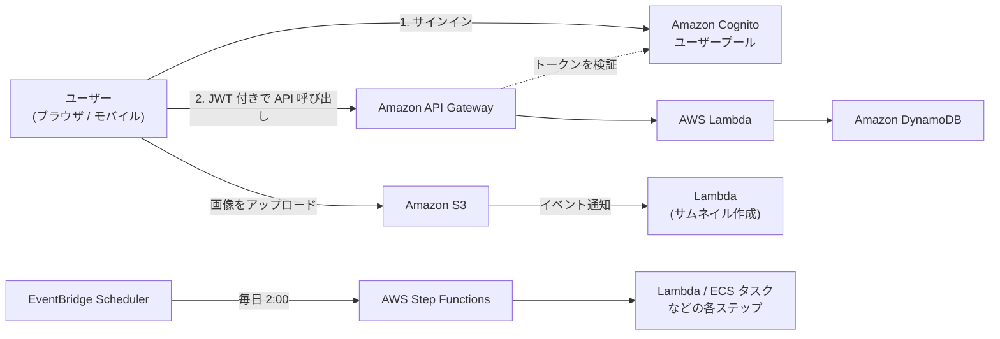
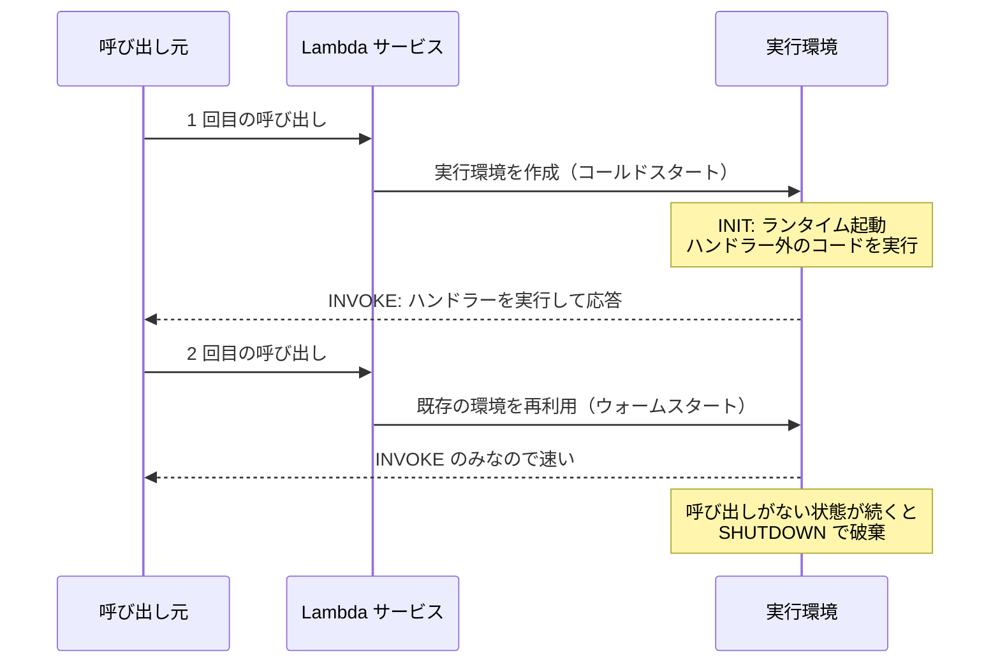
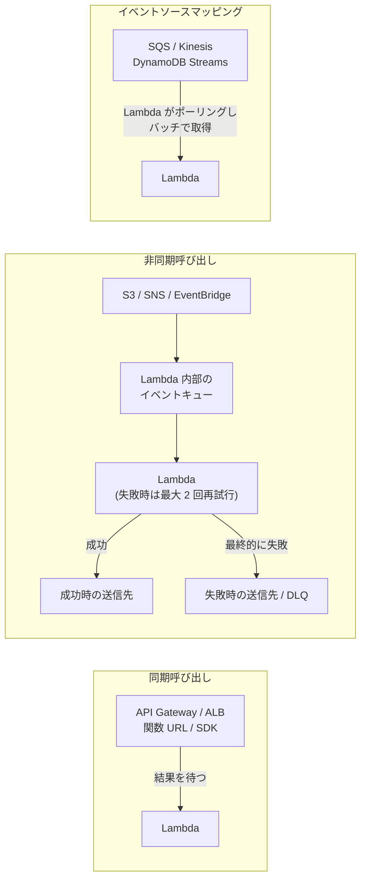
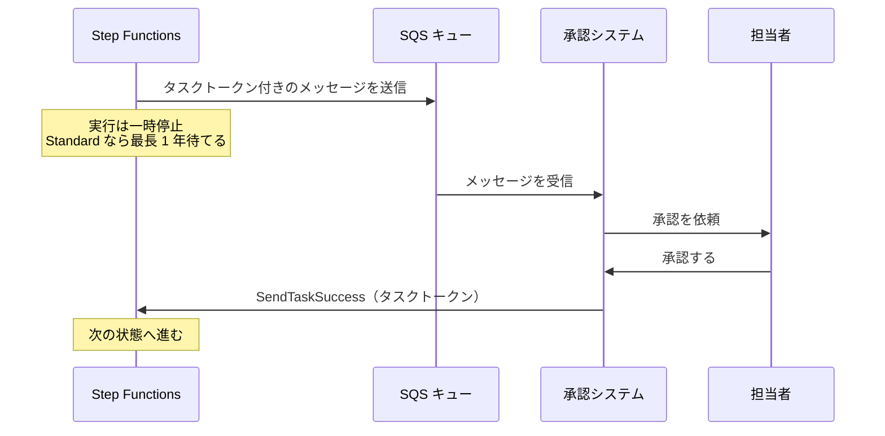
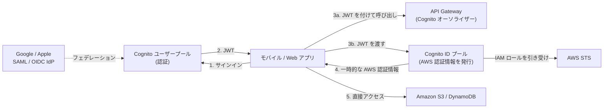

[ホーム](../README.md) > [Phase 2: アソシエイト](README.md) > サーバーレス

# サーバーレス（Lambda / API Gateway / Step Functions / Cognito）

> **この章のゴール**
> - Lambda の実行モデル（実行環境・コールドスタート・同時実行）を説明し、制限値を踏まえて設計できる
> - 同期・非同期・イベントソースマッピングの 3 つの呼び出し方と、それぞれのエラー処理を説明できる
> - API Gateway の REST / HTTP / WebSocket API を要件から選び、スロットリング・キャッシュ・認可を設計できる
> - Step Functions の Standard / Express を使い分け、Retry / Catch とサービス統合パターンを説明できる
> - Cognito のユーザープールと ID プールの違いを説明できる
> - 代表的なサーバーレスの設計パターンと、避けるべきパターンを説明できる
>
> **対応試験**: SAA-C03（D2: 弾力性に優れたアーキテクチャの設計、D3: 高性能なアーキテクチャの設計）／SAP-C03 の前提知識
> **目安時間**: 6 時間（読む 4 時間 / 確認問題 1 時間 / 復習 1 時間）※ハンズオン（Lab 06・Lab 09）は別途

## この章の全体像

「サーバーレス」は、サーバーが存在しないという意味ではありません。**サーバーのプロビジョニング、OS のパッチ適用、容量計画、スケーリングを AWS に任せ、アプリケーションのコードと設定に集中できる**という意味です。サーバーレスのサービスには、次の共通点があります。

- サーバーの管理が不要
- 需要に応じて自動でスケールする（ゼロまで縮小できるものも多い）
- 使った分だけの課金（アイドル時の課金がない、または小さい）
- 複数の AZ にまたがる高可用性が組み込まれている



| レイヤー | サービス | この教材での扱い |
|---|---|---|
| コンピューティング | AWS Lambda、AWS Fargate | この章 / [第 11 章 コンテナ](11-containers.md) |
| API | Amazon API Gateway、AWS AppSync | この章 |
| オーケストレーション | AWS Step Functions | この章 |
| 認証 | Amazon Cognito | この章 |
| メッセージング・イベント | Amazon SQS、Amazon SNS、Amazon EventBridge | [第 9 章 アプリケーション統合](09-application-integration.md) |
| データ | Amazon DynamoDB、Amazon S3、Aurora Serverless v2 | [第 5 章](05-s3.md)、[第 7 章](07-databases.md) |

> [!NOTE]
> 責任共有モデルの観点では、Lambda（マネージドランタイムの場合）は OS とランタイムのパッチ適用まで AWS の責任になり、お客様の責任は主に**コード、依存ライブラリ、IAM の権限、データ**です。EC2 よりお客様の責任範囲が小さくなります。

## 1. AWS Lambda

AWS Lambda は、イベントに応じてコードを実行するサーバーレスのコンピューティングサービスです。コードを「関数」として登録すると、呼び出されたときだけ実行環境が用意され、実行時間に応じて課金されます。

### 1.1 実行モデル: 実行環境とコールドスタート

Lambda は関数を**実行環境**（Firecracker という軽量な仮想マシンの上に作られる、隔離された環境）で実行します。実行環境のライフサイクルは次の 3 段階です。

| フェーズ | 内容 |
|---|---|
| INIT（初期化） | 実行環境を作成し、コードを取得してランタイムを起動し、**ハンドラーの外側のコード**（SDK クライアントの作成、DB 接続、設定の読み込みなど）を実行する |
| INVOKE（呼び出し） | ハンドラー関数を実行する。終わると、実行環境は次の呼び出しを待つ |
| SHUTDOWN（終了） | しばらく呼び出しがないと、実行環境は破棄される |



- **コールドスタート**: 新しい実行環境の作成と INIT が必要な呼び出しです。ランタイム、パッケージサイズ、初期化処理の重さによって、数百ミリ秒〜数秒の遅延が加わります。
- **ウォームスタート**: 既存の実行環境を再利用する呼び出しです。INIT が不要なので速く応答します。
- 1 つの実行環境は**同時に 1 つのリクエストだけ**を処理します。同時に 10 件の呼び出しがあれば、10 個の実行環境が必要です（後述の Lambda Managed Instances は例外）。

> [!NOTE]
> **ベストプラクティス**: SDK クライアントやデータベース接続は**ハンドラーの外側**で初期化し、ウォームスタート時に再利用します。`/tmp` の内容も同じ実行環境の中では残りますが、残っている保証はないため、キャッシュ用途にとどめます。関数は、実行環境をまたいで状態を持たない（ステートレスな）設計が前提です。

### 1.2 主な制限値

| 項目 | 値（2026年9月時点） |
|---|---|
| メモリ | 128 MB〜10,240 MB（1 MB 単位）。CPU はメモリに比例して割り当てられる |
| タイムアウト | 最大 900 秒（15 分） |
| `/tmp`（エフェメラルストレージ） | 512 MB〜10,240 MB |
| デプロイパッケージ（.zip） | 直接アップロードは 50 MB（圧縮後）。展開後はレイヤーを含めて 250 MB まで。大きいファイルは S3 経由でアップロード |
| コンテナイメージ | 最大 10 GB（非圧縮、全レイヤーを含む） |
| レイヤー | 1 関数あたり 5 つまで |
| 環境変数 | 合計 4 KB |
| 呼び出しのペイロード | 同期: リクエスト・レスポンスとも 6 MB（ストリーミングのレスポンスは 200 MB）／非同期: 1 MB |
| 同時実行数 | リージョンごとにアカウント全体で既定 1,000（引き上げ可能） |
| スケーリングの速度 | 関数ごとに、10 秒あたり 1,000 実行環境ずつ増やせる |

最新の値は [Lambda のクォータ](https://docs.aws.amazon.com/lambda/latest/dg/gettingstarted-limits.html)で確認してください。

> [!WARNING]
> **ひっかけ注意（古い教材との違い）**: 非同期呼び出しのペイロードの上限は、2025 年 10 月に 256 KB から **1 MB** に引き上げられました。古い教材では 256 KB と説明されています。また、新しく作成した AWS アカウントでは、同時実行数などのクォータが既定値より低く設定されていることがあり、利用状況に応じて自動的に引き上げられます。

> [!TIP]
> **試験のポイント**: 「処理に 15 分以上かかる」→ Lambda 単体では不可です。ECS / Fargate のタスクや AWS Batch を使うか、Step Functions で処理を分割します。「数 GB の機械学習モデルやライブラリを使う」→ コンテナイメージ（最大 10 GB）や Amazon EFS のマウントを検討します。

### 1.3 メモリと CPU

Lambda では CPU を直接指定できません。**メモリを増やすと、それに比例して CPU（とネットワーク帯域）も増えます**。1,769 MB で 1 vCPU 相当になり、最大の 10,240 MB では最大 6 vCPU を使えます。

- CPU を多く使う処理（画像変換、圧縮など）は、メモリを増やすと実行時間が短くなり、**合計のコストが下がることもあります**（料金は「メモリ × 実行時間」のため）。
- 最適なメモリ設定は、オープンソースのツール AWS Lambda Power Tuning などで計測して決めます。
- アーキテクチャは **x86_64** と **arm64（AWS Graviton）**から選べます。arm64 のほうが同じメモリ・実行時間あたりの単価が安く、多くのワークロードで価格性能が向上します。

### 1.4 同時実行

**同時実行数**は、ある瞬間に処理中のリクエストの数（＝使用中の実行環境の数）です。目安は次の式で求められます。

```text
同時実行数 ≒ 1 秒あたりのリクエスト数 × 平均実行時間（秒）
例: 毎秒 200 リクエスト × 0.5 秒 = 同時実行数 100
```

- アカウントの同時実行数の上限は、リージョンごとに既定で **1,000**（全関数の合計）です。これを超えると**スロットリング**が発生します。
- スロットリングされると、同期呼び出しでは呼び出し元に **429 エラー**（`TooManyRequestsException`）が返り、非同期呼び出しでは Lambda が自動的に再試行します。

**予約同時実行とプロビジョンド同時実行**

| 観点 | 予約同時実行（Reserved） | プロビジョンド同時実行（Provisioned） |
|---|---|---|
| 目的 | 関数用に同時実行数を**確保**し、同時にその値を**上限**にする | 実行環境を**事前に初期化**しておき、コールドスタートをなくす |
| 効果 | 他の関数に同時実行数を使い切られない。下流（DB など）を守る上限にもなる | 設定した数までは常にウォームスタート（2 桁ミリ秒の応答が安定する） |
| 料金 | 追加料金なし | 設定した量と時間に応じて課金（使わなくても発生する） |
| 設定対象 | 関数 | 関数のバージョンまたはエイリアス（`$LATEST` には設定できない） |
| 補足 | 0 に設定すると関数は一切実行されない（緊急停止に使える） | Application Auto Scaling で、スケジュールや使用率に応じて増減できる |

アカウント全体の同時実行数のうち **100 は予約されていない関数のために残す**必要があり、予約同時実行に割り当てられるのは「上限 − 100」までです。

> [!TIP]
> **試験のポイント**:
> - 「特定の関数が同時実行数を使い切り、他の関数がスロットリングされる」「重要な関数の同時実行数を保証したい」「下流の RDS への同時接続数を制限したい」→ **予約同時実行**
> - 「コールドスタートによるレイテンシーをなくしたい」「毎朝 9 時のアクセス急増に備えたい」→ **プロビジョンド同時実行**（スケジュールによる Auto Scaling と組み合わせる）

### 1.5 コールドスタート対策と SnapStart

| 方法 | 内容 | 注意点 |
|---|---|---|
| 初期化処理の軽量化 | 依存ライブラリを減らす、パッケージを小さくする、必要なものだけを読み込む | 最初に取り組むべき基本 |
| メモリを増やす | CPU が増え、初期化も速くなる | コストとのバランス |
| プロビジョンド同時実行 | 初期化済みの実行環境を常に用意しておく | 使わなくても課金される |
| **SnapStart** | 初期化済みの実行環境のスナップショットから復元して起動する | 対応ランタイムが限られる |

**Lambda SnapStart** は、関数のバージョンを発行するときに INIT を実行し、初期化済みの状態（メモリとディスクの内容）のスナップショットを保存しておく機能です。呼び出し時にはスナップショットから復元するため、初期化の重いアプリケーション（Java の Spring Boot など）の起動が大幅に速くなります。

- 対象は **Java・Python・.NET の一部のマネージドランタイム**です（対応バージョンは公式ドキュメントで確認してください）。Node.js などは対象外です。
- プロビジョンド同時実行とは併用できません。
- 1 つのスナップショットから複数の実行環境が復元されるため、初期化時に生成した乱数や一意の ID、ネットワーク接続の扱いに注意が必要です（ランタイムフックで復元後に作り直す）。
- Java では追加料金がかかりませんが、Python と .NET ではスナップショットのキャッシュと復元に料金がかかります。

> [!TIP]
> **試験のポイント**: 「Java の関数のコールドスタートを、追加コストを抑えて短縮したい」→ SnapStart。「ランタイムを問わず、確実にコールドスタートをなくしたい」→ プロビジョンド同時実行。

### 1.6 呼び出しタイプ: 同期・非同期・イベントソースマッピング

Lambda の呼び出し方は 3 種類あり、**エラーのときに誰が再試行するか**が異なります。試験で最も問われるポイントの 1 つです。



| 呼び出しタイプ | 代表的な呼び出し元 | 動作 | エラーのとき |
|---|---|---|---|
| 同期（RequestResponse） | API Gateway、ALB、関数 URL、SDK / CLI の `Invoke`、Cognito のトリガー | 呼び出し元が結果を待つ | Lambda は再試行しない。**呼び出し元**がエラーを受け取り、再試行するかを判断する |
| 非同期（Event） | S3 イベント通知、SNS、EventBridge、CloudWatch Logs のサブスクリプションフィルター | Lambda が内部のキューで受け付けてすぐに応答し、後で実行する | **Lambda が最大 2 回再試行**（合計 3 回）。最終的に失敗したイベントは DLQ または失敗時の送信先へ |
| イベントソースマッピング（ポーリング） | SQS、Kinesis Data Streams、DynamoDB Streams、Amazon MSK、セルフマネージド Apache Kafka、Amazon MQ、Amazon DocumentDB | **Lambda がソースをポーリング**し、レコードをバッチにまとめて関数を呼び出す | ソースによって異なる（SQS はメッセージがキューに戻る。ストリームは成功するまでそのシャードの処理が止まる） |

### 1.7 非同期呼び出しの再試行・DLQ・Destinations

非同期呼び出しでは、関数がエラーを返すと Lambda が自動的に再試行します。

- **再試行回数**: 既定 2 回（0〜2 回に変更できる）。再試行の間隔は徐々に長くなる
- **イベントの最大有効期間**: 60 秒〜6 時間（既定 6 時間）。スロットリングなどで実行できないまま期限を過ぎたイベントは破棄される
- 最終的に処理できなかったイベントの退避先として、**DLQ** と **Destinations（送信先）**がある

| 観点 | DLQ（デッドレターキュー） | Destinations（送信先） |
|---|---|---|
| 対象 | 失敗したイベントのみ | **成功時**と**失敗時**をそれぞれ指定できる |
| 送信先 | SQS キュー、SNS トピック | SQS、SNS、Lambda 関数、EventBridge イベントバスなど |
| 含まれる情報 | 元のイベントの内容 | 元のイベントに加え、**呼び出し結果の詳細**（エラーの内容、レスポンスなど） |
| 位置付け | 従来の方式 | **新しい設計ではこちらが推奨** |

> [!TIP]
> **試験のポイント**: 「非同期で呼び出された Lambda の失敗イベントを保存して後で調査したい」→ 失敗時の送信先（または DLQ）。「成功したら結果を次の処理（別の関数や EventBridge）に渡したい」→ **成功時の送信先**（DLQ ではできない）。

> [!WARNING]
> **ひっかけ注意**: Lambda の DLQ / Destinations は**非同期呼び出し**のための機能です。SQS をイベントソースにしている場合（イベントソースマッピング）、失敗したメッセージを隔離するのは **SQS キュー側の DLQ**（リドライブポリシー）です。

### 1.8 イベントソースマッピングの詳細

**SQS をソースにする場合**

- Lambda がキューをロングポーリングし、メッセージをバッチ（標準キューは最大 10,000 件、FIFO キューは最大 10 件）にまとめて関数を呼び出す。バッチウィンドウ（最大 300 秒）の間ためてから呼び出すこともできる
- 関数が成功するとメッセージは自動的に削除され、失敗するとバッチ全体が可視性タイムアウトの後にキューに戻る
- **部分的なバッチ応答**（`ReportBatchItemFailures`）を有効にして失敗したメッセージの ID だけを返すと、**失敗したメッセージだけ**が再処理される（成功した分の重複処理を防げる）
- キューの可視性タイムアウトは、**関数のタイムアウトの 6 倍以上**にするのが推奨
- **最大同時実行数**を設定すると、この SQS ソースから呼び出す同時実行数に上限を設けられる（下流の DB を守る）
- 失敗し続けるメッセージは、キューのリドライブポリシーで DLQ へ移す

**Kinesis Data Streams / DynamoDB Streams をソースにする場合**

- シャードごとに、**順序を保って**バッチを処理する
- 関数がエラーになると、**そのバッチが成功するか、レコードの有効期限が切れるまで、同じシャードの処理が止まる**（後続のレコードが進まない）
- 対策として、**バッチの二分割（bisect）**、**最大再試行回数**、**レコードの最大有効期間**、**失敗時の送信先**（SQS / SNS など）を設定する
- **並列化係数**（1〜10）で、1 つのシャードを複数の実行環境で並行処理できる（同じパーティションキーの中の順序は保たれる）

**共通**: **イベントフィルタリング**を設定すると、条件に合うレコードだけで関数を呼び出せます（不要な呼び出しと料金を削減できる）。

> [!TIP]
> **試験のポイント**: 「バッチ内の 1 件が失敗すると、成功した分まで再処理されて重複が発生する」→ 部分的なバッチ応答（`ReportBatchItemFailures`）。「Kinesis の処理が 1 件の不正なレコードで止まってしまう」→ bisect、最大再試行回数、失敗時の送信先を設定する。

### 1.9 VPC 内の Lambda

既定では、Lambda 関数は AWS が管理する VPC で実行され、インターネットと AWS のパブリックなエンドポイントにはアクセスできますが、**お客様の VPC 内のプライベートなリソース（RDS、ElastiCache、社内システムなど）にはアクセスできません**。関数に VPC（サブネットとセキュリティグループ）を設定すると、VPC 内のリソースにアクセスできるようになります。

- Lambda は、サブネットとセキュリティグループの組み合わせごとに **Hyperplane ENI** を作成し、関数の実行環境で共有します。ENI は関数の作成時・設定変更時に作られるため、呼び出しのたびに ENI を作る遅延はありません。
- 関数の**実行ロール**には ENI を作成・削除する権限が必要です（AWS 管理ポリシー `AWSLambdaVPCAccessExecutionRole`）。
- 高可用性のため、**複数の AZ のサブネット**を指定します。

VPC に接続した関数の ENI には**パブリック IP アドレスが割り当てられません**。そのため、パブリックサブネットに配置してもインターネットには出られません。

| アクセス先 | 必要な構成 |
|---|---|
| インターネット（外部の API など） | 関数を**プライベートサブネット**に配置し、ルートテーブルで **NAT ゲートウェイ**（パブリックサブネットに配置）へ向ける |
| S3、DynamoDB | **ゲートウェイ VPC エンドポイント**（無料）、または NAT ゲートウェイ |
| その他の AWS サービス（SQS、Secrets Manager など） | **インターフェイス VPC エンドポイント**、または NAT ゲートウェイ |

> [!WARNING]
> **ひっかけ注意**: 「VPC に接続した Lambda 関数をパブリックサブネットに置き、インターネットゲートウェイへのルートを設定したが、外部の API にアクセスできない」→ ENI にパブリック IP がないためです。プライベートサブネット + NAT ゲートウェイが正解です（[第 2 章 VPC](02-vpc.md)）。

> [!TIP]
> **試験のポイント**: Lambda から RDS に接続すると、同時実行数の増加に伴って DB の接続数が枯渇しがちです。**Amazon RDS Proxy** で接続をプールすると解決できます（[第 7 章](07-databases.md)）。

### 1.10 バージョン・エイリアス・レイヤー・コンテナイメージ

- **バージョン**: 関数のコードと設定のスナップショット。発行すると変更できない（`$LATEST` だけが編集可能）
- **エイリアス**: 特定のバージョンを指す名前（例: `prod` → バージョン 7）。呼び出し元はエイリアスを指定しておけば、バージョンの切り替えを意識せずに済む
- **加重エイリアス**: エイリアスで 2 つのバージョンにトラフィックを分割できる（例: 90% をバージョン 7、10% をバージョン 8）。**AWS CodeDeploy** と組み合わせると、カナリア（例: 10% で 5 分間様子を見てから全量）やリニア（例: 1 分ごとに 10% ずつ）の段階的なデプロイと、CloudWatch アラームによる自動ロールバックができる
- **レイヤー**: ライブラリや共通コード、カスタムランタイムを関数から切り出して共有する仕組み。1 関数につき 5 つまでで、展開後のサイズは関数本体と合わせて 250 MB まで
- **コンテナイメージ**: 作成したイメージ（最大 10 GB）を Amazon ECR に置き、関数として実行できる。依存関係が大きい場合や、既存のコンテナのビルドパイプラインを使いたい場合に便利（ただし、実行モデルと制限値は通常の Lambda と同じ）

### 1.11 関数 URL

**関数 URL** は、Lambda 関数に専用の HTTPS エンドポイント（`https://<URL ID>.lambda-url.<リージョン>.on.aws`）を付ける機能です。API Gateway を使わずに、関数を直接 HTTP で呼び出せます。

- 認証タイプは `AWS_IAM`（SigV4 の署名が必要）または `NONE`（誰でも呼び出せる。関数の中で認証を実装する）
- CORS の設定と、レスポンスストリーミングに対応
- API Gateway のような使用量プラン、API キー、リクエストの検証、キャッシュ、WAF の直接の関連付けはない。独自ドメインや WAF が必要なら CloudFront を前段に置く

> [!TIP]
> **試験のポイント**: 「単一の関数を最小の構成で HTTPS 公開したい（Webhook の受け口など）」→ 関数 URL。「API キー・使用量プラン・キャッシュ・リクエストの検証が必要」→ API Gateway。

### 1.12 料金

Lambda の料金は、主に次の 2 つで決まります。

- **リクエスト数**: 呼び出し回数に応じた課金
- **実行時間（GB 秒）**: 割り当てたメモリ（GB）× 実行時間（秒。1 ミリ秒単位で計算）

例えば、メモリ 512 MB（0.5 GB）の関数が 1 回 200 ミリ秒で、月に 300 万回呼ばれる場合、0.5 GB × 0.2 秒 × 3,000,000 回 = **300,000 GB 秒**です。

このほか、プロビジョンド同時実行、512 MB を超えるエフェメラルストレージ、データ転送などに料金がかかります。無料利用枠（常時無料）として、毎月 100 万リクエストと 400,000 GB 秒が含まれます（2026年9月時点。[Lambda の料金](https://aws.amazon.com/lambda/pricing/)）。

> [!TIP]
> **試験のポイント**: Lambda は**アイドル時の課金がない**ため、呼び出しが少ない・不規則なワークロードでは EC2 より安くなります。逆に、24 時間高い負荷が続くワークロードは、EC2 やコンテナのほうが安くなることがあります。Lambda も **Compute Savings Plans** の対象です（[第 18 章 コスト最適化](18-cost-optimization.md)）。

### 1.13 新しい実行モデル: durable functions と Lambda Managed Instances

**Lambda durable functions**（2025 年 12 月 GA）

- 複数のステップからなる処理を、**Lambda 関数のコードの中で**記述できる機能です。各ステップの結果が**チェックポイント**として保存され、中断や失敗の後は、完了済みのステップを再実行せずに**リプレイ**で続きから再開します。
- 「承認を待つ」「外部システムからのコールバックを待つ」「一定時間待つ」といった待機の間は実行を**一時停止**でき、最長 **1 年間**待てます。待機中はコンピューティングの料金がかかりません。
- 用途: 注文処理、承認フロー、AI エージェントのように、長時間にわたる複数ステップの処理をコード中心で書きたい場合。ワークフローを図として可視化・運用したい場合や、多数の AWS サービスを組み合わせる場合は Step Functions が向きます（後述）。

**Lambda Managed Instances**（2025 年 11 月 GA）

- Lambda 関数を、**お客様のアカウント内の EC2 インスタンス**で実行する機能です。**キャパシティプロバイダー**でインスタンスタイプなどを指定し、インスタンスの起動・パッチ適用・スケーリングは Lambda が管理します。
- 1 つの実行環境で複数のリクエストを同時に処理でき、料金は EC2 インスタンスがベースになるため、**Savings Plans やリザーブドインスタンスの割引**を適用できます。
- 用途: 定常的に大量のトラフィックがあり、Lambda の開発体験を保ったまま EC2 の料金モデルや特定のインスタンスタイプを使いたい場合。

> [!NOTE]
> どちらも SAA-C03 の出題範囲が作られた後に登場した機能のため、SAA-C03 で問われる可能性は低いと考えられます。一方、SAP-C03 では Step Functions による「耐久性のあるワークフロー（durable workflows）」が新しいスキルとして追加されているため、Step Functions と durable functions の使い分けを押さえておきましょう（[Phase 3 クラウドネイティブ設計](../03-professional/08-cloud-native-architecture.md)）。

CloudFront のエッジロケーションでコードを実行する **Lambda@Edge** と **CloudFront Functions** は、[第 8 章](08-route53-cloudfront.md)で扱います。

## 2. Amazon API Gateway

Amazon API Gateway は、API の作成・公開・保護・監視を行うフルマネージドサービスです。バックエンド（Lambda、HTTP エンドポイント、AWS サービス）の前に立ち、認証・認可、スロットリング、キャッシュ、リクエストの変換などを肩代わりします。

### 2.1 API の種類: REST / HTTP / WebSocket

API Gateway には 3 種類の API があります。REST API と HTTP API はどちらも HTTP のリクエスト/レスポンス型の API で、機能とコストが異なります。

| 観点 | REST API | HTTP API |
|---|---|---|
| 位置付け | 高機能。API 管理の機能が一通りそろう | シンプルで、低コスト・低レイテンシー |
| 料金 | 高め | REST API より安い |
| エンドポイントタイプ | エッジ最適化 / リージョン / プライベート | リージョンのみ |
| 認可 | IAM、Cognito ユーザープール、Lambda オーソライザー、リソースポリシー | IAM、**JWT オーソライザー**（Cognito などの OIDC / OAuth 2.0）、Lambda オーソライザー |
| API キー・使用量プラン | ○ | × |
| キャッシュ | ○ | × |
| AWS WAF の関連付け | ○ | × |
| リクエストの検証・変換 | ○（マッピングテンプレートなど） | 限定的（パラメーターのマッピング） |
| 統合タイムアウト | 既定 29 秒（リージョン / プライベートは引き上げ可能） | 最大 30 秒 |

**WebSocket API** は、クライアントとの間で**持続的な双方向の接続**を保ち、サーバー側からもクライアントへメッセージを送れる API です。チャット、リアルタイムのダッシュボード、ゲーム、処理の進捗通知などに使います。

- ルート（`$connect`、`$disconnect`、`$default`、独自のルート）ごとに、Lambda などのバックエンドを統合する
- バックエンドは、接続 ID を指定して **`@connections` API** にメッセージを POST すると、そのクライアントにメッセージを送れる（接続 ID は DynamoDB などに保存しておく）
- アイドル状態の接続は 10 分、接続の最大継続時間は 2 時間で切断されるため、クライアントは再接続の処理を実装する

> [!TIP]
> **試験のポイント**: 「サーバーからクライアントへリアルタイムにプッシュ」「チャット」→ WebSocket API（または AppSync のサブスクリプション）。「コストを抑えたシンプルな Lambda のプロキシ」「JWT で認可」→ HTTP API。「API キー、使用量プラン、キャッシュ、WAF、リクエストの検証」→ REST API。

### 2.2 エンドポイントタイプ（REST API）

| タイプ | 仕組み | 向いているケース |
|---|---|---|
| エッジ最適化 | CloudFront のエッジロケーション経由でリクエストを受け付ける（API 自体は 1 つのリージョンにある） | 世界中に分散したクライアント |
| リージョン | リージョンのエンドポイントで直接受け付ける | 同じリージョン内のクライアント。自前の CloudFront ディストリビューションを前段に置いて細かく制御したい場合 |
| プライベート | **インターフェイス VPC エンドポイント**（`execute-api`）経由で、VPC の中からだけアクセスできる | 社内向けの API。リソースポリシーでアクセス元の VPC / VPC エンドポイントを制限する |

> [!WARNING]
> **ひっかけ注意**: エッジ最適化 API に独自ドメイン名を設定する場合、ACM の証明書は **us-east-1（バージニア北部）リージョン**で発行します（CloudFront と同じ）。リージョン API の場合は、API と同じリージョンの証明書を使います。

### 2.3 統合タイプ

| 統合タイプ | 内容 |
|---|---|
| Lambda プロキシ統合 | リクエスト全体をそのまま Lambda に渡し、Lambda の戻り値をそのままレスポンスにする。最も一般的 |
| HTTP 統合 | 既存の HTTP エンドポイント（EC2 上やオンプレミスの API など）に転送する |
| AWS サービス統合 | Lambda を介さずに **AWS サービスの API を直接呼び出す**（例: SQS の `SendMessage`、DynamoDB の `PutItem`、Step Functions の `StartExecution`） |
| モック | バックエンドを呼ばずに固定のレスポンスを返す（開発・テスト用） |
| プライベート統合（VPC リンク） | VPC 内のプライベートなロードバランサーなどに接続する（対応するリソースは API の種類によって異なる） |

> [!TIP]
> **試験のポイント**: 「受け付けたリクエストを確実にキューに入れたい」「Lambda を挟まずに運用とコストを減らしたい」→ API Gateway の **AWS サービス統合で SQS に直接送信**。バックエンドの処理能力を超えるスパイクを SQS で吸収できます。

### 2.4 ステージとデプロイ

- API の変更は**デプロイ**して**ステージ**（例: `dev`、`prod`）に公開します。ステージごとに URL（`https://{api-id}.execute-api.{region}.amazonaws.com/{stage}`）が分かれます。
- **ステージ変数**で、ステージごとに接続先（例: Lambda のエイリアス `dev` / `prod`）を切り替えられます。
- REST API では、ステージの**カナリアリリース**の設定で、新しいデプロイに一部のトラフィックだけを流して検証できます。
- ステージごとに、アクセスログ・実行ログ（CloudWatch Logs）、スロットリング、キャッシュを設定します。

### 2.5 スロットリング・使用量プラン・API キー

API Gateway は**トークンバケット方式**でリクエスト数を制限し、超過したリクエストには **429 Too Many Requests** を返します。

| レベル | 内容 |
|---|---|
| アカウント（リージョンごと） | 既定で**毎秒 10,000 リクエスト**（定常レート）、**バースト 5,000**。全 API の合計（2026年9月時点。引き上げ可能） |
| ステージ / メソッド | ステージ全体やメソッドごとに、レートとバーストを設定する |
| 使用量プラン（クライアント単位） | **API キー**ごとに、レート・バーストと、日・週・月単位の**クォータ**（リクエスト総数）を設定する |

**使用量プラン**は、API を外部の顧客やパートナーに提供するときに使います。例えば「無料プランは毎秒 10 リクエスト・月 10 万回、有料プランは毎秒 100 リクエスト・月 1,000 万回」のように、API キーごとに利用量を管理できます（REST API のみ）。

> [!WARNING]
> **ひっかけ注意**: **API キーは認可の仕組みではありません**。API キーはクライアントの識別と使用量の管理のためのもので、漏えいすれば誰でも使えます。アクセス制御には、IAM、Cognito、Lambda オーソライザーを組み合わせます。

> [!TIP]
> **試験のポイント**: 「パートナーごとにリクエスト数の上限とクォータを設定したい」→ 使用量プラン + API キー。API Gateway の既定のスロットリング（毎秒 10,000）と Lambda の既定の同時実行数（1,000）の差にも注意します。バックエンドを守るには、ステージ / メソッドのスロットリングや Lambda の予約同時実行を設定します。

### 2.6 キャッシュ（REST API）

REST API では、ステージで**キャッシュ**を有効にすると、バックエンドのレスポンスを一定時間保存し、同じリクエストにはキャッシュから応答します。バックエンドの負荷とレイテンシーを下げられます。

- キャッシュの容量は 0.5 GB〜237 GB から選び、容量と時間に応じて課金される
- TTL は既定 300 秒、最大 3,600 秒（0 にするとキャッシュしない）。メソッドごとに上書きできる
- キャッシュキーには既定でリソースのパスが使われ、指定したクエリ文字列やヘッダーも含められる
- クライアントは `Cache-Control: max-age=0` ヘッダーでキャッシュを無効化できるが、IAM の権限などで許可したクライアントだけに限定すべき

### 2.7 認証・認可

| 方式 | 仕組み | 向いているケース |
|---|---|---|
| IAM 認可 | 呼び出し元が SigV4 で署名し、IAM ポリシーで `execute-api:Invoke` を許可する | AWS 内のサービスや、IAM の認証情報を持つクライアント（別アカウントを含む） |
| Cognito ユーザープールオーソライザー（REST）/ JWT オーソライザー（HTTP） | ユーザーがサインインして得た JWT を API Gateway が検証する | エンドユーザー向けの Web・モバイルアプリ |
| Lambda オーソライザー | 独自の Lambda 関数でトークン（またはヘッダーやパラメーター）を検証し、IAM ポリシーを返す。結果はキャッシュできる | 独自の認証方式、サードパーティのトークン、複雑な判定ロジック |
| リソースポリシー（REST） | API に付けるポリシーで、送信元の IP アドレス、VPC / VPC エンドポイント、アカウントを制限する | プライベート API、IP 制限、クロスアカウントのアクセス |

さらに REST API には **AWS WAF** を関連付けて、SQL インジェクションやボットなどのレイヤー 7 の攻撃から保護できます（[第 12 章](12-security-services.md)）。独自ドメインでは相互 TLS（mTLS）認証も使えます。

### 2.8 統合タイムアウトとペイロードサイズ

- **統合タイムアウト**: REST API は既定 **29 秒**です。2024 年 6 月から、**リージョン API とプライベート API** ではクォータの引き上げを申請すると 29 秒より長くできるようになりました（アカウントのスロットリングのクォータを下げる必要がある場合があります）。**エッジ最適化 API は 29 秒のまま**です。HTTP API は最大 **30 秒**です。
- **ペイロード**: リクエストの最大サイズは 10 MB です。

> [!WARNING]
> **ひっかけ注意**: Lambda のタイムアウトを 15 分にしても、API Gateway 経由の同期呼び出しは統合タイムアウト（既定 29 秒）で打ち切られ、クライアントには 504 エラーが返ります。数分かかる処理は**非同期パターン**にします。API は依頼を受け付けたら SQS や Step Functions に処理を渡してすぐに 202（受付 ID）を返し、クライアントは状態確認用の API をポーリングするか、WebSocket で完了の通知を受け取ります。なお、古い教材では「統合タイムアウトは 29 秒で変更できない」と説明されていることがあります。

## 3. AWS Step Functions

### 3.1 なぜワークフローのサービスが必要か

「注文を検証 → 在庫を確保 → 決済 → 出荷を指示 → 通知」のような複数ステップの処理を、Lambda 関数どうしの呼び出しで実装すると、次の問題が起きます。

- 途中で失敗したときの再試行や、取り消しの処理（決済の返金など）のコードが各関数に散らばる
- どこまで進んだかという状態を、自分で管理する必要がある
- 関数から関数を同期呼び出しすると、待っている側の実行時間にも課金され、15 分の制限にも縛られる

**AWS Step Functions** は、処理の流れを**ステートマシン**として定義し、各ステップの実行・分岐・並列化・再試行・エラー処理を管理するサーバーレスのオーケストレーションサービスです。定義は JSON 形式の **Amazon States Language（ASL）**で書き、Workflow Studio で視覚的に編集できます。実行の状態と履歴はサービス側で保持され、どのステップで失敗したかをコンソールで確認できます。

### 3.2 Standard ワークフローと Express ワークフロー

| 観点 | Standard | Express |
|---|---|---|
| 最大実行時間 | **1 年** | **5 分** |
| 実行のセマンティクス | **exactly-once**（各ステップは 1 回だけ実行される） | 非同期 Express は **at-least-once**、同期 Express は **at-most-once** |
| 料金 | **状態遷移の回数**に応じて課金 | **実行回数と実行時間（メモリ）**に応じて課金 |
| 実行履歴 | サービスに保存され、API やコンソールで確認できる（実行終了後 90 日間） | CloudWatch Logs に出力する |
| `.sync` / `.waitForTaskToken` | 使える | 使えない |
| 向いている処理 | 長時間の処理、人による承認、監査が必要な業務フロー、冪等でない処理 | 大量・短時間の処理（IoT データの取り込み、ストリームの変換、API のバックエンド） |

> [!TIP]
> **試験のポイント**: 「数日かかる承認フロー」「1 回だけ確実に実行」→ Standard。「毎秒数千件の短いイベント処理を低コストで」→ Express。API Gateway から同期的に結果を返したい短い処理には、同期 Express ワークフロー（`StartSyncExecution`）が使えます。

### 3.3 状態の種類

| 状態 | 役割 |
|---|---|
| Task | 作業を実行する（Lambda の呼び出し、AWS サービスの API 呼び出しなど） |
| Choice | 入力の値に応じて分岐する |
| Parallel | 複数の分岐を並列に実行し、すべての完了を待つ |
| Map | 配列の各要素に同じ処理を繰り返す（並列実行も可能） |
| Wait | 指定した秒数、または指定した時刻まで待つ |
| Pass | 入力をそのまま（または加工して）次に渡す。デバッグや固定値の注入に使う |
| Succeed / Fail | 実行を成功 / 失敗として終了する |

Task 状態からは、Lambda だけでなく **200 を超える AWS サービスの API を直接呼び出せます**（AWS SDK 統合）。例えば、DynamoDB への書き込みや SNS への発行のためだけに Lambda 関数を書く必要はありません。状態間のデータの受け渡しには JSONPath または JSONata を使えます。

### 3.4 エラー処理: Retry と Catch

Task・Parallel・Map の各状態には、**Retry**（再試行）と **Catch**（エラーを捕捉して別の状態に遷移）を定義できます。

```json
"ChargeCard": {
  "Type": "Task",
  "Resource": "arn:aws:states:::lambda:invoke",
  "Parameters": {
    "FunctionName": "charge-card",
    "Payload.$": "$"
  },
  "TimeoutSeconds": 30,
  "Retry": [
    {
      "ErrorEquals": ["Lambda.TooManyRequestsException", "States.Timeout"],
      "IntervalSeconds": 2,
      "MaxAttempts": 3,
      "BackoffRate": 2.0
    }
  ],
  "Catch": [
    {
      "ErrorEquals": ["States.ALL"],
      "ResultPath": "$.error",
      "Next": "RefundAndNotify"
    }
  ],
  "Next": "ShipOrder"
}
```

- `Retry`: スロットリングやタイムアウトのときは、2 秒後、4 秒後、8 秒後と間隔を 2 倍にしながら最大 3 回再試行する（**指数バックオフ**）
- `Catch`: 再試行しても失敗した場合や、その他のすべてのエラー（`States.ALL`）のときは、エラーの情報を `$.error` に格納して `RefundAndNotify` 状態に進む
- `TimeoutSeconds`: タスクが 30 秒以内に終わらなければ `States.Timeout` エラーにする。長時間のタスクでは `HeartbeatSeconds` で生存確認もできる

Catch を使い、失敗したときに前のステップを取り消す処理（決済の返金など）を実行する設計は **Saga パターン**と呼ばれます。

### 3.5 Map 状態と分散マップ

| モード | 仕組み | 規模の目安 |
|---|---|---|
| インライン | 同じ実行の中で、配列の各要素を処理する | 同時に処理できるのは最大 40。1 つの実行の履歴イベント数の上限（Standard で 25,000）にも注意 |
| 分散（Distributed） | 各要素（または要素のバッチ）を**子ワークフローの実行**として起動する | **最大 10,000 の子実行を並列**に動かせる。S3 の CSV / JSON ファイルやオブジェクトの一覧を直接読み込み、結果を S3 に書き出せる |

**分散マップ**は、「S3 にある数百万個のファイルを並列に処理する」「巨大な CSV ファイルの各行を処理する」といった大規模な並列処理を、サーバーを使わずに実現します。許容する失敗の割合（しきい値）も設定できます。

### 3.6 サービス統合パターン

| パターン | リソース ARN の例 | 動作 | 使用例 |
|---|---|---|---|
| リクエスト/レスポンス（既定） | `arn:aws:states:::sns:publish` | API を呼び出し、応答を受け取ったらすぐ次の状態に進む | SNS への発行、SQS への送信 |
| ジョブの実行（`.sync`） | `arn:aws:states:::ecs:runTask.sync` | ジョブを開始し、**完了するまで待ってから**次に進む | ECS / Fargate タスク、AWS Batch、AWS Glue のジョブ、別のステートマシン |
| コールバックを待つ（`.waitForTaskToken`） | `arn:aws:states:::sqs:sendMessage.waitForTaskToken` | **タスクトークン**を渡して一時停止し、外部から `SendTaskSuccess` / `SendTaskFailure` が呼ばれるまで待つ | 人による承認、外部システムの処理待ち |



> [!TIP]
> **試験のポイント**: 「15 分を超える処理を含むワークフロー」→ Step Functions から ECS / Fargate タスクや AWS Batch を `.sync` で実行する。「担当者の承認を待ってから次に進む」→ `.waitForTaskToken`（Standard ワークフロー）。

### 3.7 Step Functions と他の選択肢

| やりたいこと | 候補 |
|---|---|
| 複数の AWS サービスを組み合わせた業務フローを可視化して運用したい | Step Functions（Standard） |
| 大量・短時間のイベント処理のパイプライン | Step Functions（Express）、Lambda + SQS |
| 複数ステップの処理をアプリケーションのコードとして書き、長時間の待機も扱いたい | Lambda durable functions |
| 各サービスが自律的にイベントに反応する疎結合な構成 | EventBridge（コレオグラフィ） |
| 定期的にワークフローを起動したい | EventBridge Scheduler → Step Functions |

## 4. Amazon Cognito

Amazon Cognito は、Web・モバイルアプリの**エンドユーザー（顧客）**向けの認証・認可サービスです。数百万人規模のユーザーのサインアップとサインインを、認証基盤を自作せずに実現できます。

### 4.1 ユーザープールと ID プール

Cognito には 2 つの機能があり、役割がまったく異なります。

| 観点 | ユーザープール | ID プール（フェデレーテッドアイデンティティ） |
|---|---|---|
| 役割 | **認証**（あなたは誰か） | **AWS リソースへのアクセスの認可**（AWS の一時的な認証情報を渡す） |
| 出力 | **JWT**（ID トークン、アクセストークン、更新トークン） | **一時的な AWS 認証情報**（STS 経由で IAM ロールを引き受ける） |
| 主な用途 | アプリへのサインイン、API Gateway / ALB / AppSync での認可 | アプリから **S3 や DynamoDB などの AWS サービスを直接呼び出す** |
| ゲスト | ― | 未認証（ゲスト）のユーザーにも限定した権限を付与できる |



### 4.2 ユーザープールの主な機能

- サインアップ・サインイン、メールアドレスや電話番号の検証、パスワードポリシー、アカウントの復旧
- **MFA**（SMS、認証アプリの TOTP など）や、パスキーなどによるパスワードレス認証
- **外部の ID プロバイダーとのフェデレーション**: ソーシャルログイン（Google、Facebook、Apple、Login with Amazon）、SAML 2.0、OpenID Connect（OIDC）
- **マネージドログイン**（旧ホスト UI）: Cognito がホストするサインイン画面と OAuth 2.0 のエンドポイント
- **Lambda トリガー**: サインアップ前の検証、トークン生成前のカスタマイズ、既存のユーザーデータベースからの移行など
- **グループ**: ユーザーをグループに分け、アプリ側の権限の判定に使う
- **機能プラン**（Lite / Essentials / Plus）: プランによって使える機能（脅威からの保護など）と、月間アクティブユーザー（MAU）あたりの料金が異なる

### 4.3 ID プールと細かなアクセス制御

ID プールは、ユーザープールや外部の IdP で認証されたユーザー（または未認証のゲスト）に、IAM ロールに基づく**一時的な AWS 認証情報**を発行します。

IAM ポリシーで**ポリシー変数** `${cognito-identity.amazonaws.com:sub}`（ユーザーごとの一意の ID）を使うと、「各ユーザーは S3 の自分のプレフィックスにだけアクセスできる」といった制御ができます。

```json
{
  "Effect": "Allow",
  "Action": ["s3:GetObject", "s3:PutObject"],
  "Resource": "arn:aws:s3:::photo-app-bucket/users/${cognito-identity.amazonaws.com:sub}/*"
}
```

> [!TIP]
> **試験のポイント**: 「モバイルアプリのユーザーが、自分専用の S3 のフォルダにだけ直接アップロードできるようにしたい」→ Cognito ID プール + ポリシー変数。アプリに IAM ユーザーのアクセスキーを埋め込むのは誤りです。

### 4.4 ALB・API Gateway・AppSync との連携

- **ALB**: HTTPS リスナーのルールで**認証アクション**（`authenticate-cognito`、または任意の OIDC IdP 向けの `authenticate-oidc`）を設定すると、ALB がユーザーを Cognito のサインイン画面に誘導し、認証済みのリクエストだけをターゲットに転送します。アプリケーションに認証のコードを書く必要がありません（[第 4 章](04-elb-auto-scaling.md)）。
- **API Gateway**: REST API の Cognito ユーザープールオーソライザー、HTTP API の JWT オーソライザーで、リクエストのトークンを検証します。
- **AppSync**: 認可モードに Cognito ユーザープールを指定できます。

> [!WARNING]
> **ひっかけ注意**: Cognito は**アプリケーションのエンドユーザー（顧客）**向けです。**従業員**が AWS マネジメントコンソールや複数の AWS アカウントにシングルサインオンする用途には、**AWS IAM Identity Center** を使います（[第 1 章 IAM](01-iam.md)）。

## 5. AWS AppSync と AWS Amplify

### 5.1 AWS AppSync

**AWS AppSync** は、マネージドの **GraphQL** API サービスです。

- クライアントは 1 回のクエリで、**必要なデータだけを、複数のデータソースからまとめて**取得できる（REST API で起こりがちな「取りすぎ」「足りずに何度も呼ぶ」を防ぐ）
- リゾルバーでデータソース（DynamoDB、Lambda、Aurora、OpenSearch Service、HTTP エンドポイントなど）と接続する
- **サブスクリプション**で、データの変更を WebSocket 経由でクライアントにリアルタイムに通知できる（チャット、共同編集、スポーツの速報など）
- 認可モード: API キー、IAM、Cognito ユーザープール、OIDC、Lambda
- サーバー側のキャッシュにも対応

GraphQL を使わずに、WebSocket による Pub/Sub の API を提供する **AppSync Events** もあります。

> [!TIP]
> **試験のポイント**: 「GraphQL」「複数のデータソースを 1 つの API で提供」「モバイルアプリへのリアルタイム更新」→ AppSync。

### 5.2 AWS Amplify

**AWS Amplify** は、フロントエンドとモバイルの開発者がフルスタックのアプリケーションを素早く構築・公開するためのツールとサービスの集合です。

- **Amplify Hosting**: Git リポジトリと連携した CI/CD と、静的サイトやサーバーサイドレンダリング（Next.js など）のホスティング。ブランチごとのプレビュー環境や独自ドメインに対応
- **バックエンドの構築**: TypeScript のコードで、認証（Cognito）、データ（AppSync + DynamoDB）、ストレージ（S3）、関数（Lambda）を定義してデプロイできる
- **ライブラリと UI コンポーネント**: Web（JavaScript）、iOS、Android、Flutter などのアプリから AWS のサービスを簡単に使える

> [!TIP]
> **試験のポイント**: 「フロントエンドの開発者が、インフラの知識を最小限にして Web / モバイルアプリを構築・ホスティングしたい」→ Amplify。

## 6. サーバーレスの設計パターン

### 6.1 API バックエンド

**CloudFront → API Gateway（Cognito オーソライザー、WAF）→ Lambda → DynamoDB** が基本形です（[Lab 06](../04-labs/lab06-serverless-api.md) で構築します）。

- 静的コンテンツ（HTML・JavaScript）は S3 + CloudFront、API は API Gateway + Lambda で提供する
- 読み取りの多い API は、API Gateway のキャッシュや DynamoDB Accelerator（DAX）で高速化する
- 書き込みの急増は、API Gateway → SQS（AWS サービス統合）→ Lambda で平準化する（いったん確実に保存してから処理する「ストレージファースト」の考え方）

### 6.2 ファイル処理

- S3 へのアップロードをきっかけに Lambda で処理する（S3 イベント通知による呼び出しは非同期）
- 大量のファイルが一度に届く場合や、確実に再処理したい場合は **S3 → SQS → Lambda** にして、バッチ処理・DLQ・同時実行数の制御を効かせる
- 数百万個のファイルを一括処理する場合は、Step Functions の**分散マップ**を使う

> [!WARNING]
> **ひっかけ注意（再帰ループ）**: S3 のバケット A へのアップロードで起動した Lambda が、処理結果を**同じバケット A（同じプレフィックス）**に書き込むと、その書き込みが再びイベントを発生させて無限ループになります。出力は別のバケット（またはイベント通知の対象外のプレフィックス）に書き込みます。Lambda には SQS や SNS などを介した再帰ループを検出して止める機能もありますが、設計で避けるのが基本です。

### 6.3 ファンアウトとイベント駆動

- SNS → 複数の SQS → それぞれの Lambda（[第 9 章](09-application-integration.md)）
- EventBridge のルールで、AWS サービスや自社アプリのイベントを複数のターゲットに届ける
- DynamoDB Streams → Lambda（または EventBridge Pipes）で、データの変更をきっかけに後続の処理（検索インデックスの更新、通知など）を行う

### 6.4 スケジュール処理

- EventBridge Scheduler → Lambda（15 分以内に終わる軽い処理）
- EventBridge Scheduler → Step Functions → ECS / Fargate タスクや AWS Batch（長時間の処理）

### 6.5 避けるべきパターン

| アンチパターン | 問題 | 改善策 |
|---|---|---|
| Lambda から別の Lambda を同期呼び出しして待つ | 待っている側にも課金され、エラー処理とタイムアウトが複雑になる | Step Functions でつなぐ、または SQS / EventBridge で非同期にする |
| 1 つの巨大な Lambda 関数にすべての処理を詰め込む | デプロイの影響範囲が広く、権限も過大になる | 役割ごとに関数を分け、それぞれに最小権限の実行ロールを付ける |
| Lambda から RDS に大量の接続を張る | 同時実行数に比例して DB の接続が枯渇する | RDS Proxy を使う、または DynamoDB など接続管理が不要なデータストアを使う |
| ループでポーリングして待つ | 待ち時間にも課金され、15 分の制限に当たる | Step Functions の Wait 状態や `.waitForTaskToken`、durable functions を使う |

## まとめ

- Lambda は**実行環境**で関数を実行する。コールドスタートでは INIT が走り、ウォームスタートでは環境が再利用される。SDK クライアントや DB 接続はハンドラーの外で初期化する。
- 主な制限値: メモリ 128 MB〜10,240 MB（CPU はメモリに比例）、タイムアウト最大 15 分、`/tmp` 最大 10,240 MB、.zip は直接アップロード 50 MB・展開後 250 MB、コンテナイメージ 10 GB、同時実行数は既定 1,000。
- **予約同時実行**は確保と上限（無料）、**プロビジョンド同時実行**は事前の初期化でコールドスタートをなくす（有料）。Java・Python・.NET の対応ランタイムなら **SnapStart** も有効。
- 呼び出しは**同期・非同期・イベントソースマッピング**の 3 種類。非同期は最大 2 回の再試行と **Destinations（成功時・失敗時）/ DLQ**、SQS のイベントソースマッピングは**部分的なバッチ応答**とキュー側の DLQ。
- VPC に接続した Lambda がインターネットに出るには、**プライベートサブネット + NAT ゲートウェイ**が必要（AWS サービスには VPC エンドポイント）。RDS への接続は RDS Proxy。
- API Gateway は **REST（高機能）/ HTTP（低コスト）/ WebSocket（双方向）**。スロットリングは既定で毎秒 10,000・バースト 5,000、パートナーごとの制御は**使用量プラン + API キー**（API キーは認可ではない）、キャッシュは REST のみ。
- 統合タイムアウトは既定 29 秒（リージョン / プライベートの REST API は引き上げ可能、HTTP API は最大 30 秒）。長い処理は**非同期パターン**にする。
- Step Functions は **Standard（最長 1 年、exactly-once）/ Express（最長 5 分、大量・低コスト）**。Retry / Catch でエラー処理、分散マップで大規模な並列処理、`.sync` でジョブの完了待ち、`.waitForTaskToken` で承認待ち。
- Cognito の**ユーザープールは認証（JWT）**、**ID プールは AWS の一時的な認証情報**。従業員の SSO は IAM Identity Center。
- GraphQL とリアルタイム更新は **AppSync**、フロントエンド開発者向けのフルスタック開発とホスティングは **Amplify**。

## 確認問題

### 問1
ある企業は、プライベートサブネットにある RDS for MySQL にアクセスするため、Lambda 関数を VPC に接続しました（関数は 2 つの AZ のプライベートサブネットに配置）。この関数は DynamoDB テーブルへの書き込みと、インターネット上の外部決済 API の呼び出しも行いますが、どちらもタイムアウトするようになりました。セキュリティ要件により、関数をインターネットから直接到達できる場所に置くことはできません。最もコスト効率よく問題を解決する方法はどれですか。

- A. 関数をパブリックサブネットに移動し、サブネットのルートテーブルにインターネットゲートウェイへのルートを追加する
- B. パブリックサブネットに NAT ゲートウェイを作成してプライベートサブネットのデフォルトルートをそこに向け、DynamoDB 用にゲートウェイ VPC エンドポイントを作成する
- C. 関数の実行ロールに、DynamoDB へのフルアクセスと、インターネットへのアクセスを許可する IAM ポリシーを追加する
- D. DynamoDB と外部決済 API のそれぞれについて、インターフェイス VPC エンドポイントを作成する

<details>
<summary>解答と解説</summary>

**正解: B**

**解説**: VPC に接続した Lambda の ENI にはパブリック IP が付かないため、インターネットに出るにはプライベートサブネットから NAT ゲートウェイを経由させます。DynamoDB へは無料のゲートウェイ VPC エンドポイントを使うと、NAT ゲートウェイのデータ処理料金も抑えられます。

**各選択肢の検討**
- A: ✗ ENI にパブリック IP が付かないため、インターネットゲートウェイへのルートがあっても外部に出られません。
- B: ✓ インターネットと DynamoDB の両方に、最小のコストで到達できます。
- C: ✗ IAM は API の認可の仕組みで、ネットワークの経路の問題は解決しません。「インターネットへのアクセスを許可する IAM ポリシー」というものもありません。
- D: ✗ 外部の決済 API は AWS のサービスではないため、（提供元が PrivateLink でサービスを公開していない限り）インターフェイスエンドポイントは作れません。DynamoDB も無料のゲートウェイエンドポイントのほうが安価です。

</details>

### 問2
ある企業では、S3 へのファイルのアップロードをきっかけに Lambda 関数が非同期で呼び出されます。処理に成功したときはその結果を EventBridge のイベントバスに送って後続の処理を起動し、再試行しても失敗したときはエラーの詳細を含めて SQS キューに保存し、後で調査したいと考えています。コードの変更を最小限にしてこれを実現する方法はどれですか。

- A. 関数の DLQ として SQS キューを設定し、関数のコードの最後で EventBridge の `PutEvents` を呼び出す
- B. S3 イベント通知の送信先を SQS キューに変更し、そのキューに DLQ を設定する
- C. 関数の非同期呼び出しの再試行回数を 5 回に増やし、失敗したときは CloudWatch Logs にログを出力する
- D. 関数の送信先（Destinations）を設定し、成功時の送信先に EventBridge のイベントバスを、失敗時の送信先に SQS キューを指定する

<details>
<summary>解答と解説</summary>

**正解: D**

**解説**: Destinations を使うと、非同期呼び出しの成功時と失敗時の送信先をコードの変更なしに指定でき、失敗時にはエラーの内容を含む呼び出し結果の詳細が送られます。

**各選択肢の検討**
- A: ✗ DLQ は失敗時のみで、エラーの詳細などの呼び出し結果は含まれません。成功時の通知のためにコードの追加も必要です。
- B: ✗ 呼び出し方がイベントソースマッピングに変わるなど構成の変更が大きく、成功時に EventBridge へ結果を送る要件も満たしません。
- C: ✗ 非同期呼び出しの再試行回数は最大 2 回で、5 回には設定できません。ログの出力だけでは要件を満たしません。
- D: ✓ 成功時・失敗時の両方の要件を、コードを変えずに満たします。

</details>

### 問3
ある企業は、Node.js で実装した Lambda 関数を API Gateway のバックエンドとして使っています。平日の 9:00〜18:00 に利用が集中し、その時間帯はコールドスタートによる応答の遅れが問題になっています。夜間と週末の利用はほとんどありません。業務時間中のレイテンシーを安定させつつ、コストを最適化する方法はどれですか。

- A. 関数のエイリアスにプロビジョンド同時実行を設定し、Application Auto Scaling のスケジュールで業務時間の前に増やし、業務時間の後に減らす
- B. 関数に予約同時実行を設定し、業務時間中に必要な同時実行数を確保する
- C. 関数のメモリを最大の 10,240 MB に設定する
- D. 関数で Lambda SnapStart を有効にする

<details>
<summary>解答と解説</summary>

**正解: A**

**解説**: プロビジョンド同時実行は初期化済みの実行環境を用意しておくため、コールドスタートをなくせます。スケジュールで業務時間だけ増やせば、夜間と週末の料金を抑えられます。

**各選択肢の検討**
- A: ✓ レイテンシーの安定とコストの最適化を両立します。
- B: ✗ 予約同時実行は同時実行数の確保と上限の設定であり、実行環境を事前に初期化しないため、コールドスタートは減りません。
- C: ✗ 初期化が多少速くなる可能性はありますが、コールドスタートはなくならず、常に高いコストがかかります。
- D: ✗ SnapStart の対象は Java・Python・.NET の一部のランタイムで、Node.js では使えません。

</details>

### 問4
ある SaaS 企業は、API Gateway の REST API を外部のパートナーに公開しています。契約により、パートナーごとに 1 秒あたりのリクエスト数の上限と、月間のリクエスト総数の上限を定めています。これを API 側で強制し、パートナーごとの利用状況を把握したいと考えています。最も適切な方法はどれですか。

- A. パートナーごとに Lambda 関数を分け、それぞれに予約同時実行を設定する
- B. AWS WAF のレートベースのルールで、パートナーの IP アドレスごとにリクエスト数を制限する
- C. パートナーごとに API キーを発行し、スロットリングとクォータを設定した使用量プランに関連付ける
- D. HTTP API に移行し、ステージごとのスロットリングを設定する

<details>
<summary>解答と解説</summary>

**正解: C**

**解説**: 使用量プランでは、API キーごとにレート・バーストと月単位などのクォータを設定でき、利用状況も確認できます。なお、API キーは識別のためのもので認可の仕組みではないため、アクセス制御には IAM や Lambda オーソライザーなどを組み合わせます。

**各選択肢の検討**
- A: ✗ 同時実行数ではリクエストのレートや月間の総数を直接制御できず、パートナーごとに関数を分けるのも運用の負荷が高くなります。
- B: ✗ IP アドレスは変わることがあり、パートナーの識別に向きません。月間のクォータも管理できません。
- C: ✓ パートナー単位のレート制限・クォータ・利用状況の把握をすべて満たします。
- D: ✗ HTTP API は使用量プランと API キーに対応しておらず、ステージ単位ではパートナーごとに制御できません。

</details>

### 問5
ある企業は、注文処理のワークフローを構築しています。ワークフローには、Lambda 関数による決済処理と、倉庫の担当者による出荷の承認が含まれます。承認には最長で 3 日かかることがあります。各ステップは 1 回だけ実行する必要があり、監査のために実行履歴を確認できなければなりません。運用上のオーバーヘッドが最も少ない設計の組み合わせはどれですか。2 つ選択してください。

- A. Step Functions の Express ワークフローを使用する
- B. Step Functions の Standard ワークフローを使用する
- C. 倉庫システムのデータベースを 1 分ごとに確認し、承認されるまでループする Lambda 関数を実装する
- D. 承認待ちのメッセージを、配信遅延を 3 日に設定した SQS の遅延キューに入れる
- E. `.waitForTaskToken` の統合パターンで、タスクトークンを含むメッセージを SQS 経由で倉庫システムに送り、承認時に `SendTaskSuccess` を呼び出してワークフローを再開する

<details>
<summary>解答と解説</summary>

**正解: B、E**

**解説**: Standard ワークフローは最長 1 年実行でき、exactly-once で実行履歴も保持されます。`.waitForTaskToken` を使うと、承認されるまで実行を一時停止し、外部からの `SendTaskSuccess` で再開できます。

**各選択肢の検討**
- A: ✗ Express ワークフローの最大実行時間は 5 分で、`.waitForTaskToken` も使えません。
- B: ✓ 長時間の実行、exactly-once、実行履歴の要件を満たします。
- C: ✗ Lambda の最大実行時間は 15 分のため 3 日間のループはできず、ポーリングの実装と料金も無駄になります。
- D: ✗ SQS の遅延キューの最大は 15 分です。
- E: ✓ 承認を待つ間、リソースを消費せずに一時停止できます。

</details>

### 問6
ある企業は、写真共有のモバイルアプリを開発しています。ユーザーは Cognito ユーザープールでサインインします（Google アカウントでのサインインも可能）。アップロードの負荷をバックエンドのサーバーにかけないよう、アプリから S3 バケットに直接アップロードさせたいと考えています。各ユーザーは自分専用のプレフィックスにだけ書き込めるようにする必要があります。最も安全な方法はどれですか。

- A. Cognito ID プールでユーザープールのトークンを一時的な AWS 認証情報に交換し、認証済みロールの IAM ポリシーで `${cognito-identity.amazonaws.com:sub}` ポリシー変数を使って書き込み先のプレフィックスを制限する
- B. S3 への書き込み権限を持つ IAM ユーザーのアクセスキーをアプリに埋め込み、書き込み先のプレフィックスはアプリ側で制御する
- C. API Gateway でユーザーごとに API キーを発行し、API キーで S3 へのアクセスを許可する
- D. AWS IAM Identity Center に各ユーザーを登録し、ユーザーごとに許可セットを作成する

<details>
<summary>解答と解説</summary>

**正解: A**

**解説**: ID プールはユーザーごとに一時的な AWS 認証情報を発行します。ポリシー変数でユーザーの ID をリソースのパスに埋め込めば、1 つの IAM ロールで「自分のプレフィックスだけ」を強制できます。

**各選択肢の検討**
- A: ✓ 一時的な認証情報と最小権限を両立します。
- B: ✗ 長期的なアクセスキーをアプリに埋め込むと、抽出されて悪用される危険があります。プレフィックスの制御もクライアント任せになります。
- C: ✗ API キーは認可の仕組みではなく、S3 へのアクセス権限を与えることもできません。
- D: ✗ IAM Identity Center は従業員向けのシングルサインオンの仕組みで、一般ユーザー向けのモバイルアプリには向きません。

</details>

### 問7
ある企業は、SQS 標準キューをイベントソースとする Lambda 関数でメッセージを処理しています（バッチサイズは 10）。バッチ内の 1 件の処理が失敗すると、成功した残りの 9 件も再処理され、下流のシステムで重複登録が発生しています。スループットを落とさずにこの問題を解決する、最も効率的な方法はどれですか。

- A. バッチサイズを 1 に変更する
- B. キューの可視性タイムアウトを、関数のタイムアウトの 6 倍に延長する
- C. イベントソースマッピングで部分的なバッチ応答（`ReportBatchItemFailures`）を有効にし、関数から失敗したメッセージの ID だけを返す
- D. キューを FIFO キューとして作り直し、コンテンツベースの重複排除を有効にする

<details>
<summary>解答と解説</summary>

**正解: C**

**解説**: 部分的なバッチ応答を使うと、関数が返した失敗メッセージだけがキューに戻り、成功したメッセージは削除されます。バッチサイズを保ったまま重複処理を防げます。

**各選択肢の検討**
- A: ✗ 重複は防げますが、呼び出し回数が 10 倍になり、スループットの低下とコストの増加を招きます。
- B: ✗ 推奨される設定ですが、失敗時にバッチ全体が再処理される動作は変わりません。
- C: ✓ 失敗した分だけを再処理できます。
- D: ✗ FIFO の重複排除は送信の重複を防ぐ機能で、Lambda がバッチ全体を再処理する問題は解決しません。キューの作り直しも必要です。

</details>

### 問8
ある企業は、API Gateway のエッジ最適化 REST API と Lambda 関数で、帳票を生成する API を提供しています。最近、帳票の生成に 2〜5 分かかるようになり、クライアントが 504 エラーを受け取るようになりました。関数のタイムアウトは 15 分に設定済みです。最も適切な改善策はどれですか。

- A. Lambda 関数のメモリを増やして処理を高速化する
- B. エッジ最適化 API のまま、統合タイムアウトのクォータの引き上げを申請して 5 分にする
- C. HTTP API に移行して、統合タイムアウトを延長する
- D. API は帳票の生成依頼を SQS（または Step Functions）に渡して受付 ID をすぐに返し、クライアントは状態確認用の API で完了を確認して、生成済みの帳票を S3 の署名付き URL で取得する

<details>
<summary>解答と解説</summary>

**正解: D**

**解説**: API Gateway の統合タイムアウト（既定 29 秒）を超える処理は、非同期パターンに切り替えるのが定石です。依頼の受け付けと処理を分離すれば、処理時間が伸びてもクライアントへの応答は速いままです。

**各選択肢の検討**
- A: ✗ 2〜5 分かかる処理が 29 秒以内に収まる保証はなく、根本的な解決になりません。
- B: ✗ 29 秒を超える統合タイムアウトは、リージョン API とプライベート API だけが対象です。エッジ最適化 API は 29 秒のままです。
- C: ✗ HTTP API の統合タイムアウトは最大 30 秒です。
- D: ✓ 処理時間に依存しない、スケーラブルな設計です。

</details>

## 次のステップ

- 関連ハンズオン
  - [Lab 06: Lambda + API Gateway + DynamoDB のサーバーレス API](../04-labs/lab06-serverless-api.md)
  - [Lab 09: EventBridge + Step Functions のイベント駆動処理](../04-labs/lab09-event-driven.md)
- 次の章: [コンテナ（ECS / EKS / Fargate / ECR）](11-containers.md) — 15 分を超える処理や常時稼働のサービスの実行基盤を学びます
- SAP レベルへ: [クラウドネイティブ設計](../03-professional/08-cloud-native-architecture.md)
- 公式ドキュメント
  - [AWS Lambda 開発者ガイド](https://docs.aws.amazon.com/lambda/latest/dg/welcome.html)
  - [Amazon API Gateway 開発者ガイド](https://docs.aws.amazon.com/apigateway/latest/developerguide/welcome.html)
  - [AWS Step Functions 開発者ガイド](https://docs.aws.amazon.com/step-functions/latest/dg/welcome.html)
  - [Amazon Cognito 開発者ガイド](https://docs.aws.amazon.com/cognito/latest/developerguide/what-is-amazon-cognito.html)
  - [AWS AppSync 開発者ガイド](https://docs.aws.amazon.com/appsync/latest/devguide/what-is-appsync.html)

---
[← 前の章: アプリケーション統合](09-application-integration.md) | [目次](README.md) | [次の章: コンテナ →](11-containers.md)
