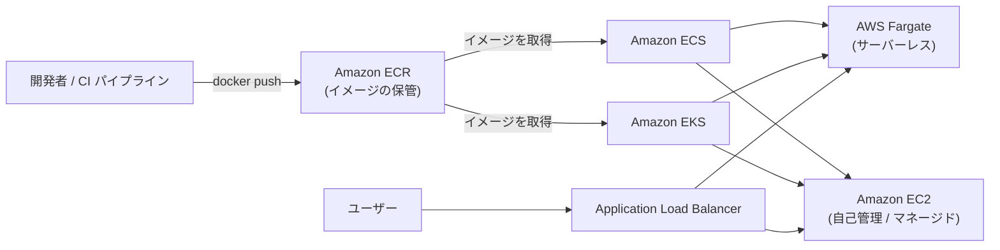
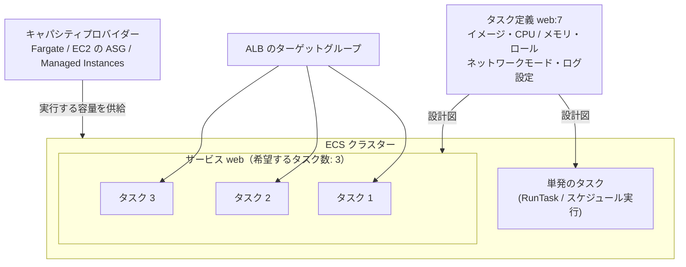
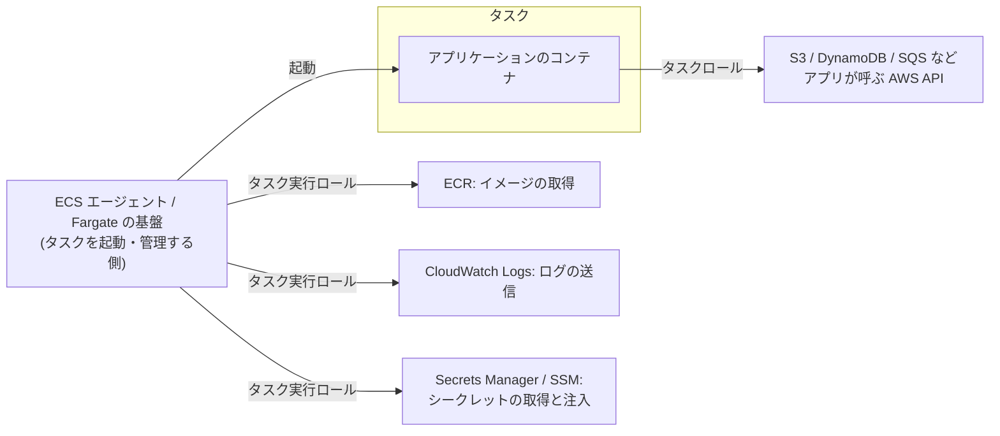
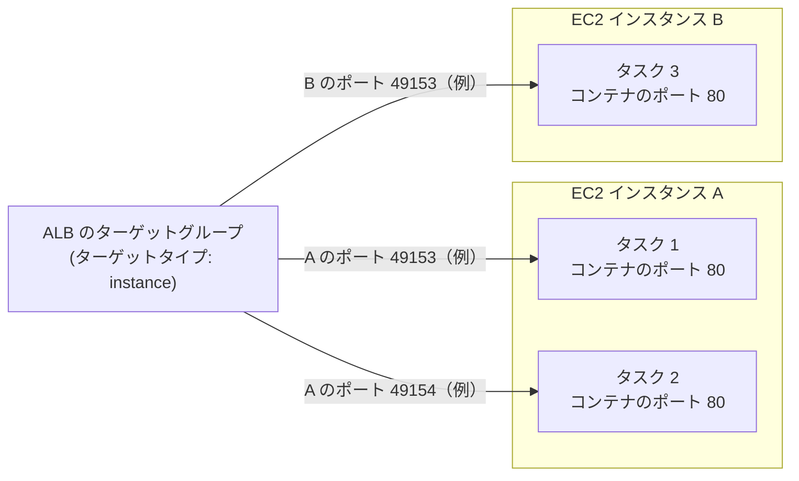
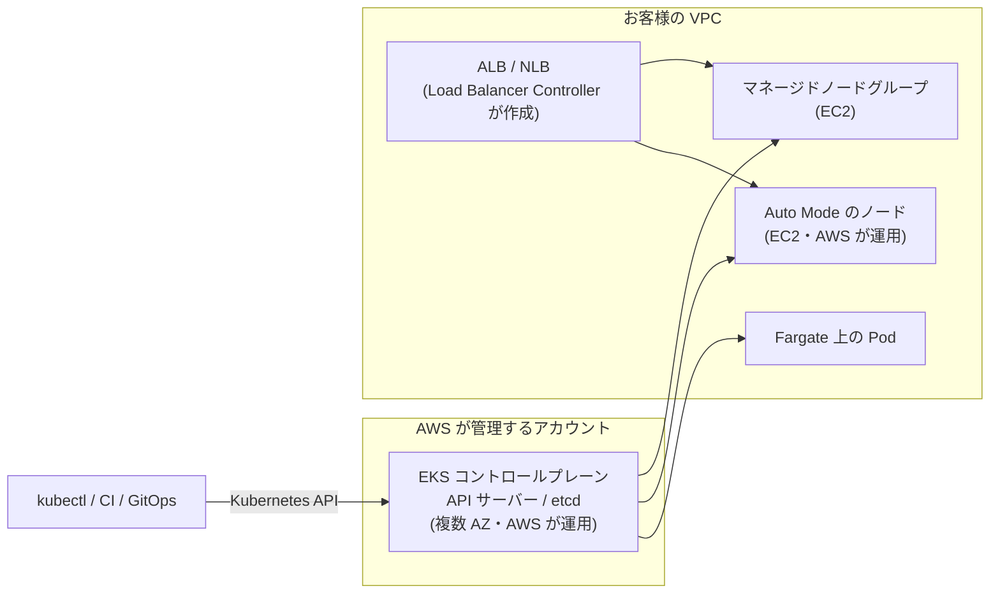
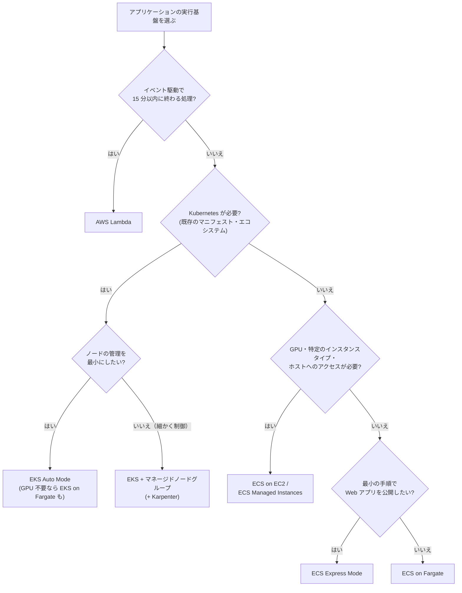

[ホーム](../README.md) > [Phase 2: アソシエイト](README.md) > コンテナ

# コンテナ（ECS / EKS / Fargate / ECR）

> **この章のゴール**
> - コンテナとオーケストレーションの役割を説明し、AWS のコンテナサービスの全体像を描ける
> - ECR のイメージスキャン・ライフサイクルポリシー・レプリケーションを使い分けられる
> - ECS の構成要素（クラスター・タスク定義・タスク・サービス）と、起動タイプ・キャパシティプロバイダーを説明できる
> - **タスクロールとタスク実行ロールの違い**を説明できる
> - EKS のノードの選択肢（マネージドノードグループ・Fargate・Auto Mode）と、Pod に IAM 権限を与える方法を説明できる
> - ECS / EKS / Fargate / Lambda / Elastic Beanstalk を要件から選べる
>
> **対応試験**: SAA-C03（D2: 弾力性に優れたアーキテクチャの設計、D3: 高性能なアーキテクチャの設計）／SAP-C03 の前提知識（コンテナのセキュリティ、ECS Service Connect）
> **目安時間**: 4 時間（読む 3 時間 / 確認問題 1 時間）

## この章の全体像

コンテナは、アプリケーションを「どこでも同じように動く箱」にまとめる技術です。ただし、本番環境で数十〜数千のコンテナを動かすには、配置・起動・監視・入れ替え・スケーリングを自動化する**オーケストレーション**が欠かせません。AWS のコンテナサービスは、次の 3 つのレイヤーで整理すると理解しやすくなります。



| レイヤー | 役割 | AWS のサービス |
|---|---|---|
| レジストリ | コンテナイメージを保管・配布する | Amazon ECR |
| オーケストレーション（コントロールプレーン） | どこで・いくつ・どう動かすかを決め、あるべき状態を維持する | Amazon ECS、Amazon EKS |
| コンピューティング（データプレーン） | コンテナが実際に動く場所 | AWS Fargate、Amazon EC2（自己管理 / ECS Managed Instances / EKS Auto Mode）、オンプレミス（ECS Anywhere、EKS Hybrid Nodes） |

> [!TIP]
> **試験のポイント**: 「コンテナを使いたいが、サーバー（EC2）の管理はしたくない」→ **Fargate**。「Kubernetes を使いたい」「既存の Kubernetes のマニフェストを移行したい」→ **EKS**。「AWS のサービスとの統合が簡単なコンテナオーケストレーション」→ **ECS**。

## 1. コンテナとオーケストレーションの復習

### 1.1 コンテナとは

コンテナは、アプリケーションとその依存関係（ライブラリ、ランタイム、設定）を 1 つの**イメージ**にまとめ、ホスト OS のカーネルを共有しながら、プロセスとして隔離して動かす仕組みです（仮想化の基礎は [サーバー・OS・仮想化の基礎](../01-foundations/02-server-os-basics.md) を参照）。

| 観点 | 仮想マシン（EC2 インスタンス） | コンテナ |
|---|---|---|
| 隔離の単位 | ゲスト OS ごと（カーネルも別） | プロセス（ホストのカーネルを共有） |
| 起動時間 | 数十秒〜数分 | 数秒以下 |
| サイズ | GB 単位 | MB〜数百 MB が中心 |
| 集積度 | 低い | 高い（1 台のホストで多数動かせる） |
| 向いている用途 | OS ごとの隔離、従来型のアプリケーション | マイクロサービス、CI/CD、環境の再現性 |

- **イメージ**: 読み取り専用のテンプレート。Dockerfile から作成し、レイヤーの積み重ねで構成される
- **コンテナ**: イメージから起動した実行中のインスタンス
- **レジストリ**: イメージの保管場所（Amazon ECR、Docker Hub など）

同じイメージを開発・テスト・本番で使うため、「開発環境では動いたのに本番では動かない」という問題を減らせます。

### 1.2 オーケストレーションが必要な理由

コンテナが増えると、次のような作業を人手で行うのは現実的ではなくなります。

- **スケジューリング**: どのホストでどのコンテナを動かすか（CPU・メモリの空きや AZ の分散を考慮）
- **自己修復**: 停止したコンテナを検知して自動的に再起動する
- **スケーリング**: 負荷に応じてコンテナの数とホストの数を増減する
- **デプロイ**: 新しいバージョンに少しずつ入れ替え、失敗したら戻す
- **サービス間の通信**: 変わり続ける IP アドレスを意識せずに、他のサービスを呼び出せるようにする
- **ロードバランサーへの登録、シークレットの注入、ログの収集**

AWS には 2 つのオーケストレーターがあります。**Amazon ECS** は AWS 独自のシンプルなオーケストレーターで、IAM・ALB・CloudWatch などとの統合が深く、追加のコントロールプレーン料金がかかりません。**Amazon EKS** は業界標準の Kubernetes をマネージドで提供し、豊富なエコシステムとポータビリティ（他の環境でも同じ API で動かせること）が強みです。

## 2. Amazon ECR（Elastic Container Registry）

Amazon Elastic Container Registry（Amazon ECR）は、フルマネージドのコンテナレジストリです。ECS・EKS・Lambda（コンテナイメージ）などから、IAM で制御しながらイメージを取得できます。

### 2.1 プライベートリポジトリとパブリックレジストリ

- **プライベートレジストリ**: アカウント・リージョンごとに 1 つあり、その中に**リポジトリ**を作成します。アクセスは IAM ポリシーと**リポジトリポリシー**（リソースベースのポリシー。別アカウントからの pull の許可などに使う）で制御します。Docker クライアントは `aws ecr get-login-password` で取得した一時的なトークンでログインします。
- **パブリックレジストリ（Amazon ECR Public）**: 誰でも pull できるイメージを公開する場所です。公開されたイメージは Amazon ECR Public Gallery で検索できます。
- **暗号化**: イメージは保存時に既定で暗号化されます。リポジトリの作成時に AWS KMS のキーによる暗号化も選べます。
- **タグのイミュータビリティ**: 有効にすると、同じタグ（例: `v1.4.2`）でイメージを上書きできなくなり、「同じタグなのに中身が違う」事故を防げます。
- **プルスルーキャッシュ**: Docker Hub、Amazon ECR Public、Quay、GitHub Container Registry などの上流のレジストリのイメージを、プライベート ECR にキャッシュします。上流のレート制限やインターネットへの依存を避けられます。

### 2.2 イメージスキャン: 基本スキャンと拡張スキャン

| 観点 | 基本スキャン | 拡張スキャン |
|---|---|---|
| 仕組み | ECR が提供するスキャン | **Amazon Inspector** と統合したスキャン |
| タイミング | プッシュ時、または手動 | プッシュ時に加えて**継続的スキャン**（新しい脆弱性が公開されると、既存のイメージも自動で再評価） |
| 対象 | OS パッケージの脆弱性（CVE） | OS パッケージ + **プログラミング言語のパッケージ**（Python、Java、Node.js など） |
| 結果の確認 | ECR のコンソール / API、EventBridge | Inspector のコンソール、ECR、EventBridge（Security Hub にも集約できる） |
| 料金 | 追加料金なし | Amazon Inspector の料金 |

スキャン結果は EventBridge のイベントとしても発行されるため、「重大な脆弱性が見つかったら通知し、デプロイを止める」といった自動化ができます。

> [!TIP]
> **試験のポイント**: 「言語のライブラリも含めて脆弱性を検出したい」「プッシュ後に公開された脆弱性も自動で検出したい」→ ECR の**拡張スキャン（Amazon Inspector）**。「プッシュ時に OS パッケージの脆弱性を無料で確認したい」→ 基本スキャン。

### 2.3 ライフサイクルポリシー

CI/CD でビルドのたびにイメージをプッシュすると、古いイメージがたまり続けてストレージ料金が増えます。**ライフサイクルポリシー**を設定すると、条件に合うイメージを自動的に削除（期限切れに）できます。

```json
{
  "rules": [
    {
      "rulePriority": 1,
      "description": "タグのないイメージはプッシュから 14 日後に削除",
      "selection": {
        "tagStatus": "untagged",
        "countType": "sinceImagePushed",
        "countUnit": "days",
        "countNumber": 14
      },
      "action": { "type": "expire" }
    },
    {
      "rulePriority": 2,
      "description": "prod- で始まるタグのイメージは最新の 30 個だけを残す",
      "selection": {
        "tagStatus": "tagged",
        "tagPrefixList": ["prod-"],
        "countType": "imageCountMoreThan",
        "countNumber": 30
      },
      "action": { "type": "expire" }
    }
  ]
}
```

ポリシーを適用する前に、どのイメージが削除対象になるかをプレビューで確認できます。

### 2.4 レプリケーション

レジストリ単位の**レプリケーション設定**で、イメージを自動的に複製できます。

- **クロスリージョン**: 複数のリージョンでサービスを動かす場合や、DR のために別リージョンにイメージを置いておく場合
- **クロスアカウント**: 本番アカウントや共有サービスのアカウントにイメージを配布する場合（複製先のアカウントのレジストリで許可が必要）
- リポジトリ名のプレフィックスで、複製する対象を絞り込める

> [!NOTE]
> レプリケーションは「自分の ECR のイメージを別の場所へ複製する」機能、プルスルーキャッシュは「外部のレジストリのイメージを自分の ECR にキャッシュする」機能です。

### 2.5 プライベートサブネットからイメージを取得する

NAT ゲートウェイのないプライベートサブネットで ECS や EKS のタスクを動かす場合は、次の VPC エンドポイントが必要です。

| エンドポイント | 種類 | 用途 |
|---|---|---|
| `com.amazonaws.<リージョン>.ecr.api` | インターフェイス | ECR の API（認証トークンの取得など） |
| `com.amazonaws.<リージョン>.ecr.dkr` | インターフェイス | Docker Registry API（イメージの pull / push） |
| `com.amazonaws.<リージョン>.s3` | ゲートウェイ | **イメージのレイヤーは S3 に保存されている**ため |
| `com.amazonaws.<リージョン>.logs` | インターフェイス | awslogs ドライバーで CloudWatch Logs にログを送る場合 |

シークレットを Secrets Manager や SSM パラメータストアから取得する場合は、それらのエンドポイントも追加します。

> [!WARNING]
> **ひっかけ注意**: ECR 用のエンドポイント（`ecr.api` と `ecr.dkr`）だけを作り、**S3 のゲートウェイエンドポイントを忘れる**と、イメージのレイヤーを取得できずに `CannotPullContainerError` で失敗します（[第 2 章 VPC](02-vpc.md)）。

## 3. Amazon ECS（Elastic Container Service）

### 3.1 構成要素



| 要素 | 説明 |
|---|---|
| クラスター | タスクやサービスを動かす論理的なグループ |
| タスク定義 | コンテナの**設計図**（JSON）。イメージ、CPU・メモリ、ポート、環境変数、シークレット、IAM ロール、ネットワークモード、ログ設定などを定義する。変更するたびに新しいリビジョンになる |
| タスク | タスク定義から起動した実行単位（1 つ以上のコンテナのまとまり）。バッチ処理などは単発のタスクとして実行する |
| サービス | 指定した数のタスクを**常に維持**し、停止したタスクを自動で置き換える。ロードバランサーへの登録、デプロイ、Auto Scaling も管理する |
| キャパシティプロバイダー | タスクを動かす容量（Fargate、Fargate Spot、EC2 の Auto Scaling グループ、ECS Managed Instances）を供給する |
| コンテナエージェント | EC2 インスタンス上で ECS と通信するエージェント（EC2 を自分で管理する場合） |

タスク定義の例（抜粋）:

```json
{
  "family": "web",
  "requiresCompatibilities": ["FARGATE"],
  "networkMode": "awsvpc",
  "cpu": "512",
  "memory": "1024",
  "executionRoleArn": "arn:aws:iam::111122223333:role/ecsTaskExecutionRole",
  "taskRoleArn": "arn:aws:iam::111122223333:role/web-app-task-role",
  "containerDefinitions": [
    {
      "name": "app",
      "image": "111122223333.dkr.ecr.ap-northeast-1.amazonaws.com/web:1.4.2",
      "essential": true,
      "portMappings": [{ "containerPort": 8080, "protocol": "tcp" }],
      "secrets": [
        {
          "name": "DB_PASSWORD",
          "valueFrom": "arn:aws:secretsmanager:ap-northeast-1:111122223333:secret:prod/db-AbCdEf"
        }
      ],
      "logConfiguration": {
        "logDriver": "awslogs",
        "options": {
          "awslogs-group": "/ecs/web",
          "awslogs-region": "ap-northeast-1",
          "awslogs-stream-prefix": "app"
        }
      }
    }
  ]
}
```

サービスのスケジューリング戦略には、希望する数のタスクを AZ に分散して維持する **REPLICA** と、各 EC2 インスタンスに 1 つずつタスクを配置する **DAEMON**（ログ収集エージェントなど。EC2 のみ）があります。EC2 を使う場合は、**配置戦略**（`binpack`: 少ない台数に詰め込んでコストを下げる、`spread`: AZ やインスタンスに分散して可用性を高める、`random`）と**配置制約**も指定できます。

### 3.2 起動タイプとキャパシティプロバイダー

| 選択肢 | お客様が管理するもの | 特徴 | 向いているケース |
|---|---|---|---|
| **Fargate** | タスク定義のみ（サーバーの管理なし） | タスクごとに隔離された環境で動く。vCPU とメモリの量に応じた秒単位の課金 | ほとんどの Web・API・バッチ。運用負荷を最小にしたい |
| **Fargate Spot** | 同上 | AWS の余剰容量を使い、Fargate の料金から最大 70% 割引。中断される可能性がある（2 分前に通知） | 中断に耐えるバッチや開発環境、スケールアウトした分 |
| **EC2**（自己管理） | EC2 インスタンス（AMI、パッチ適用、スケーリング） | GPU や特定のインスタンスタイプを使える。高い集積率やリザーブドインスタンスなどでコストを詰められる | GPU、特殊な要件、大規模でコストを最適化したい |
| **ECS Managed Instances** | インスタンスの選択条件のみ（起動・パッチ適用・スケーリングは AWS） | EC2 の柔軟性（GPU など）と、マネージドな運用を両立する（2025 年 9 月に提供開始） | EC2 の機能が必要だが、インスタンスの運用は減らしたい |
| **External**（ECS Anywhere） | オンプレミスのサーバー | 自社のサーバーを ECS に登録し、同じ API で管理する | データを社外に出せない、既存のハードウェアを活用したい |

**キャパシティプロバイダー戦略**では、`base`（最低限そのプロバイダーで動かすタスク数）と `weight`（それを超えた分の配分比率）を指定します。

```text
例: FARGATE に base=2、weight=1 / FARGATE_SPOT に weight=3
→ 最初の 2 タスクは必ず通常の Fargate で動かし、それを超える分は Fargate : Fargate Spot = 1 : 3 で配分する
```

EC2 の Auto Scaling グループをキャパシティプロバイダーにする場合は、**マネージドスケーリング**（タスクの配置に必要な台数に合わせて ECS が ASG を増減する）と、**マネージド終了保護**（タスクが動いているインスタンスをスケールインで終了させない）を有効にするのが基本です。

> [!TIP]
> **試験のポイント**: 「中断に耐えられるコンテナのワークロードのコストを削減したい」→ Fargate Spot（または EC2 のスポットインスタンス）。「最低限の可用性は確保しつつ Spot を使いたい」→ キャパシティプロバイダー戦略の `base` で通常の Fargate を確保する。

### 3.3 タスクロールとタスク実行ロール（最重要）

ECS には IAM ロールが複数登場し、試験でも混同を狙った問題がよく出ます。



| 観点 | タスク実行ロール | タスクロール |
|---|---|---|
| 使う主体 | ECS エージェント / Fargate の基盤（**タスクを起動する側**） | **コンテナの中のアプリケーション** |
| 用途 | ECR からのイメージの取得、CloudWatch Logs へのログの送信、Secrets Manager / SSM パラメータストアからのシークレットの取得（環境変数への注入） | アプリケーションのコードが呼ぶ AWS API（S3、DynamoDB、SQS など） |
| タスク定義の項目 | `executionRoleArn` | `taskRoleArn` |
| 代表的なポリシー | `AmazonECSTaskExecutionRolePolicy`（シークレットを使う場合は取得の権限も追加） | アプリケーションの要件に合わせた最小権限のポリシー |

EC2 を自分で管理する場合は、さらに**コンテナインスタンスの IAM ロール**（インスタンスプロファイル）があり、ECS エージェントがインスタンスをクラスターに登録するために使います。このロールにアプリケーションの権限を付けると、そのインスタンス上のすべてのタスクが使えてしまうため、アプリケーションの権限は必ずタスクロールで与えます。

> [!WARNING]
> **ひっかけ注意**: 「アプリケーションが S3 にアクセスすると AccessDenied になる」→ 権限を追加するのは**タスクロール**です。タスク実行ロールに S3 の権限を追加しても、アプリケーションのコードからは使われません。逆に「イメージを pull できない」「ログが出ない」「シークレットを取得できずタスクが起動しない」→ **タスク実行ロール**を確認します。アクセスキーを環境変数やイメージに埋め込むのは誤りです。

### 3.4 ネットワークモード

| モード | 仕組み | 特徴 |
|---|---|---|
| **awsvpc** | タスクごとに ENI（VPC のプライベート IP アドレス）を割り当てる | タスク単位でセキュリティグループを設定できる。**Fargate では必須**。ALB / NLB のターゲットタイプは `ip`。EC2 ではインスタンスあたりの ENI 数が上限になるため、ENI トランキングで緩和する |
| **bridge** | Docker の仮想ブリッジを使い、ホストのポートとコンテナのポートを対応付ける | **動的ポートマッピング**で、1 台のインスタンスに同じタスクを複数配置できる（EC2 のみ）。Linux の EC2 で未指定のときの既定 |
| **host** | コンテナがホストのネットワークを直接使う | オーバーヘッドは小さいが、同じポートを使うタスクは 1 台に 1 つだけ（EC2 のみ） |
| **none** | 外部とのネットワーク接続なし | 特殊な用途 |

> [!TIP]
> **試験のポイント**: 「タスクごとにセキュリティグループを割り当てたい」→ awsvpc モード。Fargate は常に awsvpc です。

### 3.5 ロードバランサーとの連携

ECS のサービスは ALB や NLB と統合でき、タスクの起動・停止に合わせてターゲットグループへの登録・解除を自動で行います。ALB のパスベース・ホストベースのルーティングを使えば、1 つの ALB で複数のサービス（`/api/*` → api サービス、`/admin/*` → admin サービス）に振り分けられます。

**動的ポートマッピング**（bridge モード）では、タスク定義でホストポートを `0` にすると、ECS がインスタンスの空いているエフェメラルポートを割り当て、ALB のターゲットグループに「インスタンス + ポート」として登録します。



- bridge モード: インスタンスのセキュリティグループで、ALB のセキュリティグループからの**エフェメラルポートの範囲**を許可する
- awsvpc モード: タスクごとに IP アドレスがあるため、どのタスクも同じポート（例: 80）で待ち受けられる。ターゲットタイプは `ip` で、タスクのセキュリティグループで ALB のセキュリティグループからのポートを許可する

> [!WARNING]
> **ひっかけ注意**: **Classic Load Balancer は動的ポートマッピングに対応していません**。ECS で 1 台に同じタスクを複数配置して負荷分散するなら ALB（または NLB）を使います（[第 4 章](04-elb-auto-scaling.md)）。

### 3.6 Service Auto Scaling とクラスターのスケーリング

ECS のスケーリングは 2 層で考えます。

| 層 | 仕組み | 使うもの |
|---|---|---|
| タスクの数 | **Service Auto Scaling**（Application Auto Scaling）で、サービスの希望タスク数を増減する | ターゲット追跡（平均 CPU 使用率、平均メモリ使用率、ALB のターゲットあたりのリクエスト数）、ステップスケーリング、スケジュールに基づくスケーリング。SQS のバックログなどのカスタムメトリクスも使える |
| 容量（インスタンス）の数 | タスクを配置する場所が足りなくなったら、キャパシティプロバイダーの**マネージドスケーリング**で EC2 の台数を増やす | EC2 の Auto Scaling グループ（Fargate と ECS Managed Instances では AWS が容量を用意するため不要） |

### 3.7 デプロイ

| 方式 | 内容 |
|---|---|
| ローリング更新（既定） | `minimumHealthyPercent`（既定 100%）と `maximumPercent`（既定 200%）の範囲で、新旧のタスクを順に入れ替える。**デプロイサーキットブレーカー**を有効にすると、失敗を検知して自動でロールバックする |
| ブルー/グリーン（ECS の組み込み機能） | 2025 年 7 月から、CodeDeploy なしで ECS だけで実行できる。新しいタスク群（グリーン）を起動して検証し、トラフィックを切り替え、一定時間（ベイク時間）様子を見てから古いタスク群（ブルー）を削除する。問題があればすぐにロールバックでき、ライフサイクルフックで Lambda 関数による検証も組み込める |
| ブルー/グリーン（AWS CodeDeploy） | 従来の方式。CodeDeploy がトラフィックの切り替え（カナリア、リニア、一括）を制御する |
| 外部 | サードパーティのデプロイツールで制御する |

> [!TIP]
> **試験のポイント**: 「新しいバージョンのデプロイの失敗を自動で検知してロールバックしたい」→ デプロイサーキットブレーカー。「本番のトラフィックを切り替える前に新しいバージョンを検証し、すぐに戻せるようにしたい」→ ブルー/グリーンデプロイ。

### 3.8 サービス間の通信: Service Connect

マイクロサービスでは、「注文サービスが決済サービスを呼ぶ」のように、サービス同士が通信します。タスクの IP アドレスは起動のたびに変わるため、相手をどう見つけるか（サービスディスカバリー）と、どう安全・確実に呼ぶかが課題になります。

| 方法 | 仕組み | 特徴 |
|---|---|---|
| **ECS Service Connect** | AWS Cloud Map の名前空間に各サービスを登録し、ECS が各タスクに**プロキシ（Envoy ベース）**を自動で追加する。呼び出し側は `http://payments:8080` のような短い名前でアクセスする | 負荷分散、再試行、外れ値の検出、接続のドレイン、トラフィックのメトリクス（CloudWatch）を、アプリのコードを変えずに利用できる。AWS Private CA による TLS の暗号化にも対応。2026 年 7 月にゾーン認識ルーティングも追加された。**ECS 同士の通信の第一候補** |
| サービスディスカバリー（Cloud Map の DNS） | タスクの IP アドレスを DNS に登録し、DNS 名で解決する | シンプルだが、再試行やメトリクスなどの機能はない |
| 内部 ALB | サービスごとに内部向けの ALB を置く | 従来からの方法。ALB のコストとホップが増える |
| **Amazon VPC Lattice** | 複数の VPC・アカウントにまたがるサービス間の通信を、アプリケーション層でつなぐ | ECS・EKS・EC2・Lambda が混在する環境、クロスアカウント、IAM による認可ポリシー |

> [!IMPORTANT]
> サービスメッシュの **AWS App Mesh は 2026 年 9 月 30 日にサポートを終了**します（2024 年 9 月から新規のお客様は利用できません）。ECS では **Service Connect**、EKS や VPC・アカウントをまたぐ通信では **Amazon VPC Lattice** に移行します（第 6 節）。

### 3.9 ストレージ・ログ・シークレット・運用

- **ストレージ**: タスクのエフェメラルストレージ（Fargate は既定 20 GiB、最大 200 GiB。タスクが止まると消える）、**Amazon EFS**（複数のタスク・AZ から共有できる永続ストレージ）、**Amazon EBS ボリューム**（タスクの起動時にタスクごとに 1 つアタッチする高性能なブロックストレージ）
- **ログ**: `awslogs` ドライバーで CloudWatch Logs に送るのが基本。**FireLens**（Fluent Bit）を使うと、S3・Firehose・OpenSearch Service・サードパーティなど複数の送信先に振り分けられる。メトリクスは **CloudWatch Container Insights** で収集する
- **シークレット**: タスク定義の `secrets` で、Secrets Manager や SSM パラメータストアの値を環境変数として注入する。イメージやタスク定義に平文で書かない
- **ECS Exec**: 実行中のコンテナに、SSH なしで対話的にコマンドを実行できる（Systems Manager の Session Manager を利用し、操作を記録できる）

### 3.10 新しい選択肢: ECS Express Mode

**Amazon ECS Express Mode**（2025 年 11 月に提供開始）は、コンテナイメージなどの最小限の情報を指定するだけで、**Fargate のサービス、ALB、Auto Scaling、HTTPS の URL** をまとめて構成する機能です。

- 追加料金はなく、作成された Fargate や ALB などのリソースの料金だけがかかる
- 作成されるのは通常の ECS サービスや ALB なので、後から細かい設定を変更できる
- 新規のお客様の受け付けを終了した **AWS App Runner の推奨の移行先**（第 6 節）

> [!TIP]
> **試験のポイント**: 「コンテナ化した Web アプリを、最小の手順と運用負荷で HTTPS 公開したい」→ 現在は ECS Express Mode が第一候補です。SAA-C03 の問題では、同じ要件の正解として App Runner が登場する可能性があります（新規利用はできない点に注意）。

## 4. Amazon EKS（Elastic Kubernetes Service）

### 4.1 アーキテクチャ

**Kubernetes** は、オープンソースのコンテナオーケストレーターです。**Pod**（1 つ以上のコンテナのまとまり。最小のデプロイ単位）、**Deployment**（Pod の数とバージョンの管理）、**Service**（Pod へのアクセスの窓口）、**Ingress**（HTTP のルーティング）などのリソースを YAML の**マニフェスト**で宣言し、`kubectl` や GitOps のツールで適用します。

**Amazon EKS** は、Kubernetes の**コントロールプレーン**（API サーバーと etcd）を AWS が複数の AZ で運用するマネージドサービスです。コントロールプレーンの可用性・スケーリング・パッチ適用は AWS が担い、アップストリームの Kubernetes と互換性があるため、他の環境の Kubernetes と同じツールやマニフェストを使えます。



- **料金**: クラスターごとの時間料金（2026年9月時点で、標準サポート期間中のバージョンは 1 クラスターあたり 1 時間 0.10 USD）+ ノード（EC2 / Fargate）の料金
- **バージョン**: 各 Kubernetes バージョンには標準サポート期間（14 か月）があり、その後の延長サポート期間（12 か月）は追加料金がかかります。定期的なバージョンアップの計画が必要です
- **クラスターへのアクセス**: IAM のユーザーやロールに Kubernetes の権限を与えるには、**アクセスエントリー**を使います（従来の `aws-auth` ConfigMap の編集に代わる方法）

### 4.2 ノード（データプレーン）の選択肢

| 選択肢 | 管理の範囲 | 特徴 | 向いているケース |
|---|---|---|---|
| **マネージドノードグループ** | EKS がノード（EC2 の Auto Scaling グループ）の作成と更新（Pod を退避させながらの入れ替え）を支援。インスタンスタイプや AMI の選択はお客様 | オンデマンドとスポットに対応 | 標準的な選択肢。ノードを細かく制御したい |
| **セルフマネージドノード** | すべてお客様（ASG、AMI、更新） | 最大の自由度 | 特殊な OS や構成が必要 |
| **AWS Fargate** | Pod 単位のサーバーレス。ノードの管理なし | **DaemonSet、GPU、特権コンテナは使えない**。Fargate プロファイル（名前空間とラベル）で対象の Pod を選ぶ | ノードを一切管理したくないステートレスなワークロード |
| **EKS Auto Mode** | **AWS がノードの起動・スケーリング・OS の更新と、主要なアドオン（ネットワーク、ストレージ、ロードバランシング）を管理** | Karpenter ベースの自動スケーリング。ノードは定期的に新しいものに置き換えられる。GPU やスポットなど EC2 の選択肢を活かせる。EC2 の料金に加えて管理料金がかかる | 運用負荷を最小にしつつ、EC2 の柔軟性も必要 |

オンプレミスのサーバーを EKS のノードとして参加させる **EKS Hybrid Nodes** もあります。

### 4.3 スケーリング

| 対象 | 仕組み |
|---|---|
| Pod の数 | **Horizontal Pod Autoscaler（HPA）**: CPU などのメトリクスに応じて Pod の数を増減する |
| ノードの数 | **Karpenter**: スケジュールできずに待っている Pod の要件（CPU、メモリ、アーキテクチャ、スポットの可否など）から、最適なインスタンスを直接起動する。不要になったノードを統合（consolidation）してコストを下げる。**Cluster Autoscaler** は Auto Scaling グループの台数を調整する従来の方式 |

### 4.4 ネットワーク

- **Amazon VPC CNI**: Pod に VPC のプライベート IP アドレスを割り当てるため、Pod は VPC 内の他のリソースと直接通信できます。一方で IP アドレスを多く消費するため、サブネットのサイズを大きめに設計します（プレフィックス委任や、セカンダリ CIDR を使うカスタムネットワーキングなどの対策もあります）。
- **AWS Load Balancer Controller**: Kubernetes の Ingress から ALB を、`type: LoadBalancer` の Service から NLB を自動で作成します。
- Pod 用のセキュリティグループを使うと、Pod 単位で通信を制御できます。

### 4.5 Pod に IAM 権限を与える: EKS Pod Identity と IRSA

Pod で動くアプリケーションが AWS API を呼ぶ場合、Pod（正確には Kubernetes のサービスアカウント）ごとに IAM ロールを割り当てます。

| 観点 | IRSA（IAM Roles for Service Accounts） | EKS Pod Identity |
|---|---|---|
| 仕組み | クラスターごとに IAM OIDC プロバイダーを作成する。サービスアカウントに IAM ロールの ARN を注釈し、Pod は Web ID トークンで `AssumeRoleWithWebIdentity` を呼ぶ | **EKS Pod Identity エージェント**（アドオン）を導入し、EKS の API で「クラスター・名前空間・サービスアカウント」と IAM ロールの**関連付け**を作成する |
| IAM ロールの信頼ポリシー | クラスターの OIDC プロバイダーとサービスアカウント名を条件に書く（クラスターが増えるたびに更新が必要） | サービスプリンシパル `pods.eks.amazonaws.com` を信頼する（**クラスターに依存しないため、複数のクラスターで再利用しやすい**） |
| OIDC プロバイダー | 必要 | 不要 |
| その他 | 以前からある方式で、幅広い環境で使える | セッションタグ（クラスター名、名前空間など）を使った属性ベースのアクセス制御（ABAC）ができる |

> [!WARNING]
> **ひっかけ注意**: **ノードの IAM ロール**（インスタンスプロファイル）にアプリケーションの権限を付けると、そのノード上の**すべての Pod** が使えてしまい、最小権限に反します。Pod ごとの権限は Pod Identity または IRSA で与えます。アクセスキーを Kubernetes の Secret に入れるのも誤りです。

> [!TIP]
> **試験のポイント**: 「Pod ごとに異なる AWS の権限を与えたい」→ EKS Pod Identity または IRSA。「OIDC プロバイダーの管理を避けたい」「同じロールを複数のクラスターで使いたい」→ **EKS Pod Identity**。古い問題では IRSA が正解として登場します。

## 5. AWS Fargate

### 5.1 特徴と責任の分担

**AWS Fargate** は、コンテナ用のサーバーレスのコンピューティングエンジンで、ECS と EKS の両方で使えます。

- EC2 インスタンスのプロビジョニング、パッチ適用、スケーリング、集積率の管理が不要
- 各タスク（Pod）は**専用の隔離された環境**で動き、他のタスクとカーネルを共有しない
- タスクに割り当てた vCPU とメモリの量に応じた秒単位の課金（Linux は最低 1 分）
- **Compute Savings Plans** の対象。ECS では **Fargate Spot** も使える（EKS では使えない）
- ECS では、x86_64 と Arm（Graviton）、Linux と Windows のコンテナに対応

責任共有モデルでは、ホストの OS、コンテナランタイム、エージェントの管理は AWS の責任です。**コンテナイメージの中身（OS パッケージやライブラリの脆弱性への対応を含む）、アプリケーション、タスク定義、IAM、セキュリティグループ**はお客様の責任です。

### 5.2 Fargate の制約

| 項目 | Fargate での扱い（2026年9月時点） |
|---|---|
| タスクのサイズ | 0.25〜16 vCPU、メモリは最大 120 GB（CPU とメモリの組み合わせは決められた範囲から選ぶ） |
| エフェメラルストレージ | 既定 20 GiB、最大 200 GiB |
| ネットワークモード | awsvpc のみ |
| GPU | 使えない（GPU が必要なら ECS on EC2、ECS Managed Instances、EKS の EC2 ノード） |
| 特権コンテナ・ホストへのアクセス | 使えない（SSH も不可。調査には ECS Exec を使う） |
| デーモン | ECS の DAEMON スケジューリングや、EKS の DaemonSet は使えない（サイドカーで代替） |
| 永続ストレージ | Amazon EFS をマウントできる（ECS では EBS ボリュームのアタッチも可能） |

### 5.3 Fargate か EC2 か

| 観点 | Fargate | EC2（ECS on EC2 / EKS の EC2 ノード） |
|---|---|---|
| 運用負荷 | 小さい（インスタンスの管理なし） | 大きい（AMI、パッチ、スケーリング、集積率の管理） |
| コスト | タスク単位の課金で無駄が少ない。変動の大きいワークロードに有利 | 集積率を高め、リザーブドインスタンス・Savings Plans・スポットを組み合わせると単価を下げられる |
| 柔軟性 | 前述の制約がある | GPU、特定のインスタンスタイプ、ホストレベルのエージェントを使える |
| 隔離 | タスクごとに隔離 | 同じインスタンス上のタスクはカーネルを共有 |

中間の選択肢として、EC2 の柔軟性を保ちながらインスタンスの運用を AWS に任せる **ECS Managed Instances** と **EKS Auto Mode** があります。

## 6. App Runner と App Mesh の現状

### 6.1 AWS App Runner（新規のお客様の受け付けを終了）

AWS App Runner は、ソースコードやコンテナイメージから Web アプリケーションや API を、インフラを意識せずに実行できるフルマネージドサービスです。**2026 年 4 月 30 日に新規のお客様の受け付けを終了**しました（既存のお客様は引き続き利用できます）。AWS は移行先として **ECS Express Mode** を推奨しています。

> [!WARNING]
> **ひっかけ注意**: SAA-C03 の問題や古い教材では、「コンテナ化した Web アプリを最小の運用負荷で公開する」の正解として App Runner が登場することがあります。試験ではその前提で解答しつつ、実務の新規構築では ECS Express Mode を選ぶ、と覚えておきましょう。

### 6.2 AWS App Mesh（2026 年 9 月 30 日にサポート終了）

AWS App Mesh は、Envoy プロキシを使ったサービスメッシュです。2024 年 9 月 24 日に新規のお客様の受け付けを終了し、**2026 年 9 月 30 日にサポートを終了**します。

| 移行元の環境 | 推奨の移行先 |
|---|---|
| ECS のサービス間の通信 | **Amazon ECS Service Connect** |
| EKS、VPC やアカウントをまたぐサービス間の通信 | **Amazon VPC Lattice** |

サービスの提供状況は、AWS の[サポート終了が予定されているサービスの一覧](https://docs.aws.amazon.com/general/latest/gr/sunset_services.html)、[新規のお客様の受け付けを終了したサービスの一覧](https://docs.aws.amazon.com/general/latest/gr/maintenance_services.html)、この教材の[サービスの変更点](../06-reference/service-changes.md)で確認してください。

## 7. 実行基盤の選定

| サービス | お客様が管理するもの | 実行時間 | 強み | 試験のキーワード |
|---|---|---|---|---|
| AWS Lambda | コード | 最大 15 分 | イベント駆動、ゼロまで縮小、ミリ秒単位の課金 | 「イベント駆動」「短時間の処理」「サーバー管理なし」 |
| ECS on Fargate | タスク定義 | 制限なし | サーバー管理なしで、常時稼働のコンテナを動かせる | 「コンテナ」「サーバーの管理を避けたい」 |
| ECS Express Mode | イメージと最小限の設定 | 制限なし | 1 ステップで HTTPS の Web アプリを公開（Fargate + ALB + Auto Scaling） | 「最小の手順で Web アプリを公開」（旧 App Runner の用途） |
| ECS on EC2 / ECS Managed Instances | インスタンス（Managed Instances は選択条件のみ） | 制限なし | GPU、特定のインスタンスタイプ、高い集積率 | 「GPU」「インスタンスを制御したい」 |
| Amazon EKS | クラスターと、ノードの方式の選択 | 制限なし | Kubernetes 標準、豊富なエコシステム、ポータビリティ | 「Kubernetes」「既存のマニフェスト」「ハイブリッド / マルチクラウド」 |
| AWS Elastic Beanstalk | アプリケーションのコード（プラットフォームを選ぶ） | 制限なし | EC2・ELB・Auto Scaling を自動で構築する PaaS。Docker にも対応 | 「開発者がコードをアップロードするだけで Web アプリを動かしたい」 |



> [!NOTE]
> 大量のバッチジョブ（数千のジョブをキューに入れて順に実行するなど）には、ジョブのキューイングと容量の管理を担う **AWS Batch** も選択肢になります。AWS Batch は ECS・EKS・Fargate の上でジョブを実行します。

## まとめ

- コンテナはアプリケーションと依存関係をイメージにまとめ、カーネルを共有して隔離して動かす。**オーケストレーション**で配置・自己修復・スケーリング・デプロイを自動化する。
- ECR の**基本スキャン**は OS パッケージ（無料）、**拡張スキャン**は Amazon Inspector による継続的なスキャンで言語のパッケージも対象。古いイメージは**ライフサイクルポリシー**で削除し、**レプリケーション**でリージョン・アカウントをまたいで複製する。
- プライベートサブネットからの pull には、`ecr.api`・`ecr.dkr` のインターフェイスエンドポイントと **S3 のゲートウェイエンドポイント**（+ CloudWatch Logs）が必要。
- ECS は**クラスター・タスク定義・タスク・サービス**で構成される。容量は**キャパシティプロバイダー**（Fargate、Fargate Spot、EC2 の ASG、ECS Managed Instances）で供給し、`base` と `weight` で配分する。
- **タスク実行ロール**はイメージの取得・ログ・シークレットの取得（起動する側）、**タスクロール**はアプリケーションが呼ぶ AWS API。混同に注意。
- **awsvpc** はタスクごとに ENI とセキュリティグループ（Fargate は必須、ターゲットタイプ `ip`）。**bridge** の動的ポートマッピングは ALB / NLB で使える（CLB は非対応）。
- スケーリングは **Service Auto Scaling（タスク数）**と**キャパシティプロバイダーのマネージドスケーリング（EC2 の台数）**の 2 層。デプロイは**サーキットブレーカー**と**組み込みのブルー/グリーン**。
- ECS のサービス間の通信は **Service Connect**。**App Mesh は 2026 年 9 月 30 日にサポート終了**（ECS → Service Connect、EKS・VPC またぎ → VPC Lattice）。
- EKS は AWS 管理のコントロールプレーン + ノード（マネージドノードグループ、セルフマネージド、Fargate、**Auto Mode**）。ノードの自動スケーリングは **Karpenter**。Pod の権限は **EKS Pod Identity**（OIDC プロバイダー不要）または IRSA で与え、ノードのロールに頼らない。
- Fargate は最大 16 vCPU・120 GB、エフェメラルストレージ最大 200 GiB で、GPU・特権コンテナ・デーモンは使えない。**App Runner は新規受け付けを終了**しており、後継は **ECS Express Mode**。

## 確認問題

### 問1
ある企業は、ECS on Fargate で Web アプリケーションを実行しています。タスク定義では、プライベートな ECR リポジトリのイメージを使い、ログを CloudWatch Logs に送信し、データベースのパスワードを Secrets Manager から環境変数として注入しています。新たに追加した機能で、アプリケーションが S3 バケットのオブジェクトを読み取ろうとすると AccessDenied エラーになります。タスクの起動とログの送信は正常です。最も適切な対応はどれですか。

- A. タスク定義のタスクロール（`taskRoleArn`）に、対象の S3 バケットを読み取る権限を持つ IAM ポリシーを付与する
- B. タスク実行ロール（`executionRoleArn`）に、対象の S3 バケットを読み取る権限を追加する
- C. S3 の読み取り権限を持つ IAM ユーザーのアクセスキーを、タスク定義の環境変数に設定する
- D. ECR リポジトリのリポジトリポリシーに、S3 バケットへのアクセスを許可するステートメントを追加する

<details>
<summary>解答と解説</summary>

**正解: A**

**解説**: コンテナの中のアプリケーションが AWS API を呼び出すときの権限は、**タスクロール**で与えます。タスク実行ロールは、ECS エージェントや Fargate の基盤がイメージの取得・ログの送信・シークレットの取得に使うロールです。

**各選択肢の検討**
- A: ✓ アプリケーションの権限を最小権限で付与する正しい方法です。
- B: ✗ タスク実行ロールの権限は、アプリケーションのコードからは使われません。
- C: ✗ 長期的な認証情報を環境変数に置くのはセキュリティ上のアンチパターンで、ローテーションの負担も生じます。
- D: ✗ リポジトリポリシーは ECR のリポジトリへのアクセスを制御するもので、S3 の権限とは無関係です。

</details>

### 問2
ある企業は、インターネットへの経路がないプライベートサブネットで ECS on Fargate のタスクを実行しようとしています。セキュリティポリシーにより、NAT ゲートウェイやパブリック IP アドレスは使用できません。タスクは `CannotPullContainerError` で起動に失敗します。イメージはプライベートな ECR リポジトリにあり、ログは awslogs ドライバーで CloudWatch Logs に送信します。問題を解決するために必要な構成はどれですか。

- A. パブリックサブネットに NAT ゲートウェイを作成し、プライベートサブネットのデフォルトルートをそこに向ける
- B. タスクのネットワーク設定で、パブリック IP アドレスの自動割り当てを有効にする
- C. `ecr.api` と `ecr.dkr` のインターフェイス VPC エンドポイント、S3 のゲートウェイ VPC エンドポイント、CloudWatch Logs のインターフェイス VPC エンドポイントを作成する
- D. ECR リポジトリのリポジトリポリシーで、タスクの VPC からの `ecr:BatchGetImage` を許可する

<details>
<summary>解答と解説</summary>

**正解: C**

**解説**: インターネットを経由せずに ECR からイメージを取得するには、ECR の API 用と Docker Registry 用のインターフェイスエンドポイントに加えて、イメージのレイヤーが保存されている S3 のゲートウェイエンドポイントが必要です。ログを送るには CloudWatch Logs のエンドポイントも必要です。

**各選択肢の検討**
- A: ✗ NAT ゲートウェイの使用はセキュリティポリシーで禁止されています。
- B: ✗ パブリック IP アドレスの使用は禁止されており、プライベートサブネットにはインターネットゲートウェイへの経路もありません。
- C: ✓ インターネットを使わずに、イメージの取得とログの送信ができます。
- D: ✗ 原因は権限ではなく、ECR と S3 へのネットワーク経路がないことです。

</details>

### 問3
ある企業は、ECS の EC2 起動タイプで Web アプリケーションを実行しています。コンテナはポート 80 で待ち受けます。コスト効率を高めるため、1 台の EC2 インスタンスに同じサービスのタスクを複数配置し、ALB で負荷分散したいと考えています。現在はタスク定義でホストポート 80 を固定しているため、1 台に 1 タスクしか配置できません。最も適切な方法はどれですか。

- A. NLB に切り替え、ホストポート 80 を固定したまま、インスタンスごとに NLB のリスナーを追加する
- B. ネットワークモードを bridge にしてホストポートを 0（動的ポートマッピング）にし、ALB のターゲットグループ（ターゲットタイプ instance）で使う。インスタンスのセキュリティグループでは、ALB のセキュリティグループからのエフェメラルポートの範囲を許可する
- C. ネットワークモードを host に変更する
- D. Classic Load Balancer に切り替えて、動的ポートマッピングを有効にする

<details>
<summary>解答と解説</summary>

**正解: B**

**解説**: 動的ポートマッピングでは、ECS がタスクごとに空いているホストポートを割り当て、ALB のターゲットグループに「インスタンス + ポート」として登録するため、1 台に同じタスクを複数配置できます。なお、awsvpc モード（ターゲットタイプ `ip`）でもタスクごとに IP アドレスがあるためポートは競合しませんが、EC2 ではインスタンスあたりの ENI 数に注意が必要です（ENI トランキングで緩和）。

**各選択肢の検討**
- A: ✗ 同じホストポートを複数のタスクで使うことはできず、ポートの競合は解消しません。
- B: ✓ 1 台に複数のタスクを配置して負荷分散できます。
- C: ✗ host モードではコンテナがホストのポートを直接使うため、同じポートのタスクは 1 台に 1 つだけです。
- D: ✗ Classic Load Balancer は動的ポートマッピングに対応していません。

</details>

### 問4
ある企業は、複数の EKS クラスターで多数のマイクロサービスを実行しています。各マイクロサービスの Pod には、それぞれ異なる AWS の権限（S3、DynamoDB、SQS など）が必要です。現在は、ノードの IAM ロールにすべての権限を付与しています。最小権限を実現し、同じ IAM ロールを複数のクラスターで再利用したいと考えています。クラスターごとの IAM OIDC プロバイダーの管理や、クラスターが増えるたびの信頼ポリシーの更新は避けたいと考えています。最も適切な方法はどれですか。

- A. ノードの IAM ロールはそのままにして、Kubernetes の NetworkPolicy で Pod ごとに AWS API へのアクセスを制限する
- B. IAM ユーザーのアクセスキーを Kubernetes の Secret に保存し、各 Pod にマウントする
- C. クラスターごとに IAM OIDC プロバイダーを作成し、IRSA でサービスアカウントごとに IAM ロールを割り当てる
- D. EKS Pod Identity エージェントを導入し、サービスアカウントと IAM ロールの Pod Identity の関連付けを作成する。ノードの IAM ロールからはアプリケーション用の権限を削除する

<details>
<summary>解答と解説</summary>

**正解: D**

**解説**: EKS Pod Identity は、信頼ポリシーでサービスプリンシパル `pods.eks.amazonaws.com` を信頼するため、OIDC プロバイダーが不要で、同じ IAM ロールを複数のクラスターで再利用しやすくなっています。ノードのロールから権限を外すことで、最小権限も実現できます。

**各選択肢の検討**
- A: ✗ NetworkPolicy は Pod の通信を制御するもので、IAM の権限は分離できません。ノードのロールの権限はすべての Pod が使えてしまいます。
- B: ✗ 長期的な認証情報の配布とローテーションが必要になり、ベストプラクティスに反します。
- C: ✗ 最小権限は実現できますが、クラスターごとの OIDC プロバイダーと信頼ポリシーの管理が必要で、要件に反します。
- D: ✓ 要件をすべて満たします。

</details>

### 問5
ある企業は、ECS on Fargate でステートレスな Web API を実行しています。常に 4 タスクが必要で、日中のピークには最大 20 タスクまで増えます。一部のタスクが中断されても、残りのタスクで処理を継続できる設計になっています。可用性を維持しつつコストを削減する方法として、最も適切な組み合わせはどれですか。2 つ選択してください。

- A. すべてのタスクを Fargate Spot で実行する
- B. EC2 起動タイプに移行し、ピーク時の 20 タスク分のリザーブドインスタンスを購入する
- C. Dedicated Hosts 上の EC2 インスタンスでタスクを実行する
- D. キャパシティプロバイダー戦略で FARGATE に `base` を 4 に設定し、それを超えるタスクを FARGATE と FARGATE_SPOT に `weight` で配分する
- E. 常時稼働する 4 タスク分の使用量に対して Compute Savings Plans を購入する

<details>
<summary>解答と解説</summary>

**正解: D、E**

**解説**: `base` で最低 4 タスクを通常の Fargate に確保し、増加分に Fargate Spot を使えば、可用性を保ちながらコストを下げられます。常時稼働する部分には Compute Savings Plans（Fargate にも適用される）を購入すると、単価をさらに下げられます。

**各選択肢の検討**
- A: ✗ すべてが Spot だと、容量不足で多数のタスクが同時に中断されたときにサービスが停止するおそれがあり、最低限の可用性を保証できません。
- B: ✗ ピーク分までリザーブドインスタンスを購入すると平常時は無駄になり、インスタンスの管理という運用負荷も増えます。
- C: ✗ Dedicated Hosts はライセンスや規制の要件のためのもので、コストは上がります。
- D: ✓ 最低限の容量を確保しつつ、増加分を Spot で安くできます。
- E: ✓ 常時稼働分の単価を下げられます。

</details>

### 問6
ある企業は、EKS 上で機械学習の推論サービスを実行しており、GPU インスタンスが必要です。現在はセルフマネージドノードを使っていますが、AMI の更新、ノードのスケーリング、VPC CNI やロードバランサーのコントローラーなどのアドオンの管理に多くの時間を取られています。Kubernetes の API とマニフェストは今後も使い続けたいと考えています。運用上のオーバーヘッドを最も削減できる方法はどれですか。

- A. すべてのワークロードを EKS on Fargate に移行する
- B. ECS Express Mode に移行する
- C. EKS Auto Mode を有効にし、GPU インスタンスを使う NodePool を定義する
- D. マネージドノードグループに移行し、Cluster Autoscaler を自分でデプロイして運用する

<details>
<summary>解答と解説</summary>

**正解: C**

**解説**: EKS Auto Mode では、ノードの起動・スケーリング・OS の更新と、ネットワーク・ストレージ・ロードバランシングなどの主要なアドオンを AWS が管理します。GPU を含む EC2 のインスタンスを使えるため、要件を満たしながら運用負荷を大きく減らせます。

**各選択肢の検討**
- A: ✗ Fargate は GPU に対応していません。
- B: ✗ Kubernetes の API やマニフェストを使えなくなり、Fargate ベースのため GPU も使えません。
- C: ✓ GPU の要件と運用負荷の削減を両立します。
- D: ✗ ノードの更新は楽になりますが、Cluster Autoscaler とアドオンの運用は残ります。

</details>

### 問7
ある企業は、ECS on Fargate 上のマイクロサービス間の通信に AWS App Mesh を使い、再試行、タイムアウト、トラフィックのメトリクスを実現しています。すべてのサービスは 1 つの AWS アカウント内の同じ ECS の名前空間で動いています。App Mesh のサポート終了に備えて、運用上のオーバーヘッドが最も少ない移行先を選ぶ必要があります。最も適切な方法はどれですか。

- A. ECS Service Connect を有効にし、各サービスには名前空間内の短い名前でアクセスさせる
- B. App Mesh の利用を続け、Envoy のイメージを自社で更新し続ける
- C. EC2 上に Istio のコントロールプレーンを構築し、各タスクにサイドカーを手動で追加する
- D. サービスごとに内部 NLB を作成し、各サービスは NLB の DNS 名で通信する

<details>
<summary>解答と解説</summary>

**正解: A**

**解説**: ECS Service Connect は、ECS が管理するプロキシによって、サービスディスカバリー、負荷分散、再試行、外れ値の検出、トラフィックのメトリクスを提供します。ECS における App Mesh の推奨の移行先です。

**各選択肢の検討**
- A: ✓ ECS のマネージドな機能で、アプリケーションの変更も最小限です。
- B: ✗ App Mesh は 2026 年 9 月 30 日にサポートを終了するため、継続利用は選択肢になりません。
- C: ✗ Istio は Kubernetes 向けで、ECS で自前運用するのは現実的でなく、運用負荷も大きくなります。
- D: ✗ 再試行やトラフィックのメトリクスなどの機能が失われ、サービスごとの NLB のコストもかかります。

</details>

### 問8
ある企業は、Amazon ECR のプライベートリポジトリに多数のコンテナイメージを保管しています。セキュリティチームは、OS パッケージだけでなく Python や Java などのプログラミング言語のパッケージの脆弱性も検出し、イメージのプッシュ後に新しい脆弱性（CVE）が公開された場合も自動的に再評価することを求めています。また財務チームは、CI で大量に作られるタグなしのイメージによるストレージ料金の増加を問題視しています。運用上のオーバーヘッドが最も少ない組み合わせはどれですか。2 つ選択してください。

- A. ECR の基本スキャンで、プッシュ時のスキャンを有効にする
- B. ECR の拡張スキャン（Amazon Inspector）を有効にし、継続的スキャンを設定する
- C. EC2 インスタンスでオープンソースのスキャナーを毎日実行し、すべてのイメージをスキャンする
- D. タグなしのイメージを削除する Lambda 関数を作成し、EventBridge Scheduler で毎日実行する
- E. ライフサイクルポリシーで、タグなしのイメージをプッシュから一定の日数が過ぎたら期限切れにする

<details>
<summary>解答と解説</summary>

**正解: B、E**

**解説**: 拡張スキャンは Amazon Inspector と統合され、プログラミング言語のパッケージも対象に、新しい脆弱性が公開されると既存のイメージを自動で再評価します。タグなしのイメージの削除は、ECR の組み込み機能であるライフサイクルポリシーで自動化できます。

**各選択肢の検討**
- A: ✗ 基本スキャンは OS パッケージが対象で、言語のパッケージや継続的な再評価の要件を満たしません。
- B: ✓ セキュリティチームの要件をすべて満たします。
- C: ✗ スキャナーとインスタンスの運用が必要になります。
- D: ✗ 動作はしますが、コードの保守が必要です。組み込みのライフサイクルポリシーのほうが運用負荷は小さくなります。
- E: ✓ 設定だけでストレージ料金の増加を防げます。

</details>

## 次のステップ

- この章専用のハンズオンはありません。[Lab 03: ALB + Auto Scaling で冗長化とスケーリング](../04-labs/lab03-alb-auto-scaling.md)で学んだ ALB とスケーリングの考え方は、ECS のサービスにもそのまま当てはまります。実際に触ってみたい場合は、AWS の公式ワークショップ（[Workshop Studio のカタログ](https://catalog.workshops.aws/)で「ECS」「EKS」を検索）がおすすめです（料金に注意し、終了後は必ずリソースを削除してください）。
- 次の章: [セキュリティサービス（KMS / WAF / GuardDuty ほか）](12-security-services.md)
- SAP レベルへ: [クラウドネイティブ設計](../03-professional/08-cloud-native-architecture.md)（Service Connect / VPC Lattice、コンテナのセキュリティ）
- 公式ドキュメント
  - [Amazon ECS 開発者ガイド](https://docs.aws.amazon.com/AmazonECS/latest/developerguide/Welcome.html)
  - [タスク実行 IAM ロール](https://docs.aws.amazon.com/AmazonECS/latest/developerguide/task_execution_IAM_role.html) / [タスク IAM ロール](https://docs.aws.amazon.com/AmazonECS/latest/developerguide/task-iam-roles.html)
  - [AWS Fargate（Amazon ECS）](https://docs.aws.amazon.com/AmazonECS/latest/developerguide/AWS_Fargate.html)
  - [Amazon EKS ユーザーガイド](https://docs.aws.amazon.com/eks/latest/userguide/what-is-eks.html)
  - [Amazon ECR ユーザーガイド](https://docs.aws.amazon.com/AmazonECR/latest/userguide/what-is-ecr.html)

---
[← 前の章: サーバーレス](10-serverless.md) | [目次](README.md) | [次の章: セキュリティサービス →](12-security-services.md)
