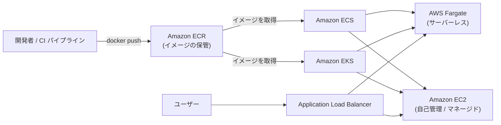
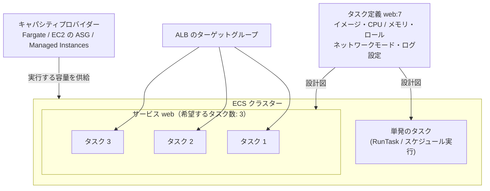
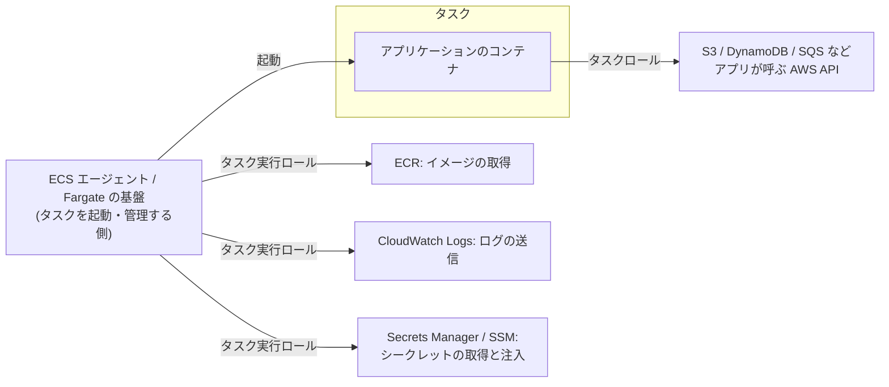

[ホーム](../README.md) > [Phase 2: アソシエイト](README.md) > コンテナ

# コンテナ（ECS / EKS / Fargate / ECR）

> **この章のゴール**
> - コンテナとオーケストレーションの役割を説明し、AWS のコンテナサービスの全体像を描ける
> - ECR のイメージスキャン・ライフサイクルポリシー・レプリケーションを使い分けられる
> - ECS の構成要素（クラスター・タスク定義・タスク・サービス）と、起動タイプ・キャパシティプロバイダーを説明できる
> - **タスクロールとタスク実行ロールの違い**を説明できる
> - EKS のノードの選択肢（マネージドノードグループ・Fargate・Auto Mode）と、Pod に IAM 権限を与える方法を説明できる
> - ECS / EKS / Fargate / Lambda / Elastic Beanstalk を要件から選べる
>
> **対応試験**: SAA-C03（D2: 弾力性に優れたアーキテクチャの設計、D3: 高性能なアーキテクチャの設計）／SAP-C03 の前提知識（コンテナのセキュリティ、ECS Service Connect）
> **目安時間**: 4 時間（読む 3 時間 / 確認問題 1 時間）

## この章の全体像

コンテナは、アプリケーションを「どこでも同じように動く箱」にまとめる技術です。ただし、本番環境で数十〜数千のコンテナを動かすには、配置・起動・監視・入れ替え・スケーリングを自動化する**オーケストレーション**が欠かせません。AWS のコンテナサービスは、次の 3 つのレイヤーで整理すると理解しやすくなります。



| レイヤー | 役割 | AWS のサービス |
|---|---|---|
| レジストリ | コンテナイメージを保管・配布する | Amazon ECR |
| オーケストレーション（コントロールプレーン） | どこで・いくつ・どう動かすかを決め、あるべき状態を維持する | Amazon ECS、Amazon EKS |
| コンピューティング（データプレーン） | コンテナが実際に動く場所 | AWS Fargate、Amazon EC2（自己管理 / ECS Managed Instances / EKS Auto Mode）、オンプレミス（ECS Anywhere、EKS Hybrid Nodes） |

> [!TIP]
> **試験のポイント**: 「コンテナを使いたいが、サーバー（EC2）の管理はしたくない」→ **Fargate**。「Kubernetes を使いたい」「既存の Kubernetes のマニフェストを移行したい」→ **EKS**。「AWS のサービスとの統合が簡単なコンテナオーケストレーション」→ **ECS**。

## 1. コンテナとオーケストレーションの復習

### 1.1 コンテナとは

コンテナは、アプリケーションとその依存関係（ライブラリ、ランタイム、設定）を 1 つの**イメージ**にまとめ、ホスト OS のカーネルを共有しながら、プロセスとして隔離して動かす仕組みです（仮想化の基礎は [サーバー・OS・仮想化の基礎](../01-foundations/02-server-os-basics.md) を参照）。

| 観点 | 仮想マシン（EC2 インスタンス） | コンテナ |
|---|---|---|
| 隔離の単位 | ゲスト OS ごと（カーネルも別） | プロセス（ホストのカーネルを共有） |
| 起動時間 | 数十秒〜数分 | 数秒以下 |
| サイズ | GB 単位 | MB〜数百 MB が中心 |
| 集積度 | 低い | 高い（1 台のホストで多数動かせる） |
| 向いている用途 | OS ごとの隔離、従来型のアプリケーション | マイクロサービス、CI/CD、環境の再現性 |

- **イメージ**: 読み取り専用のテンプレート。Dockerfile から作成し、レイヤーの積み重ねで構成される
- **コンテナ**: イメージから起動した実行中のインスタンス
- **レジストリ**: イメージの保管場所（Amazon ECR、Docker Hub など）

同じイメージを開発・テスト・本番で使うため、「開発環境では動いたのに本番では動かない」という問題を減らせます。

### 1.2 オーケストレーションが必要な理由

コンテナが増えると、次のような作業を人手で行うのは現実的ではなくなります。

- **スケジューリング**: どのホストでどのコンテナを動かすか（CPU・メモリの空きや AZ の分散を考慮）
- **自己修復**: 停止したコンテナを検知して自動的に再起動する
- **スケーリング**: 負荷に応じてコンテナの数とホストの数を増減する
- **デプロイ**: 新しいバージョンに少しずつ入れ替え、失敗したら戻す
- **サービス間の通信**: 変わり続ける IP アドレスを意識せずに、他のサービスを呼び出せるようにする
- **ロードバランサーへの登録、シークレットの注入、ログの収集**

AWS には 2 つのオーケストレーターがあります。**Amazon ECS** は AWS 独自のシンプルなオーケストレーターで、IAM・ALB・CloudWatch などとの統合が深く、追加のコントロールプレーン料金がかかりません。**Amazon EKS** は業界標準の Kubernetes をマネージドで提供し、豊富なエコシステムとポータビリティ（他の環境でも同じ API で動かせること）が強みです。

## 2. Amazon ECR（Elastic Container Registry）

Amazon Elastic Container Registry（Amazon ECR）は、フルマネージドのコンテナレジストリです。ECS・EKS・Lambda（コンテナイメージ）などから、IAM で制御しながらイメージを取得できます。

### 2.1 プライベートリポジトリとパブリックレジストリ

- **プライベートレジストリ**: アカウント・リージョンごとに 1 つあり、その中に**リポジトリ**を作成します。アクセスは IAM ポリシーと**リポジトリポリシー**（リソースベースのポリシー。別アカウントからの pull の許可などに使う）で制御します。Docker クライアントは `aws ecr get-login-password` で取得した一時的なトークンでログインします。
- **パブリックレジストリ（Amazon ECR Public）**: 誰でも pull できるイメージを公開する場所です。公開されたイメージは Amazon ECR Public Gallery で検索できます。
- **暗号化**: イメージは保存時に既定で暗号化されます。リポジトリの作成時に AWS KMS のキーによる暗号化も選べます。
- **タグのイミュータビリティ**: 有効にすると、同じタグ（例: `v1.4.2`）でイメージを上書きできなくなり、「同じタグなのに中身が違う」事故を防げます。
- **プルスルーキャッシュ**: Docker Hub、Amazon ECR Public、Quay、GitHub Container Registry などの上流のレジストリのイメージを、プライベート ECR にキャッシュします。上流のレート制限やインターネットへの依存を避けられます。

### 2.2 イメージスキャン: 基本スキャンと拡張スキャン

| 観点 | 基本スキャン | 拡張スキャン |
|---|---|---|
| 仕組み | ECR が提供するスキャン | **Amazon Inspector** と統合したスキャン |
| タイミング | プッシュ時、または手動 | プッシュ時に加えて**継続的スキャン**（新しい脆弱性が公開されると、既存のイメージも自動で再評価） |
| 対象 | OS パッケージの脆弱性（CVE） | OS パッケージ + **プログラミング言語のパッケージ**（Python、Java、Node.js など） |
| 結果の確認 | ECR のコンソール / API、EventBridge | Inspector のコンソール、ECR、EventBridge（Security Hub にも集約できる） |
| 料金 | 追加料金なし | Amazon Inspector の料金 |

スキャン結果は EventBridge のイベントとしても発行されるため、「重大な脆弱性が見つかったら通知し、デプロイを止める」といった自動化ができます。

> [!TIP]
> **試験のポイント**: 「言語のライブラリも含めて脆弱性を検出したい」「プッシュ後に公開された脆弱性も自動で検出したい」→ ECR の**拡張スキャン（Amazon Inspector）**。「プッシュ時に OS パッケージの脆弱性を無料で確認したい」→ 基本スキャン。

### 2.3 ライフサイクルポリシー

CI/CD でビルドのたびにイメージをプッシュすると、古いイメージがたまり続けてストレージ料金が増えます。**ライフサイクルポリシー**を設定すると、条件に合うイメージを自動的に削除（期限切れに）できます。

```json
{
  "rules": [
    {
      "rulePriority": 1,
      "description": "タグのないイメージはプッシュから 14 日後に削除",
      "selection": {
        "tagStatus": "untagged",
        "countType": "sinceImagePushed",
        "countUnit": "days",
        "countNumber": 14
      },
      "action": { "type": "expire" }
    },
    {
      "rulePriority": 2,
      "description": "prod- で始まるタグのイメージは最新の 30 個だけを残す",
      "selection": {
        "tagStatus": "tagged",
        "tagPrefixList": ["prod-"],
        "countType": "imageCountMoreThan",
        "countNumber": 30
      },
      "action": { "type": "expire" }
    }
  ]
}
```

ポリシーを適用する前に、どのイメージが削除対象になるかをプレビューで確認できます。

### 2.4 レプリケーション

レジストリ単位の**レプリケーション設定**で、イメージを自動的に複製できます。

- **クロスリージョン**: 複数のリージョンでサービスを動かす場合や、DR のために別リージョンにイメージを置いておく場合
- **クロスアカウント**: 本番アカウントや共有サービスのアカウントにイメージを配布する場合（複製先のアカウントのレジストリで許可が必要）
- リポジトリ名のプレフィックスで、複製する対象を絞り込める

> [!NOTE]
> レプリケーションは「自分の ECR のイメージを別の場所へ複製する」機能、プルスルーキャッシュは「外部のレジストリのイメージを自分の ECR にキャッシュする」機能です。

### 2.5 プライベートサブネットからイメージを取得する

NAT ゲートウェイのないプライベートサブネットで ECS や EKS のタスクを動かす場合は、次の VPC エンドポイントが必要です。

| エンドポイント | 種類 | 用途 |
|---|---|---|
| `com.amazonaws.<リージョン>.ecr.api` | インターフェイス | ECR の API（認証トークンの取得など） |
| `com.amazonaws.<リージョン>.ecr.dkr` | インターフェイス | Docker Registry API（イメージの pull / push） |
| `com.amazonaws.<リージョン>.s3` | ゲートウェイ | **イメージのレイヤーは S3 に保存されている**ため |
| `com.amazonaws.<リージョン>.logs` | インターフェイス | awslogs ドライバーで CloudWatch Logs にログを送る場合 |

シークレットを Secrets Manager や SSM パラメータストアから取得する場合は、それらのエンドポイントも追加します。

> [!WARNING]
> **ひっかけ注意**: ECR 用のエンドポイント（`ecr.api` と `ecr.dkr`）だけを作り、**S3 のゲートウェイエンドポイントを忘れる**と、イメージのレイヤーを取得できずに `CannotPullContainerError` で失敗します（[第 2 章 VPC](02-vpc.md)）。

## 3. Amazon ECS（Elastic Container Service）

### 3.1 構成要素



| 要素 | 説明 |
|---|---|
| クラスター | タスクやサービスを動かす論理的なグループ |
| タスク定義 | コンテナの**設計図**（JSON）。イメージ、CPU・メモリ、ポート、環境変数、シークレット、IAM ロール、ネットワークモード、ログ設定などを定義する。変更するたびに新しいリビジョンになる |
| タスク | タスク定義から起動した実行単位（1 つ以上のコンテナのまとまり）。バッチ処理などは単発のタスクとして実行する |
| サービス | 指定した数のタスクを**常に維持**し、停止したタスクを自動で置き換える。ロードバランサーへの登録、デプロイ、Auto Scaling も管理する |
| キャパシティプロバイダー | タスクを動かす容量（Fargate、Fargate Spot、EC2 の Auto Scaling グループ、ECS Managed Instances）を供給する |
| コンテナエージェント | EC2 インスタンス上で ECS と通信するエージェント（EC2 を自分で管理する場合） |

タスク定義の例（抜粋）:

```json
{
  "family": "web",
  "requiresCompatibilities": ["FARGATE"],
  "networkMode": "awsvpc",
  "cpu": "512",
  "memory": "1024",
  "executionRoleArn": "arn:aws:iam::111122223333:role/ecsTaskExecutionRole",
  "taskRoleArn": "arn:aws:iam::111122223333:role/web-app-task-role",
  "containerDefinitions": [
    {
      "name": "app",
      "image": "111122223333.dkr.ecr.ap-northeast-1.amazonaws.com/web:1.4.2",
      "essential": true,
      "portMappings": [{ "containerPort": 8080, "protocol": "tcp" }],
      "secrets": [
        {
          "name": "DB_PASSWORD",
          "valueFrom": "arn:aws:secretsmanager:ap-northeast-1:111122223333:secret:prod/db-AbCdEf"
        }
      ],
      "logConfiguration": {
        "logDriver": "awslogs",
        "options": {
          "awslogs-group": "/ecs/web",
          "awslogs-region": "ap-northeast-1",
          "awslogs-stream-prefix": "app"
        }
      }
    }
  ]
}
```

サービスのスケジューリング戦略には、希望する数のタスクを AZ に分散して維持する **REPLICA** と、各 EC2 インスタンスに 1 つずつタスクを配置する **DAEMON**（ログ収集エージェントなど。EC2 のみ）があります。EC2 を使う場合は、**配置戦略**（`binpack`: 少ない台数に詰め込んでコストを下げる、`spread`: AZ やインスタンスに分散して可用性を高める、`random`）と**配置制約**も指定できます。

### 3.2 起動タイプとキャパシティプロバイダー

| 選択肢 | お客様が管理するもの | 特徴 | 向いているケース |
|---|---|---|---|
| **Fargate** | タスク定義のみ（サーバーの管理なし） | タスクごとに隔離された環境で動く。vCPU とメモリの量に応じた秒単位の課金 | ほとんどの Web・API・バッチ。運用負荷を最小にしたい |
| **Fargate Spot** | 同上 | AWS の余剰容量を使い、Fargate の料金から最大 70% 割引。中断される可能性がある（2 分前に通知） | 中断に耐えるバッチや開発環境、スケールアウトした分 |
| **EC2**（自己管理） | EC2 インスタンス（AMI、パッチ適用、スケーリング） | GPU や特定のインスタンスタイプを使える。高い集積率やリザーブドインスタンスなどでコストを詰められる | GPU、特殊な要件、大規模でコストを最適化したい |
| **ECS Managed Instances** | インスタンスの選択条件のみ（起動・パッチ適用・スケーリングは AWS） | EC2 の柔軟性（GPU など）と、マネージドな運用を両立する（2025 年 9 月に提供開始） | EC2 の機能が必要だが、インスタンスの運用は減らしたい |
| **External**（ECS Anywhere） | オンプレミスのサーバー | 自社のサーバーを ECS に登録し、同じ API で管理する | データを社外に出せない、既存のハードウェアを活用したい |

**キャパシティプロバイダー戦略**では、`base`（最低限そのプロバイダーで動かすタスク数）と `weight`（それを超えた分の配分比率）を指定します。

```text
例: FARGATE に base=2、weight=1 / FARGATE_SPOT に weight=3
→ 最初の 2 タスクは必ず通常の Fargate で動かし、それを超える分は Fargate : Fargate Spot = 1 : 3 で配分する
```

EC2 の Auto Scaling グループをキャパシティプロバイダーにする場合は、**マネージドスケーリング**（タスクの配置に必要な台数に合わせて ECS が ASG を増減する）と、**マネージド終了保護**（タスクが動いているインスタンスをスケールインで終了させない）を有効にするのが基本です。

> [!TIP]
> **試験のポイント**: 「中断に耐えられるコンテナのワークロードのコストを削減したい」→ Fargate Spot（または EC2 のスポットインスタンス）。「最低限の可用性は確保しつつ Spot を使いたい」→ キャパシティプロバイダー戦略の `base` で通常の Fargate を確保する。

### 3.3 タスクロールとタスク実行ロール（最重要）

ECS には IAM ロールが複数登場し、試験でも混同を狙った問題がよく出ます。



| 観点 | タスク実行ロール | タスクロール |
|---|---|---|
| 使う主体 | ECS エージェント / Fargate の基盤（**タスクを起動する側**） | **コンテナの中のアプリケーション** |
| 用途 | ECR からのイメージの取得、CloudWatch Logs へのログの送信、Secrets Manager / SSM パラメータストアからのシークレットの取得（環境変数への注入） | アプリケーションのコードが呼ぶ AWS API（S3、DynamoDB、SQS など） |
| タスク定義の項目 | `executionRoleArn` | `taskRoleArn` |
| 代表的なポリシー | `AmazonECSTaskExecutionRolePolicy`（シークレットを使う場合は取得の権限も追加） | アプリケーションの要件に合わせた最小権限のポリシー |

EC2 を自分で管理する場合は、さらに**コンテナインスタンスの IAM ロール**（インスタンスプロファイル）があり、ECS エージェントがインスタンスをクラスターに登録するために使います。このロールにアプリケーションの権限を付けると、そのインスタンス上のすべてのタスクが使えてしまうため、アプリケーションの権限は必ずタスクロールで与えます。

> [!WARNING]
> **ひっかけ注意**: 「アプリケーションが S3 にアクセスすると AccessDenied になる」→ 権限を追加するのは**タスクロール**です。タスク実行ロールに S3 の権限を追加しても、アプリケーションのコードからは使われません。逆に「イメージを pull できない」「ログが出ない」「シークレットを取得できずタスクが起動しない」→ **タスク実行ロール**を確認します。アクセスキーを環境変数やイメージに埋め込むのは誤りです。

