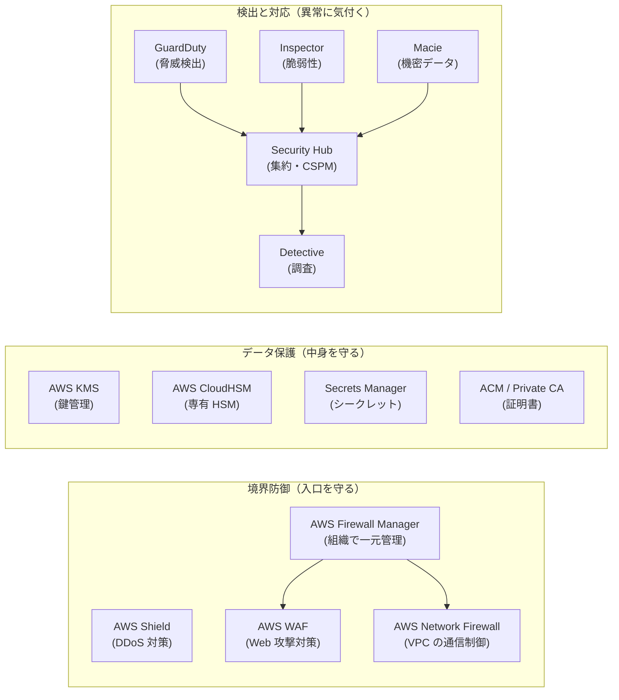
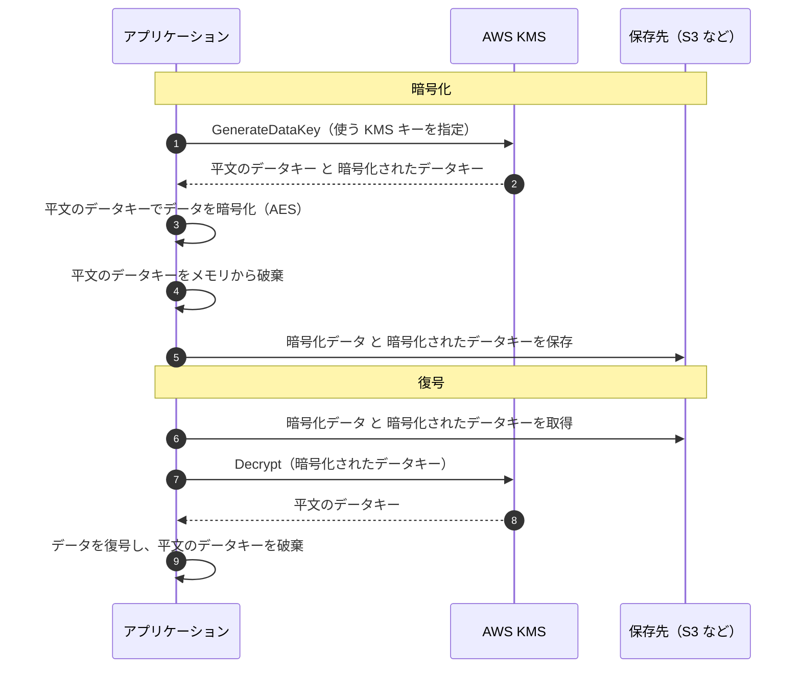
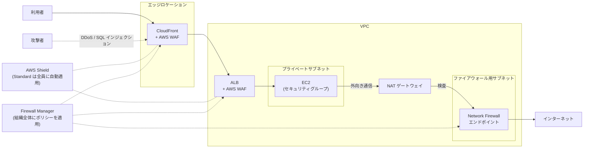
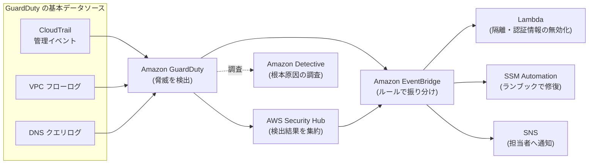

[ホーム](../README.md) > [Phase 2: アソシエイト](README.md) > セキュリティサービス

# セキュリティサービス（KMS / WAF / GuardDuty ほか）

> **この章のゴール**
> - KMS の仕組み（キーの種類・エンベロープ暗号化・キーポリシー・ローテーション）を説明し、暗号化を設計できる
> - CloudHSM・Secrets Manager・Parameter Store・ACM・Private CA を要件から使い分けられる
> - WAF・Shield・Firewall Manager・Network Firewall の守備範囲（どの層で何を防ぐか）を区別できる
> - GuardDuty・Inspector・Macie・Security Hub・Detective・Security Lake の役割の違いを説明できる
> - 問題文のキーワードから、最適なセキュリティサービスを即答できる
>
> **対応試験**: SAA-C03（ドメイン1: セキュアなアーキテクチャの設計 ほか）
> **目安時間**: 合計 6 時間（読む 4 時間 / 確認問題 40 分 / 復習 1 時間 20 分）

## この章の全体像

[IAM 徹底解説](01-iam.md) では「誰が何をしてよいか」を制御する仕組みを学びました。しかし IAM だけでは、セキュリティは完成しません。実際の設計では、次の 3 つの問いにも答える必要があります。

1. **データそのものをどう守るか**（暗号化・鍵・シークレット・証明書）
2. **入口をどう守るか**（DDoS 攻撃・Web 攻撃・不正な通信）
3. **異常にどう気付き、どう対応するか**（脅威検出・脆弱性・機密データ・調査）

[責任共有モデル](../01-foundations/07-security-and-compliance.md) では、これらの多くが「クラウド内のセキュリティ」＝ **利用者の責任** に入ります。AWS は道具（サービス）を用意しますが、有効化して正しく設定するのは利用者です。



| 分類 | サービス | ひとことで |
|---|---|---|
| データ保護 | AWS KMS | 暗号鍵を作成・管理し、使用を制御・監査する |
| データ保護 | AWS CloudHSM | 自分専用の HSM（ハードウェアセキュリティモジュール） |
| データ保護 | AWS Secrets Manager / Parameter Store | パスワードや設定値を安全に保管する |
| データ保護 | ACM / AWS Private CA | TLS 証明書の発行・管理 |
| 境界防御 | AWS WAF | HTTP(S) リクエストを検査する Web アプリケーションファイアウォール |
| 境界防御 | AWS Shield | DDoS 攻撃からの保護 |
| 境界防御 | AWS Firewall Manager | 複数アカウントのファイアウォール設定を一元管理 |
| 境界防御 | AWS Network Firewall | VPC 向けのマネージドなネットワークファイアウォール / IPS |
| 検出と対応 | Amazon GuardDuty | ログを分析して脅威を検出 |
| 検出と対応 | Amazon Inspector | ソフトウェアの脆弱性をスキャン |
| 検出と対応 | Amazon Macie | S3 内の機密データ（個人情報など）を発見 |
| 検出と対応 | AWS Security Hub | 検出結果の集約とベストプラクティスのチェック |
| 検出と対応 | Amazon Detective | セキュリティ事象の根本原因を調査 |
| 検出と対応 | Amazon Security Lake | セキュリティログを一元的なデータレイクに集約 |

## 1. AWS KMS（AWS Key Management Service）

### 1.1 なぜ「鍵の管理」が難しいのか

暗号化のアルゴリズム（AES-256 など）は標準化されており、使うこと自体は難しくありません。難しいのは **鍵の管理** です。

- 鍵をどこに保管するか（アプリの設定ファイルに書けば、ファイルが漏れた瞬間に暗号化の意味がなくなる）
- 誰に鍵の使用を許可するか、使用を記録できるか
- 鍵を定期的に更新（ローテーション）できるか
- 鍵を失ったらデータも永久に失われる

AWS KMS はこれらを解決するマネージドサービスです。

- 鍵は **FIPS 140 の検証を受けた HSM** の中で生成・使用され、対称キーのキーマテリアル（鍵の実体）が平文で KMS の外に出ることはありません
- 使用の可否は **キーポリシー + IAM ポリシー** で制御します
- すべての使用が **CloudTrail** に記録され、「誰が・いつ・どの鍵を使ったか」を監査できます
- S3、EBS、RDS、DynamoDB、Lambda、Secrets Manager など多くのサービスと統合されており、多くの場合はチェックボックス 1 つで暗号化できます

KMS キーは **リージョン単位のリソース** です（例外は 1.8 節のマルチリージョンキー）。東京リージョンのキーで暗号化したデータを大阪リージョンで復号するには、工夫が必要です。

### 1.2 KMS キーの種類（誰が管理するか）

| 観点 | カスタマーマネージドキー | AWS マネージドキー | AWS 所有のキー |
|---|---|---|---|
| 作成者 | 利用者 | AWS サービスが利用者のアカウントに自動作成（`aws/s3`、`aws/ebs` など） | AWS（多数のアカウントで利用） |
| コンソールでの表示 | 表示される | 表示される | 表示されない |
| キーポリシーの編集 | できる | できない | できない |
| ローテーション | 任意（1.7 節） | 毎年自動（変更不可） | AWS が管理 |
| CloudTrail への使用記録 | 残る | 残る | 残らない |
| 料金 | 1 キーあたり月額 1 USD + リクエスト料金 | 月額なし（リクエスト料金は発生） | なし |
| 他アカウントとの共有 | できる（キーポリシーで許可） | できない | ― |
| 典型的な用途 | 監査・職務分離・クロスアカウント共有が必要なとき | 手軽に暗号化を有効にしたいとき | サービスの既定の暗号化（例: DynamoDB の既定） |

料金は 2026年9月時点の値です。最新は [AWS KMS の料金](https://aws.amazon.com/kms/pricing/) を確認してください。

> [!TIP]
> **試験のポイント**: 「キーの使用者やローテーション周期を自分で制御したい」「キーの使用を監査したい」「他のアカウントと暗号化データを共有したい」とあれば **カスタマーマネージドキー** です。「運用の手間を最小に暗号化したい」だけなら AWS マネージドキーや AWS 所有のキーで十分です。

> [!WARNING]
> **ひっかけ注意**: **AWS マネージドキーはキーポリシーを編集できないため、他のアカウントに使用を許可できません**。`aws/ebs` で暗号化した EBS スナップショットや `aws/rds` で暗号化した RDS スナップショットは、そのままでは他のアカウントと共有できません。カスタマーマネージドキーで再暗号化したコピーを作成してから共有します。

### 1.3 キーの仕様（対称・非対称・HMAC）

| キーの仕様 | 主な用途 | 鍵の実体が KMS の外に出るか | 主な API |
|---|---|---|---|
| 対称キー（AES-256-GCM） | データの暗号化。AWS サービスとの統合はほぼすべてこれ | 出ない | Encrypt / Decrypt / GenerateDataKey |
| 非対称キー（RSA） | 暗号化・復号、または署名・検証 | 公開鍵のみダウンロード可 | Encrypt / Decrypt / Sign / Verify / GetPublicKey |
| 非対称キー（楕円曲線 ECC） | 署名・検証 | 公開鍵のみダウンロード可 | Sign / Verify ほか |
| 非対称キー（ML-DSA） | 耐量子計算機暗号の署名・検証 | 公開鍵のみダウンロード可 | Sign / Verify |
| HMAC キー | メッセージ認証コードの生成・検証（改ざん検知、トークン） | 出ない | GenerateMac / VerifyMac |

S3・EBS・RDS などの **AWS サービスとの統合で使えるのは対称キー** です。非対称キーは「AWS の認証情報を持たない外部のクライアントが公開鍵で暗号化する」「ソフトウェアやドキュメントに署名し、外部で公開鍵を使って検証する」といった場面で使います。

> [!NOTE]
> **耐量子計算機暗号（ポスト量子暗号）について**: KMS は 2025年6月から **ML-DSA**（FIPS 204）の非対称キーによる署名・検証をサポートしています。一方、**KMS には ML-KEM のキー仕様はありません**。ML-KEM は、KMS・ACM・Secrets Manager のサービスエンドポイントとの TLS 通信で使われる **ハイブリッド耐量子 TLS 鍵交換**（X25519 + ML-KEM-768、対応した SDK で利用）として提供されています。詳しくは Phase 3 の [セキュリティとコンプライアンスのアーキテクチャ](../03-professional/05-security-architecture.md) で扱います。

### 1.4 エンベロープ暗号化（Envelope Encryption）

KMS の `Encrypt` API で直接暗号化できるデータは **最大 4 KB** です。大きなデータ（S3 のオブジェクトや EBS ボリューム）はどう暗号化しているのでしょうか。答えが **エンベロープ暗号化** です。

- **データキー**（データを暗号化するための使い捨てに近い鍵）でデータを暗号化する
- そのデータキー自体を **KMS キー** で暗号化し、暗号化されたデータと一緒に保存する

「手紙（データ）を鍵付きの箱（データキー）に入れ、箱の鍵をさらに金庫（KMS キー）で守る」イメージです。



この方式には次の利点があります。

- **大きなデータを高速に暗号化できる**: データ本体はネットワーク越しに KMS へ送らず、手元で暗号化します。KMS とやり取りするのは小さなデータキーだけです
- **KMS キーは KMS の外に出ない**: 流出して困る鍵（KMS キー）を HSM の中に閉じ込めたまま運用できます
- **鍵の階層化**: KMS キーをローテーションしても、データを再暗号化する必要がありません（1.7 節）

S3 の SSE-KMS や EBS の暗号化は、この処理を AWS が裏側で自動的に行っています。自分のアプリで行う場合は、AWS Encryption SDK を使うとエンベロープ暗号化とデータキーのキャッシュ（KMS 呼び出しの削減）を簡単に実装できます。

> [!TIP]
> **試験のポイント**: 「4 KB を超えるデータをクライアント側で暗号化する」「KMS の呼び出し回数を減らしたい」とあれば、`GenerateDataKey` を使った **エンベロープ暗号化** です。後で使うデータキーを平文なしで作っておく `GenerateDataKeyWithoutPlaintext` という API もあります。

### 1.5 暗号化コンテキスト

**暗号化コンテキスト** は、暗号化時に指定するキーと値のペア（例: `{"department": "finance"}`）です。秘密の情報ではありませんが、復号時に **同じ値を指定しないと復号に失敗** します（追加認証データ AAD として暗号文に結び付けられるため）。

- CloudTrail のログに記録されるため、「どのデータのための復号か」を監査できます
- キーポリシーの条件（`kms:EncryptionContext:キー名`）で「特定のコンテキストの場合のみ復号を許可」といった制御ができます

### 1.6 アクセス制御: キーポリシー + IAM ポリシー + グラント

KMS のアクセス制御は、他の多くのサービスと大きく異なる点があります。

> [!IMPORTANT]
> **すべての KMS キーには必ず 1 つのキーポリシー（リソースベースのポリシー）があり、キーポリシーで許可されていなければ、IAM ポリシーだけではキーを使えません。** S3 バケットなら IAM ポリシーだけでアクセスを許可できますが、KMS は「キーポリシーが主役」です。

キーをコンソールで作成したときのデフォルトのキーポリシーには、次のようなステートメントが含まれます。

```json
{
  "Version": "2012-10-17",
  "Statement": [
    {
      "Sid": "EnableIAMPolicies",
      "Effect": "Allow",
      "Principal": { "AWS": "arn:aws:iam::111122223333:root" },
      "Action": "kms:*",
      "Resource": "*"
    },
    {
      "Sid": "AllowAppRoleViaS3Only",
      "Effect": "Allow",
      "Principal": { "AWS": "arn:aws:iam::111122223333:role/AppRole" },
      "Action": ["kms:Decrypt", "kms:GenerateDataKey"],
      "Resource": "*",
      "Condition": {
        "StringEquals": { "kms:ViaService": "s3.ap-northeast-1.amazonaws.com" }
      }
    }
  ]
}
```

- 1 つ目のステートメントのプリンシパル `arn:aws:iam::111122223333:root` は「ルートユーザー」ではなく **「このアカウント」** を意味します。これにより、**アカウント内の IAM ポリシーでキーへのアクセスを許可できるようになります**。このステートメントを消すと、IAM ポリシーでいくら許可してもキーを使えません
- 2 つ目は、特定の IAM ロールに「S3 経由の場合に限り」復号とデータキー生成を許可する例です（`kms:ViaService` 条件キー）
- キーポリシー内の `"Resource": "*"` は「このキー自身」を意味します

KMS のアクセス制御は次の 3 つの仕組みの組み合わせです。

| 仕組み | 内容 | 使いどころ |
|---|---|---|
| キーポリシー | キーごとに 1 つ必須。誰がキーを管理・使用できるかを定義 | 基本の制御。クロスアカウントの許可 |
| IAM ポリシー | キーポリシーでアカウントに委任されている場合に有効 | アカウント内のユーザー・ロールへの許可をまとめて管理 |
| グラント（Grant） | キーポリシーを変更せずに、特定のプリンシパルに特定の操作を委任する | AWS サービスが利用者の代わりにキーを使う（EBS のアタッチ、RDS など）。一時的な委任 |

キーの **管理者**（キーポリシーの変更や削除のスケジュールができる人）と **使用者**（暗号化・復号ができる人・アプリ）を分けるのが職務分離のベストプラクティスです。

**クロスアカウントでキーを使う場合**は、次の 2 つが両方とも必要です。

1. キーを所有するアカウント A の **キーポリシー** で、アカウント B（またはその中のロール）に操作を許可する
2. アカウント B の **IAM ポリシー** で、そのロールにアカウント A のキー（キー ARN で指定）への操作を許可する

> [!WARNING]
> **ひっかけ注意**: 「SSE-KMS で暗号化された S3 オブジェクトを他のアカウントから読めない」という問題では、**バケットポリシーだけでなく KMS キーのキーポリシーでも `kms:Decrypt` を許可する** 必要があります。S3 の許可と KMS の許可は別物です。

### 1.7 キーのローテーション

**ローテーション** とは、KMS キーの **キーマテリアル（鍵の実体）を新しくすること** です。重要な性質は次のとおりです。

- キー ID・ARN・エイリアス・キーポリシーは **変わりません**。アプリの設定変更は不要です
- 古いキーマテリアルは KMS 内に保持され、**過去に暗号化したデータはそのまま復号できます**
- ローテーションは既存データを **再暗号化しません**。新しく暗号化するデータから新しいキーマテリアルが使われます

| キーの種類 | 自動ローテーション |
|---|---|
| カスタマーマネージドキー（対称） | **任意**。有効にすると既定で 365 日ごと。周期は **90〜2,560 日** の範囲で変更でき、任意のタイミングで実行する **オンデマンドローテーション** も可能 |
| AWS マネージドキー | **毎年自動**（利用者は変更できない） |
| AWS 所有のキー | AWS が管理（サービスにより異なる） |
| 非対称キー・HMAC キー・インポートしたキーマテリアル・カスタムキーストアのキー | 自動ローテーション **不可**。新しいキーを作成し、エイリアスを付け替える **手動ローテーション** を行う |

> [!WARNING]
> **ひっかけ注意**: 古い教材では「AWS マネージドキーは 3 年ごとにローテーション」「カスタマーマネージドキーの自動ローテーションは 1 年ごと固定」と説明されています。現在は AWS マネージドキーが **毎年**、カスタマーマネージドキーは **周期を変更可能** です。試験で旧仕様の選択肢が出ても、「自動ローテーションを有効にする」が正解の方向性であることに変わりはありません。

詳しくは [KMS キーのローテーション](https://docs.aws.amazon.com/kms/latest/developerguide/rotate-keys.html) を参照してください。

### 1.8 マルチリージョンキー

**マルチリージョンキー** は、複数のリージョンにまたがって **同じキー ID と同じキーマテリアル** を持つ関連キーのセットです（キー ID が `mrk-` で始まります）。1 つの **プライマリキー** と、他リージョンの **レプリカキー** で構成されます。

- あるリージョンで暗号化したデータを、別リージョンで **再暗号化やリージョンをまたぐ KMS 呼び出しなしに** 復号できます
- 各リージョンのキーは **独立したリソース** で、キーポリシー・グラント・エイリアスは個別に管理します（グローバルな 1 つのキーではありません）
- 自動ローテーションはプライマリキーで設定し、レプリカにも反映されます
- **既存の単一リージョンキーをマルチリージョンキーに変換することはできません**（作成時に選択します）

主な用途は、クライアント側で暗号化したデータを複数リージョンで扱うケース（DynamoDB グローバルテーブル上のアプリ側暗号化データ、リージョン間の DR、複数リージョンでのデジタル署名）です。データ主権などの理由から、AWS は「必要な場合を除き単一リージョンキーを使う」ことを推奨しています。

> [!TIP]
> **試験のポイント**: 「アプリ側で暗号化したデータを別リージョンでも復号したい」「リージョン障害時に DR 先で同じ鍵を使いたい」とあれば **マルチリージョンキー** です。一方、S3 のクロスリージョンレプリケーションや EBS スナップショットのリージョン間コピーでは、コピー先リージョンのキーを指定して再暗号化するのが基本です。

### 1.9 インポートしたキーマテリアルとカスタムキーストア

規制や社内ルールで「鍵の生成場所・保管場所」を利用者が管理しなければならない場合の選択肢です。

| 方式 | 鍵の生成・保管場所 | 特徴 | 試験のキーワード |
|---|---|---|---|
| 標準の KMS キー | KMS の HSM（AWS が管理） | 最も簡単。耐久性・可用性は AWS の責任 | 特別な要件なし |
| インポートしたキーマテリアル（BYOK） | 利用者が自分で生成し、KMS にインポート | キーマテリアルの耐久性（バックアップ）は **利用者の責任**。有効期限を設定でき、即時削除（再インポートで復旧）も可能。自動ローテーション不可 | 「自社で生成した鍵を使う」「鍵を即座に使用不能にしたい」 |
| カスタムキーストア（CloudHSM キーストア） | 利用者の **CloudHSM クラスター** | KMS の API とサービス統合はそのままに、鍵は専有 HSM に置ける | 「KMS と統合しつつ、鍵は専有 HSM に保管」 |
| カスタムキーストア（外部キーストア: XKS） | **AWS の外**（オンプレミスなどの外部鍵管理システム） | KMS はプロキシ経由で外部に暗号化・復号を依頼。外部側の可用性・レイテンシーが直接影響する | 「鍵を AWS の外に保持しなければならない」 |

> [!WARNING]
> **ひっかけ注意**: 外部キーストアやインポートしたキーマテリアルは「自分で管理できる」反面、**鍵の喪失や外部システムの停止がそのままデータの読み取り不能に直結** します。要件にない限り、標準の KMS キーが最も運用負荷が低く可用性も高い選択肢です。

### 1.10 クォータ・料金と S3 バケットキー

KMS には、暗号化オペレーション（Encrypt、Decrypt、GenerateDataKey など）の **1 秒あたりのリクエスト数のクォータ** が、アカウント・リージョン単位で設定されています（複数の操作で共有）。超えると `ThrottlingException` が返ります。値はリージョンや操作によって異なるため、[KMS のクォータ](https://docs.aws.amazon.com/kms/latest/developerguide/limits.html) と Service Quotas で確認し、必要なら引き上げを申請します。

特に問題になりやすいのが **S3 の SSE-KMS** です。SSE-KMS では、オブジェクトの PUT のたびにデータキーの生成、GET のたびにデータキーの復号で KMS を呼び出します。大量のオブジェクトを扱うと、KMS のリクエスト料金がかさみ、クォータに達することもあります。

そこで使うのが **S3 バケットキー** です。

- S3 が KMS から **バケット単位のキー** を取得し、一定期間、S3 の中でそのキーからオブジェクトごとのデータキーを生成します
- KMS へのリクエストが大幅に減り、**KMS のリクエスト料金を最大 99% 削減** できます
- 有効にすると、CloudTrail の KMS イベントに記録されるのはオブジェクトの ARN ではなく **バケットの ARN** になります（暗号化コンテキストがバケット ARN になるため）

S3 の暗号化方式（SSE-S3 / SSE-KMS / DSSE-KMS / SSE-C）の比較は [Amazon S3](05-s3.md) の章を参照してください。

> [!TIP]
> **試験のポイント**: 「SSE-KMS の S3 に大量のリクエストがあり、KMS のコストが高い／スロットリングが発生している」とあれば **S3 バケットキーを有効にする** が第一候補です。アプリ側で暗号化している場合は、データキーのキャッシュ（AWS Encryption SDK）も有効です。

### 1.11 キーの無効化と削除

- KMS キーの削除は **取り消せません**。そのため、**7〜30 日（既定 30 日）の待機期間** を経てから削除されます。待機期間中は削除をキャンセルできます
- 削除されたキーで暗号化されたデータは **二度と復号できません**
- まず **無効化（Disable）** して影響がないことを確かめてから削除をスケジュールするのが定石です。待機期間中のキーが使われようとした場合は、CloudTrail のログと CloudWatch アラームで検知できます

### 1.12 試験で頻出の KMS シナリオ

| シナリオ | 解き方 |
|---|---|
| 暗号化された EBS スナップショットを別アカウントと共有したい | カスタマーマネージドキーで暗号化し、キーポリシーで相手アカウントに許可してからスナップショットを共有。AWS マネージドキーで暗号化済みなら、カスタマーマネージドキーで暗号化したコピーを作ってから共有 |
| 暗号化されていない既存の RDS DB インスタンスを暗号化したい | スナップショットを取得 → 暗号化を有効にしてコピー → そのスナップショットから復元（その場での暗号化はできない） |
| 暗号化スナップショットを別リージョンにコピーしたい | コピー先リージョンの KMS キーを指定する（KMS キーはリージョン単位） |
| 今後作成する EBS ボリュームをすべて暗号化したい | リージョンごとに EBS の **デフォルトの暗号化** を有効にする |
| SSE-KMS の S3 で KMS のスロットリングが起きる | S3 バケットキーを有効にする。必要ならクォータの引き上げ |
| 他のアカウントから SSE-KMS のオブジェクトを読めない | バケットポリシーに加え、キーポリシーで `kms:Decrypt` を許可 |
| 鍵の使用履歴を監査したい | CloudTrail で KMS の API 呼び出しを確認（AWS 所有のキーは記録されない） |

公式ドキュメント: [AWS KMS とは](https://docs.aws.amazon.com/kms/latest/developerguide/overview.html)

## 2. AWS CloudHSM

### 2.1 仕組み

**AWS CloudHSM** は、**利用者専用（シングルテナント）の HSM** を AWS 上で提供するサービスです。KMS が「AWS が運用する HSM を多くの顧客で論理的に分けて使う」のに対し、CloudHSM は「HSM そのものを専有し、中の鍵とユーザーを利用者が完全に管理する」サービスです。

- HSM は **利用者の VPC 内に ENI（ネットワークインターフェイス）として配置** され、アプリケーションはクライアント SDK 経由で通信します
- 複数の HSM で **クラスター** を構成し、鍵はクラスター内で自動的に同期されます。本番では **異なる AZ に 2 台以上** 配置するのが推奨です
- 業界標準の API（**PKCS#11、JCE、OpenSSL、Microsoft CNG/KSP**）を使えます
- **AWS は HSM 内の鍵やユーザーにアクセスできません**。逆に言えば、HSM のユーザー認証情報を失うと、AWS にも鍵を復旧できません
- 料金は HSM 1 台あたりの時間課金です（KMS より高額になりやすい）

主な用途は、SSL/TLS のオフロード（Web サーバーの秘密鍵を HSM に保管）、Oracle Database の TDE（透過的データ暗号化）、プライベート認証局の秘密鍵の保護、そして KMS の **カスタムキーストア**（1.9 節）です。

### 2.2 KMS と CloudHSM の比較

| 観点 | AWS KMS | AWS CloudHSM |
|---|---|---|
| テナンシー | マルチテナント（論理的に分離） | **シングルテナント（専有 HSM）** |
| 鍵の管理主体 | AWS が HSM を運用し、利用者はポリシーで制御 | **利用者が HSM 上のユーザーと鍵を管理** |
| 認可の仕組み | IAM とキーポリシー | HSM のユーザー（Crypto User など）による認証 |
| API | AWS の API（KMS API） | 業界標準 API（PKCS#11 / JCE / CNG など） |
| AWS サービスとの統合 | S3・EBS・RDS など多数とネイティブ統合 | 直接はなし（KMS カスタムキーストア経由で統合） |
| 可用性の設計 | AWS が管理（リージョンサービス） | 利用者が複数 AZ に HSM を配置 |
| 料金 | キーごとの月額 + リクエスト料金 | HSM 1 台あたりの時間課金 |
| 典型的な要件 | ほとんどの暗号化 | 専有 HSM が必須の規制、TDE、SSL オフロード、PKCS#11 アプリ |

> [!WARNING]
> **ひっかけ注意**: 古い問題では「FIPS 140-2 レベル 3 が必要 → CloudHSM」という判断基準がよく使われました。現在は **KMS が使う HSM も FIPS 140 のセキュリティレベル 3 の検証を受けています**。そのため、CloudHSM を選ぶ決め手は「**シングルテナント（専有）**」「**鍵を利用者だけが管理し、AWS もアクセスできない**」「**PKCS#11 / JCE などの標準 API が必要**」といったキーワードだと考えてください。

## 3. シークレットの管理: Secrets Manager と Parameter Store

### 3.1 なぜ専用のサービスが必要なのか

データベースのパスワードや API キーを、ソースコード・AMI・環境変数に直接書くのは危険です。コードリポジトリやイメージが漏れると認証情報も漏れ、しかも変更するにはアプリの再デプロイが必要になります。シークレットは **一元的に保管し、暗号化し、アクセスを IAM で制御し、使用を監査し、定期的に変更する** のが原則です。

### 3.2 AWS Secrets Manager

**AWS Secrets Manager** は、シークレットの **ライフサイクル全体（保管・取得・ローテーション・監査）** を管理するサービスです。

- シークレットは常に KMS で暗号化されます
- **自動ローテーション** が最大の特徴です
  - Lambda の **ローテーション関数** が `createSecret` → `setSecret` → `testSecret` → `finishSecret` の 4 ステップで新しいパスワードを作り、DB 側にも設定し、動作確認してから切り替えます
  - RDS・Aurora・Redshift・DocumentDB 用には関数のテンプレートが用意されています
  - RDS や Aurora の **マスターユーザーパスワードを Secrets Manager で管理する機能** を使うと、ローテーションまで RDS が管理します（マネージドローテーション）
  - 切り替え方式には、1 つのユーザーのパスワードを変更する **単一ユーザー** 方式と、2 つのユーザーを交互に使ってダウンタイムを避ける **交代ユーザー** 方式があります
- **リージョン間レプリケーション**: シークレットを他のリージョンに複製でき、マルチリージョン構成や DR で使えます
- **クロスアカウントアクセス**: シークレットのリソースベースのポリシーで他アカウントに許可します。このとき、シークレットの暗号化には **カスタマーマネージドキー** を使い、キーポリシーでも相手アカウントに `kms:Decrypt` を許可する必要があります（AWS マネージドキー `aws/secretsmanager` は共有できないため）
- バージョンは `AWSCURRENT`（現在）・`AWSPREVIOUS`（1 つ前）・`AWSPENDING`（ローテーション中）のステージングラベルで管理されます

### 3.3 AWS Systems Manager Parameter Store

**Parameter Store** は Systems Manager の機能の 1 つで、設定値やシークレットを **階層的な名前**（例: `/prod/app/db-url`）で保管します。

- パラメーターの型は `String`・`StringList`・`SecureString`（KMS で暗号化）の 3 種類です
- **標準** と **高度な（Advanced）** の 2 つの階層があります。高度な階層では値を大きくでき、**パラメーターポリシー**（有効期限の設定や、期限前・一定期間未変更時の通知）を使えます
- **自動ローテーションの機能はありません**。必要なら Lambda と EventBridge で自作します
- AWS が公開する **パブリックパラメーター** から、最新の AMI ID（例: `/aws/service/ami-amazon-linux-latest/...`）などを取得できます
- `/aws/reference/secretsmanager/` から始まる名前で、Secrets Manager のシークレットを参照することもできます

### 3.4 比較表

| 観点 | Secrets Manager | Parameter Store |
|---|---|---|
| 主な目的 | シークレット（DB 認証情報・API キー）のライフサイクル管理 | 設定値とシークレットの階層的な保管 |
| 自動ローテーション | **組み込み**（Lambda 関数・マネージドローテーション） | なし（自作が必要） |
| 暗号化 | 常に KMS で暗号化 | `SecureString` のみ KMS で暗号化 |
| 値の最大サイズ | 64 KB | 標準 4 KB / 高度 8 KB |
| 保存できる数 | 大量に保存可能 | 標準は 1 リージョンあたり 10,000 件まで、高度はそれ以上 |
| 料金 | 1 シークレットあたり月額 0.40 USD + API 10,000 回あたり 0.05 USD | 標準は無料、高度は 1 パラメーターあたり月額 0.05 USD（高スループット設定時は API も有料） |
| リージョン間レプリケーション | あり | なし |
| 他アカウントとの共有 | リソースベースのポリシー | 高度なパラメーターを AWS RAM で共有 |
| CloudFormation の動的参照 | `{{resolve:secretsmanager:...}}` | `{{resolve:ssm:...}}` / `{{resolve:ssm-secure:...}}` |
| 典型的な用途 | RDS のパスワードを定期的に自動変更 | アプリの設定値、最新 AMI ID、機能フラグ |

料金は 2026年9月時点の値です（[Secrets Manager の料金](https://aws.amazon.com/secrets-manager/pricing/)）。

> [!TIP]
> **試験のポイント**: 「DB の認証情報を **自動でローテーション**」とあれば **Secrets Manager** 一択です。「設定値を安価に（無料で）一元管理」「階層的に管理」とあれば **Parameter Store** です。「最新の Amazon Linux の AMI ID を常に使いたい」は Parameter Store の **パブリックパラメーター** です。

## 4. 証明書の管理: ACM と AWS Private CA

### 4.1 AWS Certificate Manager（ACM）

**ACM** は、TLS 証明書の発行・管理・更新を行うサービスです。

- **ACM が発行するパブリック証明書は、統合サービス（ELB、CloudFront、API Gateway など）で使う限り無料** です
- ドメインの所有確認は **DNS 検証**（CNAME レコードを追加）か **E メール検証** です。DNS 検証なら、CNAME レコードを残しておくことで **自動更新（マネージド更新）** されます。Route 53 を使っていればコンソールからワンクリックでレコードを作成できます
- 通常の ACM 証明書は **秘密鍵をエクスポートできません**。そのため、EC2 上の Web サーバーに直接インストールすることはできず、TLS の終端は ALB や CloudFront で行うのが基本です
- 外部の認証局で取得した証明書を **インポート** することもできます。ただしインポートした証明書は **ACM が自動更新しません**（期限切れが近づくと EventBridge にイベントが送られ、AWS Config のマネージドルールでも検知できます）

**エクスポート可能なパブリック証明書**（2025年6月から）を使うと、ACM で発行したパブリック証明書の秘密鍵をエクスポートし、EC2 インスタンス、コンテナ、オンプレミスのサーバーなど任意の場所で使えます。こちらは **有料**（完全修飾ドメイン名ごと・ワイルドカードごとに課金）で、ACM が更新した証明書を取り出して各サーバーに再配置する仕組みは利用者側で自動化します。

> [!IMPORTANT]
> **証明書のリージョン**: ACM 証明書はリージョン単位のリソースです。
> - **ALB / NLB / リージョン API（API Gateway）**: そのリソースと **同じリージョン** の証明書を使う
> - **CloudFront**（およびエッジ最適化 API）: **米国東部（バージニア北部）us-east-1** の証明書を使う
>
> 「東京リージョンで作った証明書が CloudFront で選択できない」は定番の問題です。詳しくは [Route 53・CloudFront・Global Accelerator](08-route53-cloudfront.md) を参照してください。

### 4.2 AWS Private CA

**AWS Private CA** は、組織内だけで使う **プライベート認証局（ルート CA・下位 CA の階層）** をマネージドで構築するサービスです。

- 社内システム・内部 ALB・マイクロサービス間の **相互 TLS（mTLS）**・IoT デバイスの認証など、公開 DNS で検証できない用途の証明書を発行できます
- ACM と連携すると、プライベート証明書も統合サービス上で **自動更新** されます
- IAM Roles Anywhere（オンプレミスのサーバーに一時的な認証情報を与える仕組み）の信頼アンカーにも使えます
- CA ごとの月額料金（汎用モードでは 1 CA あたり月額 400 USD、2026年9月時点）と、発行する証明書ごとの料金がかかります。有効期間の短い証明書に特化した、より安価なモードもあります

> [!TIP]
> **試験のポイント**: 「ALB / CloudFront で HTTPS を無料で・更新の手間なく」→ **ACM のパブリック証明書**。「社内向けの証明書を自前の CA で発行・自動更新」「mTLS」→ **AWS Private CA（+ ACM）**。「ACM の証明書を EC2 上のサーバーに直接入れたい」→ 従来は不可（ALB で終端する構成に変更）でしたが、現在は **エクスポート可能なパブリック証明書**（有料）という選択肢もあります。

## 5. 境界防御: WAF・Shield・Firewall Manager・Network Firewall

入口の防御は「どの層（レイヤー）で、何を防ぐか」で整理すると混乱しません。



### 5.1 AWS WAF

**AWS WAF** は、HTTP(S) リクエストの中身（ヘッダー・URI・クエリ文字列・本文など）を検査し、許可・ブロックする **レイヤー 7 のファイアウォール** です。

**ウェブ ACL（Web ACL）の仕組み**

- ウェブ ACL は、**優先順位の付いたルールの集まり** と **デフォルトアクション**（どのルールにも一致しなかったときに Allow か Block か）で構成されます
- ルールは優先順位の順に評価され、`Allow`・`Block`・`CAPTCHA`・`Challenge` のアクションを持つルールに一致すると評価が終わります。`Count`（数えるだけ）は評価を止めないため、新しいルールを本番で試すときに使います
- ルールの条件には、IP アドレスセット、地理的一致（国）、文字列・正規表現の一致、サイズ制約、**SQL インジェクション**、**クロスサイトスクリプティング（XSS）** などを使えます
- ウェブ ACL が使える処理量は WCU（ウェブ ACL キャパシティーユニット）で管理されます

**マネージドルールグループ**

自分でルールを書かなくても、AWS やセキュリティベンダー（AWS Marketplace）が保守するルールのセットを使えます。

| 種類 | 例 | 用途 |
|---|---|---|
| ベースライン | コアルールセット（CRS）、既知の不正な入力 | OWASP Top 10 などの一般的な攻撃 |
| ユースケース別 | SQL データベース、Linux / Windows、PHP、WordPress | アプリの技術スタックに合わせた防御 |
| IP 評価 | Amazon IP 評価リスト、匿名 IP リスト | 悪意のある IP・VPN / Tor などからのアクセス |
| 高度な保護（有料） | **Bot Control**、アカウント乗っ取り防止（ATP）、アカウント作成詐欺防止（ACFP） | ボット対策、ログインページへのクレデンシャルスタッフィング対策 |

**レートベースルール**

一定時間（評価ウィンドウ）内のリクエスト数を **集約キー**（送信元 IP、X-Forwarded-For などの転送元 IP、ヘッダーやクエリ文字列などのカスタムキー）ごとに数え、しきい値を超えたらブロックや CAPTCHA を行います。HTTP フラッド（レイヤー 7 の DDoS）やブルートフォース攻撃への対策です。

**Bot Control**

スクレイピングツールやクローラーなどの **ボット** を識別します。検索エンジンのような検証済みボットは許可しつつ、不要なボットを制限できます。より高度な「ターゲット型」の保護レベルでは、ブラウザの検査やチャレンジで巧妙なボットにも対処します。

**適用先（ウェブ ACL を関連付けられるリソース）**

- **CloudFront ディストリビューション**（CloudFront 用のウェブ ACL はグローバルで、API では us-east-1 で作成）
- **ALB**、**API Gateway の REST API**、**AppSync の GraphQL API**、**Cognito ユーザープール**、App Runner、Verified Access など（同じリージョンのウェブ ACL）

ログは CloudWatch Logs・S3・Data Firehose に出力できます（出力先の名前は `aws-waf-logs-` で始める必要があります）。

> [!WARNING]
> **ひっかけ注意**: **NLB、API Gateway の HTTP API、EC2 インスタンスには WAF を直接関連付けられません**。NLB の背後のアプリを WAF で守りたい場合は、CloudFront や ALB を前段に置く構成を検討します。また、旧バージョンの **AWS WAF Classic は 2026年10月7日にサポート終了予定**【サポート終了予定】です。現在の AWS WAF（WAFv2）を使ってください。

> [!TIP]
> **試験のポイント**
> - 「SQL インジェクション / XSS を防ぐ」→ **WAF**（マネージドルールの SQL データベース・コアルールセット）
> - 「特定の IP から大量のリクエスト」→ **WAF のレートベースルール**
> - 「特定の国からのアクセスを拒否」→ **WAF の地理的一致ルール**（CloudFront の地理的制限でも可）
> - 「CloudFront 経由の通信で、送信元 IP によるブロックをしたい」→ ネットワーク ACL では送信元が CloudFront の IP になるため不可。**CloudFront に関連付けた WAF の IP セット** を使う

### 5.2 AWS Shield

**DDoS 攻撃**（大量の通信で可用性を奪う攻撃）への防御です。

| 観点 | Shield Standard | Shield Advanced |
|---|---|---|
| 料金 | **無料・自動**（全 AWS 利用者に適用） | 月額 3,000 USD（組織単位）+ データ転送料、**1 年契約**（2026年9月時点） |
| 対象 | すべての AWS リソース（主にネットワーク層・トランスポート層） | **EC2（Elastic IP）、ELB、CloudFront、Global Accelerator、Route 53 ホストゾーン** |
| 防御する層 | レイヤー 3/4 の一般的な攻撃（SYN フラッド、UDP リフレクションなど） | レイヤー 3/4 の高度な検出に加え、**レイヤー 7 の自動緩和**（WAF ルールを自動作成） |
| 専門チームの支援 | なし | **Shield Response Team（SRT）** に 24 時間 365 日相談可能（一定のサポートプランが必要） |
| コスト保護 | なし | **DDoS によるスケーリング料金の増加分をクレジットで補填** |
| 可視化 | 基本的な情報 | 詳細な攻撃の診断とリアルタイムの通知 |
| その他 | ― | 保護対象リソースの WAF 料金（一部を除く）が含まれる。Route 53 ヘルスチェックと連携したプロアクティブエンゲージメント |

> [!TIP]
> **試験のポイント**: 「DDoS 攻撃時に **24 時間の専門チームの支援** が欲しい」「DDoS による **スケーリング費用の急増から保護** したい」とあれば **Shield Advanced** です。特別な要件がなく「追加コストなしで基本的な DDoS 対策」なら **Shield Standard**（何もしなくても有効）です。

### 5.3 AWS Firewall Manager

**AWS Firewall Manager** は、**AWS Organizations の複数アカウント** にまたがって、ファイアウォール関連の設定を一元的に管理するサービスです。

- 管理できるもの: **WAF のルール**、**Shield Advanced の保護**、**セキュリティグループ**（共通ルールの適用・過剰な許可の監査）、**Network Firewall**、**Route 53 Resolver DNS Firewall**、サードパーティのファイアウォールなど
- ポリシーを一度定義すると、**新しく作成されたアカウントやリソースにも自動的に適用** されます
- 前提条件: AWS Organizations、Firewall Manager の管理者アカウントの指定、各アカウントで **AWS Config が有効** であること

> [!TIP]
> **試験のポイント**: 「組織内の **すべてのアカウント** の ALB / CloudFront に共通の WAF ルールを適用し、**新しいアカウントにも自動で適用** したい」とあれば **Firewall Manager** です。

### 5.4 AWS Network Firewall

**AWS Network Firewall** は、VPC 向けのマネージドな **ステートフルファイアウォール兼 IPS（侵入防止システム）** です。セキュリティグループやネットワーク ACL では難しい、次のような制御ができます。

- **ドメイン名によるフィルタリング**（例: 外向き通信を `*.amazonaws.com` と特定の SaaS だけに許可）
- Suricata 互換のルールによる **侵入検知・防止（IPS）**
- ステートレスルールとステートフルルールの組み合わせ、TLS 通信の検査

仕組みとしては、**専用のファイアウォール用サブネット** に AZ ごとのファイアウォールエンドポイントを置き、**ルートテーブルで通信をエンドポイント経由に向けます**。Transit Gateway と組み合わせて複数 VPC の通信を 1 か所で検査する集中型の構成は、Phase 3 の [高度なネットワーク設計](../03-professional/04-advanced-networking.md) で扱います。

### 5.5 ネットワーク系の防御の使い分け

| サービス | 層 | 状態管理 | 適用単位 | 得意なこと |
|---|---|---|---|---|
| セキュリティグループ | L3/L4 | ステートフル | ENI（インスタンスなど） | 許可ルールのみ。基本の通信制御 |
| ネットワーク ACL | L3/L4 | ステートレス | サブネット | **明示的な拒否**（特定 IP のブロック） |
| AWS WAF | L7（HTTP） | ― | CloudFront / ALB / API Gateway など | SQL インジェクション・XSS・ボット・レート制限 |
| AWS Network Firewall | L3〜L7 | ステートフル + ステートレス | VPC（ルーティングで経由させる） | IPS、ドメインフィルタリング、HTTP 以外も含む検査 |
| Route 53 Resolver DNS Firewall | DNS | ― | VPC | 悪意のあるドメインの名前解決をブロック |
| AWS Shield | L3/L4（Advanced は L7 も） | ― | エッジ・保護対象リソース | DDoS 攻撃 |

セキュリティグループとネットワーク ACL の詳細は [VPC とネットワーク設計](02-vpc.md) を参照してください。

## 6. 検出と対応: GuardDuty・Inspector・Macie・Security Hub・Detective・Security Lake

どれほど防御しても、侵害の可能性はゼロになりません。**異常に早く気付き、自動で対応する** 仕組みが必要です。代表的な構成は「GuardDuty などで検出 → Security Hub で集約 → EventBridge で振り分け → Lambda や SSM Automation で自動対応」です。



| サービス | 何を見るか（入力） | 何を見つけるか | 対象 |
|---|---|---|---|
| GuardDuty | CloudTrail・VPC フローログ・DNS ログなど | **脅威**（不審な振る舞い） | アカウントとワークロード全体 |
| Inspector | ソフトウェアのパッケージ・コード・ネットワーク経路 | **脆弱性**（CVE）と意図しない公開 | EC2・ECR・Lambda・コードリポジトリ |
| Macie | S3 のオブジェクトの中身とバケットの設定 | **機密データ**、公開・暗号化の不備 | S3 |
| Security Hub | 各サービスの検出結果、Config による設定評価 | 検出結果の **集約**・優先順位付け・準拠状況 | 複数サービス・複数アカウント |
| Detective | CloudTrail・フローログ・GuardDuty の検出結果など | **根本原因**（調査の材料） | インシデントの調査 |
| Security Lake | AWS とサードパーティのセキュリティログ | ―（ログの保管・分析の基盤） | 組織全体のログ |

### 6.1 Amazon GuardDuty

**Amazon GuardDuty** は、AWS のログを機械学習・異常検出・脅威インテリジェンス（既知の悪意ある IP アドレスやドメインのリスト）で分析し、**脅威を検出** するサービスです。

- 有効化はワンクリックで、基本機能にエージェントは不要です。ワークロードの性能にも影響しません
- **基本データソース** は **CloudTrail の管理イベント**、**VPC フローログ**、**Route 53 Resolver の DNS クエリログ** です。**利用者がこれらのログを有効化・保存していなくても**、GuardDuty は独自にデータを取得して分析します
- 追加の **保護プラン** で、検出の範囲を広げられます

| 保護プラン | 分析する対象 | 検出の例 |
|---|---|---|
| S3 Protection | S3 のデータイベント | 不審な場所からの大量のオブジェクト取得 |
| EKS Protection | EKS の監査ログ | 匿名アクセス、不審な Kubernetes API の呼び出し |
| Runtime Monitoring | EC2・ECS（Fargate を含む）・EKS 上の OS レベルの動き（エージェント） | 不審なプロセスの実行、権限昇格 |
| Malware Protection for EC2 | EC2 の EBS ボリューム（エージェントレスでスキャン） | マルウェア |
| Malware Protection for S3 | S3 に新しくアップロードされたオブジェクト | マルウェアを含むファイル |
| RDS Protection | Aurora / RDS のログインアクティビティ | 不審なログイン試行 |
| Lambda Protection | Lambda 関数のネットワークアクティビティ | 暗号通貨マイニングのプールとの通信 |

- **Extended Threat Detection**（2024年12月〜）は、複数のイベントを相関分析し、多段階の攻撃を 1 つの「攻撃シーケンス」の検出結果として示します
- 検出結果は `CryptoCurrency:EC2/BitcoinTool.B!DNS` のような **タイプと重要度** を持ち、EventBridge に送られます
- AWS Organizations と統合し、**委任管理者アカウント** から全アカウントの GuardDuty を管理できます。新しいアカウントでの自動有効化も可能です。GuardDuty はリージョンごとに有効化します
- 30 日間の無料トライアルがあり、その間に見積もりコストを確認できます

> [!WARNING]
> **ひっかけ注意**: GuardDuty は **検出するだけで、通信をブロックしません**。自動で対処するには、EventBridge ルールで検出結果を受け取り、Lambda や SSM Automation で隔離（セキュリティグループの変更、アクセスキーの無効化など）を行います。また、「GuardDuty を使うには先に VPC フローログを有効にする必要がある」は誤りです。

### 6.2 Amazon Inspector

**Amazon Inspector** は、ソフトウェアの **脆弱性を継続的にスキャン** するサービスです。

- **EC2**: OS やアプリケーションのパッケージの既知の脆弱性（CVE）と、インターネットからの **ネットワーク到達可能性** を評価します。SSM Agent を使う方式と、EBS のスナップショットを使う **エージェントレス** 方式があります
- **ECR のコンテナイメージ**: プッシュ時と、新しい脆弱性が公開されたときに継続的に再スキャンします
- **Lambda 関数**: 依存パッケージの脆弱性に加え、関数のコード自体の問題も検出できます
- **コードセキュリティ**（2025年6月 GA）: コードリポジトリを対象に、静的解析（SAST）、依存関係の解析（SCA）、IaC のスキャンを行います
- 検出結果には、環境を考慮したリスクスコア（Inspector スコア）が付き、Security Hub や EventBridge に送られます

古い教材では「評価テンプレートを作ってエージェントで定期評価する」と説明されていますが、これは旧版（Inspector Classic）の仕組みです。現在の Inspector は、有効化するだけで自動的・継続的にスキャンします。

### 6.3 Amazon Macie

**Amazon Macie** は、**S3 に保存されたデータの中から機密データ**（氏名・住所・クレジットカード番号・認証情報などの個人情報や秘密情報）を、機械学習とパターンマッチングで **発見** するサービスです。

- AWS が用意したマネージドデータ識別子に加え、独自の正規表現（カスタムデータ識別子）も定義できます
- **自動機密データ検出** を有効にすると、アカウント内の S3 全体をサンプリングして、機密データがありそうなバケットを継続的に洗い出します
- バケットがパブリックになっていないか、暗号化されているか、他のアカウントと共有されていないかといった **バケットのセキュリティ状態** も評価します
- 対象は **S3 のみ** です（RDS や EBS の中身は見ません）

### 6.4 AWS Security Hub（名称の変化に注意）

Security Hub は、2025年に大きく再編されました。

| 名称 | 内容 |
|---|---|
| **AWS Security Hub CSPM**（旧 AWS Security Hub） | 従来の Security Hub。**セキュリティ標準**（AWS 基礎セキュリティのベストプラクティス、CIS AWS Foundations Benchmark、PCI DSS、NIST SP 800-53 など）に基づく自動チェック（CSPM: クラウドセキュリティ態勢管理）と、GuardDuty・Inspector・Macie・IAM Access Analyzer・Firewall Manager・パートナー製品の **検出結果の集約** を行う。チェックには **AWS Config の有効化が必要** |
| **AWS Security Hub**（新しい統合サービス、2025年12月 GA） | GuardDuty・Inspector・Macie・Security Hub CSPM の検出結果を **相関分析** し、露出（エクスポージャー）の検出結果や攻撃経路を示す。検出結果は OCSF 形式 |

SAA の範囲では「**Security Hub = 複数のセキュリティサービスの検出結果を 1 か所に集約し、ベストプラクティスへの準拠状況をチェックするサービス**」と理解しておけば十分です。複数リージョンの検出結果の集約、Organizations と連携した複数アカウントの一元管理、EventBridge と連携した自動対応ができます。

> [!NOTE]
> 試験や古い教材では、従来の CSPM 機能を指して単に「AWS Security Hub」と表記されることがあります。問題文の「セキュリティのベストプラクティスへの準拠を継続的にチェック」「複数のセキュリティサービスの検出結果を集約」は、どちらも Security Hub（CSPM）を選ぶキーワードです。

### 6.5 Amazon Detective

**Amazon Detective** は、セキュリティ事象の **調査** を支援するサービスです。CloudTrail のログ、VPC フローログ、GuardDuty の検出結果などから **行動グラフ** を自動的に作り、「このロールは普段どこからアクセスしているか」「この IP アドレスは他にどのリソースと通信したか」を可視化します（最大 1 年分の履歴を分析できます）。

GuardDuty が「異常を **見つける**」のに対し、Detective は「なぜ起きたか、影響範囲はどこまでかを **調べる**」サービスです。

### 6.6 Amazon Security Lake

**Amazon Security Lake** は、セキュリティ関連のログを **利用者のアカウント内の S3 に、データレイクとして自動的に集約** するサービスです。

- CloudTrail（管理イベント・データイベント）、VPC フローログ、Route 53 Resolver のクエリログ、Security Hub の検出結果、EKS の監査ログ、WAF のログなどの AWS のソースに加え、サードパーティのログも取り込めます
- データはオープンな標準スキーマ **OCSF**（Open Cybersecurity Schema Framework）に正規化され、Apache Parquet 形式で保存されます
- 複数のアカウント・リージョンのデータを **ロールアップリージョン** にまとめられます。アクセスは Lake Formation で管理され、Athena でのクエリや SIEM 製品（**サブスクライバー**）への連携に使えます

CloudTrail Lake は新規受付を終了したため（[監視と運用管理](13-monitoring-management.md) を参照）、新しい設計でセキュリティログを長期的に分析する基盤としては、Security Lake や「CloudTrail の証跡 → S3 → Athena」が候補になります。

### 6.7 その他の関連サービス

- **IAM Access Analyzer**: 外部のアカウントやパブリックに共有されているリソース、未使用のアクセス権限を検出します（[IAM 徹底解説](01-iam.md) を参照）
- **AWS Artifact**: SOC レポートや PCI DSS の準拠証明など、AWS のコンプライアンスレポートと契約（BAA など）を入手するポータルです
- **AWS Audit Manager**: 監査の証跡を収集するサービスですが、**2026年3月に新規受付終了を発表**【新規受付終了】しました。新しい設計では、Config のコンフォーマンスパック、Security Hub CSPM のセキュリティ標準、AWS Artifact などを組み合わせます
- **AWS Verified Access**: VPN を使わずに、ユーザーとデバイスの状態を検証して社内アプリへのアクセスを許可する（ゼロトラスト）サービスです
- **Amazon Verified Permissions**: アプリケーション内のきめ細かな認可を、Cedar というポリシー言語で外部化するサービスです
- **AWS Security Incident Response**: セキュリティインシデントの検知結果のトリアージと対応を支援するサービスです（2024年12月 GA）

## 7. 比較表と「こんなときはこれ」

| 要件・問題文のキーワード | 選ぶサービス |
|---|---|
| 暗号鍵の作成・管理と使用の監査、AWS サービスの暗号化 | AWS KMS |
| アプリ側で大きなデータを暗号化し、KMS の呼び出しを減らす | エンベロープ暗号化（GenerateDataKey）、AWS Encryption SDK |
| SSE-KMS の S3 で KMS のコストやスロットリングを減らす | S3 バケットキー |
| アプリ側で暗号化したデータを複数のリージョンで復号 | KMS マルチリージョンキー |
| 専有 HSM、鍵を利用者だけが管理、PKCS#11 / JCE | AWS CloudHSM |
| KMS のサービス統合を使いつつ、鍵は専有 HSM に置く | KMS カスタムキーストア（CloudHSM キーストア） |
| 鍵を AWS の外（オンプレミスなど）に保持する | KMS 外部キーストア（XKS） |
| DB の認証情報を自動でローテーション | AWS Secrets Manager |
| 設定値を無料で階層的に管理、最新の AMI ID を取得 | Systems Manager Parameter Store |
| ALB / CloudFront 用の無料の TLS 証明書と自動更新 | ACM のパブリック証明書 |
| EC2 やオンプレミスのサーバーで使うパブリック証明書を ACM で管理 | ACM のエクスポート可能なパブリック証明書（有料） |
| 社内向けの証明書、mTLS、自前の認証局 | AWS Private CA |
| SQL インジェクション・XSS への対策 | AWS WAF（マネージドルール） |
| 特定の IP アドレスからの大量のリクエスト、HTTP フラッド | AWS WAF のレートベースルール |
| スクレイピングなどのボットへの対策 | AWS WAF Bot Control |
| DDoS 攻撃時の専門チームの支援、スケーリング費用の保護 | AWS Shield Advanced |
| 組織全体の WAF ルールやセキュリティグループを一元管理 | AWS Firewall Manager |
| VPC の通信をドメイン名でフィルタリング、IPS | AWS Network Firewall |
| 悪意のあるドメインの名前解決をブロック | Route 53 Resolver DNS Firewall |
| 不審な API 呼び出し・マルウェア・不正な通信を検出 | Amazon GuardDuty |
| EC2 / ECR / Lambda のソフトウェアの脆弱性（CVE） | Amazon Inspector |
| S3 内の個人情報（PII）などの機密データを発見 | Amazon Macie |
| 検出結果の集約、ベストプラクティスへの準拠チェック | AWS Security Hub（CSPM） |
| セキュリティ事象の根本原因の調査と可視化 | Amazon Detective |
| セキュリティログを OCSF 形式のデータレイクに集約 | Amazon Security Lake |
| 外部と共有されているリソースや未使用の権限を特定 | IAM Access Analyzer |
| SOC レポートなどのコンプライアンスレポートを入手 | AWS Artifact |
| リソースの設定変更の履歴と、ルールへの準拠の評価 | AWS Config（[次の章](13-monitoring-management.md)） |
| 誰がいつどの API を呼び出したかの監査ログ | AWS CloudTrail（次の章） |
| VPN なしで社内アプリにゼロトラストでアクセス | AWS Verified Access |

## まとめ

- KMS キーには **カスタマーマネージドキー / AWS マネージドキー / AWS 所有のキー** があり、キーポリシーの編集・クロスアカウント共有・ローテーション周期の変更ができるのはカスタマーマネージドキーだけ
- 大きなデータは **エンベロープ暗号化**（GenerateDataKey でデータキーを取得し、データキーを KMS キーで暗号化）で守る。`Encrypt` API で直接暗号化できるのは 4 KB まで
- KMS は **キーポリシーが必須**。IAM ポリシーが効くのは、キーポリシーでアカウントに委任されている場合だけ。クロスアカウントでは両方で許可する
- ローテーションはキー ID を変えずにキーマテリアルを更新し、既存データの再暗号化は不要。カスタマーマネージドキーは任意（周期変更・オンデマンド可）、AWS マネージドキーは毎年
- SSE-KMS の大量リクエストには **S3 バケットキー**。専有 HSM・標準 API・利用者だけの鍵管理には **CloudHSM**
- 自動ローテーションが必要なシークレットは **Secrets Manager**、設定値の安価な管理は **Parameter Store**
- ACM のパブリック証明書は統合サービスで無料・自動更新。**CloudFront には us-east-1 の証明書**。社内向けは **Private CA**
- Web 攻撃は **WAF**（マネージドルール・レートベースルール・Bot Control）、DDoS は **Shield**（専門チームとコスト保護が必要なら Advanced）、組織全体の一元管理は **Firewall Manager**、VPC の通信検査は **Network Firewall**
- 検出系は「GuardDuty = 脅威、Inspector = 脆弱性、Macie = S3 の機密データ、Security Hub = 集約と準拠チェック、Detective = 調査、Security Lake = ログ基盤」。**検出したら EventBridge で自動対応** が定石

## 確認問題

### 問1
あるメディア企業は、S3 バケットに保存する画像ファイルを SSE-KMS（カスタマーマネージドキー）で暗号化しています。アクセスの急増に伴い、アップロードとダウンロードの一部で KMS の `ThrottlingException` が発生し、KMS のリクエスト料金も増えています。KMS キーによる暗号化の要件を維持したまま、最も運用上のオーバーヘッドが少なくこの問題を解決する方法はどれですか。

- A. 暗号化方式を SSE-S3 に変更する
- B. 複数の KMS キーを作成し、オブジェクトごとに使うキーを分散させる
- C. S3 バケットキーを有効にする
- D. アプリケーションから KMS の Encrypt API を直接呼び出し、クライアント側で暗号化する

<details>
<summary>解答と解説</summary>

**正解: C**

**解説**: SSE-KMS はオブジェクトごとに KMS を呼び出すため、大量のリクエストでクォータとコストが問題になります。S3 バケットキーを有効にすると、S3 がバケット単位のキーを使って S3 内でデータキーを生成するため、KMS へのリクエストを大幅に（リクエスト料金を最大 99%）削減できます。設定を 1 つ変えるだけで、KMS キーによる暗号化も維持されます。

**各選択肢の検討**
- A: ✗ SSE-S3 は KMS キーを使わないため、「KMS キーによる暗号化」の要件に反します。
- B: ✗ KMS のリクエストクォータはアカウント・リージョン単位で複数のキーに共有されるため、キーを分けても解決しません。キーの管理負荷と月額料金も増えます。
- C: ✓ 最小の変更で KMS リクエストを削減できます。
- D: ✗ Encrypt API で直接暗号化できるのは 4 KB までで、画像には使えません。KMS の呼び出しも減らず、運用負荷も増えます。

</details>

### 問2
ある企業は、本番アカウントの EC2 インスタンスの EBS スナップショットを、監査用の別アカウントと共有する必要があります。スナップショットは AWS マネージドキー（`aws/ebs`）で暗号化されています。監査アカウントでこのデータからボリュームを作成できるようにするには、どうすればよいですか。

- A. カスタマーマネージドキーで暗号化したスナップショットのコピーを作成し、キーポリシーで監査アカウントに使用を許可したうえで、コピーを監査アカウントと共有する
- B. `aws/ebs` のキーポリシーを編集して監査アカウントに `kms:Decrypt` を許可し、スナップショットを共有する
- C. スナップショットをパブリックに公開し、監査アカウントからコピーする
- D. 監査アカウントの IAM ポリシーで、本番アカウントの `aws/ebs` キーの使用を許可する

<details>
<summary>解答と解説</summary>

**正解: A**

**解説**: AWS マネージドキーはキーポリシーを編集できないため、他のアカウントに使用を許可できません。カスタマーマネージドキーで再暗号化したコピーを作り、そのキーのキーポリシーで監査アカウントに許可してから共有します。

**各選択肢の検討**
- A: ✓ 暗号化スナップショットを共有する標準的な手順です。
- B: ✗ AWS マネージドキーのキーポリシーは編集できません。
- C: ✗ 暗号化されたスナップショットはパブリックに公開できません。仮にできたとしても、監査データを公開するのはセキュリティ要件に反します。
- D: ✗ KMS ではキーポリシーの許可が必須であり、IAM ポリシーだけでは他アカウントのキーを使えません。

</details>

### 問3
ある企業は、EC2 上のアプリケーションから Amazon RDS for MySQL に接続しています。現在、DB のパスワードはアプリケーションの設定ファイルに平文で書かれています。監査で「パスワードを暗号化して保管し、30 日ごとに自動で変更すること」を求められました。最も運用上のオーバーヘッドが少ない方法はどれですか。

- A. パスワードを Parameter Store の SecureString として保存し、アプリケーションは起動時に取得する
- B. パスワードを KMS で暗号化して S3 に保存し、30 日ごとに管理者が手動で変更する
- C. パスワードを Parameter Store の高度なパラメーターとして保存し、パラメーターポリシーで 30 日の有効期限を設定する
- D. パスワードを Secrets Manager に保存して 30 日ごとの自動ローテーションを有効にし、アプリケーションは Secrets Manager から取得する

<details>
<summary>解答と解説</summary>

**正解: D**

**解説**: Secrets Manager は RDS 用のローテーション機能を備えており、DB 側のパスワード変更とシークレットの更新を自動で行います。アプリケーションは実行時に Secrets Manager から最新の値を取得するため、設定ファイルの書き換えも不要です。

**各選択肢の検討**
- A: ✗ 暗号化はできますが、自動ローテーションの機能がありません。
- B: ✗ 手動の変更は運用負荷が高く、作業漏れのリスクもあります。
- C: ✗ パラメーターポリシーの有効期限はパラメーターの削除や通知を行うだけで、DB のパスワードを変更しません。
- D: ✓ 要件をすべて最小の運用負荷で満たします。

</details>

### 問4
ある企業は、東京リージョン（ap-northeast-1）の ALB で動く Web アプリケーションの前段に CloudFront を配置し、独自ドメイン `www.example.com` で HTTPS 配信しようとしています。担当者が東京リージョンの ACM で証明書を発行しましたが、CloudFront のディストリビューションの設定画面で証明書を選択できません。最も適切な対処はどれですか。

- A. 東京リージョンの証明書の秘密鍵をエクスポートし、CloudFront にアップロードする
- B. 米国東部（バージニア北部）リージョン（us-east-1）の ACM で証明書をリクエストし、CloudFront に関連付ける
- C. CloudFront のオリジンを ALB から S3 バケットに変更する
- D. ALB のリスナーを HTTP に変更し、CloudFront では既定の `*.cloudfront.net` の証明書を使う

<details>
<summary>解答と解説</summary>

**正解: B**

**解説**: CloudFront で使う ACM 証明書は us-east-1 で発行する必要があります。東京リージョンの証明書は、オリジンである ALB の HTTPS リスナー用としてそのまま使えます。

**各選択肢の検討**
- A: ✗ 通常の ACM 証明書は秘密鍵をエクスポートできません。CloudFront に ACM 証明書を関連付けるときの us-east-1 という条件も変わりません。
- B: ✓ CloudFront 用の証明書は us-east-1 の ACM で取得します。
- C: ✗ オリジンの種類は証明書のリージョンの問題と無関係で、アプリの構成も壊れます。
- D: ✗ 独自ドメインでの HTTPS 配信という要件を満たさず、オリジンとの通信の暗号化もなくなります。

</details>

### 問5
ある EC 企業は、ALB の背後の EC2 インスタンスで Web アプリケーションを運用しています。最近、ログインフォームへの SQL インジェクションの試行と、少数の IP アドレスからの大量の HTTP リクエスト（HTTP フラッド）が確認されました。アプリケーションのコードを変更せず、最小限の運用負荷でこれらの攻撃を防ぐ組み合わせはどれですか。（2つ選択してください）

- A. ALB に AWS WAF のウェブ ACL を関連付け、AWS マネージドルールの SQL データベースのルールグループを追加する
- B. セキュリティグループに、攻撃元の IP アドレスを拒否するルールを追加する
- C. Amazon GuardDuty を有効にする
- D. 同じウェブ ACL に、送信元 IP アドレスごとのリクエスト数を制限するレートベースルールを追加する
- E. Amazon Inspector で EC2 インスタンスをスキャンする

<details>
<summary>解答と解説</summary>

**正解: A, D**

**解説**: SQL インジェクションは HTTP リクエストの中身を検査する WAF のマネージドルールで防ぎます。特定の IP アドレスからの大量のリクエストは、WAF のレートベースルールでしきい値を超えた送信元を自動的にブロックできます。どちらもアプリケーションの変更は不要です。

**各選択肢の検討**
- A: ✓ SQL インジェクションへの対策です。
- B: ✗ セキュリティグループには拒否ルールがありません。また、攻撃元の IP アドレスは変わり続けるため、手動の管理は運用負荷が高くなります。
- C: ✗ GuardDuty は脅威を検出しますが、HTTP リクエストをブロックしません。
- D: ✓ HTTP フラッドへの対策です。
- E: ✗ Inspector はソフトウェアの脆弱性を見つけるサービスで、攻撃を防ぐものではありません。

</details>

### 問6
ある企業は Amazon GuardDuty を有効にしています。EC2 インスタンスが暗号通貨マイニングに関連する通信を行っているという検出結果が出た場合に、**自動的に** そのインスタンスを隔離用のセキュリティグループに切り替え、セキュリティチームに通知したいと考えています。最も適切な設計はどれですか。

- A. AWS Config のマネージドルールで GuardDuty の検出結果を評価し、修復アクションでインスタンスを隔離する
- B. GuardDuty の検出結果に一致する Amazon EventBridge ルールを作成し、Lambda 関数でセキュリティグループを変更するとともに、SNS トピックで通知する
- C. Amazon Detective で検出結果を調査し、根本原因が判明したら手動でインスタンスを隔離する
- D. Amazon Inspector のネットワーク到達可能性の評価を定期的に実行し、結果に応じてインスタンスを隔離する

<details>
<summary>解答と解説</summary>

**正解: B**

**解説**: GuardDuty の検出結果は EventBridge に自動的に送られます。検出結果のタイプに一致するルールで Lambda 関数を起動して隔離し、SNS で通知するのが、イベント駆動の自動対応の定石です。

**各選択肢の検討**
- A: ✗ Config ルールはリソースの設定を評価するもので、GuardDuty の検出結果を評価する仕組みではありません。
- B: ✓ 検出から隔離・通知までを自動化できます。
- C: ✗ Detective は調査のためのサービスで、手動の対応は「自動的に」という要件を満たしません。
- D: ✗ Inspector は脆弱性や到達可能性を評価しますが、マイニングの通信は検出しません。定期実行ではイベントへの即時対応にもなりません。

</details>

### 問7
ある金融機関は、決済アプリケーションで使う暗号鍵について、規制により次の要件を満たす必要があります。「鍵は専有（シングルテナント）の HSM に保管する」「HSM 上のユーザーと鍵は自社だけが管理し、クラウド事業者はアクセスできない」「アプリケーションは PKCS#11 で HSM を利用する」。どのサービスを使うべきですか。

- A. AWS KMS のカスタマーマネージドキー
- B. AWS KMS の AWS マネージドキー
- C. AWS CloudHSM
- D. AWS Secrets Manager

<details>
<summary>解答と解説</summary>

**正解: C**

**解説**: 専有 HSM、利用者だけによる鍵とユーザーの管理、PKCS#11 などの標準 API という要件は、CloudHSM の特徴そのものです。

**各選択肢の検討**
- A: ✗ KMS はマルチテナントのサービスで、利用は KMS の API 経由です。PKCS#11 のインターフェイスは提供されません。
- B: ✗ A と同じ理由に加え、キーの管理を利用者が制御できません。
- C: ✓ すべての要件を満たします。
- D: ✗ シークレットを保管するサービスで、HSM を提供するものではありません。

</details>

## 次のステップ

- 次の章: [監視と運用管理](13-monitoring-management.md) で、CloudTrail（API の監査）と AWS Config（設定の評価）を学び、この章の検出系サービスと組み合わせます
- 暗号化の実践: [Amazon S3](05-s3.md) の暗号化方式、[データベース](07-databases.md) の暗号化とあわせて復習しましょう
- Phase 3 では、マルチアカウントでのセキュリティ設計（委任管理者、組織全体の検出と自動対応、耐量子計算機暗号）を [セキュリティとコンプライアンスのアーキテクチャ](../03-professional/05-security-architecture.md) で扱います
- 公式ドキュメント: [AWS WAF, Shield, Firewall Manager](https://docs.aws.amazon.com/waf/latest/developerguide/what-is-aws-waf.html) / [Amazon GuardDuty](https://docs.aws.amazon.com/guardduty/latest/ug/what-is-guardduty.html) / [AWS Security Hub](https://docs.aws.amazon.com/securityhub/latest/userguide/what-is-securityhub.html) / [AWS Secrets Manager](https://docs.aws.amazon.com/secretsmanager/latest/userguide/intro.html)

---
[← 前の章: コンテナ](11-containers.md) | [目次](README.md) | [次の章: 監視と運用管理 →](13-monitoring-management.md)
