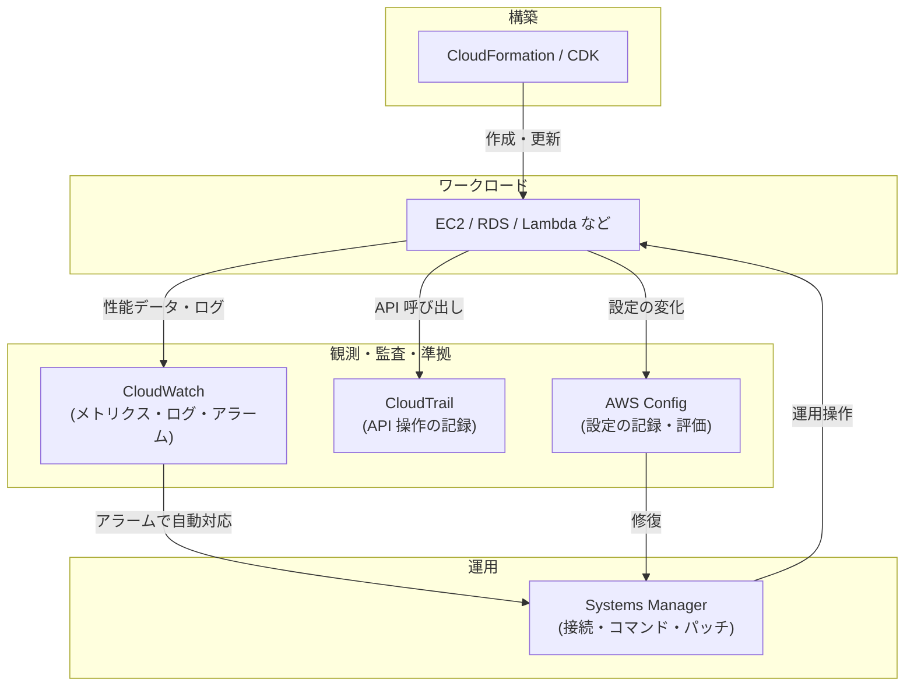
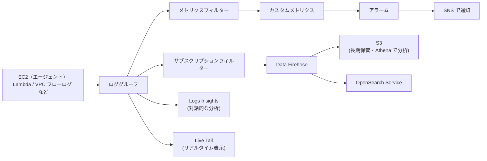
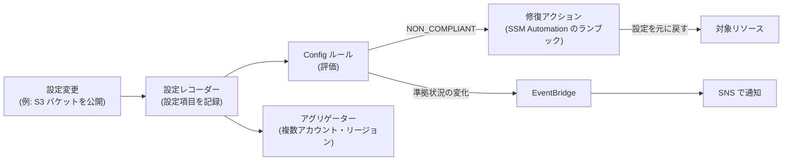
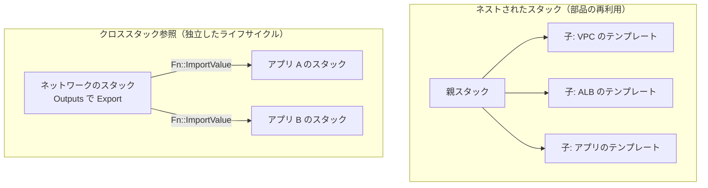
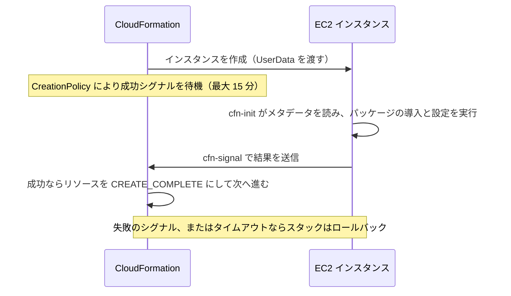

[ホーム](../README.md) > [Phase 2: アソシエイト](README.md) > 監視と運用管理

# 監視と運用管理（CloudWatch / CloudTrail / Config / Systems Manager / CloudFormation）

> **この章のゴール**
> - CloudWatch のメトリクス・アラーム・ログを使って、性能と障害を監視する仕組みを設計できる
> - CloudWatch・CloudTrail・Config の違い（性能／操作／設定）を説明し、使い分けられる
> - Systems Manager を使い、踏み台サーバーや SSH なしで安全にサーバーを運用する方法を説明できる
> - CloudFormation のテンプレート構造と、変更セット・ドリフト検出・スタックポリシーなどの安全装置を説明できる
> - Health Dashboard・Trusted Advisor・Compute Optimizer などの運用支援サービスの役割を説明できる
>
> **対応試験**: SAA-C03（ドメイン2: 弾力性に優れたアーキテクチャの設計、ドメイン3: 高性能なアーキテクチャの設計 ほか）
> **目安時間**: 合計 5 時間（読む 3 時間 / 確認問題 30 分 / 復習 1 時間 30 分）。ハンズオン（Lab 07・Lab 08）は別途

## この章の全体像

本番環境のシステムを安定して動かすには、次の 5 つの問いに答えられる必要があります。

| 問い | 担当するサービス |
|---|---|
| 今どう動いているか（性能・エラー・ログ） | **Amazon CloudWatch** |
| 誰が・いつ・何を操作したか | **AWS CloudTrail** |
| 設定は正しいか・いつどう変わったか | **AWS Config** |
| 大量のサーバーをどう安全に運用するか（接続・コマンド・パッチ） | **AWS Systems Manager** |
| 同じ環境を何度でも正確に作れるか | **AWS CloudFormation**（と AWS CDK） |



## 1. Amazon CloudWatch

### 1.1 メトリクスの基本

**メトリクス** は、時系列に並んだ数値データ（データポイント）です。CloudWatch では次の要素で識別・集計します。

- **名前空間**: サービスごとの入れ物（例: `AWS/EC2`、`AWS/ApplicationELB`）
- **メトリクス名**: 例 `CPUUtilization`
- **ディメンション**: 対象を絞り込むキーと値（例: `InstanceId=i-0123...`、`AutoScalingGroupName=web-asg`）
- **統計**: Average・Sum・Minimum・Maximum・SampleCount と、p99 などの **パーセンタイル**
- **期間**: 何秒ごとに集計するか（60 秒、300 秒など）

メトリクスはリージョン単位で、削除はできず、古いデータは自動的に粗い粒度にまとめられて期限切れになります。

| データポイントの間隔 | 保持期間 |
|---|---|
| 60 秒未満（高解像度のカスタムメトリクス） | 3 時間 |
| 60 秒（1 分） | 15 日 |
| 300 秒（5 分） | 63 日 |
| 3,600 秒（1 時間） | 455 日（15 か月） |

### 1.2 EC2 の標準モニタリングと詳細モニタリング

| 観点 | 標準モニタリング | 詳細モニタリング |
|---|---|---|
| 送信間隔 | **5 分** | **1 分** |
| 料金 | 無料 | 有料 |
| 使いどころ | 一般的な監視 | Auto Scaling をすばやく反応させたい、短時間のスパイクを捉えたい |

EC2 が標準で送るメトリクスは、**ハイパーバイザー側から観測できるもの** です。CPU 使用率、ネットワークの送受信量、ディスク I/O、**ステータスチェック**（システム・インスタンス・アタッチされた EBS）、バーストパフォーマンスインスタンスの CPU クレジットなどです。

> [!WARNING]
> **ひっかけ注意**: **メモリ使用率・ディスク（ファイルシステム）の空き容量・スワップ・プロセス単位の情報は、EC2 の標準メトリクスに含まれません**。これらは OS の内部の情報で、ハイパーバイザーからは見えないためです。取得するには **CloudWatch エージェント** をインスタンスにインストールします。

### 1.3 CloudWatch エージェントとカスタムメトリクス

**CloudWatch エージェント** は、EC2 インスタンスや **オンプレミスのサーバー** にインストールして、次のデータを CloudWatch に送るソフトウェアです。

- OS レベルのメトリクス（メモリ、ディスク使用率、スワップ、プロセス数など）
- ログファイル（アプリケーションログ、OS のログ）を CloudWatch Logs へ

エージェントの設定ファイルは **Systems Manager Parameter Store** に保存し、Systems Manager の Run Command や State Manager で多数のサーバーに一括配布するのが定石です。インスタンスには `CloudWatchAgentServerPolicy` を含む IAM ロールを付けます。

アプリケーション独自の数値（注文件数、キューの待ち時間など）は **カスタムメトリクス** として `PutMetricData` API で送れます。

- **標準解像度**（1 分）と **高解像度**（最短 1 秒）を選べます
- Lambda などでは、決まった JSON 形式でログを出力するだけでメトリクスを作れる **埋め込みメトリクス形式（EMF）** も便利です

### 1.4 アラームと複合アラーム

**CloudWatch アラーム** は、メトリクスがしきい値を超えたかを評価し、状態に応じてアクションを実行します。

- 状態は **OK**・**ALARM**・**INSUFFICIENT_DATA**（データ不足）の 3 つです
- 「期間 5 分 × 評価期間 3 回のうち 2 回しきい値を超えたら ALARM」のように、**M out of N** で一時的なスパイクによる誤報を減らせます。データ欠落時の扱い（欠落を正常とみなすか等）も設定できます
- 高解像度のメトリクスには、10 秒や 30 秒の期間の **高解像度アラーム** を使えます
- アクションの例
  - **SNS トピック** へ通知（メール、Lambda、チャットへの連携など）
  - **EC2 Auto Scaling** のスケーリングポリシーを実行
  - **EC2 アクション**: 停止・終了・再起動・**復旧（recover）**
  - Systems Manager の OpsItem の作成

`StatusCheckFailed_System`（基盤となるハードウェアの障害）のアラームに **復旧アクション** を設定すると、インスタンスを別のハードウェアに移し、**インスタンス ID・プライベート IP アドレス・Elastic IP アドレス・メタデータを維持したまま** 復旧できます（インスタンスストアのデータは失われます）。

**複合アラーム** は、複数のアラームの状態を `AND`・`OR`・`NOT` で組み合わせたアラームです。「CPU が高い **かつ** レイテンシーも悪化している場合だけ通知する」ことで、アラームの嵐（大量の通知）を減らせます。

> [!TIP]
> **試験のポイント**: 「多数のアラームが同時に鳴り、通知が多すぎる。本当に重要な状況だけ通知したい」とあれば **複合アラーム**。「インスタンスの基盤ハードウェアの障害時に、同じ IP アドレスのまま自動で復旧したい」とあれば **StatusCheckFailed_System のアラーム + 復旧アクション** です。

### 1.5 CloudWatch Logs

**CloudWatch Logs** は、ログを収集・保存・検索・分析するサービスです。

- **ロググループ**（アプリやリソースの単位）の中に、**ログストリーム**（インスタンスやコンテナなどの送信元ごと）があります
- 送信元は、CloudWatch エージェント、Lambda（自動）、VPC フローログ、CloudTrail、Route 53 のクエリログ、API Gateway、ECS（`awslogs` ドライバー）など多数です
- **保持期間** はロググループごとに 1 日〜10 年から選べます。**既定は「失効しない（無期限）」** なので、放置するとストレージ料金が増え続けます
- 取り込み料金が安い **低頻度アクセス（Infrequent Access）ログクラス** もあります（使える機能は限られます）
- ロググループは KMS キーで暗号化でき、データ保護ポリシーでログ内の機密データ（メールアドレスなど）をマスクすることもできます

ログを「使う」ための主な機能は次のとおりです。

| 機能 | できること | 注意点 |
|---|---|---|
| **メトリクスフィルター** | ログのパターン（例: `ERROR`）の出現回数などを **メトリクスに変換** し、アラームにつなげる | 作成 **後** に取り込まれたログだけが対象（過去のログには遡らない） |
| **サブスクリプションフィルター** | ログを **リアルタイム** に Kinesis Data Streams・Data Firehose・Lambda へ送る。他アカウントへの配信も可 | 1 つのロググループに設定できる数に上限がある（2 つ） |
| **S3 へのエクスポート** | 指定期間のログを S3 にバッチで書き出す | リアルタイムではない（エクスポート可能になるまで最大 12 時間かかることがある） |
| **Logs Insights** | 専用のクエリ言語で対話的に検索・集計・可視化する | スキャンしたデータ量に応じて課金 |
| **Live Tail** | ログを **リアルタイムにストリーミング表示** し、キーワードで絞り込む | デプロイ直後の確認や障害調査向け |

Logs Insights のクエリ例（5 分ごとの ERROR の件数を集計）:

```text
fields @timestamp, @message
| filter @message like /ERROR/
| stats count(*) as errorCount by bin(5m)
| sort errorCount desc
| limit 20
```



> [!TIP]
> **試験のポイント**
> - 「ログに特定の文字列が一定回数出たら通知」→ **メトリクスフィルター + アラーム + SNS**
> - 「ログをリアルタイムに他のサービスや他のアカウントへ送りたい」→ **サブスクリプションフィルター**（S3 への蓄積なら Data Firehose 経由）
> - 「ログをアドホックに検索・集計したい」→ **Logs Insights**
> - 「ログの保管コストを下げたい」→ **保持期間の設定** + 長期保管分は S3 へ（S3 のライフサイクルで安価なストレージクラスへ）

### 1.6 ダッシュボード・異常検出・クロスアカウント

- **ダッシュボード**: メトリクスやログのグラフを 1 画面にまとめます。複数のリージョンやアカウントのデータを 1 つのダッシュボードに表示できます
- **異常検出**: 機械学習でメトリクスの過去の傾向（日次・週次の周期性など）から「正常な範囲（バンド）」を予測し、そこから外れたらアラームにできます。固定のしきい値を決めにくいメトリクスに向いています
- **クロスアカウントオブザーバビリティ**: 複数のアカウントのメトリクス・ログ・トレースを、1 つの監視用アカウントで横断的に見られます

### 1.7 アプリケーションとユーザー体験の監視

| 機能 | 何を見るか | 仕組み | 典型的な用途 |
|---|---|---|---|
| **Synthetics（Canary）** | ユーザー視点の外形監視 | スクリプトを定期実行して、URL や API、画面操作の流れを疑似的に試す | 「ユーザーより先に障害に気付きたい」、リンク切れ・ログインフローの監視 |
| **RUM**（Real User Monitoring） | 実際のユーザーの体験 | Web ページに埋め込んだ JavaScript がデータを送る | ページの表示時間、JavaScript のエラー、地域・ブラウザ別の分析 |
| **Application Signals** | サービスの健全性（APM） | OpenTelemetry 互換の自動計装 | サービスごとのレイテンシー・エラー率、サービスマップ、**SLO（サービスレベル目標）** の管理 |
| **X-Ray** | リクエストの流れ（分散トレーシング） | トレースを収集してサービス間の呼び出しを可視化 | マイクロサービスのボトルネックの特定 |
| **Container Insights** | ECS / EKS のリソース | エージェントやアドオンでメトリクスとログを収集 | クラスター・サービス・タスク・Pod 単位の CPU / メモリ |
| **Lambda Insights** | Lambda 関数の詳細 | 拡張機能（Lambda レイヤー）で収集 | メモリ使用量、コールドスタートの分析 |
| **CloudWatch investigations** | 障害の原因調査 | 生成 AI がテレメトリを横断的に分析 | 障害時の原因の仮説と対応の提案（2025年6月 GA） |
| **Internet Monitor** | インターネット経由の体験 | AWS が持つネットワークの観測データ | ISP の障害などがユーザーに与える影響の把握 |

コンテナ環境で Prometheus や Grafana を使いたい場合は、Amazon Managed Service for Prometheus と Amazon Managed Grafana があります。

> [!TIP]
> **試験のポイント**: 「ユーザーがアクセスする前に、Web サイトや API の異常を **能動的に** 検知したい」→ **Synthetics**。「実際のユーザーのページ読み込み時間を知りたい」→ **RUM**。「マイクロサービス間のどこで遅延が起きているか」→ **X-Ray / Application Signals**。

公式ドキュメント: [Amazon CloudWatch とは](https://docs.aws.amazon.com/AmazonCloudWatch/latest/monitoring/WhatIsCloudWatch.html) / [CloudWatch Logs とは](https://docs.aws.amazon.com/AmazonCloudWatch/latest/logs/WhatIsCloudWatchLogs.html)

## 2. AWS CloudTrail

### 2.1 何を記録するのか

**AWS CloudTrail** は、AWS アカウント内の **API 呼び出し（操作）を記録する** サービスです。マネジメントコンソール、AWS CLI、SDK、AWS サービス自身による操作のいずれも API 呼び出しなので、すべて記録の対象です。1 件のイベントには「**誰が**（userIdentity）・**いつ**（eventTime）・**どこから**（sourceIPAddress）・**何を**（eventSource / eventName）・**どんな内容で**（requestParameters）・**結果は**（responseElements / errorCode）」が含まれます。

```json
{
  "eventTime": "2026-09-28T01:23:45Z",
  "eventSource": "ec2.amazonaws.com",
  "eventName": "AuthorizeSecurityGroupIngress",
  "awsRegion": "ap-northeast-1",
  "sourceIPAddress": "203.0.113.10",
  "userIdentity": { "type": "AssumedRole", "arn": "arn:aws:sts::111122223333:assumed-role/Admin/alice" },
  "requestParameters": { "groupId": "sg-0123456789abcdef0" }
}
```

### 2.2 イベントの種類

| 種類 | 記録する内容 | 例 | 既定の記録 |
|---|---|---|---|
| **管理イベント** | リソースの作成・変更・削除などの操作（コントロールプレーン） | `RunInstances`、`CreateBucket`、`AttachRolePolicy`、コンソールへのサインイン | **記録される** |
| **データイベント** | リソースの中のデータに対する大量の操作（データプレーン） | S3 の `GetObject` / `PutObject`、Lambda の `Invoke`、DynamoDB の項目の操作 | **記録されない**（証跡で明示的に有効化。追加料金） |
| ネットワークアクティビティイベント | VPC エンドポイントを経由した API 呼び出し | VPC エンドポイント経由で拒否された呼び出しの把握 | 記録されない（有効化が必要） |
| **Insights イベント** | API の呼び出し回数やエラー率の **異常** | 普段は 1 日数回の `TerminateInstances` が急増 | 記録されない（有効化が必要。追加料金） |

> [!WARNING]
> **ひっかけ注意**: 「S3 の特定のオブジェクトを誰がダウンロードしたか調べたい」は **データイベント** です。**既定では記録されない** ため、事前に証跡でデータイベントを有効にしておく必要があります（S3 のサーバーアクセスログでも一部を把握できます）。

### 2.3 イベント履歴と証跡

- **イベント履歴**: 追加設定なしで、**過去 90 日間の管理イベント** をリージョンごとに閲覧・検索・ダウンロードできます（無料）。90 日より長くは保存できません
- **証跡（Trail）**: イベントを **S3 バケットに継続的に保存** する設定です。90 日を超える保管、データイベントや Insights イベントの記録には証跡が必要です
  - 全リージョンを対象にする（マルチリージョンの証跡）のが基本です
  - CloudWatch Logs にも送ると、メトリクスフィルターとアラームで特定の操作を監視できます
  - S3 への配信は通常数分以内ですが、**リアルタイムではありません**
  - 1 つ目の証跡で記録する管理イベントのコピーは無料です
- **組織の証跡**: AWS Organizations の管理アカウント（または委任管理者）で作成すると、**全メンバーアカウントのイベントを 1 か所に記録** できます。メンバーアカウント側からは変更・削除できません

### 2.4 ログの改ざん対策: ログファイルの整合性検証

監査ログは「改ざんされていないこと」を証明できなければ意味がありません。

- **ログファイルの整合性検証** を有効にすると、CloudTrail は 1 時間ごとに **ダイジェストファイル** を作成します。ログファイルのハッシュ値（SHA-256）を記録し、ダイジェストファイル自体にデジタル署名します
- `aws cloudtrail validate-logs` コマンドで、ログファイルが **変更・削除されていないか** を検証できます
- あわせて、ログを **専用のログアーカイブアカウントの S3 バケット** に集め、バケットポリシーで削除を禁止し、S3 Object Lock（WORM）、SSE-KMS による暗号化、ライフサイクルによる長期保管を組み合わせるのが定石です

### 2.5 CloudTrail Insights

**Insights イベント** は、管理イベントの **API 呼び出し回数やエラー率が、通常のパターン（ベースライン）から大きく外れた** ときに記録されます。「認証情報を盗まれ、大量の API 呼び出しが行われた」「自動化スクリプトの不具合でエラーが急増した」といった異常に気付くのに役立ちます。

### 2.6 CloudTrail Lake【新規受付終了】

**CloudTrail Lake** は、イベントを専用のデータストアに保存し、SQL でクエリできる機能です。**2026年3月に発表され、2026年5月31日に新規顧客の受け付けを終了** しました（既存の利用者は継続利用可能）。新しい設計では、次の方法を使います。

- 証跡で S3 に保存し、**Athena** でクエリする（[データ分析サービス](14-analytics.md) を参照）
- CloudWatch Logs に送り、**Logs Insights** で分析する
- **Amazon Security Lake** に集約する（[セキュリティサービス](12-security-services.md) を参照）

### 2.7 操作にリアルタイムで反応する: EventBridge との連携

CloudTrail が記録した管理イベントは **Amazon EventBridge** にも送られます。EventBridge のルールで特定の API 呼び出しに反応すれば、ほぼリアルタイムに自動対応できます。

- 例: セキュリティグループで `0.0.0.0/0` からの SSH が許可されたら（`AuthorizeSecurityGroupIngress`）、Lambda で即座にルールを削除し、SNS で通知する
- 例: ルートユーザーでのサインイン（`ConsoleLogin`）を検知して通知する

> [!TIP]
> **試験のポイント**: 「**誰が** リソースを削除・変更したかを調べたい」→ **CloudTrail**。「90 日以上前の操作も調べたい」「監査のためにログを長期保存したい」→ **証跡で S3 に保存**。「ログが改ざんされていないことを証明したい」→ **ログファイルの整合性検証**。「特定の API 操作に即座に反応したい」→ **EventBridge ルール**。

公式ドキュメント: [AWS CloudTrail とは](https://docs.aws.amazon.com/awscloudtrail/latest/userguide/cloudtrail-user-guide.html)

## 3. AWS Config

### 3.1 仕組み: 設定の記録と履歴

**AWS Config** は、AWS リソースの **設定（構成）を継続的に記録し、変更の履歴を残し、ルールに準拠しているかを評価する** サービスです。

- **設定レコーダー** が、リソースの設定を **設定項目（Configuration Item）** として記録します。記録の対象（すべてのリソースか特定の種類か）と頻度（変更のたびに記録するか、1 日 1 回か）を選べます
- 記録した設定の **履歴** と定期的な **スナップショット** は S3 バケットに配信され、変更は SNS でも通知できます。設定項目の保持期間は既定で 7 年です
- コンソールの **タイムライン** では、「このセキュリティグループは先週の火曜日にどんな設定だったか」「いつ変わったか」を確認でき、その変更を行った CloudTrail のイベントにもたどれます
- リソース間の **関係**（どの EC2 インスタンスがどのセキュリティグループや EBS ボリュームを使っているか）も記録されます

### 3.2 Config ルール

**Config ルール** は、リソースの設定が「あるべき姿」になっているかを評価し、**COMPLIANT（準拠）/ NON_COMPLIANT（非準拠）** を判定します。

- **AWS マネージドルール**: AWS が用意したルール。例として `s3-bucket-public-read-prohibited`（S3 バケットのパブリック読み取り禁止）、`encrypted-volumes`（EBS の暗号化）、`restricted-ssh`（SSH の全開放の禁止）、`required-tags`（必須タグ）などがあります
- **カスタムルール**: Lambda 関数や、Guard というポリシー言語で独自のルールを作れます
- 評価のタイミングは **設定変更時** と **定期実行** です。多くのルールはリソースの作成後に評価する **検出型** ですが、一部のルールは作成前に評価する **予防型（proactive）** のモードにも対応しています

> [!WARNING]
> **ひっかけ注意**: Config は基本的に **検出と記録のサービス** で、操作そのものを **止めません**。「そもそも操作させない」には、SCP（サービスコントロールポリシー）や IAM ポリシーを使います。Config は「違反に気付いて直す」役割です。

### 3.3 修復: SSM Automation による自動修正

非準拠のリソースを、**Systems Manager Automation のランブック** で修正できます（修復アクション）。手動で実行するか、**自動修復** にするかを選べ、失敗時の再試行回数も設定できます。



### 3.4 コンフォーマンスパック

**コンフォーマンスパック** は、複数の Config ルールと修復アクションを 1 つの YAML テンプレートにまとめ、アカウントや組織全体に一括で展開する仕組みです。CIS ベンチマーク、PCI DSS、HIPAA などの「運用上のベストプラクティス」のサンプルテンプレートが用意されており、コンプライアンスの枠組みに沿った評価を短時間で始められます。

### 3.5 アグリゲーター

**アグリゲーター** は、**複数のアカウント・複数のリージョン** の Config のデータを 1 つのアカウントに集約して、全体の準拠状況を見られるようにする仕組みです。AWS Organizations と連携すれば、組織内の全アカウントをまとめて対象にできます。**高度なクエリ**（SQL に似た構文）で、「全アカウントの暗号化されていない EBS ボリュームの一覧」なども取得できます。

料金は、記録した設定項目の数とルールの評価回数に応じてかかります。変更が非常に多いリソースの記録を除外したり、1 日 1 回の記録にしたりすることで、コストを抑えられます。

> [!TIP]
> **試験のポイント**: 「リソースの **設定変更の履歴** を確認したい」「設定が **社内ルールに準拠** しているか継続的に評価したい」「非準拠のリソースを **自動で修正** したい」→ **AWS Config（ルール + SSM Automation による修復）**。「複数アカウント・リージョンの準拠状況を一元的に見たい」→ **アグリゲーター**。

公式ドキュメント: [AWS Config とは](https://docs.aws.amazon.com/config/latest/developerguide/WhatIsConfig.html)

## 4. CloudWatch・CloudTrail・Config の違い

3 つとも「記録する・監視する」サービスなので、試験では混同を誘う選択肢がよく出ます。**答えてくれる問いが違う** と覚えましょう。

| 観点 | CloudWatch | CloudTrail | AWS Config |
|---|---|---|---|
| 答える問い | **どう動いているか**（性能・状態・ログ） | **誰が何をしたか**（API 操作） | **どんな設定か・どう変わったか・準拠しているか** |
| 主なデータ | メトリクス、ログ、アラーム | API 呼び出しのイベント | 設定項目（リソースの設定のスナップショット） |
| 典型的な例 | CPU 使用率が 80% を超えたら通知 | セキュリティグループを変更したのは誰か | S3 バケットがパブリックになっていないか |
| 保持 | メトリクスは最大 15 か月、ログは設定次第 | イベント履歴は 90 日、証跡は S3 に好きなだけ | 設定項目は既定 7 年 |
| 自動対応 | アラーム → SNS / Auto Scaling / EC2 アクション | EventBridge 経由で Lambda など | 修復アクション（SSM Automation） |

実際の調査では 3 つを組み合わせます。「深夜にアプリが遅くなった（CloudWatch）→ その直前にセキュリティグループが変わっていた（Config）→ 変更したのは誰か（CloudTrail）」という流れです。

## 5. AWS Systems Manager

**AWS Systems Manager**（SSM）は、EC2 インスタンスやオンプレミスのサーバーを **大規模に、安全に運用する** ための機能群です。

### 5.1 マネージドノードの前提条件

Systems Manager で管理されるサーバーを **マネージドノード** と呼びます。管理するには、次の 3 つがそろっている必要があります。

1. **SSM Agent** がインストールされ、動作していること（Amazon Linux や Windows Server の多くの AMI には標準で入っています）
2. **IAM の権限**: インスタンスプロファイル（IAM ロール）に `AmazonSSMManagedInstanceCore` ポリシーを付ける。または、アカウント単位で設定する **デフォルトのホスト管理設定** を使う
3. **Systems Manager のエンドポイントへの通信**: エージェントが HTTPS（443）で **外向きに** 通信できること。プライベートサブネットで NAT ゲートウェイがない場合は、`ssm`・`ssmmessages` などの **インターフェイス型 VPC エンドポイント** を作成します

オンプレミスのサーバーも、**ハイブリッドアクティベーション** で登録すればマネージドノードとして扱えます。

### 5.2 主な機能

| 機能 | 何をするか | 試験のキーワード |
|---|---|---|
| **Session Manager** | ブラウザや CLI からシェルに接続。**インバウンドポート・踏み台サーバー・SSH キーが不要** | 「SSH のポートを開けずに」「踏み台を廃止」「操作ログを記録」 |
| **Run Command** | 多数のノードにコマンドやスクリプトを一括実行 | 「SSH で 1 台ずつログインせずに一斉に実行」 |
| **Patch Manager** | パッチベースラインに基づいて OS やアプリのパッチをスキャン・適用 | 「OS のパッチ適用を自動化」 |
| **Maintenance Windows** | 作業を実行してよい時間帯を定義 | 「業務時間外に」 |
| **State Manager** | 関連付けにより、ノードを望ましい状態に保ち続ける | 「エージェントが常に導入された状態を維持」 |
| **Automation** | ランブックで運用手順を自動化（AMI の作成、再起動、修復） | 「Config の修復」「承認付きの手順」 |
| **Parameter Store** | 設定値やシークレットの保管 | 「設定値を一元管理」 |
| **Inventory** | インストール済みのソフトウェアや設定の情報を収集 | 「全サーバーのソフトウェアの一覧」 |
| **Fleet Manager** | ノードを GUI で管理（ファイル、ユーザー、性能など） | 「コンソールからリモートで管理」 |
| **OpsCenter** | 運用上の問題（OpsItem）を集約して調査・対応 | 「運用の課題を一元管理」 |

> [!NOTE]
> **Incident Manager と Change Manager は 2025年11月7日に新規顧客の受け付けを終了** しました【新規受付終了】。インシデント対応には OpsCenter とパートナーの通知サービス、変更管理には ITSM パートナーの製品が推奨されています。**Application Manager も 2026年6月に新規受付終了を発表** しています。古い教材で紹介されていても、新しい設計では選ばないでください。

### 5.3 Session Manager

Session Manager は、SSH に代わる安全な接続方法です。

- エージェントから Systems Manager へ **外向きの HTTPS 通信** でセッションを確立するため、**セキュリティグループのインバウンドルールは不要** です
- 接続できるかどうかは **IAM ポリシー** で制御します（SSH キーの配布・管理が不要）
- セッションの操作ログを **S3 や CloudWatch Logs に記録** でき、通信は KMS キーで暗号化できます。操作の開始・終了は CloudTrail にも記録されます
- ポートフォワーディングで、プライベートサブネットの RDS などに手元から安全に接続することもできます

> [!TIP]
> **試験のポイント**: 「プライベートサブネットの EC2 に、**インバウンドのポートを開けず**、**踏み台サーバーも使わず** に接続したい。**操作ログも残したい**」→ **Session Manager**（NAT ゲートウェイがなければ VPC エンドポイントを追加）。

### 5.4 Patch Manager

- **パッチベースライン** で「どのパッチを承認するか」（例: 重要度が Critical のセキュリティパッチをリリースの 7 日後に自動承認）を定義します
- パッチグループやパッチポリシーで、対象のノードとベースラインを対応付けます
- **メンテナンスウィンドウ** と組み合わせて、決まった時間帯にスキャンやインストールを行い、準拠状況をレポートします

公式ドキュメント: [AWS Systems Manager とは](https://docs.aws.amazon.com/systems-manager/latest/userguide/what-is-systems-manager.html)

## 6. AWS CloudFormation

### 6.1 IaC（Infrastructure as Code）の意義

マネジメントコンソールで手作業で環境を作ると、手順の漏れ、環境ごとの微妙な違い、「誰がいつ何を変えたか分からない」といった問題が起きます。**IaC** は、インフラを **コード（テンプレート）で宣言** し、同じものを何度でも正確に作る考え方です。

- **再現性**: 開発・検証・本番を同じテンプレートから作れる。DR 用に別リージョンへ同じ環境をすぐ作れる
- **レビューと履歴**: テンプレートを Git で管理し、変更をレビューしてから適用できる
- **安全な変更**: 変更内容の事前確認（変更セット）、失敗時の自動ロールバック

**AWS CloudFormation** では、**テンプレート**（YAML / JSON の設計図）から **スタック**（まとめて作成・更新・削除されるリソースの集まり）を作ります。CloudFormation 自体の利用料金は基本的に無料で、作成したリソースの料金だけがかかります。

### 6.2 テンプレートの構造

| セクション | 役割 | 必須 |
|---|---|---|
| `AWSTemplateFormatVersion` | テンプレート形式のバージョン（`"2010-09-09"`） | 任意 |
| `Description` | テンプレートの説明 | 任意 |
| `Metadata` | 追加情報（cfn-init の設定など） | 任意 |
| `Parameters` | スタック作成時に入力する値（環境名、VPC ID など） | 任意 |
| `Rules` | パラメーターの値の組み合わせを検証 | 任意 |
| `Mappings` | キーと値の対応表（環境ごとの設定値など） | 任意 |
| `Conditions` | 条件（本番のときだけ作成する、など） | 任意 |
| `Transform` | マクロの指定（AWS SAM など） | 任意 |
| `Resources` | 作成する AWS リソース | **必須（唯一の必須セクション）** |
| `Outputs` | 出力値（他のスタックへのエクスポートなど） | 任意 |

### 6.3 テンプレートの例

```yaml
AWSTemplateFormatVersion: "2010-09-09"
Description: Web server sample (Parameters / Mappings / Conditions / Outputs)

Parameters:
  EnvType:
    Type: String
    AllowedValues: [dev, prod]
    Default: dev
  VpcId:
    Type: AWS::EC2::VPC::Id
  SubnetId:
    Type: AWS::EC2::Subnet::Id
  LatestAmiId:
    Type: AWS::SSM::Parameter::Value<AWS::EC2::Image::Id>
    Default: /aws/service/ami-amazon-linux-latest/al2023-ami-kernel-default-x86_64

Mappings:
  EnvConfig:
    dev:
      InstanceType: t3.micro
    prod:
      InstanceType: m7i.large

Conditions:
  IsProd: !Equals [!Ref EnvType, prod]

Resources:
  WebSecurityGroup:
    Type: AWS::EC2::SecurityGroup
    Properties:
      GroupDescription: !Sub "${AWS::StackName} web security group"
      VpcId: !Ref VpcId
      SecurityGroupIngress:
        - IpProtocol: tcp
          FromPort: 443
          ToPort: 443
          CidrIp: 10.0.0.0/16
  WebServer:
    Type: AWS::EC2::Instance
    Properties:
      ImageId: !Ref LatestAmiId
      InstanceType: !FindInMap [EnvConfig, !Ref EnvType, InstanceType]
      SubnetId: !Ref SubnetId
      SecurityGroupIds:
        - !GetAtt WebSecurityGroup.GroupId
      Monitoring: !If [IsProd, true, false]
      Tags:
        - Key: Name
          Value: !Sub "${AWS::StackName}-web"
  LogBucket:
    Type: AWS::S3::Bucket
    Condition: IsProd
    DeletionPolicy: Retain
    UpdateReplacePolicy: Retain

Outputs:
  WebServerPrivateIp:
    Value: !GetAtt WebServer.PrivateIp
  WebSecurityGroupId:
    Value: !GetAtt WebSecurityGroup.GroupId
    Export:
      Name: !Sub "${AWS::StackName}-WebSecurityGroupId"
```

このテンプレートのポイントは次のとおりです。

- `LatestAmiId` は **Parameter Store のパブリックパラメーター** から最新の Amazon Linux 2023 の AMI ID を取得します（AMI ID をハードコードしない）
- `EnvType` に応じて、`Mappings` からインスタンスタイプを選び（`!FindInMap`）、本番だけ詳細モニタリングを有効にし（`!If`）、本番だけログ用バケットを作ります（`Condition`）
- `Outputs` の `Export` でセキュリティグループの ID を公開すると、他のスタックから `!ImportValue <スタック名>-WebSecurityGroupId` で参照できます

### 6.4 主な組み込み関数と疑似パラメーター

| 関数 | 用途 | 例 |
|---|---|---|
| `Ref` | パラメーターの値や、リソースの主な識別子を返す | `!Ref VpcId` |
| `Fn::GetAtt` | リソースの属性を返す | `!GetAtt WebServer.PrivateIp` |
| `Fn::Sub` | 文字列に変数を埋め込む | `!Sub "${AWS::StackName}-web"` |
| `Fn::Join` | 文字列を連結する | `!Join ["-", [app, web]]` |
| `Fn::FindInMap` | `Mappings` から値を取り出す | `!FindInMap [EnvConfig, !Ref EnvType, InstanceType]` |
| `Fn::If` / `Fn::Equals` | 条件分岐 | `!If [IsProd, true, false]` |
| `Fn::ImportValue` | 他のスタックがエクスポートした値を参照する | `!ImportValue network-VpcId` |
| `Fn::Select` / `Fn::GetAZs` | リストから要素を選ぶ / AZ の一覧を得る | `!Select [0, !GetAZs ""]` |
| `Fn::Base64` | UserData を Base64 エンコードする | `Fn::Base64: !Sub ...` |

**疑似パラメーター** は、宣言しなくても使える値です。`AWS::Region`、`AWS::AccountId`、`AWS::StackName`、`AWS::Partition`、プロパティを削除する `AWS::NoValue` などがあります。

パスワードなどの機密情報は、テンプレートに直接書かず、**動的参照**（`{{resolve:secretsmanager:...}}` や `{{resolve:ssm-secure:...}}`）で Secrets Manager や Parameter Store から取得します。パラメーターで受け取る場合は `NoEcho: true` で表示を隠します。

### 6.5 スタックの更新と変更セット

スタックを更新すると、変更するプロパティによってリソースへの影響が 3 種類に分かれます。

- **中断なし**: そのまま設定が変わる（例: タグの変更）
- **一時的な中断**: 再起動などを伴う（例: EC2 のインスタンスタイプの変更）
- **置換**: 新しいリソースを作成してから古いリソースを削除する。**物理 ID が変わり、データを持つリソースならデータが失われうる**（例: EC2 の AMI の変更、RDS の DB インスタンス識別子の変更）

**変更セット** を使うと、実行前に「どのリソースが追加・変更・削除され、**置換が起きるか**（Replacement: True / Conditional）」を確認できます。内容を確認して問題がなければ実行し、想定外の置換があれば変更セットを削除してテンプレートを直します。

### 6.6 ロールバック

- **作成に失敗** すると、既定では作成済みのリソースを削除してロールバックします。原因を調べるために「正常にプロビジョニングされたリソースを保持する」（ロールバックの無効化）を選ぶこともできます
- **更新に失敗** すると、直前の正常な状態へ自動的にロールバックします
- **ロールバックトリガー**: 指定した CloudWatch アラームを更新中と更新後の監視期間に監視し、ALARM になったら自動的にロールバックします
- ロールバック自体が失敗した状態（`UPDATE_ROLLBACK_FAILED`）では、原因を取り除いてから「更新のロールバックを続行」し、必要なら問題のリソースをスキップします

### 6.7 DeletionPolicy と UpdateReplacePolicy

**DeletionPolicy** は、**スタックの削除時**（またはテンプレートからリソースを消したとき）に、そのリソースをどう扱うかを指定する属性です。**UpdateReplacePolicy** は、**更新で置換が起きたとき** に古いリソースをどう扱うかを指定します。

| 値 | 動作 | 対象 |
|---|---|---|
| `Delete` | リソースを削除する（多くのリソースの既定） | すべて |
| `Retain` | リソースを残す（スタックの管理から外れる） | すべて |
| `Snapshot` | スナップショットを取ってから削除する | EBS ボリューム、RDS の DB インスタンス・クラスター、ElastiCache、Redshift など |
| `RetainExceptOnCreate` | 作成時の失敗によるロールバックでは削除し、それ以外は残す | DeletionPolicy のみ |

RDS の DB クラスターと、クラスターに属さない DB インスタンスの DeletionPolicy の既定値は `Snapshot` です。また、**オブジェクトが残っている S3 バケットは `Delete` でも削除に失敗** します。空にしてから削除する（カスタムリソースで自動化する）か、`Retain` を指定します。

### 6.8 スタックポリシーと終了保護

**スタックポリシー** は、スタックの **更新時** に、特定のリソースへの変更を禁止する JSON ドキュメントです。一度設定すると、明示的に許可しない限りすべてのリソースの更新が禁止されるため、通常は「全体を許可し、重要なリソースだけ拒否」と書きます。

```json
{
  "Statement": [
    {
      "Effect": "Allow",
      "Principal": "*",
      "Action": "Update:*",
      "Resource": "*"
    },
    {
      "Effect": "Deny",
      "Principal": "*",
      "Action": ["Update:Replace", "Update:Delete"],
      "Resource": "LogicalResourceId/ProductionDatabase"
    }
  ]
}
```

- スタックポリシーは削除できませんが、内容の更新や、特定の更新のときだけ一時的に上書きすることはできます
- **終了保護** を有効にすると、**スタック自体の削除** を防げます
- CloudFormation に専用の **サービスロール** を渡して操作させると、利用者本人には広い権限を与えずに済みます（利用者に必要なのは CloudFormation の操作権限と `iam:PassRole`）

> [!TIP]
> **試験のポイント**: 「スタックの更新で本番 DB が **置換・削除されるのを防ぎたい**」→ **スタックポリシー**。「スタックを削除しても **データを残したい**」→ **DeletionPolicy（Retain / Snapshot）**。「スタックが **誤って削除されるのを防ぎたい**」→ **終了保護**。「更新の **影響を事前に確認** したい」→ **変更セット**。

### 6.9 ドリフト検出

**ドリフト** とは、スタックの外（コンソールでの手作業など）でリソースの設定が変えられ、テンプレートの内容と実際の設定がずれた状態です。**ドリフト検出** を実行すると、リソースごとに `IN_SYNC`（一致）・`MODIFIED`（変更あり）・`DELETED`（削除済み）などの状態と差分が表示されます。

- ドリフト検出は **検出するだけで、自動では直しません**。テンプレートに変更を反映するか、手動で元に戻します
- 定期的にチェックしたい場合は、AWS Config のマネージドルール `cloudformation-stack-drift-detection-check` を使えます

### 6.10 ネストされたスタックとクロススタック参照

大きなシステムを 1 つのテンプレートに書くと、管理が難しくなります。分割の方法は 2 つあります。



| 観点 | ネストされたスタック | クロススタック参照 |
|---|---|---|
| 仕組み | 親テンプレートの中で `AWS::CloudFormation::Stack` として子テンプレートを呼び出す | 一方が `Outputs` で `Export` し、他方が `Fn::ImportValue` で参照する |
| ライフサイクル | 親と一緒に作成・更新・削除される | 各スタックが独立して作成・更新・削除される |
| 向いている用途 | 定型の構成（ALB 一式など）を部品として再利用する | ネットワークなどの共有基盤を、複数チームのアプリのスタックから参照する |
| 制約 | 更新は親スタックから行う | Export 名はリージョン内で一意。**参照されている間は Export 元のスタックを削除できず、値も変更できない**。同じリージョン内だけで使える |

### 6.11 StackSets

**StackSets** は、1 つのテンプレートを **複数のアカウント × 複数のリージョン** に一括でデプロイする機能です。

- **セルフマネージド型のアクセス許可**: 管理用とデプロイ先の IAM ロールを自分で作成して使う
- **サービスマネージド型のアクセス許可**: **AWS Organizations と連携** し、OU（組織単位）を指定してデプロイする。**OU に後から追加されたアカウントにも自動でデプロイ** できる
- 同時にデプロイするアカウント数や、許容する失敗数（失敗の許容度）を指定できます。委任管理者のアカウントから操作することもできます

> [!TIP]
> **試験のポイント**: 「組織内の **全アカウント・複数リージョン** に共通の IAM ロールや Config ルールを展開し、**新しいアカウントにも自動で適用** したい」→ **サービスマネージド型の StackSets**。

### 6.12 カスタムリソース

CloudFormation が標準で扱えない処理は、**カスタムリソース** で実装します。`Type: Custom::名前` のリソースに `ServiceToken`（Lambda 関数か SNS トピックの ARN）を指定すると、スタックの作成・更新・削除のたびに CloudFormation がリクエストを送ります。

- 例: スタック削除時に S3 バケットを空にする、外部システムから値を取得する、未対応の設定を API で行う
- Lambda 関数は処理の結果（SUCCESS / FAILED）を CloudFormation が指定した URL に **必ず応答** する必要があります。応答しないと、タイムアウトまでスタックの処理が止まります

### 6.13 ヘルパースクリプトと CreationPolicy

EC2 インスタンスは起動した時点で `CREATE_COMPLETE` になるため、そのままでは「ソフトウェアのインストールが失敗していても、スタックは成功扱い」になります。これを防ぐのが **ヘルパースクリプト** と **CreationPolicy** です。

| スクリプト | 役割 |
|---|---|
| `cfn-init` | `AWS::CloudFormation::Init` メタデータを読み、パッケージ・ファイル・コマンド・サービスを設定する |
| `cfn-signal` | 処理の成功・失敗を CloudFormation に通知する（CreationPolicy / WaitCondition と組み合わせる） |
| `cfn-hup` | メタデータの変更を検知し、設定を再適用する |
| `cfn-get-metadata` | メタデータを取得する |

```yaml
  WebServer:
    Type: AWS::EC2::Instance
    CreationPolicy:
      ResourceSignal:
        Count: 1
        Timeout: PT15M
    Metadata:
      AWS::CloudFormation::Init:
        config:
          packages:
            yum:
              httpd: []
          commands:
            01_enable_httpd:
              command: systemctl enable --now httpd
    Properties:
      ImageId: !Ref LatestAmiId
      InstanceType: t3.micro
      UserData:
        Fn::Base64: !Sub |
          #!/bin/bash
          dnf install -y aws-cfn-bootstrap
          /opt/aws/bin/cfn-init -v --stack ${AWS::StackName} --resource WebServer --region ${AWS::Region}
          /opt/aws/bin/cfn-signal -e $? --stack ${AWS::StackName} --resource WebServer --region ${AWS::Region}
```



Auto Scaling グループでも、CreationPolicy でインスタンスからのシグナルを待てます。また **UpdatePolicy**（`AutoScalingRollingUpdate` など）で、起動テンプレートの更新時にインスタンスを少しずつ入れ替えるローリング更新を制御できます。

### 6.14 その他の便利な機能

- **リソースのインポート**: 既存のリソースを、作り直さずにスタックの管理下に入れる
- **IaC ジェネレーター**: アカウント内の既存のリソースからテンプレートを生成する
- **Hooks**: リソースの作成・更新の **前に** 独自のチェック（暗号化の必須化など）を実行し、違反なら止める
- **Git 同期**: Git リポジトリのテンプレートの変更を自動的にスタックへ反映する
- **Infrastructure Composer**: テンプレートを図で設計する
- **AWS SAM**: `Transform: AWS::Serverless-2016-10-31` で、サーバーレスのリソースを短く書ける拡張（[サーバーレス](10-serverless.md) を参照）

### 6.15 AWS CDK の紹介

**AWS CDK（Cloud Development Kit）** は、TypeScript・Python・Java・C#・Go などの **プログラミング言語でインフラを定義** し、**CloudFormation テンプレートを生成（synth）してデプロイする** フレームワークです。

- **コンストラクト** という部品を組み合わせます。L1（CloudFormation のリソースそのもの）、L2（安全な既定値を持つ高レベルの部品）、L3（複数のリソースを組み合わせたパターン）の 3 段階があります
- ループや条件分岐、クラスによる再利用など、プログラミング言語の機能が使えます
- `cdk bootstrap`（デプロイ用のリソースを準備）→ `cdk synth`（テンプレート生成）→ `cdk diff`（差分確認）→ `cdk deploy` の流れで使います

```python
from aws_cdk import App, Stack, RemovalPolicy, aws_s3 as s3
from constructs import Construct


class DataStack(Stack):
    def __init__(self, scope: Construct, construct_id: str, **kwargs) -> None:
        super().__init__(scope, construct_id, **kwargs)
        # L2 コンストラクト: 数行で暗号化・HTTPS 強制・バージョニングを設定
        s3.Bucket(
            self,
            "DataBucket",
            encryption=s3.BucketEncryption.KMS_MANAGED,
            enforce_ssl=True,
            versioned=True,
            removal_policy=RemovalPolicy.RETAIN,
        )


app = App()
DataStack(app, "DataStack")
app.synth()
```

CDK で作ったものも、最終的には CloudFormation のスタックとして管理されます。そのため、この章の変更セット・ドリフト検出・DeletionPolicy などの知識はそのまま役立ちます。

公式ドキュメント: [AWS CloudFormation とは](https://docs.aws.amazon.com/AWSCloudFormation/latest/UserGuide/Welcome.html) / [AWS CDK デベロッパーガイド](https://docs.aws.amazon.com/cdk/v2/guide/home.html)

## 7. 運用を支えるその他のサービス

| サービス | 何をするか | 試験のキーワード |
|---|---|---|
| **AWS Health Dashboard** | AWS 側の障害やメンテナンスの情報を提供 | 「自分のリソースに影響する AWS のイベントに自動で対応」 |
| **AWS Trusted Advisor** | アカウントをベストプラクティスと比較してチェック | 「未使用のリソース」「全開放のセキュリティグループ」「サービスクォータの上限に近い」 |
| **AWS Compute Optimizer** | 使用率の実績から機械学習で適正なサイズを推奨 | 「過剰なインスタンスタイプを見直したい」 |
| **AWS Service Catalog** | 承認済みの構成（製品）をセルフサービスで提供 | 「利用者に広い権限を与えずに、承認済みの構成だけを起動させたい」 |
| **AWS License Manager** | ソフトウェアライセンスの使用状況の追跡と上限の強制 | 「BYOL のライセンス数を超えて起動させない」 |

### 7.1 AWS Health Dashboard

- **サービスの状態**: 全利用者向けの、各リージョン・各サービスの稼働状況です
- **アカウントの状態**: **自分のアカウントのリソースに影響するイベント**（障害の影響、EC2 インスタンスの予定されたリタイアやメンテナンスなど）を表示します
- Health のイベントは **EventBridge** に送られるため、「予定されたメンテナンスの通知を受けたら Lambda で自動対応する」といった仕組みを作れます。AWS Organizations と連携すれば、組織全体のイベントを 1 か所で確認できます
- プログラムから取得する **AWS Health API** は、Business Support+ 以上のサポートプランで利用できます

古い教材の「Service Health Dashboard」と「Personal Health Dashboard」は、現在は AWS Health Dashboard に統合されています。

### 7.2 AWS Trusted Advisor

アカウントを AWS のベストプラクティスと比較し、改善点を示します。チェックは **コスト最適化・パフォーマンス・セキュリティ・耐障害性・サービスクォータ・運用上の優秀性** の **6 カテゴリ** です（古い教材では 5 カテゴリと説明されています）。ベーシックサポートでは一部のコアチェック（セキュリティの基本項目とサービスクォータなど）だけが使え、**すべてのチェックは Business Support+ 以上のサポートプラン** で使えます。サポートプランの詳細は [料金・請求・サポート](../01-foundations/08-billing-pricing-support.md) を参照してください。

### 7.3 AWS Compute Optimizer

CloudWatch のメトリクスの実績を機械学習で分析し、**EC2 インスタンス、Auto Scaling グループ、EBS ボリューム、Lambda 関数、Fargate 上の ECS サービス、RDS** などについて、過剰・不足のない設定を推奨します（利用にはオプトインが必要）。既定では過去 14 日間のデータを分析し、有料の拡張インフラストラクチャメトリクスを有効にすると最大 3 か月分を分析します。EC2 のメモリ使用率も考慮させるには、CloudWatch エージェントでメモリのメトリクスを送ります。コスト最適化の全体像は [コスト最適化](18-cost-optimization.md) で扱います。

### 7.4 AWS Service Catalog

管理者が承認済みの CloudFormation テンプレートを **製品** として **ポートフォリオ** にまとめ、利用者はその中から必要なものをセルフサービスで起動します。

- **起動制約**: 製品を起動するときに Service Catalog が使う IAM ロールを指定します。**利用者本人には EC2 や RDS を直接作る権限を与えずに**、承認済みの構成だけを起動させられます
- テンプレート制約でパラメーターの選択肢を絞ったり、ポートフォリオを他のアカウントや組織と共有したりできます

### 7.5 AWS License Manager

Microsoft、Oracle、SAP などのソフトウェアライセンスを、vCPU 数・コア数・ソケット数・インスタンス数などのルールで管理します。AMI や起動テンプレートにライセンス設定を関連付け、**上限を超える起動をブロック（ハードリミット）** できます。コア数やソケット数に基づくライセンスを持ち込む（BYOL）場合は、Dedicated Hosts の管理にも使います。

このほか、CloudWatch のアラームや Health のイベントを Slack や Microsoft Teams に通知するには、**Amazon Q Developer in chat applications**（旧 AWS Chatbot）を使えます。

