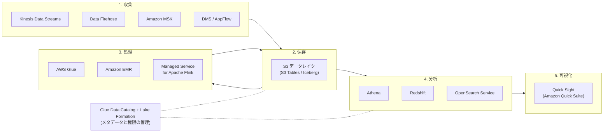
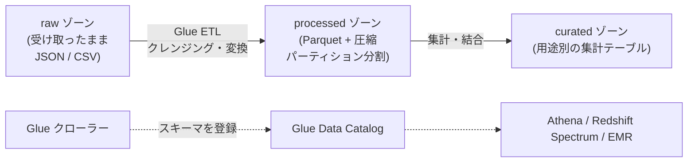
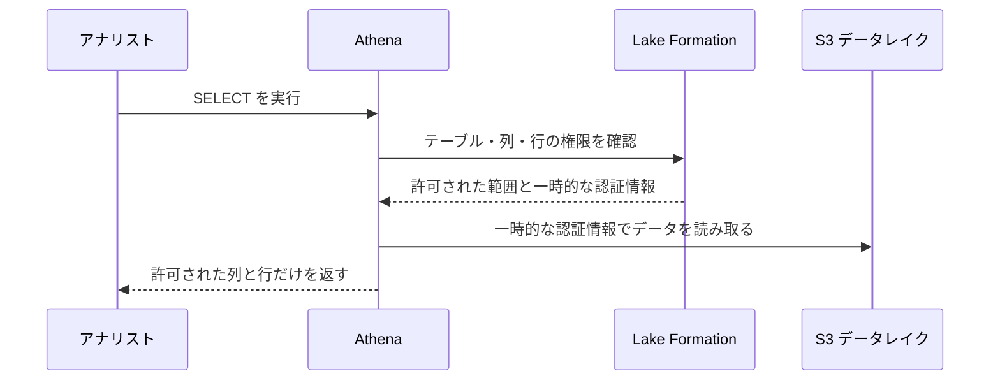
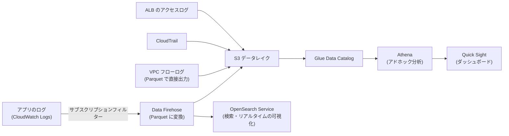
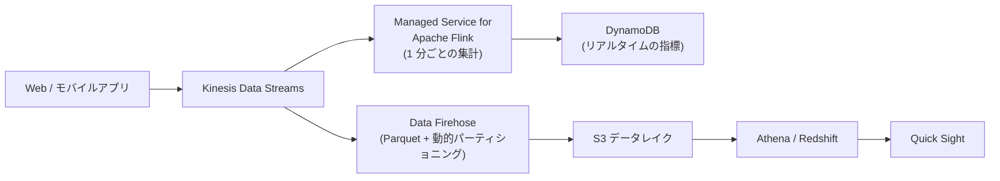
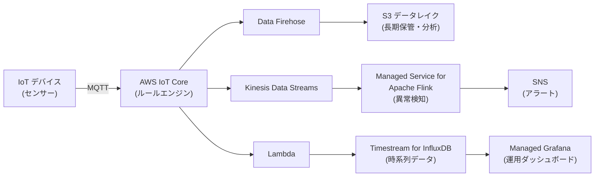

[ホーム](../README.md) > [Phase 2: アソシエイト](README.md) > データ分析サービス

# データ分析サービス

> **この章のゴール**
> - 分析パイプライン（収集 → 保存 → 処理 → 分析 → 可視化）の各段階で使う AWS サービスを説明できる
> - S3 をデータレイクとして設計し、Athena のコストと性能を改善する定石（パーティション・列指向形式・圧縮）を説明できる
> - Glue・Lake Formation・Redshift・EMR の役割と使い分けを説明できる
> - Kinesis Data Streams・Data Firehose・MSK・Managed Service for Apache Flink を要件から選べる
> - ログ分析・クリックストリーム・IoT の典型的な構成を描ける
>
> **対応試験**: SAA-C03（ドメイン3: 高性能なアーキテクチャの設計、ドメイン4: コストを最適化したアーキテクチャの設計 ほか）
> **目安時間**: 合計 4 時間（読む 2.5 時間 / 確認問題 30 分 / 復習 1 時間）

## この章の全体像

SAA-C03 の出題範囲には「高性能なデータ取り込みと変換のソリューションの決定」が含まれます。試験で問われるのは、分析サービスの細かな操作ではなく、**「どの段階で、どのサービスを、なぜ選ぶか」** です。分析の流れは次の 5 段階で整理すると分かりやすくなります。



| 段階 | 主なサービス | 選ぶときの観点 |
|---|---|---|
| 収集 | Kinesis Data Streams、Data Firehose、MSK、DMS、AppFlow、IoT Core | リアルタイム性、再処理の要否、既存の技術（Kafka など） |
| 保存 | S3（データレイク）、S3 Tables、Redshift | 量、コスト、アクセスのパターン |
| 処理 | Glue、EMR、Managed Service for Apache Flink、Lambda | バッチかストリームか、サーバーレスか細かな制御か |
| 分析 | Athena、Redshift、OpenSearch Service | アドホックか定型か、SQL か全文検索か、同時実行数 |
| 可視化 | Amazon QuickSight（2025年10月に Amazon Quick Suite へ再編）、OpenSearch Dashboards、Managed Grafana | 利用者（業務部門・運用チーム） |

この章の根底にある考え方は **「ストレージ（S3）と処理（コンピューティング）の分離」** です。データを S3 に 1 か所だけ置き、Athena・Redshift Spectrum・EMR・Glue などの複数のエンジンが同じデータを読みます。処理の量に合わせてエンジンだけを増減できるため、スケーラブルでコスト効率の高い設計になります。

## 1. データレイクと S3

### 1.1 データレイクとデータウェアハウス

| 観点 | データレイク | データウェアハウス |
|---|---|---|
| 保存するデータ | 構造化・半構造化（JSON など）・非構造化（画像など）を **そのまま** | 整形済みの構造化データ |
| スキーマ | **読み取り時に適用**（スキーマオンリード） | **書き込み時に定義**（スキーマオンライト） |
| 代表的なサービス | S3 + Glue Data Catalog + Athena / EMR | Amazon Redshift |
| 得意なこと | 大量・多様なデータを安価に保管し、さまざまなエンジンで分析する | 定型の集計や BI を、多数の同時ユーザーに高速に提供する |
| コスト | ストレージが安い | 高性能だが、計算リソースの料金がかかる |

両者は対立するものではありません。データレイクに全データを置き、よく使う整形済みのデータを Redshift で高速に分析する **レイクハウス** の考え方が一般的です。

### 1.2 なぜ S3 がデータレイクの中心なのか

- **耐久性とスケール**: 99.999999999%（イレブンナイン）の耐久性で、容量の上限を気にせず保存できます
- **コスト**: ストレージクラスやライフサイクルで、古いデータを安価に保管できます（[Amazon S3](05-s3.md) を参照）
- **オープンな形式**: CSV・JSON・Parquet・ORC・Iceberg などのオープンな形式で保存すれば、特定のエンジンに縛られません
- **統合**: ほぼすべての分析サービスが S3 を直接読み書きできます
- **セキュリティ**: 暗号化、バケットポリシー、Lake Formation によるきめ細かな権限管理を組み合わせられます

### 1.3 ゾーンとプレフィックスの設計

データレイクでは、データの加工段階に応じて **ゾーン**（プレフィックスやバケット）を分けるのが定石です。



- **raw**: 元のデータをそのまま保管します。処理に誤りがあっても、ここから作り直せます
- **processed**: 形式を揃え、列指向形式（Parquet）に変換し、日付などでパーティション分割します
- **curated**: 分析の目的ごとに集計・結合した、すぐに使えるデータです

パーティション分割したデータは、`s3://example-datalake/processed/sales/dt=2026-09-28/part-0000.parquet` のように **`キー=値` 形式（Hive 形式）のプレフィックス** で保存します。これが次の Athena のコスト削減の鍵になります。

### 1.4 オープンテーブル形式と S3 Tables

S3 上のファイルは、そのままでは「一部の行だけを更新・削除する」「複数の書き込みを矛盾なく行う」といったデータベースのような操作が苦手です。これを解決するのが **Apache Iceberg** などの **オープンテーブル形式** です。

- **ACID トランザクション**、行単位の更新・削除（`UPDATE` / `DELETE` / `MERGE`）
- **スキーマの進化**（列の追加・変更）と、過去の時点のデータを参照する **タイムトラベル**
- Athena、EMR、Glue、Redshift などが Iceberg のテーブルを読み書きできます

**Amazon S3 Tables**（2024年12月 GA）は、Iceberg のテーブルを格納するための専用の **テーブルバケット** です。小さなファイルをまとめるコンパクションなどのメンテナンスを自動で行います。

> [!NOTE]
> 「Amazon SageMaker」は、2024年12月以降、データ・分析・AI を統合する次世代のプラットフォームの名称になりました（機械学習のサービスは Amazon SageMaker AI に改称）。レイクハウスの設計や SageMaker Unified Studio、AWS Clean Rooms などは Phase 3 の [データと分析のアーキテクチャ](../03-professional/10-data-analytics-architecture.md) で扱います。

### 1.5 S3 Select は新規受付終了

S3 のオブジェクトから SQL で一部のデータだけを取り出す **S3 Select（および S3 Glacier Select）は、2024年7月から新規顧客の受け付けを終了** しています【新規受付終了】。新しい設計では **Athena** などを使います。試験や古い教材では S3 Select が正解の選択肢として出ることがあるため、「S3 内のデータを SQL でフィルタリングする機能」だったことは覚えておきましょう。

## 2. Amazon Athena

### 2.1 仕組み

**Amazon Athena** は、**S3 上のデータに標準 SQL でクエリを実行できる、サーバーレスの対話型クエリサービス** です。

- サーバーやクラスターの準備は不要です。テーブルを定義すれば、すぐにクエリできます
- テーブルの定義（スキーマ・場所・形式）は **Glue Data Catalog** に保存されます。データそのものは S3 に置いたままで、クエリ時にスキーマを当てはめます（スキーマオンリード）
- クエリの結果は S3 に保存され、Amazon QuickSight などの BI ツールからも使えます
- Apache Iceberg のテーブルに対しては、`INSERT`・`UPDATE`・`DELETE`・`MERGE` やタイムトラベルのクエリも実行できます

### 2.2 料金: スキャンしたデータ量で決まる

Athena の標準の料金は、**クエリがスキャンしたデータ量** に応じた従量課金です（米国東部などで 1 TB あたり 5 USD、クエリごとに最低 10 MB。2026年9月時点）。失敗したクエリや、テーブルの作成などの DDL には料金がかかりません。キャンセルしたクエリは、それまでにスキャンした分が課金されます。常に大量のクエリを実行する場合は、処理能力を予約する **プロビジョンド容量** も選べます。

つまり、**スキャン量を減らすことが、そのままコスト削減と高速化になります**。

### 2.3 コストと性能を改善する定石

| 手法 | 仕組み | 効果 |
|---|---|---|
| **パーティション分割** | 日付などでプレフィックスを分け、`WHERE` 句でパーティションを指定すると、関係のないプレフィックスを読まない | 読むデータの **範囲** を減らす |
| **列指向形式**（Parquet / ORC） | 列ごとにまとめて保存するため、`SELECT` した列だけを読む。列の統計情報で不要なブロックも読み飛ばせる | 読むデータの **列** を減らす |
| **圧縮**（Snappy / ZSTD / GZIP など） | データそのものを小さくする | 読むデータの **量** を減らす |
| **ファイルサイズの最適化** | 小さなファイルが大量にあると、ファイルを開く処理が増える。ある程度の大きさにまとめる | 処理の **オーバーヘッド** を減らす |

考え方を示すための概算の例です（圧縮率や列の大きさで結果は変わります）。1 日 10 GB、1 年分で約 3.65 TB の CSV 形式のログがあり、30 列のうち 3 列だけを使って **特定の 1 日** を集計するとします。

- パーティションなしの CSV: 全データ（約 3.65 TB）をスキャン → 1 回あたり **約 18 USD**
- 日付でパーティション分割: 1 日分（10 GB）だけをスキャン → **約 0.05 USD**
- さらに Parquet に変換して圧縮（約 1/4 のサイズ）し、3 列だけを読む: 約 0.25 GB → **約 0.001 USD**

CSV を Parquet に変換するには、Glue の ETL ジョブ、Data Firehose の形式変換（取り込み時に変換）、Athena の **CTAS（CREATE TABLE AS SELECT）** などを使います。

```sql
CREATE TABLE sales_parquet
WITH (
  format = 'PARQUET',
  write_compression = 'SNAPPY',
  external_location = 's3://example-datalake/processed/sales/',
  partitioned_by = ARRAY['dt']
) AS
SELECT order_id, customer_id, amount, dt
FROM sales_raw_csv;
```

### 2.4 パーティションの管理とパーティション射影

新しいパーティション（例: 新しい日付のプレフィックス）を追加しても、Glue Data Catalog に登録しなければ Athena からは見えません。登録の方法は次のとおりです。

- `ALTER TABLE ... ADD PARTITION` や `MSCK REPAIR TABLE` を実行する
- Glue クローラーで定期的に検出する
- **パーティション射影（Partition Projection）**: パーティションの値の範囲や形式をテーブルのプロパティに書いておき、Athena がクエリ時にパーティションを **計算** する。カタログへの登録が不要になり、パーティションが非常に多いテーブルでもクエリの計画が速くなる

```sql
TBLPROPERTIES (
  'projection.enabled' = 'true',
  'projection.dt.type' = 'date',
  'projection.dt.format' = 'yyyy-MM-dd',
  'projection.dt.range' = '2024-01-01,NOW',
  'storage.location.template' = 's3://example-datalake/processed/sales/dt=${dt}/'
)
```

### 2.5 フェデレーテッドクエリとワークグループ

- **フェデレーテッドクエリ**: Lambda で動くデータソースコネクタを使い、S3 以外のデータ（DynamoDB、RDS / Aurora、Redshift、CloudWatch Logs、オンプレミスのデータベースなど）にも SQL を実行し、S3 のデータと結合できます
- **ワークグループ**: チームや用途ごとにクエリを分け、**クエリごと・ワークグループごとのスキャン量の上限**、結果の保存場所、暗号化の設定、コストの集計を管理できます
- 同じクエリの結果を再利用する機能や、Apache Spark でのノートブック分析の機能もあります

> [!TIP]
> **試験のポイント**
> - 「S3 のデータを **サーバーレスで**、**SQL でアドホックに** 分析したい」「運用のオーバーヘッドを最小に」→ **Athena**
> - 「Athena のコストを下げたい／高速化したい」→ **パーティション分割 + Parquet / ORC + 圧縮**（CTAS や Glue で変換）
> - 「パーティションが非常に多く、クエリの計画に時間がかかる」「新しいパーティションの登録を自動化したい」→ **パーティション射影**
> - 「チームごとにスキャン量の上限を設けたい」→ **ワークグループ**

公式ドキュメント: [Amazon Athena とは](https://docs.aws.amazon.com/athena/latest/ug/what-is.html) / [パーティション射影](https://docs.aws.amazon.com/athena/latest/ug/partition-projection.html)

## 3. AWS Glue

**AWS Glue** は、データの **発見・カタログ化・変換（ETL）・品質管理** を行うサーバーレスのデータ統合サービスです。

| コンポーネント | 役割 |
|---|---|
| **Glue Data Catalog** | テーブルの定義（スキーマ・場所・形式・パーティション）を保存する **メタデータのカタログ**。Athena、Redshift Spectrum、EMR、Lake Formation が共通で使う |
| **クローラー** | S3 や JDBC のデータソースを調べ、スキーマとパーティションを **自動で推測** してカタログに登録・更新する |
| **Glue ETL ジョブ** | サーバーレスの Apache Spark（PySpark / Scala）や Python でデータを変換する。ストリーミング ETL にも対応 |
| **Glue Studio** | ETL ジョブを **ビジュアルな画面** で作成・実行・監視する |
| **Glue DataBrew** | 250 以上の組み込みの変換を使い、**コードを書かずに** データを整形・クレンジングする（アナリストやデータサイエンティスト向け） |
| **Glue Data Quality** | DQDL（Data Quality Definition Language）でルール（欠損率、一意性など）を定義し、データの品質を検証する。データの特徴からルールを推奨する機能もある |

### 3.1 Data Catalog とクローラー

Data Catalog は、1 つのアカウント・リージョンにつき 1 つあり、Apache Hive のメタストアと互換性があります。**クローラー** はスケジュールで実行するほか、S3 のイベント通知と組み合わせて変更のあったフォルダーだけを調べることもできます。スキーマが変わった場合（列の追加など）も、クローラーがカタログを更新します。

### 3.2 Glue ETL ジョブ

- 料金は、使った処理能力（**DPU**: Data Processing Unit）と実行時間に応じて秒単位で課金されます
- **ジョブブックマーク**: 前回の実行で処理済みのデータを記録し、**新しく追加されたデータだけを処理** できます（毎回全件を処理しない）
- 急ぎでないジョブは、空いている容量を使う安価な **Flex 実行クラス** で実行できます
- トリガーやワークフローで複数のジョブをつなげられます。より複雑な処理の流れは、Step Functions や Amazon MWAA（Managed Workflows for Apache Airflow）で組み立てます

> [!NOTE]
> 古い教材で紹介されている **AWS Data Pipeline は新規受付を終了** しています。新しい設計では Glue、Step Functions、MWAA を使います。また、Glue の Ray ジョブは 2026年3月に新規受付終了が発表されています（Spark や Python のジョブは引き続き利用できます）。

> [!TIP]
> **試験のポイント**: 「サーバーレスで ETL」「S3 のデータのスキーマを自動で検出してカタログ化」→ **Glue（ETL ジョブ / クローラー）**。「コードを書かずにデータを整形したい」→ **Glue DataBrew**。「データの品質（欠損や重複）を自動でチェックしたい」→ **Glue Data Quality**。「前回以降の新しいデータだけを処理したい」→ **ジョブブックマーク**。

公式ドキュメント: [AWS Glue とは](https://docs.aws.amazon.com/glue/latest/dg/what-is-glue.html)

## 4. AWS Lake Formation

### 4.1 なぜ必要なのか

S3 のバケットポリシーや IAM ポリシーは、「バケット」や「プレフィックス（フォルダー）」の単位で権限を制御します。しかし分析の現場で求められるのは、「このテーブルの **この列（個人情報）だけは見せない**」「**自分の部署の行だけ** 見せる」といった、**テーブル・列・行の単位の権限** です。これを S3 と IAM だけで実現するのは困難です。

**AWS Lake Formation** は、データレイクの **権限を一元的に管理** するサービスです。データベースの `GRANT` / `REVOKE` のような感覚で、Glue Data Catalog のデータベース・テーブル・列に対する権限を付与します。

### 4.2 仕組み

- データレイクの S3 の場所を Lake Formation に **登録** します
- 利用者（IAM ユーザー・ロール、他のアカウントなど）に、カタログのリソースに対する権限（SELECT など）を付与します
- Athena、Redshift Spectrum、EMR、Glue などの統合されたサービスがクエリするとき、Lake Formation が権限を確認し、**許可された範囲だけにアクセスできる一時的な認証情報** を渡します



### 4.3 きめ細かなアクセス制御と LF タグ

- **列レベル**: 特定の列（例: `email`、`phone`）を含めない・除外する権限を付与できます
- **行レベル・セルレベル**: **データフィルター**（行の条件式と列のリスト）で、「`region = 'JP'` の行だけ」「その中でも特定の列だけ」を許可できます
- **LF タグ（タグベースのアクセス制御）**: データベース・テーブル・列に `confidentiality=high`、`domain=sales` のようなタグを付け、「`domain=sales` かつ `confidentiality=low` のデータを営業アナリストに許可」のように **タグの条件で権限を付与** します。テーブルが何千あっても、タグを付けるだけで権限が自動的に適用されるため、大規模な環境でも管理しやすくなります
- **クロスアカウント共有**: 他のアカウントにテーブルを共有できます（AWS RAM を利用）。中央のアカウントでガバナンスを効かせつつ、各部門のアカウントで分析する構成（データメッシュ）の基盤になります
- Apache Iceberg のテーブルや S3 Tables にも、きめ細かなアクセス制御を適用できます

> [!TIP]
> **試験のポイント**: 「データレイクで **列レベル・行レベル** のアクセス制御をしたい」「Athena と Redshift Spectrum と EMR で **共通の権限** を一元管理したい」「複数アカウントでデータを共有し、中央で統制したい」→ **Lake Formation**。多数のテーブルに対する権限をスケーラブルに管理したいなら **LF タグ** です。

公式ドキュメント: [AWS Lake Formation とは](https://docs.aws.amazon.com/lake-formation/latest/dg/what-is-lake-formation.html)

## 5. Amazon Redshift

### 5.1 仕組み

**Amazon Redshift** は、ペタバイト規模に対応する **データウェアハウス** です。高速な理由は次の 3 つです。

- **列指向ストレージ**: 分析クエリは少数の列を大量の行にわたって集計することが多いため、列ごとに保存して必要な列だけを読みます。圧縮も効きやすくなります
- **MPP（超並列処理）**: リーダーノードがクエリの実行計画を立て、複数のコンピューティングノードが並列で処理します
- **クエリの最適化**: 分散スタイルとソートキー（既定は AUTO で自動調整）、マテリアライズドビュー、結果のキャッシュなど

SQL（PostgreSQL をベースにした方言）と JDBC / ODBC で接続でき、多くの BI ツールから使えます。

> [!WARNING]
> **ひっかけ注意**: Redshift は **分析（OLAP）用** です。1 件ずつの読み書きが大量に発生するトランザクション処理（OLTP）には向きません。OLTP には RDS / Aurora / DynamoDB を選びます（[データベース](07-databases.md) を参照）。

### 5.2 プロビジョンド（RA3）と Serverless

| 観点 | プロビジョンド（RA3 ノード） | Redshift Serverless |
|---|---|---|
| 容量の管理 | ノードの種類と数を選ぶ | 不要（RPU: Redshift Processing Unit で自動スケーリング） |
| 課金 | ノードの稼働時間（一時停止中はコンピューティングの料金なし）。リザーブドノードで割引 | ワークロードの実行中に使った RPU を秒単位で課金。上限を設けてコストを制御 |
| ストレージ | **Redshift マネージドストレージ（RMS）**。コンピューティングと独立して拡張 | マネージドストレージ |
| 向いている用途 | 常に一定の負荷がある。コストを予測・最適化したい | 断続的・予測できない負荷、開発・検証、運用負荷を最小にしたい |

**RA3** ノードでは、データは S3 を基盤とするマネージドストレージに保存され、よく使うデータはノードのローカル SSD にキャッシュされます。**ストレージの量に関係なくコンピューティングだけを増減できる** のが特徴で、後述のデータ共有もこの仕組みの上で動きます。

### 5.3 Redshift Spectrum

**Redshift Spectrum** は、Redshift から **S3 上のデータを、読み込まずに直接クエリ** する機能です。

- S3 のデータを **外部テーブル**（Glue Data Catalog に定義）として参照し、Redshift 内のテーブルと結合できます
- 料金はスキャンしたデータ量に応じてかかります。Athena と同様に、パーティション分割と列指向形式でコストを下げられます
- 典型的な使い方は、**直近のよく使うデータは Redshift に、何年分もの履歴データは安価な S3 に** 置き、必要なときだけ Spectrum で結合する構成です

### 5.4 データ共有・同時実行スケーリング・ゼロ ETL 統合

- **データ共有**: データを **コピーせずに**、他のクラスター・Serverless のワークグループ・アカウント・リージョンと **最新のデータを共有** します（RA3 または Serverless が必要）。ETL 用と BI 用の環境を分けて互いの負荷の影響をなくす、他部門にデータを提供する、といった用途に使います
- **同時実行スケーリング**: 同時に実行されるクエリが急増してキューで待ちが発生すると、**一時的なクラスターを自動で追加** して処理します。クラスターごとに 1 日あたり 1 時間分の無料クレジットが貯まり、それを超えた分は秒単位で課金されます
- **ゼロ ETL 統合**: Aurora（MySQL / PostgreSQL）、RDS for MySQL、DynamoDB などのデータを、**ETL のパイプラインを作らずに** ほぼリアルタイムで Redshift に複製して分析できます。業務データベースに負荷をかけずに分析したいときに使います

### 5.5 その他の押さえておきたい機能

- **データのロード**: S3 からの `COPY` コマンドが基本です。ファイルを複数に分割しておくと、ノードが並列にロードできます
- **ストリーミング取り込み**: Kinesis Data Streams や MSK から直接データを取り込み、マテリアライズドビューで分析できます
- **フェデレーテッドクエリ**: RDS / Aurora の PostgreSQL や MySQL のデータに、Redshift から直接クエリできます
- **スナップショット**: 自動・手動のスナップショットを S3 に保存します。**別のリージョンへのスナップショットの自動コピー** を設定すれば、リージョン障害への備え（DR）になります
- **拡張 VPC ルーティング**: `COPY` や `UNLOAD` の通信を VPC 経由に強制し、VPC エンドポイントやセキュリティグループで制御できるようにします

### 5.6 Athena・Redshift・Redshift Spectrum の使い分け

| 観点 | Athena | Redshift | Redshift Spectrum |
|---|---|---|---|
| データの場所 | S3 | Redshift 内（マネージドストレージ） | S3（Redshift から外部テーブルとして参照） |
| 管理 | サーバーレス | プロビジョンド / Serverless | Redshift の機能として利用 |
| 課金 | スキャン量 | ノード時間 / RPU | スキャン量（Redshift の料金に加えて） |
| 得意なこと | アドホックな分析、ログ分析、たまに実行するクエリ | 複雑な結合と集計、多数の同時ユーザー、定型の BI ダッシュボード | Redshift のデータと、S3 の大量の履歴データの結合 |

> [!TIP]
> **試験のポイント**
> - 「ペタバイト規模の構造化データに、複雑な分析クエリを高速に」「多数の BI ユーザー」→ **Redshift**
> - 「利用が断続的で予測できない」「容量の管理をしたくない」→ **Redshift Serverless**
> - 「古いデータは S3 に置いたまま、Redshift のデータと結合して分析」→ **Redshift Spectrum**
> - 「月曜朝などに同時実行のクエリが急増し、待ちが発生する」→ **同時実行スケーリング**
> - 「別チーム・別アカウントに、コピーせずに最新のデータを提供」→ **データ共有**
> - 「Aurora のデータを ETL なしでほぼリアルタイムに分析」→ **ゼロ ETL 統合**

公式ドキュメント: [Amazon Redshift とは](https://docs.aws.amazon.com/redshift/latest/mgmt/welcome.html)

## 6. Amazon EMR

**Amazon EMR** は、Apache Spark、Hive、Presto / Trino、HBase、Flink などの **ビッグデータのフレームワーク** を実行するマネージドなプラットフォームです。オンプレミスの Hadoop / Spark の環境を AWS に移行する場合の定番です。

| 観点 | EMR on EC2 | EMR on EKS | EMR Serverless |
|---|---|---|---|
| 実行環境 | 専用の EC2 クラスター | 既存の EKS クラスター | サーバーレス（クラスターの管理が不要） |
| 制御の自由度 | 最も高い（インスタンスタイプ、構成、幅広いフレームワーク） | Kubernetes の仕組みで他のアプリと資源を共有 | 低い（アプリケーションの種類と上限を指定するだけ） |
| 向いている用途 | 細かなチューニング、長時間稼働するクラスター、HBase など | Kubernetes を標準の基盤にしている組織 | 運用負荷を最小にしたい Spark / Hive のジョブ |

**EMR on EC2 のノードの種類**

- **プライマリノード**: クラスターを管理します（旧称: マスターノード）
- **コアノード**: 処理に加え、HDFS（クラスター内の分散ファイルシステム）にデータを保存します
- **タスクノード**: 処理だけを行い、データを保存しません

データは **EMRFS で S3 に保存** し、クラスターには計算だけをさせるのが定石です。こうすると、ジョブのたびにクラスターを起動して終わったら削除する **一時的な（トランジェント）クラスター** の運用ができ、コストを大きく下げられます。インスタンスフリートを使えば、複数のインスタンスタイプと購入オプションを組み合わせられます。

> [!WARNING]
> **ひっかけ注意**: コスト削減のために **スポットインスタンスを使うなら、タスクノード** に使います。コアノードは HDFS のデータを持つため、スポットの中断でデータを失ったり、ジョブが失敗したりするリスクがあります。

> [!TIP]
> **試験のポイント**: 「オンプレミスの Hadoop / Spark のジョブを、**変更を最小限にして** 移行」「フレームワークの細かな設定が必要」→ **EMR**。「サーバーレスで ETL」「クラスターを意識したくない」→ **Glue** または **EMR Serverless**。「既存の EKS で Spark を動かしたい」→ **EMR on EKS**。

公式ドキュメント: [Amazon EMR とは](https://docs.aws.amazon.com/emr/latest/ManagementGuide/emr-what-is-emr.html)

## 7. ストリーミングデータの収集と処理

センサー・クリックストリーム・ログなど、**絶え間なく発生するデータ** を扱うのがストリーミングです。AWS には役割の異なる 4 つのサービスがあります。Kinesis Data Streams と SQS / SNS との違いなどの基本は [アプリケーション統合](09-application-integration.md) でも扱っています。

### 7.1 Amazon Kinesis Data Streams

- ストリームに書き込まれたデータを **既定で 24 時間、最大 365 日保持** します。保持期間内なら、**複数のコンシューマーが独立して読み取り**、不具合があれば **過去のデータを再処理（リプレイ）** できます
- 容量は **シャード** 単位で決まります（プロビジョンドモードでは、1 シャードあたり書き込み 1 MB/秒または 1,000 レコード/秒、読み取り 2 MB/秒）。容量を自動で調整する **オンデマンドモード** もあります
- 同じパーティションキーのデータは同じシャードに入り、**シャード内では順序が保証** されます
- **拡張ファンアウト** を使うと、コンシューマーごとに専用の読み取りスループットを確保できます
- コンシューマーには Lambda、KCL（Kinesis Client Library）を使うアプリ、Managed Service for Apache Flink、Data Firehose などを使えます

### 7.2 Amazon Data Firehose（旧 Kinesis Data Firehose）

**Amazon Data Firehose** は、ストリーミングデータを **宛先に届ける（ロードする）** ことに特化したフルマネージドのサービスです。

- シャードや容量の管理は **不要** で、自動でスケールします
- 入力元: アプリケーションからの直接送信、Kinesis Data Streams、MSK、CloudWatch Logs のサブスクリプションなど
- 宛先: **S3**、**Redshift**（S3 を経由して COPY）、**OpenSearch Service / Serverless**、Splunk、Snowflake、Apache Iceberg のテーブル、HTTP エンドポイント、パートナーのサービスなど
- データを **サイズまたは時間でバッファリング** してから配信するため、**ほぼリアルタイム（near real-time）** です
- 配信の途中で、Lambda によるデータの変換、**JSON から Parquet / ORC への形式変換**（Glue Data Catalog のスキーマを使用）、レコードの内容に応じて S3 のプレフィックスを分ける **動的パーティショニング**、圧縮などができます
- データを **保持しない** ため、リプレイはできません。配信に失敗したデータは S3 にバックアップできます

### 7.3 Amazon MSK（Managed Streaming for Apache Kafka）

**Amazon MSK** は、オープンソースの **Apache Kafka** のマネージドサービスです。Kafka の API と互換性があるため、**既存の Kafka のアプリケーションやツールを、ほぼそのまま移行** できます。

- ブローカーを自分で選ぶプロビジョンド型（標準ブローカーのほか、スループットが高くスケーリングの速い Express ブローカーもある）と、容量の管理が不要な **MSK Serverless** があります
- Kafka Connect のコネクタを動かす **MSK Connect**、長期間のデータ保持に向く階層型ストレージなどの機能があります

### 7.4 Amazon Managed Service for Apache Flink（旧 Kinesis Data Analytics）

**Amazon Managed Service for Apache Flink** は、ストリームのデータを **リアルタイムに処理・分析** するサービスです。オープンソースの Apache Flink のアプリケーション（Java・Scala・Python・SQL）をサーバーレスで実行します。

- **ウィンドウ集計**（例: 1 分ごとの移動平均）、ストリーム同士の結合、パターンの検出（異常検知）など、状態を持つ処理を得意とします
- 入力元は Kinesis Data Streams や MSK、出力先は Data Firehose・S3・OpenSearch・DynamoDB などです
- ノートブック（Studio）で、ストリームに対して対話的に SQL を実行することもできます

> [!WARNING]
> **ひっかけ注意**: 以前の **Kinesis Data Analytics for SQL アプリケーションは、2026年1月27日に提供を終了** しました。試験や古い教材で「Kinesis Data Analytics でストリームに SQL を実行」とあれば、現在は **Managed Service for Apache Flink**（Flink の SQL や Studio のノートブック）に置き換えて考えてください。

### 7.5 4 つのサービスの比較

| 観点 | Kinesis Data Streams | Data Firehose | Amazon MSK | Managed Service for Apache Flink |
|---|---|---|---|---|
| 役割 | ストリームの保存と受け渡し | 宛先への **配信（ロード）** | ストリームの保存と受け渡し（Kafka） | ストリームの **処理・分析** |
| 容量の管理 | シャード（プロビジョンド）またはオンデマンド | 不要（自動） | ブローカー（プロビジョンド）または Serverless | 自動スケーリング |
| レイテンシー | リアルタイム | **ほぼリアルタイム**（バッファリングあり） | リアルタイム | リアルタイム |
| 保持と再処理 | 24 時間〜365 日。**リプレイ可** | **保持しない**（リプレイ不可） | 設定に応じて長期間 | ―（処理の状態を保持） |
| 複数のコンシューマー | 可 | 1 つのストリームの宛先は 1 つ | 可 | ― |
| 典型的な用途 | 独自のコンシューマーによるリアルタイム処理 | S3 / Redshift / OpenSearch への最小運用の配信 | Kafka の既存資産の移行 | ウィンドウ集計、異常検知 |

> [!TIP]
> **試験のポイント**
> - 「リアルタイム」「**複数のアプリケーション** が同じデータを読む」「**再処理（リプレイ）**」「順序の保証」→ **Kinesis Data Streams**
> - 「S3 / Redshift / OpenSearch に **ほぼリアルタイム** で届ける」「**運用のオーバーヘッドを最小に**」「Parquet に変換して保存」→ **Data Firehose**
> - 「**Kafka** を使っている」「オープンソースの互換性」→ **Amazon MSK**
> - 「ストリームの **集計・異常検知** をリアルタイムに」→ **Managed Service for Apache Flink**

公式ドキュメント: [Kinesis Data Streams](https://docs.aws.amazon.com/streams/latest/dev/introduction.html) / [Amazon Data Firehose](https://docs.aws.amazon.com/firehose/latest/dev/what-is-this-service.html) / [Amazon MSK](https://docs.aws.amazon.com/msk/latest/developerguide/what-is-msk.html)

## 8. Amazon OpenSearch Service

### 8.1 仕組みと用途

**Amazon OpenSearch Service**（旧 Amazon Elasticsearch Service）は、オープンソースの検索・分析エンジン **OpenSearch** のマネージドサービスです。

- **全文検索**: 商品カタログやサイト内の検索。キーワードのあいまい検索や、関連度による並べ替えができます
- **ログ分析とオブザーバビリティ**: ログを取り込み、**OpenSearch Dashboards** でリアルタイムに検索・可視化します
- **ベクトル検索**: 生成 AI の RAG（検索拡張生成）でのベクトルストアとしても使われます

**ドメイン**（クラスター）の設計では、次の点を押さえます。

- データノードに加えて **専用のマスターノード（クラスターマネージャーノード）を 3 台** 置くと、クラスターが安定します。本番では **マルチ AZ** に配置します（スタンバイ付きのマルチ AZ 構成も選べます）
- ストレージは **ホット → UltraWarm（S3 を基盤とする安価な読み取り専用の層）→ コールド** の階層を使い分け、インデックスの状態管理（ISM）のポリシーで古いデータを自動で移動できます
- データの取り込みには、Data Firehose、**OpenSearch Ingestion**（マネージドのデータパイプライン）、CloudWatch Logs のサブスクリプションなどを使います。**DynamoDB からのゼロ ETL 統合** を使えば、DynamoDB のデータに対する全文検索を、同期のコードを書かずに実現できます
- VPC 内への配置、きめ細かなアクセス制御（インデックス・ドキュメント・フィールドの単位）、保存時と通信時の暗号化に対応しています

### 8.2 OpenSearch Serverless

**OpenSearch Serverless** は、クラスターの管理が不要な OpenSearch です。用途に応じて **検索**・**時系列**・**ベクトル検索** の種類の **コレクション** を作り、処理能力は **OCU（OpenSearch Compute Unit）** の単位で自動的にスケールします。

2026年9月時点のドキュメントでは、**コレクショングループ** ごとにインデックス作成用と検索用の OCU の **最小値と最大値** を設定できます。最小値を 0 にすると、アイドル時には OCU が不要になります（0 から起動するときはコールドスタートの遅延があります）。最大値は、コストが上限を超えないようにするための手段になります。

> [!WARNING]
> **ひっかけ注意**: 以前の OpenSearch Serverless（現在の「クラシックコレクション」）は、**データ量がわずかでも最小限の OCU の料金が常にかかる** ため、小規模な用途では割高になりやすい点が注意点とされていました。古い教材や問題にはこの前提で書かれたものがあります。容量と料金の仕組みは変わりやすいため、設計時には [容量の管理](https://docs.aws.amazon.com/opensearch-service/latest/developerguide/serverless-scaling.html) と料金ページを確認してください。

> [!TIP]
> **試験のポイント**: 「**全文検索**」「ログをリアルタイムに **検索・可視化**」「Elasticsearch / Kibana 相当」→ **OpenSearch Service**。「DynamoDB のデータを全文検索したい」→ **DynamoDB のゼロ ETL 統合 + OpenSearch Service**。なお、古い教材の Amazon CloudSearch は新規受付を終了しているため、新しい設計では OpenSearch Service を選びます。

公式ドキュメント: [Amazon OpenSearch Service とは](https://docs.aws.amazon.com/opensearch-service/latest/developerguide/what-is.html)

## 9. 可視化: Amazon QuickSight（2025年10月に Amazon Quick Suite へ再編）

**Amazon QuickSight** は、サーバーレスの **BI（ビジネスインテリジェンス）サービス** です。2025年10月に、AI エージェントによる調査や業務の自動化などの機能とあわせて **Amazon Quick Suite** へ再編され、BI の機能は **Amazon Quick Sight** として提供されています。試験や古い教材では「Amazon QuickSight」の名称で登場します。

- Athena、Redshift、RDS / Aurora、S3、SaaS などのデータソースに接続し、ダッシュボードを作成・共有します
- **SPICE**（インメモリの計算エンジン）にデータを取り込むと、ダッシュボードの操作が速くなり、データソースへの負荷も減らせます
- **行レベルのセキュリティ**（ユーザーごとに見える行を制限）や列レベルのセキュリティ、**アプリケーションへのダッシュボードの埋め込み**、機械学習による異常検出や予測に対応しています
- サーバーの管理は不要で、ユーザー単位の料金体系です

運用チーム向けのメトリクスのダッシュボードには **Amazon Managed Grafana**、ログの検索と可視化には **OpenSearch Dashboards** もよく使われます。

> [!TIP]
> **試験のポイント**: 「サーバーレスの BI ダッシュボード」「ダッシュボードを自社のアプリに **埋め込みたい**」「ユーザーごとに見える行を制限したい」→ **QuickSight（Quick Sight）**。

## 10. 典型的な構成

### 10.1 ログ分析



- **長期保管と低コストの分析** は S3 + Athena、**直近のログの対話的な検索と可視化** は OpenSearch Service、と役割を分けるのが定石です
- VPC フローログは Parquet 形式・Hive 形式のプレフィックスで S3 に直接出力でき、Athena ですぐにクエリできます
- セキュリティログを組織全体で集約・正規化するなら Amazon Security Lake も候補です（[セキュリティサービス](12-security-services.md) を参照）

### 10.2 クリックストリーム分析



- Kinesis Data Streams を中心に、**リアルタイムの経路**（Flink で「今売れている商品」などの指標を計算）と、**蓄積と分析の経路**（Firehose で S3 に保存し、Athena や Redshift で分析）の 2 つに分けます
- 複数のコンシューマーが同じストリームを独立して読めるのは Kinesis Data Streams の特長です

### 10.3 IoT データの分析



- AWS IoT Core の **ルールエンジン** が、SQL に似たルールでメッセージを振り分け、各サービスへ送ります
- 以前の **AWS IoT Analytics は 2025年12月15日に提供を終了** しました。現在は上の図のように、Firehose・S3・Flink などを組み合わせます
- 時系列データベースの **Amazon Timestream for LiveAnalytics は 2025年6月に新規受付終了が発表** されており【新規受付終了】、新しい設計では **Timestream for InfluxDB** が選択肢です

## 11. サービス選択の早見表

| 要件・問題文のキーワード | 選ぶサービス |
|---|---|
| S3 のデータをサーバーレスに SQL でアドホック分析 | Athena |
| Athena のスキャン量（コスト）を減らしたい | パーティション分割 + Parquet / ORC + 圧縮 |
| S3 のデータのスキーマを自動で検出してカタログ化 | Glue クローラー + Glue Data Catalog |
| サーバーレスの ETL（Spark） | Glue ETL ジョブ |
| コードを書かずにデータを整形 | Glue DataBrew |
| データの品質のルールを検証 | Glue Data Quality |
| データレイクの列・行レベルの権限、タグによる一元管理 | Lake Formation（データフィルター、LF タグ） |
| ペタバイト規模の DWH、複雑な結合、多数の BI ユーザー | Redshift |
| 断続的な分析、容量の管理をしたくない | Redshift Serverless |
| Redshift から S3 のデータを直接クエリ | Redshift Spectrum |
| コピーせずに別のクラスター・アカウントとデータを共有 | Redshift のデータ共有 |
| 同時実行のクエリの急増に対応 | Redshift の同時実行スケーリング |
| Aurora / DynamoDB のデータを ETL なしで分析 | Redshift のゼロ ETL 統合 |
| Hadoop / Spark の移行、細かな制御 | EMR（コスト削減にはタスクノードにスポット） |
| リアルタイム、複数のコンシューマー、再処理 | Kinesis Data Streams |
| ほぼリアルタイムで S3 / Redshift / OpenSearch に配信、運用最小 | Data Firehose |
| Kafka の API 互換、既存の Kafka の移行 | Amazon MSK |
| ストリームのウィンドウ集計・異常検知（旧 Kinesis Data Analytics） | Managed Service for Apache Flink |
| 全文検索、ログの検索と可視化 | OpenSearch Service |
| サーバーレスの BI ダッシュボード、アプリへの埋め込み | Amazon QuickSight（Amazon Quick Suite） |
| SaaS（Salesforce など）のデータの取り込み | Amazon AppFlow |
| データベースからの継続的なデータの移行・複製 | AWS DMS |

## まとめ

- 分析は **収集 → 保存 → 処理 → 分析 → 可視化** で整理する。中心は **S3 のデータレイク** で、ストレージと処理を分離する
- データレイクは raw / processed / curated のゾーンに分け、Hive 形式のプレフィックスでパーティション分割する。更新や ACID が必要なら **Apache Iceberg**（S3 Tables）
- **Athena** はサーバーレスの SQL で、スキャン量で課金される。**パーティション分割・Parquet / ORC・圧縮** でコストと時間を大きく減らせる。パーティションが多いなら **パーティション射影**
- **Glue** は Data Catalog（共通のメタデータ）、クローラー（スキーマの自動検出）、ETL（サーバーレスの Spark）、DataBrew（ノーコード）、Data Quality（品質の検証）
- **Lake Formation** で、テーブル・列・行・セルの単位の権限を一元管理する。大規模なら **LF タグ**
- **Redshift** は列指向の MPP の DWH。RA3 はストレージとコンピューティングを分離、**Serverless** は容量の管理が不要。**Spectrum**（S3 を直接クエリ）、**データ共有**（コピー不要）、**同時実行スケーリング**（急増に対応）、**ゼロ ETL 統合**（業務 DB から自動で複製）
- **EMR** は Hadoop / Spark の移行と細かな制御。データは S3（EMRFS）に置き、スポットは **タスクノード** に使う
- ストリーミングは「**Kinesis Data Streams = 保持とリプレイ・複数のコンシューマー**」「**Data Firehose = ほぼリアルタイムの配信・運用最小**」「**MSK = Kafka**」「**Managed Service for Apache Flink = リアルタイム処理**」
- **OpenSearch Service** は全文検索とログの可視化。**QuickSight は Amazon Quick Suite に再編**（BI は Quick Sight）
- **S3 Select・Kinesis Data Analytics for SQL・IoT Analytics・CloudSearch・Data Pipeline** などは新規受付終了や提供終了。試験で見かけたら現在の代替サービスに置き換えて考える

## 確認問題

### 問1
ある企業は、Web サーバーのアクセスログを CSV 形式で S3 に保存しており、1 年分で約 20 TB あります。アナリストは Athena で、特定の日付範囲のログから数個の列だけを集計するクエリを頻繁に実行しており、クエリのコストと実行時間が問題になっています。最も効果的な対策の組み合わせはどれですか。（2つ選択してください）

- A. ログを S3 Intelligent-Tiering ストレージクラスに移動する
- B. ログを Parquet 形式に変換し、圧縮する
- C. S3 Select を使い、必要な行だけを取り出してから集計する
- D. ログを日付でパーティション分割し、クエリの WHERE 句でパーティションを指定する
- E. Athena のワークグループで、クエリごとのスキャン量の上限を引き上げる

<details>
<summary>解答と解説</summary>

**正解: B, D**

**解説**: Athena の料金と実行時間は、スキャンするデータ量でほぼ決まります。Parquet（列指向形式）と圧縮で「読む列と量」を、日付のパーティション分割で「読む範囲」を減らせます。変換には Athena の CTAS や Glue の ETL ジョブを使います。

**各選択肢の検討**
- A: ✗ ストレージの料金を最適化するだけで、Athena のスキャン量は減りません。
- B: ✓ 必要な列だけを読み、データ量も小さくなります。
- C: ✗ S3 Select は新規受付を終了しています。また、オブジェクトごとに使う機能で、多数のファイルにまたがる集計クエリの代わりにはなりません。
- D: ✓ 関係のない日付のデータを読まずに済みます。
- E: ✗ 上限はコストの暴走を防ぐためのもので、引き上げてもスキャン量は減りません。

</details>

### 問2
ある企業は、モバイルアプリのイベントデータ（JSON）を収集し、S3 に保存して Athena で分析したいと考えています。データは数分以内に S3 に届けばよく、Athena のコストを抑えるため Parquet 形式で保存したいと考えています。最も運用上のオーバーヘッドが少ない方法はどれですか。

- A. Amazon Data Firehose で受信し、レコード形式の変換機能で Parquet に変換して S3 に配信する
- B. Kinesis Data Streams で受信し、EC2 上の独自のコンシューマーで Parquet に変換して S3 に書き込む
- C. イベントを JSON のまま S3 に保存し、毎晩 EMR クラスターを起動して Parquet に変換する
- D. Amazon MSK で受信し、MSK Connect で S3 に書き込む

<details>
<summary>解答と解説</summary>

**正解: A**

**解説**: Data Firehose は容量の管理が不要なフルマネージドの配信サービスで、Glue Data Catalog のスキーマを使って JSON を Parquet に変換しながら、ほぼリアルタイムに S3 へ配信できます。

**各選択肢の検討**
- A: ✓ コードもサーバーも不要で、すべての要件を満たします。
- B: ✗ コンシューマーのアプリケーションと EC2 の開発・運用が必要です。
- C: ✗ 夜間のバッチ処理では「数分以内」の要件を満たさず、クラスターの管理も必要です。
- D: ✗ Kafka の環境とコネクタの管理が必要で、この要件には過剰です。

</details>

### 問3
ある企業は、注文イベントをリアルタイムに処理しています。同じイベントを「不正検知」「在庫の更新」「レコメンドの更新」の 3 つのアプリケーションが **それぞれ独立して** 読み取る必要があります。また、不具合があったときに **過去 3 日分のイベントを再処理** できる必要があります。最も適したサービスはどれですか。

- A. Amazon Data Firehose
- B. Amazon SQS の標準キュー
- C. Amazon Kinesis Data Streams（保持期間を 3 日以上に設定）
- D. Amazon SNS の標準トピック

<details>
<summary>解答と解説</summary>

**正解: C**

**解説**: Kinesis Data Streams はデータを保持期間のあいだ保存し、複数のコンシューマーがそれぞれの位置から独立して読み取れます。保持期間内であれば、過去のデータを読み直して再処理できます。

**各選択肢の検討**
- A: ✗ Firehose はデータを保持しないため、再処理できません。宛先への配信のためのサービスです。
- B: ✗ SQS はコンシューマーが処理したメッセージを削除するモデルで、複数のアプリケーションによる独立した読み取りや、処理済みのメッセージの再処理には向きません。
- C: ✓ 独立した複数の読み取りとリプレイの両方を満たします。
- D: ✗ 標準トピックはメッセージを保持しないため、再処理できません。

</details>

### 問4
ある企業は、S3 のデータレイクに顧客データを保存し、Athena と Redshift Spectrum で分析しています。マーケティング部門のアナリストには顧客テーブルを分析させたいものの、**メールアドレスと電話番号の列は見せてはならず**、さらに **日本（JP）の顧客の行だけ** を見せる必要があります。最も運用上のオーバーヘッドが少ない方法はどれですか。

- A. 個人情報の列を除いたテーブルのコピーを国ごとに作成し、S3 のバケットポリシーで部門ごとのアクセスを制御する
- B. S3 のオブジェクトにタグを付け、IAM ポリシーの条件でタグごとにアクセスを制御する
- C. Amazon Macie で個人情報を検出し、検出されたオブジェクトへのアクセスを拒否する
- D. Lake Formation でテーブルを管理し、対象の列を除外して `country = 'JP'` の行だけを許可するデータフィルターをアナリストに付与する

<details>
<summary>解答と解説</summary>

**正解: D**

**解説**: Lake Formation のデータフィルターを使えば、列の除外と行の条件を組み合わせたセルレベルの権限を付与できます。権限は Athena と Redshift Spectrum の両方に共通で適用されます。

**各選択肢の検討**
- A: ✗ データのコピーが増え、更新のたびに同期が必要になります。運用負荷とコストが大きい方法です。
- B: ✗ オブジェクト（ファイル）単位の制御で、列や行の単位の制御はできません。
- C: ✗ Macie は機密データを発見するサービスで、列・行の単位のアクセス制御はできません。
- D: ✓ 最小の運用負荷で、列と行の両方を制御できます。

</details>

### 問5
ある企業は、オンプレミスの Hadoop クラスターで毎晩 Spark のバッチジョブを実行しています。これを AWS に移行するにあたり、コードの変更を最小限にしつつ、**コストを最も抑えたい** と考えています。ジョブは数時間で終わり、中断されても再実行できます。最も適切な構成はどれですか。

- A. EMR クラスターを常時稼働させ、すべてのノードをオンデマンドインスタンスにする
- B. ジョブのたびに EMR クラスターを起動して終了後に削除し、データは S3 に置く。コアノードはオンデマンドインスタンス、タスクノードはスポットインスタンスにする
- C. EMR クラスターのすべてのノードをスポットインスタンスにし、データはコアノードの HDFS に保存する
- D. Spark のコードを Lambda 関数に書き換えて実行する

<details>
<summary>解答と解説</summary>

**正解: B**

**解説**: データを S3 に置けば、ジョブのときだけクラスターを起動するトランジェントクラスターにでき、使わない時間の料金をなくせます。処理だけを担うタスクノードにスポットインスタンスを使えば、さらにコストを下げられます。

**各選択肢の検討**
- A: ✗ ジョブを実行していない時間も料金がかかります。
- B: ✓ コストと安定性のバランスが最も良い構成です。
- C: ✗ コアノードがスポットで中断されると HDFS のデータを失う恐れがあります。データを HDFS に置くとクラスターを削除することもできません。
- D: ✗ 大規模なコードの書き換えが必要で、数時間の処理は Lambda の実行時間の上限（15 分）にも収まりません。

</details>

### 問6
ある企業は、Amazon Redshift で直近 1 年分の売上データを分析しています。過去 10 年分の履歴データ（数百 TB）は S3 に Parquet 形式で保存されており、年に数回だけ、Redshift のデータと結合して分析する必要があります。Redshift のストレージを増やさずに、コスト効率よくこの要件を満たす方法はどれですか。

- A. Glue Data Catalog に履歴データの外部テーブルを定義し、Redshift Spectrum でクエリして Redshift のテーブルと結合する
- B. 履歴データをすべて COPY コマンドで Redshift にロードする
- C. Redshift のノードを追加し、履歴データを格納できる容量を確保する
- D. 履歴データを DynamoDB に移行し、Redshift のフェデレーテッドクエリで結合する

<details>
<summary>解答と解説</summary>

**正解: A**

**解説**: Redshift Spectrum を使えば、S3 のデータをロードせずに外部テーブルとして直接クエリし、Redshift 内のテーブルと結合できます。料金はスキャンした量に応じてかかるため、年に数回の分析に向いています。Parquet 形式なので、スキャン量も抑えられます。

**各選択肢の検討**
- A: ✓ ストレージを増やさずに、必要なときだけ分析できます。
- B: ✗ 「ストレージを増やさない」という要件に反し、年に数回の分析のためにはコストが高すぎます。
- C: ✗ B と同じ理由で不適切です。
- D: ✗ DynamoDB は大量のデータの分析には向かず、Redshift のフェデレーテッドクエリの対象でもありません（対象は RDS / Aurora の PostgreSQL と MySQL）。

</details>

### 問7
ある企業は、工場のセンサーデータを Kinesis Data Streams で収集しています。**1 分ごとの移動平均** を計算し、しきい値を超えた異常を **数秒以内** に検知したいと考えています。古い設計書では、この処理に Kinesis Data Analytics for SQL を使う計画でした。現在、この要件を満たす最も適切な方法はどれですか。

- A. Kinesis Data Analytics for SQL のアプリケーションを新しく作成する
- B. Data Firehose で S3 に配信し、Athena で 1 分ごとにクエリする
- C. Amazon Managed Service for Apache Flink で、ウィンドウ集計を行うアプリケーションを作成する
- D. AWS Glue の ETL ジョブを 1 時間ごとに実行する

<details>
<summary>解答と解説</summary>

**正解: C**

**解説**: ストリームに対するウィンドウ集計や異常検知には、Managed Service for Apache Flink を使います。Flink の SQL を使えば、旧 Kinesis Data Analytics for SQL と同じように SQL で処理を書けます。

**各選択肢の検討**
- A: ✗ Kinesis Data Analytics for SQL のアプリケーションは 2026年1月27日に提供を終了しています。
- B: ✗ バッファリング・S3 への配信・クエリの実行を挟むため数秒以内の検知は難しく、1 分ごとのクエリはコストと運用負荷も高くなります。
- C: ✓ リアルタイムのストリーム処理に適したサービスです。
- D: ✗ バッチ処理のため、数秒以内の検知という要件を満たしません。

</details>

### 問8
ある EC サイトは、商品情報を Amazon DynamoDB に保存しています。利用者が商品名や説明文を **キーワードであいまいに検索** できる機能（全文検索）を追加したいと考えています。データの同期のためのコードをできるだけ書かずに実現する方法はどれですか。

- A. DynamoDB の Scan 操作とフィルター式で、キーワードを含む項目を探す
- B. DynamoDB のゼロ ETL 統合で Amazon OpenSearch Service にデータを同期し、OpenSearch で全文検索する
- C. DynamoDB のデータを毎日 S3 にエクスポートし、Athena の LIKE 検索で探す
- D. DynamoDB に全文検索用のグローバルセカンダリインデックス（GSI）を作成する

<details>
<summary>解答と解説</summary>

**正解: B**

**解説**: 全文検索（あいまい検索や関連度による並べ替え）は OpenSearch Service の得意分野です。DynamoDB とのゼロ ETL 統合を使えば、同期のパイプラインのコードを書かずに、DynamoDB の変更を OpenSearch に反映できます。

**各選択肢の検討**
- A: ✗ Scan はテーブル全体を読むため遅く、コストも高くなります。関連度による並べ替えなどの全文検索の機能もありません。
- B: ✓ 最小のコードで全文検索を実現できます。
- C: ✗ データが最大 1 日遅れになり、Athena はアプリからの対話的な検索にも向きません。
- D: ✗ GSI はキーによる検索のための仕組みで、全文検索はできません。

</details>

## 次のステップ

- 次の章: [高可用性と災害対策](15-high-availability-dr.md) で、この章のサービスも含めた可用性と DR の設計を学びます
- ストリーミングの基本（Kinesis と SQS / SNS の違い）は [アプリケーション統合](09-application-integration.md)、S3 のストレージクラスとライフサイクルは [Amazon S3](05-s3.md) で復習しましょう
- Phase 3 では、Lake Formation と Apache Iceberg によるレイクハウス、AWS Clean Rooms、SageMaker Unified Studio を [データと分析のアーキテクチャ](../03-professional/10-data-analytics-architecture.md) で扱います
- 公式ドキュメント: [AWS のサービスのライフサイクル（新規受付終了のサービス一覧）](https://docs.aws.amazon.com/general/latest/gr/maintenance_services.html)

---
[← 前の章: 監視と運用管理](13-monitoring-management.md) | [目次](README.md) | [次の章: 高可用性と災害対策 →](15-high-availability-dr.md)
