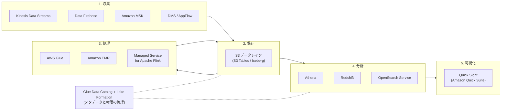
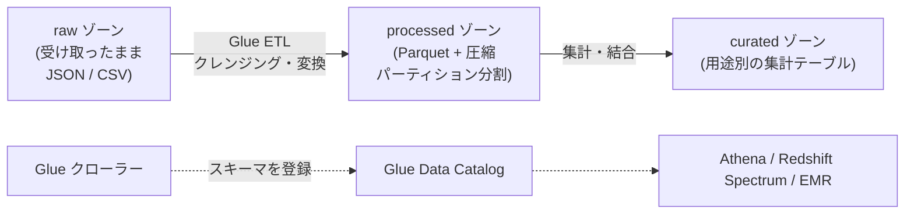

[ホーム](../README.md) > [Phase 2: アソシエイト](README.md) > データ分析サービス

# データ分析サービス

> **この章のゴール**
> - 分析パイプライン（収集 → 保存 → 処理 → 分析 → 可視化）の各段階で使う AWS サービスを説明できる
> - S3 をデータレイクとして設計し、Athena のコストと性能を改善する定石（パーティション・列指向形式・圧縮）を説明できる
> - Glue・Lake Formation・Redshift・EMR の役割と使い分けを説明できる
> - Kinesis Data Streams・Data Firehose・MSK・Managed Service for Apache Flink を要件から選べる
> - ログ分析・クリックストリーム・IoT の典型的な構成を描ける
>
> **対応試験**: SAA-C03（ドメイン3: 高性能なアーキテクチャの設計、ドメイン4: コストを最適化したアーキテクチャの設計 ほか）
> **目安時間**: 合計 4 時間（読む 2.5 時間 / 確認問題 30 分 / 復習 1 時間）

## この章の全体像

SAA-C03 の出題範囲には「高性能なデータ取り込みと変換のソリューションの決定」が含まれます。試験で問われるのは、分析サービスの細かな操作ではなく、**「どの段階で、どのサービスを、なぜ選ぶか」** です。分析の流れは次の 5 段階で整理すると分かりやすくなります。



| 段階 | 主なサービス | 選ぶときの観点 |
|---|---|---|
| 収集 | Kinesis Data Streams、Data Firehose、MSK、DMS、AppFlow、IoT Core | リアルタイム性、再処理の要否、既存の技術（Kafka など） |
| 保存 | S3（データレイク）、S3 Tables、Redshift | 量、コスト、アクセスのパターン |
| 処理 | Glue、EMR、Managed Service for Apache Flink、Lambda | バッチかストリームか、サーバーレスか細かな制御か |
| 分析 | Athena、Redshift、OpenSearch Service | アドホックか定型か、SQL か全文検索か、同時実行数 |
| 可視化 | Amazon QuickSight（2025年10月に Amazon Quick Suite へ再編）、OpenSearch Dashboards、Managed Grafana | 利用者（業務部門・運用チーム） |

この章の根底にある考え方は **「ストレージ（S3）と処理（コンピューティング）の分離」** です。データを S3 に 1 か所だけ置き、Athena・Redshift Spectrum・EMR・Glue などの複数のエンジンが同じデータを読みます。処理の量に合わせてエンジンだけを増減できるため、スケーラブルでコスト効率の高い設計になります。

## 1. データレイクと S3

### 1.1 データレイクとデータウェアハウス

| 観点 | データレイク | データウェアハウス |
|---|---|---|
| 保存するデータ | 構造化・半構造化（JSON など）・非構造化（画像など）を **そのまま** | 整形済みの構造化データ |
| スキーマ | **読み取り時に適用**（スキーマオンリード） | **書き込み時に定義**（スキーマオンライト） |
| 代表的なサービス | S3 + Glue Data Catalog + Athena / EMR | Amazon Redshift |
| 得意なこと | 大量・多様なデータを安価に保管し、さまざまなエンジンで分析する | 定型の集計や BI を、多数の同時ユーザーに高速に提供する |
| コスト | ストレージが安い | 高性能だが、計算リソースの料金がかかる |

両者は対立するものではありません。データレイクに全データを置き、よく使う整形済みのデータを Redshift で高速に分析する **レイクハウス** の考え方が一般的です。

### 1.2 なぜ S3 がデータレイクの中心なのか

- **耐久性とスケール**: 99.999999999%（イレブンナイン）の耐久性で、容量の上限を気にせず保存できます
- **コスト**: ストレージクラスやライフサイクルで、古いデータを安価に保管できます（[Amazon S3](05-s3.md) を参照）
- **オープンな形式**: CSV・JSON・Parquet・ORC・Iceberg などのオープンな形式で保存すれば、特定のエンジンに縛られません
- **統合**: ほぼすべての分析サービスが S3 を直接読み書きできます
- **セキュリティ**: 暗号化、バケットポリシー、Lake Formation によるきめ細かな権限管理を組み合わせられます

### 1.3 ゾーンとプレフィックスの設計

データレイクでは、データの加工段階に応じて **ゾーン**（プレフィックスやバケット）を分けるのが定石です。



- **raw**: 元のデータをそのまま保管します。処理に誤りがあっても、ここから作り直せます
- **processed**: 形式を揃え、列指向形式（Parquet）に変換し、日付などでパーティション分割します
- **curated**: 分析の目的ごとに集計・結合した、すぐに使えるデータです

パーティション分割したデータは、`s3://example-datalake/processed/sales/dt=2026-09-28/part-0000.parquet` のように **`キー=値` 形式（Hive 形式）のプレフィックス** で保存します。これが次の Athena のコスト削減の鍵になります。

### 1.4 オープンテーブル形式と S3 Tables

S3 上のファイルは、そのままでは「一部の行だけを更新・削除する」「複数の書き込みを矛盾なく行う」といったデータベースのような操作が苦手です。これを解決するのが **Apache Iceberg** などの **オープンテーブル形式** です。

- **ACID トランザクション**、行単位の更新・削除（`UPDATE` / `DELETE` / `MERGE`）
- **スキーマの進化**（列の追加・変更）と、過去の時点のデータを参照する **タイムトラベル**
- Athena、EMR、Glue、Redshift などが Iceberg のテーブルを読み書きできます

**Amazon S3 Tables**（2024年12月 GA）は、Iceberg のテーブルを格納するための専用の **テーブルバケット** です。小さなファイルをまとめるコンパクションなどのメンテナンスを自動で行います。

> [!NOTE]
> 「Amazon SageMaker」は、2024年12月以降、データ・分析・AI を統合する次世代のプラットフォームの名称になりました（機械学習のサービスは Amazon SageMaker AI に改称）。レイクハウスの設計や SageMaker Unified Studio、AWS Clean Rooms などは Phase 3 の [データと分析のアーキテクチャ](../03-professional/10-data-analytics-architecture.md) で扱います。

### 1.5 S3 Select は新規受付終了

S3 のオブジェクトから SQL で一部のデータだけを取り出す **S3 Select（および S3 Glacier Select）は、2024年7月から新規顧客の受け付けを終了** しています【新規受付終了】。新しい設計では **Athena** などを使います。試験や古い教材では S3 Select が正解の選択肢として出ることがあるため、「S3 内のデータを SQL でフィルタリングする機能」だったことは覚えておきましょう。

## 2. Amazon Athena

### 2.1 仕組み

**Amazon Athena** は、**S3 上のデータに標準 SQL でクエリを実行できる、サーバーレスの対話型クエリサービス** です。

- サーバーやクラスターの準備は不要です。テーブルを定義すれば、すぐにクエリできます
- テーブルの定義（スキーマ・場所・形式）は **Glue Data Catalog** に保存されます。データそのものは S3 に置いたままで、クエリ時にスキーマを当てはめます（スキーマオンリード）
- クエリの結果は S3 に保存され、Amazon QuickSight などの BI ツールからも使えます
- Apache Iceberg のテーブルに対しては、`INSERT`・`UPDATE`・`DELETE`・`MERGE` やタイムトラベルのクエリも実行できます

### 2.2 料金: スキャンしたデータ量で決まる

Athena の標準の料金は、**クエリがスキャンしたデータ量** に応じた従量課金です（米国東部などで 1 TB あたり 5 USD、クエリごとに最低 10 MB。2026年9月時点）。失敗したクエリや、テーブルの作成などの DDL には料金がかかりません。キャンセルしたクエリは、それまでにスキャンした分が課金されます。常に大量のクエリを実行する場合は、処理能力を予約する **プロビジョンド容量** も選べます。

つまり、**スキャン量を減らすことが、そのままコスト削減と高速化になります**。

### 2.3 コストと性能を改善する定石

| 手法 | 仕組み | 効果 |
|---|---|---|
| **パーティション分割** | 日付などでプレフィックスを分け、`WHERE` 句でパーティションを指定すると、関係のないプレフィックスを読まない | 読むデータの **範囲** を減らす |
| **列指向形式**（Parquet / ORC） | 列ごとにまとめて保存するため、`SELECT` した列だけを読む。列の統計情報で不要なブロックも読み飛ばせる | 読むデータの **列** を減らす |
| **圧縮**（Snappy / ZSTD / GZIP など） | データそのものを小さくする | 読むデータの **量** を減らす |
| **ファイルサイズの最適化** | 小さなファイルが大量にあると、ファイルを開く処理が増える。ある程度の大きさにまとめる | 処理の **オーバーヘッド** を減らす |

考え方を示すための概算の例です（圧縮率や列の大きさで結果は変わります）。1 日 10 GB、1 年分で約 3.65 TB の CSV 形式のログがあり、30 列のうち 3 列だけを使って **特定の 1 日** を集計するとします。

- パーティションなしの CSV: 全データ（約 3.65 TB）をスキャン → 1 回あたり **約 18 USD**
- 日付でパーティション分割: 1 日分（10 GB）だけをスキャン → **約 0.05 USD**
- さらに Parquet に変換して圧縮（約 1/4 のサイズ）し、3 列だけを読む: 約 0.25 GB → **約 0.001 USD**

CSV を Parquet に変換するには、Glue の ETL ジョブ、Data Firehose の形式変換（取り込み時に変換）、Athena の **CTAS（CREATE TABLE AS SELECT）** などを使います。

```sql
CREATE TABLE sales_parquet
WITH (
  format = 'PARQUET',
  write_compression = 'SNAPPY',
  external_location = 's3://example-datalake/processed/sales/',
  partitioned_by = ARRAY['dt']
) AS
SELECT order_id, customer_id, amount, dt
FROM sales_raw_csv;
```

### 2.4 パーティションの管理とパーティション射影

新しいパーティション（例: 新しい日付のプレフィックス）を追加しても、Glue Data Catalog に登録しなければ Athena からは見えません。登録の方法は次のとおりです。

- `ALTER TABLE ... ADD PARTITION` や `MSCK REPAIR TABLE` を実行する
- Glue クローラーで定期的に検出する
- **パーティション射影（Partition Projection）**: パーティションの値の範囲や形式をテーブルのプロパティに書いておき、Athena がクエリ時にパーティションを **計算** する。カタログへの登録が不要になり、パーティションが非常に多いテーブルでもクエリの計画が速くなる

```sql
TBLPROPERTIES (
  'projection.enabled' = 'true',
  'projection.dt.type' = 'date',
  'projection.dt.format' = 'yyyy-MM-dd',
  'projection.dt.range' = '2024-01-01,NOW',
  'storage.location.template' = 's3://example-datalake/processed/sales/dt=${dt}/'
)
```

### 2.5 フェデレーテッドクエリとワークグループ

- **フェデレーテッドクエリ**: Lambda で動くデータソースコネクタを使い、S3 以外のデータ（DynamoDB、RDS / Aurora、Redshift、CloudWatch Logs、オンプレミスのデータベースなど）にも SQL を実行し、S3 のデータと結合できます
- **ワークグループ**: チームや用途ごとにクエリを分け、**クエリごと・ワークグループごとのスキャン量の上限**、結果の保存場所、暗号化の設定、コストの集計を管理できます
- 同じクエリの結果を再利用する機能や、Apache Spark でのノートブック分析の機能もあります

> [!TIP]
> **試験のポイント**
> - 「S3 のデータを **サーバーレスで**、**SQL でアドホックに** 分析したい」「運用のオーバーヘッドを最小に」→ **Athena**
> - 「Athena のコストを下げたい／高速化したい」→ **パーティション分割 + Parquet / ORC + 圧縮**（CTAS や Glue で変換）
> - 「パーティションが非常に多く、クエリの計画に時間がかかる」「新しいパーティションの登録を自動化したい」→ **パーティション射影**
> - 「チームごとにスキャン量の上限を設けたい」→ **ワークグループ**

公式ドキュメント: [Amazon Athena とは](https://docs.aws.amazon.com/athena/latest/ug/what-is.html) / [パーティション射影](https://docs.aws.amazon.com/athena/latest/ug/partition-projection.html)

## 3. AWS Glue

**AWS Glue** は、データの **発見・カタログ化・変換（ETL）・品質管理** を行うサーバーレスのデータ統合サービスです。

| コンポーネント | 役割 |
|---|---|
| **Glue Data Catalog** | テーブルの定義（スキーマ・場所・形式・パーティション）を保存する **メタデータのカタログ**。Athena、Redshift Spectrum、EMR、Lake Formation が共通で使う |
| **クローラー** | S3 や JDBC のデータソースを調べ、スキーマとパーティションを **自動で推測** してカタログに登録・更新する |
| **Glue ETL ジョブ** | サーバーレスの Apache Spark（PySpark / Scala）や Python でデータを変換する。ストリーミング ETL にも対応 |
| **Glue Studio** | ETL ジョブを **ビジュアルな画面** で作成・実行・監視する |
| **Glue DataBrew** | 250 以上の組み込みの変換を使い、**コードを書かずに** データを整形・クレンジングする（アナリストやデータサイエンティスト向け） |
| **Glue Data Quality** | DQDL（Data Quality Definition Language）でルール（欠損率、一意性など）を定義し、データの品質を検証する。データの特徴からルールを推奨する機能もある |

### 3.1 Data Catalog とクローラー

Data Catalog は、1 つのアカウント・リージョンにつき 1 つあり、Apache Hive のメタストアと互換性があります。**クローラー** はスケジュールで実行するほか、S3 のイベント通知と組み合わせて変更のあったフォルダーだけを調べることもできます。スキーマが変わった場合（列の追加など）も、クローラーがカタログを更新します。

### 3.2 Glue ETL ジョブ

- 料金は、使った処理能力（**DPU**: Data Processing Unit）と実行時間に応じて秒単位で課金されます
- **ジョブブックマーク**: 前回の実行で処理済みのデータを記録し、**新しく追加されたデータだけを処理** できます（毎回全件を処理しない）
- 急ぎでないジョブは、空いている容量を使う安価な **Flex 実行クラス** で実行できます
- トリガーやワークフローで複数のジョブをつなげられます。より複雑な処理の流れは、Step Functions や Amazon MWAA（Managed Workflows for Apache Airflow）で組み立てます

> [!NOTE]
> 古い教材で紹介されている **AWS Data Pipeline は新規受付を終了** しています。新しい設計では Glue、Step Functions、MWAA を使います。また、Glue の Ray ジョブは 2026年3月に新規受付終了が発表されています（Spark や Python のジョブは引き続き利用できます）。

> [!TIP]
> **試験のポイント**: 「サーバーレスで ETL」「S3 のデータのスキーマを自動で検出してカタログ化」→ **Glue（ETL ジョブ / クローラー）**。「コードを書かずにデータを整形したい」→ **Glue DataBrew**。「データの品質（欠損や重複）を自動でチェックしたい」→ **Glue Data Quality**。「前回以降の新しいデータだけを処理したい」→ **ジョブブックマーク**。

公式ドキュメント: [AWS Glue とは](https://docs.aws.amazon.com/glue/latest/dg/what-is-glue.html)

