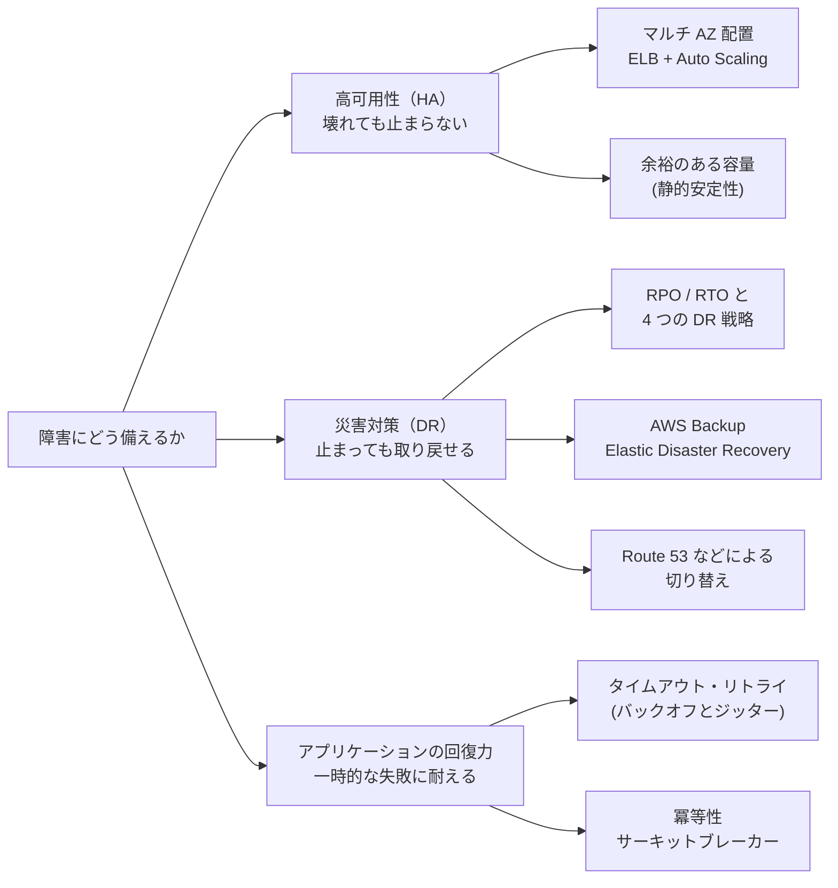
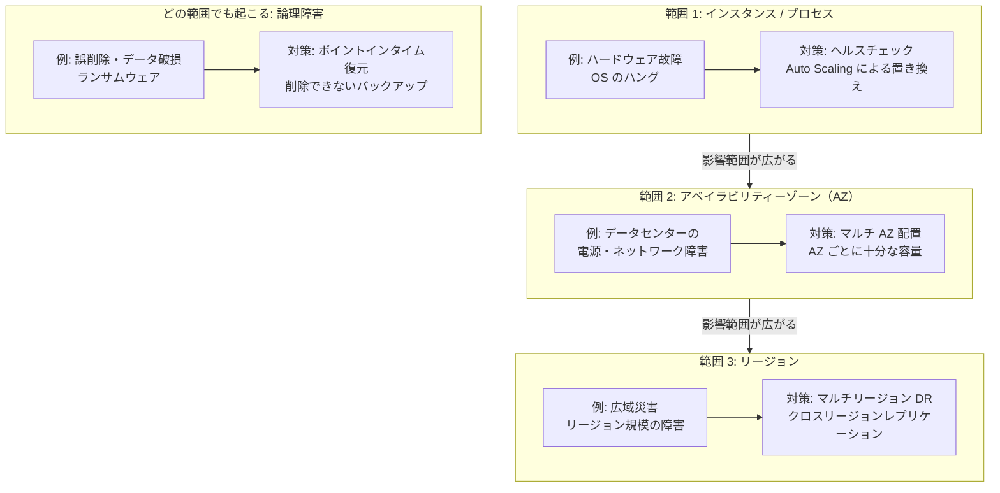
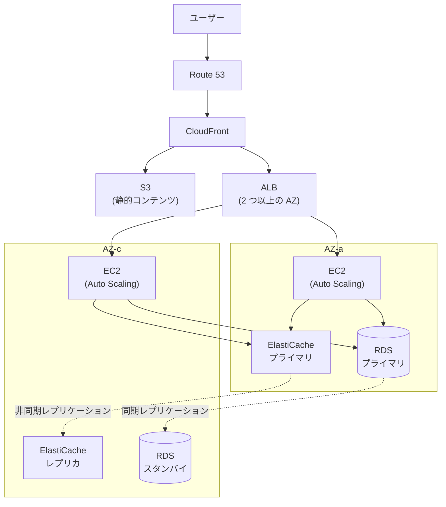
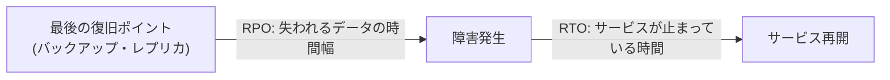
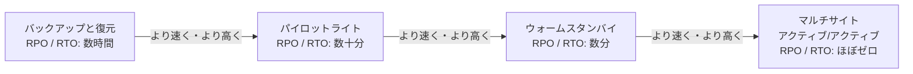
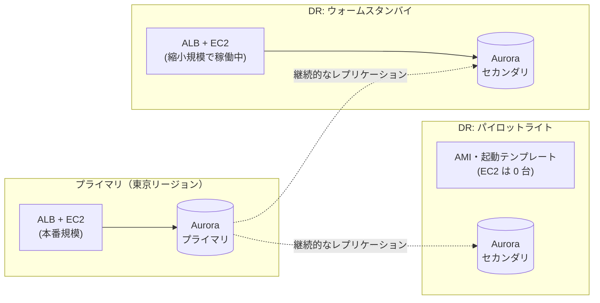
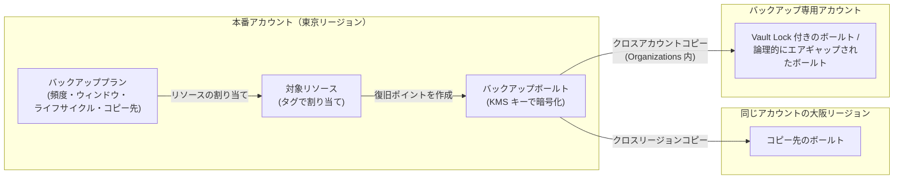
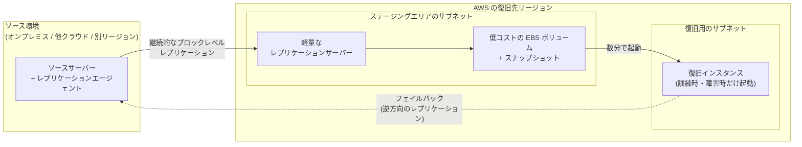
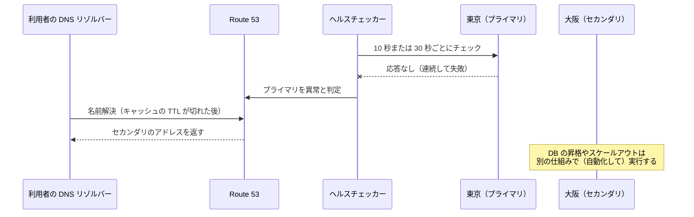
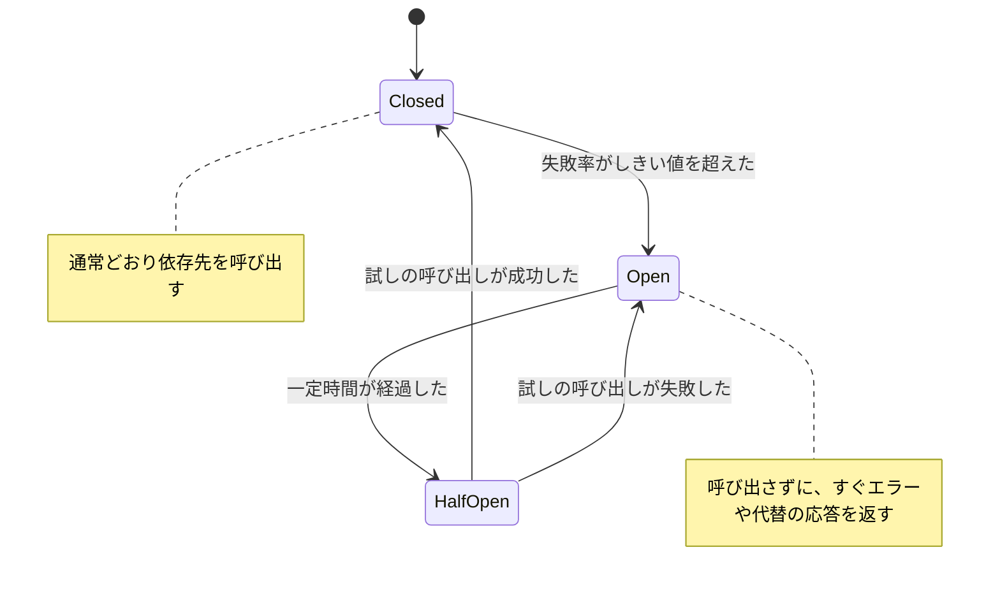

[ホーム](../README.md) > [Phase 2: アソシエイト](README.md) > 高可用性と災害対策

# 高可用性と災害対策

> **この章のゴール**
> - 可用性・耐久性・回復力の違いを説明し、「9 の数」を停止時間に換算できる
> - 障害の範囲（インスタンス / AZ / リージョン）ごとに適切な対策を選べる
> - 層ごとのマルチ AZ チェックリストを使って、単一障害点（SPOF）を見つけられる
> - RPO / RTO とコストから、4 つの DR 戦略を選び分けられる
> - AWS Backup（Vault Lock、論理的にエアギャップされたボールトを含む）と AWS Elastic Disaster Recovery の役割を説明できる
> - タイムアウト、指数バックオフとジッターを使ったリトライ、冪等性、サーキットブレーカーの目的を説明できる
>
> **対応試験**: SAA-C03（第2分野: 弾力性に優れたアーキテクチャの設計 ほか）
> **目安時間**: 読む 180分 / 確認問題 40分 / 復習 20分

## この章の全体像

この章は、これまでの章で個別に学んだ冗長化・バックアップ・DNS の機能を、「障害にどう備えるか」という 1 つの視点でまとめ直す総合章です。SAA-C03 の第2分野（弾力性に優れたアーキテクチャの設計、26%）の中心テーマであり、Phase 3 の [回復力と事業継続](../03-professional/06-resilience-business-continuity.md) の土台にもなります。

障害への備えは、次の 3 つの問いに分けると整理できます。



| 問い | 主な手段 | この章の節 |
|---|---|---|
| 壊れても止まらないか（高可用性） | マルチ AZ 配置、ELB + Auto Scaling、余裕のある容量 | 1〜3 節 |
| 止まっても取り戻せるか（災害対策） | RPO / RTO、DR 戦略、AWS Backup、Elastic Disaster Recovery、Route 53 | 4〜8 節 |
| 一時的な失敗に耐えられるか（アプリケーションの回復力） | タイムアウト、リトライ、冪等性、サーキットブレーカー | 9 節 |

個々のサービスの仕組みは各章で学んだとおりです。この章では詳細を繰り返さず、必要に応じてリンクで戻ります。

| テーマ | 詳しく学んだ章 |
|---|---|
| ELB・Auto Scaling | [Elastic Load Balancing と Auto Scaling](04-elb-auto-scaling.md) |
| S3 のバージョニング・レプリケーション・Object Lock | [Amazon S3](05-s3.md) |
| EBS スナップショット・EFS・FSx | [ブロック・ファイルストレージ](06-ebs-efs-fsx.md) |
| RDS マルチ AZ 配置・Aurora・DynamoDB | [データベース](07-databases.md) |
| Route 53 のルーティングポリシーとヘルスチェック | [Route 53・CloudFront・Global Accelerator](08-route53-cloudfront.md) |
| SQS による疎結合 | [アプリケーション統合](09-application-integration.md) |

## 1. 可用性・耐久性・回復力の違い

### 1.1 3 つの言葉を区別する

「データが消えない」ことと「サービスが使える」ことは、別の性質です。試験でも設計でも、まずこの区別が出発点になります。

| 用語 | 答える問い | AWS での例 | 主な指標 |
|---|---|---|---|
| 可用性（Availability） | 必要なときにサービスを使えるか | S3 Standard は 99.99% の可用性を想定して設計されている | 稼働率（%）、停止時間 |
| 耐久性（Durability） | 保存したデータが失われないか | S3 は 99.999999999%（イレブンナイン）の耐久性を想定して設計されている | 年間のデータ損失の確率 |
| 回復力（Resilience / レジリエンス） | 障害や負荷の変化から回復し、影響を抑えられるか | AZ 障害時に Auto Scaling が別の AZ で容量を補う | RTO、RPO、復旧までの平均時間 |

- **耐久性が高くても、可用性が高いとは限りません**。たとえば S3 Glacier Deep Archive は S3 Standard と同じ 11 ナインの耐久性を持ちますが、データを取り出すには標準の取り出しで 12 時間以内の待ち時間がかかります。「消えない」けれど「すぐには使えない」のです。
- **可用性が高くても、耐久性が高いとは限りません**。Auto Scaling で何度でも置き換わる EC2 インスタンスのインスタンスストアは、インスタンスが止まればデータが消えます。
- **回復力**は、Well-Architected フレームワークの信頼性の柱で「インフラストラクチャやサービスの中断から回復し、需要に応じてリソースを動的に確保し、設定ミスや一時的なネットワーク障害などによる中断を緩和する能力」と説明されています。可用性は「結果（どれだけ使えたか）」、回復力は「そのための能力」と考えると区別しやすくなります（[AWS Well-Architected Framework](17-well-architected.md)）。

> [!WARNING]
> **ひっかけ注意**: 「S3 はイレブンナインだから止まらない」は誤りです。11 ナインは**耐久性**の数字で、可用性の設計値は S3 Standard で 99.99%、S3 Standard-IA で 99.9%、S3 One Zone-IA で 99.5% です。また One Zone 系のストレージクラスは 1 つの AZ にしか保存されないため、その AZ が破壊されるとデータを失います。

### 1.2 「9 の数」を停止時間に換算する

可用性の目標は「年間（または月間）にどれだけ止まってよいか」に置き換えると、具体的な設計の議論ができます。

| 可用性 | 年間の停止許容時間 | 月間（30 日）の停止許容時間 |
|---|---|---|
| 99% | 約 3.65 日 | 約 7.2 時間 |
| 99.9% | 約 8.76 時間 | 約 43 分 |
| 99.95% | 約 4.38 時間 | 約 22 分 |
| 99.99% | 約 52.6 分 | 約 4.3 分 |
| 99.999% | 約 5.26 分 | 約 26 秒 |

99.99% の目標では「月に約 4 分」しか止まれません。人が障害に気付いて手順書を開いている間に使い切ってしまう長さです。つまり**「9」を増やすほど、検知と切り替えを自動化しなければ達成できなくなります**。Well-Architected の信頼性の柱には、目標とする可用性ごとの設計例（単一リージョン・複数 AZ の構成から、マルチリージョン構成まで）も紹介されています。

### 1.3 可用性は掛け算になる（直列と並列）

システム全体の可用性は、構成要素のつながり方で決まります（ここでは各要素の障害が独立していると仮定します）。

- **直列**（すべてが動いていないとサービスが成り立たない）: 全体の可用性 = A1 × A2 × … 。要素が増えるほど**下がります**。
- **並列**（どれか 1 つが動いていればよい）: 全体の可用性 = 1 −（1 − A）^n 。冗長化するほど**上がります**。

| 構成 | 計算 | 全体の可用性 |
|---|---|---|
| 99.9% のコンポーネント 3 つを直列（Web → アプリ → DB） | 0.999 × 0.999 × 0.999 | 約 99.7% |
| 99% のインスタンス 2 台を並列 | 1 − 0.01 × 0.01 | 99.99% |
| 99% のインスタンス 3 台を並列 | 1 − 0.01 × 0.01 × 0.01 | 99.9999% |

ただし、並列の計算は「障害が独立している」ことが前提です。2 台が同じラック・同じ AZ・同じ電源にあったり、同じ設定ミスを同時にデプロイしたりすると、2 台が同時に止まります（相関障害）。**AZ を分ける、デプロイを段階的に行う**といった設計は、この独立性を確保するためのものです。

> [!TIP]
> **試験のポイント**: 「可用性を高める」選択肢は、**冗長化（並列化）と自動的な切り離し・置き換え**です。インスタンスを大きくする、より高性能な EBS ボリュームにする、といった「1 台を強くする」選択肢は可用性の対策になりません。

### 1.4 高可用性（HA）と災害対策（DR）は別物

| 観点 | 高可用性（HA） | 災害対策（DR） |
|---|---|---|
| 目的 | 障害が起きてもサービスを止めない | 大規模な障害やデータの破損から、決めた時間内にサービスとデータを取り戻す |
| 想定する障害 | インスタンスや AZ の障害 | リージョン規模の障害、誤削除・データ破損・ランサムウェア |
| 主な指標 | 稼働率 | RPO / RTO（4 節） |
| 代表的な手段 | マルチ AZ 配置、自動フェイルオーバー | バックアップ、別リージョンへのレプリケーション、切り替え手順 |

特に重要なのが、**レプリケーションはバックアップではない**という点です。RDS のマルチ AZ 配置はプライマリの変更をスタンバイへ同期的にレプリケーションします。誤った `DELETE` 文やバグによるデータ破損も、同じように**一瞬でスタンバイへ複製されます**。論理的な障害から取り戻せるのは、過去の時点を指定できるバックアップ（ポイントインタイム復元、スナップショット、S3 のバージョニングなど）だけです。

> [!WARNING]
> **ひっかけ注意**: 「マルチ AZ 配置にしたのでバックアップは不要」は誤りです。また、RDS のリードレプリカは読み取りのスケーリングが主目的で、非同期レプリケーションのため誤操作もそのまま複製されます。誤更新からの復旧には、ポイントインタイム復元を選びます。

## 2. 障害の範囲と対策

### 2.1 障害ドメイン（影響範囲）で考える

障害は「どこまで巻き込むか」で分類すると、対策を選びやすくなります。広い範囲に備えるほど、コストと複雑さは増えます。そのため「どの範囲の障害まで、どれだけの時間で復旧できればよいか」をビジネス要件として先に決めることが大切です。



### 2.2 範囲ごとの対策

| 障害の範囲 | 典型的な原因 | 主な対策 | 関連するサービス・機能 |
|---|---|---|---|
| インスタンス / プロセス | ハードウェア故障、メモリリーク、OS のハング | 複数台で構成し、ヘルスチェックで異常を切り離して自動で置き換える | ELB のヘルスチェック、Auto Scaling、EC2 の自動復旧（簡易自動復旧） |
| ボリューム | EBS ボリュームの故障 | EBS は AZ 内で自動的に冗長化されるが、AZ はまたがない。スナップショットから作り直せるようにする | EBS スナップショット、Amazon Data Lifecycle Manager |
| AZ | データセンターの電源・冷却・ネットワークの障害 | 2〜3 の AZ に分散し、AZ ごとに独立したリソースを置く | マルチ AZ 配置、Amazon Application Recovery Controller（ARC）のゾーンシフト / ゾーンオートシフト |
| リージョン | 広域災害、リージョン規模のサービス障害 | 別リージョンでの DR（4 節） | クロスリージョンレプリケーション、AWS Backup のクロスリージョンコピー、Route 53 |
| 論理障害（全範囲） | 誤操作、バグによるデータ破損、ランサムウェア | 時点を選べるバックアップ、削除・改ざんできないバックアップ | ポイントインタイム復元（PITR）、S3 のバージョニング / Object Lock、AWS Backup Vault Lock |
| 依存先の過負荷・一時的な障害 | スロットリング、ネットワークの瞬断、フェイルオーバー中の数十秒の中断 | タイムアウト、バックオフ付きリトライ、サーキットブレーカー、キューによるバッファリング | AWS SDK のリトライ機能、SQS（9 節） |

> [!NOTE]
> ARC の**ゾーンシフト**は、ALB や NLB などのトラフィックを、障害の起きた AZ から一時的に退避させる機能です。**ゾーンオートシフト**を有効にすると、AWS が AZ の障害を検知したときに自動で退避させます。どちらも「残りの AZ に十分な容量があること」が前提になるため、次の 2.3 節の考え方とセットで使います。詳細は Phase 3 で扱います。

### 2.3 AZ 障害に「準備済みの容量」で耐える

AZ 障害への備えとして「障害が起きたら Auto Scaling で残りの AZ にインスタンスを増やせばよい」と考えがちです。しかし障害時は、インスタンスの起動に数分かかるうえ、同じリージョンの多くの利用者が一斉に残りの AZ で起動しようとするため、思いどおりに容量を確保できない可能性があります。

そこで、**平常時から「1 つの AZ を失っても必要な容量が残る」ように配置しておく**という考え方が有効です。各 AZ に置く台数は「必要台数 ÷（AZ 数 − 1）」で求められます。

| 必要な容量 | 使う AZ 数 | 各 AZ の台数 | 合計台数 | 必要容量に対する割合 |
|---|---|---|---|---|
| 6 台 | 2 AZ | 6 台 | 12 台 | 200% |
| 6 台 | 3 AZ | 3 台 | 9 台 | 150% |

AZ を 3 つ使うと、同じ耐障害性を少ない余剰で実現できます。このように「障害が起きても何も変更せずに（新しいリソースを作らずに）動き続けられる」性質を**静的安定性**と呼びます（9.6 節）。

> [!TIP]
> **試験のポイント**: 「1 つの AZ が失われても**性能を落とさずに**処理を続けたい」とあれば、平常時から各 AZ に十分な容量を配置する構成（例: 3 AZ に 50% ずつ）を選びます。「最小容量を 2 AZ で 1 台ずつ」のような構成は、可用性はあっても障害時に性能が半減します。

## 3. 各層のマルチ AZ 設計チェックリスト

### 3.1 リファレンスアーキテクチャ

典型的な Web アプリケーションを、すべての層でマルチ AZ 化した構成です。



AZ-a が停止すると、ALB は AZ-c のインスタンスだけにリクエストを送り、RDS はスタンバイへ、ElastiCache はレプリカへ自動でフェイルオーバーします。DNS 名（エンドポイント）は変わらないため、アプリケーションの設定変更は不要です。

### 3.2 層ごとのチェックリスト

| 層 | チェック項目 | よくある単一障害点・落とし穴 | 詳しくは |
|---|---|---|---|
| DNS / エッジ | Route 53 のヘルスチェックとフェイルオーバーを設定しているか。CloudFront のオリジンフェイルオーバーを使うか | TTL が長く、切り替えがなかなか反映されない | [08 章](08-route53-cloudfront.md) |
| ロードバランサー | ALB / NLB を 2 つ以上の AZ のサブネットで有効にしているか。ヘルスチェックの対象パスは適切か | 1 つの AZ のサブネットしか指定していない（ALB は 2 つ以上の AZ が必須） | [04 章](04-elb-auto-scaling.md) |
| コンピューティング | Auto Scaling グループが複数の AZ にまたがり、ELB のヘルスチェックを使っているか。1 つの AZ を失っても容量が足りるか | Elastic IP アドレスを付けた 1 台だけの EC2 インスタンス、特定のインスタンスでしか動かない cron ジョブ | [03 章](03-ec2.md)・[04 章](04-elb-auto-scaling.md) |
| コンテナ / サーバーレス | ECS のタスクが複数の AZ に分散しているか。VPC に接続する Lambda 関数に複数の AZ のサブネットを指定しているか | Lambda 関数の VPC 設定でサブネットを 1 つだけ指定している | [10 章](10-serverless.md)・[11 章](11-containers.md) |
| セッション / 状態 | セッション情報をインスタンスの中ではなく ElastiCache や DynamoDB に置いているか | スティッキーセッションに依存し、インスタンス障害で利用者がログアウトされる | [04 章](04-elb-auto-scaling.md) |
| キャッシュ | ElastiCache（Valkey / Redis OSS）でレプリカを別の AZ に置き、マルチ AZ（自動フェイルオーバー）を有効にしているか | ノードベースの Memcached はレプリケーションしないため、キャッシュの消失を前提に設計する | [07 章](07-databases.md) |
| データベース | RDS はマルチ AZ 配置（またはマルチ AZ DB クラスター）か。Aurora は別の AZ にレプリカがあるか。DynamoDB はリージョン内の複数 AZ に自動で複製される | シングル AZ の RDS。レプリカのない Aurora（フェイルオーバー先がなく、新しいインスタンスの作成を待つため復旧が遅い） | [07 章](07-databases.md) |
| ストレージ | S3 は One Zone 系を除き複数の AZ に保存される。EFS はリージョン（マルチ AZ）タイプか。FSx は Windows File Server / NetApp ONTAP / OpenZFS でマルチ AZ 配置を選べる | EBS ボリュームは 1 つの AZ に閉じる。EFS One Zone、FSx for Lustre（単一 AZ） | [05 章](05-s3.md)・[06 章](06-ebs-efs-fsx.md) |
| ネットワーク | NAT ゲートウェイを AZ ごとに配置しているか（またはリージョン単位の NAT ゲートウェイ）。VPN のトンネルを 2 本とも使っているか。Direct Connect は複数回線か | 1 つのゾーン単位の NAT ゲートウェイを全 AZ のプライベートサブネットで共有している | [02 章](02-vpc.md)・[16 章](16-migration-hybrid.md) |
| 非同期処理 | SQS などでバッファリングし、下流の障害や急増を吸収しているか | 同期呼び出しの長い連鎖（1 つが遅いと全体が止まる） | [09 章](09-application-integration.md) |

> [!TIP]
> **試験のポイント**: 構成図を読む問題では、上の表を上から順に当てはめて**「1 つしかないもの」**を探します。特に NAT ゲートウェイ 1 つ、シングル AZ の RDS、1 台だけの EC2 インスタンス、EBS ボリュームへの依存は定番の単一障害点です。

> [!WARNING]
> **ひっかけ注意**: RDS のマルチ AZ 配置（DB インスタンス）のスタンバイは**読み取りに使えません**。読み取りを分散したい場合はリードレプリカ、または読み取り可能なスタンバイを 2 つ持つマルチ AZ DB クラスターを選びます。逆に、リードレプリカは自動フェイルオーバーの仕組みではありません（Aurora のレプリカは例外で、フェイルオーバー先になります）。詳しくは [データベース](07-databases.md) を参照してください。

## 4. RPO / RTO と 4 つの DR 戦略

### 4.1 RPO と RTO

DR の要件は、次の 2 つの数字で表します。

- **RPO（Recovery Point Objective、目標復旧時点）**: 障害が起きたとき、**どの時点までのデータを取り戻せればよいか**。言い換えると「失ってもよいデータの時間幅」です。
- **RTO（Recovery Time Objective、目標復旧時間）**: 障害が起きてから、**どれだけの時間でサービスを再開すればよいか**。言い換えると「止まっていてもよい時間」です。



たとえば毎日 0 時にバックアップを取るシステムが 23 時に被災すると、最大で約 1 日分のデータを失います。つまり RPO は 24 時間です。さらに、障害の検知と判断に 1 時間、環境の構築と復元に 3 時間かかれば、RTO は 4 時間になります。

- **RPO はデータをコピーする頻度と方式で決まります**。日次バックアップなら最大 24 時間、非同期レプリケーションなら数秒、同期レプリケーションならほぼゼロです。
- **RTO は復旧先がどれだけ準備できているかで決まります**。検知、判断、環境の起動、データの復元、DNS の切り替えと伝播、動作確認のすべてが RTO に含まれます。

RPO と RTO は、停止やデータ損失が事業に与える影響を分析したうえで、ビジネス側が決める値です。どちらも短くするほどコストが増えるため、すべてのシステムを最高水準にする必要はありません。

> [!TIP]
> **試験のポイント**: 「失ってよいデータは最大 15 分」は RPO、「1 時間以内に再開」は RTO の要件です。RPO が厳しいならレプリケーションの方式を、RTO が厳しいなら復旧先の準備度（常時稼働しているか）と自動化を見直します。

### 4.2 4 つの DR 戦略

AWS のホワイトペーパー「[Disaster Recovery of Workloads on AWS](https://docs.aws.amazon.com/whitepapers/latest/disaster-recovery-workloads-on-aws/disaster-recovery-options-in-the-cloud.html)」では、DR 戦略を次の 4 つに分類しています。左ほど安価で復旧が遅く、右ほど高価で復旧が速くなります。



| 戦略 | RPO / RTO の目安 | DR リージョンで平常時に動いているもの | 平常時のコスト | 障害時の作業 | 代表的な構成 |
|---|---|---|---|---|---|
| バックアップと復元 | 数時間 | バックアップ（スナップショット、AMI、コピーしたデータ）だけ | 最小 | IaC で環境をゼロから構築し、バックアップから復元して DNS を切り替える | AWS Backup のクロスリージョンコピー、CloudFormation |
| パイロットライト | 数十分 | データ層だけが常時稼働し、レプリケーションを受けている。アプリケーション層は停止しているか、まだ作られていない | 低 | アプリケーション層を起動し、DB を昇格させ、DNS を切り替える | Aurora Global Database や RDS のクロスリージョンリードレプリカ、AMI、容量 0 の Auto Scaling グループ |
| ウォームスタンバイ | 数分 | 全層が縮小規模で稼働し、そのままリクエストを処理できる | 中 | 本番規模までスケールアウトし、DB を昇格させ、DNS を切り替える | 最小容量の Auto Scaling グループ、ALB、レプリカ DB |
| マルチサイト アクティブ/アクティブ | ほぼゼロ（リアルタイム） | 全層が本番規模で稼働し、平常時から利用者のトラフィックを処理している | 最大 | 障害の起きたリージョンへのルーティングを止める（基本的に復旧作業は不要） | DynamoDB グローバルテーブル、Route 53 のレイテンシーベース / 加重ルーティング |

表の RPO / RTO はホワイトペーパーに示された目安です。実際には、データを継続的にレプリケーションするパイロットライト以降の戦略では RPO は秒〜分単位になることが多く、**戦略によって大きく変わるのは主に RTO** です。

### 4.3 各戦略の仕組み

**バックアップと復元**は、データのバックアップだけを DR リージョンに置く戦略です。障害時にはインフラストラクチャを一から作るため、CloudFormation などの IaC で環境を再現できることが前提になります。AMI や暗号化キーなど、復元に必要なものも DR リージョンに用意しておきます。重要度の低いシステムや、RTO が数時間〜1 日でよいシステムに向いています。

**パイロットライト**の名前は、ガス給湯器の「種火」に由来します。最も準備に時間がかかる**データ層だけを常に稼働させてレプリケーションし**、アプリケーションサーバーは止めておく（または作らずに AMI と起動テンプレートだけを用意しておく）戦略です。障害時は種火から火を大きくするように、アプリケーション層を起動してからトラフィックを受け付けます。

**ウォームスタンバイ**は、**すべての層を縮小した規模で常に動かしておく**戦略です。パイロットライトとの決定的な違いは、**切り替えた直後から（少ない容量で）リクエストを処理できる**ことです。平常時は DR 環境で継続的にテストすることもでき、障害時は Auto Scaling で本番規模に拡張します。

**マルチサイト アクティブ/アクティブ**は、複数のリージョンが本番規模で同時にトラフィックを処理する戦略です。1 つのリージョンが止まっても、Route 53 のヘルスチェックなどで残りのリージョンに寄せるだけで済みます。その代わり、複数のリージョンで同時に書き込むデータ層の設計（4.4 節）が必要になり、コストと複雑さは最大です。



> [!NOTE]
> アクティブ/パッシブのまま、DR リージョンに本番と同じ規模の環境を用意しておく構成を**ホットスタンバイ**と呼ぶことがあります。ホワイトペーパーではマルチサイト戦略の一形態として扱われています。

> [!TIP]
> **試験のポイント**: 「縮小版の環境を常時稼働」「障害時にスケールアウト」「すぐにトラフィックを処理できる」とあればウォームスタンバイ、「コアとなる要素（DB）だけを常時稼働」「アプリケーションサーバーは障害時に起動」とあればパイロットライトです。

> [!WARNING]
> **ひっかけ注意**: パイロットライトでも、**データベースは停止していません**。DB を止めてしまうと RPO を満たせないため、データ層は常にレプリケーションを受けています。「DB もスナップショットから起動する」なら、それはバックアップと復元です。

### 4.4 アクティブ/アクティブを支えるデータ層

マルチリージョンの DR では、データ層の選択が RPO と設計の難しさを左右します。

| サービス | マルチリージョンの機能 | 書き込めるリージョン | 一貫性と注意点 |
|---|---|---|---|
| DynamoDB | グローバルテーブル（マルチリージョン結果整合性、MREC。既定のモード） | すべてのレプリカ | 非同期レプリケーション。同じ項目を複数リージョンで同時に更新すると、最後の書き込みが優先される |
| DynamoDB | グローバルテーブル（マルチリージョン強整合性、MRSC。2025年6月 GA） | すべてのレプリカ | 強い整合性で RPO 0。ちょうど 3 つのリージョン（レプリカ 3 つ、またはレプリカ 2 つとウィットネス 1 つ）で構成し、TTL とトランザクションには対応しない |
| Aurora | Aurora Global Database | プライマリリージョンだけ（書き込み転送を使うと、セカンダリで受けた書き込みをプライマリへ転送できる） | ストレージレベルの非同期レプリケーションで、遅延は通常 1 秒未満。AWS は RPO 約 1 秒、RTO 1 分未満の復旧をうたっている |
| Aurora DSQL | マルチリージョンクラスター（2025年5月 GA） | 複数のリージョン | サーバーレスの分散 SQL（PostgreSQL 互換）。強い整合性を持つアクティブ/アクティブ構成 |
| S3 | クロスリージョンレプリケーション（CRR）、マルチリージョンアクセスポイント | 双方向レプリケーションを構成すれば両方 | 非同期。S3 Replication Time Control（RTC）を使うと、99.99% のオブジェクトを 15 分以内に複製する SLA が付く |
| ElastiCache | グローバルデータストア（Valkey / Redis OSS） | プライマリクラスターだけ | セカンダリは読み取り専用で、障害時に昇格させる |

Aurora Global Database の切り替えには、計画的な**スイッチオーバー**（データ損失なし）と、障害時の**フェイルオーバー**（レプリケーション遅延分のデータを失う可能性がある）があります。詳しくは [データベース](07-databases.md) を参照してください。

> [!WARNING]
> **ひっかけ注意**: RDS（Aurora 以外）のクロスリージョンリードレプリカは読み取り専用です。DR リージョンで書き込みを始めるには**昇格**が必要で、昇格すると元のプライマリとのレプリケーションは切れます。「両方のリージョンで書き込みたい」という要件は満たせません。

### 4.5 戦略の選び方（試験キーワード）

| 問題文のキーワード | 選ぶ戦略・サービス |
|---|---|
| 「RPO / RTO は 24 時間」「最もコスト効率の高い DR」 | バックアップと復元（AWS Backup のクロスリージョンコピー + IaC） |
| 「データベースだけを常時レプリケーション」「アプリケーションサーバーは障害時に起動」「RTO は数十分〜数時間」 | パイロットライト |
| 「縮小した環境を常時稼働」「障害直後から処理を継続」「RTO は数分」 | ウォームスタンバイ |
| 「ダウンタイムをほぼゼロに」「複数リージョンで同時にトラフィックを処理」 | マルチサイト アクティブ/アクティブ |
| 「オンプレミスのサーバーの DR を AWS に」「RPO は秒単位、RTO は分単位」「平常時のコストを最小に」 | AWS Elastic Disaster Recovery（6 節） |
| 「バックアップを誰も削除できないように」「ランサムウェア対策」 | AWS Backup Vault Lock（コンプライアンスモード）、別アカウントへのコピー、論理的にエアギャップされたボールト（5 節） |
| 「複数アカウントのバックアップを一元管理」 | AWS Backup と AWS Organizations のバックアップポリシー |

### 4.6 DR 環境で忘れがちな準備と訓練

DR はテストして初めて「使える DR」になります。次のような準備が漏れていると、いざというときに RTO を守れません。

- **イメージとキー**: AMI や ECR のコンテナイメージを DR リージョンへコピー（ECR はクロスリージョンレプリケーション）しているか。暗号化したスナップショットを別リージョンで使うための KMS キー（マルチリージョンキーなど）を用意しているか。
- **設定とシークレット**: Secrets Manager のシークレットを DR リージョンへレプリケーションしているか。
- **サービスクォータ**: DR リージョンでも、本番規模に必要な数のインスタンスを起動できるクォータを確保しているか。
- **IaC**: CloudFormation（複数のリージョンやアカウントには StackSets）で、同じ構成を再現できるか。
- **手順と訓練**: 切り替え・切り戻しの手順書（ランブック）があり、定期的に訓練しているか。

訓練と検証を支えるサービスとして、障害を意図的に注入する **AWS Fault Injection Service（FIS）**、RTO / RPO の目標に対してアプリケーションを評価する **AWS Resilience Hub**、複数リージョンの切り替えと切り戻しを計画として実行する **ARC のリージョン切り替え（Region switch）** があります。いずれも Phase 3 の [回復力と事業継続](../03-professional/06-resilience-business-continuity.md) と [Lab 13](../04-labs/lab13-fis-chaos.md) で詳しく扱います。

## 5. AWS Backup

### 5.1 なぜ AWS Backup なのか

EBS のスナップショットや RDS の自動バックアップのように、多くのサービスは個別のバックアップ機能を持っています。しかし数十のサービスと多数のアカウントで、スケジュール・保持期間・別リージョンへのコピー・監査をばらばらに管理するのは大変です。**AWS Backup** は、これらを**ポリシーベースで一元管理する**フルマネージドサービスです。

主な対象は EC2、EBS、S3、EFS、FSx、RDS、Aurora、DynamoDB、DocumentDB、Neptune、Redshift、Storage Gateway のボリューム、VMware の仮想マシン（オンプレミスを含む）などです。対象リソースタイプはリージョンによって異なるため、[公式ドキュメント](https://docs.aws.amazon.com/aws-backup/latest/devguide/whatisbackup.html) で確認してください。

### 5.2 構成要素



| 構成要素 | 役割 | ポイント |
|---|---|---|
| バックアッププラン | 「いつ取り、どれだけ保持し、どこへコピーするか」を定義する | 1 つのプランに複数のバックアップルール（例: 日次を 35 日保持、月次を 1 年保持）を持てる |
| バックアップルール | 頻度（cron 式も可）、バックアップウィンドウ、ライフサイクル（コールドストレージへの移行、削除）、コピー先 | 一部のリソースタイプ（RDS、Aurora、S3 など）では、最大 35 日のポイントインタイム復元ができる継続的バックアップを有効にできる |
| リソースの割り当て | どのリソースをプランの対象にするかを決める | タグ（例: `backup-plan=gold`）や ARN で指定する。タグで指定すると、新しく作ったリソースも自動で対象になる |
| バックアップボールト | 復旧ポイント（個々のバックアップ）を保存する入れ物 | KMS キーで暗号化され、アクセスポリシーで削除などの操作を制御できる |
| 復旧ポイント | 個々のバックアップ | 復元すると、原則として新しいリソースとして作成される |

コールドストレージに移行できるのは一部のリソースタイプに限られ、コールドストレージでは最低 90 日間保持する必要があります。

### 5.3 クロスリージョン / クロスアカウントコピーと一元管理

- **クロスリージョンコピー**: バックアップルールのコピー先に別リージョンのボールトを指定します。リージョン規模の障害に備える「バックアップと復元」戦略の基本形です。
- **クロスアカウントコピー**: 同じ AWS Organizations の組織内にある別アカウントのボールトへコピーします。管理アカウントでクロスアカウントバックアップを有効にし、コピー先ボールトのアクセスポリシーで受け入れを許可します。**本番アカウントの認証情報が盗まれても、別アカウントのバックアップは守られる**点が重要です。
- **バックアップポリシー**: Organizations のポリシータイプの 1 つで、組織内の多数のアカウントにバックアッププランを一括で展開できます。

暗号化されたバックアップを別アカウントへコピーする場合、AWS マネージドキーは他のアカウントと共有できないため、カスタマーマネージドキーを使うのが基本です。挙動はリソースタイプによって異なるため、設計時に公式ドキュメントで確認してください。

### 5.4 AWS Backup Vault Lock

**AWS Backup Vault Lock** は、ボールト内の復旧ポイントを WORM（Write Once Read Many、一度書いたら変更・削除できない）で保護する機能です。最小保持期間と最大保持期間を強制し、保持期間中の削除や保持期間の短縮を防ぎます。

| 項目 | ガバナンスモード | コンプライアンスモード |
|---|---|---|
| 目的 | 誤操作や、権限を持たないユーザーによる削除・変更を防ぐ | 規制対応やランサムウェア対策として、誰にも変更させない |
| ロックの解除・変更 | 十分な IAM 権限を持つユーザーは解除・変更できる | 猶予期間（最低 72 時間）が過ぎると、ルートユーザーや AWS を含め、誰も解除・変更できない |
| 猶予期間中 | ― | ロックの設定を確認し、必要ならロックを削除できる（テスト期間） |
| 使いどころ | 検証中の設定、一般的な保護 | 監査・規制要件、最後の砦としてのバックアップ |

S3 Object Lock のガバナンスモード / コンプライアンスモードと同じ考え方です（[Amazon S3](05-s3.md)）。

> [!TIP]
> **試験のポイント**: 「**ルートユーザーを含め誰も**バックアップを削除できないようにする」とあれば、Vault Lock の**コンプライアンスモード**です。「特定の管理者だけは解除できる」ならガバナンスモードです。IAM ポリシーやボールトのアクセスポリシーでの拒否は、管理者がポリシーを書き換えれば外せるため、改ざん防止の答えにはなりません。

### 5.5 論理的にエアギャップされたボールト

**論理的にエアギャップされたボールト**（logically air-gapped vault、2024年8月 GA）は、ランサムウェアなどでアカウントそのものが侵害された場合に備えるための特別な種類のボールトです。

- 作成時から最小・最大の保持期間が強制され、保存されたバックアップは削除や変更ができません（イミュータブル）。
- **AWS Resource Access Manager（AWS RAM）で他のアカウントと共有**でき、共有先のアカウントから直接復元できます。たとえば本番アカウントが侵害されても、隔離された復旧用アカウントからバックアップを使ってサービスを再開できます。
- 対応するリソースタイプや暗号化の方式には条件があるため、[公式ドキュメント](https://docs.aws.amazon.com/aws-backup/latest/devguide/logicallyairgappedvault.html) で確認してください。

SAA-C03 では「Vault Lock とクロスアカウントコピーの組み合わせ」を押さえておけば十分です。論理的にエアギャップされたボールトを含むランサムウェア対策の全体設計は、Phase 3 で扱います。

### 5.6 復元テストと監査

- **復元テスト（restore testing）**: 復元テストのプランを作ると、スケジュールに沿って復旧ポイント（最新のもの、または指定期間からランダムに選んだもの）を自動で一時的なリソースとして復元し、検証後に削除します。復元にかかった時間が記録されるため、**RTO を守れるかどうかの証拠**になります（[公式ドキュメント](https://docs.aws.amazon.com/aws-backup/latest/devguide/restore-testing.html)）。
- **AWS Backup Audit Manager**: 「バックアップの頻度が日次以上か」「別リージョンにコピーされているか」「Vault Lock が有効か」などのコントロールを定義し、準拠状況をレポートする AWS Backup の機能です（AWS Config を利用します）。名前が似ていますが、別サービスの AWS Audit Manager とは異なります。
- **リーガルホールド**: 訴訟対応などのため、特定の復旧ポイントを保持期間に関係なく削除できないように保全します。

### 5.7 ランサムウェアからバックアップを守る基本形

1. バックアップを本番とは**別のアカウント**にコピーする
2. **Vault Lock（コンプライアンスモード）**や論理的にエアギャップされたボールトで、削除・変更できないようにする
3. **別のリージョン**にもコピーする
4. **KMS キーの管理を分離**する（キーの削除や無効化も攻撃手段になるため）
5. **定期的に復元テスト**を行い、実際に戻せることを確かめる
6. SCP で、AWS Backup の設定変更やボールトの削除を管理者以外に禁止する

## 6. AWS Elastic Disaster Recovery（AWS DRS）

### 6.1 何を解決するのか

オンプレミスのサーバーの DR サイトを用意しようとすると、本番と同じ数のサーバーを別の場所に置いて待機させる必要があり、コストが 2 倍近くになります。**AWS Elastic Disaster Recovery（AWS DRS）**は、サーバーのディスクを AWS へ**継続的にブロックレベルでレプリケーション**しておき、**障害時や訓練時にだけ**復旧用の EC2 インスタンスを起動するサービスです。ソースはオンプレミスの物理サーバー・仮想マシン、他のクラウド、別リージョンの EC2 インスタンスのいずれでもかまいません。

### 6.2 仕組み



- **RPO は秒単位、RTO は分単位**（AWS の公称値）です。継続的なレプリケーションのためデータ損失はごくわずかで、復旧時はレプリケーション済みのデータから数分でインスタンスを立ち上げます。
- **平常時のコストが低い**のは、ステージングエリアで動くのが軽量なレプリケーションサーバーと低コストの EBS ボリュームだけで、本番規模のサーバーを待機させないためです。
- **訓練（ドリル）**: レプリケーションを止めずに復旧インスタンスを起動できるため、本番に影響を与えずに DR 訓練ができます。
- **ポイントインタイム復旧**: 過去のスナップショットの時点を選んで起動できます。ランサムウェアで暗号化される前の時点に戻す、といった使い方ができます。
- **フェイルバック**: 障害が解消したら、AWS からオンプレミス（または元のリージョン）へ逆方向にレプリケーションして戻せます。
- 2026年8月には、復旧の手順を計画としてまとめて扱える Recovery Plans 機能が追加されています（詳細は [公式ドキュメント](https://docs.aws.amazon.com/drs/latest/userguide/what-is-drs.html) を参照）。

### 6.3 似たサービスとの違い

| サービス | 目的 | 仕組み | RPO / RTO の目安 |
|---|---|---|---|
| AWS Backup | バックアップの一元管理と長期保持 | 定期的な（一部は継続的な）バックアップ | RPO はバックアップ間隔（時間単位など）、RTO は復元にかかる時間（時間単位など） |
| AWS Elastic Disaster Recovery | サーバーの DR | 継続的なブロックレベルレプリケーションと低コストのステージングエリア | RPO は秒単位、RTO は分単位 |
| AWS Application Migration Service（MGN。現 AWS Transform MGN） | サーバーの移行（一度きりのカットオーバー） | DRS と同様の継続的レプリケーション | 移行時の停止時間を分単位に抑える |
| マネージド DB のクロスリージョン機能 | データベースの DR | Aurora Global Database、DynamoDB グローバルテーブルなど | RPO は秒単位〜ゼロ |

> [!TIP]
> **試験のポイント**: 「オンプレミスのサーバーの DR 先を AWS に」「RPO は秒、RTO は分」「平常時のコストを抑える」「本番に影響しない DR 訓練」とあれば AWS Elastic Disaster Recovery です。同じ仕組みでも目的が「移行」なら MGN を選びます（[移行とハイブリッド接続](16-migration-hybrid.md)）。

## 7. サービス別バックアップ / レプリケーション機能まとめ

| サービス | リージョン内のバックアップ | ポイントインタイム復元 | 別リージョンへの保護 | 押さえどころ |
|---|---|---|---|---|
| EC2 / EBS | EBS スナップショット（増分。リージョン単位で使える）、AMI、Data Lifecycle Manager による自動化 | なし（スナップショットの時点のみ） | スナップショットや AMI のクロスリージョンコピー | EBS ボリュームは 1 つの AZ に閉じるが、スナップショットから別の AZ にボリュームを作れる。ごみ箱で誤削除から復旧、アーカイブ階層で低コストに長期保管 |
| RDS | 自動バックアップ（保持期間は最大 35 日）、手動スナップショット | 保持期間内の任意の時点（通常は約 5 分前まで） | 自動バックアップのクロスリージョンレプリケーション、スナップショットのコピー、クロスリージョンリードレプリカ | 復元すると新しい DB インスタンスが作られ、エンドポイントが変わる |
| Aurora | 継続的バックアップ（保持期間 1〜35 日、無効にはできない）、手動スナップショット | 保持期間内の任意の時点。Aurora MySQL はバックトラックで同じクラスターを過去に巻き戻せる | Aurora Global Database、スナップショットのコピー | ストレージは 3 つの AZ に 6 つのコピー。クローンで検証環境を素早く作れる |
| DynamoDB | オンデマンドバックアップ | PITR（最大 35 日、秒単位） | グローバルテーブル、AWS Backup のクロスリージョンコピー | 復元すると新しいテーブルが作られる。S3 へのエクスポートも可能 |
| S3 | バージョニング、AWS Backup | AWS Backup の継続的バックアップ（最大 35 日） | CRR（RTC を使うと 99.99% を 15 分以内に複製） | レプリケーションには両方のバケットでバージョニングが必要。既存のオブジェクトの複製には S3 バッチレプリケーションを使う |
| EFS | AWS Backup（コンソールで作成したファイルシステムは自動バックアップが既定で有効） | ― | EFS レプリケーション（別リージョン、または同じリージョン） | レプリケーション先は読み取り専用。フェイルオーバー時はレプリケーション設定を削除して書き込み可能にする |
| FSx | 自動の日次バックアップ、ユーザーが開始するバックアップ、AWS Backup | ― | バックアップのクロスリージョンコピー。ONTAP は SnapMirror でレプリケーション | Windows File Server / ONTAP / OpenZFS はマルチ AZ 配置を選べる。Lustre は単一 AZ で、スクラッチファイルシステムはバックアップに対応しない |
| ElastiCache | スナップショット（Valkey / Redis OSS） | ― | グローバルデータストア | ノードベースの Memcached はバックアップもレプリケーションもない |

> [!WARNING]
> **ひっかけ注意**: RDS や DynamoDB のポイントインタイム復元は、**元のリソースを上書きしません**。新しい DB インスタンスやテーブルが作られるため、アプリケーションの接続先を切り替える必要があります（Aurora MySQL のバックトラックは、同じクラスターを巻き戻す例外です）。

## 8. Route 53 フェイルオーバーとの組み合わせ

### 8.1 DNS フェイルオーバーの仕組み

Route 53 のヘルスチェッカーは、世界中の複数の場所からエンドポイントを定期的に（標準は 30 秒間隔、高速は 10 秒間隔）チェックします。連続した失敗の回数がしきい値（既定は 3 回）に達すると、そのエンドポイントを異常と判定します。異常と判定されたレコードは DNS の応答から外れ、フェイルオーバールーティングであればセカンダリのレコードが返されるようになります（[公式ドキュメント](https://docs.aws.amazon.com/Route53/latest/DeveloperGuide/dns-failover.html)）。

| ヘルスチェックの種類 | 何を監視するか | 使いどころ |
|---|---|---|
| エンドポイントを監視 | IP アドレスやドメイン名に HTTP / HTTPS / TCP で接続し、応答を確認する | インターネットに公開された ALB や Web サーバー |
| 他のヘルスチェックを監視（算出したヘルスチェック） | 複数の子ヘルスチェックの結果を「すべて正常」「いずれかが正常」「N 個以上が正常」などで集約する | 複数のコンポーネントをまとめた総合判定 |
| CloudWatch アラームを監視 | CloudWatch アラームの状態 | プライベートサブネット内のリソース。ヘルスチェッカーはインターネット側から接続するため、VPC 内のプライベートな IP アドレスは直接チェックできない |

ALB などの ELB を指すエイリアスレコードでは、「ターゲットのヘルスを評価」を有効にすると、ヘルスチェックを別に作らなくても、ターゲット（ALB の背後の正常なターゲットの有無など）の状態に応じてフェイルオーバーできます。

### 8.2 代表的な組み合わせ

| パターン | 構成 | 使いどころ |
|---|---|---|
| アクティブ/パッシブ（DR リージョンへ） | フェイルオーバールーティング。プライマリは東京の ALB、セカンダリは大阪の ALB | パイロットライト、ウォームスタンバイ |
| アクティブ/パッシブ（メンテナンスページへ） | セカンダリを S3 の静的ウェブサイトや CloudFront のメンテナンスページにする | 障害中であることを最低限知らせたい |
| アクティブ/アクティブ | レイテンシーベース・加重・位置情報などのルーティングにヘルスチェックを組み合わせる | マルチサイト。異常なリージョンは自動で応答から外れる |
| 多段の組み合わせ | レイテンシーベースのレコードの下に、リージョン内のフェイルオーバーレコードを入れ子にする（エイリアスで別のレコードを参照） | 大規模な構成。複雑になるため、トラフィックフローで可視化して管理する |



### 8.3 DNS 以外の切り替え手段

| 手段 | 切り替えの仕組み | 特徴 |
|---|---|---|
| Route 53 のフェイルオーバー | DNS の応答を変える | クライアントや DNS リゾルバーのキャッシュ（TTL）の影響を受ける |
| AWS Global Accelerator | 固定のエニーキャスト IP アドレスの背後で、ヘルスチェックに基づいてエンドポイントグループを切り替える | DNS のキャッシュに左右されず、素早く切り替わる。IP アドレスが固定される |
| CloudFront のオリジンフェイルオーバー | オリジングループで、プライマリのオリジンが指定したエラーを返すとセカンダリのオリジンに再送する | GET / HEAD / OPTIONS リクエストが対象。静的コンテンツや読み取り中心のサイト向け |
| Amazon Application Recovery Controller（ARC） | ルーティングコントロール（オン/オフのスイッチ）、ゾーンシフト、リージョン切り替え | 「いつ、どこへ切り替えるか」を人やプロセスが確実に制御できる。Phase 3 で扱う |

### 8.4 フェイルオーバー設計の注意点

- **TTL**: DNS の応答はキャッシュされるため、フェイルオーバーするレコードの TTL は短め（例: 60 秒）にします。エイリアスレコードでは、TTL はエイリアス先のリソースのものが使われます。
- **ヘルスチェックの深さ**: TCP 接続だけの浅いチェックでは、アプリケーションの異常を見逃します。逆に、共有の依存先まで確認する深すぎるチェックでは、依存先の一時的な不調ですべてのエンドポイントが異常と判定されることがあります。「そのリージョンでサービスを提供できるか」を適切に表すパスを選びます。
- **データ層の切り替えは別の作業**: Route 53 が切り替えるのはトラフィックの向き先だけです。Aurora Global Database のフェイルオーバーやリードレプリカの昇格は、手順書や自動化（Lambda、Step Functions、ARC のリージョン切り替えなど）で別に実行する必要があります。
- **コントロールプレーンに頼りすぎない**: 大規模な障害の最中は、リソースの作成やレコードの更新といった API 操作（コントロールプレーン）が混み合ったり、使えなくなったりする可能性があります。ヘルスチェックによる自動切り替えのように、あらかじめ用意した仕組み（データプレーン）で切り替わる設計が望ましく、これが 9.6 節の静的安定性につながります。

> [!TIP]
> **試験のポイント**: 「障害時に自動でメンテナンスページを表示」とあれば、**フェイルオーバールーティング**でセカンダリを S3 の静的ウェブサイト（または CloudFront）にします。「プライベートなリソースの状態で切り替えたい」とあれば、**CloudWatch アラームを監視するヘルスチェック**を使います。

> [!WARNING]
> **ひっかけ注意**: 「DNS の TTL を 0 にすれば瞬時に切り替わる」わけではありません。TTL を守らないクライアントやアプリケーション側のキャッシュもあるためです。DNS のキャッシュの影響を避けたい場合は、Global Accelerator が選択肢になります。

## 9. アプリケーション側の回復力パターン

分散システムでは、ネットワークの瞬断、スロットリング、数十秒のフェイルオーバーといった**一時的な失敗が日常的に起こります**。インフラストラクチャの冗長化に加えて、呼び出す側のアプリケーションもこれに耐える作りにする必要があります。

### 9.1 タイムアウトを必ず設定する

依存先が応答しないとき、タイムアウトがないと呼び出し側のスレッドや接続が待ち続けます。待ちが積み重なると呼び出し側のリソースも枯渇し、**1 つの依存先の障害がシステム全体に連鎖します**。依存先の通常の応答時間（高いパーセンタイルのレイテンシー）を基準に、接続と応答のそれぞれにタイムアウトを設定します。Lambda 関数（最大 15 分）や API Gateway の統合など、AWS のサービス側のタイムアウトとの関係も確認しておきます。

### 9.2 リトライと指数バックオフ + ジッター

一時的な失敗はリトライで回復できることが多い一方、**リトライのやり方を誤ると障害を悪化させます**。

- **リトライしてよいエラーを選ぶ**: 5xx エラー、スロットリング（HTTP 429 など）、タイムアウトは対象です。400 や 403 のようなクライアントのエラーは、何度送っても成功しません。
- **指数バックオフ**: 待ち時間を「基準値 × 2 の試行回数乗」のように倍々で延ばし、上限（キャップ）を設けます。すぐに再送し続けると、回復しかけた依存先にさらに負荷をかけてしまうためです。
- **ジッター**: 待ち時間にランダムな揺らぎを加えます。多数のクライアントが同じタイミングで失敗すると、バックオフだけでは同じタイミングで一斉に再送し、負荷の波（サンダリングハード）が繰り返されるためです。代表的な「フルジッター」では、待ち時間を 0〜（その回のバックオフ上限）の範囲でランダムに選びます。
- **最大試行回数を決める**: 無限にリトライせず、上限に達したらエラーとして扱います（キューのデッドレターキューに送るなど）。

| リトライ | バックオフの上限（基準値 100 ミリ秒） | フルジッターでの待ち時間 |
|---|---|---|
| 1 回目 | 100 ミリ秒 | 0〜100 ミリ秒のランダム |
| 2 回目 | 200 ミリ秒 | 0〜200 ミリ秒のランダム |
| 3 回目 | 400 ミリ秒 | 0〜400 ミリ秒のランダム |
| 4 回目 | 800 ミリ秒 | 0〜800 ミリ秒のランダム |
| 5 回目 | 1,600 ミリ秒 | 0〜1,600 ミリ秒のランダム |

```python
import random
import time

def call_with_retry(operation, max_attempts=5, base=0.1, cap=5.0):
    for attempt in range(max_attempts):
        try:
            return operation()
        except TransientError:            # 一時的なエラーだけをリトライする
            if attempt == max_attempts - 1:
                raise                     # 上限に達したら諦めて呼び出し元に返す
            backoff = min(cap, base * (2 ** attempt))
            time.sleep(random.uniform(0, backoff))  # フルジッター
```

AWS SDK は、指数バックオフとジッターを使ったリトライを標準で備えています。自前で実装する前に、SDK のリトライ設定（リトライモードや最大試行回数）を確認しましょう。

> [!WARNING]
> **ひっかけ注意**: リトライを**複数の層で重ねない**ようにします。3 層の呼び出しがそれぞれ 3 回試行すると、最下層には最大 3 × 3 × 3 = 27 倍のリクエストが届き、障害中の依存先にとどめを刺してしまいます。

### 9.3 冪等性（べき等性）

リトライを安全に行えるのは、**同じ操作を何度実行しても結果が同じになる（冪等である）**場合だけです。「注文の作成」がタイムアウトしたとき、実は処理が成功していたのに再送すると、二重注文・二重課金になります。

一般的な対策は、クライアントがリクエストごとに一意な**冪等性キー**（リクエスト ID）を付け、サーバー側で「処理済みのキーなら前回の結果を返す」ようにすることです。

| 場面 | 冪等性を確保する仕組み |
|---|---|
| EC2 の `RunInstances` API | クライアントトークンを指定すると、同じトークンで再実行してもインスタンスが重複して起動しない |
| SQS 標準キュー | 「少なくとも 1 回」の配信のため、同じメッセージを複数回受け取ることがある。コンシューマー側で処理済みの ID を記録して重複を無視する |
| SQS FIFO キュー | メッセージ重複排除 ID により、5 分間の重複排除間隔の中で同じメッセージの再送を排除する |
| DynamoDB | 条件付き書き込み（例: `attribute_not_exists`）で、同じ注文 ID の二重登録を防ぐ |
| Lambda | 非同期呼び出しは、関数のエラー時に既定で最大 2 回再試行される。関数自体を冪等に作る（Powertools for AWS Lambda の冪等性ユーティリティなど） |

### 9.4 サーキットブレーカー

依存先が明らかに障害を起こしているときに呼び出し続けると、呼び出し側は毎回タイムアウトを待たされ、依存先の回復も遅れます。**サーキットブレーカー**は、家庭のブレーカーのように、失敗が続いたら呼び出しを一時的に遮断する仕組みです。



| 状態 | 動作 |
|---|---|
| クローズ（Closed） | 通常どおり呼び出し、失敗率を記録する |
| オープン（Open） | 依存先を呼ばずに、すぐに失敗（または代替の応答）を返す。呼び出し側のリソースを守り、依存先に回復の時間を与える |
| ハーフオープン（Half-Open） | 一定時間の後、少数のリクエストだけを試しに通し、成功すればクローズに戻す |

### 9.5 グレースフルデグラデーションとロードシェディング

- **グレースフルデグラデーション（段階的な機能縮退）**: 重要でない機能が失敗しても、中核の機能は提供し続けます。たとえば、おすすめ商品のサービスが落ちたら「人気商品の固定リスト」を表示する、DB のプライマリが使えない間は読み取り専用モードで閲覧だけ受け付ける、といった設計です。
- **ロードシェディング（負荷の切り捨て）**: 処理能力を超えたリクエストは、早い段階で断ります（HTTP 429 や 503 を返すなど）。すべてを受け付けて全員を遅くするより、一部を断って残りを正常に処理するほうが全体の可用性は高くなります。API Gateway のスロットリングや、SQS でいったん受け付けて後で処理するバッファリング（[アプリケーション統合](09-application-integration.md)）もこの考え方の仲間です。

### 9.6 静的安定性（Phase 3 への予告）

**静的安定性（static stability）**とは、依存先に障害が起きても、**何も変更せずに（新しいリソースを作ったり設定を変えたりせずに）動き続けられる**性質です。

- 2.3 節のように、1 つの AZ を失っても足りる容量を**平常時から**配置しておく（障害時に起動しようとしない）
- 起動済みの EC2 インスタンスは、EC2 の API（コントロールプレーン）が不調でも動き続ける。障害時に API 操作が必要な設計を避ける
- 切り替えは、障害時にレコードを書き換えるのではなく、あらかじめ設定したヘルスチェック（データプレーン）で自動的に行われるようにする

この考え方は、AWS 自身がサービスの設計に使っているものです（[Amazon Builders' Library: Static stability using Availability Zones](https://aws.amazon.com/builders-library/static-stability-using-availability-zones/)）。Phase 3 の [回復力と事業継続](../03-professional/06-resilience-business-continuity.md) では、セルベースアーキテクチャなどと合わせて詳しく学びます。

## まとめ

- **可用性**（使えるか）、**耐久性**（消えないか）、**回復力**（回復できるか）は別の性質。S3 の 11 ナインは耐久性の数字
- 可用性は直列で下がり、並列（冗長化）で上がる。ただし障害の独立性（AZ を分ける、段階的なデプロイ）が前提
- **レプリケーションはバックアップではない**。誤削除やデータ破損には、ポイントインタイム復元やイミュータブルなバックアップで備える
- 障害の範囲（インスタンス / AZ / リージョン / 論理障害）ごとに対策が異なる。1 つの AZ を失っても足りる容量を平常時から持つのが静的安定性
- 層ごとのチェックリストで「1 つしかないもの」（NAT ゲートウェイ、シングル AZ の RDS、1 台の EC2 など）を探す
- **RPO** はデータをコピーする頻度と方式、**RTO** は復旧先の準備度と自動化で決まる
- DR 戦略は、バックアップと復元（数時間）→ パイロットライト（数十分）→ ウォームスタンバイ（数分）→ マルチサイト アクティブ/アクティブ（ほぼゼロ）の順に速く、高価になる
- **AWS Backup** はプラン・ボールト・クロスリージョン / クロスアカウントコピーで一元管理し、**Vault Lock のコンプライアンスモード**で誰にも削除させない保護ができる
- **AWS Elastic Disaster Recovery** は継続的なブロックレベルレプリケーションで、サーバーの DR を RPO 秒・RTO 分・低コストで実現する
- アプリケーションは、タイムアウト、**指数バックオフとジッター付きのリトライ**、**冪等性**、サーキットブレーカーで一時的な失敗に備える

## 確認問題

### 問1
ある企業は、東京リージョンで ALB、Auto Scaling グループの EC2 インスタンス、Amazon Aurora MySQL で構成された受注システムを運用しています。事業継続計画では、リージョン全体の障害に備えて大阪リージョンを DR サイトとし、RPO を 1 分以内、RTO を 10 分以内にすることが求められています。また、切り替えた直後から、少ない容量でも注文を受け付けられる必要があります。コストはできるだけ抑えたいと考えています。最も適切な DR 戦略はどれですか。

- A. AWS Backup で EC2 と Aurora のバックアップを 1 時間ごとに大阪リージョンにコピーし、障害時に CloudFormation で環境を構築してから復元する
- B. Aurora Global Database で大阪リージョンにセカンダリクラスターを作成する。アプリケーション層は AMI と起動テンプレートだけを用意しておき、障害時に Auto Scaling グループを作成する
- C. Aurora Global Database で大阪リージョンにセカンダリクラスターを作成し、大阪リージョンで ALB と最小容量の Auto Scaling グループを常時稼働させる。障害時は Route 53 のフェイルオーバールーティングで切り替え、セカンダリを昇格させてスケールアウトする
- D. 両方のリージョンで本番と同じ規模の環境を常時稼働させ、Route 53 のレイテンシーベースルーティングで両リージョンにトラフィックを分散する

<details>
<summary>解答と解説</summary>

**正解: C**

**解説**: RPO 1 分以内を満たすには継続的なレプリケーション（Aurora Global Database の遅延は通常 1 秒未満）が必要です。RTO 10 分以内で、しかも切り替え直後から処理を受け付けるには、全層が縮小規模で常時稼働している**ウォームスタンバイ**が適しています。

**各選択肢の検討**
- A: ✗ バックアップと復元です。RPO は最大 1 時間、RTO は環境構築と復元で数時間になり、要件を満たしません。
- B: ✗ パイロットライトです。アプリケーション層の作成と起動に時間がかかり、切り替え直後から注文を受け付けるという要件を満たしません。
- C: ✓ ウォームスタンバイです。要件を満たしつつ、DR 側を最小容量にしてコストを抑えています。
- D: ✗ 要件は満たしますが、常に 2 倍の規模で稼働させるため、コストを抑えるという制約に反します。

</details>

### 問2
ある金融機関は、AWS Backup で EC2、EBS、RDS のバックアップを取得しています。監査要件により、バックアップは 7 年間保持し、その間はルートユーザーを含むいかなるユーザーも削除や保持期間の短縮ができないようにする必要があります。さらに、本番アカウントが侵害された場合に備えて、バックアップのコピーを別のアカウントにも保持する必要があります。これらの要件を満たす方法はどれですか。

- A. バックアップ専用アカウントのバックアップボールトに AWS Backup Vault Lock をコンプライアンスモードで設定し、バックアッププランのクロスアカウントコピーでそのボールトにコピーする
- B. 本番アカウントのバックアップボールトに AWS Backup Vault Lock をガバナンスモードで設定し、同じアカウントの別のリージョンにコピーする
- C. バックアップボールトのアクセスポリシーで、すべてのプリンシパルに対して復旧ポイントの削除を拒否する
- D. EBS スナップショットと RDS スナップショットを S3 バケットにエクスポートし、そのバケットで MFA Delete を有効にする

<details>
<summary>解答と解説</summary>

**正解: A**

**解説**: 「ルートユーザーを含め誰も削除できない」のは Vault Lock の**コンプライアンスモード**です（猶予期間の経過後は誰も解除できません）。別アカウントへのクロスアカウントコピーを組み合わせることで、本番アカウントが侵害されてもバックアップを守れます。

**各選択肢の検討**
- A: ✓ イミュータブルな保護と、アカウントの分離という 2 つの要件を満たします。
- B: ✗ ガバナンスモードは十分な権限を持つユーザーが解除できます。また同じアカウント内のコピーでは、アカウントの侵害に対応できません。
- C: ✗ アクセスポリシーは、管理者が書き換えれば拒否を外せるため、改ざん防止にはなりません。
- D: ✗ EBS スナップショットを S3 バケットへそのままエクスポートする機能はなく、RDS のスナップショットのエクスポートは分析用の形式で、そのまま DB として復元できません。MFA Delete もルートユーザーが無効にできます。

</details>

### 問3
ある企業の Web アプリケーションは、東京リージョンの 1 つの VPC で次のように構成されています。

- 2 つの AZ のパブリックサブネットに ALB
- 2 つの AZ のプライベートサブネットに、Auto Scaling グループの EC2 インスタンス
- AZ-a のパブリックサブネットに NAT ゲートウェイが 1 つ（両方の AZ のプライベートサブネットのルートテーブルがこれを参照）
- AZ-a に、シングル AZ の Amazon RDS for PostgreSQL DB インスタンス

AZ-a で障害が発生しても、アプリケーションが外部 API の呼び出しとデータベースへの書き込みを続けられるようにするには、どの変更を行うべきですか。2 つ選択してください。

- A. EC2 インスタンスのインスタンスタイプを大きくする
- B. AZ-c のパブリックサブネットにも NAT ゲートウェイを作成し、AZ-c のプライベートサブネットのルートテーブルがそれを参照するように変更する
- C. RDS DB インスタンスのリードレプリカを AZ-a に作成する
- D. RDS DB インスタンスをマルチ AZ 配置に変更する
- E. EC2 インスタンスの EBS ボリュームを io2 Block Express に変更する

<details>
<summary>解答と解説</summary>

**正解: B, D**

**解説**: 単一障害点は、AZ-a にしかない NAT ゲートウェイと、シングル AZ の RDS です。NAT ゲートウェイを AZ ごとに配置し（新しいリージョン単位の NAT ゲートウェイを使う方法もあります）、RDS をマルチ AZ 配置にすれば、AZ-a が停止しても AZ-c だけで外部通信と書き込みを継続できます。

**各選択肢の検討**
- A: ✗ 1 台を強くしても冗長性は増えません。
- B: ✓ AZ-c のインスタンスが AZ-a に依存せずにインターネットへ出られるようになります。
- C: ✗ 同じ AZ-a にあるため AZ 障害で一緒に停止します。また、リードレプリカは自動フェイルオーバーの仕組みではありません。
- D: ✓ 別の AZ のスタンバイへ自動でフェイルオーバーし、エンドポイントも変わりません。
- E: ✗ ボリュームの耐久性や性能の改善であり、AZ 障害への対策ではありません。

</details>

### 問4
あるゲーム会社は、プレイヤーのプロフィールとゲーム内のアイテムを管理するアプリケーションを、東京リージョンと米国東部（バージニア北部）リージョンで提供しています。各リージョンのプレイヤーは、最寄りのリージョンに低レイテンシーで書き込む必要があります。また、一方のリージョンが停止しても、もう一方のリージョンで読み書きを継続できる必要があります。運用上のオーバーヘッドが最も少ないデータストアの構成はどれですか。

- A. 東京リージョンに Amazon RDS for MySQL を作成し、米国東部リージョンにクロスリージョンリードレプリカを作成する
- B. 各リージョンに DynamoDB テーブルを作成し、DynamoDB Streams と Lambda 関数で相互に変更をコピーする
- C. 東京リージョンの DynamoDB テーブルを AWS Backup で 1 時間ごとにバックアップし、米国東部リージョンにコピーする
- D. DynamoDB グローバルテーブルを使用し、両方のリージョンにレプリカを作成する

<details>
<summary>解答と解説</summary>

**正解: D**

**解説**: DynamoDB グローバルテーブルは、すべてのレプリカで読み書きできるマルチアクティブ構成を、フルマネージドで実現します。既定のマルチリージョン結果整合性（MREC）では、同じ項目の同時更新は最後の書き込みが優先されます。強い整合性が必要なら MRSC（3 つ目のリージョンにウィットネスを置く構成など）も選べます。

**各選択肢の検討**
- A: ✗ リードレプリカは読み取り専用で、米国のプレイヤーの書き込みは東京に送る必要があります。障害時には手動での昇格も必要です。
- B: ✗ 独自のレプリケーションと競合処理を実装・運用する必要があり、オーバーヘッドが大きくなります。
- C: ✗ アクティブな書き込み先になりません。RPO も最大 1 時間で、復元にも時間がかかります。
- D: ✓ 両リージョンで低レイテンシーの書き込みと、片方のリージョン停止時の継続を実現します。

</details>

### 問5
ある企業は、東京リージョンの ALB の背後で Web アプリケーションを運用しています。アプリケーションに障害が発生した場合は、利用者に自動でメンテナンスページを表示したいと考えています。メンテナンスページは静的な HTML で、別のリージョンの S3 バケットに静的ウェブサイトとして用意されており、バケット名はレコード名と同じです。最も運用上のオーバーヘッドが少ない方法はどれですか。

- A. Route 53 でシンプルルーティングのレコードを 1 つ作成し、値に ALB と S3 ウェブサイトエンドポイントの両方を指定する
- B. Route 53 でフェイルオーバールーティングを構成し、プライマリレコードを ALB へのエイリアス（ターゲットのヘルスを評価: はい）、セカンダリレコードを S3 ウェブサイトエンドポイントへのエイリアスにする
- C. Route 53 で複数値回答ルーティングを構成し、ALB と S3 ウェブサイトエンドポイントのそれぞれのレコードにヘルスチェックを関連付ける
- D. CloudWatch アラームで ALB の 5xx エラーを監視し、アラームが発生したら Lambda 関数で Route 53 のレコードを S3 ウェブサイトエンドポイントに書き換える

<details>
<summary>解答と解説</summary>

**正解: B**

**解説**: フェイルオーバールーティングは、プライマリが正常な間はプライマリだけを返し、異常と判定されたときだけセカンダリを返します。ALB へのエイリアスで「ターゲットのヘルスを評価」を有効にすれば、別のヘルスチェックを作らずに済みます。なお、S3 の静的ウェブサイトエンドポイントをエイリアス先にするには、バケット名をレコード名（例: `www.example.com`）と同じにする必要があります。

**各選択肢の検討**
- A: ✗ シンプルルーティングにはヘルスチェックがなく、正常時でも利用者がメンテナンスページに振り分けられる可能性があります。
- B: ✓ 最小の設定で自動的な切り替えを実現できます。
- C: ✗ 両方が正常なときは両方の値が返されるため、アプリケーションが正常でもメンテナンスページが表示されてしまいます。
- D: ✗ 独自の自動化が必要で運用負荷が高く、障害時に API 操作（コントロールプレーン）に依存する点でも不利です。

</details>

### 問6
ある製造業の企業は、オンプレミスの VMware 環境と物理サーバーで稼働する約 150 台の業務サーバー（Windows と Linux）について、AWS を DR サイトとして利用したいと考えています。要件は RPO が秒単位、RTO が分単位で、平常時に AWS 上で本番規模のサーバーを稼働させるコストは避けたいとのことです。また、年に数回、本番に影響を与えずに DR 訓練を行う必要があります。最も適切なソリューションはどれですか。

- A. AWS Elastic Disaster Recovery でソースサーバーを継続的にレプリケーションし、訓練時と障害時に復旧インスタンスを起動する
- B. AWS Backup でオンプレミスの VMware 仮想マシンを毎日バックアップして AWS に保存し、障害時に EC2 インスタンスとして復元する
- C. AWS Application Migration Service（MGN）ですべてのサーバーを AWS にカットオーバーし、オンプレミスの環境を DR サイトとして残す
- D. AWS Storage Gateway のボリュームゲートウェイ（保管型）でサーバーのディスクを AWS にバックアップし、障害時に EBS スナップショットから EC2 インスタンスを作成する

<details>
<summary>解答と解説</summary>

**正解: A**

**解説**: AWS Elastic Disaster Recovery は、継続的なブロックレベルレプリケーションで RPO 秒単位、低コストのステージングエリアから数分で復旧インスタンスを起動して RTO 分単位を実現します。レプリケーションを止めずに訓練用のインスタンスを起動できるため、本番に影響しない DR 訓練も可能です。

**各選択肢の検討**
- A: ✓ すべての要件を満たします。
- B: ✗ 日次バックアップでは RPO が最大 24 時間になります。また物理サーバーは対象になりません。
- C: ✗ MGN は移行のためのサービスで、本番の場所そのものを変えてしまいます。DR の要件とは目的が異なります。
- D: ✗ スナップショットの間隔が RPO になり、EC2 インスタンスの構築も手作業が多く、RTO 分単位を満たすのは困難です。

</details>

### 問7
ある企業のバッチ処理では、数百のワーカーが同時に Amazon DynamoDB テーブルへ書き込みます。ピーク時にスロットリングのエラーが発生すると、すべてのワーカーが一斉に即時リトライするため、スロットリングがさらに悪化しています。アプリケーション側で行うべき最も適切な対策はどれですか。

- A. リトライの間隔を 1 秒の固定値にし、最大リトライ回数を 20 回に増やす
- B. SDK のリトライを無効にし、エラーが発生したら即座に処理全体を失敗させる
- C. 指数バックオフとジッターを組み合わせてリトライし、最大リトライ回数を設定する。あわせて書き込み処理を冪等にする
- D. SDK のタイムアウトを 10 分に延ばし、スロットリングが解消するまで待つ

<details>
<summary>解答と解説</summary>

**正解: C**

**解説**: 指数バックオフで再送の間隔を広げ、ジッターで再送のタイミングを分散させると、一斉のリトライによる負荷の波を防げます。リトライを安全にするため、書き込みを冪等にしておくことも重要です。

**各選択肢の検討**
- A: ✗ 固定の間隔では全ワーカーが同じタイミングで再送し続け、回数を増やすほど負荷が増えます。
- B: ✗ スロットリングは一時的なエラーであり、リトライをやめると処理の信頼性が下がります。
- C: ✓ 一時的な失敗に対する定石の対策です。
- D: ✗ タイムアウトを延ばしてもスロットリングは解消せず、接続やスレッドを長く占有してしまいます。

</details>

### 問8
ある企業は、Amazon RDS for MySQL をマルチ AZ 配置（スタンバイ 1 つ）で運用しており、自動バックアップの保持期間は 7 日です。10:05 に誤ったバッチ処理が実行され、多数の行が誤って更新されました。問題に気付いたのは 10:30 です。誤った更新が行われる直前の状態のデータを取り戻し、データの損失を最小限にするにはどうすればよいですか。

- A. 手動でフェイルオーバーを実行し、スタンバイインスタンスをプライマリにする
- B. リードレプリカを作成して昇格させ、アプリケーションの接続先を切り替える
- C. 前日の夜間に取得された自動スナップショットから新しい DB インスタンスを復元する
- D. ポイントインタイム復元で 10:04 時点の新しい DB インスタンスを作成し、データを確認してからアプリケーションの接続先を切り替える

<details>
<summary>解答と解説</summary>

**正解: D**

**解説**: ポイントインタイム復元を使えば、保持期間内の任意の時点（ここでは誤更新の直前の 10:04）の状態で新しい DB インスタンスを作成できます。復元は新しいインスタンスとして作られるため、確認後にアプリケーションの接続先を切り替えます。10:05〜10:30 の間の正しい更新が必要なら、元のインスタンスから個別に反映します。

**各選択肢の検討**
- A: ✗ スタンバイには誤った更新も同期的に複製されているため、元に戻りません。
- B: ✗ 新しく作るリードレプリカは、誤った更新を含む現在のデータのコピーです。
- C: ✗ 前日の夜間以降の正しい更新がすべて失われ、データ損失が最小になりません。
- D: ✓ 誤更新の直前に戻せるため、データ損失を最小にできます。

</details>

## 次のステップ

- **ハンズオン**: [Lab 05: RDS Multi-AZ とフェイルオーバー](../04-labs/lab05-rds-multi-az.md) で、マルチ AZ 配置のフェイルオーバーを実際に体験しましょう。Phase 3 の [Lab 13: AWS FIS で障害注入](../04-labs/lab13-fis-chaos.md) では、AZ 障害を注入して回復力を検証します。
- **次の章**: [移行とハイブリッド接続](16-migration-hybrid.md) で、オンプレミスとの接続や移行の手段を学びます。Direct Connect と VPN の冗長化は、この章の考え方の延長です。
- **Phase 3 との関係**: [回復力と事業継続](../03-professional/06-resilience-business-continuity.md) で、ARC、Resilience Hub、セルベースアーキテクチャ、マルチリージョンの設計を深掘りします。
- **公式ドキュメント**:
  - [Disaster Recovery of Workloads on AWS（ホワイトペーパー）](https://docs.aws.amazon.com/whitepapers/latest/disaster-recovery-workloads-on-aws/disaster-recovery-workloads-on-aws.html)
  - [AWS Well-Architected Framework 信頼性の柱](https://docs.aws.amazon.com/wellarchitected/latest/reliability-pillar/welcome.html)
  - [AWS Backup Vault Lock](https://docs.aws.amazon.com/aws-backup/latest/devguide/vault-lock.html)
  - [AWS Elastic Disaster Recovery](https://docs.aws.amazon.com/drs/latest/userguide/what-is-drs.html)
  - [Exponential Backoff And Jitter（AWS Architecture Blog）](https://aws.amazon.com/blogs/architecture/exponential-backoff-and-jitter/)
  - [Amazon Builders' Library: Making retries safe with idempotent APIs](https://aws.amazon.com/builders-library/making-retries-safe-with-idempotent-APIs/)

---
[← 前の章](14-analytics.md) | [目次](README.md) | [次の章 →](16-migration-hybrid.md)
