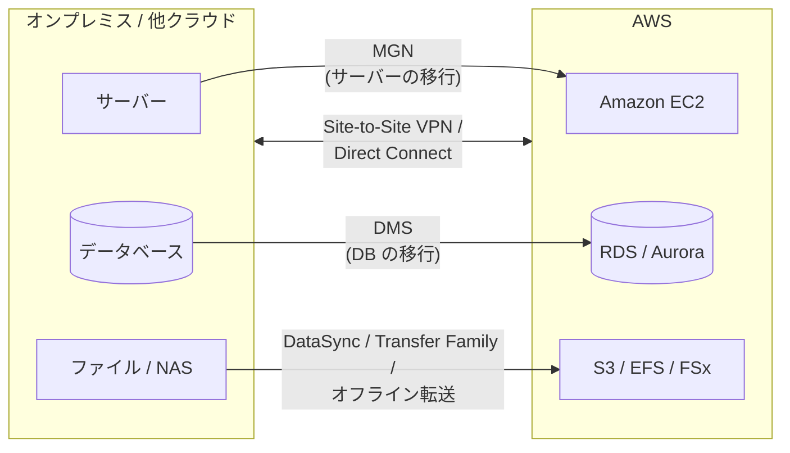
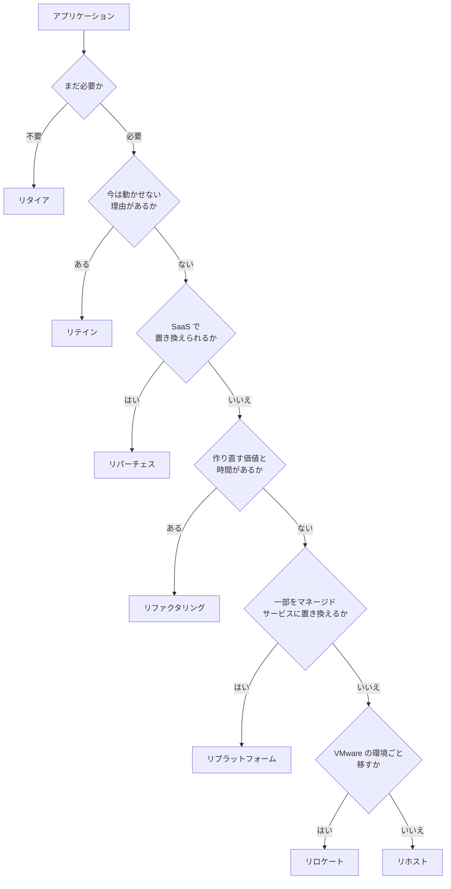
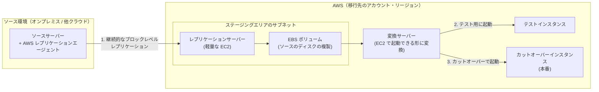
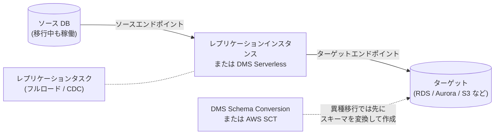
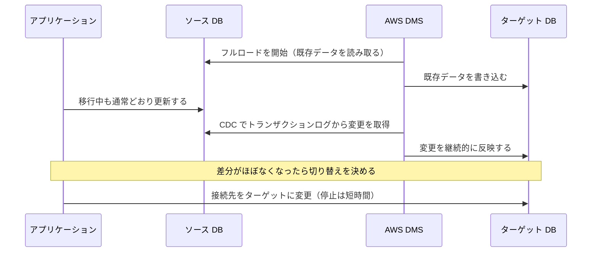
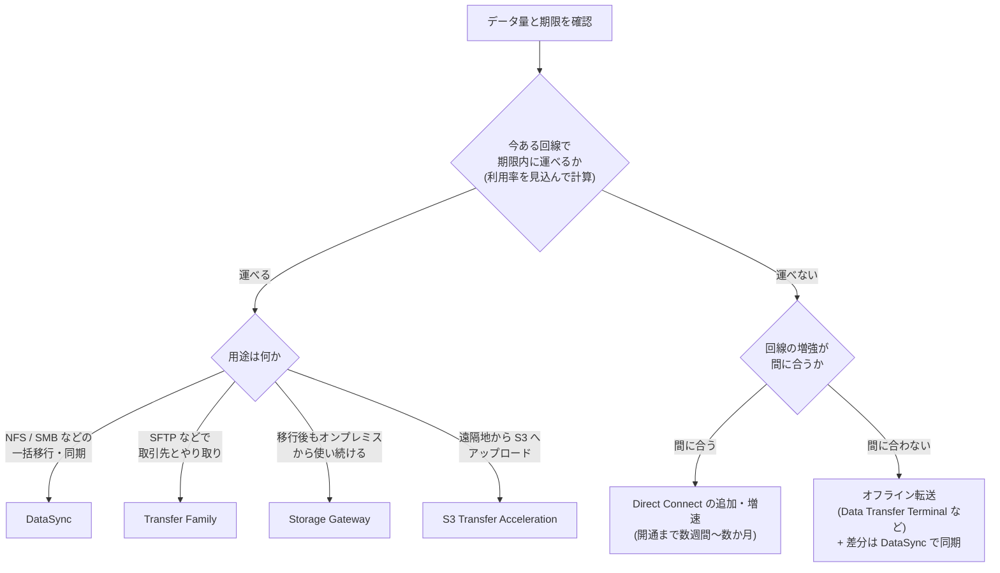
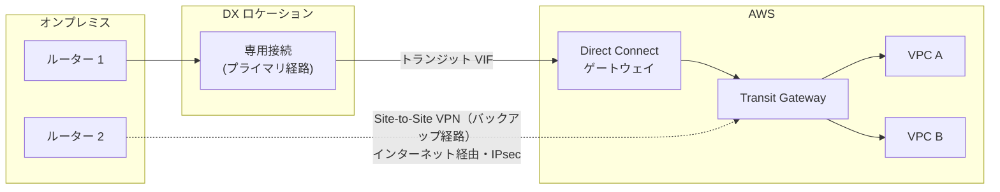

[ホーム](../README.md) > [Phase 2: アソシエイト](README.md) > 移行とハイブリッド接続

# 移行とハイブリッド接続

> **この章のゴール**
> - 移行の 7R を具体例とともに説明し、要件に合う戦略を選べる
> - 移行のプロセス（評価 → モビライズ → 移行とモダナイズ）と、各段階で使うツールの現状を説明できる
> - AWS Application Migration Service（MGN）と AWS DMS（フルロード + CDC、DMS Schema Conversion / AWS SCT）を使い分けられる
> - データ量・帯域・期限から転送時間を計算し、DataSync・Transfer Family・Storage Gateway・オフライン転送を選べる
> - Site-to-Site VPN と Direct Connect の違いを説明し、回復性と暗号化の要件を満たすハイブリッド接続を設計できる
> - Outposts、Amazon EVS、AWS Transform の位置付けを説明できる
>
> **対応試験**: SAA-C03（第2分野: 弾力性に優れたアーキテクチャの設計、第3分野: 高性能なアーキテクチャの設計 ほか）
> **目安時間**: 読む 180分 / 確認問題 40分 / 復習 20分

## この章の全体像

オンプレミスのシステムを AWS へ移すとき、考えるべきことは次の 3 つの問いに整理できます。

1. **何を、どの戦略で移すか** — 移行の 7R（1 節）と移行のプロセス（2 節）
2. **どうやって運ぶか** — サーバーは MGN（3 節）、データベースは DMS（4 節）、ファイルやオブジェクトは DataSync などの転送サービス（5・6 節）
3. **どうつなぐか** — Site-to-Site VPN と Direct Connect（7 節）

移行が終わっても、オンプレミスと AWS を併用する**ハイブリッド構成**が長く続くことは珍しくありません。そのため、この章では接続の設計（7 節）と、AWS をオンプレミスに広げる Outposts など（8 節）も扱います。移行を加速する生成 AI のサービス AWS Transform は 9 節で紹介します。組織全体での大規模移行やモダナイズの戦略は、Phase 3 の [移行とモダナイゼーション](../03-professional/07-migration-modernization.md) と [高度なネットワーク設計](../03-professional/04-advanced-networking.md) で深掘りします。

## 1. 移行戦略: 7R

### 1.1 アプリケーションごとに戦略を選ぶ

企業は数十〜数千のアプリケーションを持っており、すべてを同じやり方で移す必要はありません。まずアプリケーションの一覧（ポートフォリオ）を棚卸しし、**アプリケーションごとに 7 つの戦略（7R）のどれを使うか**を決めます。

一般に、手を加えないほど移行は速くリスクも低くなりますが、クラウドの利点（伸縮性、マネージドサービスによる運用負荷の削減、コストの最適化）は得にくくなります。逆に作り直すほど利点は大きくなりますが、時間とスキルが必要です。「まずリホストで早くデータセンターを出て、その後にモダナイズする」という 2 段階の進め方もよく使われます。

### 1.2 7R の一覧

| 戦略 | 意味 | 例 | 主なツール・サービス |
|---|---|---|---|
| リタイア（Retire） | 使われていないアプリケーションを廃止する | 利用者がほとんどいない旧社内ポータルを停止する | 評価フェーズでの棚卸し |
| リテイン（Retain） | 当面は移行せず、現状のまま維持する（後で再検討する） | ハードウェアを更新したばかり、メインフレームへの依存が強い、規制上すぐには動かせない | ― |
| リホスト（Rehost） | 変更を加えずにそのまま移す（リフトアンドシフト） | オンプレミスの仮想マシンや物理サーバーを EC2 インスタンスに移す | AWS Application Migration Service（MGN） |
| リロケート（Relocate） | ハイパーバイザーのレベルでそのまま移す。OS やアプリケーションの変更も、運用ツールの変更も不要 | VMware vSphere の環境を、同じ VMware の運用のまま AWS 上に移す | Amazon Elastic VMware Service（Amazon EVS） |
| リプラットフォーム（Replatform） | 中核のアーキテクチャは変えずに、一部をマネージドサービスなどに置き換える（リフト・ティンカー・アンド・シフト） | 自前で運用していた MySQL を Amazon RDS に移す。アプリケーションをコンテナにして ECS で動かす | DMS、RDS、Elastic Beanstalk、ECS |
| リパーチェス（Repurchase） | 別の製品、多くの場合は SaaS に乗り換える（ドロップアンドショップ） | 自社運用の CRM や人事システムを SaaS に切り替える | AWS Marketplace |
| リファクタリング / リアーキテクト（Refactor / Re-architect） | クラウドネイティブな設計に作り直す | モノリスをマイクロサービスに分割し、Lambda・DynamoDB・SQS で再構築する | Lambda、コンテナ、AWS Transform（コードのモダナイズ） |

### 1.3 判断の流れ

実際の判断は多くの要素を総合して行いますが、大まかには次の順に問いを立てると整理しやすくなります。

### 1.4 試験での問われ方

| 問題文のキーワード | 戦略 |
|---|---|
| 「コードを変更せずに」「できるだけ早く」「データセンターの契約期限が迫っている」 | リホスト |
| 「VMware の運用やツールを変えずに」「ハイパーバイザーごと」 | リロケート |
| 「データベースの管理負荷を減らしたい」「アプリケーションの変更は最小限」 | リプラットフォーム |
| 「SaaS に切り替える」「ライセンスモデルを変える」 | リパーチェス |
| 「スケーラビリティや俊敏性を大幅に高めたい」「マイクロサービス化」「サーバーレス化」 | リファクタリング |
| 「使われていない」「重複している」 | リタイア |
| 「当面は移行しない」「規制や依存関係のためすぐには動かせない」 | リテイン |

> [!NOTE]
> 古い教材では、リロケートを除いた「6R」で説明されていたり、リロケートの例として VMware Cloud on AWS が挙げられていたりします。考え方は同じです。現在、AWS のネイティブなサービスとして VMware 環境を VPC 内で動かすには Amazon EVS（8.3 節）を使います。

> [!TIP]
> **試験のポイント**: リホストとリプラットフォームの違いは「**移行のついでに何かをマネージドサービスに置き換えるかどうか**」です。「EC2 上に DB を移す」はリホスト、「RDS に移す」はリプラットフォームです。

## 2. 移行のプロセス: 評価 → モビライズ → 移行とモダナイズ

### 2.1 3 つのフェーズ

AWS は大規模な移行を、次の 3 つのフェーズで進めることを推奨しています。AWS の移行支援プログラムである **AWS Migration Acceleration Program（MAP）** も、この 3 フェーズに沿って方法論やパートナー、費用面の支援を提供しています。

| フェーズ | 目的 | 主な活動 | 主な成果物 |
|---|---|---|---|
| 評価（Assess） | 移行する理由と効果を明らかにする | 現行環境の棚卸し、TCO の比較、ビジネスケースの作成、組織の準備状況の評価 | ビジネスケース、移行の方向性 |
| モビライズ（Mobilize） | 大規模な移行の準備を整える | ランディングゾーン（マルチアカウント環境）の構築、ポートフォリオの詳細な分析と 7R の決定、アプリケーション間の依存関係の把握、スキルの育成、パイロット移行 | 移行計画（ウェーブ計画）、ランディングゾーン |
| 移行とモダナイズ（Migrate and Modernize） | 計画に沿って移行し、最適化する | ウェーブごとの移行・テスト・カットオーバー、運用への引き継ぎ、移行後の最適化とモダナイズ | 移行済みのワークロード |

ランディングゾーンの構築（AWS Control Tower など）は Phase 3 の [マルチアカウント戦略とガバナンス](../03-professional/02-multi-account-governance.md) で扱います。

### 2.2 評価と計画のツールの現状

以前は、評価と計画の定番ツールとして次の 2 つが使われていました。どちらも現在は新規のお客様の受け付けを終了しています（既存のお客様は引き続き利用できます）。

| サービス | 役割 | 状況 |
|---|---|---|
| AWS Application Discovery Service | オンプレミスのサーバーの構成、使用率、ネットワークの依存関係を収集する（エージェント型 / エージェントレスのコレクター） | 【新規受付終了】2025年10月に新規受付終了を発表 |
| AWS Migration Hub | 複数のツールによる移行の進捗を一元的に追跡する（戦略の推奨などの機能を含む） | 【新規受付終了】2025年11月に新規受付終了を発表 |

新規のお客様には、生成 AI のエージェントが評価・計画・移行・モダナイズを支援する **AWS Transform**（9 節）が推奨されています。最新の状況は AWS の [メンテナンス中のサービス一覧](https://docs.aws.amazon.com/general/latest/gr/maintenance_services.html) で確認できます。

> [!WARNING]
> **ひっかけ注意**: 試験や古い教材では、「オンプレミスのサーバーの構成と依存関係を調べる」→ Application Discovery Service、「移行の進捗を一元管理する」→ Migration Hub が正解として出題される可能性があります。現状は新規受付終了ですが、**役割は理解しておきましょう**。

### 2.3 ウェーブ計画とカットオーバー

- **ウェーブ**: 依存関係の強いアプリケーションをまとめて同じ時期に移すグループです。最初は影響の小さいアプリケーションでパイロット移行を行い、手順を磨いてから規模を広げます。
- **カットオーバー**: 本番の処理をオンプレミスから AWS へ切り替える作業です。事前に DNS の TTL を短くしておく、切り戻しの手順を決めておく、業務への影響が小さい時間帯を選ぶ、といった準備をします。

## 3. サーバーの移行: AWS Application Migration Service（MGN）

### 3.1 仕組み

**AWS Application Migration Service（MGN）** は、リホストのための主要なサービスです。ソースサーバーのディスクを AWS へ**継続的にブロックレベルでレプリケーション**し、準備ができたら EC2 インスタンスとして起動します。OS やアプリケーションの種類を問わずに移せるのは、ファイルや DB ではなく、ディスクのブロックをそのまま複製しているためです。

> [!NOTE]
> **名称変更**: AWS Application Migration Service は 2026年6月に **AWS Transform MGN** へ名称変更されました。機能・API・レプリケーションの仕組みは変わっていません（[発表](https://aws.amazon.com/about-aws/whats-new/2026/06/aws-transform-mgn-rebrand/)）。試験や多くの教材では旧名称で出題されるため、本章では旧名称で説明します。

### 3.2 移行のライフサイクル

1. **レプリケーション**: ソースサーバーに AWS レプリケーションエージェントをインストールします（VMware vCenter の環境ではエージェントレスのレプリケーションも選べます）。初回の同期が終わると、以降は変更が継続的に複製されます。
2. **テスト**: テストインスタンスを起動して、AWS 上で動作を確認します。この間もソースサーバーは通常どおり稼働し、レプリケーションも続きます。
3. **カットオーバー**: ソースでの処理を止め、最後の変更が複製されたらカットオーバーインスタンスを起動し、DNS などの向き先を切り替えます。**業務が止まるのはこの切り替えの時間（分単位）だけ**です。
4. **ファイナライズ**: レプリケーションを止め、ステージングエリアのリソースを片付けます。ソースサーバーはアーカイブします。

### 3.3 特徴と押さえどころ

- **対応するソース**: 物理サーバー、VMware や Hyper-V などの仮想マシン、他のクラウドのサーバー（Windows / Linux）。AWS のリージョン間の移行にも使えます。
- **起動設定**: EC2 の起動テンプレートでインスタンスタイプやサブネットを指定し、適切なサイズ（ライトサイジング）で起動できます。起動後の処理（エージェントのインストールなど）を**起動後のアクション**として自動化することもできます。
- **料金**: 各ソースサーバーにつき 90 日間（2,160 時間）は MGN 自体の料金がかかりません。ただし、ステージングエリアの EC2 インスタンスや EBS ボリュームなどの料金は発生します（2026年9月時点）。
- **DRS との関係**: MGN と AWS Elastic Disaster Recovery（DRS）は、同じ継続的レプリケーションの技術を基にしています。目的が「一度きりの移行」なら MGN、「継続的な DR」なら DRS です（[高可用性と災害対策](15-high-availability-dr.md)）。

ほかの手段として、**VM Import/Export** は仮想マシンのイメージ（VMDK、VHD、OVA など）を AMI として取り込みます。継続的なレプリケーションはないため、少数のサーバーやイメージ単位での取り込みに向いています。

> [!TIP]
> **試験のポイント**: 「多数のサーバーを、最小限の停止時間でリホストしたい」「カットオーバー前に AWS 上でテストしたい」とあれば MGN です。

> [!WARNING]
> **ひっかけ注意**: 古い教材や問題には、MGN の前身である **AWS Server Migration Service（SMS）** や CloudEndure Migration が登場することがあります。SMS は 2022年に提供を終了しており、現在のサーバー移行は MGN が標準です。また「DataSync でサーバーを移行する」「DMS でサーバーを丸ごと移行する」といった選択肢は誤りです（DataSync はファイルとオブジェクト、DMS はデータベースのデータを移すサービスです）。

## 4. データベースの移行: AWS Database Migration Service（DMS）

### 4.1 構成要素

**AWS Database Migration Service（DMS）** は、ソースのデータベースを**稼働させたまま**、データをターゲットへ移行・同期するサービスです。

| 構成要素 | 役割 |
|---|---|
| レプリケーションインスタンス | データの読み取り・変換・書き込みを行うマネージドなインスタンス。高可用性のためにマルチ AZ 構成も選べる |
| DMS Serverless | インスタンスのサイズを決めずに、必要な容量（DMS キャパシティユニット、DCU）を自動で割り当て、負荷に応じてスケールする |
| エンドポイント | ソースとターゲットへの接続情報（エンジンの種類、ホスト、認証情報など） |
| レプリケーションタスク | どのテーブルを、どの移行タイプ（4.2 節）で移すかを定義する |

ターゲットには RDS、Aurora、Redshift、DynamoDB、S3、OpenSearch Service、Kinesis Data Streams などを指定できます。そのため DMS は移行だけでなく、業務 DB の変更をデータレイク（S3）へ継続的に流す用途にも使われます。

**DMS Serverless** を使うと、レプリケーションインスタンスのサイズ選びやスケーリングの運用が不要になります。最小と最大の DCU を指定しておけば、負荷に応じて容量が自動で調整されます。対応するソースとターゲットには条件があるため、[公式ドキュメント](https://docs.aws.amazon.com/dms/latest/userguide/Welcome.html) で確認してください。

### 4.2 移行タイプ: フルロードと CDC

| 移行タイプ | 動作 | 用途 |
|---|---|---|
| フルロード | タスク開始時点の既存データをすべてコピーする | 停止時間を取れる移行、初回のロード |
| フルロード + CDC | 既存データをコピーした後、変更データキャプチャ（CDC）で移行中の変更を継続的に反映する | 停止時間を最小にする移行（最後に短時間だけ書き込みを止めて切り替える） |
| CDC のみ | 指定した時点以降の変更だけを継続的に反映する | ネイティブツールなどで初回ロードをした後の同期、継続的なレプリケーション |

**CDC** は、ソース DB のトランザクションログ（Oracle の REDO ログ、MySQL のバイナリログ、PostgreSQL の WAL など）を読み取って変更を取り出す仕組みです。そのため、ソース側でログの設定（MySQL のバイナリログを ROW 形式にする、Oracle のサプリメンタルロギングを有効にするなど）が必要になります。

### 4.3 同種移行と異種移行

| 区分 | 例 | スキーマの変換 | 主な手段 |
|---|---|---|---|
| 同種移行（ホモジニアス） | オンプレミスの MySQL → Aurora MySQL、Oracle → RDS for Oracle | 不要（同じエンジン） | DMS、または各エンジンのネイティブツール（mysqldump、pg_dump、Oracle Data Pump、ネイティブのバックアップと復元など） |
| 異種移行（ヘテロジニアス） | Oracle → Aurora PostgreSQL、SQL Server → Aurora MySQL | 必要（データ型、ストアドプロシージャ、関数、トリガーなどを変換する） | DMS Schema Conversion または AWS SCT でスキーマを変換して作成し、DMS でデータを移行する |

### 4.4 DMS Schema Conversion と AWS SCT

異種移行では、データを移す前にスキーマとコードを変換する必要があります。そのための手段が 2 つあります。

| 項目 | DMS Schema Conversion | AWS Schema Conversion Tool（AWS SCT） |
|---|---|---|
| 提供形態 | DMS に組み込まれたマネージドな機能（コンソール / API から使う） | 自分の PC やサーバーにインストールするデスクトップアプリケーション |
| 主な用途 | 一般的な業務 DB 間のスキーマ変換（例: Oracle / SQL Server → PostgreSQL / MySQL 系） | より幅広い変換。データウェアハウスから Amazon Redshift への変換、アプリケーションのコードに埋め込まれた SQL の変換など |
| 評価レポート | 自動で変換できない箇所と、手作業の量の目安を示す | 同様（データベース移行評価レポート） |
| 運用の手間 | インストールや更新が不要 | 導入・更新と、実行環境の管理が必要 |

> [!TIP]
> **試験のポイント**: 「異なるエンジンへ、停止時間を最小にして移行」とあれば、**スキーマ変換（DMS Schema Conversion または AWS SCT）→ DMS のフルロード + CDC → 切り替え**の流れです。「インストール不要のマネージドな変換」なら DMS Schema Conversion、「データウェアハウスを Redshift へ」なら AWS SCT を選びます。

> [!WARNING]
> **ひっかけ注意**: DMS だけでは異種移行は完了しません。DMS がターゲットに作るのは、データの移行に必要な最小限のオブジェクト（テーブルや主キーなど）だけで、セカンダリインデックス、ストアドプロシージャ、トリガーなどは作成しません。同種移行でも、これらのオブジェクトはネイティブツールなどで別途移す必要があります。

### 4.5 設計上の注意

- **ネットワーク**: レプリケーションインスタンス（または DMS Serverless）は、ソースとターゲットの両方に接続できる必要があります。オンプレミスの DB がソースなら、Site-to-Site VPN や Direct Connect（7 節）で接続するのが一般的です。
- **大きな DB の初回ロード**: 数 TB 以上の DB で回線が細い場合は、ネイティブツールのバックアップを別の手段で運んで初回ロードを行い、その時点からの差分だけを DMS の CDC で同期する方法もあります。
- **検証**: DMS のデータ検証機能で、ソースとターゲットの行の一致を確認できます。切り替えの判断材料になります。

## 5. データ転送サービス

### 5.1 全体マップ

| サービス | 方式 | 主なプロトコル・入口 | 典型的な用途 |
|---|---|---|---|
| AWS DataSync | オンライン | NFS、SMB、HDFS、オブジェクトストレージ、他クラウド → S3 / EFS / FSx | 大量のファイルの移行と定期的な同期（検証・スケジュール付き） |
| AWS Transfer Family | オンライン | SFTP、FTPS、FTP、AS2 → S3 / EFS | 取引先とのファイルのやり取りを、既存のプロトコルのまま AWS へ |
| AWS Storage Gateway | オンライン（ハイブリッド） | NFS / SMB（S3 ファイルゲートウェイ）、iSCSI（ボリューム / テープ） | オンプレミスから AWS のストレージを使い続ける |
| S3 Transfer Acceleration | オンライン | HTTPS（S3 API） | 遠く離れた場所から 1 つの S3 バケットへの高速なアップロード |
| AWS Data Transfer Terminal | オフライン（拠点に持ち込む） | 自社のストレージデバイスを AWS の拠点で接続 | ネットワークでは時間がかかりすぎる大量データの初期移行 |
| AWS Snowball Edge | オフライン（デバイスを配送） | AWS から届くデバイスにコピーして返送 | 【新規受付終了】既存のお客様のみ。試験では今も登場する |

### 5.2 AWS DataSync

**AWS DataSync** は、ストレージ間の大量のデータを**オンラインで高速かつ安全に**移すマネージドサービスです。

- **仕組み**: オンプレミスに DataSync エージェント（仮想マシン）を配置し、NFS / SMB の共有、HDFS、オブジェクトストレージからデータを読み取って、TLS で暗号化しながら AWS に送ります。インターネット経由のほか、VPN や Direct Connect を通し、VPC エンドポイントを使ってプライベートに転送することもできます。
- **転送先**: S3（任意のストレージクラスに直接保存できる）、EFS、FSx（Windows File Server / Lustre / OpenZFS / NetApp ONTAP）。
- **機能**: 変更されたファイルだけを送る差分転送、転送後のデータの整合性の検証、スケジュール実行、帯域の上限設定、フィルター、メタデータ（アクセス許可やタイムスタンプ）の保持。
- **AWS のストレージ間**（例: 別リージョンの EFS から EFS へ、S3 から EFS へ）の転送では、エージェントは不要です。他のクラウドのオブジェクトストレージからの移行にも対応しています。

> [!TIP]
> **試験のポイント**: 「NFS / SMB のファイルサーバーから S3 や EFS へ大量のファイルをオンラインで移行」「転送の検証」「定期的な同期」「帯域の制御」とあれば DataSync です。移行後もオンプレミスのアプリケーションからアクセスし続けるなら、Storage Gateway（5.4 節）を検討します。

### 5.3 AWS Transfer Family

**AWS Transfer Family** は、SFTP・FTPS・FTP・AS2 のサーバーをフルマネージドで提供し、受け取ったファイルを S3 や EFS に直接保存するサービスです。取引先が使い慣れたクライアントと手順のまま、送り先だけを AWS に移せます。

- **エンドポイント**: インターネットに公開するもの、VPC 内に置くもの（インターネット向け / 内部向け）を選べます。暗号化されない FTP は、VPC 内の内部向けエンドポイントでのみ使えます。Route 53 で独自のホスト名を割り当てられます。
- **認証**: サービスで管理するユーザー（SFTP の SSH 公開鍵）、AWS Directory Service for Microsoft Active Directory、Lambda や API Gateway を使った独自の ID プロバイダー。
- **移行のポイント**: 既存の SFTP サーバーのホスト鍵を取り込めるため、接続先を切り替えても取引先のクライアントに警告が出ないようにできます。受信後の処理（ファイルのコピー、タグ付け、復号など）は、マネージドワークフローで自動化できます。

### 5.4 AWS Storage Gateway（再掲）

Storage Gateway の詳細は [ブロック・ファイルストレージ](06-ebs-efs-fsx.md) で学びました。移行とハイブリッドの観点で整理し直します。

| タイプ | オンプレミス側のインターフェイス | AWS 側の保存先 | 移行・ハイブリッドでの使いどころ |
|---|---|---|---|
| S3 ファイルゲートウェイ | NFS / SMB | S3（ファイルは 1 対 1 でオブジェクトとして保存される） | 共有フォルダのデータを S3 に集め、クラウド側の分析などにも使う |
| ボリュームゲートウェイ（キャッシュ型 / 保管型） | iSCSI のブロックデバイス | S3（EBS スナップショットとして取得できる） | オンプレミスのサーバーのディスクのバックアップや DR |
| テープゲートウェイ | iSCSI の仮想テープライブラリ（VTL） | S3、S3 Glacier Flexible Retrieval / S3 Glacier Deep Archive | 既存のバックアップソフトウェアのまま、物理テープを廃止する |

Amazon FSx File Gateway は、2024年10月28日以降、新規のお客様は利用できません。オンプレミスから FSx for Windows File Server を使いたい場合は、Direct Connect や VPN 経由で直接アクセスする構成などを検討します。

### 5.5 S3 Transfer Acceleration

**S3 Transfer Acceleration** は、CloudFront のエッジロケーションを入口にして、そこから AWS のバックボーンネットワーク経由でバケットのあるリージョンへデータを運ぶことで、**遠距離からの S3 へのアップロードを速くする**機能です（[Amazon S3](05-s3.md)）。

- バケット単位で有効にし、専用のエンドポイント（`バケット名.s3-accelerate.amazonaws.com`）を使います。バケット名は DNS に準拠し、ピリオドを含まない必要があります。
- 高速化の効果があった転送にだけ、追加料金がかかります。
- 大きなファイルはマルチパートアップロードと組み合わせます（1 回の PUT で送れるのは 5 GB まで）。
- **効果が出ないケース**: ボトルネックがオンプレミス側の回線そのものにある場合や、バケットと同じリージョンの近くから送る場合は、ほとんど速くなりません。

### 5.6 オフライン転送: Snow Family の現状と AWS Data Transfer Terminal

回線で運ぶと期限に間に合わないほど大量のデータは、物理的に運ぶ**オフライン転送**が選択肢になります。その代表だった AWS Snow Family の現状は次のとおりです。

| サービス | 状況 |
|---|---|
| AWS Snowcone、旧世代の AWS Snowball Edge | 2024年11月に提供終了 |
| AWS Snowball Edge（すべてのデバイス） | 【新規受付終了】2025年11月7日から新規のお客様の受け付けを終了（2025年10月に発表）。既存のお客様は引き続き利用できる |
| AWS Snowmobile（トラックで運ぶエクサバイト級のサービス） | 2024年に提供終了 |

新規のお客様には、次の代替手段が案内されています。

- **AWS DataSync**: オンラインで転送する（6 節で転送時間を見積もる）
- **AWS Data Transfer Terminal**: AWS が用意した物理的な拠点に、**自社のストレージデバイスを持ち込み**、高速なネットワーク接続で S3 などへ直接アップロードするサービスです（2024年12月発表）。マネジメントコンソールで利用枠を予約して使います。拠点は東京を含む世界の複数の都市にあります（2026年9月時点。最新の拠点は [公式ページ](https://aws.amazon.com/data-transfer-terminal/) で確認してください）。
- **パートナーのデバイス**（AWS Marketplace で提供されるもの）
- エッジでの処理が目的なら **AWS Outposts**（8.1 節）

> [!WARNING]
> **ひっかけ注意**: SAA-C03 の問題や古い教材では、今でも「回線が細く、数十 TB のデータを 1 週間以内に移行 → Snowball Edge」「ネットワークのない現場でデータを前処理 → Snowball Edge（Compute Optimized）」「エクサバイト級 → Snowmobile」が正解として出題される可能性があります。「ネットワーク転送が期限に間に合わないときはオフライン転送を選ぶ」という**考え方**を理解したうえで、現在は新規のお客様が Snowball Edge を使えないことも押さえておきましょう。

## 6. データ量 × 帯域 × 期限で選ぶ

### 6.1 転送時間の計算

転送手段を選ぶ前に、まず「今ある回線で、期限内に転送できるか」を計算します。

- 転送時間（秒）= データ量（ビット）÷ 実効帯域（bps）
- 実効帯域 = 回線の帯域 × 移行に使える割合（利用率）

**計算例**: 100 TB のデータを、1 Gbps の回線の 80% を使って転送する場合

1. データ量をビットに換算します: 100 TB = 100 × 10¹² バイト × 8 = 8 × 10¹⁴ ビット
2. 実効帯域を求めます: 1 Gbps × 0.8 = 8 × 10⁸ bps
3. 転送時間を求めます: 8 × 10¹⁴ ÷ (8 × 10⁸) = 10⁶ 秒 = 1,000,000 秒
4. 日数に換算します: 1,000,000 ÷ 86,400 ≈ **約 11.6 日**

覚えやすい目安として、**1 Gbps の回線を 80% 使うと 1 日に約 8.64 TB**（毎秒 100 MB）運べます。つまり、転送日数 ≈ データ量（TB）÷（8.64 × 帯域（Gbps））です。

> [!NOTE]
> ここでは 1 TB = 10¹² バイトとして計算しています。1 TiB（2⁴⁰ バイト）で数えると、100 TiB は約 12.7 日になります。実際には、プロトコルのオーバーヘッド、小さなファイルが大量にある場合の処理時間、ストレージの読み出し性能、業務の通信との共用などで遅くなるため、**余裕を持った計画**にします。

### 6.2 早見表（回線の 80% を使う場合）

| データ量 | 100 Mbps | 1 Gbps | 10 Gbps |
|---|---|---|---|
| 1 TB | 約 1.2 日（約 28 時間） | 約 2.8 時間 | 約 17 分 |
| 10 TB | 約 11.6 日 | 約 1.2 日 | 約 2.8 時間 |
| 100 TB | 約 116 日 | 約 11.6 日 | 約 1.2 日 |
| 1 PB | 約 3.2 年 | 約 116 日 | 約 11.6 日 |

データ量が 10 倍になるか、帯域が 10 分の 1 になると、日数は 10 倍になります。この表の数字の並びを覚えておくと、試験で素早く判断できます。

### 6.3 判断の流れ

インターネットから AWS へのデータ転送（イン）にはデータ転送料金がかかりませんが、DataSync などのサービスには転送量に応じた料金があります。また、移行中もデータが更新され続ける場合は、**初回の一括転送と、その後の差分の同期**を分けて計画します。

> [!TIP]
> **試験のポイント**: 計算問題では「**TB → ビット（× 8）**」と「**利用率**」を忘れないようにします。計算した結果、既存の回線で期限に間に合うなら、オフライン転送や回線の増強は不要です（コストと手間が増えるだけの選択肢は誤りになります）。

## 7. ハイブリッド接続

VPC の基本（VGW、Transit Gateway、ルートテーブル）は [VPC とネットワーク設計](02-vpc.md) で学びました。ここでは、オンプレミスと AWS を結ぶ 2 つの手段を比べます。

### 7.1 AWS Site-to-Site VPN

**AWS Site-to-Site VPN** は、オンプレミスのネットワークと AWS を、インターネット上の IPsec VPN で結ぶマネージドサービスです（[公式ドキュメント](https://docs.aws.amazon.com/vpn/latest/s2svpn/VPC_VPN.html)）。

- **カスタマーゲートウェイ（CGW）**: オンプレミス側の VPN 装置（ルーターやファイアウォール）を、AWS 上で表すリソースです。
- **AWS 側の終端**: 1 つの VPC にアタッチする**仮想プライベートゲートウェイ（VGW）**か、多数の VPC のハブになる **Transit Gateway** です（AWS Cloud WAN にも接続できます）。
- **1 つの VPN 接続には 2 本のトンネル**があり、AWS 側ではそれぞれ別の AZ で終端されます。AWS のメンテナンス時には片方のトンネルが一時的に使えなくなることがあるため、**オンプレミス側でも 2 本とも設定して**冗長化します。
- **ルーティング**: 静的ルーティングか、BGP による動的ルーティングを選びます。BGP を使うと、障害時の経路の自動切り替えや ECMP が可能になります。
- **帯域**: 標準のトンネルは 1 本あたり最大 1.25 Gbps です。Transit Gateway または Cloud WAN に接続する VPN では、1 本あたり最大 5 Gbps の**大容量トンネル（Large Bandwidth Tunnel）**も選べます（2025年11月発表。2026年9月時点、[公式ドキュメント](https://docs.aws.amazon.com/vpn/latest/s2svpn/VPNTunnels.html)）。
- **ECMP**: Transit Gateway では、BGP を使う複数の VPN 接続に同じ経路を広報し、等コストマルチパス（ECMP）で負荷分散して、合計の帯域を増やせます。
- **高速化された Site-to-Site VPN**: Global Accelerator のエッジロケーションを経由して AWS のネットワークに入ることで、不安定なインターネット区間を短くします。

| 項目 | 仮想プライベートゲートウェイ（VGW） | Transit Gateway |
|---|---|---|
| 接続できる VPC | アタッチした 1 つの VPC | 多数の VPC（ハブ&スポーク） |
| ECMP（複数の VPN 接続を束ねる） | 対応しない | 対応する（BGP が必要） |
| 大容量トンネル（最大 5 Gbps） | 対応しない | 対応する |
| 高速化された Site-to-Site VPN | 対応しない | 対応する |
| 料金 | VPN 接続の時間料金 + データ転送料金 | 上記に加えて、Transit Gateway のアタッチメントとデータ処理の料金 |

> [!NOTE]
> 試験や古い教材では「VPN のトンネルは 1 本 1.25 Gbps まで。それ以上が必要なら Transit Gateway と ECMP で束ねる」という形で出題されます。この考え方は今も正しく、現在はこれに加えて大容量トンネルという選択肢があります。また、複数の拠点を 1 つの VGW に VPN で接続し、VGW を中継して拠点どうしを通信させる構成を **AWS VPN CloudHub** と呼びます。

### 7.2 AWS Direct Connect

**AWS Direct Connect（DX）** は、オンプレミスと AWS を**インターネットを経由しない専用のネットワーク接続**で結ぶサービスです。利用者の回線を DX ロケーション（AWS の装置が置かれたデータセンター）まで引き込み、そこで AWS のネットワークに接続します。インターネットの混雑の影響を受けないため、**レイテンシーと帯域が安定**し、AWS からのデータ転送（アウト）の単価もインターネット経由より低くなります。

| 項目 | 専用接続（Dedicated Connection） | ホスト型接続（Hosted Connection） |
|---|---|---|
| 提供元 | AWS（DX ロケーションの物理ポートを専有する） | AWS Direct Connect パートナー（パートナーが AWS との間に持つ回線から提供する） |
| 帯域 | 1 / 10 / 100 / 400 Gbps | 50 Mbps〜25 Gbps（パートナーが提供する帯域から選ぶ） |
| MACsec | 10 / 100 / 400 Gbps の接続で利用できる（一部のロケーション） | ― |
| 向いている用途 | 大容量の接続、MACsec による暗号化 | 小〜中規模の接続、1 Gbps 未満の帯域 |

帯域の選択肢は 2026年9月時点のものです（[公式ドキュメント](https://docs.aws.amazon.com/directconnect/latest/UserGuide/connection_options.html)）。

- **リードタイム**: 通信事業者による回線の敷設や、DX ロケーションでの構内配線（クロスコネクト）が必要なため、開通までに**数週間〜数か月**かかることがあります。急いで接続したい場合は、まず Site-to-Site VPN を使います。
- **仮想インターフェイス（VIF）**: 1 本の接続の上に、用途ごとの論理的なインターフェイスを作ります。

| VIF | 接続先 | 用途 |
|---|---|---|
| プライベート VIF | VGW（Direct Connect ゲートウェイ経由も可） | VPC 内のリソースへプライベート IP アドレスで接続する |
| パブリック VIF | AWS のパブリックなエンドポイント | S3 などのパブリックなサービスへ、インターネットを経由せずに接続する |
| トランジット VIF | Direct Connect ゲートウェイ経由の Transit Gateway | 多数の VPC へハブ&スポークで接続する |

- **Direct Connect ゲートウェイ**: グローバルなリソースで、1 つの DX 接続から複数のリージョンやアカウントの VPC（VGW または Transit Gateway 経由）に接続できます。
- **LAG（リンクアグリゲーショングループ）**: 同じ DX ロケーションにある同じ帯域の専用接続を LACP で束ね、1 つの論理的な接続として使います。

> [!IMPORTANT]
> **Direct Connect は、標準では暗号化されません**。専用線であることと、暗号化されていることは別です。通信の暗号化が必要な場合は、次のいずれかを使います。
> - **MACsec**: レイヤー 2 で、利用者のルーターと DX ロケーションの AWS の装置の間を暗号化します。専用接続（10 / 100 / 400 Gbps、対応ロケーションのみ）で使え、回線の帯域をほぼそのまま使えます。
> - **VPN over DX**: Direct Connect の上に IPsec の Site-to-Site VPN を通します（パブリック VIF 経由、または Transit Gateway とトランジット VIF を使うプライベート IP VPN）。VPN の帯域の制約を受けます。
> - アプリケーション層での暗号化（TLS）

### 7.3 Site-to-Site VPN と Direct Connect の比較

| 項目 | Site-to-Site VPN | Direct Connect |
|---|---|---|
| 経路 | インターネット上の IPsec トンネル | 専用のネットワーク接続（DX ロケーション経由） |
| 暗号化 | 標準で IPsec により暗号化される | 標準では暗号化されない（MACsec または VPN over DX で暗号化） |
| 帯域 | 標準のトンネルは 1 本 1.25 Gbps まで（大容量トンネルは 5 Gbps まで）。ECMP で束ねられる | 専用接続は 1 / 10 / 100 / 400 Gbps、ホスト型接続は 50 Mbps〜25 Gbps |
| 品質 | インターネットの状況で変動する | レイテンシーと帯域が安定している |
| 開通までの期間 | 数分〜数時間 | 数週間〜数か月 |
| コスト | 低い（接続の時間料金 + データ転送料金） | ポートの時間料金 + データ転送料金（単価は低い）+ 回線やロケーションの費用 |
| 冗長化 | 1 つの接続に 2 本のトンネル（別々の AZ） | 複数の接続・複数のロケーションを自分で用意する |
| 向いている用途 | 早く・安く始めたい、DX のバックアップ | 大容量で安定した常時接続、大規模な移行 |

> [!TIP]
> **試験のポイント**: 「すぐに接続したい」「低コスト」→ VPN。「一貫したネットワーク性能」「大量のデータを毎日転送」→ Direct Connect。「DX を使いつつ暗号化」→ MACsec または VPN over DX。「DX の障害に備える低コストなバックアップ」→ Site-to-Site VPN です。

### 7.4 回復性の高いハイブリッド接続

Direct Connect の回線 1 本は単一障害点です。AWS は、求める回復性に応じた構成のモデル（Resiliency Toolkit）を示しています。

| 構成モデル | 構成 | 耐えられる障害 |
|---|---|---|
| 最大の回復性（Maximum Resiliency） | 2 つの DX ロケーションそれぞれで、別々の装置に 2 本ずつ（合計 4 本） | 装置・回線の障害と、ロケーション全体の障害 |
| 高い回復性（High Resiliency） | 2 つの DX ロケーションに 1 本ずつ（合計 2 本） | 1 つのロケーション全体の障害 |
| 開発とテスト（Development and Test） | 1 つの DX ロケーションで、別々の装置に 2 本 | 装置・回線の障害（ロケーション全体の障害には耐えられない） |
| 低コストのバックアップ | DX 1 本 + Site-to-Site VPN | DX の障害時は VPN で通信を続ける（帯域は下がる） |

この構成では、オンプレミスから DX と VPN の両方に同じネットワークのプレフィックスを BGP で広報します。**宛先のプレフィックスが同じなら、AWS は VPN より Direct Connect の経路を優先**するため、平常時は DX を使い、DX に障害が起きて BGP の経路が消えると、自動的に VPN へ切り替わります。

> [!WARNING]
> **ひっかけ注意**: 経路の選択では、まず**最も長く一致するプレフィックス（ロンゲストマッチ）**が優先されます。VPN 側でより細かいプレフィックス（例: DX 側は 10.0.0.0/16、VPN 側は 10.0.1.0/24）を広報すると、平常時でもその宛先の通信が VPN を通ってしまいます。また VPN の帯域は DX より小さいことが多いため、DX 障害時に必要な帯域を確保できるかも確認します。業務上重要なら、VPN ではなく 2 つ目のロケーションに DX を追加します。

### 7.5 AWS Client VPN

**AWS Client VPN** は、個々の利用者の PC から VPC（や、VPC 経由でオンプレミス）へ接続するための、マネージドなリモートアクセス VPN です（[公式ドキュメント](https://docs.aws.amazon.com/vpn/latest/clientvpn-admin/what-is.html)）。Site-to-Site VPN が「拠点のネットワークどうし」をつなぐのに対し、Client VPN は「人の端末」をつなぎます。

- OpenVPN ベースのクライアント（AWS が提供するクライアントなど）で接続します。
- 認証は、Active Directory（AWS Managed Microsoft AD や AD Connector）、証明書による相互認証、SAML 2.0 によるフェデレーション（IAM Identity Center などの IdP）から選べます。
- クライアント VPN エンドポイントを VPC のサブネットに関連付けます。**複数の AZ のサブネットに関連付ける**と冗長化できます。
- 承認ルールで、接続できる宛先のネットワークをユーザーのグループごとに制御します。VPC 宛ての通信だけを VPN に通すスプリットトンネルも設定できます。

### 7.6 ハイブリッド DNS

オンプレミスと AWS の間で名前解決をするには、**Route 53 Resolver のエンドポイント**を使います。インバウンドエンドポイントでオンプレミスから VPC のプライベートホストゾーンを名前解決でき、アウトバウンドエンドポイントと転送ルールで VPC からオンプレミスの DNS サーバーに問い合わせを転送できます（[Route 53・CloudFront・Global Accelerator](08-route53-cloudfront.md)）。

## 8. AWS をオンプレミスやエッジに広げる

### 8.1 AWS Outposts

**AWS Outposts** は、AWS が設計したハードウェアを**利用者のデータセンターや拠点に設置**し、AWS のリージョンと同じ API・ツールで使えるようにするサービスです。ハードウェアの保守は AWS が行い、設置場所・電源・ネットワークは利用者が用意します。

- **Outposts ラック**: 42U の業界標準ラックで、EC2、EBS、S3 on Outposts、ECS、EKS、RDS などを利用できます。ローカルゲートウェイでオンプレミスのネットワークと接続します。
- **Outposts サーバー**: 1U / 2U のサーバーで、ラックを置けない店舗や工場などの小さな拠点向けです。
- **親リージョンとの接続（サービスリンク）が必要**です。接続が切れても起動済みのインスタンスは動き続けますが、インスタンスの起動などの管理操作はできなくなります。
- **使いどころ**: オンプレミスのシステムとの超低レイテンシーの通信、現地でのデータ処理、データを特定の場所に置く必要がある（データレジデンシー）場合。Snowball Edge で行っていたエッジでのコンピューティングの代替にもなります。

### 8.2 Outposts・Local Zones・Wavelength の違い

| 項目 | AWS Outposts | AWS Local Zones | AWS Wavelength |
|---|---|---|---|
| 設置場所 | 利用者のデータセンターや拠点 | AWS が大都市圏に設置 | 通信事業者の 5G ネットワークの中 |
| 主な目的 | オンプレミスとの超低レイテンシー、現地でのデータ処理、データの所在地の要件 | 特定の地域の利用者への 1 桁ミリ秒のレイテンシー | モバイル端末への超低レイテンシー |
| 設置場所の管理 | 利用者（ハードウェアは AWS が保守） | AWS | AWS と通信事業者 |

### 8.3 VMware の環境を移す: Amazon EVS

VMware vSphere で多くの仮想マシンを運用している企業にとって、「まず VMware の環境のまま AWS へ移し、その後に少しずつモダナイズする」ことは現実的な選択肢です（リロケート）。

**Amazon Elastic VMware Service（Amazon EVS）** は、**利用者の VPC の中で、EC2 のベアメタルインスタンス上に VMware Cloud Foundation（VCF）の環境を構築して動かす**サービスです（2025年8月 GA。東京リージョンを含む複数のリージョンで利用可能、2026年9月時点）。

- 使い慣れた vCenter などの VMware のツールと運用手順を、そのまま使い続けられます。
- VPC の中で動くため、FSx for NetApp ONTAP などの AWS のサービスと組み合わせやすくなっています。
- VCF のライセンスは Broadcom から購入したものを持ち込み、VCF 環境の運用は利用者（またはパートナー）が行います。

一方、VMware の仮想マシンを **EC2 インスタンスへ移したい（リホスト）**場合は、MGN や AWS Transform の VMware 向けの機能（次の 9 節）を使います。詳しくは [公式ドキュメント](https://docs.aws.amazon.com/evs/latest/userguide/what-is-evs.html) を参照してください。

## 9. AWS Transform

**AWS Transform** は、生成 AI のエージェントを使って移行とモダナイズを加速するサービスです（2025年5月 GA、[公式ページ](https://aws.amazon.com/transform/)）。エージェントが分析や変換の作業を進め、人が結果を確認・承認しながら進めます。

| 対象 | AWS Transform が支援すること |
|---|---|
| 移行の評価 | 現行環境の分析、移行の評価とビジネスケースの作成 |
| VMware | 仮想マシンと依存関係の検出、移行計画、ネットワーク構成の変換、EC2 への移行 |
| メインフレーム | COBOL などのコードの分析と、Java へのモダナイズ |
| .NET / Windows | .NET Framework のアプリケーションを Linux で動くモダンな .NET へ変換する。Windows のフルスタックのモダナイズ |
| その他のコード | 独自の変換ルールによるコードのモダナイズ（AWS Transform custom、2025年12月） |

Application Discovery Service や Migration Hub（2.2 節）、AWS Mainframe Modernization（新規受付終了）の新規のお客様向けの後継として、AWS Transform が推奨されています。SAA-C03 では「移行やモダナイズを支援する生成 AI のサービス」として位置付けを押さえておけば十分です。詳しい使い方は Phase 3 の [移行とモダナイゼーション](../03-professional/07-migration-modernization.md) で扱います。

## まとめ

- 移行の戦略は **7R**（リタイア、リテイン、リホスト、リロケート、リプラットフォーム、リパーチェス、リファクタリング）。アプリケーションごとに選ぶ
- 移行は**評価 → モビライズ → 移行とモダナイズ**の 3 フェーズで進める。Application Discovery Service と Migration Hub は新規受付終了で、新規のお客様には AWS Transform が推奨されている
- サーバーのリホストは **MGN**（継続的なブロックレベルレプリケーション、テスト後に分単位のカットオーバー）
- DB の移行は **DMS**。停止時間を最小にするなら**フルロード + CDC**。異種移行では **DMS Schema Conversion または AWS SCT** でスキーマを先に変換する
- ファイルの移行・同期は **DataSync**、SFTP などは **Transfer Family**、ハイブリッドで使い続けるなら **Storage Gateway**、遠距離から S3 へは **S3 Transfer Acceleration**
- Snowball Edge は新規受付終了。オフライン転送の新しい選択肢は **AWS Data Transfer Terminal**。ただし試験では Snowball Edge が登場し得る
- 転送時間 = データ量（ビット）÷（帯域 × 利用率）。**100 TB を 1 Gbps の 80% で約 11.6 日**
- **Site-to-Site VPN** は 2 本のトンネルで早く安く始められる。**Direct Connect** は安定した専用接続だが開通に数週間〜数か月かかり、標準では暗号化されない（MACsec または VPN over DX）
- 回復性は DX を複数のロケーションに、低コストなら DX + VPN のバックアップ。同じプレフィックスなら DX が優先される
- AWS をオンプレミスに広げるなら **Outposts**、VMware のまま移すなら **Amazon EVS**

## 確認問題

### 問1
ある企業は、オンプレミスのデータセンターの VMware vSphere 上で約 400 台の仮想マシンを運用しています。データセンターの契約が 6 か月後に終了するため、それまでに AWS へ移行する必要があります。運用チームは vCenter などの VMware のツールと運用手順を当面そのまま使い続けたいと考えており、仮想マシンの OS やアプリケーションには手を加えたくありません。最も適切な移行戦略とサービスの組み合わせはどれですか。

- A. リファクタリング: アプリケーションをコンテナ化し、AWS Fargate 上の Amazon ECS で再構築する
- B. リホスト: AWS Application Migration Service（MGN）で各仮想マシンを EC2 インスタンスとして移行する
- C. リロケート: Amazon Elastic VMware Service（Amazon EVS）で VPC 内に VMware Cloud Foundation の環境を構築し、仮想マシンを移す
- D. リパーチェス: 同等の機能を持つ SaaS の製品を AWS Marketplace で購入して置き換える

解答と解説

**正解: C**

**解説**: 「VMware のツールと運用手順をそのまま使い続けたい」「OS やアプリケーションに手を加えない」という要件は、ハイパーバイザーのレベルでそのまま移す**リロケート**に当てはまります。Amazon EVS を使うと、VPC 内で VCF の環境を動かし、vCenter での運用を継続できます。

**各選択肢の検討**
- A: ✗ 6 か月で 400 台分のアプリケーションを作り直すのは現実的でなく、アプリケーションに手を加えないという要件にも反します。
- B: ✗ 早く移せる有力な手段ですが、移行後は EC2 インスタンスになるため、vCenter などの VMware のツールによる運用は続けられません。
- C: ✓ すべての要件を満たします。
- D: ✗ すべてのアプリケーションを SaaS に置き換えることは、要件（アプリケーションを変えない）に反します。

### 問2
ある企業は、オンプレミスの物理サーバーと Hyper-V 上の仮想マシン合わせて 120 台（Windows Server と Linux）を Amazon EC2 に移行する計画です。移行中も業務を続け、各サーバーの切り替え時の停止時間は数分に抑える必要があります。また、切り替える前に AWS 上で移行後の動作をテストしたいと考えています。最も運用上のオーバーヘッドが少ない方法はどれですか。

- A. VM Import/Export で各仮想マシンのイメージを AMI として取り込み、物理サーバーは EC2 上で手作業で再構築する
- B. AWS Application Migration Service（MGN）のレプリケーションエージェントを各サーバーにインストールして継続的にレプリケーションし、テストインスタンスで検証してからカットオーバーする
- C. AWS DataSync で各サーバーのファイルシステムを Amazon EFS にコピーし、EC2 インスタンスからマウントする
- D. AWS Backup で各サーバーのバックアップを取得し、EC2 インスタンスとして復元する

解答と解説

**正解: B**

**解説**: MGN は、物理サーバーや Hyper-V を含むさまざまなソースから、継続的なブロックレベルレプリケーションで EC2 へリホストします。移行中もソースは稼働し続け、テストインスタンスでの検証後に分単位の停止でカットオーバーできます。

**各選択肢の検討**
- A: ✗ イメージの取り込みは一度きりで、取り込み後の変更は反映されません。物理サーバーの手作業での再構築も含め、オーバーヘッドが大きくなります。
- B: ✓ すべての要件を満たします。
- C: ✗ DataSync はファイルを転送するサービスで、起動できるサーバー（OS やアプリケーション）を移行することはできません。
- D: ✗ AWS Backup はバックアップの管理サービスで、オンプレミスの物理サーバーを継続的にレプリケーションし、分単位で切り替える移行の機能はありません。

### 問3
ある企業は、オンプレミスで稼働する 2 TB の Oracle Database を Amazon Aurora PostgreSQL 互換エディションに移行したいと考えています。移行期間中もオンプレミスのアプリケーションは Oracle Database への書き込みを続け、最終的な切り替え時の停止時間は最小限にする必要があります。オンプレミスと AWS の間には、AWS Site-to-Site VPN が構成済みです。最も適切な手順はどれですか。

- A. DMS Schema Conversion（または AWS SCT）でスキーマとコードを Aurora PostgreSQL 向けに変換して作成し、AWS DMS のフルロード + CDC のタスクでデータを移行・同期してから、アプリケーションの接続先を切り替える
- B. AWS DMS のフルロードのタスクだけを実行し、完了したらアプリケーションの接続先を切り替える
- C. Oracle Data Pump でエクスポートしたダンプファイルを S3 にアップロードし、Aurora PostgreSQL にインポートする
- D. AWS Application Migration Service（MGN）で Oracle Database のサーバーを EC2 に移行し、その後 EC2 上の Oracle Database を Aurora PostgreSQL に変更する

解答と解説

**正解: A**

**解説**: エンジンが異なる**異種移行**なので、まずスキーマとコード（ストアドプロシージャなど）を変換します。そのうえで DMS の**フルロード + CDC** を使えば、既存データの移行中の変更も継続的に反映されるため、最後に短時間だけ書き込みを止めて切り替えられます。

**各選択肢の検討**
- A: ✓ 異種移行と停止時間の最小化の両方を満たします。
- B: ✗ フルロードだけでは、ロード中とロード後の変更が反映されません。変更を失わないためには、ロードの間ずっと書き込みを止める必要があり、停止時間が長くなります。スキーマの変換も行われません。
- C: ✗ Data Pump のダンプファイルは Oracle 独自の形式で、PostgreSQL にはインポートできません。
- D: ✗ MGN はサーバーをそのまま移すリホストのサービスで、データベースエンジンを変換する機能はありません。

### 問4
ある研究機関は、オンプレミスの NAS（NFS）に保存されている 100 TB の研究データを Amazon S3 に移行する必要があります。期限は 30 日後です。AWS との間には 1 Gbps の AWS Direct Connect の接続があり、業務への影響を考えて帯域の 80% までを移行に使えます。移行中も NAS のファイルは更新され続けるため、最終的には差分も反映する必要があります。最もコスト効率が高く、運用上のオーバーヘッドが少ない方法はどれですか。

- A. 10 Gbps の Direct Connect の専用接続を追加で発注し、開通後に AWS CLI の `aws s3 sync` コマンドで転送する
- B. AWS Data Transfer Terminal の利用を予約し、NAS のデータをストレージデバイスにコピーして持ち込み、アップロードする
- C. S3 Transfer Acceleration を有効にし、NAS をマウントしたサーバーから AWS CLI でアップロードする
- D. AWS DataSync のエージェントをオンプレミスに配置し、Direct Connect 経由で NAS から S3 への転送タスクを実行する。帯域の上限を設定し、初回の転送後はスケジュール実行で差分を同期する

解答と解説

**正解: D**

**解説**: 100 TB = 8 × 10¹⁴ ビット、実効帯域は 1 Gbps × 0.8 = 8 × 10⁸ bps なので、転送時間は 10⁶ 秒 ≈ **約 11.6 日**です。期限の 30 日に十分間に合うため、既存の Direct Connect で DataSync を使うのが最も安価で手間がかかりません。DataSync は帯域の上限設定、整合性の検証、差分転送、スケジュール実行に対応しています。

**各選択肢の検討**
- A: ✗ 開通まで数週間〜数か月かかる可能性があり、追加のコストもかかります。既存の回線で間に合うため不要です。
- B: ✗ 物理的にデバイスを用意して持ち込む手間がかかります。オンラインで期限内に転送できるため、オフライン転送は不要です。
- C: ✗ Transfer Acceleration はインターネット経由の遠距離アップロードを速くする機能で、既存の Direct Connect を活用できず、DataSync のような検証やスケジュールによる差分同期の仕組みもありません。
- D: ✓ 計算上、期限内に完了し、差分の同期にも対応できます。

### 問5
ある企業は、2 週間後から AWS への移行作業を始める予定で、それまでにオンプレミスと VPC の間にプライベートな接続を用意する必要があります。移行が完了した後は、オンプレミスと AWS の間で、毎日大量のデータを安定したレイテンシーでやり取りする予定です。コストを抑えつつ、これらの要件を満たす方法はどれですか。

- A. AWS Direct Connect の専用接続を発注し、開通するまで移行作業の開始を延期する
- B. AWS Site-to-Site VPN だけを構成し、移行の完了後もそのまま使い続ける
- C. すぐに AWS Site-to-Site VPN を構成して移行を始め、並行して AWS Direct Connect を発注する。開通後は Direct Connect を主な経路とし、VPN はバックアップとして残す
- D. AWS Client VPN のエンドポイントを作成し、移行の担当者の PC から VPC に接続する

解答と解説

**正解: C**

**解説**: Direct Connect は開通までに数週間〜数か月かかることがあるため、2 週間後の作業開始に間に合わない可能性があります。すぐに使える Site-to-Site VPN で始め、長期的な「大量のデータを安定したレイテンシーで」という要件は Direct Connect で満たします。開通後も VPN を残せば、低コストなバックアップ経路になります。

**各選択肢の検討**
- A: ✗ 移行の開始時期という要件を満たせない可能性があります。
- B: ✗ インターネット経由のため、レイテンシーが安定せず、長期的な要件を満たしません。
- C: ✓ 短期と長期の両方の要件を満たし、冗長化にもなります。
- D: ✗ Client VPN は個々の利用者の端末を接続するためのもので、拠点どうしをつなぐ用途には向きません。

### 問6
ある金融機関は、オンプレミスのデータセンターと AWS の間を 10 Gbps の AWS Direct Connect の専用接続で結んでいます。セキュリティ要件の変更により、Direct Connect 上の通信を暗号化する必要が生じました。アプリケーションには手を加えず、回線の帯域をできるだけ損なわずに暗号化したいと考えています。使用している Direct Connect ロケーションとオンプレミスのルーターは、必要な機能に対応しています。最も適切な方法はどれですか。

- A. Direct Connect の接続で MACsec を有効にする
- B. Direct Connect はプライベートな専用接続のため、通信は既定で暗号化されている。追加の対応は不要である
- C. パブリック VIF 経由で Site-to-Site VPN の接続（標準のトンネル）を 1 つ構成し、すべての通信をその IPsec トンネルに通す
- D. AWS Client VPN を構成し、オンプレミスのサーバーごとに VPN クライアントをインストールする

解答と解説

**正解: A**

**解説**: MACsec は、利用者のルーターと DX ロケーションの AWS の装置の間をレイヤー 2 で暗号化します。10 Gbps 以上の専用接続（対応ロケーション）で利用でき、アプリケーションを変更せずに、回線の帯域をほぼそのまま使えます。

**各選択肢の検討**
- A: ✓ すべての要件を満たします。
- B: ✗ Direct Connect は標準では暗号化されません。
- C: ✗ 暗号化はできますが、標準のトンネルは 1 本 1.25 Gbps までのため、10 Gbps の回線の帯域を大きく損ないます。
- D: ✗ サーバーごとのクライアントの導入と管理が必要で、拠点間の通信の暗号化に向いた方法ではありません。

### 問7
ある物流企業は、約 300 社の取引先から毎日 SFTP で受け取っている CSV ファイルの受信先を、オンプレミスの SFTP サーバーから AWS に移したいと考えています。取引先には、接続先のホスト名と認証の方法（SSH 鍵）を変えずに使い続けてもらいたいと考えています。受け取ったファイルは Amazon S3 に保存して分析に使います。サーバーの管理はしたくありません。最も適切な方法はどれですか。

- A. EC2 インスタンスに SFTP サーバーを構築し、受信したファイルを cron で定期的に S3 にコピーする
- B. AWS Transfer Family で SFTP に対応したサーバーを作成し、保存先を S3 にする。既存のホスト名を DNS でそのエンドポイントに向け、取引先の SSH 公開鍵をユーザーに登録する
- C. S3 Transfer Acceleration を有効にしたバケットのエンドポイントを取引先に案内する
- D. AWS Storage Gateway の S3 ファイルゲートウェイを構成し、取引先に NFS でマウントしてもらう

解答と解説

**正解: B**

**解説**: Transfer Family は SFTP サーバーをフルマネージドで提供し、受信したファイルを S3 に直接保存します。独自のホスト名を割り当て、既存のサーバーのホスト鍵を取り込めば、取引先は接続先と認証方法を変えずに使い続けられます。

**各選択肢の検討**
- A: ✗ サーバーの管理が必要で、1 台だけなら単一障害点にもなります。
- B: ✓ すべての要件を満たします。
- C: ✗ SFTP ではなく S3 の API での送信になるため、取引先の手順と認証方法が変わります。
- D: ✗ ファイルゲートウェイは社内のアプリケーションが NFS / SMB で使うためのもので、インターネット越しに取引先からファイルを受け取る用途には向きません。

### 問8
ある企業は、オンプレミスのデータセンターから 30 個の VPC に、インターネット経由の暗号化された接続でアクセスしています。データ移行のため、オンプレミスと AWS の間で合計 4 Gbps 程度のスループットが必要になりました。Direct Connect は調達に時間がかかるため、今回は使用しません。要件を満たす方法はどれですか。2 つ選択してください。

- A. 各 VPC の仮想プライベートゲートウェイ（VGW）ごとに Site-to-Site VPN の接続を複数作成し、ECMP で負荷分散する
- B. Transit Gateway に複数の Site-to-Site VPN の接続をアタッチし、BGP による動的ルーティングと ECMP を有効にして、トンネル間で負荷分散する
- C. Transit Gateway にアタッチする Site-to-Site VPN の接続で、大容量トンネル（1 本あたり最大 5 Gbps）を使用する
- D. AWS Client VPN のエンドポイントを作成し、データ移行用のサーバーから接続する
- E. VPC ピアリングで、オンプレミスのネットワークと各 VPC を接続する

解答と解説

**正解: B, C**

**解説**: 標準のトンネルは 1 本 1.25 Gbps までです。これを超えるには、Transit Gateway と BGP を使った複数の VPN 接続を ECMP で束ねる方法（B）と、Transit Gateway（または Cloud WAN）で利用できる大容量トンネルを使う方法（C）があります。どちらも Transit Gateway をハブにするため、30 個の VPC への接続もまとめられます。

**各選択肢の検討**
- A: ✗ VGW は ECMP に対応していません。また 30 個の VPC ごとに VPN を作ると、運用の負荷も大きくなります。
- B: ✓ 複数のトンネルに負荷を分散して、合計の帯域を増やせます。
- C: ✓ 1 本あたり最大 5 Gbps のトンネルで、4 Gbps の要件を満たせます（2026年9月時点の機能）。
- D: ✗ Client VPN は利用者の端末のためのリモートアクセス VPN で、拠点間の大容量の通信には向きません。
- E: ✗ VPC ピアリングは VPC どうしをつなぐ機能で、オンプレミスのネットワークとは接続できません。

## 次のステップ

- **ハンズオン**: Phase 3 の [Lab 11: Transit Gateway によるハブ&スポーク](../04-labs/lab11-transit-gateway.md) で、Transit Gateway を使った接続を実際に構築します。
- **次の章**: [AWS Well-Architected Framework](17-well-architected.md) で、ここまでに学んだ設計の考え方を 6 つの柱で整理します。
- **Phase 3 との関係**: [移行とモダナイゼーション](../03-professional/07-migration-modernization.md) で大規模な移行の計画と AWS Transform を、[高度なネットワーク設計](../03-professional/04-advanced-networking.md) で Direct Connect の冗長化やマルチリージョンのハイブリッド接続を深掘りします。
- **公式ドキュメント**:
  - [移行戦略（AWS 規範ガイダンス）](https://docs.aws.amazon.com/prescriptive-guidance/latest/large-migration-guide/migration-strategies.html)
  - [AWS Application Migration Service](https://docs.aws.amazon.com/mgn/latest/ug/what-is-mgn.html)
  - [AWS Database Migration Service](https://docs.aws.amazon.com/dms/latest/userguide/Welcome.html) / [AWS Schema Conversion Tool](https://docs.aws.amazon.com/SchemaConversionTool/latest/userguide/CHAP_Welcome.html)
  - [AWS DataSync](https://docs.aws.amazon.com/datasync/latest/userguide/what-is-datasync.html) / [AWS Transfer Family](https://docs.aws.amazon.com/transfer/latest/userguide/what-is-aws-transfer-family.html) / [S3 Transfer Acceleration](https://docs.aws.amazon.com/AmazonS3/latest/userguide/transfer-acceleration.html)
  - [AWS Direct Connect](https://docs.aws.amazon.com/directconnect/latest/UserGuide/Welcome.html)
  - [AWS Outposts](https://aws.amazon.com/outposts/)

---
[← 前の章](15-high-availability-dr.md) | [目次](README.md) | [次の章 →](17-well-architected.md)
