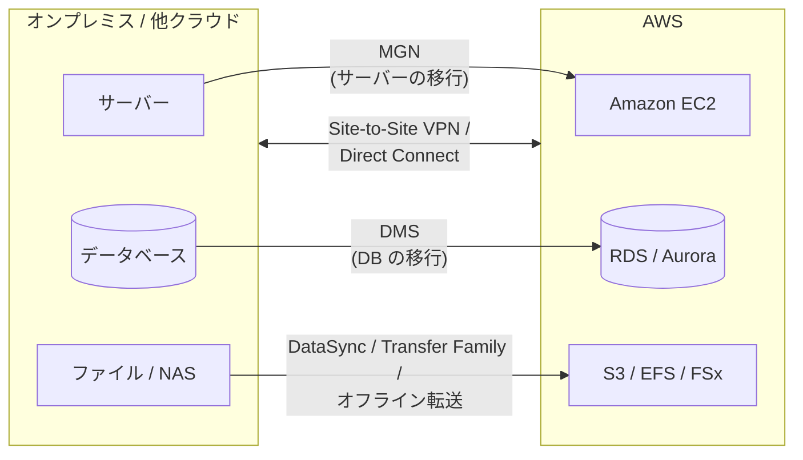
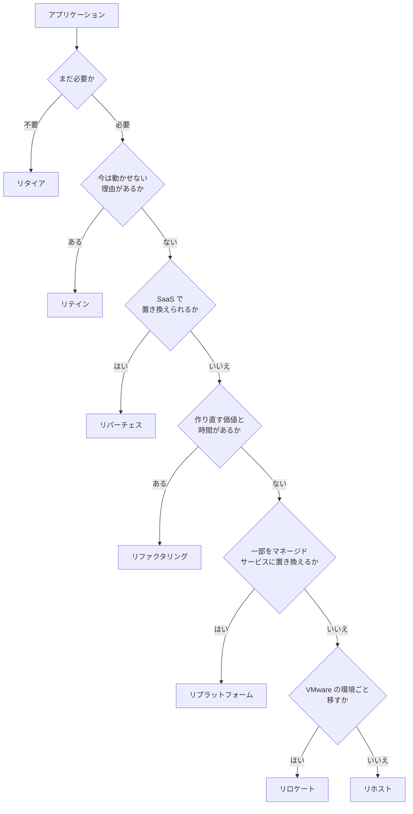
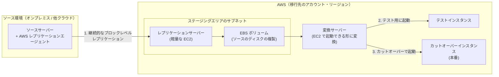
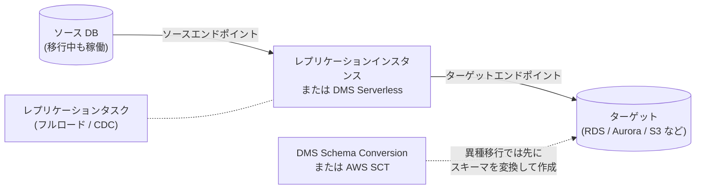
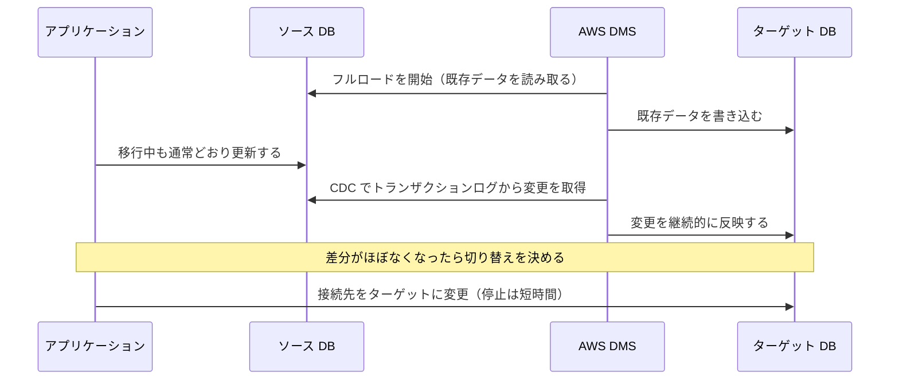
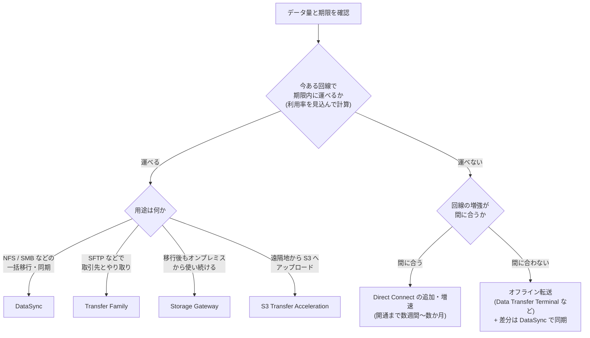

[ホーム](../README.md) > [Phase 2: アソシエイト](README.md) > 移行とハイブリッド接続

# 移行とハイブリッド接続

> **この章のゴール**
> - 移行の 7R を具体例とともに説明し、要件に合う戦略を選べる
> - 移行のプロセス（評価 → モビライズ → 移行とモダナイズ）と、各段階で使うツールの現状を説明できる
> - AWS Application Migration Service（MGN）と AWS DMS（フルロード + CDC、DMS Schema Conversion / AWS SCT）を使い分けられる
> - データ量・帯域・期限から転送時間を計算し、DataSync・Transfer Family・Storage Gateway・オフライン転送を選べる
> - Site-to-Site VPN と Direct Connect の違いを説明し、回復性と暗号化の要件を満たすハイブリッド接続を設計できる
> - Outposts、Amazon EVS、AWS Transform の位置付けを説明できる
>
> **対応試験**: SAA-C03（第2分野: 弾力性に優れたアーキテクチャの設計、第3分野: 高性能なアーキテクチャの設計 ほか）
> **目安時間**: 読む 180分 / 確認問題 40分 / 復習 20分

## この章の全体像

オンプレミスのシステムを AWS へ移すとき、考えるべきことは次の 3 つの問いに整理できます。

1. **何を、どの戦略で移すか** — 移行の 7R（1 節）と移行のプロセス（2 節）
2. **どうやって運ぶか** — サーバーは MGN（3 節）、データベースは DMS（4 節）、ファイルやオブジェクトは DataSync などの転送サービス（5・6 節）
3. **どうつなぐか** — Site-to-Site VPN と Direct Connect（7 節）

移行が終わっても、オンプレミスと AWS を併用する**ハイブリッド構成**が長く続くことは珍しくありません。そのため、この章では接続の設計（7 節）と、AWS をオンプレミスに広げる Outposts など（8 節）も扱います。移行を加速する生成 AI のサービス AWS Transform は 9 節で紹介します。組織全体での大規模移行やモダナイズの戦略は、Phase 3 の [移行とモダナイゼーション](../03-professional/07-migration-modernization.md) と [高度なネットワーク設計](../03-professional/04-advanced-networking.md) で深掘りします。

## 1. 移行戦略: 7R

### 1.1 アプリケーションごとに戦略を選ぶ

企業は数十〜数千のアプリケーションを持っており、すべてを同じやり方で移す必要はありません。まずアプリケーションの一覧（ポートフォリオ）を棚卸しし、**アプリケーションごとに 7 つの戦略（7R）のどれを使うか**を決めます。

一般に、手を加えないほど移行は速くリスクも低くなりますが、クラウドの利点（伸縮性、マネージドサービスによる運用負荷の削減、コストの最適化）は得にくくなります。逆に作り直すほど利点は大きくなりますが、時間とスキルが必要です。「まずリホストで早くデータセンターを出て、その後にモダナイズする」という 2 段階の進め方もよく使われます。

### 1.2 7R の一覧

| 戦略 | 意味 | 例 | 主なツール・サービス |
|---|---|---|---|
| リタイア（Retire） | 使われていないアプリケーションを廃止する | 利用者がほとんどいない旧社内ポータルを停止する | 評価フェーズでの棚卸し |
| リテイン（Retain） | 当面は移行せず、現状のまま維持する（後で再検討する） | ハードウェアを更新したばかり、メインフレームへの依存が強い、規制上すぐには動かせない | ― |
| リホスト（Rehost） | 変更を加えずにそのまま移す（リフトアンドシフト） | オンプレミスの仮想マシンや物理サーバーを EC2 インスタンスに移す | AWS Application Migration Service（MGN） |
| リロケート（Relocate） | ハイパーバイザーのレベルでそのまま移す。OS やアプリケーションの変更も、運用ツールの変更も不要 | VMware vSphere の環境を、同じ VMware の運用のまま AWS 上に移す | Amazon Elastic VMware Service（Amazon EVS） |
| リプラットフォーム（Replatform） | 中核のアーキテクチャは変えずに、一部をマネージドサービスなどに置き換える（リフト・ティンカー・アンド・シフト） | 自前で運用していた MySQL を Amazon RDS に移す。アプリケーションをコンテナにして ECS で動かす | DMS、RDS、Elastic Beanstalk、ECS |
| リパーチェス（Repurchase） | 別の製品、多くの場合は SaaS に乗り換える（ドロップアンドショップ） | 自社運用の CRM や人事システムを SaaS に切り替える | AWS Marketplace |
| リファクタリング / リアーキテクト（Refactor / Re-architect） | クラウドネイティブな設計に作り直す | モノリスをマイクロサービスに分割し、Lambda・DynamoDB・SQS で再構築する | Lambda、コンテナ、AWS Transform（コードのモダナイズ） |

### 1.3 判断の流れ

実際の判断は多くの要素を総合して行いますが、大まかには次の順に問いを立てると整理しやすくなります。

### 1.4 試験での問われ方

| 問題文のキーワード | 戦略 |
|---|---|
| 「コードを変更せずに」「できるだけ早く」「データセンターの契約期限が迫っている」 | リホスト |
| 「VMware の運用やツールを変えずに」「ハイパーバイザーごと」 | リロケート |
| 「データベースの管理負荷を減らしたい」「アプリケーションの変更は最小限」 | リプラットフォーム |
| 「SaaS に切り替える」「ライセンスモデルを変える」 | リパーチェス |
| 「スケーラビリティや俊敏性を大幅に高めたい」「マイクロサービス化」「サーバーレス化」 | リファクタリング |
| 「使われていない」「重複している」 | リタイア |
| 「当面は移行しない」「規制や依存関係のためすぐには動かせない」 | リテイン |

> [!NOTE]
> 古い教材では、リロケートを除いた「6R」で説明されていたり、リロケートの例として VMware Cloud on AWS が挙げられていたりします。考え方は同じです。現在、AWS のネイティブなサービスとして VMware 環境を VPC 内で動かすには Amazon EVS（8.3 節）を使います。

> [!TIP]
> **試験のポイント**: リホストとリプラットフォームの違いは「**移行のついでに何かをマネージドサービスに置き換えるかどうか**」です。「EC2 上に DB を移す」はリホスト、「RDS に移す」はリプラットフォームです。

## 2. 移行のプロセス: 評価 → モビライズ → 移行とモダナイズ

### 2.1 3 つのフェーズ

AWS は大規模な移行を、次の 3 つのフェーズで進めることを推奨しています。AWS の移行支援プログラムである **AWS Migration Acceleration Program（MAP）** も、この 3 フェーズに沿って方法論やパートナー、費用面の支援を提供しています。

| フェーズ | 目的 | 主な活動 | 主な成果物 |
|---|---|---|---|
| 評価（Assess） | 移行する理由と効果を明らかにする | 現行環境の棚卸し、TCO の比較、ビジネスケースの作成、組織の準備状況の評価 | ビジネスケース、移行の方向性 |
| モビライズ（Mobilize） | 大規模な移行の準備を整える | ランディングゾーン（マルチアカウント環境）の構築、ポートフォリオの詳細な分析と 7R の決定、アプリケーション間の依存関係の把握、スキルの育成、パイロット移行 | 移行計画（ウェーブ計画）、ランディングゾーン |
| 移行とモダナイズ（Migrate and Modernize） | 計画に沿って移行し、最適化する | ウェーブごとの移行・テスト・カットオーバー、運用への引き継ぎ、移行後の最適化とモダナイズ | 移行済みのワークロード |

ランディングゾーンの構築（AWS Control Tower など）は Phase 3 の [マルチアカウント戦略とガバナンス](../03-professional/02-multi-account-governance.md) で扱います。

### 2.2 評価と計画のツールの現状

以前は、評価と計画の定番ツールとして次の 2 つが使われていました。どちらも現在は新規のお客様の受け付けを終了しています（既存のお客様は引き続き利用できます）。

| サービス | 役割 | 状況 |
|---|---|---|
| AWS Application Discovery Service | オンプレミスのサーバーの構成、使用率、ネットワークの依存関係を収集する（エージェント型 / エージェントレスのコレクター） | 【新規受付終了】2025年10月に新規受付終了を発表 |
| AWS Migration Hub | 複数のツールによる移行の進捗を一元的に追跡する（戦略の推奨などの機能を含む） | 【新規受付終了】2025年11月に新規受付終了を発表 |

新規のお客様には、生成 AI のエージェントが評価・計画・移行・モダナイズを支援する **AWS Transform**（9 節）が推奨されています。最新の状況は AWS の [メンテナンス中のサービス一覧](https://docs.aws.amazon.com/general/latest/gr/maintenance_services.html) で確認できます。

> [!WARNING]
> **ひっかけ注意**: 試験や古い教材では、「オンプレミスのサーバーの構成と依存関係を調べる」→ Application Discovery Service、「移行の進捗を一元管理する」→ Migration Hub が正解として出題される可能性があります。現状は新規受付終了ですが、**役割は理解しておきましょう**。

### 2.3 ウェーブ計画とカットオーバー

- **ウェーブ**: 依存関係の強いアプリケーションをまとめて同じ時期に移すグループです。最初は影響の小さいアプリケーションでパイロット移行を行い、手順を磨いてから規模を広げます。
- **カットオーバー**: 本番の処理をオンプレミスから AWS へ切り替える作業です。事前に DNS の TTL を短くしておく、切り戻しの手順を決めておく、業務への影響が小さい時間帯を選ぶ、といった準備をします。

## 3. サーバーの移行: AWS Application Migration Service（MGN）

### 3.1 仕組み

**AWS Application Migration Service（MGN）** は、リホストのための主要なサービスです。ソースサーバーのディスクを AWS へ**継続的にブロックレベルでレプリケーション**し、準備ができたら EC2 インスタンスとして起動します。OS やアプリケーションの種類を問わずに移せるのは、ファイルや DB ではなく、ディスクのブロックをそのまま複製しているためです。

### 3.2 移行のライフサイクル

1. **レプリケーション**: ソースサーバーに AWS レプリケーションエージェントをインストールします（VMware vCenter の環境ではエージェントレスのレプリケーションも選べます）。初回の同期が終わると、以降は変更が継続的に複製されます。
2. **テスト**: テストインスタンスを起動して、AWS 上で動作を確認します。この間もソースサーバーは通常どおり稼働し、レプリケーションも続きます。
3. **カットオーバー**: ソースでの処理を止め、最後の変更が複製されたらカットオーバーインスタンスを起動し、DNS などの向き先を切り替えます。**業務が止まるのはこの切り替えの時間（分単位）だけ**です。
4. **ファイナライズ**: レプリケーションを止め、ステージングエリアのリソースを片付けます。ソースサーバーはアーカイブします。

### 3.3 特徴と押さえどころ

- **対応するソース**: 物理サーバー、VMware や Hyper-V などの仮想マシン、他のクラウドのサーバー（Windows / Linux）。AWS のリージョン間の移行にも使えます。
- **起動設定**: EC2 の起動テンプレートでインスタンスタイプやサブネットを指定し、適切なサイズ（ライトサイジング）で起動できます。起動後の処理（エージェントのインストールなど）を**起動後のアクション**として自動化することもできます。
- **料金**: 各ソースサーバーにつき 90 日間（2,160 時間）は MGN 自体の料金がかかりません。ただし、ステージングエリアの EC2 インスタンスや EBS ボリュームなどの料金は発生します（2026年9月時点）。
- **DRS との関係**: MGN と AWS Elastic Disaster Recovery（DRS）は、同じ継続的レプリケーションの技術を基にしています。目的が「一度きりの移行」なら MGN、「継続的な DR」なら DRS です（[高可用性と災害対策](15-high-availability-dr.md)）。

ほかの手段として、**VM Import/Export** は仮想マシンのイメージ（VMDK、VHD、OVA など）を AMI として取り込みます。継続的なレプリケーションはないため、少数のサーバーやイメージ単位での取り込みに向いています。

> [!TIP]
> **試験のポイント**: 「多数のサーバーを、最小限の停止時間でリホストしたい」「カットオーバー前に AWS 上でテストしたい」とあれば MGN です。

> [!WARNING]
> **ひっかけ注意**: 古い教材や問題には、MGN の前身である **AWS Server Migration Service（SMS）** や CloudEndure Migration が登場することがあります。SMS は 2022年に提供を終了しており、現在のサーバー移行は MGN が標準です。また「DataSync でサーバーを移行する」「DMS でサーバーを丸ごと移行する」といった選択肢は誤りです（DataSync はファイルとオブジェクト、DMS はデータベースのデータを移すサービスです）。

## 4. データベースの移行: AWS Database Migration Service（DMS）

### 4.1 構成要素

**AWS Database Migration Service（DMS）** は、ソースのデータベースを**稼働させたまま**、データをターゲットへ移行・同期するサービスです。

| 構成要素 | 役割 |
|---|---|
| レプリケーションインスタンス | データの読み取り・変換・書き込みを行うマネージドなインスタンス。高可用性のためにマルチ AZ 構成も選べる |
| DMS Serverless | インスタンスのサイズを決めずに、必要な容量（DMS キャパシティユニット、DCU）を自動で割り当て、負荷に応じてスケールする |
| エンドポイント | ソースとターゲットへの接続情報（エンジンの種類、ホスト、認証情報など） |
| レプリケーションタスク | どのテーブルを、どの移行タイプ（4.2 節）で移すかを定義する |

ターゲットには RDS、Aurora、Redshift、DynamoDB、S3、OpenSearch Service、Kinesis Data Streams などを指定できます。そのため DMS は移行だけでなく、業務 DB の変更をデータレイク（S3）へ継続的に流す用途にも使われます。

**DMS Serverless** を使うと、レプリケーションインスタンスのサイズ選びやスケーリングの運用が不要になります。最小と最大の DCU を指定しておけば、負荷に応じて容量が自動で調整されます。対応するソースとターゲットには条件があるため、[公式ドキュメント](https://docs.aws.amazon.com/dms/latest/userguide/Welcome.html) で確認してください。

### 4.2 移行タイプ: フルロードと CDC

| 移行タイプ | 動作 | 用途 |
|---|---|---|
| フルロード | タスク開始時点の既存データをすべてコピーする | 停止時間を取れる移行、初回のロード |
| フルロード + CDC | 既存データをコピーした後、変更データキャプチャ（CDC）で移行中の変更を継続的に反映する | 停止時間を最小にする移行（最後に短時間だけ書き込みを止めて切り替える） |
| CDC のみ | 指定した時点以降の変更だけを継続的に反映する | ネイティブツールなどで初回ロードをした後の同期、継続的なレプリケーション |

**CDC** は、ソース DB のトランザクションログ（Oracle の REDO ログ、MySQL のバイナリログ、PostgreSQL の WAL など）を読み取って変更を取り出す仕組みです。そのため、ソース側でログの設定（MySQL のバイナリログを ROW 形式にする、Oracle のサプリメンタルロギングを有効にするなど）が必要になります。

### 4.3 同種移行と異種移行

| 区分 | 例 | スキーマの変換 | 主な手段 |
|---|---|---|---|
| 同種移行（ホモジニアス） | オンプレミスの MySQL → Aurora MySQL、Oracle → RDS for Oracle | 不要（同じエンジン） | DMS、または各エンジンのネイティブツール（mysqldump、pg_dump、Oracle Data Pump、ネイティブのバックアップと復元など） |
| 異種移行（ヘテロジニアス） | Oracle → Aurora PostgreSQL、SQL Server → Aurora MySQL | 必要（データ型、ストアドプロシージャ、関数、トリガーなどを変換する） | DMS Schema Conversion または AWS SCT でスキーマを変換して作成し、DMS でデータを移行する |

### 4.4 DMS Schema Conversion と AWS SCT

異種移行では、データを移す前にスキーマとコードを変換する必要があります。そのための手段が 2 つあります。

| 項目 | DMS Schema Conversion | AWS Schema Conversion Tool（AWS SCT） |
|---|---|---|
| 提供形態 | DMS に組み込まれたマネージドな機能（コンソール / API から使う） | 自分の PC やサーバーにインストールするデスクトップアプリケーション |
| 主な用途 | 一般的な業務 DB 間のスキーマ変換（例: Oracle / SQL Server → PostgreSQL / MySQL 系） | より幅広い変換。データウェアハウスから Amazon Redshift への変換、アプリケーションのコードに埋め込まれた SQL の変換など |
| 評価レポート | 自動で変換できない箇所と、手作業の量の目安を示す | 同様（データベース移行評価レポート） |
| 運用の手間 | インストールや更新が不要 | 導入・更新と、実行環境の管理が必要 |

> [!TIP]
> **試験のポイント**: 「異なるエンジンへ、停止時間を最小にして移行」とあれば、**スキーマ変換（DMS Schema Conversion または AWS SCT）→ DMS のフルロード + CDC → 切り替え**の流れです。「インストール不要のマネージドな変換」なら DMS Schema Conversion、「データウェアハウスを Redshift へ」なら AWS SCT を選びます。

> [!WARNING]
> **ひっかけ注意**: DMS だけでは異種移行は完了しません。DMS がターゲットに作るのは、データの移行に必要な最小限のオブジェクト（テーブルや主キーなど）だけで、セカンダリインデックス、ストアドプロシージャ、トリガーなどは作成しません。同種移行でも、これらのオブジェクトはネイティブツールなどで別途移す必要があります。

### 4.5 設計上の注意

- **ネットワーク**: レプリケーションインスタンス（または DMS Serverless）は、ソースとターゲットの両方に接続できる必要があります。オンプレミスの DB がソースなら、Site-to-Site VPN や Direct Connect（7 節）で接続するのが一般的です。
- **大きな DB の初回ロード**: 数 TB 以上の DB で回線が細い場合は、ネイティブツールのバックアップを別の手段で運んで初回ロードを行い、その時点からの差分だけを DMS の CDC で同期する方法もあります。
- **検証**: DMS のデータ検証機能で、ソースとターゲットの行の一致を確認できます。切り替えの判断材料になります。

## 5. データ転送サービス

### 5.1 全体マップ

| サービス | 方式 | 主なプロトコル・入口 | 典型的な用途 |
|---|---|---|---|
| AWS DataSync | オンライン | NFS、SMB、HDFS、オブジェクトストレージ、他クラウド → S3 / EFS / FSx | 大量のファイルの移行と定期的な同期（検証・スケジュール付き） |
| AWS Transfer Family | オンライン | SFTP、FTPS、FTP、AS2 → S3 / EFS | 取引先とのファイルのやり取りを、既存のプロトコルのまま AWS へ |
| AWS Storage Gateway | オンライン（ハイブリッド） | NFS / SMB（S3 ファイルゲートウェイ）、iSCSI（ボリューム / テープ） | オンプレミスから AWS のストレージを使い続ける |
| S3 Transfer Acceleration | オンライン | HTTPS（S3 API） | 遠く離れた場所から 1 つの S3 バケットへの高速なアップロード |
| AWS Data Transfer Terminal | オフライン（拠点に持ち込む） | 自社のストレージデバイスを AWS の拠点で接続 | ネットワークでは時間がかかりすぎる大量データの初期移行 |
| AWS Snowball Edge | オフライン（デバイスを配送） | AWS から届くデバイスにコピーして返送 | 【新規受付終了】既存のお客様のみ。試験では今も登場する |

### 5.2 AWS DataSync

**AWS DataSync** は、ストレージ間の大量のデータを**オンラインで高速かつ安全に**移すマネージドサービスです。

- **仕組み**: オンプレミスに DataSync エージェント（仮想マシン）を配置し、NFS / SMB の共有、HDFS、オブジェクトストレージからデータを読み取って、TLS で暗号化しながら AWS に送ります。インターネット経由のほか、VPN や Direct Connect を通し、VPC エンドポイントを使ってプライベートに転送することもできます。
- **転送先**: S3（任意のストレージクラスに直接保存できる）、EFS、FSx（Windows File Server / Lustre / OpenZFS / NetApp ONTAP）。
- **機能**: 変更されたファイルだけを送る差分転送、転送後のデータの整合性の検証、スケジュール実行、帯域の上限設定、フィルター、メタデータ（アクセス許可やタイムスタンプ）の保持。
- **AWS のストレージ間**（例: 別リージョンの EFS から EFS へ、S3 から EFS へ）の転送では、エージェントは不要です。他のクラウドのオブジェクトストレージからの移行にも対応しています。

> [!TIP]
> **試験のポイント**: 「NFS / SMB のファイルサーバーから S3 や EFS へ大量のファイルをオンラインで移行」「転送の検証」「定期的な同期」「帯域の制御」とあれば DataSync です。移行後もオンプレミスのアプリケーションからアクセスし続けるなら、Storage Gateway（5.4 節）を検討します。

### 5.3 AWS Transfer Family

**AWS Transfer Family** は、SFTP・FTPS・FTP・AS2 のサーバーをフルマネージドで提供し、受け取ったファイルを S3 や EFS に直接保存するサービスです。取引先が使い慣れたクライアントと手順のまま、送り先だけを AWS に移せます。

- **エンドポイント**: インターネットに公開するもの、VPC 内に置くもの（インターネット向け / 内部向け）を選べます。暗号化されない FTP は、VPC 内の内部向けエンドポイントでのみ使えます。Route 53 で独自のホスト名を割り当てられます。
- **認証**: サービスで管理するユーザー（SFTP の SSH 公開鍵）、AWS Directory Service for Microsoft Active Directory、Lambda や API Gateway を使った独自の ID プロバイダー。
- **移行のポイント**: 既存の SFTP サーバーのホスト鍵を取り込めるため、接続先を切り替えても取引先のクライアントに警告が出ないようにできます。受信後の処理（ファイルのコピー、タグ付け、復号など）は、マネージドワークフローで自動化できます。

### 5.4 AWS Storage Gateway（再掲）

Storage Gateway の詳細は [ブロック・ファイルストレージ](06-ebs-efs-fsx.md) で学びました。移行とハイブリッドの観点で整理し直します。

| タイプ | オンプレミス側のインターフェイス | AWS 側の保存先 | 移行・ハイブリッドでの使いどころ |
|---|---|---|---|
| S3 ファイルゲートウェイ | NFS / SMB | S3（ファイルは 1 対 1 でオブジェクトとして保存される） | 共有フォルダのデータを S3 に集め、クラウド側の分析などにも使う |
| ボリュームゲートウェイ（キャッシュ型 / 保管型） | iSCSI のブロックデバイス | S3（EBS スナップショットとして取得できる） | オンプレミスのサーバーのディスクのバックアップや DR |
| テープゲートウェイ | iSCSI の仮想テープライブラリ（VTL） | S3、S3 Glacier Flexible Retrieval / S3 Glacier Deep Archive | 既存のバックアップソフトウェアのまま、物理テープを廃止する |

Amazon FSx File Gateway は、2024年10月28日以降、新規のお客様は利用できません。オンプレミスから FSx for Windows File Server を使いたい場合は、Direct Connect や VPN 経由で直接アクセスする構成などを検討します。

### 5.5 S3 Transfer Acceleration

**S3 Transfer Acceleration** は、CloudFront のエッジロケーションを入口にして、そこから AWS のバックボーンネットワーク経由でバケットのあるリージョンへデータを運ぶことで、**遠距離からの S3 へのアップロードを速くする**機能です（[Amazon S3](05-s3.md)）。

- バケット単位で有効にし、専用のエンドポイント（`バケット名.s3-accelerate.amazonaws.com`）を使います。バケット名は DNS に準拠し、ピリオドを含まない必要があります。
- 高速化の効果があった転送にだけ、追加料金がかかります。
- 大きなファイルはマルチパートアップロードと組み合わせます（1 回の PUT で送れるのは 5 GB まで）。
- **効果が出ないケース**: ボトルネックがオンプレミス側の回線そのものにある場合や、バケットと同じリージョンの近くから送る場合は、ほとんど速くなりません。

### 5.6 オフライン転送: Snow Family の現状と AWS Data Transfer Terminal

回線で運ぶと期限に間に合わないほど大量のデータは、物理的に運ぶ**オフライン転送**が選択肢になります。その代表だった AWS Snow Family の現状は次のとおりです。

| サービス | 状況 |
|---|---|
| AWS Snowcone、旧世代の AWS Snowball Edge | 2024年11月に提供終了 |
| AWS Snowball Edge（すべてのデバイス） | 【新規受付終了】2025年11月7日から新規のお客様の受け付けを終了（2025年10月に発表）。既存のお客様は引き続き利用できる |
| AWS Snowmobile（トラックで運ぶエクサバイト級のサービス） | 2024年に提供終了 |

新規のお客様には、次の代替手段が案内されています。

- **AWS DataSync**: オンラインで転送する（6 節で転送時間を見積もる）
- **AWS Data Transfer Terminal**: AWS が用意した物理的な拠点に、**自社のストレージデバイスを持ち込み**、高速なネットワーク接続で S3 などへ直接アップロードするサービスです（2024年12月発表）。マネジメントコンソールで利用枠を予約して使います。拠点は東京を含む世界の複数の都市にあります（2026年9月時点。最新の拠点は [公式ページ](https://aws.amazon.com/data-transfer-terminal/) で確認してください）。
- **パートナーのデバイス**（AWS Marketplace で提供されるもの）
- エッジでの処理が目的なら **AWS Outposts**（8.1 節）

> [!WARNING]
> **ひっかけ注意**: SAA-C03 の問題や古い教材では、今でも「回線が細く、数十 TB のデータを 1 週間以内に移行 → Snowball Edge」「ネットワークのない現場でデータを前処理 → Snowball Edge（Compute Optimized）」「エクサバイト級 → Snowmobile」が正解として出題される可能性があります。「ネットワーク転送が期限に間に合わないときはオフライン転送を選ぶ」という**考え方**を理解したうえで、現在は新規のお客様が Snowball Edge を使えないことも押さえておきましょう。

## 6. データ量 × 帯域 × 期限で選ぶ

### 6.1 転送時間の計算

転送手段を選ぶ前に、まず「今ある回線で、期限内に転送できるか」を計算します。

- 転送時間（秒）= データ量（ビット）÷ 実効帯域（bps）
- 実効帯域 = 回線の帯域 × 移行に使える割合（利用率）

**計算例**: 100 TB のデータを、1 Gbps の回線の 80% を使って転送する場合

1. データ量をビットに換算します: 100 TB = 100 × 10¹² バイト × 8 = 8 × 10¹⁴ ビット
2. 実効帯域を求めます: 1 Gbps × 0.8 = 8 × 10⁸ bps
3. 転送時間を求めます: 8 × 10¹⁴ ÷ (8 × 10⁸) = 10⁶ 秒 = 1,000,000 秒
4. 日数に換算します: 1,000,000 ÷ 86,400 ≈ **約 11.6 日**

覚えやすい目安として、**1 Gbps の回線を 80% 使うと 1 日に約 8.64 TB**（毎秒 100 MB）運べます。つまり、転送日数 ≈ データ量（TB）÷（8.64 × 帯域（Gbps））です。

> [!NOTE]
> ここでは 1 TB = 10¹² バイトとして計算しています。1 TiB（2⁴⁰ バイト）で数えると、100 TiB は約 12.7 日になります。実際には、プロトコルのオーバーヘッド、小さなファイルが大量にある場合の処理時間、ストレージの読み出し性能、業務の通信との共用などで遅くなるため、**余裕を持った計画**にします。

### 6.2 早見表（回線の 80% を使う場合）

| データ量 | 100 Mbps | 1 Gbps | 10 Gbps |
|---|---|---|---|
| 1 TB | 約 1.2 日（約 28 時間） | 約 2.8 時間 | 約 17 分 |
| 10 TB | 約 11.6 日 | 約 1.2 日 | 約 2.8 時間 |
| 100 TB | 約 116 日 | 約 11.6 日 | 約 1.2 日 |
| 1 PB | 約 3.2 年 | 約 116 日 | 約 11.6 日 |

データ量が 10 倍になるか、帯域が 10 分の 1 になると、日数は 10 倍になります。この表の数字の並びを覚えておくと、試験で素早く判断できます。

### 6.3 判断の流れ

インターネットから AWS へのデータ転送（イン）にはデータ転送料金がかかりませんが、DataSync などのサービスには転送量に応じた料金があります。また、移行中もデータが更新され続ける場合は、**初回の一括転送と、その後の差分の同期**を分けて計画します。

> [!TIP]
> **試験のポイント**: 計算問題では「**TB → ビット（× 8）**」と「**利用率**」を忘れないようにします。計算した結果、既存の回線で期限に間に合うなら、オフライン転送や回線の増強は不要です（コストと手間が増えるだけの選択肢は誤りになります）。

