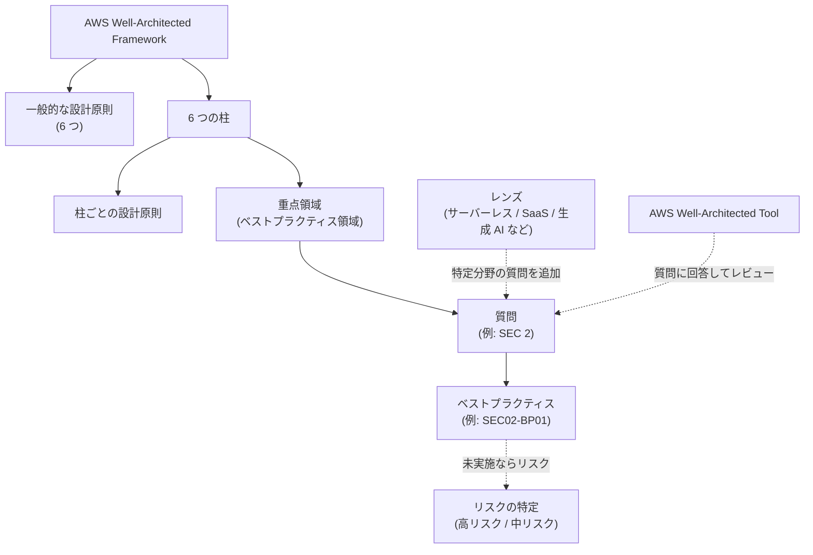
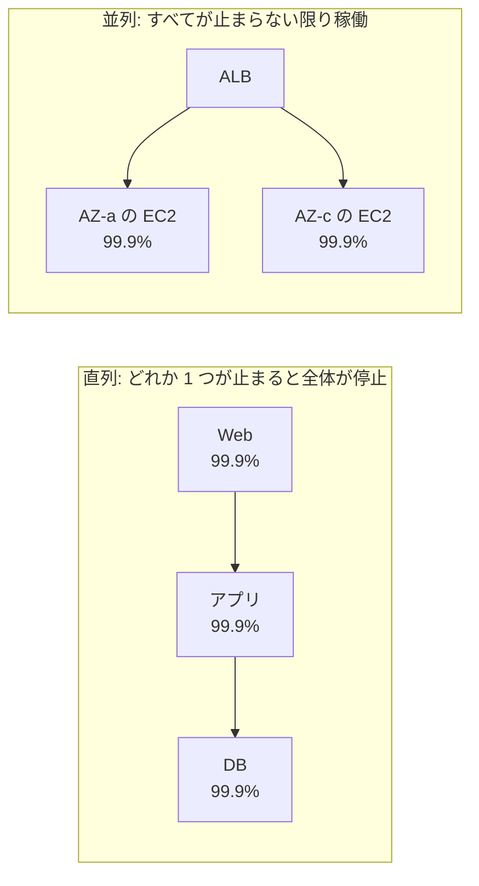
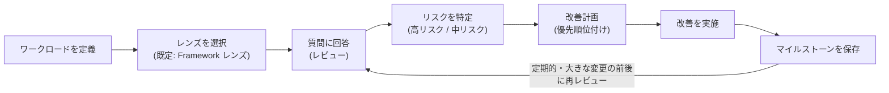

[ホーム](../README.md) > [Phase 2: アソシエイト](README.md) > AWS Well-Architected Framework

# AWS Well-Architected Framework

> **この章のゴール**
> - Well-Architected Framework の構成要素（柱・設計原則・重点領域・質問・ベストプラクティス・レンズ）を説明できる
> - 6 つの柱それぞれの設計原則をすべて挙げ、代表的な AWS サービスと結び付けられる
> - SAA-C03 の問題文の制約（「運用上のオーバーヘッドが最も少ない」など）を柱の考え方で読み解ける
> - AWS Well-Architected Tool とレンズの使いどころを説明できる
> - 柱の間のトレードオフを要件から判断できる
>
> **対応試験**: SAA-C03（全ドメイン。第1〜4分野は セキュリティ・信頼性・パフォーマンス効率・コスト最適化 の各柱にほぼ対応）
> **目安時間**: 読む 140分 / 確認問題 40分

## この章の全体像

これまでの章では、IAM・VPC・EC2・S3・データベースなど、個々のサービスを学んできました。
しかし実際の設計では「どのサービスを使えるか」よりも、「その組み合わせは良い設計か」を判断する力が問われます。
AWS Well-Architected Framework（以下 Well-Architected）は、その判断のための **共通の物差し** です。

SAA-C03 の試験ガイドは冒頭で、この試験が「AWS Well-Architected Framework に基づいてソリューションを設計する能力」を検証すると明記しています。
つまり SAA の正解は、突き詰めると「要件を満たし、かつ Well-Architected のベストプラクティスに最も沿った選択肢」です。
この章で柱と設計原則を体系的に押さえると、これまでの章の知識が「なぜその構成が正解なのか」という一本の筋でつながります。

## 1. フレームワークの構成

### 1.1 Well-Architected とは

Well-Architected は、AWS のソリューションアーキテクトが多数の顧客のシステムをレビューしてきた経験を、設計の原則とベストプラクティスとして体系化したものです。
2015 年にホワイトペーパーとして公開され、その後も継続的に改訂されています。

- 当初は 5 つの柱でしたが、2021 年 12 月に **持続可能性** の柱が加わり、現在は **6 つの柱** です。
- 最新のフレームワーク改訂は 2024 年 11 月 6 日です（2026年9月時点）。
- 公式ドキュメント: [AWS Well-Architected Framework](https://docs.aws.amazon.com/wellarchitected/latest/framework/welcome.html)

6 つの柱は次のとおりです。

| 柱（日本語） | 英語名 | ひとことで言うと | SAA-C03 との主な対応 |
|---|---|---|---|
| 運用上の優秀性 | Operational Excellence | 効果的に運用し、継続的に改善する | 全分野（「運用上のオーバーヘッド」） |
| セキュリティ | Security | データ・システム・資産を守る | 第1分野 セキュアなアーキテクチャの設計 |
| 信頼性 | Reliability | 期待どおりに正しく動き続け、障害から復旧する | 第2分野 弾力性に優れたアーキテクチャの設計 |
| パフォーマンス効率 | Performance Efficiency | リソースを効率よく使って要件を満たす | 第3分野 高性能なアーキテクチャの設計 |
| コスト最適化 | Cost Optimization | 最も低い価格でビジネス価値を提供する | 第4分野 コストを最適化したアーキテクチャの設計 |
| 持続可能性 | Sustainability | 環境への影響を最小化する | 全分野（効率化の選択肢として登場） |

### 1.2 構成要素

Well-Architected は、次の要素が階層的に組み合わさっています。

| 要素 | 内容 | 例 |
|---|---|---|
| 柱（Pillar） | 設計の品質を評価する 6 つの観点 | セキュリティ、信頼性 |
| 一般的な設計原則 | すべての柱に共通する、クラウドならではの設計の考え方 | キャパシティニーズの推測をやめる |
| 柱ごとの設計原則 | 各柱で目指すべき方向性 | 障害から自動的に復旧する（信頼性） |
| 重点領域（ベストプラクティス領域） | 柱をさらに分けたテーマ | 信頼性: 基盤 / ワークロードアーキテクチャ / 変更管理 / 障害管理 |
| 質問 | レビューで回答する問い。柱ごとに番号が付く | SEC 2: 人とマシンの ID をどのように管理していますか |
| ベストプラクティス | 各質問に対する推奨事項。ID が付く | SEC02-BP01: 強力なサインインメカニズムを使用する |
| レンズ | 特定の技術・業界向けに追加された質問とベストプラクティス | サーバーレス、SaaS、生成 AI、エージェント AI |
| リスク | ベストプラクティスを実施していないことによる問題 | 高リスクの問題（HRI）/ 中リスクの問題（MRI） |

ベストプラクティスの ID は「柱の略称 + 質問番号 + BP 番号」です。
たとえば `REL09-BP03` は「信頼性の柱・質問 9（データのバックアップ）・3 番目のベストプラクティス」を表します。
試験で ID が問われることはありませんが、公式ドキュメントを読むときの手がかりになります。

### 1.3 レビューの考え方 ― 監査ではなく「対話」

Well-Architected レビューは、合否を判定する監査ではありません。
設計チームと一緒に質問に答えながら、**どこにリスクがあり、どれから直すべきか** を明らかにする対話の場です。

- すべてのベストプラクティスを満たす必要はありません。事業上の理由で、リスクを理解したうえで意図的に受け入れることもあります。
- 大切なのは、トレードオフを「知らないうちに」ではなく「意識して」選ぶことです。
- 一度きりではなく、大きな変更の前後や定期的（例: 四半期ごと）に繰り返します。
- 担当者を責めない文化（ブレームレス）で行います。

### 1.4 SAA-C03 の分野との対応

1.1 節の表のとおり、SAA の 4 分野は 6 つの柱のうち 4 つにほぼ一対一で対応します。
残りの 2 つ（運用上の優秀性・持続可能性）は独立した分野にはなっていませんが、「運用上のオーバーヘッドが最も少ない」「マネージドサービスを使う」「Graviton を使う」といった形で、あらゆる分野の問題に制約条件として現れます。

> [!TIP]
> **試験のポイント**: 問題文の最後の一文（「最もコスト効率が高いのはどれですか」など）は、**どの柱を最優先するか** の指定です。
> 同じシナリオでも、「最も高い可用性」なら信頼性、「最もコスト効率が高い」ならコスト最適化の観点で正解が変わります。

## 2. 一般的な設計原則

Well-Architected には、すべての柱に共通する 6 つの一般的な設計原則があります。
どれも「オンプレミスでは難しかったことが、クラウドでは当たり前にできる」という発想の転換です。

| 設計原則 | オンプレミスでは… | クラウドでは… | SAA で対応する選択肢 |
|---|---|---|---|
| キャパシティニーズの推測をやめる（Stop guessing your capacity needs） | 数年先のピークを見込んで調達し、過剰または不足になる | 必要な分だけ使い、需要に合わせて自動で増減する | Auto Scaling、サーバーレス、DynamoDB オンデマンド |
| 本番規模でシステムをテストする（Test systems at production scale） | 本番と同規模の検証環境は高価で用意できない | 本番相当の環境を必要な時間だけ作り、終わったら削除する | CloudFormation で環境を複製し、テスト後に削除 |
| アーキテクチャの実験を念頭に置いて自動化する（Automate with architectural experimentation in mind） | 手作業の構築は再現性が低く、やり直しが高くつく | IaC で低コストに作り直し、構成を比較・変更の追跡ができる | CloudFormation、AWS CDK、CI/CD |
| 進化するアーキテクチャを検討する（Consider evolutionary architectures） | 初期の設計判断が長期間固定される | 要件や技術の変化に合わせて設計を変え続けられる | 疎結合化、マネージドサービスへの段階的移行 |
| データに基づいてアーキテクチャを決定する（Drive architectures using data） | 勘や経験で判断しがち | メトリクスやログを収集し、事実に基づいて判断する | CloudWatch、AWS Compute Optimizer、AWS X-Ray |
| ゲームデーを通じて改善する（Improve through game days） | 本番規模の障害訓練は難しい | 障害やイベントを意図的に起こし、手順と仕組みを検証する | AWS Fault Injection Service（FIS）、DR 訓練 |

> [!NOTE]
> 設計原則の英語表現は改訂のたびに少しずつ変わっています（例: 古い版では「Automate to make architectural experimentation easier」「Allow for evolutionary architectures」）。
> 試験で問われるのは表現そのものではなく **考え方** です。

## 3. 運用上の優秀性（Operational Excellence）

### 3.1 定義と重点領域

運用上の優秀性とは、**ワークロードを効果的に開発・運用し、運用状況を把握し、ビジネス価値を提供するためのプロセスと手順を継続的に改善する能力** です。
「障害が起きないようにする」だけでなく、「変更を安全に素早く届け、起きたことから学び続ける」ことまでを含みます。

重点領域は次の 4 つです。

| 重点領域 | 内容 |
|---|---|
| 組織（Organization） | 優先順位の決定、責任と所有権の明確化、運用モデル、組織文化 |
| 準備（Prepare） | オブザーバビリティの設計、IaC、デプロイのリスク軽減、運用準備状況の確認 |
| 運用（Operate） | ワークロードと運用の状態の把握、イベントへの対応 |
| 進化（Evolve） | 事後分析と継続的な改善、学びの共有 |

### 3.2 設計原則（8 つ）

| # | 設計原則 | 意味 | AWS での具体例 |
|---|---|---|---|
| 1 | ビジネス成果を中心にチームを編成する（Organize teams around business outcomes） | チームの目標をビジネス成果に結び付け、経営層の支援と役割分担を明確にする | 運用モデルの定義、タグによる所有者の明示 |
| 2 | オブザーバビリティを実装して実用的なインサイトを得る（Implement observability for actionable insights） | KPI・メトリクス・ログ・トレースで状態を把握し、行動につなげる | Amazon CloudWatch、AWS X-Ray、CloudWatch Application Signals |
| 3 | 可能な場合は安全に自動化する（Safely automate where possible） | インフラと運用手順をコードで定義し、ガードレール（承認・レート制御・しきい値）付きで自動化する | AWS CloudFormation、Systems Manager Automation |
| 4 | 小規模かつ可逆的な変更を頻繁に行う（Make frequent, small, reversible changes） | 小さく頻繁に変更し、失敗したらすぐ戻せるようにする | CI/CD、ブルー/グリーンデプロイ、カナリアリリース、AWS AppConfig の機能フラグ |
| 5 | オペレーション手順を頻繁に改善する（Refine operations procedures frequently） | ランブックやプレイブックを定期的に見直し、ワークロードの変化に追従させる | Systems Manager ドキュメント、ゲームデーでの検証 |
| 6 | 障害を予測する（Anticipate failure） | 障害シナリオを洗い出し、対応手順と影響を事前にテストする | AWS FIS、プレモーテム（事前の障害想定） |
| 7 | 運用上のイベントとメトリクスから学ぶ（Learn from all operational events and metrics） | インシデントやメトリクスから教訓を引き出し、チームや組織で共有する | 事後分析（非難しない振り返り）、CloudWatch Logs Insights |
| 8 | マネージドサービスを使用する（Use managed services） | 運用負荷を AWS に移し、チームは価値を生む業務に集中する | Amazon RDS、AWS Lambda、AWS Fargate |

> [!NOTE]
> 運用上の優秀性の設計原則は **2023 年の改訂で 5 つから 8 つに再編** されました。
> 古い教材では「運用をコードとして実行する（Perform operations as code）」「運用上の障害すべてから学ぶ（Learn from all operational failures）」などの 5 つが紹介されています。
> 「運用をコードとして実行する」の考え方は、現在は「可能な場合は安全に自動化する」に含まれています。

### 3.3 代表的なベストプラクティスと AWS サービス

| 重点領域 | ベストプラクティス | 対応する AWS サービス・機能 |
|---|---|---|
| 組織 | ワークロードとリソースの所有者を明確にする | タグ付け、AWS Organizations |
| 準備 | インフラをコードで定義し、環境を再現可能にする | AWS CloudFormation、AWS CDK |
| 準備 | デプロイを自動化し、段階的に展開する | AWS CodePipeline、AWS CodeBuild、AWS CodeDeploy |
| 準備 | 手順をランブック（定型作業）とプレイブック（調査手順）として整備し、自動化する | Systems Manager Automation、Systems Manager ドキュメント |
| 運用 | メトリクス・ログ・トレースを収集し、アラームとダッシュボードで可視化する | CloudWatch（メトリクス・ログ・アラーム・ダッシュボード）、X-Ray |
| 運用 | イベントに自動で対応する | Amazon EventBridge + AWS Lambda、Systems Manager Automation |
| 運用 | 運用上の課題を記録・追跡する | Systems Manager OpsCenter |
| 進化 | 変更と構成の履歴を記録し、振り返りに使う | AWS CloudTrail、AWS Config |

> [!WARNING]
> **ひっかけ注意**: Systems Manager の Incident Manager と Change Manager は、2025 年 11 月に新規受付の終了が発表されています。
> 新しい設計でインシデント管理や変更管理を問われたら、OpsCenter・Automation・パートナー製品などを検討します（詳しくは [監視と運用管理](13-monitoring-management.md)）。

### 3.4 SAA での問われ方

運用上の優秀性は独立した分野ではありませんが、SAA で最もよく見る制約「**運用上のオーバーヘッドが最も少ない**」は、この柱の考え方そのものです。

- EC2 に自前でソフトウェアを入れて運用する選択肢より、同じことができるマネージドサービスが正解になりやすい
- 手作業の手順より、自動化（EventBridge のルール、Systems Manager Automation、Auto Scaling）が正解になりやすい
- 手作業による環境構築より、IaC（CloudFormation）が正解になりやすい

> [!TIP]
> **試験のポイント**: 選択肢に「EC2 インスタンスにスクリプトを配置して cron で定期実行する」「カスタムアプリケーションを開発する」「手動で」があれば、同じ要件を **マネージドサービスの設定だけで** 満たす選択肢がないか探します。
> 例: 定期実行 → EventBridge Scheduler、ファイル到着時の処理 → S3 イベント通知 + Lambda、パッチ適用 → Systems Manager Patch Manager。

> [!WARNING]
> **ひっかけ注意**: 「運用上のオーバーヘッドが最も少ない」は「最もコストが低い」と同じではありません。
> 制約が運用負荷なら、多少高くてもマネージドサービスを選びます。逆に制約がコストなら、運用負荷が多少増えても安い構成が正解になることがあります。

## 4. セキュリティ（Security）

### 4.1 定義と重点領域

セキュリティとは、**データ・システム・資産を保護し、クラウドテクノロジーを活用してセキュリティ体制を向上させる能力** です。
前提として [責任共有モデル](../01-foundations/07-security-and-compliance.md) があり、クラウド「の」セキュリティは AWS、クラウド「における」セキュリティは利用者の責任です。

重点領域は次の 7 つです。

| 重点領域 | 内容 |
|---|---|
| セキュリティの基盤（Security foundations） | アカウントの分離、ガードレール、脅威モデリング、最新情報の把握 |
| ID とアクセス管理（Identity and access management） | 人とマシンの認証、最小権限の認可 |
| 検出（Detection） | ログ・構成・脅威の検出と調査 |
| インフラストラクチャ保護（Infrastructure protection） | ネットワークとコンピューティングの多層防御 |
| データ保護（Data protection） | データ分類、保管中・転送中の暗号化 |
| インシデント対応（Incident response） | 準備、シミュレーション、自動対応、フォレンジック |
| アプリケーションセキュリティ（Application security） | 設計・開発・デプロイ全体でのセキュリティテストと脆弱性管理 |

### 4.2 設計原則（7 つ）

| # | 設計原則 | 意味 | AWS での具体例 |
|---|---|---|---|
| 1 | 強力なアイデンティティ基盤を実装する（Implement a strong identity foundation） | 最小権限と職務分掌を徹底し、ID を一元管理し、長期的な認証情報をなくす | IAM ロール、AWS IAM Identity Center、IAM Access Analyzer |
| 2 | トレーサビリティを維持する（Maintain traceability） | すべての操作と変更を記録・監視し、自動でアラートと対応を行う | AWS CloudTrail、AWS Config、Amazon CloudWatch |
| 3 | すべてのレイヤーでセキュリティを適用する（Apply security at all layers） | エッジ・VPC・サブネット・ロードバランサー・インスタンス・OS・アプリケーションのすべてで防御する（多層防御） | AWS WAF、AWS Shield、セキュリティグループ、ネットワーク ACL |
| 4 | セキュリティのベストプラクティスを自動化する（Automate security best practices） | セキュリティ制御をコードで定義し、検出と修復を自動化する | AWS Config ルールと自動修復、AWS Security Hub CSPM、EventBridge |
| 5 | 転送中および保管中のデータを保護する（Protect data in transit and at rest） | データを機密度で分類し、暗号化・トークン化・アクセス制御を適用する | AWS KMS、AWS Certificate Manager（ACM）、TLS |
| 6 | 人をデータから遠ざける（Keep people away from data） | データへの直接アクセスや手作業を減らす仕組みを作り、誤操作や漏えいのリスクを下げる | 自動化されたランブック、ダッシュボード、Session Manager（SSH 鍵不要） |
| 7 | セキュリティイベントに備える（Prepare for security events） | インシデント対応の計画と演習を行い、検出・調査・復旧を自動化する | Amazon GuardDuty、Amazon Detective、EventBridge による自動隔離 |

### 4.3 代表的なベストプラクティスと AWS サービス

| 重点領域 | ベストプラクティス | 対応する AWS サービス・機能 |
|---|---|---|
| セキュリティの基盤 | ワークロードをアカウントで分離し、組織全体にガードレールを設定する | AWS Organizations（SCP）、AWS Control Tower |
| ID とアクセス管理 | 一時的な認証情報を使い、人は ID プロバイダー経由でサインインする | IAM ロール、IAM Identity Center |
| ID とアクセス管理 | 最小権限を付与し、未使用の権限を見直す | IAM ポリシー、IAM Access Analyzer |
| 検出 | API 操作・構成変更・脅威を検出し、一元的に確認する | CloudTrail、Config、GuardDuty、Security Hub CSPM |
| インフラストラクチャ保護 | ネットワークを階層化し、必要な通信だけを許可する | VPC、セキュリティグループ、ネットワーク ACL、AWS Network Firewall、VPC エンドポイント |
| インフラストラクチャ保護 | エッジで攻撃を防ぐ | AWS WAF、AWS Shield、Amazon CloudFront |
| データ保護 | 機密データを見つけて分類する | Amazon Macie |
| データ保護 | 保管中・転送中のデータを暗号化する | KMS、ACM、S3 のデフォルト暗号化 |
| インシデント対応 | 調査と隔離の手順を自動化し、演習する | Detective、EventBridge + Lambda、EBS スナップショットによる証拠保全 |
| アプリケーションセキュリティ | 脆弱性を継続的にスキャンし、シークレットを安全に管理する | Amazon Inspector、AWS Secrets Manager |

### 4.4 SAA での問われ方

セキュリティは SAA-C03 で最も配点が大きい分野（第1分野 30%）に対応します。
問題文では、設計原則が次のような要件として現れます。

| 問題文の表現 | 対応する設計原則 | 正解になりやすい選択肢 |
|---|---|---|
| 「認証情報をコードや設定ファイルに保存しない」 | 強力なアイデンティティ基盤 | IAM ロール、Secrets Manager |
| 「誰がいつ操作したかを監査したい」 | トレーサビリティの維持 | CloudTrail（証跡を S3 に保存） |
| 「インターネットを経由せずに S3 にアクセスしたい」 | すべてのレイヤーでセキュリティを適用 | ゲートウェイ型 VPC エンドポイント + バケットポリシー |
| 「設定ミスを自動で検出して修復したい」 | セキュリティのベストプラクティスを自動化 | Config ルール + Systems Manager Automation による自動修復 |
| 「暗号化キーの使用を監査・制御したい」 | 転送中および保管中のデータを保護 | SSE-KMS（カスタマーマネージドキー） |
| 「運用者が本番データに直接触れないようにしたい」 | 人をデータから遠ざける | 自動化されたランブック、Session Manager |

> [!TIP]
> **試験のポイント**: 「最小権限」「一時的な認証情報」「多層防御」「暗号化」の 4 つは、セキュリティ問題の判断基準の大半をカバーします。
> 迷ったら「長期的なアクセスキーを配布する」「0.0.0.0/0 に広く開ける」「暗号化しない」選択肢から消去します。

> [!WARNING]
> **ひっかけ注意**: 「CloudTrail でログを取る」はトレーサビリティを高めますが、それだけでは人がデータに直接触れる状態は解消されません。
> 「人をデータから遠ざける」が要件なら、直接アクセスそのものをなくす仕組み（自動化・ダッシュボード）を選びます。

## 5. 信頼性（Reliability）

### 5.1 定義と重点領域

信頼性とは、**ワークロードが意図された機能を、期待どおりに正しく一貫して実行する能力** です。
ワークロードのライフサイクル全体を通じて運用し、テストすることも含みます。

似た言葉に「可用性」と「回復力（レジリエンス）」があります。

- **可用性**: 使える状態にある時間の割合です。99.9% なら年間の停止は約 8.76 時間、99.99% なら約 52.6 分です。
- **回復力**: 障害や負荷の変化から復旧し、影響を抑える能力です。回復力を高めた結果として、可用性が上がります。

重点領域は次の 4 つです。

| 重点領域 | 内容 |
|---|---|
| 基盤（Foundations） | サービスクォータ（上限）の管理、ネットワークトポロジー（CIDR の設計、冗長な接続） |
| ワークロードアーキテクチャ | サービス構成（疎結合・マイクロサービス）、分散システムでの障害の予防と緩和 |
| 変更管理（Change management） | 監視、需要に合わせた適応、変更の自動化 |
| 障害管理（Failure management） | バックアップ、障害分離、障害への耐性、テスト、災害対策（DR） |

### 5.2 なぜ「水平スケール」と「マルチ AZ」なのか ― 可用性の計算

独立した部品を **直列** につなぐと、全体の可用性は掛け算で下がります。
**並列**（冗長化）にすると、すべてが同時に止まらない限り動き続けるため、可用性は大きく上がります。

- 直列: 0.999 × 0.999 × 0.999 ≒ **99.7%**（年間約 26 時間停止）
- 並列（2 台）: 1 −（0.001 × 0.001）= **99.9999%**（障害が互いに独立している場合）

「障害が互いに独立している」ことが重要です。同じ AZ に 2 台置いても、AZ 全体の障害では同時に止まります。
だからこそ AWS では **複数の AZ にまたがって** 冗長化します。

### 5.3 設計原則（5 つ）

| # | 設計原則 | 意味 | AWS での具体例 |
|---|---|---|---|
| 1 | 障害から自動的に復旧する（Automatically recover from failure） | ビジネス価値を表す KPI を監視し、しきい値を超えたら自動で復旧する。可能なら障害を予測して先回りする | ELB のヘルスチェック + Auto Scaling、RDS マルチ AZ 配置、Route 53 のヘルスチェック |
| 2 | 復旧手順をテストする（Test recovery procedures） | 障害を意図的に起こし、復旧手順が機能するかを検証する | AWS FIS、DR 訓練、バックアップからの定期的な復元テスト |
| 3 | 水平方向にスケールしてワークロード全体の可用性を高める（Scale horizontally to increase aggregate workload availability） | 大きな 1 台を小さな複数台に置き換え、単一障害点をなくす | ALB + 複数 AZ の Auto Scaling グループ |
| 4 | キャパシティを推測することをやめる（Stop guessing capacity） | 需要と使用率を監視し、リソースを自動で追加・削除する | Auto Scaling、サービスクォータの監視 |
| 5 | オートメーションで変更を管理する（Manage change through automation） | インフラへの変更は自動化で行い、その自動化自体を管理・レビューする | CloudFormation、CI/CD パイプライン |

### 5.4 代表的なベストプラクティスと AWS サービス

| 重点領域 | ベストプラクティス | 対応する AWS サービス・機能 |
|---|---|---|
| 基盤 | サービスクォータを把握・監視し、余裕を持って引き上げる | Service Quotas、CloudWatch アラーム |
| 基盤 | 重複しない CIDR を計画し、ハイブリッド接続を冗長化する | VPC IP Address Manager（IPAM）、Direct Connect の冗長化、Site-to-Site VPN |
| ワークロードアーキテクチャ | コンポーネントを疎結合にする | Amazon SQS、Amazon SNS、EventBridge |
| ワークロードアーキテクチャ | 冪等な処理、指数バックオフとジッター付きのリトライ、スロットリング | AWS SDK のリトライ機能、API Gateway のスロットリング |
| 変更管理 | 需要に合わせて自動でスケールする | Auto Scaling、サーバーレス |
| 変更管理 | デプロイを自動化し、失敗時は自動で切り戻す | CodeDeploy、ECS のデプロイ機能 |
| 障害管理 | データを自動でバックアップし、復元をテストする | AWS Backup、スナップショット |
| 障害管理 | 障害分離の境界（AZ・リージョン）を使って影響範囲を限定する | マルチ AZ 配置、Aurora Global Database、DynamoDB グローバルテーブル |
| 障害管理 | RTO / RPO に合った DR 戦略を選び、切り替えを自動化する | Route 53 フェイルオーバー、Amazon Application Recovery Controller（ARC）、AWS Elastic Disaster Recovery |
| 障害管理 | 回復力を評価し、障害注入でテストする | AWS Resilience Hub、AWS FIS |

### 5.5 SAA での問われ方

信頼性は第2分野（弾力性に優れたアーキテクチャの設計、26%）に対応します。

- 「単一障害点をなくす」→ マルチ AZ、ALB + Auto Scaling、RDS マルチ AZ 配置
- 「急増するリクエストで処理が失われないようにする」→ SQS でバッファリングして疎結合化
- 「リージョン障害に備える」→ DR 戦略（バックアップと復元 / パイロットライト / ウォームスタンバイ / マルチサイト）の選択
- 「障害時に自動で切り替える」→ ヘルスチェック + 自動フェイルオーバー（手動手順の選択肢は不利）

DR 戦略と RTO / RPO の詳細は [高可用性と災害対策](15-high-availability-dr.md) で扱っています。

> [!TIP]
> **試験のポイント**: 信頼性の問題では「**自動で**」がキーワードです。
> 「障害を検知したら運用担当者に通知し、手動で復旧する」選択肢は、ほぼ不正解です。

> [!WARNING]
> **ひっかけ注意**: インスタンスを大きくする（垂直スケール）だけでは単一障害点は残ります。
> また、RDS のリードレプリカは読み取りのスケーリングが主目的です。同一リージョン内の自動フェイルオーバーが要件なら、マルチ AZ 配置を選びます。

## 6. パフォーマンス効率（Performance Efficiency）

### 6.1 定義と重点領域

パフォーマンス効率とは、**コンピューティングリソースを効率的に使ってシステム要件を満たし、需要の変化や技術の進化に合わせてその効率を維持する能力** です。
「とにかく速くする」ではなく、「要件に対して適切な種類と量のリソースを選び続ける」ことが本質です。

重点領域は次の 5 つです（2023 年の改訂で再編）。

| 重点領域 | 内容 |
|---|---|
| アーキテクチャの選択（Architecture selection） | ワークロードに合ったサービス・設計パターンの選定 |
| コンピューティングとハードウェア（Compute and hardware） | インスタンスの種類・サイズ、アクセラレーター、弾力性 |
| データ管理（Data management） | アクセスパターンに合ったストレージ・データベース・キャッシュ |
| ネットワーキングとコンテンツ配信（Networking and content delivery） | 配置、エッジの活用、接続方式 |
| プロセスと文化（Process and culture） | KPI の設定、負荷テスト、新しいサービスの継続的な評価 |

> [!NOTE]
> 古い教材では、重点領域が「選択・レビュー・モニタリング・トレードオフ」の 4 つとして紹介されています。考え方は同じです。

### 6.2 設計原則（5 つ）

| # | 設計原則 | 意味 | AWS での具体例 |
|---|---|---|---|
| 1 | 高度なテクノロジーを民主化する（Democratize advanced technologies） | 専門知識が必要な技術（機械学習、データベース運用、メディア変換など）を、自前で構築せずサービスとして使う | Amazon Bedrock、Amazon Rekognition、マネージドデータベース |
| 2 | 数分でグローバル展開する（Go global in minutes） | 複数のリージョンやエッジロケーションに展開し、世界中のユーザーに低レイテンシーで届ける | Amazon CloudFront、AWS Global Accelerator、マルチリージョン構成 |
| 3 | サーバーレスアーキテクチャを使用する（Use serverless architectures） | サーバーの管理をなくし、使った分だけのリソースで動かす | AWS Lambda、AWS Fargate、Amazon DynamoDB、Amazon S3 |
| 4 | より頻繁に実験する（Experiment more often） | 仮想化・自動化されたリソースで、構成やインスタンスタイプを低コストに比較する | 複数インスタンスタイプでの負荷テスト、IaC による環境複製 |
| 5 | メカニカルシンパシーを考慮する（Consider mechanical sympathy） | データアクセスパターンや技術の特性を理解し、目的に合った技術を選ぶ | キーバリュー → DynamoDB、グラフ → Amazon Neptune、全文検索 → Amazon OpenSearch Service |

「メカニカルシンパシー」は聞き慣れない言葉ですが、「道具の仕組みに寄り添って使う」という意味です。
たとえば、結合（JOIN）を多用する分析をキーバリューストアでやろうとすると、どれだけリソースを積んでも効率は上がりません。

### 6.3 代表的なベストプラクティスと AWS サービス

| 重点領域 | ベストプラクティス | 対応する AWS サービス・機能 |
|---|---|---|
| アーキテクチャの選択 | 目的別のデータベースとキャッシュを使い分ける | DynamoDB、Aurora、Amazon ElastiCache |
| コンピューティングとハードウェア | ワークロードに合ったインスタンスファミリーとサイズを選ぶ | EC2 のインスタンスファミリー、AWS Graviton、AWS Compute Optimizer |
| コンピューティングとハードウェア | 需要に合わせて弾力的にスケールする | Auto Scaling、Lambda |
| データ管理 | アクセスパターンに合ったストレージを選ぶ | EBS（gp3 / io2）、Amazon EFS、Amazon FSx for Lustre、S3 |
| データ管理 | 読み取りをキャッシュやレプリカで分散する | ElastiCache、DynamoDB Accelerator（DAX）、リードレプリカ |
| ネットワーキングとコンテンツ配信 | ユーザーの近くで配信・終端する | CloudFront、Global Accelerator |
| ネットワーキングとコンテンツ配信 | インスタンス間の通信を最適化する | クラスタープレイスメントグループ、Elastic Fabric Adapter（EFA） |
| プロセスと文化 | 性能の KPI を定義し、負荷テストで検証する | CloudWatch、負荷テストツール |

### 6.4 SAA での問われ方

パフォーマンス効率は第3分野（高性能なアーキテクチャの設計、24%）に対応します。
問題文の **数値** がサービス選択の決め手になることが多い柱です。

| 問題文の表現 | 正解になりやすい選択肢 |
|---|---|
| 「マイクロ秒単位のレイテンシー」「ミリ秒未満」 | ElastiCache、DAX |
| 「1 桁ミリ秒のレイテンシーを、どんな規模でも」 | DynamoDB |
| 「世界中のユーザーに低レイテンシーで静的・動的コンテンツを配信」 | CloudFront |
| 「固定 IP アドレスで、TCP / UDP のアプリケーションを高速化」 | Global Accelerator |
| 「HPC でノード間の通信を低レイテンシーに」 | クラスタープレイスメントグループ |
| 「読み取りが多いデータベースの負荷を下げたい」 | リードレプリカ、ElastiCache |

> [!TIP]
> **試験のポイント**: 性能問題の多くは「リソースを大きくする」ではなく「**適切な種類のサービスに置き換える・キャッシュする・ユーザーの近くに置く**」が正解です。

> [!WARNING]
> **ひっかけ注意**: 「インスタンスタイプを大きくする」は即効性がありますが、コスト効率やスケーラビリティの観点で最適解になることは少なめです。
> 選択肢にキャッシュ・リードレプリカ・CDN など構造的な解決策があれば、そちらを優先して検討します。

## 7. コスト最適化（Cost Optimization）

### 7.1 定義と重点領域

コスト最適化とは、**最も低い価格でビジネス価値を提供するシステムを運用する能力** です。
「最安の構成」ではなく、**要件を満たしたうえで無駄をなくす** ことがポイントです。

重点領域は次の 5 つです。

| 重点領域 | 内容 |
|---|---|
| クラウド財務管理の実践（Practice Cloud Financial Management） | コスト意識を組織の仕組みとして定着させる（FinOps） |
| 経費支出と使用量の認識（Expenditure and usage awareness） | ガバナンス、コストの監視、配分、不要リソースの削除 |
| 費用対効果の高いリソース（Cost-effective resources） | サービス・リソースタイプ・サイズ・料金モデルの選択、データ転送の計画 |
| 需要と供給の管理（Manage demand and supply resources） | 需要に合わせた供給（スケーリング、スケジュール、バッファリング） |
| 継続的な最適化（Optimize over time） | 新しいサービスや機能の定期的な評価と移行 |

### 7.2 設計原則（5 つ）

| # | 設計原則 | 意味 | AWS での具体例 |
|---|---|---|---|
| 1 | クラウド財務管理を実装する（Implement Cloud Financial Management） | コスト最適化のための組織・プロセス・知識に投資する | 専任の担当者や FinOps チーム、コストレビューの定例化 |
| 2 | 消費モデルを導入する（Adopt a consumption model） | 使った分だけ支払い、使わないときは止める | 開発環境の夜間・週末停止、サーバーレス |
| 3 | 全体的な効率を測定する（Measure overall efficiency） | ビジネス成果あたりのコスト（ユニットコスト）で効率を測る | 注文 1 件あたりのコストの追跡 |
| 4 | 差別化につながらない重労働に費用をかけるのをやめる（Stop spending money on undifferentiated heavy lifting） | データセンター運用やサーバー管理など、競争力に直結しない作業を AWS に任せる | マネージドサービスの採用 |
| 5 | 支出を分析し、帰属させる（Analyze and attribute expenditure） | コストをワークロード・部門・所有者に正確に紐付け、投資対効果を把握する | コスト配分タグ、AWS Cost Explorer、AWS Data Exports（CUR 2.0） |

「消費モデルを導入する」の例として、公式ドキュメントは「平日の業務時間（週 40 時間程度）しか使わない開発・テスト環境は、使わない時間に停止すれば 168 時間稼働と比べて約 75% のコストを削減できる」と説明しています。

### 7.3 代表的なベストプラクティスと AWS サービス

| 重点領域 | ベストプラクティス | 対応する AWS サービス・機能 |
|---|---|---|
| クラウド財務管理 | 予算と予測を立て、異常を検知する | AWS Budgets、AWS Cost Anomaly Detection |
| 経費支出と使用量の認識 | コストを部門・プロジェクトに配分する | コスト配分タグ、AWS Cost Categories、Data Exports（CUR 2.0） |
| 費用対効果の高いリソース | 適切な料金モデルを選ぶ | Savings Plans、リザーブドインスタンス、スポットインスタンス |
| 費用対効果の高いリソース | 適切なサイズとストレージクラスを選ぶ | AWS Compute Optimizer、S3 ストレージクラス、S3 ライフサイクル |
| 需要と供給の管理 | 需要に合わせて供給を調整する | Auto Scaling、SQS によるバッファリング、スケジュール停止 |
| 継続的な最適化 | 新しいインスタンス世代やサービスへ移行する | Graviton、gp3、AWS Cost Optimization Hub |

### 7.4 SAA での問われ方

コスト最適化は第4分野（コストを最適化したアーキテクチャの設計、20%）に対応します。
購入オプション、ストレージクラス、データ転送、データベースの選択などの具体的な判断は、次章の [コスト最適化](18-cost-optimization.md) で詳しく扱います。

> [!TIP]
> **試験のポイント**: 「最もコスト効率が高い」問題は、**要件（可用性・性能・取り出し時間など）を満たす選択肢の中で** 最も安いものを選びます。
> 要件を満たさない安い選択肢（例: 即時取り出しが必要なのに S3 Glacier Deep Archive）は、どれだけ安くても不正解です。

## 8. 持続可能性（Sustainability）

### 8.1 定義と重点領域

持続可能性とは、**クラウドワークロードを実行することによる環境への影響（特にエネルギー消費と効率）を継続的に改善する** ことです。
2021 年 12 月に 6 つ目の柱として追加されました。

この柱にも責任共有の考え方があります。

- **AWS の責任**: クラウド「の」持続可能性（データセンターの電力効率、再生可能エネルギー、冷却など）
- **利用者の責任**: クラウド「における」持続可能性（リソースの使用率向上、不要なデータ・処理の削減、効率的なサービスの選択）

重点領域は次の 6 つです。

| 重点領域 | 内容 |
|---|---|
| リージョンの選択（Region selection） | ビジネス要件を満たしつつ、環境負荷の低いリージョンを選ぶ |
| 需要への適合（Alignment to demand） | 需要に合わせてリソースを増減し、アイドル状態をなくす |
| ソフトウェアとアーキテクチャ（Software and architecture） | 非同期処理やスケジュール処理で負荷を平準化し、効率のよいコードにする |
| データ（Data） | 不要なデータを削除し、適切なストレージ階層に移す |
| ハードウェアとサービス（Hardware and services） | 必要最小限のハードウェアを使い、効率のよいインスタンスやマネージドサービスを選ぶ |
| プロセスと文化（Process and culture） | 開発・テスト・デプロイのプロセスで無駄を減らす |

### 8.2 設計原則（6 つ）

| # | 設計原則 | 意味 | AWS での具体例 |
|---|---|---|---|
| 1 | 影響を理解する（Understand your impact） | ワークロードの環境負荷を測定し、作業単位あたりの影響を把握する | AWS Customer Carbon Footprint Tool |
| 2 | 持続可能性の目標を設定する（Establish sustainability goals） | 長期的な目標と、作業単位あたりのリソース削減目標を設定する | KPI（トランザクションあたりの vCPU 時間など） |
| 3 | 使用率を最大化する（Maximize utilization） | アイドル状態のリソースをなくし、少ない台数を高い使用率で動かす | ライトサイジング、Auto Scaling |
| 4 | より効率的な新しいハードウェアとソフトウェアを予測して採用する（Anticipate and adopt new, more efficient hardware and software offerings） | 新しい世代のインスタンスや技術を継続的に評価し、採用する | AWS Graviton、最新世代のインスタンス |
| 5 | マネージドサービスを使用する（Use managed services） | 多数の利用者でインフラを共有するマネージドサービスで、全体の使用率を高める | Lambda、Fargate、S3、DynamoDB |
| 6 | クラウドワークロードのダウンストリームの影響を軽減する（Reduce the downstream impact of your cloud workloads） | 利用者の端末で必要なエネルギーやリソースを減らす | データ転送量の削減、軽量なコンテンツ、圧縮 |

### 8.3 代表的なベストプラクティスと AWS サービス

| 重点領域 | ベストプラクティス | 対応する AWS サービス・機能 |
|---|---|---|
| リージョンの選択 | 要件を満たす範囲で、環境負荷の低いリージョンを選ぶ | リージョン選択（レイテンシー・法令・コストと合わせて判断） |
| 需要への適合 | アイドル状態のリソースをなくす | Auto Scaling、サーバーレス、スケジュール停止 |
| ソフトウェアとアーキテクチャ | 緊急でない処理は非同期化・バッチ化する | SQS、AWS Batch、スポットインスタンス |
| データ | 使わないデータを削除し、アクセス頻度に合った階層に移す | S3 ライフサイクル、S3 Intelligent-Tiering、EFS ライフサイクル管理 |
| ハードウェアとサービス | エネルギー効率のよいインスタンスを選ぶ | AWS Graviton、Compute Optimizer |
| プロセスと文化 | 開発・テスト環境を必要なときだけ動かす | IaC による環境の作成と削除 |

### 8.4 SAA での問われ方

SAA で持続可能性そのものが問われることは多くありません。
ただし、持続可能性の施策の多く（ライトサイジング、Auto Scaling、Graviton、マネージドサービス、不要データの削除）は **コスト最適化の施策と重なります**。
「コストも環境負荷も下がる」選択肢は、Well-Architected の観点で筋の良い選択肢です。

> [!NOTE]
> 持続可能性と信頼性は、ときに対立します。
> たとえば「念のため全データを 3 つのリージョンに常時複製する」は信頼性を高めますが、ストレージとデータ転送のエネルギーとコストを増やします。要件（RTO / RPO）に見合った範囲で冗長化することが大切です。

## 9. 設計原則の総まとめ（暗記用）

| 区分 | 数 | 設計原則（キーワード） |
|---|---|---|
| 一般的な設計原則 | 6 | キャパシティの推測をやめる / 本番規模でテスト / 実験を念頭に自動化 / 進化するアーキテクチャ / データに基づいて決定 / ゲームデー |
| 運用上の優秀性 | 8 | ビジネス成果でチーム編成 / オブザーバビリティ / 安全に自動化 / 小規模で可逆的な変更を頻繁に / 手順を頻繁に改善 / 障害を予測 / イベントとメトリクスから学ぶ / マネージドサービス |
| セキュリティ | 7 | 強力なアイデンティティ基盤 / トレーサビリティ / すべてのレイヤー / ベストプラクティスを自動化 / 転送中・保管中のデータ保護 / 人をデータから遠ざける / セキュリティイベントに備える |
| 信頼性 | 5 | 自動復旧 / 復旧手順をテスト / 水平スケール / キャパシティの推測をやめる / オートメーションで変更管理 |
| パフォーマンス効率 | 5 | 高度なテクノロジーの民主化 / 数分でグローバル展開 / サーバーレス / より頻繁に実験 / メカニカルシンパシー |
| コスト最適化 | 5 | クラウド財務管理 / 消費モデル / 全体的な効率を測定 / 差別化につながらない重労働をやめる / 支出を分析し帰属させる |
| 持続可能性 | 6 | 影響を理解 / 目標を設定 / 使用率を最大化 / 効率的な新しいハードウェアとソフトウェアを採用 / マネージドサービス / ダウンストリームの影響を軽減 |

複数の柱に共通して登場する考え方があります。これが Well-Architected の「芯」です。

- **自動化**: 運用上の優秀性・セキュリティ・信頼性の設計原則に登場します。
- **キャパシティを推測しない**: 一般的な設計原則と信頼性に登場します。
- **マネージドサービス**: 運用上の優秀性と持続可能性に登場し、パフォーマンス効率（サーバーレス）とコスト最適化（重労働をやめる）にも通じます。

> [!TIP]
> **試験のポイント**: 迷ったときは「**自動化されていて、マネージドで、需要に合わせて伸縮し、複数 AZ にまたがる**」選択肢が、Well-Architected の多くの柱を同時に満たします。
> そのうえで、問題文の最後の制約（コスト・運用負荷・可用性・性能）で最終判断します。

## 10. AWS Well-Architected Tool

### 10.1 Well-Architected Tool とは

AWS Well-Architected Tool は、Well-Architected Framework に沿ったレビューを **マネジメントコンソール上で実施・記録する** ためのサービスです。
**追加料金なしで** 利用できます。

| 機能 | 内容 |
|---|---|
| ワークロード | レビュー対象（アプリケーションやシステムの単位）を定義する |
| レンズ | 適用する質問セット。Well-Architected Framework レンズが既定で、Lens Catalog から公式レンズを追加できる |
| リスクの特定 | 回答から高リスクの問題（HRI）と中リスクの問題（MRI）を洗い出す |
| 改善計画 | 未実施のベストプラクティスを優先順位付きで示し、公式ドキュメントへのリンクを提示する |
| マイルストーン | ある時点のレビュー状態を保存し、改善の進捗を比較する |
| プロファイル | 事業上の目標や状況を登録し、優先して回答すべき質問を絞り込む |
| レビューテンプレート | 複数のワークロードに共通する回答をあらかじめ用意し、レビューを効率化する |
| レポート・共有 | PDF レポートの出力、他の AWS アカウントや組織とのワークロード共有 |
| カスタムレンズ | 自社独自の質問とベストプラクティスを JSON で定義して追加する |

### 10.2 レビューの進め方

- **セルフレビュー**: 設計チームが Well-Architected Tool で質問に回答します。
- **専門家と一緒に行うレビュー**: AWS のソリューションアーキテクトや、AWS Well-Architected パートナーと一緒に実施できます。Enterprise Support などの上位サポートプランには、Well-Architected レビューの支援が含まれます（詳しくは [料金・請求・サポート](../01-foundations/08-billing-pricing-support.md)）。
- **定期的に繰り返す**: 大きなリリースの前後や四半期ごとなど、タイミングを決めて再レビューし、マイルストーンで比較します。

> [!TIP]
> **試験のポイント**: 「AWS のベストプラクティスに照らしてワークロードを **レビュー** し、リスクと改善計画を **追跡** したい」とあれば AWS Well-Architected Tool です。
> 「アカウント内のリソースを **自動でチェック** して、コスト削減やセキュリティの推奨事項を得たい」なら AWS Trusted Advisor です。

## 11. レンズ

レンズは、特定の技術分野や業界に向けて、Framework に質問とベストプラクティスを追加する拡張パックです。
Framework レンズで全体をレビューしたうえで、ワークロードの特性に合うレンズを重ねて使います。

| レンズ | 主な観点 |
|---|---|
| サーバーレスアプリケーションレンズ（Serverless Applications Lens） | Lambda・API Gateway・DynamoDB などを使うワークロードの設計（同時実行、冪等性、コールドスタート、コスト） |
| SaaS レンズ（SaaS Lens） | マルチテナントの分離、テナントごとのメトリクスとコスト、オンボーディング |
| 生成 AI レンズ（Generative AI Lens） | 基盤モデルの選択、プロンプトとデータの管理、RAG、ガードレール、推論コスト |
| エージェント AI レンズ（Agentic AI Lens） | AI エージェントの設計（ツール連携、権限の制御、人による監督、評価）。2026 年 6 月 10 日に公開 |
| 責任ある AI レンズ（Responsible AI Lens） | 公平性、説明可能性、プライバシー、安全性など責任ある AI の実践 |
| 機械学習レンズ（Machine Learning Lens） | ML のライフサイクル（データ準備・学習・デプロイ・監視）全体のベストプラクティス |
| 金融サービス業界レンズ（Financial Services Industry Lens） | 規制対応、監査、回復力など金融業界固有の要件 |
| ハイブリッドネットワーキングレンズ（Hybrid Networking Lens） | オンプレミスと AWS の接続の設計（冗長性、帯域、ルーティング） |
| データ分析レンズ（Data Analytics Lens） | データの取り込み・保存・処理・分析基盤の設計 |
| IoT レンズ（IoT Lens） | デバイス、接続、データ処理を含む IoT ワークロード |

> [!NOTE]
> レンズの一覧は随時追加・改訂されています（2025 年 11 月には生成 AI・責任ある AI・機械学習の各レンズが公開・改訂されました）。
> 生成 AI とエージェント AI の設計は SAP-C03 の新しい出題範囲です。詳しくは [生成 AI・エージェント AI のアーキテクチャ](../03-professional/09-generative-ai-architecture.md) で扱います。

SAA-C03 でレンズの内容が直接問われることはほとんどありません。
「サーバーレスのワークロードをサーバーレス固有の観点でレビューしたい → Well-Architected Tool でサーバーレスレンズを適用する」程度を押さえておけば十分です。

## 12. 柱の間のトレードオフ

6 つの柱は、ときに互いに対立します。
Well-Architected の考え方では、**セキュリティと運用上の優秀性は、原則として他の柱とトレードオフしません**。
一方で、信頼性・パフォーマンス効率・コスト最適化・持続可能性の間では、ビジネス上の状況に応じて意識的にバランスを取ります。
たとえば開発環境では信頼性を下げてコストを優先し、ミッションクリティカルな本番環境ではコストをかけて信頼性を優先します。

| トレードオフ | 具体例 | 判断の基準 |
|---|---|---|
| 信頼性 ↔ コスト | マルチリージョンのアクティブ/アクティブ構成は RTO / RPO を最小にできるが、コストは最大になる | 業務が許容する RTO / RPO と、停止時の損失額 |
| パフォーマンス ↔ コスト | io2 ボリューム、大きなインスタンス、キャッシュ層の追加 | 性能の目標値（レイテンシー・スループット） |
| パフォーマンス ↔ データの鮮度 | キャッシュや結果整合性の読み取りは速いが、古いデータを返す可能性がある | 何秒・何分古いデータまで許容できるか |
| コスト ↔ 中断への耐性 | スポットインスタンスは大幅に安いが、中断される可能性がある | 中断されても再実行・継続できる処理か |
| コスト ↔ 耐久性 | S3 One Zone-IA は安いが、1 つの AZ にしか保存されない | データを再作成できるか |
| セキュリティ ↔ パフォーマンス | 暗号化や通信の検査（AWS Network Firewall など）はわずかな遅延と費用を伴う | 規制やデータの機密度（セキュリティは原則として削らない） |
| 信頼性 ↔ 持続可能性 | 要件を超える冗長化や複製は、電力・ストレージ・データ転送を増やす | 要件に見合った冗長性か |
| 運用上の優秀性 ↔ コスト | マネージドサービスは単価が高めでも運用の手間を大きく減らす | 人件費を含めた総保有コスト（TCO） |

SAA の問題では、問題文の制約語が「どの柱を優先するか」を指定しています。

| 問題文の制約語 | 優先する柱 |
|---|---|
| 「最もコスト効率が高い」 | コスト最適化（ただし他の要件は満たすこと） |
| 「運用上のオーバーヘッドが最も少ない」 | 運用上の優秀性 |
| 「最も高い可用性」「データ損失を最小限に」 | 信頼性 |
| 「最も低いレイテンシー」「最高のパフォーマンス」 | パフォーマンス効率 |
| 「最も安全な」「最小権限で」 | セキュリティ |

> [!WARNING]
> **ひっかけ注意**: 優先する柱が指定されていても、**問題文に書かれた他の要件は必ず満たす必要があります**。
> 「最もコスト効率が高い」でも、「高可用性が必要」と書かれていればシングル AZ 構成は不正解です。

## 13. 関連する仕組みとの違い

| 仕組み | 目的 | 見分け方 |
|---|---|---|
| AWS Well-Architected Framework | ワークロード設計のベストプラクティス（6 つの柱） | 設計の良し悪しを判断する「基準」 |
| AWS Well-Architected Tool | Framework に沿ったレビューの実施と記録 | 質問に回答し、リスクと改善計画を追跡する（無料） |
| AWS Trusted Advisor | アカウント内のリソースを自動でチェック（6 つのカテゴリ） | 実際のリソースの点検。全チェックの利用は Business Support+ 以上 |
| AWS Cloud Adoption Framework（CAF） | 組織のクラウド導入と変革の指針（ビジネス・人材・ガバナンス・プラットフォーム・セキュリティ・オペレーションの 6 つの視点） | 個々のワークロードではなく、組織全体の変革 |
| AWS Resilience Hub | アプリケーションの回復力（RTO / RPO）の評価 | 信頼性の一部に特化 |

## まとめ

- Well-Architected は、柱・設計原則・重点領域・質問・ベストプラクティス・レンズで構成される「設計レビューの共通言語」であり、SAA-C03 の正解の根拠そのもの
- 6 つの柱: 運用上の優秀性 / セキュリティ / 信頼性 / パフォーマンス効率 / コスト最適化 / 持続可能性（2021 年 12 月追加）
- 設計原則の数: 一般 6、運用上の優秀性 8（2023 年改訂）、セキュリティ 7、信頼性 5、パフォーマンス効率 5、コスト最適化 5、持続可能性 6
- SAA の 4 分野は セキュリティ・信頼性・パフォーマンス効率・コスト最適化 に対応し、運用上の優秀性と持続可能性は「運用負荷」「効率」という制約として全分野に現れる
- 複数の柱に共通する芯は「自動化」「キャパシティを推測しない」「マネージドサービス」
- Well-Architected Tool は無料のレビューツールで、HRI / MRI・改善計画・マイルストーン・レンズ・カスタムレンズを扱う
- レンズはサーバーレス・SaaS・生成 AI・エージェント AI（2026 年 6 月公開）などの分野別拡張
- セキュリティと運用上の優秀性は原則として他の柱とトレードオフしない。その他の柱は要件（RTO / RPO、性能目標、予算）に応じてバランスを取る
- 問題文の最後の制約語は「優先する柱」の指定。ただし他の要件は必ず満たす

## 確認問題

### 問1
ある企業は、社内の 20 以上のワークロードについて、アーキテクチャレビューを標準化したいと考えています。
AWS のベストプラクティスに基づく質問に回答して高リスクの問題を特定し、改善の進捗を時点ごとに記録して比較したいと考えています。
一部のワークロードはサーバーレスで構成されているため、サーバーレス固有の観点も評価に含めたいと考えています。
これらの要件を最も少ない運用上のオーバーヘッドで満たす方法はどれですか。

- A. AWS Trusted Advisor のすべてのチェックを有効にし、推奨事項を月次でスプレッドシートにまとめて追跡する
- B. AWS Config の適合パックを各アカウントにデプロイし、ルールへの準拠状況を Config アグリゲーターで確認する
- C. AWS Resilience Hub に各アプリケーションを登録し、回復力ポリシーに対する評価結果を定期的に確認する
- D. AWS Well-Architected Tool で各ワークロードを定義し、Well-Architected Framework レンズに加えてサーバーレスアプリケーションレンズを適用してレビューし、マイルストーンを保存する

解答と解説

**正解: D**

**解説**: 質問ベースのレビュー、高リスクの問題の特定、改善の進捗の記録（マイルストーン）、分野別の追加観点（レンズ）は、いずれも AWS Well-Architected Tool の機能です。追加料金もかかりません。

**各選択肢の検討**
- A: ✗ Trusted Advisor はアカウント内のリソースを自動チェックするサービスで、設計に関する質問やレンズ、マイルストーンの機能はありません。スプレッドシートでの追跡は手間も増えます。
- B: ✗ Config の適合パックはリソース構成のルール準拠を評価するもので、運用プロセスや設計判断を含む 6 つの柱のレビューではありません。
- C: ✗ Resilience Hub は RTO / RPO に対する回復力の評価に特化しており、セキュリティやコストなど他の柱を扱えません。
- D: ✓ 要件をすべて満たします。

### 問2
ある企業は、Web アプリケーションを 1 つの AZ にある 1 台の EC2 インスタンスで運用しています。
インスタンスに障害が発生すると、運用担当者がアラームを確認してから手動で新しいインスタンスを起動しており、復旧までに平均 2 時間かかっています。
Well-Architected の信頼性の柱の設計原則に沿って、運用上のオーバーヘッドを増やさずに可用性を高める方法はどれですか。

- A. 複数の AZ にまたがる Auto Scaling グループでインスタンスを実行して Application Load Balancer の背後に配置し、ELB ヘルスチェックで異常なインスタンスを自動的に置き換える
- B. インスタンスタイプを 1 段階大きくし、CloudWatch アラームで EC2 の自動復旧アクションを設定する
- C. 障害対応の手順書を詳細化し、夜間・休日も対応できるようにオンコール体制を強化する
- D. 毎晩 AMI を作成し、障害時には別の AZ で最新の AMI から手動でインスタンスを起動する手順を整備する

解答と解説

**正解: A**

**解説**: 「障害から自動的に復旧する」「水平方向にスケールしてワークロード全体の可用性を高める」という信頼性の設計原則に沿うのは、複数 AZ への分散とヘルスチェックによる自動置き換えです。

**各選択肢の検討**
- A: ✓ 単一障害点をなくし、復旧を自動化できます。
- B: ✗ 垂直スケールでは単一障害点が残ります。自動復旧アクションは基盤ハードウェアの障害には有効ですが、AZ 全体の障害には対応できません。
- C: ✗ 手動対応のままで、人の負担が増えるうえに復旧時間も大きくは改善しません。
- D: ✗ バックアップの改善にはなりますが、復旧が手動のため時間がかかります。

### 問3
ある企業の運用チームは、問い合わせ対応のために、IAM ユーザーのアクセスキーを使って本番の Amazon DynamoDB テーブルの項目を直接検索・修正しています。
社内監査で、個人情報を含むデータに人が直接アクセスしている点を指摘されました。
Well-Architected のセキュリティの柱の設計原則に最も沿った改善策はどれですか。

- A. アクセスキーを 90 日ごとにローテーションし、IAM ユーザーに MFA を必須にする
- B. CloudTrail で DynamoDB のデータイベントを記録し、誰がどの項目を操作したかを追跡できるようにする
- C. 定型的な調査と修正の手順を、承認ステップ付きの Systems Manager Automation ランブックとして実装し、運用チームにはランブックの実行権限のみを付与して、テーブルへの直接アクセス権限を削除する
- D. 運用チーム専用の踏み台 EC2 インスタンスを用意し、テーブルへのアクセスをその踏み台からに限定する

解答と解説

**正解: C**

**解説**: 「人をデータから遠ざける」「セキュリティのベストプラクティスを自動化する」という設計原則に沿うのは、定型作業を自動化し、人の直接アクセスをなくす方法です。最小権限にもなります。

**各選択肢の検討**
- A: ✗ ID の保護は強化されますが、人がデータに直接触れる状態は変わりません。
- B: ✗ トレーサビリティは高まりますが、直接アクセスそのものは残ります。
- C: ✓ 直接アクセスをなくし、承認付きの自動化された手順だけでデータを扱えます。
- D: ✗ アクセス経路を限定しても、人が直接データを操作する点は同じです。踏み台の管理負荷も増えます。

### 問4
ある企業は、Amazon ECS on AWS Fargate と Application Load Balancer で Web アプリケーションを運用しています。
現在は四半期に 1 回、多数の変更をまとめてリリースしており、不具合が見つかると切り戻しに数時間かかっています。
Well-Architected の運用上の優秀性の柱に沿って、リリースに伴うリスクを下げる方法として最も適切なものはどれですか。

- A. リリース前の手動テストの期間を延長し、リリースの頻度を半年に 1 回に減らす
- B. 変更を小さな単位に分けて頻繁にリリースし、ブルー/グリーンデプロイでトラフィックを段階的に新しいバージョンへ移し、CloudWatch アラームをきっかけに自動でロールバックする
- C. 稼働中のタスクをすべて同時に新しいバージョンに置き換え、問題があれば手動で以前のタスク定義を再デプロイする
- D. リリース手順を詳細な手順書にまとめ、マネジメントコンソールで手作業でデプロイする

解答と解説

**正解: B**

**解説**: 「小規模かつ可逆的な変更を頻繁に行う」「可能な場合は安全に自動化する」という設計原則に沿った方法です。1 回の変更が小さいほど、問題の特定と切り戻しが容易になります。

**各選択肢の検討**
- A: ✗ 1 回あたりの変更がさらに大きくなり、リスクが高まります。設計原則の逆です。
- B: ✓ 段階的な切り替えと自動ロールバックで、影響範囲と復旧時間を最小にできます。
- C: ✗ 一斉に置き換えると影響範囲が最大になり、切り戻しも手動です。
- D: ✗ 手作業はミスの原因となり、自動化の原則に反します。

### 問5
ある企業は、Well-Architected の持続可能性の柱に沿ってワークロードを見直しています。
ビジネス要件を満たしたまま環境への影響を減らす施策として、適切なものはどれですか。2 つ選択してください。

- A. ワークロードが対応しているインスタンスを AWS Graviton ベースのインスタンスに移行し、Compute Optimizer の推奨に基づいてライトサイジングする
- B. 将来の需要増加に備えて、ピーク時の 2 倍のキャパシティを常時稼働させておく
- C. 要件にはないが、念のためすべての S3 バケットを 3 つのリージョンに常時レプリケーションする
- D. S3 ライフサイクルルールで、保持期間を過ぎたデータを削除し、アクセス頻度の低いデータを適切なストレージクラスに移行する
- E. 開発環境を 24 時間 365 日稼働させ、開発者がいつでもすぐに使えるようにしておく

解答と解説

**正解: A, D**

**解説**: 「効率的な新しいハードウェアを採用する」「使用率を最大化する」（A）と、データの重点領域の「不要なデータを削除し、適切な階層に移す」（D）が持続可能性の柱に沿った施策です。どちらもコスト削減にもつながります。

**各選択肢の検討**
- A: ✓ エネルギー効率のよいハードウェアと、使用率の向上です。
- B: ✗ アイドル状態のリソースが増え、「使用率を最大化する」に反します。Auto Scaling で需要に合わせるべきです。
- C: ✗ 要件を超える複製は、ストレージとデータ転送のエネルギーとコストを増やします。
- D: ✓ 不要なデータを減らし、適切なストレージクラスに移します。
- E: ✗ 「需要への適合」に反します。使わない時間帯はスケジュールで停止します。

### 問6
ある小売企業は、商品画像に自動でタグ（「靴」「バッグ」など）を付ける機能をアプリケーションに追加したいと考えています。
社内に機械学習の専門家はおらず、できるだけ早く提供したいと考えています。
Well-Architected のパフォーマンス効率の柱の設計原則に最も沿った方法はどれですか。

- A. GPU を搭載した EC2 インスタンスを起動し、オープンソースのフレームワークで画像分類モデルを一から学習させて推論 API を構築する
- B. 高性能な CPU のインスタンスを複数台用意し、画像の色やサイズからタグを判定するルールベースのプログラムを開発する
- C. Amazon Rekognition のラベル検出 API をアプリケーションから呼び出し、返されたラベルをタグとして保存する
- D. 画像のタグ付けを外部の作業者に委託し、結果を手作業でデータベースに登録する運用フローを構築する

解答と解説

**正解: C**

**解説**: 「高度なテクノロジーを民主化する」は、専門知識が必要な技術を自前で作らず、サービスとして使うという設計原則です。学習済みの画像認識サービスを API で呼び出せば、専門家がいなくてもすぐに提供できます。

**各選択肢の検討**
- A: ✗ 専門知識と時間が必要で、GPU インスタンスの運用負荷も大きくなります。
- B: ✗ 精度が低く保守も難しいうえ、目的に合った技術を選ぶ（メカニカルシンパシー）考え方にも反します。
- C: ✓ マネージドな AI サービスで、最小の労力で要件を満たせます。
- D: ✗ 手作業はスケールせず、提供までの時間もかかります。

### 問7
あるグローバル EC サイトは、東京リージョンの API で商品カタログを提供しています。
欧州と北米のユーザーから、応答が遅いという苦情が寄せられています。
商品情報の更新は 1 日に数回で、ユーザーに表示される情報は最大 5 分古くても許容されます。
レイテンシーを改善する方法のうち、最もコスト効率が高いものはどれですか。

- A. 欧州と北米のリージョンにアプリケーションとデータベースを複製し、DynamoDB グローバルテーブルでデータを同期する
- B. API の前段に Amazon CloudFront を配置し、商品カタログを返す GET リクエストの応答を最大 5 分（TTL 300 秒）キャッシュする
- C. 東京リージョンの EC2 インスタンスとデータベースのインスタンスタイプを大きくする
- D. AWS Global Accelerator を導入し、すべてのリクエストを AWS のネットワーク経由で東京リージョンのオリジンに転送する

解答と解説

**正解: B**

**解説**: パフォーマンスとデータの鮮度のトレードオフです。5 分古い情報を許容できるなら、エッジでキャッシュするのが最も安く効果的です。キャッシュされた応答はユーザーの近くのエッジロケーションから返るため、オリジンへの負荷も減ります。

**各選択肢の検討**
- A: ✗ 性能は上がりますが、複数リージョンの運用とコストが大きく、5 分の遅れを許容できる要件に対して過剰です。
- B: ✓ 要件の範囲内で、最小のコストでレイテンシーを改善できます。
- C: ✗ 遅延の主な原因は地理的な距離なので、効果は小さいです。
- D: ✗ 経路は改善しますが、すべてのリクエストが東京まで届くためキャッシュほどの効果はなく、追加の費用もかかります。

## 次のステップ

- 次の章: [コスト最適化](18-cost-optimization.md) で、コスト最適化の柱を具体的な購入オプション・ストレージ・データ転送の判断に落とし込みます
- 関連する章: [高可用性と災害対策](15-high-availability-dr.md)（信頼性の柱の実践）、[セキュリティサービス](12-security-services.md)（セキュリティの柱の実践）
- 関連ハンズオン: [Lab 13: AWS FIS で障害注入](../04-labs/lab13-fis-chaos.md)（「復旧手順をテストする」「ゲームデー」の実践。Phase 3 で実施）
- Phase 3 での発展: [運用上の優秀性と自動化](../03-professional/12-operational-excellence.md)、[回復力と事業継続](../03-professional/06-resilience-business-continuity.md)
- 公式ドキュメント: [AWS Well-Architected Framework](https://docs.aws.amazon.com/wellarchitected/latest/framework/welcome.html) / [AWS Well-Architected](https://aws.amazon.com/architecture/well-architected/) / [AWS Well-Architected Tool](https://aws.amazon.com/well-architected-tool/)

---
[← 前の章: 移行とハイブリッド接続](16-migration-hybrid.md) | [目次](README.md) | [次の章: コスト最適化 →](18-cost-optimization.md)
