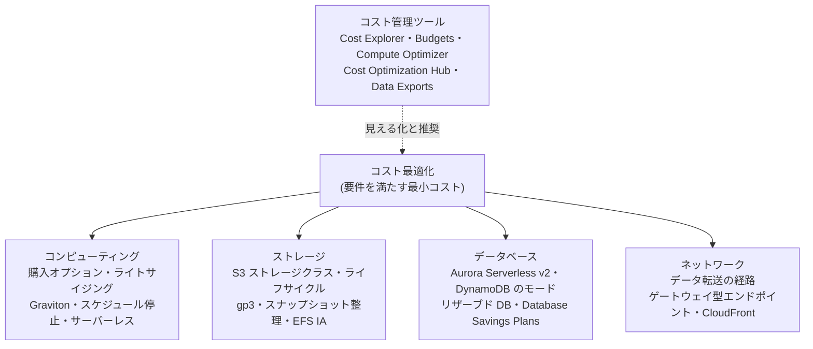
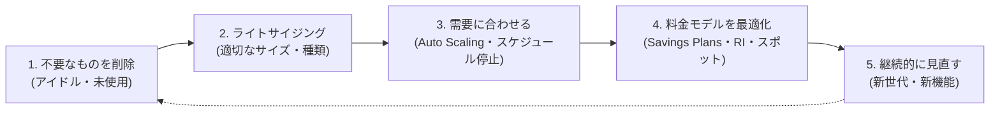
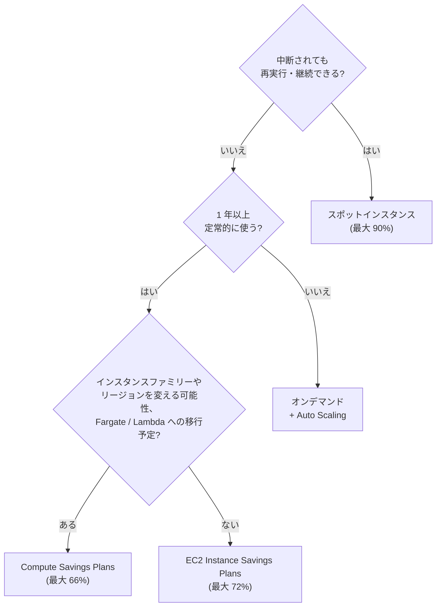
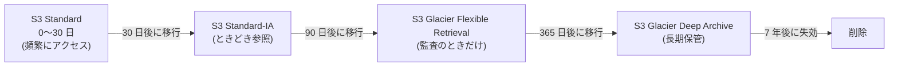

[ホーム](../README.md) > [Phase 2: アソシエイト](README.md) > コスト最適化

# コスト最適化

> **この章のゴール**
> - AWS の料金がどこで発生するか（コンピューティング・ストレージ・データベース・データ転送）を説明できる
> - EC2 の購入オプション（オンデマンド / Savings Plans / リザーブドインスタンス / スポット）を要件から選べる
> - S3 のストレージクラスとライフサイクルを、月額コストの試算で比較できる
> - データ転送料金の構造を図で説明し、NAT ゲートウェイや AZ 間通信のコストを削減できる
> - 「最もコスト効率が高い」問題を、チェックリストに沿って解ける
>
> **対応試験**: SAA-C03（第4分野: コストを最適化したアーキテクチャの設計 20%）
> **目安時間**: 読む 190分 / 確認問題 50分

## この章の全体像

[前の章](17-well-architected.md) で学んだとおり、コスト最適化とは「**要件を満たしたうえで、無駄をなくす**」ことです。
最も安い構成を選ぶことではありません。

AWS の請求額を大きく動かすレバーは、次の 4 つの領域に集約できます。

> [!NOTE]
> この章の単価は、特に断りのない限り **東京リージョン（ap-northeast-1）の公開価格（2026年9月時点）** です。
> 料金は改定されるため、実際の設計では必ず料金ページと [AWS Pricing Calculator](https://calculator.aws/) で確認してください。
> 試験で具体的な金額が問われることはまずありません。問われるのは **料金の仕組みと、選択肢どうしの相対的な大小** です。

## 1. コスト最適化の原則

### 1.1 料金の基本構造

AWS の料金は、ほぼすべてが次の 3 つの組み合わせです。

| 料金の要素 | 課金の単位（例） | 代表例 |
|---|---|---|
| コンピューティング | 時間・秒、リクエスト数、GB 秒 | EC2 のインスタンス時間、Lambda の実行時間 |
| ストレージ | GB-月（保存量 × 期間）、リクエスト数、取り出し量 | S3 の保存料金、EBS のプロビジョニング容量 |
| データ転送 | GB（主に AWS からの **送信**） | インターネットへの送信、AZ 間・リージョン間の転送 |

ここで重要なのが「**受信は原則無料、送信は有料**」という非対称性です。
データを AWS に入れるのは無料でも、取り出したり AZ・リージョンをまたいで動かしたりすると料金がかかります。

### 1.2 5 つの原則

Well-Architected のコスト最適化の柱（[17 章の 7 節](17-well-architected.md)）を、実務の原則に言い換えると次のようになります。

| 原則 | 意味 | 代表的な施策 |
|---|---|---|
| 需要に合わせる | 使っていないリソースに払わない | 不要リソースの削除、ライトサイジング、Auto Scaling、スケジュール停止 |
| 料金モデルを選ぶ | 使い方に合った購入方法を選ぶ | 定常的な利用は Savings Plans / RI、中断できる処理はスポット |
| 重労働をやめる | 差別化につながらない運用を AWS に任せる | マネージドサービス、サーバーレス |
| 見える化と責任 | 誰が何に使っているかを把握する | コスト配分タグ、AWS Budgets、Cost Anomaly Detection |
| 継続的に見直す | 新しい世代・機能に乗り換える | Graviton、gp3、新しいストレージクラス |

### 1.3 最適化は「順番」が大切

コスト削減の施策には、効果が出る正しい順番があります。

**先にコミットメント（Savings Plans や RI の購入）をしてはいけない** 理由は、過剰なサイズのまま長期契約すると、その無駄を 1〜3 年間固定してしまうからです。
まず削除とライトサイジングで「本当に必要な量」を確定させ、残った定常的な使用量にコミットします。

> [!TIP]
> **試験のポイント**: 「使用率が常に 10% 未満のインスタンスが多数ある。コストを削減したい」という問題では、Savings Plans の購入より先に **ライトサイジング（AWS Compute Optimizer の推奨に従ってサイズを下げる）** が正解になりやすいです。

## 2. コンピューティング

### 2.1 EC2 の購入オプション比較

割引率はオンデマンド料金に対する **上限値**（2026年9月時点）です。実際の割引率は、インスタンスタイプ・リージョン・期間・支払い方法で変わります。

| 購入オプション | 割引の上限 | 契約 | 柔軟性・特徴 | 向いている用途 |
|---|---|---|---|---|
| オンデマンド | なし | なし | 最も柔軟。Linux などは秒単位の課金（最低 60 秒） | 短期間・予測できない負荷・検証 |
| Compute Savings Plans | 最大 66% | 1 年 / 3 年、1 時間あたりの利用金額をコミット | インスタンスファミリー・サイズ・AZ・リージョン・OS・テナンシーを問わず適用。Fargate と Lambda にも適用 | 構成が変わりうる定常的な負荷 |
| EC2 Instance Savings Plans | 最大 72% | 同上 | 特定リージョンの特定インスタンスファミリーに適用（サイズ・OS・テナンシーは変更可） | ファミリーとリージョンが決まっている定常的な負荷 |
| スタンダードリザーブドインスタンス（RI） | 最大 72% | 1 年 / 3 年 | 属性がほぼ固定。未使用分は RI マーケットプレイスで売却できる | 構成が長期間変わらない負荷 |
| コンバーティブル RI | 最大 66% | 1 年 / 3 年 | 別のインスタンスファミリーや OS などの RI に交換できる | 構成変更の可能性がある負荷 |
| スポットインスタンス | 最大 90% | なし | EC2 の空きキャパシティを利用。2 分前の通知で中断されうる | 中断に強い処理 |
| オンデマンドキャパシティ予約 | なし（Savings Plans やリージョナル RI の割引は適用される） | なし（いつでも解除できる） | 特定の AZ でキャパシティを確保する | DR 時や大規模イベント時の確実な起動 |
| Dedicated Hosts | ― | オンデマンドまたは予約 | 物理サーバーを専有し、ソケット・コア数が見える | ソケット・コア単位のソフトウェアライセンスの持ち込み（BYOL）、規制対応 |
| Dedicated Instances | ― | ― | ハードウェアを他の AWS アカウントと共有しない | ハードウェア分離が求められる規制対応 |

支払い方法は Savings Plans・RI ともに **全額前払い / 一部前払い / 前払いなし** から選べ、前払いが多いほど、また 3 年のほうが 1 年より割引率が高くなります。
詳しい仕組みは [Amazon EC2](03-ec2.md) も参照してください。

特定の AZ でキャパシティを **確実に確保** したい場合は、上の選択に加えてオンデマンドキャパシティ予約を組み合わせます（Savings Plans もリージョナル RI もキャパシティは予約しません）。

### 2.2 Savings Plans の種類

Savings Plans は「1 時間あたり X USD 分を 1 年または 3 年使う」と **金額をコミット** する割引の仕組みです。
コミットした金額までの使用には割引価格が自動で適用され、超えた分はオンデマンド料金になります。

| 種類 | 割引の上限 | 期間・支払い | 適用範囲 |
|---|---|---|---|
| Compute Savings Plans | 最大 66% | 1 年 / 3 年、前払いの 3 方式 | EC2（ファミリー・サイズ・AZ・リージョン・OS・テナンシーを問わない）、AWS Fargate、AWS Lambda |
| EC2 Instance Savings Plans | 最大 72% | 1 年 / 3 年、前払いの 3 方式 | 選んだリージョンの選んだインスタンスファミリーの EC2（サイズ・OS・テナンシーは問わない） |
| SageMaker AI Savings Plans | 最大 64% | 1 年 / 3 年 | Amazon SageMaker AI のインスタンス使用量（ノートブック・学習・推論など） |
| Database Savings Plans | 最大 35% | **1 年・前払いなし** | Aurora、RDS、DynamoDB、ElastiCache、DocumentDB、Neptune、Keyspaces、Timestream、DMS（2026 年 3 月から OpenSearch Service と Neptune Analytics も）。エンジン・インスタンスファミリー・サイズ・リージョンを問わない |

> [!NOTE]
> **Database Savings Plans** は 2025 年 12 月に発表された比較的新しい選択肢です。
> 古い教材や試験問題では、データベースの割引は「リザーブド DB インスタンス（RDS の RI）」「DynamoDB のリザーブドキャパシティ」だけが登場します。両方を知っておきましょう（4.3 節で比較します）。

### 2.3 Savings Plans とリザーブドインスタンスの違い

| 観点 | Savings Plans | リザーブドインスタンス（EC2） |
|---|---|---|
| コミットの単位 | 1 時間あたりの利用金額（USD/時） | 特定の属性のインスタンス（タイプ・リージョンなど） |
| 適用対象 | Compute SP は EC2・Fargate・Lambda まで | EC2 のみ（RDS・ElastiCache・OpenSearch Service・Redshift には各サービスの予約がある） |
| 柔軟性 | 高い。条件に合う使用量に自動で適用される | スタンダードは低い。コンバーティブルは交換できる |
| キャパシティの予約 | なし | ゾーナル RI（AZ を指定した RI）のみあり |
| 売却 | できない | スタンダード RI は RI マーケットプレイスで売却できる |
| AWS の推奨 | EC2 は Savings Plans を推奨 | 既存の RI 運用や、ゾーナル RI によるキャパシティ予約が必要な場合 |

AWS Organizations の一括請求では、Savings Plans と RI の割引は組織内のアカウント間で **共有** されます（共有を無効にすることもできます）。
ある部署のアカウントで使い切れなかった割引が、別のアカウントの使用量に自動で適用されるため、組織全体で購入計画を立てるのが効率的です。

> [!WARNING]
> **ひっかけ注意**: Savings Plans も RI も **途中解約できません**。
> 「6 か月後に廃止予定のシステム」に 1 年や 3 年のコミットメントを買うのは、コスト最適化になりません。問題文の「今後 3 年間稼働する」「継続的に」といった期間の記述を必ず確認します。

### 2.4 スポットインスタンスの使いどころ

スポットインスタンスは、EC2 の **空いているキャパシティ** を大幅な割引価格（最大 90%）で使う仕組みです。
AWS がそのキャパシティを必要とすると、**2 分前の中断通知** のあとで中断（終了・停止・休止のいずれか）されます。
価格は需要と供給に応じて緩やかに変動し、入札は不要です。

| 向いている処理 | 向いていない処理 |
|---|---|
| バッチ処理、動画・画像の変換、レンダリング | 1 台で動くステートフルなデータベース |
| CI/CD のビルド・テスト | 中断すると最初からやり直しになる長時間の処理（チェックポイントなし） |
| ビッグデータ処理（Amazon EMR のタスクノードなど） | 中断が許されない決済処理などの基幹処理 |
| HPC、機械学習の学習（チェックポイントあり） | 厳密な完了期限があり、再実行の余裕がない処理 |
| ALB の背後のステートレスな Web サーバー（一部として） | キャパシティを確実に確保する必要がある処理 |
| コンテナ（ECS・EKS）、開発・テスト環境 | |

中断に備えるベストプラクティスは次のとおりです。

- **複数のインスタンスタイプと複数の AZ に分散する**（属性ベースのインスタンスタイプの選択を使うと簡単です）
- 配分戦略は **price-capacity-optimized**（価格とキャパシティの空き具合の両方を考慮）を選ぶ
- 中断通知と、より早く届く **EC2 インスタンスの再調整に関する推奨シグナル** を EventBridge で受け取り、処理を退避する
- 処理を小さく分割し、チェックポイントを保存して再開できるようにする
- Auto Scaling グループでは、オンデマンドとスポットを混在させ（ベース容量はオンデマンド、それを超える分はスポット）、キャパシティの再調整を有効にする

コンテナやバッチでは、**Fargate Spot**、**AWS Batch のスポットコンピューティング環境** も使えます。
Amazon EMR では、マスターノードとコアノード（HDFS のデータを持つ）はオンデマンド、タスクノードはスポットにするのが定石です。

> [!TIP]
> **試験のポイント**: 「中断されても問題ない」「再実行できる」「完了時間に柔軟性がある」「ステートレス」とあればスポットインスタンスです。
> 逆に「中断できない」「データベース」「確実に」とあれば、スポットは選びません。

### 2.5 ベースライン + 変動の組み合わせ

実際のワークロードでは、購入オプションを **重ねて** 使います。

| 負荷の層 | 性質 | 購入オプション |
|---|---|---|
| ベースライン | 24 時間いつでも必要な最低限の台数 | Savings Plans / RI |
| 予測できる変動 | 平日の日中など、時間帯で決まるピーク | オンデマンド + スケジュールされたスケーリング / 予測スケーリング |
| 予測できない変動（中断可能） | 突発的な負荷、バッチ | スポット（混在インスタンスの Auto Scaling グループ） |
| 予測できない変動（中断不可） | 突発的だが止められない処理 | オンデマンド + ターゲット追跡スケーリング |

### 2.6 AWS Graviton

AWS Graviton は、AWS が設計した Arm ベースのプロセッサーです。
インスタンスタイプ名に「g」が付くもの（例: m7g、c7g、r8g）が Graviton インスタンスです。

- AWS は、同等の x86 ベースのインスタンスと比べて **最大 40% 優れた価格性能** を公表しています（Graviton2 発表時の値。世代とワークロードで異なります）。
- 同じ性能をより少ない電力で実現できるため、持続可能性の柱にも合致します。
- **マネージドサービス** では、インスタンスクラスを変えるだけで移行できることが多いです（RDS、Aurora、ElastiCache、OpenSearch Service など）。Lambda はアーキテクチャに arm64 を選び、Fargate はタスク定義で ARM64 を指定します。
- 自前のアプリケーションでは、Arm 用のバイナリやコンテナイメージ（マルチアーキテクチャイメージ）が必要です。Python・Java・Node.js などのインタープリター型・VM 型の言語は、多くの場合そのまま動きます。

> [!TIP]
> **試験のポイント**: 「最小限の変更でコストパフォーマンスを改善」「RDS / ElastiCache のコストを下げたい」とあれば、Graviton ベースのインスタンスクラスへの変更が候補です。

### 2.7 ライトサイジングと AWS Compute Optimizer

**ライトサイジング** とは、実際の使用率に合わせてインスタンスのタイプとサイズを見直すことです。
オンプレミスの感覚で「念のため大きめ」に作ったインスタンスは、クラウドでは毎時間そのまま無駄になります。

**AWS Compute Optimizer** は、CloudWatch のメトリクス（既定では過去 14 日間）を機械学習で分析し、最適なリソース構成を推奨するサービスです。

- 対象: EC2 インスタンス、Auto Scaling グループ、EBS ボリューム、Lambda 関数、Fargate 上の ECS サービス、RDS の DB インスタンスなど
- 結果: 「過剰プロビジョニング」「プロビジョニング不足」「最適化済み」に分類し、推奨タイプ（Graviton への移行を含む）と削減見込み額を示します
- 拡張インフラストラクチャメトリクス（有料）を有効にすると、分析期間を最大 93 日間に延ばせます
- EC2 の **メモリ使用率は標準の CloudWatch メトリクスに含まれない** ため、CloudWatch エージェントでメモリのメトリクスを送ると推奨の精度が上がります

**AWS Cost Optimization Hub** は、Compute Optimizer のライトサイジング、アイドル状態のリソースの削除、Savings Plans の購入などの推奨を、**複数のアカウントとリージョンから一元化** し、削減見込み額で優先順位を付けてくれる無料のサービスです。

### 2.8 スケジュール停止

開発・テスト環境は、使わない時間に停止するだけで大きな効果があります。
平日 9 時〜21 時（週 60 時間）だけ稼働させれば、168 時間稼働と比べてインスタンス料金を約 64% 削減できます。

- **Instance Scheduler on AWS**: AWS が提供するソリューション（CloudFormation でデプロイ）です。タグで対象を指定し、定義したスケジュールで EC2 インスタンスと RDS の DB インスタンスを自動で起動・停止します。
- **EventBridge Scheduler + Systems Manager Automation（または Lambda）**: 小規模なら自作でも実現できます。
- **Auto Scaling グループ**: スケジュールされたスケーリングで、夜間は希望容量を 0 にします。

> [!WARNING]
> **ひっかけ注意**:
> - EC2 を停止しても、**EBS ボリュームの料金とパブリック IPv4 アドレス（Elastic IP を含む）の料金はかかり続けます**。
> - RDS / Aurora の停止は **最大 7 日間** で、7 日を過ぎると自動で起動します。長期間使わない DB は、スナップショットを取得して削除し、必要なときに復元するほうが確実です。

### 2.9 サーバーレス化

サーバーレスの料金は「リクエスト数 × 実行時間」などの **使った分だけ** で、アイドル時間の料金がかかりません。

| サービス | 課金の単位 | コスト最適化のポイント |
|---|---|---|
| AWS Lambda | リクエスト数 + 実行時間（GB 秒） | メモリ設定の最適化（Compute Optimizer の推奨や、オープンソースの AWS Lambda Power Tuning）、arm64（Graviton）の選択、待ち時間を関数内で消費しない（待機は Step Functions に任せる） |
| AWS Fargate | vCPU とメモリの秒単位の使用量 | タスクサイズの最適化、Fargate Spot、ARM64、Compute Savings Plans |
| Amazon API Gateway | リクエスト数 | 機能が足りるなら REST API より安価な HTTP API を選ぶ |
| AWS Step Functions | 状態遷移数（Standard）/ リクエストと実行時間（Express） | 大量・短時間のワークフローは Express ワークフロー |

> [!WARNING]
> **ひっかけ注意**: サーバーレスが常に安いとは限りません。
> 24 時間高い使用率で動き続ける処理は、Savings Plans を適用した EC2 やコンテナのほうが安くなることがあります。
> サーバーレスが最も効くのは「**負荷が不定期・断続的・予測できない**」ワークロードです。

## 3. ストレージ

### 3.1 S3 ストレージクラスの料金と制約

S3 のストレージクラスは「**保存料金が安いほど、取り出し料金・最小保存期間・取り出し時間の制約が厳しくなる**」というトレードオフでできています。
東京リージョンの単価（2026年9月時点、AWS Price List で確認）は次のとおりです。

| ストレージクラス | 保存料金（USD/GB-月） | 取り出し料金（USD/GB） | 最小保存期間 | 最小課金サイズ | 取り出し時間 | 保存先の AZ |
|---|---|---|---|---|---|---|
| S3 Standard | 0.025（最初の 50 TB） | なし | なし | なし | ミリ秒 | 3 つ以上 |
| S3 Intelligent-Tiering | 0.025 / 0.0138 / 0.005（自動で階層を移動）+ 監視料金 | なし | なし | 128 KB 未満は自動階層化の対象外 | ミリ秒（オプションのアーカイブ層を除く） | 3 つ以上 |
| S3 Standard-IA | 0.0138 | 0.01 | 30 日 | 128 KB | ミリ秒 | 3 つ以上 |
| S3 One Zone-IA | 0.011 | 0.01 | 30 日 | 128 KB | ミリ秒 | 1 つ |
| S3 Glacier Instant Retrieval | 0.005 | 0.03 | 90 日 | 128 KB | ミリ秒 | 3 つ以上 |
| S3 Glacier Flexible Retrieval | 0.0045 | 迅速 0.033 / 標準 0.011 / 大量 無料 | 90 日 | オブジェクトごとに 40 KB 分が加算 | 迅速 1〜5 分 / 標準 3〜5 時間 / 大量 5〜12 時間 | 3 つ以上 |
| S3 Glacier Deep Archive | 0.002 | 標準 0.022 / 大量 0.005 | 180 日 | オブジェクトごとに 40 KB 分が加算 | 標準 12 時間以内 / 大量 48 時間以内 | 3 つ以上 |

- **最小保存期間**: その期間より前に削除・上書き・移行すると、残りの日数分の保存料金が請求されます。
- **最小課金サイズ**: 128 KB 未満のオブジェクトも 128 KB として課金されます。
- Glacier Flexible Retrieval と Deep Archive では、オブジェクトごとにメタデータ用の 40 KB 分（一部は S3 Standard の料金）が加算されるため、**小さなオブジェクトを大量にアーカイブすると割高** になります。
- 料金ページ: [Amazon S3 の料金](https://aws.amazon.com/jp/s3/pricing/)

> [!NOTE]
> S3 Express One Zone は、1 つの AZ で 1 桁ミリ秒のアクセスを提供する **高性能** 向けのクラスです（保存料金は Standard より高く、東京で 0.124 USD/GB-月）。コスト削減の選択肢ではない点に注意してください。

### 3.2 試算: 40 TB を 1 か月保存するといくらか

**前提**: 東京リージョンに 40 TB（計算を簡単にするため 40,000 GB とします）のデータを保存します。
リクエスト料金・データ転送料金・最小保存期間の影響は除き、「保存料金 + 取り出し料金」だけで比べます。

| ストレージクラス | 保存料金 | 読み出しが月 1%（400 GB）のとき: 取り出し料金 | 合計 | 読み出しが月 100%（40,000 GB）のとき: 取り出し料金 | 合計 |
|---|---|---|---|---|---|
| S3 Standard | 1,000 | 0 | **1,000** | 0 | **1,000** |
| S3 Standard-IA | 552 | 4 | **556** | 400 | **952** |
| S3 One Zone-IA | 440 | 4 | **444** | 400 | **840** |
| S3 Glacier Instant Retrieval | 200 | 12 | **212** | 1,200 | **1,400** |
| S3 Glacier Flexible Retrieval（標準取り出し） | 180 | 4.4 | **184.4** | ― | 現実的でない |
| S3 Glacier Deep Archive（標準取り出し） | 80 | 8.8 | **88.8** | ― | 現実的でない |

（単位: USD/月。計算例: Standard-IA の保存料金 = 40,000 GB × 0.0138 USD = 552 USD）

この表から、次の 3 つが読み取れます。

1. **ほとんど読まないデータ** なら、低頻度・アーカイブ系のクラスは劇的に安くなります。Deep Archive は Standard の 1/10 以下です。
2. **頻繁に読むデータ** では、取り出し料金で順位が逆転します。毎月全量を読むと、Glacier Instant Retrieval は Standard より 4 割も高くなります。
3. Glacier Flexible Retrieval と Deep Archive は、取り出しに分〜時間単位かかり、復元中の一時コピーにも保存料金がかかるため、頻繁なアクセスには向きません。

したがって、ストレージクラスは次の順番で絞り込みます。

| 判断の順番 | 質問 | 例 |
|---|---|---|
| 1 | 取り出しにどれだけ時間をかけてよいか | ミリ秒が必要なら Glacier Flexible / Deep Archive は除外 |
| 2 | どれくらいの頻度で読むか | 月 1 回程度 → Standard-IA、四半期に 1 回程度 → Glacier Instant Retrieval |
| 3 | AZ の損失に耐える必要があるか | 再作成できるデータなら One Zone-IA も候補 |
| 4 | どれくらいの期間保存するか、オブジェクトは小さくないか | 最小保存期間より短い、128 KB 未満が多い → Standard のほうが安いことがある |

| 要件 | 選ぶストレージクラス |
|---|---|
| 頻繁にアクセスする | S3 Standard |
| アクセスパターンが不明、または変化する | S3 Intelligent-Tiering |
| 月 1 回程度、すぐに読める必要がある | S3 Standard-IA |
| 再作成できるデータで、月 1 回程度読む | S3 One Zone-IA |
| 四半期に 1 回程度、ミリ秒で読める必要がある | S3 Glacier Instant Retrieval |
| 年に 1〜2 回、数分〜数時間で読めればよい | S3 Glacier Flexible Retrieval |
| 年 1 回未満、12 時間以内に読めればよい（長期保管・コンプライアンス） | S3 Glacier Deep Archive |

### 3.3 ライフサイクルルール

アクセス頻度が **時間の経過とともに予測どおりに下がる** データは、S3 ライフサイクルルールで自動的に安いクラスへ移し、不要になったら削除します。

ライフサイクルルールには、**移行アクション**（別のクラスへ移す）と **有効期限アクション**（削除する）があります。
設計するときは、次の制約とコストに注意します。

- Standard-IA と One Zone-IA へは、**作成から 30 日以上たったオブジェクトしか移行できません**。
- 最小保存期間より前に次のクラスへ移すと、前のクラスの残り日数分が請求されます（例: Glacier Flexible Retrieval に入れて 60 日で Deep Archive へ移すと、30 日分の料金が加算）。
- 2024 年 9 月以降、既定では **128 KB 未満のオブジェクトは移行されません**（オブジェクトサイズのフィルターで変更できます）。
- 移行にはオブジェクト 1 件ごとにリクエスト料金がかかります。1,000 件あたり数セントでも、1 億件なら数千 USD になります。**小さなオブジェクトが大量にある場合は、まとめてから（アーカイブファイルにしてから）移行** することを検討します。
- コストの「掃除」にも使えます。
  - バージョニングを有効にしたバケットでは、**非現行バージョンの移行・削除** を設定します（古いバージョンにも保存料金がかかります）
  - **不完全なマルチパートアップロードの中止**（途中で失敗したアップロードの断片は見えないまま課金されます）
  - 期限切れのオブジェクト削除マーカーの削除

### 3.4 S3 Intelligent-Tiering

S3 Intelligent-Tiering は、オブジェクトごとのアクセス状況を監視し、自動で階層を移動するストレージクラスです。

| 階層 | 移動する条件 | 保存料金（東京） |
|---|---|---|
| 高頻度アクセス層 | 既定（アクセスされると自動でここに戻る） | 0.025 |
| 低頻度アクセス層 | 30 日連続でアクセスがない | 0.0138 |
| アーカイブインスタントアクセス層 | 90 日連続でアクセスがない | 0.005 |
| アーカイブアクセス層（オプション） | 設定した日数（90〜730 日）アクセスがない | 0.0045 |
| ディープアーカイブアクセス層（オプション） | 設定した日数（180〜730 日）アクセスがない | 0.002 |

- **取り出し料金がかからず、最小保存期間もありません**（オプションのアーカイブ層から戻すときは復元が必要で、時間がかかります）。
- 代わりに、**監視と自動化の料金（1,000 オブジェクトあたり月 0.0025 USD）** がかかります。
- **128 KB 未満のオブジェクトは監視されず**（監視料金もかからず）、常に高頻度アクセス層の料金になります。

監視料金は **オブジェクト数** に比例するため、平均サイズが小さいほど割高になります。2 つのケースで比べてみます。

| 項目 | ケース A: 平均 1 MB × 5,000 万オブジェクト（約 50 TB） | ケース B: 平均 150 KB × 2 億オブジェクト（約 30 TB） |
|---|---|---|
| 監視料金 | 50,000,000 ÷ 1,000 × 0.0025 = **125 USD/月** | 200,000,000 ÷ 1,000 × 0.0025 = **500 USD/月** |
| GB あたりの監視料金 | 約 0.0025 USD/GB | 約 0.0167 USD/GB |
| データの 8 割（A）/ 5 割（B）が低頻度アクセス層に移った場合の節約額 | 40,000 GB ×（0.025 − 0.0138）= **448 USD/月** | 15,000 GB ×（0.025 − 0.0138）= **168 USD/月** |
| 結論 | 節約額が監視料金を大きく上回る → **効果あり** | 監視料金が節約額を上回る → **逆に高くなる** |

ケース B では、GB あたりの監視料金（約 0.0167 USD）が、低頻度アクセス層に移ったときの GB あたりの節約額（0.0112 USD）を上回っています。

> [!TIP]
> **試験のポイント**: 「アクセスパターンが **不明・予測できない・変化する**」「取り出し料金を避けたい」「運用の手間をかけずに最適化したい」とあれば S3 Intelligent-Tiering です。
> 一方、「30 日後はほとんどアクセスされない」のように **パターンが明確** なら、監視料金のかからないライフサイクルルールのほうが安くなります。

> [!WARNING]
> **ひっかけ注意**: 小さなオブジェクト（128 KB 未満）が大半のバケットや、30 日以内に削除される短命なデータに Intelligent-Tiering を使っても、コストはほとんど下がりません。

### 3.5 その他の S3 のコスト要素

| コスト要素 | 注意点と対策 |
|---|---|
| リクエスト料金 | PUT・COPY・POST・LIST は GET より高い。小さなオブジェクトを大量に書き込む設計は、まとめて書き込む設計にする |
| インターネットへのデータ転送 | S3 から直接配信するより、CloudFront 経由のほうが安く速いことが多い（5.4 節） |
| バージョニング | 古いバージョンも保存料金の対象。ライフサイクルで非現行バージョンを整理する |
| レプリケーション | 複製先の保存料金に加え、クロスリージョンの場合はリージョン間のデータ転送料金がかかる |
| 分析用のアクセス | 利用者に転送料金を負担させたい共有データは、リクエスタ支払いバケットにする |
| 見える化 | S3 Storage Lens で、非現行バージョンや不完全なマルチパートアップロードが多いバケットを見つける |

### 3.6 EBS: gp2 から gp3 への移行、未使用ボリュームとスナップショットの整理

**gp3 は gp2 より GB あたりの単価が約 20% 安く**、しかも容量に関係なく 3,000 IOPS と 125 MiB/s のベースライン性能があります（gp2 は容量 1 GB あたり 3 IOPS）。

東京リージョンの例（2026年9月時点）で、500 GB のボリューム 100 本（合計 50,000 GB）を移行すると次のようになります。

| ボリュームタイプ | 単価（USD/GB-月） | 月額 | ベースライン IOPS（500 GB の場合） |
|---|---|---|---|
| gp2 | 0.12 | 6,000 USD | 1,500 IOPS（バーストで最大 3,000） |
| gp3 | 0.096 | 4,800 USD | 3,000 IOPS |

月額 1,200 USD（年間 14,400 USD）の削減で、ベースラインの IOPS も上がります。
**Elastic Volumes** を使えば、ボリュームをデタッチせず、インスタンスを稼働させたままタイプを変更できます。
ただし、現在の IOPS やスループットの実績が gp3 のベースラインを超えている場合は、gp3 で IOPS・スループットを追加でプロビジョニングします（追加料金）。移行前に CloudWatch で実績を確認しましょう。

そのほかの EBS のコスト対策は次のとおりです。

- **未使用ボリュームの削除**: インスタンスを終了してもボリュームが残る設定（終了時に削除しない設定）の場合、アタッチされていない「使用可能」状態のボリュームに課金が続きます。必要ならスナップショットを取ってから削除します。
- **スナップショットの整理**: Amazon Data Lifecycle Manager で、スナップショットの作成と保持期間（世代数）を自動化し、古いスナップショットを自動で削除します。
- **EBS スナップショットのアーカイブ**: ほとんど復元しない長期保管用のスナップショットを、最大 75% 安いアーカイブ階層に移せます（最低 90 日、復元に最大 72 時間。アーカイブ時にフルスナップショットに変換されます）。
- **ごみ箱（Recycle Bin）**: 誤って削除したスナップショットや AMI を、保持ルールの期間内なら復元できます。
- **HDD ボリューム**: 大量のデータを順次読み書きする処理は st1（スループット最適化 HDD）、アクセス頻度の低い大容量データは sc1（Cold HDD）で安くできます（ブートボリュームには使えません）。

### 3.7 EFS と FSx

**Amazon EFS** には、アクセス頻度に応じた 3 つのストレージクラスがあります。

| ストレージクラス | 用途 |
|---|---|
| EFS Standard | 頻繁にアクセスするファイル |
| EFS 低頻度アクセス（IA） | 月に数回程度しかアクセスしないファイル |
| EFS アーカイブ（Archive） | 年に数回以下しかアクセスしないファイル |

- **ライフサイクル管理** で、最後のアクセスからの日数に応じて IA・Archive へ自動で移し、アクセスされたら Standard に戻すよう設定できます。IA と Archive は保存料金が安い代わりに、読み書きにアクセス料金がかかります。
- 128 KiB 未満のファイルはライフサイクル管理の対象外で、常に Standard に保存されます。
- AZ の冗長性が不要な開発用データなどは、**1 つの AZ に保存する EFS One Zone** でさらに安くできます。
- スループットモードは、負荷の変動が大きい場合は使った分だけ課金される **Elastic スループット** が効率的です。

**Amazon FSx** では、FSx for Windows File Server の HDD ストレージやデータ重複排除、FSx for Lustre のスクラッチファイルシステム（一時的な処理用で安価。データは複製されない）、FSx for NetApp ONTAP の容量プール階層（アクセス頻度の低いデータを自動で安い階層へ移動）がコスト削減のレバーになります。
各ストレージの仕組みは [ブロック・ファイルストレージ](06-ebs-efs-fsx.md) を参照してください。

## 4. データベース

### 4.1 Aurora Serverless v2 と I/O-Optimized

**Aurora Serverless v2** は、負荷に応じて容量を自動で増減する Aurora の構成です。

- 容量の単位は **ACU（Aurora Capacity Unit）** で、1 ACU は約 2 GiB のメモリと、それに見合う CPU・ネットワークです。0.5 ACU 単位で細かくスケールします。
- 最小容量と最大容量を設定します。最小容量を **0 ACU** にすると、一定時間アクセスがないときに自動で一時停止できます（2024 年 11 月から。対応するエンジンバージョンが必要）。
- マルチ AZ 構成、リーダー（読み取り用インスタンス）、Aurora Global Database と組み合わせられます。
- 料金は ACU 時間で決まるため、**負荷の変動が大きい・予測できない・アイドル時間が長い** ワークロードに向きます。常に高負荷の場合は、プロビジョニングされたインスタンスに予約割引を組み合わせたほうが安いことがあります。

**Aurora I/O-Optimized** は、読み書きの I/O 料金がかからない代わりに、インスタンスとストレージの単価が高くなる料金体系です。
AWS は、**I/O の料金が Aurora の総コストの 25% を超える** 場合に I/O-Optimized を検討するよう案内しています。I/O の多いワークロードでは、コストが下がり、しかも予測しやすくなります。

### 4.2 DynamoDB のキャパシティモードの選択

| モード | 課金 | 向いているワークロード | コスト最適化のポイント |
|---|---|---|---|
| オンデマンド | 読み書きのリクエスト数 | 新規・予測できない・急激に変動するトラフィック | キャパシティ計画が不要。2024 年 11 月に料金が 50% 引き下げられ、多くのワークロードで第一候補になった |
| プロビジョニング済み | 設定した読み込み・書き込みキャパシティユニット（時間単位） | 予測できる安定したトラフィック | Auto Scaling で使用率に追従させる。長期の定常利用はリザーブドキャパシティ（1 年 / 3 年）で割引 |

そのほかのレバーは次のとおりです。

- **DynamoDB Standard-IA テーブルクラス**: 保存料金が最大 60% 安い代わりに、読み書きの料金が高くなります。保存コストが大半を占める、アクセスの少ないテーブル（過去の注文履歴など）に向きます。
- **TTL（Time to Live）**: 期限切れの項目を追加料金なしで自動削除し、不要なデータの保存料金を減らします。
- **DAX / ElastiCache**: 読み取りをキャッシュすれば、読み込みキャパシティの消費を減らせます。

### 4.3 リザーブド DB インスタンスと Database Savings Plans

| 観点 | リザーブド DB インスタンス（RDS など） | Database Savings Plans |
|---|---|---|
| コミットの単位 | 特定のエンジン・インスタンスクラス・リージョンの DB インスタンス | 1 時間あたりの利用金額（USD/時） |
| 期間・支払い | 1 年 / 3 年、前払いの 3 方式 | 1 年・前払いなし |
| 割引率 | 3 年・全額前払いなどを選べば、より大きな割引になりうる | 最大 35% |
| 柔軟性 | 低い（同じインスタンスファミリー内のサイズ変更に対応するエンジンもある） | 高い（エンジン・インスタンスファミリー・サイズ・リージョンをまたいで自動適用。複数のデータベースサービスが対象） |
| 向いているケース | エンジンと構成が長期間変わらない大規模な DB | サーバーレス化や別エンジンへの移行、リージョン変更の可能性がある DB 群 |

同じようなサービスごとの予約として、ElastiCache のリザーブドノード、OpenSearch Service のリザーブドインスタンス、Redshift のリザーブドノード、DynamoDB のリザーブドキャパシティがあります。

### 4.4 その他のデータベースのコスト対策

| 施策 | 内容 |
|---|---|
| キャッシュで DB を小さくする | 読み取りを ElastiCache や DAX に逃がし、DB のインスタンスサイズやキャパシティを下げる。ElastiCache は Valkey エンジンが他エンジンより低価格に設定されている |
| マルチ AZ は本番だけ | 開発・テスト環境は、要件がなければシングル AZ にする |
| 開発用 DB の停止 | 夜間・週末に停止する（RDS・Aurora は最大 7 日で自動起動する点に注意） |
| Graviton のインスタンスクラス | RDS・Aurora・ElastiCache のインスタンスクラスを Graviton に変える |
| ストレージの最適化 | RDS のストレージを gp3 にし、ストレージの自動スケーリングで過剰な確保を避ける |
| バックアップの整理 | 不要な手動スナップショットを削除し、保持期間を要件に合わせる |
| 分析クエリのコスト | Amazon Athena はスキャンしたデータ量で課金されるため、列指向形式（Parquet など）・圧縮・パーティション分割でスキャン量を減らす |
| DWH のコスト | Amazon Redshift は、使わない時間の一時停止、Redshift Serverless、リザーブドノードを使い分ける |

> [!TIP]
> **試験のポイント**: 「負荷が不定期で予測できない」「夜間はほとんど使われない」リレーショナル DB → **Aurora Serverless v2**。
> 「キーバリューで、トラフィックが予測できない」→ **DynamoDB オンデマンド**。「トラフィックが安定している」→ **プロビジョニング済み + Auto Scaling（+ リザーブドキャパシティ）**。

