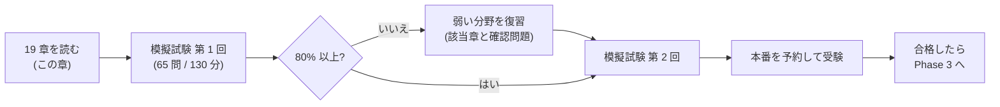
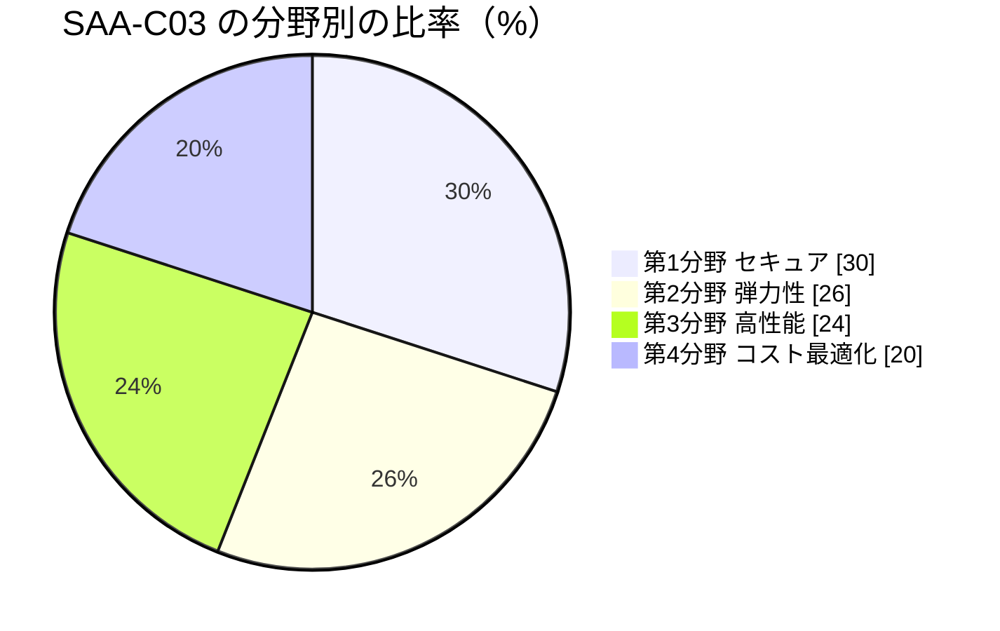
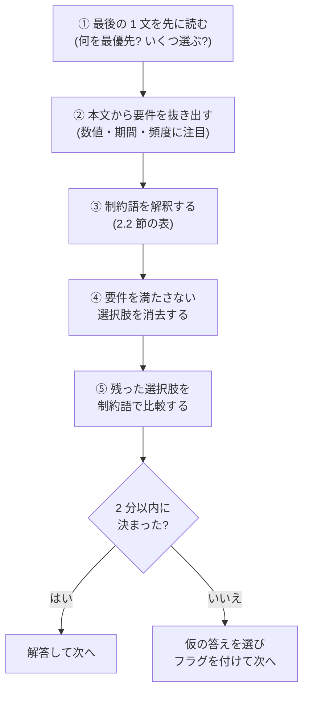

[ホーム](../README.md) > [Phase 2: アソシエイト](README.md) > SAA-C03 試験対策

# SAA-C03 試験対策

> **この章のゴール**
> - SAA-C03 の試験形式・採点方式・4 つの分野と比率を正確に説明できる
> - 問題文から要件と制約を抜き出し、制約語から正解の方向性を判断できる
> - 頻出シナリオ 50 パターンに対応するサービス・構成を即答できる
> - 時間配分と見直しの戦略を決め、試験当日まで準備を整えられる
>
> **対応試験**: SAA-C03（全ドメイン）
> **目安時間**: 読む 120分 / 確認問題 60分

## この章の全体像

Phase 2 の 1〜18 章で、SAA-C03 に必要な知識はそろいました。
この章では、その知識を **65 問・130 分の本番で得点に変える方法** をまとめます。

新しいサービスはほとんど登場しません。代わりに、「問題文のどこを読み、どう絞り込むか」「どのキーワードでどの構成を選ぶか」を体系化します。
この章を読んだら、模擬試験で実力を測り、弱点を復習してから本番に臨みましょう。

## 1. 試験の概要

### 1.1 基本情報

| 項目 | 内容（2026年9月時点） |
|---|---|
| 試験コード | SAA-C03（現行の Solutions Architect – Associate 試験。SAA-C04 は AWS から発表されていない） |
| 問題数 | 65 問（採点対象 50 問 + 採点対象外 15 問。どれが採点対象外かは区別できない） |
| 試験時間 | 130 分 |
| 受験料 | 150 USD（日本語の認定ページでは 20,000 円。税が適用される場合があり、消費税 10% 込みで 22,000 円） |
| 合格点 | 720 点（100〜1000 点のスケールスコア） |
| 採点方式 | 補整型（compensatory）。分野ごとの合格基準はなく、試験全体の点数で合否が決まる |
| 未回答と推測 | 未回答は不正解として扱われる。推測による減点はない |
| 出題形式 | 択一選択（4 つの選択肢から正解 1 つ）と複数選択（5 つ以上の選択肢から正解 2 つ以上） |
| 受験方法 | Pearson VUE のテストセンター、またはオンライン監督（OnVUE） |
| 言語 | 日本語で受験できる（問題ごとに英語の原文表示に切り替えられる） |
| 結果の通知 | 5 営業日以内（多くの場合、試験終了の画面では合否は表示されない） |
| 再受験 | 不合格の場合、14 日間待てば再受験できる（受験料はその都度必要） |
| 有効期間 | 3 年。上位の SAP（Professional）に合格すると SAA も更新される |
| 合格の特典 | 次回の受験に使える 50% 割引バウチャー（AWS 認定アカウントに付与される） |

> [!NOTE]
> 英語が母国語でない人向けの「ESL +30 分」の延長措置は、**英語で受験する場合だけ** の制度です。日本語で受験する場合は対象外です。
> 予約の手順や AWS 認定アカウントについては [AWS 認定の全体像と試験の仕組み](../00-start/02-certification-map.md) を参照してください。
> 公式の試験ガイド: [AWS Certified Solutions Architect - Associate (SAA-C03) Exam Guide](https://docs.aws.amazon.com/aws-certification/latest/solutions-architect-associate-03/solutions-architect-associate-03.html)

### 1.2 4 つの分野と比率

| 分野 | 比率 | 採点対象 50 問での目安 | 主に対応する章 |
|---|---|---|---|
| 第1分野: セキュアなアーキテクチャの設計 | 30% | 約 15 問 | [01](01-iam.md)・[02](02-vpc.md)・[12](12-security-services.md) |
| 第2分野: 弾力性に優れたアーキテクチャの設計 | 26% | 約 13 問 | [04](04-elb-auto-scaling.md)・[07](07-databases.md)・[09](09-application-integration.md)・[10](10-serverless.md)・[15](15-high-availability-dr.md) |
| 第3分野: 高性能なアーキテクチャの設計 | 24% | 約 12 問 | [03](03-ec2.md)・[05](05-s3.md)・[06](06-ebs-efs-fsx.md)・[08](08-route53-cloudfront.md)・[14](14-analytics.md) |
| 第4分野: コストを最適化したアーキテクチャの設計 | 20% | 約 10 問 | [18](18-cost-optimization.md)・[03](03-ec2.md)・[05](05-s3.md) |

補整型の採点なので、苦手な分野があっても他の分野で取り返せます。
ただし、第1分野（30%）と第2分野（26%）で半分以上を占めるため、**セキュリティと高可用性の定石は確実に得点源にする** のが合格への近道です。

### 1.3 タスクステートメントの要約

試験ガイドでは、各分野が「タスクステートメント」に分かれています。
次の表は、その内容を学習用に要約したものです（公式の試験ガイドの日本語訳とは表現が異なります）。

| タスク | 要約（何ができればよいか） | 主なサービス・トピック |
|---|---|---|
| 1.1 AWS リソースへのセキュアなアクセスを設計する | ルートユーザーの保護、IAM のユーザー・グループ・ロール・ポリシー、MFA、クロスアカウントアクセス、フェデレーション、マルチアカウントのガードレール | IAM、IAM Identity Center、STS、Organizations（SCP）、Control Tower |
| 1.2 セキュアなワークロードとアプリケーションを設計する | VPC のセキュリティ（セキュリティグループ・ネットワーク ACL・サブネット設計）、外部からの攻撃への対策、アプリケーションの認証、安全な外部接続 | VPC、VPC エンドポイント、WAF、Shield、GuardDuty、Cognito、Secrets Manager、VPN / Direct Connect |
| 1.3 適切なデータセキュリティコントロールを決定する | 保管中・転送中の暗号化、キー管理とローテーション、データの保持・ライフサイクル、バックアップ、コンプライアンス | KMS、ACM、S3 の暗号化・Object Lock・バージョニング、Macie、AWS Backup |
| 2.1 スケーラブルで疎結合なアーキテクチャを設計する | キュー・イベント・API による疎結合化、水平スケーリング、サーバーレスとコンテナ、キャッシュ、ワークフローのオーケストレーション | SQS、SNS、EventBridge、API Gateway、Lambda、Step Functions、ECS / EKS / Fargate、ElastiCache |
| 2.2 高可用性やフォールトトレランスを備えたアーキテクチャを設計する | マルチ AZ・マルチリージョン、DR 戦略と RTO / RPO、フェイルオーバー、単一障害点の排除、監視と自動復旧 | ELB、Auto Scaling、RDS マルチ AZ、Aurora、Route 53、AWS Backup、Elastic Disaster Recovery |
| 3.1 高性能でスケーラブルなストレージソリューションを決定する | 要件に合ったストレージの種類（オブジェクト・ブロック・ファイル）と性能の選択 | S3、EBS、EFS、FSx |
| 3.2 高性能で伸縮性のあるコンピューティングソリューションを設計する | インスタンスタイプの選択、Auto Scaling、サーバーレス、コンテナ、バッチ処理、処理の分離 | EC2、Auto Scaling、Lambda、Fargate、AWS Batch、EMR |
| 3.3 高性能なデータベースソリューションを決定する | 目的に合った DB エンジンの選択、リードレプリカ、キャッシュ、接続の管理、キャパシティの計画 | RDS、Aurora、DynamoDB、ElastiCache、DAX、RDS Proxy |
| 3.4 高性能でスケーラブルなネットワークアーキテクチャを決定する | エッジの活用、ロードバランサーの選択、VPC とハイブリッド接続の設計 | CloudFront、Global Accelerator、ELB、Transit Gateway、Direct Connect、PrivateLink |
| 3.5 高性能なデータ取り込みと変換のソリューションを決定する | ストリーミングとバッチでのデータの取り込み、変換、データレイクと分析 | Kinesis、Data Firehose、Glue、Athena、Lake Formation、DataSync、Transfer Family |
| 4.1 コストを最適化したストレージソリューションを設計する | ストレージクラスとライフサイクル、ボリュームタイプ、バックアップと保持のコスト | S3 ストレージクラス・ライフサイクル、EBS（gp3 など）、AWS Backup |
| 4.2 コストを最適化したコンピューティングソリューションを設計する | 購入オプション、ライトサイジング、スケーリング、サーバーレス・コンテナの活用 | Savings Plans、RI、スポット、Compute Optimizer、Lambda、Fargate |
| 4.3 コストを最適化したデータベースソリューションを設計する | DB の種類とキャパシティモードの選択、キャッシュ、バックアップの保持、サーバーレス DB | Aurora Serverless v2、DynamoDB のキャパシティモード、リザーブド DB インスタンス |
| 4.4 コストを最適化したネットワークアーキテクチャを設計する | データ転送の経路と料金、NAT ゲートウェイとエンドポイント、CDN、接続方式の比較 | VPC エンドポイント、NAT ゲートウェイ、CloudFront、Direct Connect、Transit Gateway |

## 2. 問題文の読み方

### 2.1 問題文の構造と解き方の手順

SAA-C03 の問題は、ほぼすべてが「**状況 → 要件 → 制約 → 選択肢**」という構造です。
選択肢はどれも「技術的には動きそう」に見えるように作られているため、**要件と制約を正確に読み取れるかどうか** で差がつきます。

**例題で練習してみましょう。**

> ある企業は、オンプレミスの NFS ファイルサーバーに保存している 50 TB の画像データを AWS に移行したいと考えています。
> 移行後も、オンプレミスのアプリケーションは NFS を使い、頻繁に使うファイルに低レイテンシーでアクセスする必要があります。アプリケーションは変更できません。
> 運用上のオーバーヘッドが最も少ない方法はどれですか。

| 要素 | 問題文から読み取れること |
|---|---|
| 状況 | オンプレミスの NFS ファイルサーバー、50 TB |
| 要件 | データは AWS に置く / オンプレミスから NFS でアクセス / 頻繁に使うファイルは低レイテンシー |
| 制約 | アプリケーションは変更できない / 運用上のオーバーヘッドが最も少ない |
| 結論 | **S3 ファイルゲートウェイ**（NFS でアクセスでき、データは S3 に保存し、よく使うファイルはオンプレミスのキャッシュから低レイテンシーで返す） |

「オンプレミスから低レイテンシー」+「データはクラウド」+「プロトコルを変えない」の組み合わせが、Storage Gateway を選ぶ決め手です。

### 2.2 制約語の解釈表

問題文の最後にある制約語は、「どの観点で最適解を選ぶか」の指定です（[17 章の 12 節](17-well-architected.md) も参照）。

| 制約語・表現 | 読み取るべきこと | 正解の方向性 | 避ける選択肢 |
|---|---|---|---|
| 「運用上のオーバーヘッドが最も少ない」「管理の手間が最小」 | パッチ適用・スケーリング・監視・スクリプトの保守を減らす | マネージド・サーバーレス・AWS のネイティブ機能・自動化 | EC2 への自前の構築、cron のスクリプト、手動の手順 |
| 「最もコスト効率が高い」「コストを最小限に」 | 要件を満たす中で最も安い | 適切な購入オプションとストレージクラス、不要な転送の削減、断続的な負荷ならサーバーレス | 過剰な冗長化、要件を満たさない安い構成 |
| 「最小限の開発作業で」「最小限の変更で」「最小限の労力で」 | 新しいコードをなるべく書かない | 既存サービスの設定や機能の組み合わせ（S3 イベント通知、マネージドな統合、DAX のような API 互換のサービス） | カスタムアプリケーションの開発、独自のリトライ処理の実装 |
| 「既存のアプリケーションを変更せずに」「コードを変更せずに」 | プロトコル・API・DB エンジンの互換性を保つ | 互換サービス（NFS → EFS、SMB → FSx for Windows File Server、MySQL → RDS / Aurora MySQL）、リホスト、前段へのサービス追加（ALB・CloudFront・Global Accelerator） | 別のデータモデルへの移行（RDB → DynamoDB）、SDK の書き換えが必要な方法 |
| 「最も高い可用性」「耐障害性」「単一障害点をなくす」 | 障害が起きても止まらない | マルチ AZ（必要ならマルチリージョン）、自動フェイルオーバー | シングル AZ、単一インスタンス、手動の切り替え |
| 「ほぼリアルタイム」「数秒以内に」 | 夜間バッチなどの定期処理ではない | Kinesis Data Streams、Data Firehose、EventBridge、Lambda | 1 日 1 回のバッチ、定期的なエクスポート |
| 「一度だけ処理」「重複なく」 | 同じメッセージを 2 回処理しない | SQS FIFO キュー（重複排除）、冪等な処理 | SQS 標準キュー（少なくとも 1 回の配信で重複がありうる） |
| 「順序を保証」「受信した順番で」 | 並び順を保つ | SQS FIFO キュー（メッセージグループ内）、Kinesis Data Streams（シャード内）、SNS FIFO トピック | SQS 標準キュー、SNS 標準トピック |
| 「マイクロ秒」「ミリ秒未満のレイテンシー」 | インメモリが必要 | ElastiCache、DAX | ディスクベースの DB のスケールアップ |
| 「1 桁ミリ秒（数ミリ秒）のレイテンシーを、どんな規模でも」 | NoSQL の高速で安定したアクセス | DynamoDB | 自前の DB クラスター |
| 「予測できないトラフィック」「急増する」「不定期」 | 容量を事前に決められない | Auto Scaling、サーバーレス（Lambda・DynamoDB オンデマンド・Aurora Serverless v2）、SQS によるバッファリング | 固定台数、ピークに合わせた予約 |
| 「WORM」「変更・削除できないように」「規制で一定期間保持」 | 書き込んだ後は誰も改変・削除できない | S3 Object Lock（コンプライアンスモード）と保持期間 | バージョニングだけ、IAM ポリシーだけ（管理者なら変更できる） |
| 「オンプレミスから低レイテンシーでアクセス」（データはクラウド） | クラウドのストレージをオンプレミスで快適に使う | Storage Gateway（S3 ファイルゲートウェイ、ボリュームゲートウェイのキャッシュ型） | オンプレミスのアプリから毎回インターネット経由で S3 にアクセス |
| 「インターネットを経由せずに」「プライベートに」 | パブリックな経路を通らない | VPC エンドポイント（ゲートウェイ型・インターフェイス型）、PrivateLink、Direct Connect | NAT ゲートウェイやインターネットゲートウェイ経由 |
| 「疎結合」「独立してスケール」 | コンポーネント間の直接の依存を減らす | SQS、SNS、EventBridge | 同期的な直接呼び出し |
| 「固定 IP アドレス」「IP アドレスを許可リストに登録」 | IP アドレスが変わらない | NLB（Elastic IP）、Global Accelerator（静的 IP アドレス） | ALB 単体（IP アドレスが変わる） |
| 「最小権限」 | 必要な権限だけを与える | 対象を絞った IAM ポリシー、IAM ロール、IAM Access Analyzer | AdministratorAccess、ワイルドカードの多用 |
| 「誰が何をしたか監査」「構成の変更履歴」 | 証跡と構成の記録 | CloudTrail（API の記録）、AWS Config（構成の履歴と準拠状況） | CloudWatch のメトリクスだけ |
| 「RPO（許容できるデータ損失）」「RTO（復旧までの時間）」 | DR 戦略の選択基準 | 数時間 → バックアップと復元、数十分 → パイロットライト、数分 → ウォームスタンバイ、ほぼゼロ → マルチサイト | 要件を超える高価な戦略、要件を満たさない安い戦略 |
| 「一時的」「中断されても再開できる」「完了時間に柔軟性がある」 | 中断に耐えられる | スポットインスタンス | オンデマンドだけ、RI |

> [!TIP]
> **試験のポイント**: 制約語が 2 つある問題（例:「最もコスト効率が高く、運用上のオーバーヘッドが最も少ない」）では、**両方を満たす選択肢** を探します。
> 片方しか満たさない選択肢（安いが自前運用、楽だが高い）は、たいてい不正解です。

### 2.3 消去法のサイン

次のサインがある選択肢は、多くの場合に不正解です。まず消去してから残りを比べると、迷う時間が減ります。

| 選択肢に現れるサイン | 多くの場合の評価 |
|---|---|
| EC2 にソフトウェアを自前でインストールして運用する | 同等のマネージドサービスがあれば、運用負荷で不利 |
| cron・スクリプト・手動の手順 | 自動化・イベント駆動のサービスがあれば不利 |
| 「カスタムアプリケーションを開発する」 | 「最小限の開発作業で」に反する |
| 単一 AZ・単一インスタンス | 可用性の要件があれば不正解 |
| アクセスキーを配布する、コードに埋め込む | セキュリティのベストプラクティスに反する |
| セキュリティグループで特定の IP アドレスを「拒否」する | 技術的に不可能（セキュリティグループは許可ルールのみ） |
| ゲートウェイ型エンドポイントをオンプレミスやピアリング先の VPC から使う | 技術的に不可能（同じ VPC 内からの通信のみ） |
| Lambda で 15 分を超える処理を実行する | 技術的に不可能（最大 15 分）→ ECS / Fargate、AWS Batch、Step Functions で分割 |
| 要件に書かれていないマルチリージョン・大規模な冗長化 | 過剰でコスト効率が悪い |
| 新規受付を終了したサービスや旧方式（Snowball Edge、App Runner、OAI など） | 現在の推奨ではない。ただし試験では旧来の選択肢が正解として出題される可能性もあるため、他の選択肢と比べて判断する（4.2 節） |

## 3. 頻出シナリオ → 解答パターン 50 選

問題文のキーワードから、定番の構成を即答できるようにする一覧です。
右の 2 列を隠して答えを言えるようになるまで繰り返してください。「章」の列は、詳しく解説している章へのリンクです。

### 3.1 第1分野: セキュアなアーキテクチャ

| # | 問題文のキーワード・状況 | 解答パターン | 章 |
|---|---|---|---|
| 1 | EC2 上のアプリケーションから S3 や DynamoDB にアクセスしたい。認証情報は保存したくない | IAM ロール（インスタンスプロファイル） | [01](01-iam.md) |
| 2 | 別の AWS アカウント（外部の監査会社など）にアクセスを許可したい | クロスアカウントの IAM ロール（第三者には外部 ID を条件に指定） | [01](01-iam.md) |
| 3 | 組織内のすべてのアカウントで、特定のリージョンやサービスの利用を禁止したい | AWS Organizations の SCP | [01](01-iam.md) |
| 4 | 多数のアカウントにシングルサインオンしたい、既存の ID プロバイダーと連携したい | IAM Identity Center | [01](01-iam.md) |
| 5 | Web・モバイルアプリのユーザーのサインアップとサインイン、AWS リソースへの一時的なアクセス | Cognito ユーザープール（認証）+ ID プール（AWS の一時的な認証情報） | [10](10-serverless.md) |
| 6 | プライベートサブネットから S3 や DynamoDB に、インターネットを経由せずにアクセスしたい | ゲートウェイ型 VPC エンドポイント（+ バケットポリシーでエンドポイント経由のアクセスに限定） | [02](02-vpc.md) |
| 7 | 他の AWS サービスや、別の VPC・別のアカウントのサービスにプライベートに接続したい | インターフェイス型 VPC エンドポイント（AWS PrivateLink） | [02](02-vpc.md) |
| 8 | 特定の IP アドレスからの通信を拒否したい | ネットワーク ACL の拒否ルール、または AWS WAF の IP セット（セキュリティグループには拒否ルールがない） | [02](02-vpc.md)・[12](12-security-services.md) |
| 9 | SQL インジェクションやクロスサイトスクリプティング、特定の国からのアクセスを防ぎたい | AWS WAF（ALB・CloudFront・API Gateway に関連付け） | [12](12-security-services.md) |
| 10 | S3 のコンテンツを CloudFront 経由でのみ配信したい | オリジンアクセスコントロール（OAC）+ バケットポリシー（OAI は旧方式） | [08](08-route53-cloudfront.md) |
| 11 | 保管データを暗号化し、キーの使用を監査・制御したい | SSE-KMS（カスタマーマネージドキー）、CloudTrail でキーの使用を記録 | [12](12-security-services.md) |
| 12 | DB の認証情報を安全に保存し、自動でローテーションしたい | AWS Secrets Manager | [12](12-security-services.md) |
| 13 | 機密データ（個人情報）の検出 / 脅威の検出 / 脆弱性のスキャン | Amazon Macie / Amazon GuardDuty / Amazon Inspector | [12](12-security-services.md) |

### 3.2 第2分野: 弾力性に優れたアーキテクチャ

| # | 問題文のキーワード・状況 | 解答パターン | 章 |
|---|---|---|---|
| 14 | リクエストの急増で処理が追いつかない、コンポーネントを疎結合にしたい | SQS でバッファリング + キューの滞留数に基づく Auto Scaling | [09](09-application-integration.md) |
| 15 | 1 つのイベントを複数のシステムに同時に届けたい | SNS + SQS のファンアウト | [09](09-application-integration.md) |
| 16 | メッセージを順序どおりに、重複なく処理したい | SQS FIFO キュー | [09](09-application-integration.md) |
| 17 | AWS サービスや SaaS のイベントをルールで振り分けたい、スケジュールで処理を起動したい | Amazon EventBridge（ルール / EventBridge Scheduler） | [09](09-application-integration.md) |
| 18 | 複数ステップの処理で、リトライ・分岐・並列実行・人の承認を管理したい | AWS Step Functions | [10](10-serverless.md) |
| 19 | Web 層を複数の AZ で冗長化し、負荷に応じて台数を増減したい | ALB + 複数の AZ にまたがる Auto Scaling グループ | [04](04-elb-auto-scaling.md) |
| 20 | RDS で、同じリージョン内の自動フェイルオーバーが欲しい | RDS マルチ AZ 配置（読み取りのスケールはリードレプリカ） | [07](07-databases.md) |
| 21 | リージョン障害に備えたリレーショナル DB。RPO は秒単位、RTO は分単位 | Aurora Global Database | [07](07-databases.md)・[15](15-high-availability-dr.md) |
| 22 | 複数のリージョンで読み書きできるキーバリューストア（アクティブ/アクティブ） | DynamoDB グローバルテーブル | [07](07-databases.md)・[15](15-high-availability-dr.md) |
| 23 | プライマリの障害時に、DNS でセカンダリ（静的なエラーページなど）へ切り替えたい | Route 53 のフェイルオーバールーティング + ヘルスチェック | [08](08-route53-cloudfront.md) |
| 24 | DR: コスト最小（RTO / RPO は数時間）/ コアだけ常時稼働 / 縮小版を常時稼働 / 即時に切り替え | バックアップと復元 / パイロットライト / ウォームスタンバイ / マルチサイト（アクティブ/アクティブ） | [15](15-high-availability-dr.md) |
| 25 | 複数のサービスとアカウントのバックアップを、ポリシーで一元管理したい | AWS Backup（Organizations のバックアップポリシー、リージョン間・アカウント間のコピー） | [15](15-high-availability-dr.md) |
| 26 | 誤った削除や上書きから保護したい / 規制で一定期間削除できないようにしたい（WORM） | S3 バージョニング（+ MFA Delete）/ S3 Object Lock（コンプライアンスモード） | [05](05-s3.md) |
| 27 | オンプレミスと AWS を、安定した帯域と一貫したレイテンシーで接続したい | AWS Direct Connect（バックアップに Site-to-Site VPN、または 2 本目の Direct Connect） | [16](16-migration-hybrid.md) |

### 3.3 第3分野: 高性能なアーキテクチャ

| # | 問題文のキーワード・状況 | 解答パターン | 章 |
|---|---|---|---|
| 28 | 多数の VPC とオンプレミスを、ハブ&スポークでまとめて接続したい | AWS Transit Gateway | [02](02-vpc.md)・[16](16-migration-hybrid.md) |
| 29 | 読み取りの多いリレーショナル DB の負荷を下げたい、セッション情報を共有したい | リードレプリカ / Amazon ElastiCache | [07](07-databases.md) |
| 30 | DynamoDB の読み取りをマイクロ秒にしたい。コードの変更は最小限にしたい | DynamoDB Accelerator（DAX） | [07](07-databases.md) |
| 31 | Lambda から RDS への大量の接続で、データベースが逼迫する | Amazon RDS Proxy | [07](07-databases.md)・[10](10-serverless.md) |
| 32 | 複数の Linux インスタンスから同時にマウントできる共有ファイルシステム | Amazon EFS | [06](06-ebs-efs-fsx.md) |
| 33 | Windows のファイル共有（SMB・Active Directory 連携）/ HPC で S3 のデータを高速に処理 | FSx for Windows File Server / FSx for Lustre | [06](06-ebs-efs-fsx.md) |
| 34 | 高い IOPS と低レイテンシーが必要なブロックストレージ（大規模な DB） | EBS io2 Block Express（中程度の性能なら gp3 で IOPS を追加） | [06](06-ebs-efs-fsx.md) |
| 35 | HPC で、ノード間の通信を低レイテンシー・高スループットにしたい | クラスタープレイスメントグループ（+ EFA） | [03](03-ec2.md) |
| 36 | 世界中のユーザーに、静的・動的コンテンツを低レイテンシーで配信したい | Amazon CloudFront | [08](08-route53-cloudfront.md) |
| 37 | 固定の IP アドレス（エニーキャスト）、TCP / UDP の高速化、リージョン間の素早い切り替え | AWS Global Accelerator | [08](08-route53-cloudfront.md) |
| 38 | ストリーミングデータをほぼリアルタイムで S3 などに配信したい（コード不要）/ 複数のコンシューマーで処理・再処理したい | Amazon Data Firehose / Amazon Kinesis Data Streams | [09](09-application-integration.md)・[14](14-analytics.md) |
| 39 | S3 上のデータに、サーバーレスで SQL を実行したい | Amazon Athena（Parquet・圧縮・パーティション分割でスキャン量を削減） | [14](14-analytics.md) |

### 3.4 第4分野: コスト最適化 + 移行・ハイブリッド

| # | 問題文のキーワード・状況 | 解答パターン | 章 |
|---|---|---|---|
| 40 | 1 年以上続く定常的な負荷。インスタンスファミリーの変更や Fargate / Lambda への移行の可能性がある | Compute Savings Plans | [18](18-cost-optimization.md) |
| 41 | 中断されても再実行できるバッチ・CI・ステートレスな処理 | スポットインスタンス（複数タイプに分散、price-capacity-optimized） | [18](18-cost-optimization.md) |
| 42 | アクセス頻度が不明・変化する / 長期保存で、取り出しはミリ秒・数時間・12 時間以内でよい | S3 Intelligent-Tiering / S3 Glacier Instant Retrieval・Flexible Retrieval・Deep Archive（ライフサイクルで自動移行） | [05](05-s3.md)・[18](18-cost-optimization.md) |
| 43 | プライベートサブネットから S3 への大量の通信で、NAT ゲートウェイの料金が高い | S3 のゲートウェイ型 VPC エンドポイント | [02](02-vpc.md)・[18](18-cost-optimization.md) |
| 44 | 開発環境の EC2 や RDS を、夜間と週末に止めたい | Instance Scheduler on AWS（または EventBridge Scheduler + Systems Manager Automation） | [18](18-cost-optimization.md) |
| 45 | 負荷が不定期で予測できないデータベース | Aurora Serverless v2 / DynamoDB オンデマンド | [07](07-databases.md)・[18](18-cost-optimization.md) |
| 46 | gp2 ボリュームのコストを、性能を落とさずに下げたい | gp3 に変更（Elastic Volumes で無停止） | [06](06-ebs-efs-fsx.md)・[18](18-cost-optimization.md) |
| 47 | 部門ごとにコストを把握し、予算を超える前に通知したい | コスト配分タグ + AWS Budgets（予測アラート） | [18](18-cost-optimization.md) |
| 48 | オンプレミスから、S3 のデータにファイル共有（NFS / SMB）で低レイテンシーにアクセスしたい | Storage Gateway の S3 ファイルゲートウェイ（ローカルキャッシュ） | [06](06-ebs-efs-fsx.md)・[16](16-migration-hybrid.md) |
| 49 | オンプレミスのサーバーを最小限の変更で移行したい / データベースを最小のダウンタイムで移行したい | AWS Application Migration Service（MGN）/ AWS DMS（異なるエンジンへはスキーマ変換も併用） | [16](16-migration-hybrid.md) |
| 50 | 大量のデータを移行したい: ネットワーク経由で定期的に / パートナーから SFTP で / ネットワークでは期限に間に合わない | AWS DataSync / AWS Transfer Family / オフライン転送（試験では Snowball Edge。2025 年 11 月から新規顧客は利用できず、現在は AWS Data Transfer Terminal など） | [16](16-migration-hybrid.md) |

## 4. 紛らわしい比較ポイント

### 4.1 よく問われる比較

| 比較 | 見分けるポイント | 章 |
|---|---|---|
| セキュリティグループ vs ネットワーク ACL | SG: インスタンス（ENI）単位・ステートフル・許可ルールのみ / NACL: サブネット単位・ステートレス・許可と拒否・番号の小さい順に評価 | [02](02-vpc.md) |
| ゲートウェイ型 vs インターフェイス型エンドポイント | ゲートウェイ型: S3・DynamoDB のみ、無料、ルートテーブルで指定 / インターフェイス型: 多数のサービス、有料、ENI、オンプレミスからも利用できる | [02](02-vpc.md) |
| NAT ゲートウェイ vs インターネットゲートウェイ vs Egress-Only インターネットゲートウェイ | NAT: プライベートサブネットから IPv4 で外向きのみ / IGW: 双方向 / Egress-Only: IPv6 で外向きのみ | [02](02-vpc.md) |
| ALB vs NLB vs GWLB | ALB: L7（パス・ホスト・ヘッダーでルーティング）、WAF と連携 / NLB: L4（TCP・UDP・TLS）、固定 IP、超低レイテンシー / GWLB: ファイアウォールなどのアプライアンスを透過的に挿入 | [04](04-elb-auto-scaling.md) |
| CloudFront vs Global Accelerator | CloudFront: HTTP(S) のキャッシュとエッジ配信 / Global Accelerator: 静的なエニーキャスト IP、TCP・UDP、キャッシュなし、素早いリージョン間の切り替え | [08](08-route53-cloudfront.md) |
| RDS マルチ AZ vs リードレプリカ | マルチ AZ: 可用性（同期レプリケーション・自動フェイルオーバー）/ リードレプリカ: 読み取りのスケール（非同期）、別リージョンにも作成できる | [07](07-databases.md) |
| Aurora Global Database vs DynamoDB グローバルテーブル | Aurora: リレーショナル、書き込みはプライマリリージョン / DynamoDB: NoSQL、複数のリージョンで読み書きできる | [07](07-databases.md) |
| ElastiCache vs DAX | ElastiCache: 汎用のインメモリ（RDB の前段・セッション）、キャッシュの処理はアプリで実装 / DAX: DynamoDB 専用、API 互換で変更が少ない | [07](07-databases.md) |
| SQS vs SNS vs EventBridge vs Kinesis Data Streams | SQS: キュー（プル型・バッファ）/ SNS: プッシュ型の pub/sub（ファンアウト）/ EventBridge: ルールによるルーティング・SaaS 連携・スケジュール / KDS: ストリーム（順序・リプレイ・複数のコンシューマー） | [09](09-application-integration.md) |
| Kinesis Data Streams vs Data Firehose | KDS: 独自の処理・リプレイ・低レイテンシー / Firehose: S3・Redshift・OpenSearch Service などへの配信に特化、形式変換、管理不要 | [09](09-application-integration.md) |
| Step Functions の Standard vs Express | Standard: 最大 1 年、1 回だけ実行、長時間の業務フロー / Express: 最大 5 分、大量・高頻度の処理 | [10](10-serverless.md) |
| EBS vs EFS vs FSx vs S3 | EBS: ブロック（原則 1 つのインスタンス・1 つの AZ）/ EFS: Linux 向けの共有ファイル（NFS）/ FSx: Windows・Lustre・NetApp ONTAP・OpenZFS / S3: オブジェクト | [06](06-ebs-efs-fsx.md) |
| Storage Gateway の種類 | S3 ファイルゲートウェイ（NFS / SMB → S3）/ ボリュームゲートウェイ（iSCSI。キャッシュ型・保管型）/ テープゲートウェイ（仮想テープ）。FSx ファイルゲートウェイは新規利用不可 | [06](06-ebs-efs-fsx.md) |
| DataSync vs Transfer Family vs Storage Gateway | DataSync: 一括・定期的なデータ転送 / Transfer Family: SFTP・FTPS・FTP のマネージドなサーバー / Storage Gateway: 継続的なハイブリッドのアクセス | [16](16-migration-hybrid.md) |
| Direct Connect vs Site-to-Site VPN | DX: 専用線、一貫した性能、開通に時間がかかる、暗号化は別途（MACsec や DX 上の VPN）/ VPN: インターネット経由の IPsec、すぐに使える | [16](16-migration-hybrid.md) |
| KMS vs CloudHSM | KMS: マネージドなキー管理、AWS サービスと統合 / CloudHSM: 専用の HSM を顧客が完全に管理 | [12](12-security-services.md) |
| Secrets Manager vs Parameter Store | Secrets Manager: 自動ローテーション、有料 / Parameter Store: 設定値の保存、標準パラメーターは無料、組み込みのローテーションなし | [12](12-security-services.md) |
| GuardDuty vs Inspector vs Macie vs Detective | GuardDuty: 脅威の検出 / Inspector: 脆弱性のスキャン / Macie: S3 の機密データの検出 / Detective: 調査と分析 | [12](12-security-services.md) |
| Shield Standard vs Shield Advanced vs WAF | Standard: 無料で L3 / L4 の DDoS 対策 / Advanced: 有料、専門チームの支援、DDoS によるコスト増の保護 / WAF: L7 のルールによる防御 | [12](12-security-services.md) |
| CloudTrail vs Config vs CloudWatch | CloudTrail: 誰がどの API を呼んだか / Config: リソースの構成履歴と準拠状況の評価 / CloudWatch: メトリクス・ログ・アラーム | [13](13-monitoring-management.md) |
| Cognito ユーザープール vs ID プール | ユーザープール: 認証（サインアップ・サインイン、JWT の発行）/ ID プール: AWS の一時的な認証情報の発行 | [10](10-serverless.md) |
| プレイスメントグループ | クラスター: 低レイテンシー（1 つの AZ）/ スプレッド: 障害の分離（AZ あたり 7 台まで）/ パーティション: 大規模な分散システム（Hadoop・Cassandra など） | [03](03-ec2.md) |

### 4.2 現在の仕様と、古い教材・試験問題の表現

AWS のサービスは変化し続けています。この教材は **現在の仕様（2026年9月時点）** で説明していますが、試験問題や古い教材には以前の名称や仕様で登場することがあります。
試験では「その選択肢の中で最も適切なもの」を選ぶので、旧来の表現で出題されても落ち着いて判断しましょう。

| 項目 | 現在（2026年9月時点） | 古い教材・試験問題での表現 |
|---|---|---|
| SQS のメッセージサイズの上限 | 1 MiB（2025 年 8 月に拡大） | 256 KB（大きなデータは S3 + 拡張クライアントライブラリ） |
| CloudFront から S3 へのアクセス制御 | オリジンアクセスコントロール（OAC） | オリジンアクセスアイデンティティ（OAI） |
| AWS Snowball Edge | 新規顧客の受付を終了（2025 年 11 月） | オフラインでの大量データ移行の定番の正解 |
| Kinesis Data Firehose | Amazon Data Firehose | Kinesis Data Firehose |
| Kinesis Data Analytics | Amazon Managed Service for Apache Flink | Kinesis Data Analytics |
| AWS Security Hub | AWS Security Hub CSPM（旧 AWS Security Hub）と、新しい統合版の AWS Security Hub | AWS Security Hub |
| AWS SSO | AWS IAM Identity Center | AWS SSO |
| NAT ゲートウェイ | ゾーン単位に加え、リージョン単位の NAT ゲートウェイも選べる（2025 年 11 月） | AZ ごとに 1 つ配置 |
| サポートプラン | ベーシック / Business Support+ / Enterprise Support / Unified Operations | 開発者 / ビジネス / エンタープライズ On-Ramp / エンタープライズ（2027 年 1 月 1 日に終了） |
| AWS App Runner | 新規顧客の受付を終了（2026 年 4 月）。後継は Amazon ECS Express Mode | コンテナを簡単にデプロイする選択肢 |

変更点の一覧は [サービスの変更点](../06-reference/service-changes.md) にまとめています。

## 5. 時間配分と見直し

130 分で 65 問なので、1 問あたり **2 分** です。
ただし、見直しの時間を確保するため、1 周目は 1 問あたり 1 分 20 秒程度で進むのが理想です。

| 時間帯 | やること | 目安 |
|---|---|---|
| 0〜90 分 | 1 周目: 65 問すべてに解答する。自信がない問題は仮の答えを選んで「フラグ」（後で見直す印）を付ける | 1 問あたり平均 約 1 分 20 秒 |
| 90〜120 分 | 2 周目: フラグを付けた問題を見直す | 1 問あたり 2〜3 分 |
| 120〜130 分 | 最終確認: 未回答の問題がないかを確認する | ― |

時間を守るためのルールを決めておきましょう。

- **1 問に 3 分以上かけない**。決まらなければ、その時点で最も有力な答えを選び、フラグを付けて次へ進みます。
- **未回答をゼロにする**。未回答は不正解で、推測による減点はありません。
- **見直しで答えを変えるのは、明確な根拠があるときだけ** にします。「なんとなく」で変えると、正解を不正解にしてしまうことが多いです。
- 長文の問題は、**先に選択肢どうしの違い** を確認すると、問題文のどこを読めばよいかがわかります（例: 4 つの選択肢の違いが「SQS か SNS か」だけなら、そこに関係する要件を探す）。
- 日本語訳がわかりにくい問題は、**英語の原文表示に切り替えて** 確認します。
- 採点対象外の問題（15 問）も区別できないので、極端に難しい問題に時間を使いすぎないことが大切です。

## 6. 直前 1 週間・前日・当日のチェックリスト

### 6.1 直前 1 週間

- [ ] 模擬試験（第 1 回・第 2 回）で 80% 以上を取れている
- [ ] 間違えた問題について「なぜ他の選択肢が不正解か」を説明できる
- [ ] 3 節の 50 パターン表で、右の列を隠して即答できる
- [ ] 2.2 節の制約語の表と、4 節の紛らわしい比較を見直した
- [ ] [覚えておきたい数値](../06-reference/numbers-to-remember.md) と [問題文キーワード→解答 対応表](../06-reference/exam-keywords.md) を確認した
- [ ] 新しい問題を大量に解くより、間違えた問題の復習を優先している
- [ ] 予約内容（日時、テストセンターかオンラインか）と、AWS 認定アカウントの登録氏名が本人確認書類と一致していることを確認した
- [ ] オンラインで受験する場合は、受験に使う PC・ネットワーク・部屋でシステムテストを実施した

### 6.2 前日

- [ ] 新しい範囲には手を出さず、この章のまとめと、自分の間違いノートだけを見直す
- [ ] 本人確認書類を準備した（有効期限と、登録氏名との一致を確認）
- [ ] テストセンターの場所と所要時間を確認した / オンラインの場合は机の上と部屋を片付けた
- [ ] 十分に睡眠をとる

### 6.3 当日

**共通**

- [ ] 試験開始の 30 分前には準備を終える（テストセンターに到着 / OnVUE のチェックインを開始）
- [ ] 最初に時間配分（90 分で 1 周目を終える）を思い出す
- [ ] わかりにくい日本語の問題は、英語の原文表示に切り替えて確認する

**テストセンターで受験する場合**

- [ ] 本人確認書類を持参する（必要な書類は予約確認メールと Pearson VUE の案内で確認）
- [ ] 私物はロッカーに預け、メモ用具は会場で貸与されるものを使う

**オンライン監督（OnVUE）で受験する場合**

- [ ] 会社の VPN・プロキシ・セキュリティソフトの制限がない PC を使う（事前のシステムテストで確認済みのもの）
- [ ] 机の上には何も置かず、試験中に部屋に他の人が入らないようにする
- [ ] チェックインでは、スマートフォンで本人確認書類と受験環境の写真を撮影する。その後、スマートフォンは手の届かない場所に置く
- [ ] **オンライン受験では休憩できません**。カメラの範囲から離れると試験が終了する可能性があるため、トイレは事前に済ませる
- [ ] 問題文を声に出して読まない、画面から視線を大きく外さない
- [ ] 日本語を話す試験監督の対応は **月〜土の 9:00〜16:00（日本時間）** です（英語は 24 時間）。日本語でのやり取りを希望するなら、この時間帯に予約する
- [ ] 紙のメモは原則として使えません。メモの扱いを含め、最新のルールは予約時の案内で確認する

### 6.4 試験のあと

- 結果は 5 営業日以内に届きます。スコアレポートでは、分野ごとの出来も確認できます。
- **合格した場合**: デジタルバッジと 50% 割引バウチャーを受け取り、[Phase 3](../03-professional/README.md) へ進みます。SAP に合格すると SAA も更新されます。
- **不合格の場合**: 14 日後から再受験できます。スコアレポートで弱い分野を特定し、該当する章の確認問題と模擬試験を復習してから再挑戦しましょう。

## 7. 模擬試験の使い方

- [SAA-C03 模擬試験 第 1 回（65 問 / 130 分）](../05-practice-exams/saa-mock-exam-1.md)
- [SAA-C03 模擬試験 第 2 回（65 問 / 130 分）](../05-practice-exams/saa-mock-exam-2.md)

模擬試験は、本番と同じく **130 分を計り、途中で解答を見ずに** 解いてください。
採点後は、間違えた問題だけでなく **正解した問題の解説も読み**、「たまたま当たった」問題を洗い出します。
間違えた問題は分野ごとに記録し、該当する章に戻って復習します。
目安は **80% 以上** です。第 1 回はこの章を読み終えた直後に、第 2 回は弱点を復習した後の仕上げに使いましょう。

AWS 公式の練習問題も活用できます。AWS Skill Builder（<https://skillbuilder.aws>）では、無料の Official Practice Question Set（20 問）と試験準備コースが提供されており、サブスクリプションでは本番と同じ形式の Official Pretest も受けられます。

## まとめ

- SAA-C03 は 65 問（採点対象 50 問 + 採点対象外 15 問）・130 分・合格点 720 点。補整型の採点で、未回答は不正解、推測による減点はない
- 分野の比率は 第1分野 セキュア 30% / 第2分野 弾力性 26% / 第3分野 高性能 24% / 第4分野 コスト最適化 20%。セキュリティと高可用性で半分以上を占める
- 問題は「状況 → 要件 → 制約 → 選択肢」。最後の 1 文を先に読み、要件を満たさない選択肢を消去してから、制約語で比較する
- 「運用上のオーバーヘッドが最も少ない」→ マネージド・サーバーレス・自動化、「最もコスト効率が高い」→ 要件を満たす中で最安、「最小限の開発作業で」→ 既存機能の組み合わせ
- 「順序を保証」「一度だけ処理」→ SQS FIFO、「マイクロ秒」→ ElastiCache / DAX、「WORM」→ S3 Object Lock、「オンプレミスから低レイテンシー」→ Storage Gateway
- 技術的に不可能な選択肢（SG の拒否ルール、15 分を超える Lambda、オンプレミスからのゲートウェイ型エンドポイント）は真っ先に消去する
- 時間配分は「1 周目 90 分 → 見直し 30 分 → 最終確認 10 分」。1 問 3 分を超えたらフラグを付けて次へ進み、未回答をゼロにする
- 試験問題には旧名称・旧仕様（SQS 256 KB、OAI、Snowball など）が残っている可能性がある。現在の仕様を理解したうえで、選択肢の中で最も適切なものを選ぶ
- 模擬試験で 80% 以上を安定して取れたら、本番を予約する

## 確認問題

分野をまたいだ総合問題です。本番と同じく、1 問 2 分を目安に解いてみましょう。

### 問1
ある企業は、外部の監査会社に、自社の AWS アカウントの設定を読み取り専用で確認してもらう必要があります。
監査会社は独自の AWS アカウントを持っています。
長期的な認証情報を共有せず、「混乱した代理」問題も防げる方法として、最も適切なものはどれですか。

- A. 監査会社用の IAM ユーザーを作成して ReadOnlyAccess ポリシーを付与し、アクセスキーを安全な方法で渡す
- B. ルートユーザーの認証情報を一時的に共有し、監査の終了後にパスワードを変更する
- C. 監査会社のアカウントを信頼する IAM ロールを作成し、信頼ポリシーの条件に外部 ID を指定して、読み取り専用の権限を付与する
- D. 設定情報を S3 バケットにエクスポートし、バケットポリシーで監査会社のアカウントに読み取りを許可する

解答と解説

**正解: C**

**解説**: 別のアカウントからのアクセスには、クロスアカウントの IAM ロールを使います。利用者は一時的な認証情報でロールを引き受けるため、長期的な認証情報を渡す必要がありません。第三者にロールを使わせる場合は、信頼ポリシーの条件に外部 ID を指定して、「混乱した代理」問題を防ぎます。

**各選択肢の検討**
- A: ✗ アクセスキーは長期的な認証情報であり、要件に反します。
- B: ✗ ルートユーザーの認証情報の共有は、絶対に避けるべき行為です。
- C: ✓ 一時的な認証情報・最小権限・外部 ID による保護をすべて満たします。
- D: ✗ エクスポートした時点の情報しか確認できず、エクスポートの仕組みを作って維持する手間もかかります。

### 問2
ある EC サイトの注文処理システムは、Web 層から注文処理用の EC2 インスタンス群へ、同期的に HTTP リクエストを送っています。
セールのときにはリクエストが急増し、処理が追いつかずに注文が失われることがあります。
注文を失わず、負荷に応じて処理能力を自動で調整するには、どうすればよいですか。

- A. Web 層と処理層の間に Amazon SQS キューを置き、処理層の EC2 インスタンスを Auto Scaling グループで実行して、インスタンスあたりのキューの滞留メッセージ数に基づいてスケーリングする
- B. 処理層の EC2 インスタンスを、より大きなインスタンスタイプに変更する
- C. Web 層と処理層の間に Amazon SNS トピックを置き、処理層の各インスタンスを HTTP エンドポイントとしてサブスクライブさせる
- D. 処理層の EC2 インスタンスの台数を、過去最大のピークに合わせて固定する

解答と解説

**正解: A**

**解説**: SQS で Web 層と処理層を疎結合にすると、急増したリクエストはキューに保持され、処理層は自分のペースで取り出せます。インスタンスあたりの滞留メッセージ数（バックログ）をもとにスケーリングすれば、負荷に応じて処理能力を増減できます。

**各選択肢の検討**
- A: ✓ メッセージを失わず、処理能力を自動で調整できます。
- B: ✗ 処理能力の上限が上がるだけで、それを超える急増には対応できず、単一障害点の問題も残ります。
- C: ✗ SNS はプッシュ型でバッファの役割を持たず、サブスクライブしたすべてのインスタンスに同じ注文が届くため、重複処理も起こります。
- D: ✗ 平常時は過剰なコストがかかり、過去最大を超えるピークには対応できません。

### 問3
あるゲーム会社は、ランキング情報を Amazon DynamoDB に保存しています。
読み取りが非常に多く、一部の項目にアクセスが集中しており、読み取りのレイテンシーをマイクロ秒単位に短縮したいと考えています。
アプリケーションの変更は最小限にしたいと考えています。最も適切な方法はどれですか。

- A. DynamoDB テーブルをプロビジョニング済みモードにして、読み込みキャパシティユニットを大幅に増やす
- B. データを Amazon RDS for MySQL に移行し、リードレプリカを追加する
- C. Amazon ElastiCache のクラスターを作成し、アプリケーションにキャッシュを読み書きするロジックを実装する
- D. DynamoDB Accelerator（DAX）のクラスターを作成し、アプリケーションの DynamoDB クライアントを DAX クライアントに置き換える

解答と解説

**正解: D**

**解説**: DAX は DynamoDB 専用のインメモリキャッシュで、読み取りをマイクロ秒単位に短縮できます。DynamoDB の API と互換性があるため、クライアントを置き換えるだけで使え、アプリケーションの変更は最小限で済みます。

**各選択肢の検討**
- A: ✗ スループットは上がりますが、レイテンシーは 1 桁ミリ秒のままで、マイクロ秒にはなりません。
- B: ✗ データモデルの変更を伴う大規模な移行で、レイテンシーも改善しません。
- C: ✗ マイクロ秒は実現できますが、キャッシュのロジックを実装する必要があり、DAX より変更が大きくなります。
- D: ✓ 要件をすべて満たします。

### 問4
ある企業は、規制により取引記録を 10 年間保存する必要があります。
記録は作成後ほとんど参照されず、監査の際に年 1 回程度、一部を取り出します。取り出しは依頼から 24 時間以内に完了すればよいとされています。
最もコスト効率が高い保存方法はどれですか。

- A. S3 Standard-IA に保存し、10 年後にライフサイクルルールで削除する
- B. S3 Glacier Deep Archive に保存し、10 年後にライフサイクルルールで削除する
- C. S3 Glacier Instant Retrieval に保存し、10 年後にライフサイクルルールで削除する
- D. EBS の Cold HDD（sc1）ボリュームに保存し、定期的にスナップショットを取得する

解答と解説

**正解: B**

**解説**: ほとんどアクセスされない長期保存データで、取り出しに時間がかかってもよい場合は、保存料金が最も安い S3 Glacier Deep Archive が最適です。標準の取り出しは 12 時間以内に完了するため、24 時間以内という要件を満たします。改ざん防止も求められる場合は、S3 Object Lock を組み合わせます。

**各選択肢の検討**
- A: ✗ 要件を満たしますが、保存料金が Deep Archive より大幅に高くなります。
- B: ✓ 要件を満たす中で最も安い方法です。
- C: ✗ ミリ秒での取り出しは不要なので、Deep Archive より高い保存料金を払う理由がありません。
- D: ✗ EBS はインスタンスへのアタッチが前提で、容量単価も高く、長期保管の用途には向きません。

### 問5
ある企業は、S3 バケットに保存した有料会員向けの動画を、Amazon CloudFront 経由でのみ配信したいと考えています。
セキュリティ部門は、動画をカスタマーマネージドキーで暗号化し、キーの使用を監査できるようにすることを求めています。
これらの要件を満たすために必要な設定はどれですか。2 つ選択してください。

- A. CloudFront ディストリビューションにオリジンアクセスコントロール（OAC）を設定し、S3 バケットポリシーで、そのディストリビューションからのアクセスだけを許可する
- B. S3 バケットのパブリックアクセスを許可し、Referer ヘッダーで CloudFront からのリクエストだけを許可する
- C. Amazon S3 マネージドキーによるサーバー側の暗号化（SSE-S3）を有効にする
- D. AWS KMS のカスタマーマネージドキーによるサーバー側の暗号化（SSE-KMS）を有効にし、キーポリシーで CloudFront による復号を許可する
- E. オリジンアクセスアイデンティティ（OAI）を設定し、S3 バケットポリシーで OAI からのアクセスだけを許可する

解答と解説

**正解: A, D**

**解説**: CloudFront 経由のアクセスだけを許可するには OAC を使います。カスタマーマネージドキーによる暗号化とキーの使用の監査（CloudTrail に記録される）には SSE-KMS を使い、キーポリシーで CloudFront のサービスプリンシパルに復号を許可します。OAC は SSE-KMS で暗号化されたオブジェクトに対応しています。

**各選択肢の検討**
- A: ✓ S3 への直接アクセスを防ぎ、CloudFront 経由に限定できます。
- B: ✗ バケットを公開することになり、Referer ヘッダーは簡単に偽装できます。
- C: ✗ SSE-S3 のキーは AWS が管理するため、カスタマーマネージドキーの要件を満たしません。
- D: ✓ カスタマーマネージドキーで暗号化し、キーの使用を監査できます。
- E: ✗ OAI は旧方式で、SSE-KMS で暗号化されたオブジェクトに対応していません。

### 問6
ある金融サービス企業は、Amazon Aurora MySQL で基幹システムを運用しています。
東京リージョン全体の障害に備えて、大阪リージョンへの DR を設計する必要があります。要件は RPO が 1 秒程度、RTO が数分以内です。
運用上のオーバーヘッドを最小限に抑えられる方法はどれですか。

- A. Aurora の自動バックアップのスナップショットを 1 時間ごとに大阪リージョンにコピーし、障害時に復元する
- B. Aurora Global Database を構成して大阪リージョンにセカンダリクラスターを置き、障害時にはセカンダリリージョンへフェイルオーバーする
- C. 大阪リージョンの EC2 インスタンスに MySQL をインストールし、バイナリログのレプリケーションを自分で構成する
- D. 東京リージョン内で、Aurora レプリカを 3 つの AZ に追加する

解答と解説

**正解: B**

**解説**: Aurora Global Database は、ストレージレベルでリージョン間を非同期にレプリケーションし、通常は 1 秒未満の遅延でセカンダリリージョンにデータを届けます。障害時はセカンダリリージョンのクラスターを昇格させて、数分以内に書き込みを再開できます。マネージドな機能なので、運用の手間も最小です。

**各選択肢の検討**
- A: ✗ RPO が最大 1 時間になり、復元にも時間がかかるため、要件を満たしません。
- B: ✓ RPO・RTO・運用負荷の要件をすべて満たします。
- C: ✗ 自前でのレプリケーションの構築と監視が必要で、運用負荷が大きくなります。
- D: ✗ AZ の障害には強くなりますが、リージョン全体の障害には対応できません。

### 問7
あるオンラインゲーム会社は、UDP を使うゲームサーバーを、東京リージョンと北米のリージョンの Network Load Balancer（NLB）の背後で運用しています。
世界中のプレイヤーに固定の IP アドレスを提供し、最寄りの正常なリージョンに低レイテンシーで接続させ、リージョンの障害時には DNS のキャッシュに左右されずに素早く別のリージョンへ切り替えたいと考えています。
最も適切な方法はどれですか。

- A. Amazon CloudFront のディストリビューションを作成し、各リージョンの NLB をオリジングループに設定する
- B. Amazon Route 53 のレイテンシーベースルーティングで、各リージョンの NLB にプレイヤーを振り分ける
- C. AWS Global Accelerator のアクセラレーターを作成し、各リージョンの NLB をエンドポイントグループに登録する
- D. 各リージョンに Elastic IP アドレスを割り当てた EC2 インスタンスを置き、プレイヤーに IP アドレスの一覧を配布する

解答と解説

**正解: C**

**解説**: Global Accelerator は、固定のエニーキャスト IP アドレスを提供し、プレイヤーを最寄りのエッジロケーションから AWS のネットワーク経由で正常なエンドポイントに届けます。TCP と UDP に対応し、ヘルスチェックに基づく切り替えは DNS のキャッシュ（TTL）の影響を受けません。

**各選択肢の検討**
- A: ✗ CloudFront は HTTP(S) のコンテンツ配信のサービスで、UDP のゲームの通信には使えません。
- B: ✗ 固定の IP アドレスを提供できず、切り替えはクライアントの DNS キャッシュに左右されます。
- C: ✓ 固定 IP・UDP・低レイテンシー・素早い切り替えのすべてを満たします。
- D: ✗ 障害時の切り替えや最寄りのリージョンの選択を、プレイヤー側に任せることになります。

### 問8
ある企業は、ALB の背後にあるステートレスな Web アプリケーションを、Auto Scaling グループで運用しています。
常に最低 4 台が必要で、トラフィックの急増時には、予測できないタイミングで最大 20 台までスケールします。インスタンスが中断されても、ほかのインスタンスが処理を引き継げます。
可用性を維持しつつ、最もコスト効率が高い構成はどれですか。

- A. 混在インスタンスポリシーを使い、ベース容量の 4 台をオンデマンドインスタンス（Savings Plans で割引）、それを超える分をスポットインスタンスにして、複数のインスタンスタイプと price-capacity-optimized の配分戦略を指定する
- B. 20 台分のスタンダードリザーブドインスタンスを購入し、常に 20 台を稼働させる
- C. すべてのインスタンスをスポットインスタンスにし、インスタンスタイプを 1 つに固定する
- D. すべてのインスタンスをオンデマンドインスタンスで実行し、Savings Plans は購入しない

解答と解説

**正解: A**

**解説**: 常に必要なベースラインは中断されないオンデマンドにし、Savings Plans で割引を受けます。予測できない急増分は、中断に耐えられるのでスポットで大幅に安く賄います。複数のインスタンスタイプを指定して price-capacity-optimized で配分すれば、スポットの中断の影響も抑えられます。

**各選択肢の検討**
- A: ✓ 可用性とコストのバランスが最も良い構成です。
- B: ✗ 平常時に使わない 16 台分も払い続けることになり、過剰です。
- C: ✗ 1 つのタイプのスポットだけでは、一斉に中断されて最低 4 台を維持できない可能性があります。
- D: ✗ 定常的に使うベースラインに割引を適用しておらず、コスト効率が悪い構成です。

### 問9
ある企業のアプリケーションは、Amazon RDS for PostgreSQL のデータベースのパスワードを、設定ファイルに平文で保存しています。
セキュリティ監査で指摘を受け、パスワードを暗号化して保存し、30 日ごとに自動でローテーションすることが求められました。
運用上のオーバーヘッドが最も少ない方法はどれですか。

- A. パスワードを Systems Manager Parameter Store の SecureString パラメーターに保存し、30 日ごとに運用担当者が手動で更新する
- B. パスワードを KMS で暗号化して S3 に保存し、EventBridge のスケジュールで起動する Lambda 関数に、パスワードを変更する処理を独自に実装する
- C. パスワードを暗号化して EC2 インスタンスのユーザーデータに埋め込み、30 日ごとにインスタンスを置き換える
- D. パスワードを AWS Secrets Manager に保存して RDS 用の自動ローテーションを 30 日ごとに設定し、アプリケーションは実行時に Secrets Manager から取得する

解答と解説

**正解: D**

**解説**: Secrets Manager は、シークレットを KMS で暗号化して保存し、RDS などのデータベースの認証情報を自動でローテーションする機能を備えています。アプリケーションが実行時に取得するようにすれば、ローテーション後も設定の変更は不要です。

**各選択肢の検討**
- A: ✗ 暗号化はできますが、Parameter Store には組み込みのローテーション機能がなく、手動の運用が残ります。
- B: ✗ 動作はしますが、独自の処理の開発と保守が必要で、運用負荷が大きくなります。
- C: ✗ ユーザーデータは機密情報の保存に適さず、インスタンスの置き換えも手間がかかります。
- D: ✓ 暗号化と自動ローテーションを、最小の手間で実現できます。

### 問10
あるメディア企業は、Web サイトのクリックストリームデータをほぼリアルタイムで収集して S3 に保存し、SQL でアドホックに分析したいと考えています。
分析のコストを抑えるため、データは Apache Parquet 形式で保存したいと考えています。また、サーバーの管理は避けたいと考えています。
これらの要件を満たすサービスの組み合わせはどれですか。2 つ選択してください。

- A. EC2 インスタンス上に Apache Kafka のクラスターを構築し、データを収集する
- B. Amazon Redshift のプロビジョニング済みクラスターを 24 時間稼働させ、すべてのデータをロードして分析する
- C. Amazon Data Firehose でデータを受け取り、レコード形式の変換で Parquet に変換して S3 に配信する
- D. Amazon SQS でデータを受け取り、Lambda 関数で 1 レコードずつ CSV ファイルとして S3 に書き込む
- E. Amazon Athena で、S3 上のデータに SQL クエリを実行する

解答と解説

**正解: C, E**

**解説**: Data Firehose は、ストリーミングデータを受け取り、JSON から Parquet への形式変換を行って S3 にほぼリアルタイムで配信するマネージドサービスです。Athena はサーバーレスで S3 上のデータに SQL を実行でき、列指向の Parquet ならスキャン量が減ってコストも下がります。

**各選択肢の検討**
- A: ✗ Kafka のクラスターを自前で運用する必要があり、サーバーの管理を避ける要件に反します。
- B: ✗ アドホックな分析のために大規模なクラスターを常時稼働させるのはコスト効率が悪く、管理も必要です。
- C: ✓ 管理不要でほぼリアルタイムに Parquet 形式で配信できます。
- D: ✗ 1 レコードずつの小さな CSV ファイルが大量にでき、Parquet の要件を満たさず、分析の効率も悪くなります。
- E: ✓ サーバーレスで SQL によるアドホックな分析ができます。

## 次のステップ

- 模擬試験: [SAA-C03 模擬試験 第 1 回](../05-practice-exams/saa-mock-exam-1.md) → 復習 → [SAA-C03 模擬試験 第 2 回](../05-practice-exams/saa-mock-exam-2.md)
- 直前の確認用: [比較表集](../06-reference/comparison-tables.md) / [問題文キーワード→解答 対応表](../06-reference/exam-keywords.md) / [覚えておきたい数値](../06-reference/numbers-to-remember.md)
- 合格したら: [Phase 3: プロフェッショナル](../03-professional/README.md) に進み、まず [SAP-C03 完全ガイド](../03-professional/01-sap-c03-overview.md) で次の目標を確認します
- 公式: [AWS Certified Solutions Architect - Associate（認定ページ）](https://aws.amazon.com/jp/certification/certified-solutions-architect-associate/) / [試験ガイド（SAA-C03）](https://docs.aws.amazon.com/aws-certification/latest/solutions-architect-associate-03/solutions-architect-associate-03.html)

---
[← 前の章: コスト最適化](18-cost-optimization.md) | [目次](README.md) | [Phase 3: プロフェッショナル →](../03-professional/README.md)
