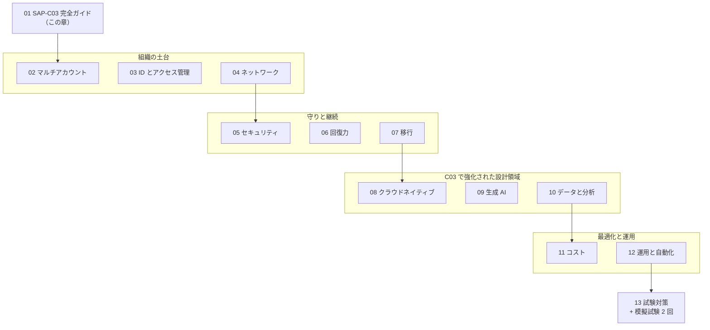
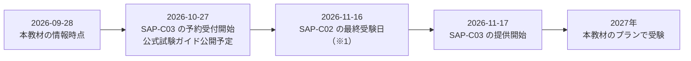
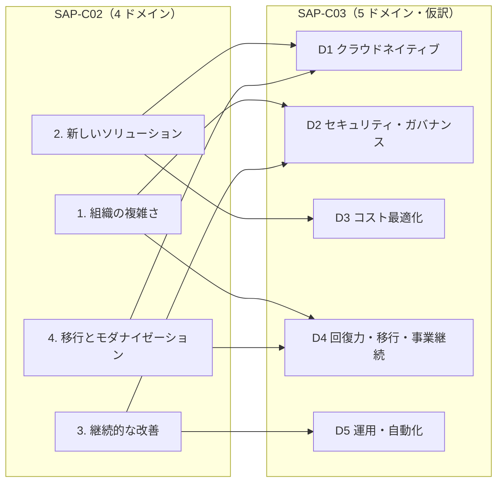
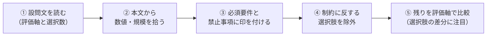

[ホーム](../README.md) > [Phase 3: プロフェッショナル](README.md) > SAP-C03 完全ガイド

# SAP-C03 完全ガイド

> **この章のゴール**
> - SAP-C03 の試験概要（問題数・時間・料金・日程）と、SAP-C02 からの変更点を説明できる
> - 5 つのドメインと Phase 3 の各章の対応を把握し、自分の学習計画に落とし込める
> - SAP の長文問題から「要件」「制約」「評価軸」を抜き出し、消去法で最適解を選べる
> - SAP-C02 向けの教材を、古くなった情報に注意しながら活用できる
> - SAP-C02 と SAP-C03 のどちらを受験するかを判断できる
>
> **対応試験**: SAP-C03（全ドメイン）
> **目安時間**: 読む 90分 / 確認問題 30分

## この章の全体像

AWS Certified Solutions Architect – Professional（SAP）は、AWS 認定の中でも「設計判断の質」を最も厳しく問う試験です。
SAA では「要件を満たすサービスを選ぶ」力が問われましたが、SAP では **どの選択肢も一応は動く状況で、複数の制約を同時に満たす最適な組み合わせを選ぶ** 力が問われます。

この章は Phase 3 の入口です。試験の仕組みと出題範囲を押さえ、Phase 3 の 13 章をどの順番で、何を意識して学ぶかを決めます。

> [!IMPORTANT]
> SAP-C03 の公式試験ガイド（タスクステートメントと配点）は **2026-10-27 に公開予定** です。本章は 2026年9月時点で発表されている情報に基づいています。
> 公式ガイドの公開後は、必ず 9 節のチェックリストに沿って本章の内容と照合してください。

## 1. SAP の位置づけと求められるスキル

### 1.1 認定体系の中での位置づけ

SAP は Professional レベルの認定で、Associate レベルの SAA の上位にあたります。
受験資格の制限はありませんが、SAP-C02 の試験ガイドでは「AWS のサービスを使ったクラウドソリューションの設計・実装について 2 年以上の経験」が推奨されています（SAP-C03 の推奨経験は公式ガイドで確認してください）。

| 観点 | 内容 |
|---|---|
| レベル | Professional（ほかに DevOps Engineer – Professional、Generative AI Developer – Professional） |
| 有効期間 | 3 年 |
| 上位認定による更新 | **SAP に合格すると SAA も更新されます** |
| 関連する専門知識認定 | Advanced Networking – Specialty（ANS-C01）は **2026-12-31 で終了予定**（後継は未発表） |

認定全体の地図は [AWS 認定の全体像と試験の仕組み](../00-start/02-certification-map.md) を参照してください。

### 1.2 SAP で求められる 5 つの力

SAP の問題を解くには、SAA の知識に加えて次の 5 つの力が必要です。

1. **組織規模で考える力**: 1 つのアカウントではなく、数十〜数百のアカウント、複数のリージョン、オンプレミスを含む全体を設計する。
2. **トレードオフを判断する力**: コスト・運用負荷・可用性・移行リスクのどれを優先するかを、問題文の評価軸から判断する。
3. **既存環境から出発する力**: 白紙からの設計だけでなく、「すでにあるシステムをどう改善・移行するか」を考える。
4. **サービスを組み合わせる力**: 例: 「Transit Gateway + Direct Connect ゲートウェイ + AWS RAM + Route 53 Resolver」のように、複数のサービスを 1 つの解として組み立てる。
5. **最新のサービス状況を知る力**: 新規受付を終了したサービスや、新しく追加された機能を知っている（SAP-C03 では生成 AI やレジリエンスエンジニアリングが追加されました）。

> [!TIP]
> **試験のポイント**: SAP の選択肢は「サービス名の違い」より「構成の細部の違い」で差がつきます。
> 例: 「プライベート VIF」か「トランジット VIF」か、「IAM ポリシー」か「SCP」か、「組織の証跡」か「アカウントごとの証跡」か。
> 細部を正しく比較できるよう、各章では仕組みから理解してください。

## 2. 試験概要

### 2.1 基本情報

| 項目 | SAP-C02（現行） | SAP-C03（新バージョン） |
|---|---|---|
| 提供期間 | 〜2026-11-16（※1） | 2026-11-17 から提供開始（予約受付は 2026-10-27 から） |
| 問題数 | 75 問（採点対象 65 問 + 採点対象外 10 問） | 75 問（採点対象・対象外の内訳は未公表） |
| 試験時間 | 180 分 | 180 分 |
| 受験料 | 300 USD / 40,000 円（税別。消費税 10% 込みで 44,000 円） | 同左 |
| 合格点 | 750 点（100〜1,000 のスケールスコア） | 未公表（SAP-C02 と同様であれば 750 点。公式ガイドで要確認） |
| ドメイン | 4 つ（配点 26% / 29% / 25% / 20%） | 5 つ（配点は未公表） |
| 出題形式 | 単一選択（4 択）と複数選択 | 公式ガイドで確認（C02 と同様の形式と見込まれる） |

※1: 2026-11-16 は AWS 公式ブログの記載です。認定ページでは 2026-11-17 と表記されている箇所もあるため、受験前に公式情報で確認してください。

（2026年9月時点。最新情報は [AWS Certified Solutions Architect – Professional の認定ページ](https://aws.amazon.com/certification/certified-solutions-architect-professional/) を確認してください）

### 2.2 日程

本教材の学習プラン（[学習計画と進捗管理](../00-start/03-study-plan.md)）では、SAP の受験は標準プランで 2027年7月中旬、短期プランで 2027年3月下旬、長期プランで 2027年9月下旬です。どのプランでも **受験するのは SAP-C03** になります。

### 2.3 採点と受験のルール

| ルール | 内容 |
|---|---|
| スコア | 100〜1,000 のスケールスコア。ドメインごとの合格基準はなく、全体の合計で判定（補償型） |
| 未回答 | 不正解として扱われる。推測で答えても減点はないので、**必ずすべて回答する** |
| 採点対象外の問題 | 本番の問題と見分けがつかない。すべて本番のつもりで解く |
| 結果 | 5 営業日以内に通知（終了画面では合否が表示されない場合が多い） |
| 再受験 | 不合格の場合、**14 日間** 待てば再受験できる（回数制限なし、毎回受験料が必要） |
| 合格特典 | 次回の受験に使える 50% 割引バウチャー |
| 受験方法 | テストセンター、またはオンライン監督（OnVUE）。オンラインでは休憩不可 |
| 言語 | 日本語で受験可能。翻訳版では問題ごとに英語表示へ切り替えられる |

> [!WARNING]
> **ひっかけ注意**: 英語が母国語でない受験者向けの「ESL +30 分」の特別措置は、**英語で受験する場合のみ** 対象です。日本語で受験する場合は 180 分のままです。
> 時間配分の練習は 180 分（1 問あたり 2.4 分）で行ってください。

## 3. SAP-C02 から SAP-C03 への変更点

### 3.1 ドメイン構成: 4 つから 5 つへ

SAP-C02 のドメインは「組織の複雑さ」「新しいソリューション」「既存ソリューションの改善」「移行」という **設計の場面** で分かれていました。
発表された SAP-C03 のドメイン名を見ると、「クラウドネイティブ」「セキュリティ」「コスト」「回復力・移行」「運用」という **設計のテーマ** で分かれています（下表の対応づけは本教材の見立てで、公式のものではありません）。

| SAP-C02 のドメイン（配点） | 主なタスク | SAP-C03 で主に引き継ぐ先（本教材の見立て） |
|---|---|---|
| 1. 組織の複雑さに対応するソリューションの設計（26%） | ネットワーク接続戦略、セキュリティ統制、回復力のある設計、マルチアカウント環境、コストの可視化 | D2、D1（ネットワーク）、D4、D3 |
| 2. 新しいソリューションのための設計（29%） | デプロイ戦略、事業継続、セキュリティ、信頼性、パフォーマンス、コスト | D1、D4、D2、D3 |
| 3. 既存のソリューションの継続的な改善（25%） | 運用上の優秀性、セキュリティ、パフォーマンス、信頼性、コストの改善 | D5、D2、D3、D4 |
| 4. ワークロードの移行とモダナイゼーションの加速（20%） | 移行対象の選定、移行アプローチ、新しいアーキテクチャ、モダナイゼーション | D4（移行）、D1（モダナイゼーション） |

SAP-C03 の 5 ドメインは次のとおりです（英語名からの仮訳。公式の日本語名は試験ガイドの公開後に確認してください）。

| # | 英語名 | 仮訳 |
|---|---|---|
| D1 | Design and implement cloud-native architectures | クラウドネイティブアーキテクチャの設計と実装 |
| D2 | Security, compliance, and governance | セキュリティ、コンプライアンス、ガバナンス |
| D3 | Design cost-optimized architectures | コストを最適化したアーキテクチャの設計 |
| D4 | Resilience, migration, and business continuity | 回復力、移行、事業継続 |
| D5 | Operational excellence and automation | 運用上の優秀性と自動化 |

（図は主な対応のみを示しています。1 つの旧ドメインの内容は、複数の新ドメインに分かれて引き継がれると考えてください）

### 3.2 追加された領域

SAP-C02 の中核となる設計能力（マルチアカウント、ネットワーク、DR、移行、コスト最適化など）は **そのまま引き継がれます**。そのうえで、次の領域が追加されました（スキル数は発表時点の情報。公式ガイドで最終確認してください）。

| 追加領域 | 追加スキル数 | 主な内容 | 本教材の章 |
|---|---|---|---|
| 生成 AI・エージェント AI | 11 | Amazon Bedrock との統合設計、Amazon Bedrock AgentCore によるエージェントのアーキテクチャ、RAG、Guardrails によるコンテンツフィルタリング、人による監督、コスト管理 | [09](09-generative-ai-architecture.md) |
| クラウドネイティブパターン | 7 | サーバーレスのデータパイプライン、Step Functions による永続的なワークフロー、VPC Lattice と ECS Service Connect によるサービスメッシュ、コンテナセキュリティ | [08](08-cloud-native-architecture.md)、[04](04-advanced-networking.md) |
| レジリエンスエンジニアリング | 件数の明示なし | AWS Fault Injection Service（FIS）、AWS Resilience Hub、Amazon Application Recovery Controller（ARC） | [06](06-resilience-business-continuity.md) |
| DevSecOps と可観測性 | 6 | パイプラインでの脆弱性スキャン、マルチアカウントのデプロイパイプライン、コンテナの監視、AI/ML のメトリクス監視、合成監視とリアルユーザー監視 | [12](12-operational-excellence.md)、[05](05-security-architecture.md) |
| データと分析 | 3 | Lake Formation と Apache Iceberg によるレイクハウス、AWS Clean Rooms | [10](10-data-analytics-architecture.md) |
| 耐量子暗号 | 件数の明示なし | ML-DSA（署名）と ML-KEM（鍵交換） | [05](05-security-architecture.md) |

> [!WARNING]
> **ひっかけ注意**: 耐量子暗号は「AWS KMS で ML-KEM の鍵を作る」わけではありません。
> KMS がサポートするのは **ML-DSA の非対称キー（署名・検証）** で、ML-KEM は KMS・ACM・Secrets Manager のエンドポイントとの **TLS のハイブリッド鍵交換** として使われます。詳しくは [セキュリティとコンプライアンスのアーキテクチャ](05-security-architecture.md) で学びます。

### 3.3 変わらないもの

追加領域に目が行きがちですが、**配点の大部分は従来からの中核能力** になると考えるのが自然です（配点は未公表）。
特に次のテーマは SAP-C02 で繰り返し出題されてきた定番で、SAP-C03 でも土台になります。

- マルチアカウント戦略（Organizations、SCP、Control Tower、委任管理者）
- ハイブリッド接続（Direct Connect、VPN、Transit Gateway、ハイブリッド DNS）
- RPO/RTO に応じた DR 戦略とマルチリージョン設計
- 移行戦略（7R）と移行ツールの選定
- 組織規模のコスト最適化（購入オプション、コスト配分、アーキテクチャの見直し）

## 4. 5 つのドメインと本教材の対応

### 4.1 各ドメインで問われること

以下は発表内容と SAP-C02 の出題傾向からの見込みです。公式ガイドの公開後に確認してください。

**D1 クラウドネイティブアーキテクチャの設計と実装**
新しいワークロードを AWS らしく設計する力です。サーバーレス、コンテナ、イベント駆動、データパイプライン、VPC Lattice によるサービス間通信、生成 AI・エージェント AI（追加スキル 11 個の大半がここに入ると考えられます）、レイクハウスが対象です。
主な章: [04](04-advanced-networking.md)、[07](07-migration-modernization.md)、[08](08-cloud-native-architecture.md)、[09](09-generative-ai-architecture.md)、[10](10-data-analytics-architecture.md)

**D2 セキュリティ、コンプライアンス、ガバナンス**
組織全体を守り、統制する力です。OU と SCP / RCP の設計、IAM Identity Center によるフェデレーション、検出と対応の集中化、暗号化と鍵管理（耐量子暗号を含む）、コンテナやパイプラインのセキュリティが対象です。
主な章: [02](02-multi-account-governance.md)、[03](03-identity-federation.md)、[05](05-security-architecture.md)

**D3 コストを最適化したアーキテクチャの設計**
組織規模でコストを可視化・配分し、購入オプションとアーキテクチャの両面から最適化する力です。生成 AI のコスト管理も新しい論点です。各章の「コストのトレードオフ」も D3 の出題対象になります。
主な章: [11](11-cost-optimization-at-scale.md)

**D4 回復力、移行、事業継続**
障害に強い設計と、その検証（FIS、Resilience Hub、ARC）、DR 戦略、オンプレミスからの大規模移行が対象です。ハイブリッド接続の冗長化もここに含まれます。
主な章: [04](04-advanced-networking.md)、[06](06-resilience-business-continuity.md)、[07](07-migration-modernization.md)

**D5 運用上の優秀性と自動化**
IaC、マルチアカウントのデプロイパイプライン、可観測性（合成監視、リアルユーザー監視、コンテナ・AI/ML のメトリクス）、自動修復が対象です。
主な章: [02](02-multi-account-governance.md)、[12](12-operational-excellence.md)

### 4.2 章とドメインの対応表

◎ = Phase 3 目次の「主なドメイン」、○ = 関連する内容を含む（本教材の見立て）、★ = SAP-C03 の追加領域に関係するトピックです。

| 章 | D1 | D2 | D3 | D4 | D5 | 主なトピック |
|---|---|---|---|---|---|---|
| [01 SAP-C03 完全ガイド](01-sap-c03-overview.md) | ○ | ○ | ○ | ○ | ○ | 試験の全体像、学習戦略 |
| [02 マルチアカウント戦略とガバナンス](02-multi-account-governance.md) | | ◎ | ○ | | ◎ | OU 設計、SCP / RCP、Control Tower、★マルチアカウントのデプロイ |
| [03 大規模な ID とアクセス管理](03-identity-federation.md) | | ◎ | | | | IAM Identity Center、フェデレーション、ABAC |
| [04 高度なネットワーク設計](04-advanced-networking.md) | ◎ | ○ | ○ | ◎ | | Transit Gateway、Direct Connect、ハイブリッド DNS、★VPC Lattice |
| [05 セキュリティとコンプライアンスのアーキテクチャ](05-security-architecture.md) | | ◎ | | | ○ | 検出の集中化、自動修復、★耐量子暗号、★コンテナセキュリティ |
| [06 回復力と事業継続](06-resilience-business-continuity.md) | | | | ◎ | ○ | DR 戦略、マルチリージョン、★FIS / Resilience Hub / ARC |
| [07 移行とモダナイゼーション](07-migration-modernization.md) | ◎ | | | ◎ | | 7R、移行ツール、段階的移行 |
| [08 クラウドネイティブ設計](08-cloud-native-architecture.md) | ◎ | | ○ | ○ | | ★サーバーレスのデータパイプライン、★Step Functions、★ECS Service Connect |
| [09 生成 AI・エージェント AI のアーキテクチャ](09-generative-ai-architecture.md) | ◎ | ○ | ○ | | | ★Bedrock、★AgentCore、★RAG、★Guardrails |
| [10 データと分析のアーキテクチャ](10-data-analytics-architecture.md) | ◎ | ○ | | | | ★レイクハウス（Lake Formation・Iceberg）、★Clean Rooms |
| [11 大規模環境のコスト最適化](11-cost-optimization-at-scale.md) | | | ◎ | | | 購入オプション、コスト配分、★生成 AI のコスト管理 |
| [12 運用上の優秀性と自動化](12-operational-excellence.md) | | ○ | | | ◎ | IaC、★DevSecOps、★合成監視・RUM・AI/ML メトリクス |
| [13 SAP-C03 試験対策](13-sap-exam-prep.md) | ○ | ○ | ○ | ○ | ○ | 総仕上げ、弱点の補強 |

> [!TIP]
> **試験のポイント**: 本教材の章はドメインと 1 対 1 ではありません。SAP の問題は 1 問の中に複数のドメインが混ざります（例: 「移行（D4）の途中で、コスト（D3）を抑えつつ、統制（D2）を保つ」）。
> 章をまたいで知識をつなげることを意識してください。

## 5. SAP の問題の特徴と読み方

### 5.1 4 つの特徴

| 特徴 | 内容 | 対策 |
|---|---|---|
| 長文 | 1 問に関係者、既存環境、要件、制約が並ぶ。選択肢も 2〜4 行ある | 先に設問文（最後の 1 文）を読み、何を基準に選ぶかを決めてから本文を読む |
| どの選択肢も「動く」 | 誤りの選択肢の多くは「技術的に不可能」ではなく「要件の一部を満たさない」「運用負荷が大きい」「コストが高い」「期限に間に合わない」 | 選択肢の **差分** に注目する |
| 複数の制約 | 例: 「RPO 15 分」と「最もコスト効率の高い」が同時に課される | **必須の制約で絞り込み**、残りを **評価軸** で比較する |
| 複数選択 | 「2 つ選択」「3 つ選択」。すべて正しく選ばないと得点にならない | 選択肢どうしの組み合わせ（手順の前後関係）も確認する |

### 5.2 評価軸を表す表現

設問文の最後にある「最も〇〇な」は、残った選択肢を比べる **物差し** です。

| 問題文の表現 | 意味 | 選ぶ方向の例 |
|---|---|---|
| 運用上のオーバーヘッドが最も少ない | 構築・保守の手間 | マネージドサービス、組織単位の一括設定（委任管理者、組織の証跡）、自動化。自作スクリプトやアカウントごとの個別設定は不利 |
| 最もコスト効率の高い | 要件を満たす中での総コスト | 要件を満たす最小構成、従量課金、購入オプション。過剰な冗長化は不利 |
| 最小限の変更で / 最も迅速に | 移行期間とリスク | リホスト、既存プロトコルとの互換（例: AWS MGN、FSx for Windows File Server） |
| RPO / RTO | 許容できるデータ損失と停止時間 | 数値を満たす DR 戦略のうち最も安いもの |
| 〜しなければならない / 〜してはならない | 必須の制約 | 満たさない選択肢は即座に除外 |
| 将来の成長に対応できる | スケーラビリティ | アカウントや VPC が増えても作業が増えない構成 |

> [!TIP]
> **試験のポイント**: 「運用上のオーバーヘッドが最も少ない」と「最もコスト効率の高い」では、同じ状況でも正解が変わることがあります。
> 例: 大量の VPC 間通信では、コスト重視なら VPC ピアリング（時間料金なし）、運用重視なら Transit Gateway（ハブで一元管理）が有利になりがちです。

### 5.3 読み方の手順

1. **設問文を読む**: 「最も運用上のオーバーヘッドが少ない」「2 つ選択」などを確認します。
2. **数値・規模を拾う**: アカウント数、リージョン数、帯域、データ量、RPO/RTO、期限。数値は選択肢を絞る強い手がかりです。
3. **必須要件と禁止事項に印を付ける**: 「〜できないようにする」「インターネットを経由してはならない」など。
4. **制約に反する選択肢を除外する**: ここで 2 つ程度に絞れることが多いです。
5. **評価軸で比較する**: 残った選択肢は、たいてい 1〜2 か所だけが違います。その差分が評価軸にどう効くかを考えます。

### 5.4 例題で練習する

次の例題は SAP 形式の問題を短くしたものです。【 】は、読みながら付ける印の例です。

> ある企業は AWS Organizations で **120 のアカウント**【規模】を管理しており、各アカウントに 1〜3 個の VPC がある。現在は必要な VPC 同士を **VPC ピアリングで個別に接続** しているが、接続数が増えて管理が限界に達している【現状の課題】。オンプレミスとは東京リージョンの **2 本の AWS Direct Connect 接続** でつながっている【既存資産】。セキュリティチームは、**本番 VPC と開発 VPC の間の通信を禁止** し、**共有サービス VPC にはどちらからも接続できる** ようにすることを求めている【必須要件】。ネットワークチームは、**新しいアカウントが増えても作業を最小限に抑えたい**【評価軸の補足】。**最も運用上のオーバーヘッドが少ない** ソリューションはどれか【評価軸】。
>
> - A. 必要な VPC 間にピアリングを追加し、ピアリングとルートの作成を AWS Lambda で自動化する。
> - B. ネットワークアカウントに Transit Gateway を作成して AWS RAM で組織に共有し、本番用・開発用・共有用のルートテーブルで通信を分離する。Direct Connect は Direct Connect ゲートウェイとトランジット VIF で Transit Gateway に接続し、アタッチメントの関連付けはタグで自動化する。
> - C. 各 VPC に仮想プライベートゲートウェイを作成し、VPC ごとにプライベート VIF を作成する。
> - D. Transit Gateway にすべての VPC を接続して 1 つのルートテーブルに関連付け、本番と開発の間の通信は各 VPC のネットワーク ACL でブロックする。

| 印 | 問題文の記述 | 読み取ること |
|---|---|---|
| 規模 | 120 アカウント × 1〜3 VPC | 最大 360 VPC。1 対 1 の接続（ピアリング、VPC ごとの VIF）はスケールしない |
| 現状の課題 | ピアリングの管理が限界 | ハブ型の構成に変えることが求められている |
| 既存資産 | Direct Connect 2 本 | 既存の DX を活かす（Direct Connect ゲートウェイ + トランジット VIF） |
| 必須要件 | 本番⇔開発は禁止、共有へは可 | ルーティングによるセグメンテーションが最も確実 |
| 評価軸 | 運用上のオーバーヘッド、アカウント増加時の作業 | 共有・自動化・宣言的な仕組みが有利 |

**消去の過程**
- **A**: 動きますが、接続数は VPC 数 n に対して n(n−1)/2 で増え、VPC あたりのピアリング数にも上限があります。自動化しても管理対象が膨大です。→ 除外
- **C**: VIF の数には上限があり、VPC 間の通信という課題も解決しません。→ 除外
- **D**: 動きますが、数百の VPC のネットワーク ACL を管理し続ける必要があり、設定ミスがそのまま本番⇔開発の通信を許します。→ 除外
- **B**: 規模・既存資産・必須要件・評価軸のすべてを満たします。→ **正解**

この構成の詳細は [高度なネットワーク設計](04-advanced-networking.md) で学びます。

> [!WARNING]
> **ひっかけ注意**: 「自動化（Lambda など）で運用負荷を下げる」選択肢は魅力的に見えますが、**AWS の標準機能で同じことができる場合は、自作の自動化は運用上のオーバーヘッドが大きい** と判断されるのが通例です。

### 5.5 時間配分

180 分で 75 問なので、1 問あたり 2.4 分です。次の配分を目安にしてください。

| 段階 | 時間 | やること |
|---|---|---|
| 1 周目 | 約 130 分 | すべての問題に仮の回答を入れる。迷った問題は「見直し」マークを付けて先へ進む（1 問に 4〜5 分以上かけない） |
| 2 周目 | 約 40 分 | マークした問題を見直す |
| 最終確認 | 約 10 分 | 未回答がないことを確認する |

本教材の SAP-C03 模擬試験（40 問）は、同じペースで約 96 分です。2 回分を続けて解くと本番に近い負荷を体験できます。

## 6. 学習戦略

### 6.1 SAA との差分を埋める

| 観点 | SAA の学習 | SAP で追加すること |
|---|---|---|
| 知識の単位 | サービス単体の機能 | 複数サービスの組み合わせと、その間の設定（共有、委任、関連付け） |
| 範囲 | 単一アカウント | 組織全体（Organizations、委任管理者、AWS RAM による共有） |
| 数値 | 主要な上限値 | 帯域・クォータ・料金の概算で、構成を比較できる |
| 移行 | サービス名と用途 | 発見 → 評価 → 移行ウェーブ → カットオーバーの計画 |
| 判断基準 | 要件を満たすか | 要件を満たす中で「最も〇〇」か |
| 最新情報 | 主要サービスの現状 | 新規受付の終了、名称変更、新機能（SAP-C03 の追加領域を含む） |

### 6.2 Phase 3 の進め方

Phase 3 の目次に示した目安時間の合計は約 100 時間です。次の順番で進めてください。

1. **土台（02〜04 章）**: マルチアカウント、ID、ネットワークは、ほかのすべての章の前提になります。
2. **守りと継続（05〜07 章）**: セキュリティ、回復力、移行。SAP-C02 からの定番テーマです。
3. **設計領域の強化（08〜10 章）**: SAP-C03 で追加された領域の多くがここに集まっています。
4. **最適化と運用（11〜12 章）**: コストと運用を、それまでの章の構成に当てはめて考えます。
5. **仕上げ（13 章と模擬試験）**: 模擬試験で 75% 以上を目標にします。

各章では次のサイクルを回します。

- 本文を読む → 「典型シナリオと解法」を、**解法を読む前に 1〜2 分自分で考えてから** 読む → 確認問題を解く → 間違えた問題を記録する
- ハンズオンは、Lab 10 を 02 章の後、Lab 11 を 04 章の後、Lab 13 を 06 章の後、Lab 12 を 09 章の後に行います。

> [!TIP]
> **試験のポイント**: 間違えた問題は、原因を 3 つに分類して記録すると効果的です。
> ①知識不足（サービスや機能を知らなかった） ②読み違い（制約や評価軸を見落とした） ③考えすぎ（問題文にない条件を想定した）。
> SAP では ②と③ の比率が SAA より高くなります。

### 6.3 読むべき公式資料

| 資料 | 内容 | 主に役立つ章 |
|---|---|---|
| [Organizing Your AWS Environment Using Multiple Accounts](https://docs.aws.amazon.com/whitepapers/latest/organizing-your-aws-environment/organizing-your-aws-environment.html) | OU 設計、アカウントの分け方、ガバナンスのベストプラクティス | 02 |
| [Disaster Recovery of Workloads on AWS](https://docs.aws.amazon.com/whitepapers/latest/disaster-recovery-workloads-on-aws/disaster-recovery-workloads-on-aws.html) | 4 つの DR 戦略、RPO/RTO の考え方 | 06 |
| [Building a Scalable and Secure Multi-VPC AWS Network Infrastructure](https://docs.aws.amazon.com/whitepapers/latest/building-scalable-secure-multi-vpc-network-infrastructure/welcome.html) | Transit Gateway、集中型エグレス・インスペクション、ハイブリッド DNS | 04 |
| [AWS Security Reference Architecture（AWS SRA）](https://docs.aws.amazon.com/prescriptive-guidance/latest/security-reference-architecture/welcome.html) | マルチアカウントでのセキュリティサービスの配置 | 02、05 |
| [AWS Well-Architected Framework](https://docs.aws.amazon.com/wellarchitected/latest/framework/welcome.html) | 6 つの柱と設計原則。生成 AI・エージェント AI などのレンズもある | 全章 |
| [Amazon Builders' Library](https://aws.amazon.com/builders-library/) | Amazon が実際に使っている設計手法（タイムアウトとリトライ、静的安定性、シャッフルシャーディングなど） | 06、08 |
| [AWS Architecture Center](https://aws.amazon.com/architecture/) | 参照アーキテクチャ図と設計ガイダンス | 全章 |

使い方のコツは次のとおりです。

- **ホワイトペーパー**: 全文を読む必要はありません。各章を読んだ後に、その章に対応する資料の「推奨事項」「パターン」の部分を読むと、問題文でよく使われる言い回しに慣れます。
- **Builders' Library**: 「なぜその設計なのか」を学ぶ読み物です。回復力（06 章）の理解が深まります。
- **re:Invent**: 毎年 12 月に開催される AWS 最大のカンファレンスで、セッション動画が公開されます。レベル 300〜400 のアーキテクチャ系セッションは SAP の題材の宝庫です。新サービスの発表も多いので、試験直前の年の発表には目を通しておきましょう。
- **日本語の資料**: [AWS Black Belt Online Seminar](https://aws.amazon.com/jp/events/aws-event-resource/archive/) はサービスごとの日本語解説資料です。ハンズオン教材は [JP Contents Hub](https://aws-samples.github.io/jp-contents-hub/) から探せます。

### 6.4 問題演習

- **本教材の確認問題と模擬試験**: 各章の確認問題 → [SAP-C03 模擬試験 第 1 回・第 2 回](../05-practice-exams/README.md)。
- **AWS Skill Builder**（[skillbuilder.aws](https://skillbuilder.aws)）: 無料の Official Practice Question Set（20 問）や試験準備コース、サブスクリプションで利用できる Official Pretest（本番と同じ問題数の模擬試験）があります。SAP-C03 向けの提供状況は公式ガイドの公開後に確認してください。
- **ハンズオン**: Lab だけでなく、[Workshop Studio のワークショップ](https://catalog.workshops.aws/) でマルチアカウントやネットワークの構成を実際に組むと、選択肢の「細部の違い」が見分けやすくなります。

## 7. SAP-C02 向け教材の活用法と注意

### 7.1 そのまま使える内容

SAP-C02 の中核となる設計能力は SAP-C03 に引き継がれます。SAP-C02 向けの書籍・問題集・動画のうち、次の内容はそのまま使えます。

- マルチアカウント、ハイブリッドネットワーク、DR、移行戦略（7R）、コスト最適化の **設計の考え方**
- 長文問題の読み方と、消去法の練習
- 「運用上のオーバーヘッドが最も少ない」などの評価軸による判断の練習

### 7.2 古くなっている内容

一方で、**サービスの状況** は大きく変わっています。SAP-C02 向けの教材で次の記述を見たら、現在の状況に読み替えてください。

| SAP-C02 向け教材でよく見る記述 | 2026年9月時点の状況 | 学習での扱い |
|---|---|---|
| App Mesh でサービスメッシュを構成 | 【サポート終了】2026-09-30 | VPC Lattice / ECS Service Connect（C03 の追加領域） |
| Snowball Edge で大容量データをオフライン移行 | 【新規受付終了】すべての Snowball Edge（2025-11-07） | 新規は DataSync（オンライン）、AWS Data Transfer Terminal（オフライン） |
| Application Discovery Service と Migration Hub で移行計画 | 【新規受付終了】2025年10月・11月に発表 | AWS Transform（検出、依存関係のマッピング、移行計画）。MGN と DMS は継続 |
| Bedrock のエージェント（Agents for Amazon Bedrock） | 【新規受付終了】「Agents Classic」として 2026-07-30 | Amazon Bedrock AgentCore |
| Amazon Kendra でエンタープライズ検索 | 【新規受付終了】2026年6月に発表 | Amazon Bedrock Knowledge Bases |
| AWS Audit Manager で監査の証拠を収集 | 【新規受付終了】2026年3月に発表 | AWS Config の適合パック、Security Hub CSPM、AWS Artifact |
| CloudTrail Lake でログを分析 | 【新規受付終了】2026-05-31 | 証跡 → S3 + Athena、CloudWatch Logs、Security Lake |
| App Runner でコンテナを手軽に公開 | 【新規受付終了】2026-04-30 | Amazon ECS Express Mode |
| AWS Security Hub | 【名称変更】Security Hub CSPM。2025-12-02 に新しい統合型の Security Hub が GA | どちらの話かを区別する |
| ARC の readiness check | 【新規受付終了】2026-04-30 | ARC はリージョン切り替え（Region switch）とゾーンシフトを中心に学ぶ |
| SQS の最大メッセージサイズ 256 KB | 1 MiB（2025-08-04〜） | 古い問題では 256 KB が前提の場合がある |
| S3 のオブジェクト最大 5 TB / Aurora Global Database のセカンダリ最大 5 | 50 TB / 最大 10 リージョン | 同上 |
| CodeCommit は新規受付終了 | 2025-11-24 に GA に復帰 | 「非推奨」と覚えない |

サービスの状況の一覧は [サービスの変更点](../06-reference/service-changes.md) にまとめています。

> [!WARNING]
> **ひっかけ注意**: 試験や古い教材では、旧名称や旧仕様で出題される可能性があります。
> 学習では **現在の状況** を正として理解し、問題文が旧仕様を前提にしている場合は、その前提の中で最適な答えを選んでください。

### 7.3 SAP-C03 で補うべき領域

SAP-C02 向けの教材には、3.2 節の追加領域がほとんど含まれていません。次の章を重点的に学んでください。

- 生成 AI・エージェント AI → [09 章](09-generative-ai-architecture.md)
- クラウドネイティブパターン（Step Functions、VPC Lattice、ECS Service Connect） → [08 章](08-cloud-native-architecture.md)、[04 章](04-advanced-networking.md)
- レジリエンスエンジニアリング（FIS、Resilience Hub、ARC） → [06 章](06-resilience-business-continuity.md)
- DevSecOps と可観測性 → [12 章](12-operational-excellence.md)
- レイクハウスと Clean Rooms → [10 章](10-data-analytics-architecture.md)
- 耐量子暗号 → [05 章](05-security-architecture.md)

## 8. SAP-C02 か SAP-C03 か

| あなたの状況 | おすすめ | 理由・注意 |
|---|---|---|
| 2026-11-16 までに受験でき、SAP-C02 の模擬試験で安定して 75% 以上取れている | SAP-C02 | 準備済みの力をそのまま使える。ただし不合格の場合、再受験は 14 日後以降なので、期限内にもう一度受けられる日程で 1 回目を受ける |
| SAP-C02 の準備が不十分、または受験日が 2026-11-17 以降になる | SAP-C03 | SAP-C02 は受験できない |
| 本教材の学習プランで学習している（SAP の受験は 2027年） | SAP-C03 | 本教材は SAP-C03 を前提に構成している |
| 生成 AI、コンテナ、可観測性の実務経験がある | SAP-C03 でも不利になりにくい | 追加領域が得点源になる |
| SAP-C02 の問題集をすでに持っている | 受験は SAP-C03 でも教材は活用できる | 7 節に従って読み替える |

どちらのバージョンで合格しても、取得できるのは同じ AWS Certified Solutions Architect – Professional の認定です（有効期間 3 年）。
迷ったら、「期限に追われて焦って受ける」より「SAP-C03 に向けて確実に準備する」ほうが、結果的に早く合格できることが多いです。

## 9. 公式試験ガイドの公開後（2026-10-27〜）にやること

公式試験ガイドが公開されたら、次の項目を確認してください。現行の [SAP-C02 の試験ガイド](https://docs.aws.amazon.com/aws-certification/latest/solutions-architect-professional-02/solutions-architect-professional-02.html) と同じ AWS 認定のドキュメントで公開されると見込まれます。

- [ ] 5 ドメインの配点と、各ドメインのタスクステートメント（スキル）の一覧
- [ ] 採点対象・対象外の問題数と合格点（SAP-C02 と同様であれば 65 + 10 問、750 点）
- [ ] 出題範囲に含まれるサービス / 含まれないサービスの一覧（新規受付を終了したサービスの扱いを含む）
- [ ] 公式の日本語ドメイン名（本教材の仮訳との対応）
- [ ] 本章 4.2 節の対応表と照合し、本教材で扱いが薄いスキルを学習計画に追加する
- [ ] Skill Builder の SAP-C03 向け公式教材（練習問題、試験準備コース）の提供状況

## まとめ

- SAP-C03 は **75 問 / 180 分 / 300 USD（40,000 円・税別）**。合格点と配点は未公表で、SAP-C02 と同様であれば 750 点です。
- 日程は **2026-10-27 予約受付開始・公式ガイド公開予定 → 2026-11-16 SAP-C02 最終日（※） → 2026-11-17 SAP-C03 提供開始** です。
- ドメインは 4 つ（設計の場面別）から 5 つ（テーマ別）になり、生成 AI・エージェント AI（11 スキル）、クラウドネイティブパターン（7）、DevSecOps と可観測性（6）、データと分析（3）、レジリエンスエンジニアリング、耐量子暗号が追加されました。
- SAP-C02 の中核となる設計能力（マルチアカウント、ネットワーク、DR、移行、コスト）は引き継がれます。
- SAP の問題は「どの選択肢も動く」中で、**必須の制約で絞り込み、評価軸で比較する** のが基本です。選択肢の差分に注目してください。
- 日本語受験では ESL +30 分の対象外です。1 問あたり 2.4 分で練習します。
- SAP-C02 向けの教材は「設計の考え方」には有効ですが、「サービスの状況」は古くなっている場合があります（7.2 節）。
- 本教材の学習プランで学ぶ人は **SAP-C03** を受験します。公式ガイドの公開後は 9 節のチェックリストで照合してください。

## 確認問題

### 問1
ある企業のエンジニアは、2026年9月に SAA-C03 に合格しました。本教材の標準プランで学習を続け、2027年7月に SAP を受験する予定です。2026年10月、同僚から「SAP-C02 向けの問題集が安く手に入る」と勧められました。このエンジニアの行動として最も適切なものはどれですか。

- A. 2027年7月に受験できるのは SAP-C03 なので、2026-10-27 以降に公開される公式試験ガイドでタスクステートメントを確認する。SAP-C02 向けの問題集は中核となる設計能力の演習に使い、追加領域は別の教材で補う。
- B. SAP-C03 は SAP-C02 と同じ 4 ドメイン構成で配点が変わるだけなので、SAP-C02 向けの問題集だけで対策する。
- C. SAP-C03 の合格点は 750 点と公式に発表されているので、SAP-C02 向けの問題集で正答率 75% を超えれば合格できると判断し、公式ガイドの確認は省略する。
- D. 日本語で受験すると ESL の特別措置で試験時間が 210 分になるため、1 問あたり約 2.8 分の時間配分で練習する。

解答と解説

**正解: A**

**解説**: SAP-C02 の最終受験日は 2026-11-16（認定ページでは 11-17 表記もあり）なので、2027年7月に受験するのは SAP-C03 です。SAP-C02 の中核となる設計能力は引き継がれるため、C02 向けの問題集も演習に使えますが、追加領域と古くなった情報は補う必要があります。
**読み方のポイント**: 評価軸は「最も適切」です。事実の誤り（ドメイン数、合格点、ESL）を含む選択肢を消していけば、A が残ります。

**各選択肢の検討**
- A: ✓ 受験バージョンの判断、公式ガイドの確認、C02 教材の適切な使い方のすべてが正しい。
- B: ✗ SAP-C03 は 5 ドメイン構成で、生成 AI などの領域が追加されている。
- C: ✗ SAP-C03 の合格点は未公表。また、スケールスコアの 750 点は「正答率 75%」と同じ意味ではない。
- D: ✗ ESL +30 分は英語で受験する場合のみが対象。日本語受験は 180 分のまま。

### 問2
ある保険会社は、東京リージョンで契約管理システムを運用しています。システムは Application Load Balancer、Auto Scaling グループの Amazon EC2 インスタンス（アプリケーション層）、Amazon Aurora MySQL で構成されています。監督官庁の指針を受けて、大阪リージョンに DR 環境を用意することになりました。経営層が合意した目標は RPO 5 分、RTO 1 時間です。DR 環境は年 1 回の訓練以外では使用しません。これらの要件を満たし、最もコスト効率の高いソリューションはどれですか。

- A. AWS Backup で EC2 インスタンスと Aurora のバックアップを毎日取得して大阪リージョンにコピーする。災害時は AWS CloudFormation で環境を作成し、最新のバックアップから復元する。
- B. 大阪リージョンにも東京と同じ台数の EC2 インスタンスと Aurora Global Database のセカンダリクラスターを常時稼働させ、Amazon Route 53 の加重ルーティングで両リージョンに 50% ずつ振り分ける。
- C. 大阪リージョンで最小台数の EC2 インスタンスを常時稼働させ、Aurora Global Database のセカンダリクラスターも用意する。災害時は Auto Scaling グループを拡張してセカンダリクラスターにフェイルオーバーし、Route 53 のフェイルオーバールーティングで切り替える。
- D. Aurora Global Database で大阪リージョンにセカンダリクラスターを作成し、アプリケーション層の AMI を大阪リージョンにコピーしておく。災害時はセカンダリクラスターにフェイルオーバーし、CloudFormation でアプリケーション層を起動して、Route 53 のフェイルオーバールーティングで切り替える。

解答と解説

**正解: D**

**解説**: D はパイロットライト戦略です。データは Aurora Global Database で継続的にレプリケーションされるため（通常のレプリケーション遅延は 1 秒未満）RPO 5 分を満たし、アプリケーション層は AMI と IaC で数十分以内に起動できるため RTO 1 時間も満たします。常時稼働する EC2 がないので、要件を満たす選択肢の中で最も安価です。
**読み方のポイント**: 「RPO 5 分、RTO 1 時間」は必須の制約、「最もコスト効率の高い」は評価軸です。まず制約で A を除外し、残った B・C・D をコストで比べます。「年 1 回の訓練以外では使用しない」は、待機リソースを常時動かす構成が無駄になるというヒントです。

**各選択肢の検討**
- A: ✗ 毎日のバックアップでは RPO が最大 24 時間になり、RPO 5 分を満たさない。
- B: ✗ 要件は満たすが、本番と同規模の環境を常時稼働させるため最も高価。
- C: ✗ 要件は満たす（ウォームスタンバイ）が、EC2 を常時稼働させる分 D より高い。
- D: ✓ 制約を満たす中で最もコスト効率が高い。

### 問3
ある企業は AWS Organizations で 300 のアカウントを管理しています。セキュリティ部門は次の要件を示しました。

- すべてのアカウントのすべてのリージョンで、AWS CloudTrail の管理イベントを記録する
- ログは専用のログアーカイブアカウントの S3 バケットに集約する
- 各アカウントの管理者が、ログの記録設定を変更・削除できないようにする
- 今後作成するアカウントにも自動的に適用する

最も運用上のオーバーヘッドが少ない方法はどれですか。

- A. AWS CloudFormation StackSets（サービスマネージド型のアクセス許可、自動デプロイを有効化）で各アカウントに証跡を作成し、ログアーカイブアカウントのバケットに出力する。各アカウントの IAM ポリシーで cloudtrail:DeleteTrail と cloudtrail:StopLogging を拒否する。
- B. 管理アカウント、または CloudTrail の委任管理者アカウントで組織の証跡を作成し、ログアーカイブアカウントの S3 バケットに出力する。
- C. 各アカウントに Amazon EventBridge ルールを作成してすべての API イベントをログアーカイブアカウントのイベントバスに転送し、AWS Lambda 関数で S3 バケットに書き込む。
- D. AWS Config の組織ルールで各アカウントの証跡の有無を評価し、非準拠の場合は AWS Systems Manager Automation で証跡を作成して修復する。

解答と解説

**正解: B**

**解説**: 組織の証跡は、組織内のすべてのアカウント（今後追加されるアカウントを含む）のイベントを記録します。メンバーアカウントからは組織の証跡を参照できますが、変更や削除はできません。AWS Control Tower のランディングゾーンでも同様の組織の証跡が設定されます。ログの改ざん防止（S3 のバケットポリシーやオブジェクトロック）は [セキュリティとコンプライアンスのアーキテクチャ](05-security-architecture.md) で扱います。
**読み方のポイント**: 「変更・削除できないようにする」は **予防的** な統制を求める必須要件、「今後作成するアカウントにも自動的に」は **組織単位の機能** を示すヒント、「運用上のオーバーヘッドが最も少ない」は **標準機能を優先** する評価軸です。

**各選択肢の検討**
- A: ✗ 各アカウントの管理者は IAM ポリシー自体を変更できるため、「変更・削除できない」を満たさない（組織として防ぐなら SCP が必要）。StackSets の管理も加わる。
- B: ✓ 標準機能だけで全要件を満たす。
- C: ✗ 自作の仕組みで運用負荷が大きく、CloudTrail が提供するログファイルの整合性検証などの機能も得られない。
- D: ✗ 検出と修復の間に空白期間があり、管理者が証跡を停止すること自体は防げない。

### 問4
ある製造業の企業は、オンプレミスの VMware 環境で稼働する約 400 台の VM を、9 か月以内に AWS へ移行する計画です。VM 間の依存関係は文書化されておらず、どの VM を同じ移行ウェーブにまとめるべきか分かっていません。大部分の VM はアプリケーションを変更しないリホストで Amazon EC2 に移行し、カットオーバー時の停止時間は数分以内に抑えたいと考えています。この企業は、これまで AWS の移行関連サービスを使用したことがありません。移行チームが採用すべきアプローチはどれですか。2 つ選択してください。

- A. AWS Application Discovery Service のエージェントを全 VM に導入し、AWS Migration Hub で依存関係を可視化して移行ウェーブを計画する。
- B. AWS Snowball Edge に VM イメージをエクスポートして AWS に輸送し、VM Import/Export で AMI に変換してから起動する。
- C. AWS Transform を使って VMware 環境のインベントリと依存関係を検出し、移行ウェーブを計画する。
- D. すべての VM のアプリケーションをコンテナ化し、AWS App Runner でデプロイする。
- E. AWS Application Migration Service（AWS MGN）で VM のディスクを継続的にレプリケーションし、テスト起動で検証したうえで短時間でカットオーバーする。

解答と解説

**正解: C, E**

**解説**: 新規の顧客が依存関係の検出と移行計画を行うなら AWS Transform、変更なしのリホストで停止時間を最小にするなら AWS MGN の継続的なブロックレベルのレプリケーションが適しています。
**読み方のポイント**: 「これまで AWS の移行関連サービスを使用したことがない」は、**新規受付を終了したサービスを使えない** ことを示す重要な記述です。SAP-C02 向けの教材では A が典型的な正解でしたが、現在は新規の顧客には使えません（SAP-C03 での扱いは公式ガイドの対象サービス一覧で確認してください）。

**各選択肢の検討**
- A: ✗ Application Discovery Service と Migration Hub は新規受付を終了している（2025年10月・11月に発表）。
- B: ✗ Snowball Edge は新規受付を終了している。また、エクスポート後の変更が失われるオフライン移行では停止時間を数分に抑えられない。
- C: ✓ VMware 環境の検出、依存関係のマッピング、移行計画を支援する。
- D: ✗ 「アプリケーションを変更しない」に反する。App Runner も新規受付を終了している。
- E: ✓ 継続的なレプリケーションにより、カットオーバー時の停止時間を最小にできる。

### 問5
ある企業は、社内規程や業務手順書など約 5 万件の文書（Amazon S3 に保存、毎日更新）をもとに、従業員の質問に回答する生成 AI アシスタントを新たに構築します。要件は次のとおりです。

- 回答は最新の文書に基づき、根拠となった文書を示す
- 部署ごとに閲覧できる文書が異なるため、ユーザーが閲覧できない文書の内容を回答に含めない
- 回答に個人情報（PII）が含まれる場合はマスクする

この企業は、これまで AWS の検索サービスや生成 AI サービスを使用したことがありません。最も運用上のオーバーヘッドが少ない方法はどれですか。

- A. 基盤モデルを全文書で毎月ファインチューニングし、Amazon Bedrock のカスタムモデルとして利用する。部署ごとに別々のカスタムモデルを作成する。
- B. Amazon Kendra でインデックスを作成し、文書の ACL で部署ごとのアクセスを制御して、検索結果を Amazon Bedrock のモデルに渡す。
- C. Amazon SageMaker AI のエンドポイントでオープンソースの LLM をホストし、Amazon EC2 上に自己管理のベクトルデータベースを構築する。PII は AWS Lambda 関数の正規表現でマスクする。
- D. Amazon Bedrock Knowledge Bases で S3 をデータソースとして毎日同期し、各文書に部署のメタデータを付与する。検索時にユーザーの部署でメタデータフィルタリングを行い、Amazon Bedrock Guardrails の機密情報フィルターで PII をマスクする。回答には根拠文書の引用を含める。

解答と解説

**正解: D**

**解説**: Bedrock Knowledge Bases はマネージドな RAG で、データソースの同期、ベクトル化、検索、引用付きの回答生成をまとめて提供します。メタデータフィルタリングで検索対象をユーザーの部署に限定し、Guardrails の機密情報フィルターで PII をマスクできます。詳しくは [生成 AI・エージェント AI のアーキテクチャ](09-generative-ai-architecture.md) で学びます。
**読み方のポイント**: 「最新の文書」「根拠を示す」は RAG を示すキーワードです（ファインチューニングではない）。「使用したことがない」は、新規受付を終了したサービスを除外するヒントです。

**各選択肢の検討**
- A: ✗ 毎月のファインチューニングでは毎日の更新を反映できず、根拠文書も示せない。部署ごとのモデルはコストと運用負荷が大きい。
- B: ✗ Amazon Kendra は新規受付の終了が発表されており（2026年6月）、新規の顧客は採用できない。
- C: ✗ 要件は実現できるが、モデルのホスティングとベクトルデータベースを自分で運用するため、運用上のオーバーヘッドが大きい。
- D: ✓ マネージドな機能の組み合わせで全要件を満たす。

## 次のステップ

- 次の章: [マルチアカウント戦略とガバナンス](02-multi-account-governance.md) で、Phase 3 の土台となる組織設計を学びます。
- 学習計画を見直す: [学習計画と進捗管理](../00-start/03-study-plan.md)
- 模擬試験の使い方: [模擬試験の使い方](../05-practice-exams/README.md)
- 公式情報: [AWS Certified Solutions Architect – Professional](https://aws.amazon.com/certification/certified-solutions-architect-professional/)（2026-10-27 以降に SAP-C03 の試験ガイドを確認）

---
[← Phase 3 目次](README.md) | [目次](README.md) | [次の章: マルチアカウント戦略とガバナンス →](02-multi-account-governance.md)
