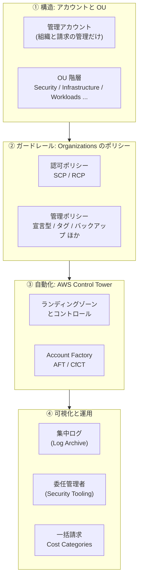
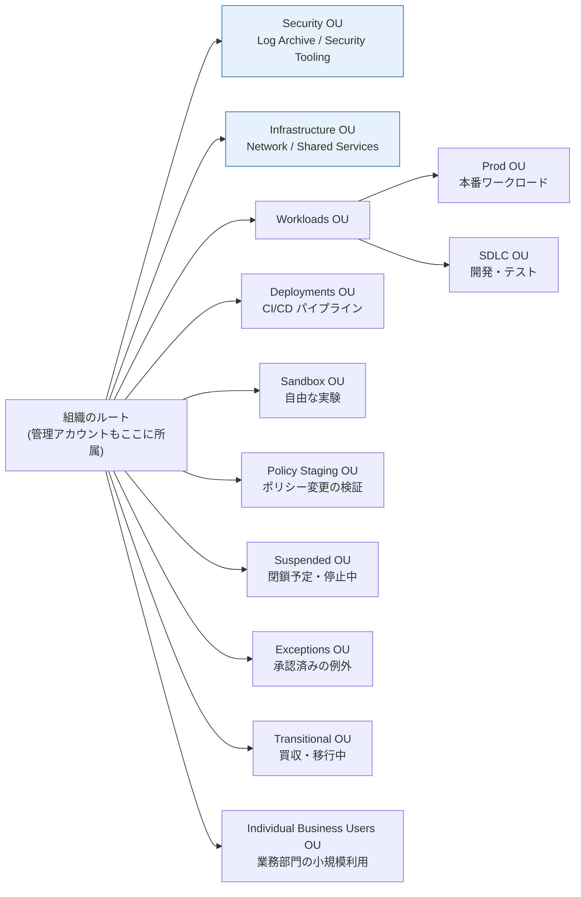

[ホーム](../README.md) > [Phase 3: プロフェッショナル](README.md) > マルチアカウント戦略とガバナンス

# マルチアカウント戦略とガバナンス

> **この章のゴール**
> - マルチアカウントにする理由（影響範囲・セキュリティ境界・請求・クォータ）を説明し、推奨 OU 構成を設計できる
> - SCP・RCP・宣言型ポリシーなど AWS Organizations のポリシータイプを使い分け、JSON を読み書きできる
> - アイデンティティ・リソース・ネットワークの 3 つの観点で「データ境界」を設計できる
> - AWS Control Tower（ランディングゾーン、コントロール、Account Factory、AFT、CfCT、ドリフト）によるガバナンスの自動化を説明できる
> - 委任管理者・AWS RAM・集中ログ・一括請求を組み合わせて、組織全体の運用を設計できる
>
> **対応試験**: SAP-C03（D2: セキュリティ、コンプライアンス、ガバナンス / D5: 運用上の優秀性と自動化 ※ドメイン名は仮訳）
> **目安時間**: 読む 4 時間 / 確認問題 1 時間 / ハンズオン（Lab 10）3 時間

> [!NOTE]
> この章は [IAM 徹底解説](../02-associate/01-iam.md) の内容（IAM ポリシーの構文、SCP の基本、リージョン制限 SCP の例、`aws:PrincipalOrgID` を使ったバケットポリシーの例）を前提にしています。SCP の基本があいまいな場合は、先に復習してください。

## この章の全体像

数十〜数百のアカウントを「安全に」「チームの自律性を損なわずに」「少ない運用負荷で」運用するには、次の 4 つの層を組み合わせます。SAP では「要件をどの層で満たすのが最も適切か」が繰り返し問われます。



| 問題文のキーワード | まず考える解法 |
|---|---|
| 「組織全体で〜を禁止」「新しいアカウントにも自動で適用」 | SCP / RCP / 宣言型ポリシーを OU またはルートにアタッチ |
| 「組織外の ID からのアクセスを防ぐ」「データの持ち出しを防ぐ」 | RCP と SCP によるデータ境界 |
| 「ガードレール付きのアカウントを素早く払い出す」 | Control Tower の Account Factory / AFT |
| 「管理アカウントの利用を最小化」 | 委任管理者 |
| 「ログを改ざんできない形で一元保管」 | Log Archive アカウント + 組織の証跡 + S3 Object Lock |
| 「事業部ごとにコストを配分」「共有コストを按分」 | 一括請求 + Cost Categories（分割料金） |

## 1. なぜマルチアカウントか

### 1.1 AWS アカウントは「最も強い分離境界」

IAM の権限、リソース、サービスクォータ、請求は、すべて **AWS アカウント単位** で管理されます。
1 つのアカウントにすべてを詰め込むと、チーム・環境・データの分離を IAM ポリシーの条件だけで実現しなければならず、設定は複雑になり、ミスの影響は全体に及びます。
アカウントを分けると、**明示的に許可しない限り何も越境できない**（クロスアカウントの信頼関係、リソースベースのポリシー、AWS RAM による共有だけが越境の手段）という強い分離が「既定で」手に入ります。

| 観点 | 単一アカウントの問題 | アカウントを分けると |
|---|---|---|
| 影響範囲（ブラストラジアス） | 設定ミスや侵害が全ワークロードに波及する | 影響がそのアカウントに閉じる |
| セキュリティ境界 | 複雑な IAM 条件で職務を分離する必要がある | 既定で分離され、越境は明示的な信頼関係だけ |
| 請求・コスト配分 | タグ付けの徹底が前提で、漏れると配分できない | アカウント単位で自然に分かれる |
| サービスクォータ | 1 つのワークロードがクォータを使い切ると他も止まる | クォータはアカウント × リージョン単位で独立 |
| 環境の分離 | 本番と開発の境界が IAM ポリシーだけ | 本番と開発を別アカウント（別 OU）に置ける |
| コンプライアンス範囲 | 監査対象（例: PCI DSS）が全体に広がる | 対象アカウントを限定し、監査範囲を縮小できる |
| チームの自律性 | 権限の調整や変更の衝突が起きる | アカウントを任せ、ガードレールで統制する |

### 1.2 アカウントをどう分けるか

- 基本単位は **「ワークロード × 環境」**（例: `payments-prod`、`payments-dev`）です。
- **組織図（部署）ではなく、必要な統制が同じもの** を同じ OU にまとめます。部署は組織変更で頻繁に変わりますが、「本番データを扱う」「PCI DSS の対象」といった統制要件は変わりにくいからです。
- ログ集約、セキュリティツール、ネットワーク、共有サービスといった **共通機能は専用アカウント** に置きます。

> [!TIP]
> **試験のポイント**: 「本番と開発を完全に分離」「侵害時の影響範囲を最小化」「チーム単位でコストを明確にしたい」とあれば、ワークロード × 環境でアカウントを分け、OU でガードレールを適用する設計が基本です。

### 1.3 マルチアカウントの「代償」と、その解決策

アカウントを増やすと、管理対象も増えます。SAP の選択肢は、この代償をどう抑えるかで差がつきます。

| 増える課題 | 解決策 |
|---|---|
| アカウントの作成と初期設定の手間 | Control Tower の Account Factory / AFT（7 節） |
| 人のアクセス管理（アカウント数 × ユーザー数） | IAM Identity Center（[次章](03-identity-federation.md)） |
| アカウント間のネットワーク接続 | Transit Gateway、VPC 共有（[高度なネットワーク設計](04-advanced-networking.md)） |
| ログと脅威検出の分散 | 組織の証跡と委任管理者（8〜9 節） |
| 統制の一貫性 | SCP / RCP / 宣言型ポリシー、Control Tower のコントロール（3〜7 節） |

## 2. 推奨 OU 構成

### 2.1 設計の原則

AWS のホワイトペーパー「Organizing Your AWS Environment Using Multiple Accounts」は、次の原則を示しています。

1. OU は組織図ではなく、**適用する統制（ポリシー）と機能** でまとめる
2. ポリシーは個々のアカウントではなく **OU にアタッチ** する（アカウント単位の例外を増やさない）
3. **管理アカウントにワークロードを置かない**（SCP と RCP が効かないため。2.4 参照）
4. 階層は **浅く** 保つ（OU はルートの下に最大 5 階層まで入れ子にできますが、深いと継承の把握が難しくなります）
5. 本番とそれ以外を **OU レベルで分ける**
6. ポリシーの変更は **Policy Staging OU で検証** してから本番の OU に適用する

### 2.2 推奨 OU の全体図



Security OU と Infrastructure OU は、どの組織にも必要な **基盤 OU** です。その他は必要に応じて追加します。

### 2.3 各 OU の役割

| OU | 目的 | 代表的なアカウント | ガードレールの例 |
|---|---|---|---|
| Security | セキュリティ機能と監査ログの集約 | Log Archive、Security Tooling（Control Tower では Audit）、必要に応じて読み取り専用アクセス用・ブレークグラス用 | 最も厳格。ログの削除・変更を禁止し、アクセスはセキュリティチームだけ |
| Infrastructure | 共有インフラ | Network（Transit Gateway、Direct Connect、検査用 VPC、DNS）、Shared Services（ディレクトリ、ゴールデン AMI の作成パイプラインなど） | ネットワーク変更はネットワークチームのロールだけに限定 |
| Workloads（Prod / SDLC） | 業務アプリケーション | アプリ × 環境ごと | Prod は変更経路を CI/CD に限定。SDLC はやや緩くする |
| Deployments | CI/CD | パイプライン用アカウント | ワークロードアカウントのデプロイ用ロールだけを引き受けられる |
| Sandbox | 自由な実験 | 個人・チーム用 | 社内ネットワークから切り離し、予算上限・高額サービス禁止・定期的なクリーンアップ |
| Policy Staging | ポリシー変更の検証 | テスト用アカウント | 本番 OU と同じポリシー + 変更候補 |
| Suspended | 閉鎖予定・停止中のアカウント | ― | すべての操作を拒否する SCP |
| Exceptions | 例外が必要なアカウント | 個別に承認されたもの | 例外を文書化し、定期的に見直す |
| Transitional | 買収・移行中の一時的な置き場 | 移行元の組織から来たアカウント | 最小限のガードレールから段階的に強化 |
| Individual Business Users | 業務部門のユーザーの小規模な利用 | ― | 用途に応じて利用サービスを制限 |

> [!NOTE]
> Control Tower の従来の構成では、Security OU（Log Archive と Audit の 2 アカウント）と、任意で Sandbox OU が作られます。2025年11月17日のランディングゾーン 4.0 からは Security OU が必須ではなくなり、「Log Archive などのハブアカウントがすべて同じ OU にあること」だけが要件になりました（7.2 参照）。試験問題は従来の構成を前提にしていることが多いので、両方を理解しておきましょう。

### 2.4 管理アカウントの扱い

管理アカウントは組織の「最高権限」を持つ特別なアカウントです。

- **管理アカウントだけができること**: アカウントの招待・組織からの削除、信頼されたアクセスの有効化、委任管理者の登録、組織全体の請求の支払いなど
- **SCP と RCP は管理アカウントに効きません**。管理アカウントが侵害されると、組織全体のガードレールを外されるおそれがあります。

そのため、次のように運用します。

- ワークロードやデータを置かない
- アクセスできる人を最小限にし、MFA を必須にする
- セキュリティサービスなどの日常運用は **委任管理者**（8 節）に移す
- 管理アカウントでの操作を CloudTrail と Amazon EventBridge で監視し、通知する

> [!WARNING]
> **ひっかけ注意**: 「管理アカウントの IAM ユーザーを SCP で制限する」は実現できません（SCP を管理アカウントにアタッチしても効果はありません）。正解の方向は「管理アカウントの利用そのものを減らし、監視する」です。

## 3. AWS Organizations とポリシータイプ

### 3.1 SAP で押さえる前提

- ポリシー（SCP など）を使うには、組織が「**すべての機能**」モードである必要があります（「一括請求機能のみ」では使えません）。
- 1 つのアカウントは 1 つの組織、1 つの親（ルートまたは OU）にだけ所属します。
- ポリシーはルート・OU・アカウントにアタッチし、下位に継承されます。ポリシータイプごとに、ルートで「有効化」してから使います。
- 組織 ID（`o-xxxxxxxxxx`）、ルート ID（`r-xxxx`）、OU ID（`ou-xxxx-xxxxxxxx`）は、条件キー `aws:PrincipalOrgID` や `aws:PrincipalOrgPaths` で使います（[次章](03-identity-federation.md)）。

### 3.2 ポリシータイプ一覧（2026年9月時点）

Organizations のポリシーは、**権限の上限を決める「認可ポリシー」** と、**サービスの設定を一元管理する「管理ポリシー」** に大別されます。

| 分類 | ポリシータイプ | 何を制御するか | 典型的な用途 |
|---|---|---|---|
| 認可 | サービスコントロールポリシー（SCP） | メンバーアカウントの IAM ユーザー・ロール（ルートユーザーを含む）が使える権限の上限 | リージョン制限、セキュリティサービス停止の禁止 |
| 認可 | リソースコントロールポリシー（RCP、2024年11月〜） | メンバーアカウントのリソースに対する権限の上限（組織外のプリンシパルにも効く） | 組織外からのアクセス遮断、TLS の強制 |
| 管理 | 宣言型ポリシー（2024年12月〜、EC2 など） | サービスの設定そのもの（ベースライン）をコントロールプレーンで強制 | AMI・スナップショットの公開禁止、VPC ブロックパブリックアクセス |
| 管理 | タグポリシー | タグキーの表記や許可する値の標準化（指定したリソースタイプでは非準拠のタグ付け操作を防止） | コスト配分タグの表記統一 |
| 管理 | バックアップポリシー | AWS Backup のバックアッププランを組織全体に展開 | 全アカウントの日次バックアップとクロスリージョンコピー |
| 管理 | AI サービスのオプトアウトポリシー | AWS の AI サービスが顧客のコンテンツをサービス改善に使うことをオプトアウト | データ利用に関するコンプライアンス |
| 管理 | チャットアプリケーションポリシー | Amazon Q Developer in chat applications（旧 AWS Chatbot）から使えるチャットワークスペースなどの範囲 | 承認済みの Slack / Microsoft Teams だけを許可 |
| 管理 | Security Hub ポリシー（2025年6月〜） | Security Hub の有効化と設定の一元管理 | 全アカウント・全リージョンで有効化 |
| 管理 | Amazon Inspector ポリシー（2025年11月〜） | Inspector のスキャン有効化の一元管理 | 新しいアカウントでも自動でスキャン |
| 管理 | アップグレードロールアウトポリシー（2025年11月〜） | RDS / Aurora の自動マイナーバージョンアップグレードを適用する順序 | 開発 → ステージング → 本番の順に適用 |
| 管理 | S3 ポリシー（2025年11月〜） | 組織レベルでの S3 ブロックパブリックアクセスの適用 | 全アカウントでバケットの公開を禁止 |
| 管理 | Amazon Bedrock ポリシー（2026年4月〜） | Bedrock のガードレールを組織全体で強制 | 生成 AI の安全対策を一律に適用（[生成 AI・エージェント AI のアーキテクチャ](09-generative-ai-architecture.md)） |

> [!TIP]
> **試験のポイント**: 「API の実行を禁止したい」→ SCP。「（誰からであっても）リソースへのアクセスを制限したい」→ RCP。「設定値そのものを固定し、新しい API にも追従させたい」→ 宣言型ポリシー。「タグの表記揺れを防ぎたい」→ タグポリシー（ただし「タグの付与を必須にする」は SCP の `aws:RequestTag` 条件で実現します）。「全アカウントで同じバックアップ」→ バックアップポリシー。

### 3.3 継承のしくみ: 認可ポリシーと管理ポリシーは別物

- **認可ポリシー（SCP・RCP）は「フィルター」** です。ルートから対象アカウントまでの **すべての階層で許可** されていなければ使えず、**どこか 1 か所でも拒否** されれば拒否されます（4.2 参照）。
- **管理ポリシー（タグ・バックアップ・宣言型など）は、親から子へ「マージ」** されます。継承演算子（`@@assign` で上書き、`@@append` で追加、`@@remove` で削除）と、子に許す操作を決める子制御演算子（`@@operators_allowed_for_child_policies`）で、下位 OU が変更できる範囲を制御します。マージ後の結果は「有効なポリシー（effective policy）」として確認できます。

タグポリシーの例（`CostCenter` タグの表記と値を統一し、EC2 インスタンスとボリュームでは非準拠のタグ付けを拒否）:

```json
{
  "tags": {
    "CostCenter": {
      "tag_key": { "@@assign": "CostCenter" },
      "tag_value": { "@@assign": ["1001", "1002", "2001"] },
      "enforced_for": { "@@assign": ["ec2:instance", "ec2:volume"] }
    }
  }
}
```

> [!WARNING]
> **ひっかけ注意**: タグポリシーの `enforced_for` は「非準拠の値でタグ付けする操作」を防ぐだけで、**タグが付いていないリソースの作成は防げません**。タグ付けを必須にしたい場合は、SCP で `aws:RequestTag/CostCenter` が存在しない作成リクエストを拒否します（[次章](03-identity-federation.md) の ABAC 設計を参照）。

MDEOF_PLACEHOLDER_REMOVE
