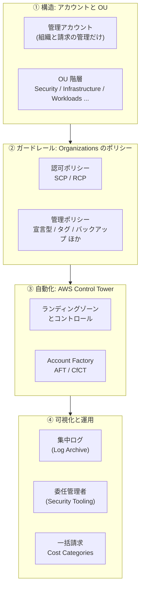
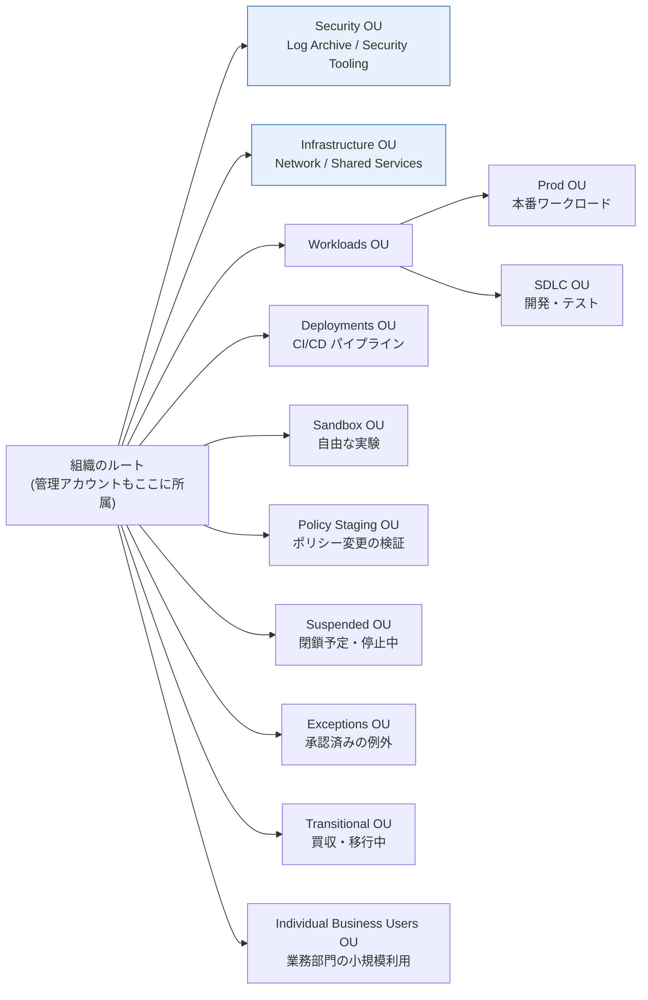
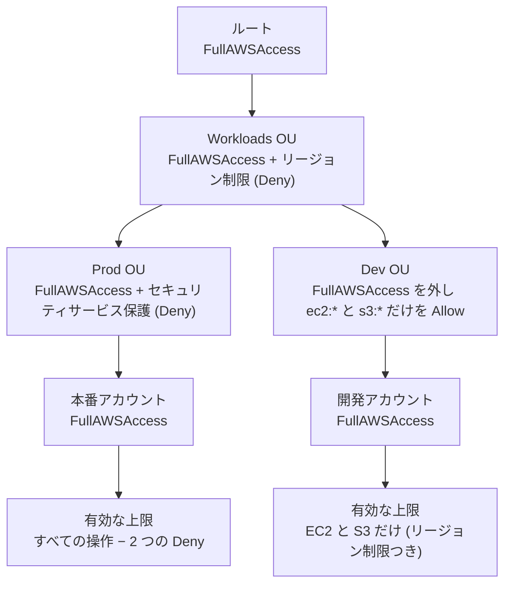
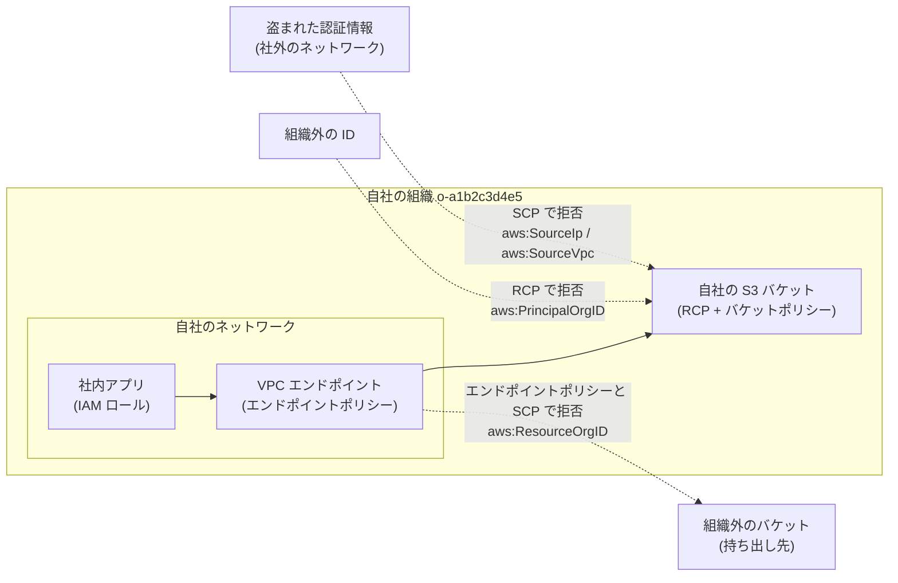
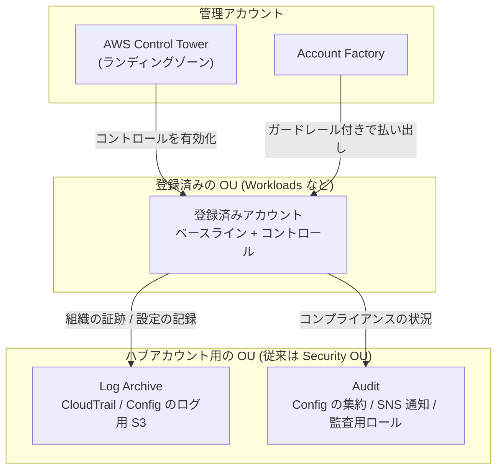
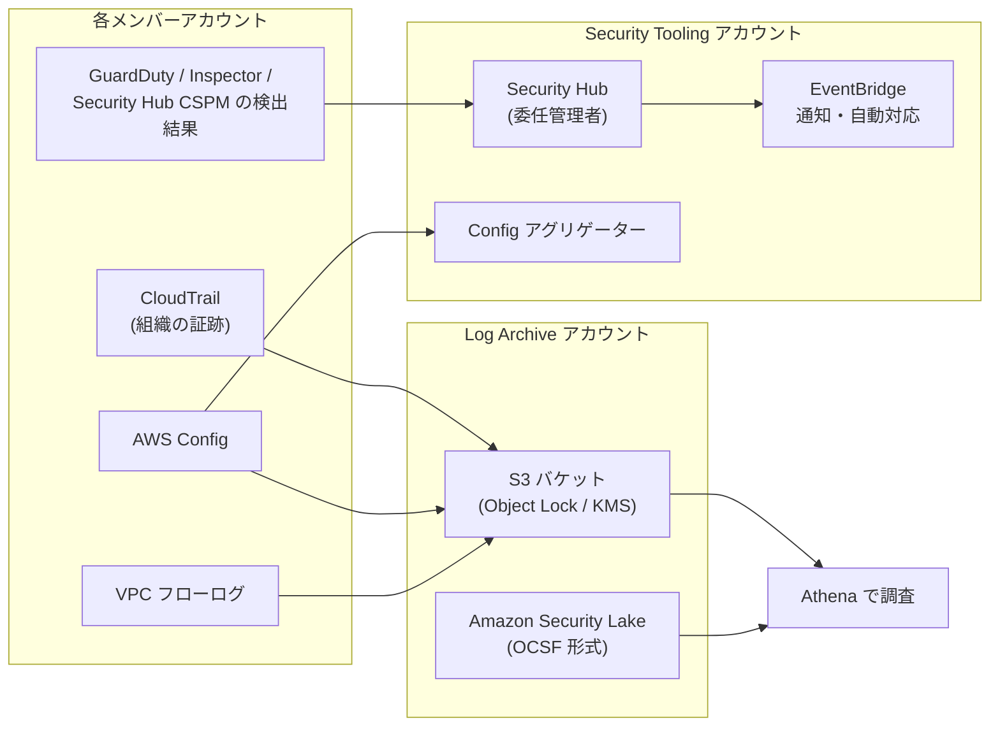

[ホーム](../README.md) > [Phase 3: プロフェッショナル](README.md) > マルチアカウント戦略とガバナンス

# マルチアカウント戦略とガバナンス

> **この章のゴール**
> - マルチアカウントにする理由（影響範囲・セキュリティ境界・請求・クォータ）を説明し、推奨 OU 構成を設計できる
> - SCP・RCP・宣言型ポリシーなど AWS Organizations のポリシータイプを使い分け、JSON を読み書きできる
> - アイデンティティ・リソース・ネットワークの 3 つの観点で「データ境界」を設計できる
> - AWS Control Tower（ランディングゾーン、コントロール、Account Factory、AFT、CfCT、ドリフト）によるガバナンスの自動化を説明できる
> - 委任管理者・AWS RAM・集中ログ・一括請求を組み合わせて、組織全体の運用を設計できる
>
> **対応試験**: SAP-C03（D2: セキュリティ、コンプライアンス、ガバナンス / D5: 運用上の優秀性と自動化 ※ドメイン名は仮訳）
> **目安時間**: 読む 4 時間 / 確認問題 1 時間 / ハンズオン（Lab 10）3 時間

> [!NOTE]
> この章は [IAM 徹底解説](../02-associate/01-iam.md) の内容（IAM ポリシーの構文、SCP の基本、リージョン制限 SCP の例、`aws:PrincipalOrgID` を使ったバケットポリシーの例）を前提にしています。SCP の基本があいまいな場合は、先に復習してください。

## この章の全体像

数十〜数百のアカウントを「安全に」「チームの自律性を損なわずに」「少ない運用負荷で」運用するには、次の 4 つの層を組み合わせます。SAP では「要件をどの層で満たすのが最も適切か」が繰り返し問われます。



| 問題文のキーワード | まず考える解法 |
|---|---|
| 「組織全体で〜を禁止」「新しいアカウントにも自動で適用」 | SCP / RCP / 宣言型ポリシーを OU またはルートにアタッチ |
| 「組織外の ID からのアクセスを防ぐ」「データの持ち出しを防ぐ」 | RCP と SCP によるデータ境界 |
| 「ガードレール付きのアカウントを素早く払い出す」 | Control Tower の Account Factory / AFT |
| 「管理アカウントの利用を最小化」 | 委任管理者 |
| 「ログを改ざんできない形で一元保管」 | Log Archive アカウント + 組織の証跡 + S3 Object Lock |
| 「事業部ごとにコストを配分」「共有コストを按分」 | 一括請求 + Cost Categories（分割料金） |

## 1. なぜマルチアカウントか

### 1.1 AWS アカウントは「最も強い分離境界」

IAM の権限、リソース、サービスクォータ、請求は、すべて **AWS アカウント単位** で管理されます。
1 つのアカウントにすべてを詰め込むと、チーム・環境・データの分離を IAM ポリシーの条件だけで実現しなければならず、設定は複雑になり、ミスの影響は全体に及びます。
アカウントを分けると、**明示的に許可しない限り何も越境できない**（クロスアカウントの信頼関係、リソースベースのポリシー、AWS RAM による共有だけが越境の手段）という強い分離が「既定で」手に入ります。

| 観点 | 単一アカウントの問題 | アカウントを分けると |
|---|---|---|
| 影響範囲（ブラストラジアス） | 設定ミスや侵害が全ワークロードに波及する | 影響がそのアカウントに閉じる |
| セキュリティ境界 | 複雑な IAM 条件で職務を分離する必要がある | 既定で分離され、越境は明示的な信頼関係だけ |
| 請求・コスト配分 | タグ付けの徹底が前提で、漏れると配分できない | アカウント単位で自然に分かれる |
| サービスクォータ | 1 つのワークロードがクォータを使い切ると他も止まる | クォータはアカウント × リージョン単位で独立 |
| 環境の分離 | 本番と開発の境界が IAM ポリシーだけ | 本番と開発を別アカウント（別 OU）に置ける |
| コンプライアンス範囲 | 監査対象（例: PCI DSS）が全体に広がる | 対象アカウントを限定し、監査範囲を縮小できる |
| チームの自律性 | 権限の調整や変更の衝突が起きる | アカウントを任せ、ガードレールで統制する |

### 1.2 アカウントをどう分けるか

- 基本単位は **「ワークロード × 環境」**（例: `payments-prod`、`payments-dev`）です。
- **組織図（部署）ではなく、必要な統制が同じもの** を同じ OU にまとめます。部署は組織変更で頻繁に変わりますが、「本番データを扱う」「PCI DSS の対象」といった統制要件は変わりにくいからです。
- ログ集約、セキュリティツール、ネットワーク、共有サービスといった **共通機能は専用アカウント** に置きます。

> [!TIP]
> **試験のポイント**: 「本番と開発を完全に分離」「侵害時の影響範囲を最小化」「チーム単位でコストを明確にしたい」とあれば、ワークロード × 環境でアカウントを分け、OU でガードレールを適用する設計が基本です。

### 1.3 マルチアカウントの「代償」と、その解決策

アカウントを増やすと、管理対象も増えます。SAP の選択肢は、この代償をどう抑えるかで差がつきます。

| 増える課題 | 解決策 |
|---|---|
| アカウントの作成と初期設定の手間 | Control Tower の Account Factory / AFT（7 節） |
| 人のアクセス管理（アカウント数 × ユーザー数） | IAM Identity Center（[次章](03-identity-federation.md)） |
| アカウント間のネットワーク接続 | Transit Gateway、VPC 共有（[高度なネットワーク設計](04-advanced-networking.md)） |
| ログと脅威検出の分散 | 組織の証跡と委任管理者（8〜9 節） |
| 統制の一貫性 | SCP / RCP / 宣言型ポリシー、Control Tower のコントロール（3〜7 節） |

## 2. 推奨 OU 構成

### 2.1 設計の原則

AWS のホワイトペーパー「Organizing Your AWS Environment Using Multiple Accounts」は、次の原則を示しています。

1. OU は組織図ではなく、**適用する統制（ポリシー）と機能** でまとめる
2. ポリシーは個々のアカウントではなく **OU にアタッチ** する（アカウント単位の例外を増やさない）
3. **管理アカウントにワークロードを置かない**（SCP と RCP が効かないため。2.4 参照）
4. 階層は **浅く** 保つ（OU はルートの下に最大 5 階層まで入れ子にできますが、深いと継承の把握が難しくなります）
5. 本番とそれ以外を **OU レベルで分ける**
6. ポリシーの変更は **Policy Staging OU で検証** してから本番の OU に適用する

### 2.2 推奨 OU の全体図



Security OU と Infrastructure OU は、どの組織にも必要な **基盤 OU** です。その他は必要に応じて追加します。

### 2.3 各 OU の役割

| OU | 目的 | 代表的なアカウント | ガードレールの例 |
|---|---|---|---|
| Security | セキュリティ機能と監査ログの集約 | Log Archive、Security Tooling（Control Tower では Audit）、必要に応じて読み取り専用アクセス用・ブレークグラス用 | 最も厳格。ログの削除・変更を禁止し、アクセスはセキュリティチームだけ |
| Infrastructure | 共有インフラ | Network（Transit Gateway、Direct Connect、検査用 VPC、DNS）、Shared Services（ディレクトリ、ゴールデン AMI の作成パイプラインなど） | ネットワーク変更はネットワークチームのロールだけに限定 |
| Workloads（Prod / SDLC） | 業務アプリケーション | アプリ × 環境ごと | Prod は変更経路を CI/CD に限定。SDLC はやや緩くする |
| Deployments | CI/CD | パイプライン用アカウント | ワークロードアカウントのデプロイ用ロールだけを引き受けられる |
| Sandbox | 自由な実験 | 個人・チーム用 | 社内ネットワークから切り離し、予算上限・高額サービス禁止・定期的なクリーンアップ |
| Policy Staging | ポリシー変更の検証 | テスト用アカウント | 本番 OU と同じポリシー + 変更候補 |
| Suspended | 閉鎖予定・停止中のアカウント | ― | すべての操作を拒否する SCP |
| Exceptions | 例外が必要なアカウント | 個別に承認されたもの | 例外を文書化し、定期的に見直す |
| Transitional | 買収・移行中の一時的な置き場 | 移行元の組織から来たアカウント | 最小限のガードレールから段階的に強化 |
| Individual Business Users | 業務部門のユーザーの小規模な利用 | ― | 用途に応じて利用サービスを制限 |

> [!NOTE]
> Control Tower の従来の構成では、Security OU（Log Archive と Audit の 2 アカウント）と、任意で Sandbox OU が作られます。2025年11月17日のランディングゾーン 4.0 からは Security OU が必須ではなくなり、「Log Archive などのハブアカウントがすべて同じ OU にあること」だけが要件になりました（7.2 参照）。試験問題は従来の構成を前提にしていることが多いので、両方を理解しておきましょう。

### 2.4 管理アカウントの扱い

管理アカウントは組織の「最高権限」を持つ特別なアカウントです。

- **管理アカウントだけができること**: アカウントの招待・組織からの削除、信頼されたアクセスの有効化、委任管理者の登録、組織全体の請求の支払いなど
- **SCP と RCP は管理アカウントに効きません**。管理アカウントが侵害されると、組織全体のガードレールを外されるおそれがあります。

そのため、次のように運用します。

- ワークロードやデータを置かない
- アクセスできる人を最小限にし、MFA を必須にする
- セキュリティサービスなどの日常運用は **委任管理者**（8 節）に移す
- 管理アカウントでの操作を CloudTrail と Amazon EventBridge で監視し、通知する

> [!WARNING]
> **ひっかけ注意**: 「管理アカウントの IAM ユーザーを SCP で制限する」は実現できません（SCP を管理アカウントにアタッチしても効果はありません）。正解の方向は「管理アカウントの利用そのものを減らし、監視する」です。

## 3. AWS Organizations とポリシータイプ

### 3.1 SAP で押さえる前提

- ポリシー（SCP など）を使うには、組織が「**すべての機能**」モードである必要があります（「一括請求機能のみ」では使えません）。
- 1 つのアカウントは 1 つの組織、1 つの親（ルートまたは OU）にだけ所属します。
- ポリシーはルート・OU・アカウントにアタッチし、下位に継承されます。ポリシータイプごとに、ルートで「有効化」してから使います。
- 組織 ID（`o-xxxxxxxxxx`）、ルート ID（`r-xxxx`）、OU ID（`ou-xxxx-xxxxxxxx`）は、条件キー `aws:PrincipalOrgID` や `aws:PrincipalOrgPaths` で使います（[次章](03-identity-federation.md)）。

### 3.2 ポリシータイプ一覧（2026年9月時点）

Organizations のポリシーは、**権限の上限を決める「認可ポリシー」** と、**サービスの設定を一元管理する「管理ポリシー」** に大別されます。

| 分類 | ポリシータイプ | 何を制御するか | 典型的な用途 |
|---|---|---|---|
| 認可 | サービスコントロールポリシー（SCP） | メンバーアカウントの IAM ユーザー・ロール（ルートユーザーを含む）が使える権限の上限 | リージョン制限、セキュリティサービス停止の禁止 |
| 認可 | リソースコントロールポリシー（RCP、2024年11月〜） | メンバーアカウントのリソースに対する権限の上限（組織外のプリンシパルにも効く） | 組織外からのアクセス遮断、TLS の強制 |
| 管理 | 宣言型ポリシー（2024年12月〜、EC2 など） | サービスの設定そのもの（ベースライン）をコントロールプレーンで強制 | AMI・スナップショットの公開禁止、VPC ブロックパブリックアクセス |
| 管理 | タグポリシー | タグキーの表記や許可する値の標準化（指定したリソースタイプでは非準拠のタグ付け操作を防止） | コスト配分タグの表記統一 |
| 管理 | バックアップポリシー | AWS Backup のバックアッププランを組織全体に展開 | 全アカウントの日次バックアップとクロスリージョンコピー |
| 管理 | AI サービスのオプトアウトポリシー | AWS の AI サービスが顧客のコンテンツをサービス改善に使うことをオプトアウト | データ利用に関するコンプライアンス |
| 管理 | チャットアプリケーションポリシー | Amazon Q Developer in chat applications（旧 AWS Chatbot）から使えるチャットワークスペースなどの範囲 | 承認済みの Slack / Microsoft Teams だけを許可 |
| 管理 | Security Hub ポリシー（2025年6月〜） | Security Hub の有効化と設定の一元管理 | 全アカウント・全リージョンで有効化 |
| 管理 | Amazon Inspector ポリシー（2025年11月〜） | Inspector のスキャン有効化の一元管理 | 新しいアカウントでも自動でスキャン |
| 管理 | アップグレードロールアウトポリシー（2025年11月〜） | RDS / Aurora の自動マイナーバージョンアップグレードを適用する順序 | 開発 → ステージング → 本番の順に適用 |
| 管理 | S3 ポリシー（2025年11月〜） | 組織レベルでの S3 ブロックパブリックアクセスの適用 | 全アカウントでバケットの公開を禁止 |
| 管理 | Amazon Bedrock ポリシー（2026年4月〜） | Bedrock のガードレールを組織全体で強制 | 生成 AI の安全対策を一律に適用（[生成 AI・エージェント AI のアーキテクチャ](09-generative-ai-architecture.md)） |

> [!TIP]
> **試験のポイント**: 「API の実行を禁止したい」→ SCP。「（誰からであっても）リソースへのアクセスを制限したい」→ RCP。「設定値そのものを固定し、新しい API にも追従させたい」→ 宣言型ポリシー。「タグの表記揺れを防ぎたい」→ タグポリシー（ただし「タグの付与を必須にする」は SCP の `aws:RequestTag` 条件で実現します）。「全アカウントで同じバックアップ」→ バックアップポリシー。

### 3.3 継承のしくみ: 認可ポリシーと管理ポリシーは別物

- **認可ポリシー（SCP・RCP）は「フィルター」** です。ルートから対象アカウントまでの **すべての階層で許可** されていなければ使えず、**どこか 1 か所でも拒否** されれば拒否されます（4.2 参照）。
- **管理ポリシー（タグ・バックアップ・宣言型など）は、親から子へ「マージ」** されます。継承演算子（`@@assign` で上書き、`@@append` で追加、`@@remove` で削除）と、子に許す操作を決める子制御演算子（`@@operators_allowed_for_child_policies`）で、下位 OU が変更できる範囲を制御します。マージ後の結果は「有効なポリシー（effective policy）」として確認できます。

タグポリシーの例（`CostCenter` タグの表記と値を統一し、EC2 インスタンスとボリュームでは非準拠のタグ付けを拒否）:

```json
{
  "tags": {
    "CostCenter": {
      "tag_key": { "@@assign": "CostCenter" },
      "tag_value": { "@@assign": ["1001", "1002", "2001"] },
      "enforced_for": { "@@assign": ["ec2:instance", "ec2:volume"] }
    }
  }
}
```

> [!WARNING]
> **ひっかけ注意**: タグポリシーの `enforced_for` は「非準拠の値でタグ付けする操作」を防ぐだけで、**タグが付いていないリソースの作成は防げません**。タグ付けを必須にしたい場合は、SCP で `aws:RequestTag/CostCenter` が存在しない作成リクエストを拒否します（[次章](03-identity-federation.md) の ABAC 設計を参照）。

### 3.4 その他の管理ポリシーの要点

- **バックアップポリシー**: AWS Backup のバックアッププラン（スケジュール、保持期間、別リージョンへのコピー、タグによる対象の選択）を組織全体に配布します。ポリシーはバックアップボールトや IAM ロールを作成しないため、**参照するボールトと IAM ロールを各アカウントに事前に用意** しておく必要があります（CloudFormation StackSets などで配布）。
- **AI サービスのオプトアウトポリシー**: 次のようにルートにアタッチすると、全アカウント・全 AI サービスでオプトアウトし、子の OU やアカウントでの上書きも禁止できます。

```json
{
  "services": {
    "default": {
      "opt_out_policy": {
        "@@operators_allowed_for_child_policies": ["@@none"],
        "@@assign": "optOut"
      }
    }
  }
}
```

- **チャットアプリケーションポリシー**: 承認済みの Slack ワークスペースや Microsoft Teams のテナントだけを使わせる、といった制御を組織全体で行います。
- **新しいポリシータイプ**（Security Hub、Amazon Inspector、アップグレードロールアウト、S3、Amazon Bedrock）: 以前は委任管理者の自動有効化や StackSets で配っていた「サービスの設定」を、Organizations のポリシーとして宣言的に配布できるようになったものです。考え方はほかの管理ポリシーと同じで、OU にアタッチして継承させます。

有効なポリシーは `aws organizations describe-effective-policy --policy-type TAG_POLICY --target-id <アカウント ID>` のように確認できます。

## 4. SCP の詳細

### 4.1 SCP は「権限の上限」を決めるフィルター

SCP は IAM ポリシーと同じ JSON 構文ですが、**権限を与えることはありません**。メンバーアカウントのプリンシパルが「最大でここまでは使える」という上限を決めるだけです。実際に操作するには、上限の内側で IAM ポリシー（またはリソースベースのポリシー）による許可が必要です。

| SCP が効くもの | SCP が効かないもの |
|---|---|
| メンバーアカウントの IAM ユーザーと IAM ロール | 管理アカウント内のすべてのプリンシパル（ルートユーザーを含む） |
| メンバーアカウントのルートユーザー | サービスにリンクされたロール |
| 委任管理者として登録されたメンバーアカウント | 組織外のプリンシパル（自社のリソースへのアクセスは RCP で制御する） |
| ― | サービスプリンシパルとして動作する AWS サービス自身の操作（例: CloudTrail による S3 へのログ配信） |

> [!WARNING]
> **ひっかけ注意**: 「SCP で S3 を許可したのに、開発者が S3 を使えない」→ SCP は許可を与えないため、IAM ポリシーでの許可が別に必要です。逆に「IAM ポリシーで AdministratorAccess を付けたのに拒否される」→ SCP の上限を超えています。「SCP で組織外の ID から自社のバケットを守る」は実現できません（RCP の役割です。5 節）。

### 4.2 継承と評価: 許可は「全階層」、拒否は「1 か所」

SCP はルートから対象アカウントまでの経路上のすべての階層（ルート、途中のすべての OU、アカウント自身）で評価されます。

- **許可**: 各階層で Allow されている操作だけが残ります（**積集合**）。どこか 1 つの階層で Allow が無ければ、その操作は使えません。
- **拒否**: どこか 1 つの階層で Deny されれば、下位の階層で何を Allow しても拒否されます。



右側の経路のように、**アカウントに FullAWSAccess が付いていても、上位の Dev OU で Allow されていない操作は使えません**。許可リスト戦略で「アカウントに Allow を追加したのに使えない」というトラブルの大半はこれが原因です。

### 4.3 拒否リスト戦略と許可リスト戦略

| 観点 | 拒否リスト（多くの組織の既定） | 許可リスト |
|---|---|---|
| 方法 | 既定の FullAWSAccess を残し、禁止したい操作を Deny で列挙 | FullAWSAccess を外し、使ってよいサービスを Allow で列挙 |
| 新しいサービス | 何もしなくても使える | 明示的に追加するまで使えない |
| 運用負荷 | 小さい | 大きい（経路上の全階層で Allow を維持する必要がある） |
| 向く場面 | ほとんどの OU | 規制が厳しく、承認済みのサービスだけを使わせたい OU |

SCP の構文と上限で押さえておくこと（2026年9月時点）:

- `Principal` / `NotPrincipal` 要素は使えません。特定のロールを対象外にするときは、`Condition` で `aws:PrincipalArn` を使います（4.4 例B）。
- **Allow ステートメントでも `Condition` や `NotAction` を使えます**。ただし Allow ステートメントの `Resource` に指定できるのは `"*"` だけで、個別の ARN は Deny ステートメントでのみ指定できます。
- 1 つのルート・OU・アカウントにアタッチできる SCP は最大 5 個、1 つの SCP の最大サイズは 5,120 文字です（[SCP の構文](https://docs.aws.amazon.com/organizations/latest/userguide/orgs_manage_policies_scps_syntax.html)）。

> [!NOTE]
> 以前は「SCP の Allow ステートメントでは Condition を使えない」という制約があり、古い教材や試験問題はその前提で書かれていることがあります。現在のドキュメントでは Allow ステートメントでも Condition を使えます。

許可リストを作るときは、IAM のアクセスアドバイザー（サービスの最終アクセス時刻）を組織・OU 単位で確認し、実際に使われているサービスを把握してから絞り込みます。

> [!TIP]
> **試験のポイント**: 「新しい AWS サービスが追加されても、承認されるまで使えないようにしたい」→ 許可リスト戦略。「運用上のオーバーヘッドを最小にしつつ特定の操作を禁止したい」→ 拒否リスト戦略。

### 4.4 定番 SCP の JSON 例

リージョン制限（`aws:RequestedRegion` と、グローバルサービスを `NotAction` で除外する書き方）は [IAM 徹底解説](../02-associate/01-iam.md) の例で扱いました。Control Tower を使う場合は、ランディングゾーンの「リージョン拒否」設定でも同じことができます。ここでは、それ以外の定番を示します。

**例A: メンバーアカウントのルートユーザーの操作を禁止**

```json
{
  "Version": "2012-10-17",
  "Statement": [
    {
      "Sid": "DenyRootUser",
      "Effect": "Deny",
      "Action": "*",
      "Resource": "*",
      "Condition": {
        "StringLike": { "aws:PrincipalArn": "arn:aws:iam::*:root" }
      }
    }
  ]
}
```

さらに、IAM の **ルートアクセスの一元管理**（2024年11月〜）を有効にすると、メンバーアカウントのルートユーザーの認証情報（パスワード、アクセスキー、MFA デバイスなど）を削除でき、新しく作るアカウントも最初からルートの認証情報なしで作成されます。「すべてのプリンシパルを拒否してしまったバケットポリシーの削除」のようなルートユーザーにしかできない操作は、管理アカウントまたは IAM の委任管理者から `sts:AssumeRoot` で、タスクを限定した短時間のセッションを取得して実行します。

> [!TIP]
> **試験のポイント**: 「数百のメンバーアカウントのルートユーザーの認証情報（MFA デバイスの保管など）を管理する負担をなくしたい」→ ルートアクセスの一元管理でルートの認証情報を削除し、特権操作は `sts:AssumeRoot` で行う。

**例B: セキュリティサービスの停止・削除を禁止（セキュリティ管理用ロールは例外）**

```json
{
  "Version": "2012-10-17",
  "Statement": [
    {
      "Sid": "ProtectSecurityServices",
      "Effect": "Deny",
      "Action": [
        "cloudtrail:StopLogging",
        "cloudtrail:DeleteTrail",
        "cloudtrail:UpdateTrail",
        "cloudtrail:PutEventSelectors",
        "config:StopConfigurationRecorder",
        "config:DeleteConfigurationRecorder",
        "config:DeleteDeliveryChannel",
        "guardduty:DeleteDetector",
        "guardduty:UpdateDetector",
        "guardduty:DisassociateFromAdministratorAccount",
        "securityhub:DisableSecurityHub",
        "securityhub:DisassociateFromAdministratorAccount",
        "access-analyzer:DeleteAnalyzer"
      ],
      "Resource": "*",
      "Condition": {
        "ArnNotLike": {
          "aws:PrincipalArn": [
            "arn:aws:iam::*:role/SecurityAdmin",
            "arn:aws:iam::*:role/AWSControlTowerExecution"
          ]
        }
      }
    }
  ]
}
```

- `ArnNotLike` + `aws:PrincipalArn` で、セキュリティチームのロールと Control Tower のロールだけを例外にしています。例外ロール自体の変更（信頼ポリシーの書き換えなど）も別の Deny で守るのが定石です。
- 管理アカウント（または委任管理者）で作成した **組織の証跡** は、メンバーアカウントからは変更も削除もできません。SCP は、アカウント独自の証跡や、ほかのセキュリティサービスを守るために使います。

**例C: 組織からの離脱を禁止**

```json
{
  "Version": "2012-10-17",
  "Statement": [
    {
      "Sid": "DenyLeaveOrganization",
      "Effect": "Deny",
      "Action": "organizations:LeaveOrganization",
      "Resource": "*"
    }
  ]
}
```

メンバーアカウントが組織を離脱すると、SCP・RCP・宣言型ポリシーなどのガードレールがすべて外れます。ほぼすべての組織でルートにアタッチしてよい SCP です。

**例D: IMDSv2 の必須化と、暗号化されていない EBS ボリュームの禁止**

```json
{
  "Version": "2012-10-17",
  "Statement": [
    {
      "Sid": "RequireImdsV2OnLaunch",
      "Effect": "Deny",
      "Action": "ec2:RunInstances",
      "Resource": "arn:aws:ec2:*:*:instance/*",
      "Condition": {
        "StringNotEquals": { "ec2:MetadataHttpTokens": "required" }
      }
    },
    {
      "Sid": "DenyImdsV1Credentials",
      "Effect": "Deny",
      "Action": "*",
      "Resource": "*",
      "Condition": {
        "NumericLessThan": { "ec2:RoleDelivery": "2.0" }
      }
    },
    {
      "Sid": "DenyDisablingEbsDefaultEncryption",
      "Effect": "Deny",
      "Action": "ec2:DisableEbsEncryptionByDefault",
      "Resource": "*"
    },
    {
      "Sid": "DenyUnencryptedVolumes",
      "Effect": "Deny",
      "Action": "ec2:CreateVolume",
      "Resource": "*",
      "Condition": {
        "Bool": { "ec2:Encrypted": "false" }
      }
    }
  ]
}
```

- 1 つ目は IMDSv2 を必須にしない起動を拒否し、2 つ目は IMDSv1 経由で取得されたロールの認証情報による API 呼び出しを拒否します（既存のインスタンス対策）。
- EBS は「デフォルトの暗号化」（アカウント × リージョン単位の設定）を有効にしたうえで、その無効化を禁止するのが最も確実です。4 つ目のような条件付きの Deny は、既存の起動テンプレートや IaC が拒否されないかを Policy Staging OU で必ず検証してから広げます。
- Deny だけだと「設定を忘れた起動が失敗し続ける」状態になります。宣言型ポリシーの「インスタンスメタデータのデフォルト」（6 節）で既定値そのものを IMDSv2 にしておくと、利用者の手間が減ります。

**例E: 使えるインスタンスタイプを制限（Sandbox OU 向け）**

```json
{
  "Version": "2012-10-17",
  "Statement": [
    {
      "Sid": "RestrictInstanceTypes",
      "Effect": "Deny",
      "Action": "ec2:RunInstances",
      "Resource": "arn:aws:ec2:*:*:instance/*",
      "Condition": {
        "StringNotLike": {
          "ec2:InstanceType": ["t3.*", "t4g.*", "m7g.large"]
        }
      }
    }
  ]
}
```

否定の演算子（`StringNotLike`）に複数の値を書くと、「**どの値にも一致しない**」ときに条件が真になります。つまり、列挙したタイプ以外の起動だけが拒否されます。

**例F: コスト配分タグの付与を必須にする**

```json
{
  "Version": "2012-10-17",
  "Statement": [
    {
      "Sid": "RequireCostCenterTagOnCreate",
      "Effect": "Deny",
      "Action": ["ec2:RunInstances", "ec2:CreateVolume"],
      "Resource": [
        "arn:aws:ec2:*:*:instance/*",
        "arn:aws:ec2:*:*:volume/*"
      ],
      "Condition": {
        "Null": { "aws:RequestTag/CostCenter": "true" }
      }
    }
  ]
}
```

3.3 のタグポリシー（値の標準化）と組み合わせると、「タグは必ず付き、値は決められたもの」という状態を作れます。

### 4.5 SCP 運用のベストプラクティス

- 例外は `aws:PrincipalArn` で特定のロールだけを除外します。例外ロールのパスや命名規則をそろえておくと（例: `arn:aws:iam::*:role/platform/*`）、SCP が短く保てます。
- ブレークグラス（緊急用）ロールを用意し、例外に含めます。その利用は EventBridge で検知して通知します。
- Control Tower を使う場合、`AWSControlTowerExecution` など Control Tower が使うロールを拒否すると、アカウントの登録やランディングゾーンの更新が失敗します。
- 変更は **Policy Staging OU → 本番の OU** の順に適用します。
- 拒否の原因調査には CloudTrail の `AccessDenied` イベントを使います。エラーメッセージには「サービスコントロールポリシーによる明示的な拒否」のように、どの種類のポリシーで拒否されたかが示されます。
- 5,120 文字の上限に近づいたら、空白の削除、ステートメントの統合、ワイルドカードの活用で短くします。

## 5. RCP とデータ境界

### 5.1 RCP の仕組みと SCP との違い

RCP（2024年11月〜）は、**メンバーアカウントのリソース** に対する権限の上限を決めるポリシーです。SCP が「自社の ID が何をできるか」を制限するのに対し、RCP は「**誰が来ても**、自社のリソースに対して何ができるか」を制限します。バケットポリシーの設定ミスで組織外に許可を出してしまっても、RCP で上限を決めておけばアクセスは拒否されます。

| 観点 | SCP | RCP |
|---|---|---|
| 制限の対象 | メンバーアカウントのプリンシパル | メンバーアカウントのリソース（アクセス元は組織外やルートユーザーを含め誰でも） |
| 対応サービス | ほぼすべての AWS サービス | 対応サービスのみ。提供開始時は S3、AWS STS、AWS KMS、Amazon SQS、AWS Secrets Manager の 5 つで、現在は DynamoDB、ECR、CloudWatch Logs、Cognito などへ拡大（2026年9月時点） |
| 書き方 | Allow / Deny。`Principal` 要素は使えない | 独自の RCP は Deny のみ。`Principal` は `"*"` 固定。`NotPrincipal` と `NotAction` は使えない |
| 既定のポリシー | FullAWSAccess（外すと許可リスト戦略） | RCPFullAWSAccess（**外せない**ため拒否リスト戦略のみ） |
| 効かないもの | 管理アカウント、サービスにリンクされたロール | 管理アカウントのリソース、サービスにリンクされたロールによる操作、AWS 管理の KMS キー |
| 権限の付与 | しない | しない |

最新の対応サービスは [RCP の公式ドキュメント](https://docs.aws.amazon.com/organizations/latest/userguide/orgs_manage_policies_rcps.html) で確認してください。

> [!IMPORTANT]
> RCP は「リソースの持ち主の組織」の RCP が評価されます。自社のアカウント A のバケットに組織外のアカウント B の ID がアクセスする場合、A 側の RCP が効きます。逆に、自社の ID が組織外のバケットにアクセスするのを RCP で止めることはできません（それは SCP や VPC エンドポイントポリシーの役割です）。

### 5.2 RCP の JSON 例

**例G: 組織外の ID による S3 へのアクセスを拒否（AWS サービスは例外）**

```json
{
  "Version": "2012-10-17",
  "Statement": [
    {
      "Sid": "EnforceOrgIdentities",
      "Effect": "Deny",
      "Principal": "*",
      "Action": "s3:*",
      "Resource": "*",
      "Condition": {
        "StringNotEqualsIfExists": {
          "aws:PrincipalOrgID": "o-a1b2c3d4e5"
        },
        "BoolIfExists": {
          "aws:PrincipalIsAWSService": "false"
        }
      }
    },
    {
      "Sid": "EnforceConfusedDeputyProtection",
      "Effect": "Deny",
      "Principal": "*",
      "Action": "s3:*",
      "Resource": "*",
      "Condition": {
        "StringNotEqualsIfExists": {
          "aws:SourceOrgID": "o-a1b2c3d4e5"
        },
        "Null": {
          "aws:SourceAccount": "false"
        },
        "Bool": {
          "aws:PrincipalIsAWSService": "true"
        }
      }
    }
  ]
}
```

- 1 つ目のステートメントは「組織外の ID からの要求」を拒否します。匿名の要求では `aws:PrincipalOrgID` が存在しないため、`IfExists` により条件が真になり、これも拒否されます。
- `aws:PrincipalIsAWSService` が `true` の要求（CloudTrail や AWS Config がサービスプリンシパルとしてログを書き込むなど）は 1 つ目の対象外です。そのかわり 2 つ目のステートメントで、**どのアカウントのためにサービスが動いているか**（`aws:SourceOrgID`）を確認し、組織外のアカウントのためにサービスが自社のバケットを使う「混乱した代理」を防ぎます。
- 組織外への共有がどうしても必要なバケット（取引先との受け渡し用など）は、専用の OU に置いてこの RCP の対象から外すか、`aws:PrincipalAccount` などで例外を明示します。

**例H: TLS の強制（TLS 1.2 未満の S3 アクセスも拒否）**

```json
{
  "Version": "2012-10-17",
  "Statement": [
    {
      "Sid": "EnforceSecureTransport",
      "Effect": "Deny",
      "Principal": "*",
      "Action": ["s3:*", "sqs:*", "kms:*", "secretsmanager:*", "sts:*"],
      "Resource": "*",
      "Condition": {
        "BoolIfExists": { "aws:SecureTransport": "false" }
      }
    },
    {
      "Sid": "EnforceMinimumTlsVersionForS3",
      "Effect": "Deny",
      "Principal": "*",
      "Action": "s3:*",
      "Resource": "*",
      "Condition": {
        "NumericLessThan": { "s3:TlsVersion": "1.2" }
      }
    }
  ]
}
```

[IAM 徹底解説](../02-associate/01-iam.md) の例では同じ条件をバケットポリシーに書きましたが、RCP にすると **全アカウントの全バケットに一括で、しかも各アカウントの管理者が外せない形で** 適用できます。

> [!WARNING]
> **ひっかけ注意**: 独自の RCP の `Action` に `"*"` だけを書くことはできません（`"s3:*"` のようにサービスを指定します）。また AWS は、RCP をいきなりルートにアタッチせず、テスト用アカウント → 下位の OU → 上位の OU の順に広げることを推奨しています。

### 5.3 データ境界（データペリメーター）の考え方

データ境界は、「**信頼できる ID** が、**信頼できるリソース** に、**想定したネットワーク** からだけアクセスできる」状態を、組織全体のガードレールで作る考え方です。3 つの境界それぞれに「自社のリソースを守る向き」と「自社の ID と網を守る向き」があります。

| 境界 | 制御の目的 | 主に使うポリシー | 主な条件キー |
|---|---|---|---|
| アイデンティティ | 自社のリソースには、信頼できる ID だけがアクセスできる | RCP、リソースベースのポリシー | `aws:PrincipalOrgID`、`aws:PrincipalIsAWSService`、`aws:SourceOrgID` |
| アイデンティティ | 自社のネットワークからは、信頼できる ID だけが使われる | VPC エンドポイントポリシー | `aws:PrincipalOrgID` |
| リソース | 自社の ID は、信頼できるリソースにだけアクセスできる | SCP | `aws:ResourceOrgID`、`aws:ResourceAccount` |
| リソース | 自社のネットワークからは、信頼できるリソースにだけアクセスできる | VPC エンドポイントポリシー | `aws:ResourceOrgID` |
| ネットワーク | 自社の ID は、想定したネットワークからだけ使われる | SCP | `aws:SourceIp`、`aws:SourceVpc`、`aws:ViaAWSService` |
| ネットワーク | 自社のリソースには、想定したネットワークからだけアクセスできる | RCP、リソースベースのポリシー | `aws:SourceIp`、`aws:SourceVpc`、`aws:SourceVpce`、`aws:ViaAWSService` |



リソース境界の SCP は次のようになります（自社の ID が組織外のバケットやキューにデータを書き出すのを防ぐ）。

```json
{
  "Version": "2012-10-17",
  "Statement": [
    {
      "Sid": "EnforceResourcePerimeter",
      "Effect": "Deny",
      "Action": ["s3:*", "sqs:*", "kms:*", "secretsmanager:*"],
      "Resource": "*",
      "Condition": {
        "StringNotEqualsIfExists": {
          "aws:ResourceOrgID": "o-a1b2c3d4e5"
        }
      }
    }
  ]
}
```

実際には、AWS が所有するリソース（パッチ用のリポジトリなど）や取引先のバケットへのアクセスを例外として追加する必要があります。ネットワーク境界の SCP では、AWS のサービスが利用者に代わって呼び出す要求（`aws:ViaAWSService` が `true`）を例外にしないと、S3 の SSE-KMS 復号などが失敗する点にも注意します。

> [!TIP]
> **試験のポイント**: 「従業員が会社のデータを個人のバケットにコピーするのを防ぐ」→ SCP または VPC エンドポイントポリシーで `aws:ResourceOrgID`。「バケットポリシーの設定ミスがあっても組織外からアクセスさせない」→ RCP で `aws:PrincipalOrgID`。「盗まれたアクセスキーを社外で使わせない」→ SCP で `aws:SourceIp` / `aws:SourceVpc`。どの向きの境界かを見極めるのが鍵です。

## 6. 宣言型ポリシー

### 6.1 「API を拒否する」のではなく「設定を固定する」

SCP で「AMI の公開を禁止」するには、公開につながる API をすべて列挙して Deny する必要があり、将来その機能に新しい API が追加されると抜け道になるおそれがあります。**宣言型ポリシー**（2024年12月〜）は、サービスの設定（ベースライン）そのものを組織レベルで宣言し、**サービスのコントロールプレーンが強制** します。新しい API や機能が追加されても設定は維持され、アカウントの管理者は変更できません。

| 観点 | SCP | 宣言型ポリシー |
|---|---|---|
| 考え方 | 特定の API 呼び出しを拒否 | 望ましい設定の状態を宣言 |
| 新しい API への追従 | 自分で SCP を更新する必要がある | サービス側で自動的に追従 |
| 利用者への見え方 | AccessDenied | 設定が固定される。拒否時の **カスタムエラーメッセージ**（社内手順へのリンクなど）を設定可能 |
| 事前確認 | Policy Staging OU で検証 | **アカウントステータスレポート** で現在の設定状況を確認してから適用 |

### 6.2 EC2 で設定できる属性（2026年9月時点）

- VPC ブロックパブリックアクセス（インターネットゲートウェイ経由の通信をブロック）
- シリアルコンソールアクセス
- イメージ（AMI）のブロックパブリックアクセス
- 許可されたイメージの設定（使用できる AMI の提供元を限定）
- インスタンスメタデータのデフォルト（IMDSv2 の必須化など）
- スナップショットのブロックパブリックアクセス

```json
{
  "ec2_attributes": {
    "image_block_public_access": {
      "state": { "@@assign": "block_new_sharing" }
    },
    "snapshot_block_public_access": {
      "state": { "@@assign": "block_all_sharing" }
    },
    "instance_metadata_defaults": {
      "http_tokens": { "@@assign": "required" }
    }
  }
}
```

宣言型ポリシーは管理ポリシーの一種なので、3.3 の継承演算子（`@@assign` など）で書きます。

> [!TIP]
> **試験のポイント**: 「新しい API が追加されても設定を確実に維持したい」「組織全体で EC2 の公開設定をまとめて固定したい」「拒否された利用者に社内手順を案内したい」→ 宣言型ポリシー。「特定の操作を禁止したい」だけなら SCP で十分です。

## 7. AWS Control Tower

### 7.1 Control Tower の全体像

AWS Control Tower は、Organizations、IAM Identity Center、CloudTrail、AWS Config、Service Catalog などを組み合わせて、**ベストプラクティスに沿ったマルチアカウント環境（ランディングゾーン）を自動で構築し、統制し続ける** サービスです。Control Tower 自体に追加料金はなく、有効化した AWS Config ルールなど基盤サービスの料金がかかります（2026年9月時点）。



### 7.2 ランディングゾーン

ランディングゾーンを作成すると、主に次のものが用意されます。

- **Log Archive アカウント**: 組織の CloudTrail 証跡と AWS Config の記録を保存する S3 バケット（ログの長期保管専用）
- **Audit アカウント**: セキュリティ・監査チーム用。AWS Config の集約、各アカウントの通知をまとめる SNS トピック、全アカウントへの監査用（読み取り専用）ロールと管理用ロール
- 組織レベルの CloudTrail 証跡、各アカウントの AWS Config、IAM Identity Center（任意）、リージョン拒否の設定（任意）、KMS による暗号化（任意）、AWS Backup との統合（任意）

ランディングゾーンにはバージョンがあり、新しいバージョンが出たら「ランディングゾーンの更新」で適用します。`CreateLandingZone` / `UpdateLandingZone` API とマニフェストを使えば、ランディングゾーン自体をコードで管理できます。

**ランディングゾーン 4.0（2025年11月17日）の主な変更点**（2026年9月時点で確認できる最新のメジャーバージョン。最新は [公式ドキュメント](https://docs.aws.amazon.com/controltower/latest/userguide/landing-zone-v4-migration-guide.html) で確認してください）:

| 変更点 | 内容 |
|---|---|
| サービス統合の選択 | AWS Config、CloudTrail、Security Roles、AWS Backup の各統合を個別に有効化・無効化できる（Config 統合を無効にするには、Security Roles、IAM Identity Center、AWS Backup の統合も無効にする必要がある） |
| 専用リソース | Config 用と CloudTrail 用で S3 バケットを分け、SNS トピックもサービスごとに作成 |
| 柔軟な OU 構成 | Security OU は必須ではなくなった。要件は「ハブアカウントがすべて同じ OU にあること」だけ |
| コントロール専用の構成 | `AWSControlTowerBaseline` を有効にせず、コントロールだけを使う最小構成が可能 |
| Config の集約 | サービスにリンクされた Config アグリゲーターを使う方式に変更 |

> [!NOTE]
> Control Tower の文書では監査用アカウントを「Audit」、AWS のセキュリティリファレンスアーキテクチャ（AWS SRA）では「Security Tooling」と呼びます。役割は同じと考えてかまいません。

### 7.3 コントロール（旧称: ガードレール）

コントロールは OU 単位で有効化し、その OU のすべての登録済みアカウントに適用されます。

| 動作 | 実装 | いつ効くか | 例 |
|---|---|---|---|
| 予防（Preventive） | Organizations の認可ポリシー（主に SCP） | API 呼び出しの時点で拒否 | Log Archive のバケットの削除禁止、リージョン拒否 |
| 検出（Detective） | AWS Config ルール（2025年6月からサービスにリンクされた Config ルールとして展開） | 作成・変更後に評価して非準拠を報告 | MFA が無効なルートユーザー、パブリックな S3 バケットの検出 |
| プロアクティブ（Proactive） | CloudFormation フック | CloudFormation でリソースを作る **前** に評価してブロック | 暗号化されていない RDS インスタンスの作成をブロック |

- ガイダンスによる分類は **必須**（常に有効で無効化できない）、**強く推奨**、**選択的** の 3 つです。
- コントロールの一覧は **Control Catalog**（2025年6月に Controls Library から改称）で、PCI DSS などの業界フレームワークとの対応付けとともに検索できます。
- 検出コントロールは「見つける」だけです。自動修復が必要なら、EventBridge と Systems Manager Automation などを別に組み合わせます（[運用上の優秀性と自動化](12-operational-excellence.md)）。

> [!WARNING]
> **ひっかけ注意**: プロアクティブコントロールは **CloudFormation 経由の作成だけ** を評価します。マネジメントコンソールや CLI での直接の作成は止められません。すべての経路で止めたいなら予防コントロール（SCP）、事後に検出してよいなら検出コントロールを選びます。

### 7.4 アカウントの払い出しとカスタマイズ

| 方法 | 仕組み | 向く場面 |
|---|---|---|
| Account Factory | コンソールまたは Service Catalog の製品として、ネットワーク設定などを指定してアカウントを作成 | 少数のアカウントを手動で作る |
| Account Factory Customization（AFC） | CloudFormation または Terraform の「ブループリント」を、アカウントの作成・更新時に自動適用 | アカウントの種類ごとに決まった初期構成を配る |
| **AFT**（Account Factory for Terraform） | Git リポジトリへの「アカウント要求」のコミットをきっかけに、パイプラインがアカウントを作成し、全アカウント共通（global）とアカウント個別のカスタマイズを Terraform で適用。専用の AFT 管理アカウントで動く | Terraform と GitOps でアカウントを大量に払い出す |
| **CfCT**（Customizations for Control Tower） | マニフェストファイルに列挙した CloudFormation テンプレートと SCP を、StackSets と Organizations で OU・アカウントに配布。アカウント作成のライフサイクルイベントで自動実行 | CloudFormation 中心の組織で、ランディングゾーンに追加設定を配る |

> [!TIP]
> **試験のポイント**: 「Terraform」「GitOps」「プルリクエストでアカウントを要求」→ AFT。「CloudFormation テンプレートと SCP を、新しいアカウントにも自動で配布」→ CfCT（または CloudFormation StackSets の自動デプロイ）。「コンソールから少数」→ Account Factory。

### 7.5 既存環境への導入、アカウントの登録、ドリフト

**既存の組織への導入**: Control Tower は既存の組織にも設定できます。ただし既存の OU とアカウントは自動では統制下に入らないため、**OU を登録**（その OU のすべてのアカウントを登録）するか、アカウントを個別に登録します。既存アカウントの登録では、次の点を事前に確認します。

- 各アカウントに `AWSControlTowerExecution` ロールがあること（招待で参加したアカウントには無いので、StackSets などで作成する）
- 既存の AWS Config の設定（設定レコーダーや配信チャネル）と競合しないこと
- 既存の SCP がこのロールや Control Tower の操作を拒否していないこと

**自動登録（2025年10月〜）**: ランディングゾーン 3.1 以降で有効にすると、アカウントを登録済みの OU へ移動するだけで、その OU のベースラインとコントロールが適用されます（移動元の OU の設定は外れます）。

**ドリフト**: Control Tower の外で行われた変更によって、ランディングゾーンの状態が期待から外れることです。

- 例: 登録済み OU の削除、Control Tower が管理するロールやリソースの変更、登録済みアカウントを Control Tower の外で組織から削除する
- ドリフトは自動で検出され、Audit アカウントの SNS トピックに通知されます。解消は「ランディングゾーンのリセット（修復）」「OU の再登録」「アカウントの更新」で行います。
- 2025年8月からは、コントロール用の SCP を別の OU やアカウントにアタッチしてもドリフトとは扱われなくなりました。

> [!TIP]
> **試験のポイント**: 「Control Tower 導入前からある数百のアカウントを、最小の手間で統制下に入れる」→ `AWSControlTowerExecution` ロールを StackSets で配布し、OU 単位で登録する。「アカウントを移動したらドリフトが出た」→ Control Tower のコンソールまたは API で操作する（自動登録を有効にする）。

### 7.6 学習者向けの注意: 無料利用枠のクレジット

> [!CAUTION]
> 2025年7月15日以降に作成した **無料プラン** のアカウントで、組織を作成する・組織に参加する・Control Tower のランディングゾーンを設定するのいずれかを行うと、**無料利用枠のクレジットはその時点で失効** し、以後クレジットを獲得できなくなります。[Lab 10](../04-labs/lab10-organizations-scp.md) を始める前に、残りのクレジットを確認してください。

## 8. 委任管理者と AWS RAM

### 8.1 信頼されたアクセスと委任管理者

- **信頼されたアクセス**: Organizations と連携する AWS サービスに、組織全体での操作（各アカウントへのサービスにリンクされたロールの作成など）を許可する設定です。サービス側のコンソールや API から有効にするのが推奨です（サービスが必要なリソースを一緒に作成するため）。
- **委任管理者**: 管理アカウントが、特定サービスの組織全体の管理をメンバーアカウントに任せる仕組みです。管理アカウントにログインする人と頻度を減らせます。

| サービス | 委任先の例（AWS SRA の考え方） |
|---|---|
| GuardDuty、Security Hub / Security Hub CSPM、Amazon Inspector、Macie、Detective、IAM Access Analyzer、Firewall Manager、AWS Config（組織のルール・コンフォーマンスパック） | Security Tooling（Audit）アカウント |
| Amazon Security Lake | Log Archive アカウント |
| CloudFormation StackSets | デプロイ用（CI/CD）またはインフラ用のアカウント |
| VPC IPAM | Network アカウント |
| IAM Identity Center | 共有サービス用のアカウント（[次章](03-identity-federation.md)） |
| AWS Organizations 自体のポリシー管理 | プラットフォームチーム用のアカウント（組織のリソースベースの委任ポリシーで許可） |

> [!WARNING]
> **ひっかけ注意**: 委任管理者は「メンバーアカウント」なので、SCP や RCP の対象になります。委任管理者のアカウントで作業するロールを SCP の例外に入れ忘れると、組織全体の設定変更が失敗します。

### 8.2 AWS RAM（Resource Access Manager）

AWS RAM は、リソースを **コピーせずに** ほかのアカウントと共有するサービスです。Organizations との共有を有効にすると、組織・OU・アカウントを指定して、**招待の承諾なしで** 共有できます（組織外のアカウントへの共有は招待の承諾が必要）。

| 共有できる主なリソース | 典型的な用途 |
|---|---|
| VPC のサブネット（VPC 共有） | ネットワークチームが VPC を一元管理し、アプリチームは共有サブネットに自分のリソースだけを作る |
| Transit Gateway、プレフィックスリスト、VPC IPAM のプール | ハブ & スポーク接続、IP アドレスの一元管理 |
| Route 53 Resolver ルール、Route 53 Profiles | ハイブリッド DNS の設定を全 VPC に配る |
| VPC Lattice のサービスネットワーク・サービス・リソース設定 | アカウントをまたぐサービス間接続 |
| Network Firewall のポリシー、ACM Private CA | セキュリティ設定や証明書発行の一元化 |
| オンデマンドキャパシティ予約、Dedicated Hosts、License Manager の設定 | 確保した容量やライセンスの共用 |
| AWS Backup の論理的にエアギャップされたボールト | 別アカウントからの迅速な復元 |

VPC 共有では、VPC・サブネット・ルートテーブル・ネットワーク ACL を管理できるのは所有者（ネットワーク）アカウントだけで、参加者のアカウントは自分が作ったリソースだけを管理します。VPC の数と Transit Gateway のアタッチメントを減らしつつ、責任の分離を保てます（詳細は [高度なネットワーク設計](04-advanced-networking.md)）。

## 9. 集中ログと監査の設計



設計のポイント:

1. **収集**: 管理アカウント（または CloudTrail の委任管理者）で **組織の証跡** を作成し、全アカウント・全リージョンのイベントを Log Archive の S3 バケットに集めます。メンバーアカウントはこの証跡を変更・削除できません。AWS Config の記録や VPC フローログも同じアカウントに集めます。
2. **改ざん防止**: S3 Object Lock（コンプライアンスモード）、削除を拒否するバケットポリシー、復号できるロールを絞った KMS キーポリシー、CloudTrail のログファイルの整合性検証（ダイジェストファイル）を組み合わせます。Log Archive アカウントへのアクセスはセキュリティチームの読み取りに限定し、SCP でバケット設定の変更も禁止します。
3. **保管とコスト**: S3 ライフサイクルで S3 Glacier 系のストレージクラスへ移行します。
4. **分析**: S3 上のログは Athena で調査します。Amazon Security Lake を使うと、ログと検出結果を OCSF 形式に正規化して集約し、分析ツールに提供できます。**CloudTrail Lake は 2026年5月31日に新規受付を終了** しているため、新規の設計では証跡 + S3 + Athena、CloudWatch Logs、Security Lake を選びます。
5. **検出と対応**: 検出結果は委任管理者の Security Hub に集約し、EventBridge で通知や自動修復につなげます（[セキュリティとコンプライアンスのアーキテクチャ](05-security-architecture.md)）。運用メトリクスは CloudWatch のクロスアカウントオブザーバビリティで監視用アカウントから横断的に確認します。
6. **コンプライアンスの証跡**: AWS Config のコンフォーマンスパック（組織単位で展開）、Security Hub CSPM のセキュリティ標準、AWS Artifact（AWS 側の監査レポート）を使います。

> [!NOTE]
> **AWS Audit Manager** は 2026年3月に、**AWS Service Catalog AppRegistry** と **myApplications** は 2026年6月に、新規受付終了が発表されました（既存の利用者は継続利用できます。[メンテナンス中のサービス一覧](https://docs.aws.amazon.com/general/latest/gr/maintenance_services.html)）。古い教材や試験問題では「監査の証拠収集 = Audit Manager」「アプリ単位のリソース管理 = AppRegistry」と説明されていることがありますが、新規の設計では上記の代替を検討します。AWS Backup の機能の「Backup Audit Manager」は別物で、影響を受けません。

> [!TIP]
> **試験のポイント**: 「ログを改ざんできない形で一元保管」→ 組織の証跡 + Log Archive アカウント + S3 Object Lock。「メンバーアカウントの管理者に証跡を止めさせない」→ 組織の証跡（そもそもメンバーからは変更できない）+ SCP。

## 10. 請求とコスト管理

### 10.1 一括請求

組織の管理アカウントが、全メンバーアカウントの料金をまとめて支払います。

- 請求書が 1 つになり、アカウントごとの内訳も確認できる
- 利用量が合算されるため、S3 などの段階料金やボリュームディスカウントで有利になる
- リザーブドインスタンス（RI）と Savings Plans の割引を、組織内のアカウント間で共有できる

### 10.2 RI と Savings Plans の共有と、その無効化

- 既定では、RI と Savings Plans の割引はまず **購入したアカウントの利用** に適用され、余った分が組織内の **ほかのアカウントの対象となる利用** に適用されます。
- 管理アカウントの請求設定で、**アカウント単位で割引の共有をオフ** にできます。オフにしたアカウントの RI / Savings Plans はそのアカウント内でだけ使われ、そのアカウントはほかのアカウントの割引も受けません。
- 共有されるのは **割引** です。ゾーンのリザーブドインスタンスによる **キャパシティの予約** は購入したアカウントでだけ有効です。容量そのものを複数アカウントで使いたい場合は、オンデマンドキャパシティ予約を AWS RAM で共有します。

### 10.3 コストの配分と可視化

| 機能 | 用途 |
|---|---|
| コスト配分タグ | 管理アカウントで有効化したタグで、コストを集計する |
| **Cost Categories** | アカウント・タグ・サービスなどのルールで、コストを「事業部」「プロダクト」などに分類する。**分割料金ルール** で共有コスト（共有ネットワークなど）を比例・均等・固定の割合で按分できる |
| AWS Budgets / Cost Anomaly Detection | 組織・アカウント・Cost Category 単位の予算と異常検知。予算アクションで SCP や IAM ポリシーの適用、インスタンスの停止を自動実行できる |
| AWS Data Exports（CUR 2.0） | 詳細な請求データを S3 に出力し、Athena や BI で分析する |
| AWS Billing Conductor | 請求グループと独自の料金設定で、ショーバックやチャージバック用の見積もり請求（プロフォーマ）を作る |

大規模なコスト最適化の手法は [大規模環境のコスト最適化](11-cost-optimization-at-scale.md) で扱います。

> [!TIP]
> **試験のポイント**: 「子会社の RI / Savings Plans の割引をほかと混ぜたくない」→ 該当アカウントの割引共有をオフ（SCP は請求に影響しません）。「共有サービスのコストを事業部に按分」→ Cost Categories の分割料金ルール。「顧客ごとに独自の料金で請求書を作りたい（再販業者など）」→ Billing Conductor。

## 11. 典型シナリオと解法

解法を読む前に、自分ならどう設計するかを考えてみてください。

**シナリオ1: 企業買収による組織の統合**
- 状況と要件: 自社の組織が、独自の組織（管理アカウント + 40 アカウント）を持つ企業を買収した。請求を一本化し、自社のガードレールを段階的に適用したい。ワークロードは止められない。
- 解法: 買収先の各メンバーアカウントを元の組織から離脱させ、自社の管理アカウントからの招待を承諾させます。受け入れ先は Transitional OU とし、最小限のガードレールから始めて、Policy Staging OU で SCP の影響を確認してから本番の OU に移します。買収先の管理アカウントは、メンバーがいなくなった組織を削除してから同様に招待します。事前に、元の組織の「離脱禁止」SCP を外し、組織で作成されたアカウントには単独のアカウントとして必要な情報（支払い方法など）を登録します。
- ほかの選択肢が不適な理由: 組織を別の組織の下に入れ子にすることはできません。`MoveAccount` API は同じ組織内の移動にしか使えません。アカウントの作り直しは停止と工数が大きくなります。

**シナリオ2: 既存の数百アカウントを Control Tower の統制下に入れる**
- 状況と要件: Organizations を 5 年運用し、250 アカウントを SCP の手作業で管理している。統制を標準化し、新しいアカウントもガードレール付きで払い出したい。
- 解法: 既存の組織で Control Tower のランディングゾーンを設定します。StackSets（サービスマネージド）で `AWSControlTowerExecution` ロールを全アカウントに配布し、既存の AWS Config の設定との競合を解消したうえで、検証用の OU から順に OU を登録します。既存の SCP には Control Tower のロールの例外を追加します。
- ほかの選択肢が不適な理由: 新しい組織を作ってアカウントを移すのは不要な移行作業です。各アカウントで個別に Config や CloudTrail を設定するのは運用負荷が大きく、設定漏れが起きます。

**シナリオ3: 開発者向けサンドボックス**
- 状況と要件: 開発者が自由に実験できる環境がほしい。ただしコストの暴走と、社内ネットワークへの接続は防ぎたい。
- 解法: Sandbox OU を作り、社内ネットワーク（Transit Gateway）には接続しません。SCP で高額なインスタンスタイプやサービスの利用とリージョンを制限し（4.4 例E）、AWS Budgets の予算アクションでしきい値を超えたら SCP の適用やインスタンスの停止を自動で行います。アカウントは Account Factory で払い出し、期限が来たら Suspended OU に移してリソースを削除し、アカウントを閉鎖します。
- ほかの選択肢が不適な理由: 本番アカウントの中で IAM だけで区切ると影響範囲が広すぎます。予算の通知だけでは利用は止まりません。

**シナリオ4: 外部からのアクセスとデータの持ち出しを同時に防ぐ**
- 状況と要件: 金融機関。組織外の ID に自社のデータを触らせない、社員が組織外のバケットにデータをコピーできない、盗まれた認証情報を社外から使わせない、の 3 つが要件。
- 解法: RCP（`aws:PrincipalOrgID` + AWS サービスの例外）でアイデンティティ境界、SCP と VPC エンドポイントポリシー（`aws:ResourceOrgID`）でリソース境界、SCP（`aws:SourceIp` / `aws:SourceVpc`、`aws:ViaAWSService` の例外）でネットワーク境界を作ります。
- ほかの選択肢が不適な理由: SCP だけでは組織外の ID を制限できません。バケットポリシーを 1 つずつ修正する方法は漏れが出ます。Amazon Macie は機密データを検出するサービスで、アクセスを防ぎません。

**シナリオ5: 管理アカウントを使わずにセキュリティサービスを一元管理**
- 状況と要件: セキュリティチームが全アカウントの GuardDuty、Security Hub、Inspector を管理し、新しいアカウントでも自動的に有効にしたい。管理アカウントの利用は最小化したい。
- 解法: Security Tooling（Audit）アカウントを各サービスの委任管理者に登録し、新しいアカウントの自動有効化を設定します（Security Hub ポリシーや Amazon Inspector ポリシーで宣言的に配布する方法もあります）。検出結果は Security Hub に集約し、EventBridge で通知します。
- ほかの選択肢が不適な理由: 管理アカウントでの一元管理は「管理アカウントの利用の最小化」に反します。各アカウントでの個別の有効化は漏れが生じます。

**シナリオ6: 事業部別のコスト配分と、子会社の割引の分離**
- 状況と要件: 持株会社。事業部ごとにコストを配分し、共有ネットワークの費用は各事業部の利用額に比例して按分したい。子会社 C の Savings Plans の割引は C の中に閉じる必要がある。
- 解法: 一括請求のまま、Cost Categories で事業部を定義し、分割料金ルール（比例）で共有コストを按分します。子会社 C のアカウントは、管理アカウントの請求設定で割引の共有をオフにします。
- ほかの選択肢が不適な理由: 事業部ごとに別の組織を作ると、一括請求による合算の利点と運用の一元化を失います。SCP は請求に影響しません。タグだけでは共有コストの按分ができません。

**シナリオ7: 中央ネットワークを共有しつつ、ネットワークの統制を保つ**
- 状況と要件: 50 のアプリチームが各自で VPC を作り、IP アドレスの重複と Transit Gateway のアタッチメント費用が問題になっている。ルーティングとファイアウォールはネットワークチームが一元管理したい。
- 解法: Network アカウントで VPC を作成し、サブネットを AWS RAM でワークロードの OU に共有します（VPC 共有）。アプリチームは共有サブネットに自分のリソースだけを作成し、VPC の構成はネットワークチームだけが変更できます。
- ほかの選択肢が不適な理由: VPC ピアリングのメッシュはスケールしません。各チームにネットワークの管理権限を与えると統制が崩れます。

## まとめ

- AWS アカウントは最も強い分離境界です。「ワークロード × 環境」で分け、OU は組織図ではなく **必要な統制** でまとめます。管理アカウントにはワークロードを置きません（SCP と RCP が効かないため）。
- Organizations のポリシーは、権限の上限を決める **認可ポリシー（SCP・RCP）** と、設定を配る **管理ポリシー**（宣言型、タグ、バックアップ、AI オプトアウト、チャット、Security Hub、Inspector、アップグレードロールアウト、S3、Bedrock）に分かれます。
- SCP は権限を与えないフィルターです。許可は経路上の **全階層** で必要、拒否は **1 か所** で有効。管理アカウントとサービスにリンクされたロールには効きません。
- RCP はリソース側の上限で、組織外の ID にも効きます。独自の RCP は Deny のみで、RCPFullAWSAccess は外せません。
- データ境界は「アイデンティティ・リソース・ネットワーク」× 2 方向で考え、RCP・SCP・VPC エンドポイントポリシーを使い分けます。
- 宣言型ポリシーは「API の拒否」ではなく「設定の固定」で、新しい API にも自動で追従します。
- Control Tower は、ランディングゾーン（Log Archive / Audit）、コントロール（予防・検出・プロアクティブ）、Account Factory / AFT / CfCT で統制を自動化します。ランディングゾーン 4.0 では Security OU が必須でなくなりました。
- 管理アカウントの利用は、委任管理者で最小化します。リソースの共有は AWS RAM を使います。
- ログは組織の証跡で Log Archive に集め、Object Lock などで改ざんを防ぎます。CloudTrail Lake と Audit Manager は新規受付を終了しています。
- 一括請求では RI / Savings Plans の割引が共有されます（アカウント単位でオフにできる）。配分は Cost Categories と分割料金ルールで行います。

## 確認問題

### 問1
ある企業は AWS Organizations で 400 のメンバーアカウントを運用しています。監査で、一部の S3 バケットのバケットポリシーに、誤って組織外の AWS アカウントへの読み取り許可が含まれていたことが判明しました。セキュリティチームは、今後バケットポリシーに誤りがあっても組織外の ID が組織内のバケットにアクセスできないようにしたいと考えています。ただし、CloudTrail や AWS Config などの AWS サービスによるログ配信を妨げてはなりません。最も運用上のオーバーヘッドが少ない方法はどれですか。

- A. 組織のルートに、`aws:PrincipalOrgID` が自社の組織 ID と一致しない場合に `s3:*` を拒否する SCP をアタッチする。
- B. Organizations の S3 ポリシーで、組織レベルの S3 ブロックパブリックアクセスを全アカウントに適用する。
- C. `aws:PrincipalOrgID` が自社の組織 ID と一致しない要求を拒否し、`aws:PrincipalIsAWSService` が true の要求を例外とする RCP を作成し、テスト用の OU で検証してから組織のルートにアタッチする。
- D. AWS Config のカスタムルールで組織外のプリンシパルを許可しているバケットポリシーを検出し、Systems Manager Automation で自動修復する。

<details>
<summary>解答と解説</summary>

**正解: C**

**解説**: RCP はメンバーアカウントの **リソース** に対する権限の上限で、アクセス元が組織外の ID であっても効きます。バケットポリシーがどう書かれていても、RCP の Deny が優先されます。AWS サービスのサービスプリンシパルを例外にすることで、ログ配信も妨げません。

**各選択肢の検討**
- A: ✗ SCP はメンバーアカウントのプリンシパルだけを制限します。組織外の ID によるアクセスは制限できません。
- B: ✗ ブロックパブリックアクセスが止めるのは「誰にでも」許可する公開設定です。特定の外部アカウントを指定した許可は「パブリック」と見なされず、止められません。
- C: ✓ 要件をすべて満たし、ルートへの 1 回のアタッチで新しいアカウントにも自動で適用されます。
- D: ✗ 検出から修復までの間はアクセスできてしまいます。カスタムルールと自動化の維持も必要です。

</details>

### 問2
ある企業は、AWS Control Tower で管理された組織に毎月 20〜30 のアカウントを追加しています。インフラはすべて Terraform で管理しており、アカウントの作成もプルリクエストのレビューと承認を経て自動で行いたいと考えています。作成したアカウントには、全アカウント共通のベースラインと、アカウントの種類ごとの追加設定を自動で適用する必要があります。最も適した方法はどれですか。

- A. Account Factory for Terraform（AFT）をデプロイし、アカウント要求のリポジトリへのマージでアカウントを作成し、global カスタマイズとアカウントカスタマイズで設定を適用する。
- B. Customizations for Control Tower（CfCT）のマニフェストにアカウントの要求を記述し、CloudFormation StackSets で設定を配布する。
- C. Organizations の `CreateAccount` API を呼び出す Lambda 関数を作成し、アカウントの作成後に各アカウントで Terraform を手動で実行する。
- D. Control Tower コンソールの Account Factory でアカウントを作成し、作成後に各アカウントで Terraform を実行する。

<details>
<summary>解答と解説</summary>

**正解: A**

**解説**: AFT は、Git リポジトリへのアカウント要求をきっかけにアカウントを作成し、全アカウント共通とアカウント個別のカスタマイズを Terraform で適用する GitOps の仕組みです。Terraform、プルリクエスト、自動化という要件にそのまま合います。

**各選択肢の検討**
- A: ✓ 要件をすべて満たします。
- B: ✗ CfCT は CloudFormation と SCP を配布する仕組みで、アカウントの要求を受けて作成するものではありません。Terraform の要件も満たしません。
- C: ✗ Control Tower を経由しないため、アカウントが統制下に入りません。手作業も残ります。
- D: ✗ コンソールでの手作業が残り、プルリクエストによる承認の流れになりません。

</details>

### 問3
ある企業の組織は「ルート → Workloads OU → Dev OU → 開発アカウント」の階層です。ルート、Workloads OU、開発アカウントには FullAWSAccess がアタッチされています。Dev OU では許可リスト戦略を採用し、FullAWSAccess を外して `s3:*` と `dynamodb:*` だけを許可する SCP をアタッチしています。開発アカウントの開発者には AdministratorAccess が付与されていますが、Amazon SQS のキューを作成できません。Dev OU の全アカウントで SQS を使ってよいことは承認済みです。どの変更を行うべきですか。

- A. 開発アカウントに、`sqs:*` を許可する SCP を追加でアタッチする。
- B. 開発者の IAM ロールに、`sqs:*` を許可するインラインポリシーを追加する。
- C. 組織のルートに、`sqs:*` を許可する SCP を追加でアタッチする。
- D. Dev OU にアタッチしている許可リストの SCP に `sqs:*` を追加する。

<details>
<summary>解答と解説</summary>

**正解: D**

**解説**: SCP の許可は、ルートから対象アカウントまでの経路上の **すべての階層** で必要です。ルート、Workloads OU、開発アカウントでは FullAWSAccess により許可されていますが、Dev OU で SQS が許可されていないため使えません。Dev OU の SCP に追加するのが正解です。

**各選択肢の検討**
- A: ✗ アカウントにはすでに FullAWSAccess があります。Dev OU で許可されていない限り効果はありません。
- B: ✗ 開発者はすでに AdministratorAccess を持っています。SCP の上限を IAM ポリシーで超えることはできません。
- C: ✗ ルートはすでに FullAWSAccess で許可しています。Dev OU の制限は変わりません。
- D: ✓ 経路上で唯一 SQS を許可していない階層を修正します。

</details>

### 問4
ある企業は、独自の組織（管理アカウント 1 つとメンバーアカウント 40）を持つ企業を買収しました。買収したアカウントを自社の組織に統合して請求を一本化し、自社のガードレールを適用したいと考えています。移行中もワークロードを停止してはなりません。どの 2 つの手順を組み合わせるべきですか。（2 つ選択してください）

- A. 買収先の管理アカウントを自社の組織に招待し、その組織ごと自社の OU の下に入れる。
- B. 買収先の各メンバーアカウントを元の組織から離脱させ、自社の管理アカウントからの招待を承諾させる。事前に元の組織の離脱禁止 SCP を外し、単独のアカウントとして必要な支払い情報などを登録しておく。
- C. Organizations の `MoveAccount` API で、買収先の組織から自社の組織の OU へアカウントを直接移動する。
- D. 自社の組織で新しいアカウントを 40 個作成してワークロードを再デプロイし、買収先のアカウントを閉鎖する。
- E. 招待を承諾したアカウントを、最小限のガードレールだけを適用した Transitional OU に置き、SCP の影響を検証してから本番の OU に移動する。

<details>
<summary>解答と解説</summary>

**正解: B、E**

**解説**: アカウントを別の組織へ移すには、元の組織から離脱し、新しい組織の招待を承諾します。移行直後に本番のガードレールを適用すると、想定外の拒否でワークロードが止まるおそれがあるため、Transitional OU で段階的に適用します。

**各選択肢の検討**
- A: ✗ 組織を別の組織の下に入れ子にすることはできません。管理アカウントが別の組織に参加するには、自分の組織を削除する必要があります。
- B: ✓ 組織間でアカウントを移す正しい手順です。
- C: ✗ `MoveAccount` は同じ組織内で OU 間を移動する API です。
- D: ✗ 再デプロイが必要で、停止のリスクと工数が大きくなります。
- E: ✓ ガードレールを段階的に適用し、ワークロードへの影響を避けます。

</details>

### 問5
ある企業は AWS Control Tower で 150 アカウントを管理しています。セキュリティチームは、GuardDuty、Amazon Inspector、IAM Access Analyzer を組織全体で有効にし、今後作成されるアカウントでも自動的に有効になるようにしたいと考えています。セキュリティチームに管理アカウントへのアクセス権を与えることは認められていません。最も運用上のオーバーヘッドが少ない方法はどれですか。

- A. 管理アカウントで各サービスを有効にし、セキュリティチームには管理アカウントの読み取り専用ロールを付与する。
- B. Audit アカウントを各サービスの委任管理者に登録し、組織の新しいアカウントに対する自動有効化を設定する。
- C. CloudFormation StackSets で各サービスを有効化するスタックを全アカウントに配布し、各アカウントの検出結果を S3 にエクスポートして集約する。
- D. 各アカウントの管理者に有効化の手順書を配布し、AWS Config ルールで有効化の状況を監視する。

<details>
<summary>解答と解説</summary>

**正解: B**

**解説**: 委任管理者を使うと、管理アカウントを使わずに、メンバーアカウント（Audit / Security Tooling）から組織全体のサービスを管理できます。自動有効化により、新しいアカウントも漏れなく対象になります。

**各選択肢の検討**
- A: ✗ 管理アカウントへのアクセスを与えることになり、要件に反します。
- B: ✓ 要件をすべて満たし、運用負荷も最小です。
- C: ✗ 組織全体を一元管理する仕組み（検出結果の集約や設定の管理）を自作することになり、運用負荷が大きくなります。
- D: ✗ 手作業に依存し、漏れと遅れが生じます。

</details>

### 問6
ある企業は、EC2 の AMI とスナップショットの公開共有を組織全体で禁止し、IMDSv2 を既定にしたいと考えています。現在は SCP で関連する API を拒否していますが、EC2 に新しい API が追加されるたびに SCP を見直す必要があり、拒否された開発者からの問い合わせも多く発生しています。要件は次の 3 つです。(1) 将来 API が追加されても設定が確実に維持される。(2) 拒否されたときに社内手順ページへのリンクを表示する。(3) 適用前に各アカウントの現在の設定状況を把握する。最も適した方法はどれですか。

- A. AWS Config の検出ルールと自動修復で、公開された AMI とスナップショットを非公開に戻す。
- B. 新しい API を SCP に追加する作業を Lambda で自動化し、AccessDenied を EventBridge で検知して開発者に手順をメールで送る。
- C. Control Tower のプロアクティブコントロールで、公開設定の AMI とスナップショットの作成をブロックする。
- D. 宣言型ポリシーで、イメージとスナップショットのブロックパブリックアクセス、インスタンスメタデータのデフォルトを設定する。事前にアカウントステータスレポートで現状を確認し、カスタムエラーメッセージを設定する。

<details>
<summary>解答と解説</summary>

**正解: D**

**解説**: 宣言型ポリシーは、望ましい設定をサービスのコントロールプレーンで強制するため、新しい API が追加されても設定が維持されます。カスタムエラーメッセージとアカウントステータスレポートの機能も要件 (2) と (3) に合致します。

**各選択肢の検討**
- A: ✗ 検出と修復の間は公開状態になり得ます。要件 (2) と (3) も満たしません。
- B: ✗ 仕組みが複雑で、新しい API の把握が漏れる可能性が残ります。
- C: ✗ プロアクティブコントロールは CloudFormation 経由の作成しか評価しません。
- D: ✓ 3 つの要件をすべて満たします。

</details>

### 問7
ある持株会社は、1 つの組織で 3 つの子会社のアカウントを管理し、一括請求を利用しています。子会社 C は自社の予算で Savings Plans を購入しており、規制上、その割引をほかの子会社のアカウントに適用してはいけません。また、C のアカウントがほかの子会社の RI や Savings Plans の割引を受けることも禁止されています。ほかの子会社どうしでは、引き続き割引を共有したいと考えています。最も適切な方法はどれですか。

- A. 子会社 C 用に新しい組織を作成し、C のアカウントをすべて移動する。
- B. 子会社 C のアカウントを専用の OU に移動し、Savings Plans の共有を拒否する SCP をアタッチする。
- C. 管理アカウントの請求設定で、子会社 C のアカウントの RI と Savings Plans の割引の共有をオフにする。
- D. コスト配分タグと Cost Categories で子会社 C の利用額を分類し、割引分を月次で精算する。

<details>
<summary>解答と解説</summary>

**正解: C**

**解説**: 割引の共有は、管理アカウントの請求設定でアカウント単位にオフにできます。オフにしたアカウントの割引はそのアカウント内だけで使われ、ほかのアカウントの割引も受けません。組織の構造は変えずに要件を満たせます。

**各選択肢の検討**
- A: ✗ 要件は満たせますが、組織の分割により統制と運用が二重になり、過剰です。
- B: ✗ SCP は IAM の権限を制限するもので、請求上の割引の適用には影響しません。
- C: ✓ 最小の変更で要件を満たします。
- D: ✗ 可視化と精算だけで、割引の適用そのものは止まりません。

</details>

## 次のステップ

- ハンズオン: [Lab 10: Organizations と SCP によるガバナンス](../04-labs/lab10-organizations-scp.md)（組織の作成、SCP の検証、IAM Identity Center への移行）
- 次の章: [大規模な ID とアクセス管理](03-identity-federation.md)（IAM Identity Center、フェデレーション、ポリシー評価の完全版）
- 関連する章: [セキュリティとコンプライアンスのアーキテクチャ](05-security-architecture.md)、[高度なネットワーク設計](04-advanced-networking.md)、[大規模環境のコスト最適化](11-cost-optimization-at-scale.md)
- 公式ドキュメント:
  - [Organizing Your AWS Environment Using Multiple Accounts（ホワイトペーパー）](https://docs.aws.amazon.com/whitepapers/latest/organizing-your-aws-environment/organizing-your-aws-environment.html)
  - [AWS Organizations のポリシー](https://docs.aws.amazon.com/organizations/latest/userguide/orgs_manage_policies.html)
  - [Data perimeters on AWS](https://aws.amazon.com/identity/data-perimeters-on-aws/)
  - [AWS Control Tower ユーザーガイド](https://docs.aws.amazon.com/controltower/latest/userguide/what-is-control-tower.html)

---
[← 前の章](01-sap-c03-overview.md) | [目次](README.md) | [次の章 →](03-identity-federation.md)
