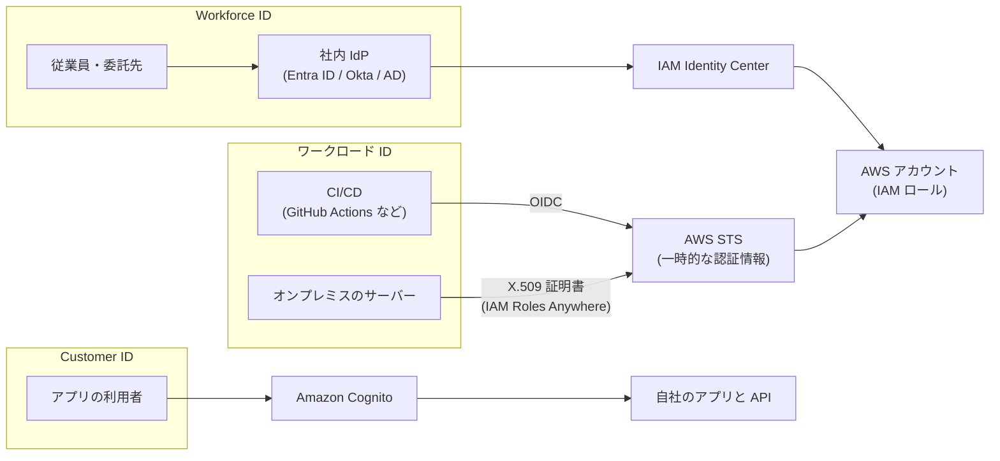
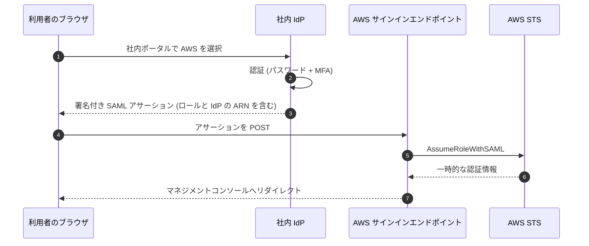

[ホーム](../README.md) > [Phase 3: プロフェッショナル](README.md) > 大規模な ID とアクセス管理

# 大規模な ID とアクセス管理

> **この章のゴール**
> - Workforce ID（従業員）と Customer ID（顧客）、ワークロード（機械）の ID を区別し、それぞれに適したサービスを選べる
> - IAM Identity Center（ID ソース、SCIM、権限セット、ABAC、委任管理者、マルチリージョン）で数百アカウントへのアクセスを設計できる
> - SAML 2.0 / OIDC フェデレーション、Directory Service、クロスアカウントアクセスのパターンを使い分けられる
> - SCP・RCP・アクセス許可の境界・セッションポリシーを含むポリシー評価の流れを説明できる
> - Cognito、Verified Permissions、Verified Access、IAM Roles Anywhere、IAM Access Analyzer の使いどころを判断できる
>
> **対応試験**: SAP-C03（D2: セキュリティ、コンプライアンス、ガバナンス ※ドメイン名は仮訳）
> **目安時間**: 読む 5 時間 / 確認問題と復習 2 時間

> [!NOTE]
> この章は [IAM 徹底解説](../02-associate/01-iam.md)（ポリシーの構文、ロールと信頼ポリシー、外部 ID、アクセス許可の境界の基本、例1〜例6）と、[前章](02-multi-account-governance.md)（SCP・RCP・データ境界）を前提にしています。Cognito の基本は [サーバーレス](../02-associate/10-serverless.md) を参照してください。

## この章の全体像

「誰が（どの種類の ID が）」「何に」アクセスするかで、使うサービスが決まります。SAP では、この組み合わせを間違えた選択肢（例: 顧客向けアプリの利用者を IAM Identity Center で管理する）が頻繁に登場します。



| 問題文のキーワード | まず考える解法 |
|---|---|
| 「従業員が数百のアカウントにシングルサインオン」「既存の Entra ID / Okta」 | IAM Identity Center + 外部 IdP + SCIM |
| 「オンプレミスの Active Directory のユーザーで AWS にサインイン」 | IAM Identity Center + AD（AWS Managed Microsoft AD または AD Connector） |
| 「CI/CD から長期のアクセスキーを使わずにデプロイ」 | OIDC フェデレーション（`AssumeRoleWithWebIdentity`） |
| 「オンプレミスのサーバーから長期のアクセスキーを使わずに」 | IAM Roles Anywhere |
| 「モバイル / Web アプリの顧客のサインアップとサインイン」 | Amazon Cognito ユーザープール |
| 「アプリ内のきめ細かな認可を、コードから切り離して一元管理」 | Amazon Verified Permissions（Cedar） |
| 「VPN を使わずに、社内アプリへゼロトラストでアクセス」 | AWS Verified Access |
| 「開発者に IAM ロールの作成を任せたいが、権限昇格は防ぎたい」 | アクセス許可の境界 |
| 「組織外に共有されているリソースや、未使用の権限を見つける」 | IAM Access Analyzer |

## 1. Workforce ID と Customer ID

| 観点 | Workforce ID（従業員・委託先） | Customer ID（顧客・一般の利用者） |
|---|---|---|
| 利用者 | 従業員、委託先、パートナー（数十〜数万人） | アプリの利用者（数百万人規模になり得る） |
| アクセス先 | AWS アカウント（コンソール・CLI）、業務アプリ | 自社のアプリと API |
| ID の正（マスター） | 社内の IdP（Entra ID、Okta、Active Directory） | アプリ側（セルフサインアップ、ソーシャルログイン） |
| 主な AWS サービス | IAM Identity Center、IAM の SAML / OIDC フェデレーション、Directory Service | Amazon Cognito、Amazon Verified Permissions |
| 認可の単位 | 権限セット → 各アカウントの IAM ロール | アプリ内の権限（JWT のクレーム、Verified Permissions）。必要なら ID プールで AWS の一時的な認証情報 |

これに加えて、アプリケーションやパイプラインなどの **ワークロード（機械）の ID** があります。AWS 上では IAM ロール（インスタンスプロファイル、Lambda の実行ロールなど）、AWS の外では OIDC フェデレーションや IAM Roles Anywhere で、**長期のアクセスキーを使わない** のが原則です。

> [!WARNING]
> **ひっかけ注意**: 「顧客向けアプリの利用者を IAM ユーザーや IAM Identity Center で管理する」は誤りです。IAM ユーザーは 1 アカウントあたり 5,000 までで、そもそも AWS を操作するための ID です。顧客の ID には Cognito（または外部の CIAM 製品）を使います。

## 2. IAM Identity Center 徹底解説

### 2.1 仕組み: 権限セットは各アカウントの IAM ロールになる

IAM Identity Center（旧 AWS SSO）は、従業員の ID を一元管理し、組織内の多数の AWS アカウントとアプリケーションへのシングルサインオンを提供します。

- **組織インスタンス**: Organizations の管理アカウントで有効化します。**AWS アカウントへのアクセス（権限セット）を管理できるのは組織インスタンスだけ** です。
- **アカウントインスタンス**: 単一のアカウントで、Identity Center 対応アプリケーションのためだけに使うものです。AWS アカウントへのアクセス管理には使えません。
- アクセスの割り当ては「**ユーザーまたはグループ × 権限セット × AWS アカウント**」の組み合わせです。
- 権限セットを割り当てると、Identity Center が対象アカウントに IAM ロール `AWSReservedSSO_<権限セット名>_<ランダムな文字列>`（パス `/aws-reserved/sso.amazonaws.com/` 配下）を自動で作成します。このロールは Identity Center が管理するため、直接編集してはいけません。


> [!TIP]
> **試験のポイント**: SCP でこのロールだけを例外にしたいときは、`aws:PrincipalArn` に `arn:aws:iam::*:role/aws-reserved/sso.amazonaws.com/*AWSReservedSSO_PlatformAdmin_*` のように `ArnLike` とワイルドカードで指定します（ランダムな文字列はアカウントごとに異なるため）。

### 2.2 ID ソース

| ID ソース | ユーザーとグループの管理 | 認証 | 向く場面 |
|---|---|---|---|
| Identity Center ディレクトリ（既定） | Identity Center 内で作成 | Identity Center（MFA を設定可能） | 小規模、既存の IdP がない |
| Active Directory | AWS Managed Microsoft AD、または AD Connector 経由で自己管理の AD を使用。同期するユーザーとグループを選択 | AD | 既存の AD を正として使う |
| 外部 IdP | IdP で管理し、**SCIM で自動プロビジョニング**（または手動で作成） | IdP（SAML 2.0） | Microsoft Entra ID、Okta などを使う企業 |

- ID ソースは **同時に 1 つだけ** です。ID ソースを変更すると、既存のユーザー・グループと割り当ての扱いに影響するため、計画的に行います。
- **SCIM**（System for Cross-domain Identity Management）は、IdP 側のユーザーとグループの作成・更新・削除を Identity Center に自動反映する標準プロトコルです。入社・異動・退職が IdP の操作だけで AWS 側に反映されます。パスワードは同期されず、認証は常に SAML で IdP が行います。SCIM のアクセストークンには有効期限（1 年）があるため、期限切れ前に更新する運用が必要です。
- 外部 IdP を使う場合、MFA は IdP 側で強制します。

> [!TIP]
> **試験のポイント**: 「Entra ID（または Okta）でユーザーを管理しており、退職者のアクセスを AWS 側で手作業なしに無効化したい」→ 外部 IdP を ID ソースにして SAML 2.0 + SCIM。「SAML だけ」では、ユーザーとグループの作成・削除が自動化されません。

### 2.3 権限セットの設計

権限セットは「どのアカウントでも使える、職務ごとの権限のテンプレート」です。

| 構成要素 | 内容 | 注意点 |
|---|---|---|
| AWS 管理ポリシー | `ReadOnlyAccess`、職務別の AWS 管理ポリシーなど | 範囲が広いものが多い |
| カスタマー管理ポリシーの参照 | **ポリシー名** で参照し、各アカウントの同名のポリシーを使う | 割り当て先の全アカウントに同名のポリシーが必要（StackSets で配布）。アカウントごとに内容を変えられる |
| インラインポリシー | 権限セットに直接書く | 全アカウントで同じ内容になる |
| アクセス許可の境界 | AWS 管理またはカスタマー管理ポリシーを参照 | 権限セットの上限を固定できる |
| セッション時間 | 1〜12 時間 | 長すぎると盗まれた場合の影響が大きい |

設計のポイント:

- 割り当ては **ユーザーではなくグループ** に対して行います。人の異動はグループのメンバーシップ（IdP 側）で吸収します。
- 権限セットは職務単位（ReadOnly、Developer、NetworkAdmin、SecurityAudit など）で作り、プロジェクトの違いは ABAC（2.4 節）で吸収すると、権限セットの数が爆発しません。
- 管理アカウントへの割り当ては管理アカウントからしか管理できません（委任管理者でも不可）。管理アカウントへの割り当ては最小限にします。
- **緊急時のアクセス** を用意します。外部 IdP や Identity Center が使えない場合に備えて、MFA を付けた緊急用の IAM ユーザーまたはロールを、厳重に管理された手順とともに残しておくのが AWS の推奨です。

### 2.4 ABAC（アクセス制御の属性）

Identity Center の「アクセス制御の属性」を有効にすると、IdP のユーザー属性（SAML アサーションまたは SCIM で同期した属性）を **セッションタグ** として渡せます。ポリシーでは `aws:PrincipalTag/<キー>` として参照します。

```json
{
  "Version": "2012-10-17",
  "Statement": [
    {
      "Sid": "AccessOwnProjectSecrets",
      "Effect": "Allow",
      "Action": "secretsmanager:GetSecretValue",
      "Resource": "*",
      "Condition": {
        "StringEquals": {
          "aws:ResourceTag/Project": "${aws:PrincipalTag/Project}"
        }
      }
    }
  ]
}
```

IdP で Project 属性が `payments` のユーザーは、`Project=payments` タグの付いたシークレットだけを読めます。新しいプロジェクトが増えても、権限セットを変更する必要はありません（ABAC の設計全体は 9 節）。

### 2.5 委任管理者

Identity Center の日常の管理（ユーザー・グループ、権限セット、割り当て、アプリケーション）は、**委任管理者として登録したメンバーアカウント** から行えます。管理アカウントにログインする人と頻度を減らせるため、大規模な組織では標準的な構成です。ただし、前述のとおり管理アカウントに対する割り当ては委任管理者からは管理できません。

### 2.6 マルチリージョンレプリケーション（2026年2月〜）

Identity Center の組織インスタンスは 1 つのリージョン（ホームリージョン）で有効化します。以前は「ホームリージョンの障害時は、IAM の緊急用アクセスで対応する」が定番の答えでした。2026年2月に **マルチリージョンレプリケーション** が一般提供となり、Identity Center を追加のリージョンに複製して、リージョン障害への回復力を高められるようになりました。

- 提供開始時は、外部 IdP を ID ソースとし、マルチリージョンの KMS カスタマー管理キーを使うことが条件でした。2026年7月に Identity Center ディレクトリにも対応しています（2026年9月時点）。
- レプリケーションを使う場合も、緊急用のアクセス手段（2.3 節）は引き続き用意します。

> [!NOTE]
> 試験や古い教材では「Identity Center は単一リージョンで動作する」という前提で出題される可能性があります。その場合は「緊急用の IAM ユーザー / ロールを用意する」選択肢が正解になりやすいことを覚えておきましょう。

### 2.7 アプリケーションと、信頼された ID の伝播

- Identity Center は AWS アカウントだけでなく、**AWS マネージドアプリケーション**（Amazon QuickSight（2025年10月に Amazon Quick Suite へ再編）、Amazon SageMaker Unified Studio、Amazon Redshift のクエリエディタなど）と、SAML 2.0 / OAuth 2.0 に対応した **カスタマー管理アプリケーション**（SaaS など）へのシングルサインオンも提供します。
- **信頼された ID の伝播**（trusted identity propagation）は、共有の IAM ロールではなく「**どの従業員か**」という ID そのものを、アプリケーションから AWS のデータサービスへ引き継ぐ仕組みです。たとえば QuickSight から Amazon Redshift へ、あるいは Athena・Amazon EMR・Lake Formation・S3 Access Grants で、ユーザーやグループ単位の権限で認可し、CloudTrail にもユーザーの ID が記録されます。
- 社外の OAuth IdP で認証する自社アプリからも、**信頼できるトークン発行者** を設定すれば、そのトークンを Identity Center のトークンと交換して ID を伝播できます。

> [!TIP]
> **試験のポイント**: 「データレイクへのアクセスを、共有ロールではなく個々の社員の ID で認可し、誰が何を読んだかを監査したい」→ 信頼された ID の伝播 + Lake Formation / S3 Access Grants。

### 2.8 CLI からの利用

Identity Center のユーザーは、長期のアクセスキーを作らずに CLI を使えます。

```bash
aws configure sso                  # 開始 URL、リージョン、アカウント、権限セットを対話的に設定
aws sso login --profile dev-admin  # ブラウザで認証（トークンはキャッシュされる）
aws s3 ls --profile dev-admin
```

`~/.aws/config` には次のように保存されます。

```ini
[profile dev-admin]
sso_session = corp
sso_account_id = 111122223333
sso_role_name = DeveloperAccess
region = ap-northeast-1

[sso-session corp]
sso_start_url = https://d-1234567890.awsapps.com/start
sso_region = ap-northeast-1
sso_registration_scopes = sso:account:access
```

なお、IAM ユーザーなどマネジメントコンソールのサインイン情報を使う場合は、`aws login`（AWS CLI v2.32.0 以降）でコンソールのサインインから一時的な認証情報を取得できます（[安全な学習用 AWS アカウントの準備](../00-start/04-aws-account-setup.md) で使った方法）。Identity Center のユーザーは `aws configure sso` と `aws sso login` を使います。

## 3. SAML 2.0 による IAM ロールへの直接フェデレーション

### 3.1 仕組み

Identity Center を使わず、各 AWS アカウントの IAM に **SAML ID プロバイダー**（IdP のメタデータ）を登録し、IdP から直接 IAM ロールを引き受ける方式です。



ロールの信頼ポリシーでは、登録した SAML プロバイダーをプリンシパルにし、`SAML:aud` を確認します。

```json
{
  "Version": "2012-10-17",
  "Statement": [
    {
      "Effect": "Allow",
      "Principal": {
        "Federated": "arn:aws:iam::111122223333:saml-provider/CorpIdP"
      },
      "Action": ["sts:AssumeRoleWithSAML", "sts:TagSession"],
      "Condition": {
        "StringEquals": {
          "SAML:aud": "https://signin.aws.amazon.com/saml"
        }
      }
    }
  ]
}
```

IdP はアサーションに、引き受けるロール（`https://aws.amazon.com/SAML/Attributes/Role`）、セッション名、セッション時間、セッションタグ（`PrincipalTag:<キー>`）などの属性を含めます。セッション時間の上限は、ロールの最大セッション時間（1〜12 時間）で決まります。CLI からは `AssumeRoleWithSAML` API にアサーションを渡して一時的な認証情報を得ます。

### 3.2 Identity Center と直接フェデレーションの使い分け

| 観点 | IAM Identity Center | IAM への直接 SAML フェデレーション |
|---|---|---|
| 管理の単位 | 組織全体で一元管理（権限セットを多数のアカウントへ配布） | アカウントごとに SAML プロバイダーとロールを作成 |
| アカウントが数百ある場合 | 得意 | IdP 側のロールのマッピングと各アカウントの設定が膨大になる |
| CLI の利用 | `aws sso login` で簡単 | 追加のツールや仕組みが必要 |
| 今でも使われる場面 | ほとんどのケース（推奨） | Organizations を使っていない、または組織外のアカウント。IdP 側の既存のロールのマッピングを当面維持したい移行期間。特定のアカウントだけ別の IdP で管理したい場合 |

> [!TIP]
> **試験のポイント**: 「多数のアカウント」「一元管理」「運用上のオーバーヘッドが最も少ない」→ Identity Center。「Organizations を使っていない単一アカウントに、既存の ADFS から SSO」→ IAM の SAML フェデレーションも正解になり得ます。

## 4. OIDC フェデレーション（CI/CD からのアクセス）

### 4.1 仕組み

GitHub Actions や GitLab CI などは、ジョブごとに署名付きの OIDC トークン（JWT）を発行できます。AWS 側に **IAM OIDC ID プロバイダー** を登録し、ロールの信頼ポリシーでトークンのクレームを確認すれば、ジョブは `AssumeRoleWithWebIdentity` で一時的な認証情報を取得できます。**長期のアクセスキーを CI/CD のシークレットに保存する必要がなくなります。**

```json
{
  "Version": "2012-10-17",
  "Statement": [
    {
      "Effect": "Allow",
      "Principal": {
        "Federated": "arn:aws:iam::111122223333:oidc-provider/token.actions.githubusercontent.com"
      },
      "Action": "sts:AssumeRoleWithWebIdentity",
      "Condition": {
        "StringEquals": {
          "token.actions.githubusercontent.com:aud": "sts.amazonaws.com",
          "token.actions.githubusercontent.com:sub": "repo:example-org/payments-app:environment:production"
        }
      }
    }
  ]
}
```

> [!CAUTION]
> `sub`（サブジェクト）クレームの条件を省略したり、`repo:example-org/*` のように広いワイルドカードにしたりすると、**意図しないリポジトリやブランチのジョブ** がロールを引き受けられてしまいます。本番用のロールは、リポジトリと環境（または保護されたブランチ）まで絞り込みます。

### 4.2 組織規模での設計

| 設計項目 | 推奨 |
|---|---|
| OIDC プロバイダーとデプロイ用ロールの配布 | CloudFormation StackSets（サービスマネージド、自動デプロイ）や AFT の global カスタマイズで、全ワークロードアカウントに同じ構成を配る |
| ロールの粒度 | 「リポジトリ × 環境」ごとにロールを分け、`sub` で絞る |
| 変更の保護 | SCP で、プラットフォームチームのロール以外による OIDC プロバイダーとデプロイ用ロールの変更（`iam:CreateOpenIDConnectProvider`、`iam:UpdateAssumeRolePolicy` など）を拒否 |
| 経路 | 各アカウントのロールを直接引き受ける構成は、ロールチェーンの 1 時間の制限（6.2 節）を受けない。中央のデプロイ用アカウントを経由する構成は、権限の集中と制限時間に注意 |

> [!NOTE]
> Amazon EKS の IRSA（IAM Roles for Service Accounts）も OIDC フェデレーションの一種です。現在は OIDC プロバイダーの登録が不要な EKS Pod Identity も選べます（[コンテナ](../02-associate/11-containers.md)）。

## 5. AWS Directory Service

| 項目 | AWS Managed Microsoft AD | AD Connector | Simple AD |
|---|---|---|---|
| 実体 | AWS が運用する Microsoft Active Directory（2 つの AZ にドメインコントローラー） | オンプレミスの AD へ要求を中継するプロキシ（ディレクトリのデータを持たない） | Samba ベースの AD 互換ディレクトリ |
| オンプレミスの AD との関係 | **信頼関係**（一方向・双方向、フォレスト信頼など）を結べる | オンプレミスの AD をそのまま使う。VPN または Direct Connect が必須 | 信頼関係を結べない |
| 主な用途 | AD を必要とするアプリ（SQL Server、SharePoint など）、RDS for SQL Server・FSx for Windows File Server の Windows 認証、WorkSpaces、Identity Center の ID ソース、複数アカウントでのディレクトリ共有 | 既存の AD の資格情報で Identity Center・WorkSpaces にサインイン、EC2 のドメイン参加 | 小規模で基本的な AD 互換機能 |
| 規模・可用性 | Standard / Enterprise（大規模向け。追加のリージョンへのレプリケーションに対応） | Small / Large | Small / Large |
| MFA | RADIUS 連携に対応 | RADIUS 連携に対応 | ― |
| 状態（2026年9月時点） | 利用可能 | 利用可能 | 【新規受付終了】2026年6月に新規受付終了を発表 |

- **信頼関係の典型パターン**: AWS Managed Microsoft AD 側がオンプレミスのドメインを信頼する一方向の信頼関係を結ぶと、オンプレミスのユーザーが、ユーザーを AWS 側に複製することなく、AWS 上の AD 対応アプリにアクセスできます。
- **AD Connector** は認証のたびにオンプレミスの AD に問い合わせるため、オンプレミスとの接続が切れるとサインインできません。AWS 上でドメインを持つ必要があるアプリ（AD に参加する SQL Server など）には向きません。
- RDS for SQL Server や FSx for Windows File Server は、Directory Service を使わずに自己管理の AD に参加させる構成も選べます。

> [!WARNING]
> **ひっかけ注意**: Simple AD は新規受付を終了しているため、新しい設計の選択肢としては選びません（代替は AWS Managed Microsoft AD または AD Connector）。古い問題集では「小規模でコストを抑えるなら Simple AD」が正解になっていることがあります。

## 6. クロスアカウントアクセスのパターン

### 6.1 ロールの引き受けとリソースベースのポリシー

| パターン | 仕組み | 長所 | 注意点 |
|---|---|---|---|
| IAM ロールの引き受け | 相手アカウントのロールの **信頼ポリシー** で自分を許可し、自分の IAM ポリシーで `sts:AssumeRole` を許可 | ほぼすべてのサービスに使える | 引き受けている間は元の権限を使えない（ロールの権限だけになる） |
| リソースベースのポリシー | S3、KMS、SQS、SNS、Lambda、Secrets Manager、ECR などのポリシーで相手を許可 | **元の権限を保ったまま** 相手のリソースを使える（例: 自分のバケットから相手のバケットへのコピー） | 対応サービスだけ |
| AWS RAM | リソースそのものを共有（[前章](02-multi-account-governance.md) 8.2 節） | 所有者は 1 つのまま | 対応リソースだけ |

いずれの方式でも、クロスアカウントのアクセスには **両側での許可** が必要です（呼び出す側のアイデンティティベースのポリシーと、リソース側のリソースベースのポリシーまたは信頼ポリシー）。

### 6.2 ロールチェーンと 1 時間の制限

ロールの一時的な認証情報を使って、さらに別のロールを引き受けることを **ロールチェーン** と呼びます。

- ロールチェーンで得たセッションの最大時間は **1 時間** です。引き受けるロールの最大セッション時間を 12 時間にしていても、1 時間を超える値を要求すると失敗します。
- 長時間の処理では、SDK の AssumeRole 認証情報プロバイダーのように **期限前に自動で再取得する仕組み** を使うか、チェーンを避けて最初の ID から目的のロールを直接引き受けます。
- セッションタグは、`TransitiveTagKeys` を指定するとチェーンの先まで引き継がれます。
- **ソース ID**（`sts:SourceIdentity`）を設定すると、チェーンをまたいでも「元の利用者が誰か」が引き継がれ、CloudTrail で追跡できます。一度設定したソース ID は、チェーンの途中で変更できません。

### 6.3 外部 ID: 第三者にアクセスを許可するとき

SaaS 事業者などの **第三者** に自社アカウントのロールを引き受けさせる場合は、信頼ポリシーで `sts:ExternalId` を必須にし、「混乱した代理」問題を防ぎます（構文は [IAM 徹底解説](../02-associate/01-iam.md) を参照）。外部 ID は第三者側が顧客ごとに一意の値を発行するのが正しい形です。一方、**自社の組織内** のアカウント間では外部 ID ではなく、次の組織単位の条件キーを使います。

### 6.4 組織単位の条件キー

| 条件キー | 意味 | 典型的な用途 |
|---|---|---|
| `aws:PrincipalOrgID` | 呼び出し元のプリンシパルが所属する組織の ID | バケットポリシーや RCP で「自社の組織の ID だけ」を許可 |
| `aws:PrincipalOrgPaths` | 呼び出し元のアカウントの OU パス（複数値） | 「本番 OU の配下のアカウントだけ」を許可 |
| `aws:ResourceOrgID` / `aws:ResourceOrgPaths` | アクセス先のリソースが所属する組織・OU パス | SCP で「自社の組織のリソースだけ」にアクセスを限定（リソース境界） |
| `aws:SourceOrgID` / `aws:SourceOrgPaths` | AWS サービスが代理で動くときの、元のリソースの組織 | サービスプリンシパルに対する混乱した代理の防止 |
| `aws:PrincipalAccount` / `aws:ResourceAccount` / `aws:SourceAccount` | アカウント ID 単位の指定 | 特定のアカウントだけの例外 |

`aws:PrincipalOrgID` を使うバケットポリシーの例は [IAM 徹底解説](../02-associate/01-iam.md) で扱いました。OU 単位で絞る場合は、次のように `aws:PrincipalOrgPaths` を使います（複数値のキーなので `ForAnyValue` を付けます）。

```json
{
  "Version": "2012-10-17",
  "Statement": [
    {
      "Sid": "AllowProdOuAccountsOnly",
      "Effect": "Allow",
      "Principal": { "AWS": "*" },
      "Action": "s3:GetObject",
      "Resource": "arn:aws:s3:::shared-artifacts-bucket/*",
      "Condition": {
        "ForAnyValue:StringLike": {
          "aws:PrincipalOrgPaths": ["o-a1b2c3d4e5/r-ab12/ou-ab12-11111111/*"]
        }
      }
    }
  ]
}
```

末尾の `*` により、この OU の配下の子 OU も含まれます。本番 OU にアカウントが追加されても、バケットポリシーを変更する必要はありません。

> [!TIP]
> **試験のポイント**: 「アカウントが増えるたびにバケットポリシーや KMS キーポリシーを更新したくない」→ `aws:PrincipalOrgID`（組織全体）または `aws:PrincipalOrgPaths`（特定の OU）。「第三者の SaaS にアクセスを許可」→ クロスアカウントロール + 外部 ID。

## 7. アクセス許可の境界による権限の委任

### 7.1 何が問題か

開発チームに「Lambda 関数用の IAM ロールを自分で作ってよい」と許可すると、何も対策しなければ、開発者は AdministratorAccess 付きのロールを作ってそれを使う（`iam:PassRole` で関数に渡す）ことで、**自分の権限を超える操作** ができてしまいます（権限昇格）。

### 7.2 境界を必須にしてロールの作成を任せる

開発者の IAM ポリシー（または Identity Center の権限セット）を次のようにします。

```json
{
  "Version": "2012-10-17",
  "Statement": [
    {
      "Sid": "CreateAndManageAppRolesWithBoundary",
      "Effect": "Allow",
      "Action": [
        "iam:CreateRole",
        "iam:PutRolePermissionsBoundary",
        "iam:AttachRolePolicy",
        "iam:DetachRolePolicy",
        "iam:PutRolePolicy",
        "iam:DeleteRolePolicy"
      ],
      "Resource": "arn:aws:iam::111122223333:role/app/*",
      "Condition": {
        "StringEquals": {
          "iam:PermissionsBoundary": "arn:aws:iam::111122223333:policy/AppBoundary"
        }
      }
    },
    {
      "Sid": "PassOnlyAppRoles",
      "Effect": "Allow",
      "Action": "iam:PassRole",
      "Resource": "arn:aws:iam::111122223333:role/app/*"
    },
    {
      "Sid": "ProtectBoundaryPolicy",
      "Effect": "Deny",
      "Action": [
        "iam:CreatePolicyVersion",
        "iam:DeletePolicy",
        "iam:DeletePolicyVersion",
        "iam:SetDefaultPolicyVersion"
      ],
      "Resource": "arn:aws:iam::111122223333:policy/AppBoundary"
    },
    {
      "Sid": "DenyBoundaryRemoval",
      "Effect": "Deny",
      "Action": "iam:DeleteRolePermissionsBoundary",
      "Resource": "*"
    }
  ]
}
```

- 1 つ目: `/app/` パスのロールを作成・変更できるのは、境界 `AppBoundary` が設定されている場合だけです。
- 2 つ目: 関数に渡せるのは `/app/` パスのロールだけです。
- 3〜4 つ目: 境界のポリシー自体の書き換えと、境界の取り外しを禁止します。

作成されたロールの有効な権限は「ロールに付けたポリシー ∩ `AppBoundary`」になるため、開発者がどんなポリシーを付けても、境界を超える操作はできません。組織全体で徹底するには、前章の SCP で「境界なしの `iam:CreateRole` を拒否（プラットフォームチームのロールは例外）」も組み合わせます。

> [!TIP]
> **試験のポイント**: 「開発者にロールの作成を委任したい」「権限昇格を防ぎたい」「中央のチームをボトルネックにしたくない」→ アクセス許可の境界 + `iam:PermissionsBoundary` 条件 + 境界ポリシーの保護。SCP は「アカウント全体の上限」、境界は「個々のユーザー・ロールの上限」です。

