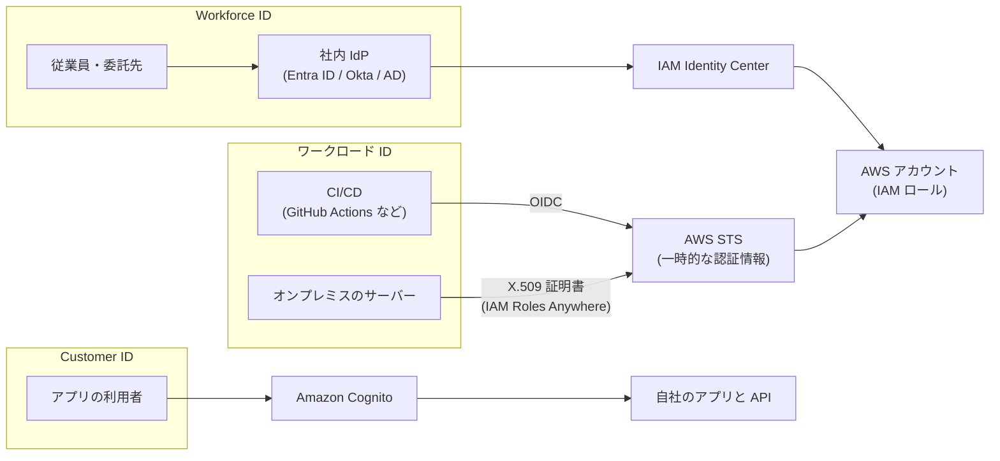
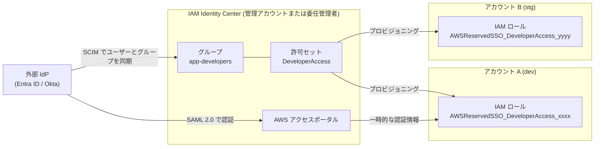
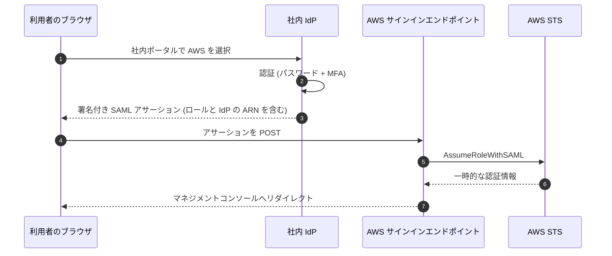
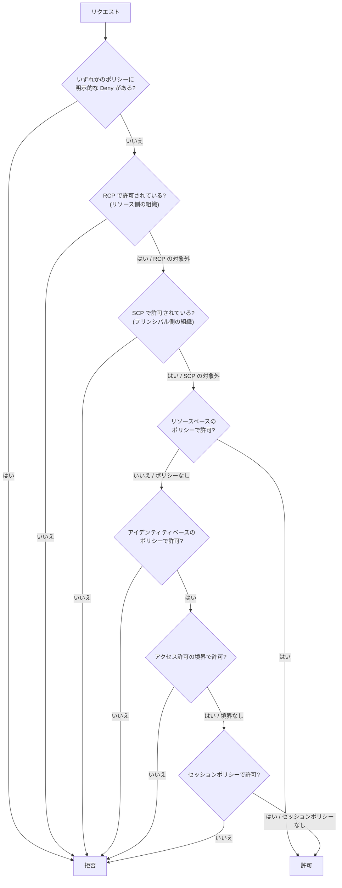
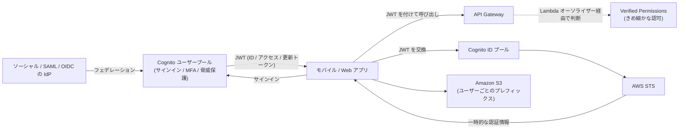

[ホーム](../README.md) > [Phase 3: プロフェッショナル](README.md) > 大規模な ID とアクセス管理

# 大規模な ID とアクセス管理

> **この章のゴール**
> - Workforce ID（従業員）と Customer ID（顧客）、ワークロード（機械）の ID を区別し、それぞれに適したサービスを選べる
> - IAM Identity Center（ID ソース、SCIM、許可セット、ABAC、委任管理者、マルチリージョン）で数百アカウントへのアクセスを設計できる
> - SAML 2.0 / OIDC フェデレーション、Directory Service、クロスアカウントアクセスのパターンを使い分けられる
> - SCP・RCP・アクセス許可の境界・セッションポリシーを含むポリシー評価の流れを説明できる
> - Cognito、Verified Permissions、Verified Access、IAM Roles Anywhere、IAM Access Analyzer の使いどころを判断できる
>
> **対応試験**: SAP-C03（D2: セキュリティ、コンプライアンス、ガバナンス ※ドメイン名は仮訳）
> **目安時間**: 読む 5 時間 / 確認問題と復習 2 時間

> [!NOTE]
> この章は [IAM 徹底解説](../02-associate/01-iam.md)（ポリシーの構文、ロールと信頼ポリシー、外部 ID、アクセス許可の境界の基本、例1〜例6）と、[前章](02-multi-account-governance.md)（SCP・RCP・データ境界）を前提にしています。Cognito の基本は [サーバーレス](../02-associate/10-serverless.md) を参照してください。

## この章の全体像

「誰が（どの種類の ID が）」「何に」アクセスするかで、使うサービスが決まります。SAP では、この組み合わせを間違えた選択肢（例: 顧客向けアプリの利用者を IAM Identity Center で管理する）が頻繁に登場します。



| 問題文のキーワード | まず考える解法 |
|---|---|
| 「従業員が数百のアカウントにシングルサインオン」「既存の Entra ID / Okta」 | IAM Identity Center + 外部 IdP + SCIM |
| 「オンプレミスの Active Directory のユーザーで AWS にサインイン」 | IAM Identity Center + AD（AWS Managed Microsoft AD または AD Connector） |
| 「CI/CD から長期のアクセスキーを使わずにデプロイ」 | OIDC フェデレーション（`AssumeRoleWithWebIdentity`） |
| 「オンプレミスのサーバーから長期のアクセスキーを使わずに」 | IAM Roles Anywhere |
| 「モバイル / Web アプリの顧客のサインアップとサインイン」 | Amazon Cognito ユーザープール |
| 「アプリ内のきめ細かな認可を、コードから切り離して一元管理」 | Amazon Verified Permissions（Cedar） |
| 「VPN を使わずに、社内アプリへゼロトラストでアクセス」 | AWS Verified Access |
| 「開発者に IAM ロールの作成を任せたいが、権限昇格は防ぎたい」 | アクセス許可の境界 |
| 「組織外に共有されているリソースや、未使用の権限を見つける」 | IAM Access Analyzer |

## 1. Workforce ID と Customer ID

| 観点 | Workforce ID（従業員・委託先） | Customer ID（顧客・一般の利用者） |
|---|---|---|
| 利用者 | 従業員、委託先、パートナー（数十〜数万人） | アプリの利用者（数百万人規模になり得る） |
| アクセス先 | AWS アカウント（コンソール・CLI）、業務アプリ | 自社のアプリと API |
| ID の正（マスター） | 社内の IdP（Entra ID、Okta、Active Directory） | アプリ側（セルフサインアップ、ソーシャルログイン） |
| 主な AWS サービス | IAM Identity Center、IAM の SAML / OIDC フェデレーション、Directory Service | Amazon Cognito、Amazon Verified Permissions |
| 認可の単位 | 許可セット → 各アカウントの IAM ロール | アプリ内の権限（JWT のクレーム、Verified Permissions）。必要なら ID プールで AWS の一時的な認証情報 |

これに加えて、アプリケーションやパイプラインなどの **ワークロード（機械）の ID** があります。AWS 上では IAM ロール（インスタンスプロファイル、Lambda の実行ロールなど）、AWS の外では OIDC フェデレーションや IAM Roles Anywhere で、**長期のアクセスキーを使わない** のが原則です。

> [!WARNING]
> **ひっかけ注意**: 「顧客向けアプリの利用者を IAM ユーザーや IAM Identity Center で管理する」は誤りです。IAM ユーザーは 1 アカウントあたり 5,000 までで、そもそも AWS を操作するための ID です。顧客の ID には Cognito（または外部の CIAM 製品）を使います。

## 2. IAM Identity Center 徹底解説

### 2.1 仕組み: 許可セットは各アカウントの IAM ロールになる

IAM Identity Center（旧 AWS SSO）は、従業員の ID を一元管理し、組織内の多数の AWS アカウントとアプリケーションへのシングルサインオンを提供します。

- **組織インスタンス**: Organizations の管理アカウントで有効化します。**AWS アカウントへのアクセス（許可セット）を管理できるのは組織インスタンスだけ** です。
- **アカウントインスタンス**: 単一のアカウントで、Identity Center 対応アプリケーションのためだけに使うものです。AWS アカウントへのアクセス管理には使えません。
- アクセスの割り当ては「**ユーザーまたはグループ × 許可セット × AWS アカウント**」の組み合わせです。
- 許可セットを割り当てると、Identity Center が対象アカウントに IAM ロール `AWSReservedSSO_<許可セット名>_<ランダムな文字列>`（パス `/aws-reserved/sso.amazonaws.com/` 配下）を自動で作成します。このロールは Identity Center が管理するため、直接編集してはいけません。



> [!TIP]
> **試験のポイント**: SCP でこのロールだけを例外にしたいときは、`aws:PrincipalArn` に `arn:aws:iam::*:role/aws-reserved/sso.amazonaws.com/*AWSReservedSSO_PlatformAdmin_*` のように `ArnLike` とワイルドカードで指定します（ランダムな文字列はアカウントごとに異なるため）。

### 2.2 ID ソース

| ID ソース | ユーザーとグループの管理 | 認証 | 向く場面 |
|---|---|---|---|
| Identity Center ディレクトリ（既定） | Identity Center 内で作成 | Identity Center（MFA を設定可能） | 小規模、既存の IdP がない |
| Active Directory | AWS Managed Microsoft AD、または AD Connector 経由で自己管理の AD を使用。同期するユーザーとグループを選択 | AD | 既存の AD を正として使う |
| 外部 IdP | IdP で管理し、**SCIM で自動プロビジョニング**（または手動で作成） | IdP（SAML 2.0） | Microsoft Entra ID、Okta などを使う企業 |

- ID ソースは **同時に 1 つだけ** です。ID ソースを変更すると、既存のユーザー・グループと割り当ての扱いに影響するため、計画的に行います。
- **SCIM**（System for Cross-domain Identity Management）は、IdP 側のユーザーとグループの作成・更新・削除を Identity Center に自動反映する標準プロトコルです。入社・異動・退職が IdP の操作だけで AWS 側に反映されます。パスワードは同期されず、認証は常に SAML で IdP が行います。SCIM のアクセストークンには有効期限（1 年）があるため、期限切れ前に更新する運用が必要です。
- 外部 IdP を使う場合、MFA は IdP 側で強制します。

> [!TIP]
> **試験のポイント**: 「Entra ID（または Okta）でユーザーを管理しており、退職者のアクセスを AWS 側で手作業なしに無効化したい」→ 外部 IdP を ID ソースにして SAML 2.0 + SCIM。「SAML だけ」では、ユーザーとグループの作成・削除が自動化されません。

### 2.3 許可セットの設計

許可セットは「どのアカウントでも使える、職務ごとの権限のテンプレート」です。

| 構成要素 | 内容 | 注意点 |
|---|---|---|
| AWS 管理ポリシー | `ReadOnlyAccess`、職務別の AWS 管理ポリシーなど | 範囲が広いものが多い |
| カスタマー管理ポリシーの参照 | **ポリシー名** で参照し、各アカウントの同名のポリシーを使う | 割り当て先の全アカウントに同名のポリシーが必要（StackSets で配布）。アカウントごとに内容を変えられる |
| インラインポリシー | 許可セットに直接書く | 全アカウントで同じ内容になる |
| アクセス許可の境界 | AWS 管理またはカスタマー管理ポリシーを参照 | 許可セットの上限を固定できる |
| セッション時間 | 1〜12 時間 | 長すぎると盗まれた場合の影響が大きい |

設計のポイント:

- 割り当ては **ユーザーではなくグループ** に対して行います。人の異動はグループのメンバーシップ（IdP 側）で吸収します。
- 許可セットは職務単位（ReadOnly、Developer、NetworkAdmin、SecurityAudit など）で作り、プロジェクトの違いは ABAC（2.4 節）で吸収すると、許可セットの数が爆発しません。
- 管理アカウントへの割り当ては管理アカウントからしか管理できません（委任管理者でも不可）。管理アカウントへの割り当ては最小限にします。
- **緊急時のアクセス** を用意します。外部 IdP や Identity Center が使えない場合に備えて、MFA を付けた緊急用の IAM ユーザーまたはロールを、厳重に管理された手順とともに残しておくのが AWS の推奨です。

### 2.4 ABAC（アクセス制御の属性）

Identity Center の「アクセス制御の属性」を有効にすると、IdP のユーザー属性（SAML アサーションまたは SCIM で同期した属性）を **セッションタグ** として渡せます。ポリシーでは `aws:PrincipalTag/<キー>` として参照します。

```json
{
  "Version": "2012-10-17",
  "Statement": [
    {
      "Sid": "AccessOwnProjectSecrets",
      "Effect": "Allow",
      "Action": "secretsmanager:GetSecretValue",
      "Resource": "*",
      "Condition": {
        "StringEquals": {
          "aws:ResourceTag/Project": "${aws:PrincipalTag/Project}"
        }
      }
    }
  ]
}
```

IdP で Project 属性が `payments` のユーザーは、`Project=payments` タグの付いたシークレットだけを読めます。新しいプロジェクトが増えても、許可セットを変更する必要はありません（ABAC の設計全体は 9 節）。

### 2.5 委任管理者

Identity Center の日常の管理（ユーザー・グループ、許可セット、割り当て、アプリケーション）は、**委任管理者として登録したメンバーアカウント** から行えます。管理アカウントにログインする人と頻度を減らせるため、大規模な組織では標準的な構成です。ただし、前述のとおり管理アカウントに対する割り当ては委任管理者からは管理できません。

### 2.6 マルチリージョンレプリケーション（2026年2月〜）

Identity Center の組織インスタンスは 1 つのリージョン（ホームリージョン）で有効化します。以前は「ホームリージョンの障害時は、IAM の緊急用アクセスで対応する」が定番の答えでした。2026年2月に **マルチリージョンレプリケーション** が一般提供となり、Identity Center を追加のリージョンに複製して、リージョン障害への回復力を高められるようになりました。

- 提供開始時は、外部 IdP を ID ソースとし、マルチリージョンの KMS カスタマー管理キーを使うことが条件でした。2026年7月に Identity Center ディレクトリにも対応しています（2026年9月時点）。
- レプリケーションを使う場合も、緊急用のアクセス手段（2.3 節）は引き続き用意します。

> [!NOTE]
> 試験や古い教材では「Identity Center は単一リージョンで動作する」という前提で出題される可能性があります。その場合は「緊急用の IAM ユーザー / ロールを用意する」選択肢が正解になりやすいことを覚えておきましょう。

### 2.7 アプリケーションと、信頼された ID の伝播

- Identity Center は AWS アカウントだけでなく、**AWS マネージドアプリケーション**（Amazon QuickSight（2025年10月に Amazon Quick Suite へ再編）、Amazon SageMaker Unified Studio、Amazon Redshift のクエリエディタなど）と、SAML 2.0 / OAuth 2.0 に対応した **カスタマー管理アプリケーション**（SaaS など）へのシングルサインオンも提供します。
- **信頼された ID の伝播**（trusted identity propagation）は、共有の IAM ロールではなく「**どの従業員か**」という ID そのものを、アプリケーションから AWS のデータサービスへ引き継ぐ仕組みです。たとえば QuickSight から Amazon Redshift へ、あるいは Athena・Amazon EMR・Lake Formation・S3 Access Grants で、ユーザーやグループ単位の権限で認可し、CloudTrail にもユーザーの ID が記録されます。
- 社外の OAuth IdP で認証する自社アプリからも、**信頼できるトークン発行者** を設定すれば、そのトークンを Identity Center のトークンと交換して ID を伝播できます。

> [!TIP]
> **試験のポイント**: 「データレイクへのアクセスを、共有ロールではなく個々の社員の ID で認可し、誰が何を読んだかを監査したい」→ 信頼された ID の伝播 + Lake Formation / S3 Access Grants。

### 2.8 CLI からの利用

Identity Center のユーザーは、長期のアクセスキーを作らずに CLI を使えます。

```bash
aws configure sso                  # 開始 URL、リージョン、アカウント、許可セットを対話的に設定
aws sso login --profile dev-admin  # ブラウザで認証（トークンはキャッシュされる）
aws s3 ls --profile dev-admin
```

`~/.aws/config` には次のように保存されます。

```ini
[profile dev-admin]
sso_session = corp
sso_account_id = 111122223333
sso_role_name = DeveloperAccess
region = ap-northeast-1

[sso-session corp]
sso_start_url = https://d-1234567890.awsapps.com/start
sso_region = ap-northeast-1
sso_registration_scopes = sso:account:access
```

なお、IAM ユーザーなどマネジメントコンソールのサインイン情報を使う場合は、`aws login`（AWS CLI v2.32.0 以降）でコンソールのサインインから一時的な認証情報を取得できます（[安全な学習用 AWS アカウントの準備](../00-start/04-aws-account-setup.md) で使った方法）。Identity Center のユーザーは `aws configure sso` と `aws sso login` を使います。

## 3. SAML 2.0 による IAM ロールへの直接フェデレーション

### 3.1 仕組み

Identity Center を使わず、各 AWS アカウントの IAM に **SAML ID プロバイダー**（IdP のメタデータ）を登録し、IdP から直接 IAM ロールを引き受ける方式です。



ロールの信頼ポリシーでは、登録した SAML プロバイダーをプリンシパルにし、`SAML:aud` を確認します。

```json
{
  "Version": "2012-10-17",
  "Statement": [
    {
      "Effect": "Allow",
      "Principal": {
        "Federated": "arn:aws:iam::111122223333:saml-provider/CorpIdP"
      },
      "Action": ["sts:AssumeRoleWithSAML", "sts:TagSession"],
      "Condition": {
        "StringEquals": {
          "SAML:aud": "https://signin.aws.amazon.com/saml"
        }
      }
    }
  ]
}
```

IdP はアサーションに、引き受けるロール（`https://aws.amazon.com/SAML/Attributes/Role`）、セッション名、セッション時間、セッションタグ（`PrincipalTag:<キー>`）などの属性を含めます。セッション時間の上限は、ロールの最大セッション時間（1〜12 時間）で決まります。CLI からは `AssumeRoleWithSAML` API にアサーションを渡して一時的な認証情報を得ます。

### 3.2 Identity Center と直接フェデレーションの使い分け

| 観点 | IAM Identity Center | IAM への直接 SAML フェデレーション |
|---|---|---|
| 管理の単位 | 組織全体で一元管理（許可セットを多数のアカウントへ配布） | アカウントごとに SAML プロバイダーとロールを作成 |
| アカウントが数百ある場合 | 得意 | IdP 側のロールのマッピングと各アカウントの設定が膨大になる |
| CLI の利用 | `aws sso login` で簡単 | 追加のツールや仕組みが必要 |
| 今でも使われる場面 | ほとんどのケース（推奨） | Organizations を使っていない、または組織外のアカウント。IdP 側の既存のロールのマッピングを当面維持したい移行期間。特定のアカウントだけ別の IdP で管理したい場合 |

> [!TIP]
> **試験のポイント**: 「多数のアカウント」「一元管理」「運用上のオーバーヘッドが最も少ない」→ Identity Center。「Organizations を使っていない単一アカウントに、既存の ADFS から SSO」→ IAM の SAML フェデレーションも正解になり得ます。

## 4. OIDC フェデレーション（CI/CD からのアクセス）

### 4.1 仕組み

GitHub Actions や GitLab CI などは、ジョブごとに署名付きの OIDC トークン（JWT）を発行できます。AWS 側に **IAM OIDC ID プロバイダー** を登録し、ロールの信頼ポリシーでトークンのクレームを確認すれば、ジョブは `AssumeRoleWithWebIdentity` で一時的な認証情報を取得できます。**長期のアクセスキーを CI/CD のシークレットに保存する必要がなくなります。**

```json
{
  "Version": "2012-10-17",
  "Statement": [
    {
      "Effect": "Allow",
      "Principal": {
        "Federated": "arn:aws:iam::111122223333:oidc-provider/token.actions.githubusercontent.com"
      },
      "Action": "sts:AssumeRoleWithWebIdentity",
      "Condition": {
        "StringEquals": {
          "token.actions.githubusercontent.com:aud": "sts.amazonaws.com",
          "token.actions.githubusercontent.com:sub": "repo:example-org/payments-app:environment:production"
        }
      }
    }
  ]
}
```

> [!CAUTION]
> `sub`（サブジェクト）クレームの条件を省略したり、`repo:example-org/*` のように広いワイルドカードにしたりすると、**意図しないリポジトリやブランチのジョブ** がロールを引き受けられてしまいます。本番用のロールは、リポジトリと環境（または保護されたブランチ）まで絞り込みます。

### 4.2 組織規模での設計

| 設計項目 | 推奨 |
|---|---|
| OIDC プロバイダーとデプロイ用ロールの配布 | CloudFormation StackSets（サービスマネージド、自動デプロイ）や AFT の global カスタマイズで、全ワークロードアカウントに同じ構成を配る |
| ロールの粒度 | 「リポジトリ × 環境」ごとにロールを分け、`sub` で絞る |
| 変更の保護 | SCP で、プラットフォームチームのロール以外による OIDC プロバイダーとデプロイ用ロールの変更（`iam:CreateOpenIDConnectProvider`、`iam:UpdateAssumeRolePolicy` など）を拒否 |
| 経路 | 各アカウントのロールを直接引き受ける構成は、ロールチェーンの 1 時間の制限（6.2 節）を受けない。中央のデプロイ用アカウントを経由する構成は、権限の集中と制限時間に注意 |

> [!NOTE]
> Amazon EKS の IRSA（IAM Roles for Service Accounts）も OIDC フェデレーションの一種です。現在は OIDC プロバイダーの登録が不要な EKS Pod Identity も選べます（[コンテナ](../02-associate/11-containers.md)）。

## 5. AWS Directory Service

| 項目 | AWS Managed Microsoft AD | AD Connector | Simple AD |
|---|---|---|---|
| 実体 | AWS が運用する Microsoft Active Directory（2 つの AZ にドメインコントローラー） | オンプレミスの AD へ要求を中継するプロキシ（ディレクトリのデータを持たない） | Samba ベースの AD 互換ディレクトリ |
| オンプレミスの AD との関係 | **信頼関係**（一方向・双方向、フォレスト信頼など）を結べる | オンプレミスの AD をそのまま使う。VPN または Direct Connect が必須 | 信頼関係を結べない |
| 主な用途 | AD を必要とするアプリ（SQL Server、SharePoint など）、RDS for SQL Server・FSx for Windows File Server の Windows 認証、WorkSpaces、Identity Center の ID ソース、複数アカウントでのディレクトリ共有 | 既存の AD の資格情報で Identity Center・WorkSpaces にサインイン、EC2 のドメイン参加 | 小規模で基本的な AD 互換機能 |
| 規模・可用性 | Standard / Enterprise（大規模向け。追加のリージョンへのレプリケーションに対応） | Small / Large | Small / Large |
| MFA | RADIUS 連携に対応 | RADIUS 連携に対応 | ― |
| 状態（2026年9月時点） | 利用可能 | 利用可能 | 【新規受付終了】2026年6月に新規受付終了を発表 |

- **信頼関係の典型パターン**: AWS Managed Microsoft AD 側がオンプレミスのドメインを信頼する一方向の信頼関係を結ぶと、オンプレミスのユーザーが、ユーザーを AWS 側に複製することなく、AWS 上の AD 対応アプリにアクセスできます。
- **AD Connector** は認証のたびにオンプレミスの AD に問い合わせるため、オンプレミスとの接続が切れるとサインインできません。AWS 上でドメインを持つ必要があるアプリ（AD に参加する SQL Server など）には向きません。
- RDS for SQL Server や FSx for Windows File Server は、Directory Service を使わずに自己管理の AD に参加させる構成も選べます。

> [!WARNING]
> **ひっかけ注意**: Simple AD は新規受付を終了しているため、新しい設計の選択肢としては選びません（代替は AWS Managed Microsoft AD または AD Connector）。古い問題集では「小規模でコストを抑えるなら Simple AD」が正解になっていることがあります。

## 6. クロスアカウントアクセスのパターン

### 6.1 ロールの引き受けとリソースベースのポリシー

| パターン | 仕組み | 長所 | 注意点 |
|---|---|---|---|
| IAM ロールの引き受け | 相手アカウントのロールの **信頼ポリシー** で自分を許可し、自分の IAM ポリシーで `sts:AssumeRole` を許可 | ほぼすべてのサービスに使える | 引き受けている間は元の権限を使えない（ロールの権限だけになる） |
| リソースベースのポリシー | S3、KMS、SQS、SNS、Lambda、Secrets Manager、ECR などのポリシーで相手を許可 | **元の権限を保ったまま** 相手のリソースを使える（例: 自分のバケットから相手のバケットへのコピー） | 対応サービスだけ |
| AWS RAM | リソースそのものを共有（[前章](02-multi-account-governance.md) 8.2 節） | 所有者は 1 つのまま | 対応リソースだけ |

いずれの方式でも、クロスアカウントのアクセスには **両側での許可** が必要です（呼び出す側のアイデンティティベースのポリシーと、リソース側のリソースベースのポリシーまたは信頼ポリシー）。

### 6.2 ロールチェーンと 1 時間の制限

ロールの一時的な認証情報を使って、さらに別のロールを引き受けることを **ロールチェーン** と呼びます。

- ロールチェーンで得たセッションの最大時間は **1 時間** です。引き受けるロールの最大セッション時間を 12 時間にしていても、1 時間を超える値を要求すると失敗します。
- 長時間の処理では、SDK の AssumeRole 認証情報プロバイダーのように **期限前に自動で再取得する仕組み** を使うか、チェーンを避けて最初の ID から目的のロールを直接引き受けます。
- セッションタグは、`TransitiveTagKeys` を指定するとチェーンの先まで引き継がれます。
- **ソース ID**（`sts:SourceIdentity`）を設定すると、チェーンをまたいでも「元の利用者が誰か」が引き継がれ、CloudTrail で追跡できます。一度設定したソース ID は、チェーンの途中で変更できません。

### 6.3 外部 ID: 第三者にアクセスを許可するとき

SaaS 事業者などの **第三者** に自社アカウントのロールを引き受けさせる場合は、信頼ポリシーで `sts:ExternalId` を必須にし、「混乱した代理」問題を防ぎます（構文は [IAM 徹底解説](../02-associate/01-iam.md) を参照）。外部 ID は第三者側が顧客ごとに一意の値を発行するのが正しい形です。一方、**自社の組織内** のアカウント間では外部 ID ではなく、次の組織単位の条件キーを使います。

### 6.4 組織単位の条件キー

| 条件キー | 意味 | 典型的な用途 |
|---|---|---|
| `aws:PrincipalOrgID` | 呼び出し元のプリンシパルが所属する組織の ID | バケットポリシーや RCP で「自社の組織の ID だけ」を許可 |
| `aws:PrincipalOrgPaths` | 呼び出し元のアカウントの OU パス（複数値） | 「本番 OU の配下のアカウントだけ」を許可 |
| `aws:ResourceOrgID` / `aws:ResourceOrgPaths` | アクセス先のリソースが所属する組織・OU パス | SCP で「自社の組織のリソースだけ」にアクセスを限定（リソース境界） |
| `aws:SourceOrgID` / `aws:SourceOrgPaths` | AWS サービスが代理で動くときの、元のリソースの組織 | サービスプリンシパルに対する混乱した代理の防止 |
| `aws:PrincipalAccount` / `aws:ResourceAccount` / `aws:SourceAccount` | アカウント ID 単位の指定 | 特定のアカウントだけの例外 |

`aws:PrincipalOrgID` を使うバケットポリシーの例は [IAM 徹底解説](../02-associate/01-iam.md) で扱いました。OU 単位で絞る場合は、次のように `aws:PrincipalOrgPaths` を使います（複数値のキーなので `ForAnyValue` を付けます）。

```json
{
  "Version": "2012-10-17",
  "Statement": [
    {
      "Sid": "AllowProdOuAccountsOnly",
      "Effect": "Allow",
      "Principal": { "AWS": "*" },
      "Action": "s3:GetObject",
      "Resource": "arn:aws:s3:::shared-artifacts-bucket/*",
      "Condition": {
        "ForAnyValue:StringLike": {
          "aws:PrincipalOrgPaths": ["o-a1b2c3d4e5/r-ab12/ou-ab12-11111111/*"]
        }
      }
    }
  ]
}
```

末尾の `*` により、この OU の配下の子 OU も含まれます。本番 OU にアカウントが追加されても、バケットポリシーを変更する必要はありません。

> [!TIP]
> **試験のポイント**: 「アカウントが増えるたびにバケットポリシーや KMS キーポリシーを更新したくない」→ `aws:PrincipalOrgID`（組織全体）または `aws:PrincipalOrgPaths`（特定の OU）。「第三者の SaaS にアクセスを許可」→ クロスアカウントロール + 外部 ID。

## 7. アクセス許可の境界による権限の委任

### 7.1 何が問題か

開発チームに「Lambda 関数用の IAM ロールを自分で作ってよい」と許可すると、何も対策しなければ、開発者は AdministratorAccess 付きのロールを作ってそれを使う（`iam:PassRole` で関数に渡す）ことで、**自分の権限を超える操作** ができてしまいます（権限昇格）。

### 7.2 境界を必須にしてロールの作成を任せる

開発者の IAM ポリシー（または Identity Center の許可セット）を次のようにします。

```json
{
  "Version": "2012-10-17",
  "Statement": [
    {
      "Sid": "CreateAndManageAppRolesWithBoundary",
      "Effect": "Allow",
      "Action": [
        "iam:CreateRole",
        "iam:PutRolePermissionsBoundary",
        "iam:AttachRolePolicy",
        "iam:DetachRolePolicy",
        "iam:PutRolePolicy",
        "iam:DeleteRolePolicy"
      ],
      "Resource": "arn:aws:iam::111122223333:role/app/*",
      "Condition": {
        "StringEquals": {
          "iam:PermissionsBoundary": "arn:aws:iam::111122223333:policy/AppBoundary"
        }
      }
    },
    {
      "Sid": "PassOnlyAppRoles",
      "Effect": "Allow",
      "Action": "iam:PassRole",
      "Resource": "arn:aws:iam::111122223333:role/app/*"
    },
    {
      "Sid": "ProtectBoundaryPolicy",
      "Effect": "Deny",
      "Action": [
        "iam:CreatePolicyVersion",
        "iam:DeletePolicy",
        "iam:DeletePolicyVersion",
        "iam:SetDefaultPolicyVersion"
      ],
      "Resource": "arn:aws:iam::111122223333:policy/AppBoundary"
    },
    {
      "Sid": "DenyBoundaryRemoval",
      "Effect": "Deny",
      "Action": "iam:DeleteRolePermissionsBoundary",
      "Resource": "*"
    }
  ]
}
```

- 1 つ目: `/app/` パスのロールを作成・変更できるのは、境界 `AppBoundary` が設定されている場合だけです。
- 2 つ目: 関数に渡せるのは `/app/` パスのロールだけです。
- 3〜4 つ目: 境界のポリシー自体の書き換えと、境界の取り外しを禁止します。

作成されたロールの有効な権限は「ロールに付けたポリシー ∩ `AppBoundary`」になるため、開発者がどんなポリシーを付けても、境界を超える操作はできません。組織全体で徹底するには、前章の SCP で「境界なしの `iam:CreateRole` を拒否（プラットフォームチームのロールは例外）」も組み合わせます。

> [!TIP]
> **試験のポイント**: 「開発者にロールの作成を委任したい」「権限昇格を防ぎたい」「中央のチームをボトルネックにしたくない」→ アクセス許可の境界 + `iam:PermissionsBoundary` 条件 + 境界ポリシーの保護。SCP は「アカウント全体の上限」、境界は「個々のユーザー・ロールの上限」です。

## 8. ポリシー評価ロジックの完全版

### 8.1 ポリシーの種類と役割

| ポリシー | 設定する場所 | 役割 |
|---|---|---|
| アイデンティティベースのポリシー | IAM ユーザー・グループ・ロール（許可セットを含む） | 許可を与える |
| リソースベースのポリシー | S3 バケット、KMS キー、SQS キュー、ロールの信頼ポリシーなど | 許可を与える（クロスアカウントでは必須） |
| アクセス許可の境界 | IAM ユーザー・ロール | 上限を決める（許可は与えない） |
| セッションポリシー | `AssumeRole` などの呼び出し時に渡すポリシー | そのセッションの上限を決める（許可は与えない） |
| SCP | Organizations（**プリンシパル側** のアカウント） | 上限を決める（許可は与えない） |
| RCP | Organizations（**リソース側** のアカウント） | 上限を決める（許可は与えない） |
| VPC エンドポイントポリシー | VPC エンドポイント | エンドポイントを通る要求の上限を決める |

### 8.2 評価の流れ

次の図は、同一アカウント内の要求の評価を簡略化したものです（公式の [ポリシー評価ロジック](https://docs.aws.amazon.com/IAM/latest/UserGuide/reference_policies_evaluation-logic.html) に基づく）。



押さえるべきルール:

1. **明示的な Deny は常に最優先** です。どのポリシーの Deny でも、ほかの Allow を打ち消します。
2. 何も許可されていなければ **暗黙的な拒否** です。
3. SCP・RCP・アクセス許可の境界・セッションポリシーは **上限** です。許可を与えるのは、アイデンティティベースのポリシーとリソースベースのポリシーだけです。
4. **同一アカウント内** では、リソースベースのポリシーで許可されていれば、アイデンティティベースのポリシーに許可がなくてもアクセスできます。ただし、リソースベースのポリシーが IAM ロールの ARN を指定している場合は、アクセス許可の境界やセッションポリシーによる制限を受けます。
5. **クロスアカウント** では、プリンシパル側のアカウントでの評価（アイデンティティベースのポリシー、境界、セッションポリシー、SCP）と、リソース側のアカウントでの評価（リソースベースのポリシー、RCP）の **両方で許可** が必要です。
6. **KMS キーとロールの信頼ポリシー** は例外的に厳格です。KMS キーはキーポリシーでアカウントまたはプリンシパルの利用を許可していなければ、IAM ポリシーだけでは使えません。ロールは信頼ポリシーで許可されていなければ引き受けられません。

### 8.3 例で確認

| 状況 | 結果 | 理由 |
|---|---|---|
| AdministratorAccess を持つ開発者が、SCP で禁止されたリージョンで EC2 を起動 | 拒否 | SCP の上限を超える |
| 同一アカウントのバケットポリシーが IAM ユーザーの ARN を直接許可。ユーザーの IAM ポリシーには S3 の許可なし | 許可 | 同一アカウント内ではリソースベースのポリシーだけで許可できる |
| 別アカウントのバケットポリシーで許可されているが、自分の IAM ポリシーに `s3:GetObject` がない | 拒否 | クロスアカウントは両側の許可が必要 |
| ロールに AdministratorAccess、境界は S3 のみ | S3 以外は拒否 | 有効な権限は「ポリシー ∩ 境界」 |
| AdministratorAccess のロールを、`s3:GetObject` だけのセッションポリシーを付けて引き受けた | GetObject 以外は拒否 | セッションの権限は「ロールのポリシー ∩ セッションポリシー」 |
| 組織外の ID が、バケットポリシーで許可されたバケットにアクセス。組織の RCP が組織外を拒否 | 拒否 | RCP はリソース側の上限で、組織外の ID にも効く |

> [!TIP]
> **試験のポイント**: 「権限があるはずなのに拒否される」問題は、図の上から順に確認します。①どこかに明示的な Deny はないか → ② RCP・SCP → ③ クロスアカウントなら相手側の許可 → ④ 境界・セッションポリシー。「上限系は許可を与えない」を忘れないことが最大のポイントです。

## 9. ABAC の設計

### 9.1 RBAC と ABAC

| 観点 | RBAC（ロールベース） | ABAC（属性ベース） |
|---|---|---|
| 考え方 | 職務ごとにポリシーを作り、許可するリソースを列挙 | プリンシパルとリソースの **タグ（属性）が一致** すれば許可 |
| プロジェクトやリソースが増えたとき | ポリシーの追加・更新が必要 | タグを付けるだけ。ポリシーは変更不要 |
| ポリシーの数 | 増え続けやすい | 少数で済む |
| 前提 | ― | タグ付けの統制（誰がタグを付け、変更できるか） |
| 限界 | ― | タグによる条件に対応していないサービス・操作がある。デバッグが難しい |

### 9.2 主な条件キー

| 条件キー | 何のタグか | 典型的な用途 |
|---|---|---|
| `aws:PrincipalTag/<キー>` | 呼び出し元のプリンシパルのタグ（IAM ロールのタグ、IdP や Identity Center から渡されたセッションタグ） | 「自分と同じプロジェクト」の判定 |
| `aws:ResourceTag/<キー>` | アクセス先のリソースのタグ | 既存リソースの操作を許可するか |
| `aws:RequestTag/<キー>` | リクエストで付けようとしているタグ | 作成時に正しいタグを強制 |
| `aws:TagKeys` | リクエストに含まれるタグキーの一覧 | 特定のタグキーの変更を禁止 |

### 9.3 例: 同じプロジェクトのインスタンスだけを操作でき、Project タグは変更できない

```json
{
  "Version": "2012-10-17",
  "Statement": [
    {
      "Sid": "OperateOwnProjectInstances",
      "Effect": "Allow",
      "Action": ["ec2:StartInstances", "ec2:StopInstances", "ec2:RebootInstances"],
      "Resource": "arn:aws:ec2:*:*:instance/*",
      "Condition": {
        "StringEquals": {
          "aws:ResourceTag/Project": "${aws:PrincipalTag/Project}"
        }
      }
    },
    {
      "Sid": "DenyProjectTagChangeAfterCreation",
      "Effect": "Deny",
      "Action": ["ec2:CreateTags", "ec2:DeleteTags"],
      "Resource": "*",
      "Condition": {
        "ForAnyValue:StringEquals": { "aws:TagKeys": ["Project"] },
        "Null": { "ec2:CreateAction": "true" }
      }
    }
  ]
}
```

- 1 つ目: リソースの `Project` タグが、利用者のセッションタグ `Project` と一致するときだけ操作を許可します。
- 2 つ目: 作成後に `Project` タグを付け替える・外す操作を拒否します。`ec2:CreateAction` は `RunInstances` などの作成時のタグ付けにだけ存在するキーなので、作成時のタグ付けは妨げません。
- 作成時に正しいタグを強制するには、`RunInstances` の許可に `aws:RequestTag/Project` が `${aws:PrincipalTag/Project}` と一致する条件を付けます。

### 9.4 タグの統制

ABAC では **タグがセキュリティの属性** になるため、次をセットで設計します。

- プリンシパルのタグの出どころを信頼できるものに限る（IdP の属性 → Identity Center のアクセス制御の属性、またはロールのタグ）。利用者が自分のセッションタグを自由に付けられないようにする（`sts:TagSession` の制御）。
- リソースのタグの変更を制限する（上記の Deny、または SCP で組織全体に適用）。
- タグの表記はタグポリシーで統一し、作成時の付与は SCP の `aws:RequestTag` で強制する（[前章](02-multi-account-governance.md) の例F）。
- ロールチェーンでタグを引き継ぐ場合は、推移的なセッションタグ（`TransitiveTagKeys`）を使う。

> [!TIP]
> **試験のポイント**: 「プロジェクトやチームが頻繁に増え、そのたびにポリシーを更新する運用を減らしたい」→ ABAC（`aws:PrincipalTag` と `aws:ResourceTag` の一致）。「IdP の部署属性で AWS の権限を制御」→ Identity Center のアクセス制御の属性、または SAML の `PrincipalTag` 属性によるセッションタグ。

## 10. Amazon Cognito と Amazon Verified Permissions

### 10.1 Cognito の全体像



| 機能 | ユーザープール | ID プール（フェデレーテッドアイデンティティ） |
|---|---|---|
| 役割 | 利用者のディレクトリであり、アプリ向けの OIDC IdP | 各種トークンを **AWS の一時的な認証情報** に交換する |
| 出力 | JWT（ID トークン、アクセストークン、更新トークン） | IAM ロールの一時的な認証情報 |
| 主な用途 | サインアップ・サインイン、API Gateway・ALB での認証 | アプリから S3 や DynamoDB を直接呼び出す |

### 10.2 ユーザープール

- **フェデレーション**: Google・Apple・Facebook・Amazon などのソーシャル IdP、SAML 2.0、OIDC の IdP と連携し、アプリはユーザープールの JWT だけを扱えば済みます。
- **マネージドログイン**（旧ホスト UI）: サインイン画面を AWS がホストします。
- **機能プラン**: Lite / Essentials / Plus。パスキーやメールのワンタイムパスワードによるパスワードレス認証、アクセストークンのカスタマイズなどは Essentials 以上、**脅威保護**（旧称: 高度なセキュリティ機能。漏えいした認証情報の検出、リスクに応じた適応型認証）は Plus で使えます。
- **Lambda トリガー**:

| トリガー | タイミング | 用途の例 |
|---|---|---|
| サインアップ前 | サインアップの要求時 | 許可するメールドメインの制限、自動確認 |
| 確認後 | ユーザーの確認後 | ユーザー情報を DynamoDB に登録 |
| 認証前 / 認証後 | サインイン時 | 追加の検証、監査ログの記録 |
| トークン生成前 | トークンの発行前 | クレームの追加・変更（テナント ID や権限情報） |
| ユーザー移行 | 未登録のユーザーのサインイン時 | 既存のユーザーデータベースから、パスワードを再設定させずに段階的に移行 |
| カスタム認証チャレンジ | 独自の認証フロー | 独自の認証方式の実装 |
| カスタムメッセージ / カスタム送信者 | メールや SMS の送信時 | 文面や送信経路の変更 |

### 10.3 ID プール

ID プールは、ユーザープールや外部 IdP のトークンを受け取り、認証済みユーザー用（必要なら未認証のゲスト用）の IAM ロールの一時的な認証情報を払い出します。ポリシー変数を使うと、ユーザーごとに S3 のプレフィックスを分けられます。

```json
{
  "Version": "2012-10-17",
  "Statement": [
    {
      "Effect": "Allow",
      "Action": ["s3:PutObject", "s3:GetObject"],
      "Resource": "arn:aws:s3:::photo-app-uploads/private/${cognito-identity.amazonaws.com:sub}/*"
    }
  ]
}
```

トークンのクレームに応じてロールを選ぶルールや、クレームをプリンシパルタグにして ABAC を行う設定もできます。

> [!NOTE]
> **Amazon Cognito Sync** は 2026年6月に新規受付終了が発表されました。デバイス間のデータ同期には AWS AppSync などを使います。

### 10.4 Amazon Verified Permissions（Cedar）

Amazon Verified Permissions は、**自社アプリケーションの中の認可**（誰が、どの操作を、どのデータに対してできるか）を、オープンソースのポリシー言語 **Cedar** で外部化するマネージドサービスです。

- **ポリシーストア** にスキーマ（エンティティの型と属性）とポリシーを保存し、アプリは `IsAuthorized`（Cognito や OIDC のトークンを渡す場合は `IsAuthorizedWithToken`）API で「許可か拒否か」を問い合わせます。
- 認可ロジックがアプリのコードから切り離されるため、変更と監査が容易になります。
- Cedar は Amazon Bedrock AgentCore の Policy でも使われています（[生成 AI・エージェント AI のアーキテクチャ](09-generative-ai-architecture.md)）。

```cedar
permit (
  principal in ExpenseApp::Group::"approvers",
  action == ExpenseApp::Action::"approveExpense",
  resource
)
when {
  resource.department == principal.department &&
  resource.amount <= principal.approvalLimit
};
```

「承認者グループのユーザーは、自部門の経費を、自分の承認上限額以下なら承認できる」というルールです。

> [!TIP]
> **試験のポイント**: 「顧客のサインアップ・サインイン、ソーシャルログイン」→ Cognito ユーザープール。「モバイルアプリから S3 に直接アップロード」→ ID プール。「アプリ内のきめ細かな権限をコードから切り離して一元管理・監査」→ Verified Permissions。AWS のリソースへの権限（IAM）とアプリ内の権限（Verified Permissions）を混同しないようにします。

## 11. AWS Verified Access

AWS Verified Access は、**VPN を使わずに** 社内アプリケーションへのアクセスを提供するゼロトラスト型のサービスです。リクエストのたびに、**ユーザーの ID** と **デバイスの状態** をポリシーで評価し、許可されたときだけアプリケーションに転送します。

| 構成要素 | 内容 |
|---|---|
| 信頼プロバイダー | ユーザーの ID（IAM Identity Center、OIDC 対応の IdP）と、デバイスの状態（Jamf、CrowdStrike、JumpCloud などの製品） |
| グループ | 同じセキュリティ要件のアプリケーションをまとめ、共通のポリシーを適用する単位 |
| エンドポイント | アプリケーションの入口（ALB、ネットワークインターフェイスなど） |
| ポリシー | Cedar で記述。ユーザーのグループやメールドメイン、デバイスのリスクなどを条件にする |

| 観点 | AWS Client VPN | AWS Verified Access |
|---|---|---|
| アクセスの単位 | ネットワーク（接続後は許可された範囲に広くアクセスできる） | アプリケーション単位 |
| 評価のタイミング | 接続時 | リクエストごと |
| デバイスの状態 | 基本的に考慮しない | 信頼プロバイダーの情報で評価 |
| 向く用途 | あらゆるプロトコル、ネットワーク全体への接続 | 社内 Web アプリなどへのゼロトラストアクセス |

HTTP(S) のアプリケーションが中心ですが、SSH や RDP などの TCP 接続への対応も追加されています（最新の対応範囲は [公式ドキュメント](https://docs.aws.amazon.com/verified-access/latest/ug/what-is-verified-access.html) で確認してください）。アクセスログは CloudWatch Logs、S3、Data Firehose に出力でき、AWS WAF とも統合できます。

> [!TIP]
> **試験のポイント**: 「VPN を廃止したい」「アプリごとに、ユーザーの ID とデバイスのセキュリティ状態を毎回評価したい」→ Verified Access。「オンプレミスのネットワーク全体を AWS と接続」は Site-to-Site VPN や Direct Connect の領域です。

## 12. IAM Roles Anywhere

IAM Roles Anywhere は、**AWS の外で動くワークロード**（オンプレミスのサーバー、他のクラウド）が、**X.509 証明書** を使って IAM ロールの一時的な認証情報を取得する仕組みです。社内の PKI（認証局）をそのまま信頼の基点にできます。

| 構成要素 | 内容 |
|---|---|
| トラストアンカー | 信頼する認証局（AWS Private CA、または外部 CA の証明書） |
| プロファイル | 引き受けられるロール、セッションポリシー、セッション時間 |
| IAM ロール | 信頼ポリシーで `rolesanywhere.amazonaws.com` を信頼し、証明書の属性で絞り込む |
| 認証情報ヘルパー | `aws_signing_helper`。AWS CLI・SDK の `credential_process` として使う |

```json
{
  "Version": "2012-10-17",
  "Statement": [
    {
      "Effect": "Allow",
      "Principal": { "Service": "rolesanywhere.amazonaws.com" },
      "Action": ["sts:AssumeRole", "sts:TagSession", "sts:SetSourceIdentity"],
      "Condition": {
        "ArnEquals": {
          "aws:SourceArn": "arn:aws:rolesanywhere:ap-northeast-1:111122223333:trust-anchor/EXAMPLE-TRUST-ANCHOR-ID"
        },
        "StringEquals": {
          "aws:PrincipalTag/x509Subject/CN": "batch01.example.internal"
        }
      }
    }
  ]
}
```

```ini
[profile onprem-batch]
credential_process = aws_signing_helper credential-process --certificate /etc/pki/batch01.pem --private-key /etc/pki/batch01.key --trust-anchor-arn <トラストアンカーの ARN> --profile-arn <プロファイルの ARN> --role-arn <ロールの ARN>
```

- 証明書のサブジェクト（CN など）はセッションタグとして渡されるため、上の例のように「特定のサーバーの証明書だけ」を許可できます。
- 証明書の失効は、CRL をトラストアンカーに取り込んで反映します。
- AWS Systems Manager のハイブリッドアクティベーションは、オンプレミスのサーバーを Systems Manager で **管理する** ための仕組みで、アプリケーションに AWS の認証情報を与える目的とは異なります。

> [!TIP]
> **試験のポイント**: 「オンプレミスのアプリケーションが S3 などにアクセスする」「長期のアクセスキーを使いたくない」「社内の PKI がある」→ IAM Roles Anywhere。アクセスキーを Secrets Manager でローテーションする選択肢は、長期の認証情報が残るため次善の策です。

## 13. IAM Access Analyzer（組織レベル）

### 13.1 3 種類のアナライザー

| 種類 | わかること | 料金（2026年9月時点） |
|---|---|---|
| 外部アクセス | 信頼ゾーン（組織またはアカウント）の **外** からアクセスできるリソース（S3 バケット、IAM ロール、KMS キー、Lambda 関数、SQS キュー、Secrets Manager のシークレットなど） | 無料 |
| 内部アクセス（2025年6月〜） | 組織内の **どの ID が** 重要なリソースにアクセスできるか | 有料 |
| 未使用のアクセス（2023年11月〜） | 使われていない IAM ロール、アクセスキー、パスワード、権限。削減のための推奨も表示 | 有料 |

- 信頼ゾーンを **組織** にしたアナライザーは、管理アカウントまたは委任管理者（Security Tooling アカウント）で作成し、全アカウントの結果を一か所で確認します。
- 想定どおりの共有（取引先との受け渡し用バケットなど）は、アーカイブルールで自動的にアーカイブします。
- 検出結果は Security Hub や EventBridge に連携して、通知や対応を自動化できます。

### 13.2 ポリシーのチェックを CI/CD に組み込む

| 機能 | 内容 | 使いどころ |
|---|---|---|
| ポリシーの検証（`ValidatePolicy`） | 文法エラー、セキュリティ上の警告、ベストプラクティスの提案 | すべてのポリシー変更で実行 |
| カスタムポリシーチェック `CheckNoNewAccess` | 変更後のポリシーが、変更前（または基準のポリシー）より **広い権限を与えていないか** | 権限の拡大を人のレビューに回す |
| カスタムポリシーチェック `CheckAccessNotGranted` | 指定した重要な操作やリソース（例: `iam:PassRole`、`kms:Decrypt`）を許可していないか | 危険な権限の混入を自動でブロック |
| カスタムポリシーチェック `CheckNoPublicAccess` | リソースベースのポリシーがパブリックアクセスを許可していないか | バケットポリシーなどの公開を防止 |
| ポリシーの生成 | CloudTrail の実際のアクティビティから最小権限のポリシーを生成 | 既存のロールの権限を絞り込む |

IaC のパイプライン（CloudFormation や Terraform のテンプレートからポリシーを抽出）でこれらのチェックを実行し、失敗したらデプロイを止めると、「本番に出る前に」問題のある権限を防げます。

> [!TIP]
> **試験のポイント**: 「組織外に共有されているリソースを一覧化」→ 外部アクセスのアナライザー（信頼ゾーン = 組織）。「使われていない権限やロールを定期的に棚卸し」→ 未使用のアクセスのアナライザー。「デプロイ前に、権限の拡大や危険な権限をパイプラインで自動検出」→ カスタムポリシーチェック。

## 14. 典型シナリオと解法

**シナリオ1: Entra ID を正とした、数百アカウントへのシングルサインオン**
- 状況と要件: 従業員 8,000 人の ID は Microsoft Entra ID で管理している。300 のアカウントへのアクセスを一元管理し、退職者のアクセスは即座に、手作業なしで無効化したい。
- 解法: IAM Identity Center の ID ソースを外部 IdP（Entra ID）にし、SAML 2.0 で認証、SCIM でユーザーとグループを自動同期します。割り当てはグループ × 職務別の許可セットで行い、日常の管理は委任管理者のアカウントから行います。
- ほかの選択肢が不適な理由: アカウントごとの IAM ユーザーは管理不能です。各アカウントへの直接の SAML フェデレーションは設定が膨大で、ユーザーのライフサイクルも自動化されません。

**シナリオ2: オンプレミスの AD と、AWS 上の AD 対応アプリ**
- 状況と要件: オンプレミスの Active Directory のユーザーが、AWS 上の SQL Server（EC2）と FSx for Windows File Server を Windows 認証で使いたい。ユーザーを AWS 側に複製したくない。オンプレミスとの回線が一時的に切れても AWS 側のドメインは動き続ける必要がある。
- 解法: AWS Managed Microsoft AD を作成し、オンプレミスのドメインを信頼する一方向のフォレスト信頼を結びます。AWS 上のサーバーは AWS Managed Microsoft AD のドメインに参加させます。
- ほかの選択肢が不適な理由: AD Connector はプロキシなので、回線断で認証できず、AWS 側にドメインを持てません。Simple AD は信頼関係を結べず、新規受付も終了しています。

**シナリオ3: GitHub Actions から 200 アカウントへのデプロイ**
- 状況と要件: 長期のアクセスキーの利用は禁止。本番へのデプロイは、特定のリポジトリの production 環境のジョブだけに許可したい。
- 解法: 各ワークロードアカウントに IAM OIDC プロバイダーとデプロイ用ロールを StackSets（自動デプロイ）で配布し、信頼ポリシーの `sub` でリポジトリと環境を限定します。プロバイダーとロールの変更は SCP で保護します。
- ほかの選択肢が不適な理由: アクセスキーを GitHub のシークレットに保存する方法は要件違反です。中央のロールから全アカウントへロールチェーンする構成は、1 時間の制限と権限の集中が問題になります。

**シナリオ4: 開発者への IAM ロール作成の委任**
- 状況と要件: 開発者は Lambda 関数用のロールを自分で作りたい。セキュリティチームは権限昇格を防ぎたいが、すべてのロールを代わりに作るのはボトルネックになっている。
- 解法: アクセス許可の境界を必須にしたロール作成の許可（7.2 節）と、境界ポリシーの保護を組み合わせます。組織全体では SCP で「境界なしのロール作成」を拒否します。
- ほかの選択肢が不適な理由: `iam:*` を与えると権限昇格が可能です。セキュリティチームが全ロールを作る方式は要件（ボトルネックの解消）を満たしません。

**シナリオ5: SaaS 事業者に自社アカウントの読み取りを許可する**
- 状況と要件: コスト分析の SaaS に、組織内の全アカウントの読み取りアクセスを与えたい。長期のアクセスキーは渡したくない。
- 解法: 事業者のアカウントを信頼し、事業者が発行した外部 ID を必須にした読み取り専用のクロスアカウントロールを、StackSets で全アカウントに配布します。
- ほかの選択肢が不適な理由: IAM ユーザーのアクセスキーを渡すのは長期の認証情報の共有です。`aws:PrincipalOrgID` は組織外の事業者には使えません。

**シナリオ6: 顧客向けモバイルアプリ**
- 状況と要件: ソーシャルログインに対応し、写真を S3 にユーザーごとに分けて直接アップロードしたい。漏えいしたパスワードによる不正ログインも防ぎたい。
- 解法: Cognito ユーザープール（ソーシャル IdP とのフェデレーション、Plus プランの脅威保護）と、ID プール（`${cognito-identity.amazonaws.com:sub}` でプレフィックスを限定したロール）を組み合わせます。
- ほかの選択肢が不適な理由: IAM Identity Center は従業員向けです。アプリにアクセスキーを埋め込むのは論外です。

**シナリオ7: VPN の廃止とゼロトラストアクセス**
- 状況と要件: 在宅勤務の従業員が社内の Web アプリを使うために VPN を利用しているが、接続後にネットワーク全体へアクセスできることが問題視されている。アプリごとに、ユーザーと端末の状態を確認したい。
- 解法: AWS Verified Access を導入し、ユーザーの信頼プロバイダーに IAM Identity Center、デバイスの信頼プロバイダーに端末管理製品を設定して、アプリごとのポリシーで評価します。
- ほかの選択肢が不適な理由: Client VPN はネットワーク単位のアクセスで、要件（アプリ単位・端末の状態）を満たしません。

## まとめ

- まず「誰の ID か」を見極めます。従業員 → IAM Identity Center、顧客 → Cognito、ワークロード → IAM ロール / OIDC / IAM Roles Anywhere。長期のアクセスキーは使いません。
- Identity Center の許可セットは、割り当てた各アカウントの IAM ロールとして作られます。外部 IdP は SAML 2.0 で認証し、SCIM でユーザーとグループを自動同期します。割り当てはグループ単位、日常の管理は委任管理者から行います。
- Identity Center はマルチリージョンレプリケーション（2026年2月〜）に対応しましたが、緊急用のアクセス手段は引き続き用意します。
- 信頼された ID の伝播で、共有ロールではなく個々のユーザーの ID でデータへのアクセスを認可・監査できます。
- IAM への直接の SAML フェデレーションは、Organizations を使わない場合や移行期間などに限って使います。CI/CD は OIDC フェデレーションで、`sub` を必ず絞ります。
- AWS Managed Microsoft AD は信頼関係を結べる本物の AD、AD Connector はプロキシです。Simple AD は新規受付を終了しています。
- ロールチェーンのセッションは最大 1 時間です。第三者には外部 ID、組織内には `aws:PrincipalOrgID` / `aws:PrincipalOrgPaths` を使います。
- ポリシー評価は「明示的な Deny → RCP → SCP → リソースベース → アイデンティティベース → 境界 → セッションポリシー」の順に考えます。上限系のポリシーは許可を与えず、クロスアカウントでは両側の許可が必要です。
- ABAC は `aws:PrincipalTag` と `aws:ResourceTag` の一致で許可し、タグの変更を統制することが前提です。
- アプリ内の認可は Verified Permissions（Cedar）、VPN なしのゼロトラストアクセスは Verified Access、権限の棚卸しと CI での検査は IAM Access Analyzer を使います。

## 確認問題

### 問1
ある企業は 350 の AWS アカウントを AWS Organizations で管理しています。従業員 12,000 人の ID は Okta で管理しています。現在は各アカウントに IAM ユーザーを作成していますが、退職者の IAM ユーザーの削除漏れが監査で指摘されました。セキュリティチームは、従業員が Okta の資格情報で全アカウントにアクセスでき、Okta でユーザーを無効化・削除すると AWS 側のユーザーも自動的に無効化・削除されるようにしたいと考えています。最も運用上のオーバーヘッドが少ない方法はどれですか。

- A. 各アカウントの IAM に Okta を SAML ID プロバイダーとして登録し、職務ごとの IAM ロールを作成する。Okta 側で各アカウントのロールをユーザーに割り当てる。
- B. IAM Identity Center の ID ソースを外部 IdP（Okta）にし、SAML 2.0 で認証、SCIM でユーザーとグループを自動プロビジョニングする。グループに許可セットとアカウントを割り当てる。
- C. IAM Identity Center の ID ソースを Identity Center ディレクトリのままにし、Okta からユーザーの一覧を CSV で定期的にインポートする。
- D. AD Connector を作成して Okta に接続し、IAM Identity Center の ID ソースを Active Directory にする。

<details>
<summary>解答と解説</summary>

**正解: B**

**解説**: 外部 IdP を ID ソースにすると、認証は Okta が行い、SCIM によってユーザーとグループの作成・更新・削除が Identity Center に自動で反映されます。割り当てをグループ単位で行えば、異動や退職も Okta の操作だけで完結します。

**各選択肢の検討**
- A: ✗ Okta での無効化によりサインインはできなくなりますが、350 アカウントそれぞれに SAML プロバイダーとロールを作成・維持する必要があり、運用負荷が非常に大きくなります。
- B: ✓ 一元管理とライフサイクルの自動化を両立します。
- C: ✗ 定期的なインポートは自動同期ではなく、反映に遅れが出ます。認証も Okta ではなく Identity Center のパスワードになります。
- D: ✗ AD Connector は Active Directory に接続するためのもので、Okta には接続できません。

</details>

### 問2
あるデータ処理ジョブは、アカウント A の EC2 インスタンス（インスタンスプロファイルの IAM ロールを使用）で実行され、アカウント B の IAM ロールを引き受けて、アカウント B の S3 バケットのデータを約 3 時間かけて処理します。アカウント B のロールの最大セッション時間は 12 時間に設定されています。ジョブは `AssumeRole` の呼び出しで `DurationSeconds` に 10800（3 時間）を指定していますが、呼び出しが失敗します。最も適切な解決策はどれですか。

- A. `DurationSeconds` を 3600 以下にし、SDK の AssumeRole 認証情報プロバイダーで、期限が切れる前に認証情報を自動的に再取得させる。
- B. アカウント B のロールの最大セッション時間を 36 時間に延長する。
- C. アカウント B に IAM ユーザーを作成し、そのアクセスキーを EC2 インスタンスに保存して使う。
- D. アカウント A のインスタンスプロファイルのロールの最大セッション時間を 12 時間に延長する。

<details>
<summary>解答と解説</summary>

**正解: A**

**解説**: インスタンスプロファイルのロールの認証情報を使って別のロールを引き受けるのはロールチェーンです。ロールチェーンのセッションは最大 1 時間で、ロールの最大セッション時間の設定に関係なく、1 時間を超える値を指定すると失敗します。1 時間以内のセッションを期限前に再取得するのが正しい対処です。

**各選択肢の検討**
- A: ✓ ロールチェーンの制限内で長時間の処理を継続できます。
- B: ✗ ロールの最大セッション時間の上限は 12 時間です。また、ロールチェーンには 1 時間の制限が別に適用されます。
- C: ✗ 長期の認証情報を使うことになり、セキュリティのベストプラクティスに反します。
- D: ✗ インスタンスプロファイルの認証情報は EC2 が自動で更新するもので、ロールチェーンの 1 時間の制限は変わりません。

</details>

### 問3
ある企業では、アプリケーションチームが Lambda 関数を頻繁に作成しており、関数の実行ロールの作成をセキュリティチームに依頼する運用がボトルネックになっています。セキュリティチームは、開発者が自分で実行ロールを作成できるようにしたいと考えていますが、作成したロールを使って開発者が自分の権限を超える操作をすることは防ぎたいと考えています。要件を最もよく満たす方法はどれですか。

- A. 開発者に `iam:CreateRole` と `iam:AttachRolePolicy` を許可し、作成されたロールを AWS Config ルールで検出して、管理者権限を持つロールを自動で削除する。
- B. 開発者のアカウントに `iam:CreateRole` を拒否する SCP をアタッチし、ロールは引き続きセキュリティチームが作成する。
- C. 開発者に `iam:*` を許可し、CloudTrail のログを毎週レビューする。
- D. 特定のアクセス許可の境界が設定されることを条件に `iam:CreateRole` などを許可し、`iam:PassRole` を特定のパスのロールに限定する。境界ポリシーの変更と、ロールからの境界の削除は明示的に拒否する。

<details>
<summary>解答と解説</summary>

**正解: D**

**解説**: アクセス許可の境界を必須にすると、開発者が作成したロールの有効な権限は常に境界の範囲内に収まります。境界の変更・削除を禁止し、渡せるロールを限定することで、権限昇格の経路を塞げます。

**各選択肢の検討**
- A: ✗ 検出から削除までの間に権限昇格が可能です。事後対応であり、防止になりません。
- B: ✗ ボトルネックが解消されず、要件を満たしません。
- C: ✗ 権限昇格を防げません。レビューは事後の確認にすぎません。
- D: ✓ 委任と権限昇格の防止を両立します。

</details>

### 問4
アカウント A のアプリケーションは、IAM ロール AppRole を使ってアカウント B の S3 バケットのオブジェクトを読み取る必要があります。オブジェクトは、アカウント B のカスタマー管理の KMS キーで SSE-KMS 暗号化されています。アカウント B のバケットポリシーでは AppRole に `s3:GetObject` がすでに許可されていますが、読み取りは AccessDenied になります。どちらのアカウントにも、関係する明示的な Deny はありません。読み取りを可能にするために必要な変更はどれですか。（2 つ選択してください）

- A. アカウント B に、AppRole に `s3:GetObject` と `kms:Decrypt` を許可する RCP をアタッチする。
- B. アカウント A が所属する組織のルートに、`kms:Decrypt` を許可する SCP をアタッチする。
- C. アカウント B の KMS キーのキーポリシーで、AppRole（またはアカウント A）に `kms:Decrypt` を許可する。
- D. バケットで S3 バケットキーを有効にする。
- E. AppRole の IAM ポリシーで、バケットのオブジェクトに対する `s3:GetObject` と、アカウント B の KMS キーに対する `kms:Decrypt` を許可する。

<details>
<summary>解答と解説</summary>

**正解: C、E**

**解説**: クロスアカウントのアクセスには、リソース側（バケットポリシーとキーポリシー）とプリンシパル側（AppRole の IAM ポリシー）の両方の許可が必要です。KMS キーは、キーポリシーで許可されていなければ IAM ポリシーだけでは使えません。

**各選択肢の検討**
- A: ✗ RCP は権限の上限を決めるもので、許可を与えません（独自の RCP は Deny しか書けません）。
- B: ✗ SCP も許可を与えません。
- C: ✓ リソース側で KMS キーの利用を許可します。
- D: ✗ S3 バケットキーは KMS の呼び出し回数とコストを減らす機能で、権限には関係しません。
- E: ✓ プリンシパル側で S3 と KMS の操作を許可します。

</details>

### 問5
ある企業は、一般消費者向けの写真共有モバイルアプリを開発しています。要件は次のとおりです。Google と Apple のアカウントでサインインできること。ユーザーは自分専用の S3 のプレフィックスにだけ写真を直接アップロードできること。漏えいした認証情報による不正なサインインを検出してブロックすること。サーバーの運用は最小限にしたいと考えています。最も適した設計はどれですか。

- A. IAM Identity Center で Google と Apple を外部 IdP として設定し、ユーザーに S3 へのアクセス用の許可セットを割り当てる。
- B. ユーザーごとに IAM ユーザーを作成し、アクセスキーをアプリに安全に配布する。
- C. Cognito ユーザープールで Google と Apple とのフェデレーションを設定し、脅威保護を有効にする（Plus プラン）。ID プールでトークンを一時的な認証情報に交換し、`${cognito-identity.amazonaws.com:sub}` でプレフィックスを限定したポリシーを持つロールを使う。
- D. Cognito ユーザープールだけを使い、アプリから受け取った ID トークンを Lambda 関数で検証し、Lambda 関数がユーザーの代わりに S3 に写真をアップロードする。

<details>
<summary>解答と解説</summary>

**正解: C**

**解説**: 顧客の ID には Cognito を使います。ユーザープールでソーシャル IdP とのフェデレーションと脅威保護を、ID プールで S3 への直接アクセス用の一時的な認証情報を提供し、ポリシー変数でユーザーごとのプレフィックスに限定します。

**各選択肢の検討**
- A: ✗ IAM Identity Center は従業員（Workforce）向けで、一般消費者の ID 管理には使いません。
- B: ✗ IAM ユーザーは 1 アカウントあたり 5,000 までで、長期の認証情報をアプリに配布するのは危険です。
- C: ✓ すべての要件をマネージドサービスで満たします。
- D: ✗ 「直接アップロード」の要件を満たさず、写真のデータが Lambda を経由するため処理の負荷とコストが増えます。不正なサインインの検出も考慮されていません。

</details>

### 問6
ある製造業の企業は、工場のオンプレミスのサーバー 300 台で動くアプリケーションから、Amazon S3 と Amazon SQS にデータを送信しています。現在は IAM ユーザーのアクセスキーを各サーバーに保存していますが、セキュリティ方針により長期の認証情報の利用が禁止されました。社内には、各サーバーにクライアント証明書を発行している認証局があります。最も適した方法はどれですか。

- A. IAM Roles Anywhere で社内の認証局をトラストアンカーとして登録し、プロファイルとロールを作成する。各サーバーでは認証情報ヘルパーを `credential_process` に設定し、証明書を使って一時的な認証情報を取得する。
- B. アクセスキーを AWS Secrets Manager に保存し、30 日ごとに自動でローテーションする。
- C. 各サーバーを Systems Manager のハイブリッドアクティベーションで登録し、Session Manager で接続して処理を実行する。
- D. 各サーバーのアプリケーションに、Cognito ID プールの未認証（ゲスト）ロールを使わせる。

<details>
<summary>解答と解説</summary>

**正解: A**

**解説**: IAM Roles Anywhere は、AWS の外のワークロードが X.509 証明書で IAM ロールの一時的な認証情報を取得する仕組みです。既存の社内 PKI をそのまま信頼の基点にでき、長期のアクセスキーが不要になります。

**各選択肢の検討**
- A: ✓ 要件をすべて満たします。
- B: ✗ ローテーションしても長期のアクセスキーであることに変わりはなく、方針に反します。Secrets Manager にアクセスするための認証情報も別に必要です。
- C: ✗ ハイブリッドアクティベーションはサーバーを Systems Manager で管理するための仕組みで、アプリケーションの認証の解決策ではありません。
- D: ✗ 未認証ロールは誰でも取得できる認証情報で、サーバーの認証になりません。重大なセキュリティリスクです。

</details>

### 問7
ある企業のプラットフォームチームは、全アカウントの IAM ポリシーとリソースベースのポリシーを CloudFormation で管理し、パイプラインでデプロイしています。セキュリティチームは次の要件を満たしたいと考えています。(1) 本番環境へのデプロイ前に、既存のポリシーより権限を広げる変更を自動で検出し、セキュリティチームのレビューに回す。(2) 任意のロールに対する `iam:PassRole` を許可するポリシーは自動的にブロックする。(3) 組織外からアクセスできるリソースが作成されたら検出する。最も適した方法はどれですか。

- A. デプロイ後に、未使用のアクセスのアナライザーで検出結果を確認し、不要な権限を削除する。
- B. パイプラインで IAM Access Analyzer の `ValidatePolicy` だけを実行し、エラーがあればデプロイを止める。組織外からのアクセスは AWS Config のルールで検出する。
- C. すべての IAM の変更をセキュリティチームが手動でレビューして承認し、四半期ごとに外部アクセスを棚卸しする。
- D. パイプラインで IAM Access Analyzer のカスタムポリシーチェック（`CheckNoNewAccess` で既存のポリシーと比較し、`CheckAccessNotGranted` で `iam:PassRole` を検査）を実行する。組織を信頼ゾーンとする外部アクセスのアナライザーを、委任管理者のアカウントに作成する。

<details>
<summary>解答と解説</summary>

**正解: D**

**解説**: `CheckNoNewAccess` は変更後のポリシーが既存のポリシーより広い権限を与えるかを、`CheckAccessNotGranted` は指定した危険な操作を許可しているかを判定します。組織を信頼ゾーンとする外部アクセスのアナライザーは、組織外からアクセスできるリソースを継続的に検出します。

**各選択肢の検討**
- A: ✗ デプロイ後の対応であり、未使用のアクセスのアナライザーは権限の拡大や外部アクセスを検出するものではありません。
- B: ✗ `ValidatePolicy` は文法やベストプラクティスの検査で、既存のポリシーとの比較や特定の操作の検査はできません。
- C: ✗ 手作業に依存し、自動化の要件を満たしません。
- D: ✓ 3 つの要件をすべて満たします。

</details>

## 次のステップ

- ハンズオン: [Lab 10: Organizations と SCP によるガバナンス](../04-labs/lab10-organizations-scp.md)（IAM Identity Center の組織インスタンスの有効化、許可セットの作成、アクセスポータルからのサインイン）
- 次の章: [高度なネットワーク設計](04-advanced-networking.md)
- 関連する章: [マルチアカウント戦略とガバナンス](02-multi-account-governance.md)、[セキュリティとコンプライアンスのアーキテクチャ](05-security-architecture.md)、[サーバーレス](../02-associate/10-serverless.md)（Cognito の基本）
- 公式ドキュメント:
  - [IAM Identity Center ユーザーガイド](https://docs.aws.amazon.com/singlesignon/latest/userguide/what-is.html)
  - [ポリシー評価ロジック](https://docs.aws.amazon.com/IAM/latest/UserGuide/reference_policies_evaluation-logic.html)
  - [アクセス許可の境界](https://docs.aws.amazon.com/IAM/latest/UserGuide/access_policies_boundaries.html)
  - [IAM Access Analyzer](https://docs.aws.amazon.com/IAM/latest/UserGuide/what-is-access-analyzer.html)
  - [IAM Roles Anywhere](https://docs.aws.amazon.com/rolesanywhere/latest/userguide/introduction.html)

---
[← 前の章](02-multi-account-governance.md) | [目次](README.md) | [次の章 →](04-advanced-networking.md)
