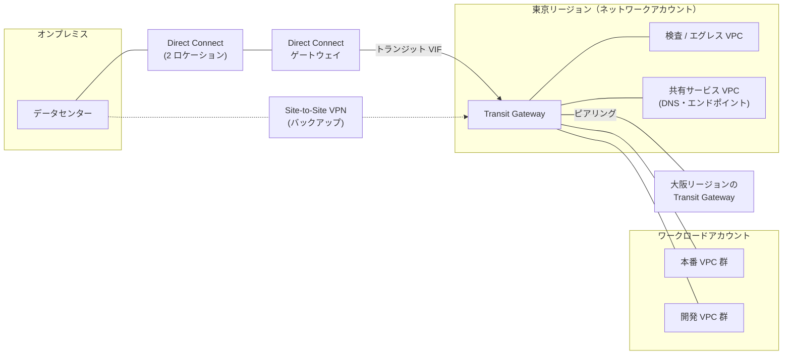
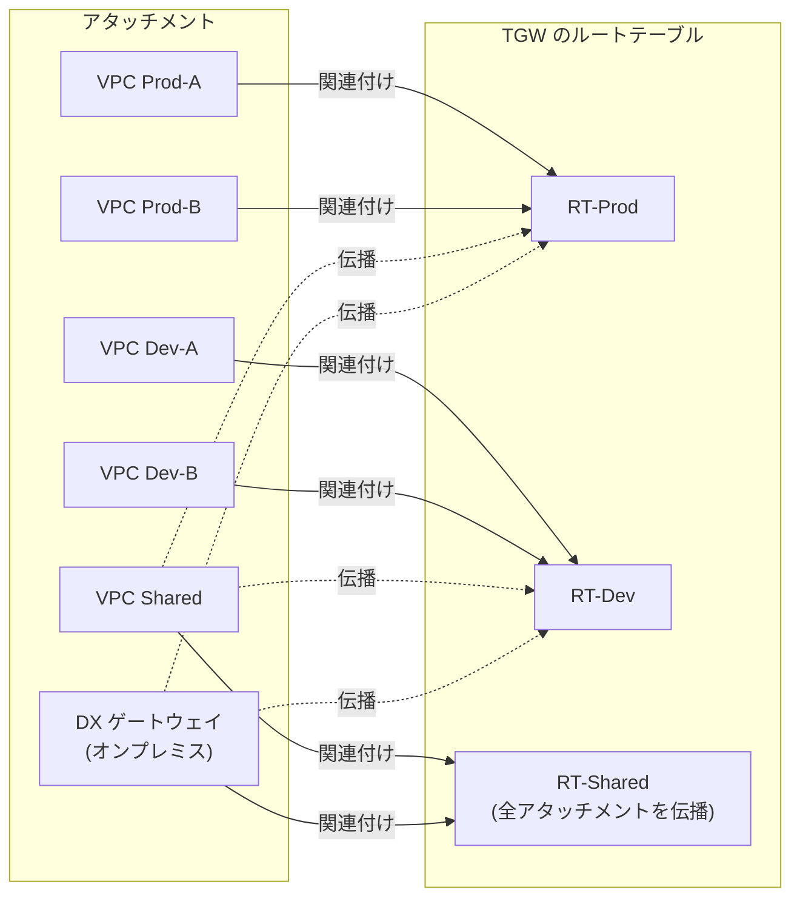
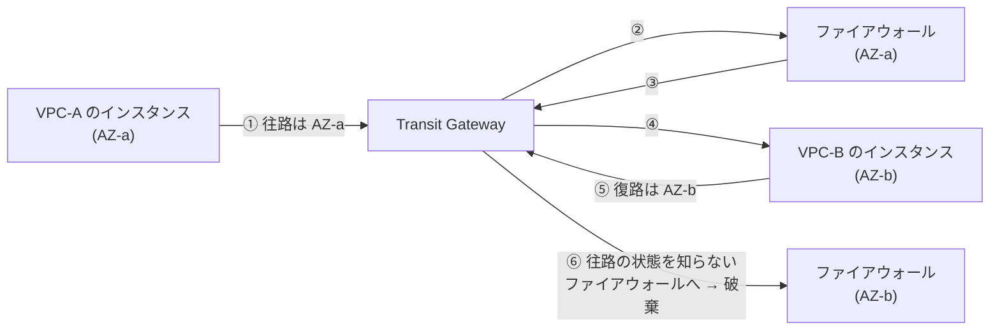

[ホーム](../README.md) > [Phase 3: プロフェッショナル](README.md) > 高度なネットワーク設計

# 高度なネットワーク設計

> **この章のゴール**
> - 数百の VPC とオンプレミスを前提に、IP アドレス計画と VPC 間の接続方式（Transit Gateway / Cloud WAN / PrivateLink / VPC Lattice / VPC 共有）を要件に応じて選べる
> - Transit Gateway のルートテーブル（関連付けと伝播）でセグメンテーションを設計できる
> - Direct Connect の回復力モデル・暗号化・BGP による経路制御を説明できる
> - マルチアカウント環境のハイブリッド DNS を設計できる
> - 集中型のインスペクション・エグレス・イングレスを、コストと運用のトレードオフで判断できる
>
> **対応試験**: SAP-C03（D1 クラウドネイティブアーキテクチャの設計と実装、D4 回復力、移行、事業継続 ほか。ドメイン名は仮訳）
> **目安時間**: 読む 8時間 / 確認問題 1時間 / ハンズオン 3時間（Lab 11）

## この章の全体像

SAP のネットワーク問題は、「VPC を作る」話ではありません。**数十〜数百のアカウントにまたがる VPC、複数のリージョン、オンプレミスのデータセンターを、安全に・止まらずに・管理可能なコストでつなぐ** 話です。
VPC の基本（サブネット、ルートテーブル、NAT ゲートウェイ、セキュリティグループ、VPC エンドポイント、ピアリング）は [VPC とネットワーク設計](../02-associate/02-vpc.md) を、Direct Connect と VPN の基本は [移行とハイブリッド接続](../02-associate/16-migration-hybrid.md) を前提にします。



| 設計の問い | 主な選択肢 | 節 |
|---|---|---|
| IP アドレスをどう割り当て、重複をどう避けるか | VPC IPAM、プライベート NAT ゲートウェイ、PrivateLink | 1 |
| VPC 同士をどうつなぐか | ピアリング / Transit Gateway / Cloud WAN / PrivateLink / VPC Lattice / VPC 共有 | 2〜4、8、9 |
| オンプレミスとどうつなぐか | Direct Connect、Site-to-Site VPN | 5、6 |
| 名前解決をどう統合するか | Route 53 Resolver エンドポイント、Route 53 Profiles | 7 |
| 通信をどこで検査し、どこから出入りさせるか | Network Firewall、Gateway Load Balancer、集中型エグレス / イングレス | 10 |
| IPv4 アドレスの枯渇とコストにどう備えるか | IPv6 デュアルスタック、NAT64 / DNS64 | 11 |
| どう監視し、トラブルシュートするか | フローログ、Reachability Analyzer、Network Access Analyzer ほか | 12 |

## 1. 大規模な IP アドレス計画と VPC IPAM

### 1.1 なぜ IP アドレス計画が問われるのか

ルーティングは「宛先アドレスが一意であること」が前提です。通信させたい 2 つのネットワークの CIDR が重複すると、VPC ピアリングでも Transit Gateway でも Direct Connect でも **直接ルーティングできません**。後からアドレスを付け直す（re-IP）のは、移行と同じくらい大きな作業になります。

アドレス計画は、スケールにも効きます。

- **経路の集約**: 地域・環境ごとに連続したブロックを割り当てると、`10.0.0.0/12` のような 1 本のルートにまとめられます。VPC のルートテーブルのエントリ数（デフォルト 50）や、オンプレミスから Direct Connect で AWS に広告できるプレフィックス数（プライベート VIF・トランジット VIF で BGP セッションあたり 100）には上限があるため、集約できる設計が重要です（2026年9月時点。[Direct Connect のクォータ](https://docs.aws.amazon.com/directconnect/latest/UserGuide/limits.html)）。
- **成長への備え**: 新しいリージョン、新しい事業部、M&A（合併・買収）で加わるネットワークの分を空けておきます。

### 1.2 アドレス計画の原則

1. オンプレミス、全リージョン、全アカウントで **重複させない**（少なくとも、通信する可能性がある範囲では）。
2. **階層的に** 割り当てる（組織全体 → リージョン → 環境 → VPC）。
3. VPC は大きすぎず小さすぎず（例: /20〜/22）。VPC の CIDR は /16〜/28 で、後からセカンダリ CIDR を追加できます。
4. ルーティング不要の大量アドレス（例: Amazon EKS のポッド）には、RFC 6598 の `100.64.0.0/10` をセカンダリ CIDR として使い、ほかの VPC とは通信させない設計もあります。

**割り当て例**

| CIDR | 用途 | 備考 |
|---|---|---|
| `172.16.0.0/12` | オンプレミス（既存） | AWS 側では使わない |
| `10.0.0.0/8` | AWS 全体 | |
| `10.0.0.0/12` | 東京リージョン | 1 本のルートに集約できる |
| `10.0.0.0/13` | 東京・本番 | /20 の VPC を 128 個まで |
| `10.8.0.0/13` | 東京・開発 | 同上 |
| `10.16.0.0/12` | 大阪リージョン | DR 用。東京と同じ構造で割り当てる |
| `100.64.0.0/10` | ルーティングしない領域 | 複数の VPC で重複してよい |

### 1.3 Amazon VPC IP Address Manager（IPAM）

表計算ソフトでの IP アドレス管理は、数百の VPC になると破綻します。VPC IPAM は、組織全体の IP アドレスの **割り当て・追跡・監視** を行うサービスです。

| 要素 | 内容 |
|---|---|
| Organizations との統合 | 委任管理者アカウント（通常はネットワークアカウント）から組織全体を管理 |
| スコープ | プライベート（社内用）とパブリックの 2 つ |
| プール | CIDR の入れ物。「最上位 → リージョン（ロケール）→ 環境」のように階層化する |
| 割り当てルール | 許可するネットマスク長（最小・最大・デフォルト）、必須のタグなど |
| 共有 | AWS RAM でプールを OU やアカウントに共有し、各チームがそこから CIDR を取得 |
| 監視 | 各リソースの CIDR が準拠しているか、重複していないかを継続的に評価。プールの使用率を CloudWatch で監視 |
| IP アドレスの履歴 | 「ある時刻にこの IP アドレスを使っていたリソース」を検索できる（インシデント調査に有効） |

VPC は CIDR を直接指定する代わりに、IPAM プールから払い出してもらえます。CloudFormation では次のように書きます。

```yaml
AppVpc:
  Type: AWS::EC2::VPC
  Properties:
    Ipv4IpamPoolId: !Ref TokyoProdPoolId   # 共有された IPAM プール
    Ipv4NetmaskLength: 20                  # /20 を自動で払い出す
```

IPAM には無料ティアとアドバンストティアがあり、Organizations と統合した組織全体の管理や監視はアドバンストティア（有料）で使います。

> [!TIP]
> **試験のポイント**: 「組織全体で CIDR の重複を防ぎたい」「アカウントが VPC を作るときに、承認済みの範囲から自動で CIDR を割り当てたい」「どの IP アドレスが過去にどのリソースで使われたか調べたい」とあれば **VPC IPAM** です。

### 1.4 CIDR の重複への対処

M&A などで重複がすでに起きている場合の選択肢です。

| 手法 | 仕組み | 向いているケース | 注意点 |
|---|---|---|---|
| アドレスの付け直し（re-IP） | 一方のネットワークのアドレスを変更する | 長期的な根本解決 | 作業と停止が大きい |
| プライベート NAT ゲートウェイ | 重複する VPC に、重複しない小さなセカンダリ CIDR を追加し、そこに置いたプライベート NAT ゲートウェイで送信元アドレスを変換して Transit Gateway へ送る | 重複する VPC から外への通信 | 逆方向の通信には、重複しない側に ALB / NLB を置くなどの工夫が必要 |
| AWS PrivateLink | サービス単位で、NLB の背後のサービスをインターフェイスエンドポイントとして公開する（8 節） | 特定のサービスだけ使えればよい、一方向 | 双方向の通信には向かない |
| Amazon VPC Lattice | VPC を CIDR と無関係にサービスネットワークへ関連付ける（9 節） | HTTP / HTTPS / gRPC / TCP のサービス間通信 | 対応するプロトコルとターゲットを確認 |
| IPv6 | グローバルに一意なアドレスを使う（11 節） | 新規の設計 | 既存の IPv4 のみのシステムには別の対処が必要 |

> [!WARNING]
> **ひっかけ注意**: VPC ピアリングは **CIDR が重複（一部でも）する VPC 間では作成できません**。Transit Gateway も、同じ CIDR の VPC 同士を直接ルーティングすることはできません。「CIDR が重複している」と書かれていたら、まずピアリングと単純な Transit Gateway 接続を選択肢から外してください。

## 2. VPC 間接続の選択肢

### 2.1 比較表

| 方式 | 接続の単位 | 推移的ルーティング | CIDR の重複 | スケールの目安 | 料金モデル（東京、2026年9月時点） | 主な用途 |
|---|---|---|---|---|---|---|
| VPC ピアリング | VPC 対 VPC（L3） | ✗ | ✗ | VPC あたり最大 125。全体をメッシュにすると n(n−1)/2 本 | 時間料金なし。データ転送料金のみ（同じ AZ 内は無料、AZ 間・リージョン間は課金） | 少数の VPC 間、大量データ・低レイテンシー |
| Transit Gateway | リージョン単位のハブ（L3） | ✓ | ✗ | 1 つあたり 5,000 アタッチメント | アタッチメントごとに 0.07 USD/時 + データ処理 0.02 USD/GB | 数十〜数千の VPC とオンプレミスのハブ&スポーク |
| AWS Cloud WAN | グローバルなコアネットワーク（L3） | ✓（セグメント内） | ✗ | 多数のリージョンを 1 つのポリシーで管理 | コアネットワークエッジの時間料金 + アタッチメントの時間料金 + データ処理料金 | マルチリージョンの WAN、グローバルなセグメンテーション |
| AWS PrivateLink | サービス単位（一方向） | ―（ルーティングしない） | ✓ | 1 つのサービスを多数の消費者へ | エンドポイントごと・AZ ごとに 0.014 USD/時 + 0.01 USD/GB。提供側は NLB の料金 | SaaS の提供、共有サービスの公開、AWS サービスへのプライベートアクセス |
| Amazon VPC Lattice | サービス / リソース単位（L7 と TCP） | ―（サービスネットワーク経由） | ✓ | 多数のサービスとアカウント | サービスごとの時間料金 + データ処理 + リクエスト数 | マイクロサービス間の通信、IAM によるリクエスト単位の認可 |
| VPC 共有 | サブネット単位（1 つの VPC を複数アカウントで使う） | ―（同じ VPC 内） | ―（VPC は 1 つ） | その VPC のクォータの範囲 | 共有自体は無料。VPC とアタッチメントの数を減らせる | ネットワークは中央で管理し、各チームはリソースだけを運用 |

選び方の目安は次のとおりです。

- 「推移的」「数百の VPC」「オンプレミスとも接続」 → **Transit Gateway**
- 「複数のリージョン」「ポリシーで一元管理」「グローバルなセグメント」 → **Cloud WAN**
- 「CIDR が重複」「一方向」「SaaS」「特定のサービスだけ」 → **PrivateLink**
- 「サービス間の通信」「IAM で認可」「サイドカー不要」「App Mesh の代替」 → **VPC Lattice**
- 「VPC の数を減らしたい」「ネットワークの管理を中央に集めたい」 → **VPC 共有**
- 「2 つの VPC 間で大量のデータを、最小のコストで」 → **VPC ピアリング**

> [!TIP]
> **試験のポイント**: 方式は組み合わせて使えます。例: 全体は Transit Gateway のハブ&スポークにし、データ量が非常に多い 2 つの VPC だけはピアリングで直結します。VPC のルートテーブルでは、より長いプレフィックス（ピアリング先の VPC の CIDR）が `10.0.0.0/8 → Transit Gateway` より優先されるため、両方を共存させられます。

### 2.2 VPC 共有

VPC 共有では、**所有者アカウント**（通常はネットワークアカウント）が VPC とサブネットを作り、AWS RAM で組織内の **参加者アカウント** にサブネットを共有します。

| 担当 | できること |
|---|---|
| 所有者アカウント | VPC、サブネット、ルートテーブル、ネットワーク ACL、インターネットゲートウェイ、NAT ゲートウェイ、Transit Gateway アタッチメントなどの管理 |
| 参加者アカウント | 共有サブネットへの EC2、RDS、Lambda、ELB などの作成と管理、自分のセキュリティグループの管理。ネットワーク設定は変更できない |

- **利点**: VPC の数が減るため、IP アドレスの断片化と Transit Gateway のアタッチメント数（＝時間料金）を減らせます。ネットワーク管理とアプリ運用の職務分離も自然に実現できます。同じ VPC 内なので、ほかのアカウントのセキュリティグループも参照できます。
- **注意点**: ネットワーク上の分離はアカウント単位の VPC より弱くなります（同じ VPC 内）。VPC のクォータ（ネットワークアドレス使用量など）は参加者全員で共有します。デフォルト VPC のサブネットは共有できません。

> [!TIP]
> **試験のポイント**: 「各事業部がアカウントを持つが、ネットワークは中央チームが一元管理したい」「Transit Gateway のアタッチメント数とコストを減らしたい」とあれば、**環境ごと（本番 / 開発）に VPC 共有** し、それを Transit Gateway につなぐ構成が有力です。

## 3. Transit Gateway の詳細

Transit Gateway（TGW）は、リージョン単位の **マネージドな仮想ルーター** です。ここでは SAP で問われる設計上のポイントに絞ります。構築手順は [Lab 11](../04-labs/lab11-transit-gateway.md) で体験します。

### 3.1 アタッチメントの種類

| アタッチメント | 用途 | 設計のポイント |
|---|---|---|
| VPC | VPC を接続 | AZ ごとに 1 つのサブネットを指定する。TGW 用の小さな専用サブネット（/28 など）を各 AZ に作るのが推奨。サブネットを指定していない AZ のリソースは TGW に到達できない |
| VPN | Site-to-Site VPN | BGP による動的ルーティング、ECMP、高速 VPN（6 節） |
| Direct Connect ゲートウェイ | トランジット VIF 経由でオンプレミスと接続 | オンプレミスへ広告するプレフィックスは「許可されたプレフィックス」で指定（5 節） |
| ピアリング | 別の TGW（同じリージョン / 別のリージョン / 別のアカウント） | 静的ルートのみ（3.5 節） |
| Connect | SD-WAN アプライアンスと GRE + BGP で接続 | VPC アタッチメントまたは Direct Connect ゲートウェイアタッチメントをトランスポートに使う（3.6 節） |
| ネットワーク機能（Network Firewall） | TGW に直接アタッチした AWS Network Firewall | 検査用 VPC を自分で管理せずに済む（10 節） |

そのほかの特徴として、MTU は VPC・Direct Connect・Connect・ピアリング間で 8,500 バイト、VPN は 1,500 バイトです。1 つの TGW に最大 5,000 のアタッチメントを接続できます（2026年9月時点。[Transit Gateway のクォータ](https://docs.aws.amazon.com/vpc/latest/tgw/transit-gateway-quotas.html)）。AWS のサービスで唯一、VPC 内の **IP マルチキャスト** にも対応しています。

### 3.2 ルートテーブル: 関連付けと伝播

TGW のルーティングを理解する鍵は、次の 2 つの操作の違いです。

| 操作 | 意味 | 数の制約 |
|---|---|---|
| **関連付け（Association）** | そのアタッチメント **から入ってきた** トラフィックが、どのルートテーブルで宛先を調べるか | 1 つのアタッチメントは **1 つのルートテーブルにだけ** 関連付けられる |
| **伝播（Propagation）** | そのアタッチメントの **宛先ルート**（VPC の CIDR、VPN / DX の BGP ルート）を、どのルートテーブルに自動登録するか | 1 つのアタッチメントを **複数のルートテーブルに** 伝播できる |

- 静的ルートも追加できます（例: `0.0.0.0/0 → 検査 VPC のアタッチメント`）。特定の宛先を明示的に捨てる **ブラックホールルート** もあります。
- 同じ宛先で複数のルートがある場合は、最長一致 → 静的ルートが伝播ルートより優先 → 伝播ルートの中では Direct Connect ゲートウェイ経由が VPN 経由より優先、の順で選ばれます。
- TGW のルートは **VPC のルートテーブルには自動で入りません**。各 VPC のルートテーブルに `10.0.0.0/8 → TGW` などを追加する必要があります。
- セグメンテーションを行うときは、TGW の「デフォルトルートテーブルへの関連付け」と「デフォルトルートテーブルへの伝播」を無効にし、明示的に設計します。

### 3.3 セグメンテーションの例（本番 / 開発 / 共有）

要件: 本番どうし・開発どうしは通信可、**本番と開発の間は通信禁止**、共有サービス VPC とオンプレミスはすべての VPC と通信可。

**関連付け**

| アタッチメント | 関連付けるルートテーブル |
|---|---|
| VPC Prod-A、VPC Prod-B | RT-Prod |
| VPC Dev-A、VPC Dev-B | RT-Dev |
| VPC Shared、DX ゲートウェイ（オンプレミス） | RT-Shared |

**伝播**

| ルートテーブル | 伝播元のアタッチメント | 結果として到達できる宛先 |
|---|---|---|
| RT-Prod | Prod-A、Prod-B、Shared、DX ゲートウェイ | 本番 VPC、共有 VPC、オンプレミス |
| RT-Dev | Dev-A、Dev-B、Shared、DX ゲートウェイ | 開発 VPC、共有 VPC、オンプレミス |
| RT-Shared | すべてのアタッチメント | すべての VPC、オンプレミス |



本番 → 開発のパケットは RT-Prod で宛先を調べますが、RT-Prod には開発 VPC のルートがないため破棄されます。開発 → 本番も同様です。**ルートを「伝播しない」ことで分離する** のがセグメンテーションの基本です。

> [!WARNING]
> **ひっかけ注意**: 通信は往路と復路の両方で成立する必要があります。「オンプレミスから本番には届くが、開発には届かないようにしたい」といった要件では、オンプレミスのアタッチメントを関連付けるルートテーブル（上の例では RT-Shared）に何を伝播するかまで確認してください。要件によっては、オンプレミス専用のルートテーブルが必要になります。

### 3.4 アプライアンスモード（対称ルーティング）

TGW は通常、トラフィックを **送信元と同じ AZ** の中で処理しようとします（AZ アフィニティ）。これはレイテンシーと AZ 間のデータ転送を減らすための動作ですが、検査 VPC にステートフルなファイアウォールを置くと問題になります。



往路は AZ-a のファイアウォール、復路は AZ-b のファイアウォールを通るため、AZ-b のファイアウォールは「知らないセッションの応答」として破棄します（非対称ルーティング）。
**検査 VPC の TGW アタッチメントでアプライアンスモードを有効にする** と、TGW はフローのハッシュに基づいて検査 VPC 内の 1 つのネットワークインターフェイス（AZ）を選び、そのフローの往路・復路を同じ AZ のアプライアンスに送ります。

> [!TIP]
> **試験のポイント**: 「検査 VPC 経由の通信が断続的に失敗する」「AZ をまたぐ通信だけタイムアウトする」「ステートフルなアプライアンスで非対称ルーティング」とあれば、**アプライアンスが置かれた VPC のアタッチメントでアプライアンスモードを有効化** が答えです。スポーク VPC 側で有効にしても解決しません。

### 3.5 Transit Gateway ピアリング

- 同じリージョン内、別のリージョン、別のアカウントの TGW 同士を接続できます。リージョン間のトラフィックは AWS のバックボーン上を暗号化されて流れます。
- ピアリングアタッチメントには **ルートが伝播されません**。相手側の CIDR への **静的ルート** を各 TGW のルートテーブルに書く必要があります。
- リージョンが増えるほど静的ルートとピアリングの管理が増えます。多数のリージョンで動的にルートを交換したい場合は Cloud WAN（4 節）を検討します。

### 3.6 Transit Gateway Connect

SD-WAN のアプライアンス（Marketplace の仮想アプライアンスなど）を VPC 内に置き、TGW と **GRE トンネル + BGP** で接続する機能です。

- トランスポートには VPC アタッチメント、または Direct Connect ゲートウェイアタッチメントを使います。
- Connect ピア（GRE トンネル）あたり最大 5 Gbps、1 つの Connect アタッチメントに最大 4 ピアで、ECMP により合計最大 20 Gbps です（2026年9月時点）。
- IPsec VPN を多数張る方式に比べて、帯域と BGP による動的ルーティングの面で有利です。

> [!TIP]
> **試験のポイント**: 「既存の SD-WAN を AWS に拡張したい」「SD-WAN アプライアンスと TGW の間で BGP による動的ルーティング」「VPN のトンネル帯域の制約を避けたい」とあれば **Transit Gateway Connect**（グローバルなら Cloud WAN の Connect アタッチメント）です。

### 3.7 料金と組織での運用

東京リージョンの料金は、アタッチメントごとに **0.07 USD/時**、TGW が処理するデータ **0.02 USD/GB** です（2026年9月時点。[Transit Gateway の料金](https://aws.amazon.com/transit-gateway/pricing/)）。

**試算例**: VPC 50 個を接続し、月に 20 TB のデータを TGW 経由で送る場合

- アタッチメント: 50 × 0.07 USD × 730 時間 = 2,555 USD/月
- データ処理: 20 × 1,024 GB × 0.02 USD = 約 410 USD/月
- 合計: 約 2,965 USD/月

同じ 50 個の VPC をピアリングでメッシュにすると 1,225 本の接続が必要ですが、時間料金とデータ処理料金はかかりません。つまり **TGW は「運用の単純さ」をお金で買う構成** です。データ量が非常に多い VPC の組み合わせだけピアリングにする、VPC 共有でアタッチメント数を減らす、といった工夫で費用を抑えます。
2025年11月には、TGW のデータ処理料金をどのアカウントに計上するかをメータリングポリシーで設定できる Flexible Cost Allocation も追加されました（部門別のチャージバックに使えます）。

組織での運用のポイントは次のとおりです。

- **所有と共有**: TGW はネットワークアカウントで作成し、AWS RAM で組織（または OU）に共有します。各アカウントは自分の VPC のアタッチメントを作成します。
- **承認と関連付けの自動化**: 「共有アタッチメントの自動承諾」を有効にし、アタッチメント作成イベントを EventBridge で受けて、タグ（例: `segment=prod`）に応じたルートテーブルへの関連付けと伝播を Lambda で行うのが定番です（Cloud WAN ではこれをポリシーで宣言できます）。
- **可視化**: TGW フローログ、AWS Network Manager（トポロジーとルートの分析）を使います（12 節）。
