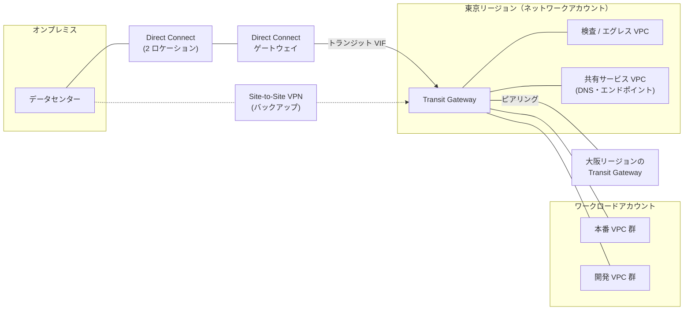
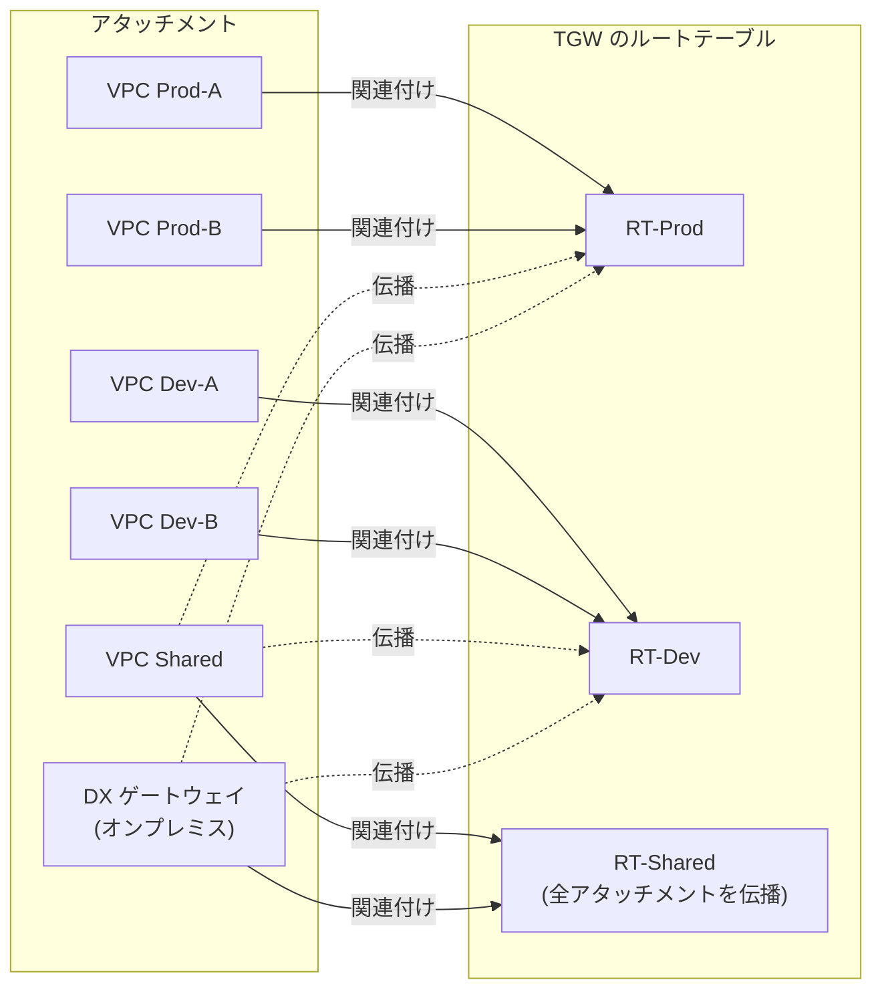
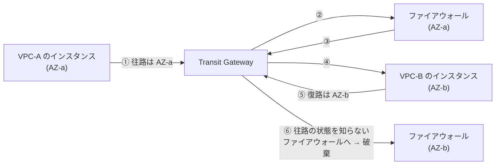
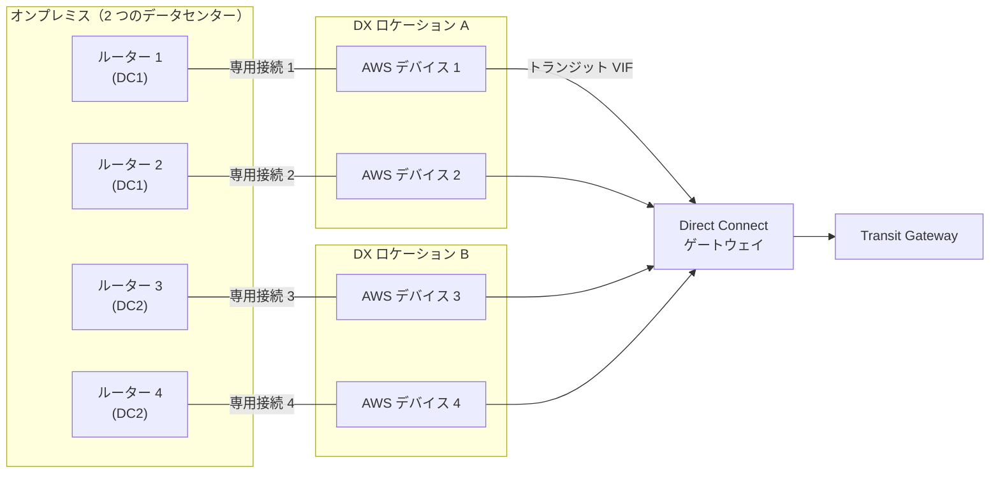
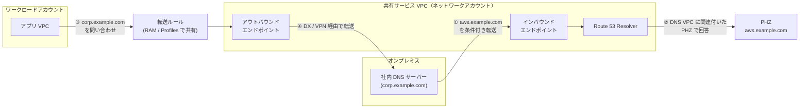
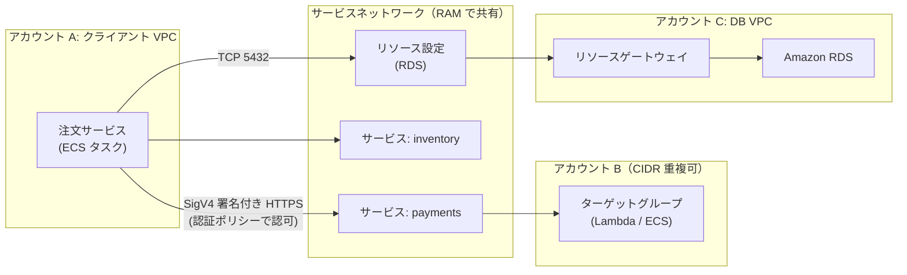
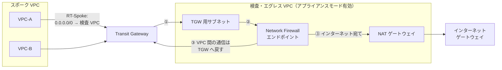

[ホーム](../README.md) > [Phase 3: プロフェッショナル](README.md) > 高度なネットワーク設計

# 高度なネットワーク設計

> **この章のゴール**
> - 数百の VPC とオンプレミスを前提に、IP アドレス計画と VPC 間の接続方式（Transit Gateway / Cloud WAN / PrivateLink / VPC Lattice / VPC 共有）を要件に応じて選べる
> - Transit Gateway のルートテーブル（関連付けと伝播）でセグメンテーションを設計できる
> - Direct Connect の回復力モデル・暗号化・BGP による経路制御を説明できる
> - マルチアカウント環境のハイブリッド DNS を設計できる
> - 集中型のインスペクション・エグレス・イングレスを、コストと運用のトレードオフで判断できる
>
> **対応試験**: SAP-C03（D1 クラウドネイティブアーキテクチャの設計と実装、D4 回復力、移行、事業継続 ほか。ドメイン名は仮訳）
> **目安時間**: 読む 8時間 / 確認問題 1時間 / ハンズオン 3時間（Lab 11）

## この章の全体像

SAP のネットワーク問題は、「VPC を作る」話ではありません。**数十〜数百のアカウントにまたがる VPC、複数のリージョン、オンプレミスのデータセンターを、安全に・止まらずに・管理可能なコストでつなぐ** 話です。
VPC の基本（サブネット、ルートテーブル、NAT ゲートウェイ、セキュリティグループ、VPC エンドポイント、ピアリング）は [VPC とネットワーク設計](../02-associate/02-vpc.md) を、Direct Connect と VPN の基本は [移行とハイブリッド接続](../02-associate/16-migration-hybrid.md) を前提にします。



| 設計の問い | 主な選択肢 | 節 |
|---|---|---|
| IP アドレスをどう割り当て、重複をどう避けるか | VPC IPAM、プライベート NAT ゲートウェイ、PrivateLink | 1 |
| VPC 同士をどうつなぐか | ピアリング / Transit Gateway / Cloud WAN / PrivateLink / VPC Lattice / VPC 共有 | 2〜4、8、9 |
| オンプレミスとどうつなぐか | Direct Connect、Site-to-Site VPN | 5、6 |
| 名前解決をどう統合するか | Route 53 Resolver エンドポイント、Route 53 Profiles | 7 |
| 通信をどこで検査し、どこから出入りさせるか | Network Firewall、Gateway Load Balancer、集中型エグレス / イングレス | 10 |
| IPv4 アドレスの枯渇とコストにどう備えるか | IPv6 デュアルスタック、NAT64 / DNS64 | 11 |
| どう監視し、トラブルシュートするか | フローログ、Reachability Analyzer、Network Access Analyzer ほか | 12 |

## 1. 大規模な IP アドレス計画と VPC IPAM

### 1.1 なぜ IP アドレス計画が問われるのか

ルーティングは「宛先アドレスが一意であること」が前提です。通信させたい 2 つのネットワークの CIDR が重複すると、VPC ピアリングでも Transit Gateway でも Direct Connect でも **直接ルーティングできません**。後からアドレスを付け直す（re-IP）のは、移行と同じくらい大きな作業になります。

アドレス計画は、スケールにも効きます。

- **経路の集約**: 地域・環境ごとに連続したブロックを割り当てると、`10.0.0.0/12` のような 1 本のルートにまとめられます。VPC のルートテーブルのエントリ数（デフォルト 50）や、オンプレミスから Direct Connect で AWS に広告できるプレフィックス数（プライベート VIF・トランジット VIF で BGP セッションあたり 100）には上限があるため、集約できる設計が重要です（2026年9月時点。[Direct Connect のクォータ](https://docs.aws.amazon.com/directconnect/latest/UserGuide/limits.html)）。
- **成長への備え**: 新しいリージョン、新しい事業部、M&A（合併・買収）で加わるネットワークの分を空けておきます。

### 1.2 アドレス計画の原則

1. オンプレミス、全リージョン、全アカウントで **重複させない**（少なくとも、通信する可能性がある範囲では）。
2. **階層的に** 割り当てる（組織全体 → リージョン → 環境 → VPC）。
3. VPC は大きすぎず小さすぎず（例: /20〜/22）。VPC の CIDR は /16〜/28 で、後からセカンダリ CIDR を追加できます。
4. ルーティング不要の大量アドレス（例: Amazon EKS のポッド）には、RFC 6598 の `100.64.0.0/10` をセカンダリ CIDR として使い、ほかの VPC とは通信させない設計もあります。

**割り当て例**

| CIDR | 用途 | 備考 |
|---|---|---|
| `172.16.0.0/12` | オンプレミス（既存） | AWS 側では使わない |
| `10.0.0.0/8` | AWS 全体 | |
| `10.0.0.0/12` | 東京リージョン | 1 本のルートに集約できる |
| `10.0.0.0/13` | 東京・本番 | /20 の VPC を 128 個まで |
| `10.8.0.0/13` | 東京・開発 | 同上 |
| `10.16.0.0/12` | 大阪リージョン | DR 用。東京と同じ構造で割り当てる |
| `100.64.0.0/10` | ルーティングしない領域 | 複数の VPC で重複してよい |

### 1.3 Amazon VPC IP Address Manager（IPAM）

表計算ソフトでの IP アドレス管理は、数百の VPC になると破綻します。VPC IPAM は、組織全体の IP アドレスの **割り当て・追跡・監視** を行うサービスです。

| 要素 | 内容 |
|---|---|
| Organizations との統合 | 委任管理者アカウント（通常はネットワークアカウント）から組織全体を管理 |
| スコープ | プライベート（社内用）とパブリックの 2 つ |
| プール | CIDR の入れ物。「最上位 → リージョン（ロケール）→ 環境」のように階層化する |
| 割り当てルール | 許可するネットマスク長（最小・最大・デフォルト）、必須のタグなど |
| 共有 | AWS RAM でプールを OU やアカウントに共有し、各チームがそこから CIDR を取得 |
| 監視 | 各リソースの CIDR が準拠しているか、重複していないかを継続的に評価。プールの使用率を CloudWatch で監視 |
| IP アドレスの履歴 | 「ある時刻にこの IP アドレスを使っていたリソース」を検索できる（インシデント調査に有効） |

VPC は CIDR を直接指定する代わりに、IPAM プールから払い出してもらえます。CloudFormation では次のように書きます。

```yaml
AppVpc:
  Type: AWS::EC2::VPC
  Properties:
    Ipv4IpamPoolId: !Ref TokyoProdPoolId   # 共有された IPAM プール
    Ipv4NetmaskLength: 20                  # /20 を自動で払い出す
```

IPAM には無料ティアとアドバンストティアがあり、Organizations と統合した組織全体の管理や監視はアドバンストティア（有料）で使います。

> [!TIP]
> **試験のポイント**: 「組織全体で CIDR の重複を防ぎたい」「アカウントが VPC を作るときに、承認済みの範囲から自動で CIDR を割り当てたい」「どの IP アドレスが過去にどのリソースで使われたか調べたい」とあれば **VPC IPAM** です。

### 1.4 CIDR の重複への対処

M&A などで重複がすでに起きている場合の選択肢です。

| 手法 | 仕組み | 向いているケース | 注意点 |
|---|---|---|---|
| アドレスの付け直し（re-IP） | 一方のネットワークのアドレスを変更する | 長期的な根本解決 | 作業と停止が大きい |
| プライベート NAT ゲートウェイ | 重複する VPC に、重複しない小さなセカンダリ CIDR を追加し、そこに置いたプライベート NAT ゲートウェイで送信元アドレスを変換して Transit Gateway へ送る | 重複する VPC から外への通信 | 逆方向の通信には、重複しない側に ALB / NLB を置くなどの工夫が必要 |
| AWS PrivateLink | サービス単位で、NLB の背後のサービスをインターフェイスエンドポイントとして公開する（8 節） | 特定のサービスだけ使えればよい、一方向 | 双方向の通信には向かない |
| Amazon VPC Lattice | VPC を CIDR と無関係にサービスネットワークへ関連付ける（9 節） | HTTP / HTTPS / gRPC / TCP のサービス間通信 | 対応するプロトコルとターゲットを確認 |
| IPv6 | グローバルに一意なアドレスを使う（11 節） | 新規の設計 | 既存の IPv4 のみのシステムには別の対処が必要 |

> [!WARNING]
> **ひっかけ注意**: VPC ピアリングは **CIDR が重複（一部でも）する VPC 間では作成できません**。Transit Gateway も、同じ CIDR の VPC 同士を直接ルーティングすることはできません。「CIDR が重複している」と書かれていたら、まずピアリングと単純な Transit Gateway 接続を選択肢から外してください。

## 2. VPC 間接続の選択肢

### 2.1 比較表

| 方式 | 接続の単位 | 推移的ルーティング | CIDR の重複 | スケールの目安 | 料金モデル（東京、2026年9月時点） | 主な用途 |
|---|---|---|---|---|---|---|
| VPC ピアリング | VPC 対 VPC（L3） | ✗ | ✗ | VPC あたり最大 125。全体をメッシュにすると n(n−1)/2 本 | 時間料金なし。データ転送料金のみ（同じ AZ 内は無料、AZ 間・リージョン間は課金） | 少数の VPC 間、大量データ・低レイテンシー |
| Transit Gateway | リージョン単位のハブ（L3） | ✓ | ✗ | 1 つあたり 5,000 アタッチメント | アタッチメントごとに 0.07 USD/時 + データ処理 0.02 USD/GB | 数十〜数千の VPC とオンプレミスのハブ&スポーク |
| AWS Cloud WAN | グローバルなコアネットワーク（L3） | ✓（セグメント内） | ✗ | 多数のリージョンを 1 つのポリシーで管理 | コアネットワークエッジの時間料金 + アタッチメントの時間料金 + データ処理料金 | マルチリージョンの WAN、グローバルなセグメンテーション |
| AWS PrivateLink | サービス単位（一方向） | ―（ルーティングしない） | ✓ | 1 つのサービスを多数の消費者へ | エンドポイントごと・AZ ごとに 0.014 USD/時 + 0.01 USD/GB。提供側は NLB の料金 | SaaS の提供、共有サービスの公開、AWS サービスへのプライベートアクセス |
| Amazon VPC Lattice | サービス / リソース単位（L7 と TCP） | ―（サービスネットワーク経由） | ✓ | 多数のサービスとアカウント | サービスごとの時間料金 + データ処理 + リクエスト数 | マイクロサービス間の通信、IAM によるリクエスト単位の認可 |
| VPC 共有 | サブネット単位（1 つの VPC を複数アカウントで使う） | ―（同じ VPC 内） | ―（VPC は 1 つ） | その VPC のクォータの範囲 | 共有自体は無料。VPC とアタッチメントの数を減らせる | ネットワークは中央で管理し、各チームはリソースだけを運用 |

選び方の目安は次のとおりです。

- 「推移的」「数百の VPC」「オンプレミスとも接続」 → **Transit Gateway**
- 「複数のリージョン」「ポリシーで一元管理」「グローバルなセグメント」 → **Cloud WAN**
- 「CIDR が重複」「一方向」「SaaS」「特定のサービスだけ」 → **PrivateLink**
- 「サービス間の通信」「IAM で認可」「サイドカー不要」「App Mesh の代替」 → **VPC Lattice**
- 「VPC の数を減らしたい」「ネットワークの管理を中央に集めたい」 → **VPC 共有**
- 「2 つの VPC 間で大量のデータを、最小のコストで」 → **VPC ピアリング**

> [!TIP]
> **試験のポイント**: 方式は組み合わせて使えます。例: 全体は Transit Gateway のハブ&スポークにし、データ量が非常に多い 2 つの VPC だけはピアリングで直結します。VPC のルートテーブルでは、より長いプレフィックス（ピアリング先の VPC の CIDR）が `10.0.0.0/8 → Transit Gateway` より優先されるため、両方を共存させられます。

### 2.2 VPC 共有

VPC 共有では、**所有者アカウント**（通常はネットワークアカウント）が VPC とサブネットを作り、AWS RAM で組織内の **参加者アカウント** にサブネットを共有します。

| 担当 | できること |
|---|---|
| 所有者アカウント | VPC、サブネット、ルートテーブル、ネットワーク ACL、インターネットゲートウェイ、NAT ゲートウェイ、Transit Gateway アタッチメントなどの管理 |
| 参加者アカウント | 共有サブネットへの EC2、RDS、Lambda、ELB などの作成と管理、自分のセキュリティグループの管理。ネットワーク設定は変更できない |

- **利点**: VPC の数が減るため、IP アドレスの断片化と Transit Gateway のアタッチメント数（＝時間料金）を減らせます。ネットワーク管理とアプリ運用の職務分離も自然に実現できます。同じ VPC 内なので、ほかのアカウントのセキュリティグループも参照できます。
- **注意点**: ネットワーク上の分離はアカウント単位の VPC より弱くなります（同じ VPC 内）。VPC のクォータ（ネットワークアドレス使用量など）は参加者全員で共有します。デフォルト VPC のサブネットは共有できません。

> [!TIP]
> **試験のポイント**: 「各事業部がアカウントを持つが、ネットワークは中央チームが一元管理したい」「Transit Gateway のアタッチメント数とコストを減らしたい」とあれば、**環境ごと（本番 / 開発）に VPC 共有** し、それを Transit Gateway につなぐ構成が有力です。

## 3. Transit Gateway の詳細

Transit Gateway（TGW）は、リージョン単位の **マネージドな仮想ルーター** です。ここでは SAP で問われる設計上のポイントに絞ります。構築手順は [Lab 11](../04-labs/lab11-transit-gateway.md) で体験します。

### 3.1 アタッチメントの種類

| アタッチメント | 用途 | 設計のポイント |
|---|---|---|
| VPC | VPC を接続 | AZ ごとに 1 つのサブネットを指定する。TGW 用の小さな専用サブネット（/28 など）を各 AZ に作るのが推奨。サブネットを指定していない AZ のリソースは TGW に到達できない |
| VPN | Site-to-Site VPN | BGP による動的ルーティング、ECMP、高速 VPN（6 節） |
| Direct Connect ゲートウェイ | トランジット VIF 経由でオンプレミスと接続 | オンプレミスへ広告するプレフィックスは「許可されたプレフィックス」で指定（5 節） |
| ピアリング | 別の TGW（同じリージョン / 別のリージョン / 別のアカウント） | 静的ルートのみ（3.5 節） |
| Connect | SD-WAN アプライアンスと GRE + BGP で接続 | VPC アタッチメントまたは Direct Connect ゲートウェイアタッチメントをトランスポートに使う（3.6 節） |
| ネットワーク機能（Network Firewall） | TGW に直接アタッチした AWS Network Firewall | 検査用 VPC を自分で管理せずに済む（10 節） |

そのほかの特徴として、MTU は VPC・Direct Connect・Connect・ピアリング間で 8,500 バイト、VPN は 1,500 バイトです。1 つの TGW に最大 5,000 のアタッチメントを接続できます（2026年9月時点。[Transit Gateway のクォータ](https://docs.aws.amazon.com/vpc/latest/tgw/transit-gateway-quotas.html)）。VPC だけでは使えない **IP マルチキャスト** を、TGW のマルチキャストドメインで実現できるのも特徴です。

### 3.2 ルートテーブル: 関連付けと伝播

TGW のルーティングを理解する鍵は、次の 2 つの操作の違いです。

| 操作 | 意味 | 数の制約 |
|---|---|---|
| **関連付け（Association）** | そのアタッチメント **から入ってきた** トラフィックが、どのルートテーブルで宛先を調べるか | 1 つのアタッチメントは **1 つのルートテーブルにだけ** 関連付けられる |
| **伝播（Propagation）** | そのアタッチメントの **宛先ルート**（VPC の CIDR、VPN / DX の BGP ルート）を、どのルートテーブルに自動登録するか | 1 つのアタッチメントを **複数のルートテーブルに** 伝播できる |

- 静的ルートも追加できます（例: `0.0.0.0/0 → 検査 VPC のアタッチメント`）。特定の宛先を明示的に捨てる **ブラックホールルート** もあります。
- 同じ宛先で複数のルートがある場合は、最長一致 → 静的ルートが伝播ルートより優先 → 伝播ルートの中では Direct Connect ゲートウェイ経由が VPN 経由より優先、の順で選ばれます。
- TGW のルートは **VPC のルートテーブルには自動で入りません**。各 VPC のルートテーブルに `10.0.0.0/8 → TGW` などを追加する必要があります。
- セグメンテーションを行うときは、TGW の「デフォルトルートテーブルへの関連付け」と「デフォルトルートテーブルへの伝播」を無効にし、明示的に設計します。

### 3.3 セグメンテーションの例（本番 / 開発 / 共有）

要件: 本番どうし・開発どうしは通信可、**本番と開発の間は通信禁止**、共有サービス VPC とオンプレミスはすべての VPC と通信可。

**関連付け**

| アタッチメント | 関連付けるルートテーブル |
|---|---|
| VPC Prod-A、VPC Prod-B | RT-Prod |
| VPC Dev-A、VPC Dev-B | RT-Dev |
| VPC Shared、DX ゲートウェイ（オンプレミス） | RT-Shared |

**伝播**

| ルートテーブル | 伝播元のアタッチメント | 結果として到達できる宛先 |
|---|---|---|
| RT-Prod | Prod-A、Prod-B、Shared、DX ゲートウェイ | 本番 VPC、共有 VPC、オンプレミス |
| RT-Dev | Dev-A、Dev-B、Shared、DX ゲートウェイ | 開発 VPC、共有 VPC、オンプレミス |
| RT-Shared | すべてのアタッチメント | すべての VPC、オンプレミス |



本番 → 開発のパケットは RT-Prod で宛先を調べますが、RT-Prod には開発 VPC のルートがないため破棄されます。開発 → 本番も同様です。**ルートを「伝播しない」ことで分離する** のがセグメンテーションの基本です。

> [!WARNING]
> **ひっかけ注意**: 通信は往路と復路の両方で成立する必要があります。「オンプレミスから本番には届くが、開発には届かないようにしたい」といった要件では、オンプレミスのアタッチメントを関連付けるルートテーブル（上の例では RT-Shared）に何を伝播するかまで確認してください。要件によっては、オンプレミス専用のルートテーブルが必要になります。

### 3.4 アプライアンスモード（対称ルーティング）

TGW は通常、トラフィックを **送信元と同じ AZ** の中で処理しようとします（AZ アフィニティ）。これはレイテンシーと AZ 間のデータ転送を減らすための動作ですが、検査 VPC にステートフルなファイアウォールを置くと問題になります。



往路は AZ-a のファイアウォール、復路は AZ-b のファイアウォールを通るため、AZ-b のファイアウォールは「知らないセッションの応答」として破棄します（非対称ルーティング）。
**検査 VPC の TGW アタッチメントでアプライアンスモードを有効にする** と、TGW はフローのハッシュに基づいて検査 VPC 内の 1 つのネットワークインターフェイス（AZ）を選び、そのフローの往路・復路を同じ AZ のアプライアンスに送ります。

> [!TIP]
> **試験のポイント**: 「検査 VPC 経由の通信が断続的に失敗する」「AZ をまたぐ通信だけタイムアウトする」「ステートフルなアプライアンスで非対称ルーティング」とあれば、**アプライアンスが置かれた VPC のアタッチメントでアプライアンスモードを有効化** が答えです。スポーク VPC 側で有効にしても解決しません。

### 3.5 Transit Gateway ピアリング

- 同じリージョン内、別のリージョン、別のアカウントの TGW 同士を接続できます。リージョン間のトラフィックは AWS のバックボーン上を暗号化されて流れます。
- ピアリングアタッチメントには **ルートが伝播されません**。相手側の CIDR への **静的ルート** を各 TGW のルートテーブルに書く必要があります。
- リージョンが増えるほど静的ルートとピアリングの管理が増えます。多数のリージョンで動的にルートを交換したい場合は Cloud WAN（4 節）を検討します。

### 3.6 Transit Gateway Connect

SD-WAN のアプライアンス（Marketplace の仮想アプライアンスなど）を VPC 内に置き、TGW と **GRE トンネル + BGP** で接続する機能です。

- トランスポートには VPC アタッチメント、または Direct Connect ゲートウェイアタッチメントを使います。
- Connect ピア（GRE トンネル）あたり最大 5 Gbps、1 つの Connect アタッチメントに最大 4 ピアで、ECMP により合計最大 20 Gbps です（2026年9月時点）。
- IPsec VPN を多数張る方式に比べて、帯域と BGP による動的ルーティングの面で有利です。

> [!TIP]
> **試験のポイント**: 「既存の SD-WAN を AWS に拡張したい」「SD-WAN アプライアンスと TGW の間で BGP による動的ルーティング」「VPN のトンネル帯域の制約を避けたい」とあれば **Transit Gateway Connect**（グローバルなら Cloud WAN の Connect アタッチメント）です。

### 3.7 料金と組織での運用

東京リージョンの料金は、アタッチメントごとに **0.07 USD/時**、TGW が処理するデータ **0.02 USD/GB** です（2026年9月時点。[Transit Gateway の料金](https://aws.amazon.com/transit-gateway/pricing/)）。

**試算例**: VPC 50 個を接続し、月に 20 TB のデータを TGW 経由で送る場合

- アタッチメント: 50 × 0.07 USD × 730 時間 = 2,555 USD/月
- データ処理: 20 × 1,024 GB × 0.02 USD = 約 410 USD/月
- 合計: 約 2,965 USD/月

同じ 50 個の VPC をピアリングでメッシュにすると 1,225 本の接続が必要ですが、時間料金とデータ処理料金はかかりません。つまり **TGW は「運用の単純さ」をお金で買う構成** です。データ量が非常に多い VPC の組み合わせだけピアリングにする、VPC 共有でアタッチメント数を減らす、といった工夫で費用を抑えます。
2025年11月には、TGW のデータ処理料金を送信元・送信先のアタッチメントの所有者、TGW の所有者のどれに計上するかをメータリングポリシーで決められる Flexible Cost Allocation も追加されました（部門別のチャージバックに使えます。[Flexible cost allocation](https://docs.aws.amazon.com/vpc/latest/tgw/metering-policy.html)）。

組織での運用のポイントは次のとおりです。

- **所有と共有**: TGW はネットワークアカウントで作成し、AWS RAM で組織（または OU）に共有します。各アカウントは自分の VPC のアタッチメントを作成します。
- **承認と関連付けの自動化**: 「共有アタッチメントの自動承諾」を有効にし、アタッチメント作成イベントを EventBridge で受けて、タグ（例: `segment=prod`）に応じたルートテーブルへの関連付けと伝播を Lambda で行うのが定番です（Cloud WAN ではこれをポリシーで宣言できます）。
- **可視化**: TGW フローログ、AWS Network Manager（トポロジーとルートの分析）を使います（12 節）。

## 4. AWS Cloud WAN

### 4.1 TGW を多数のリージョンに広げると何が起きるか

TGW はリージョン単位のルーターです。リージョンが増えると、次の作業が人手で増えていきます。

- リージョンごとに TGW とルートテーブルを作り、同じセグメント設計（本番 / 開発 / 共有）を繰り返す
- TGW 同士をピアリングでつなぎ、相手リージョンの CIDR への **静的ルート** を書き続ける（n リージョンのフルメッシュでピアリングは n(n−1)/2 本）
- 新しいアタッチメントを正しいルートテーブルに関連付け・伝播する自動化を自作し、保守する

AWS Cloud WAN は、これらを **1 つのポリシー（JSON）で宣言する、グローバルなマネージド WAN** です。AWS Network Manager の機能として提供されます。

### 4.2 構成要素

| 要素 | 内容 | TGW でいうと |
|---|---|---|
| グローバルネットワーク | Network Manager の最上位の入れ物。コアネットワークや登録した TGW を含む | ― |
| コアネットワーク | AWS が管理するグローバルなネットワーク本体 | 全リージョンの TGW + ピアリング |
| コアネットワークエッジ（CNE） | ポリシーで指定したリージョンごとに置かれるルーター。CNE 同士は自動でフルメッシュに接続され、BGP で経路を動的に交換する | 各リージョンの TGW |
| セグメント | 全リージョンにまたがる、分離されたルーティングドメイン | リージョンごとのルートテーブル |
| アタッチメント | VPC、Site-to-Site VPN、Connect（SD-WAN）、Direct Connect ゲートウェイ、TGW ルートテーブル | アタッチメント |
| コアネットワークポリシー | 上記すべてを定義する JSON。バージョン管理され、変更セットで差分を確認してから適用する | ルートテーブルの設定 + 自作の自動化 |

### 4.3 コアネットワークポリシー

3 つのリージョンに本番・開発・共有の 3 セグメントを作るポリシーの例です（要点だけに簡略化しています）。

```json
{
  "version": "2021.12",
  "core-network-configuration": {
    "asn-ranges": ["64512-64520"],
    "edge-locations": [
      { "location": "ap-northeast-1" },
      { "location": "ap-northeast-3" },
      { "location": "us-east-1" }
    ]
  },
  "segments": [
    { "name": "prod", "require-attachment-acceptance": true },
    { "name": "dev", "require-attachment-acceptance": false, "isolate-attachments": true },
    { "name": "shared", "require-attachment-acceptance": false }
  ],
  "segment-actions": [
    { "action": "share", "mode": "attachment-route", "segment": "shared", "share-with": ["prod", "dev"] }
  ],
  "attachment-policies": [
    {
      "rule-number": 100,
      "conditions": [{ "type": "tag-exists", "key": "segment" }],
      "action": { "association-method": "tag", "tag-value-of-key": "segment" }
    }
  ]
}
```

- **attachment-policies**: アタッチメントに付いた `segment` タグの値（`prod` など）で、参加するセグメントを自動で決めます。TGW では EventBridge と Lambda で自作していた処理が、宣言だけで済みます。
- **require-attachment-acceptance**: 本番セグメントへの参加には、ネットワークチームの承認を必須にします。
- **isolate-attachments**: 開発セグメント内の VPC 同士の通信を禁止し、共有されたルート（共有サービス）だけを使わせます。
- **segment-actions（share）**: 共有サービスのルートを本番と開発に共有します。本番と開発の間は共有していないので分離されたままです。
- 通信の検査を挟みたい場合は、`send-via`（セグメント間の東西トラフィック）や `send-to`（インターネット向けのトラフィック）で、検査 VPC のアタッチメントをまとめた **ネットワーク機能グループ** を経由させます（サービス挿入）。

### 4.4 TGW と Cloud WAN の使い分け

| 観点 | Transit Gateway | Cloud WAN |
|---|---|---|
| 範囲 | リージョン単位（リージョン間はピアリング） | グローバル（1 つのコアネットワーク） |
| リージョン間のルーティング | ピアリング + 静的ルート | セグメント内で自動（動的） |
| 設定方法 | ルートテーブルを個別に設定（API / IaC） | ポリシーで宣言。バージョンと変更セットで管理 |
| アタッチメントの振り分け | 自作の自動化（EventBridge + Lambda など） | アタッチメントポリシー（タグ、アカウントなどの条件） |
| 料金 | アタッチメント + データ処理 | CNE の時間料金 + アタッチメント + データ処理 |
| 向いている環境 | 1〜数リージョン、細かなルート制御 | 多数のリージョン、グローバルなセグメント、SD-WAN や拠点 VPN の統合 |

TGW と Cloud WAN は共存できます。既存の TGW を Cloud WAN とピアリングし、TGW のルートテーブルをアタッチメントとしてセグメントに参加させれば、VPC のアタッチメントを付け替えずに段階的に移行できます。

> [!TIP]
> **試験のポイント**: 「多数のリージョン」「グローバルなセグメンテーションを一元管理」「ネットワーク構成をポリシーとして宣言し、変更を承認付きで管理」「TGW ピアリングの静的ルートの管理が限界」とあれば **Cloud WAN** です。「単一リージョン」「最もコスト効率が高い」なら TGW のままが適切です。

> [!WARNING]
> **ひっかけ注意**: Cloud WAN は、ポリシーの `edge-locations` に書いたリージョンにしか CNE を置きません。また CNE ごとに時間料金がかかるため、1〜2 リージョンだけの環境では TGW より割高なうえ、得られる利点も小さくなります。

## 5. Direct Connect の設計

Direct Connect（DX）の基本（専用線でオンプレミスと AWS をつなぎ、BGP で経路を交換する）は [移行とハイブリッド接続](../02-associate/16-migration-hybrid.md) で学びました。ここでは SAP で問われる **回復力・暗号化・経路制御** に踏み込みます。

### 5.1 接続の種類と仮想インターフェイス（VIF）

| 種類 | 帯域（2026年9月時点） | 提供のされ方 | VIF | 向いているケース |
|---|---|---|---|---|
| 専用接続 | 1 / 10 / 100 / 400 Gbps | AWS が DX ロケーションの物理ポートを割り当て、顧客（またはパートナー）がクロスコネクトで接続する | 1 本の接続に複数作成できる | 大容量、LAG、MACsec |
| ホスト型接続 | 50 Mbps〜25 Gbps | DX パートナーが自社の接続を分割して提供する | **1 本につき 1 つ** | 小〜中容量、早い開通 |

| VIF | 接続先 | 用途 |
|---|---|---|
| プライベート VIF | 仮想プライベートゲートウェイ（VGW）、または Direct Connect ゲートウェイ | 特定の VPC へのプライベート接続 |
| トランジット VIF | Direct Connect ゲートウェイ経由で TGW / Cloud WAN | 多数の VPC へのハブ接続 |
| パブリック VIF | AWS のパブリックエンドポイント（全リージョンのパブリック IP アドレス範囲） | S3 や DynamoDB などのパブリックエンドポイントへのアクセス、VPN の終端。**インターネットには出られない** |

> [!WARNING]
> **ひっかけ注意**: ホスト型接続には VIF を 1 つしか作れません。「プライベート VIF とパブリック VIF の両方が必要」なら、ホスト型接続を 2 本にするか専用接続を選びます。また、DX の回線そのものは **暗号化されません**（5.5 節）。

### 5.2 Direct Connect ゲートウェイと SiteLink

Direct Connect ゲートウェイ（DXGW）は **グローバルなリソース** です。どの DX ロケーションの VIF からでも、任意のリージョンの VGW や TGW に接続できます。

- **プライベート VIF + DXGW**: 複数のリージョンにある複数の VGW（VPC）に接続できます。
- **トランジット VIF + DXGW**: 複数のリージョンの TGW に接続し、その先の多数の VPC に届きます。TGW との関連付けでは、オンプレミスへ広告するプレフィックスを **許可されたプレフィックス** として指定します（集約して指定するのが基本です）。
- DXGW は、関連付けた VGW 同士（VPC 同士）や VIF 同士の通信を中継しません。VPC 間の通信は TGW などで実現します。
- 別アカウントの VGW / TGW は、そのアカウントが出した関連付けの提案を DXGW の所有者が承認する形で接続します。

**SiteLink** は、同じ DXGW に接続した VIF で有効にすると、**DX ロケーション同士を AWS のグローバルネットワーク経由で直接つなぐ** 機能です。リージョンや VPC を経由せずに、たとえば東京のデータセンターとシンガポールの支社を結べるため、既存の WAN の代替になります。SiteLink を有効にした VIF の時間料金と、ロケーション間のデータ転送料金がかかります。

### 5.3 LAG と BFD

| 機能 | 仕組み | 設計のポイント |
|---|---|---|
| LAG（リンクアグリゲーショングループ） | 同じ DX ロケーションの同じ AWS デバイスで終端する、同じ帯域の専用接続を束ねて 1 本の論理接続にする（LACP）。100 Gbps 未満は最大 4 本、100 Gbps 以上は最大 2 本（2026年9月時点） | すべての接続が同時に使われる。稼働中の接続が「最小リンク数」を下回ると LAG 全体が停止する。**ロケーション障害への冗長化にはならない** |
| BFD（双方向フォワーディング検出） | BGP とは別に短い間隔で相手の死活を確認し、障害を 1 秒未満で検知する | BGP だけでは、ホールドタイム（既定 90 秒）が過ぎるまで切り替わらない。AWS 側は非同期 BFD が既定で有効なので、**顧客ルーター側で BFD を設定** する |

### 5.4 回復力モデル

AWS は Direct Connect の回復力モデルとして次を示しており、Direct Connect Resiliency Toolkit のウィザードでこれらの構成を注文できます。

| モデル | 構成 | 耐えられる障害 | 用途 |
|---|---|---|---|
| 最大の回復性（Maximum Resiliency） | **2 つのロケーションに、別デバイスで 2 本ずつ**（計 4 本） | 回線・デバイス・ロケーション全体の障害 | ミッションクリティカル。SLA 99.99% の対象となる構成 |
| 高い回復性（High Resiliency） | 2 つのロケーションに 1 本ずつ（計 2 本） | 1 つのロケーション全体の障害 | 重要な本番ワークロード。SLA 99.9% の対象となる構成 |
| 開発とテスト（Development and Test） | 1 つのロケーションに、別デバイスで 2 本 | 回線・デバイスの障害（ロケーション障害には耐えられない） | 重要度の低いワークロード |
| DX + VPN バックアップ | DX + Site-to-Site VPN | DX の障害時に VPN で縮退運転 | コスト重視。帯域は VPN の上限とインターネットの品質に左右される |

SLA の条件と値は [Direct Connect の SLA](https://aws.amazon.com/directconnect/sla/) で確認してください（2026年9月時点）。



- オンプレミス側もルーター、電源、回線事業者を分けて、単一障害点をなくします。
- 1 か所が止まっても、残りの接続で全トラフィックを流せる帯域にします。たとえば平常時 8 Gbps の通信なら、10 Gbps × 4 本にしておけば、1 ロケーションが止まっても 20 Gbps 残ります。
- Resiliency Toolkit の **フェイルオーバーテスト** を使うと、VIF の BGP セッションを一定時間止めて、切り替えを本番前に検証できます。

> [!TIP]
> **試験のポイント**: 「DX ロケーション全体の障害にも耐える」「最高レベルの回復力」とあれば **最大の回復性（2 ロケーション × 2 本）** です。「ロケーション障害に備えつつコストを抑える」なら **高い回復性**、「DX の障害時は一時的な性能低下を許容でき、最もコスト効率が高い」なら **DX + VPN バックアップ** です。

### 5.5 暗号化

DX は専用線ですが、通信は暗号化されません。要件に応じて次から選びます。

| 方式 | 暗号化される区間 | 条件 | 帯域 |
|---|---|---|---|
| MACsec | 顧客ルーター ↔ AWS の DX デバイス（レイヤー 2） | 10 / 100 / 400 Gbps の **専用接続**、対応する DX ロケーション、MACsec 対応ルーター | 回線速度のまま |
| パブリック VIF + Site-to-Site VPN | オンプレミス ↔ VGW / TGW（IPsec） | パブリック VIF とパブリック IP アドレス | VPN トンネルの上限に従う（6 節） |
| プライベート IP VPN | オンプレミス ↔ TGW（IPsec、プライベート IP アドレスのみ） | トランジット VIF + DXGW + TGW | VPN トンネルの上限に従う（6 節） |
| TLS など（アプリケーション層） | 通信の両端（エンドツーエンド） | アプリケーションの対応 | アプリケーション次第 |

> [!TIP]
> **試験のポイント**: 「10 Gbps 以上の DX を、性能を落とさずに暗号化したい」なら **MACsec**。「DX 上の通信を IPsec で暗号化したいが、パブリック IP アドレスやパブリック VIF は使いたくない」なら **プライベート IP VPN（TGW）** です。

> [!WARNING]
> **ひっかけ注意**: MACsec が保護するのは、顧客ルーターと AWS の DX デバイスの間だけです。VPC までのエンドツーエンドの暗号化ではありません。「エンドツーエンドで暗号化」が要件なら IPsec VPN や TLS を選びます。ホスト型接続では MACsec を使えません。

### 5.6 BGP による経路制御（アクティブ/アクティブとアクティブ/パッシブ）

複数の接続を両方使う（アクティブ/アクティブ）か、片方を予備にする（アクティブ/パッシブ）かは、BGP の属性で制御します。**どちらの向きの通信を制御したいか** で、設定する場所と属性が変わります。

| 制御したい通信 | 設定する場所 | 使う属性（上ほど優先して評価される） |
|---|---|---|
| AWS → オンプレミス（AWS がどの接続で送るか） | オンプレミスから AWS へ **広告する経路** | ① より長いプレフィックス ② ローカルプリファレンスの BGP コミュニティ（`7224:7300` 高 / `7224:7200` 中 / `7224:7100` 低） ③ AS_PATH プリペンド（短い方が優先） |
| オンプレミス → AWS（オンプレミスがどの接続で送るか） | オンプレミスのルーター自身 | AWS から受け取った経路に設定する Local Preference（大きい方が優先） |

- **アクティブ/パッシブ**: プライマリの接続では `7224:7300`、セカンダリでは `7224:7100` を付けて広告し、オンプレミス側ではプライマリから受け取った経路の Local Preference を高くします。**往路と復路の両方** をそろえないと、非対称な経路になります。
- ローカルプリファレンスのコミュニティは AS_PATH より先に評価されます。優先度を確実に付けたいときはコミュニティを使います。
- **アクティブ/アクティブ**: 同じプレフィックスを同じ属性で両方の接続から広告します。
- パブリック VIF では、`7224:9100`（DX ロケーションと同じリージョンのみ）/ `7224:9200`（同じ大陸のリージョン）/ `7224:9300`（全リージョン）のコミュニティで、広告した経路が AWS 内でどこまで伝わるかを制御できます。
- **VPN をバックアップにする場合**: 同じプレフィックスが DX と VPN の両方から届くと、VGW も TGW も DX 経由を優先します（3.2 節）。VPN の帯域はトンネルあたり 1.25 Gbps（標準）なので、DX の帯域が大きい場合は「重要な通信だけを流す縮退運転」と位置付けます。

> [!WARNING]
> **ひっかけ注意**: VPN 側でより長い（細かい）プレフィックスを広告すると、最長一致が最優先されるため **平常時も VPN が使われて** しまいます。また TGW では、静的ルートが伝播ルートより優先されます。VPN アタッチメントへの静的ルートを書くと、BGP で伝播された DX 経由のルートより優先されてしまいます。バックアップの VPN は BGP で、DX と同じか短いプレフィックスを広告してください。

### 5.7 マルチクラウド接続

> [!NOTE]
> **AWS Interconnect – multicloud** は、AWS と他のクラウドの間をマネージドなプライベート接続で結ぶサービスです。2026年4月に Google Cloud との接続が GA になり、Microsoft Azure と Oracle Cloud Infrastructure はプレビューです（2026年9月時点）。AWS 側は Direct Connect ゲートウェイにアタッチします。DX ロケーションで他のクラウドとの相互接続を自前で組む従来の方法に比べて、構築と運用の手間を減らせます。

## 6. Site-to-Site VPN と Client VPN

### 6.1 Site-to-Site VPN の終端の選び方

1 つの VPN 接続は、AWS 側の別々のエンドポイントに張られた 2 本のトンネルで構成されます。標準のトンネルは 1 本あたり最大 1.25 Gbps です。2025年11月に発表された **大容量トンネル（Large Bandwidth Tunnel）** は 1 本あたり最大 5 Gbps で、TGW または Cloud WAN のアタッチメントでのみ使えます（2026年9月時点。[Site-to-Site VPN のクォータ](https://docs.aws.amazon.com/vpn/latest/s2svpn/vpn-limits.html)）。

| 観点 | 仮想プライベートゲートウェイ（VGW） | Transit Gateway |
|---|---|---|
| 接続できる VPC | 1 つ | 多数（ハブ） |
| ECMP による帯域の集約 | ✗ | ✓（BGP による動的ルーティングが前提） |
| 高速 VPN（Accelerated Site-to-Site VPN） | ✗ | ✓ |
| 大容量トンネル | ✗ | ✓（Cloud WAN でも可） |
| プライベート IP VPN（DX 上の IPsec） | ✗ | ✓ |

### 6.2 ECMP で帯域を束ねる

TGW で VPN の ECMP（等コストマルチパス）サポートを有効にし、複数の VPN 接続から BGP で同じプレフィックスを同じ AS_PATH 長で広告すると、通信が複数のトンネルに分散されます。たとえば標準トンネルの VPN 接続を 4 本（8 トンネル）張ると、理論上は最大 10 Gbps になります。

- 分散はフロー（5 タプル）単位です。**1 つのフローの帯域は、1 本のトンネルの上限を超えません**。1 フローで大きな帯域が必要なら、大容量トンネルや DX を検討します。
- オンプレミス側のルーターも ECMP に対応している必要があります。

### 6.3 高速 VPN（Accelerated Site-to-Site VPN）

オンプレミスの VPN 装置から最寄りの AWS エッジロケーション（AWS Global Accelerator の仕組み）までだけインターネットを使い、その先は AWS のグローバルネットワークを通します。海外拠点のように、インターネット経路が長く品質が不安定な場合に有効です。**TGW の VPN アタッチメントでのみ使え**、作成時に有効にする必要があります（既存の VPN 接続を後から高速化することはできません）。

### 6.4 Client VPN

AWS Client VPN は、個々の利用者（リモートワーカーなど）が OpenVPN 互換のクライアントから VPC に接続するマネージド VPN です。拠点間をつなぐ Site-to-Site VPN とは用途が違います。

- **認証**: 相互証明書認証、Active Directory（AWS Directory Service）、SAML 2.0 のフェデレーション（IAM Identity Center や外部 IdP）。
- **認可**: 認可ルールで、グループごとに到達できる CIDR を制御します。エンドポイントにはセキュリティグループも適用できます。
- **スプリットトンネル**: AWS 宛ての通信だけを VPN に通し、ほかは利用者のローカルのインターネットを使わせます。
- **料金**: エンドポイントに関連付けたサブネットごとの時間料金と、接続ごとの時間料金がかかります。多数の VPC に届けるときは、共有サービス VPC にエンドポイントを 1 つ作り、TGW 経由でルーティングします。
- Web アプリケーションへのアクセスだけが目的なら、VPN を使わずにリクエストごとに ID とデバイスの状態を評価する AWS Verified Access も選択肢です。

> [!TIP]
> **試験のポイント**: 「リモートの従業員」「個人の端末から VPC 内のリソースへ」なら **Client VPN**、「拠点」「データセンター」なら **Site-to-Site VPN** です。「VPN の帯域が足りない」なら、**TGW + ECMP**、大容量トンネル、DX の順に検討します。

## 7. ハイブリッド DNS

### 7.1 課題と Route 53 Resolver エンドポイント

VPC の DNS（Route 53 Resolver。VPC の CIDR の「+2」のアドレス）には、VPC の中からしか問い合わせできません。そのため、既定の状態では次の 2 つができません。

- オンプレミスから、AWS のプライベートホストゾーン（PHZ）の名前（例: `db.aws.example.com`）を解決する
- VPC 内から、オンプレミスの DNS サーバーが管理する名前（例: `fs.corp.example.com`）を解決する

この境界は、Route 53 Resolver のエンドポイントと転送ルールで越えます。

| 要素 | 向き | 仕組み |
|---|---|---|
| インバウンドエンドポイント | オンプレミス → AWS | VPC 内に ENI（IP アドレス）を作る。オンプレミスの DNS サーバーは `aws.example.com` などを、その IP アドレスへ条件付き転送する |
| アウトバウンドエンドポイント | AWS → オンプレミス | VPC 内の ENI から、オンプレミスの DNS サーバーへクエリを転送する |
| 転送ルール | AWS → オンプレミス | 「`corp.example.com` はアウトバウンドエンドポイント経由でオンプレミスの DNS サーバーへ」と定義し、VPC に関連付けて使う。特定のサブドメインを転送対象から外すシステムルールもある |

- エンドポイントには、可用性のために 2 つ以上の AZ に IP アドレスを置きます。IP アドレス 1 つあたりの処理量には上限（毎秒最大 10,000 クエリ程度。クエリの種類などで変わる）があるため、クエリ量に応じて IP アドレスを増やします（2026年9月時点。[Route 53 のクォータ](https://docs.aws.amazon.com/Route53/latest/DeveloperGuide/DNSLimitations.html)）。
- エンドポイントと転送ルールはリージョン単位のリソースです。複数のリージョンで使うなら、リージョンごとに用意します。

### 7.2 マルチアカウントでの集中設計



1. ネットワークアカウントの共有サービス VPC（DNS VPC）に、インバウンドとアウトバウンドのエンドポイントを **1 組だけ** 作ります。
2. 転送ルールを AWS RAM で組織に共有し、各アカウントが自分の VPC に関連付けます。ルールが指すアウトバウンドエンドポイントは DNS VPC にあるため、**各 VPC にエンドポイントは不要** です（DNS VPC からオンプレミスへの経路は必要です）。
3. 各アカウントの PHZ を DNS VPC にも関連付けます。インバウンドエンドポイントに届いたクエリには DNS VPC の Resolver が答えるため、オンプレミスから解決できるのは **DNS VPC に関連付いた PHZ だけ** です。
4. オンプレミスの DNS サーバーは、`aws.example.com` をインバウンドエンドポイントの IP アドレスへ条件付き転送します。

別アカウントの VPC と PHZ の関連付けは、マネジメントコンソールではできません。CLI（または API / SDK）で、次の 2 段階で行います。

```bash
# ① PHZ を所有するアカウント（ワークロードアカウント）で、関連付けを許可する
aws route53 create-vpc-association-authorization \
  --hosted-zone-id Z0123456789EXAMPLE \
  --vpc VPCRegion=ap-northeast-1,VPCId=vpc-0abc1234def567890

# ② VPC を所有するアカウント（ネットワークアカウント）で、関連付ける
aws route53 associate-vpc-with-hosted-zone \
  --hosted-zone-id Z0123456789EXAMPLE \
  --vpc VPCRegion=ap-northeast-1,VPCId=vpc-0abc1234def567890
```

### 7.3 Route 53 Profiles

VPC が数百あると、「新しい VPC ができるたびに、転送ルール、PHZ、DNS Firewall を関連付ける」作業が膨らみます。**Route 53 Profiles**（2024年4月）は、これらの DNS 設定を 1 つの Profile にまとめて RAM で共有し、**VPC には Profile を 1 つ関連付けるだけ** にする機能です。

- Profile には、PHZ、Resolver の転送ルール、DNS Firewall のルールグループなどを含められます。
- Profile を変更すると、関連付けたすべての VPC に反映されます。
- 1 つの VPC に関連付けられる Profile は 1 つです。

> [!TIP]
> **試験のポイント**: 「オンプレミスから PHZ を解決」→ **インバウンドエンドポイント**。「VPC からオンプレミスのドメインを解決」→ **アウトバウンドエンドポイント + 転送ルール**。「多数のアカウントで DNS 設定を一元管理し、運用上のオーバーヘッドを最小に」→ **ルールの RAM 共有、または Route 53 Profiles**。各 VPC にエンドポイントを作る選択肢や、EC2 で DNS フォワーダーを自前運用する選択肢は、コストと運用負荷の面で不利です。

### 7.4 Route 53 Resolver DNS Firewall

DNS Firewall は、VPC から Route 53 Resolver へのクエリをドメイン名で検査します。

- **ルール**: ドメインリスト（自作、または AWS マネージドの「マルウェア」「ボットネットの C&C」など）に一致したクエリを ALLOW / BLOCK / ALERT します。BLOCK 時の応答は NODATA / NXDOMAIN / OVERRIDE（指定した名前を返す）から選べます。
- **DNS Firewall Advanced**（2024年11月）: DNS トンネリングや DGA（ドメイン生成アルゴリズム）による不審なクエリを、リストに頼らずに検出します。
- **組織での運用**: ルールグループは RAM で共有でき、AWS Firewall Manager のポリシーで組織全体に強制できます。
- **フェイルモード**: DNS Firewall が応答できないときに、クエリを通す（フェイルオープン）か止める（フェイルクローズ）かを VPC ごとに選べます。可用性とセキュリティのどちらを優先するかの判断です。
- Resolver のクエリログ（CloudWatch Logs / S3 / Amazon Data Firehose へ出力）と組み合わせて調査します。

> [!WARNING]
> **ひっかけ注意**: DNS Firewall が検査するのは Route 53 Resolver を経由したクエリだけです。インスタンスがインターネット上の DNS サーバーへ直接問い合わせると素通りします。Network Firewall やネットワーク ACL で、外部の DNS サーバーへの通信（53 番ポートなど）も止めてください。

## 8. AWS PrivateLink

### 8.1 仕組み

- **提供側（プロバイダー）**: NLB（または GWLB）の背後にサービスを置き、VPC エンドポイントサービスを作ります。
- **利用側（コンシューマー）**: 自分の VPC のサブネットに、インターフェイスエンドポイント（ENI）を作ります。
- 通信は利用側から提供側への一方向です。VPC 間でルーティングしないため、**CIDR が重複していても使えます**。提供側から見た送信元は NLB のプライベート IP アドレスなので、元の送信元の情報が必要ならプロキシプロトコル v2 を使います。
- エンドポイントサービスは、NLB を置いた AZ でしか使えません。AZ 名（`ap-northeast-1a` など）とデータセンターの対応はアカウントごとに違うため、提供側と利用側は **AZ ID**（`apne1-az1` など）で AZ をそろえます。

### 8.2 SaaS として提供するときの設定

| 設定 | 目的 |
|---|---|
| 承諾が必要（acceptance required） | 顧客ごとに接続要求を確認して承諾する |
| 許可するプリンシパル | 接続要求を出せる AWS アカウントや IAM プリンシパルを限定する |
| プライベート DNS 名 | `api.saas.example.com` のような自社のドメイン名で使わせる。ドメインの所有を TXT レコードで検証する |
| クロスリージョン接続 | 提供側が指定したリージョンのコンシューマーから、別リージョンのエンドポイントサービスへ接続させる（2024年11月から） |

2025年11月からは、自分のリージョンの VPC に作ったインターフェイスエンドポイントから、別のリージョンにある S3、ECR、Route 53 などの一部の AWS サービスにも接続できるようになりました（[クロスリージョン対応の AWS サービス](https://docs.aws.amazon.com/vpc/latest/privatelink/aws-services-cross-region-privatelink-support.html)）。

> [!WARNING]
> **ひっかけ注意**: 以前は「別リージョンの顧客にも PrivateLink で提供するには、リージョンごとにサービス（NLB）を複製するか、リージョン間 VPC ピアリングと組み合わせる」が定石でした。試験や古い教材ではこの前提の選択肢が出る可能性がありますが、現在はエンドポイントサービスのクロスリージョン接続で、提供側の追加のインフラなしに実現できます。

### 8.3 共有サービス VPC でのインターフェイスエンドポイントの集約

100 個の VPC が、それぞれ 10 種類のインターフェイスエンドポイントを 3 つの AZ に置くと、時間料金だけで 100 × 10 × 3 × 0.014 USD × 730 時間 = **約 30,660 USD/月** になります（2026年9月時点、東京リージョンの例）。共有サービス VPC に集約すれば、エンドポイントは 10 × 3 で **約 307 USD/月** です。代わりに、スポーク VPC からの通信に TGW のデータ処理料金（0.02 USD/GB）が加わります。

1. 共有サービス VPC にインターフェイスエンドポイントを作り、**プライベート DNS を無効** にします。
2. サービスのドメイン名（例: `ssm.ap-northeast-1.amazonaws.com`）の PHZ を作り、エンドポイントの DNS 名へのエイリアスレコードを登録します。
3. その PHZ を各スポーク VPC に関連付けます（Route 53 Profiles にまとめると簡単です）。
4. スポーク VPC からは TGW 経由でエンドポイントに到達します。エンドポイントのセキュリティグループでスポーク VPC の CIDR を許可します。エンドポイントポリシーも 1 か所で管理できます。

> [!WARNING]
> **ひっかけ注意**: S3 と DynamoDB の **ゲートウェイエンドポイントは、TGW・ピアリング・VPN・DX を経由した別のネットワークからは使えません**。大量の S3 アクセスには、各 VPC のゲートウェイエンドポイント（無料）が最も安価です。オンプレミスや別の VPC から S3 にプライベートにアクセスさせるなら、S3 のインターフェイスエンドポイントを使います。

### 8.4 リソースエンドポイント

2024年12月から、NLB を用意しなくても、特定のリソース（RDS のデータベースや、IP アドレス・ドメイン名で指定するサーバーなど）を **リソース設定** として共有し、利用側は **リソースエンドポイント**（VPC エンドポイントの一種）で接続できるようになりました。仕組みは 9 節のリソースゲートウェイとリソース設定と共通です。

## 9. Amazon VPC Lattice

### 9.1 何を解決するか

TGW が提供するのは「IP で届く」ことだけです。サービスの発見、L7 のルーティング、リクエスト単位の認可はアプリケーション側の仕事として残ります。PrivateLink はサービスごとにエンドポイントが必要で、呼び出し元と呼び出し先の組み合わせの数だけ増えていきます。

VPC Lattice はアプリケーション層のネットワークサービスで、**サービスの発見・ルーティング・IAM による認可・アクセスログ** を、サイドカーなしで提供します。VPC とアカウントをまたげ、CIDR の重複も問題になりません。
AWS App Mesh は **2026年9月30日にサポート終了** です（新規受付は 2024年9月に終了）。移行先は、ECS のサービス間の通信なら Amazon ECS Service Connect、VPC やアカウントをまたぐ通信や EKS なら VPC Lattice です。

### 9.2 構成要素

| 要素 | 内容 |
|---|---|
| サービスネットワーク | サービスとリソースをまとめる論理的な境界。VPC を関連付けると、その VPC のクライアントがサービスネットワーク内のサービスを呼び出せる。RAM でアカウント間に共有できる |
| サービス | リスナー（HTTP / HTTPS / TLS パススルー。gRPC にも対応）と、パス・ヘッダー・メソッドで振り分けるルール（加重ルーティングも可）を持つ |
| ターゲットグループ | EC2 インスタンス、IP アドレス、Lambda 関数、ALB、ECS のタスク、Kubernetes のポッド（AWS Gateway API Controller） |
| 認証ポリシー | サービスネットワークとサービスに付ける IAM のリソースベースのポリシー。リクエスト単位で認可する |
| VPC の関連付け | VPC とサービスネットワークの関連付け。セキュリティグループで、その VPC のどのクライアントが使えるかを制御する。1 つの VPC を関連付けられるサービスネットワークは 1 つ |
| サービスネットワーク VPC エンドポイント | PrivateLink の仕組みでサービスネットワークに接続する方法。1 つの VPC から複数のサービスネットワークにつながり、オンプレミスなど VPC の外からも到達できる |
| リソースゲートウェイ / リソース設定 | TCP で使うリソース（RDS のデータベース、IP アドレスやドメイン名で指定するサーバーなど）を共有する仕組み。リソースゲートウェイは、リソースがある VPC 側の入り口 |



### 9.3 認証ポリシー

サービスネットワークとサービスの両方で認証タイプを `AWS_IAM` にすると、**両方の認証ポリシーが許可したリクエストだけ** が通ります。クライアントは SigV4 でリクエストに署名します（AWS SDK を使えば自動です）。一般的には、サービスネットワーク側で「組織内の認証済みプリンシパルだけ」と大まかに絞り、サービス側で「特定の IAM ロールの GET だけ」のように細かく絞ります。

```json
{
  "Version": "2012-10-17",
  "Statement": [
    {
      "Effect": "Allow",
      "Principal": "*",
      "Action": "vpc-lattice-svcs:Invoke",
      "Resource": "*",
      "Condition": {
        "StringEquals": { "aws:PrincipalOrgID": "o-exampleorgid" }
      }
    }
  ]
}
```

サービス側のポリシーでは、`Principal` に呼び出し元の IAM ロールを指定し、`vpc-lattice-svcs:RequestMethod`（HTTP メソッド）や `vpc-lattice-svcs:SourceVpc`（送信元の VPC）などの条件キーを使います。
ネットワーク面では、Lattice はリンクローカルアドレス（`169.254.171.0/24`）を使います。ターゲット側のセキュリティグループでは、VPC Lattice のマネージドプレフィックスリストからの通信を許可します。

### 9.4 TGW・PrivateLink・VPC Lattice の比較

| 観点 | Transit Gateway | PrivateLink | VPC Lattice |
|---|---|---|---|
| 層 | L3（IP ルーティング） | L4（サービスまたはリソース単位） | L7（HTTP / HTTPS / gRPC）+ TCP のリソース |
| 接続の単位 | VPC 全体 | 1 つのサービス / リソース | 多数のサービスをサービスネットワークでまとめる |
| CIDR の重複 | ✗ | ✓ | ✓ |
| 認可 | セキュリティグループ / ネットワーク ACL（IP ベース） | 許可するプリンシパル（接続単位）+ セキュリティグループ | IAM の認証ポリシー（リクエスト単位）+ セキュリティグループ |
| 通信の向き | 双方向 | 利用側 → 提供側 | クライアント → サービス |
| 典型的な用途 | VPC とオンプレミスの全体接続、検査の集中 | SaaS の提供、特定のサービスの公開 | マイクロサービス間の通信、App Mesh の置き換え |

> [!TIP]
> **試験のポイント**: 「多数のアカウント・VPC にまたがるマイクロサービス」「サイドカーを運用したくない」「呼び出し元の IAM プリンシパルでリクエスト単位に認可」「CIDR が重複」とあれば **VPC Lattice** です。「1 つのサービスを多数の顧客に一方向で提供」なら **PrivateLink**、「VPC 間やオンプレミスとの IP レベルの全面的な接続」なら **TGW** です。

## 10. 集中型インスペクションとエグレス / イングレス

### 10.1 配置モデル

| モデル | 構成 | 利点 | 注意点 |
|---|---|---|---|
| 分散型 | 各 VPC にファイアウォール（Network Firewall のエンドポイントなど）を置く。インターネットからの着信は、IGW に関連付けたルートテーブル（イングレスルーティング）でファイアウォールへ向ける | VPC ごとに独立し、障害の影響範囲が小さい | VPC の数だけ費用と管理が増える |
| 集中型 | TGW の先の検査 VPC で、VPC 間（東西）とインターネット向け（南北）の通信をまとめて検査する | ルールと運用を 1 か所に集約できる | TGW のデータ処理料金がかかる。アプライアンスモードが必須。検査 VPC が全体の依存先になる |
| 組み合わせ | 着信は各 VPC で、VPC 間と送信は集中型で検査する | 通信の種類ごとに最適化できる | 設計が複雑になる |

### 10.2 Network Firewall + TGW による集中型インスペクション



- **TGW のルートテーブル**: スポークを関連付ける RT-Spoke には `0.0.0.0/0 → 検査 VPC のアタッチメント` だけを置き、スポーク同士のルートは伝播しません。検査 VPC を関連付ける RT-Inspection には全スポークを伝播し、検査後の通信を宛先の VPC へ届けます。
- **検査 VPC のルートテーブル**: TGW 用サブネットは `0.0.0.0/0 → 同じ AZ のファイアウォールエンドポイント`、ファイアウォール用サブネットは `0.0.0.0/0 → NAT ゲートウェイ` と `10.0.0.0/8 → TGW`、NAT ゲートウェイのサブネットは戻りの通信（`10.0.0.0/8`）をファイアウォールエンドポイントへ向けます。ファイアウォールを NAT ゲートウェイより手前に置くことで、ログに元の送信元（スポークのプライベート IP アドレス）が残ります。
- **アプライアンスモード**: 検査 VPC のアタッチメントで必ず有効にします（3.4 節）。
- **Network Firewall の主な機能**: Suricata 互換のステートフルルール、ドメインリストによるフィルタリング（TLS の SNI や HTTP の Host ヘッダー）、TLS インスペクション、AWS マネージドの脅威シグネチャ、アラート / フローログの出力。AWS Firewall Manager で組織全体にポリシーを展開できます。
- 検査 VPC を自分で組む代わりに、Network Firewall を **TGW に直接アタッチ** する方法もあります（3.1 節のネットワーク機能アタッチメント）。

### 10.3 GWLB + サードパーティのアプライアンス

Gateway Load Balancer（GWLB）は、レイヤー 3 のゲートウェイとレイヤー 4 のロードバランサーを組み合わせたものです。パケットを GENEVE（UDP 6081 番）でカプセル化して、ファイアウォールなどのアプライアンス群に分散し、同じフローを同じアプライアンスに送り続けます。トラフィックは PrivateLink の仕組みで作る GWLB エンドポイントを経由させるため、TGW の構成では検査 VPC に GWLB エンドポイントを置き、ここでもアプライアンスモードを有効にします。

| 観点 | Network Firewall | GWLB + サードパーティのアプライアンス |
|---|---|---|
| 運用 | フルマネージド（パッチ適用とスケーリングは AWS） | アプライアンスの OS、ライセンス、スケーリングを自社で管理（Auto Scaling で拡張） |
| 機能 | IPS ルール、ドメインフィルタリング、TLS インスペクション | ベンダー固有の機能。既存のルールと運用ノウハウを使い続けられる |
| 選ぶ理由 | 「運用上のオーバーヘッドを最小に」 | 「既存のファイアウォール製品を AWS でも使い続けたい」「特定の機能が必要」 |

### 10.4 集中型エグレス

スポーク VPC から NAT ゲートウェイをなくし、デフォルトルートを TGW に向けて、エグレス VPC の NAT ゲートウェイからインターネットに出します。Network Firewall のドメインの許可リストと組み合わせれば、「許可したドメイン以外への送信を禁止」も 1 か所で実現できます。

**試算例**（2026年9月時点、東京リージョンの例。スポーク VPC は別の目的ですでに TGW に接続済みとします）: 20 個の VPC が、それぞれ 2 つの AZ に NAT ゲートウェイを置いている場合

- 分散型: NAT ゲートウェイ 40 個 × 0.062 USD × 730 時間 = 約 1,810 USD/月
- 集中型: NAT ゲートウェイ 2 個（約 91 USD/月）+ エグレス VPC のアタッチメント（0.07 USD × 730 時間 = 約 51 USD/月）= 約 142 USD/月。**加えて、TGW を通るデータ 1 GB ごとに 0.02 USD**
- 差額の約 1,669 USD/月 ÷ 0.02 USD/GB ≒ 83,000 GB。インターネット向けの通信が月に約 80 TB を超えるまでは、集中型の方が安くなります（NAT ゲートウェイのデータ処理料金 0.062 USD/GB はどちらでも同じです）。

設計のポイントは次のとおりです。

- **VPC ブロックパブリックアクセス（BPA）**（2024年11月）で、IGW を経由する通信をアカウント・リージョン単位でブロックし、エグレス VPC だけを除外します。Organizations の宣言型ポリシー（EC2）で組織全体に強制できます。
- 2025年11月に登場した **リージョン単位の NAT ゲートウェイ** を使うと、エグレス VPC の NAT ゲートウェイを 1 つの ID で AZ をまたいで扱えます。試験では従来の「AZ ごとに NAT ゲートウェイ」が前提の問題が多いので、両方を理解しておきます。

> [!WARNING]
> **ひっかけ注意**: NAT ゲートウェイはセキュリティ機器ではありません。送信先ドメインの制限には Network Firewall（ドメインリスト）などが必要です。また、集中型エグレスは「常に安い」わけではありません。大量のデータを送受信するワークロードでは、TGW のデータ処理料金が NAT ゲートウェイの時間料金の節約分を上回ることがあります。

### 10.5 集中型イングレス

| パターン | 構成 | 向いているケース |
|---|---|---|
| 分散型 | 各 VPC に ALB + AWS WAF。AWS Firewall Manager で WAF ルールと Shield Advanced の保護を組織全体に強制する | チームの自律性と単純さを優先する場合（多くの環境で第一候補） |
| 集中型イングレス VPC | イングレス VPC の ALB / NLB から、TGW 経由でスポーク VPC の IP ターゲットへ転送する。必要に応じて Network Firewall や GWLB で検査する | 規制などで「インターネットの入口を 1 か所に集約」が求められる場合 |
| CloudFront + VPC オリジン | CloudFront（+ WAF）から、プライベートサブネットの ALB / NLB / EC2 へ直接配信する | オリジンをインターネットに公開したくない Web アプリケーション |

> [!TIP]
> **試験のポイント**: 「すべての VPC 間通信とインターネット向け通信を 1 か所で検査」→ **TGW + 検査 VPC（アプライアンスモード）+ Network Firewall**。「既存のサードパーティ製ファイアウォールを使い続けたい」→ **GWLB**。「スポーク VPC が IGW を直接使えないように強制」→ **VPC BPA（宣言型ポリシー）** や SCP です。

## 11. IPv6 の戦略

IPv6 が SAP で問われる理由は 3 つあります。パブリック IPv4 アドレスの料金（1 つあたり 0.005 USD/時。2024年2月から）、プライベート IPv4 アドレスの枯渇（EKS のポッドなど）、そしてグローバルに一意なアドレスによる CIDR の重複の回避です。

| 要素 | 役割 |
|---|---|
| デュアルスタック VPC | IPv4 の CIDR に加えて IPv6 の CIDR（Amazon 提供の /56、BYOIP、IPAM のプール）を割り当て、サブネットには /64 を付ける。VPC 自体には IPv4 の CIDR が必須 |
| IPv6 のみのサブネット | IPv4 アドレスを持たないサブネット（Nitro ベースのインスタンスで利用） |
| Egress-Only インターネットゲートウェイ | IPv6 の送信専用のゲートウェイ（ステートフル）。インターネット側からの接続の開始を拒否する。NAT ゲートウェイのような時間料金・データ処理料金はかからない |
| DNS64 + NAT64 | IPv6 のみのリソースから IPv4 のみの宛先へ通信させる。サブネットで DNS64 を有効にすると、Resolver が `64:ff9b::/96` で始まる AAAA レコードを合成する。そのプレフィックスを NAT ゲートウェイに向けると、NAT64 で IPv4 に変換される |

TGW、DX、ALB / NLB なども IPv6 に対応しており、段階的にデュアルスタック化できます。

> [!WARNING]
> **ひっかけ注意**: IPv6 アドレスはすべてグローバルに一意です。サブネットの IPv6 のルートを IGW に向けると、セキュリティグループが許可していればインターネットから直接到達できます。「送信のみ許可」なら Egress-Only インターネットゲートウェイを使います。また Egress-Only インターネットゲートウェイは IPv6 専用なので、IPv4 のみの宛先には DNS64 + NAT64 が必要です。

## 12. ネットワークの監視とトラブルシューティング

| ツール | わかること | 使いどころ |
|---|---|---|
| VPC フローログ / TGW フローログ | 通信の送信元・宛先・ポート、許可 / 拒否、バイト数など（パケットの中身は含まない）。`pkt-srcaddr` などのカスタムフィールドで、NAT 前後のアドレスも記録できる | セキュリティ調査、通信量の分析（S3 + Athena） |
| トラフィックミラーリング | ENI のパケットそのものを複製し、NLB / GWLB エンドポイント / ENI へ送る（VXLAN） | IDS、パケットキャプチャによる詳細な調査 |
| Reachability Analyzer | 送信元から宛先までの **設定上の** 到達性を、パケットを送らずに解析する。到達できない原因（ルート、セキュリティグループなど）を特定する | 「なぜつながらないか」の切り分け、変更後の検証 |
| Network Access Analyzer | 定義したスコープ（例: 「インターネットから到達できるリソース」）に反する、意図しないアクセス経路を洗い出す | コンプライアンス、ネットワーク分離の継続的な確認 |
| AWS Network Manager | TGW / Cloud WAN のトポロジー、ルート分析、イベント | グローバルネットワークの可視化 |
| CloudWatch Network Synthetic Monitor（旧称 Network Monitor） | AWS からオンプレミスの宛先へプローブを送り、ハイブリッド経路のパケット損失と遅延を測る。問題が AWS 側にあるかをネットワークヘルス指標で示す | DX / VPN の品質の監視（オンプレミスにエージェント不要） |
| CloudWatch Network Flow Monitor | EC2 / EKS に置いたエージェントで、ワークロード間の TCP の性能（再送、往復時間など）を測る | AWS 内のワークロード間の性能劣化の検出 |
| CloudWatch Internet Monitor | AWS が持つインターネットの計測データで、利用者の地域・ISP ごとの可用性と性能を可視化する | インターネット経由の利用者体験の監視、リージョンや CloudFront の活用の判断 |

> [!TIP]
> **試験のポイント**: 「設定ミスでつながらない原因を特定」→ **Reachability Analyzer**。「意図せずインターネットに公開されている経路を継続的に検出」→ **Network Access Analyzer**。「パケットの中身を IDS で分析」→ **トラフィックミラーリング**。「DX の遅延とパケット損失を監視し、AWS 側の問題かを判別」→ **Network Synthetic Monitor** です。

> [!NOTE]
> 2025年11月に GA した **VPC Encryption Controls** を使うと、リージョン内の VPC 内・VPC 間の通信が暗号化されているかを監視（monitor モード）したり、強制（enforce モード）したりできます（2026年3月から課金）。詳しくは [セキュリティとコンプライアンスのアーキテクチャ](05-security-architecture.md) で扱います。

## 典型シナリオと解法

> 解法を読む前に、自分ならどう設計するかを 1〜2 分考えてから読んでください。

### シナリオ 1: 買収した企業と CIDR が重複している

- **状況と要件**: 買収した企業の VPC（`10.0.0.0/16`）が自社の本番 VPC と重複している。買収先の 3 つのアプリケーションから、自社の 2 つの API を早急に呼び出したい。
- **解法**: 自社の API を NLB + PrivateLink のエンドポイントサービス（または VPC Lattice のサービス）として公開し、買収先の VPC にエンドポイントを作る。並行して、IPAM で計画したアドレスへの re-IP を進める。
- **ほかの選択肢が劣る理由**: VPC ピアリングと TGW は重複した CIDR 間をルーティングできない。広範囲の双方向通信が必要になった場合は、プライベート NAT ゲートウェイでの変換を検討する。

### シナリオ 2: 6 リージョン・400 VPC のセグメンテーション

- **状況と要件**: リージョンごとの TGW をフルメッシュでピアリングし、静的ルートを手作業で管理している。本番・開発・工場（OT）・共有のセグメントを全リージョンで一貫させ、新しい VPC はタグだけで参加させたい。
- **解法**: Cloud WAN のコアネットワークを作り、ポリシーでセグメント、共有（share）、タグによるアタッチメントポリシーを定義する。既存の TGW は Cloud WAN とピアリングし、TGW ルートテーブルアタッチメントで段階的に移行する。
- **ほかの選択肢が劣る理由**: TGW + EventBridge + Lambda の自作の自動化は運用負荷が高く、リージョン間は静的ルートのまま。VPC Lattice はサービス単位の接続で、L3 の WAN の代わりにはならない。

### シナリオ 3: DX のバックアップを最小のコストで

- **状況と要件**: 10 Gbps の DX 1 本で TGW に接続している。DX の障害時は、業務に必要な 2 Gbps 程度を流せればよい。コストを最小にしたい。
- **解法**: TGW に Site-to-Site VPN を BGP で追加する。標準トンネルなら複数の VPN 接続を ECMP で束ね、または大容量トンネル（最大 5 Gbps / トンネル）を使う。VPN では DX と同じか短いプレフィックスを広告する。
- **ほかの選択肢が劣る理由**: 2 本目の DX（高い回復性）は確実だが高価。VGW 終端の VPN は ECMP で帯域を束ねられない。VPN に静的ルートや長いプレフィックスを使うと、平常時も VPN が優先されてしまう。

### シナリオ 4: 100 Gbps の DX を暗号化したい

- **状況と要件**: 100 Gbps の専用接続でデータ基盤とオンプレミスの間の大量のデータを転送している。監査で「回線上の暗号化」を求められたが、スループットは落とせない。
- **解法**: 対応ロケーションで **MACsec** を有効にする（対応するルーターと CKN / CAK の設定が必要）。
- **ほかの選択肢が劣る理由**: IPsec VPN はトンネルあたりの帯域に上限があり、100 Gbps を処理するには多数のトンネルと装置が必要になる。ホスト型接続に切り替えると MACsec は使えない。なお、「エンドツーエンドの暗号化」が要件なら MACsec だけでは不十分で、TLS などを併用する。

### シナリオ 5: 150 アカウントのハイブリッド DNS

- **状況と要件**: 各アカウントの VPC からオンプレミスの `corp.example.com` を解決し、オンプレミスからは各アカウントの PHZ を解決したい。毎週新しい VPC が作られるため、VPC ごとの手作業をなくしたい。
- **解法**: 共有サービス VPC にインバウンドとアウトバウンドのエンドポイントを 1 組作る。転送ルール、共通の PHZ、DNS Firewall のルールグループを Route 53 Profile にまとめて RAM で共有し、アカウントの VPC 作成用テンプレート（CloudFormation StackSets など）で Profile を関連付ける。各アカウントの PHZ は DNS VPC に関連付ける。
- **ほかの選択肢が劣る理由**: VPC ごとのエンドポイントは費用がかさむ。EC2 の DNS フォワーダーは運用負荷が高い。DHCP オプションセットでオンプレミスの DNS を直接指定すると、PHZ や VPC エンドポイントの名前解決を AWS 側で活用しにくくなる。

### シナリオ 6: 送信先ドメインを制限した集中型エグレス

- **状況と要件**: 50 個の VPC のインターネット向け通信を、許可したドメインに限定し、ログを 1 か所に集めたい。各 VPC が勝手に IGW を作ることも防ぎたい。
- **解法**: TGW の先に検査・エグレス VPC を作り、Network Firewall（ドメインの許可リスト）→ NAT ゲートウェイ → IGW の順に通す。検査 VPC のアタッチメントでアプライアンスモードを有効にする。VPC BPA を宣言型ポリシーで強制し、エグレス VPC だけを除外する。
- **ほかの選択肢が劣る理由**: NAT ゲートウェイやセキュリティグループではドメイン名で制限できない。各 VPC に Network Firewall を置く分散型は、費用とルール管理が VPC の数だけ増える。

### シナリオ 7: 既存の SD-WAN を AWS に拡張したい

- **状況と要件**: 全国 200 拠点を SD-WAN で結んでいる。AWS の VPC 群を SD-WAN の 1 拠点のように扱い、BGP で経路を動的に交換したい。IPsec トンネルの帯域の制約は避けたい。
- **解法**: SD-WAN のアプライアンスを VPC に置き、**TGW Connect**（GRE + BGP）で TGW に接続する。グローバルに展開するなら Cloud WAN の Connect アタッチメントを使う。
- **ほかの選択肢が劣る理由**: 各拠点から Site-to-Site VPN を張る方法は、トンネルの数と管理が拠点数に比例して増え、トンネルあたりの帯域にも上限がある。

## まとめ

- IP アドレスの計画は後から直すのが難しいため、VPC IPAM で組織全体の割り当てと重複の防止を自動化します。重複してしまった場合は PrivateLink、VPC Lattice、プライベート NAT ゲートウェイで回避し、長期的には re-IP します。
- VPC 間の接続は要件で選びます。TGW（L3・推移的）、Cloud WAN（グローバル・ポリシーで宣言）、PrivateLink（一方向・サービス単位）、VPC Lattice（L7・IAM で認可）、VPC 共有（VPC とアタッチメントの削減）、ピアリング（少数の VPC 間の大量データ）です。
- TGW のセグメンテーションは「関連付けは 1 つ、伝播は複数」で設計し、ルートを伝播しないことで分離します。検査 VPC にはアプライアンスモード、TGW ピアリングには静的ルートが必要です。
- Cloud WAN は、セグメントとタグによるアタッチメントポリシーでグローバルなネットワークを宣言します。1〜2 リージョンなら TGW の方が安く単純です。
- DX の最大の回復性は「2 ロケーション × 別デバイスで 2 本ずつ」です。BFD で 1 秒未満の検知、ローカルプリファレンスのコミュニティ（`7224:7100` / `7200` / `7300`）とオンプレミスの Local Preference で往復の経路を制御します。
- DX は暗号化されません。大容量なら MACsec（10 / 100 / 400 Gbps の専用接続）、パブリック IP アドレスを使わないならプライベート IP VPN（TGW）を選びます。
- VPN の帯域は、TGW + ECMP や大容量トンネル（トンネルあたり最大 5 Gbps。TGW / Cloud WAN）で確保します。高速 VPN は TGW でのみ使えます。
- ハイブリッド DNS は、共有サービス VPC のエンドポイント 1 組 + 転送ルールの RAM 共有（または Route 53 Profiles）が定石です。オンプレミスから解決できるのは、DNS VPC に関連付いた PHZ だけです。
- 集中型エグレスは NAT ゲートウェイの時間料金を減らす一方、TGW のデータ処理料金が増えます。通信量で損益分岐を確認し、VPC BPA で直接のインターネット接続を禁止します。
- IPv6 では Egress-Only インターネットゲートウェイと DNS64 + NAT64 を使い分けます。トラブルシューティングは Reachability Analyzer（設定上の到達性）、意図しない公開の検出は Network Access Analyzer です。

## 確認問題

### 問1

ある証券会社は、東京リージョンの 40 個の VPC を Transit Gateway（TGW）に接続しており、2 つのデータセンター（DC1、DC2）と AWS を Direct Connect で接続する計画です。要件は次のとおりです。

- DX ロケーション全体の障害が起きても接続を維持し、AWS が示す DX の回復力モデルのうち最も高いものに従う
- 平常時は、往路・復路とも DC1 側の接続だけを使う（アクティブ/パッシブ）
- 障害を 1 秒未満で検知して切り替える

要件を満たす設計はどれですか。

- A. 1 つの DX ロケーションに、別々のデバイスで 10 Gbps の専用接続を 2 本用意する。DC2 側の経路を AS_PATH プリペンドで劣後させ、BGP のホールドタイムを短くする。
- B. 2 つの DX ロケーションに、それぞれ別々のデバイスで 10 Gbps の専用接続を 2 本ずつ用意し、トランジット VIF と Direct Connect ゲートウェイで TGW に接続する。DC1 側の接続では `7224:7300`、DC2 側では `7224:7100` のコミュニティを付けて経路を広告し、オンプレミスのルーターでは DC1 側で受け取る経路の Local Preference を高くする。顧客ルーターで BFD を設定する。
- C. 2 つの DX ロケーションに 10 Gbps の専用接続を 1 本ずつ用意し、さらに Site-to-Site VPN を TGW に接続する。VPN 側では DX より長いプレフィックスを広告する。
- D. 2 つの DX ロケーションにある 4 本の専用接続を 1 つの LAG にまとめ、最小リンク数を 1 にする。

<details>
<summary>解答と解説</summary>

**正解: B**

**解説**: 最大の回復性は「2 つのロケーションに、別デバイスで 2 本ずつ」です。AWS → オンプレミスの経路は、オンプレミスが広告する経路に付けるローカルプリファレンスのコミュニティで、オンプレミス → AWS の経路は、オンプレミスのルーターの Local Preference で制御し、往復をそろえます。AWS 側では BFD が既定で有効なので、顧客ルーターで設定すれば 1 秒未満で障害を検知できます。

**各選択肢の検討**
- A: ✗ 1 つのロケーションの構成は「開発とテスト」のモデルで、ロケーション全体の障害に耐えられません。ホールドタイムの短縮では BFD ほど速く検知できず、オンプレミス → AWS 方向の制御もありません。
- B: ✓ 最大の回復性、往復のアクティブ/パッシブ、BFD による高速な検知をすべて満たします。
- C: ✗ 「高い回復性」のモデルで、最も高いモデルではありません。さらに VPN 側で長いプレフィックスを広告すると、最長一致により平常時も VPN が使われます。
- D: ✗ LAG は、同じロケーションの同じ AWS デバイスで終端する接続しか束ねられません。また、すべての接続を同時に使うため、アクティブ/パッシブにもなりません。

</details>

### 問2

ある企業は、ネットワークアカウントの共有サービス VPC に Route 53 Resolver のインバウンドエンドポイントとアウトバウンドエンドポイントを作成しました。オンプレミスの DNS サーバーは、`aws.example.com` をインバウンドエンドポイントの IP アドレスへ条件付き転送しています。ワークロードアカウント B は、プライベートホストゾーン（PHZ）`app.aws.example.com` を作成し、アカウント B の VPC に関連付けました。アカウント B の VPC 内からは名前解決できますが、オンプレミスから問い合わせると NXDOMAIN が返ります。ネットワーク経路とセキュリティグループには問題がありません。追加のコストと運用上のオーバーヘッドが最も少ない解決方法はどれですか。

- A. アカウント B の VPC にもインバウンドエンドポイントを作成し、オンプレミスの DNS サーバーに `app.aws.example.com` の条件付きフォワーダーを追加する。
- B. `app.aws.example.com` をアウトバウンドエンドポイントへ転送する転送ルールを作成し、AWS RAM でアカウント B に共有する。
- C. オンプレミスの DNS サーバーから、アカウント B の VPC の CIDR の「+2」のアドレスへ直接転送する。
- D. アカウント B で共有サービス VPC との関連付けを許可し（`create-vpc-association-authorization`）、ネットワークアカウントで PHZ を共有サービス VPC に関連付ける。

<details>
<summary>解答と解説</summary>

**正解: D**

**解説**: インバウンドエンドポイントに届いたクエリには、エンドポイントがある VPC（共有サービス VPC）の Resolver が答えます。そのため、オンプレミスから解決できるのは、共有サービス VPC に関連付いた PHZ だけです。別アカウントの PHZ は、「許可」と「関連付け」の 2 段階（CLI / API / SDK）で関連付けます。

**各選択肢の検討**
- A: ✗ 解決はできますが、アカウントごとにエンドポイントの費用がかかり、オンプレミス側の設定もアカウントの数だけ増えます。
- B: ✗ アウトバウンドエンドポイントと転送ルールは AWS → オンプレミス方向の仕組みで、オンプレミスからの問い合わせには関係しません。
- C: ✗ VPC の Resolver（+2 のアドレス）には、VPC の外から問い合わせできません。
- D: ✓ 既存のエンドポイントのまま、関連付けを 1 つ追加するだけで解決できます。

</details>

### 問3

ある企業は、TGW に接続した 30 個のスポーク VPC の通信（VPC 間とインターネット向け）を、検査 VPC で集中的に検査しています。検査 VPC では AZ-a と AZ-c に AWS Network Firewall のエンドポイントを置き、ステートフルルールで検査しています。同じ AZ にあるインスタンス同士の VPC 間通信は正常ですが、ある VPC の AZ-a のインスタンスと、別の VPC の AZ-c のインスタンスとの TCP 通信が断続的に失敗します。ファイアウォールのログには、確立済みのフローに一致しないパケットの破棄が記録されています。最小の変更で問題を解決する方法はどれですか。

- A. 検査 VPC の TGW アタッチメントでアプライアンスモードを有効にする。
- B. すべてのスポーク VPC の TGW アタッチメントでアプライアンスモードを有効にする。
- C. ステートフルルールをステートレスルールに置き換え、戻りの通信を明示的に許可する。
- D. 各スポーク VPC に Network Firewall のエンドポイントを置く分散型の構成に作り直す。

<details>
<summary>解答と解説</summary>

**正解: A**

**解説**: TGW は通常、送信元と同じ AZ でトラフィックを処理します。往路は AZ-a、復路は AZ-c のファイアウォールを通るため、復路側のファイアウォールがセッションを知らずに破棄します（非対称ルーティング）。検査 VPC のアタッチメントでアプライアンスモードを有効にすると、TGW はフローごとに 1 つの AZ を選び、往路と復路を同じファイアウォールに送ります。

**各選択肢の検討**
- A: ✓ 設定を 1 つ変えるだけで、根本原因の非対称ルーティングを解消できます。
- B: ✗ アプライアンスモードは、アプライアンスがある VPC（検査 VPC）のアタッチメントで有効にする必要があります。スポーク側で有効にしても解決しません。
- C: ✗ ステートフルな検査を失い、セキュリティを弱めます。非対称ルーティングという根本原因も残ります。
- D: ✗ 問題は回避できますが、大規模な作り直しになり、費用とルール管理の負荷も VPC の数だけ増えます。「最小の変更」に反します。

</details>

### 問4

ある SaaS 事業者は、東京リージョン（ap-northeast-1）で API を提供しています。約 300 社の顧客が、自社の VPC からこの API を呼び出したいと考えています。顧客の VPC の CIDR はばらばらで、事業者の VPC と重複するものも多数あります。要件は次のとおりです。

- 通信はインターネットを経由せず、接続は顧客側からの一方向に限る
- 顧客ごとに接続を承認する
- 一部の顧客は、大阪リージョン（ap-northeast-3）の VPC から接続する
- 事業者が運用するインフラの追加は最小限にする

要件を満たす組み合わせはどれですか。2 つ選択してください。

- A. TGW を作成して AWS RAM で各顧客に共有し、顧客ごとのルートテーブルで分離する。
- B. 顧客の VPC ごとに VPC ピアリングを作成し、セキュリティグループで API のポートだけを許可する。
- C. API を NLB の背後に置いて VPC エンドポイントサービスを作成し、「承諾が必要」を有効にして、許可するプリンシパルに顧客の AWS アカウントを追加する。
- D. 大阪リージョンにも API と NLB を複製して別のエンドポイントサービスを作成し、大阪の顧客にはそちらを使ってもらう。
- E. エンドポイントサービスのクロスリージョン接続を有効にし、ap-northeast-3 をサポート対象のリージョンに追加する。

<details>
<summary>解答と解説</summary>

**正解: C、E**

**解説**: PrivateLink は利用側からの一方向の接続で、VPC 間をルーティングしないため CIDR の重複に影響されません。「承諾が必要」と許可するプリンシパルで顧客ごとに制御できます。エンドポイントサービスは 2024年11月からクロスリージョン接続に対応しており、提供側がサポート対象のリージョンを指定すれば、大阪リージョンの顧客も東京リージョンのサービスに接続できます。

**各選択肢の検討**
- A: ✗ TGW は CIDR が重複する VPC 間をルーティングできず、双方向の L3 接続になります。顧客ごとのルートテーブルの管理負荷も大きくなります。
- B: ✗ CIDR が重複する VPC 間にはピアリングを作成できません。1 つの VPC あたりのピアリング数にも上限（最大 125）があります。
- C: ✓ 一方向・重複の許容・顧客ごとの承認を満たします。
- D: ✗ 実現はできますが、事業者が運用するインフラが増えます。クロスリージョン接続が登場する前の定石で、試験や古い教材ではこちらが正解として扱われている可能性があります。
- E: ✓ 大阪の顧客の要件を、追加のインフラなしで満たします。

</details>

### 問5

ある企業は、パブリック IPv4 アドレスの料金とプライベート IPv4 アドレスの枯渇に対応するため、新しいワークロードを IPv6 のみのサブネットで動かすことにしました（インスタンスは Nitro ベースです）。このワークロードは、IPv4 アドレスしか持たないインターネット上の外部 API を呼び出す必要があります。インターネット側からこのワークロードへの接続の開始は許可しません。運用上のオーバーヘッドが最も少ない方法はどれですか。

- A. Egress-Only インターネットゲートウェイを作成し、IPv6 のデフォルトルート（`::/0`）をそこに向ける。
- B. サブネットをデュアルスタックに変更し、各インスタンスにパブリック IPv4 アドレスを割り当てて、インターネットゲートウェイ経由で通信する。
- C. サブネットで DNS64 を有効にし、`64:ff9b::/96` 宛てのルートをパブリックサブネットの NAT ゲートウェイに向ける（NAT64）。IPv6 の宛先への通信は Egress-Only インターネットゲートウェイに向ける。
- D. EC2 インスタンスで NAT64 と DNS64 のソフトウェアを構築し、Auto Scaling グループで冗長化する。

<details>
<summary>解答と解説</summary>

**正解: C**

**解説**: IPv6 のみのリソースから IPv4 のみの宛先へは、DNS64（AAAA レコードの合成）と NAT64（NAT ゲートウェイでの変換）を組み合わせます。IPv6 の宛先への通信は、Egress-Only インターネットゲートウェイで送信だけを許可できます。いずれもマネージドな機能なので、運用負荷が小さく済みます。

**各選択肢の検討**
- A: ✗ Egress-Only インターネットゲートウェイは IPv6 専用で、IPv4 のみの宛先には届きません。
- B: ✗ IPv6 のみにする方針に反し、パブリック IPv4 アドレスの料金もかかります。インスタンスがインターネットに直接さらされるリスクも増えます。
- C: ✓ マネージドな機能だけで要件を満たします。
- D: ✗ 実現はできますが、ソフトウェアの構築・パッチ適用・冗長化を自社で運用する必要があります。

</details>

### 問6

ある企業は、30 個のアカウントにまたがる ECS・EKS・Lambda のマイクロサービスを、2026年9月30日にサポートが終了する AWS App Mesh から移行します。要件は次のとおりです。

- 一部の VPC の CIDR が重複している
- サイドカープロキシを運用したくない
- 呼び出し元の IAM プリンシパルに基づいて、リクエスト単位で認可する
- 別アカウントの Amazon RDS for PostgreSQL にも、同じ仕組みでプライベートに接続させる

要件を満たす組み合わせはどれですか。2 つ選択してください。

- A. VPC Lattice のサービスネットワークを作成して AWS RAM で共有し、各マイクロサービスをサービスとして登録する。サービスネットワークとサービスに認証ポリシー（AWS_IAM）を設定し、クライアントは SigV4 でリクエストに署名する。
- B. すべての VPC を TGW に接続し、セキュリティグループで呼び出し元の CIDR を許可する。
- C. 各マイクロサービスを NLB と PrivateLink のエンドポイントサービスで公開し、呼び出し元の VPC ごとにインターフェイスエンドポイントを作成する。
- D. RDS がある VPC にリソースゲートウェイを作成し、RDS のリソース設定をサービスネットワークに関連付ける。
- E. 各クラスターに Envoy のサイドカーを自前でデプロイし、相互 TLS で認証する。

<details>
<summary>解答と解説</summary>

**正解: A、D**

**解説**: VPC Lattice は CIDR の重複に影響されず、サイドカーなしでサービスの発見とルーティングを行います。認証ポリシーを使えば、IAM プリンシパルごとにリクエスト単位で認可できます。RDS のような TCP のリソースは、リソースゲートウェイとリソース設定で同じサービスネットワークに含められます。

**各選択肢の検討**
- A: ✓ CIDR の重複、サイドカー不要、リクエスト単位の IAM 認可を満たします。
- B: ✗ CIDR が重複する VPC 間はルーティングできません。セキュリティグループは IP ベースの制御で、IAM プリンシパルによるリクエスト単位の認可はできません。
- C: ✗ 呼び出し元と呼び出し先の組み合わせごとにエンドポイントが必要になり、管理とコストが膨らみます。PrivateLink の許可は接続単位で、リクエスト単位の IAM 認可はできません。
- D: ✓ RDS への TCP 接続を、同じサービスネットワークで提供できます。
- E: ✗ サイドカーを運用したくないという要件に反します。

</details>

## 次のステップ

- ハンズオン: [Lab 11: Transit Gateway によるハブ&スポーク](../04-labs/lab11-transit-gateway.md) で、TGW のルートテーブル（関連付けと伝播）によるセグメンテーションを実際に構築します。
- 次の章: [セキュリティとコンプライアンスのアーキテクチャ](05-security-architecture.md) で、本章の Network Firewall や DNS Firewall を、組織全体の検出・対応の仕組みの中に位置付けます。
- 復習: [VPC とネットワーク設計](../02-associate/02-vpc.md)、[移行とハイブリッド接続](../02-associate/16-migration-hybrid.md)、[Route 53・CloudFront・Global Accelerator](../02-associate/08-route53-cloudfront.md)
- 公式ドキュメント:
  - [Building a Scalable and Secure Multi-VPC AWS Network Infrastructure（ホワイトペーパー）](https://docs.aws.amazon.com/whitepapers/latest/building-scalable-secure-multi-vpc-network-infrastructure/welcome.html)
  - [AWS Transit Gateway](https://docs.aws.amazon.com/vpc/latest/tgw/what-is-transit-gateway.html) / [AWS Cloud WAN](https://docs.aws.amazon.com/network-manager/latest/cloudwan/what-is-cloudwan.html) / [AWS Direct Connect](https://docs.aws.amazon.com/directconnect/latest/UserGuide/Welcome.html)
  - [Route 53 Resolver](https://docs.aws.amazon.com/Route53/latest/DeveloperGuide/resolver.html) / [AWS PrivateLink](https://docs.aws.amazon.com/vpc/latest/privatelink/what-is-privatelink.html) / [Amazon VPC Lattice](https://docs.aws.amazon.com/vpc-lattice/latest/ug/what-is-vpc-lattice.html)

---
[← 前の章: 大規模な ID とアクセス管理](03-identity-federation.md) | [目次](README.md) | [次の章: セキュリティとコンプライアンスのアーキテクチャ →](05-security-architecture.md)
