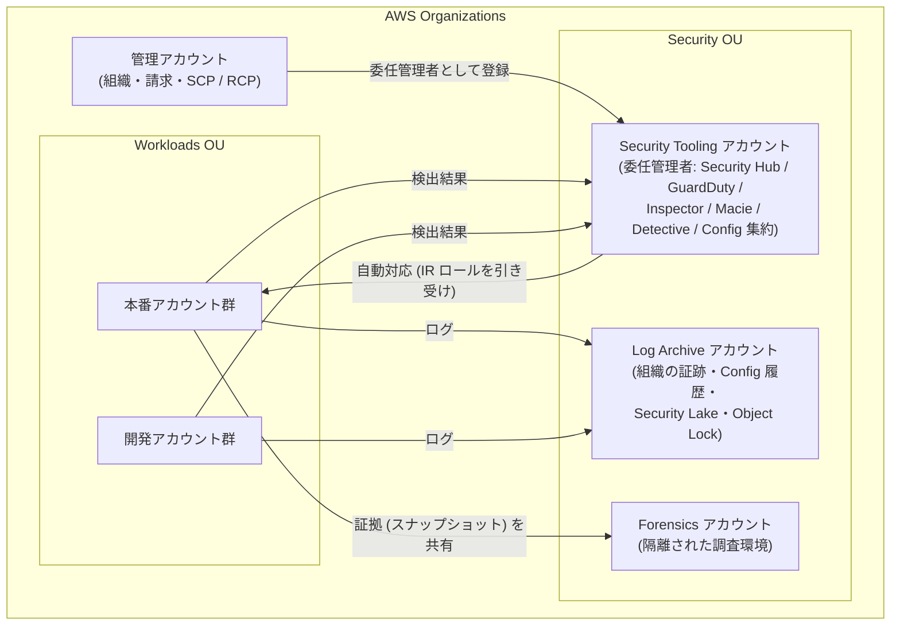
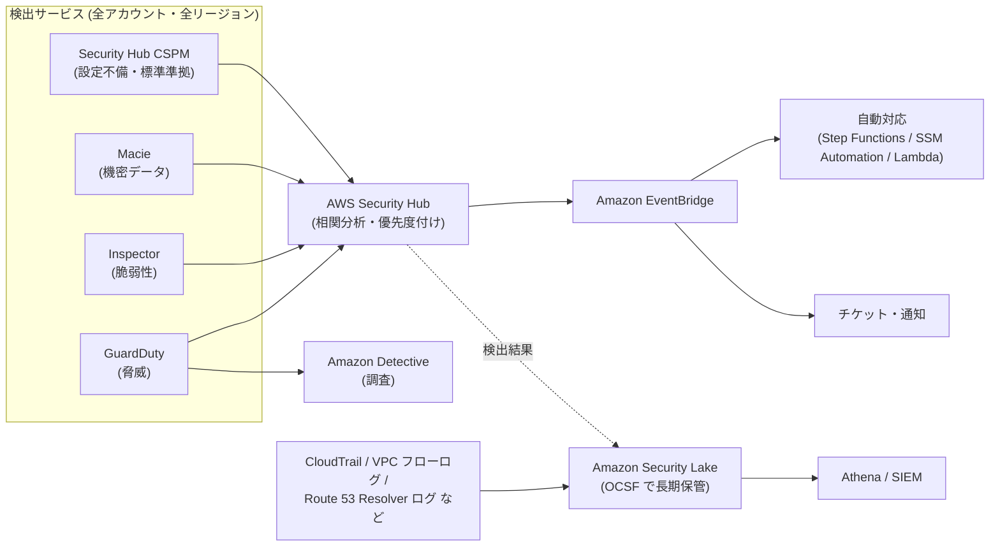
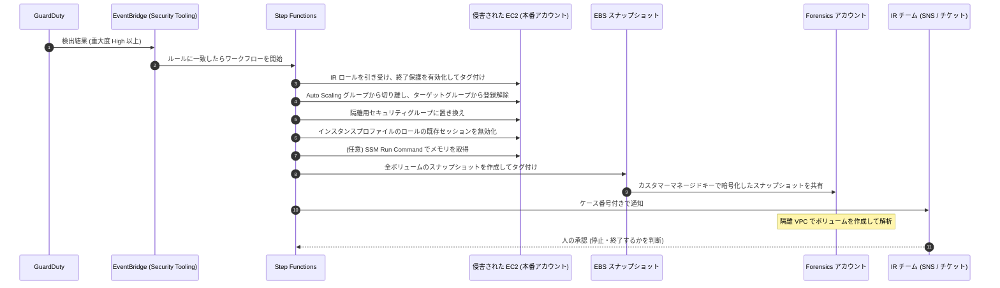
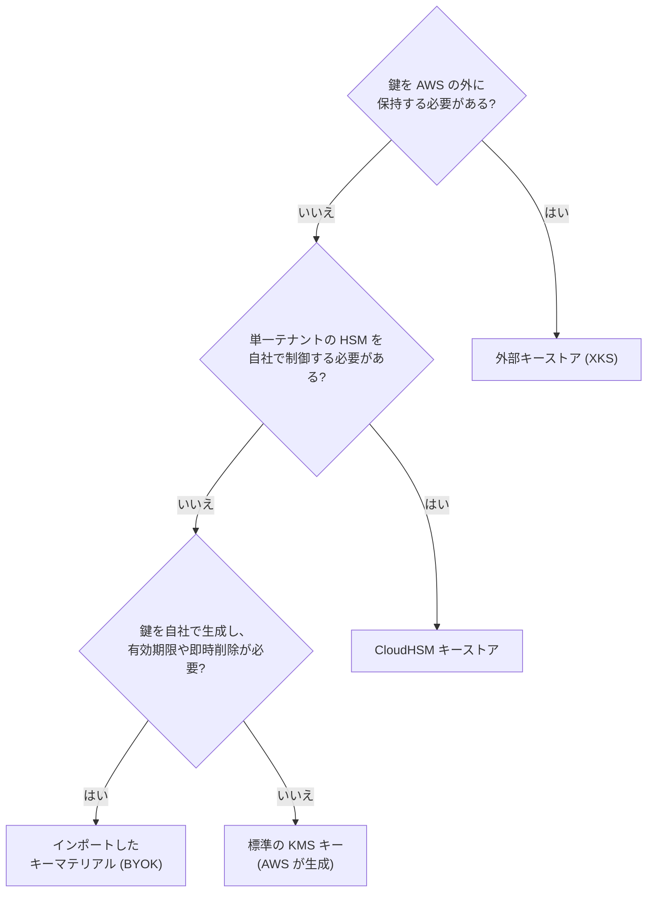

[ホーム](../README.md) > [Phase 3: プロフェッショナル](README.md) > セキュリティとコンプライアンスのアーキテクチャ

# セキュリティとコンプライアンスのアーキテクチャ

> **この章のゴール**
> - 組織全体のセキュリティ基盤（Security Tooling / Log Archive / Forensics アカウントと委任管理者）を設計できる
> - AWS Security Hub と AWS Security Hub CSPM、GuardDuty、Inspector、Macie、Detective、Security Lake の役割を区別し、検出を集中化できる
> - EventBridge を起点にしたインシデント対応の自動化（隔離・証拠保全・通知）を設計できる
> - KMS のキー戦略とキーポリシー（クロスアカウント、`kms:ViaService`、暗号化コンテキスト、グラント、マルチリージョンキー、カスタムキーストア）を要件から選べる
> - ポスト量子暗号の脅威と AWS の現在の対応範囲を正確に説明し、移行計画を立てられる
> - Firewall Manager、Config、Security Hub CSPM を使って、組織全体のインフラ保護とコンプライアンスを一元化できる
>
> **対応試験**: SAP-C03（ドメイン2: セキュリティ、コンプライアンス、ガバナンス（仮訳）ほか）
> **目安時間**: 読む 150分 / 確認問題 40分

> [!NOTE]
> この章は [セキュリティサービス（KMS / WAF / GuardDuty ほか）](../02-associate/12-security-services.md) の内容を前提にします。各サービスの基本機能はそちらで復習してください。
> OU・SCP・RCP は [マルチアカウント戦略とガバナンス](02-multi-account-governance.md)、IAM Identity Center や ABAC は [大規模な ID とアクセス管理](03-identity-federation.md)、Network Firewall の配置は [高度なネットワーク設計](04-advanced-networking.md) で扱います。

## この章の全体像

SAA では「GuardDuty は脅威検出」「KMS は暗号鍵の管理」のように、サービス単位の理解で十分でした。SAP では問いが変わります。**数百のアカウントと複数のリージョンにまたがる組織で、検出・対応・データ保護・監査証跡をどう一元化し、どう自動化するか** が問われます。

まず、この章全体で前提にする組織構成を示します。AWS が公開している AWS Security Reference Architecture（AWS SRA）に沿った、標準的な形です。



この図の要点は 3 つです。

1. 管理アカウントは組織の管理だけに使い、セキュリティサービスの運用は **Security Tooling アカウント（委任管理者）** に任せる。
2. ログは **Log Archive アカウント** に集め、ワークロードの管理者でも消せないようにする。
3. 侵害時の証拠は **Forensics アカウント** に集め、本番環境から切り離して調査する。

| 節 | テーマ | SAP での主な問われ方 |
|---|---|---|
| 1〜2 | 設計原則・組織の基盤 | 管理アカウントを使わずに、全アカウントへ自動で展開するには |
| 3 | 検出の集中化 | どの検出サービスを、どのアカウントで、どう集約するか |
| 4 | インシデント対応 | 隔離・証拠保全・通知をどう自動化するか |
| 5〜6 | データ保護・ポスト量子暗号 | キーの粒度、クロスアカウント、鍵の保管場所、PQC の対応範囲 |
| 7〜8 | 秘密情報・インフラ保護 | ローテーション方式、Firewall Manager による強制 |
| 9〜11 | コンプライアンス・ワークロード保護・ログ | 準拠の証跡、データレジデンシー、改ざんできないログ |

## 1. 設計原則

### 1.1 セキュリティの柱の 7 つの設計原則

AWS Well-Architected フレームワークのセキュリティの柱は、次の 7 つの設計原則を挙げています。SAP の選択肢は、どれも「動く」ことが多いため、**どの原則をより多く満たすか** が判断の軸になります。

| 設計原則 | 意味 | 組織レベルの代表的な実装 |
|---|---|---|
| 強力なアイデンティティ基盤を実装する | 最小権限、職務の分離、長期の認証情報をなくす | IAM Identity Center、IAM ロール、SCP / RCP |
| トレーサビリティを維持する | 誰が・いつ・何をしたかを常に追える | 組織の証跡（CloudTrail）、Config、VPC フローログ |
| すべてのレイヤーでセキュリティを適用する（多層防御） | エッジ・ネットワーク・ホスト・アプリ・データの各層で守る | Shield / WAF / Network Firewall / セキュリティグループ / KMS |
| セキュリティのベストプラクティスを自動化する | 統制と修復をコードで行い、人手に頼らない | Config の自動修復、EventBridge、Firewall Manager |
| 転送中および保管中のデータを保護する | データの分類に応じて暗号化・トークン化する | KMS、ACM、VPC Encryption Controls |
| データに人の手が届かないようにする | 直接アクセスを減らし、ツール経由にする | Session Manager、SSM Automation、ダッシュボード |
| セキュリティイベントに備える | 手順・ツール・訓練を事前に用意する | IR ランブック、Forensics アカウント、ゲームデー |

### 1.2 予防・検出・対応・復旧の 4 層で考える

コントロールは、働くタイミングで 4 つに分けると整理しやすくなります。

| 層 | 目的 | 組織レベルの代表的な仕組み |
|---|---|---|
| 予防（Preventive） | 危険な操作をそもそもできなくする | SCP / RCP / 宣言型ポリシー、Control Tower の予防コントロール、S3 ブロックパブリックアクセス |
| 検出（Detective） | 起きたこと・危険な状態を見つける | GuardDuty、Security Hub CSPM、Config ルール、Inspector、Macie、IAM Access Analyzer |
| 対応（Responsive） | 見つけたものを隔離・修正する | EventBridge + Step Functions / SSM Automation / Lambda、Config の自動修復 |
| 復旧（Recovery） | 被害から業務を戻す | AWS Backup（Vault Lock）、IaC による再構築（→ [回復力と事業継続](06-resilience-business-continuity.md)） |

> [!TIP]
> **試験のポイント**: 問題文の動詞に注目します。「防ぐ（prevent）」「できないようにする」→ 予防的コントロール（SCP / RCP / 宣言型ポリシー）。「検出して通知する」→ Config / Security Hub CSPM / GuardDuty。「自動的に修正する」→ Config の自動修復、EventBridge + SSM Automation。

> [!WARNING]
> **ひっかけ注意**: SCP は **管理アカウントには効かず**、サービスにリンクされたロールにも効きません。また SCP は権限を「与える」ものではなく「上限を決める」ものです。管理アカウントで日常業務をしない設計が前提になるのはこのためです（詳しくは [マルチアカウント戦略とガバナンス](02-multi-account-governance.md)）。

## 2. 組織全体のセキュリティ基盤

### 2.1 アカウント構成

| アカウント | 役割 | 主な中身 | アクセスできる人 |
|---|---|---|---|
| 管理アカウント | 組織・請求・ポリシーの管理 | Organizations、SCP / RCP、委任管理者の登録 | ごく少数の管理者 |
| Security Tooling（Control Tower では Audit アカウント） | セキュリティサービスの委任管理者 | Security Hub / Security Hub CSPM、GuardDuty、Inspector、Macie、Detective、Config アグリゲーター、Firewall Manager、IAM Access Analyzer、IR の自動化 | セキュリティチーム |
| Log Archive | ログの長期保管 | 組織の証跡の S3 バケット、Config の設定履歴、VPC フローログ、Security Lake のデータ | 原則として読み取り専用の監査担当のみ |
| Forensics | 侵害調査 | 隔離された VPC、調査用インスタンス、共有されたスナップショット、証拠保管用 S3 | インシデント対応（IR）チーム |
| ワークロード（本番・開発など） | アプリケーション | 各セキュリティサービスのメンバーアカウントとして自動登録される | 各チーム |

> [!NOTE]
> AWS Control Tower でランディングゾーンを作ると、Security OU に **Log Archive** と **Audit** の 2 つの共有アカウントが作られます。Audit アカウントが、ここでいう Security Tooling アカウントに相当します。Forensics アカウントは自分で追加します。

### 2.2 委任管理者（delegated administrator）

**なぜ委任するのか**: 管理アカウントには SCP が効かず、組織全体を変更できる強い権限があります。ここでセキュリティサービスを日常的に運用すると、操作ミスや認証情報の漏えいの影響が組織全体に及びます。そこで、各サービスの管理を **Security Tooling アカウントに委任** し、管理アカウントの利用を最小限にします。

委任管理者は、組織内のアカウントをメンバーとして一括管理し、**新しく作られたアカウントも自動で有効化（auto-enable）** できます。

| サービス | 委任管理者 | 新規アカウントの自動有効化 | 範囲 |
|---|---|---|---|
| GuardDuty | ○ | ○（全アカウント / 新規のみを選択） | リージョンごと |
| Security Hub CSPM | ○ | ○（中央設定の設定ポリシー） | リージョンごと（中央設定とクロスリージョン集約でホームリージョンから一括管理） |
| Inspector | ○ | ○ | リージョンごと |
| Macie | ○ | ○ | リージョンごと |
| Detective | ○ | ○ | リージョンごと |
| Security Lake | ○ | ○（ログソースの収集対象） | ロールアップリージョンに集約できる |
| Config | ○（組織ルール・コンフォーマンスパック・アグリゲーター） | 記録（レコーダー）の有効化は各アカウントで必要（Control Tower などで展開） | リージョンごと |
| Firewall Manager | ○ | ポリシーの範囲内のアカウント・リソースに自動適用 | リージョンごと（CloudFront などのグローバルリソースは別扱い） |
| IAM Access Analyzer | ○ | 組織を信頼ゾーンとするアナライザー | リージョンごと |

> [!IMPORTANT]
> GuardDuty、Inspector、Macie、Detective、Security Hub CSPM は **リージョン単位のサービス** です。攻撃者は、あなたが使っていないリージョンにもリソースを作れます。**すべての有効なリージョンで有効化する** か、**SCP や Control Tower のリージョン拒否で使わないリージョンを封じる** 必要があります（実務では両方を行います）。

> [!TIP]
> **試験のポイント**: 「管理アカウントでの作業を最小化したい」「今後作成されるアカウントも自動的に対象にしたい」「運用上のオーバーヘッドを最小に」→ **委任管理者 + 自動有効化**。各アカウントに StackSets で個別に有効化する選択肢や、招待（メール）ベースでメンバーを追加する選択肢は、運用負荷が高いか旧来の方法です。

### 2.3 組織ポリシーでセキュリティ設定を固定する

Organizations のポリシーは SCP だけではありません。セキュリティに関係する主なポリシータイプは次のとおりです（詳細は [マルチアカウント戦略とガバナンス](02-multi-account-governance.md)）。

| ポリシータイプ | 何を固定するか | 例 |
|---|---|---|
| SCP | IAM プリンシパルが使える権限の上限 | 許可リージョン以外の操作を拒否、CloudTrail の停止を拒否 |
| RCP（リソースコントロールポリシー） | リソースに対するアクセスの上限 | 組織外のプリンシパルによる S3 や KMS へのアクセスを拒否 |
| 宣言型ポリシー（EC2 など） | サービスの設定そのもの | IMDSv2 の強制、AMI やスナップショットのパブリック共有の禁止、VPC ブロックパブリックアクセス |
| Security Hub ポリシー / Inspector ポリシー | サービスの有効化状態などの一元管理 | 組織全体で Security Hub や Inspector を有効化する |
| バックアップポリシー | バックアッププラン | 全アカウントに共通のバックアップを適用（→ 次章） |

## 3. 検出の集中化

### 3.1 全体像

検出の仕組みは、**検出 → 集約・相関 → 対応 → 調査・長期分析** の 4 段で考えます。



### 3.2 AWS Security Hub と AWS Security Hub CSPM

2025 年に、従来の AWS Security Hub は **AWS Security Hub CSPM** に名称が変わりました。そして同じ「AWS Security Hub」の名前で、**新しい統合版の Security Hub**（2025-12-02 GA）が登場しました。SAP ではこの 2 つを区別する必要があります。

| 観点 | AWS Security Hub CSPM（旧 AWS Security Hub） | AWS Security Hub（2025年12月 GA の統合版） |
|---|---|---|
| 主な役割 | クラウドセキュリティ態勢管理（CSPM）: セキュリティ標準に基づく設定チェック | GuardDuty・Inspector・Macie・Security Hub CSPM のシグナルを相関分析し、対処すべきリスクに優先順位を付ける |
| 代表的な機能 | セキュリティ標準とコントロール、セキュリティスコア、中央設定、クロスリージョン集約、自動化ルール | 露出（exposure）の検出結果、攻撃パスの可視化、リスクの優先度付け、チケット連携などの対応ワークフロー |
| 検出結果の形式 | AWS Security Finding Format（ASFF） | OCSF（Open Cybersecurity Schema Framework） |
| 位置づけ | 統合版 Security Hub のデータソースの 1 つとして引き続き使う | 検出と対応の「入口」 |

**露出の検出結果** とは、単独では中程度の問題を組み合わせて「本当に危ないもの」を示す検出結果です。たとえば「インターネットから到達できる」「重大な脆弱性がある」「強い IAM 権限を持つ」という 3 つの条件がそろった EC2 インスタンスは、個別の検出結果よりはるかに優先度が高くなります。

Security Hub CSPM で SAP に出やすい機能は次のとおりです。

- **中央設定（central configuration）**: 委任管理者がホームリージョンで「設定ポリシー」を作り、OU やアカウント単位で有効化・セキュリティ標準・コントロールを一括管理します。
- **クロスリージョン集約**: 集約リージョンに、他のリージョンの検出結果を集めます。
- **自動化ルール**: 条件に一致した検出結果の重大度やワークフローの状態を自動で更新します（例: 開発アカウントの特定コントロールの重大度を下げる）。
- **EventBridge 連携**: 検出結果は自動で EventBridge に送られるため、自動対応の起点になります。

> [!WARNING]
> **ひっかけ注意**: 試験や古い教材の「Security Hub」は、多くの場合、現在の **Security Hub CSPM** の機能（セキュリティ標準、ASFF、検出結果の集約）を指しています。問題文の要求が「CIS や PCI DSS への準拠状況のチェック」なのか、「脆弱性・脅威・設定不備を関連付けた優先度付け」なのかで、どちらの機能を指すかを判断してください。

> [!TIP]
> **試験のポイント**: 「CIS / PCI DSS / AWS 基礎セキュリティのベストプラクティス（FSBP）への準拠状況を組織全体でスコア化」→ Security Hub CSPM の標準 + 中央設定。「脆弱性・設定不備・脅威・機密データを関連付け、本当に危ないリソースから対処」→ 統合版 Security Hub。

### 3.3 Amazon GuardDuty

GuardDuty は、**CloudTrail の管理イベント、VPC フローログ、Route 53 Resolver の DNS クエリログ** を基本のデータソースとして分析します。これらのログは GuardDuty が独自に取得するため、利用者が VPC フローログなどを有効化する必要はありません（逆に、GuardDuty がログを保管してくれるわけでもありません）。基本のデータソースに加えて、**保護プラン** で対象を広げます。

| 保護プラン | 分析対象 | 検出の例 |
|---|---|---|
| S3 Protection | S3 のデータイベント | 通常と異なる場所からの大量の GetObject、悪性 IP からのアクセス |
| EKS Protection | EKS の監査ログ | 匿名アクセス、特権コンテナの作成 |
| Runtime Monitoring | EKS / ECS（Fargate・EC2）/ EC2 の OS レベルのイベント（エージェント） | 暗号通貨マイニング、リバースシェル、権限昇格 |
| Malware Protection for EC2 | 検出結果をきっかけに EBS ボリュームをエージェントレスでスキャン | マルウェアの感染 |
| Malware Protection for S3 | 新しくアップロードされたオブジェクト | マルウェアを含むファイルのアップロード |
| RDS Protection | Aurora などへのログインアクティビティ | 総当たり攻撃、不審なログイン |
| Lambda Protection | Lambda 関数のネットワークアクティビティ | 悪性ドメインとの通信 |

**組織全体での有効化**: 委任管理者をリージョンごとに指定し、自動有効化を「組織内のすべてのアカウント」または「新規アカウントのみ」に設定します。保護プランも組織の設定として自動で有効化できます。委任管理者はメンバーの検出結果をすべて参照でき、抑制ルール・信頼できる IP リスト・脅威リストを一元管理します。検出結果の保持期間は 90 日なので、長期保管が必要なら S3 へのエクスポート（KMS で暗号化）を設定します。

**Extended Threat Detection**（2024年12月〜）は、複数のデータソースとリソースにまたがる **多段階の攻撃（attack sequence）** を、時間をかけて相関分析し、1 つの重大度「Critical」の検出結果として示す機能です。たとえば「認証情報の侵害 → 探索 → 権限昇格 → S3 からのデータ持ち出し」という一連の流れを、個別のアラートではなく 1 つのストーリーとして提示し、MITRE ATT&CK の戦術に対応付けます。GuardDuty を有効にすると追加料金なしで使え、有効にしている保護プランが多いほど検出できる範囲が広がります。

> [!TIP]
> **試験のポイント**: 「個々のアラートではなく、複数段階にわたる攻撃の流れとして検出したい」→ GuardDuty Extended Threat Detection。「コンテナやインスタンス内部のプロセスレベルの脅威」→ GuardDuty Runtime Monitoring。

> [!WARNING]
> **ひっかけ注意**: GuardDuty は **検出** サービスで、通信を遮断しません。遮断は、EventBridge を起点にした自動対応や、Network Firewall・AWS WAF・Route 53 Resolver DNS Firewall で行います。

### 3.4 Amazon Inspector

Inspector は、ソフトウェアの脆弱性（CVE）と意図しないネットワーク露出を継続的に検出します。

- **EC2**: SSM エージェントを使うスキャンと、EBS スナップショットを使うエージェントレススキャンを組み合わせられます。
- **ECR のコンテナイメージ**: 拡張スキャンとして、プッシュ時と、新しい CVE が公開されたときに継続的に再スキャンします。
- **Lambda**: 関数のパッケージの脆弱性と、関数コードの脆弱性をスキャンします。
- **コードセキュリティ**（2025-06-17 GA）: ソースコードリポジトリや CI/CD と連携し、SAST（静的解析）、SCA（依存ライブラリの解析）、IaC のスキャンを行います。
- **Inspector スコア**: CVSS を、ネットワーク到達性やエクスプロイトの有無など環境に合わせて調整し、優先度付けに使います。SBOM（ソフトウェア部品表）のエクスポートにも対応します。

組織では、委任管理者と自動有効化（および Organizations の Inspector ポリシー）で全アカウントに展開します。

> [!TIP]
> **試験のポイント**: 「デプロイ前にパイプラインでイメージやコードの脆弱性を検出」→ Inspector の CI/CD 連携・コードセキュリティ。「ECR にあるイメージを、新しい CVE に対して継続的に再スキャン」→ ECR の拡張スキャン（Inspector）。

### 3.5 Amazon Macie

Macie は S3 に保存されたデータから、個人情報・認証情報・金融情報などの **機密データを検出** します。マネージドデータ識別子に加え、正規表現とキーワードによるカスタムデータ識別子、許可リストを使えます。

| 方式 | 仕組み | 向いている用途 |
|---|---|---|
| 自動化された機密データ検出 | 組織全体の S3 バケットから、オブジェクトを継続的にサンプリングして分析し、バケットごとの機密度スコアを出す | 数千のバケットの「どこに機密データがありそうか」を低コストで把握する |
| 機密データ検出ジョブ | 指定したバケット（条件）を 1 回または定期的に全件検査する | 特定のバケットを詳しく調べる、監査の証跡を残す |

Macie はこれとは別に、バケットの公開や暗号化の無効化などを示す **ポリシーの検出結果** も生成します。検出結果は Security Hub と EventBridge に送られ、詳細な検出結果は KMS で暗号化した S3 バケットに保存します。

### 3.6 Amazon Detective

Detective は、CloudTrail、VPC フローログ、GuardDuty の検出結果などから **動作グラフ（behavior graph）** を作り、IAM ロール・IP アドレス・インスタンスなどの関係と、平常時からの変化を可視化します。最大 1 年分のデータを使って、「この IP アドレスは他にどのリソースと通信したか」「このロールは普段と違う操作をしたか」を調べられます。関連する検出結果とエンティティは **検出結果グループ** にまとめられます。

GuardDuty が「何かが起きた」を知らせるのに対し、Detective は「何が原因で、どこまで広がったか」を調べるためのサービスです。

### 3.7 Amazon Security Lake と OCSF

Security Lake は、セキュリティ関連のログとイベントを **OCSF（Open Cybersecurity Schema Framework）** 形式に正規化し、**自社アカウントの S3** にデータレイクとして集約するサービスです。データは Apache Parquet 形式で保存され、Lake Formation と Glue データカタログで管理されます。

- **AWS のネイティブソース**: CloudTrail（管理イベント、S3 / Lambda のデータイベント）、VPC フローログ、Route 53 Resolver クエリログ、Security Hub の検出結果、EKS 監査ログ、AWS WAF のログなど。
- **カスタムソース**: サードパーティ製品のログを OCSF 形式で取り込めます。
- **ロールアップリージョン**: 複数リージョンのデータを 1 つのリージョンに集約できます。保持期間はライフサイクル設定で管理します。
- **サブスクライバー**: SIEM などに S3 のデータと通知を渡す「データアクセス」と、Lake Formation の共有を通じて Athena などで直接クエリする「クエリアクセス」があります。

OCSF という共通スキーマにそろえることで、ツールごとにログの形式を変換する手間を省けます。

| 観点 | Security Hub（CSPM を含む） | Security Lake | SIEM（サードパーティ / OpenSearch など） |
|---|---|---|---|
| 扱うデータ | 検出結果 | 生ログ + 検出結果（OCSF） | 取り込んだログとイベント |
| 主な目的 | 優先度付けと対応 | 長期保管、横断分析、他のツールへの供給 | 相関分析、アラート、ダッシュボード |
| データの置き場所 | サービス内 | 自社アカウントの S3 | ツール側 |

> [!WARNING]
> **ひっかけ注意**: Security Lake はログの「置き場所と形式」を統一するサービスで、脅威の検出そのものは行いません。検出は GuardDuty、分析は Athena や SIEM が担います。

### 3.8 検出サービスの選び方

| 問題文のキーワード | 選ぶサービス |
|---|---|
| 悪意のある IP との通信、暗号通貨マイニング、認証情報の異常な使用 | GuardDuty |
| 多段階の攻撃を 1 つの検出結果として把握 | GuardDuty Extended Threat Detection |
| EC2 / ECR / Lambda の CVE、コードの脆弱性 | Inspector |
| S3 内の個人情報、機密データの所在 | Macie |
| CIS / PCI DSS / FSBP への準拠状況 | Security Hub CSPM |
| 脆弱性・脅威・設定不備を関連付けた優先度付け | Security Hub（統合版） |
| 根本原因の調査、影響範囲の可視化 | Detective |
| OCSF、ログの長期保管、SIEM へのデータ供給 | Security Lake |
| 外部と共有されているリソース、未使用のアクセス権限 | IAM Access Analyzer |
| リソース設定の変更履歴と、ルールへの準拠状況 | Config |

## 4. インシデント対応

### 4.1 対応のライフサイクルと「準備」

インシデント対応は、NIST SP 800-61 に沿って **準備 → 検出と分析 → 封じ込め・根絶・復旧 → 事後対応（振り返り）** の順に進めます。AWS の「AWS Security Incident Response Guide」も同じ考え方です。

SAP で問われるのは、ほとんどが **準備** と **封じ込めの自動化** です。侵害が起きてから権限やツールを用意していては、証拠が消え、被害が広がります。事前に次の状態を作っておきます。

| 準備項目 | 具体例 |
|---|---|
| 権限 | 全アカウントに IR 用の IAM ロールを事前展開（CloudFormation StackSets のサービスマネージド権限で、新規アカウントにも自動展開） |
| ネットワーク | 隔離用のセキュリティグループ（ルールなし）を用意するか、自動化の中で作成する |
| 証拠保全 | Forensics アカウント、スナップショット共有用のカスタマーマネージドキー、Object Lock を有効にした証拠保管用 S3 バケット |
| ログ | CloudTrail、VPC フローログ、Route 53 Resolver クエリログが有効で、Log Archive に集まっている |
| 手順 | ランブック（手順書）とプレイブックのコード化、ゲームデーでの定期的な訓練 |

### 4.2 自動対応のアーキテクチャ

自動対応の起点は **Amazon EventBridge** です。GuardDuty、Security Hub、Security Hub CSPM、Macie、Inspector などは、検出結果を EventBridge にイベントとして送ります。組織構成では、**委任管理者アカウントの EventBridge にメンバーアカウントの検出結果も届く** ため、自動対応は Security Tooling アカウントに集約し、各アカウントの IR ロールを引き受けて処理します。

次のイベントパターンは、EC2 インスタンスに関する重大度 7 以上（High 以上）の GuardDuty の検出結果に一致します。

```json
{
  "source": ["aws.guardduty"],
  "detail-type": ["GuardDuty Finding"],
  "detail": {
    "severity": [{ "numeric": [">=", 7] }],
    "resource": { "resourceType": ["Instance"] }
  }
}
```

EventBridge のターゲット（実際に対応する仕組み）は、処理の複雑さで選びます。

| ターゲット | 向いている処理 | 特徴 |
|---|---|---|
| AWS Lambda | 1〜2 手順の単純な対応（アクセスキーの無効化、タグ付け、通知） | 実装が簡単。長い処理や人の承認を挟む処理には不向き |
| SSM Automation | OS や AWS リソースに対する定型の修復 | AWS が用意したランブックを使える。承認ステップ（`aws:approve`）、複数アカウント・複数リージョンでの実行、レート制御に対応 |
| AWS Step Functions | 複数の手順を順序どおりに実行する封じ込め | 分岐・並列・再試行・エラー処理、`.waitForTaskToken` による人の承認、実行履歴が監査証跡になる |
| Config ルール + 自動修復 | 設定の不備の修正（公開バケット、暗号化の無効化など） | 修復アクションとして SSM Automation を呼ぶ。コンフォーマンスパックで組織全体に配布できる |
| Security Hub CSPM のカスタムアクション | 担当者が検出結果を選んで実行する半自動の対応 | 選んだ検出結果が EventBridge に送られ、以降は同じ仕組みで処理する |

AWS は、Security Hub CSPM の検出結果に対する修復をまとめた **Automated Security Response on AWS**（AWS ソリューション）も公開しています。一から作る前に検討する価値があります。

> [!TIP]
> **試験のポイント**: 「複数の手順を決まった順序で実行し、途中で人の承認を挟み、失敗したら再試行する」→ Step Functions。「定型の修復を複数アカウント・複数リージョンで実行」→ SSM Automation。「設定の不備を検出したら自動で修正」→ Config ルール + 自動修復。「イベントを起点にする」→ いずれも EventBridge ルールから呼び出します。

> [!WARNING]
> **ひっかけ注意**: 自動化は誤検知でも動きます。本番インスタンスの停止・終了のような **破壊的な操作は、人の承認を挟む** のが原則です。重大度・タグ・アカウント（OU）で対象を絞り、まず「隔離と証拠保全」までを自動化し、「終了」は人が判断する設計が SAP の模範解答になりやすいです。

### 4.3 EC2 インスタンス侵害時の封じ込めと証拠保全

最もよく出題されるのが、EC2 インスタンスが侵害された（暗号通貨マイニングや C&C サーバーとの通信を検出した）ときの自動対応です。



各手順には、明確な理由があります。

| 手順 | 理由・注意点 |
|---|---|
| 終了保護とタグ付け | 誤って（または攻撃者に）終了されるのを防ぎ、「隔離中」であることを全員に示す。タグで他の自動化の対象から外す |
| Auto Scaling グループからの切り離し | 付けたままだと、ヘルスチェックの失敗で **Auto Scaling がインスタンスを終了し、証拠が消える** |
| ターゲットグループからの登録解除 | 利用者のトラフィックを侵害されたインスタンスに流さない |
| 隔離用セキュリティグループへの置き換え | インバウンド・アウトバウンドの通信を止める。ただし **既存の追跡中の接続は、セキュリティグループを変えてもすぐには切れない** ため、確実に遮断するにはサブネットのネットワーク ACL での拒否も検討する |
| 既存セッションの無効化 | 盗まれた一時的な認証情報を使えなくする。IAM ロールに `aws:TokenIssueTime` を条件にした拒否ポリシーを付ける（コンソールの「アクティブなセッションを無効化」と同じ）。同じロールを使う他のインスタンスにも影響する点に注意 |
| メモリの取得 | 停止するとメモリ上の証拠（プロセス、ネットワーク接続、マルウェア）が失われる。**いきなり停止・終了しない** |
| スナップショットの作成と共有 | ディスクの証拠を保全し、本番から切り離された Forensics アカウントで解析する |

> [!WARNING]
> **ひっかけ注意**: **AWS マネージドキー（`aws/ebs`）で暗号化したスナップショットは、他のアカウントと共有できません**（AWS マネージドキーのキーポリシーは変更できないため）。カスタマーマネージドキーで再暗号化したコピーを作り、そのキーのキーポリシーで Forensics アカウントに `kms:Decrypt` や `kms:CreateGrant` などを許可してから共有します。

### 4.4 Forensics アカウントの設計

| 要素 | 設計 |
|---|---|
| ネットワーク | インターネットゲートウェイも NAT ゲートウェイもない隔離された VPC。AWS API へは VPC エンドポイント経由 |
| 調査環境 | 解析ツールを入れた調査用 AMI。共有されたスナップショットからボリュームを作り、調査用インスタンスに接続する |
| 証拠の保管 | Object Lock（コンプライアンスモード）とバージョニングを有効にし、SSE-KMS で暗号化した S3 バケット |
| 証拠の完全性 | 取得した証拠のハッシュ値を記録し、誰がいつ扱ったか（証拠保全の連鎖、chain of custody）を残す |
| アクセス制御 | IR チームだけがアクセスできる。SCP で調査以外の用途（外部への通信経路の作成など）を禁止する |

### 4.5 AWS Security Incident Response

**AWS Security Incident Response**（2024年12月 GA）は、AWS 環境の脅威を監視し、検出結果のトリアージからインシデントの調査・封じ込めの支援までを行うマネージドサービスです。

- **自身は検出を行わない**: GuardDuty と、Security Hub CSPM 経由で連携したサードパーティー製品の検出結果を取り込み、自動化と AWS のエンジニアで **トリアージ（重複の排除・関連付け・誤検知の判定）** して、対応が必要なものだけを利用者にエスカレーションします。設定不備（セキュリティ態勢）の検出結果はトリアージの対象外です。
- **ケース**: トリアージで本物の脅威と判断されると自動で作られる **プロアクティブケース** と、利用者が作る **リアクティブケース** があります。リアクティブケースのうち「AWS サポート型」は、AWS のエンジニアが 24 時間 365 日対応し、初動の目標（SLO）は 15 分です。
- **封じ込め**: 事前に許可しておくと、AWS のエンジニアが EC2 インスタンス・S3 バケット・IAM プリンシパル向けのランブックで封じ込めを実行します。許可していない場合は、手順の助言にとどまります。
- **組織全体の監視**: Organizations の組織全体または OU 単位で対象アカウントを選びます。ケースのイベントは EventBridge に送られ、Jira・Slack・ServiceNow などと連携できます。
- **範囲外のこと**: ディスクやメモリのフォレンジック（調査はログベース）、復旧・修復作業の実行、脅威ハンティング、法的な助言は対象外です。**自社の Forensics アカウントと自動対応は引き続き必要** です。

> [!WARNING]
> **ひっかけ注意**: AWS Security Incident Response の料金とサポートプランの関係は、公式ページの記載が一致していない部分があります。最上位の Unified Operations には含まれますが、その他のプラン（Enterprise Support など）で追加料金なしに使えるかどうかは、契約前に必ず公式ページで確認してください。また、東京リージョンで利用できますが、日本語での対応は平日の日本時間の営業時間内のベストエフォートに限られます（2026年9月時点）。

### 4.6 侵害パターン別の初動

| 侵害パターン | 自動化しやすい初動 |
|---|---|
| IAM ユーザーのアクセスキーの漏えい | アクセスキーを無効化し、ユーザーに拒否ポリシーを付ける。CloudTrail で漏えい後の操作を調べ、作成されたリソースを確認する |
| IAM ロールの認証情報の窃取（例: `InstanceCredentialExfiltration`） | `aws:TokenIssueTime` による既存セッションの無効化。IMDSv2 の強制で再発を防ぐ |
| S3 バケットの公開・データの持ち出し | ブロックパブリックアクセスを有効化し、バケットポリシーを修正する。Macie で機密データの有無を確認する |
| コンテナの侵害 | GuardDuty Runtime Monitoring の検出結果を起点に、タスクやポッドを隔離・停止し、イメージを Inspector で再スキャンする |
| ルートユーザーの不審な利用 | 即時に通知し、ルートユーザーの認証情報をリセットする。組織では、メンバーアカウントのルートユーザーの認証情報を一元管理（削除）しておくと、このリスク自体を減らせる |

## 5. データ保護設計（KMS）

### 5.1 前提の整理

KMS の基本（エンベロープ暗号化、キーの種類、キーポリシーの基本）は [セキュリティサービス](../02-associate/12-security-services.md) で学びました。SAP で重要な違いを整理します。

| 観点 | AWS 所有キー | AWS マネージドキー（`aws/s3` など） | カスタマーマネージドキー |
|---|---|---|---|
| キーポリシーの変更 | 不可（見えない） | 不可 | 可能 |
| クロスアカウントでの利用 | 不可 | **不可** | 可能 |
| ローテーション | AWS が管理 | 毎年自動（変更不可） | 自動（90〜2,560 日で指定、既定 365 日）＋オンデマンド |
| 料金 | 無料 | 月額料金なし（リクエスト料金のみ） | キー 1 つあたり月額 1 USD ＋ リクエスト料金（2026年9月時点） |
| 使いどころ | 利用者が鍵を意識しない暗号化 | 手軽な既定の暗号化 | 監査・職務分離・クロスアカウント・即時の無効化が必要なとき |

SAP の問題で「キーへのアクセスを細かく制御したい」「他のアカウントと共有したい」「キーを無効化してデータへのアクセスを即座に止めたい」とあれば、カスタマーマネージドキーが前提です。

### 5.2 キーの粒度と配置

**粒度** は「1 つのキーが漏えい・誤設定したときに、どこまで影響するか」で決めます。

| 粒度 | 長所 | 短所 | 向いているケース |
|---|---|---|---|
| アカウントで 1 つのキーを共用 | 管理が簡単 | 影響範囲が大きい。キーポリシーが複雑になり、職務の分離ができない | 小規模・検証環境 |
| アプリケーション × 環境 × データ分類ごと | 影響範囲が小さく、キーポリシーを用途に合わせて書ける | キーの数と管理が増える | **多くの組織の出発点** |
| テナント（顧客）ごと | テナントの分離。キーを削除すればそのテナントのデータを読めなくできる（暗号学的消去） | キーの数・料金・クォータの管理が必要 | SaaS、顧客ごとの鍵管理の要求 |

**配置** には 2 つの考え方があります。

| 配置 | 仕組み | 長所 | 注意点 |
|---|---|---|---|
| 分散型（各ワークロードアカウントにキー） | キーを使うアカウントでキーを作る。ガバナンスは SCP / RCP・Config ルール・IaC で中央から行う | キーポリシーが単純。アカウントの境界がそのまま影響範囲の境界になる | 組織全体でキーポリシーの品質をそろえる仕組みが必要 |
| 集中型（キー管理アカウント） | 専用アカウントでキーを作り、各アカウントからクロスアカウントで使う | キーの管理者とデータの利用者を完全に分けられる（職務の分離） | **クロスアカウントのリクエストは、キーを所有するアカウントのクォータに計上される**。AWS マネージドキーは使えず、キーポリシーが肥大化しやすい |

> [!TIP]
> **試験のポイント**: 「セキュリティチームだけがキーを管理し、アプリケーションチームはキーを管理できない（職務の分離）」→ キーポリシーで管理者（`kms:Create*`、`kms:Put*` など）と利用者（`kms:Decrypt`、`kms:GenerateDataKey*` など）を分けます。集中型にするかは、クォータとクロスアカウントの制約も考えて判断します。

### 5.3 キーポリシーの設計

KMS のアクセス制御は **キーポリシーが起点** です。IAM ポリシーでキーへのアクセスを許可できるのは、キーポリシーでそのアカウントに委任（`"Principal": {"AWS": "arn:aws:iam::<アカウント ID>:root"}` を許可）している場合だけです。

次は、本番アカウント（111122223333）のキーで、分析アカウント（444455556666）のロールに「S3 経由で、特定のバケットのデータの復号だけ」を許可する例です。

```json
{
  "Version": "2012-10-17",
  "Statement": [
    {
      "Sid": "EnableIAMPoliciesInOwnerAccount",
      "Effect": "Allow",
      "Principal": { "AWS": "arn:aws:iam::111122223333:root" },
      "Action": "kms:*",
      "Resource": "*"
    },
    {
      "Sid": "AllowKeyAdministrators",
      "Effect": "Allow",
      "Principal": { "AWS": "arn:aws:iam::111122223333:role/KeyAdminRole" },
      "Action": [
        "kms:Create*", "kms:Describe*", "kms:Enable*", "kms:List*",
        "kms:Put*", "kms:Update*", "kms:Revoke*", "kms:Disable*",
        "kms:Get*", "kms:Delete*", "kms:TagResource", "kms:UntagResource",
        "kms:ScheduleKeyDeletion", "kms:CancelKeyDeletion"
      ],
      "Resource": "*"
    },
    {
      "Sid": "AllowOrdersAppWithEncryptionContext",
      "Effect": "Allow",
      "Principal": { "AWS": "arn:aws:iam::111122223333:role/OrdersAppRole" },
      "Action": ["kms:Encrypt", "kms:Decrypt", "kms:GenerateDataKey"],
      "Resource": "*",
      "Condition": {
        "StringEquals": { "kms:EncryptionContext:app": "orders" }
      }
    },
    {
      "Sid": "AllowGrantsOnlyForAWSServices",
      "Effect": "Allow",
      "Principal": { "AWS": "arn:aws:iam::111122223333:role/OrdersAppRole" },
      "Action": ["kms:CreateGrant", "kms:ListGrants", "kms:RevokeGrant"],
      "Resource": "*",
      "Condition": { "Bool": { "kms:GrantIsForAWSResource": "true" } }
    },
    {
      "Sid": "AllowAnalyticsDecryptViaS3Only",
      "Effect": "Allow",
      "Principal": { "AWS": "arn:aws:iam::444455556666:role/AnalyticsReader" },
      "Action": "kms:Decrypt",
      "Resource": "*",
      "Condition": {
        "StringEquals": {
          "kms:ViaService": "s3.ap-northeast-1.amazonaws.com",
          "kms:EncryptionContext:aws:s3:arn": "arn:aws:s3:::orders-data-prod"
        }
      }
    }
  ]
}
```

読み解きのポイントは次のとおりです。

- **1 つ目**: 所有アカウントの IAM ポリシーによる制御を有効にします。これを消すと、IAM ポリシーでは誰にも権限を与えられなくなり、キーを管理できなくなる危険があります。
- **2 つ目と 3 つ目**: キーの **管理者** と **利用者** を分けています（職務の分離）。管理者は暗号化・復号ができず、アプリケーションは管理操作ができません。
- **3 つ目**: 暗号化コンテキスト `app=orders` を付けた呼び出しだけを許可します。
- **4 つ目**: グラントの作成を「AWS サービス（EBS・RDS など）が利用者に代わって作る場合」に限ります。
- **5 つ目**: 分析アカウントのロールは、**東京リージョンの S3 経由** でしか復号できず、しかも **`orders-data-prod` バケットのデータに限られます**。KMS の Decrypt API を直接呼んでも拒否されます。
  - S3 バケットキーを有効にしている場合、S3 が使う暗号化コンテキスト `aws:s3:arn` はバケットの ARN です。バケットキーを使わない場合はオブジェクトの ARN になるため、`StringLike` で `arn:aws:s3:::orders-data-prod/*` と書きます。

| 条件キー | 何を制限するか | 典型的な用途 |
|---|---|---|
| `kms:ViaService` | 指定した AWS サービス経由の呼び出しに限る | S3・EBS・RDS 経由でのみ使わせ、API の直接呼び出しを禁止 |
| `kms:CallerAccount` | 呼び出し元のアカウント | `kms:ViaService` と組み合わせて、特定アカウントのサービス経由の利用に限定 |
| `kms:EncryptionContext:<キー名>` | 暗号化コンテキストの値 | 特定のバケット・テナント・アプリケーションのデータに限定 |
| `kms:EncryptionContextKeys` | 暗号化コンテキストのキーの有無 | 暗号化コンテキストの付与を必須にする |
| `kms:GrantIsForAWSResource` | グラントの作成を AWS サービス経由に限る | EBS・RDS などの統合サービス向け |
| `aws:PrincipalOrgID` | 組織内のプリンシパルに限る | 組織外への流出防止（組織全体では RCP で強制するのが効率的） |
| `kms:RecipientAttestation:ImageSha384` | Nitro Enclaves のイメージの測定値 | 特定のエンクレーブの中でしか復号できないようにする（10 節） |

### 5.4 クロスアカウントでの暗号化

他のアカウントのカスタマーマネージドキーを使うには、**3 つの条件** がそろう必要があります。

1. キーを所有するアカウントの **キーポリシー** で、相手のアカウント（またはロール）に操作を許可する。
2. 利用する側のアカウントの **IAM ポリシー** で、そのキーの ARN への操作を許可する。
3. 呼び出しでは **キー ARN** でキーを指定する（他のアカウントのキーは、エイリアスでは指定できません）。

S3 のクロスアカウントでは、これに加えて **バケットポリシー** も必要です。「バケットポリシーでは許可したのに AccessDenied になる」問題の原因の多くは、キーポリシーの許可漏れです。

> [!WARNING]
> **ひっかけ注意**: AWS マネージドキー（`aws/s3`、`aws/ebs`、`aws/secretsmanager` など）は、キーポリシーを変更できないため、**クロスアカウントでは使えません**。「他のアカウントと暗号化されたデータを共有する」要件では、選択肢に AWS マネージドキーが出てきたら誤りです。

組織全体の防御としては、**RCP**（リソースコントロールポリシー）で「組織外のプリンシパルによる KMS キーの利用を拒否する」ように、キーポリシーの書き間違いがあっても組織外に使わせない上限を設けます（→ [マルチアカウント戦略とガバナンス](02-multi-account-governance.md)）。

### 5.5 グラント

**グラント** は、キーポリシーを書き換えずに、特定のプリンシパルへ特定の操作を一時的に委任する仕組みです。EBS、RDS、Redshift などの AWS サービスは、利用者の代わりにキーを使うとき、内部でグラントを作成します。

- 許可する操作を限定でき、**暗号化コンテキストの制約**（完全一致・部分一致）を付けられます。
- 不要になったら **リタイア**（受け取った側が返す）または **取り消し** します。
- 作成直後は反映に時間がかかることがあるため、すぐに使う場合は **グラントトークン** を使います。
- キーポリシーは「恒常的な権限」、グラントは「プログラムから動的に与える一時的な権限」と使い分けます。

### 5.6 暗号化コンテキスト

**暗号化コンテキスト** は、暗号化のときに付ける「キーと値のペア」で、**追加の認証データ（AAD）** として暗号文に暗号学的に結び付けられます。復号するときには、同じコンテキストを渡さないと失敗します。

- **完全性の確認**: 暗号文を別の文脈（別のテナント、別のレコード）で使い回されることを防ぎます。
- **アクセス制御**: キーポリシーやグラントの条件にできます（5.3 の例）。
- **監査**: CloudTrail のログに平文で記録されるため、「どのデータのために復号したか」を追えます。**秘密の情報を入れてはいけません。**
- AWS サービスも独自のコンテキストを付けます。例: S3 は `aws:s3:arn`、Secrets Manager は `SecretARN` と `SecretVersionId`。

### 5.7 マルチリージョンキー

**マルチリージョンキー** は、異なるリージョンにある **同じキー ID・同じキーマテリアル** の KMS キーのセットです（キー ID は `mrk-` で始まります）。あるリージョンで暗号化したデータを、別のリージョンで **KMS をまたいだ再暗号化なしに** 復号できます。

| 観点 | 内容 |
|---|---|
| 構成 | プライマリキーと、他のリージョンのレプリカキー。それぞれが独立した KMS キーで、キーポリシー・グラント・エイリアス・タグは別々に管理する |
| 向いている用途 | クライアント側で暗号化したデータのリージョン間複製（DynamoDB グローバルテーブル、S3 の複製）、複数リージョンでの電子署名の検証、IAM Identity Center のマルチリージョンレプリケーション（マルチリージョンのカスタマーマネージドキーが前提） |
| 不要な場合 | AWS サービス側で暗号化するデータの多くは、複製先で複製先リージョンのキーを使って再暗号化される（例: SSE-KMS の S3 レプリケーション）。この場合は単一リージョンキーで足りる |
| 注意点 | キーマテリアルが複数リージョンに存在する（1 つのリージョンでの侵害がすべてに影響）。データレジデンシーの要件と矛盾しないか確認する。既存の単一リージョンキーを後からマルチリージョンキーに変換することはできない |

> [!TIP]
> **試験のポイント**: 「クライアント側で暗号化したデータを、DR リージョンでもすぐに復号したい」「複数のリージョンで同じ署名キーを使いたい」→ マルチリージョンキー。AWS は原則として単一リージョンキーを推奨しており、マルチリージョンキーは必要な場合に限って使います。

### 5.8 キーストアの選択（インポート・CloudHSM・XKS）

キーマテリアルをどこで生成し、どこに保管するかは、規制要件で決まります。



| 観点 | 標準（AWS が生成） | インポート（BYOK） | CloudHSM キーストア | 外部キーストア（XKS） |
|---|---|---|---|---|
| キーマテリアルの生成 | KMS | 自社 | 自社の CloudHSM クラスター | AWS の外の外部キーマネージャー |
| 保管場所 | KMS の HSM | KMS の HSM（原本は自社でも保管） | 自社専有の CloudHSM（AWS 内） | AWS の外（オンプレミスなど） |
| 暗号処理 | KMS | KMS | CloudHSM | KMS と外部キーマネージャーの **二重暗号化** |
| 対応するキー | 対称・非対称・HMAC・ML-DSA | 対称・非対称・HMAC | 対称暗号化キーのみ | 対称暗号化キーのみ |
| 自動ローテーション | ○ | ✗ | ✗ | ✗ |
| マルチリージョンキー | ○ | ○ | ✗ | ✗ |
| 可用性・性能の責任 | AWS | AWS（キーマテリアルの原本の保管は自社） | 自社（別々の AZ に 2 台以上の HSM が必要） | 自社（外部キーマネージャー、XKS プロキシ、ネットワーク） |
| 代表的な要件 | 大半のワークロード | 鍵を自社で生成したい、有効期限を付けたい、即時に削除したい | 単一テナントの HSM、HSM を自社で完全に制御 | 「鍵を AWS の外に置く（HYOK）」規制、外部から即時にアクセスを遮断 |

- CloudHSM キーストアと XKS のキーも対称暗号化キーなので、S3・EBS などの **AWS サービスとの統合はそのまま使えます**。
- XKS では、外部キーマネージャーやネットワークの障害が、そのまま **AWS 上のデータにアクセスできない障害** になります。可用性とレイテンシーの設計を自社で担う覚悟が必要です。
- CloudHSM を **KMS を介さずに直接** 使う（PKCS#11、JCE、CNG などのライブラリ経由）こともできます。アプリケーションが HSM を直接呼ぶ必要がある場合（TLS のオフロード、独自の署名処理、Oracle TDE など）はこちらです。

> [!IMPORTANT]
> KMS の HSM は **FIPS 140-3 セキュリティレベル 3** の認証を受けています。そのため、「FIPS 140-2 / 140-3 のレベル 3 が必要 → CloudHSM しかない」という古い教材の判断基準は、現在は当てはまりません。CloudHSM を選ぶ理由は、**単一テナントの HSM、鍵の完全な制御、標準の暗号 API（PKCS#11 など）との統合** です。

### 5.9 クライアント側暗号化（AWS Encryption SDK）

サーバー側暗号化（SSE）は、データを受け取った AWS サービスが暗号化します。**データを AWS に送る前に自分で暗号化したい**（エンドツーエンドの保護、フィールド単位の暗号化、保存先を信頼しない）ときは、クライアント側暗号化を使います。

**AWS Encryption SDK** は、エンベロープ暗号化をアプリケーションに組み込むためのライブラリです。

- **キーリング**: どのキー（KMS キーなど）でデータキーを保護するかを指定します。複数の KMS キーで同じデータキーを暗号化すれば、どのリージョンのキーでも復号できるメッセージを作れます。マルチリージョンキーを意識したキーリングもあります。
- **暗号化コンテキスト**: 暗号化メッセージに埋め込まれ、改ざんを検出できます。
- **データキーのキャッシュ / 階層キーリング**: KMS の呼び出し回数を減らし、性能・料金・クォータの問題を避けます。
- **キーコミットメント**: 1 つの暗号文が複数の鍵で異なる平文に復号できてしまう攻撃を防ぎます。

DynamoDB の属性単位で暗号化・署名する場合は **AWS Database Encryption SDK**（暗号化したまま検索できるビーコンに対応）、S3 には **S3 暗号化クライアント** があります。

### 5.10 転送中の暗号化と VPC Encryption Controls

転送中のデータは、ACM の証明書による TLS（ALB、CloudFront、API Gateway）や、一部の Nitro ベースのインスタンス間での自動暗号化で保護します。

**VPC Encryption Controls**（2025年11月 GA）は、リージョン内の VPC 内・VPC 間の通信が暗号化されているかを、VPC 単位で可視化・強制する機能です。

- **モニターモード**: 暗号化されていない通信を可視化し、強制する前に影響を調べます。
- **強制モード**: 暗号化された通信だけが行われるように強制します。
- 2026年3月1日から有料です（2026年9月時点。詳細は [VPC ユーザーガイド](https://docs.aws.amazon.com/vpc/latest/userguide/what-is-amazon-vpc.html) を参照）。

「規制要件で、VPC 内の通信もすべて暗号化されていることを証明する必要がある」という要件に対して、アプリケーションごとに TLS を設定するより、運用上のオーバーヘッドの少ない選択肢になります。

## 6. ポスト量子暗号（PQC）

### 6.1 なぜ今備えるのか ― 収穫して後で解読

将来、暗号を破れる規模の量子コンピューターが実用化されると、Shor のアルゴリズムによって **公開鍵暗号（RSA、楕円曲線暗号の ECDH / ECDSA）** が破られると考えられています。一方、**AES-256 などの共通鍵暗号やハッシュ関数への影響は限定的** で、AES-256 は引き続き安全とされています。

問題は「量子コンピューターはまだない」のに、今から対策が必要な点です。攻撃者は、TLS で暗号化された通信を **今のうちに記録（収穫）しておき、将来量子コンピューターで解読する** ことができます。これを **収穫して後で解読（harvest now, decrypt later）** と呼びます。医療・金融・行政・知的財産のように **何年も秘密にしておく必要があるデータ** は、今日の通信がすでにリスクにさらされています。

NIST は 2024年8月に、耐量子計算機暗号の標準を公開しました。

### 6.2 ML-KEM と ML-DSA の違い

| 観点 | ML-KEM | ML-DSA |
|---|---|---|
| 役割 | 鍵カプセル化（鍵交換） | 電子署名 |
| 守るもの | **機密性**（通信の中身を読まれない） | **真正性・完全性**（なりすまし・改ざんの検出） |
| 置き換える従来方式 | ECDH / RSA による鍵交換 | RSA / ECDSA による署名 |
| 規格 | FIPS 203 | FIPS 204 |
| 急ぐ理由 | 収穫して後で解読により、**今の通信** が将来読まれる | 署名の偽造には偽造する時点で量子コンピューターが必要。ただし、長く使う信頼の起点（ファームウェアやコードの署名、ルート CA）は早めの移行が必要 |
| AWS での対応（2026年9月時点） | KMS・ACM・Secrets Manager のサービスエンドポイントで **ハイブリッド PQ TLS**（X25519 + ML-KEM-768）。**KMS に ML-KEM のキーはない** | KMS の **ML-DSA 非対称キー**（署名と検証） |

### 6.3 AWS での対応範囲（2026年9月時点）

- **KMS の ML-DSA キー**（2025年6月〜）: キー仕様は `ML_DSA_44` / `ML_DSA_65` / `ML_DSA_87`、署名アルゴリズムは `ML_DSA_SHAKE_256` です。用途は **Sign / Verify（署名と検証）だけ** で、データの暗号化には使えません。ファームウェア・ソフトウェア・文書への長期的な署名に向いています。
- **ハイブリッド PQ TLS**（2025年4月〜）: KMS、ACM、Secrets Manager の（FIPS ではない）サービスエンドポイントは、従来の X25519 と ML-KEM-768 を組み合わせた **ハイブリッドの鍵交換** に対応しています。クライアント側は、対応した AWS SDK / AWS Common Runtime（CRT）に更新して有効にします（オプトイン）。ハイブリッドなので、どちらか一方が安全であれば鍵交換は守られます。
- **KMS には ML-KEM のキー仕様はありません**。保管中のデータの暗号化は、これまでどおり KMS の対称キー（AES-256-GCM）によるエンベロープ暗号化で行います。

> [!WARNING]
> **ひっかけ注意**: 「KMS で ML-KEM のキーを作成してデータを暗号化する」という選択肢は **技術的に不可能** です。また「ML-DSA キーでデータを暗号化する」も誤りです（ML-DSA は署名専用）。収穫して後で解読への対策は **通信路の鍵交換（ML-KEM を使うハイブリッド PQ TLS）**、署名の長期的な信頼性は **ML-DSA** と覚えます。

### 6.4 移行計画の立て方

1. **暗号資産の棚卸し**: TLS のエンドポイント、VPN、SSH、コード署名、社内 PKI、トークンの署名など、公開鍵暗号を使っている箇所を洗い出します。
2. **優先順位付け**: 「データを秘密にしておく必要がある年数 + 移行にかかる年数」が「量子コンピューターの実用化までの年数」を超えるものから対処します（Mosca の定理）。
3. **通信路から着手**: 長期の機密性が必要なデータを扱うクライアントで、SDK を更新してハイブリッド PQ TLS を有効にします。
4. **暗号の俊敏性（crypto agility）**: アルゴリズムやライブラリを、コードの大改修なしに設定で切り替えられる設計にします。
5. **署名の移行**: 長期の信頼の起点から ML-DSA を評価します。鍵と署名のサイズが大きくなるため、帯域・保存容量・性能への影響をテストします。
6. **保管中のデータ**: AES-256 は引き続き有効です。KMS のエンベロープ暗号化をそのまま使い、鍵交換と署名の移行に集中します。

> [!TIP]
> **試験のポイント**: 「将来の量子コンピューターによる解読から、今日転送している機密データを守る」→ ハイブリッド PQ TLS（ML-KEM）を有効化。「長期間検証されるファームウェアの署名を量子耐性にする」→ KMS の ML-DSA キーで署名。

## 7. 秘密情報管理（Secrets Manager）

Secrets Manager と Parameter Store の使い分けは [セキュリティサービス](../02-associate/12-security-services.md) で学びました。ここでは、組織規模の設計に必要な 3 つの論点（ローテーション、クロスアカウント、マルチリージョン）を扱います。

### 7.1 ローテーションの方式

ローテーションは、Lambda 関数が 4 つのステップ（`createSecret` → `setSecret` → `testSecret` → `finishSecret`）を実行し、ステージングラベル **AWSCURRENT / AWSPENDING / AWSPREVIOUS** を付け替えることで行います。スケジュールは最短 4 時間ごとに設定できます。

| 方式 | 仕組み | 長所 | 注意点 |
|---|---|---|---|
| マネージドローテーション | RDS・Aurora・Redshift などのサービスが、自身の認証情報を Secrets Manager 上で管理・ローテーションする（例: RDS のマスターユーザーパスワードの管理） | Lambda 関数が不要で、運用上のオーバーヘッドが最も少ない | 対応するサービス・ユーザーに限られる |
| シングルユーザー | 1 つのデータベースユーザーのパスワードを更新する | シンプル | 更新の瞬間に、古いパスワードを使った接続が失敗しうる。アプリケーション側の再試行と再取得が必要 |
| 交互ユーザー（alternating users） | 2 つのユーザーを交互に更新する | 直前のパスワード（AWSPREVIOUS）もしばらく有効なので、**ダウンタイムが起きない** | ユーザーを作成・更新できる管理用のシークレットが別に必要 |

> [!WARNING]
> **ひっかけ注意**: VPC 内で動くローテーション用の Lambda 関数は、**データベースと Secrets Manager のエンドポイントの両方** に到達できる必要があります。プライベートサブネットに Secrets Manager のインターフェイス VPC エンドポイント（または NAT ゲートウェイ）がないと、ローテーションはタイムアウトで失敗します。

アプリケーションは、シークレットを実行時に取得してキャッシュします（キャッシュライブラリや Secrets Manager Agent）。ECS のタスク定義でシークレットを環境変数として注入する方法は、**コンテナの起動時にしか値が読み込まれない** ため、ローテーション後はタスクの入れ替えが必要です。

### 7.2 クロスアカウントアクセス

他のアカウントからシークレットを読むには、次の 3 つがすべて必要です。

1. シークレットの **リソースベースのポリシー** で、相手のアカウント（ロール）に `secretsmanager:GetSecretValue` を許可する。
2. シークレットを **カスタマーマネージドキー** で暗号化し、そのキーポリシーで相手に `kms:Decrypt` を許可する（**`aws/secretsmanager` のままでは共有できません**）。
3. 相手のアカウントの **IAM ポリシー** で、シークレットとキーへのアクセスを許可する。

組織全体では、RCP で「組織外のプリンシパルからのシークレットへのアクセスを拒否」できます。

### 7.3 マルチリージョンのレプリカ

シークレットを他のリージョンに **レプリケート** すると、プライマリの値の更新やローテーションがレプリカに自動で反映されます。

- DR リージョンのアプリケーションは、同じ名前のレプリカを読みます（アプリケーションの設定をリージョンごとに変える必要がありません）。
- レプリカは、そのリージョンの KMS キーで暗号化されます。
- プライマリのリージョンが使えなくなったら、レプリカを **スタンドアロンのシークレットに昇格** し、DR リージョン側でローテーションを設定します。
- 料金は、シークレット 1 つあたり月額 0.40 USD と API 呼び出し 1 万回あたり 0.05 USD で、レプリカも 1 つのシークレットとして課金されます（2026年9月時点）。

> [!TIP]
> **試験のポイント**: 「DB の認証情報を自動でローテーションし、ダウンタイムを避けたい」→ 交互ユーザー方式（またはマネージドローテーション）。「DR リージョンでも同じ認証情報を使いたい」→ シークレットのレプリカ（Aurora Global Database と組み合わせる）。Parameter Store には、組み込みの自動ローテーションもリージョン間のレプリカもありません。

## 8. インフラ保護の一元管理（Firewall Manager）

### 8.1 Firewall Manager の仕組み

**AWS Firewall Manager** は、組織全体のアカウントとリソースに、ファイアウォールのルールを **ポリシーとして一元的に適用** するサービスです。**新しく作られたアカウントやリソースにも自動で適用** されるのが最大の価値です。

- **前提条件**: AWS Organizations、Firewall Manager の管理者アカウント（委任可能。範囲を分けて複数の管理者を置くこともできます）、対象のアカウントとリージョンでの **AWS Config の有効化**。
- **ポリシーの範囲**: アカウント・OU・リソースタイプ・タグで対象を決めます。準拠していないリソースを自動修復するか、報告だけにするかを選べます。

| ポリシータイプ | 一元管理できること |
|---|---|
| AWS WAF | ALB・API Gateway・CloudFront などへの Web ACL の自動関連付け。組織共通の「最初のルールグループ」と「最後のルールグループ」の間に、各アカウントが独自のルールを入れられる |
| Shield Advanced | 対象リソースへの Shield Advanced の保護の自動適用、アプリケーション層の DDoS の自動緩和の設定 |
| セキュリティグループ | 共通のセキュリティグループの配布、ルールの内容の監査（過度に許可したルールの検出・修正）、未使用・冗長なセキュリティグループの検出 |
| ネットワーク ACL | 共通の最初・最後のルールの強制 |
| Network Firewall | VPC へのファイアウォールとポリシーの展開（分散型・集中型のモデル） |
| Route 53 Resolver DNS Firewall | VPC への DNS Firewall のルールグループの関連付け |
| サードパーティーのファイアウォール | Palo Alto Networks Cloud NGFW、Fortinet FortiGate CNF のポリシー |

> [!TIP]
> **試験のポイント**: 「組織のすべてのアカウントの ALB と CloudFront に、共通の WAF ルールを適用し、今後作られるリソースにも自動で適用したい」→ **Firewall Manager の WAF ポリシー**。各アカウントで Web ACL を作る方法や StackSets で配る方法は、新しいリソースへの自動適用ができないか、運用負荷が高くなります。

> [!WARNING]
> **ひっかけ注意**: Firewall Manager は **AWS Config が有効であること** が前提です。また、CloudFront 向けの WAF ポリシー（グローバル）は **米国東部（バージニア北部）リージョン** で作成します。

### 8.2 Shield Advanced の要点

| 機能 | 内容 |
|---|---|
| 対象 | CloudFront、Route 53 のホストゾーン、Global Accelerator、ALB、Elastic IP アドレス（EC2・NLB） |
| Shield Response Team（SRT） | 24 時間 365 日、DDoS 攻撃への対応を支援する AWS の専門チーム |
| プロアクティブエンゲージメント | Route 53 のヘルスチェックを関連付けておくと、攻撃でアプリケーションの状態が悪化したときに SRT から連絡が来る |
| アプリケーション層の自動緩和 | 攻撃を検出すると、WAF のルールを自動で作成・適用する |
| コスト保護 | DDoS 攻撃によるスケールアウトで増えた料金をクレジットで補填 |
| 料金 | 組織（一括請求）単位で月額 3,000 USD、1 年契約（2026年9月時点）＋データ転送の料金 |

### 8.3 多層防御の配置

| 層 | 主な仕組み | 一元管理 |
|---|---|---|
| エッジ | CloudFront + AWS WAF + Shield Advanced | Firewall Manager（WAF / Shield Advanced ポリシー） |
| VPC の境界 | Network Firewall（検査用 VPC など）、Route 53 Resolver DNS Firewall | Firewall Manager（Network Firewall / DNS Firewall ポリシー） |
| サブネット | ネットワーク ACL | Firewall Manager（ネットワーク ACL ポリシー） |
| インスタンス・ENI | セキュリティグループ | Firewall Manager（セキュリティグループポリシー） |
| 設定そのもの | VPC ブロックパブリックアクセス、宣言型ポリシー | Organizations |

Network Firewall をどこに置くか（集中型の検査用 VPC と Transit Gateway のアプライアンスモード、分散型）は [高度なネットワーク設計](04-advanced-networking.md) で扱います。

## 9. コンプライアンス

### 9.1 準拠状況の継続的な評価（Config）

- **Config ルール**: マネージドルールとカスタムルール（Lambda または Guard で記述）で、リソースの設定を評価します。
- **コンフォーマンスパック**: 複数の Config ルールと修復アクションを 1 つの YAML テンプレートにまとめたものです。CIS、PCI DSS、NIST などのフレームワーク向けのサンプルテンプレートが用意されています。委任管理者から **組織のコンフォーマンスパック** として全アカウントに展開できます。
- **アグリゲーター**: 組織全体（全アカウント・全リージョン）の設定と準拠状況を 1 か所で参照します。**参照専用** で、ルールを強制するものではありません。高度なクエリ（SQL）でリソースを横断的に検索できます。
- **プロアクティブな評価**: 一部の Config ルールは、リソースを作る **前に** 設定を評価できます（Control Tower のプロアクティブコントロールや CloudFormation フックで使われます）。

### 9.2 Security Hub CSPM のセキュリティ標準

Security Hub CSPM は、AWS 基礎セキュリティのベストプラクティス（FSBP）、CIS AWS Foundations Benchmark、PCI DSS、NIST SP 800-53 Rev. 5、AWS リソースタグ付け標準などの **セキュリティ標準** で、アカウントを継続的にチェックしてスコア化します。チェックの多くは内部で Config ルールを使うため、**Config の記録が有効であることが前提** です。

### 9.3 AWS Artifact

**AWS Artifact** は、AWS 自身のコンプライアンスレポート（SOC、ISO、PCI DSS の準拠証明など）と、契約（HIPAA の BAA など）をダウンロード・締結するためのポータルです。**責任共有モデルの「AWS 側」の証拠** を監査人に提出するときに使います。組織の管理アカウントで契約を締結すると、組織のすべてのアカウントに適用できます。

### 9.4 AWS Audit Manager（新規受付終了）

AWS Audit Manager は、監査の証拠を自動収集するサービスでしたが、**2026年3月に新規受付終了が発表** されました（既存の利用者は継続利用可能）。新しい設計では、**Config のコンフォーマンスパック、Security Hub CSPM のセキュリティ標準、AWS Artifact、パートナーの GRC ツール** を組み合わせます。

> [!NOTE]
> 試験や古い教材では、「監査の証拠を継続的・自動的に収集する」の答えとして Audit Manager が正解になっている場合があります。現在の状態と合わせて覚えてください。なお、AWS Backup の機能である **Backup Audit Manager** は、別のサービスの Audit Manager とは関係ありません（→ [回復力と事業継続](06-resilience-business-continuity.md)）。

### 9.5 データレジデンシー

「データを特定の国・リージョンから出さない」要件は、**予防・検出・設計** の 3 つで満たします。

| 手段 | 内容 |
|---|---|
| 予防 | SCP で `aws:RequestedRegion` を使い、許可リージョン以外での操作を拒否する（IAM、Organizations、Route 53、CloudFront などのグローバルサービスは `NotAction` で除外）。Control Tower の **リージョン拒否** の設定と、データレジデンシー向けのコントロールを使う |
| 検出 | Config ルールで、許可されていないリージョンへのレプリケーションやバックアップのコピーを検出する。Macie で個人データの所在を把握する |
| 設計 | S3 のレプリケーション先、バックアップのコピー先、AMI のコピー、マルチリージョンキー、CloudFront のエッジでのキャッシュ、Amazon Bedrock のクロスリージョン推論（推論リクエストが他のリージョンで処理される）など、**データがリージョンの外に出る機能** を洗い出して制御する |

## 10. ワークロード保護

### 10.1 AWS Nitro Enclaves

**Nitro Enclaves** は、EC2 インスタンス（親インスタンス）の vCPU とメモリの一部を切り出して作る、**隔離された実行環境** です。

- **永続ストレージなし、対話型アクセス（SSH など）なし、外部ネットワークなし**。親インスタンスとは vsock という専用の経路だけで通信します。親インスタンスの root ユーザーでも、エンクレーブの中のデータは見られません。
- **暗号学的な構成証明（attestation）**: エンクレーブは、自身のイメージの測定値（PCR）を含む、Nitro Hypervisor が署名した構成証明ドキュメントを発行できます。
- **KMS との統合**: キーポリシーで `kms:RecipientAttestation:ImageSha384` などを条件にすると、**特定のエンクレーブのイメージからの要求に対してだけ** 復号を許可できます。KMS は結果をエンクレーブの公開鍵で暗号化して返すため、親インスタンスは平文を読めません。
- **用途**: 個人情報・カード情報のトークン化、秘密鍵の処理（ACM for Nitro Enclaves で TLS の秘密鍵をエンクレーブ内で扱う）、複数の組織のデータを突き合わせる処理など。

> [!TIP]
> **試験のポイント**: 「EC2 インスタンスの管理者（root）にも見せずに、機密データを処理したい」「特定のコードだけが復号できることを暗号学的に保証したい」→ Nitro Enclaves + KMS の構成証明の条件キー。

### 10.2 GuardDuty Runtime Monitoring

**Runtime Monitoring** は、EKS、ECS（Fargate・EC2）、EC2 の **OS レベルのイベント**（プロセスの実行、ファイルアクセス、ネットワーク接続）をセキュリティエージェントで収集し、暗号通貨マイニング、リバースシェル、権限昇格、コンテナからの脱出の試みなどを検出します。エージェントは GuardDuty に自動管理させることができ（EKS のアドオン、Fargate タスクへの自動追加、EC2 は SSM 経由）、組織全体で自動有効化できます。

### 10.3 コンテナイメージの保護（ECR・Inspector）

| 段階 | 仕組み |
|---|---|
| ビルド | Inspector のコードセキュリティ・CI/CD 連携で、依存ライブラリや IaC の脆弱性を検出する |
| 保管 | ECR の **拡張スキャン**（Inspector）で、プッシュ時と新しい CVE の公開時に継続的に再スキャンする（基本スキャンはプッシュ時・手動のみ）。タグのイミュータビリティで、同じタグの上書きを防ぐ |
| 署名 | AWS Signer（Notation）でイメージに署名し、EKS ではアドミッションコントローラーで署名を検証してから実行する。Lambda はコード署名で未署名のコードのデプロイを防げる |
| 実行 | GuardDuty Runtime Monitoring で実行時の脅威を検出する |

## 11. ログ設計

### 11.1 組織の証跡と Log Archive

**組織の証跡（organization trail）** を、管理アカウント（または CloudTrail の委任管理者）で作成すると、組織のすべてのアカウント・すべてのリージョンの API 呼び出しが記録されます。**メンバーアカウントからは、組織の証跡を停止・変更・削除できません**。

- 保存先は **Log Archive アカウントの S3 バケット** にし、カスタマーマネージドキーの SSE-KMS で暗号化します。
- 管理イベントはすべて記録し、データイベント（S3 のオブジェクト操作、Lambda の呼び出しなど）は高度なイベントセレクターで対象を絞ります（量と料金が大きいため）。
- Config の設定履歴、VPC フローログ、ELB のアクセスログ、CloudWatch Logs のサブスクリプション（Firehose 経由）も Log Archive に集めます。

### 11.2 改ざんできないログ

| 脅威 | 対策 |
|---|---|
| 証跡の停止・削除 | 組織の証跡を使う。加えて SCP で `cloudtrail:StopLogging`、`cloudtrail:DeleteTrail`、`cloudtrail:UpdateTrail` などを拒否する |
| ログファイルの削除・上書き | **S3 Object Lock**（コンプライアンスモード）とバージョニング、バケットポリシーでの削除の拒否 |
| ログファイルの改ざん | **ログファイルの整合性の検証** を有効にする。CloudTrail が 1 時間ごとにダイジェストファイル（SHA-256 のハッシュと RSA による署名）を作り、`aws cloudtrail validate-logs` で改ざん・削除を検出できる |
| 読み取り権限の乱用 | Log Archive アカウントへのアクセスを監査担当に限り、KMS のキーポリシーで復号できるプリンシパルを限定する |

S3 Object Lock には 2 つのモードがあります。

| モード | 保持期間中の削除 | 向いている用途 |
|---|---|---|
| ガバナンスモード | 特別な権限（`s3:BypassGovernanceRetention`）を持つユーザーは削除・短縮できる | 誤削除の防止、テスト |
| コンプライアンスモード | **ルートユーザーを含め誰も削除・短縮できない** | 規制で改ざん防止が求められる監査ログ（WORM） |

> [!TIP]
> **試験のポイント**: 「監査ログを、管理者を含めて誰も削除・変更できない形で 7 年間保管」→ 組織の証跡 + Log Archive の S3 + **Object Lock のコンプライアンスモード** + 整合性の検証。ガバナンスモードは権限があれば解除できるため、「誰も」の要件を満たしません。

### 11.3 ログの分析

- **S3 上のログを Athena でクエリ**（パーティション射影で効率化）、CloudWatch Logs Insights、Security Lake（OCSF）、OpenSearch Service を目的に応じて使います。
- **CloudTrail Lake は 2026年5月31日から新規受付終了** です（既存の利用者は継続利用可能）。新しい設計では、証跡を S3 に出力して Athena で分析するか、CloudWatch Logs や Security Lake を使います。試験や古い教材では CloudTrail Lake が正解になっている場合があるため注意してください。

## 典型シナリオと解法

### シナリオ 1: 買収で増えたアカウントにも検出を自動展開したい
- **状況**: 80 アカウントの組織に、買収で 40 アカウントが加わる。今後も毎月アカウントが増える。
- **要件**: 全アカウント・全リージョンで GuardDuty と Security Hub CSPM を有効にし、セキュリティチームのアカウントで一元管理する。管理アカウントでの作業は最小にする。
- **推奨設計**: Security Tooling アカウントを **委任管理者** に指定し、GuardDuty の **自動有効化**（全アカウント）と Security Hub CSPM の **中央設定**（設定ポリシーを組織ルートに関連付け）、クロスリージョン集約を設定する。使わないリージョンは SCP で拒否する。
- **他の選択肢が不適な理由**: StackSets で各アカウントに個別に有効化する方法は、メンバー関係の管理と新規アカウントへの追従で運用負荷が高い。招待ベースのメンバー追加は旧来の方法で、自動化されない。

### シナリオ 2: 侵害された EC2 インスタンスを数分で封じ込めたい
- **状況**: GuardDuty が本番の EC2 インスタンスで C&C サーバーとの通信を検出した。
- **要件**: 数分以内に自動で隔離し、メモリとディスクの証拠を別アカウントで調査できるように保全する。終了は IR チームが判断する。
- **推奨設計**: EventBridge → **Step Functions**。終了保護・タグ付け → Auto Scaling グループからの切り離し → 隔離用セキュリティグループ → セッションの無効化 → SSM でメモリ取得 → スナップショットをカスタマーマネージドキーで暗号化して **Forensics アカウント** に共有 → 通知 → 承認待ち（`.waitForTaskToken`）。
- **他の選択肢が不適な理由**: 即時の停止・終了はメモリの証拠を失う。`aws/ebs` で暗号化したスナップショットは共有できない。GuardDuty 自身は通信を遮断しない。

### シナリオ 3: 分析アカウントに、本番の暗号化データを最小権限で読ませたい
- **状況**: 本番アカウントの S3 バケットは SSE-KMS（カスタマーマネージドキー）で暗号化されている。
- **要件**: 分析アカウントのロールに、そのバケットのデータの読み取りだけを許可し、キーを直接使わせない。
- **推奨設計**: キーポリシーで分析アカウントのロールに `kms:Decrypt` を許可し、条件に `kms:ViaService`（S3）と `kms:EncryptionContext:aws:s3:arn`（バケット）を指定する。バケットポリシーと、分析アカウント側の IAM ポリシーでも許可する。
- **他の選択肢が不適な理由**: AWS マネージドキー（`aws/s3`）はクロスアカウントで使えない。データを分析アカウントにコピーする方法は、二重管理とコストが増え、最小権限にもならない。

### シナリオ 4: 規制で「鍵を AWS の外に置く」ことが求められる
- **状況**: 金融規制により、データを保護する鍵はクラウド事業者の外にある自社の HSM で保持しなければならない。S3 と EBS の標準の暗号化機能は使いたい。
- **推奨設計**: **外部キーストア（XKS）**。オンプレミスの外部キーマネージャーと XKS プロキシを接続し、XKS の KMS キーを S3・EBS で使う。外部側で鍵を無効にすれば、AWS 上のデータを復号できなくなる。外部キーマネージャーとネットワークは冗長化する。
- **他の選択肢が不適な理由**: CloudHSM キーストアの鍵は AWS の中にある。インポートしたキーマテリアルは KMS の HSM に保管される。どちらも「鍵を AWS の外に置く」要件を満たさない。

### シナリオ 5: 組織全体の Web アプリケーションを一律に守りたい
- **状況**: 数百のアカウントに ALB と CloudFront が散在し、各チームの WAF 設定がばらばら。
- **要件**: 共通の AWS マネージドルールと Shield Advanced の保護を全リソースに適用し、新しく作られたリソースにも自動で適用する。各チームの独自ルールも残したい。
- **推奨設計**: **Firewall Manager** の WAF ポリシー（共通の最初・最後のルールグループ）と Shield Advanced ポリシー。前提として全アカウントで Config を有効にする。
- **他の選択肢が不適な理由**: 各アカウントで Web ACL を作る方法や StackSets で配る方法は、新しいリソースへの自動適用ができず、準拠状況の可視化もできない。

### シナリオ 6: 監査ログを誰にも消させずに 7 年保管したい
- **状況**: 監査人から「管理者も含め、誰も CloudTrail のログを削除・改ざんできないこと」を求められた。新規に設計する。
- **推奨設計**: 組織の証跡 → Log Archive アカウントの S3 バケット（**Object Lock のコンプライアンスモード**、保持期間 7 年、SSE-KMS）＋ **ログファイルの整合性の検証**。SCP で証跡の停止・削除を拒否する。
- **他の選択肢が不適な理由**: ガバナンスモードは権限があれば解除できる。CloudTrail Lake は新規受付終了のため新しい設計では選ばない。各アカウントに証跡を作る方法は、アカウントの管理者が停止できてしまう。

### シナリオ 7: DB 認証情報のローテーションと DR を両立したい
- **状況**: Aurora Global Database を使う基幹システム。認証情報は 30 日ごとに変更する規程がある。
- **要件**: ローテーションでアプリケーションを停止させない。DR リージョンでも同じ手順で接続できるようにする。
- **推奨設計**: Secrets Manager の **交互ユーザー方式**（またはマネージドローテーション）で自動ローテーションし、シークレットを DR リージョンに **レプリケート** する。DR 発動時はレプリカを昇格する。ローテーション用 Lambda のために Secrets Manager の VPC エンドポイントを用意する。
- **他の選択肢が不適な理由**: Parameter Store には組み込みの自動ローテーションもリージョン間レプリカもない。シングルユーザー方式は、切り替えの瞬間に接続エラーが起こりうる。

### シナリオ 8: ポスト量子暗号への対応方針を決めたい
- **状況**: 医療データを扱う企業が、15 年間の機密保持を義務付けられている。現場の機器のファームウェアも 15 年以上使われる。
- **推奨設計**: AWS SDK を更新して **ハイブリッド PQ TLS（ML-KEM）** を有効にし、KMS・Secrets Manager・ACM の API 通信を守る。ファームウェアの署名は **KMS の ML-DSA キー** で行う。保管中のデータは、KMS の AES-256 によるエンベロープ暗号化をそのまま使う。暗号資産の棚卸しと暗号の俊敏性の確保を並行して進める。
- **他の選択肢が不適な理由**: KMS に ML-KEM のキーはなく、ML-DSA キーは暗号化に使えない。CloudHSM に移行しても、公開鍵暗号の量子耐性の問題は解決しない。

## まとめ

- 管理アカウントは組織の管理だけに使い、セキュリティサービスは **Security Tooling アカウントに委任** して **自動有効化** する。ログは **Log Archive**、侵害の証拠は **Forensics** アカウントに分ける。
- **Security Hub CSPM**（旧 Security Hub）は標準準拠のチェック、**統合版 Security Hub** は検出結果の相関と優先度付け。GuardDuty の **Extended Threat Detection** は多段階の攻撃を 1 つの検出結果にまとめる。
- 自動対応は **EventBridge** が起点。単純な処理は Lambda、定型の修復は SSM Automation、承認を挟む複数手順は **Step Functions**。
- EC2 侵害時は **いきなり終了しない**。Auto Scaling から外し、隔離し、メモリとディスクの証拠を保全し、**カスタマーマネージドキー** で共有する。
- **AWS Security Incident Response** はトリアージと調査・封じ込めの支援を行うが、検出サービスではなく、ディスクのフォレンジックや復旧作業も行わない。
- KMS の制御はキーポリシーが起点。**`kms:ViaService`**、**暗号化コンテキスト**、**グラント** で最小権限にする。**AWS マネージドキーはクロスアカウントで使えない**。
- 鍵を AWS の外に置くなら **XKS**、単一テナント HSM なら **CloudHSM**、自社生成・即時削除なら **インポート**。KMS の HSM は FIPS 140-3 レベル 3。
- PQC: 収穫して後で解読には **ハイブリッド PQ TLS（ML-KEM）**、署名には **KMS の ML-DSA キー**。**KMS に ML-KEM キーはない**。
- 組織全体のファイアウォールは **Firewall Manager**（前提: Config）。準拠の評価は **Config コンフォーマンスパック + Security Hub CSPM の標準 + Artifact**（Audit Manager は新規受付終了）。
- 改ざんできないログは **組織の証跡 + Object Lock のコンプライアンスモード + 整合性の検証**。CloudTrail Lake は新規受付終了。

## 確認問題

### 問1
ある企業は AWS Organizations で 120 のアカウントを管理しており、今後も毎月数アカウントずつ増える予定です。セキュリティチームは、すべてのアカウントの有効なすべてのリージョンで Amazon GuardDuty と AWS Security Hub CSPM を有効にし、専用のセキュリティアカウントから検出結果とセキュリティ標準の設定を一元管理したいと考えています。管理アカウントでの日常的な作業は避ける必要があります。運用上のオーバーヘッドが最も少ない方法はどれですか。

- A. 管理アカウントで GuardDuty と Security Hub CSPM を有効にし、各メンバーアカウントを招待してメンバーにする。新しいアカウントは月次の作業で招待する。
- B. セキュリティアカウントを GuardDuty と Security Hub CSPM の委任管理者に指定する。GuardDuty は組織のすべてのアカウントで自動有効化し、Security Hub CSPM は中央設定の設定ポリシーを組織ルートに関連付け、クロスリージョン集約を設定する。
- C. CloudFormation StackSets で、各アカウント・各リージョンに GuardDuty の検出器と Security Hub CSPM を有効にするテンプレートを展開し、各アカウントの EventBridge ルールで検出結果をセキュリティアカウントに転送する。
- D. 各アカウントで GuardDuty を有効にして検出結果を S3 にエクスポートし、Amazon Security Lake に取り込んで、セキュリティアカウントから Athena でクエリする。

<details>
<summary>解答と解説</summary>

**正解: B**

**解説**: 委任管理者と自動有効化を使えば、管理アカウントを日常的に使わずに、既存と新規のすべてのアカウントを自動でメンバーにできます。Security Hub CSPM の中央設定は、有効化・標準・コントロールを OU やアカウント単位で一括管理でき、クロスリージョン集約で検出結果を 1 つのリージョンに集められます。

**各選択肢の検討**
- A: ✗ 管理アカウントでの日常作業が発生し、新規アカウントの招待も手作業で漏れが生じます。
- B: ✓ 要件をすべて満たし、運用上のオーバーヘッドが最小です。
- C: ✗ 動作はしますが、メンバー関係や標準の管理が一元化されず、転送の仕組みの運用も必要になります。
- D: ✗ Security Lake はログの保管と分析の仕組みで、Security Hub CSPM のセキュリティ標準の管理を代替しません。

</details>

### 問2
ある企業の本番アカウントで、Amazon GuardDuty が EC2 インスタンスの暗号通貨マイニングを検出しました。インスタンスは Auto Scaling グループに属し、ALB の背後にあります。セキュリティチームは次の要件を満たす自動対応を設計したいと考えています。検出から数分以内に通信を遮断すること、メモリとディスクの証拠を保全して専用の Forensics アカウントで調査できるようにすること、インスタンスを終了するかどうかはインシデント対応チームが承認して決めること。EBS ボリュームは AWS マネージドキー（`aws/ebs`）で暗号化されています。どの設計が要件を満たしますか。

- A. EventBridge ルールで Lambda 関数を呼び出し、インスタンスを直ちに終了する。Auto Scaling グループが新しいインスタンスを起動するため、サービスへの影響も最小になる。
- B. EventBridge ルールで SSM Automation を呼び出し、インスタンスを停止してから EBS スナップショットを作成し、スナップショットを Forensics アカウントと共有する。
- C. Security Hub CSPM の自動化ルールで検出結果の重大度を Critical に更新し、IR チームが Amazon Detective で調査してから手動で隔離する。
- D. EventBridge ルールで Step Functions のワークフローを開始し、終了保護の有効化、Auto Scaling グループからの切り離し、ターゲットグループからの登録解除、隔離用セキュリティグループへの置き換え、SSM によるメモリの取得を行う。スナップショットはカスタマーマネージドキーで再暗号化したコピーを Forensics アカウントと共有し、終了は `.waitForTaskToken` による承認後に行う。

<details>
<summary>解答と解説</summary>

**正解: D**

**解説**: Step Functions は、順序のある複数の手順、エラー処理、人の承認（`.waitForTaskToken`）を組み合わせられます。Auto Scaling グループから切り離さないと、ヘルスチェックの失敗でインスタンスが終了されて証拠が失われます。また、AWS マネージドキーで暗号化したスナップショットは共有できないため、カスタマーマネージドキーで再暗号化したコピーを共有します。

**各選択肢の検討**
- A: ✗ 終了するとメモリとディスクの証拠が失われ、承認の要件も満たしません。
- B: ✗ 停止するとメモリの証拠が失われます。さらに `aws/ebs` で暗号化したスナップショットは他のアカウントと共有できません。
- C: ✗ 手動の隔離では「数分以内」の要件を満たせません。自動化ルールは検出結果の属性を更新するだけで、封じ込めは行いません。
- D: ✓ 迅速な封じ込め、証拠保全、承認の要件をすべて満たします。

</details>

### 問3
本番アカウント（111122223333）の S3 バケット `orders-data-prod` は、S3 バケットキーを有効にした SSE-KMS（カスタマーマネージドキー）で暗号化されています。分析アカウント（444455556666）のロール `AnalyticsReader` に、このバケットのオブジェクトの読み取りを許可する必要があります。セキュリティ部門は、このロールが KMS の Decrypt API を直接呼び出して他のデータを復号できないようにすることを求めています。どの構成が要件を満たしますか。

- A. キーポリシーで `AnalyticsReader` に `kms:Decrypt` を許可し、条件に `kms:ViaService` を `s3.ap-northeast-1.amazonaws.com`、`kms:EncryptionContext:aws:s3:arn` をバケットの ARN として指定する。分析アカウントの IAM ポリシーでキー ARN への `kms:Decrypt` を許可し、バケットポリシーで `s3:GetObject` を許可する。
- B. バケットの暗号化を AWS マネージドキー（`aws/s3`）に変更し、バケットポリシーで `AnalyticsReader` に `s3:GetObject` を許可する。
- C. キーポリシーで分析アカウントのルートに `kms:*` を許可する。IAM ポリシーは不要のため設定しない。
- D. キーポリシーは変更せず、分析アカウントの IAM ポリシーでキーのエイリアス ARN に対する `kms:Decrypt` を許可し、バケットポリシーで `s3:GetObject` を許可する。

<details>
<summary>解答と解説</summary>

**正解: A**

**解説**: クロスアカウントでキーを使うには、キーポリシーと利用側の IAM ポリシーの両方での許可が必要です。`kms:ViaService` で S3 経由の呼び出しに限定し、暗号化コンテキスト（バケットキー有効時はバケットの ARN）で対象のバケットに限定できます。S3 のクロスアカウントアクセスには、バケットポリシーでの許可も必要です。

**各選択肢の検討**
- A: ✓ S3 経由・特定バケットに限定した最小権限のクロスアカウントアクセスです。
- B: ✗ AWS マネージドキーはキーポリシーを変更できず、クロスアカウントで使えません。
- C: ✗ 過剰な権限で、Decrypt API の直接呼び出しも許してしまいます。また、利用側のアカウントでも IAM ポリシーでの許可が必要です。
- D: ✗ キーポリシーで許可されていないため拒否されます。他のアカウントのキーはエイリアスでは指定できません。

</details>

### 問4
ある企業は、新しいランディングゾーンで、すべてのアカウントの CloudTrail のログを 7 年間保管する必要があります。監査人は、管理者やルートユーザーを含め誰もログを削除・上書きできないこと、ログファイルが改ざんされていないことを検証できることを求めています。新規受付を終了したサービスは使わない方針です。これらの要件を満たす組み合わせはどれですか。（2つ選択してください）

- A. 各アカウントで AWS CloudTrail Lake のイベントデータストアを作成し、保持期間を 7 年に設定する。
- B. 管理アカウントで組織の証跡を作成して Log Archive アカウントの S3 バケットに配信し、ログファイルの整合性の検証を有効にする。
- C. Log Archive アカウントのバケットで S3 Object Lock をガバナンスモードで有効にし、既定の保持期間を 7 年に設定する。
- D. 各アカウントで証跡を CloudWatch Logs に配信し、ロググループの保持期間を 7 年に設定する。
- E. Log Archive アカウントのバケットで S3 Object Lock をコンプライアンスモードで有効にし、既定の保持期間を 7 年に設定する。

<details>
<summary>解答と解説</summary>

**正解: B, E**

**解説**: 組織の証跡はメンバーアカウントから停止・削除できず、整合性の検証（ダイジェストファイル）で改ざんを検出できます。Object Lock のコンプライアンスモードは、ルートユーザーを含め誰も保持期間中にオブジェクトを削除・上書きできません。

**各選択肢の検討**
- A: ✗ CloudTrail Lake は 2026年5月31日から新規受付を終了しており、方針に反します。
- B: ✓ 全アカウントの証跡を一元化し、改ざんの検証を可能にします。
- C: ✗ ガバナンスモードは、特別な権限を持つユーザーが保持設定を解除できるため「誰も削除できない」を満たしません。
- D: ✗ 各アカウントの管理者がロググループを削除でき、改ざんの検証の仕組みもありません。
- E: ✓ WORM（書き込み 1 回・読み取り複数回）の保管を実現します。

</details>

### 問5
ある金融機関は、規制により、データを保護する暗号鍵をクラウド事業者の管理外である自社データセンターの鍵管理システムに保持し、必要なときに自社側の操作だけで AWS 上のデータを復号できない状態にする必要があります。Amazon S3 の SSE-KMS と Amazon EBS の暗号化は、そのまま使い続けたいと考えています。どのソリューションが要件を満たしますか。

- A. 自社で生成したキーマテリアルを KMS キーにインポートし、有効期限を設定する。必要なときはキーマテリアルを削除する。
- B. AWS CloudHSM クラスターを作成して CloudHSM キーストアを構成し、そのキーを S3 と EBS で使う。
- C. 外部キーストア（XKS）を作成し、XKS プロキシ経由でオンプレミスの外部キーマネージャーに接続する。XKS の KMS キーを S3 と EBS で使う。
- D. オンプレミスの鍵を使ってアプリケーション側でデータを暗号化してから S3 に保存し、EBS は OS のファイルシステム暗号化で保護する。

<details>
<summary>解答と解説</summary>

**正解: C**

**解説**: XKS では、キーマテリアルが AWS の外の外部キーマネージャーに保持され、暗号処理は KMS と外部キーマネージャーの二重暗号化で行われます。外部側で鍵を無効にしたり接続を切ったりすれば、AWS 上のデータは復号できなくなります。XKS のキーは対称暗号化キーなので、S3 や EBS との統合もそのまま使えます。

**各選択肢の検討**
- A: ✗ インポートしたキーマテリアルは KMS の HSM に保管されるため、「鍵を AWS の外に保持する」要件を満たしません。
- B: ✗ CloudHSM は単一テナントの HSM ですが、AWS のデータセンター内にあります。
- C: ✓ 鍵を AWS の外に保持しつつ、AWS サービスとの統合を維持できます。
- D: ✗ S3 の SSE-KMS と EBS の暗号化を使い続ける要件を満たさず、運用上のオーバーヘッドも大きくなります。

</details>

### 問6
ある医療機関は、患者データを 15 年以上秘密にしておく義務があります。セキュリティ部門は「収穫して後で解読」の脅威に備え、アプリケーションから AWS KMS と AWS Secrets Manager への API 通信を保護したいと考えています。また、医療機器のファームウェアに、機器の使用期間（15 年以上）にわたって量子耐性を持つ署名を付けたいと考えています。変更を最小限にしつつ要件を満たす方法はどれですか。

- A. KMS で ML-KEM のキー仕様の非対称キーを作成し、Secrets Manager のシークレットと KMS へのリクエストをそのキーで暗号化する。ファームウェアの署名には RSA_4096 のキーを使う。
- B. すべての KMS キーを CloudHSM キーストアに移行し、FIPS 140-3 レベル 3 の HSM で保護する。ファームウェアの署名には ECC_NIST_P384 のキーを使う。
- C. KMS で ML-DSA のキーを作成し、Secrets Manager のシークレットの暗号化とファームウェアの署名の両方に使う。
- D. アプリケーションの AWS SDK を更新してハイブリッドのポスト量子 TLS（ML-KEM）を有効にし、KMS と Secrets Manager のエンドポイントに接続する。ファームウェアの署名には KMS の ML-DSA キー（例: `ML_DSA_65`）で Sign API を使う。

<details>
<summary>解答と解説</summary>

**正解: D**

**解説**: 収穫して後で解読の脅威は、通信路の鍵交換を量子耐性にすることで防ぎます。KMS・ACM・Secrets Manager のエンドポイントは、X25519 と ML-KEM-768 を組み合わせたハイブリッド PQ TLS に対応しており、SDK の更新で有効にできます。長期の署名には、KMS の ML-DSA キーを使えます。

**各選択肢の検討**
- A: ✗ KMS には ML-KEM のキー仕様がないため実現できません。RSA の署名は量子耐性がありません。
- B: ✗ HSM の種類を変えても、公開鍵暗号（ECC）の量子耐性の問題は解決しません。
- C: ✗ ML-DSA は署名専用で、データの暗号化には使えません。
- D: ✓ 通信路の保護と長期の署名の両方を、AWS が提供する機能で実現できます。

</details>

## 次のステップ

- 次の章: [回復力と事業継続](06-resilience-business-continuity.md) で、バックアップの保護（Vault Lock、論理的にエアギャップされたボールト）とマルチリージョン設計を学びます。
- 関連する章: [マルチアカウント戦略とガバナンス](02-multi-account-governance.md)（SCP / RCP / 宣言型ポリシー）、[大規模な ID とアクセス管理](03-identity-federation.md)
- 関連ハンズオン: [Lab 10: Organizations と SCP によるガバナンス](../04-labs/lab10-organizations-scp.md)
- 公式ドキュメント:
  - [AWS Security Reference Architecture（AWS SRA）](https://docs.aws.amazon.com/prescriptive-guidance/latest/security-reference-architecture/)
  - [AWS KMS デベロッパーガイド](https://docs.aws.amazon.com/kms/latest/developerguide/overview.html)
  - [AWS Security Incident Response ユーザーガイド](https://docs.aws.amazon.com/security-ir/latest/userguide/what-is.html)

---
[← 前の章](04-advanced-networking.md) | [目次](README.md) | [次の章 →](06-resilience-business-continuity.md)
