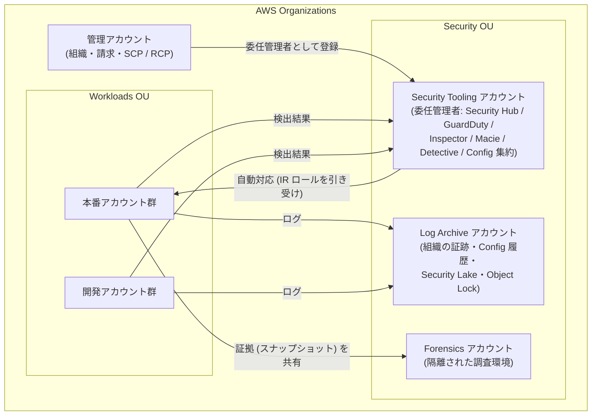
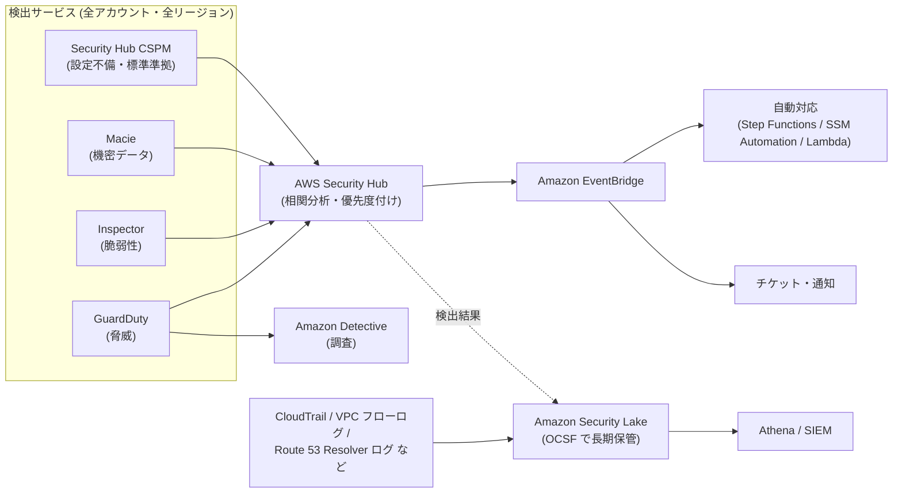

[ホーム](../README.md) > [Phase 3: プロフェッショナル](README.md) > セキュリティとコンプライアンスのアーキテクチャ

# セキュリティとコンプライアンスのアーキテクチャ

> **この章のゴール**
> - 組織全体のセキュリティ基盤（Security Tooling / Log Archive / Forensics アカウントと委任管理者）を設計できる
> - AWS Security Hub と AWS Security Hub CSPM、GuardDuty、Inspector、Macie、Detective、Security Lake の役割を区別し、検出を集中化できる
> - EventBridge を起点にしたインシデント対応の自動化（隔離・証拠保全・通知）を設計できる
> - KMS のキー戦略とキーポリシー（クロスアカウント、`kms:ViaService`、暗号化コンテキスト、グラント、マルチリージョンキー、カスタムキーストア）を要件から選べる
> - ポスト量子暗号の脅威と AWS の現在の対応範囲を正確に説明し、移行計画を立てられる
> - Firewall Manager、Config、Security Hub CSPM を使って、組織全体のインフラ保護とコンプライアンスを一元化できる
>
> **対応試験**: SAP-C03（ドメイン2: セキュリティ、コンプライアンス、ガバナンス（仮訳）ほか）
> **目安時間**: 読む 150分 / 確認問題 40分

> [!NOTE]
> この章は [セキュリティサービス（KMS / WAF / GuardDuty ほか）](../02-associate/12-security-services.md) の内容を前提にします。各サービスの基本機能はそちらで復習してください。
> OU・SCP・RCP は [マルチアカウント戦略とガバナンス](02-multi-account-governance.md)、IAM Identity Center や ABAC は [大規模な ID とアクセス管理](03-identity-federation.md)、Network Firewall の配置は [高度なネットワーク設計](04-advanced-networking.md) で扱います。

## この章の全体像

SAA では「GuardDuty は脅威検出」「KMS は暗号鍵の管理」のように、サービス単位の理解で十分でした。SAP では問いが変わります。**数百のアカウントと複数のリージョンにまたがる組織で、検出・対応・データ保護・監査証跡をどう一元化し、どう自動化するか** が問われます。

まず、この章全体で前提にする組織構成を示します。AWS が公開している AWS Security Reference Architecture（AWS SRA）に沿った、標準的な形です。

この図の要点は 3 つです。

1. 管理アカウントは組織の管理だけに使い、セキュリティサービスの運用は **Security Tooling アカウント（委任管理者）** に任せる。
2. ログは **Log Archive アカウント** に集め、ワークロードの管理者でも消せないようにする。
3. 侵害時の証拠は **Forensics アカウント** に集め、本番環境から切り離して調査する。

| 節 | テーマ | SAP での主な問われ方 |
|---|---|---|
| 1〜2 | 設計原則・組織の基盤 | 管理アカウントを使わずに、全アカウントへ自動で展開するには |
| 3 | 検出の集中化 | どの検出サービスを、どのアカウントで、どう集約するか |
| 4 | インシデント対応 | 隔離・証拠保全・通知をどう自動化するか |
| 5〜6 | データ保護・ポスト量子暗号 | キーの粒度、クロスアカウント、鍵の保管場所、PQC の対応範囲 |
| 7〜8 | 秘密情報・インフラ保護 | ローテーション方式、Firewall Manager による強制 |
| 9〜11 | コンプライアンス・ワークロード保護・ログ | 準拠の証跡、データレジデンシー、改ざんできないログ |

## 1. 設計原則

### 1.1 セキュリティの柱の 7 つの設計原則

AWS Well-Architected フレームワークのセキュリティの柱は、次の 7 つの設計原則を挙げています。SAP の選択肢は、どれも「動く」ことが多いため、**どの原則をより多く満たすか** が判断の軸になります。

| 設計原則 | 意味 | 組織レベルの代表的な実装 |
|---|---|---|
| 強力なアイデンティティ基盤を実装する | 最小権限、職務の分離、長期の認証情報をなくす | IAM Identity Center、IAM ロール、SCP / RCP |
| トレーサビリティを維持する | 誰が・いつ・何をしたかを常に追える | 組織の証跡（CloudTrail）、Config、VPC フローログ |
| すべてのレイヤーでセキュリティを適用する（多層防御） | エッジ・ネットワーク・ホスト・アプリ・データの各層で守る | Shield / WAF / Network Firewall / セキュリティグループ / KMS |
| セキュリティのベストプラクティスを自動化する | 統制と修復をコードで行い、人手に頼らない | Config の自動修復、EventBridge、Firewall Manager |
| 転送中および保管中のデータを保護する | データの分類に応じて暗号化・トークン化する | KMS、ACM、VPC Encryption Controls |
| データに人の手が届かないようにする | 直接アクセスを減らし、ツール経由にする | Session Manager、SSM Automation、ダッシュボード |
| セキュリティイベントに備える | 手順・ツール・訓練を事前に用意する | IR ランブック、Forensics アカウント、ゲームデー |

### 1.2 予防・検出・対応・復旧の 4 層で考える

コントロールは、働くタイミングで 4 つに分けると整理しやすくなります。

| 層 | 目的 | 組織レベルの代表的な仕組み |
|---|---|---|
| 予防（Preventive） | 危険な操作をそもそもできなくする | SCP / RCP / 宣言型ポリシー、Control Tower の予防コントロール、S3 ブロックパブリックアクセス |
| 検出（Detective） | 起きたこと・危険な状態を見つける | GuardDuty、Security Hub CSPM、Config ルール、Inspector、Macie、IAM Access Analyzer |
| 対応（Responsive） | 見つけたものを隔離・修正する | EventBridge + Step Functions / SSM Automation / Lambda、Config の自動修復 |
| 復旧（Recovery） | 被害から業務を戻す | AWS Backup（Vault Lock）、IaC による再構築（→ [回復力と事業継続](06-resilience-business-continuity.md)） |

> [!TIP]
> **試験のポイント**: 問題文の動詞に注目します。「防ぐ（prevent）」「できないようにする」→ 予防的コントロール（SCP / RCP / 宣言型ポリシー）。「検出して通知する」→ Config / Security Hub CSPM / GuardDuty。「自動的に修正する」→ Config の自動修復、EventBridge + SSM Automation。

> [!WARNING]
> **ひっかけ注意**: SCP は **管理アカウントには効かず**、サービスにリンクされたロールにも効きません。また SCP は権限を「与える」ものではなく「上限を決める」ものです。管理アカウントで日常業務をしない設計が前提になるのはこのためです（詳しくは [マルチアカウント戦略とガバナンス](02-multi-account-governance.md)）。

## 2. 組織全体のセキュリティ基盤

### 2.1 アカウント構成

| アカウント | 役割 | 主な中身 | アクセスできる人 |
|---|---|---|---|
| 管理アカウント | 組織・請求・ポリシーの管理 | Organizations、SCP / RCP、委任管理者の登録 | ごく少数の管理者 |
| Security Tooling（Control Tower では Audit アカウント） | セキュリティサービスの委任管理者 | Security Hub / Security Hub CSPM、GuardDuty、Inspector、Macie、Detective、Config アグリゲーター、Firewall Manager、IAM Access Analyzer、IR の自動化 | セキュリティチーム |
| Log Archive | ログの長期保管 | 組織の証跡の S3 バケット、Config の設定履歴、VPC フローログ、Security Lake のデータ | 原則として読み取り専用の監査担当のみ |
| Forensics | 侵害調査 | 隔離された VPC、調査用インスタンス、共有されたスナップショット、証拠保管用 S3 | インシデント対応（IR）チーム |
| ワークロード（本番・開発など） | アプリケーション | 各セキュリティサービスのメンバーアカウントとして自動登録される | 各チーム |

> [!NOTE]
> AWS Control Tower でランディングゾーンを作ると、Security OU に **Log Archive** と **Audit** の 2 つの共有アカウントが作られます。Audit アカウントが、ここでいう Security Tooling アカウントに相当します。Forensics アカウントは自分で追加します。

### 2.2 委任管理者（delegated administrator）

**なぜ委任するのか**: 管理アカウントには SCP が効かず、組織全体を変更できる強い権限があります。ここでセキュリティサービスを日常的に運用すると、操作ミスや認証情報の漏えいの影響が組織全体に及びます。そこで、各サービスの管理を **Security Tooling アカウントに委任** し、管理アカウントの利用を最小限にします。

委任管理者は、組織内のアカウントをメンバーとして一括管理し、**新しく作られたアカウントも自動で有効化（auto-enable）** できます。

| サービス | 委任管理者 | 新規アカウントの自動有効化 | 範囲 |
|---|---|---|---|
| GuardDuty | ○ | ○（全アカウント / 新規のみを選択） | リージョンごと |
| Security Hub CSPM | ○ | ○（中央設定の設定ポリシー） | リージョンごと（中央設定とクロスリージョン集約でホームリージョンから一括管理） |
| Inspector | ○ | ○ | リージョンごと |
| Macie | ○ | ○ | リージョンごと |
| Detective | ○ | ○ | リージョンごと |
| Security Lake | ○ | ○（ログソースの収集対象） | ロールアップリージョンに集約できる |
| Config | ○（組織ルール・コンフォーマンスパック・アグリゲーター） | 記録（レコーダー）の有効化は各アカウントで必要（Control Tower などで展開） | リージョンごと |
| Firewall Manager | ○ | ポリシーの範囲内のアカウント・リソースに自動適用 | リージョンごと（CloudFront などのグローバルリソースは別扱い） |
| IAM Access Analyzer | ○ | 組織を信頼ゾーンとするアナライザー | リージョンごと |

> [!IMPORTANT]
> GuardDuty、Inspector、Macie、Detective、Security Hub CSPM は **リージョン単位のサービス** です。攻撃者は、あなたが使っていないリージョンにもリソースを作れます。**すべての有効なリージョンで有効化する** か、**SCP や Control Tower のリージョン拒否で使わないリージョンを封じる** 必要があります（実務では両方を行います）。

> [!TIP]
> **試験のポイント**: 「管理アカウントでの作業を最小化したい」「今後作成されるアカウントも自動的に対象にしたい」「運用上のオーバーヘッドを最小に」→ **委任管理者 + 自動有効化**。各アカウントに StackSets で個別に有効化する選択肢や、招待（メール）ベースでメンバーを追加する選択肢は、運用負荷が高いか旧来の方法です。

### 2.3 組織ポリシーでセキュリティ設定を固定する

Organizations のポリシーは SCP だけではありません。セキュリティに関係する主なポリシータイプは次のとおりです（詳細は [マルチアカウント戦略とガバナンス](02-multi-account-governance.md)）。

| ポリシータイプ | 何を固定するか | 例 |
|---|---|---|
| SCP | IAM プリンシパルが使える権限の上限 | 許可リージョン以外の操作を拒否、CloudTrail の停止を拒否 |
| RCP（リソースコントロールポリシー） | リソースに対するアクセスの上限 | 組織外のプリンシパルによる S3 や KMS へのアクセスを拒否 |
| 宣言型ポリシー（EC2 など） | サービスの設定そのもの | IMDSv2 の強制、AMI やスナップショットのパブリック共有の禁止、VPC ブロックパブリックアクセス |
| Security Hub ポリシー / Inspector ポリシー | サービスの有効化状態などの一元管理 | 組織全体で Security Hub や Inspector を有効化する |
| バックアップポリシー | バックアッププラン | 全アカウントに共通のバックアップを適用（→ 次章） |

## 3. 検出の集中化

### 3.1 全体像

検出の仕組みは、**検出 → 集約・相関 → 対応 → 調査・長期分析** の 4 段で考えます。

### 3.2 AWS Security Hub と AWS Security Hub CSPM

2025 年に、従来の AWS Security Hub は **AWS Security Hub CSPM** に名称が変わりました。そして同じ「AWS Security Hub」の名前で、**新しい統合版の Security Hub**（2025-12-02 GA）が登場しました。SAP ではこの 2 つを区別する必要があります。

| 観点 | AWS Security Hub CSPM（旧 AWS Security Hub） | AWS Security Hub（2025年12月 GA の統合版） |
|---|---|---|
| 主な役割 | クラウドセキュリティ態勢管理（CSPM）: セキュリティ標準に基づく設定チェック | GuardDuty・Inspector・Macie・Security Hub CSPM のシグナルを相関分析し、対処すべきリスクに優先順位を付ける |
| 代表的な機能 | セキュリティ標準とコントロール、セキュリティスコア、中央設定、クロスリージョン集約、自動化ルール | 露出（exposure）の検出結果、攻撃パスの可視化、リスクの優先度付け、チケット連携などの対応ワークフロー |
| 検出結果の形式 | AWS Security Finding Format（ASFF） | OCSF（Open Cybersecurity Schema Framework） |
| 位置づけ | 統合版 Security Hub のデータソースの 1 つとして引き続き使う | 検出と対応の「入口」 |

**露出の検出結果** とは、単独では中程度の問題を組み合わせて「本当に危ないもの」を示す検出結果です。たとえば「インターネットから到達できる」「重大な脆弱性がある」「強い IAM 権限を持つ」という 3 つの条件がそろった EC2 インスタンスは、個別の検出結果よりはるかに優先度が高くなります。

Security Hub CSPM で SAP に出やすい機能は次のとおりです。

- **中央設定（central configuration）**: 委任管理者がホームリージョンで「設定ポリシー」を作り、OU やアカウント単位で有効化・セキュリティ標準・コントロールを一括管理します。
- **クロスリージョン集約**: 集約リージョンに、他のリージョンの検出結果を集めます。
- **自動化ルール**: 条件に一致した検出結果の重大度やワークフローの状態を自動で更新します（例: 開発アカウントの特定コントロールの重大度を下げる）。
- **EventBridge 連携**: 検出結果は自動で EventBridge に送られるため、自動対応の起点になります。

> [!WARNING]
> **ひっかけ注意**: 試験や古い教材の「Security Hub」は、多くの場合、現在の **Security Hub CSPM** の機能（セキュリティ標準、ASFF、検出結果の集約）を指しています。問題文の要求が「CIS や PCI DSS への準拠状況のチェック」なのか、「脆弱性・脅威・設定不備を関連付けた優先度付け」なのかで、どちらの機能を指すかを判断してください。

> [!TIP]
> **試験のポイント**: 「CIS / PCI DSS / AWS 基礎セキュリティのベストプラクティス（FSBP）への準拠状況を組織全体でスコア化」→ Security Hub CSPM の標準 + 中央設定。「脆弱性・設定不備・脅威・機密データを関連付け、本当に危ないリソースから対処」→ 統合版 Security Hub。

### 3.3 Amazon GuardDuty

GuardDuty は、**CloudTrail の管理イベント、VPC フローログ、Route 53 Resolver の DNS クエリログ** を基本のデータソースとして分析します。これらのログは GuardDuty が独自に取得するため、利用者が VPC フローログなどを有効化する必要はありません（逆に、GuardDuty がログを保管してくれるわけでもありません）。基本のデータソースに加えて、**保護プラン** で対象を広げます。

| 保護プラン | 分析対象 | 検出の例 |
|---|---|---|
| S3 Protection | S3 のデータイベント | 通常と異なる場所からの大量の GetObject、悪性 IP からのアクセス |
| EKS Protection | EKS の監査ログ | 匿名アクセス、特権コンテナの作成 |
| Runtime Monitoring | EKS / ECS（Fargate・EC2）/ EC2 の OS レベルのイベント（エージェント） | 暗号通貨マイニング、リバースシェル、権限昇格 |
| Malware Protection for EC2 | 検出結果をきっかけに EBS ボリュームをエージェントレスでスキャン | マルウェアの感染 |
| Malware Protection for S3 | 新しくアップロードされたオブジェクト | マルウェアを含むファイルのアップロード |
| RDS Protection | Aurora などへのログインアクティビティ | 総当たり攻撃、不審なログイン |
| Lambda Protection | Lambda 関数のネットワークアクティビティ | 悪性ドメインとの通信 |

**組織全体での有効化**: 委任管理者をリージョンごとに指定し、自動有効化を「組織内のすべてのアカウント」または「新規アカウントのみ」に設定します。保護プランも組織の設定として自動で有効化できます。委任管理者はメンバーの検出結果をすべて参照でき、抑制ルール・信頼できる IP リスト・脅威リストを一元管理します。検出結果の保持期間は 90 日なので、長期保管が必要なら S3 へのエクスポート（KMS で暗号化）を設定します。

**Extended Threat Detection**（2024年12月〜）は、複数のデータソースとリソースにまたがる **多段階の攻撃（attack sequence）** を、時間をかけて相関分析し、1 つの重大度「Critical」の検出結果として示す機能です。たとえば「認証情報の侵害 → 探索 → 権限昇格 → S3 からのデータ持ち出し」という一連の流れを、個別のアラートではなく 1 つのストーリーとして提示し、MITRE ATT&CK の戦術に対応付けます。GuardDuty を有効にすると追加料金なしで使え、有効にしている保護プランが多いほど検出できる範囲が広がります。

> [!TIP]
> **試験のポイント**: 「個々のアラートではなく、複数段階にわたる攻撃の流れとして検出したい」→ GuardDuty Extended Threat Detection。「コンテナやインスタンス内部のプロセスレベルの脅威」→ GuardDuty Runtime Monitoring。

> [!WARNING]
> **ひっかけ注意**: GuardDuty は **検出** サービスで、通信を遮断しません。遮断は、EventBridge を起点にした自動対応や、Network Firewall・AWS WAF・Route 53 Resolver DNS Firewall で行います。

### 3.4 Amazon Inspector

Inspector は、ソフトウェアの脆弱性（CVE）と意図しないネットワーク露出を継続的に検出します。

- **EC2**: SSM エージェントを使うスキャンと、EBS スナップショットを使うエージェントレススキャンを組み合わせられます。
- **ECR のコンテナイメージ**: 拡張スキャンとして、プッシュ時と、新しい CVE が公開されたときに継続的に再スキャンします。
- **Lambda**: 関数のパッケージの脆弱性と、関数コードの脆弱性をスキャンします。
- **コードセキュリティ**（2025-06-17 GA）: ソースコードリポジトリや CI/CD と連携し、SAST（静的解析）、SCA（依存ライブラリの解析）、IaC のスキャンを行います。
- **Inspector スコア**: CVSS を、ネットワーク到達性やエクスプロイトの有無など環境に合わせて調整し、優先度付けに使います。SBOM（ソフトウェア部品表）のエクスポートにも対応します。

組織では、委任管理者と自動有効化（および Organizations の Inspector ポリシー）で全アカウントに展開します。

> [!TIP]
> **試験のポイント**: 「デプロイ前にパイプラインでイメージやコードの脆弱性を検出」→ Inspector の CI/CD 連携・コードセキュリティ。「ECR にあるイメージを、新しい CVE に対して継続的に再スキャン」→ ECR の拡張スキャン（Inspector）。

### 3.5 Amazon Macie

Macie は S3 に保存されたデータから、個人情報・認証情報・金融情報などの **機密データを検出** します。マネージドデータ識別子に加え、正規表現とキーワードによるカスタムデータ識別子、許可リストを使えます。

| 方式 | 仕組み | 向いている用途 |
|---|---|---|
| 自動化された機密データ検出 | 組織全体の S3 バケットから、オブジェクトを継続的にサンプリングして分析し、バケットごとの機密度スコアを出す | 数千のバケットの「どこに機密データがありそうか」を低コストで把握する |
| 機密データ検出ジョブ | 指定したバケット（条件）を 1 回または定期的に全件検査する | 特定のバケットを詳しく調べる、監査の証跡を残す |

Macie はこれとは別に、バケットの公開や暗号化の無効化などを示す **ポリシーの検出結果** も生成します。検出結果は Security Hub と EventBridge に送られ、詳細な検出結果は KMS で暗号化した S3 バケットに保存します。

### 3.6 Amazon Detective

Detective は、CloudTrail、VPC フローログ、GuardDuty の検出結果などから **動作グラフ（behavior graph）** を作り、IAM ロール・IP アドレス・インスタンスなどの関係と、平常時からの変化を可視化します。最大 1 年分のデータを使って、「この IP アドレスは他にどのリソースと通信したか」「このロールは普段と違う操作をしたか」を調べられます。関連する検出結果とエンティティは **検出結果グループ** にまとめられます。

GuardDuty が「何かが起きた」を知らせるのに対し、Detective は「何が原因で、どこまで広がったか」を調べるためのサービスです。

### 3.7 Amazon Security Lake と OCSF

Security Lake は、セキュリティ関連のログとイベントを **OCSF（Open Cybersecurity Schema Framework）** 形式に正規化し、**自社アカウントの S3** にデータレイクとして集約するサービスです。データは Apache Parquet 形式で保存され、Lake Formation と Glue データカタログで管理されます。

- **AWS のネイティブソース**: CloudTrail（管理イベント、S3 / Lambda のデータイベント）、VPC フローログ、Route 53 Resolver クエリログ、Security Hub の検出結果、EKS 監査ログ、AWS WAF のログなど。
- **カスタムソース**: サードパーティ製品のログを OCSF 形式で取り込めます。
- **ロールアップリージョン**: 複数リージョンのデータを 1 つのリージョンに集約できます。保持期間はライフサイクル設定で管理します。
- **サブスクライバー**: SIEM などに S3 のデータと通知を渡す「データアクセス」と、Lake Formation の共有を通じて Athena などで直接クエリする「クエリアクセス」があります。

OCSF という共通スキーマにそろえることで、ツールごとにログの形式を変換する手間を省けます。

| 観点 | Security Hub（CSPM を含む） | Security Lake | SIEM（サードパーティ / OpenSearch など） |
|---|---|---|---|
| 扱うデータ | 検出結果 | 生ログ + 検出結果（OCSF） | 取り込んだログとイベント |
| 主な目的 | 優先度付けと対応 | 長期保管、横断分析、他のツールへの供給 | 相関分析、アラート、ダッシュボード |
| データの置き場所 | サービス内 | 自社アカウントの S3 | ツール側 |

> [!WARNING]
> **ひっかけ注意**: Security Lake はログの「置き場所と形式」を統一するサービスで、脅威の検出そのものは行いません。検出は GuardDuty、分析は Athena や SIEM が担います。

### 3.8 検出サービスの選び方

| 問題文のキーワード | 選ぶサービス |
|---|---|
| 悪意のある IP との通信、暗号通貨マイニング、認証情報の異常な使用 | GuardDuty |
| 多段階の攻撃を 1 つの検出結果として把握 | GuardDuty Extended Threat Detection |
| EC2 / ECR / Lambda の CVE、コードの脆弱性 | Inspector |
| S3 内の個人情報、機密データの所在 | Macie |
| CIS / PCI DSS / FSBP への準拠状況 | Security Hub CSPM |
| 脆弱性・脅威・設定不備を関連付けた優先度付け | Security Hub（統合版） |
| 根本原因の調査、影響範囲の可視化 | Detective |
| OCSF、ログの長期保管、SIEM へのデータ供給 | Security Lake |
| 外部と共有されているリソース、未使用のアクセス権限 | IAM Access Analyzer |
| リソース設定の変更履歴と、ルールへの準拠状況 | Config |

