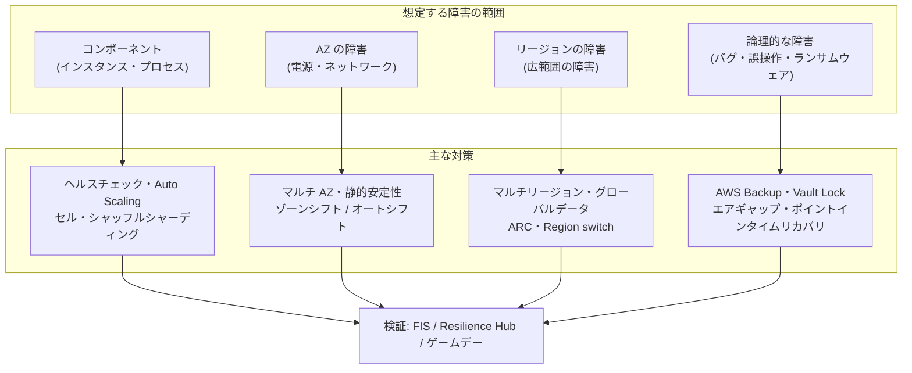
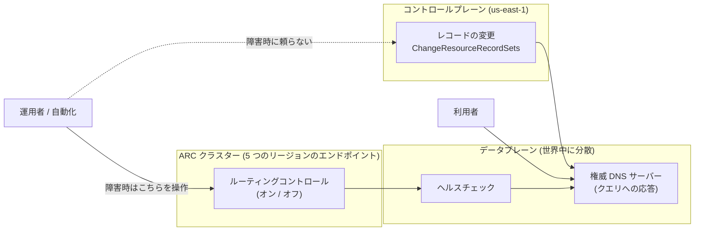
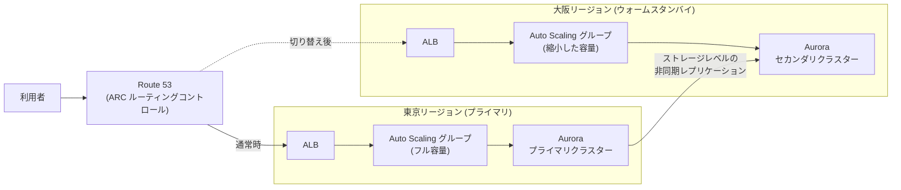
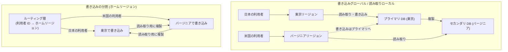
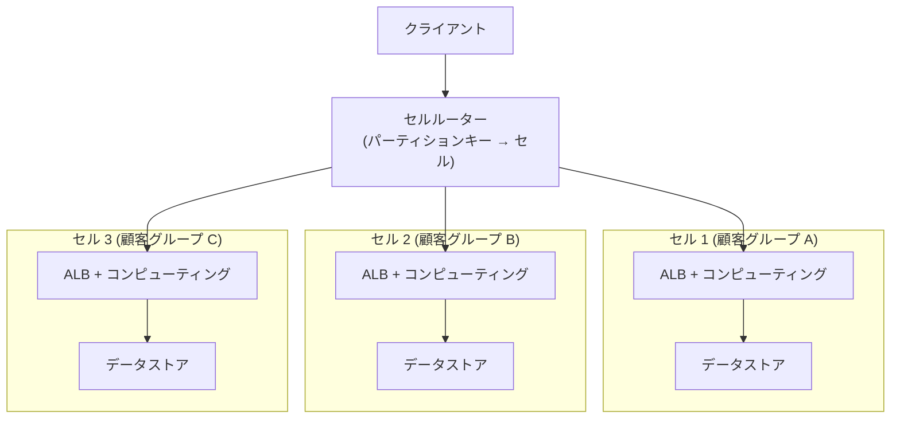
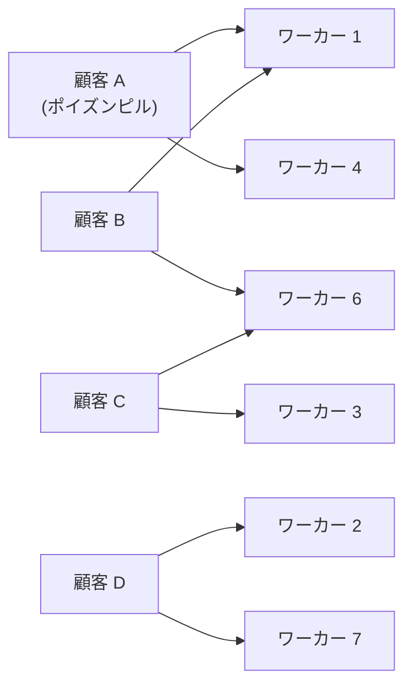
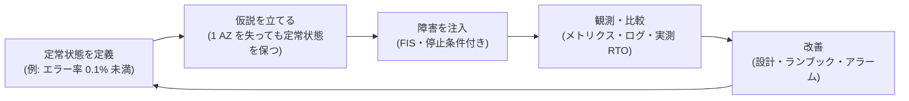
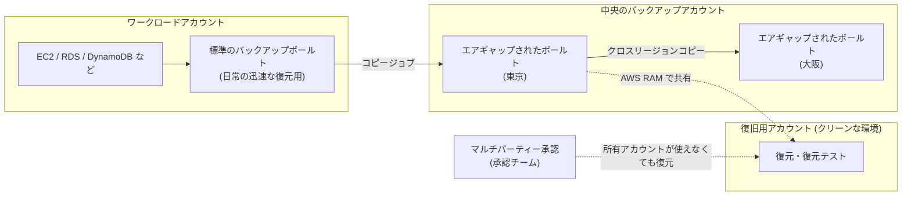

[ホーム](../README.md) > [Phase 3: プロフェッショナル](README.md) > 回復力と事業継続

# 回復力と事業継続

> **この章のゴール**
> - 影響範囲の縮小、静的安定性、コントロールプレーンとデータプレーンの違いから、回復力の高い設計を説明できる
> - マルチ AZ で十分か、マルチリージョンが必要かを、要件（RTO / RPO・規制・コスト）から判断できる
> - マルチリージョンのパターンと書き込みの扱い（書き込みグローバル / 読み取りローカル、書き込みの分割）を選べる
> - セルベースアーキテクチャとシャッフルシャーディングで障害の影響範囲を小さくする仕組みを説明できる
> - Aurora Global Database、DynamoDB グローバルテーブル（MREC / MRSC）、Aurora DSQL、S3 のレプリケーションを要件で使い分けられる
> - ARC（ルーティングコントロール、ゾーンシフト、Region switch）で切り替えを設計し、FIS・Resilience Hub で検証できる
> - ランサムウェアに耐えるバックアップ（Vault Lock、論理的にエアギャップされたボールト）と Elastic Disaster Recovery を設計できる
>
> **対応試験**: SAP-C03（ドメイン4: 回復力、移行、事業継続（仮訳）ほか）
> **目安時間**: 読む 150分 / 確認問題 40分

> [!NOTE]
> この章は [高可用性と災害対策](../02-associate/15-high-availability-dr.md)（RTO / RPO、4 つの DR 戦略、マルチ AZ、Route 53 のフェイルオーバー）の内容を前提にします。データベースの基本は [データベース](../02-associate/07-databases.md)、Route 53 と Global Accelerator の基本は [Route 53・CloudFront・Global Accelerator](../02-associate/08-route53-cloudfront.md) で復習してください。

## この章の全体像

SAA では「RPO / RTO がこの値なら、どの DR 戦略か」が問われました。SAP では、さらに次のような問いに答える必要があります。

- どの範囲の障害（インスタンス、AZ、リージョン、誤操作やランサムウェア）に耐えるべきか
- 障害の影響範囲を、どうやって一部の利用者に閉じ込めるか
- 切り替えの手順そのものが、障害を起こしているリージョンやコントロールプレーンに依存していないか
- 複数のリージョンで書き込むとき、データの整合性をどう扱うか
- 設計どおりに回復できることを、どうやって継続的に証明するか

図の右下が重要です。**レプリケーションは物理的な障害には強いものの、論理的な障害（誤った削除、データの破損、ランサムウェアによる暗号化）もそのまま複製します**。論理的な障害から守るのは、変更できないバックアップです。

| 節 | テーマ | SAP での主な問われ方 |
|---|---|---|
| 1〜2 | 回復力の考え方・マルチ AZ とマルチリージョン | 障害時にコントロールプレーンに依存しない設計はどれか |
| 3〜4 | マルチリージョンのパターン・セル | 書き込みをどう扱うか、影響範囲をどう限定するか |
| 5 | データ層 | RPO 0 や強い整合性が必要なとき、どのデータストアを選ぶか |
| 6 | トラフィック制御 | どの仕組みで、どう安全に切り替えるか |
| 7 | 検証 | 回復できることをどう証明するか |
| 8〜10 | バックアップ・DRS・事前確保 | ランサムウェア対策、サーバーの DR、DR リージョンの容量 |

## 1. 回復力の考え方

### 1.1 影響範囲（blast radius）を小さくする

障害は必ず起こります。設計で制御できるのは、**障害が起きたときに影響を受ける範囲** です。AWS 自身も、次の **障害分離の境界** でサービスを作っています。

| 境界 | 例 | 設計への反映 |
|---|---|---|
| AZ | EC2 インスタンス、EBS ボリューム、サブネット（ゾーン単位のサービス） | 複数の AZ に分散し、AZ 単位で切り離せるようにする |
| リージョン | S3、DynamoDB、Lambda（リージョン単位のサービス） | リージョンをまたぐ依存を減らし、リージョンごとに独立して動けるようにする |
| グローバル | IAM、Route 53、CloudFront、Organizations | コントロールプレーンが特定のリージョンにあることを意識する（1.3） |
| アカウント | クォータ、権限、請求 | ワークロードや環境をアカウントで分ける |
| セル | 自分で作る独立した単位（4 節） | 利用者の一部だけに影響を閉じ込める |

**変更も障害の最大の原因の 1 つ** です。デプロイは 1 つの AZ・1 つのセル・1 つのリージョンずつ段階的に行い（ウェーブデプロイ）、問題があれば自動でロールバックします。

### 1.2 静的安定性（static stability）

**静的安定性** とは、依存先が故障しても、**何も変更せずに（新しいリソースを作らずに）動き続けられる** 性質です。障害の最中に「インスタンスを起動する」「設定を変える」といった操作は、その操作自体が失敗する可能性があります。

- **例: 容量の事前確保**。ピーク時に 6 台のインスタンスが必要なワークロードでは、1 つの AZ を失っても 6 台が残るように、2 つの AZ に 6 台ずつ（計 12 台）、または 3 つの AZ に 3 台ずつ（計 9 台）を常に配置します。AZ 障害のときに Auto Scaling で起動し直す設計は、起動（コントロールプレーンの操作）に依存するため、静的に安定していません。
- **例: AZ ごとの独立**。NAT ゲートウェイを AZ ごとに置き、各 AZ のサブネットが自分の AZ の NAT ゲートウェイを使えば、他の AZ の障害の影響を受けません。
- **例: 二峰性の回避**。平常時と障害時で動作がまったく変わる設計（障害時だけ使う経路やコード）は、いざというときに動かない危険があります。平常時から障害時と同じ仕組みを使い続けるのが理想です。

> [!TIP]
> **試験のポイント**: 「AZ 障害の間も、スケーリング操作なしで性能を維持したい」→ 障害時に必要な容量を、残りの AZ だけで満たせるように **事前に配置** する（静的安定性）。ゾーンオートシフトを有効にする場合も、AWS は容量の事前スケーリングを強く推奨しています（6.4）。

### 1.3 コントロールプレーンとデータプレーン

AWS のサービスは、2 つの部分に分けて考えられます。

- **コントロールプレーン**: リソースの作成・変更・削除を行う API（`RunInstances`、Route 53 の `ChangeResourceRecordSets` など）。処理が複雑で、依存するものが多くなります。
- **データプレーン**: リソースが提供する日々の機能（起動済みのインスタンスの動作、DNS クエリへの応答、S3 の GetObject など）。シンプルで、より高い可用性を目指して設計されています。

**回復の手順は、データプレーンの操作だけで完結させる** のが原則です。典型例が Route 53 です。

Route 53 のレコードの変更（コントロールプレーン）は米国東部（バージニア北部）リージョンにあります。一方、DNS クエリへの応答とヘルスチェック（データプレーン）は世界中に分散しています。そのため、「障害が起きたら Lambda 関数で DNS レコードを書き換える」設計は、コントロールプレーンに依存します。代わりに、**フェイルオーバーレコードとヘルスチェックを事前に作っておく** か、**ARC のルーティングコントロール**（状態の変更がデータプレーンの操作）で切り替えます。

| サービス | コントロールプレーン | データプレーン | 障害時の設計 |
|---|---|---|---|
| Route 53 | レコード・ホストゾーンの変更（us-east-1） | DNS の応答、ヘルスチェック | 事前に作ったフェイルオーバーレコード + ヘルスチェック、ARC |
| EC2 / Auto Scaling | インスタンスの起動・変更 | 起動済みのインスタンスの動作 | 必要な容量を事前に確保する |
| IAM | ロール・ポリシーの作成・変更（us-east-1） | 認証・認可（各リージョン） | DR で使うロールや権限を事前に作っておく |
| ELB | ロードバランサーの作成・設定変更 | リクエストの転送 | DR リージョンのロードバランサーを事前に作っておく |

> [!WARNING]
> **ひっかけ注意**: 「リージョン障害のときに、CloudFormation で DR リージョンにスタックを作成する」「障害を検知したら Route 53 のレコードを API で書き換える」という選択肢は、どちらもコントロールプレーンの操作に依存します。RTO が厳しい問題では、**事前に作っておき、データプレーンで切り替える** 選択肢を選びます。

## 2. マルチ AZ とマルチリージョンの判断

AZ は、電源・冷却・ネットワークが独立した、互いに離れた場所にあるデータセンター群です。**大半のワークロードは、マルチ AZ で十分に高い可用性を得られます**。マルチリージョンは、次のような理由がある場合に選びます。

| 観点 | マルチ AZ | マルチリージョン |
|---|---|---|
| 耐えられる障害 | インスタンス、データセンター、AZ | 上記 + リージョン全体に及ぶ障害 |
| データの複製 | 同期（RDS マルチ AZ、Aurora、DynamoDB など）が一般的で、RPO 0 にしやすい | 非同期が一般的で、RPO 0 には特別な仕組み（MRSC、Aurora DSQL）が必要 |
| レイテンシー | AZ 間は 1 桁ミリ秒程度 | リージョン間は数十〜数百ミリ秒 |
| コスト | AZ 間のデータ転送料金（東京の例: 各方向 0.01 USD/GB） | リージョン間のデータ転送料金（東京の例: 0.09 USD/GB）、リソースの重複、運用・テストの工数 |
| 複雑さ | 多くのマネージドサービスが組み込みで対応 | 切り替えの手順、データの整合性、設定の同期を自分で設計する |

（料金は 2026年9月時点、東京リージョンの例）

**マルチリージョンを選ぶ主な理由**

1. **リージョン全体の障害** に対して、マルチ AZ では満たせない RTO / RPO が求められる
2. **規制や事業継続計画（BCP）** で、地理的に離れた拠点での復旧が求められる
3. **世界中の利用者** に低いレイテンシーでサービスを提供したい
4. **データレジデンシー**: 国や地域ごとにデータを置く必要がある
5. 99.99% を超える **非常に高い可用性目標**（年間の停止時間は 99.99% で約 52.6 分、99.999% で約 5.3 分）

> [!WARNING]
> **ひっかけ注意**: マルチリージョンにすれば可用性が自動的に上がるわけではありません。切り替えの仕組みそのものが新しい障害点になり、テストされていない切り替えは本番で失敗しがちです。「マルチリージョンにする」だけでなく、**切り替えの方法と定期的な検証** まで含めた選択肢を選びます。

## 3. マルチリージョンのパターン

### 3.1 DR 戦略の復習と SAP での見方

[高可用性と災害対策](../02-associate/15-high-availability-dr.md) で学んだ 4 つの戦略を、SAP の観点で整理し直します。

| 戦略 | RPO / RTO の目安 | DR リージョンの状態 | SAP で確認すべき点 |
|---|---|---|---|
| バックアップと復元 | 時間単位 / 時間単位 | バックアップのコピーと IaC だけ | バックアップの **クロスリージョン・クロスアカウントのコピー**、IaC での再構築の所要時間 |
| パイロットライト | 分単位 / 数十分 | データは常に複製、コンピューティングは停止または最小 | 起動（コントロールプレーン）に依存する。クォータと容量の事前確保（10 節） |
| ウォームスタンバイ | 秒〜分単位 / 分単位 | 縮小した構成で常時稼働 | 切り替え時のスケールアウトに頼るか、事前に容量を増やしておくか |
| マルチサイト（アクティブ/アクティブ） | ほぼ 0 / ほぼ 0 | フル容量で常時トラフィックを処理 | 書き込みの扱い（3.2）とコスト |

アクティブ/パッシブ（パイロットライト、ウォームスタンバイ、フル容量で待機するホットスタンバイ）は、**データは 1 つのリージョンで書き込み、もう 1 つのリージョンに複製** する形が基本です。

切り替えは、①トラフィックを止める（または減らす）→ ②データベースを昇格する → ③DR リージョンの容量を増やす → ④トラフィックを DR リージョンに向ける、の順序が重要です。順序を誤ると、両方のリージョンで書き込みが起きる **スプリットブレイン** や、容量不足での再障害を招きます。この手順を自動化・可視化するのが ARC の **Region switch**（6.5）です。

### 3.2 アクティブ/アクティブと書き込みの扱い

アクティブ/アクティブでは、**書き込みをどこで受け付けるか** が設計の中心になります。

| パターン | 仕組み | 長所 | 短所 | AWS の例 |
|---|---|---|---|---|
| 書き込みグローバル / 読み取りローカル | 書き込みは 1 つのプライマリリージョンに集め、読み取りは各リージョンのレプリカで行う | 書き込みの競合が起きない | 遠いリージョンの利用者は書き込みのレイテンシーが大きい。プライマリの切り替えが必要 | Aurora Global Database（書き込み転送）、DynamoDB グローバルテーブルを単一の書き込みリージョンで使う |
| 書き込みの分割（ホームリージョン） | 利用者やデータごとに「書き込みを受け付けるリージョン（ホーム）」を決める | 低レイテンシーで、競合も起きない | ルーティングが複雑。ホームリージョンの障害時の付け替えが必要 | 利用者 ID や国でパーティションを分け、ルーティング層でホームへ送る |
| どこでも書き込み | すべてのリージョンで書き込みを受け付ける | 最も低いレイテンシーと高い可用性 | 競合の解決（最終書き込み者優先）か、同期的な合意（レイテンシーの増加）が必要 | DynamoDB グローバルテーブル（MREC / MRSC）、Aurora DSQL |

> [!TIP]
> **試験のポイント**: 「同じ項目が複数のリージョンで同時に更新されることはない」「利用者は自分の国のリージョンで書き込む」→ 書き込みの分割、または DynamoDB グローバルテーブル（MREC）。「どのリージョンでも常に最新の値を読む必要があり、データ損失は許されない」→ DynamoDB の MRSC か Aurora DSQL。「リレーショナルで、書き込みは 1 リージョンで十分、各地から低レイテンシーで読みたい」→ Aurora Global Database。

## 4. セルベースアーキテクチャとシャッフルシャーディング

### 4.1 セルベースアーキテクチャ

マルチ AZ やマルチリージョンは、**インフラの障害** から守ります。しかし、不正なリクエスト（ポイズンピル）、設定ミスのデプロイ、特定の顧客による過負荷などは、すべての AZ・すべてのリージョンに同時に影響することがあります。

**セルベースアーキテクチャ** は、ワークロード全体（コンピューティングとデータ）を **セル** と呼ぶ独立した複製に分け、利用者の一部だけを各セルに割り当てます。

| 設計要素 | 考え方 |
|---|---|
| セルの独立性 | セル同士は状態を共有しない。1 つのセルの障害は、そのセルの利用者（全体の 1/N）にしか影響しない |
| パーティションキー | 顧客 ID・テナント ID など、リクエストを振り分ける単位。セルをまたぐ処理が生じないように選ぶ |
| セルルーター | できるだけ薄く単純にする（静的なマッピング、キャッシュ）。ルーター自身が単一障害点にならないようにする |
| セルの最大サイズ | テスト済みの上限を決め、成長は **セルを大きくする** のではなく **セルを増やす** ことで対応する |
| デプロイ | セルごとに段階的に展開し、最初のセルで問題が出たら止める |
| 代償 | セルごとのリソースによるコスト増、セル間の移行（顧客の移動）の仕組み、セル単位の監視が必要 |

### 4.2 シャッフルシャーディング

**シャッフルシャーディング** は、限られた数のワーカーで、利用者同士の影響をさらに小さくする手法です。

- **通常のシャーディング**: 8 台のワーカーを 2 台ずつ 4 つのシャードに分けると、ポイズンピルを送る顧客がいるシャードの全顧客（全体の 1/4）が影響を受けます。
- **シャッフルシャーディング**: 顧客ごとに、8 台から **ランダムな 2 台の組み合わせ** を割り当てます。組み合わせは 8C2 = **28 通り** です。ある顧客が自分の 2 台を壊しても、同じ 2 台の組み合わせを持つ顧客はごく一部で、多くの顧客は少なくとも 1 台の健全なワーカーを使い続けられます。

顧客 A のリクエストでワーカー 1 と 4 が停止しても、顧客 B はワーカー 6 で処理を続けられ、顧客 C と D は影響を受けません。ただし、クライアントが **失敗したら同じシャードの別のワーカーで再試行する** ことが前提です。

Route 53 はこの手法の代表例です。各ホストゾーンに、2,048 台の仮想ネームサーバーから 4 台を割り当てており、組み合わせは約 7,300 億通りになります。特定のドメインへの DDoS 攻撃が、他の顧客のドメインに波及しにくい仕組みです。

> [!TIP]
> **試験のポイント**: 「1 つのテナントの異常なリクエストや障害が、他のテナントに影響しないようにしたい（マルチテナント SaaS）」→ セルベースアーキテクチャ、シャッフルシャーディング。「マルチ AZ にしたのに、不正なリクエストで全 AZ のサーバーが同時に停止した」→ インフラの冗長化では防げない障害であり、セルによる分離が答えです。

## 5. データ層のマルチリージョン

コンピューティングは作り直せますが、データは作り直せません。マルチリージョン設計の難しさの大半は、データ層にあります。

### 5.1 Aurora Global Database

**仕組み**: プライマリリージョンの 1 つのクラスターだけが書き込みを受け付け、**ストレージレベルで** 最大 **10 のセカンダリリージョン** に非同期で複製します（2026年9月時点。複製の遅延は通常 1 秒未満）。データベースエンジンの処理を経由しないため、プライマリの性能への影響が小さいのが特徴です。

> [!NOTE]
> 試験や古い教材では、セカンダリリージョンの上限が「最大 5」と書かれている場合があります（2025年に 10 へ拡大）。

**スイッチオーバーとフェイルオーバー** の違いは頻出です。

| 観点 | スイッチオーバー（計画的） | フェイルオーバー（計画外） |
|---|---|---|
| 使う場面 | DR 訓練、リージョンのローテーション、メンテナンス | プライマリリージョンの障害 |
| データ損失 | **なし（RPO 0）**。複製が追いつくのを待ってから切り替える | 複製されていない分が失われうる（RPO は複製の遅延、通常は秒単位） |
| 前提 | プライマリとセカンダリの両方が正常 | プライマリに到達できなくても実行できる |
| 切り替え後 | 旧プライマリが自動でセカンダリになり、構成が維持される | 旧プライマリは回復後にセカンダリとして再同期させる |
| 備考 | 以前は「マネージド型の計画的フェイルオーバー」と呼ばれていた | CLI では `failover-global-cluster` に `--allow-data-loss` を指定する |

そのほかの重要な機能は次のとおりです。

- **書き込み転送**: セカンダリリージョンのアプリケーションが送った書き込みを、プライマリに自動で転送します。アプリケーションは、どのリージョンでも同じ接続先を使えます（書き込みのレイテンシーはプライマリまでの往復分だけ増えます）。
- **グローバルライターエンドポイント**: 常に現在のプライマリの書き込み用インスタンスを指すエンドポイントです。スイッチオーバーやフェイルオーバーの後も、アプリケーションの接続先を変える必要がありません。
- **RPO の上限（Aurora PostgreSQL）**: パラメーター `rds.global_db_rpo` を設定すると、複製の遅延がその値を超えたときにプライマリでのトランザクションを待たせ、データ損失の上限を保証できます。
- **ヘッドレスのセカンダリ**: セカンダリクラスターに DB インスタンスを置かずにストレージだけを複製すると、パイロットライトのコストを下げられます（切り替え時にインスタンスを追加するため、RTO は長くなります）。

> [!TIP]
> **試験のポイント**: 「DR 訓練でデータを失わずにリージョンを切り替え、元の構成に戻したい」→ **スイッチオーバー**。「プライマリリージョンが応答しない」→ **フェイルオーバー**（データ損失を許容）。「セカンダリリージョンのアプリケーションからも書き込みたいが、アプリケーションの改修は最小にしたい」→ **書き込み転送**。

### 5.2 DynamoDB グローバルテーブル（MREC と MRSC）

グローバルテーブルは、複数のリージョンのレプリカのどれにでも書き込める、マルチアクティブのテーブルです。2025年6月から、整合性のモードを 2 つから選べるようになりました。

| 観点 | MREC（マルチリージョンの結果整合性、既定） | MRSC（マルチリージョンの強い整合性） |
|---|---|---|
| リージョン間の整合性 | 結果整合性 | 強い整合性（どのリージョンでも最新の値を読める） |
| 複製の方式 | 非同期（通常 1 秒程度） | 同期（他のリージョンで確認されてから書き込みが完了） |
| RPO | 秒単位（未複製の書き込みが失われうる） | **0** |
| 書き込みのレイテンシー | 低い（ローカルで完了） | 高い（リージョン間の往復が加わる） |
| 同じ項目への同時書き込み | **最終書き込み者優先**（後の書き込みが勝つ） | 競合した書き込みはエラーになり、アプリケーションが再試行する |
| リージョンの数 | 任意 | **ちょうど 3**（レプリカ 3 つ、またはレプリカ 2 つ + ウィットネス 1 つ） |
| 主な制約 | ― | **TTL とトランザクションに非対応**。選べるリージョンの組み合わせにも制約がある |
| 向いている用途 | 大半のグローバルアプリケーション（プロファイル、カート、セッション） | RPO 0 が必須で、どこでも最新の値が必要（残高、在庫、予約） |

ウィットネスは、データの読み書きのエンドポイントを持たず、合意（クォーラム）にだけ参加するリージョンです。3 つ目のリージョンでアプリケーションを動かさない場合に使います。

> [!WARNING]
> **ひっかけ注意**: 「DynamoDB グローバルテーブルは結果整合性なので RPO 0 は不可能」は、MRSC の登場で **古い知識** になりました。一方で、MRSC は **3 リージョン固定** で、TTL やトランザクションを使うテーブルには使えません。問題文にこれらの条件がないか確認します。

### 5.3 Amazon Aurora DSQL

**Aurora DSQL**（2025年5月 GA）は、サーバーレスの分散 SQL データベースです。

- **PostgreSQL 互換** で、インスタンスの管理やスケーリングの設定が不要です。
- **マルチリージョンのアクティブ/アクティブ** 構成で、どちらのリージョンでも読み書きでき、**強い整合性** を保ちます。可用性の設計目標は、マルチリージョン構成で 99.999%、単一リージョン構成で 99.99% です。
- マルチリージョンのクラスターは、エンドポイントを持つ 2 つのリージョンのクラスターと、合意に参加する **ウィットネスリージョン** で構成されます。
- **楽観的同時実行制御**: トランザクションの競合はコミット時に検出され、アプリケーションが再試行します。
- PostgreSQL のすべての機能に対応しているわけではないため、既存のアプリケーションを移す前に互換性を確認します。

| 要件 | Aurora Global Database | Aurora DSQL | DynamoDB グローバルテーブル |
|---|---|---|---|
| データモデル | リレーショナル（MySQL / PostgreSQL と高い互換性） | リレーショナル（PostgreSQL 互換、一部の機能に制約） | キーバリュー / ドキュメント |
| 書き込み | プライマリの 1 リージョン（書き込み転送あり） | すべてのリージョン | すべてのリージョン |
| リージョン間の整合性 | 非同期複製（セカンダリは結果整合性） | 強い整合性 | MREC: 結果整合性 / MRSC: 強い整合性 |
| 計画外の切り替えの RPO | 秒単位 | 0 | MREC: 秒単位 / MRSC: 0 |
| 運用 | インスタンスの管理が必要（Serverless v2 も選べる） | サーバーレス | サーバーレス |

### 5.4 S3: CRR + RTC + マルチリージョンアクセスポイント

- **クロスリージョンレプリケーション（CRR）**: バケット間でオブジェクトを非同期に複製します。両方のバケットでバージョニングが必要です。既存のオブジェクトは S3 バッチレプリケーションで複製します。**レプリカの変更の同期** を有効にすると、双方向の複製（アクティブ/アクティブ）を構成できます。
- **S3 Replication Time Control（RTC）**: 新しいオブジェクトの **99.99% を 15 分以内に複製** することを SLA で保証し、複製の遅延のメトリクスと通知を提供します。「RPO 15 分を保証したい」ときに選びます。
- **マルチリージョンアクセスポイント**: 複数のリージョンのバケットを 1 つのグローバルなエンドポイントで扱い、リクエストを AWS のグローバルネットワーク経由で近いバケットに送ります。**フェイルオーバーコントロール** で各バケットをアクティブ / パッシブに設定し、数分でトラフィックを別のリージョンに切り替えられます。
  - アクセスポイント自身はデータを複製しません。**CRR（双方向）と組み合わせて使います**。
  - リクエストの署名には、マルチリージョンに対応した **SigV4A** が必要です（対応する AWS SDK を使います）。

### 5.5 ElastiCache Global Datastore

**Global Datastore**（Valkey / Redis OSS）は、プライマリクラスター（読み書き）の内容を、最大 2 つのセカンダリリージョンのクラスター（読み取り専用）に複製します（通常 1 秒未満の遅延）。プライマリリージョンの障害時は、セカンダリを **手動で昇格** します。Memcached は対象外です。セッションやキャッシュのウォームアップの時間を短くし、DR リージョンでの初期アクセス時の性能低下を防げます。なお、書き込みも複数リージョンで行いたいインメモリデータベースには、Amazon MemoryDB のマルチリージョン（アクティブ/アクティブ）もあります。

### 5.6 データ層の選び方

| 要件 | 選択 |
|---|---|
| リレーショナル、書き込みは 1 リージョン、各地から低レイテンシーで読む。RPO 秒・RTO 分 | Aurora Global Database |
| DR 訓練でデータを失わずにリージョンを切り替える | Aurora Global Database のスイッチオーバー |
| キーバリュー、どこでも書き込み、結果整合性でよい | DynamoDB グローバルテーブル（MREC） |
| キーバリュー、RPO 0、どのリージョンでも最新の値を読む | DynamoDB グローバルテーブル（MRSC） |
| リレーショナル、マルチリージョンのアクティブ/アクティブの書き込みと強い整合性、サーバーレス | Aurora DSQL |
| オブジェクト、15 分以内の複製を SLA で保証 | S3 CRR + RTC |
| オブジェクト、単一のエンドポイントと数分でのフェイルオーバー | S3 マルチリージョンアクセスポイント + フェイルオーバーコントロール |
| セッション・キャッシュのリージョン間複製 | ElastiCache Global Datastore |

> [!WARNING]
> **ひっかけ注意**: ここで挙げた複製の仕組みは、**誤った削除やデータの破損も数秒で複製します**。「誤操作やランサムウェアからの復旧」が要件にある場合は、レプリケーションではなく、ポイントインタイムリカバリ（PITR）や変更できないバックアップ（8 節）が答えになります。

## 6. トラフィック制御

### 6.1 Route 53 のフェイルオーバー

フェイルオーバールーティングは、プライマリのレコードのヘルスチェックが失敗すると、セカンダリのレコードを返します。

- **ヘルスチェックの種類**: エンドポイントのヘルスチェック（世界中のヘルスチェッカーから HTTP / HTTPS / TCP で確認）、他のヘルスチェックを組み合わせる **算出ヘルスチェック**、**CloudWatch アラームに基づくヘルスチェック**（ヘルスチェッカーから到達できないプライベートなリソースの監視に使う）。
- **エイリアスレコード** では「ターゲットのヘルスを評価」を有効にすると、ALB などの状態を反映できます。
- **TTL** を短く（例: 60 秒）しておかないと、クライアントのキャッシュのせいで切り替えが遅れます。TTL を無視してキャッシュし続けるクライアントもあります。

### 6.2 AWS Global Accelerator

Global Accelerator は、2 つの **静的なエニーキャスト IP アドレス** で利用者を受け、AWS のグローバルネットワーク経由で最適なリージョンのエンドポイントに届けます。

- **DNS のキャッシュに左右されない**: IP アドレスは変わらないため、切り替えはクライアントの DNS キャッシュを待たずに反映されます。
- **トラフィックダイヤル**: エンドポイントグループ（リージョン）ごとに、流すトラフィックの割合（0〜100%）を調整できます。リージョンを段階的に切り替えたり、メンテナンスのために特定のリージョンから退避したりできます。
- **向いている用途**: TCP / UDP のアプリケーション（ゲーム、IoT、VoIP）、固定 IP アドレスでの許可リストが必要な取引先、短時間での切り替え。

### 6.3 ARC ルーティングコントロール

自動のヘルスチェックによるフェイルオーバーは便利ですが、**部分的な劣化（グレー障害）を見逃したり、一時的な不調で切り替えと切り戻しを繰り返したり（フラッピング）** することがあります。重要なシステムでは、「切り替えるかどうかは人が判断し、切り替えそのものは確実に行う」仕組みが求められます。

**ARC（Amazon Application Recovery Controller。旧 Route 53 Application Recovery Controller）のルーティングコントロール** は、この要件のための仕組みです。

- **ルーティングコントロール** は、オン / オフのスイッチです。それぞれが Route 53 のヘルスチェックに対応付けられ、スイッチの状態に応じて DNS の応答が変わります。
- スイッチの状態は、**5 つのリージョンに分散したクラスターのエンドポイント** に対するデータプレーンの API で変更します。どれかのエンドポイントが使えなくても、別のエンドポイントで操作できます。
- **安全ルール**: 「少なくとも 1 つのリージョンは常にオン」（アサーションルール）、「マスタースイッチがオンのときだけ個別のスイッチを変更できる」（ゲーティングルール）などで、操作ミスによる全停止を防ぎます。

### 6.4 ゾーンシフトとゾーンオートシフト

AZ の障害では、「完全に停止」よりも「一部の通信だけが遅い・失敗する」グレー障害のほうが厄介です。ヘルスチェックに合格してしまうため、ロードバランサーはその AZ に通信を送り続けます。

- **ゾーンシフト**: 利用者の判断で、対応するリソース（ALB、NLB、EC2 Auto Scaling グループ、Amazon EKS など）のトラフィックを、特定の AZ から一時的に退避させます。有効期限を設定し、必要なら延長します。
- **ゾーンオートシフト**: AWS の内部のテレメトリーが AZ の障害を検知すると、**AWS が利用者に代わって** トラフィックを退避させ、AZ が回復すると元に戻します。ARC は個々のリソースの状態は見ないため、影響を受けていないリソースも退避の対象になることがあります。
  - **練習実行（practice run）が必須** です。ARC は **週に 1 回**、リソースごとに **約 30 分間** のゾーンシフトを実行し、1 つの AZ がなくてもアプリケーションが正常に動くことを確かめます。結果を判定するアラームと、練習実行を止めるためのアラーム・日時の設定を指定します。
  - AWS は、**各 AZ の容量を事前にスケーリングしておく** ことを強く推奨しています。オートシフトは Auto Scaling の完了を待たずに動くためです（1.2 の静的安定性）。
  - オートシフトと練習実行は EventBridge で通知を受けられます。

### 6.5 ARC Region switch

リージョンの切り替えは、データベースの昇格、DR リージョンの容量の拡張、トラフィックの切り替え、関係者の承認など、多くの手順を正しい順序で実行する必要があります。障害の最中に手作業で行うと、ミスが起きやすくなります。

**Region switch**（2025年8月 GA）は、この手順を **計画（plan）** としてコード化し、実行を自動化・可視化する機能です。

- **実行ブロック** を順番に、または並列に組み合わせてワークフローを作ります。例: **EC2 Auto Scaling**（DR リージョンの容量を、元のリージョンの容量の指定した割合まで増やす）、**Aurora Global Database**（スイッチオーバーまたはフェイルオーバー）、**ARC ルーティングコントロール**（トラフィックの切り替え）、**手動承認**、Lambda 関数による独自の処理など。2026年6月には Aurora のスケーリングと Amazon Neptune のグローバルデータベースのフェイルオーバーも追加されました。
- **アクティブ/パッシブ** と **アクティブ/アクティブ** の両方の計画を作れ、他のアカウントのリソースも扱えます。
- 計画は各リージョンに複製され、障害が起きたリージョンに依存せずに実行できます。
- 計画は **30 分ごとに自動で検証** され、リソースの構成や IAM の権限の問題を事前に検出します。実行中は各手順の進み具合が表示され、詳細なログが残ります。

> [!TIP]
> **試験のポイント**: 「リージョンの切り替え手順（DB の昇格、容量の拡張、DNS の切り替え）を、承認を挟みながら正しい順序で確実に実行し、手順が壊れていないかを継続的に確認したい」→ **ARC Region switch**。「人の判断でトラフィックを確実に切り替え、誤操作による全停止を防ぎたい」→ **ARC ルーティングコントロール + 安全ルール**。「AZ の障害から自動で退避したい」→ **ゾーンオートシフト**（練習実行が必須）。

### 6.6 readiness check（新規受付終了）

ARC の **readiness check**（リソースの設定やクォータが DR リージョンとそろっているかの確認）は、**2026年4月30日に新規受付を終了** しました（既存の利用者は継続利用可能）。新しい設計では、Region switch の計画の自動検証、Resilience Hub の評価（7.2）、Config ルールによる設定のずれの検出を組み合わせます。試験や古い教材では、readiness check が正解になっている場合があります。

### 6.7 トラフィック制御の選び方

| 仕組み | 切り替えの単位 | 切り替えの判断 | 典型的な用途 |
|---|---|---|---|
| Route 53 フェイルオーバー + ヘルスチェック | リージョン・エンドポイント | 自動（ヘルスチェック） | シンプルなアクティブ/パッシブ |
| Global Accelerator | リージョン（エンドポイントグループ） | 自動（ヘルスチェック）+ 手動（トラフィックダイヤル） | 固定 IP、TCP / UDP、DNS キャッシュに依存しない切り替え |
| ARC ルーティングコントロール | リージョン・セル | 人（安全ルール付き） | 誤った自動切り替えを避けたい重要システム |
| ゾーンシフト | AZ | 人 | グレー障害が起きた AZ からの退避 |
| ゾーンオートシフト | AZ | AWS（テレメトリー） | AZ 障害からの自動退避 |
| Region switch | アプリケーション全体（リージョン） | 人が開始し、手順は自動 | DB の昇格・容量の拡張・トラフィックの切り替えをまとめて実行 |

## 7. 検証 ― 回復できることを証明する

設計書に書いた RTO / RPO は、**実際に試すまでは仮説にすぎません**。検証の考え方は、カオスエンジニアリングのサイクルで表せます。

### 7.1 AWS Fault Injection Service（FIS）

**AWS FIS** は、AWS のリソースに制御された障害を注入するマネージドサービスです。実験は **実験テンプレート** で定義します。

| 要素 | 内容 |
|---|---|
| アクション | 注入する障害（インスタンスの停止、ネットワークの遮断、API エラーの注入など）。順序や並列実行を指定できる |
| ターゲット | 障害を注入するリソース。ARN・タグ・フィルターで選び、選択モード（`ALL`、`COUNT(n)`、`PERCENT(n)`）で範囲を絞る |
| 停止条件 | **CloudWatch アラーム**。アラーム状態になると実験を自動で止める（安全装置） |
| IAM ロール | FIS がアクションを実行するための権限。最小権限にする |
| ログ・レポート | 実験のログを CloudWatch Logs や S3 に出力する |
| 実験オプション | **マルチアカウント実験**（オーケストレーター用のアカウントから、複数のターゲットアカウントに障害を注入） |

| 分類 | アクションの例 |
|---|---|
| コンピューティング | `aws:ec2:stop-instances`、`aws:ec2:terminate-instances`、`aws:ec2:send-spot-instance-interruptions`、`aws:ecs:stop-task`、`aws:eks:terminate-nodegroup-instances` |
| OS 内部 | `aws:ssm:send-command`（SSM ドキュメントで CPU・メモリの負荷やネットワークの遅延を発生させる） |
| ネットワーク | `aws:network:disrupt-connectivity`（サブネットの通信を遮断） |
| データベース・ストレージ | `aws:rds:failover-db-cluster`、`aws:rds:reboot-db-instances`、`aws:ebs:pause-volume-io` |
| API | `aws:fis:inject-api-throttle-error`、`aws:fis:inject-api-internal-error`（AWS API の呼び出しにエラーを返す） |
| リージョン間 | S3 や DynamoDB グローバルテーブルのレプリケーションの一時停止、リージョン間の通信の遮断 |

**シナリオライブラリ** には、複数のアクションを組み合わせた、よく使う障害のテンプレートが用意されています。

| シナリオ | 再現する状況 |
|---|---|
| AZ Availability: Power Interruption | 1 つの AZ の電源喪失（その AZ のインスタンスの停止、EBS の I/O の停止、データベースのフェイルオーバーなど） |
| AZ: Application Slowdown | 1 つの AZ の中で、アプリケーションの通信に遅延を加える（グレー障害） |
| Cross-AZ: Traffic Slowdown | AZ 間の通信の遅延・パケットロス |
| Cross-Region: Connectivity | リージョン間の通信を遮断し、レプリケーションを一時停止する |

**安全に実験するための原則**

- まず本番以外の環境で行い、本番では小さな範囲（`COUNT(1)` など）から始める。
- 顧客への影響を表すメトリクス（エラー率、レイテンシー）の **停止条件** を必ず設定する。
- 実験の日時を関係者に知らせ、すぐに対応できる時間帯に行う。

> [!TIP]
> **試験のポイント**: 「本番環境で障害注入テストを行い、顧客への影響がしきい値を超えたら自動で止めたい」→ **FIS + 停止条件（CloudWatch アラーム）**。「AZ の電源喪失をまとめて再現したい」→ **シナリオライブラリ**。「複数のアカウントにまたがるワークロードで実験したい」→ **マルチアカウント実験**。ハンズオンは [Lab 13](../04-labs/lab13-fis-chaos.md) で行います。

### 7.2 AWS Resilience Hub

**Resilience Hub** は、アプリケーションが **RTO / RPO の目標を満たせる構成になっているか** を評価し、改善策を提案するサービスです。

1. **アプリケーションを定義する**: CloudFormation スタック、Terraform の状態ファイル、Amazon EKS クラスターなどからリソースを取り込みます。
2. **レジリエンシーポリシーを設定する**: 障害の種類（アプリケーション、インフラストラクチャ、AZ、リージョン）ごとに、目標の RTO と RPO を決めます。
3. **評価する**: 現在の構成で見積もった RTO / RPO と、ポリシーへの準拠状況、レジリエンシースコアが示されます。
4. **推奨事項を実装する**: 構成の改善（マルチ AZ 化、バックアップ、レプリケーション）に加え、**運用の推奨事項**（CloudWatch アラーム、標準作業手順（SOP）の SSM ドキュメント、**FIS の実験**）が提案されます。
5. **継続的に評価する**: CI/CD パイプラインに組み込み、変更で回復力が下がっていないか（ドリフト）を検出します。

2026年5月に GA となった **次世代の Resilience Hub** では、依存関係の自動検出、生成 AI による障害モードの分析、組み合わせて使えるモジュール型のポリシー、組織全体の回復力を一覧できるビューが加わりました。

> [!TIP]
> **試験のポイント**: 「多数のアプリケーションが、定めた RTO / RPO を満たしているかを継続的に評価し、足りない点の具体的な改善策（アラーム、SOP、FIS の実験）を得たい」→ **Resilience Hub**。障害を実際に起こして確かめるのは **FIS** です。両者は組み合わせて使います。

### 7.3 ゲームデー

**ゲームデー** は、本番に近い環境で障害を再現し、**システムだけでなく人とプロセス** を検証する演習です。FIS で障害を注入し、アラームが鳴るか、オンコール担当者に連絡が届くか、ランブックどおりに対応できるか、関係者や顧客への連絡が回るかまでを確かめます。

- 実測した RTO / RPO を記録し、目標と比べます。
- 終わったら振り返りを行い、原因と改善策（設計、アラーム、ランブック）をまとめて実行します。
- DR 訓練として、Aurora Global Database のスイッチオーバー、Region switch の計画の実行、Elastic Disaster Recovery のドリル、AWS Backup の復元テストを定期的に行います。

## 8. バックアップ戦略とランサムウェア対策

### 8.1 レプリケーションとバックアップの違い

| 観点 | レプリケーション | バックアップ |
|---|---|---|
| 目的 | 可用性（すぐに切り替える） | 復旧（過去の正常な時点に戻す） |
| 誤削除・破損・ランサムウェア | **そのまま複製される** | 過去の世代から戻せる |
| RPO | 秒〜ほぼ 0 | バックアップの間隔（連続バックアップ・PITR なら秒〜分） |
| 例 | Aurora Global Database、DynamoDB グローバルテーブル、S3 CRR | AWS Backup、PITR、スナップショット |

事業継続には **両方が必要** です。

### 8.2 AWS Backup を組織で管理する

- **バックアップポリシー**（Organizations のポリシータイプ）: 管理アカウントまたは委任管理者から、バックアッププラン（頻度、保持期間、コピー先）を OU 単位で配布します。対象のリソースはタグで選び、メンバーアカウントの管理者はポリシーを変更できません。
- **クロスアカウントのバックアップ**: 組織内の中央のバックアップアカウントのボールトにコピーします。**クロスリージョンのコピー** と組み合わせると、アカウントの侵害とリージョンの障害の両方に備えられます。
- **暗号化の注意**: RDS や EBS のように、バックアップが元のリソースのキーで暗号化されるリソースタイプでは、AWS マネージドキーで暗号化していると他のアカウントにコピーできません。**カスタマーマネージドキー** を使います（[セキュリティとコンプライアンスのアーキテクチャ](05-security-architecture.md) の 5.4 と同じ理由です）。
- **Backup Audit Manager**: AWS Backup の機能で、フレームワークとコントロール（すべての対象リソースがバックアップされているか、保持期間は十分か、クロスリージョンのコピーがあるかなど）で準拠状況を評価し、レポートを作成します。新規受付を終了した別サービスの AWS Audit Manager とは別物です。
- **SCP での保護**: メンバーアカウントでのボールトや復旧ポイントの削除、バックアップの設定の変更を SCP で拒否します。

### 8.3 AWS Backup Vault Lock

| モード | 内容 | 向いている用途 |
|---|---|---|
| ガバナンスモード | 十分な IAM 権限を持つユーザーは、ロックを解除・変更できる | 誤操作の防止、本番適用前のテスト |
| コンプライアンスモード | 猶予期間（最低 72 時間）が過ぎると、**ルートユーザーや AWS を含め誰もロックを解除・変更できない**。保持期間が終わるまで復旧ポイントを削除できない | 規制で求められる WORM、ランサムウェア対策 |

Vault Lock では、ボールトに入れられる復旧ポイントの **最小・最大の保持期間** も強制できます。

### 8.4 論理的にエアギャップされたボールト

**論理的にエアギャップされたボールト**（2024年8月 GA）は、ランサムウェアやアカウントの侵害に備えるための、特別なバックアップボールトです。

| 特徴 | 内容 |
|---|---|
| ロック | **常にコンプライアンスモードの Vault Lock** が設定される |
| 保管場所 | バックアップは **AWS Backup のサービスが所有するアカウント** に保管される |
| 暗号化 | 既定は AWS 所有キー（推奨）。カスタマーマネージドキー（別のアカウントのキーが望ましい）も選べる |
| 共有 | **AWS RAM** で個別のアカウント（組織外も可）と共有し、共有先のアカウントから直接復元できる（共有先はコピーを作れない）。OU や組織全体は共有先に指定できない |
| マルチパーティー承認（MPA） | ボールトを所有するアカウントにアクセスできなくなっても（閉鎖された場合も閉鎖後の一定期間は）、承認チームの承認を得て別のアカウントから復元・コピーできる |
| 使い方 | バックアッププランのコピー先にする。MPA を利用している場合は、最初のバックアップの保存先（プライマリ）にもできる |
| 保持期間 | 最小保持期間は 7 日以上で設定する |

AWS は、別のリージョンのエアギャップされたボールトへのコピーも推奨しています。

> [!TIP]
> **試験のポイント**: 「攻撃者にアカウントの管理者権限を奪われても、バックアップを削除されず、クリーンな別のアカウントから迅速に復元したい」→ **論理的にエアギャップされたボールト + AWS RAM での共有**（+ MPA）。通常のボールトにコンプライアンスモードの Vault Lock を設定するだけでは、削除は防げても、侵害されたアカウントの外からの迅速な復元はできません。

### 8.5 復元テスト

バックアップは、**復元できて初めて意味があります**。AWS Backup の **復元テスト** では、復元テスト計画に次の内容を設定し、自動で定期的に復元を試します。

- 頻度と、対象のリソースタイプ・タグ
- 使う復旧ポイント（最新、または一定期間内からランダム）
- 復元したリソースの検証（EventBridge で通知を受け、Lambda 関数などで検証して結果を報告）
- 検証後に、復元したリソースを自動で削除するまでの時間

復元にかかった時間が記録されるため、**RTO を満たせることの証拠** にもなります。

### 8.6 ランサムウェア対策のまとめ

| 段階 | 対策 |
|---|---|
| 予防 | バックアップの管理を別のアカウントに分離する。SCP で復旧ポイント・ボールトの削除やバックアップの設定の変更を拒否する。最小権限と MFA |
| 保護 | Vault Lock（コンプライアンスモード）、論理的にエアギャップされたボールト、S3 Object Lock |
| 検出 | GuardDuty（異常な API 呼び出し、マルウェアの検出）、バックアップジョブの失敗や大量削除の監視 |
| 復旧 | クリーンな復旧用アカウントへの復元、PITR で感染前の時点に戻す、復元テストで手順と所要時間を確認しておく |

## 9. AWS Elastic Disaster Recovery（AWS DRS）

**AWS Elastic Disaster Recovery** は、オンプレミスや他のクラウド、別のリージョンの EC2 にあるサーバーを、AWS に低コストで継続的に複製し、数分で復旧できるようにするサービスです。

- **仕組み**: ソースサーバーにエージェントを入れると、ターゲットリージョンの **ステージング領域** のサブネット（軽量なレプリケーションサーバーと低コストの EBS ボリューム）に、**ブロックレベルで継続的に** 複製されます。ポイントインタイムの復旧ポイントも保持します。
- **復旧とドリル**: 起動設定（EC2 起動テンプレート）に従ってリカバリインスタンスを起動します。**ドリル** は複製を止めずに実行でき、定期的な DR 訓練に使えます。
- **RPO は秒単位、RTO は分単位** が目安です。常時稼働するのはステージング領域だけなので、ウォームスタンバイより安く済みます。
- **フェイルバック**: 障害の復旧後、元の環境（オンプレミスや元のリージョン）へ逆方向に複製して戻せます。
- 2026年8月には、復旧の手順をまとめて扱う **Recovery Plans** の機能が追加されました（詳細は公式ドキュメントを確認してください）。

| 観点 | AWS DRS | AWS Backup のクロスリージョンコピー | AWS Application Migration Service（MGN） |
|---|---|---|---|
| 目的 | 継続的な DR | バックアップと復元 | 移行（1 回限りのカットオーバー） |
| RPO | 秒単位 | バックアップの間隔 | ― |
| RTO | 分単位 | 時間単位になることが多い | ― |
| 常時かかるコスト | ステージング領域 + サーバーごとの料金 | バックアップのストレージ | 移行期間中のみ |

> [!WARNING]
> **ひっかけ注意**: DRS と MGN は似た複製の仕組みを使いますが、**MGN は移行用**、**DRS は DR 用** です。「継続的な DR」「フェイルバック」「定期的なドリル」とあれば DRS を選びます（移行は [移行とモダナイゼーション](07-migration-modernization.md) で扱います）。

## 10. DR リージョンのクォータ・キャパシティの事前確保

パイロットライトやウォームスタンバイは、「障害時に DR リージョンでリソースを起動できること」が前提です。しかし、**クォータ** と **キャパシティ** の 2 つの理由で、起動に失敗することがあります。リージョン全体の障害の最中は、多くの利用者が同時に別のリージョンでリソースを起動しようとする点にも注意が必要です。

### 10.1 クォータ

- Service Quotas は **アカウントごと・リージョンごと** です。本番リージョンで引き上げたクォータ（EC2 のオンデマンドの vCPU 数、Elastic IP アドレス、Lambda の同時実行数など）は、DR リージョンでは既定値のままです。**事前に引き上げておきます**。
- Organizations では **Service Quotas のクォータリクエストテンプレート** を使うと、新しく作成したアカウントで、指定したクォータの引き上げを自動で申請できます。

### 10.2 キャパシティ

- **オンデマンドキャパシティ予約（ODCR）**: 特定の AZ・インスタンスタイプの容量を確保します。使っていなくてもオンデマンド料金がかかりますが、**Savings Plans やリージョンのリザーブドインスタンスの割引を適用できます**。AWS RAM で他のアカウントと共有でき、将来の日付からの予約も作れます。
- **リージョンのリザーブドインスタンスは容量を予約しません**（容量を予約するのはゾーンのリザーブドインスタンスと ODCR です）。
- **柔軟性を持たせる**: Auto Scaling グループで複数のインスタンスタイプ（属性ベースのインスタンスタイプの選択）と複数の AZ を使うと、特定のタイプの容量不足の影響を受けにくくなります。

### 10.3 事前に用意しておくもの

| 対象 | 事前の準備 |
|---|---|
| AMI・コンテナイメージ | AMI を DR リージョンにコピー（暗号化キーも用意）、ECR のクロスリージョンレプリケーション |
| 証明書 | ACM の証明書はリージョン単位のため、DR リージョンでも発行しておく |
| 秘密情報・設定 | Secrets Manager のレプリカ。Parameter Store はリージョン間の複製機能がないため、IaC やパイプラインで同期する |
| ネットワーク | VPC、サブネット、VPC エンドポイント、Transit Gateway の接続を IaC で事前に作成する |
| DNS・切り替え | フェイルオーバーレコード、ヘルスチェック、ARC のルーティングコントロール、Region switch の計画 |
| 権限 | DR の運用で使う IAM ロールやポリシー（IAM のコントロールプレーンに依存しないよう事前に作成） |

> [!TIP]
> **試験のポイント**: 「DR リージョンで、障害時に確実に 200 台のインスタンスを起動したい。平常時のコストも抑えたい」→ **ODCR（Savings Plans で割引）+ クォータの事前引き上げ**。「リージョンのリザーブドインスタンスを買えば容量も確保される」は誤りです。

