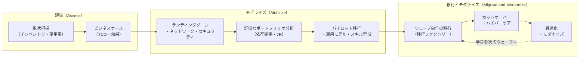
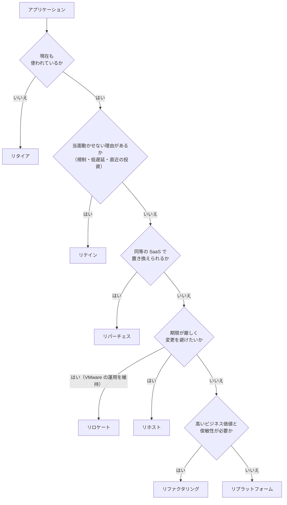
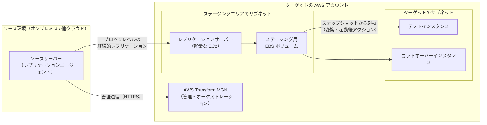
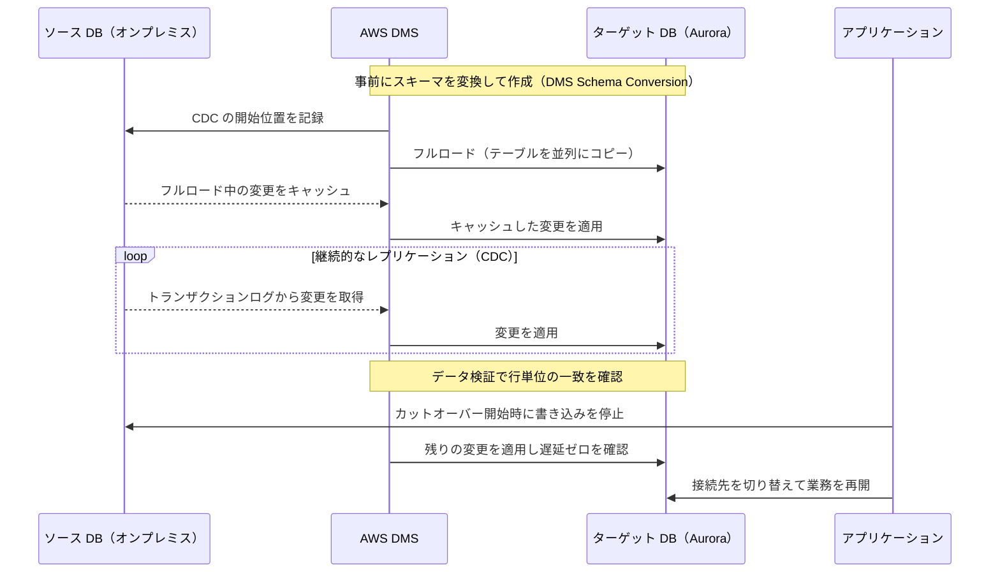
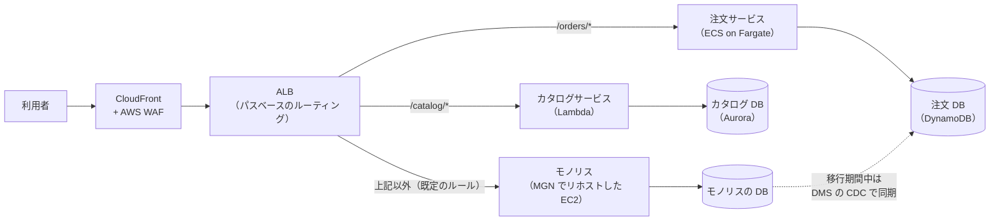
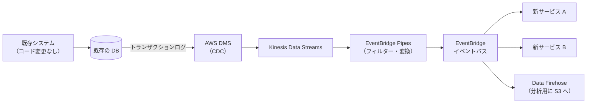
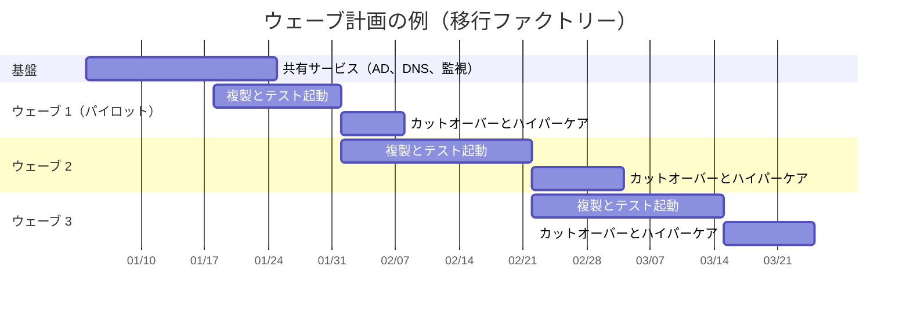
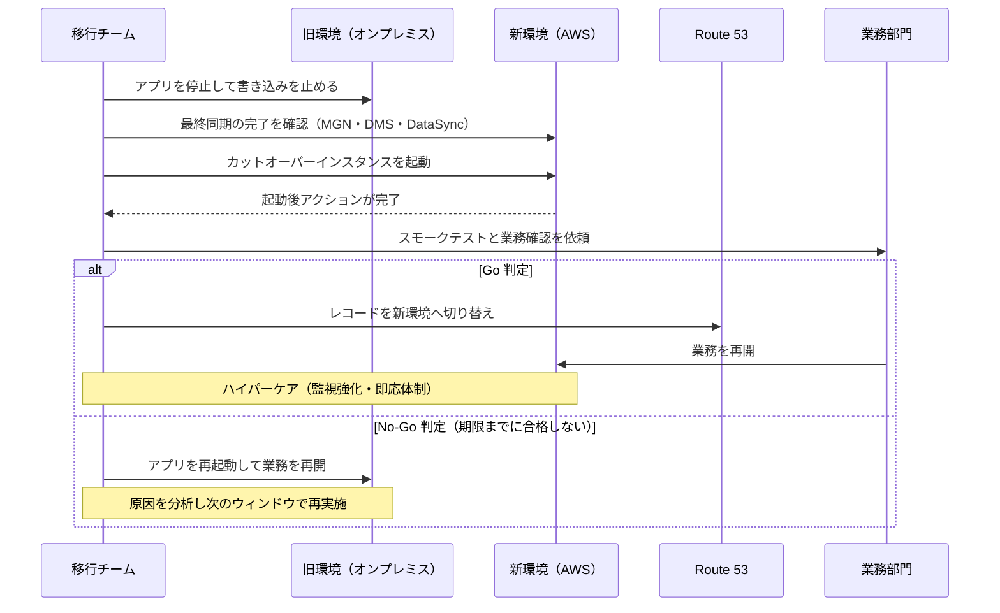

[ホーム](../README.md) > [Phase 3: プロフェッショナル](README.md) > 移行とモダナイゼーション

# 移行とモダナイゼーション

> **この章のゴール**
> - 大規模移行を「評価 → モビライズ → 移行とモダナイズ」の 3 フェーズのプログラムとして計画し、各フェーズの成果物を説明できる
> - ビジネス価値・技術的負債・ライセンス・依存関係・期限・スキルを基準に、アプリケーションごとの 7R を判断できる
> - 検出・評価・実行のツール（AWS Transform、Migration Evaluator、AWS Transform MGN、AWS DMS、AWS DataSync、Amazon EVS）を、2026年時点の提供状況を踏まえて選べる
> - 帯域の計算、Direct Connect のリードタイム、DNS の TTL、ウェーブ計画を含むカットオーバー計画を立てられる
> - リプラットフォーム、リファクタ（ストラングラーフィグ）、DB・.NET・メインフレームのモダナイズ経路を選べる
> - BYOL、Dedicated Hosts、License Manager を使い、商用ライセンスを考慮した移行先を設計できる
>
> **対応試験**: SAP-C03（D4 回復力、移行、事業継続 / D1 クラウドネイティブアーキテクチャの設計と実装 ※ドメイン名は仮訳）。SAP-C02 では第4分野「ワークロードの移行とモダナイゼーションの加速」に相当します。
> **目安時間**: 読む 6.5時間 / 確認問題と復習 2.5時間

> [!NOTE]
> 7R の定義、MGN・DMS・DataSync の基本、Direct Connect と Site-to-Site VPN の仕組みは [移行とハイブリッド接続](../02-associate/16-migration-hybrid.md) で学習済みとして進めます。本章は「数百〜数千台を、期限・予算・リスクの制約の中でどう移すか」という SAP の視点で扱います。

## この章の全体像

大規模な移行は、サーバーを 1 台ずつ移す作業の積み重ねではありません。複数のプロジェクトを束ねた **プログラム** です。成否を分けるのは個々の技術よりも、「どの順番で」「どの体制で」「何を基準に判断して」移すかです。

AWS の移行方法論は、次の 3 フェーズで進めます。AWS Migration Acceleration Program（MAP）でも同じ枠組みが使われます。

移行ツールは 2025〜2026 年に大きく入れ替わりました。まず現在の全体像を押さえます。

| 目的 | 新規に選ぶサービス（2026年9月時点） | 状況・注意点 |
|---|---|---|
| ビジネスケース・TCO | Migration Evaluator、AWS Transform（評価） | 利用可能 |
| 検出・依存関係の把握 | AWS Transform（検出・依存関係マッピング） | AWS Application Discovery Service は 2025年10月に新規受付終了を発表 |
| 移行計画・進捗管理 | AWS Transform（ウェーブ計画）、MGN のアプリケーション / ウェーブ機能 | AWS Migration Hub（Strategy Recommendations、Orchestrator、Journeys を含む）は 2025年11月に新規受付終了を発表 |
| サーバーのリホスト | AWS Transform MGN（旧 AWS Application Migration Service） | 2026年6月に名称変更。API とレプリケーションエンジンは同じ |
| VMware からの移行 | AWS Transform for VMware、Amazon EVS | Amazon EVS は 2025年8月に一般提供開始、東京リージョンで利用可能 |
| データベース移行 | AWS DMS（DMS Schema Conversion、同種データ移行、DMS Serverless） | 利用可能 |
| ファイル・オブジェクト転送 | AWS DataSync、AWS Data Transfer Terminal | Snowball Edge は 2025年11月7日から新規受付終了（2025年10月に発表） |
| リファクタの基盤 | API Gateway / ALB などで構築 | Migration Hub Refactor Spaces は Migration Hub とともに 2025年11月に新規受付終了を発表 |
| .NET | AWS Transform for .NET | AWS .NET Modernization Tools は 2025年11月に新規受付終了を発表 |
| メインフレーム | AWS Transform for mainframe | AWS Mainframe Modernization は、マネージドランタイム環境（2025年11月）とセルフマネージド（2026年6月）の両方で新規受付終了を発表 |

> [!IMPORTANT]
> 新規受付終了（メンテナンス）になったサービスは、**既存の利用者は引き続き使えます**。一方、新しい設計では推奨されません。
> SAP-C02 までの問題や古い教材では「Application Discovery Service で依存関係を収集し、Migration Hub で追跡する」「Snowball Edge でオフライン転送する」「AWS Mainframe Modernization でリファクタする」が正解になる形で出題されてきました。SAP-C03 でも旧サービス名が登場する可能性があります。**仕組みと役割は理解したうえで、新規の設計では後継サービスを選ぶ** という二段構えで覚えてください。最新の一覧は [メンテナンス中のサービス一覧](https://docs.aws.amazon.com/general/latest/gr/maintenance_services.html) で確認できます。

## 1. 移行プログラムの全体像

### 1.1 なぜ「プログラム」として設計するのか

数百台規模の移行でよくある失敗は、技術ではなく進め方に原因があります。

- アカウント構成・ネットワーク・セキュリティの基盤がないまま移行を始め、後から作り直しになる
- 依存関係を把握せずに一部だけ移し、オンプレミスとの通信遅延で性能障害が起きる
- 業務部門との合意（停止時間、テスト、判定基準）がなく、カットオーバーが延期され続ける
- 移行後にライトサイジングやオンプレミス資産の廃止をせず、コストが二重にかかり続ける

これらを防ぐため、移行を 3 つのフェーズに分け、フェーズごとに「問い」と「成果物」を明確にします。

| フェーズ | 答える問い | 主な活動 | 成果物 |
|---|---|---|---|
| 評価（Assess） | 移行すべきか、効果はどれくらいか | 概要インベントリと使用率の収集、TCO 試算、移行準備状況の評価（Migration Readiness Assessment） | ビジネスケース、概算の 7R 分布、概算スケジュール |
| モビライズ（Mobilize） | どう移すか、準備はできているか | ランディングゾーン、ネットワーク接続、セキュリティ基盤、運用モデルと CCoE、スキル育成、詳細なポートフォリオ分析、ウェーブ計画、パイロット移行 | 移行の土台、ウェーブ計画、ランブック、検証済みの移行手順 |
| 移行とモダナイズ（Migrate and Modernize） | 計画どおり安全に移せるか | ウェーブ単位の移行、カットオーバー、ハイパーケア、最適化とモダナイズ | 移行済みワークロード、廃止したオンプレミス資産、最適化の実績 |

### 1.2 評価フェーズ

評価フェーズの目的は、経営層が「移行する」と意思決定できる材料をそろえることです。

- **ビジネスケース**: オンプレミスの総保有コスト（ハードウェア更新、データセンター費用、保守、ライセンス、運用人件費）と AWS 移行後のコストを比較します。オンプレミスのサーバーはピークに合わせて過剰に用意されていることが多いため、**実際の使用率に基づくライトサイジング** が試算の精度を大きく左右します。
- **移行準備状況の評価**: AWS Cloud Adoption Framework（AWS CAF）の 6 つの観点（ビジネス、人材、ガバナンス、プラットフォーム、セキュリティ、運用）で、組織の準備度とギャップを洗い出します。
- **概算の 7R 分布**: 全体のうち何割をリホストし、何割をリプラットフォームするかといった方向性を決めます。個々のアプリの決定はモビライズで行います。

### 1.3 モビライズフェーズ

モビライズは「移行を大量に、安全に、繰り返し実行できる状態」を作るフェーズです。SAP の問題で最も問われやすいのはここです。

- **ランディングゾーン**: AWS Control Tower などでマルチアカウントの基盤、ガードレール、ログの集約を整えます（[マルチアカウント戦略とガバナンス](02-multi-account-governance.md)）。
- **ネットワーク**: Direct Connect の発注、ハイブリッド DNS、IP アドレス設計を行います。Direct Connect は開通まで数週間〜数か月かかることがあるため、このフェーズの早い段階で発注します（4.5 節）。
- **セキュリティと運用**: ID 連携、暗号化、監視、バックアップ、パッチ適用の標準を決めます。移行後の運用を誰が担うか（運用モデル）もここで決めます。
- **詳細なポートフォリオ分析**: 依存関係を把握し、アプリごとに 7R を決め、移行グループとウェーブに分けます（2〜3 節、7 節）。
- **パイロット移行**: 依存関係が少なく重要度の低いアプリを実際に移し、ツール・手順・引き継ぎを端から端まで検証します。ここで得た教訓をランブックに反映します。

### 1.4 移行とモダナイズフェーズ

計画したウェーブを、決まった手順で繰り返し実行します。この「型」を **移行ファクトリー** と呼びます。

- 1 ウェーブごとに「準備 → テスト起動 → カットオーバー → ハイパーケア（移行直後の手厚い監視と支援）」を回します。
- ウェーブが終わるたびに振り返り、ランブックと見積もりを改善します。
- 移行が落ち着いたワークロードから、ライトサイジング・購入オプションの適用・マネージドサービスへの置き換え（モダナイズ）を進めます（8 節）。

> [!TIP]
> **試験のポイント**: 「移行を始める前に、統制の効いたマルチアカウント環境とセキュリティの基盤を用意したい」→ モビライズでランディングゾーン（Control Tower）を整備。「移行手順とツールを本番規模の前に検証したい」→ 低リスクのアプリで **パイロット移行**。「期限が厳しく台数が多い」→ まずリホストで移し、移行後にモダナイズ。

## 2. ポートフォリオ分析と 7R

### 2.1 7R のおさらい

| 戦略 | 内容 | 代表的な手段 |
|---|---|---|
| リタイア | 使われていないものを廃止する | ― |
| リテイン | 当面はオンプレミスに残す | ハイブリッド接続で共存 |
| リホスト | 変更せずにそのまま移す（リフトアンドシフト） | AWS Transform MGN |
| リロケート | ハイパーバイザー単位で移す | Amazon EVS、VMware Cloud on AWS |
| リプラットフォーム | 一部を最適化して移す（リフトアンドリシェイプ） | RDS / Aurora、ECS / Fargate、Elastic Beanstalk |
| リパーチェス | SaaS などの製品へ買い替える | AWS Marketplace の SaaS |
| リファクタリング | クラウドネイティブに再設計する | Lambda、ECS / EKS、DynamoDB、EventBridge |

### 2.2 判断基準

7R は「好み」ではなく、次の基準の組み合わせで決めます。SAP の問題文には、これらの基準がそのまま条件として書かれます。

| 判断基準 | 見るべき指標 | 選択の傾向 |
|---|---|---|
| ビジネス価値・戦略上の重要度 | 差別化の源泉か、変更頻度、売上への寄与 | 高い: リファクタリング候補 / 低い: リホスト、リパーチェス、リタイア |
| 技術的負債 | サポート終了の OS やミドルウェア、障害頻度、拡張の難しさ | 負債が大きく延命できない: リプラットフォームまたはリファクタリング / 健全: リホスト |
| ライセンス | 商用 DB・OS の更新時期と費用、BYOL の可否、ベンダーのクラウド条件 | 高額な商用 DB: Aurora へのリプラットフォーム、Babelfish / BYOL に制約: Dedicated Hosts（6 節） |
| 依存関係 | 密結合、低レイテンシーの通信、共有 DB | 同じウェーブでまとめて移す、または一時的にリテイン |
| 期限（タイムライン） | データセンター契約の終了、ハードウェア保守の期限 | 厳しい: リホストまたはリロケート（移行後にモダナイズ） |
| スキル・組織 | チームのクラウド・コンテナ経験、運用体制 | 不足: マネージドサービスへのリプラットフォーム、パートナー活用 |
| コンプライアンス | 規制、データ所在地、監査要件 | 満たせない間はリテイン、または要件を満たすリージョン・Outposts |
| 利用状況 | アクセスがほぼない、機能が重複している | リタイア |

### 2.3 判断フロー

複数の基準を実務で当てはめるときは、次の順で絞り込むと迷いにくくなります。**先に「移さない」選択肢（リタイア・リテイン・リパーチェス）を除外する** のがポイントです。移す必要のないものを移すのは最大の無駄だからです。

### 2.4 「先に移す」か「移しながら変える」か

大規模移行では、全体の方針として次の 2 つのどちらを基本にするかを決めます。

| 観点 | 先に移行（リホスト後にモダナイズ） | 移行と同時にモダナイズ |
|---|---|---|
| 期間 | 短い。データセンター退去の期限に合わせやすい | 長い |
| リスク | 変更が少なく低い | 変更が多く高い |
| 効果が出る時期 | データセンター費用はすぐ減る。マネージドの恩恵は後から | 最初からマネージド・弾力性の恩恵を得られる |
| 手間 | 移行とモダナイズの二段階になる | 一度で済む |
| 向く対象 | 大量の汎用的なサーバー | 少数の戦略的なアプリケーション |

実際のプログラムでは、大部分をリホストで素早く移し、ビジネス価値の高い一部だけを移行と同時にモダナイズする **組み合わせ** が一般的です。

> [!WARNING]
> **ひっかけ注意**: 「期限まで 6 か月、数百台」という条件で「すべてをマイクロサービスへリファクタリングする」選択肢は、技術的に正しくても期限を満たしません。逆に「リホストではクラウドの利点が得られない」も誤りです。リホスト後はライトサイジング、購入オプション、マネージドサービスへの段階的な置き換えが可能になり、モダナイズへの最短の第一歩になります。

> [!TIP]
> **試験のポイント（キーワード → 戦略）**: 「アクセスログがほぼない」→ リタイア。「規制で当面オンプレミス」「最近ハードウェアを更新した」→ リテイン。「CRM を SaaS に置き換え」→ リパーチェス。「VMware の運用ツールとスキルを維持」→ リロケート。「コード変更なしで最速」→ リホスト。「DB の管理負荷を減らしたい、コード変更は最小」→ リプラットフォーム。「俊敏性・スケーラビリティのために再設計」→ リファクタリング。

## 3. 検出と評価

### 3.1 何を収集するか

ポートフォリオ分析の精度は、収集するデータの質で決まります。構成情報だけでなく、**使用率・依存関係・変更量** まで集めるのが SAP レベルの計画です。

| 分類 | 例 | 何に使うか |
|---|---|---|
| 構成情報 | CPU、メモリ、ディスク、OS、ミドルウェア、DB エンジン | 移行先とツールの選定 |
| 使用率 | CPU・メモリのピークと 95 パーセンタイル、IOPS、スループット | ライトサイジング |
| ネットワーク依存関係 | 通信元と通信先、ポート、頻度、通信量 | 移行グループとウェーブの分割 |
| アプリケーション情報 | オーナー、業務上の重要度、RPO / RTO、メンテナンス可能な時間帯 | 優先順位とカットオーバー計画 |
| ライセンス | 商用 OS・DB・ミドルウェアの契約形態、BYOL の可否 | 移行先とテナンシーの選定（6 節） |
| 変更量 | ディスクへの 1 日あたりの書き込み量、DB のトランザクションログの生成量 | レプリケーションと帯域の計画（4.5 節） |

### 3.2 検出ツールの現状

これまでの定番は、**AWS Application Discovery Service（ADS）** でデータを集め、**AWS Migration Hub** で移行を追跡する構成でした。

- ADS: エージェント型（サーバー内のプロセスやネットワーク接続まで収集し、依存関係を把握できる）と、エージェントレス型（VMware vCenter から VM の構成と使用率を収集）の 2 方式がありました。
- Migration Hub: 移行状況の一元管理に加え、Strategy Recommendations（アプリごとの戦略の推奨）、Orchestrator（移行ワークフローの自動化）、Journeys などの機能がありました。

ADS は **2025年10月に新規受付終了を発表**、Migration Hub（Strategy Recommendations、Orchestrator、Journeys、Refactor Spaces を含む）は **2025年11月に新規受付終了を発表** しています。既存の利用者は使い続けられますが、新規の利用者は **AWS Transform** と **Migration Evaluator** を使います。

> [!WARNING]
> **ひっかけ注意**: 古い問題では「サーバー間の依存関係を把握する → ADS のエージェント（Discovery Agent）」「移行の進捗を一元管理する → Migration Hub」が正解でした。2026年以降に新規で移行を始める組織の設計としては、AWS Transform（検出・依存関係マッピング・ウェーブ計画）を選びます。問題文に「既に ADS を利用している」とあれば ADS の継続利用も妥当です。

### 3.3 Migration Evaluator ― ビジネスケースの作成

Migration Evaluator（旧 TSO Logic）は、評価フェーズで **移行のビジネスケース** を作るためのサービスです。

- オンプレミスにエージェントレスのコレクターを置き、仮想化基盤やサーバーから構成と使用率を一定期間収集します。既存ツールのエクスポートを取り込む方法もあります。
- 使用率に基づいてライトサイジングした EC2 の構成と、ライセンスの選択肢（License Included と BYOL の比較など）を含めた移行後のコストを試算します。
- 出力はオンプレミスと AWS の TCO 比較レポートです。経営層向けの意思決定材料として使います。

「移行の意思決定の前に、実際の使用率に基づいたコスト比較を作りたい」という要件なら Migration Evaluator です。サーバーを実際に移すツールではない点に注意してください。

### 3.4 AWS Transform ― エージェント型 AI による移行とモダナイゼーション

**AWS Transform**（2025年5月に一般提供開始）は、生成 AI のエージェントが移行とモダナイゼーションの作業を実行するサービスです。エージェントが分析・計画・変換を進め、**人が要所で確認・承認する（ヒューマンインザループ）** 形で動きます。Web の画面上で「ジョブ」を作り、チームで共同作業します。

| 機能 | エージェントが行うこと |
|---|---|
| 移行の評価 | インベントリから移行のビジネスケースとコスト試算を作成 |
| VMware（AWS Transform for VMware） | 検出、依存関係マッピング、アプリケーションのグループ化、ウェーブ計画、ネットワーク変換（RVTools や VMware NSX のエクスポートから VPC などを構築）、EC2 へのリホスト |
| メインフレーム（AWS Transform for mainframe） | コード分析、ドキュメント生成、ビジネスロジックの抽出、ドメインへの分解、COBOL から Java へのリファクタ |
| .NET（AWS Transform for .NET） | Windows 専用の .NET Framework アプリを、Linux で動くクロスプラットフォームの .NET へ移植 |
| フルスタック Windows モダナイゼーション | .NET アプリと SQL Server などを含む Windows スタック全体のモダナイズ |
| AWS Transform custom（2025年12月） | 言語バージョンやフレームワークのアップグレードなど、組織固有の変換を定義して大規模に適用 |

AWS Transform の VMware 移行では、サーバーのレプリケーションとカットオーバーに **AWS Transform MGN**（4.1 節）が使われます。2026年6月の名称変更で、MGN は「AWS Transform のレプリケーションエンジン」という位置付けが明確になりました。直接 MGN のコンソールで細かく制御する方法と、AWS Transform のエージェントに検出からネットワーク作成、リホスト（またはコンテナ化）までを任せる方法を選べます。

> [!TIP]
> **試験のポイント**: 「エージェント型 AI で大規模な VMware 移行を自動化」「依存関係の把握・ウェーブ計画・ネットワーク変換の手作業を減らしたい」「COBOL を Java に変換」「.NET Framework を Linux へ」→ AWS Transform。AWS Transform は計画と変換を担うサービスであり、アプリの実行環境ではありません。変換後の実行環境（EC2、ECS、EKS など）は別途設計します。

### 3.5 依存関係マッピングと移行グループ

収集した依存関係から、一緒に移すべきサーバーの集まり（**移行グループ**）を作り、それをウェーブに割り当てます。

- **通信が頻繁で遅延に敏感な組み合わせは同じウェーブで移します**。例えば、1 画面の表示で数百回 DB に問い合わせるアプリを先に AWS へ移し、DB をオンプレミスに残すと、Direct Connect 越しの数ミリ秒の往復が積み重なって応答時間が大きく悪化します。
- **共有サービスは先に用意します**。Active Directory のドメインコントローラー、DNS（Route 53 Resolver エンドポイント）、監視、踏み台などを最初のウェーブで AWS 側に用意すると、後続のウェーブが楽になります（[高度なネットワーク設計](04-advanced-networking.md)、[大規模な ID とアクセス管理](03-identity-federation.md)）。
- **ハードコードされた IP アドレス** は移行の障害になります。検出の段階で洗い出し、DNS 名に置き換えるか、IP アドレスを維持できる移行方式（VMware の場合の Amazon EVS と HCX など）を検討します。
- **バッチの連鎖やファイル連携** は、ネットワーク通信として見えにくい依存関係です。ジョブスケジューラーの定義やアプリのオーナーへのヒアリングで補います。

> [!TIP]
> **試験のポイント**: 「移行後に応答時間が悪化した」「移行済みのアプリがオンプレミスの DB と頻繁に通信している」→ 依存関係を同じウェーブにまとめる（または DB も同時に移す）。「IP アドレスがハードコードされていて変更できない」→ DNS 名への置き換え、または IP アドレスを維持できる移行方式を選ぶ。

## 4. 移行の実行

移すものの種類によって、使うツールと仕組みが決まります。まず全体の対応を押さえます。

| 移すもの | 主なツール | 仕組みの要点 | 7R |
|---|---|---|---|
| サーバー（物理・仮想・他クラウド） | AWS Transform MGN | ブロックレベルの継続的レプリケーションとテスト起動 | リホスト |
| VMware 環境（ハイパーバイザーごと） | Amazon EVS + VMware HCX | VMware Cloud Foundation を VPC 内で動かし、VM をそのまま移す | リロケート |
| VMware の VM を EC2 へ（大規模） | AWS Transform for VMware + AWS Transform MGN | エージェントが計画・ネットワーク変換を行い、MGN が複製 | リホスト |
| データベース | AWS DMS + DMS Schema Conversion | フルロード + CDC（変更データキャプチャ） | リプラットフォーム / リファクタリング |
| ファイル・オブジェクト | AWS DataSync | 差分転送と整合性の検証 | リホスト / リプラットフォーム |
| 帯域が足りない大容量データ | AWS Data Transfer Terminal | 自社のストレージデバイスを AWS の転送拠点に持ち込む | ― |

### 4.1 AWS Transform MGN（リホスト）

**AWS Transform MGN** は、サーバーを **ブロックレベルで継続的にレプリケーション** し、AWS 上でテスト起動とカットオーバーを行う、リホストの標準ツールです。2026年6月に AWS Application Migration Service から名称が変わりましたが、機能・API・レプリケーションの技術は変わっていません（[名称変更の発表](https://aws.amazon.com/jp/about-aws/whats-new/2026/06/aws-transform-mgn-rebrand/)）。

> [!NOTE]
> 試験や古い教材では旧名称の「AWS Application Migration Service（AWS MGN）」で出題される可能性があります。さらに古い問題に登場する AWS Server Migration Service（SMS）や CloudEndure Migration は、MGN に置き換えられています。

#### 仕組み

1. **レプリケーション設定**: ステージングエリアのサブネット、レプリケーションサーバーのインスタンスタイプ、EBS の種類と暗号化、帯域の制限、プライベート IP で複製するか（Direct Connect / VPN 経由の場合）を、テンプレートとして決めます。
2. **エージェントのインストール**: ソースサーバーにレプリケーションエージェントを入れると、まず全ディスクをブロック単位でコピー（初回同期）し、その後は変更分を継続的に複製します。**ソースサーバーは稼働したまま** です。vCenter 環境では、エージェントを入れられないサーバー向けにエージェントレス（スナップショット方式）の複製も選べます。
3. **起動設定**: サーバーごとに EC2 起動テンプレート（インスタンスタイプ、サブネット、セキュリティグループ、IAM ロール、ライセンスの扱い）を用意します。ソースの CPU とメモリに合わせてインスタンスタイプを自動で選ぶ設定もあります。
4. **テスト起動**: 複製中のデータからテストインスタンスを起動して動作を確認します。複製は止まらず、ソースにも影響しません。問題がなければテストインスタンスを削除し、「カットオーバー準備完了」にします。
5. **カットオーバー**: 業務を止めてソースへの書き込みを停止し、複製の遅延がないことを確認してから、カットオーバーインスタンスを起動します。起動時には、ブートボリュームを EC2 で起動できるように変換（ドライバーなど）する処理が自動で行われます。
6. **確定（ファイナライズ）**: 動作確認と切り替えが終わったらカットオーバーを確定します。複製が止まり、ステージングのリソースが削除されます。確定前であればソースに戻せます（ソースは変更していないため）。

#### 起動後アクション（post-launch actions）

移行したインスタンスには、監視エージェントの導入や不要なソフトウェアの削除など、毎回同じ作業が発生します。MGN の **起動後アクション** を使うと、テスト起動やカットオーバーのたびに Systems Manager のドキュメントが自動で実行されます。

| 種類 | 例 |
|---|---|
| AWS が用意したアクション | CloudWatch エージェントのインストール、AMI の作成、SQL Server のライセンスを BYOL から License Included へ変換、Windows Server のバージョンアップグレード、ディスク容量の検証、HTTP(S) 応答の確認 など |
| カスタムアクション（独自の SSM ドキュメント） | 社内標準のセキュリティエージェントの導入、オンプレミス専用のバックアップエージェントの削除、設定ファイルの接続先の書き換え など |

起動後アクションを動かすには、インスタンスに SSM Agent を入れる設定が必要です。数百台の移行では「手作業の後処理」が最大のボトルネックになるため、ここを自動化できるかが移行ファクトリーの速度を決めます。

#### 大規模移行での使い方

- **アプリケーションとウェーブ**: MGN のコンソールでサーバーをアプリケーション単位にまとめ、ウェーブに割り当てて一括でテスト起動・カットオーバーできます。CSV でのインポート / エクスポートにも対応します。AWS Transform のエージェント型ワークフローから操作する方法もあります（3.4 節）。
- **ネットワーク**: 複製はインターネット、Site-to-Site VPN、Direct Connect のどれでも行えます。転送中のデータは暗号化されます。業務の通信を守るため、帯域の上限を設定できます（4.5 節）。
- **災害対策との関係**: 同じ複製技術を使う AWS Elastic Disaster Recovery は、継続的な複製と少ない停止での復旧を DR 用途に提供します（[回復力と事業継続](06-resilience-business-continuity.md)）。

> [!TIP]
> **試験のポイント**: 「数百台を、コードや OS を変えずに、停止時間を最小にしてリホスト」→ AWS Transform MGN（旧 Application Migration Service）。「本番に影響を与えずに移行先で事前検証したい」→ テスト起動。「移行したすべてのインスタンスに監視エージェントを自動で導入したい」→ 起動後アクション。

> [!WARNING]
> **ひっかけ注意**: MGN はサーバーをディスクごと移すため、OS やミドルウェアは変わりません。「DB を RDS / Aurora に移して管理負荷を下げたい」なら DMS（4.3 節）です。DB サーバーを EC2 へそのまま移す場合は MGN も使えますが、整合性を保つためにカットオーバー時は DB を停止してから起動します。

### 4.2 VMware 環境からの移行

VMware のライセンス体系の変更をきっかけに、VMware 環境をどう移すかは多くの企業の課題になっています。経路は大きく 3 つです。

| 経路 | 7R | 何が変わるか | 向くケース |
|---|---|---|---|
| **Amazon EVS**（Elastic VMware Service） | リロケート | 何も変えない。vCenter・NSX・HCX などの運用ツールとスキルをそのまま使う | 期限が非常に厳しい、IP アドレスを維持したい、VMware の運用体制を当面維持する |
| **AWS Transform for VMware** + MGN | リホスト（一部はコンテナ化） | VM が EC2 インスタンスになり、VMware のライセンスが不要になる | 数百〜数千 VM を VMware から脱却させたい、計画とネットワーク変換を自動化したい |
| **MGN 単体** | リホスト | 同上 | 小〜中規模、移行チームが手順を細かく直接制御したい |

**Amazon EVS**（2025年8月に一般提供開始、東京リージョンで利用可能）は、利用者の VPC 内の EC2 ベアメタルインスタンス上に VMware Cloud Foundation（VCF）を展開するサービスです。

- vCenter や NSX を管理者権限で使い続けられます。VCF の運用（パッチ適用やアップグレード）は利用者またはパートナーが担う、自己管理型のサービスです。
- VCF のライセンスは利用者が Broadcom から調達して持ち込みます。
- VMware HCX で VM を移し、ネットワーク延伸（L2 延伸）を使えば **IP アドレスを変えずに** 段階的に移せます。
- VPC の中で動くため、S3、RDS、FSx などの AWS サービスとプライベートに接続できます。移したあとで、VM を少しずつ EC2 やマネージドサービスへ移すこともできます。

**AWS Transform for VMware** は、3.4 節のとおり、検出 → 依存関係マッピングとグループ化 → ウェーブ計画 → ネットワーク変換（VMware のネットワーク構成を VPC、サブネット、セキュリティグループなどへ変換）→ MGN による複製とカットオーバー、という流れをエージェントが進めます。各段階で人が内容を確認して承認します。

> [!NOTE]
> 試験や古い教材では、VMware 環境を短期間で移す答えとして **VMware Cloud on AWS** が登場します。これは Broadcom（VMware）が提供・運用するマネージド型の VMware 環境です。現在の AWS のサービスとしての選択肢は Amazon EVS であり、両者は「誰が VMware 基盤を運用するか」「利用者の VPC の中で動くか」が異なります。

> [!TIP]
> **試験のポイント**: 「VMware の運用ツールとスキルを維持したまま、最短で、IP アドレスを変えずにデータセンターを退去」→ Amazon EVS + HCX（リロケート）。「数千 VM を VMware から脱却させ、計画とネットワーク構築の手作業を減らしたい」→ AWS Transform for VMware（MGN で複製）。

### 4.3 AWS DMS によるデータベース移行

DMS の基本（レプリケーションインスタンス、エンドポイント、タスク）は [移行とハイブリッド接続](../02-associate/16-migration-hybrid.md) で学習済みです。SAP では「停止時間」「変換の手間」「整合性の確認」「運用負荷」を同時に満たす組み合わせが問われます。

#### フルロード + CDC の流れ

停止時間は「書き込みを止めてから、残りの変更を適用し、接続先を切り替えるまで」だけになります。数 TB の DB でも、停止時間を数分〜数十分に抑えられるのはこのためです。

#### 設計のポイント

| 論点 | 内容 | 設計のポイント |
|---|---|---|
| CDC の前提条件 | DMS はソースのトランザクションログを読んで変更を取得する | Oracle はサプリメンタルロギング、MySQL はバイナリログ（ROW 形式）と十分な保持期間、SQL Server は MS-Replication または MS-CDC と完全復旧モデル、PostgreSQL は論理レプリケーションを有効にする |
| DMS が作るオブジェクト | テーブルと主キーなど、データの移行に必要な最小限だけ | セカンダリインデックス、外部キー、トリガー、ストアドプロシージャ、ユーザーは Schema Conversion などで別途作成する。外部キーとトリガーはロード中に無効化する |
| 大きなテーブル | 既定では 8 テーブルずつ並列にロード | 1 つの巨大なテーブルは、範囲やパーティション単位の並列ロードで分割する |
| LOB（大きなバイナリ・テキスト） | 制限付き LOB モード（高速、上限を超えた部分は切り捨て）、完全 LOB モード（低速）、インライン LOB モード | 事前に LOB の最大サイズを調べてモードを決める |
| データ検証 | ソースとターゲットの行を比較し、不一致を報告する | ソースとターゲットに読み取り負荷がかかる。検証だけを行うタスクも作れる |
| 自動採番・シーケンス | シーケンスや ID 列の現在値は移らない | カットオーバー時にターゲット側で値を再設定する |

#### DMS Schema Conversion ― 異種移行の変換

エンジンが異なる移行（Oracle → Aurora PostgreSQL など）では、テーブル定義だけでなく、ストアドプロシージャや関数などのコードも変換が必要です。**DMS Schema Conversion** は DMS のコンソールから使えるマネージドな変換機能です。

- **評価レポート**: どのオブジェクトが自動で変換でき、どれに手作業が必要か（アクション項目と難易度）を出します。移行の工数見積もりと、7R の判断（変換が難しすぎるならリプラットフォームに留める）に使います。
- **変換と適用**: 変換したスキーマをターゲットに適用するか、SQL スクリプトとして保存してレビューします。
- **生成 AI による変換**: ルールベースで自動変換できなかったコードについて、生成 AI を使った変換にも対応しています。対応する移行元と移行先の組み合わせは限られるため、[DMS Schema Conversion のドキュメント](https://docs.aws.amazon.com/dms/latest/userguide/CHAP_SchemaConversion.html) で確認してください。変換結果は必ず人がレビューし、テストで確認します。

> [!NOTE]
> 試験や古い教材では、デスクトップアプリケーションの **AWS Schema Conversion Tool（AWS SCT）** で変換する形で出題されます。役割（スキーマとコードの変換、評価レポート）は同じです。

#### 同種データ移行と DMS Serverless

| 方式 | 仕組み | 向くケース |
|---|---|---|
| **同種データ移行**（homogeneous data migrations） | 同じエンジン間の移行を、DB のネイティブツール（PostgreSQL の pg_dump / pg_restore と論理レプリケーションなど）を使ってサーバーレスで実行する | PostgreSQL、MySQL、MariaDB などを同じエンジンの RDS / Aurora へ、少ない手間で移したい |
| **DMS Serverless** | レプリケーションインスタンスのサイズを選ばず、最小と最大の容量を指定すると、負荷に応じて自動でスケールする | 容量の見積もりをしたくない、移行の負荷が変動する、多数の移行を並行する |
| インスタンスベースの DMS | レプリケーションインスタンスを選んで実行する | 細かいチューニングが必要、Serverless が対応していない機能やエンドポイントを使う |

同じエンジンなら、DB のネイティブ機能も有力な選択肢です。

- **大容量の MySQL → Aurora MySQL**: Percona XtraBackup のバックアップを S3 経由で Aurora に復元し、差分はバイナリログのレプリケーションで追いつかせます。
- **SQL Server → RDS for SQL Server**: ネイティブバックアップ（.bak）を S3 経由で復元し、差分は DMS の CDC で追いつかせる組み合わせがあります。
- **Oracle → EC2 上の Oracle**: Oracle Data Guard や RMAN など、ベンダーのツールを使います。

> [!TIP]
> **試験のポイント**: 「最小の停止時間で DB を移行」→ DMS のフルロード + CDC。「Oracle / SQL Server から Aurora PostgreSQL へ、ストアドプロシージャも変換」→ DMS Schema Conversion + DMS。「移行後にデータの一致を確認」→ DMS のデータ検証。「同じエンジンへ、運用負荷を最小に」→ 同種データ移行。「レプリケーションインスタンスのサイズ設計を避けたい」→ DMS Serverless。

> [!WARNING]
> **ひっかけ注意**: DMS だけではスキーマやコードは変換されません（Schema Conversion が必要）。また、DMS はセカンダリインデックスやユーザーを移さないため、「DMS のタスクを実行すれば DB が完全に複製される」という選択肢は誤りです。CDC が失敗する原因として、「MySQL のバイナリログが無効」「保持期間が短すぎる」がよく問われます。

### 4.4 大規模データ転送

ファイルやオブジェクトの大量データは、「オンラインで送るか」「物理的に運ぶか」を、データ量・帯域・期限から判断します。

| 手段 | 方式 | 向く状況 | 注意点 |
|---|---|---|---|
| **AWS DataSync** | エージェント（オンプレミスの VM）が NFS / SMB / HDFS / オブジェクトストレージを読み、S3・EFS・FSx へ転送 | オンラインでの一括転送と差分同期 | 回線の帯域が上限になる |
| **S3 File Gateway** | オンプレミスから NFS / SMB で S3 に書き込み、ローカルにキャッシュ | 移行期間中もオンプレミスからファイル共有として使い続ける | 一括移行の主役ではない |
| **AWS Transfer Family** | SFTP / FTPS / FTP / AS2 で S3・EFS に受け渡し | 取引先とのファイル連携を移行後も続ける | 大量移行用ではない |
| **AWS Data Transfer Terminal** | 自社のストレージデバイスを AWS の転送拠点へ持ち込み、高速なネットワークでアップロード | 帯域が足りず期限が迫る、数百 TB 級の初期データ | 予約制。拠点までの運搬が必要（東京の拠点は 2026年2月に追加） |
| **AWS Snowball Edge** 【新規受付終了】 | AWS から届くデバイスにコピーして返送 | 既存の利用者のみ | 2025年11月7日から新規受付終了（2025年10月に発表） |

#### DataSync の設計

- **Direct Connect / VPN 経由で使う**: DataSync のインターフェイス VPC エンドポイントを作り、エージェントをそのエンドポイント経由で有効化します。転送がインターネットを通らず、プライベート VIF（またはトランジット VIF）上を流れます。
- **並列化**: 大規模な場合は、ディレクトリ単位でタスクを分割し、複数のエージェントで並列に実行します。
- **業務への影響**: 帯域の上限を設定し、スケジュール実行で夜間に寄せます。
- **検証**: 転送後にチェックサムで整合性を確認できます。ファイルのメタデータ（タイムスタンプ、POSIX のアクセス許可、SMB の ACL）も保持できます。
- **典型的な進め方**: 数週間前から初期転送 → 定期的な差分同期 → カットオーバー時に書き込みを止めて最終差分を同期、の 3 段階で停止時間を短くします。

> [!WARNING]
> **ひっかけ注意**: SAA / SAP の過去の問題では「帯域が足りない数十〜数百 TB → Snowball Edge を複数台並列」「エクサバイト級 → Snowmobile」が定番の正解でした。現在、Snowmobile は提供終了、Snowball Edge は新規受付終了です。新規の利用者は、Direct Connect + DataSync（オンライン）、Data Transfer Terminal（オフライン）、AWS Marketplace のパートナーのデバイスを検討します。ただし「オフライン転送が必要」と判断する考え方は変わりません。選択肢にオフラインの手段が Snowball Edge しかなければ、それが出題者の意図した正解の可能性が高いと考えてください。

### 4.5 ネットワークの考慮

#### 転送時間の計算

大規模移行の計画では、必ず転送時間を計算します。次の目安を覚えておくと便利です。

- 1 Gbps = 125 MB/秒。1 日（86,400 秒）で **約 10.8 TB**（利用率 100% の場合）
- 転送日数 ≈ データ量（TB）÷（回線速度（Gbps）× 実効利用率 × 10.8）

| 回線（実効利用率 80%） | 1 日あたり | 100 TB | 500 TB |
|---|---|---|---|
| 100 Mbps | 約 0.86 TB | 約 116 日 | 約 579 日 |
| 1 Gbps | 約 8.64 TB | 約 11.6 日 | 約 58 日 |
| 10 Gbps | 約 86.4 TB | 約 1.2 日 | 約 5.8 日 |

#### 計算例（SAP の問題を想定）

**前提**

- 移行対象: ファイルサーバー 300 TB（1 日の変更 0.5 TB）と、サーバー 600 台のディスク合計 120 TB（1 日の変更 2.5 TB）。合計 420 TB、1 日の変更は 3 TB。
- 回線: 既存のインターネット回線 1 Gbps（業務と共用で、移行に使えるのは 50%）。Direct Connect 10 Gbps を発注予定で、開通まで約 3 か月。
- 期限: 6 か月（約 180 日）でデータセンターを退去する。

**計算**

1. **インターネット回線のみ**: 1 × 0.5 × 0.8 × 10.8 = 4.32 TB/日。継続的な複製が毎日 3 TB を使うため、初回同期に使えるのは 1.32 TB/日です。420 TB ÷ 1.32 ≈ **318 日** で、期限に間に合いません。
2. **Direct Connect 開通後（移行に 60% を割り当て）**: 10 × 0.6 × 0.8 × 10.8 ≈ 51.8 TB/日。3 TB を引いて約 48.8 TB/日なので、420 TB ÷ 48.8 ≈ **8.6 日** です。開通が約 90 日後でも間に合いますが、開通が遅れると計画全体が遅れるリスクがあります。
3. **結論（組み合わせ）**: Direct Connect はモビライズの初日に発注します。開通を待つ間に、変更の少ないファイルデータ 300 TB は Data Transfer Terminal で初期コピーし、その後の差分は DataSync で同期します。サーバーは、パイロットと初期のウェーブ（少量）を VPN 経由で MGN の複製から始め、開通後に本格化します。

> [!IMPORTANT]
> 継続的な複製（MGN・DMS・DataSync の差分同期）では、**1 日の変更量が転送能力を上回ると、初回同期がいつまでも終わりません**。帯域の計算では、データ総量だけでなく変更量（3.1 節）を必ず差し引いてください。

#### Direct Connect のリードタイム

専用接続は、コンソールでの申請 → LOA-CFA（接続許可書）の受領 → Direct Connect ロケーションでのクロスコネクト → 自社拠点からロケーションまでの回線（通信事業者の手配）→ BGP の設定、と進みます。通信事業者の回線手配に数週間〜数か月かかることがあります。

- **早く用意したい**: パートナー経由のホスト型接続（50 Mbps〜25 Gbps）は、パートナーの既存の設備を使えるため早く用意できる場合があります。
- **開通までのつなぎ**: Site-to-Site VPN を使います。標準のトンネルは最大 1.25 Gbps、大容量トンネル（Large Bandwidth Tunnel）は最大 5 Gbps です（Transit Gateway または Cloud WAN のアタッチメントのみ、2026年9月時点）。Transit Gateway の ECMP で複数のトンネルを束ねることもできます。
- **冗長化**: 移行期間中は本番の通信も流れるため、Direct Connect を 2 つのロケーションで冗長化するか、VPN をバックアップにします（[高度なネットワーク設計](04-advanced-networking.md)）。

#### DNS の TTL と段階的な切り替え

カットオーバーでは、DNS の切り替えが意外な落とし穴になります。DNS リゾルバーはレコードを TTL の間キャッシュするため、TTL が 1 日（86,400 秒）のままだと、切り替えても最大 1 日は旧環境に通信が向かい続けます。

1. **カットオーバーの前（旧 TTL 以上前）**: TTL を 60〜300 秒程度に下げます。下げた TTL が効くのは、旧 TTL でのキャッシュが切れてからです。1 日の TTL なら、少なくとも 1 日以上前に変更します。
2. **カットオーバー**: レコードを新しい環境へ切り替えます。
3. **ハイパーケア中**: 短い TTL のまま維持し、問題があればすぐ元に戻せるようにします。
4. **安定後**: TTL を元の値に戻し、DNS への問い合わせ量とコストを抑えます。

あわせて、アプリ内の DNS キャッシュ（Java の JVM など）、ハードコードされた IP アドレス、オンプレミスの DNS からの転送設定（Route 53 Resolver エンドポイント）も確認します。

**段階的な切り替え** では、ステートレスな Web 層や API 層を Route 53 の加重ルーティングで 10% → 50% → 100% と移し、問題があれば比率を戻します。一方、書き込みのある DB は **書き込み先を常に 1 つに保つ** のが原則です。双方向の同期は競合の解決が難しいため避け、カットオーバー時に短時間だけ書き込みを止めて切り替えます。切り戻しに備えて、切り替え後に AWS からオンプレミスへの逆方向の DMS レプリケーションを用意しておく方法もあります。

> [!TIP]
> **試験のポイント**: 「期限までに Direct Connect が開通しない」→ 暫定の VPN、ホスト型接続、またはオフライン転送との組み合わせ。「カットオーバー後も一部の利用者が旧環境にアクセスしている」→ 事前に DNS の TTL を下げていなかった。「新環境へ少しずつトラフィックを移したい」→ Route 53 加重ルーティング。

## 5. モダナイゼーション

モダナイゼーションは「移行の最後に一度だけ行うもの」ではなく、移行後も続く継続的な取り組みです。本節では移行と組み合わせる代表的な経路を扱い、マイクロサービスやイベント駆動の設計そのものは [クラウドネイティブ設計](08-cloud-native-architecture.md) で詳しく扱います。

| 対象 | 主な経路 | AWS の主な手段 |
|---|---|---|
| アプリケーションの実行基盤 | リプラットフォーム（5.1 節） | RDS / Aurora、ECS / Fargate、ECS Express Mode、Elastic Beanstalk |
| モノリス | リファクタリング（ストラングラーフィグ、5.2 節） | ALB / API Gateway によるルーティング、ECS、Lambda |
| 同期連携・バッチ連携 | イベント駆動化（5.3 節） | EventBridge、SQS、DMS の CDC、EventBridge Pipes |
| 商用 DB | DB のモダナイズ（5.4 節） | DMS Schema Conversion、Aurora PostgreSQL、Babelfish |
| .NET Framework | .NET のモダナイズ（5.5 節） | AWS Transform for .NET |
| メインフレーム | メインフレームのモダナイズ（5.6 節） | AWS Transform for mainframe |

### 5.1 リプラットフォーム

リプラットフォームは「アプリのコードはほとんど変えずに、下回りをマネージドサービスに置き換える」戦略です。少ない変更で運用負荷を大きく減らせるため、SAP の問題で「運用上のオーバーヘッドを最小に」「コード変更を最小に」と書かれていれば、まず候補になります。

| 移行元 | リプラットフォーム先 | コード変更 | 主な効果 |
|---|---|---|---|
| 自己管理の DB（MySQL / PostgreSQL / Oracle / SQL Server） | 同じエンジンの RDS / Aurora | ほぼなし（接続先の変更） | バックアップ、パッチ適用、マルチ AZ 配置を AWS が管理 |
| Java / .NET の Web アプリ（VM） | コンテナ（ECS on Fargate、ECS Express Mode） | 小（コンテナ化、設定の外部化） | デプロイの標準化、スケーリング、集約による効率化 |
| Web アプリ（VM） | AWS Elastic Beanstalk | 小 | OS・ランタイムの更新、ALB、Auto Scaling の管理を任せられる |
| Windows のファイルサーバー | Amazon FSx for Windows File Server | なし（SMB と Active Directory 連携） | ファイルサーバーの運用負荷を削減 |
| NetApp の NAS | Amazon FSx for NetApp ONTAP | なし（SnapMirror で移行） | 同じ機能と運用手順を維持 |
| ActiveMQ / RabbitMQ | Amazon MQ | なし（JMS、AMQP、MQTT などの標準プロトコル） | ブローカーの運用を任せる |
| cron・バッチサーバー | EventBridge Scheduler + Lambda / ECS / AWS Batch | 小〜中 | 常時稼働のサーバーを廃止 |
| Active Directory | AWS Managed Microsoft AD | なし | ドメインコントローラーの運用を任せる |

コンテナへのリプラットフォームでは、次の点を押さえます。

- **コンテナ化の支援**: AWS App2Container（A2C）は、既存サーバー上の Java / .NET アプリを分析し、コンテナイメージと ECS / EKS 用の定義を生成するコマンドラインツールです。AWS Transform のエージェント型ワークフローでも、リホストの代わりにコンテナ化を選べます。
- **最小の運用で Web アプリを動かす**: **Amazon ECS Express Mode**（2025年11月）は、コンテナイメージを指定するだけで Fargate のサービス、ALB、Auto Scaling、HTTPS の URL をまとめて用意します。追加料金はなく、使ったリソースの分だけ支払います。
- **12-Factor の考え方**: 設定は環境変数や Parameter Store / Secrets Manager へ、セッションは ElastiCache や DynamoDB へ、ログは標準出力へ出すと、コンテナの入れ替えやスケーリングが容易になります。

> [!WARNING]
> **ひっかけ注意**: 試験や古い教材では「コンテナ化した Web アプリを最小の運用で公開 → AWS App Runner」が正解になる問題があります。App Runner は 2026年4月30日に新規受付を終了しており、AWS は後継として ECS Express Mode を推奨しています。既存の利用者は引き続き App Runner を使えます。

### 5.2 リファクタリングとストラングラーフィグ

大規模なモノリスを一度に作り直す「ビッグバン」のリライトは、期間が長く、完成するまで価値を生まず、失敗したときの損失が大きい方法です。**ストラングラーフィグ（strangler fig）** パターンは、モノリスの前にルーティングの層（ファサード）を置き、機能を 1 つずつ新しいサービスへ切り出していく方法です。絞め殺しの木（ストラングラーフィグ）が宿主の木を少しずつ覆っていく様子にちなんでいます。

進め方は次のとおりです。

1. **ファサードを置く**: ALB や API Gateway を入口にし、最初はすべての要求をモノリスへ送ります。利用者から見た URL は変わりません。ALB の IP ターゲットには Direct Connect / VPN 越しのオンプレミスの IP アドレスも登録できるため、モノリスがオンプレミスにあるうちから始められます。
2. **切り出す機能を選ぶ**: 業務のまとまり（ドメイン駆動設計の「境界づけられたコンテキスト」）のうち、変更頻度が高く、他への依存が少ないものから選びます。
3. **ルーティングを切り替える**: パスやホスト名で新サービスへ振り分けます。ALB の加重ターゲットグループを使えば、一部の要求だけを新サービスへ流して検証できます。
4. **データを分ける**: 新サービスは自分専用のデータストアを持ちます。移行期間中は、DMS の CDC やイベントでモノリスの DB と同期します。モノリスの古いデータモデルが新サービスに持ち込まれないよう、変換を担う **腐敗防止層（anti-corruption layer）** を設けます。
5. **繰り返して廃止する**: 機能を切り出し続け、モノリスに残る機能がなくなったら廃止します。

ファサードの選び方は次のとおりです。

| ファサード | 向くケース |
|---|---|
| ALB | 大量の要求を低コストで振り分けたい、長時間の要求がある、コンテナ中心 |
| API Gateway | 認証・スロットリング・使用量プランを入口でまとめて行いたい。新しいパスは Lambda 統合、それ以外は VPC リンク経由でモノリスへプロキシする |
| CloudFront | 世界中の利用者向けにキャッシュと WAF を効かせ、オリジンをパスで振り分けたい |

> [!WARNING]
> **ひっかけ注意**: 古い問題では、ストラングラーフィグの基盤を自動で作る **AWS Migration Hub Refactor Spaces** が正解になることがあります。Refactor Spaces は Migration Hub とともに 2025年11月に新規受付終了を発表しています。新規の設計では、ALB や API Gateway でルーティングの層を自分で構築します（Refactor Spaces も内部ではこれらのサービスを組み合わせていました）。

> [!TIP]
> **試験のポイント**: 「モノリスを停止せず、リスクを抑えて段階的にマイクロサービスへ」「URL を変えずに一部の機能だけ新サービスへ」→ ストラングラーフィグ（ALB のパスベースルーティング、または API Gateway のリソース単位の統合）。「新しいサービスにモノリスのデータを同期」→ DMS の CDC、またはイベント。

### 5.3 イベント駆動化

モノリスや既存システムの連携は、同期呼び出しやファイルのバッチ連携で密に結合していることがよくあります。イベント駆動へ変えると、呼び出し先の障害や遅延が呼び出し元に波及しにくくなり、新しい処理を既存のコードを変えずに追加できます。

段階的に進めるのが現実的です。

1. **非同期化**: 層の間に SQS のキューを挟み、急な負荷をならします（キューによる負荷平準化）。
2. **ドメインイベントの発行**: 業務上の出来事（「注文が確定した」など）を EventBridge に発行し、関心のあるサービスがルールで購読します。発行側は購読側を知る必要がありません。
3. **コードを変えられない場合**: DB の変更をイベントに変えます（CDC によるイベント化）。

DMS は Kinesis Data Streams や Amazon MSK をターゲットにできるため、既存システムを変えずに変更の流れを取り出せます。ただし、CDC で得られるのは「テーブルの行が変わった」という技術的な変更です。「注文が確定した」という業務上のイベントへの変換（EventBridge Pipes の加工処理や、購読側での解釈）を設計に含めてください。

ファイルのバッチ連携は、S3 へのファイル配置をきっかけに EventBridge → Step Functions で処理する形に置き換えられます。コレオグラフィとオーケストレーションの使い分けは [クラウドネイティブ設計](08-cloud-native-architecture.md) で扱います。

### 5.4 データベースのモダナイズ

商用 DB のライセンスは、移行後のコストの大きな割合を占めがちです。DB のモダナイズは、コスト削減とベンダーロックインの解消の両方に効きます。

| 移行元 | 移行先の選択肢 | 変換の手間 | 商用ライセンス |
|---|---|---|---|
| Oracle（OLTP） | Aurora PostgreSQL | 大（PL/SQL の変換） | 不要になる |
| Oracle（固有機能への依存が強く、変換が難しい） | RDS for Oracle（Enterprise Edition は BYOL、Standard Edition Two は License Included も可） | 小 | 必要 |
| SQL Server | Babelfish for Aurora PostgreSQL | 小〜中（未対応の T-SQL 機能のみ修正） | 不要になる |
| SQL Server（完全に変換） | Aurora PostgreSQL | 大 | 不要になる |
| SQL Server（変換しない） | RDS for SQL Server（License Included） | 小 | 必要（料金に含まれる） |
| データウェアハウス（Oracle、Teradata など） | Amazon Redshift | 中〜大 | 不要になる |
| MongoDB | Amazon DocumentDB | 小〜中 | ― |
| キーによる単純なアクセスが中心の大規模なテーブル | Amazon DynamoDB | 大（データモデルの再設計） | 不要になる |

進め方は「評価 → スキーマとコードの変換 → データ移行 → アプリの修正 → テスト（機能・性能）→ カットオーバー」です。評価には DMS Schema Conversion の評価レポートを使い、自動変換できない部分の量で工数と 7R を判断します（4.3 節）。

**Babelfish for Aurora PostgreSQL** は、Aurora PostgreSQL が SQL Server のワイヤープロトコル（TDS）と T-SQL を理解できるようにする機能です。

- アプリは SQL Server 用のドライバーのまま、接続先を Babelfish のエンドポイント（既定のポート 1433）に変えるだけで動く部分が多くあります。
- 同じデータに PostgreSQL のポートからもアクセスできるため、時間をかけて PostgreSQL ネイティブのコードへ書き換えることもできます。
- すべての T-SQL 機能に対応しているわけではありません。事前に **Babelfish Compass** で互換性を評価し、未対応の部分だけを修正します。
- データの移行には DMS（Babelfish をターゲットにできる）などを使います。

> [!WARNING]
> **ひっかけ注意**: 古い問題では「OS やデータベースの管理者権限が必要な Oracle アプリ → Amazon RDS Custom for Oracle」が正解になることがあります。RDS Custom for Oracle は **2027年3月31日にサポート終了** が発表されているため、新規の設計では EC2 上の自己管理、または RDS for Oracle で要件を満たせないかを検討します。Oracle Exadata や RAC への依存が強い場合は、Oracle が AWS のデータセンター内で Exadata 基盤を運用する Oracle Database@AWS も選択肢になります（提供リージョンは要確認）。

> [!TIP]
> **試験のポイント**: 「SQL Server のライセンス費用をなくしたいが、アプリのコード変更は最小にしたい」→ Babelfish for Aurora PostgreSQL。「Oracle のライセンス費用をなくしたい」→ DMS Schema Conversion + DMS で Aurora PostgreSQL へ。「変換の工数が大きすぎる、期限が厳しい」→ まず RDS for Oracle / RDS for SQL Server へリプラットフォームし、後でモダナイズ。

### 5.5 .NET アプリケーションのモダナイズ

.NET Framework のアプリは Windows でしか動かないため、Windows Server のライセンス費用がかかり続けます。クロスプラットフォームの .NET へ移植すれば、Linux の EC2、コンテナ（ECS / EKS）、Lambda で動かせます。

- **AWS Transform for .NET**: エージェントがリポジトリと依存関係を分析し、.NET Framework のコードをクロスプラットフォームの .NET へ移植します。ビルドとテストで結果を確認し、人がレビューして取り込みます。
- **フルスタック Windows モダナイゼーション**: AWS Transform は、.NET アプリと SQL Server などを含む Windows スタック全体をまとめてモダナイズする機能も提供しています（3.4 節）。
- **段階的な選択肢**: すぐに移植できない場合は、まず EC2（Windows、License Included）にリホストするか、Elastic Beanstalk（IIS）や Windows コンテナ（ECS）へリプラットフォームし、後から移植します。

> [!NOTE]
> 試験や古い教材では、Porting Assistant for .NET などの **AWS .NET Modernization Tools** が登場します。これらは 2025年11月に新規受付終了を発表しており、新規の利用者は AWS Transform for .NET を使います。

### 5.6 メインフレームのモダナイズ

メインフレームの移行が難しいのは、COBOL や PL/I のコード、CICS / IMS のオンライン処理、JCL のバッチ、VSAM や Db2 のデータが密に絡み合い、しかも設計書が失われていたり、担当者が退職していたりするためです。

| アプローチ | 内容 | 向くケース |
|---|---|---|
| リホスト / リプラットフォーム | パートナーのミドルウェアで、COBOL などをほぼそのまま x86 環境で動かす | コードを変えずに、メインフレームを早く撤去したい |
| 自動リファクタリング | COBOL を Java などへ自動で変換する | 保守性を上げたい、COBOL 技術者が不足している |
| リライト（再設計） | 業務要件から作り直す | 業務プロセスの大幅な見直しと合わせて行う |
| リテイン + 拡張 | メインフレームを残し、データを AWS へ複製して分析や新サービスに使う | 当面は撤去できない |

**AWS Transform for mainframe** は、エージェントがコード分析、ドキュメントの生成、ビジネスロジックの抽出、ドメインへの分解、COBOL から Java へのリファクタリングを進めるサービスです（3.4 節）。設計書が残っていない場合でも、コードから業務ルールを文書化できる点が大きな価値です。変換後の Java アプリケーションの実行環境（コンテナや EC2 など）と、バッチ・データの移行は別途設計します。

> [!WARNING]
> **ひっかけ注意**: SAP-C02 までの問題では、**AWS Mainframe Modernization**（Blu Age による自動リファクタリング、Micro Focus（現 Rocket Software）によるリプラットフォーム）が正解になる形で出題されてきました。AWS Mainframe Modernization は、マネージドランタイム環境（2025年11月に発表）とセルフマネージド（2026年6月に発表）の **両方で新規受付終了** です。新規の利用者は AWS Transform for mainframe を使います。

## 6. ライセンスの考慮

### 6.1 なぜライセンスが設計を左右するのか

商用ソフトウェアのライセンスは、移行後のコストの大きな割合を占めることがあり、さらに **どのテナンシー（共有か専有か）で動かせるか** という技術的な制約にもなります。ライセンスを後回しにすると、移行した後で「この環境では規約上使えない」と判明し、作り直しになります。検出の段階（3.1 節）でライセンスの契約形態を集めるのはこのためです。

### 6.2 ライセンスの持ち方

| 方式 | 内容 | 例 | 注意点 |
|---|---|---|---|
| **License Included**（ライセンス込み） | ライセンス費用が利用料金に含まれる | Windows Server の EC2、SQL Server（Web / Standard / Enterprise）の EC2、RDS for SQL Server、RDS for Oracle Standard Edition Two | 既存のライセンスは活かせないが、管理が簡単で、使った分だけ払える |
| **BYOL**（共有テナンシー） | 既存のライセンスを通常の EC2 に持ち込む | ソフトウェアアシュアランス（SA）によるライセンスモビリティを持つ SQL Server など | ベンダーの条件を満たす場合に限られる |
| **BYOL**（Dedicated Hosts） | 物理サーバーを専有し、ソケットとコアを見える状態で持ち込む | ライセンスモビリティのない Windows Server、ソケット / コア単位のライセンス | ホスト単位の料金。ホストの容量計画が必要 |
| **AWS Marketplace** | ソフトウェアの料金を AWS の請求にまとめる | 商用ミドルウェアの AMI、SaaS | 製品ごとの条件に従う |

Microsoft 製品は条件が複雑です。例えば Windows Server は、条件を満たすライセンス（2019年10月1日より前に購入したものなど）に限り、Dedicated Hosts で BYOL できます。SQL Server は、SA のライセンスモビリティがあれば共有テナンシーの EC2 に持ち込めます。実際の設計では、Microsoft のライセンス条項と AWS の公式情報で必ず確認してください。

### 6.3 Dedicated Hosts と Dedicated Instances

| 観点 | Dedicated Hosts | Dedicated Instances |
|---|---|---|
| 物理サーバーの専有 | する | する |
| ソケット数・物理コア数の可視性 | あり | なし |
| インスタンスを特定のホストに固定（ホストアフィニティ） | できる | できない |
| ソケット / コア単位の BYOL | 使える | 使えない |
| 課金の単位 | ホスト単位 | インスタンス単位（リージョン単位の追加料金あり） |

> [!WARNING]
> **ひっかけ注意**: 「ソケット単位・コア単位のライセンスを持ち込みたい」という要件に Dedicated Instances は使えません。物理サーバーを専有していても、ソケットとコアが見えず、ホストへの配置も制御できないためです。正解は **Dedicated Hosts** です。逆に「規制で物理サーバーを他の顧客と共有できないだけで、ライセンスの条件はない」なら、Dedicated Instances でも要件を満たせます。

### 6.4 AWS License Manager

**AWS License Manager** は、ライセンスの使用状況を追跡し、契約違反（ライセンス数の超過）を防ぐサービスです。追加料金はかかりません。

- **ライセンス構成**: ライセンスの数え方（vCPU、コア、ソケット、インスタンス）と上限を定義します。**ハードリミット** は上限を超える起動をブロックし、**ソフトリミット** は超過を通知します。
- **自動のカウント**: ライセンス構成を AMI や起動テンプレートに関連付けると、インスタンスの起動・終了に合わせて使用数が自動で数えられます。
- **組織全体での管理**: AWS Organizations と連携し、全アカウントのライセンス使用状況を集中管理します。
- **Dedicated Hosts の自動管理**: ホストリソースグループを使うと、ホストの割り当て・解放とインスタンスの配置を License Manager が自動で行います。
- **使用状況の検出**: Systems Manager のインベントリと連携し、インストール済みのソフトウェアからライセンスの使用状況を検出します（オンプレミスのサーバーも対象にできます）。

### 6.5 ライセンス数を減らす工夫

- **CPU オプション（Optimize CPUs）**: インスタンスの起動時にコア数とコアあたりのスレッド数を指定できます。メモリやネットワーク性能は大きなインスタンスタイプのまま、ライセンスの対象となる vCPU / コアの数だけを減らせます。
- **ライトサイジングを先に行う**: オンプレミスの過剰なサイズのまま BYOL すると、必要以上のライセンスを消費します。使用率に基づいてサイズを決めてから数えます。
- **ホストへの集約**: Dedicated Hosts では、1 台のホストにできるだけ多くのインスタンスを詰めることで、ホスト単位のライセンスを有効に使えます。
- **モダナイズで不要にする**: Aurora PostgreSQL や Babelfish、Linux の .NET への移行（5.4、5.5 節）は、ライセンスそのものをなくす最も効果の大きい方法です。

> [!TIP]
> **試験のポイント**: 「既存の Windows Server ライセンスを持ち込み、ソケット・コアの可視性が必要」→ Dedicated Hosts。「ライセンス数の超過を技術的に防ぎたい」→ License Manager のハードリミット。「多数のアカウントでライセンスの使用状況を集中管理」→ License Manager + Organizations。「Dedicated Hosts の割り当てと解放を自動化」→ License Manager のホストリソースグループ。「コア単位のライセンス費用を抑えつつメモリは確保」→ CPU オプション。

## 7. ウェーブ計画とカットオーバーのランブック

### 7.1 ウェーブ計画の原則

**ウェーブ** は、一緒に移す移行グループ（3.5 節）を束ね、決まった期間で移行を完了させる単位です。ウェーブ計画では次の順序と基準で割り当てます。

- **ウェーブ 0 は共有サービス**: Active Directory、DNS（Route 53 Resolver エンドポイント）、監視、バックアップ、踏み台など、後続のウェーブが依存する基盤を先に用意します。
- **最初は低リスクのパイロット**: 依存関係が少なく、業務影響の小さいアプリで、ツール・手順・引き継ぎを検証します。
- **徐々に速度と難度を上げる**: ランブックと体制が安定してから、重要度の高いアプリや大きな DB を移します。ただし、難しいものを最後に固めすぎると、期限直前に問題が集中します。
- **業務カレンダーに合わせる**: 月末の締めや繁忙期を避け、停止可能な時間帯（メンテナンスウィンドウ）に合わせます。
- **複製に時間がかかるものは早めに始める**: 大容量のサーバーや DB は、初回同期が終わるまでに日数がかかります（4.5 節）。カットオーバーの数週間前から複製を始めます。
- **チームの処理能力を超えない**: 1 ウェーブあたりの台数は、テストとハイパーケアを担える人数から逆算します。

ウェーブが重なり合って進む点が、移行ファクトリーの特徴です。あるウェーブのハイパーケア中に、次のウェーブの複製とテストを並行して進めます。

### 7.2 カットオーバーのランブック

**ランブック** は、カットオーバーの作業を「誰が・いつ・何をして・どう確認するか」まで分単位で書いた手順書です。パイロットで検証し、ウェーブごとに改善します。

| タイミング | 作業 | 確認・判定 |
|---|---|---|
| T−14〜T−7 日 | テスト起動と業務テストの完了、ランブックのリハーサル、関係者への告知、変更凍結の開始 | 業務部門の受け入れテストに合格 |
| T−2 日（旧 TTL 以上前） | DNS の TTL を短縮 | 短縮した TTL が返っていること |
| T−1 日 | 複製の健全性（遅延・エラー）の確認、バックアップの取得、ロールバック手順の最終確認 | 事前の Go / No-Go 会議 |
| T+0:00 | 業務停止の告知、アプリの停止、書き込みの停止 | ― |
| T+0:15 | 最終同期の確認（MGN の複製の遅延、DMS の CDC の遅延、DataSync の最終差分） | 行数やチェックサムの一致 |
| T+0:30 | カットオーバーインスタンスの起動、起動後アクション、接続先の設定変更 | 起動後アクションの成功 |
| T+1:00 | スモークテスト、業務部門による確認 | **Go / No-Go 判定（期限を事前に決める）** |
| T+1:30 | DNS の切り替え、業務の再開 | エラー率、応答時間、業務 KPI |
| T+1 日〜2 週間 | ハイパーケア（監視の強化、即応体制） | 問題がなければカットオーバーを確定し、ソースを停止 |
| 数週間後 | ソースの廃止、TTL を元に戻す、振り返り | 次のウェーブのランブックへ反映 |

ロールバックを確実にするためのポイントは次のとおりです。

- **切り戻しの判断基準と期限を事前に決める**: 「T+2:00 までにスモークテストに合格しなければ切り戻す」のように、判断を当日の議論に任せないようにします。
- **ソースを変更しない**: MGN も DMS もソースを読むだけなので、書き込みを再開すればすぐに旧環境へ戻れます。カットオーバーの確定やソースの廃止は、ハイパーケアが終わってからにします。
- **新環境で書き込みが発生した後の切り戻し** は難しくなります。必要なら AWS からオンプレミスへの逆方向の複製（DMS）を用意するか、データの突き合わせ手順を決めておきます。

> [!TIP]
> **試験のポイント**: 「移行の失敗時に迅速に元へ戻せるようにしたい」→ ソースを残したまま切り替え、TTL を短くしておく、逆方向の複製を用意する。「多数のアプリを効率よく移したい」→ 移行ファクトリー（標準化したランブック、ウェーブの並行実行、自動化）。

## 8. 移行後の最適化

移行は、移しただけでは完了しません。ビジネスケースで約束した効果は、**最適化とオンプレミス資産の廃止** によって実現します。

| 観点 | 施策 | 主な手段 |
|---|---|---|
| コンピューティング | 実績に基づくライトサイジング（移行直後は負荷が安定しないため、2〜4 週間程度の実績を見る）、Graviton への切り替え、非本番環境の夜間・週末の停止 | AWS Compute Optimizer、Instance Scheduler on AWS |
| 購入オプション | 使用量が安定してから確約型の割引を適用 | Compute Savings Plans（最大 66%）、EC2 Instance Savings Plans（最大 72%）、Database Savings Plans（最大 35%） |
| ストレージ | gp2 から gp3 への変更、S3 のライフサイクルと Intelligent-Tiering、不要なスナップショットの削除 | Amazon EBS、Amazon S3、AWS Backup |
| ライセンス | License Included と BYOL の見直し、CPU オプション、モダナイズによるライセンスの削減 | AWS License Manager |
| 運用 | バックアップ、パッチ適用、監視の標準化 | AWS Backup、Systems Manager Patch Manager、CloudWatch |
| セキュリティ | 検出とコンプライアンスの継続的な評価、不要な権限の削除 | AWS Security Hub CSPM、Amazon GuardDuty、IAM Access Analyzer |
| オンプレミス | 旧サーバー・ストレージの撤去、保守契約・ライセンス・データセンター契約の解約 | ― |
| モダナイズ | 移行時に後回しにした改善を、ビジネス価値の順に進める | 5 節の各経路 |

> [!IMPORTANT]
> 二重のコスト（オンプレミスと AWS の両方の費用）がかかる期間を短くすることが、移行の経済性を左右します。カットオーバーの確定後は、旧環境の廃止を計画どおりに進めてください。

大規模環境でのコスト最適化の仕組みは [大規模環境のコスト最適化](11-cost-optimization-at-scale.md)、運用の自動化は [運用上の優秀性と自動化](12-operational-excellence.md) で扱います。

## 典型シナリオと解法

### シナリオ 1: VMware 環境 1,500 VM のデータセンター退去（期限 9 か月）

- **状況**: VMware 上に 1,500 VM。60% は汎用的な Web / アプリサーバー、30% は IP アドレスがハードコードされた密結合のシステム、10% は利用実績がほとんどない。VMware の運用チームがいる。
- **要件**: 9 か月でデータセンターを退去。VMware のライセンス費用を中長期的に削減したい。
- **推奨設計**: 利用実績のない 10% はリタイア。汎用的な 60% は **AWS Transform for VMware**（検出、ウェーブ計画、ネットワーク変換）と **AWS Transform MGN** で EC2 へリホスト。IP アドレスを変えられない 30% は **Amazon EVS** へ HCX のネットワーク延伸でリロケートし、退去後に順次 EC2 やマネージドサービスへ移す。
- **他の選択肢が適さない理由**: すべてを EVS に移すと、VMware のライセンス費用が残り続ける。すべてを EC2 に移すと、IP アドレスの変更とテストが期限内に終わらないリスクが高い。すべてのリファクタリングは期限を満たさない。

### シナリオ 2: 物理・仮想混在の 400 台を移行ファクトリーで移す

- **状況**: 物理サーバーと Hyper-V の VM が混在する 400 台（Windows / Linux）。Direct Connect は開通済み。
- **要件**: 各アプリの停止時間は 1 時間以内。移行後の全インスタンスに CloudWatch エージェントと社内のセキュリティエージェントを導入する。手作業を最小にする。
- **推奨設計**: AWS Transform MGN で、Direct Connect 経由のプライベート IP による複製を設定。アプリケーションとウェーブで管理し、テスト起動で事前検証。起動後アクション（CloudWatch エージェント + カスタムの SSM ドキュメント）で後処理を自動化。ウェーブ 0 で AD と DNS を用意し、パイロットでランブックを検証する。
- **他の選択肢が適さない理由**: VM Import/Export は継続的な複製がなく停止時間が長い。移行後に手作業でエージェントを入れる方法は、400 台では時間とミスが増える。DMS はサーバーの移行には使えない。

### シナリオ 3: Oracle から Aurora PostgreSQL への移行と切り戻し計画

- **状況**: Oracle Enterprise Edition の DB が 30 個。ライセンスの更新が 1 年後に迫っている。
- **要件**: ライセンス費用を削減する。停止時間は 30 分以内。問題が起きたら旧環境へ戻せること。
- **推奨設計**: DMS Schema Conversion の評価レポートで DB ごとに変換の難しさを評価し、変換しやすい DB は Aurora PostgreSQL へ（生成 AI による変換を人がレビュー）。DMS のフルロード + CDC とデータ検証で同期し、短時間の書き込み停止で切り替える。切り替え後は Aurora から Oracle への逆方向の DMS タスクを一定期間動かし、切り戻しに備える。変換が極めて難しい DB は、まず RDS for Oracle（BYOL）へリプラットフォームする。
- **他の選択肢が適さない理由**: Data Pump による移行は PostgreSQL へは使えず、停止時間も長い。すべてを RDS for Oracle に移すとライセンス費用は減らない。RDS Custom for Oracle はサポート終了が発表されている。

### シナリオ 4: SQL Server と .NET Framework のアプリのライセンス削減

- **状況**: .NET Framework の業務アプリ 20 個が SQL Server を使っている。開発チームは小規模。
- **要件**: 1 年以内に Windows と SQL Server のライセンス費用を大きく減らす。アプリのコード変更は段階的に行いたい。
- **推奨設計**: DB は Babelfish Compass で互換性を評価し、**Babelfish for Aurora PostgreSQL** へ移す（アプリは接続先の変更と未対応の T-SQL の修正のみ）。アプリは **AWS Transform for .NET** でクロスプラットフォームの .NET へ移植し、Linux のコンテナ（ECS on Fargate）で動かす。
- **他の選択肢が適さない理由**: RDS for SQL Server はライセンス費用が残る。すべてを手作業で PostgreSQL ネイティブに書き換えるのは期間とリスクが大きい。AWS .NET Modernization Tools は新規受付終了。

### シナリオ 5: Windows ファイルサーバーの移行

- **状況**: Windows ファイルサーバー 80 TB。部署ごとに NTFS のアクセス許可（ACL）が設定されている。Direct Connect あり。
- **要件**: アクセス許可を維持し、利用者が使うパス（`\\fileserver\share`）をできるだけ変えずに、停止時間を短く移行する。
- **推奨設計**: Amazon FSx for Windows File Server を AWS Managed Microsoft AD（または既存の AD）に参加させる。DataSync（SMB → FSx for Windows）で Direct Connect 経由の初期転送と定期的な差分同期を行い、ACL などのメタデータを保持する。切り替え時に最終差分を同期し、FSx の DNS エイリアスで旧サーバー名を引き継ぐ。
- **他の選択肢が適さない理由**: S3 は SMB の共有と NTFS の ACL をそのまま扱えない。EC2 上に Windows ファイルサーバーを再構築すると運用負荷が残る。オフライン転送は、帯域が十分な場合は手間が増えるだけ。

### シナリオ 6: モノリスの段階的なマイクロサービス化

- **状況**: EC2 にリホストした Java のモノリス（ALB の背後）。注文機能の変更要求が多く、リリースが月 1 回に制限されている。
- **要件**: 注文機能を独立してリリースしたい。URL は変えない。大規模な書き換えは避ける。他の機能は注文確定を知る必要がある。
- **推奨設計**: ストラングラーフィグ。ALB のリスナールールで /orders/* を新しい注文サービス（ECS on Fargate + DynamoDB）へ、加重ターゲットグループで段階的に移す。移行期間中はモノリスの DB から DMS の CDC で同期する。注文確定は EventBridge にドメインイベントとして発行し、他の機能はルールで購読する。
- **他の選択肢が適さない理由**: Refactor Spaces は新規受付終了。一括の書き換えはリスクと期間が大きい。Route 53 の加重ルーティングはドメイン単位の振り分けで、パス単位の切り出しに向かない。

### シナリオ 7: 設計書のないメインフレーム

- **状況**: COBOL のオンライン処理とバッチ。設計書は古く、COBOL の技術者は定年退職が迫っている。
- **要件**: 2 年以内にメインフレームを撤去し、保守しやすい言語へ移す。業務ルールを文書化したい。
- **推奨設計**: **AWS Transform for mainframe** でコード分析、ドキュメントとビジネスロジックの抽出、ドメインへの分解を行い、COBOL から Java へリファクタリングする。変換後の実行環境（コンテナなど）とバッチ・データの移行を設計し、ウェーブで切り替える。
- **他の選択肢が適さない理由**: AWS Mainframe Modernization は両方の形態で新規受付終了。手作業のリライトは期限内に終わらず、業務ルールの取りこぼしのリスクが高い。エミュレーションによるリホストでは COBOL の技術者不足が解消しない。

## まとめ

- 大規模移行は「評価 → モビライズ → 移行とモダナイズ」のプログラムとして進めます。SAP で最も問われるのは、ランディングゾーン・ネットワーク・ウェーブ計画・パイロットを整える **モビライズ** です。
- 7R は、先に「移さない」選択肢（リタイア・リテイン・リパーチェス）を除外し、期限・ビジネス価値・技術的負債・ライセンス・依存関係で決めます。大部分をリホストで素早く移し、価値の高い一部だけを同時にモダナイズする組み合わせが一般的です。
- 検出と評価は **AWS Transform** と **Migration Evaluator** を使います。Application Discovery Service と Migration Hub は新規受付終了で、古い問題では正解として登場します。
- サーバーのリホストは **AWS Transform MGN**（2026年6月に Application Migration Service から名称変更）です。継続的なブロックレベルの複製、テスト起動、起動後アクションで、停止時間と手作業を減らします。
- VMware は、IP アドレスと運用ツールを維持して最短で移すなら **Amazon EVS**（リロケート）、VMware から脱却して EC2 へ移すなら **AWS Transform for VMware**（+ MGN）です。
- DB 移行は DMS の **フルロード + CDC** で停止時間を最小にし、異種移行では **DMS Schema Conversion**（生成 AI による変換を含む）、整合性は **データ検証** で確認します。同じエンジンなら同種データ移行、容量設計を避けるなら DMS Serverless です。
- 転送時間は「1 Gbps ≈ 10.8 TB/日」で計算し、**1 日の変更量を差し引きます**。Direct Connect のリードタイムを見込み、足りなければ VPN やオフライン転送（Data Transfer Terminal）と組み合わせます。Snowball Edge は新規受付終了です。
- カットオーバーでは、DNS の TTL を事前に下げ、書き込み先を常に 1 つに保ち、Go / No-Go の基準と期限、ソースを残した切り戻し手順をランブックに書きます。
- モダナイズは、ストラングラーフィグ（ALB / API Gateway でルーティング。Refactor Spaces は新規受付終了）、CDC によるイベント化、Aurora PostgreSQL と Babelfish、AWS Transform for .NET / mainframe で進めます。AWS Mainframe Modernization と .NET Modernization Tools は新規受付終了です。
- ソケット / コア単位の BYOL は **Dedicated Hosts**、ライセンス超過の防止と組織全体の管理は **License Manager**（ハードリミット）です。移行後は最適化とオンプレミス資産の廃止まで行って、ビジネスケースの効果を実現します。

## 確認問題

### 問1

ある製造業の企業は、オンプレミスの NAS（NFS）にある 350 TB の設計データを Amazon S3 へ移行します。データは 1 日に約 200 GB 更新されます。移行は 8 週間以内に完了する必要があります。既存のインターネット回線は 500 Mbps で、業務の通信と共用しています。AWS Direct Connect を発注しましたが、開通までに 4 か月かかる見込みです。この企業は 2026 年に AWS の利用を始めました。期限を満たし、運用上のオーバーヘッドが最も少ない方法はどれですか。

- A. AWS Snowball Edge Storage Optimized デバイスを複数台注文して並列にコピーし、返送した後の差分を AWS DataSync で同期する。
- B. 複数の DataSync エージェントを展開し、帯域の制限を設定せずに、既存のインターネット回線ですべてのデータをオンラインで転送する。
- C. AWS Data Transfer Terminal の利用枠を予約し、初期データを自社のストレージデバイスにコピーして転送拠点から S3 へアップロードする。その後の差分は DataSync で定期的に同期し、カットオーバー時に最終同期を行う。
- D. S3 Transfer Acceleration を有効にし、オンプレミスからマルチパートアップロードで並列に転送する。

解答と解説

**正解: C**

**解説**: 500 Mbps の回線をすべて使えたとしても、0.5 × 0.8 × 10.8 ≈ 4.32 TB/日です。1 日の変更 0.2 TB を差し引くと約 4.12 TB/日で、350 TB の転送には約 85 日かかり、8 週間（56 日）に間に合いません。しかも回線は業務と共用です。Direct Connect も期限までに開通しないため、初期データはオフラインで運ぶ必要があります。2026 年に利用を始めた企業は Snowball Edge を新規に使えないため、Data Transfer Terminal で初期データを取り込み、差分を DataSync で同期するのが適切です。

**各選択肢の検討**
- A: ✗ Snowball Edge は 2025年11月7日から新規受付を終了しており、新しく AWS を使い始めた企業は利用できません（古い問題ではこれが正解でした）。
- B: ✗ 計算上約 85 日かかり、期限を満たしません。帯域の制限を外すと業務の通信にも影響します。
- C: ✓ オフラインで初期データを取り込み、オンラインで差分を同期する組み合わせで、期限と停止時間の要件を満たします。
- D: ✗ Transfer Acceleration は AWS のエッジまでの経路を最適化しますが、オンプレミスの 500 Mbps の上り帯域そのものは増えません。

### 問2

ある企業は、VMware vSphere 上で 800 の VM を運用しています。データセンターの契約は 7 か月後に終了します。多くのアプリケーションは IP アドレスがハードコードされており、短期間で変更するのは困難です。VMware の運用チームは vCenter と NSX の運用に習熟しています。移行後は、VPC 内の AWS のマネージドサービスと連携させながら、数年かけて段階的にモダナイズする計画です。これらの要件を最もよく満たす移行方法はどれですか。

- A. Amazon EVS で VPC 内に VMware Cloud Foundation の環境を構築し、VMware HCX のネットワーク延伸を使って IP アドレスを維持したまま VM を移行する。移行後に、アプリケーションごとに EC2 やマネージドサービスへの移行を進める。
- B. AWS Transform for VMware ですべての VM を EC2 へリホストし、移行と同時に新しい IP アドレス体系へ切り替える。
- C. VM Import/Export ですべての VM を AMI に変換し、週末ごとにまとめて EC2 で起動する。
- D. すべてのアプリケーションをコンテナ化して Amazon EKS へ移し、データセンターの契約終了前に切り替える。

解答と解説

**正解: A**

**解説**: 「期限が厳しい」「IP アドレスを変えられない」「VMware の運用スキルを活かしたい」という条件は、ハイパーバイザー単位で移す **リロケート** の典型です。Amazon EVS は利用者の VPC 内で VMware Cloud Foundation を動かすため、HCX のネットワーク延伸で IP アドレスを維持したまま移せます。VPC 内にあるので、移行後にマネージドサービスと連携しながら段階的にモダナイズできます。

**各選択肢の検討**
- A: ✓ 期限、IP アドレスの維持、運用スキル、移行後のモダナイズのすべてを満たします。
- B: ✗ EC2 へのリホスト自体は有効ですが、ハードコードされた IP アドレスの変更とテストが必要になり、「短期間での変更は困難」という制約に反します。
- C: ✗ 継続的な複製がないため停止時間が長く、800 VM を手作業で変換するのは運用負荷が大きいうえ、IP アドレスの問題も解決しません。
- D: ✗ すべてのコンテナ化は 7 か月では現実的でありません。

### 問3

ある企業は、オンプレミスの Oracle Database（12 TB、24 時間稼働の受注システム）を Amazon Aurora PostgreSQL へ移行し、Oracle のライセンス費用をなくす計画です。DB には多数の PL/SQL のストアドプロシージャがあります。切り替え時の停止時間は 30 分以内とし、移行したデータが一致していることを確認する必要があります。最も適切な方法はどれですか。

- A. AWS DMS でフルロードのみのタスクを作成し、週末のメンテナンス時間にすべてのデータを移してから接続先を切り替える。
- B. Oracle Data Pump でエクスポートしたファイルを S3 に置き、Aurora PostgreSQL にインポートする。
- C. AWS Transform MGN で Oracle の DB サーバーを EC2 へ複製して切り替え、後日 PostgreSQL への変換を検討する。
- D. DMS Schema Conversion でスキーマと PL/SQL を評価・変換し（自動変換できないコードは生成 AI による変換結果を人がレビューする）、Aurora PostgreSQL に適用する。DMS のフルロード + CDC で同期し、データ検証を有効にしたうえで、短時間の書き込み停止で切り替える。

解答と解説

**正解: D**

**解説**: 異種移行では、スキーマとコードの変換（DMS Schema Conversion）とデータの移行（DMS）の両方が必要です。停止時間を 30 分以内にするには、フルロードの後も CDC で変更を追い続け、切り替え時には残りの変更を適用するだけにします。データの一致は DMS のデータ検証で確認できます。

**各選択肢の検討**
- A: ✗ 12 TB をフルロードだけで移すと、ロード中は書き込みを止め続ける必要があり、30 分に収まりません。PL/SQL の変換も含まれていません。
- B: ✗ Data Pump のファイルは Oracle 専用の形式で、PostgreSQL にはインポートできません。停止時間も長くなります。
- C: ✗ Oracle のまま EC2 へ移すだけなので、ライセンス費用はなくなりません。
- D: ✓ 変換、最小の停止時間、整合性の確認のすべてを満たします。

### 問4

ある企業は、オンプレミスの Linux と Windows のサーバー 300 台を、AWS Transform MGN で Amazon EC2 へ移行します。移行チームには次の要件があります。

- カットオーバーの前に、本番の稼働に影響を与えずに AWS 上で動作を確認する
- 起動したすべてのインスタンスに、CloudWatch エージェントと社内標準のセキュリティエージェントを導入する
- オンプレミス専用のバックアップエージェントを削除する
- 手作業を最小にする

最も適切な方法はどれですか。

- A. カットオーバー後に、Session Manager で各インスタンスに接続し、エージェントの導入と削除のスクリプトを手動で実行する。
- B. MGN でサーバーをアプリケーションとウェーブにまとめてテスト起動を行う。起動後アクションに、CloudWatch エージェントのインストールと、セキュリティエージェントの導入およびバックアップエージェントの削除を行うカスタムの SSM ドキュメントを設定する。
- C. AWS DMS のタスクでサーバーを複製し、EC2 Image Builder でエージェントを組み込んだ AMI を作成する。
- D. 各サーバーを VM Import/Export で AMI に変換し、EC2 Image Builder でエージェントを組み込んでから起動する。

解答と解説

**正解: B**

**解説**: MGN のテスト起動は、複製を続けたまま AWS 上で動作確認ができ、ソースにも影響しません。起動後アクションは、テスト起動とカットオーバーのたびに SSM ドキュメントを自動で実行するため、AWS が用意したアクション（CloudWatch エージェントのインストールなど）とカスタムアクション（独自のエージェントの導入・削除）で後処理を自動化できます。

**各選択肢の検討**
- A: ✗ 300 台に手作業で実施するのは時間がかかり、ミスも起きやすく、「手作業を最小にする」に反します。
- B: ✓ 事前検証と後処理の自動化の要件をすべて満たします。
- C: ✗ DMS はデータベースの移行サービスで、サーバーの複製には使えません。
- D: ✗ 継続的な複製がないため停止時間が長く、300 台の変換とイメージ作成は運用負荷が大きくなります。

### 問5

ある企業は、40 の AWS アカウントを AWS Organizations で管理しています。移行対象には次のライセンスがあります。

- 2018 年に購入した Windows Server Datacenter のライセンス（ソフトウェアアシュアランスなし）
- ソフトウェアアシュアランス（ライセンスモビリティ）付きの SQL Server Enterprise のライセンス

ライセンス条項を守り、保有ライセンスの数を超えるデプロイを技術的に防ぎ、既存のライセンスを活かしてコストを抑える必要があります。これらの要件を満たすために組み合わせるべき対策はどれですか。2 つ選択してください。

- A. Windows Server のワークロードを EC2 Dedicated Hosts で BYOL として実行し、License Manager のホストリソースグループでホストの割り当てと解放を自動化する。
- B. Windows Server のワークロードを Dedicated Instances で BYOL として実行し、ホスト単位の料金を避ける。
- C. SQL Server はすべて License Included の EC2 インスタンスで実行し、ライセンスの管理を不要にする。
- D. 各アカウントの担当者が毎月スプレッドシートでライセンスの使用数を報告し、管理部門が集計する。
- E. License Manager でライセンス構成（コア数によるカウントとハードリミット）を定義して AMI と起動テンプレートに関連付け、Organizations と連携して全アカウントで集中管理する。

解答と解説

**正解: A, E**

**解説**: ソフトウェアアシュアランスのない Windows Server のライセンスは、ソケットとコアが見える Dedicated Hosts で BYOL します。ホストの管理は License Manager のホストリソースグループで自動化できます。ライセンス数の超過を「技術的に防ぐ」には、License Manager のハードリミットでデプロイをブロックし、Organizations と連携して全アカウントを集中管理します。

**各選択肢の検討**
- A: ✓ Windows Server の BYOL の条件を満たし、ホストの管理の手間も減らせます。
- B: ✗ Dedicated Instances はソケットとコアが見えず、ホストへの配置も制御できないため、このライセンスの BYOL には使えません。
- C: ✗ ライセンスモビリティのある SQL Server を保有しているのに License Included を使うと、ライセンス費用を二重に払うことになり、「既存のライセンスを活かしてコストを抑える」に反します。
- D: ✗ 事後の報告では超過を防げません。集計の手間とミスも発生します。
- E: ✓ ハードリミットで超過を防ぎ、組織全体の使用状況を一元的に把握できます。

### 問6

ある EC サイトは、EC2 にリホストした Java のモノリス（ALB の背後）で稼働しています。この企業は、在庫管理の機能を、専用の Amazon DynamoDB テーブルを持つ新しいサービス（Amazon ECS on AWS Fargate）として切り出すことにしました。この企業は AWS Migration Hub Refactor Spaces を利用したことがありません。要件は次のとおりです。

- 利用者やモバイルアプリが使う URL を変えない
- 新サービスへのトラフィックを少しずつ増やし、問題があればすぐに戻せる
- 移行期間中、モノリスの DB の在庫データを新サービスのテーブルへ同期する

運用上のオーバーヘッドが最も少ない方法はどれですか。

- A. ALB のリスナールールで /inventory/* を、モノリスと新サービスの 2 つのターゲットグループへの加重転送にし、比率を段階的に変える。移行期間中は AWS DMS の CDC でモノリスの DB から DynamoDB へ同期する。
- B. モノリス全体をマイクロサービスとして書き直し、一度のリリースで切り替える。
- C. Route 53 の加重ルーティングで、ドメイン全体のトラフィックをモノリスと新サービスに分割する。
- D. AWS Migration Hub Refactor Spaces で環境を作成し、在庫のルートを新サービスへ振り分ける。

解答と解説

**正解: A**

**解説**: ストラングラーフィグの典型です。既存の ALB をファサードとして使い、パスベースのルールと加重ターゲットグループで在庫の要求だけを段階的に新サービスへ移せます。比率を戻せばすぐに切り戻せます。DMS は DynamoDB をターゲットにできるため、移行期間中のデータ同期も追加の開発なしで行えます。

**各選択肢の検討**
- A: ✓ URL を変えず、段階的な移行と即時の切り戻し、データ同期のすべてを最小の運用負荷で満たします。
- B: ✗ 一括の書き直しは期間とリスクが大きく、段階的に増やして戻すという要件を満たしません。
- C: ✗ DNS の加重ルーティングはドメイン全体を振り分けるため、在庫の機能しか持たない新サービスにほかの要求も届いてしまいます。DNS のキャッシュにより、すぐに戻すことも難しくなります。
- D: ✗ Refactor Spaces は 2025年11月に新規受付終了を発表しており、利用したことのない企業は新たに使えません（古い問題ではこれが正解でした）。

## 次のステップ

- 次の章: [クラウドネイティブ設計](08-cloud-native-architecture.md) で、モダナイズの行き先となるイベント駆動、ワークフロー、マイクロサービス、コンテナの設計を学びます。
- 基礎の復習: [移行とハイブリッド接続](../02-associate/16-migration-hybrid.md)（7R、MGN・DMS・DataSync の基本、Direct Connect と VPN）
- 関連する章: [高度なネットワーク設計](04-advanced-networking.md)（ハイブリッド接続と DNS）、[回復力と事業継続](06-resilience-business-continuity.md)（Elastic Disaster Recovery）、[大規模環境のコスト最適化](11-cost-optimization-at-scale.md)（移行後の最適化）
- 公式ドキュメント:
  - [AWS Transform](https://aws.amazon.com/transform/)
  - [AWS DMS ユーザーガイド](https://docs.aws.amazon.com/dms/latest/userguide/Welcome.html)
  - [AWS DataSync ユーザーガイド](https://docs.aws.amazon.com/datasync/latest/userguide/what-is-datasync.html)
  - [Babelfish for Aurora PostgreSQL](https://docs.aws.amazon.com/AmazonRDS/latest/AuroraUserGuide/babelfish.html)
  - [AWS License Manager ユーザーガイド](https://docs.aws.amazon.com/license-manager/latest/userguide/license-manager.html)
  - [メンテナンス中のサービス一覧（新規受付終了）](https://docs.aws.amazon.com/general/latest/gr/maintenance_services.html)

---
[← 前の章](06-resilience-business-continuity.md) | [目次](README.md) | [次の章 →](08-cloud-native-architecture.md)
