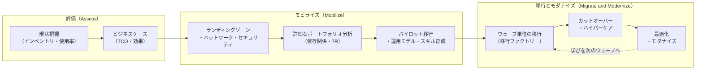
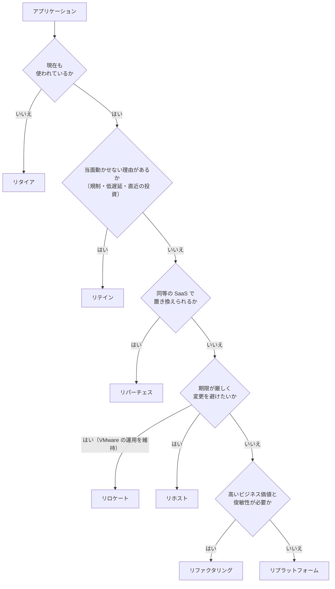

[ホーム](../README.md) > [Phase 3: プロフェッショナル](README.md) > 移行とモダナイゼーション

# 移行とモダナイゼーション

> **この章のゴール**
> - 大規模移行を「評価 → モビライズ → 移行とモダナイズ」の 3 フェーズのプログラムとして計画し、各フェーズの成果物を説明できる
> - ビジネス価値・技術的負債・ライセンス・依存関係・期限・スキルを基準に、アプリケーションごとの 7R を判断できる
> - 検出・評価・実行のツール（AWS Transform、Migration Evaluator、AWS Transform MGN、AWS DMS、AWS DataSync、Amazon EVS）を、2026年時点の提供状況を踏まえて選べる
> - 帯域の計算、Direct Connect のリードタイム、DNS の TTL、ウェーブ計画を含むカットオーバー計画を立てられる
> - リプラットフォーム、リファクタ（ストラングラーフィグ）、DB・.NET・メインフレームのモダナイズ経路を選べる
> - BYOL、Dedicated Hosts、License Manager を使い、商用ライセンスを考慮した移行先を設計できる
>
> **対応試験**: SAP-C03（D4 回復力、移行、事業継続 / D1 クラウドネイティブアーキテクチャの設計と実装 ※ドメイン名は仮訳）。SAP-C02 では第4分野「ワークロードの移行とモダナイゼーションの加速」に相当します。
> **目安時間**: 読む 6.5時間 / 確認問題と復習 2.5時間

> [!NOTE]
> 7R の定義、MGN・DMS・DataSync の基本、Direct Connect と Site-to-Site VPN の仕組みは [移行とハイブリッド接続](../02-associate/16-migration-hybrid.md) で学習済みとして進めます。本章は「数百〜数千台を、期限・予算・リスクの制約の中でどう移すか」という SAP の視点で扱います。

## この章の全体像

大規模な移行は、サーバーを 1 台ずつ移す作業の積み重ねではありません。複数のプロジェクトを束ねた **プログラム** です。成否を分けるのは個々の技術よりも、「どの順番で」「どの体制で」「何を基準に判断して」移すかです。

AWS の移行方法論は、次の 3 フェーズで進めます。AWS Migration Acceleration Program（MAP）でも同じ枠組みが使われます。

移行ツールは 2025〜2026 年に大きく入れ替わりました。まず現在の全体像を押さえます。

| 目的 | 新規に選ぶサービス（2026年9月時点） | 状況・注意点 |
|---|---|---|
| ビジネスケース・TCO | Migration Evaluator、AWS Transform（評価） | 利用可能 |
| 検出・依存関係の把握 | AWS Transform（検出・依存関係マッピング） | AWS Application Discovery Service は 2025年10月に新規受付終了を発表 |
| 移行計画・進捗管理 | AWS Transform（ウェーブ計画）、MGN のアプリケーション / ウェーブ機能 | AWS Migration Hub（Strategy Recommendations、Orchestrator、Journeys を含む）は 2025年11月に新規受付終了を発表 |
| サーバーのリホスト | AWS Transform MGN（旧 AWS Application Migration Service） | 2026年6月に名称変更。API とレプリケーションエンジンは同じ |
| VMware からの移行 | AWS Transform for VMware、Amazon EVS | Amazon EVS は 2025年8月に一般提供開始、東京リージョンで利用可能 |
| データベース移行 | AWS DMS（DMS Schema Conversion、同種データ移行、DMS Serverless） | 利用可能 |
| ファイル・オブジェクト転送 | AWS DataSync、AWS Data Transfer Terminal | Snowball Edge は 2025年11月7日から新規受付終了（2025年10月に発表） |
| リファクタの基盤 | API Gateway / ALB などで構築 | Migration Hub Refactor Spaces は Migration Hub とともに 2025年11月に新規受付終了を発表 |
| .NET | AWS Transform for .NET | AWS .NET Modernization Tools は 2025年11月に新規受付終了を発表 |
| メインフレーム | AWS Transform for mainframe | AWS Mainframe Modernization は、マネージドランタイム環境（2025年11月）とセルフマネージド（2026年6月）の両方で新規受付終了を発表 |

> [!IMPORTANT]
> 新規受付終了（メンテナンス）になったサービスは、**既存の利用者は引き続き使えます**。一方、新しい設計では推奨されません。
> SAP-C02 までの問題や古い教材では「Application Discovery Service で依存関係を収集し、Migration Hub で追跡する」「Snowball Edge でオフライン転送する」「AWS Mainframe Modernization でリファクタする」が正解になる形で出題されてきました。SAP-C03 でも旧サービス名が登場する可能性があります。**仕組みと役割は理解したうえで、新規の設計では後継サービスを選ぶ** という二段構えで覚えてください。最新の一覧は [メンテナンス中のサービス一覧](https://docs.aws.amazon.com/general/latest/gr/maintenance_services.html) で確認できます。

## 1. 移行プログラムの全体像

### 1.1 なぜ「プログラム」として設計するのか

数百台規模の移行でよくある失敗は、技術ではなく進め方に原因があります。

- アカウント構成・ネットワーク・セキュリティの基盤がないまま移行を始め、後から作り直しになる
- 依存関係を把握せずに一部だけ移し、オンプレミスとの通信遅延で性能障害が起きる
- 業務部門との合意（停止時間、テスト、判定基準）がなく、カットオーバーが延期され続ける
- 移行後にライトサイジングやオンプレミス資産の廃止をせず、コストが二重にかかり続ける

これらを防ぐため、移行を 3 つのフェーズに分け、フェーズごとに「問い」と「成果物」を明確にします。

| フェーズ | 答える問い | 主な活動 | 成果物 |
|---|---|---|---|
| 評価（Assess） | 移行すべきか、効果はどれくらいか | 概要インベントリと使用率の収集、TCO 試算、移行準備状況の評価（Migration Readiness Assessment） | ビジネスケース、概算の 7R 分布、概算スケジュール |
| モビライズ（Mobilize） | どう移すか、準備はできているか | ランディングゾーン、ネットワーク接続、セキュリティ基盤、運用モデルと CCoE、スキル育成、詳細なポートフォリオ分析、ウェーブ計画、パイロット移行 | 移行の土台、ウェーブ計画、ランブック、検証済みの移行手順 |
| 移行とモダナイズ（Migrate and Modernize） | 計画どおり安全に移せるか | ウェーブ単位の移行、カットオーバー、ハイパーケア、最適化とモダナイズ | 移行済みワークロード、廃止したオンプレミス資産、最適化の実績 |

### 1.2 評価フェーズ

評価フェーズの目的は、経営層が「移行する」と意思決定できる材料をそろえることです。

- **ビジネスケース**: オンプレミスの総保有コスト（ハードウェア更新、データセンター費用、保守、ライセンス、運用人件費）と AWS 移行後のコストを比較します。オンプレミスのサーバーはピークに合わせて過剰に用意されていることが多いため、**実際の使用率に基づくライトサイジング** が試算の精度を大きく左右します。
- **移行準備状況の評価**: AWS Cloud Adoption Framework（AWS CAF）の 6 つの観点（ビジネス、人材、ガバナンス、プラットフォーム、セキュリティ、運用）で、組織の準備度とギャップを洗い出します。
- **概算の 7R 分布**: 全体のうち何割をリホストし、何割をリプラットフォームするかといった方向性を決めます。個々のアプリの決定はモビライズで行います。

### 1.3 モビライズフェーズ

モビライズは「移行を大量に、安全に、繰り返し実行できる状態」を作るフェーズです。SAP の問題で最も問われやすいのはここです。

- **ランディングゾーン**: AWS Control Tower などでマルチアカウントの基盤、ガードレール、ログの集約を整えます（[マルチアカウント戦略とガバナンス](02-multi-account-governance.md)）。
- **ネットワーク**: Direct Connect の発注、ハイブリッド DNS、IP アドレス設計を行います。Direct Connect は開通まで数週間〜数か月かかることがあるため、このフェーズの早い段階で発注します（4.5 節）。
- **セキュリティと運用**: ID 連携、暗号化、監視、バックアップ、パッチ適用の標準を決めます。移行後の運用を誰が担うか（運用モデル）もここで決めます。
- **詳細なポートフォリオ分析**: 依存関係を把握し、アプリごとに 7R を決め、移行グループとウェーブに分けます（2〜3 節、7 節）。
- **パイロット移行**: 依存関係が少なく重要度の低いアプリを実際に移し、ツール・手順・引き継ぎを端から端まで検証します。ここで得た教訓をランブックに反映します。

### 1.4 移行とモダナイズフェーズ

計画したウェーブを、決まった手順で繰り返し実行します。この「型」を **移行ファクトリー** と呼びます。

- 1 ウェーブごとに「準備 → テスト起動 → カットオーバー → ハイパーケア（移行直後の手厚い監視と支援）」を回します。
- ウェーブが終わるたびに振り返り、ランブックと見積もりを改善します。
- 移行が落ち着いたワークロードから、ライトサイジング・購入オプションの適用・マネージドサービスへの置き換え（モダナイズ）を進めます（8 節）。

> [!TIP]
> **試験のポイント**: 「移行を始める前に、統制の効いたマルチアカウント環境とセキュリティの基盤を用意したい」→ モビライズでランディングゾーン（Control Tower）を整備。「移行手順とツールを本番規模の前に検証したい」→ 低リスクのアプリで **パイロット移行**。「期限が厳しく台数が多い」→ まずリホストで移し、移行後にモダナイズ。

## 2. ポートフォリオ分析と 7R

### 2.1 7R のおさらい

| 戦略 | 内容 | 代表的な手段 |
|---|---|---|
| リタイア | 使われていないものを廃止する | ― |
| リテイン | 当面はオンプレミスに残す | ハイブリッド接続で共存 |
| リホスト | 変更せずにそのまま移す（リフトアンドシフト） | AWS Transform MGN |
| リロケート | ハイパーバイザー単位で移す | Amazon EVS、VMware Cloud on AWS |
| リプラットフォーム | 一部を最適化して移す（リフトアンドリシェイプ） | RDS / Aurora、ECS / Fargate、Elastic Beanstalk |
| リパーチェス | SaaS などの製品へ買い替える | AWS Marketplace の SaaS |
| リファクタリング | クラウドネイティブに再設計する | Lambda、ECS / EKS、DynamoDB、EventBridge |

### 2.2 判断基準

7R は「好み」ではなく、次の基準の組み合わせで決めます。SAP の問題文には、これらの基準がそのまま条件として書かれます。

| 判断基準 | 見るべき指標 | 選択の傾向 |
|---|---|---|
| ビジネス価値・戦略上の重要度 | 差別化の源泉か、変更頻度、売上への寄与 | 高い: リファクタリング候補 / 低い: リホスト、リパーチェス、リタイア |
| 技術的負債 | サポート終了の OS やミドルウェア、障害頻度、拡張の難しさ | 負債が大きく延命できない: リプラットフォームまたはリファクタリング / 健全: リホスト |
| ライセンス | 商用 DB・OS の更新時期と費用、BYOL の可否、ベンダーのクラウド条件 | 高額な商用 DB: Aurora へのリプラットフォーム、Babelfish / BYOL に制約: Dedicated Hosts（6 節） |
| 依存関係 | 密結合、低レイテンシーの通信、共有 DB | 同じウェーブでまとめて移す、または一時的にリテイン |
| 期限（タイムライン） | データセンター契約の終了、ハードウェア保守の期限 | 厳しい: リホストまたはリロケート（移行後にモダナイズ） |
| スキル・組織 | チームのクラウド・コンテナ経験、運用体制 | 不足: マネージドサービスへのリプラットフォーム、パートナー活用 |
| コンプライアンス | 規制、データ所在地、監査要件 | 満たせない間はリテイン、または要件を満たすリージョン・Outposts |
| 利用状況 | アクセスがほぼない、機能が重複している | リタイア |

### 2.3 判断フロー

複数の基準を実務で当てはめるときは、次の順で絞り込むと迷いにくくなります。**先に「移さない」選択肢（リタイア・リテイン・リパーチェス）を除外する** のがポイントです。移す必要のないものを移すのは最大の無駄だからです。

### 2.4 「先に移す」か「移しながら変える」か

大規模移行では、全体の方針として次の 2 つのどちらを基本にするかを決めます。

| 観点 | 先に移行（リホスト後にモダナイズ） | 移行と同時にモダナイズ |
|---|---|---|
| 期間 | 短い。データセンター退去の期限に合わせやすい | 長い |
| リスク | 変更が少なく低い | 変更が多く高い |
| 効果が出る時期 | データセンター費用はすぐ減る。マネージドの恩恵は後から | 最初からマネージド・弾力性の恩恵を得られる |
| 手間 | 移行とモダナイズの二段階になる | 一度で済む |
| 向く対象 | 大量の汎用的なサーバー | 少数の戦略的なアプリケーション |

実際のプログラムでは、大部分をリホストで素早く移し、ビジネス価値の高い一部だけを移行と同時にモダナイズする **組み合わせ** が一般的です。

> [!WARNING]
> **ひっかけ注意**: 「期限まで 6 か月、数百台」という条件で「すべてをマイクロサービスへリファクタリングする」選択肢は、技術的に正しくても期限を満たしません。逆に「リホストではクラウドの利点が得られない」も誤りです。リホスト後はライトサイジング、購入オプション、マネージドサービスへの段階的な置き換えが可能になり、モダナイズへの最短の第一歩になります。

> [!TIP]
> **試験のポイント（キーワード → 戦略）**: 「アクセスログがほぼない」→ リタイア。「規制で当面オンプレミス」「最近ハードウェアを更新した」→ リテイン。「CRM を SaaS に置き換え」→ リパーチェス。「VMware の運用ツールとスキルを維持」→ リロケート。「コード変更なしで最速」→ リホスト。「DB の管理負荷を減らしたい、コード変更は最小」→ リプラットフォーム。「俊敏性・スケーラビリティのために再設計」→ リファクタリング。

## 3. 検出と評価

### 3.1 何を収集するか

ポートフォリオ分析の精度は、収集するデータの質で決まります。構成情報だけでなく、**使用率・依存関係・変更量** まで集めるのが SAP レベルの計画です。

| 分類 | 例 | 何に使うか |
|---|---|---|
| 構成情報 | CPU、メモリ、ディスク、OS、ミドルウェア、DB エンジン | 移行先とツールの選定 |
| 使用率 | CPU・メモリのピークと 95 パーセンタイル、IOPS、スループット | ライトサイジング |
| ネットワーク依存関係 | 通信元と通信先、ポート、頻度、通信量 | 移行グループとウェーブの分割 |
| アプリケーション情報 | オーナー、業務上の重要度、RPO / RTO、メンテナンス可能な時間帯 | 優先順位とカットオーバー計画 |
| ライセンス | 商用 OS・DB・ミドルウェアの契約形態、BYOL の可否 | 移行先とテナンシーの選定（6 節） |
| 変更量 | ディスクへの 1 日あたりの書き込み量、DB のトランザクションログの生成量 | レプリケーションと帯域の計画（4.5 節） |

### 3.2 検出ツールの現状

これまでの定番は、**AWS Application Discovery Service（ADS）** でデータを集め、**AWS Migration Hub** で移行を追跡する構成でした。

- ADS: エージェント型（サーバー内のプロセスやネットワーク接続まで収集し、依存関係を把握できる）と、エージェントレス型（VMware vCenter から VM の構成と使用率を収集）の 2 方式がありました。
- Migration Hub: 移行状況の一元管理に加え、Strategy Recommendations（アプリごとの戦略の推奨）、Orchestrator（移行ワークフローの自動化）、Journeys などの機能がありました。

ADS は **2025年10月に新規受付終了を発表**、Migration Hub（Strategy Recommendations、Orchestrator、Journeys、Refactor Spaces を含む）は **2025年11月に新規受付終了を発表** しています。既存の利用者は使い続けられますが、新規の利用者は **AWS Transform** と **Migration Evaluator** を使います。

> [!WARNING]
> **ひっかけ注意**: 古い問題では「サーバー間の依存関係を把握する → ADS のエージェント（Discovery Agent）」「移行の進捗を一元管理する → Migration Hub」が正解でした。2026年以降に新規で移行を始める組織の設計としては、AWS Transform（検出・依存関係マッピング・ウェーブ計画）を選びます。問題文に「既に ADS を利用している」とあれば ADS の継続利用も妥当です。

### 3.3 Migration Evaluator ― ビジネスケースの作成

Migration Evaluator（旧 TSO Logic）は、評価フェーズで **移行のビジネスケース** を作るためのサービスです。

- オンプレミスにエージェントレスのコレクターを置き、仮想化基盤やサーバーから構成と使用率を一定期間収集します。既存ツールのエクスポートを取り込む方法もあります。
- 使用率に基づいてライトサイジングした EC2 の構成と、ライセンスの選択肢（License Included と BYOL の比較など）を含めた移行後のコストを試算します。
- 出力はオンプレミスと AWS の TCO 比較レポートです。経営層向けの意思決定材料として使います。

「移行の意思決定の前に、実際の使用率に基づいたコスト比較を作りたい」という要件なら Migration Evaluator です。サーバーを実際に移すツールではない点に注意してください。

### 3.4 AWS Transform ― エージェント型 AI による移行とモダナイゼーション

**AWS Transform**（2025年5月に一般提供開始）は、生成 AI のエージェントが移行とモダナイゼーションの作業を実行するサービスです。エージェントが分析・計画・変換を進め、**人が要所で確認・承認する（ヒューマンインザループ）** 形で動きます。Web の画面上で「ジョブ」を作り、チームで共同作業します。

| 機能 | エージェントが行うこと |
|---|---|
| 移行の評価 | インベントリから移行のビジネスケースとコスト試算を作成 |
| VMware（AWS Transform for VMware） | 検出、依存関係マッピング、アプリケーションのグループ化、ウェーブ計画、ネットワーク変換（RVTools や VMware NSX のエクスポートから VPC などを構築）、EC2 へのリホスト |
| メインフレーム（AWS Transform for mainframe） | コード分析、ドキュメント生成、ビジネスロジックの抽出、ドメインへの分解、COBOL から Java へのリファクタ |
| .NET（AWS Transform for .NET） | Windows 専用の .NET Framework アプリを、Linux で動くクロスプラットフォームの .NET へ移植 |
| フルスタック Windows モダナイゼーション | .NET アプリと SQL Server などを含む Windows スタック全体のモダナイズ |
| AWS Transform custom（2025年12月） | 言語バージョンやフレームワークのアップグレードなど、組織固有の変換を定義して大規模に適用 |

AWS Transform の VMware 移行では、サーバーのレプリケーションとカットオーバーに **AWS Transform MGN**（4.1 節）が使われます。2026年6月の名称変更で、MGN は「AWS Transform のレプリケーションエンジン」という位置付けが明確になりました。直接 MGN のコンソールで細かく制御する方法と、AWS Transform のエージェントに検出からネットワーク作成、リホスト（またはコンテナ化）までを任せる方法を選べます。

> [!TIP]
> **試験のポイント**: 「エージェント型 AI で大規模な VMware 移行を自動化」「依存関係の把握・ウェーブ計画・ネットワーク変換の手作業を減らしたい」「COBOL を Java に変換」「.NET Framework を Linux へ」→ AWS Transform。AWS Transform は計画と変換を担うサービスであり、アプリの実行環境ではありません。変換後の実行環境（EC2、ECS、EKS など）は別途設計します。

### 3.5 依存関係マッピングと移行グループ

収集した依存関係から、一緒に移すべきサーバーの集まり（**移行グループ**）を作り、それをウェーブに割り当てます。

- **通信が頻繁で遅延に敏感な組み合わせは同じウェーブで移します**。例えば、1 画面の表示で数百回 DB に問い合わせるアプリを先に AWS へ移し、DB をオンプレミスに残すと、Direct Connect 越しの数ミリ秒の往復が積み重なって応答時間が大きく悪化します。
- **共有サービスは先に用意します**。Active Directory のドメインコントローラー、DNS（Route 53 Resolver エンドポイント）、監視、踏み台などを最初のウェーブで AWS 側に用意すると、後続のウェーブが楽になります（[高度なネットワーク設計](04-advanced-networking.md)、[大規模な ID とアクセス管理](03-identity-federation.md)）。
- **ハードコードされた IP アドレス** は移行の障害になります。検出の段階で洗い出し、DNS 名に置き換えるか、IP アドレスを維持できる移行方式（VMware の場合の Amazon EVS と HCX など）を検討します。
- **バッチの連鎖やファイル連携** は、ネットワーク通信として見えにくい依存関係です。ジョブスケジューラーの定義やアプリのオーナーへのヒアリングで補います。

