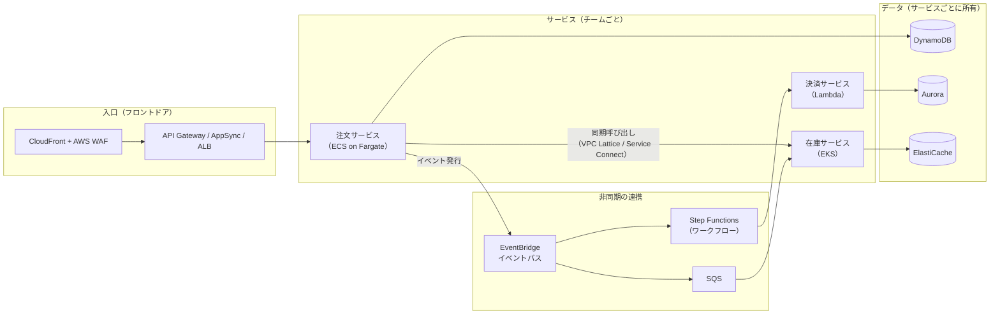
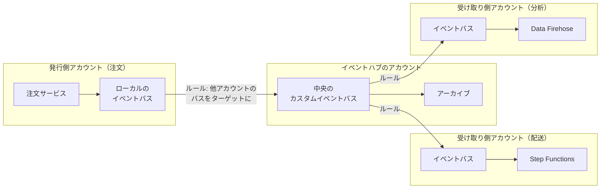
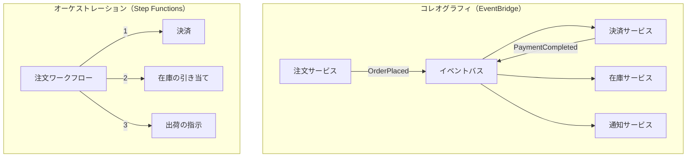
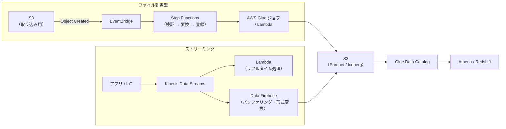
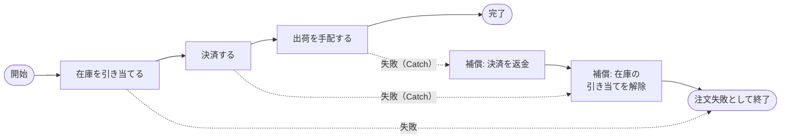
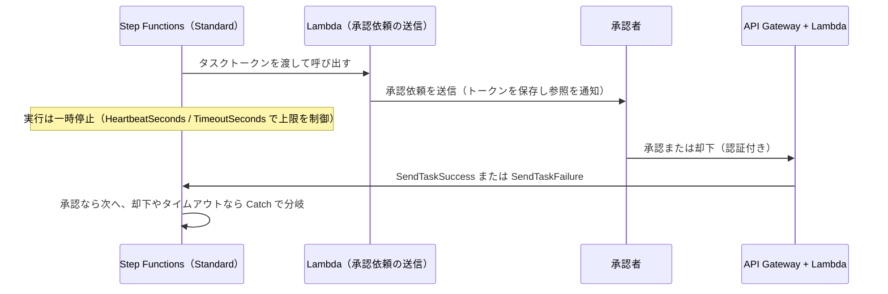
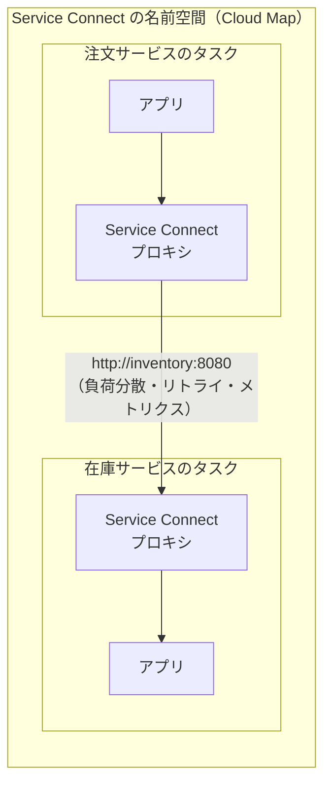
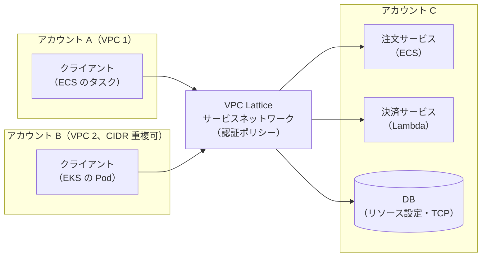
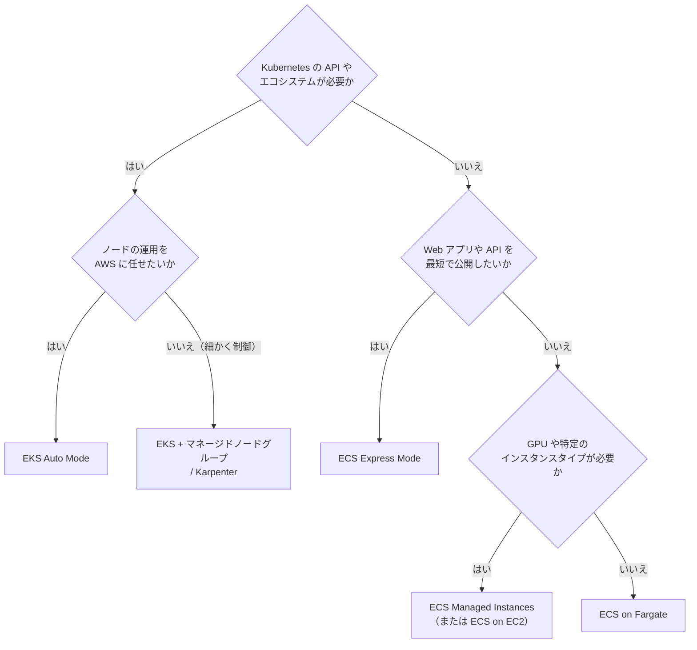

[ホーム](../README.md) > [Phase 3: プロフェッショナル](README.md) > クラウドネイティブ設計

# クラウドネイティブ設計

> **この章のゴール**
> - クラウドネイティブの原則を、疎結合・マネージドサービス・自動化・可観測性といった具体的な設計判断に落とし込める
> - EventBridge を中心としたイベント駆動アーキテクチャで、コレオグラフィとオーケストレーションを使い分けられる
> - Step Functions（Standard / Express、Distributed Map、エラー処理、Saga、タスクトークン）と Lambda durable functions を使い分け、冪等な処理を設計できる
> - マイクロサービス間の通信（同期 / 非同期、Cloud Map、ECS Service Connect、VPC Lattice）と入口（API Gateway / AppSync / ALB）を選べる。App Mesh からの移行先を説明できる
> - ECS / EKS / Fargate / EKS Auto Mode のコンテナ戦略と、スキャン・署名・最小権限・シークレット注入・ランタイム監視を含むコンテナセキュリティを設計できる
> - Database per service、CQRS、イベントソーシング、トランザクションアウトボックス、キャッシュの各パターンを使い分けられる
>
> **対応試験**: SAP-C03（D1 クラウドネイティブアーキテクチャの設計と実装 ※ドメイン名は仮訳）。SAP-C02 では第2分野「新しいソリューションのための設計」と第3分野「既存のソリューションの継続的な改善」に相当します。
> **目安時間**: 読む 6.5時間 / 確認問題と復習 2.5時間

> [!NOTE]
> SQS / SNS / EventBridge / Kinesis の基本は [アプリケーション統合](../02-associate/09-application-integration.md)、Lambda / API Gateway / Step Functions の基本は [サーバーレス](../02-associate/10-serverless.md)、ECS / EKS / Fargate / ECR の基本は [コンテナ](../02-associate/11-containers.md) で学習済みとして進めます。本章は「複数のサービスとチームにまたがるシステムを、どう組み合わせて設計するか」という SAP の視点で扱います。

## この章の全体像

クラウドネイティブな設計とは、クラウドの上で動かすことではなく、**クラウドの性質（弾力性、マネージドサービス、従量課金、API による自動化）を前提に設計すること** です。代表的な構成は次のようになります。



SAP-C03 の発表では、クラウドネイティブのパターンとして次のスキルが追加・強化されています（公式の試験ガイドは 2026年10月27日に公開予定）。

| 発表で示された主なスキル | この章の節 |
|---|---|
| サーバーレスのデータパイプライン | 3 節 |
| Step Functions による耐久性のあるワークフロー | 4 節 |
| VPC Lattice と ECS Service Connect によるサービス間通信（サービスメッシュ） | 5 節 |
| コンテナセキュリティ | 8 節 |

## 1. クラウドネイティブの原則

### 1.1 原則と設計への落とし込み

| 原則 | 意味 | 設計の例 | AWS の主な手段 |
|---|---|---|---|
| 障害を前提に設計する | 部品は必ず壊れる。壊れても全体は止めない | マルチ AZ、タイムアウトとリトライ、障害の隔離 | ELB、Auto Scaling、SQS、ARC |
| 疎結合 | 相手の障害・遅延・変更を波及させない | 非同期メッセージング、イベント、API の契約 | SQS、SNS、EventBridge、API Gateway |
| マネージドサービスを優先する | 差別化にならない運用は AWS に任せる | サーバーレス、マネージド DB | Lambda、Fargate、DynamoDB、Aurora |
| 計算はステートレスに、状態は外へ | どのインスタンスでも要求を処理できる | セッション・ファイルを外部に置く | DynamoDB、ElastiCache、S3 |
| すべてを自動化する | 手作業の変更をなくす | IaC、CI/CD、自動修復 | CloudFormation、AWS CDK、CodePipeline |
| 不変のインフラストラクチャ | 変更は修正ではなく置き換えで行う | イメージの入れ替え、ブルー/グリーンデプロイ | ECR、EC2 Image Builder、ECS の組み込みブルー/グリーン |
| 可観測性を組み込む | 外から内部の状態を推測できる | 構造化ログ、分散トレース、SLO | CloudWatch、X-Ray、Application Signals |
| 最小権限とゼロトラスト | ネットワークの内側でも無条件に信頼しない | サービスごとの IAM ロール、サービス間の認証 | IAM、VPC Lattice の認証ポリシー |
| 使った分だけ払う | 需要に合わせて伸縮する | ゼロまでスケール、スポット、Graviton | Lambda、Fargate Spot、Aurora Serverless v2 |

### 1.2 分散システムのコストを理解する

マイクロサービスは目的ではなく手段です。サービスを分けると、独立したデプロイとスケーリングが得られる一方で、次のコストを払うことになります。

- ネットワーク越しの呼び出しは失敗し、遅延が積み重なります。
- サービスをまたぐデータは結果整合性になり、分散トランザクションの扱いが必要になります（4.4 節、9 節）。
- 障害の調査には、分散トレースと相関 ID が欠かせません。

チームが小さく、変更の頻度も高くないなら、モジュールの境界をはっきりさせた **モジュラーモノリス** から始めるのも合理的な選択です。サービスの境界は、チームの境界（コンウェイの法則）と業務のまとまり（境界づけられたコンテキスト）に合わせます。

### 1.3 実行基盤の選び方

| 観点 | Lambda | コンテナ（ECS / EKS、Fargate） | EC2 |
|---|---|---|---|
| 実行時間 | 1 回の呼び出しは最大 15 分 | 制限なし | 制限なし |
| スケール | 要求に応じて自動（ゼロまで） | タスク / Pod 単位で自動 | インスタンス単位 |
| 運用の手間 | 最小 | 中（イメージ、クラスター） | 大 |
| 向く処理 | イベント駆動、断続的、短時間 | 常時稼働の API、長時間の処理、移植性 | 特殊な OS・ハードウェア、ライセンスの制約 |
| 料金の基準 | 要求数と実行時間 | vCPU とメモリの時間 | インスタンスの時間 |

大量で安定した負荷の Lambda には、**Lambda Managed Instances**（2025年11月）という選択肢もあります。自分のアカウントの EC2 インスタンス上で Lambda 関数を動かし、Savings Plans やリザーブドインスタンスを適用できます。

> [!TIP]
> **試験のポイント**: 「運用上のオーバーヘッドを最小に」「断続的な負荷」→ サーバーレス（Lambda、Fargate、DynamoDB）。「15 分を超える処理」→ Lambda 単体ではなく、コンテナ、Step Functions、または Lambda durable functions（4.7 節）。「特定のインスタンスタイプや GPU が必要」→ EC2 系（ECS Managed Instances、EKS のノード）。

## 2. イベント駆動アーキテクチャ

### 2.1 なぜイベント駆動にするのか

イベントとは「注文が確定した」のような **過去に起きた事実** です。発行側はイベントを出すだけで、誰がどう使うかを知りません。この性質から、次の利点が生まれます。

- **時間的な分離**: 受け取り側が停止していても、発行側は処理を続けられます。
- **独立したスケーリング**: 発行側と受け取り側は、それぞれの負荷に合わせて伸縮します。
- **拡張のしやすさ**: 新しい受け取り側を追加しても、発行側のコードは変わりません。
- **監査と再処理**: イベントを保存しておけば、後から再生して状態を作り直せます。

| 種類 | 意味 | 例 | 結合の強さ |
|---|---|---|---|
| コマンド | 相手に何かをさせる依頼 | 「在庫を引き当てよ」 | 強い（相手を知っている） |
| イベント（通知型） | 事実と ID だけを伝える | 「注文 123 が確定した」 | 弱い（詳細は受け取り側が問い合わせる） |
| イベント（状態転送型） | 事実と必要なデータを含めて伝える | 「注文 123 が確定した（商品・金額・配送先）」 | 弱い（受け取り側は問い合わせ不要） |

### 2.2 EventBridge を中心にした設計

Amazon EventBridge は、イベントを **ルールで振り分ける** サーバーレスのイベントバスです。

| 機能 | 内容 | 設計での使いどころ |
|---|---|---|
| イベントバス | 既定（AWS サービスのイベント）、カスタム、パートナー（SaaS） | ドメインごと、または組織の中央にカスタムバスを置く |
| ルール | イベントパターン（プレフィックス、数値の範囲、存在の有無、anything-but など）で絞り込み、ターゲットへ送る。1 つのルールにターゲットは最大 5 つ | 受け取り側ごとにルールを分け、独立して追加・削除する |
| 入力トランスフォーマー | ターゲットに渡す内容を加工する | 受け取り側の API の形式に合わせる |
| アーカイブと再生 | イベントを保存し、後から再送する | 障害からの復旧、新しい受け取り側のための過去データの投入 |
| スキーマレジストリ | イベントの構造を登録・検出し、コードのひな形を生成する | チーム間のイベントの契約 |
| EventBridge Pipes | ソース（SQS、Kinesis、DynamoDB Streams など）→ フィルター → 加工 → ターゲットを 1 対 1 でつなぐ | 変更データのイベント化（9.4 節）、つなぎのコードの削減 |
| EventBridge Scheduler | 1 回限り・定期のスケジュール実行 | cron サーバーの置き換え |

押さえるべき性質は次のとおりです。

- **配信は少なくとも 1 回** で、**順序は保証されません**。受け取り側は冪等にします（4.6 節）。順序が必要なら SQS FIFO や Kinesis Data Streams を使います。
- ターゲットへの送信に失敗すると、既定で **最大 24 時間・185 回** まで再試行します。再試行しきれなかったイベントは、ターゲットごとの DLQ（SQS）に送れます。
- イベントの最大サイズは **1 MB** です（2026年1月に拡大。2026年9月時点）。試験や古い教材では 256 KB として出題される可能性があります。大きなデータは S3 に置き、イベントには参照だけを入れます（クレームチェックパターン）。

### 2.3 マルチアカウント・マルチリージョンのイベントルーティング

大規模な組織では、アカウントをまたいでイベントを流します。



- 他のアカウントのイベントバスをルールのターゲットにできます。受信側のバスには、送信元を許可するリソースベースのポリシーを設定します。組織全体を許可するには `aws:PrincipalOrgID` 条件を使います。
- 他のリージョンのイベントバスもターゲットにできます。
- **グローバルエンドポイント** を使うと、プライマリのリージョンのバスに障害が起きたときに、Route 53 のヘルスチェックに基づいてセカンダリのリージョンへイベントの受け付けを切り替えられます。

中央のハブを置く構成は、ルーティングとアーカイブを一元管理できる一方で、ハブのチームがボトルネックになりがちです。ドメインごとにバスを持ち、必要なイベントだけを他のドメインへ流す構成と、組織の規模に応じて使い分けます。

### 2.4 コレオグラフィとオーケストレーション

複数のサービスで業務を進める方法は、大きく 2 つあります。



| 観点 | コレオグラフィ | オーケストレーション |
|---|---|---|
| 制御の方法 | 各サービスがイベントに反応して自律的に動く | 中央のワークフローが順序と分岐を指示する |
| 結合度 | 最も弱い。発行側は受け取り側を知らない | ワークフローが各サービスの API を知っている |
| 全体の流れの把握 | 難しい（流れが各サービスに分散） | 容易（ワークフローの定義と実行履歴で見える） |
| エラー処理・補償 | 各サービスに分散して実装する | ワークフローで一元的に扱える（Retry / Catch、Saga） |
| 変更のしやすさ | 受け取り側の追加が容易 | 流れの変更はワークフローの変更で済む |
| 向く処理 | 独立した多数の反応（通知、分析、キャッシュ更新） | 順序・条件・期限・補償が重要な業務プロセス（注文、承認、決済） |

実務では **両方を組み合わせます**。ドメインの中の手順はオーケストレーション（Step Functions）で確実に進め、ドメインの間はイベント（EventBridge）で疎に結ぶのが定石です。

> [!TIP]
> **試験のポイント**: 「多数のチームのシステムが、発行側を変えずに同じ出来事へ反応できるようにしたい」→ EventBridge のカスタムバスとルール（コレオグラフィ）。「複数の手順を順序どおりに実行し、失敗時に補償したい」「処理の状態を可視化したい」→ Step Functions（オーケストレーション）。「SaaS のイベントを取り込みたい」→ パートナーイベントバス。

> [!WARNING]
> **ひっかけ注意**: 1 つの SQS キューを複数の受け取り側で共有すると、各メッセージは **どれか 1 つの受け取り側だけ** が処理します（競合コンシューマー）。全員に届けたいなら、SNS や EventBridge でファンアウトし、受け取り側ごとにキューを用意します。また、EventBridge は順序を保証しないため、「順序どおりに処理」が要件なら SQS FIFO や Kinesis Data Streams を選びます。

### 2.5 イベント設計のベストプラクティス

- **封筒（エンベロープ）をそろえる**: `source`、`detail-type`、`detail` の中にイベント ID、発生時刻、スキーマのバージョン、相関 ID を入れます。
- **スキーマは後方互換で進化させる**: フィールドの追加は許し、削除や意味の変更は新しいバージョン（新しい `detail-type`）として出します。
- **受け取り側を冪等にする**: 少なくとも 1 回の配信なので、同じイベントが 2 回届いても結果が変わらないようにします（4.6 節）。
- **失敗を隔離する**: ターゲットごとに DLQ を設定し、再処理（リドライブ）の手順を決めておきます。
- **追跡できるようにする**: 相関 ID とトレースのコンテキストを引き継ぎ、分散トレースでイベントの流れを追えるようにします。

| 要件 | 選ぶサービス |
|---|---|
| ルールによる柔軟な振り分け、AWS サービスや SaaS のイベント、スキーマの管理 | EventBridge |
| 大量の購読者への単純なファンアウト、メール・SMS・モバイル通知 | SNS（順序が必要なら SNS FIFO） |
| 1 つの処理側へのバッファリング、負荷平準化、再試行 | SQS |
| 順序付きの大量のストリーム、複数の処理側による保持期間内の再読み込み | Kinesis Data Streams |
| Apache Kafka との互換性が必要 | Amazon MSK |

## 3. サーバーレスデータパイプライン

データパイプラインをサーバーレスで組むと、クラスターの運用が不要になり、データ量に応じて自動で伸縮し、処理した分だけ支払えます。さらに、定時のポーリングではなく **データの到着をきっかけに処理を始める** ため、遅延も小さくなります。



### 3.1 代表的なパターン

| パターン | 流れ | 向くケース |
|---|---|---|
| ファイル到着型 | S3 → EventBridge → Step Functions → Glue / Lambda → S3（Parquet / Iceberg）→ Glue Data Catalog | 取引先からのファイル、日次の取り込み |
| ストリーミング | Kinesis Data Streams → Lambda / Managed Service for Apache Flink → Data Firehose → S3 | ログ、IoT、クリックストリーム |
| 変更データ（CDC） | DynamoDB Streams / DMS → EventBridge Pipes / Kinesis → 変換 → 分析用のストア | 業務 DB の変更を分析や他のサービスへ届ける |
| 大量オブジェクトの一括処理 | Step Functions の Distributed Map → Lambda / Express ワークフロー | 数百万ファイルの変換・検証（4.2 節） |
| 定期実行 | EventBridge Scheduler → Step Functions | 集計、レポートの作成 |

変換の処理には、データ量と処理の性質に合ったサービスを選びます。

| 処理 | 選択肢 | 目安 |
|---|---|---|
| 小さな変換・検証 | Lambda | 1 回 15 分まで、メモリは最大 10,240 MB |
| 大規模な ETL（Spark） | AWS Glue、Amazon EMR Serverless | 大容量のデータの結合・集計 |
| SQL で書ける変換 | Amazon Athena（CTAS、INSERT INTO） | 分析者が SQL のまま保守できる |
| 状態を持つストリーム処理 | Amazon Managed Service for Apache Flink | ウィンドウ集計、異常検知 |
| コンテナによる長時間の処理 | Fargate、AWS Batch | 既存のコンテナ化されたジョブ |

### 3.2 設計のポイント

| 論点 | 起きる問題 | 対策 |
|---|---|---|
| 再処理と重複 | リトライや再実行で同じデータが二重に書き込まれる | 冪等な書き込み（パーティション単位の上書き、Iceberg の MERGE による upsert、イベント ID での重複排除） |
| 失敗の隔離 | 1 件の不正データでバッチ全体が止まる | DLQ、失敗時の送信先、Kinesis のイベントソースマッピングのバッチ分割（BisectBatchOnFunctionError）と部分的なバッチ応答、Step Functions の Catch |
| 背圧（下流の処理能力の不足） | 下流の DB や API が過負荷になる | SQS でバッファリング、SQS のイベントソースマッピングの最大同時実行数、Lambda の予約済み同時実行 |
| 小さなファイル | 大量の小さなファイルで分析が遅くなる | Firehose のバッファリング、Iceberg テーブルの定期的なコンパクション |
| スキーマの変化 | 項目の追加で下流が壊れる | Glue Schema Registry、Iceberg のスキーマ進化 |
| データ品質 | 不正なデータが分析に混ざる | AWS Glue Data Quality のルールで検証し、不合格のデータを隔離 |
| オーケストレーション | 手順・依存関係・再試行の管理 | Step Functions（AWS サービスとの直接統合）、EventBridge Scheduler、Amazon MWAA（Airflow の DAG が既にある場合） |

> [!WARNING]
> **ひっかけ注意**: 古い問題では、定期的な ETL の答えとして **AWS Data Pipeline** が登場します。Data Pipeline は新規受付を終了しており、新しい設計では Step Functions、AWS Glue（ワークフロー、トリガー）、Amazon MWAA を使います。

> [!TIP]
> **試験のポイント**: 「ファイルの到着をきっかけに、サーバーを管理せずに処理」→ S3 のイベント → EventBridge → Step Functions / Lambda。「ストリームを S3 に取り込み、形式を Parquet に変換」→ Data Firehose。「1 件の不正レコードで処理全体を止めたくない」→ 部分的なバッチ応答、DLQ、バッチの分割。レイクハウス（Iceberg、Lake Formation）の設計は [データと分析のアーキテクチャ](10-data-analytics-architecture.md) で扱います。

## 4. 耐久性のあるワークフロー

### 4.1 耐久性のあるワークフローと Standard / Express

注文処理、審査、データの移行のように、数分から数か月にわたり、多数の手順を踏む処理があります。途中で障害が起きても、**完了した手順をやり直さずに続きから再開できる** ことを「耐久性がある（durable）」と言います。そのためには、各手順の結果と現在の状態を、処理の外に確実に保存しておく必要があります。

AWS Step Functions は、この状態管理を AWS が引き受けるワークフローのサービスです。2 種類のワークフローがあります。

| 観点 | Standard | Express |
|---|---|---|
| 最長の実行時間 | 1 年 | 5 分 |
| 実行のセマンティクス | ワークフローの実行は正確に 1 回（exactly-once） | 非同期: 少なくとも 1 回 / 同期: 最大 1 回 |
| 料金の基準 | 状態遷移の回数 | 実行回数と実行時間（使用メモリ量に応じる） |
| 実行履歴 | コンソールと API で確認できる（終了後 90 日間） | CloudWatch Logs に出力する（ログの設定が必要） |
| ジョブの完了待ち（.sync）とコールバック（.waitForTaskToken） | 対応 | 非対応 |
| 失敗したステートからの再開（redrive） | 対応 | 非対応 |
| 向く処理 | 長時間の業務プロセス、人の承認、監査が必要な処理 | 大量・短時間のイベント処理、ストリームの変換、API のバックエンド |

> [!TIP]
> **試験のポイント**: 「最大で数日〜数か月」「人の承認を待つ」「実行の履歴を監査に使う」→ Standard。「毎秒大量の短い処理」「最もコスト効率よく」「5 分以内に終わる」→ Express。Express でコールバック（タスクトークン）を待つ選択肢は誤りです。

### 4.2 Distributed Map による大規模な並列処理

Map ステートには 2 つのモードがあります。

- **インライン Map**: 同じ実行の中で要素を並列に処理します。同時実行は最大 40 で、すべての処理が 1 つの実行履歴に記録されます（1 つの実行履歴のイベント数には 25,000 の上限があります）。数十〜数百件の処理に向きます。
- **Distributed Map**: 要素（またはまとめた要素のバッチ）ごとに **子ワークフローの実行** を起動します。最大 10,000 の子ワークフローを並列に実行でき、それぞれが独自の実行履歴を持ちます。

Distributed Map の主な設定は次のとおりです。

| 設定 | 内容 |
|---|---|
| 項目の読み込み（ItemReader） | S3 の CSV・JSON、S3 インベントリのマニフェスト、プレフィックス配下のオブジェクト一覧などから処理対象を読む |
| バッチ化（ItemBatcher） | 複数の要素をまとめて 1 つの子ワークフローに渡し、起動回数とコストを減らす |
| 最大同時実行数（MaxConcurrency） | 下流の DB や API を守るために並列度を制限する |
| 許容する失敗（ToleratedFailurePercentage / Count） | 一定の割合・件数までの失敗なら全体を成功とみなす |
| 結果の書き出し（ResultWriter） | 子ワークフローの結果を S3 に書き出す（失敗した要素の特定と再処理に使う） |
| 子ワークフローの種類 | 短い処理なら Express（安価）、長い処理や完了待ちが必要なら Standard |

### 4.3 エラー処理

Step Functions では、エラー処理をワークフローの定義として宣言します。

```json
{
  "ChargePayment": {
    "Type": "Task",
    "Resource": "arn:aws:states:::lambda:invoke",
    "Parameters": {
      "FunctionName": "charge-payment",
      "Payload": {
        "orderId.$": "$.orderId",
        "idempotencyKey.$": "$.orderId"
      }
    },
    "TimeoutSeconds": 30,
    "Retry": [
      {
        "ErrorEquals": ["Lambda.ServiceException", "Lambda.TooManyRequestsException", "States.Timeout"],
        "IntervalSeconds": 2,
        "BackoffRate": 2.0,
        "MaxAttempts": 5,
        "MaxDelaySeconds": 60,
        "JitterStrategy": "FULL"
      }
    ],
    "Catch": [
      {
        "ErrorEquals": ["PaymentDeclined"],
        "ResultPath": "$.error",
        "Next": "ReleaseInventory"
      }
    ],
    "Next": "ArrangeShipping"
  }
}
```

- **Retry**: エラーの種類ごとに、間隔（IntervalSeconds）、倍率（BackoffRate）、回数（MaxAttempts）、待ち時間の上限（MaxDelaySeconds）、ジッター（JitterStrategy）を指定します。一時的なエラーだけを再試行し、業務エラー（カード決済の拒否など）は再試行しません。
- **Catch**: 再試行しても失敗したとき、またはすぐに扱うべき業務エラーのときに、補償や通知などの別のステートへ進めます。`ResultPath` でエラー情報を入力に残しておくと、後続の処理で原因を使えます。
- **タイムアウト**: `TimeoutSeconds`（ステート全体）と `HeartbeatSeconds`（コールバックやアクティビティの生存確認）を明示的に設定し、応答のない処理を待ち続けないようにします。
- **redrive**: Standard ワークフローが失敗した場合、原因を直したあとで **失敗したステートから再開** できます。成功済みのステートはやり直しません。

### 4.4 Saga パターンと補償

マイクロサービスでは、サービスごとに DB が分かれているため、複数のサービスにまたがる処理を 1 つの DB トランザクションで囲めません。**Saga パターン** は、各サービスのローカルなトランザクションを順に実行し、途中で失敗したら、完了済みの手順を **補償トランザクション**（逆の業務操作）で打ち消す方法です。



設計のポイントは次のとおりです。

- **補償は「取り消し」ではなく「逆の業務操作」**: 決済の補償は返金、在庫の引き当ての補償は解除です。DB のロールバックとは異なり、返金の記録のように履歴が残ります。
- **補償は逆順に、冪等に、再試行可能に**: 補償も失敗しうるため Retry を付け、それでも失敗したら人が対応するキューへ送ります。
- **途中の状態が他から見える**: 「仮引き当て」「決済処理中」などの状態を定義し、他の処理がそれを前提に動けるようにします（結果整合性）。
- **後戻りできない手順を意識する**: 出荷のように取り消せない手順の後は、補償ではなく前進（再試行や代替手段）で回復するように順序を設計します。

Step Functions でオーケストレーションすると、補償の流れを Catch で一元的に表現でき、どの手順で失敗して何を補償したかが実行履歴に残ります。コレオグラフィ（イベント）でも Saga は実装できますが、流れが分散するため、手順の多い業務ではオーケストレーションのほうが保守しやすくなります。

### 4.5 タスクトークンによる人の承認

人の承認や外部システムの応答を待つには、**コールバック（.waitForTaskToken）** の統合パターンを使います。



- タスクの定義で `.waitForTaskToken` を付け、コンテキストオブジェクトの `$$.Task.Token` を Lambda、SQS、SNS などへ渡します。
- 実行は、トークンを指定した `SendTaskSuccess` / `SendTaskFailure` が呼ばれるまで一時停止します。待機中にコンピューティングは動いていません。
- `TimeoutSeconds` を過ぎると `States.Timeout` になり、Catch でエスカレーション（上長への再依頼など）へ進めます。
- タスクトークンは、実行を進められる「鍵」です。承認の API は認証を付け、トークンそのものを公開された URL にそのまま載せないようにします。
- この統合パターンは Standard ワークフローでのみ使えます。

### 4.6 冪等性

分散システムでは、「少なくとも 1 回」の配信、リトライ、再実行によって、**同じ処理が 2 回以上実行されることを前提に** 設計します。冪等（何回実行しても結果が同じ）にしておけば、重複は害になりません。

| 重複が起きる場所 | 例 | 対策 |
|---|---|---|
| クライアントの再送 | タイムアウト後の再送で、同じ注文が 2 回登録される | クライアントが作った冪等性キー（リクエスト ID）を受け取り、DynamoDB の条件付き書き込み（`attribute_not_exists`）で初回だけ処理する |
| メッセージの重複配信 | SQS 標準キュー、SNS、EventBridge は少なくとも 1 回の配信 | 処理済みのイベント ID を記録する。処理自体を upsert や絶対値の設定にする |
| ワークフローのリトライ・redrive | 決済の API 呼び出しが 2 回行われる | 外部の API に冪等性キー（注文 ID など）を渡す |
| ワークフローの二重起動 | 同じイベントで 2 回 StartExecution が呼ばれる | Standard ワークフローの実行名に業務キーを使う（同じ実行名では 90 日間、新しい実行を開始できない） |
| FIFO キューへの再送 | 送信側の再送 | SQS FIFO の重複排除 ID（5 分間の重複排除） |

冪等性キーの実装では、「処理中」と「完了」の状態を分けて記録し（同時に届いた重複を防ぐ）、完了時には結果も保存して、重複した要求に同じ応答を返します。記録には DynamoDB の TTL で有効期限を付けます。Lambda では、Powertools for AWS Lambda の冪等性ユーティリティがこの仕組みを提供しています。

### 4.7 Lambda durable functions との使い分け

**Lambda durable functions**（2025年12月に一般提供開始）は、複数の手順からなる処理を、ワークフローの定義ではなく **Lambda 関数のコードとして** 書ける機能です。

- コードの中で「ステップ（step）」「待機（wait）」「コールバック（外部からの応答待ち）」「他の Lambda 関数の呼び出し」を、SDK の耐久性のある操作として書きます。各操作の入力と結果は、実行の履歴として記録されます。
- 障害や待機からの再開時には、関数を先頭から再実行（リプレイ）しますが、完了済みのステップは記録済みの結果を返すため、やり直しません（チェックポイントとリプレイ）。そのため、ステップの外に乱数や現在時刻のような「実行のたびに変わる処理」を書かないことが重要です。
- 待機やコールバックで実行を中断し、**最大 1 年** まで待てます。待機中はコンピューティングの料金がかかりません。1 回の Lambda 呼び出しの上限（15 分）を超える処理を、コードのまま書けるのが大きな特徴です。

| 観点 | Step Functions | Lambda durable functions |
|---|---|---|
| 定義の方法 | Amazon States Language（JSON / YAML）、Workflow Studio で視覚的に | Lambda 関数のコード（対応ランタイムの SDK） |
| AWS サービスとの統合 | 多数のサービスをコードなしで直接呼び出せる（.sync、タスクトークンを含む） | コードから AWS SDK で呼び出す |
| 流れの可視化 | ステートの図と実行履歴で、開発者以外にも見える | 操作の履歴として記録される。流れはコードを読んで把握する |
| 最長の実行 | Standard は 1 年、Express は 5 分 | 最大 1 年 |
| 大規模な並列処理 | Distributed Map（最大 10,000 の子ワークフロー） | コードで記述する |
| 向く場面 | 複数のサービスやチームをまたぐ業務プロセス、運用担当者も流れを追いたい、ローコードで統合したい | アプリの開発チームがロジックをコードで完結させたい、テストをコードで書きたい、AI エージェントの多段処理 |

使い分けの目安は、「**流れそのものを組織で共有・監査したいか**」と「**ロジックがアプリのコードに閉じているか**」です。多数の AWS サービスをつなぐ業務プロセスや大規模な並列処理は Step Functions、アプリ内の多段処理を開発者がコードで管理したいなら durable functions が向きます。両者は組み合わせることもでき、Step Functions のワークフローの 1 つの手順として durable functions を呼び出す構成も取れます。

> [!NOTE]
> SAP-C03 の発表では「Step Functions による耐久性のあるワークフロー」が明示されています。Step Functions の Standard / Express、Distributed Map、エラー処理、Saga、タスクトークンを確実に押さえたうえで、durable functions は「コード中心で長時間の処理を書く新しい選択肢」として理解しておきましょう。

## 5. マイクロサービス間の通信

### 5.1 同期と非同期

| 観点 | 同期（HTTP / gRPC） | 非同期（キュー、イベント） |
|---|---|---|
| 結果の受け取り | その場で結果が必要な処理に向く | 結果は後で受け取る |
| 呼び出し先の障害 | 呼び出し元も失敗する | メッセージが溜まり、復旧後に処理される |
| 遅延 | 呼び出しの連鎖で積み重なる | 呼び出し元はすぐに応答できる |
| 障害への備え | タイムアウト、リトライ、サーキットブレーカー | DLQ、冪等性、再処理 |
| 例 | 在庫の照会、価格の計算 | 注文確定後の通知、ポイントの付与 |

同期呼び出しの連鎖は、可用性を掛け算で下げます。可用性 99.9% のサービスを 5 つ直列に呼ぶと、全体は 0.999⁵ ≈ **99.5%** になり、年間の停止時間の目安は約 9 時間から約 44 時間に増えます。「その場で結果が必要か」を問い、不要な部分は非同期にするのが基本です。

### 5.2 サービスの検出と App Mesh の終了

**AWS Cloud Map** は、サービスの名前と場所（IP アドレス、ポート、属性）を登録し、DNS または API（DiscoverInstances）で検出できるようにするサービスです。ECS のサービス検出と ECS Service Connect は Cloud Map の名前空間を使います。EKS では Kubernetes の Service と CoreDNS が同じ役割を担います。

検出だけでは、リトライ、暗号化、認可、メトリクスは得られません。これらをアプリの外で提供するのがサービスメッシュで、AWS では **AWS App Mesh**（Envoy のサイドカーを利用者が管理する方式）が使われてきました。App Mesh は 2024年9月に新規受付を終了し、**2026年9月30日にサポート終了** です（[サポート終了が発表されたサービスの一覧](https://docs.aws.amazon.com/general/latest/gr/sunset_services.html)）。

| 現在の構成 | 移行先 | 理由 |
|---|---|---|
| ECS のサービス同士の通信 | **ECS Service Connect** | ECS に統合されており、プロキシを利用者が管理する必要がない |
| EKS、または ECS・EKS・EC2・Lambda の混在 | **Amazon VPC Lattice**（EKS は AWS Gateway API Controller で統合） | サイドカーが不要で、コンピューティングの種類を問わない |
| VPC・アカウントをまたぐ通信、IAM による認可 | **Amazon VPC Lattice** | サービスネットワークを RAM で共有し、認証ポリシーで認可できる |
| 高度な mTLS やトラフィック制御が必須で、自社で運用できる | EKS 上の Istio などのオープンソースのメッシュ | 機能は豊富だが、運用の負荷が大きい |

> [!WARNING]
> **ひっかけ注意**: 試験の選択肢に App Mesh が登場しても、新規の設計では選びません。「サービスメッシュ」「サービス間のトラフィック制御」という言葉があれば、ECS なら Service Connect、アカウントや VPC、コンピューティングの種類をまたぐなら VPC Lattice を考えます。

### 5.3 ECS Service Connect



- ECS がタスクにプロキシを追加して管理します。アプリは `http://inventory:8080` のような短い名前で相手を呼ぶだけです。
- 負荷分散、リトライ、外れ値の検出（異常なタスクを一時的に外す）、接続のドレインを提供し、サービスごとのリクエスト数・エラー・遅延を CloudWatch のメトリクスとして出します。
- AWS Private CA の証明書を使って、サービス間の通信を TLS で暗号化できます。
- 2026年7月には、同じ AZ のタスクを優先して呼ぶゾーン認識ルーティングが追加され、AZ 間の遅延とデータ転送料金を抑えられるようになりました。
- 対象は ECS のサービスです。EKS や Lambda との通信には VPC Lattice を組み合わせます。

### 5.4 Amazon VPC Lattice



- **サービスネットワーク** という論理的な境界に、サービスと VPC を関連付けます。関連付けた VPC のクライアントは、VPC ピアリングや Transit Gateway なしでサービスを呼べます。VPC の CIDR が重複していても構いません。
- **サービス** はリスナー、ルール（パス、ヘッダー、メソッドによる振り分け、加重ルーティング）、ターゲットグループで構成します。ターゲットには EC2 インスタンス、IP アドレス、Lambda 関数、ALB、ECS のサービス、EKS の Pod（AWS Gateway API Controller）を使えます。
- **認証ポリシー** を、サービスネットワークとサービスの両方に設定できます。SigV4 で署名された要求を IAM で認可するため、「どのサービス（IAM ロール）がどの API を呼べるか」を宣言的に管理できます。
- サービスネットワークは AWS RAM でアカウント間に共有できます。**リソース設定** と **リソースゲートウェイ** を使えば、DB のような TCP のリソースも公開できます。ネットワーク側の詳細は [高度なネットワーク設計](04-advanced-networking.md) を参照してください。

### 5.5 比較

| 観点 | ECS Service Connect | Amazon VPC Lattice | Cloud Map（検出のみ） | AWS App Mesh 【サポート終了】 |
|---|---|---|---|---|
| 対象 | ECS のサービス同士 | EC2、ECS、EKS、Lambda、IP、TCP のリソース | 任意 | ECS、EKS、EC2 |
| 仕組み | ECS が管理するプロキシをタスクに追加 | VPC に組み込まれたマネージドなアプリケーション層のネットワーク（サイドカー不要） | 名前解決のみ | 利用者が管理する Envoy のサイドカー |
| VPC・アカウントをまたぐ通信 | 同じ名前空間の ECS サービスが中心 | サービスネットワークで複数の VPC・アカウントを接続（CIDR の重複可） | ネットワーク接続は別途必要 | ネットワーク接続は別途必要 |
| 暗号化・認可 | TLS（AWS Private CA） | TLS、IAM の認証ポリシー（SigV4） | なし | mTLS など |
| トラフィック制御 | リトライ、外れ値の検出、タイムアウト | パス・ヘッダーによる振り分け、加重ルーティング | なし | 豊富 |
| 状況（2026年9月時点） | 利用可能 | 利用可能 | 利用可能 | 2026年9月30日にサポート終了 |

### 5.6 同期呼び出しの回復性パターン

- **タイムアウト**: すべての呼び出しに設定します。下流ほど短くし、呼び出し元より先に呼び出し先がタイムアウトするようにします。
- **リトライ**: 一時的なエラーだけを、指数バックオフとジッターで、回数に上限を付けて再試行します。リトライの嵐で障害を悪化させないよう、全体の再試行の割合にも上限（リトライ予算）を設けます。再試行するのは冪等な操作だけです。
- **サーキットブレーカー**: 失敗が続いたら呼び出しを一時的に止め、すぐにエラーやフォールバックを返します。
- **バルクヘッド**: 呼び出し先ごとに接続プールやスレッドを分け、1 つの遅い依存先がすべての処理能力を使い切らないようにします。
- **フォールバックと縮退運転**: キャッシュの値や既定値で応答し、機能を絞ってでもサービスを続けます。
- **負荷制限**: 処理しきれない要求は早めに断り（API Gateway のスロットリングなど）、重要な要求を優先します。

回復性の設計と検証（FIS による障害注入など）は [回復力と事業継続](06-resilience-business-continuity.md) で扱います。

## 6. フロントドア: API Gateway / AppSync / ALB

外部からの要求を受ける「入口」は、プロトコル、認証、流量制御、キャッシュ、料金の違いで選びます。

| 観点 | Amazon API Gateway | AWS AppSync | Application Load Balancer |
|---|---|---|---|
| プロトコル | REST API / HTTP API / WebSocket API | GraphQL（サブスクリプションによるリアルタイム配信）、AppSync Events（WebSocket の Pub/Sub） | HTTP / HTTPS、gRPC、WebSocket |
| 認証・認可 | IAM、Cognito、Lambda オーソライザー、JWT（HTTP API）、API キー | API キー、IAM、Cognito、OIDC、Lambda | OIDC / Cognito による認証アクション |
| 流量制御 | スロットリング、使用量プラン（API キーごとの上限） | WAF のレートベースルールなどで補う | WAF のレートベースルールなどで補う |
| キャッシュ | REST API のキャッシュ（HTTP API にはない） | サーバー側のキャッシュ | なし（前段に CloudFront を置く） |
| AWS WAF | REST API に関連付け可（HTTP API は不可） | 関連付け可 | 関連付け可 |
| 長い処理 | 統合のタイムアウトは既定 29 秒（リージョン / プライベートの REST API は引き上げ可、HTTP API は最大 30 秒） | 長い処理は非同期にする | アイドルタイムアウトを最大 4,000 秒まで設定可 |
| プライベートな API | プライベート REST API（インターフェイス VPC エンドポイント経由） | プライベート API | 内部向けの ALB |
| 料金の基準 | 要求数（WebSocket は接続時間とメッセージ数） | 操作の回数、リアルタイムの更新数、接続時間 | 時間と LCU |
| 向くケース | 外部公開 API、パートナー向けの API キーと使用量プラン、Lambda の前段 | モバイル・Web で複数のデータソースを 1 回の要求で取得、リアルタイムの更新 | コンテナへの大量の要求、長時間の要求、gRPC、要求単価を抑えたい |

- 世界中の利用者に配信するなら、どの入口の前にも CloudFront を置き、エッジでのキャッシュ、AWS WAF、AWS Shield を効かせます。
- API Gateway の 29 秒を超える処理は、要求を受け付けて 202 を返し、結果はポーリング、WebSocket、AppSync のサブスクリプションで返す **非同期の API** にするのが定石です。
- サービス間（東西方向）の通信には、入口のサービスではなく VPC Lattice や Service Connect を使います。

> [!TIP]
> **試験のポイント**: 「パートナーごとに API キーと呼び出し回数の上限」→ API Gateway の使用量プラン。「モバイルアプリで複数のマイクロサービスのデータをまとめて取得し、変更をリアルタイムに受け取る」→ AppSync。「最も低コストでシンプルな JWT 認証付きの API」→ HTTP API。「コンテナへの大量の HTTP 要求、gRPC」→ ALB。

> [!WARNING]
> **ひっかけ注意**: HTTP API には AWS WAF を直接関連付けられず、キャッシュ機能もありません。WAF が必要なら REST API を選ぶか、HTTP API の前段に CloudFront + WAF を置きます。

## 7. コンテナ戦略

### 7.1 ECS と EKS

| 観点 | Amazon ECS | Amazon EKS |
|---|---|---|
| API・エコシステム | AWS 独自のシンプルな API | Kubernetes の API とエコシステム（Helm、オペレーター、CNCF のツール） |
| コントロールプレーンの料金 | 追加料金なし | クラスターごとの時間料金（Kubernetes バージョンの延長サポート期間は割高） |
| バージョンアップ | 利用者の作業はほぼない | Kubernetes のバージョンアップを定期的に計画・実施する |
| 学習・運用の負荷 | 小さい | 大きい（EKS Auto Mode で軽減できる） |
| 移植性 | AWS に特化 | オンプレミスや他のクラウドと運用を共通化できる |
| サービス間通信 | ECS Service Connect、VPC Lattice | VPC Lattice、Kubernetes の Service、オープンソースのメッシュ |
| 向くケース | AWS に集中し、シンプルに運用したい | Kubernetes の資産とスキルがある、ハイブリッド / マルチクラウドで共通化したい |

### 7.2 実行基盤の選択肢

| 選択肢 | AWS が管理する範囲 | 特徴 |
|---|---|---|
| **ECS Express Mode** | Fargate のサービス、ALB、Auto Scaling、HTTPS の URL を一括で用意 | Web アプリや API を最短で公開できる。追加料金なし。App Runner（2026年4月30日に新規受付終了）の後継として推奨 |
| **Fargate**（ECS / EKS） | サーバー、OS、キャパシティ | タスク / Pod ごとに分離される。GPU や特権コンテナは使えない。Fargate Spot で割引 |
| **ECS Managed Instances** | ECS 用の EC2 のプロビジョニング、スケーリング、パッチ適用 | インスタンスタイプ（GPU を含む）を選びつつ、運用は AWS に任せる |
| ECS on EC2 | コントロールプレーンのみ | キャパシティプロバイダーで Auto Scaling グループを管理。最も柔軟 |
| **EKS Auto Mode** | ノードの自動プロビジョニング（Karpenter ベース）、ロードバランサーやストレージなどのコア機能、ノードの OS の更新 | Kubernetes の API を使いつつ、ノードの運用負荷を大きく減らせる |
| EKS + マネージドノードグループ / Karpenter | ノードのライフサイクルの一部 | ノードの構成を細かく制御できる |



### 7.3 マルチテナントのモデル

SaaS では、テナント（顧客）をどの単位で分離するかが、コスト・運用・セキュリティを左右します。

| モデル | 分離の単位 | 長所 | 短所 | 向くケース |
|---|---|---|---|---|
| サイロ | テナントごとのアカウント、クラスター、DB | 分離が最も強い。他のテナントの影響（ノイジーネイバー）がない。テナントごとのコストが明確 | コストと運用の手間が最も大きい | 規制の厳しい大口顧客、専用環境を求める上位プラン |
| プール | すべてのテナントでコンピューティングと DB を共有 | コスト効率と運用効率が最も高い | 分離をアプリと IAM で実装する必要がある。ノイジーネイバー | 多数の小規模なテナント |
| ブリッジ | 層ごとに使い分ける（例: Web 層は共有、DB はテナントごと） | 分離とコストの釣り合いを取れる | 設計が複雑になる | 多くの SaaS |

プールで分離を守る代表的な方法は次のとおりです。

- **テナントのコンテキストを伝える**: 認証済みのトークン（JWT）にテナント ID を入れ、すべての処理がそれを使います。
- **IAM で分離を強制する**: テナント ID を含むセッションポリシーで一時的な認証情報を発行し、DynamoDB では `dynamodb:LeadingKeys` 条件でパーティションキーがテナント ID の項目だけに制限します。EKS Pod Identity のセッションタグ（名前空間やサービスアカウント）を使った属性ベースのアクセス制御（ABAC）も有効です。
- **EKS では名前空間ごとに分ける**: ネットワークポリシーで通信を制限し、リソースクォータでノイジーネイバーを抑えます。上位プランのテナントには専用のノードやクラスターを割り当てます（階層ごとのブリッジ）。
- **コストを按分する**: ECS / EKS の分割コスト配分データで、共有クラスターのコストをタスクや Pod の単位で配分します。

> [!TIP]
> **試験のポイント**: 「Kubernetes の運用負荷を最小に」→ EKS Auto Mode。「コンテナの Web アプリを最小の手間で公開（App Runner の代わり）」→ ECS Express Mode。「GPU を使うコンテナを、インスタンスの運用なしで」→ ECS Managed Instances。「テナントごとに厳格な分離とコストの明確化」→ サイロ。「多数の小規模テナントでコスト効率」→ プール。

